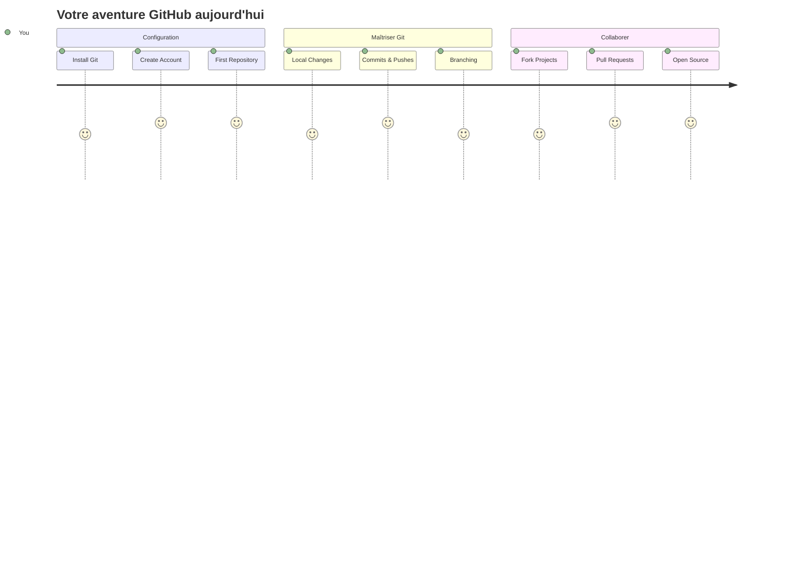
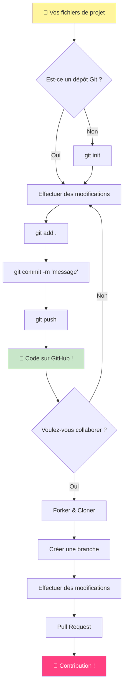
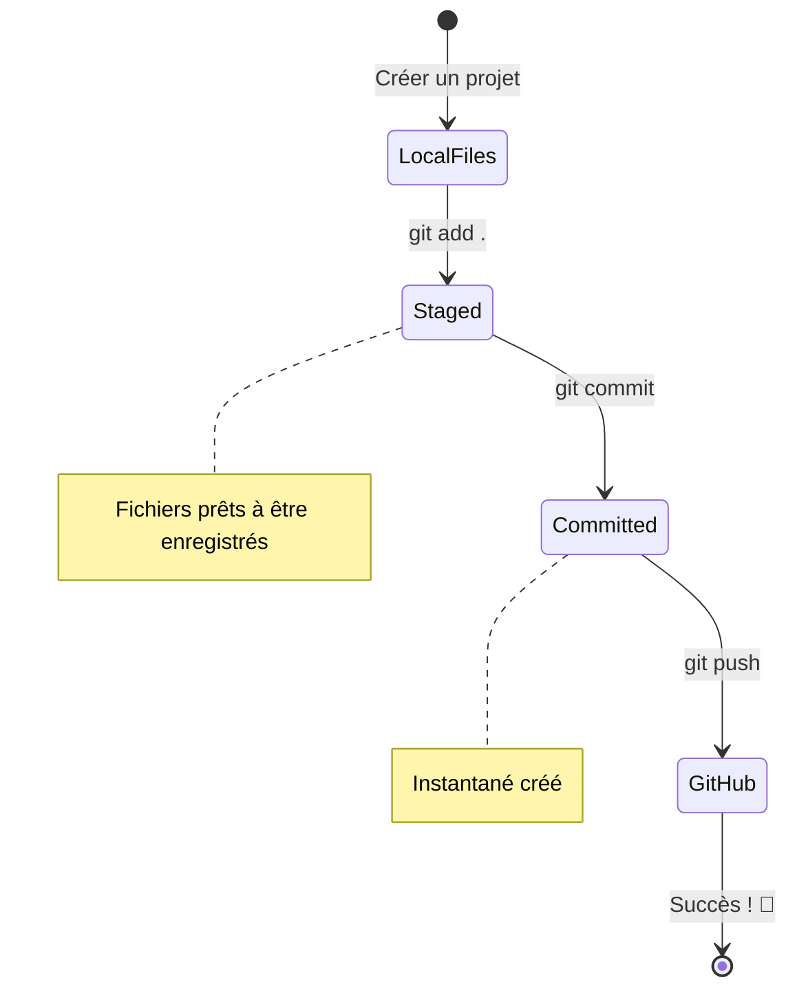
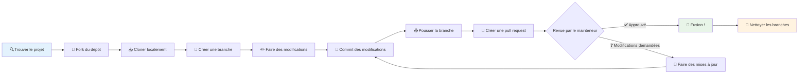
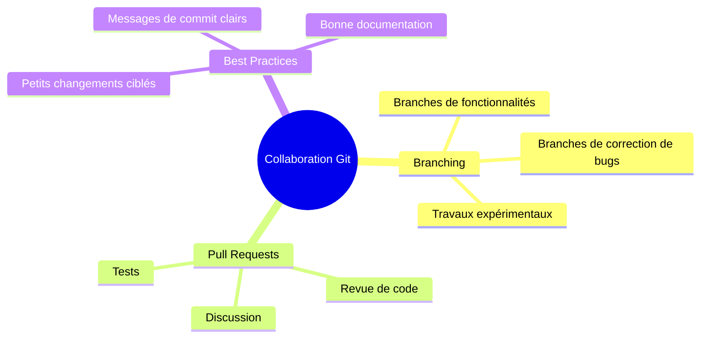
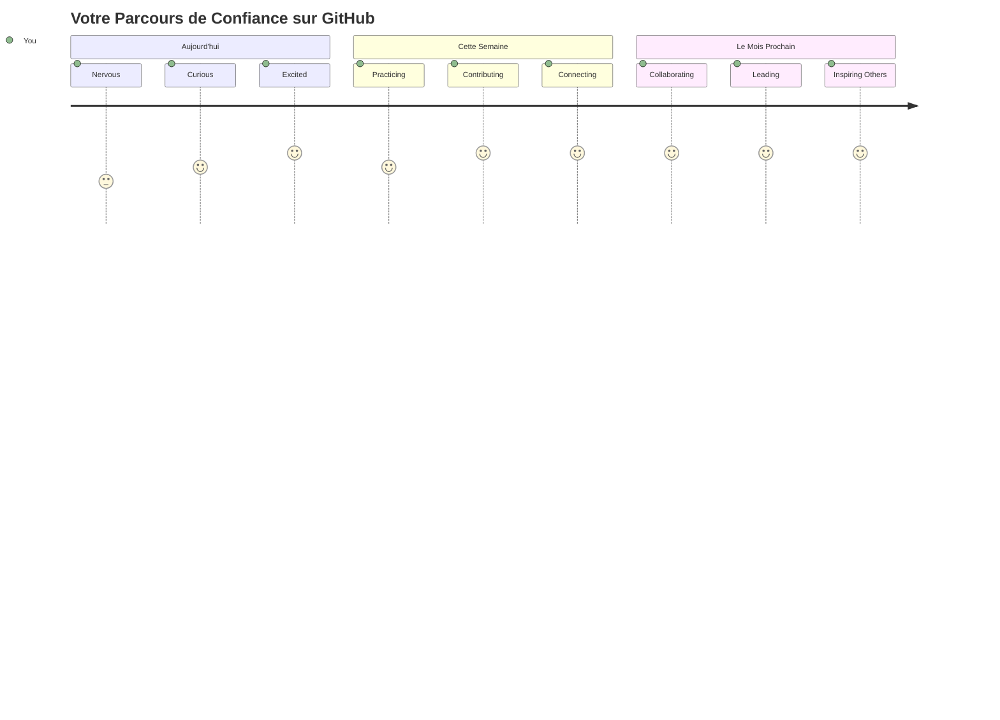

<!--
CO_OP_TRANSLATOR_METADATA:
{
  "original_hash": "5c383cc2cc23bb164b06417d1c107a44",
  "translation_date": "2026-01-06T06:59:03+00:00",
  "source_file": "1-getting-started-lessons/2-github-basics/README.md",
  "language_code": "fr"
}
-->
# Introduction à GitHub

Salut toi, futur développeur ! 👋 Prêt à rejoindre des millions de codeurs dans le monde ? Je suis vraiment enthousiaste à l'idée de te présenter GitHub – imagine-le comme le réseau social des programmeurs, sauf qu'au lieu de partager des photos de ton déjeuner, nous partageons du code et construisons des choses incroyables ensemble !

Voici ce qui me fascine vraiment : chaque application sur ton téléphone, chaque site web que tu visites, et la plupart des outils que tu vas apprendre à utiliser ont été créés par des équipes de développeurs collaborant sur des plateformes comme GitHub. Cette appli musicale que tu adores ? Quelqu’un comme toi y a contribué. Ce jeu auquel tu ne peux pas résister ? Yep, il a probablement été créé grâce à une collaboration sur GitHub. Et maintenant, TU vas apprendre à faire partie de cette communauté incroyable !

Je sais que tout cela peut sembler beaucoup au début – franchement, je me souviens avoir regardé ma première page GitHub en me disant « Mais qu’est-ce que tout ça veut dire ? » Mais voilà la chose : chaque développeur a commencé exactement là où tu es à cet instant. À la fin de cette leçon, tu auras ton propre dépôt GitHub (pense à ça comme ta vitrine personnelle de projets dans le cloud), et tu sauras comment sauvegarder ton travail, le partager avec d’autres, et même contribuer à des projets utilisés par des millions de personnes.

Nous allons faire ce voyage ensemble, étape par étape. Pas de précipitation, pas de pression – juste toi, moi, et quelques outils vraiment sympas qui vont devenir tes nouveaux meilleurs amis !


> Sketchnote par [Tomomi Imura](https://twitter.com/girlie_mac)


## Quiz Avant la Leçon
[Pre-lecture quiz](https://ff-quizzes.netlify.app)

## Introduction

Avant de plonger dans les choses vraiment passionnantes, préparons ton ordinateur pour un peu de magie GitHub ! Imagine ça comme organiser tes fournitures d’art avant de créer un chef-d’œuvre – avoir les bons outils à portée de main rend tout plus fluide et bien plus amusant.

Je vais te guider personnellement à travers chaque étape de l’installation, et je te promets que ce n’est pas aussi intimidant que ça en a l’air au premier abord. Si quelque chose ne fait pas sens tout de suite, c’est complètement normal ! Je me souviens avoir configuré mon premier environnement de développement et avoir eu l’impression d’essayer de lire des hiéroglyphes anciens. Chaque développeur est passé exactement par là où tu es maintenant, se demandant s’il faisait les choses correctement. Spoiler : si tu es là en train d’apprendre, c’est que tu fais déjà les choses correctement ! 🌟

Dans cette leçon, nous allons couvrir :

- suivre le travail que tu fais sur ta machine
- travailler sur des projets avec d’autres
- comment contribuer à des logiciels open source

### Prérequis

Préparons ton ordinateur pour un peu de magie GitHub ! Ne t’inquiète pas – cette configuration ne se fait qu’une seule fois, et ensuite tu seras prêt pour toute ta carrière de codeur.

Bien, commençons par la base ! D’abord, il faut vérifier si Git est déjà présent sur ton ordinateur. Git, c’est un peu comme avoir un assistant super intelligent qui se souvient de chaque modification que tu fais dans ton code – bien mieux que d’appuyer frénétiquement sur Ctrl+S toutes les deux secondes (on est tous passés par là !).

Vérifions si Git est déjà installé en tapant cette commande magique dans ton terminal :  
`git --version`

Si Git n’est pas encore là, pas de panique ! Va simplement sur [télécharger Git](https://git-scm.com/downloads) et télécharge-le. Une fois installé, il faut bien présenter Git :

> 💡 **Configuration Initiale** : Ces commandes indiquent à Git qui tu es. Ces informations seront liées à chaque commit que tu feras, alors choisis un nom et un e-mail que tu es à l’aise de partager publiquement.

```bash
git config --global user.name "your-name"
git config --global user.email "your-email"
```

Pour vérifier si Git est déjà configuré, tu peux taper :  
```bash
git config --list
```
  
Tu auras aussi besoin d’un compte GitHub, d’un éditeur de code (comme Visual Studio Code), et tu devras ouvrir ton terminal (ou : invite de commandes).

Va sur [github.com](https://github.com/) et crée un compte si tu n’en as pas déjà un, ou connecte-toi et complète ton profil.

💡 **Astuce moderne** : Pense à configurer des [clés SSH](https://docs.github.com/en/authentication/connecting-to-github-with-ssh) ou utiliser [GitHub CLI](https://cli.github.com/) pour une authentification plus simple sans mots de passe.

✅ GitHub n’est pas le seul dépôt de code au monde ; il en existe d’autres, mais GitHub est le plus connu.

### Préparation

Tu auras besoin à la fois d’un dossier avec un projet de code sur ta machine locale (laptop ou PC), et d’un dépôt public sur GitHub, qui servira d’exemple pour apprendre à contribuer aux projets des autres.

### Sécuriser Ton Code

Parlons un instant de sécurité – mais ne t’inquiète pas, on ne va pas te submerger avec des trucs effrayants ! Pense à ces pratiques de sécurité comme à verrouiller ta voiture ou ta maison. Ce sont des habitudes simples qui deviennent naturelles et qui protègent ton travail acharné.

Nous allons te montrer les manières modernes et sécurisées de travailler avec GitHub dès le début. Comme ça, tu prendras de bonnes habitudes qui te serviront tout au long de ta carrière de codeur.

Quand tu travailles avec GitHub, il est important de suivre les bonnes pratiques de sécurité :

| Domaine de Sécurité | Meilleure Pratique | Pourquoi c’est Important |
|---------------------|--------------------|-------------------------|
| **Authentification** | Utiliser des clés SSH ou des jetons d’accès personnel | Les mots de passe sont moins sécurisés et sont progressivement abandonnés |
| **Authentification à Deux Facteurs** | Activer la 2FA sur ton compte GitHub | Ajoute une couche supplémentaire de protection du compte |
| **Sécurité des Dépôts** | Ne jamais commettre d’informations sensibles | Les clés API et mots de passe ne doivent jamais être dans des dépôts publics |
| **Gestion des Dépendances** | Activer Dependabot pour les mises à jour | Permet de garder tes dépendances sécurisées et à jour |

> ⚠️ **Rappel Critique de Sécurité** : Ne commets jamais de clés API, mots de passe, ou autres informations sensibles dans un dépôt. Utilise des variables d’environnement et le fichier `.gitignore` pour protéger ces données sensibles.

**Configuration Moderne de l’Authentification :**

```bash
# Générer une clé SSH (algorithme ed25519 moderne)
ssh-keygen -t ed25519 -C "your_email@example.com"

# Configurer Git pour utiliser SSH
git remote set-url origin git@github.com:username/repository.git
```

> 💡 **Astuce de Pro** : Les clés SSH évitent de devoir saisir des mots de passe à répétition et sont plus sécurisées que les méthodes d’authentification traditionnelles.

---

## Gérer Ton Code Comme un Pro

OK, C’EST là que ça devient vraiment excitant ! 🎉 Nous allons apprendre à suivre et gérer ton code comme font les pros, et franchement, c’est l’une de mes parties préférées à enseigner parce que ça change radicalement la donne.

Imagine ça : tu écris une histoire incroyable, et tu veux garder une trace de chaque brouillon, chaque modification géniale, et chaque moment “attends, c’est un coup de génie !” en cours de route. C’est exactement ce que Git fait pour ton code ! C’est comme avoir un carnet de notes de voyage dans le temps qui se souvient de TOUT – chaque frappe, chaque changement, chaque moment “oups, j’ai tout cassé” que tu peux annuler instantanément.

Je vais être honnête – ça peut sembler complexe au début. Quand j’ai commencé, je pensais “Pourquoi je ne peux pas juste sauvegarder comme d’habitude ?” Mais fais-moi confiance : une fois que Git aura fait tilt pour toi (et ça arrivera !), tu auras un de ces moments de révélation où tu te diras “Comment ai-je PU coder sans ça ?” C’est comme découvrir que tu peux voler alors que tu marchais partout toute ta vie !

Supposons que tu as un dossier local avec un projet de code et que tu veux commencer à suivre tes progrès avec git – le système de contrôle de version. Certains comparent l’utilisation de git à écrire une lettre d’amour à ton futur toi. En relisant tes messages de commit des jours, semaines ou mois plus tard, tu pourras te rappeler pourquoi tu as pris telle décision, ou “revenir en arrière” sur un changement – à condition, bien sûr, d’écrire de bons messages de commit.


### Tâche : Crée Ton Premier Dépôt !

> 🎯 **Ta Mission (et je suis trop content pour toi !)** : Nous allons créer ensemble ton tout premier dépôt GitHub ! À la fin de cette étape, tu auras ton petit coin d’internet où ton code vivra, et tu auras effectué ton premier “commit” (c’est le langage des développeurs pour dire que tu as sauvegardé ton travail de façon intelligente).  
>  
> C’est franchement un moment très spécial – tu vas officiellement rejoindre la communauté mondiale des développeurs ! Je me rappelle encore l’excitation de ma première création de repo et de me dire “Wow, je fais vraiment ça !”

Faisons cette aventure ensemble, étape par étape. Prends ton temps pour chaque partie – pas de course, et je te promets que chaque étape aura du sens. Souviens-toi, chaque superstar du code que tu admires était assise exactement là où tu es, sur le point de créer son premier dépôt. C’est trop cool, non ?

> Regarde la vidéo  
>  
> [](https://www.youtube.com/watch?v=9R31OUPpxU4)

**Faisons Ça Ensemble :**

1. **Crée ton dépôt sur GitHub**. Va sur GitHub.com et cherche le bouton vert vif **New** (ou le signe **+** en haut à droite). Clique dessus et choisis **New repository**.

   Voici ce qu’il faut faire :  
   1. Donne un nom à ton dépôt – choisis quelque chose de significatif pour toi !  
   1. Ajoute une description si tu veux (ça aide les autres à comprendre ton projet)  
   1. Décide si tu veux qu’il soit public (tout le monde peut le voir) ou privé (juste pour toi)  
   1. Je te conseille de cocher la case pour ajouter un fichier README – c’est comme la page d’accueil de ton projet  
   1. Clique sur **Create repository** et célèbre – tu viens de créer ton premier repo ! 🎉

2. **Navigue jusqu’à ton dossier de projet**. Ouvre maintenant ton terminal (pas de panique, ce n’est pas aussi effrayant que ça en a l’air !). On doit dire à ton ordinateur où se trouvent tes fichiers de projet. Tape cette commande :

   ```bash
   cd [name of your folder]
   ```

   **Ce qu’on fait ici :**  
   - On dit au fond “Hé ordinateur, emmène-moi dans mon dossier de projet”  
   - C’est comme ouvrir un dossier spécifique sur ton bureau, mais on le fait avec des commandes texte  
   - Remplace `[name of your folder]` par le vrai nom de ton dossier de projet

3. **Transforme ton dossier en dépôt Git**. Ici, c’est là que la magie opère ! Tape :

   ```bash
   git init
   ```

   **Voilà ce qui vient de se passer (c’est pas mal du tout) :**  
   - Git vient de créer un dossier caché `.git` dans ton projet – tu ne le verras pas, mais il est là !  
   - Ton dossier normal devient un “dépôt” capable de suivre chaque modification que tu fais  
   - Pense à ça comme donner des super-pouvoirs à ton dossier pour tout se souvenir

4. **Vérifie ce qui se passe**. Voyons ce que Git pense de ton projet à cet instant :

   ```bash
   git status
   ```

   **Comprendre ce que Git te dit :**  
   
   Tu peux voir quelque chose qui ressemble à ça :

   ```output
   Changes not staged for commit:
   (use "git add <file>..." to update what will be committed)
   (use "git restore <file>..." to discard changes in working directory)

        modified:   file.txt
        modified:   file2.txt
   ```

   **Pas de panique ! Voilà ce que ça veut dire :**  
   - Les fichiers en **rouge** sont ceux qui ont des changements mais ne sont pas prêts à être sauvegardés  
   - Les fichiers en **vert** (quand tu les vois) sont prêts à être sauvegardés  
   - Git t’aide en te disant exactement ce que tu peux faire ensuite

   > 💡 **Astuce de pro** : La commande `git status` est ton meilleur allié ! Utilise-la chaque fois que tu es perdu. C’est comme demander à Git “Hé, quelle est la situation maintenant ?”

5. **Prépare tes fichiers à être sauvegardés** (on appelle ça “staging”) :

   ```bash
   git add .
   ```

   **Ce qu’on vient de faire :**  
   - On a dit à Git “Hey, je veux inclure TOUS mes fichiers dans la prochaine sauvegarde”  
   - Le `.` veut dire “tout ce qu’il y a dans ce dossier”  
   - Maintenant tes fichiers sont “mis en scène” et prêts pour l’étape suivante

   **Tu veux être plus sélectif ?** Tu peux ajouter juste certains fichiers spécifiques :

   ```bash
   git add [file or folder name]
   ```

   **Pourquoi faire ça ?**  
   - Parfois tu veux sauvegarder des changements liés ensemble  
   - Ça t’aide à organiser ton travail en morceaux logiques  
   - Ça rend plus facile de comprendre ce qui a changé et quand

   **Tu as changé d’avis ?** Pas de souci ! Tu peux retirer des fichiers de la mise en scène comme ceci :

   ```bash
   # Désindexer tout
   git reset
   
   # Désindexer un seul fichier
   git reset [file name]
   ```

   Ne t’inquiète pas – ça ne supprime pas ton travail, ça enlève juste les fichiers de la pile “prêt à sauvegarder”.

6. **Sauvegarde ton travail définitivement** (tu fais ton premier commit !) :

   ```bash
   git commit -m "first commit"
   ```

   **🎉 Félicitations ! Tu viens de faire ton premier commit !**  
   
   **Voici ce qui vient de se passer :**  
   - Git a pris un “instantané” de tous tes fichiers mis en scène à ce moment précis  
   - Ton message de commit “first commit” explique ce qu’est ce point de sauvegarde  
   - Git a donné à cet instantané un ID unique pour que tu puisses toujours le retrouver  
   - Tu as officiellement commencé à suivre l’historique de ton projet !

   > 💡 **Messages de commit futurs** : Pour les prochains commits, sois plus descriptif ! Au lieu de “updated stuff”, essaye “Ajout du formulaire de contact sur la page d’accueil” ou “Correction du bug du menu de navigation”. Ton futur toi te remerciera !

7. **Connecte ton projet local à GitHub**. Pour l’instant, ton projet n’existe que sur ton ordinateur. Connectons-le à ton dépôt GitHub pour que tu puisses le partager avec le monde !

   D’abord, va sur la page de ton dépôt GitHub et copie l’URL. Puis reviens ici et tape :

   ```bash
   git remote add origin https://github.com/username/repository_name.git
   ```
   
   (Remplace cette URL par l’URL réelle de ton dépôt !)

   **Ce que nous venons de faire :**
   - Nous avons créé une connexion entre votre projet local et votre dépôt GitHub
   - "Origin" est juste un surnom pour votre dépôt GitHub – c’est comme ajouter un contact dans votre téléphone
   - Maintenant, votre Git local sait où envoyer votre code quand vous êtes prêt à le partager

   💡 **Façon plus simple** : Si vous avez GitHub CLI installé, vous pouvez faire cela en une seule commande :
   ```bash
   gh repo create my-repo --public --push --source=.
   ```

8. **Envoyez votre code sur GitHub** (le grand moment !) :

   ```bash
   git push -u origin main
   ```

   **🚀 Voilà ! Vous téléchargez votre code sur GitHub !**
   
   **Ce qui se passe :**
   - Vos commits voyagent de votre ordinateur vers GitHub
   - L’option `-u` établit une connexion permanente pour que les futurs pushs soient plus simples
   - "main" est le nom de votre branche principale (comme le dossier principal)
   - Après cela, vous pouvez juste taper `git push` pour les futurs envois !

   💡 **Note rapide** : Si votre branche porte un autre nom (comme "master"), utilisez ce nom à la place. Vous pouvez vérifier avec `git branch --show-current`.

9. **Votre nouveau rythme quotidien de codage** (c’est ici que ça devient addictif !) :

   Désormais, chaque fois que vous faites des modifications à votre projet, vous avez cette simple danse en trois étapes :

   ```bash
   git add .
   git commit -m "describe what you changed"
   git push
   ```

   **Cela devient votre rythme de codage :**
   - Faites des changements géniaux dans votre code ✨
   - Mettez-les en scène avec `git add` (« Hé Git, fais attention à ces changements ! »)
   - Enregistrez-les avec `git commit` et un message descriptif (vous vous remerciera à l’avenir !)
   - Partagez-les avec le monde en utilisant `git push` 🚀
   - Rincez et répétez – sérieusement, cela devient aussi naturel que respirer !

   J’adore ce flux de travail parce que c’est comme avoir plusieurs points de sauvegarde dans un jeu vidéo. Vous avez fait un changement que vous aimez ? Commitez-le ! Vous voulez essayer quelque chose de risqué ? Pas de problème – vous pouvez toujours revenir à votre dernier commit si ça tourne mal !

   > 💡 **Astuce** : Vous voudrez peut-être aussi adopter un fichier `.gitignore` pour empêcher certains fichiers que vous ne voulez pas suivre d’apparaître sur GitHub – comme ce fichier de notes que vous stockez dans le même dossier mais qui n’a pas sa place dans un dépôt public. Vous pouvez trouver des modèles de fichiers `.gitignore` sur [.gitignore templates](https://github.com/github/gitignore) ou en créer un avec [gitignore.io](https://www.toptal.com/developers/gitignore).

### 🧠 **Premier enregistrement dans le dépôt : Qu’en avez-vous pensé ?**

**Prenez un moment pour célébrer et réfléchir :**
- Qu’avez-vous ressenti en voyant votre code apparaître sur GitHub pour la première fois ?
- Quelle étape vous a semblé la plus confuse, et laquelle a été étonnamment facile ?
- Pouvez-vous expliquer la différence entre `git add`, `git commit` et `git push` avec vos propres mots ?


> **Rappelez-vous** : Même les développeurs expérimentés oublient parfois les commandes exactes. Apprendre ce flux de travail jusqu’à ce qu’il devienne une habitude demande de la pratique – vous faites du bon boulot !

#### Flux de travail Git modernes

Pensez à adopter ces pratiques modernes :

- **Commits conventionnels** : Utilisez un format standardisé de messages de commit comme `feat:`, `fix:`, `docs:`, etc. En savoir plus sur [conventionalcommits.org](https://www.conventionalcommits.org/)
- **Commits atomiques** : Faites en sorte que chaque commit représente un seul changement logique
- **Commits fréquents** : Commitez souvent avec des messages descriptifs plutôt que des commits volumineux et rares

#### Messages de commit

Une bonne ligne de sujet de commit Git complète la phrase suivante :
Si ce commit est appliqué, il <votre ligne de sujet ici>

Pour le sujet, utilisez l’impératif au présent : "change" et non "changed" ou "changes".  
Comme pour le sujet, dans le corps (optionnel), utilisez aussi l’impératif au présent. Le corps doit inclure la motivation du changement et le comparer au comportement précédent. Vous expliquez le `pourquoi`, pas le `comment`.

✅ Prenez quelques minutes pour parcourir GitHub. Pouvez-vous trouver un message de commit vraiment bien fait ? En trouvez-vous un très minimal ? Quelle information pensez-vous être la plus importante et utile à transmettre dans un message de commit ?

## Travailler avec les autres (La partie fun !)

Accrochez-vous, car C’EST ici que GitHub devient absolument magique ! 🪄 Vous avez maîtrisé la gestion de votre propre code, mais maintenant nous plongeons dans ma partie préférée – collaborer avec des personnes incroyables du monde entier.

Imaginez ceci : vous vous réveillez demain et voyez que quelqu’un à Tokyo a amélioré votre code pendant que vous dormiez. Puis quelqu’un à Berlin corrige un bug qui vous bloquait. L’après-midi, un développeur à São Paulo a ajouté une fonctionnalité à laquelle vous n’aviez même pas pensé. Ce n’est pas de la science-fiction – c’est juste un mardi dans l’univers GitHub !

Ce qui me passionne vraiment, ce sont les compétences de collaboration que vous allez apprendre. Ce sont EXATEMENT les mêmes flux de travail que les équipes de Google, Microsoft, et vos startups préférées utilisent chaque jour. Vous n’apprenez pas juste un outil cool – vous apprenez le langage secret qui fait fonctionner toute la communauté du logiciel ensemble.

Sérieusement, une fois que vous aurez ressenti la joie de voir quelqu’un fusionner votre première pull request, vous comprendrez pourquoi les développeurs sont si passionnés par l’open source. C’est comme faire partie du plus grand projet d’équipe créatif au monde !

> Regardez cette vidéo
>
> [](https://www.youtube.com/watch?v=bFCM-PC3cu8)

La principale raison de mettre des choses sur GitHub était de permettre la collaboration avec d’autres développeurs.


Dans votre dépôt, allez dans `Insights > Community` pour voir comment votre projet se compare aux standards recommandés de la communauté.

Vous voulez rendre votre dépôt professionnel et accueillant ? Rendez-vous sur votre dépôt et cliquez sur `Insights > Community`. Cette fonctionnalité intéressante vous montre comment votre projet se compare à ce que la communauté GitHub considère comme de « bonnes pratiques pour un dépôt ».

> 🎯 **Faites briller votre projet** : Un dépôt bien organisé avec une bonne documentation est comme une vitrine propre et accueillante. Cela montre aux gens que vous vous souciez de votre travail et donne envie aux autres de contribuer !

**Voici ce qui rend un dépôt génial :**

| Quoi ajouter | Pourquoi c’est important | Ce que ça vous apporte |
|-------------|--------------------------|-----------------------|
| **Description** | La première impression compte ! | Les gens savent instantanément à quoi sert votre projet |
| **README** | La page d’accueil de votre projet | Comme un guide touristique amical pour les nouveaux visiteurs |
| **Directives de contribution** | Montre que vous êtes ouvert à l’aide | Les gens savent exactement comment ils peuvent vous aider |
| **Code de conduite** | Crée un espace amical | Tout le monde se sent bienvenu à participer |
| **Licence** | Clarté légale | Les autres savent comment ils peuvent utiliser votre code |
| **Politique de sécurité** | Montre que vous êtes responsable | Démontre des pratiques professionnelles |

> 💡 **Astuce de pro** : GitHub fournit des modèles pour tous ces fichiers. Lors de la création d’un nouveau dépôt, cochez les cases pour générer automatiquement ces fichiers.

**Fonctionnalités GitHub modernes à explorer :**

🤖 **Automatisation & CI/CD :**
- **GitHub Actions** pour les tests automatisés et le déploiement
- **Dependabot** pour les mises à jour automatiques des dépendances

💬 **Communauté & gestion de projet :**
- **GitHub Discussions** pour les conversations communautaires au-delà des issues
- **GitHub Projects** pour la gestion de projet style kanban
- **Règles de protection des branches** pour appliquer les standards de qualité de code

Toutes ces ressources seront utiles pour intégrer de nouveaux membres dans l’équipe. Et ce sont généralement les aspects que les nouveaux contributeurs regardent avant même de scruter votre code, pour savoir si votre projet est l’endroit où ils veulent passer leur temps.

✅ Les fichiers README, bien qu’ils prennent du temps à préparer, sont souvent négligés par les mainteneurs occupés. Pouvez-vous trouver un exemple particulièrement descriptif ? Note : il existe des [outils pour créer de bons README](https://www.makeareadme.com/) que vous pourriez aimer essayer.

### Tâche : Fusionner du code

Les documents de contribution aident les gens à contribuer au projet. Ils expliquent quels types de contributions vous recherchez et comment fonctionne le processus. Les contributeurs devront passer par plusieurs étapes pour pouvoir contribuer à votre repo sur GitHub :

1. **Forker votre repo** Vous voudrez probablement que les gens _forkent_ votre projet. Forker signifie créer une réplique de votre dépôt sur leur profil GitHub.
1. **Cloner**. Ensuite, ils cloneront le projet sur leur machine locale.
1. **Créer une branche**. Vous devrez leur demander de créer une _branche_ pour leur travail.
1. **Concentrez leur changement sur une seule zone**. Demandez aux contributeurs de se concentrer sur une seule chose à la fois – ainsi, les chances que vous puissiez _fusionner_ leur travail sont plus élevées. Imaginez qu’ils écrivent un correctif, ajoutent une nouvelle fonctionnalité, et mettent à jour plusieurs tests – que faire si vous voulez, ou ne pouvez, en implémenter que 2 sur 3, ou 1 sur 3 changements ?

✅ Imaginez une situation où les branches sont particulièrement critiques pour écrire et livrer du bon code. À quels cas d’usage pouvez-vous penser ?

> Notez, soyez le changement que vous voulez voir dans le monde, et créez aussi des branches pour votre propre travail. Tous les commits que vous faites le seront sur la branche sur laquelle vous êtes actuellement « checked out ». Utilisez `git status` pour voir sur quelle branche vous êtes.

Passons en revue un flux de travail de contributeur. Supposons que le contributeur ait déjà _forké_ et _clonné_ le repo, donc qu’il ait un dépôt Git prêt à être travaillé sur sa machine locale :

1. **Créer une branche**. Utilisez la commande `git branch` pour créer une branche qui contiendra les changements qu’il souhaite contribuer :

   ```bash
   git branch [branch-name]
   ```

   > 💡 **Approche moderne** : Vous pouvez aussi créer et passer à la nouvelle branche en une seule commande :
   ```bash
   git switch -c [branch-name]
   ```

1. **Passer à la branche de travail**. Switcher sur la branche spécifiée et mettre à jour le répertoire de travail avec `git switch` :

   ```bash
   git switch [branch-name]
   ```

   > 💡 **Note moderne** : `git switch` est le remplaçant moderne de `git checkout` pour changer de branches. C’est plus clair et plus sûr pour les débutants.

1. **Faire le travail**. À ce stade, vous voulez ajouter vos changements. N’oubliez pas d’en informer Git avec les commandes suivantes :

   ```bash
   git add .
   git commit -m "my changes"
   ```

   > ⚠️ **Qualité du message de commit** : Assurez-vous de donner un bon nom à votre commit, autant pour vous que pour le mainteneur du repo que vous aidez. Soyez précis sur ce que vous avez changé !

1. **Combiner votre travail avec la branche `main`**. À un moment donné vous aurez fini de travailler et voudrez combiner votre travail avec celui de la branche `main`. La branche `main` aura peut-être changé entre-temps, alors assurez-vous d’abord de la mettre à jour avec les commandes suivantes :

   ```bash
   git switch main
   git pull
   ```

   À ce stade, vous voulez vous assurer que tous les _conflits_, situations où Git ne peut pas facilement _combiner_ les changements, aient lieu dans votre branche de travail. Exécutez donc les commandes suivantes :

   ```bash
   git switch [branch_name]
   git merge main
   ```

   La commande `git merge main` va intégrer tous les changements depuis `main` dans votre branche. Espérons que vous pouvez continuer normalement. Sinon, VS Code vous indiquera où Git est _confus_ et vous devrez modifier les fichiers concernés pour indiquer quel contenu est le plus correct.

   💡 **Alternative moderne** : Envisagez d’utiliser `git rebase` pour un historique plus propre :
   ```bash
   git rebase main
   ```
   Cela rejoue vos commits par-dessus la branche main la plus récente, créant un historique linéaire.

1. **Envoyer votre travail sur GitHub**. Envoyer votre travail sur GitHub signifie deux choses : pousser votre branche vers votre repo puis ouvrir une PR, Pull Request.

   ```bash
   git push --set-upstream origin [branch-name]
   ```

   La commande ci-dessus crée la branche sur votre fork.

### 🤝 **Vérification des compétences de collaboration : Prêt à travailler avec les autres ?**

**Voyons comment vous vous sentez à propos de la collaboration :**
- L’idée de forker et faire des pull requests vous paraît-elle claire maintenant ?
- Qu’est-ce que vous voulez pratiquer davantage concernant le travail avec les branches ?
- À quel point vous sentez-vous à l’aise de contribuer au projet de quelqu’un d’autre ?


> **Booster de confiance** : Chaque développeur que vous admirez était un jour nerveux à propos de sa première pull request. La communauté GitHub est incroyablement accueillante envers les débutants !

1. **Ouvrir une PR**. Ensuite, vous voudrez ouvrir une PR. Pour cela, allez dans le dépôt forké sur GitHub. Vous verrez une indication sur GitHub vous demandant si vous voulez créer une nouvelle PR, cliquez dessus, vous êtes redirigé vers une interface où vous pouvez modifier le titre du message de commit, lui donner une description plus appropriée. Maintenant, le mainteneur du dépôt que vous avez forké verra cette PR et _croisons les doigts_ qu’il apprécie et _fusionne_ votre PR. Vous êtes maintenant un contributeur, yay :)

   💡 **Astuce moderne** : Vous pouvez aussi créer des PR avec GitHub CLI :
   ```bash
   gh pr create --title "Your PR title" --body "Description of changes"
   ```

   🔧 **Bonnes pratiques pour les PRs** :
   - Liez aux issues associées avec des mots-clés comme "Fixes #123"
   - Ajoutez des captures d’écran pour les changements d’interface
   - Demandez des relecteurs spécifiques
   - Utilisez des PR brouillons pour le travail en cours
   - Assurez-vous que tous les tests CI passent avant de demander une revue
1. **Nettoyage**. Il est considéré comme une bonne pratique de _nettoyer_ après avoir réussi à fusionner une PR. Vous voulez nettoyer à la fois votre branche locale et la branche que vous avez poussée sur GitHub. Commençons par la supprimer localement avec la commande suivante : 

   ```bash
   git branch -d [branch-name]
   ```

   Assurez-vous ensuite d’aller sur la page GitHub du dépôt forké et de supprimer la branche distante que vous venez d’y pousser.

`Pull request` semble être un terme un peu absurde parce qu'en réalité vous voulez pousser vos changements vers le projet. Mais le mainteneur (propriétaire du projet) ou l'équipe principale doivent examiner vos modifications avant de les fusionner avec la branche "main" du projet, donc vous demandez en fait une décision de changement à un mainteneur.  

Une pull request est l’endroit pour comparer et discuter des différences introduites sur une branche avec des revues, commentaires, tests intégrés, et plus encore. Une bonne pull request suit à peu près les mêmes règles qu’un message de commit. Vous pouvez ajouter une référence à un problème dans le gestionnaire d’issues, lorsque votre travail par exemple corrige un problème. Cela se fait en utilisant un `#` suivi du numéro de votre issue. Par exemple `#97`.

🤞Croisons les doigts pour que tous les contrôles passent et que le(s) propriétaire(s) du projet fusionnent vos modifications dans le projet🤞

Mettez à jour votre branche de travail locale actuelle avec tous les nouveaux commits de la branche distante correspondante sur GitHub :

`git pull`

## Contribuer à l’Open Source (Votre chance de faire la différence !)

Êtes-vous prêt pour quelque chose qui va absolument vous épater ? 🤯 Parlons de contribuer aux projets open source – et j’ai des frissons rien que d’y penser à partager ça avec vous !

C’est votre chance de faire partie de quelque chose de vraiment extraordinaire. Imaginez améliorer les outils que des millions de développeurs utilisent chaque jour, ou corriger un bug dans une application que vos amis adorent. Ce n’est pas juste un rêve – c’est ce qu’implique la contribution open source !

Voici ce qui me donne des frissons à chaque fois que j’y pense : chaque outil que vous avez appris à utiliser – votre éditeur de code, les frameworks que nous allons explorer, même le navigateur dans lequel vous lisez ceci – a commencé avec quelqu’un exactement comme vous faisant sa toute première contribution. Ce développeur brillant qui a créé votre extension VS Code préférée ? Il était autrefois un débutant cliquant sur "create pull request" avec des mains tremblantes, tout comme vous êtes sur le point de le faire.

Et voici la partie la plus belle : la communauté open source est comme le plus gros câlin collectif d’Internet. La plupart des projets recherchent activement des nouveaux venus et ont des issues étiquetées "good first issue" spécialement pour des personnes comme vous ! Les mainteneurs s’enthousiasment vraiment quand ils voient de nouveaux contributeurs parce qu’ils se souviennent de leurs propres premiers pas.

```mermaid
flowchart TD
    A[🔍 Explorer GitHub] --> B[🏷️ Trouver "bonne première issue"]
    B --> C[📖 Lire les directives de contribution]
    C --> D[🍴 Fork du dépôt]
    D --> E[💻 Configurer l'environnement local]
    E --> F[🌿 Créer une branche de fonctionnalité]
    F --> G[✨ Faire votre contribution]
    G --> H[🧪 Tester vos modifications]
    H --> I[📝 Écrire un commit clair]
    I --> J[📤 Pousser & créer une PR]
    J --> K[💬 Interagir avec les retours]
    K --> L[🎉 Fusionné ! Vous êtes un contributeur !]
    L --> M[🌟 Trouver la prochaine issue]
    
    style A fill:#e1f5fe
    style L fill:#c8e6c9
    style M fill:#fff59d
```
Vous n’êtes pas juste en train d’apprendre à coder ici – vous vous préparez à rejoindre une famille mondiale de bâtisseurs qui se réveillent tous les jours en se demandant "Comment pouvons-nous rendre le monde numérique un peu meilleur ?" Bienvenue dans le club ! 🌟

Tout d’abord, trouvons un dépôt (ou **repo**) sur GitHub qui vous intéresse et auquel vous aimeriez contribuer un changement. Vous voudrez copier son contenu sur votre machine.

✅ Un bon moyen de trouver des dépôts "accessibles aux débutants" est de [chercher avec le tag 'good-first-issue'](https://github.blog/2020-01-22-browse-good-first-issues-to-start-contributing-to-open-source/).


Il existe plusieurs façons de copier du code. Une façon est de "cloner" le contenu du dépôt, en utilisant HTTPS, SSH, ou l’interface en ligne de commande GitHub CLI.

Ouvrez votre terminal et clonez le dépôt comme suit :
```bash
# Utilisation de HTTPS
git clone https://github.com/ProjectURL

# Utilisation de SSH (nécessite la configuration d'une clé SSH)
git clone git@github.com:username/repository.git

# Utilisation de l'interface GitHub CLI
gh repo clone username/repository
```

Pour travailler sur le projet, basculez dans le bon dossier :
`cd ProjectURL`

Vous pouvez aussi ouvrir le projet entier en utilisant :
- **[GitHub Codespaces](https://github.com/features/codespaces)** – L’environnement de développement cloud de GitHub avec VS Code dans le navigateur
- **[GitHub Desktop](https://desktop.github.com/)** – Une application GUI pour les opérations Git  
- **[GitHub.dev](https://github.dev)** – Appuyez sur la touche `.` sur n’importe quel repo GitHub pour ouvrir VS Code dans le navigateur
- **VS Code** avec l’extension des Pull Requests GitHub

Enfin, vous pouvez télécharger le code dans un dossier compressé.

### Quelques autres choses intéressantes sur GitHub

Vous pouvez mettre une étoile, suivre et/ou "forker" n’importe quel dépôt public sur GitHub. Vous pouvez trouver vos dépôts étoilés dans le menu déroulant en haut à droite. C’est comme un favori, mais pour du code.

Les projets ont un gestionnaire d’issues, principalement sur GitHub dans l’onglet "Issues" sauf indication contraire, où les gens discutent des problèmes liés au projet. Et l’onglet Pull Requests est l’endroit où l’on discute et révise les changements en cours.

Les projets peuvent aussi avoir des discussions dans des forums, listes de diffusion, ou canaux de chat tels que Slack, Discord ou IRC.

🔧 **Fonctionnalités modernes de GitHub** :
- **GitHub Discussions** – Forum intégré pour les conversations communautaires
- **GitHub Sponsors** – Soutien financier aux mainteneurs  
- **Onglet Sécurité** – Rapports de vulnérabilités et avis de sécurité
- **Onglet Actions** – Voir les workflows automatisés et pipelines CI/CD
- **Onglet Insights** – Analyses sur les contributeurs, commits, et santé du projet
- **Onglet Projets** – Outils intégrés de gestion de projet GitHub

✅ Explorez votre nouveau dépôt GitHub et essayez quelques fonctionnalités, comme modifier les paramètres, ajouter des informations à votre dépôt, créer un projet (comme un tableau Kanban), et configurer GitHub Actions pour l’automatisation. Il y a beaucoup à faire !

---

## 🚀 Défi

D’accord, il est temps de mettre à l’épreuve vos nouveaux super pouvoirs GitHub ! 🚀 Voici un défi qui va faire que tout s’emboîte de la manière la plus satisfaisante :

Prenez un ami (ou ce membre de la famille qui vous demande toujours ce que vous faites avec tout ce "truc d’ordinateur") et lancez-vous dans une aventure de codage collaborative ! C’est là que la vraie magie opère – créez un projet, laissez-les faire un fork, créez quelques branches, et fusionnez des changements comme les pros que vous devenez.

Je ne vais pas mentir – vous allez probablement rire à un moment donné (surtout quand vous essayerez tous les deux de modifier la même ligne), peut-être vous gratter la tête par confusion, mais vous aurez définitivement ces moments "aha !" incroyables qui rendent tout l’apprentissage utile. De plus, il y a quelque chose de spécial à partager ce premier merge réussi avec quelqu’un d’autre – c’est comme une petite célébration de votre progression !

Vous n’avez pas encore de compagnon de code ? Pas de souci ! La communauté GitHub est remplie de personnes incroyablement accueillantes qui se souviennent comment c’était d’être débutant. Cherchez des dépôts avec l’étiquette "good first issue" – c’est en gros un "Hé débutants, venez apprendre avec nous !" C’est génial, non ?

## Quiz post-conférence
[Quiz post-conférence](https://ff-quizzes.netlify.app/web/en/)

## Révision & Continuer à apprendre

Ouf ! 🎉 Regardez-vous – vous venez de maîtriser les bases de GitHub comme un vrai champion ! Si votre cerveau est un peu plein en ce moment, c’est tout à fait normal et honnêtement un bon signe. Vous venez d’apprendre des outils qui m’ont pris des semaines à maîtriser quand j’ai commencé.

Git et GitHub sont incroyablement puissants (vraiment puissants), et chaque développeur que je connais – y compris ceux qui semblent être des sorciers maintenant – a dû s’entraîner et tâtonner un peu avant que tout ne clique. Le fait que vous ayez terminé cette leçon signifie que vous êtes déjà en route pour maîtriser certains des outils les plus importants dans la boîte à outils d’un développeur.

Voici quelques ressources absolument fantastiques pour vous entraîner et devenir encore plus génial :

- [Guide pour contribuer à un logiciel open source](https://opensource.guide/how-to-contribute/#how-to-submit-a-contribution) – Votre feuille de route pour faire la différence
- [Cheatsheet Git](https://training.github.com/downloads/github-git-cheat-sheet/) – Gardez-la à portée de main pour référence rapide !

Et rappelez-vous : la pratique fait progresser, pas la perfection ! Plus vous utilisez Git et GitHub, plus cela devient naturel. GitHub a créé des cours interactifs étonnants qui vous permettent de pratiquer dans un environnement sécurisé :

- [Introduction à GitHub](https://github.com/skills/introduction-to-github)
- [Communiquer avec Markdown](https://github.com/skills/communicate-using-markdown)  
- [Pages GitHub](https://github.com/skills/github-pages)
- [Gérer les conflits de fusion](https://github.com/skills/resolve-merge-conflicts)

**Envie d’aventure ? Découvrez ces outils modernes :**
- [Documentation GitHub CLI](https://cli.github.com/manual/) – Pour quand vous voulez vous sentir comme un magicien de la ligne de commande
- [Documentation GitHub Codespaces](https://docs.github.com/en/codespaces) – Codez dans le cloud !
- [Documentation GitHub Actions](https://docs.github.com/en/actions) – Automatisez tout
- [Bonnes pratiques Git](https://www.atlassian.com/git/tutorials/comparing-workflows) – Améliorez votre workflow

## Défi GitHub Copilot Agent 🚀

Utilisez le mode Agent pour compléter le défi suivant :

**Description :** Créez un projet de développement web collaboratif qui démontre le workflow complet GitHub que vous avez appris dans cette leçon. Ce défi vous aidera à pratiquer la création de dépôts, les fonctionnalités de collaboration, et les workflows Git modernes dans un scénario réel.

**Consigne :** Créez un nouveau dépôt public GitHub pour un projet simple "Ressources de développement web". Le dépôt doit inclure un fichier README.md bien structuré listant les outils et ressources utiles pour le développement web, organisés par catégories (HTML, CSS, JavaScript, etc.). Configurez le dépôt avec les bonnes pratiques communautaires incluant une licence, des directives de contribution, et un code de conduite. Créez au moins deux branches de fonctionnalité : une pour ajouter des ressources CSS et une autre pour les ressources JavaScript. Faites des commits sur chaque branche avec des messages de commit descriptifs, puis créez des pull requests pour fusionner les changements vers main. Activez les fonctionnalités GitHub comme Issues, Discussions, et configurez un workflow GitHub Actions simple pour les vérifications automatisées.

## Mission

Votre mission, si vous l’acceptez : Terminez le cours [Introduction à GitHub](https://github.com/skills/introduction-to-github) sur GitHub Skills. Ce cours interactif vous permettra de pratiquer tout ce que vous avez appris dans un environnement sécurisé et guidé. De plus, vous obtiendrez un badge sympa à la fin ! 🏅

**Envie de relever plus de défis ?**
- Configurez l’authentification SSH pour votre compte GitHub (plus besoin de mot de passe !)
- Essayez d’utiliser le GitHub CLI pour vos opérations Git quotidiennes
- Créez un dépôt avec un workflow GitHub Actions
- Explorez GitHub Codespaces en ouvrant ce dépôt même dans un éditeur cloud

---

## 🚀 Votre calendrier de maîtrise GitHub

### ⚡ **Ce que vous pouvez faire dans les 5 prochaines minutes**
- [ ] Mettre une étoile à ce dépôt et à 3 autres projets qui vous intéressent
- [ ] Activer l’authentification à deux facteurs sur votre compte GitHub
- [ ] Créer un README simple pour votre premier dépôt
- [ ] Suivre 5 développeurs dont le travail vous inspire

### 🎯 **Ce que vous pouvez accomplir cette heure**
- [ ] Terminer le quiz post-leçon et réfléchir à votre parcours GitHub
- [ ] Configurer les clés SSH pour une authentification GitHub sans mot de passe
- [ ] Faire votre premier commit significatif avec un bon message de commit
- [ ] Explorer l’onglet "Explore" de GitHub pour découvrir des projets tendance
- [ ] Pratiquer le fork d’un dépôt et effectuer un petit changement

### 📅 **Votre aventure GitHub sur une semaine**
- [ ] Terminer les cours GitHub Skills (Introduction à GitHub, Markdown)
- [ ] Faire votre première pull request sur un projet open source
- [ ] Configurer un site GitHub Pages pour présenter votre travail
- [ ] Participer aux Discussions GitHub sur des projets que vous aimez
- [ ] Créer un dépôt avec les bonnes pratiques communautaires (README, Licence, etc.)
- [ ] Tester GitHub Codespaces pour le développement dans le cloud

### 🌟 **Votre transformation GitHub sur un mois**
- [ ] Contribuer à 3 projets open source différents
- [ ] Encadrer quelqu’un de nouveau sur GitHub (transmettre le flambeau !)
- [ ] Mettre en place des workflows automatisés avec GitHub Actions
- [ ] Construire un portfolio montrant vos contributions GitHub
- [ ] Participer à Hacktoberfest ou à des événements similaires
- [ ] Devenir mainteneur de votre propre projet auquel d’autres contribuent

### 🎓 **Bilan final de maîtrise GitHub**

**Célébrez votre chemin parcouru :**
- Quelle est votre fonctionnalité préférée de GitHub ?
- Quelle fonctionnalité de collaboration vous enthousiasme le plus ?
- À quel point vous sentez-vous confiant pour contribuer à l’open source maintenant ?
- Quel est le premier projet auquel vous voulez contribuer ?


> 🌍 **Bienvenue dans la communauté mondiale des développeurs !** Vous disposez désormais des outils pour collaborer avec des millions de développeurs à travers le monde. Votre première contribution peut sembler petite, mais souvenez-vous – chaque grand projet open source a commencé avec quelqu’un qui a fait son tout premier commit. La question n’est pas si vous allez avoir un impact, mais quel incroyable projet bénéficiera en premier de votre perspective unique ! 🚀

Souvenez-vous : chaque expert a été un jour débutant. Vous maîtrisez ça ! 💪

---

<!-- CO-OP TRANSLATOR DISCLAIMER START -->
**Avertissement** :
Ce document a été traduit à l’aide du service de traduction automatique [Co-op Translator](https://github.com/Azure/co-op-translator). Bien que nous nous efforçons d’assurer l’exactitude, veuillez noter que les traductions automatiques peuvent contenir des erreurs ou des imprécisions. Le document original dans sa langue d’origine doit être considéré comme la source faisant autorité. Pour les informations cruciales, une traduction professionnelle réalisée par un humain est recommandée. Nous ne sommes pas responsables des malentendus ou des mauvaises interprétations résultant de l’utilisation de cette traduction.
<!-- CO-OP TRANSLATOR DISCLAIMER END -->