<!--
CO_OP_TRANSLATOR_METADATA:
{
  "original_hash": "7f2c48e04754724123ea100a822765e5",
  "translation_date": "2026-01-06T06:51:02+00:00",
  "source_file": "1-getting-started-lessons/3-accessibility/README.md",
  "language_code": "fr"
}
-->
# Créer des pages web accessibles

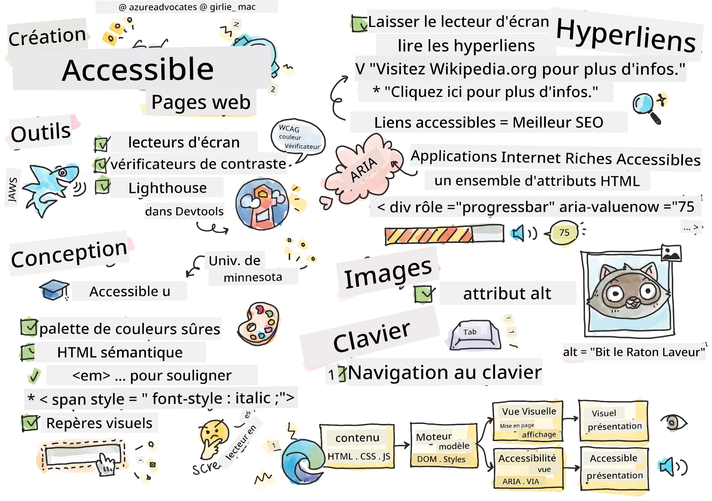
> Sketchnote par [Tomomi Imura](https://twitter.com/girlie_mac)

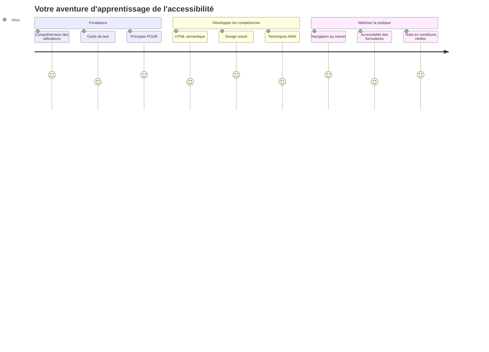
## Quiz avant la conférence
[Quiz avant la conférence](https://ff-quizzes.netlify.app/web/)

> Le pouvoir du Web réside dans son universalité. L'accès pour tous, indépendamment du handicap, est un aspect essentiel.
>
> \- Sir Timothy Berners-Lee, Directeur du W3C et inventeur du World Wide Web

Voici quelque chose qui pourrait vous surprendre : lorsque vous créez des sites web accessibles, vous n'aidez pas seulement les personnes en situation de handicap — vous améliorez en fait le Web pour tout le monde !

Avez-vous déjà remarqué ces découpes sur les trottoirs aux coins des rues ? Elles ont été conçues à l'origine pour les fauteuils roulants, mais elles aident maintenant les personnes avec des poussettes, les livreurs avec des chariots, les voyageurs avec des bagages à roulettes, et aussi les cyclistes. C'est exactement ainsi que fonctionne la conception web accessible — des solutions qui aident un groupe bénéficient souvent à tous. Plutôt cool, non ?

Dans cette leçon, nous allons explorer comment créer des sites web qui fonctionnent vraiment pour tout le monde, peu importe leur manière de naviguer sur le web. Vous découvrirez des techniques pratiques déjà intégrées aux normes web, vous pratiquerez avec des outils de test, et vous verrez comment l'accessibilité rend vos sites plus utilisables pour tous les utilisateurs.

À la fin de cette leçon, vous aurez la confiance nécessaire pour faire de l'accessibilité une partie naturelle de votre flux de développement. Prêt à découvrir comment des choix de conception réfléchis peuvent ouvrir le web à des milliards d'utilisateurs ? Allons-y !

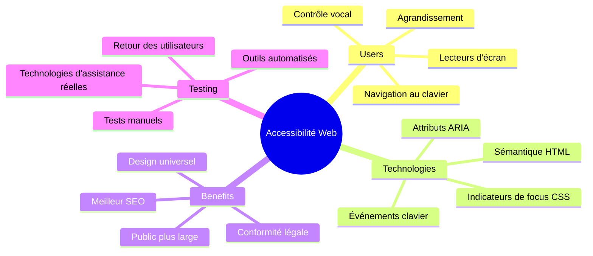
> Vous pouvez suivre cette leçon sur [Microsoft Learn](https://docs.microsoft.com/learn/modules/web-development-101/accessibility/?WT.mc_id=academic-77807-sagibbon) !

## Comprendre les technologies d’assistance

Avant de commencer à coder, prenons un moment pour comprendre comment les personnes avec différentes capacités expérimentent réellement le web. Ce n’est pas juste de la théorie — comprendre ces modes de navigation réels fera de vous un bien meilleur développeur !

Les technologies d’assistance sont des outils assez étonnants qui aident les personnes en situation de handicap à interagir avec les sites web d’une manière qui pourrait vous surprendre. Une fois que vous aurez compris comment ces technologies fonctionnent, créer des expériences web accessibles deviendra beaucoup plus intuitif. C’est comme apprendre à voir votre code à travers les yeux de quelqu’un d’autre.

### Lecteurs d’écran

[Les lecteurs d’écran](https://en.wikipedia.org/wiki/Screen_reader) sont des technologies assez sophistiquées qui convertissent le texte numérique en sortie vocale ou en braille. Bien qu’ils soient principalement utilisés par les personnes malvoyantes, ils sont aussi très utiles pour les utilisateurs ayant des troubles d’apprentissage comme la dyslexie.

Je aime penser à un lecteur d’écran comme à un narrateur très intelligent qui vous lit un livre. Il lit le contenu à voix haute dans un ordre logique, annonce les éléments interactifs tels que « bouton » ou « lien », et fournit des raccourcis clavier pour naviguer rapidement dans une page. Mais voici le truc — les lecteurs d’écran ne peuvent faire leur magie que si nous construisons des sites web avec une structure correcte et un contenu significatif. C’est là que vous intervenez en tant que développeur !

**Lecteurs d’écran populaires sur différentes plateformes :**
- **Windows** : [NVDA](https://www.nvaccess.org/about-nvda/) (gratuit et le plus populaire), [JAWS](https://webaim.org/articles/jaws/), [Narrator](https://support.microsoft.com/windows/complete-guide-to-narrator-e4397a0d-ef4f-b386-d8ae-c172f109bdb1/?WT.mc_id=academic-77807-sagibbon) (intégré)
- **macOS/iOS** : [VoiceOver](https://support.apple.com/guide/voiceover/welcome/10) (intégré et très performant)
- **Android** : [TalkBack](https://support.google.com/accessibility/android/answer/6283677) (intégré)
- **Linux** : [Orca](https://wiki.gnome.org/Projects/Orca) (gratuit et open-source)

**Comment les lecteurs d’écran naviguent dans le contenu web :**

Les lecteurs d’écran offrent plusieurs méthodes de navigation qui rendent la navigation efficace pour les utilisateurs expérimentés :
- **Lecture séquentielle** : Lit le contenu du haut vers le bas, comme un livre
- **Navigation par repères** : Permet de sauter entre les sections de la page (en-tête, navigation, contenu principal, pied de page)
- **Navigation par titres** : Permet de passer d’un titre à l’autre pour comprendre la structure de la page
- **Listes de liens** : Génère une liste de tous les liens pour un accès rapide
- **Contrôles de formulaire** : Navigue directement entre les champs de saisie et les boutons

> 💡 **Voici quelque chose qui m’a bluffé** : 68 % des utilisateurs de lecteurs d’écran naviguent principalement par les titres ([Enquête WebAIM](https://webaim.org/projects/screenreadersurvey9/#finding)). Cela signifie que votre structure de titres est comme une carte routière pour les utilisateurs — quand vous la réussissez, vous aidez littéralement les gens à trouver plus rapidement leur chemin dans votre contenu !

### Construire votre flux de travail de test

Voici une bonne nouvelle — les tests d’accessibilité efficaces ne doivent pas être écrasants ! Vous voudrez combiner des outils automatisés (ils sont fantastiques pour détecter les problèmes évidents) avec des tests manuels. Voici une approche systématique que j’ai trouvée efficace pour détecter le plus de problèmes sans vous prendre toute une journée :

**Flux de travail essentiel pour les tests manuels :**

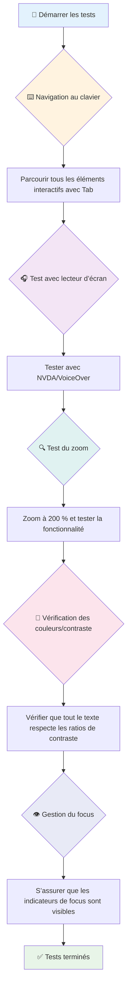
**Liste de vérification étape par étape :**
1. **Navigation au clavier** : Utilisez uniquement Tab, Shift+Tab, Entrée, Espace, et les touches fléchées
2. **Tests avec lecteur d’écran** : Activez NVDA, VoiceOver ou Narrator et naviguez les yeux fermés
3. **Tests de zoom** : Testez aux niveaux de zoom 200 % et 400 %
4. **Vérification du contraste des couleurs** : Contrôlez tout le texte et les composants UI
5. **Tests des indicateurs de focus** : Assurez-vous que tous les éléments interactifs aient des états de focus visibles

✅ **Commencez avec Lighthouse** : Ouvrez les DevTools de votre navigateur, lancez un audit d’accessibilité Lighthouse, puis utilisez les résultats pour guider vos axes de tests manuels.

### Outils de zoom et de grossissement

Vous savez comment parfois vous pincez pour zoomer sur votre téléphone quand le texte est trop petit, ou que vous plissez les yeux devant l’écran de votre portable en plein soleil ? Beaucoup d’utilisateurs comptent sur des outils de grossissement pour rendre le contenu lisible chaque jour. Cela inclut les personnes malvoyantes, les personnes âgées, et toute personne ayant déjà essayé de lire un site web en extérieur.

Les technologies modernes de zoom ont évolué au-delà du simple agrandissement. Comprendre comment ces outils fonctionnent vous aidera à créer des designs responsives qui restent fonctionnels et attrayants à tout niveau de grossissement.

**Fonctionnalités modernes de zoom des navigateurs :**
- **Zoom de page** : Échelle tout le contenu proportionnellement (texte, images, mise en page) - méthode préférée
- **Zoom texte uniquement** : Augmente la taille de la police tout en conservant la mise en page originale
- **Pince pour zoomer** : Support du geste mobile pour un grossissement temporaire
- **Support des navigateurs** : Tous les navigateurs modernes supportent le zoom jusqu’à 500 % sans casser la fonctionnalité

**Logiciels spécialisés de grossissement :**
- **Windows** : [Loupe](https://support.microsoft.com/windows/use-magnifier-to-make-things-on-the-screen-easier-to-see-414948ba-8b1c-d3bd-8615-0e5e32204198) (intégré), [ZoomText](https://www.freedomscientific.com/training/zoomtext/getting-started/)
- **macOS/iOS** : [Zoom](https://www.apple.com/accessibility/mac/vision/) (intégré avec fonctionnalités avancées)

> ⚠️ **Considération de conception** : WCAG requiert que le contenu reste fonctionnel lors d’un zoom à 200 %. À ce niveau, le défilement horizontal doit être minimal, et tous les éléments interactifs doivent rester accessibles.

✅ **Testez votre design responsive** : Zoomez votre navigateur à 200 % et 400 %. Votre mise en page s’adapte-t-elle avec grâce ? Accédez-vous toujours à toutes les fonctionnalités sans défilement excessif ?

## Outils modernes de test d’accessibilité

Maintenant que vous comprenez comment les gens naviguent sur le web avec des technologies d’assistance, découvrons les outils qui vous aident à construire et tester des sites accessibles.

Pensez-y ainsi : les outils automatisés sont excellents pour détecter les problèmes évidents (comme un texte alternatif manquant), tandis que les tests pratiques vous aident à garantir que votre site est agréable à utiliser dans le monde réel. Ensemble, ils vous donnent la confiance que vos sites fonctionnent pour tout le monde.

### Test du contraste des couleurs

Voici une bonne nouvelle : le contraste des couleurs est l’un des problèmes d’accessibilité les plus courants, mais c’est aussi un des plus faciles à corriger. Un bon contraste bénéficie à tout le monde — des utilisateurs malvoyants aux personnes qui essaient de lire leur téléphone à la plage.

**Exigences WCAG pour le contraste :**

| Type de texte | WCAG AA (Minimum) | WCAG AAA (Amélioré) |
|--------------|-------------------|---------------------|
| **Texte normal** (moins de 18pt) | Ratio de contraste 4.5:1 | Ratio de contraste 7:1 |
| **Texte large** (18pt+ ou 14pt+ gras) | Ratio de contraste 3:1 | Ratio de contraste 4.5:1 |
| **Composants UI** (boutons, bordures de formulaire) | Ratio de contraste 3:1 | Ratio de contraste 3:1 |

**Outils essentiels de test :**
- [Colour Contrast Analyser](https://www.tpgi.com/color-contrast-checker/) - Application de bureau avec pipette
- [WebAIM Contrast Checker](https://webaim.org/resources/contrastchecker/) - Web avec retour instantané
- [Stark](https://www.getstark.co/) - Plugin design pour Figma, Sketch, Adobe XD
- [Accessible Colors](https://accessible-colors.com/) - Trouver des palettes de couleurs accessibles

✅ **Créez de meilleures palettes de couleurs** : Commencez avec vos couleurs de marque et utilisez les vérificateurs de contraste pour créer des variations accessibles. Documentez-les comme les tokens couleurs accessibles de votre système de design.

### Audit complet d’accessibilité

Les tests d’accessibilité les plus efficaces combinent plusieurs approches. Aucun outil seul ne détecte tout, donc bâtir une routine de tests avec diverses méthodes assure une couverture complète.

**Tests intégrés au navigateur (DevTools) :**
- **Chrome/Edge** : Audit d’accessibilité Lighthouse + panneau Accessibilité
- **Firefox** : Inspecteur d’accessibilité avec vue détaillée de l’arborescence
- **Safari** : Onglet audit dans l’inspecteur web avec simulation VoiceOver

**Extensions professionnelles de test :**
- [axe DevTools](https://www.deque.com/axe/devtools/) - Test automatisé standard de l’industrie
- [WAVE](https://wave.webaim.org/extension/) - Retour visuel avec surlignage des erreurs
- [Accessibility Insights](https://accessibilityinsights.io/) - Suite complète de test de Microsoft

**Ligne de commande et intégration CI/CD :**
- [axe-core](https://github.com/dequelabs/axe-core) - Bibliothèque JavaScript pour tests automatisés
- [Pa11y](https://pa11y.org/) - Outil CLI de tests d’accessibilité
- [Lighthouse CI](https://github.com/GoogleChrome/lighthouse-ci) - Scoring automatisé de l’accessibilité

> 🎯 **Objectif de test** : Visez un score Lighthouse accessibilité à 95+ comme base. Rappelez-vous, les outils automatisés détectent seulement environ 30-40 % des problèmes d’accessibilité — les tests manuels restent essentiels !

### 🧠 **Bilan de compétences en test : Prêt à trouver des problèmes ?**

**Voyons comment vous vous sentez au sujet des tests d’accessibilité :**
- Quelle méthode de test vous semble la plus abordable pour l’instant ?
- Pouvez-vous imaginer naviguer uniquement au clavier toute une journée ?
- Quel est un obstacle d’accessibilité que vous avez personnellement rencontré en ligne ?

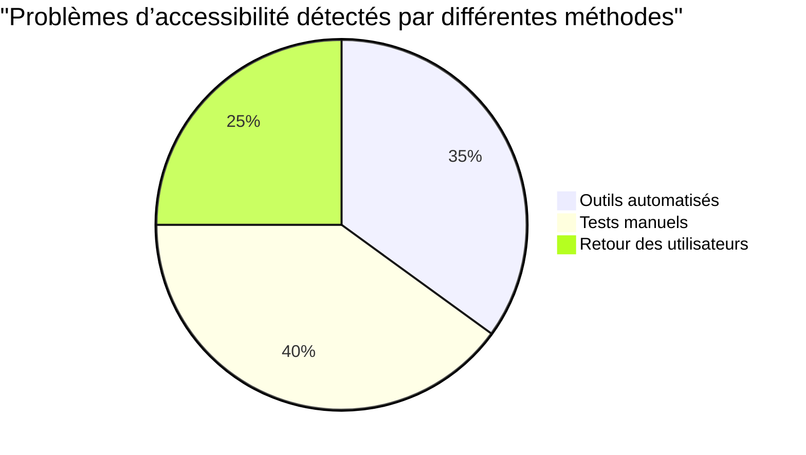
> **Booster de confiance** : Les testeurs professionnels d’accessibilité utilisent exactement cette combinaison de méthodes. Vous apprenez des pratiques standard de l’industrie !

## Construire l’accessibilité dès le départ

La clé du succès en accessibilité est de l’intégrer à votre fondation dès le premier jour. Je sais qu’il est tentant de penser « Je vais ajouter l’accessibilité plus tard », mais c’est un peu comme essayer d’ajouter une rampe à une maison après qu’elle est déjà construite. Possible ? Oui. Facile ? Pas vraiment.

Pensez à l’accessibilité comme à la planification d’une maison — il est bien plus simple d’inclure l’accessibilité aux fauteuils roulants dans vos plans architecturaux initiaux que de tout réaménager plus tard.

### Les principes POUR : Votre fondation d’accessibilité

Les Web Content Accessibility Guidelines (WCAG) sont construites autour de quatre principes fondamentaux qui forment l’acronyme POUR. Pas d’inquiétude — ce ne sont pas des concepts académiques poussiéreux ! Ce sont des directives pratiques pour créer un contenu qui fonctionne pour tout le monde.

Une fois que vous aurez saisi les principes POUR, prendre des décisions d’accessibilité deviendra beaucoup plus intuitif. C’est comme avoir une liste mentale de contrôle qui guide vos choix de conception. Décortiquons-les :

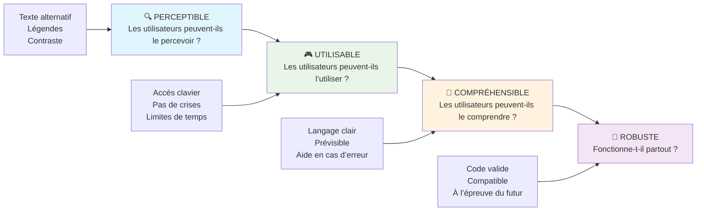
**🔍 Perceptible** : L’information doit être présentable d’une manière que les utilisateurs peuvent percevoir avec leurs sens disponibles

- Fournir des alternatives textuelles pour les contenus non textuels (images, vidéos, audio)
- Assurer un contraste colorimétrique suffisant pour tout le texte et composants UI
- Proposer des sous-titres et transcriptions pour les contenus multimédias
- Concevoir du contenu qui reste fonctionnel lorsqu’il est agrandi jusqu’à 200 %
- Utiliser plusieurs caractéristiques sensorielles (pas seulement la couleur) pour transmettre l’information

**🎮 Opérable** : Tous les composants de l'interface doivent être utilisables via les méthodes d’entrée disponibles

- Rendre toutes les fonctionnalités accessibles via la navigation au clavier
- Fournir aux utilisateurs suffisamment de temps pour lire et interagir avec le contenu
- Éviter le contenu qui provoque des crises ou des troubles vestibulaires
- Aider les utilisateurs à naviguer efficacement avec une structure claire et des repères
- Assurer que les éléments interactifs ont des tailles cibles adéquates (minimum 44px)

**📖 Compréhensible** : L’information et le fonctionnement de l’interface doivent être clairs et compréhensibles

- Utiliser un langage clair et simple adapté à votre public
- S’assurer que le contenu apparaît et fonctionne de manière prévisible et cohérente
- Fournir des instructions claires et messages d’erreur pour les saisies utilisateur
- Aider les utilisateurs à comprendre et corriger les erreurs dans les formulaires
- Organiser le contenu avec un ordre de lecture logique et une hiérarchie d’information

**💪 Robuste** : Le contenu doit fonctionner de manière fiable à travers différentes technologies et dispositifs d'assistance

- **Utiliser un HTML valide et sémantique comme fondation**
- **Assurer la compatibilité avec les technologies d’assistance actuelles et futures**
- **Suivre les standards web et les bonnes pratiques de balisage**
- **Testez sur différents navigateurs, appareils et outils d’assistance**
- **Structurez le contenu pour qu’il se dégrade élégamment lorsque les fonctionnalités avancées ne sont pas prises en charge**

### 🎯 **Vérification des principes POUR : Pour bien les assimiler**

**Réflexion rapide sur les bases :**
- Pouvez-vous penser à une fonctionnalité de site web qui viole chaque principe POUR ?
- Quel principe vous semble le plus naturel en tant que développeur ?
- Comment ces principes pourraient-ils améliorer le design pour tous, pas seulement pour les personnes en situation de handicap ?

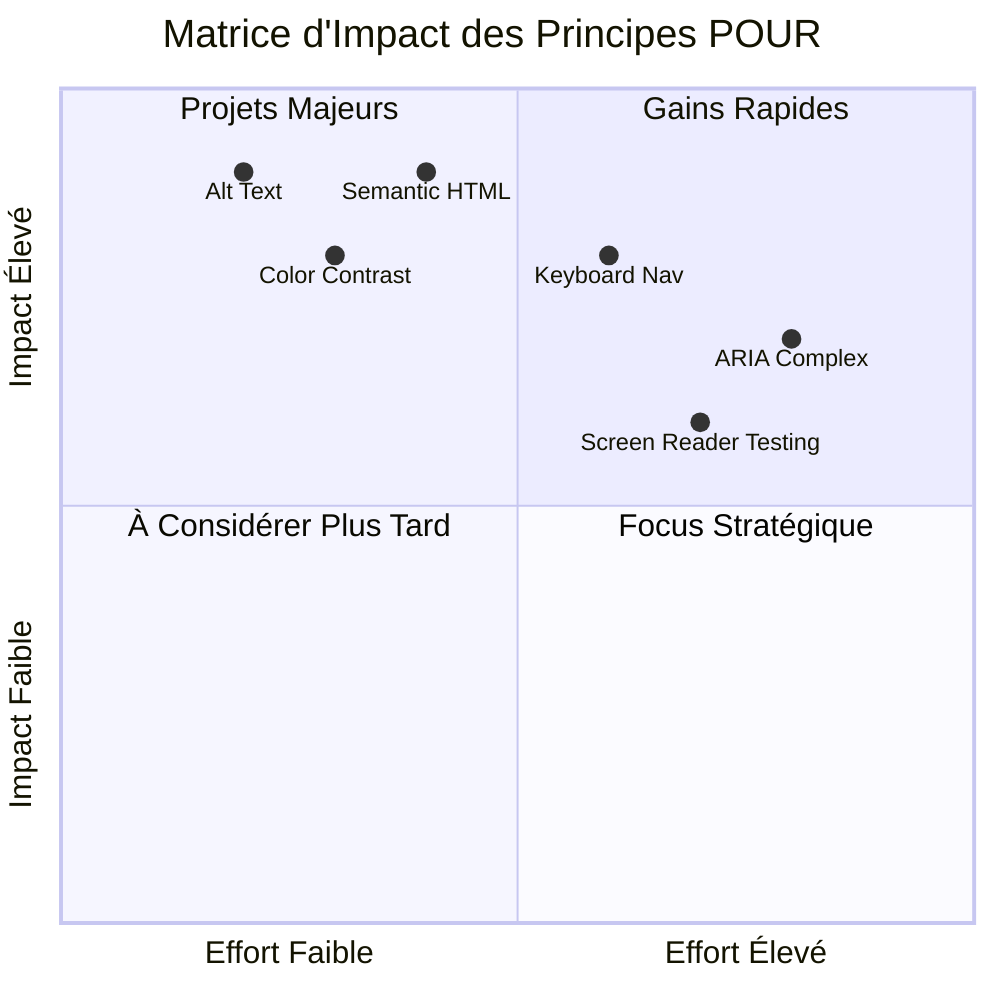
> **Souvenez-vous** : Commencez par des améliorations à fort impact et peu coûteuses. Le HTML sémantique et les textes alternatifs offrent le plus grand gain d’accessibilité pour le moindre effort !

## Créer un design visuel accessible

Un bon design visuel et l’accessibilité vont de pair. Lorsque vous concevez avec l’accessibilité en tête, vous découvrez souvent que ces contraintes mènent à des solutions plus claires et élégantes qui profitent à tous les utilisateurs.

Explorons comment créer des designs visuellement attrayants qui fonctionnent pour tout le monde, quel que soit leur niveau de perception visuelle ou les conditions dans lesquelles ils consultent votre contenu.

### Couleur et stratégies d’accessibilité visuelle

La couleur est un puissant moyen de communication, mais elle ne devrait jamais être le seul moyen de transmettre une information importante. Concevoir au-delà de la couleur crée des expériences plus robustes et inclusives qui fonctionnent dans davantage de situations.

**Concevoir pour les différences de perception des couleurs :**

Environ 8 % des hommes et 0,5 % des femmes présentent une forme de différence de perception des couleurs (souvent appelée « daltonisme »). Les types les plus courants sont :
- **Déuteranopie** : difficulté à distinguer le rouge et le vert
- **Protanopie** : le rouge apparaît plus sombre
- **Tritanopie** : difficulté avec le bleu et le jaune (rare)

**Stratégies de couleur inclusives :**

```css
/* ❌ Bad: Using only color to indicate status */
.error { color: red; }
.success { color: green; }

/* ✅ Good: Color plus icons and context */
.error {
  color: #d32f2f;
  border-left: 4px solid #d32f2f;
}
.error::before {
  content: "⚠️";
  margin-right: 8px;
}

.success {
  color: #2e7d32;
  border-left: 4px solid #2e7d32;
}
.success::before {
  content: "✅";
  margin-right: 8px;
}
```

**Au-delà des exigences de contraste de base :**
- Testez vos choix de couleur avec des simulateurs pour daltoniens
- Utilisez des motifs, textures ou formes en plus du code couleur
- Assurez-vous que les états interactifs restent distincts sans couleur
- Considérez l’apparence de votre design en mode contraste élevé

✅ **Testez l’accessibilité de vos couleurs** : Utilisez des outils comme [Coblis](https://www.color-blindness.com/coblis-color-blindness-simulator/) pour voir comment votre site apparaît aux utilisateurs avec différents types de perception des couleurs.

### Indicateurs de focus et design d’interaction

Les indicateurs de focus sont l’équivalent numérique d’un curseur — ils montrent aux utilisateurs clavier où ils se trouvent sur la page. Des indicateurs de focus bien conçus améliorent l’expérience pour tous en rendant les interactions claires et prévisibles.

**Bonnes pratiques modernes pour les indicateurs de focus :**

```css
/* Enhanced focus styles that work across browsers */
button:focus-visible {
  outline: 2px solid #0066cc;
  outline-offset: 2px;
  box-shadow: 0 0 0 4px rgba(0, 102, 204, 0.25);
}

/* Remove focus outline for mouse users, preserve for keyboard users */
button:focus:not(:focus-visible) {
  outline: none;
}

/* Focus-within for complex components */
.card:focus-within {
  box-shadow: 0 0 0 3px rgba(74, 144, 164, 0.5);
  border-color: #4A90A4;
}

/* Ensure focus indicators meet contrast requirements */
.custom-focus:focus-visible {
  outline: 3px solid #ffffff;
  outline-offset: 2px;
  box-shadow: 0 0 0 6px #000000;
}
```

**Exigences pour l’indicateur de focus :**
- **Visibilité** : doit avoir un rapport de contraste d’au moins 3:1 avec les éléments environnants
- **Largeur** : épaisseur minimale de 2 px autour de l’élément entier
- **Persistance** : doit rester visible jusqu’à ce que le focus se déplace ailleurs
- **Distinction** : doit être visuellement différent des autres états de l’interface utilisateur

> 💡 **Astuce design** : Les excellents indicateurs de focus utilisent souvent une combinaison de contour, ombre portée et changements de couleur pour assurer la visibilité sur différents fonds et contextes.

✅ **Vérifiez vos indicateurs de focus** : Naviguez au clavier sur votre site et notez quels éléments disposent d’indicateurs de focus clairs. Certains sont-ils difficiles à voir ou totalement absents ?

### HTML sémantique : la base de l’accessibilité

Le HTML sémantique, c’est un GPS pour les technologies d’assistance sur votre site web. Lorsque vous utilisez les bons éléments HTML pour leur usage prévu, vous fournissez aux lecteurs d’écran, claviers et autres outils une carte détaillée pour aider les utilisateurs à naviguer efficacement.

Voici une analogie qui m’a beaucoup parlé : le HTML sémantique est la différence entre une bibliothèque bien organisée avec des catégories claires et des panneaux utiles, et un entrepôt où les livres sont dispersés au hasard. Les deux lieux ont les mêmes livres, mais lequel préféreriez-vous pour trouver quelque chose ? Exactement !

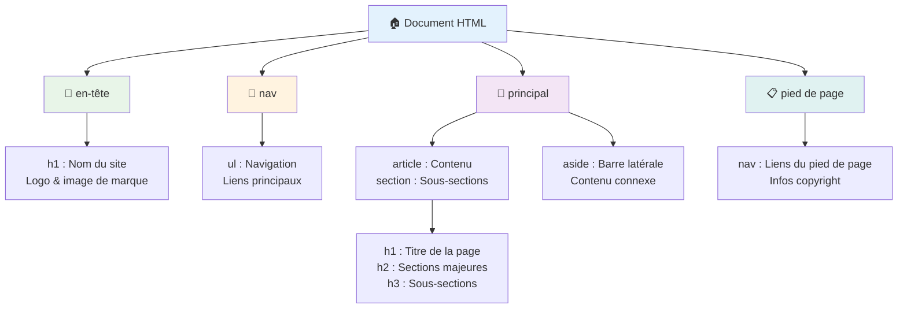
**Blocs fondamentaux de la structure accessible d’une page :**

```html
<!-- Landmark elements provide page navigation structure -->
<header>
  <h1>Your Site Name</h1>
  <nav aria-label="Main navigation">
    <ul>
      <li><a href="/home">Home</a></li>
      <li><a href="/about">About</a></li>
      <li><a href="/services">Services</a></li>
    </ul>
  </nav>
</header>

<main>
  <article>
    <header>
      <h1>Article Title</h1>
      <p>Published on <time datetime="2024-10-14">October 14, 2024</time></p>
    </header>
    
    <section>
      <h2>First Section</h2>
      <p>Content that relates to this section...</p>
    </section>
    
    <section>
      <h2>Second Section</h2>
      <p>More related content...</p>
    </section>
  </article>
  
  <aside>
    <h2>Related Links</h2>
    <nav aria-label="Related articles">
      <ul>
        <li><a href="/related-1">First related article</a></li>
        <li><a href="/related-2">Second related article</a></li>
      </ul>
    </nav>
  </aside>
</main>

<footer>
  <p>&copy; 2024 Your Site Name. All rights reserved.</p>
  <nav aria-label="Footer links">
    <ul>
      <li><a href="/privacy">Privacy Policy</a></li>
      <li><a href="/contact">Contact Us</a></li>
    </ul>
  </nav>
</footer>
```

**Pourquoi le HTML sémantique transforme l’accessibilité :**

| Élément sémantique | But | Avantage pour lecteur d’écran |
|--------------------|-----|-------------------------------|
| `<header>` | En-tête de page ou de section | « Point de repère bannière » – navigation rapide vers le haut |
| `<nav>` | Liens de navigation | « Point de repère navigation » – liste des sections de navigation |
| `<main>` | Contenu principal de la page | « Point de repère principal » – saut direct au contenu |
| `<article>` | Contenu autonome | Annonce les limites de l’article |
| `<section>` | Groupes de contenu thématiques | Apporte une structure au contenu |
| `<aside>` | Contenu de la barre latérale associé | « Point de repère complémentaire » |
| `<footer>` | Pied de page ou de section | « Point de repère infos contenu » |

**Super pouvoirs du lecteur d’écran avec le HTML sémantique :**
- **Navigation par points de repère** : Passage instantané entre les grandes sections de la page
- **Plan des titres** : Génération d’une table des matières depuis votre structure de titres
- **Listes d’éléments** : Création de listes de tous les liens, boutons ou contrôles de formulaire
- **Conscience contextuelle** : Compréhension des relations entre sections de contenu

> 🎯 **Test rapide** : Essayez de naviguer sur votre site avec un lecteur d’écran en utilisant les raccourcis pour points de repère (D pour landmark, H pour titre, K pour lien sous NVDA/JAWS). La navigation est-elle logique ?

### 🏗️ **Vérification de maîtrise du HTML sémantique : poser des bases solides**

**Évaluons votre compréhension sémantique :**
- Pouvez-vous identifier les points de repère d’une page simplement en regardant le HTML ?
- Comment expliqueriez-vous la différence entre `<section>` et `<div>` à un ami ?
- Quelle est la première chose que vous vérifieriez si un utilisateur de lecteur d’écran signale un problème de navigation ?

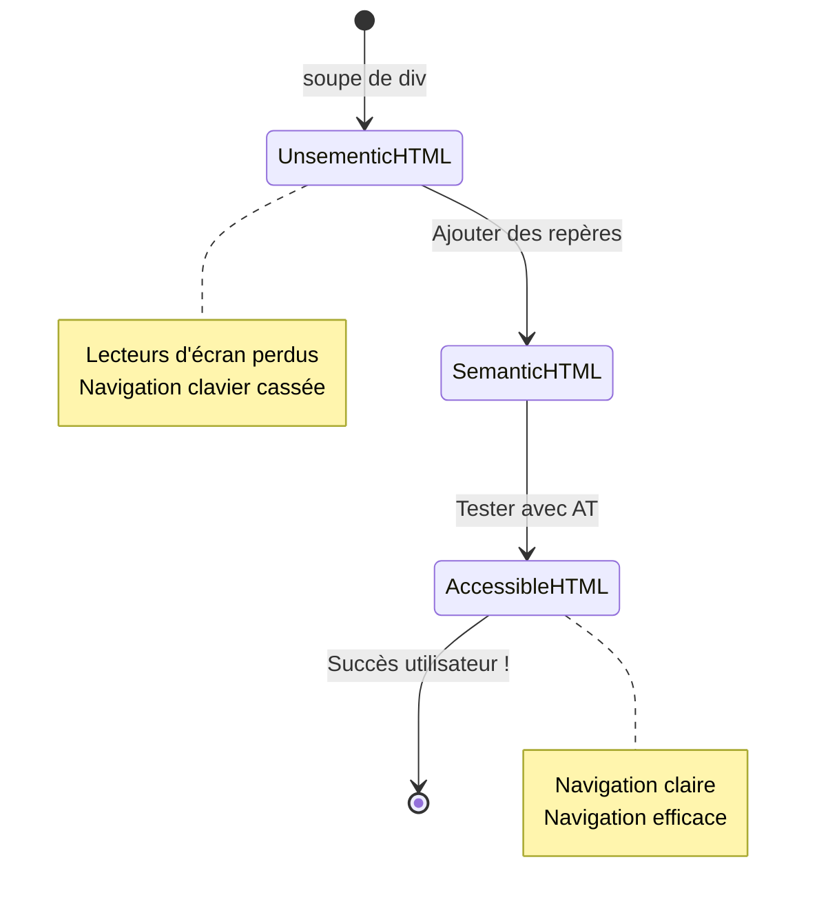
> **Conseil pro** : Un bon HTML sémantique résout environ 70 % des problèmes d’accessibilité automatiquement. Maîtrisez cette base et vous êtes bien parti !

✅ **Vérifiez votre structure sémantique** : Utilisez le panneau Accessibilité dans les DevTools de votre navigateur pour voir l’arbre d’accessibilité et assurez-vous que votre balisage crée une structure logique.

### Hiérarchie des titres : créer un plan de contenu logique

Les titres sont absolument cruciaux pour un contenu accessible — ils sont comme l’épine dorsale qui tient tout ensemble. Les utilisateurs de lecteurs d’écran s’appuient fortement sur les titres pour comprendre et naviguer dans votre contenu. C’est comme fournir une table des matières pour votre page.

**Voici la règle d’or des titres :**
Ne jamais sauter de niveaux. Progressez toujours logiquement de `<h1>` à `<h2>`, puis à `<h3>`, etc. Vous vous rappelez faire des plans à l’école ? C’est exactement le même principe — vous ne sautez pas de « I. Point principal » à « C. Sous-sous-point » sans passer par « A. Sous-point », n’est-ce pas ?

**Exemple parfait de structure de titre :**

```html
<!-- ✅ Excellent: Logical, hierarchical progression -->
<main>
  <h1>Complete Guide to Web Accessibility</h1>
  
  <section>
    <h2>Understanding Screen Readers</h2>
    <p>Introduction to screen reader technology...</p>
    
    <h3>Popular Screen Reader Software</h3>
    <p>NVDA, JAWS, and VoiceOver comparison...</p>
    
    <h3>Testing with Screen Readers</h3>
    <p>Step-by-step testing instructions...</p>
  </section>
  
  <section>
    <h2>Color and Contrast Guidelines</h2>
    <p>Designing with sufficient contrast...</p>
    
    <h3>WCAG Contrast Requirements</h3>
    <p>Understanding the different contrast levels...</p>
    
    <h3>Testing Tools and Techniques</h3>
    <p>Tools for verifying contrast ratios...</p>
  </section>
</main>
```

```html
<!-- ❌ Problematic: Skipping levels, inconsistent structure -->
<h1>Page Title</h1>
<h3>Subsection</h3> <!-- Skipped h2 -->
<h2>This should come before h3</h2>
<h1>Another main heading?</h1> <!-- Multiple h1s -->
```

**Bonnes pratiques pour les titres :**
- **Un seul `<h1>` par page** : généralement le titre principal ou d’en-tête du contenu principal
- **Progression logique** : ne sautez jamais de niveau (h1 → h2 → h3, pas h1 → h3)
- **Contenu descriptif** : rendez les titres significatifs lus hors contexte
- **Style visuel avec CSS** : utilisez le CSS pour l’apparence, les niveaux HTML pour la structure

**Statistiques de navigation avec lecteurs d’écran :**
- 68 % des utilisateurs naviguent par titres ([Enquête WebAIM](https://webaim.org/projects/screenreadersurvey9/#finding))
- Les utilisateurs s’attendent à un plan logique des titres
- Les titres offrent la façon la plus rapide de comprendre la structure de la page

> 💡 **Astuce pro** : Utilisez des extensions de navigateur comme "HeadingsMap" pour visualiser votre structure de titres. Elle doit se lire comme une table des matières bien organisée.

✅ **Testez votre structure de titres** : Utilisez la navigation par titre d’un lecteur d’écran (touche H dans NVDA) pour parcourir vos titres. La progression raconte-t-elle l’histoire de votre contenu de façon logique ?

### Techniques avancées d’accessibilité visuelle

Au-delà des bases de contraste et de couleur, il existe des techniques sophistiquées qui aident à créer de véritables expériences visuelles inclusives. Ces méthodes garantissent que votre contenu fonctionne dans diverses conditions de consultation et avec diverses technologies d’assistance.

**Stratégies essentielles de communication visuelle :**

- **Retour multimodal** : combinez indices visuels, textuels et parfois audio
- **Divulgation progressive** : présentez l’information en morceaux digestes
- **Modèles d’interaction cohérents** : utilisez des conventions UI familières
- **Typographie réactive** : adaptez la taille du texte selon les appareils
- **États de chargement et d’erreur** : fournissez un feedback clair pour toutes les actions utilisateur

**Utilitaires CSS pour améliorer l’accessibilité :**

```css
/* Screen reader only text - visually hidden but accessible */
.sr-only {
  position: absolute;
  width: 1px;
  height: 1px;
  padding: 0;
  margin: -1px;
  overflow: hidden;
  clip: rect(0, 0, 0, 0);
  white-space: nowrap;
  border: 0;
}

/* Skip link for keyboard navigation */
.skip-link {
  position: absolute;
  top: -40px;
  left: 6px;
  background: #000000;
  color: #ffffff;
  padding: 8px 16px;
  text-decoration: none;
  border-radius: 4px;
  font-weight: bold;
  transition: top 0.3s ease;
  z-index: 1000;
}

.skip-link:focus {
  top: 6px;
}

/* Reduced motion respect */
@media (prefers-reduced-motion: reduce) {
  .skip-link {
    transition: none;
  }
  
  * {
    animation-duration: 0.01ms !important;
    animation-iteration-count: 1 !important;
    transition-duration: 0.01ms !important;
  }
}

/* High contrast mode support */
@media (prefers-contrast: high) {
  .button {
    border: 2px solid;
  }
}
```

> 🎯 **Patron d’accessibilité** : Le « lien de saut » est essentiel pour les utilisateurs clavier. Il doit être le premier élément focalisable de votre page et mener directement à la zone de contenu principal.

✅ **Implémentez le saut de navigation** : Ajoutez des liens de saut à vos pages et testez-les en appuyant sur Tab dès le chargement. Ils doivent apparaître et permettre de sauter au contenu principal.

## Rédiger un texte de lien significatif

Les liens sont essentiellement les autoroutes du web, mais un texte de lien mal rédigé, c’est comme des panneaux routiers qui indiquent juste « Lieu » au lieu de « Centre-ville de Chicago ». Pas très utile, non ?

Voici quelque chose qui m’a frappé quand je l’ai appris : les lecteurs d’écran peuvent extraire tous les liens d’une page et les afficher sous forme d’une grande liste. Imaginez qu’on vous donne un annuaire de tous les liens sur votre page. Chacun aurait-il du sens isolément ? C’est le test que votre texte de lien doit passer !

### Comprendre les modes de navigation par lien

Les lecteurs d’écran offrent de puissantes fonctions de navigation de liens qui dépendent d’un texte de lien bien écrit :

**Méthodes de navigation par lien :**
- **Lecture séquentielle** : les liens sont lus dans le contexte du contenu
- **Génération de liste de liens** : compilation de tous les liens de la page dans un annuaire consultable
- **Navigation rapide** : passage entre les liens avec des raccourcis clavier (K dans NVDA)
- **Fonction de recherche** : trouver des liens spécifiques en tapant un texte partiel

**Pourquoi le contexte est important :**
Lorsque les utilisateurs génèrent une liste de liens, ils voient quelque chose comme :
- « Télécharger le rapport »
- « En savoir plus »
- « Cliquez ici »
- « Politique de confidentialité »
- « Cliquez ici »

Seuls deux de ces liens donnent une information utile dehors de leur contexte !

> 📊 **Impact utilisateur** : Les utilisateurs de lecteurs d’écran parcourent les listes de liens pour saisir rapidement le contenu de la page. Un texte générique les oblige à revenir au contexte de chaque lien, ce qui ralentit considérablement leur expérience de navigation.

### Erreurs courantes à éviter dans le texte de lien

Comprendre ce qui ne marche pas vous aide à repérer et corriger les problèmes d’accessibilité dans le contenu existant.

**❌ Texte générique ne donnant pas de contexte :**

```html
<!-- Meaningless when read from a link list -->
<p>Our sustainability efforts are detailed in our recent report. 
   <a href="/sustainability-2024.pdf">Click here</a> to view it.</p>

<!-- Repeated generic text throughout the page -->
<div class="article-card">
  <h3>Web Accessibility Guide</h3>
  <p>Learn the fundamentals...</p>
  <a href="/accessibility-guide">Read more</a>
</div>
<div class="article-card">
  <h3>Color Contrast Tips</h3>
  <p>Improve your design...</p>
  <a href="/color-contrast">Read more</a>
</div>

<!-- URLs as link text (difficult for screen readers to announce) -->
<p>Visit https://www.w3.org/WAI/WCAG21/quickref/ for WCAG guidelines.</p>

<!-- Vague action words -->
<a href="/contact">Go</a> | <a href="/about">See</a> | <a href="/help">View</a>
```

**Pourquoi ces schémas échouent :**
- **« Cliquez ici »** n’indique rien sur la destination
- **« En savoir plus »** répété plusieurs fois crée de la confusion
- **URLs brutes** sont difficiles à prononcer clairement pour les lecteurs d’écran
- **Mots isolés** comme « Aller » ou « Voir » manquent de contexte descriptif

### Rédiger un excellent texte de lien

Un texte de lien descriptif bénéficie à tout le monde — les utilisateurs voyants peuvent scanner rapidement les liens et les utilisateurs de lecteurs d’écran comprennent immédiatement la destination.

**✅ Exemples de texte de lien clair et descriptif :**

```html
<!-- Descriptive text that explains the destination -->
<p>Our comprehensive <a href="/sustainability-2024.pdf">2024 sustainability report (PDF, 2.1MB)</a> details our environmental initiatives.</p>

<!-- Specific, unique link text for each card -->
<div class="article-card">
  <h3>Web Accessibility Guide</h3>
  <p>Learn the fundamentals of inclusive design...</p>
  <a href="/accessibility-guide">Read our complete web accessibility guide</a>
</div>
<div class="article-card">
  <h3>Color Contrast Tips</h3>
  <p>Improve your design with better color choices...</p>
  <a href="/color-contrast">Explore color contrast best practices</a>
</div>

<!-- Meaningful text instead of raw URLs -->
<p>The <a href="https://www.w3.org/WAI/WCAG21/quickref/">WCAG 2.1 Quick Reference guide</a> provides comprehensive accessibility guidelines.</p>

<!-- Descriptive action links -->
<a href="/contact">Contact our support team</a> | 
<a href="/about">About our company</a> | 
<a href="/help">Get help with your account</a>
```

**Bonnes pratiques pour le texte de lien :**
- **Soyez spécifique** : « Télécharger le rapport financier trimestriel » vs « Télécharger »
- **Indiquez le type et la taille du fichier** : « (PDF, 1,2 Mo) » pour les fichiers téléchargeables
- **Mentionnez si les liens s’ouvrent en externe** : « (ouvre dans une nouvelle fenêtre) » le cas échéant
- **Utilisez un langage actif** : « Contactez-nous » vs « Page contact »
- **Soyez concis** : visez 2 à 8 mots lorsque c’est possible

### Modèles avancés d’accessibilité des liens

Parfois, des contraintes de design visuel ou des exigences techniques nécessitent des solutions particulières. Voici des techniques sophistiquées pour des scénarios courants difficiles :

**Utiliser ARIA pour un contexte enrichi :**

```html
<!-- When button text must be short but needs more context -->
<a href="/report.pdf" 
   aria-label="Download 2024 annual financial report, PDF format, 2.3MB">
  Download Report
</a>

<!-- When the full context comes from surrounding content -->
<h3 id="sustainability-heading">Sustainability Initiative</h3>
<p>Our efforts to reduce environmental impact...</p>
<a href="/sustainability-details" 
   aria-labelledby="sustainability-heading"
   aria-describedby="sustainability-summary">
  Learn more
</a>
<p id="sustainability-summary">Detailed breakdown of our 2024 environmental goals and achievements</p>
```

**Indiquer les types de fichiers et destinations externes :**

```html
<!-- Method 1: Include information in visible link text -->
<a href="/annual-report.pdf">
  Download our 2024 annual report (PDF, 2.3MB)
</a>

<!-- Method 2: Use screen reader-only text for file details -->
<a href="/annual-report.pdf">
  Download our 2024 annual report
  <span class="sr-only">(PDF format, 2.3MB)</span>
</a>

<!-- Method 3: External link indication -->
<a href="https://example.com" 
   target="_blank" 
   aria-describedby="external-link-warning">
  Visit external resource
</a>
<span id="external-link-warning" class="sr-only">
  (opens in new window)
</span>

<!-- Method 4: Using CSS for visual indicators -->
<a href="https://example.com" class="external-link">
  External resource
</a>
```

```css
/* Visual indicator for external links */
.external-link::after {
  content: " ↗";
  font-size: 0.8em;
  color: #666;
}

/* Screen reader announcement for external links */
.external-link::before {
  content: "External link: ";
  position: absolute;
  left: -10000px;
  width: 1px;
  height: 1px;
  overflow: hidden;
}
```

> ⚠️ **Important** : Lorsqu’on utilise `target="_blank"`, il faut toujours informer les utilisateurs que le lien s’ouvre dans une nouvelle fenêtre ou un nouvel onglet. Des changements de navigation inattendus peuvent désorienter.

✅ **Vérifiez le contexte de vos liens** : Utilisez les outils de développement de votre navigateur pour générer une liste de tous les liens de votre page. Comprenez-vous la fonction de chaque lien sans aucun contexte autour ?

## ARIA : dynamiser l’accessibilité HTML

[Accessible Rich Internet Applications (ARIA)](https://developer.mozilla.org/docs/Web/Accessibility/ARIA) est comme un traducteur universel entre vos applications web complexes et les technologies d’assistance. Lorsque le HTML seul ne peut pas exprimer tout ce que vos composants interactifs font, ARIA comble ces lacunes.

J’aime voir ARIA comme l’ajout d’annotations utiles à votre HTML — un peu comme les didascalies dans un script de théâtre qui aident les acteurs à comprendre leurs rôles et relations.

**La règle la plus importante à propos d’ARIA** : utilisez toujours d’abord du HTML sémantique, puis ajoutez ARIA pour l’enrichir. Pensez à ARIA comme à un assaisonnement, pas au plat principal. Il doit clarifier et renforcer votre structure HTML, jamais la remplacer. Maîtrisez d’abord cette base !

### Mise en œuvre stratégique d’ARIA

ARIA est puissant, mais avec la puissance vient la responsabilité. Un usage incorrect d’ARIA peut rendre l’accessibilité pire que pas d’ARIA du tout. Voici quand et comment l’utiliser efficacement :

**✅ Utilisez ARIA quand :**
- Vous créez des widgets interactifs personnalisés (accordéons, onglets, carrousels)
- Vous construisez du contenu dynamique qui change sans rechargement de page
- Vous fournissez un contexte supplémentaire pour des relations UI complexes
- Vous indiquez des états de chargement ou mises à jour en direct
- Vous créez des interfaces type application avec des contrôles personnalisés

**❌ Évitez ARIA quand :**
- Les éléments HTML standards fournissent déjà la sémantique nécessaire
- Vous ne savez pas comment l’implémenter correctement
- Il duplique des informations déjà fournies par le HTML sémantique
- Vous ne l’avez pas testé avec de vraies technologies d’assistance

> 🎯 **Règle d’or ARIA** : « Ne changez pas la sémantique à moins d’y être absolument obligé, assurez toujours l’accessibilité au clavier, et testez avec de vraies technologies d’assistance. »
**Les cinq catégories d'ARIA :**

1. **Rôles** : Quel est cet élément ? (`button`, `tab`, `dialog`)
2. **Propriétés** : Quelles sont ses fonctionnalités ? (`aria-required`, `aria-haspopup`)
3. **États** : Quelle est sa condition actuelle ? (`aria-expanded`, `aria-checked`)
4. **Repères** : Où se trouve-t-il dans la structure de la page ? (`banner`, `navigation`, `main`)
5. **Régions dynamiques** : Comment les changements doivent-ils être annoncés ? (`aria-live`, `aria-atomic`)

### Modèles ARIA essentiels pour les applications web modernes

Ces modèles résolvent les défis d’accessibilité les plus courants dans les applications web interactives :

**Nommer et décrire les éléments :**

```html
<!-- aria-label: Provides accessible name when visible text isn't sufficient -->
<button aria-label="Close newsletter subscription dialog">×</button>

<!-- aria-labelledby: References existing text as the accessible name -->
<section aria-labelledby="news-heading">
  <h2 id="news-heading">Latest News</h2>
  <!-- news content -->
</section>

<!-- aria-describedby: Links to additional descriptive text -->
<input type="password" 
       aria-describedby="pwd-requirements pwd-strength"
       required>
<div id="pwd-requirements">
  Password must contain at least 8 characters, including uppercase, lowercase, and numbers.
</div>
<div id="pwd-strength" aria-live="polite">
  <!-- Dynamic password strength indicator -->
</div>
```

**Régions dynamiques pour le contenu dynamique :**

```html
<!-- Polite announcements (don't interrupt current speech) -->
<div aria-live="polite" id="status-updates">
  <!-- Status messages appear here -->
</div>

<!-- Assertive announcements (interrupt and announce immediately) -->
<div aria-live="assertive" id="urgent-alerts">
  <!-- Error messages and critical alerts -->
</div>

<!-- Loading states with live regions -->
<button id="submit-btn" aria-describedby="loading-status">
  Submit Application
</button>
<div id="loading-status" aria-live="polite" aria-atomic="true">
  <!-- "Processing your application..." appears here -->
</div>
```

**Exemple de widget interactif (accordéon) :**

```html
<div class="accordion">
  <h3>
    <button aria-expanded="false" 
            aria-controls="panel-1" 
            id="accordion-trigger-1"
            class="accordion-trigger">
      Accessibility Guidelines
    </button>
  </h3>
  <div id="panel-1" 
       role="region"
       aria-labelledby="accordion-trigger-1" 
       hidden>
    <p>WCAG 2.1 provides comprehensive guidelines...</p>
  </div>
</div>
```

```javascript
// JavaScript pour gérer l'état de l'accordéon
function toggleAccordion(trigger) {
  const panel = document.getElementById(trigger.getAttribute('aria-controls'));
  const isExpanded = trigger.getAttribute('aria-expanded') === 'true';
  
  // Basculer les états
  trigger.setAttribute('aria-expanded', !isExpanded);
  panel.hidden = isExpanded;
  
  // Annoncer le changement aux lecteurs d'écran
  const status = document.getElementById('status-updates');
  status.textContent = isExpanded ? 'Section collapsed' : 'Section expanded';
}
```

### Bonnes pratiques d’implémentation ARIA

ARIA est puissant mais nécessite une mise en œuvre soignée. Suivre ces directives aide à garantir que votre ARIA améliore, plutôt que d’entraver, l’accessibilité :

**🛡️ Principes fondamentaux :**

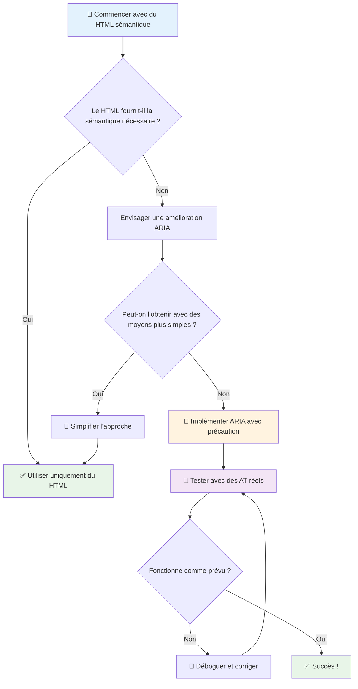
1. **HTML sémantique d’abord** : Préférez toujours `<button>` à `<div role="button">`
2. **Ne pas casser la sémantique** : Ne jamais remplacer le sens existant du HTML (évitez `<h1 role="button">`)
3. **Maintenir l’accessibilité clavier** : Tous les éléments ARIA interactifs doivent être entièrement accessibles au clavier
4. **Tester avec de vrais utilisateurs** : Le support ARIA varie considérablement entre les aides techniques
5. **Commencez simple** : Les implémentations ARIA complexes sont plus sujettes aux erreurs

**🔍 Workflow de test :**

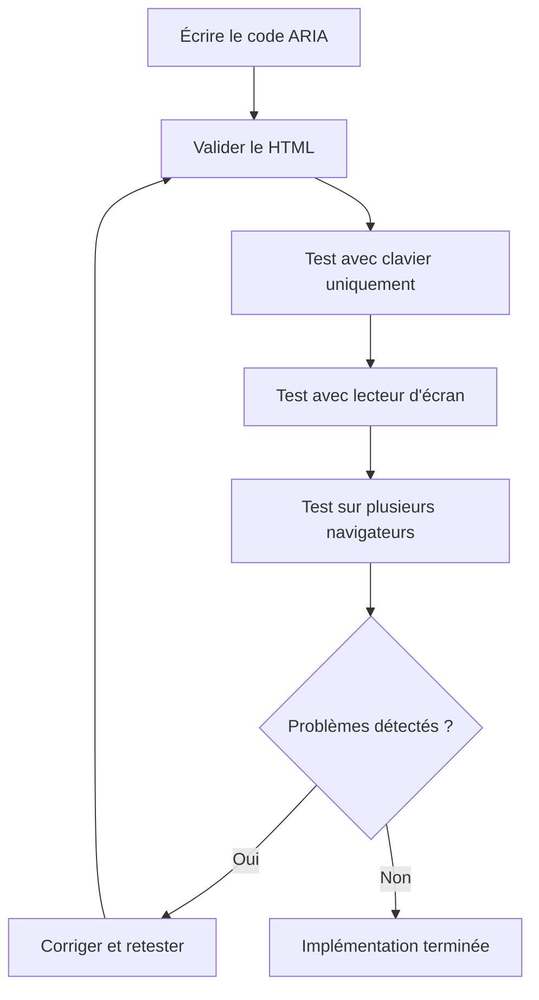
**🚫 Erreurs ARIA courantes à éviter :**

- **Informations conflictuelles** : Ne contredisez pas la sémantique du HTML
- **Sur-étiquetage** : Trop d’informations ARIA peut submerger les utilisateurs
- **ARIA statique** : Oublier de mettre à jour les états ARIA lorsque le contenu change
- **Implémentations non testées** : ARIA qui fonctionne en théorie mais échoue en pratique
- **Support clavier manquant** : Rôles ARIA sans interactions clavier correspondantes

> 💡 **Ressources de test** : Utilisez des outils comme [accessibility-checker](https://www.npmjs.com/package/accessibility-checker) pour la validation automatique ARIA, mais testez toujours avec de vrais lecteurs d’écran pour une expérience complète.

### 🎭 **Testez vos compétences ARIA : Prêt pour des interactions complexes ?**

**Évaluez votre confiance en ARIA :**
- Quand choisiriez-vous ARIA plutôt que du HTML sémantique ? (Indice : presque jamais !)
- Pouvez-vous expliquer pourquoi `<div role="button">` est généralement pire que `<button>` ?
- Quelle est la chose la plus importante à retenir pour tester ARIA ?

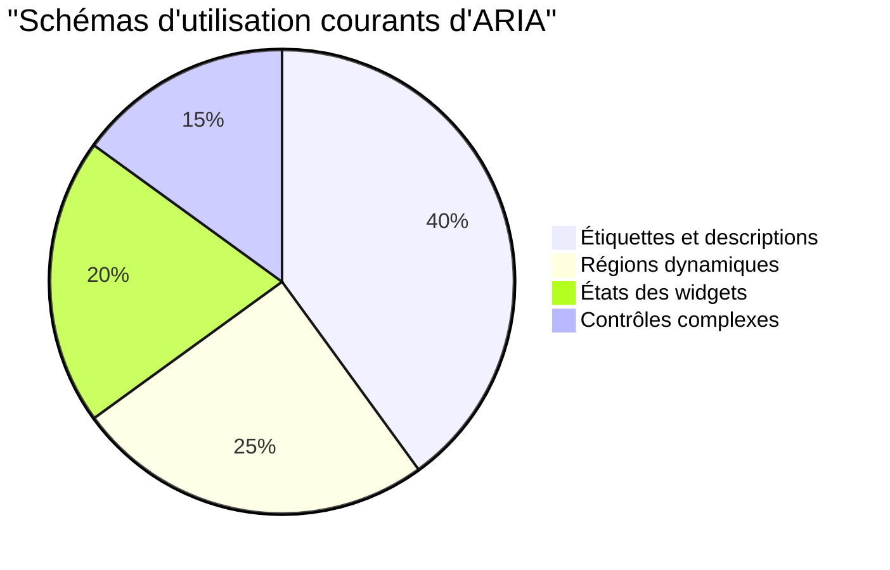
> **Idée clé** : La plupart des usages ARIA servent à nommer et décrire les éléments. Les modèles complexes de widgets sont beaucoup moins fréquents qu’on ne le pense !

✅ **Apprenez des experts** : Étudiez le [Guide des pratiques d’auteur ARIA](https://w3c.github.io/aria-practices/) pour des modèles éprouvés et des implémentations de widgets interactifs complexes.

## Rendre les images et médias accessibles

Le contenu visuel et audio est essentiel dans les expériences web modernes, mais peut créer des barrières s’il n’est pas implanté avec soin. Le but est de faire parvenir à chaque utilisateur l’information et l’impact émotionnel de vos médias. Une fois que vous avez pris le coup, ça devient naturel.

Différents types de médias nécessitent différentes approches d’accessibilité. C’est comme en cuisine—vous ne traiterez pas un poisson délicat comme un steak copieux. Comprendre ces distinctions vous aide à choisir la bonne solution pour chaque situation.

### Accessibilité stratégique des images

Chaque image sur votre site remplit un but. Comprendre ce but vous aide à rédiger de meilleurs textes alternatifs et à créer des expériences plus inclusives.

**Les quatre types d’images et leurs stratégies de texte alternatif :**

**Images informatives** – transmettent une information importante :
```html

```

**Images décoratives** – purement visuelles, sans valeur informationnelle :
```html

```

**Images fonctionnelles** – servent de boutons ou de commandes :
```html
<button>
  
</button>
```

**Images complexes** – graphiques, diagrammes, infographies :
```html

<div id="chart-description">
  <p>Detailed description: Sales data shows a steady increase across all quarters...</p>
</div>
```

### Accessibilité vidéo et audio

**Exigences pour la vidéo :**
- **Sous-titres** : version textuelle du contenu parlé et des effets sonores
- **Descriptions audio** : narration des éléments visuels pour les personnes aveugles
- **Transcriptions** : version complète en texte de tout le contenu audio et visuel

```html
<video controls>
  <source src="video.mp4" type="video/mp4">
  <track kind="captions" src="captions.vtt" srclang="en" label="English">
  <track kind="descriptions" src="descriptions.vtt" srclang="en" label="Audio descriptions">
</video>
```

**Exigences pour l’audio :**
- **Transcriptions** : version textuelle de tout le contenu parlé
- **Indicateurs visuels** : pour le contenu uniquement audio, fournir des indices visuels

### Techniques modernes d’image

**Utilisation du CSS pour les images décoratives :**
```css
.hero-section {
  background-image: url('decorative-hero.jpg');
  /* Decorative images in CSS don't need alt text */
}
```

**Images responsives avec accessibilité :**
```html
<picture>
  <source media="(min-width: 800px)" srcset="large-chart.png">
  <source media="(min-width: 400px)" srcset="medium-chart.png">
  
</picture>
```

✅ **Testez l’accessibilité des images** : Utilisez un lecteur d’écran pour naviguer sur une page contenant des images. Avez-vous suffisamment d’informations pour comprendre le contenu ?

## Navigation clavier et gestion du focus

De nombreux utilisateurs naviguent sur le web uniquement avec leur clavier. Cela comprend des personnes à mobilité réduite, des utilisateurs avancés qui trouvent le clavier plus rapide que la souris, et toute personne dont la souris ne fonctionne plus. Assurer que votre site fonctionne bien avec le clavier est essentiel et rend souvent votre site plus efficace pour tous.

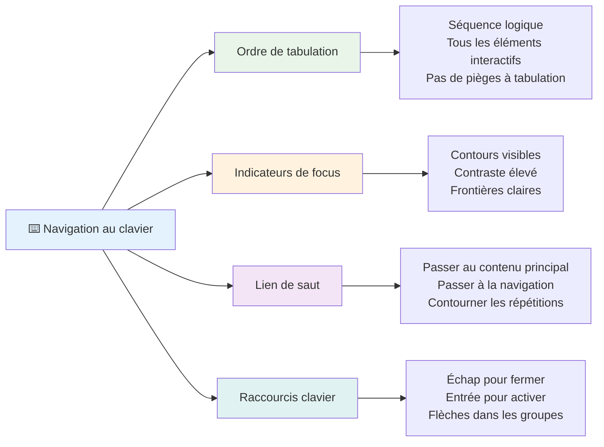
### Modèles essentiels de navigation clavier

**Interactions clavier standards :**
- **Tab** : Avancer le focus à travers les éléments interactifs
- **Shift + Tab** : Reculer le focus
- **Entrée** : Activer boutons et liens
- **Espace** : Activer boutons, cocher cases à cocher
- **Flèches** : Naviguer au sein de groupes de composants (boutons radio, menus)
- **Échap** : Fermer modaux, menus déroulants ou annuler des opérations

### Bonnes pratiques de gestion du focus

**Indicateurs de focus visibles :**
```css
/* Ensure focus is always visible */
button:focus-visible {
  outline: 2px solid #4A90A4;
  outline-offset: 2px;
}

/* Custom focus styles for different components */
.card:focus-within {
  box-shadow: 0 0 0 3px rgba(74, 144, 164, 0.5);
}
```

**Liens de saut pour une navigation efficace :**
```html
<a href="#main-content" class="skip-link">Skip to main content</a>
<a href="#navigation" class="skip-link">Skip to navigation</a>

<nav id="navigation">
  <!-- navigation content -->
</nav>
<main id="main-content">
  <!-- main content -->
</main>
```

**Ordre logique des tabulations :**
```html
<!-- Use semantic HTML for natural tab order -->
<form>
  <label for="name">Name:</label>
  <input type="text" id="name" tabindex="0">
  
  <label for="email">Email:</label>
  <input type="email" id="email" tabindex="0">
  
  <button type="submit" tabindex="0">Submit</button>
</form>
```

### Piégeage du focus dans les modaux

Lors de l’ouverture de boîtes de dialogue modales, le focus doit être confiné à l’intérieur du modal :

```javascript
// Implémentation moderne du piégeage du focus
function trapFocus(element) {
  const focusableElements = element.querySelectorAll(
    'button, [href], input, select, textarea, [tabindex]:not([tabindex="-1"])'
  );
  
  const firstElement = focusableElements[0];
  const lastElement = focusableElements[focusableElements.length - 1];

  element.addEventListener('keydown', (e) => {
    if (e.key === 'Tab') {
      if (e.shiftKey && document.activeElement === firstElement) {
        e.preventDefault();
        lastElement.focus();
      } else if (!e.shiftKey && document.activeElement === lastElement) {
        e.preventDefault();
        firstElement.focus();
      }
    }
    
    if (e.key === 'Escape') {
      closeModal();
    }
  });
  
  // Placer le focus sur le premier élément à l'ouverture de la modal
  firstElement.focus();
}
```

✅ **Testez la navigation clavier** : Essayez de naviguer sur votre site uniquement avec la touche Tab. Pouvez-vous atteindre tous les éléments interactifs ? L’ordre du focus est-il logique ? Les indicateurs de focus sont-ils clairement visibles ?

## Accessibilité des formulaires

Les formulaires sont cruciaux pour l’interaction utilisateur et demandent une attention particulière à l’accessibilité.

### Association étiquettes et contrôles de formulaire

**Chaque contrôle de formulaire a besoin d’une étiquette :**
```html
<!-- Explicit labeling (preferred) -->
<label for="username">Username:</label>
<input type="text" id="username" name="username" required>

<!-- Implicit labeling -->
<label>
  Password:
  <input type="password" name="password" required>
</label>

<!-- Using aria-label when visual label isn't desired -->
<input type="search" aria-label="Search products" placeholder="Search...">
```

### Gestion des erreurs et validation

**Messages d’erreur accessibles :**
```html
<label for="email">Email Address:</label>
<input type="email" id="email" name="email" 
       aria-describedby="email-error" 
       aria-invalid="true" required>
<div id="email-error" role="alert">
  Please enter a valid email address
</div>
```

**Bonnes pratiques de validation de formulaire :**
- Utilisez `aria-invalid` pour indiquer les champs invalides
- Fournissez des messages d’erreur clairs et spécifiques
- Utilisez `role="alert"` pour les annonces d’erreurs importantes
- Affichez les erreurs immédiatement et lors de la soumission du formulaire

### Groupements et fieldsets

**Groupez les contrôles liés du formulaire :**
```html
<fieldset>
  <legend>Shipping Address</legend>
  <label for="street">Street Address:</label>
  <input type="text" id="street" name="street">
  
  <label for="city">City:</label>
  <input type="text" id="city" name="city">
</fieldset>

<fieldset>
  <legend>Preferred Contact Method</legend>
  <input type="radio" id="contact-email" name="contact" value="email">
  <label for="contact-email">Email</label>
  
  <input type="radio" id="contact-phone" name="contact" value="phone">
  <label for="contact-phone">Phone</label>
</fieldset>
```

## Votre parcours accessibilité : points clés

Félicitations ! Vous avez acquis les connaissances fondamentales pour créer des expériences web vraiment inclusives. C’est plutôt excitant ! L’accessibilité web ne consiste pas seulement à cocher des cases de conformité—c’est reconnaître les diverses façons dont les personnes interagissent avec le contenu numérique et concevoir pour cette complexité incroyable.

Vous faites maintenant partie d’une communauté grandissante de développeurs qui comprennent que le bon design fonctionne pour tout le monde. Bienvenue au club !

**🎯 Votre boîte à outils accessibilité comprend maintenant :**

| Principe fondamental | Mise en œuvre | Impact |
|----------------------|---------------|--------|
| **Fondation HTML sémantique** | Utilisez des éléments HTML appropriés à leur usage | Les lecteurs d’écran naviguent efficacement, les claviers fonctionnent automatiquement |
| **Design visuel inclusif** | Contraste suffisant, utilisation significative des couleurs, indicateurs de focus visibles | Clair pour tous dans toutes conditions de lumière |
| **Contenu descriptif** | Texte de lien significatif, texte alt, titres | Les utilisateurs comprennent le contenu sans contexte visuel |
| **Accessibilité clavier** | Ordre de tabulation, raccourcis clavier, gestion du focus | Accessibilité motrice et efficacité pour utilisateurs avancés |
| **Amélioration ARIA** | Usage stratégique pour combler les lacunes sémantiques | Applications complexes compatibles avec les aides techniques |
| **Tests complets** | Outils automatisés + vérification manuelle + tests avec utilisateurs réels | Détecte les problèmes avant impact utilisateur |

**🚀 Vos prochaines étapes :**

1. **Intégrez l’accessibilité dans votre workflow** : Faites du test une partie naturelle de votre développement
2. **Apprenez des utilisateurs réels** : Recueillez des retours de personnes utilisant des aides techniques
3. **Restez à jour** : Les techniques évoluent avec les nouvelles technologies et standards
4. **Promouvez l’inclusion** : Partagez vos connaissances et faites de l’accessibilité une priorité d’équipe

> 💡 **Rappel** : Les contraintes d’accessibilité mènent souvent à des solutions innovantes et élégantes qui profitent à tous. Les bandes d’éveil, les sous-titres et les commandes vocales ont toutes commencé comme des fonctionnalités d’accessibilité et sont devenues des améliorations grand public.

**Le cas business est évident** : Les sites accessibles touchent plus d’utilisateurs, ont un meilleur classement dans les moteurs de recherche, ont des coûts de maintenance inférieurs, et évitent les risques juridiques. Mais honnêtement ? La vraie raison de se soucier de l’accessibilité est bien plus profonde. Les sites accessibles incarnent les meilleures valeurs du web—ouverture, inclusivité, et l’idée que tout le monde mérite un accès égal à l’information.

Vous êtes désormais équipé pour construire le web inclusif de demain. Chaque site accessible que vous créez rend internet plus accueillant pour tous. C’est plutôt incroyable quand on y pense !

## Ressources supplémentaires

Poursuivez votre apprentissage de l’accessibilité avec ces ressources essentielles :

**📚 Normes et directives officielles :**
- [Directives WCAG 2.1](https://www.w3.org/WAI/WCAG21/quickref/) – Norme officielle d’accessibilité avec référence rapide
- [Guide des pratiques d’auteur ARIA](https://w3c.github.io/aria-practices/) – Modèles complets pour widgets interactifs
- [WebAIM Guidelines](https://webaim.org/) – Conseils pratiques et accessibles pour débutants

**🛠️ Outils et ressources de test :**
- [axe DevTools](https://www.deque.com/axe/devtools/) – Test d’accessibilité standard industriel
- [A11y Project Checklist](https://www.a11yproject.com/checklist/) – Vérification pas à pas de l’accessibilité
- [Accessibility Insights](https://accessibilityinsights.io/) – Suite de tests complète de Microsoft
- [Color Oracle](https://colororacle.org/) – Simulateur de daltonisme pour les tests de design

**🎓 Apprentissage et communauté :**
- [Enquête WebAIM sur les lecteurs d’écran](https://webaim.org/projects/screenreadersurvey9/) – Préférences et comportements des utilisateurs réels
- [Inclusive Components](https://inclusive-components.design/) – Modèles modernes de composants accessibles
- [A11y Coffee](https://a11y.coffee/) – Astuces rapides et analyses sur l’accessibilité
- [Initiative pour l’accessibilité du Web (WAI)](https://www.w3.org/WAI/) – Ressources complètes du W3C

**🎥 Apprentissage pratique :**
- [Accessibility Developer Guide](https://www.accessibility-developer-guide.com/) – Guide pratique d’implémentation
- [Deque University](https://dequeuniversity.com/) – Formations professionnelles à l’accessibilité

## Défi GitHub Copilot Agent 🚀

Utilisez le mode Agent pour relever le défi suivant :

**Description :** Créez un composant de boîte de dialogue modale accessible démontrant une bonne gestion du focus, des attributs ARIA, et des modèles de navigation clavier.

**Consigne :** Construisez un composant complet de boîte de dialogue modale avec HTML, CSS et JavaScript incluant : confinement correct du focus, fermeture avec la touche Échap, fermeture au clic en dehors, attributs ARIA pour lecteurs d’écran, et indicateurs visibles de focus. Le modal doit contenir un formulaire avec étiquettes appropriées et gestion des erreurs. Assurez-vous que le composant respecte les normes WCAG 2.1 AA.

## 🚀 Défi

Prenez ce HTML et réécrivez-le pour le rendre aussi accessible que possible, en appliquant les stratégies que vous avez apprises.

```html
<!DOCTYPE html>
<html lang="en">
  <head>
    <meta charset="UTF-8">
    <meta name="viewport" content="width=device-width, initial-scale=1.0">
    <title>Turtle Ipsum - The World's Premier Turtle Fan Club</title>
    <link href='../assets/style.css' rel='stylesheet' type='text/css'>
  </head>
  <body>
    <header class="site-header">
      <h1 class="site-title">Turtle Ipsum</h1>
      <p class="site-subtitle">The World's Premier Turtle Fan Club</p>
    </header>
    
    <nav class="main-nav" aria-label="Main navigation">
      <h2 class="nav-header">Resources</h2>
      <ul class="nav-list">
        <li><a href="https://www.youtube.com/watch?v=CMNry4PE93Y">"I like turtles" video</a></li>
        <li><a href="https://en.wikipedia.org/wiki/Turtle">Basic turtle information</a></li>
        <li><a href="https://en.wikipedia.org/wiki/Turtles_(chocolate)">Chocolate turtles candy</a></li>
      </ul>
    </nav>
    
    <main class="main-content">
      <article>
        <h1>Welcome to Turtle Ipsum</h1>
        <p class="intro">
          <a href="/about">Learn more about our turtle community</a> and discover fascinating facts about these amazing creatures.
        </p>
        <p class="article-text">
          Turtle ipsum dolor sit amet, consectetur adipiscing elit, sed do eiusmod tempor incididunt ut labore et dolore magna aliqua. Ut enim ad minim veniam, quis nostrud exercitation ullamco laboris nisi ut aliquip ex ea commodo consequat. Duis aute irure dolor in reprehenderit in voluptate velit esse cillum dolore eu fugiat nulla pariatur. Excepteur sint occaecat cupidatat non proident, sunt in culpa qui officia deserunt mollit anim id est laborum.
        </p>
      </article>
    </main>
    
    <footer class="footer">
      <section class="newsletter-signup">
        <h2>Stay Updated</h2>
        <button type="button" onclick="showNewsletterForm()">Sign up for turtle news</button>
      </section>
      
      <nav class="footer-nav" aria-label="Footer navigation">
        <h2>Site Pages</h2>
        <ul>
          <li><a href="../">Home</a></li>
          <li><a href="../semantic">Semantic HTML example</a></li>
        </ul>
      </nav>
      
      <p class="footer-copyright">&copy; 2024 Instrument. All rights reserved.</p>
    </footer>
  </body>
</html>
```

**Améliorations clés apportées :**
- Ajout d’une structure HTML sémantique correcte
- Correction de la hiérarchie des titres (h1 unique, progression logique)
- Ajout de textes de liens significatifs au lieu de « cliquez ici »
- Ajout d’attributs ARIA pertinents pour la navigation
- Ajout de l’attribut lang et des balises meta appropriées
- Utilisation de l’élément bouton pour les éléments interactifs
- Structuration du contenu du pied de page avec repères appropriés

## Quiz post-conférence
[Quiz post-conférence](https://ff-quizzes.netlify.app/web/en/)

## Revue & Auto-apprentissage

De nombreux gouvernements ont des lois concernant les exigences d’accessibilité. Informez-vous sur les lois d’accessibilité de votre pays. Qu’est-ce qui est couvert, et qu’est-ce qui ne l’est pas ? Un exemple est [ce site gouvernemental](https://accessibility.blog.gov.uk/).

## Devoir

[Analysez un site web non accessible](assignment.md)

Crédits : [Turtle Ipsum](https://github.com/Instrument/semantic-html-sample) par Instrument

---

## 🚀 Votre calendrier de maîtrise de l’accessibilité

### ⚡ **Ce que vous pouvez faire dans les 5 prochaines minutes**
- [ ] Installer l’extension axe DevTools dans votre navigateur
- [ ] Lancer un audit Lighthouse d’accessibilité sur votre site favori
- [ ] Essayer de naviguer sur n’importe quel site uniquement avec la touche Tab
- [ ] Tester le lecteur d’écran intégré de votre navigateur (Narrator/VoiceOver)

### 🎯 **Ce que vous pouvez accomplir cette heure**
- [ ] Compléter le quiz post-leçon et réfléchir aux enseignements sur l’accessibilité
- [ ] Pratiquer la rédaction de textes alternatifs significatifs pour 10 images différentes
- [ ] Auditer la structure des titres d’un site avec l’extension HeadingsMap
- [ ] Corriger les problèmes d’accessibilité identifiés dans le HTML du défi
- [ ] Tester le contraste des couleurs sur votre projet actuel avec l’outil WebAIM

### 📅 **Votre parcours accessibilité sur une semaine**
- [ ] Compléter le devoir analysant un site non accessible
- [ ] Configurer votre environnement de développement avec des outils de test d’accessibilité
- [ ] Pratiquez la navigation au clavier sur 5 sites web complexes différents  
- [ ] Créez un formulaire simple avec des labels appropriés, la gestion des erreurs et ARIA  
- [ ] Rejoignez une communauté d'accessibilité (A11y Slack, forum WebAIM)  
- [ ] Regardez des utilisateurs réels en situation de handicap naviguer sur des sites web (YouTube propose d'excellents exemples)  

### 🌟 **Votre transformation sur un mois**  
- [ ] Intégrez les tests d'accessibilité dans votre flux de développement  
- [ ] Contribuez à un projet open source en corrigeant des problèmes d'accessibilité  
- [ ] Réalisez des tests d'utilisabilité avec une personne utilisant une technologie d'assistance  
- [ ] Créez une bibliothèque de composants accessibles pour votre équipe  
- [ ] Plaidez pour l'accessibilité dans votre lieu de travail ou votre communauté  
- [ ] Faites du mentorat pour quelqu'un de nouveau dans les concepts d'accessibilité  

### 🏆 **Bilan final du Champion de l'accessibilité**  

**Célébrez votre parcours en accessibilité :**  
- Quelle est la chose la plus surprenante que vous avez apprise sur la manière dont les gens utilisent le web ?  
- Quel principe d'accessibilité résonne le plus avec votre style de développement ?  
- Comment l'apprentissage de l'accessibilité a-t-il changé votre perspective sur le design ?  
- Quelle est la première amélioration d'accessibilité que vous souhaitez apporter à un projet réel ?  

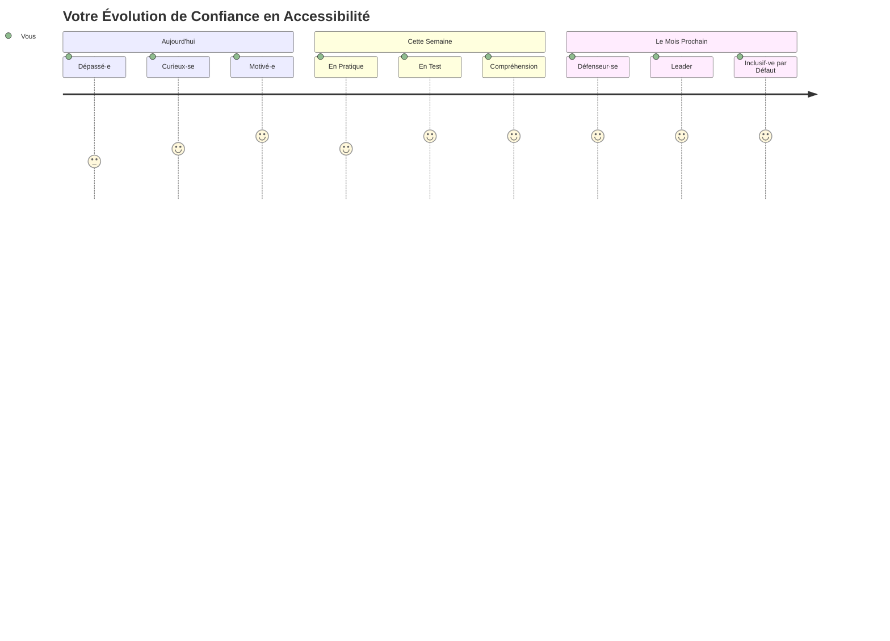
> 🌍 **Vous êtes maintenant un champion de l'accessibilité !** Vous comprenez que les excellentes expériences web fonctionnent pour tout le monde, quelle que soit la façon dont ils accèdent au web. Chaque fonctionnalité accessible que vous créez rend internet plus inclusif. Le web a besoin de développeurs comme vous, qui voient l'accessibilité non pas comme une contrainte, mais comme une opportunité de créer de meilleures expériences pour tous les utilisateurs. Bienvenue dans le mouvement ! 🎉

---

<!-- CO-OP TRANSLATOR DISCLAIMER START -->
**Avertissement** :  
Ce document a été traduit à l’aide du service de traduction automatique [Co-op Translator](https://github.com/Azure/co-op-translator). Bien que nous nous efforcions d’assurer l’exactitude, veuillez noter que les traductions automatiques peuvent contenir des erreurs ou des inexactitudes. Le document original dans sa langue d’origine doit être considéré comme la source faisant foi. Pour les informations critiques, une traduction humaine professionnelle est recommandée. Nous déclinons toute responsabilité en cas de malentendus ou d’interprétations erronées résultant de l’utilisation de cette traduction.
<!-- CO-OP TRANSLATOR DISCLAIMER END -->