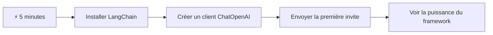
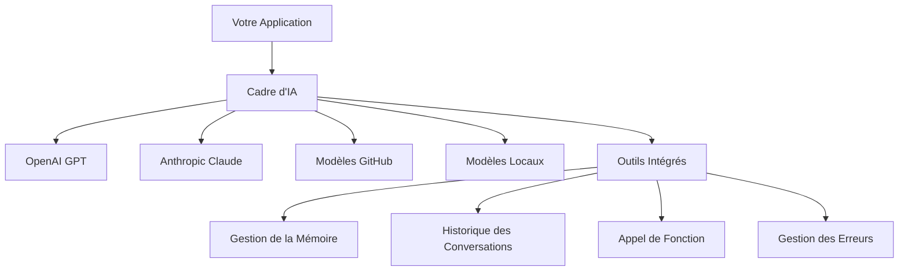
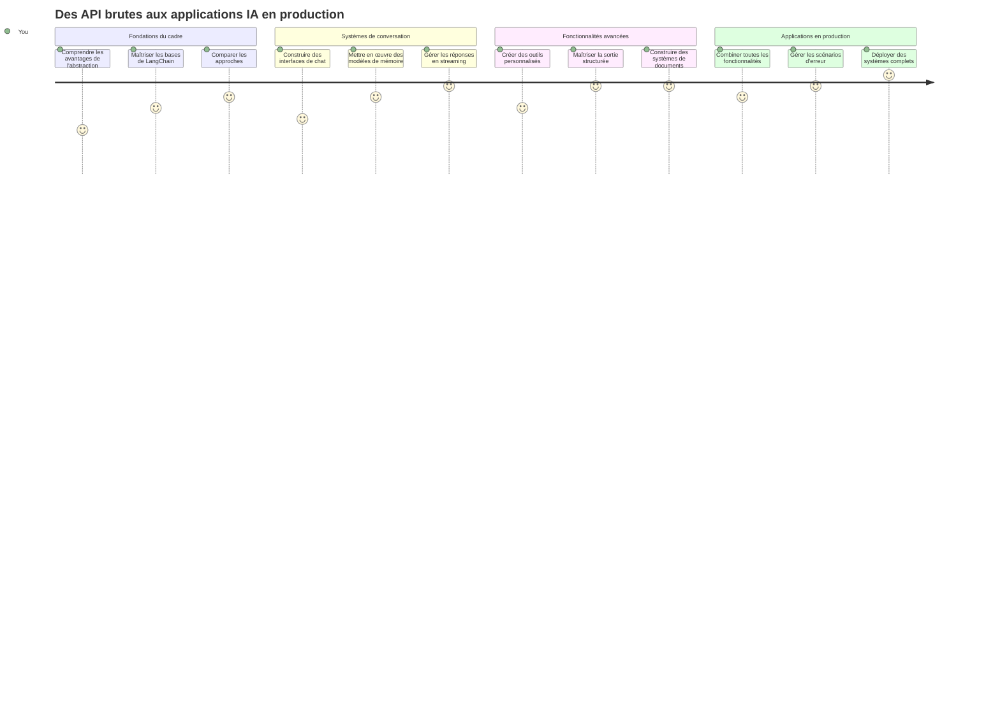
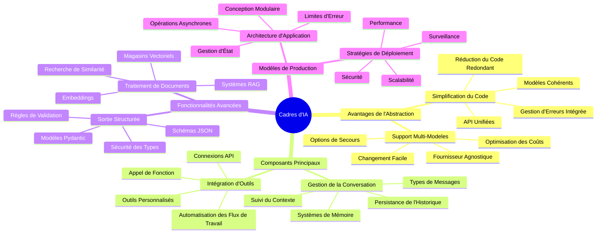
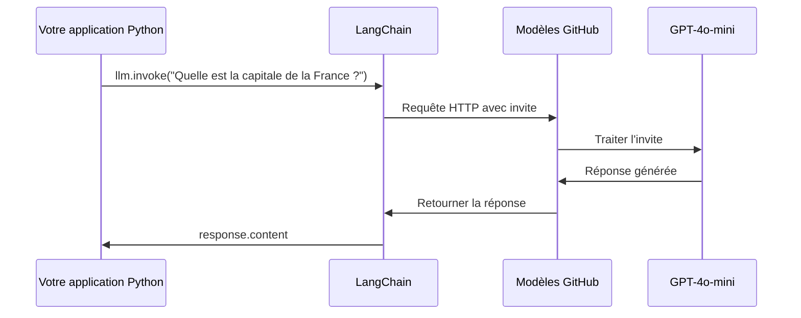
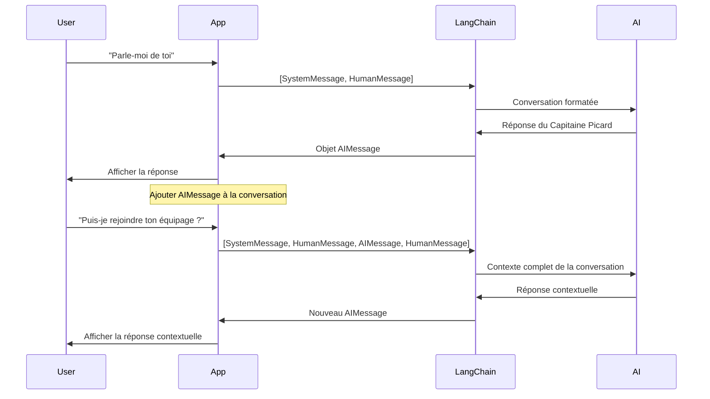
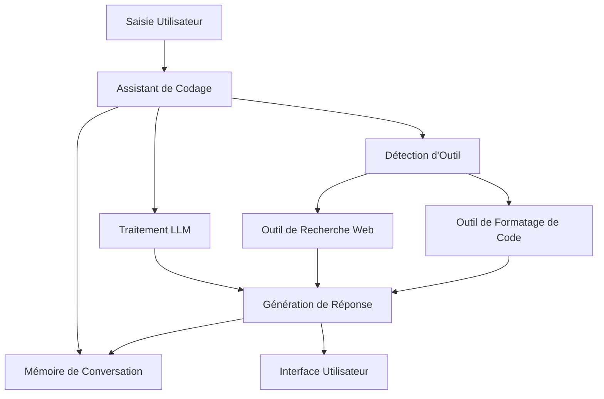
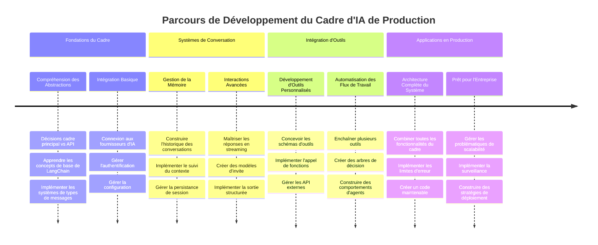
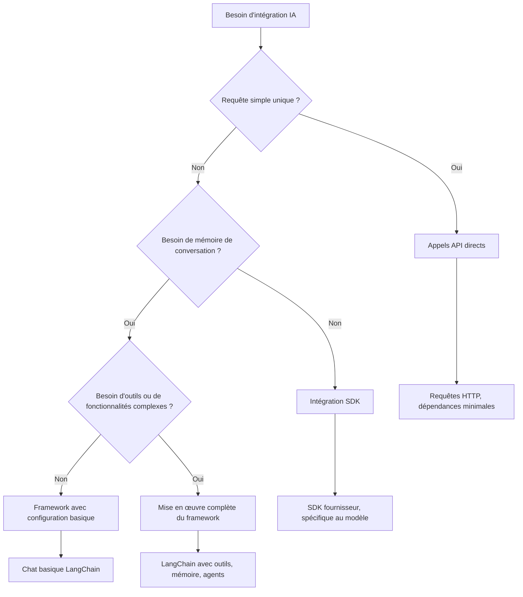

<!--
CO_OP_TRANSLATOR_METADATA:
{
  "original_hash": "3925b6a1c31c60755eaae4d578232c25",
  "translation_date": "2026-01-06T05:53:52+00:00",
  "source_file": "10-ai-framework-project/README.md",
  "language_code": "fr"
}
-->
# Cadre d’IA

Vous vous êtes déjà senti dépassé en essayant de créer des applications d’IA à partir de zéro ? Vous n’êtes pas seul ! Les cadres d’IA sont comme un couteau suisse pour le développement d’IA – ce sont des outils puissants qui peuvent vous faire gagner du temps et éviter bien des maux de tête lors de la création d’applications intelligentes. Pensez à un cadre d’IA comme à une bibliothèque bien organisée : il fournit des composants préconstruits, des API standardisées et des abstractions intelligentes pour que vous puissiez vous concentrer sur la résolution de problèmes au lieu de vous battre avec les détails d’implémentation.

Dans cette leçon, nous explorerons comment des cadres comme LangChain peuvent transformer des tâches d’intégration d’IA autrefois complexes en un code propre et lisible. Vous découvrirez comment relever des défis concrets tels que le suivi des conversations, la mise en œuvre de l’appel d’outils et la gestion de différents modèles d’IA via une interface unifiée.

Quand nous aurons terminé, vous saurez quand privilégier les cadres plutôt que les appels API bruts, comment utiliser efficacement leurs abstractions, et comment construire des applications d’IA prêtes pour une utilisation réelle. Explorons ce que les cadres d’IA peuvent faire pour vos projets.

## ⚡ Ce que vous pouvez faire dans les 5 prochaines minutes

**Parcours rapide pour développeurs pressés**


- **Minute 1** : Installer LangChain : `pip install langchain langchain-openai`
- **Minute 2** : Configurez votre jeton GitHub et importez le client ChatOpenAI
- **Minute 3** : Créez une conversation simple avec des messages système et utilisateur
- **Minute 4** : Ajoutez un outil basique (comme une fonction add) et voyez l’appel d’outil IA
- **Minute 5** : Expérimentez la différence entre appels API bruts et abstraction via cadre

**Code de test rapide** :
```python
from langchain_openai import ChatOpenAI
from langchain_core.messages import SystemMessage, HumanMessage

llm = ChatOpenAI(
    api_key=os.environ["GITHUB_TOKEN"],
    base_url="https://models.github.ai/inference",
    model="openai/gpt-4o-mini"
)

response = llm.invoke([
    SystemMessage(content="You are a helpful coding assistant"),
    HumanMessage(content="Explain Python functions briefly")
])
print(response.content)
```

**Pourquoi c’est important** : En 5 minutes, vous verrez comment les cadres d’IA transforment une intégration complexe en appels de méthodes simples. C’est la base qui alimente les applications d’IA en production.

## Pourquoi choisir un cadre ?

Vous êtes prêt à construire une application d’IA – super ! Mais voilà : plusieurs voies s’offrent à vous, chacune ayant ses avantages et inconvénients. C’est un peu comme choisir entre marcher, faire du vélo ou conduire pour aller quelque part – elles vous mèneront toutes à destination, mais l’expérience (et l’effort) seront totalement différents.

Analysons les trois principales façons d’intégrer l’IA dans vos projets :

| Approche | Avantages | Idéal pour | Considérations |
|----------|------------|----------|--------------|
| **Requêtes HTTP directes** | Contrôle total, aucune dépendance | Requêtes simples, apprentissage des bases | Code plus verbeux, gestion des erreurs manuelle |
| **Intégration SDK** | Moins de code répétitif, optimisation par modèle | Applications mono-modèle | Limité à certains fournisseurs spécifiques |
| **Cadres d’IA** | API unifiée, abstractions intégrées | Applications multi-modèles, workflows complexes | Courbe d’apprentissage, possible sur-abstraction |

### Bénéfices pratiques des cadres


**Pourquoi les cadres comptent :**
- **Unifie** plusieurs fournisseurs d’IA sous une même interface
- **Gère** automatiquement la mémoire de conversation
- **Fournit** des outils prêts à l’emploi pour tâches courantes comme embeddings et appels de fonction
- **Gère** la gestion des erreurs et la logique de réessai
- **Transforme** des workflows complexes en appels de méthodes lisibles

> 💡 **Astuce de pro** : Utilisez un cadre lorsque vous souhaitez alterner entre différents modèles d’IA ou construire des fonctionnalités complexes comme des agents, de la mémoire ou l’appel d’outils. Privilégiez les API directes pour apprendre les bases ou créer des applications simples et ciblées.

**En résumé** : Comme choisir entre des outils spécialisés d’artisan et un atelier complet, il s’agit d’adapter l’outil à la tâche. Les cadres excellent pour des applications complexes et riches en fonctionnalités, tandis que les API directes conviennent aux cas d’usage simples.

## 🗺️ Votre parcours d’apprentissage vers la maîtrise des cadres d’IA


**Votre destination** : À la fin de cette leçon, vous maîtriserez le développement avec cadres d’IA et serez capable de créer des applications d’IA sophistiquées et prêtes pour la production, dignes des assistants IA commerciaux.

## Introduction

Dans cette leçon, nous allons apprendre à :

- Utiliser un cadre d’IA courant.
- Aborder des problèmes courants comme les conversations, l’usage d’outils, la mémoire et le contexte.
- Exploiter cela pour construire des applications d’IA.

## 🧠 Écosystème de développement des cadres d’IA


**Principe de base** : Les cadres d’IA abstraient la complexité tout en offrant des abstractions puissantes pour la gestion des conversations, l’intégration d’outils et le traitement documentaire, permettant aux développeurs de créer des applications d’IA sophistiquées avec un code propre et maintenable.

## Votre première requête IA

Commençons par les fondamentaux en créant votre première application IA qui envoie une question et reçoit une réponse. Comme Archimède découvrant le principe de la poussée dans son bain, parfois les observations les plus simples conduisent aux idées les plus puissantes – et les cadres rendent ces idées accessibles.

### Configurer LangChain avec GitHub Models

Nous allons utiliser LangChain pour nous connecter à GitHub Models, ce qui est plutôt chouette car cela vous donne un accès gratuit à divers modèles d’IA. Le meilleur ? Vous n’avez besoin que de quelques paramètres de configuration simples pour commencer :

```python
from langchain_openai import ChatOpenAI
import os

llm = ChatOpenAI(
    api_key=os.environ["GITHUB_TOKEN"],
    base_url="https://models.github.ai/inference",
    model="openai/gpt-4o-mini",
)

# Envoyer une invite simple
response = llm.invoke("What's the capital of France?")
print(response.content)
```

**Décomposons ce qui se passe ici :**
- **Crée** un client LangChain utilisant la classe `ChatOpenAI` - c’est votre passerelle vers l’IA !
- **Configure** la connexion à GitHub Models avec votre jeton d’authentification
- **Spécifie** quel modèle IA utiliser (`gpt-4o-mini`) – pensez à cela comme choisir votre assistant IA
- **Envoie** votre question via la méthode `invoke()` – c’est là que la magie opère
- **Extrait** et affiche la réponse – et voilà, vous discutez avec l’IA !

> 🔧 **Note de configuration** : Si vous utilisez GitHub Codespaces, vous avez de la chance – le `GITHUB_TOKEN` est déjà configuré pour vous ! Vous travaillez en local ? Pas de souci, il vous suffit de créer un jeton d’accès personnel avec les bonnes permissions.

**Sortie attendue :**
```text
The capital of France is Paris.
```


## Créer une IA conversationnelle

Le premier exemple montre le minimum, mais ce n’est qu’un échange unique – vous posez une question, obtenez une réponse, et c’est tout. Dans les applications réelles, vous voulez que votre IA se souvienne de ce que vous avez déjà discuté, comme Watson et Holmes construisant leurs conversations d’enquête au fil du temps.

C’est là que LangChain devient particulièrement utile. Il fournit différents types de messages qui aident à structurer les conversations et vous permettent de donner une personnalité à votre IA. Vous construirez des expériences de chat qui maintiennent le contexte et le caractère.

### Comprendre les types de messages

Pensez à ces types de messages comme à différents « chapeaux » que portent les participants dans une conversation. LangChain utilise différentes classes de messages pour suivre qui dit quoi :

| Type de message | But | Exemple d’utilisation |
|-----------------|-----|----------------------|
| `SystemMessage` | Définit la personnalité et le comportement de l’IA | « Vous êtes un assistant de programmation utile » |
| `HumanMessage` | Représente l’entrée utilisateur | « Explique comment fonctionnent les fonctions » |
| `AIMessage` | Stocke les réponses de l’IA | Réponses précédentes de l’IA dans la conversation |

### Créer votre première conversation

Créons une conversation où notre IA assume un rôle spécifique. Nous allons la faire incarner le capitaine Picard – un personnage connu pour sa sagesse diplomatique et son leadership :

```python
messages = [
    SystemMessage(content="You are Captain Picard of the Starship Enterprise"),
    HumanMessage(content="Tell me about you"),
]
```

**Décryptage de cette configuration de conversation :**
- **Établit** le rôle et la personnalité de l’IA via `SystemMessage`
- **Fournit** la requête initiale de l’utilisateur par `HumanMessage`
- **Crée** une base pour une conversation à multiples tours

Le code complet pour cet exemple ressemble à ceci :

```python
from langchain_core.messages import HumanMessage, SystemMessage
from langchain_openai import ChatOpenAI
import os

llm = ChatOpenAI(
    api_key=os.environ["GITHUB_TOKEN"],
    base_url="https://models.github.ai/inference",
    model="openai/gpt-4o-mini",
)

messages = [
    SystemMessage(content="You are Captain Picard of the Starship Enterprise"),
    HumanMessage(content="Tell me about you"),
]


# fonctionne
response  = llm.invoke(messages)
print(response.content)
```

Vous devriez voir un résultat similaire à :

```text
I am Captain Jean-Luc Picard, the commanding officer of the USS Enterprise (NCC-1701-D), a starship in the United Federation of Planets. My primary mission is to explore new worlds, seek out new life and new civilizations, and boldly go where no one has gone before. 

I believe in the importance of diplomacy, reason, and the pursuit of knowledge. My crew is diverse and skilled, and we often face challenges that test our resolve, ethics, and ingenuity. Throughout my career, I have encountered numerous species, grappled with complex moral dilemmas, and have consistently sought peaceful solutions to conflicts.

I hold the ideals of the Federation close to my heart, believing in the importance of cooperation, understanding, and respect for all sentient beings. My experiences have shaped my leadership style, and I strive to be a thoughtful and just captain. How may I assist you further?
```

Pour maintenir la continuité de la conversation (au lieu de réinitialiser le contexte à chaque fois), vous devez continuer à ajouter les réponses à votre liste de messages. Comme les traditions orales qui ont préservé les histoires à travers les générations, cette approche construit une mémoire durable :

```python
from langchain_core.messages import HumanMessage, SystemMessage
from langchain_openai import ChatOpenAI
import os

llm = ChatOpenAI(
    api_key=os.environ["GITHUB_TOKEN"],
    base_url="https://models.github.ai/inference",
    model="openai/gpt-4o-mini",
)

messages = [
    SystemMessage(content="You are Captain Picard of the Starship Enterprise"),
    HumanMessage(content="Tell me about you"),
]


# fonctionne
response  = llm.invoke(messages)

print(response.content)

print("---- Next ----")

messages.append(response)
messages.append(HumanMessage(content="Now that I know about you, I'm Chris, can I be in your crew?"))

response  = llm.invoke(messages)

print(response.content)

```

Plutôt sympa, non ? Ce qui se passe ici, c’est que nous appelons le LLM deux fois – d’abord avec nos deux messages initiaux, puis à nouveau avec l’historique complet de la conversation. C’est comme si l’IA suivait vraiment notre discussion !

Lorsque vous exécutez ce code, vous obtenez une seconde réponse qui ressemble à :

```text
Welcome aboard, Chris! It's always a pleasure to meet those who share a passion for exploration and discovery. While I cannot formally offer you a position on the Enterprise right now, I encourage you to pursue your aspirations. We are always in need of talented individuals with diverse skills and backgrounds. 

If you are interested in space exploration, consider education and training in the sciences, engineering, or diplomacy. The values of curiosity, resilience, and teamwork are crucial in Starfleet. Should you ever find yourself on a starship, remember to uphold the principles of the Federation: peace, understanding, and respect for all beings. Your journey can lead you to remarkable adventures, whether in the stars or on the ground. Engage!
```


Je prends ça pour un peut-être ;)

## Réponses en streaming

Avez-vous remarqué comment ChatGPT semble « taper » ses réponses en temps réel ? C’est le streaming en action. Comme regarder un calligraphe expert travailler – voir les caractères apparaître trait par trait au lieu d’apparaître d’un coup – le streaming rend l’interaction plus naturelle et fournit un retour immédiat.

### Implémenter le streaming avec LangChain

```python
from langchain_openai import ChatOpenAI
import os

llm = ChatOpenAI(
    api_key=os.environ["GITHUB_TOKEN"],
    base_url="https://models.github.ai/inference",
    model="openai/gpt-4o-mini",
    streaming=True
)

# Diffuser la réponse
for chunk in llm.stream("Write a short story about a robot learning to code"):
    print(chunk.content, end="", flush=True)
```

**Pourquoi le streaming est génial :**
- **Montre** le contenu au fur et à mesure de sa création – fini l’attente gênante !
- **Fait** ressentir aux utilisateurs que quelque chose se passe vraiment
- **Donne** l’impression de rapidité, même si ce n’est pas techniquement le cas
- **Permet** aux utilisateurs de commencer à lire pendant que l’IA « réfléchit »

> 💡 **Conseil expérience utilisateur** : Le streaming est vraiment utile quand vous traitez des réponses longues comme des explications de code, de l’écriture créative ou des tutoriels détaillés. Vos utilisateurs adoreront voir l’avancement au lieu de fixer un écran vide !

### 🎯 Check pédagogique : Bénéfices de l’abstraction du cadre

**Pause et réflexion** : Vous venez d’expérimenter la puissance des abstractions des cadres d’IA. Comparez cela aux appels API bruts des leçons précédentes.

**Auto-évaluation rapide** :
- Pouvez-vous expliquer comment LangChain simplifie la gestion des conversations comparé au suivi manuel des messages ?
- Quelle est la différence entre les méthodes `invoke()` et `stream()`, et quand utiliser chacune ?
- Comment le système de types de messages du cadre améliore-t-il l’organisation du code ?

**Lien avec le monde réel** : Les modèles d’abstraction que vous avez apprises (types de message, interfaces de streaming, mémoire de conversation) sont utilisées dans toutes les grandes applications d’IA – de l’interface de ChatGPT à l’assistance au codage de GitHub Copilot. Vous maîtrisez les mêmes modèles architecturaux que les équipes de développement IA professionnelles.

**Question défi** : Comment concevriez-vous une abstraction de cadre pour gérer différents fournisseurs de modèles IA (OpenAI, Anthropic, Google) via une interface unique ? Considérez les avantages et compromis.

## Modèles de prompt

Les modèles de prompt fonctionnent comme les structures rhétoriques utilisées dans l’oratoire classique – pensez à comment Cicéron adaptait ses discours pour différents publics tout en gardant le même cadre persuasif. Ils vous permettent de créer des prompts réutilisables où vous pouvez substituer différentes informations sans tout réécrire. Une fois le modèle mis en place, il suffit de remplir les variables avec les valeurs souhaitées.

### Créer des prompts réutilisables

```python
from langchain_core.prompts import ChatPromptTemplate

# Définir un modèle pour les explications de code
template = ChatPromptTemplate.from_messages([
    ("system", "You are an expert programming instructor. Explain concepts clearly with examples."),
    ("human", "Explain {concept} in {language} with a practical example for {skill_level} developers")
])

# Utiliser le modèle avec différentes valeurs
questions = [
    {"concept": "functions", "language": "JavaScript", "skill_level": "beginner"},
    {"concept": "classes", "language": "Python", "skill_level": "intermediate"},
    {"concept": "async/await", "language": "JavaScript", "skill_level": "advanced"}
]

for question in questions:
    prompt = template.format_messages(**question)
    response = llm.invoke(prompt)
    print(f"Topic: {question['concept']}\n{response.content}\n---\n")
```

**Pourquoi vous aimerez les modèles :**
- **Maintient** la cohérence de vos prompts dans toute votre app
- **Fini** la concaténation de chaînes désordonnée – juste des variables claires et simples
- **Votre IA** se comporte de manière prévisible car la structure reste la même
- **Les mises à jour** sont un jeu d’enfant – changez le modèle une fois, c’est corrigé partout

## Sortie structurée

Vous êtes déjà frustré d’essayer d’analyser des réponses IA qui reviennent sous forme de texte non structuré ? La sortie structurée, c’est comme apprendre à votre IA à suivre la démarche systématique que Linné utilisait pour la classification biologique – organisée, prévisible et facile à manipuler. Vous pouvez demander du JSON, des structures de données spécifiques ou n’importe quel format dont vous avez besoin.

### Définir des schémas de sortie

```python
from langchain_core.prompts import ChatPromptTemplate
from langchain_core.output_parsers import JsonOutputParser
from pydantic import BaseModel, Field

class CodeReview(BaseModel):
    score: int = Field(description="Code quality score from 1-10")
    strengths: list[str] = Field(description="List of code strengths")
    improvements: list[str] = Field(description="List of suggested improvements")
    overall_feedback: str = Field(description="Summary feedback")

# Configurer l'analyseur
parser = JsonOutputParser(pydantic_object=CodeReview)

# Créer une invite avec des instructions de format
prompt = ChatPromptTemplate.from_messages([
    ("system", "You are a code reviewer. {format_instructions}"),
    ("human", "Review this code: {code}")
])

# Formater l'invite avec des instructions
chain = prompt | llm | parser

# Obtenir une réponse structurée
code_sample = """
def calculate_average(numbers):
    return sum(numbers) / len(numbers)
"""

result = chain.invoke({
    "code": code_sample,
    "format_instructions": parser.get_format_instructions()
})

print(f"Score: {result['score']}")
print(f"Strengths: {', '.join(result['strengths'])}")
```

**Pourquoi la sortie structurée change la donne :**
- **Plus besoin** de deviner le format de la réponse – c’est cohérent à chaque fois
- **S’intègre** directement à vos bases de données et APIs sans travail supplémentaire
- **Capture** les réponses IA bizarres avant qu’elles ne cassent votre app
- **Rend** votre code plus clair car vous savez exactement avec quoi vous travaillez

## Appel d’outils

Nous arrivons maintenant à l’une des fonctionnalités les plus puissantes : les outils. C’est ainsi que vous donnez à votre IA des capacités pratiques au-delà de la conversation. Comme les guildes médiévales créaient des outils spécialisés pour des métiers spécifiques, vous pouvez équiper votre IA d’instruments ciblés. Vous décrivez les outils disponibles, et quand quelqu’un demande quelque chose qui correspond, votre IA peut agir.

### Utiliser Python

Ajoutons quelques outils ainsi :

```python
from typing_extensions import Annotated, TypedDict

class add(TypedDict):
    """Add two integers."""

    # Les annotations doivent avoir un type et peuvent optionnellement inclure une valeur par défaut et une description (dans cet ordre).
    a: Annotated[int, ..., "First integer"]
    b: Annotated[int, ..., "Second integer"]

tools = [add]

functions = {
    "add": lambda a, b: a + b
}
```

Que se passe-t-il ici ? Nous créons un schéma pour un outil appelé `add`. En héritant de `TypedDict` et en utilisant ces types `Annotated` sophistiqués pour `a` et `b`, nous donnons au LLM une image claire de ce que fait cet outil et de ce dont il a besoin. Le dictionnaire `functions` est comme notre boîte à outils – il indique à notre code exactement quoi faire lorsque l’IA décide d’utiliser un outil spécifique.

Voyons comment nous appelons le LLM avec cet outil ensuite :

```python
llm = ChatOpenAI(
    api_key=os.environ["GITHUB_TOKEN"],
    base_url="https://models.github.ai/inference",
    model="openai/gpt-4o-mini",
)

llm_with_tools = llm.bind_tools(tools)
```

Ici, nous appelons `bind_tools` avec notre tableau `tools` et, de ce fait, le LLM `llm_with_tools` a désormais connaissance de cet outil.

Pour utiliser ce nouveau LLM, nous pouvons taper le code suivant :

```python
query = "What is 3 + 12?"

res = llm_with_tools.invoke(query)
if(res.tool_calls):
    for tool in res.tool_calls:
        print("TOOL CALL: ", functions[tool["name"]](../../../10-ai-framework-project/**tool["args"]))
print("CONTENT: ",res.content)
```

Maintenant que nous appelons `invoke` sur ce nouveau llm, qui dispose d’outils, il y a peut-être la propriété `tool_calls` remplie. Si c’est le cas, tout outil identifié possède une propriété `name` et `args` qui identifient quel outil doit être appelé et avec quels arguments. Le code complet ressemble à ceci :

```python
from langchain_core.messages import HumanMessage, SystemMessage
from langchain_openai import ChatOpenAI
import os
from typing_extensions import Annotated, TypedDict

class add(TypedDict):
    """Add two integers."""

    # Les annotations doivent avoir un type et peuvent éventuellement inclure une valeur par défaut et une description (dans cet ordre).
    a: Annotated[int, ..., "First integer"]
    b: Annotated[int, ..., "Second integer"]

tools = [add]

functions = {
    "add": lambda a, b: a + b
}

llm = ChatOpenAI(
    api_key=os.environ["GITHUB_TOKEN"],
    base_url="https://models.github.ai/inference",
    model="openai/gpt-4o-mini",
)

llm_with_tools = llm.bind_tools(tools)

query = "What is 3 + 12?"

res = llm_with_tools.invoke(query)
if(res.tool_calls):
    for tool in res.tool_calls:
        print("TOOL CALL: ", functions[tool["name"]](../../../10-ai-framework-project/**tool["args"]))
print("CONTENT: ",res.content)
```

En exécutant ce code, vous devriez voir une sortie similaire à :

```text
TOOL CALL:  15
CONTENT: 
```

L’IA a examiné « What is 3 + 12 » et reconnu cette tâche comme étant pour l’outil `add`. Comme un bibliothécaire compétent sait quelle référence consulter selon le type de question posée, elle a pris cette décision à partir du nom de l’outil, sa description et les spécifications des champs. Le résultat de 15 provient de notre dictionnaire `functions` exécutant l’outil :

```python
print("TOOL CALL: ", functions[tool["name"]](../../../10-ai-framework-project/**tool["args"]))
```

### Un outil plus intéressant qui appelle une API web
Ajouter des nombres démontre le concept, mais les outils réels effectuent généralement des opérations plus complexes, comme appeler des API web. Développons notre exemple pour que l’IA récupère du contenu sur internet – similaire à la façon dont les opérateurs télégraphistes connectaient autrefois des lieux éloignés :

```python
class joke(TypedDict):
    """Tell a joke."""

    # Les annotations doivent avoir un type et peuvent optionnellement inclure une valeur par défaut et une description (dans cet ordre).
    category: Annotated[str, ..., "The joke category"]

def get_joke(category: str) -> str:
    response = requests.get(f"https://api.chucknorris.io/jokes/random?category={category}", headers={"Accept": "application/json"})
    if response.status_code == 200:
        return response.json().get("value", f"Here's a {category} joke!")
    return f"Here's a {category} joke!"

functions = {
    "add": lambda a, b: a + b,
    "joke": lambda category: get_joke(category)
}

query = "Tell me a joke about animals"

# le reste du code est identique
```

Maintenant, si vous exécutez ce code, vous obtiendrez une réponse disant quelque chose comme :

```text
TOOL CALL:  Chuck Norris once rode a nine foot grizzly bear through an automatic car wash, instead of taking a shower.
CONTENT:  
```

```mermaid
flowchart TD
    A[Requête Utilisateur : "Raconte-moi une blague sur les animaux"] --> B[Analyse LangChain]
    B --> C{Outil Disponible ?}
    C -->|Oui| D[Sélectionner l'outil de blague]
    C -->|Non| E[Générer une réponse directe]
    
    D --> F[Extraire les Paramètres]
    F --> G[Appeler blague(catégorie="animaux")]
    G --> H[Requête API vers chucknorris.io]
    H --> I[Retourner le contenu de la blague]
    I --> J[Afficher à l'utilisateur]
    
    E --> K[Réponse générée par IA]
    K --> J
    
    subgraph "Couche de Définition des Outils"
        L[Schéma TypedDict]
        M[Mise en œuvre de la Fonction]
        N[Validation des Paramètres]
    end
    
    D --> L
    F --> N
    G --> M
```
Voici le code dans son intégralité :

```python
from langchain_openai import ChatOpenAI
import requests
import os
from typing_extensions import Annotated, TypedDict

class add(TypedDict):
    """Add two integers."""

    # Les annotations doivent avoir le type et peuvent éventuellement inclure une valeur par défaut et une description (dans cet ordre).
    a: Annotated[int, ..., "First integer"]
    b: Annotated[int, ..., "Second integer"]

class joke(TypedDict):
    """Tell a joke."""

    # Les annotations doivent avoir le type et peuvent éventuellement inclure une valeur par défaut et une description (dans cet ordre).
    category: Annotated[str, ..., "The joke category"]

tools = [add, joke]

def get_joke(category: str) -> str:
    response = requests.get(f"https://api.chucknorris.io/jokes/random?category={category}", headers={"Accept": "application/json"})
    if response.status_code == 200:
        return response.json().get("value", f"Here's a {category} joke!")
    return f"Here's a {category} joke!"

functions = {
    "add": lambda a, b: a + b,
    "joke": lambda category: get_joke(category)
}

llm = ChatOpenAI(
    api_key=os.environ["GITHUB_TOKEN"],
    base_url="https://models.github.ai/inference",
    model="openai/gpt-4o-mini",
)

llm_with_tools = llm.bind_tools(tools)

query = "Tell me a joke about animals"

res = llm_with_tools.invoke(query)
if(res.tool_calls):
    for tool in res.tool_calls:
        # print("APPEL DE L'OUTIL : ", tool)
        print("TOOL CALL: ", functions[tool["name"]](../../../10-ai-framework-project/**tool["args"]))
print("CONTENT: ",res.content)
```

## Embeddings et traitement des documents

Les embeddings représentent l’une des solutions les plus élégantes en IA moderne. Imaginez que vous puissiez prendre n’importe quel texte et le transformer en coordonnées numériques qui capturent son sens. C’est exactement ce que font les embeddings - ils transforment le texte en points dans un espace multi-dimensionnel où des concepts similaires se regroupent. C’est comme avoir un système de coordonnées pour les idées, rappelant la façon dont Mendeleïev a organisé le tableau périodique par propriétés atomiques.

### Création et utilisation des embeddings

```python
from langchain_openai import OpenAIEmbeddings
from langchain_community.vectorstores import FAISS
from langchain_community.document_loaders import TextLoader
from langchain.text_splitter import CharacterTextSplitter

# Initialiser les embeddings
embeddings = OpenAIEmbeddings(
    api_key=os.environ["GITHUB_TOKEN"],
    base_url="https://models.github.ai/inference",
    model="text-embedding-3-small"
)

# Charger et diviser les documents
loader = TextLoader("documentation.txt")
documents = loader.load()

text_splitter = CharacterTextSplitter(chunk_size=1000, chunk_overlap=0)
texts = text_splitter.split_documents(documents)

# Créer la base de données vectorielle
vectorstore = FAISS.from_documents(texts, embeddings)

# Effectuer une recherche de similarité
query = "How do I handle user authentication?"
similar_docs = vectorstore.similarity_search(query, k=3)

for doc in similar_docs:
    print(f"Relevant content: {doc.page_content[:200]}...")
```

### Chargeurs de documents pour divers formats

```python
from langchain_community.document_loaders import (
    PyPDFLoader,
    CSVLoader,
    JSONLoader,
    WebBaseLoader
)

# Charger différents types de documents
pdf_loader = PyPDFLoader("manual.pdf")
csv_loader = CSVLoader("data.csv")
json_loader = JSONLoader("config.json")
web_loader = WebBaseLoader("https://example.com/docs")

# Traiter tous les documents
all_documents = []
for loader in [pdf_loader, csv_loader, json_loader, web_loader]:
    docs = loader.load()
    all_documents.extend(docs)
```

**Ce que vous pouvez faire avec les embeddings :**
- **Construire** des recherches qui comprennent réellement ce que vous voulez dire, pas seulement des correspondances par mots-clés
- **Créer** une IA capable de répondre aux questions à propos de vos documents
- **Faire** des systèmes de recommandation proposant du contenu vraiment pertinent
- **Organiser** et catégoriser automatiquement votre contenu

```mermaid
flowchart LR
    A[Documents] --> B[Fractionneur de Texte]
    B --> C[Créer des Représentations vectorielles]
    C --> D[Stockage Vectoriel]
    
    E[Requête Utilisateur] --> F[Représentation de la Requête]
    F --> G[Recherche de Similarité]
    G --> D
    D --> H[Documents Pertinents]
    H --> I[Réponse IA]
    
    subgraph "Espace Vectoriel"
        J[Document A : [0.1, 0.8, 0.3...]]
        K[Document B : [0.2, 0.7, 0.4...]]
        L[Requête : [0.15, 0.75, 0.35...]]
    end
    
    C --> J
    C --> K
    F --> L
    G --> J
    G --> K
```
## Construire une application IA complète

Nous allons maintenant intégrer tout ce que vous avez appris dans une application complète – un assistant de programmation capable de répondre aux questions, d’utiliser des outils et de maintenir la mémoire de la conversation. Comme la presse à imprimer a combiné des technologies existantes (caractères mobiles, encre, papier et pression) pour créer quelque chose de transformateur, nous allons combiner nos composants IA en quelque chose de pratique et utile.

### Exemple d’application complète

```python
from langchain_openai import ChatOpenAI, OpenAIEmbeddings
from langchain_core.prompts import ChatPromptTemplate
from langchain_core.messages import HumanMessage, SystemMessage, AIMessage
from langchain_community.vectorstores import FAISS
from typing_extensions import Annotated, TypedDict
import os
import requests

class CodingAssistant:
    def __init__(self):
        self.llm = ChatOpenAI(
            api_key=os.environ["GITHUB_TOKEN"],
            base_url="https://models.github.ai/inference",
            model="openai/gpt-4o-mini"
        )
        
        self.conversation_history = [
            SystemMessage(content="""You are an expert coding assistant. 
            Help users learn programming concepts, debug code, and write better software.
            Use tools when needed and maintain a helpful, encouraging tone.""")
        ]
        
        # Définir les outils
        self.setup_tools()
    
    def setup_tools(self):
        class web_search(TypedDict):
            """Search for programming documentation or examples."""
            query: Annotated[str, "Search query for programming help"]
        
        class code_formatter(TypedDict):
            """Format and validate code snippets."""
            code: Annotated[str, "Code to format"]
            language: Annotated[str, "Programming language"]
        
        self.tools = [web_search, code_formatter]
        self.llm_with_tools = self.llm.bind_tools(self.tools)
    
    def chat(self, user_input: str):
        # Ajouter le message de l'utilisateur à la conversation
        self.conversation_history.append(HumanMessage(content=user_input))
        
        # Obtenir la réponse de l'IA
        response = self.llm_with_tools.invoke(self.conversation_history)
        
        # Gérer les appels d'outils s'il y en a
        if response.tool_calls:
            for tool_call in response.tool_calls:
                tool_result = self.execute_tool(tool_call)
                print(f"🔧 Tool used: {tool_call['name']}")
                print(f"📊 Result: {tool_result}")
        
        # Ajouter la réponse de l'IA à la conversation
        self.conversation_history.append(response)
        
        return response.content
    
    def execute_tool(self, tool_call):
        tool_name = tool_call['name']
        args = tool_call['args']
        
        if tool_name == 'web_search':
            return f"Found documentation for: {args['query']}"
        elif tool_name == 'code_formatter':
            return f"Formatted {args['language']} code: {args['code'][:50]}..."
        
        return "Tool execution completed"

# Exemple d'utilisation
assistant = CodingAssistant()

print("🤖 Coding Assistant Ready! Type 'quit' to exit.\n")

while True:
    user_input = input("You: ")
    if user_input.lower() == 'quit':
        break
    
    response = assistant.chat(user_input)
    print(f"🤖 Assistant: {response}\n")
```

**Architecture de l’application :**


**Fonctionnalités clés que nous avons implémentées :**
- **Mémorise** toute votre conversation pour la continuité du contexte
- **Effectue des actions** via des appels d’outils, pas seulement la conversation
- **Suit** des schémas d’interaction prévisibles
- **Gère** automatiquement la gestion des erreurs et des workflows complexes

### 🎯 Point pédagogique : Architecture IA en production

**Compréhension de l’architecture** : Vous avez construit une application IA complète combinant gestion de conversation, appel d’outils et workflows structurés. Cela représente le développement d’applications IA de niveau production.

**Concepts clés maîtrisés** :
- **Architecture orientée classes** : structure organisée et maintenable pour applications IA
- **Intégration d’outils** : fonctionnalités personnalisées au-delà de la conversation
- **Gestion de la mémoire** : contexte de conversation persistant
- **Gestion des erreurs** : comportement robuste de l’application

**Lien avec l’industrie** : Les modèles d’architecture que vous avez mis en œuvre (classes de conversation, systèmes d’outils, gestion mémoire) sont les mêmes utilisés dans des applications IA d’entreprise telles que l’assistant IA de Slack, GitHub Copilot, et Microsoft Copilot. Vous construisez avec une pensée architecturale de qualité professionnelle.

**Question de réflexion** : Comment étendriez-vous cette application pour gérer plusieurs utilisateurs, un stockage persistant, ou une intégration avec des bases de données externes ? Réfléchissez aux défis de scalabilité et de gestion d’état.

## Devoir : Construisez votre propre assistant d’étude alimenté par l’IA

**Objectif** : Créer une application IA qui aide les étudiants à apprendre les concepts de programmation en fournissant des explications, des exemples de code, et des quiz interactifs.

### Exigences

**Fonctionnalités principales (Obligatoires) :**
1. **Interface conversationnelle** : Implémenter un système de chat qui maintient le contexte sur plusieurs questions
2. **Outils éducatifs** : Créer au moins deux outils qui aident à l’apprentissage :
   - Outil d’explication de code
   - Générateur de quiz sur les concepts
3. **Apprentissage personnalisé** : Utiliser des messages système pour adapter les réponses à différents niveaux de compétence
4. **Formatage des réponses** : Implémenter une sortie structurée pour les questions de quiz

### Étapes de mise en œuvre

**Étape 1 : Configurez votre environnement**
```bash
pip install langchain langchain-openai
```

**Étape 2 : Fonctionnalité de base du chat**
- Créez une classe `StudyAssistant`
- Implémentez la mémoire de conversation
- Ajoutez une configuration de personnalité pour le support éducatif

**Étape 3 : Ajoutez des outils éducatifs**
- **Expliqueur de code** : Décompose le code en parties compréhensibles
- **Générateur de quiz** : Crée des questions sur les concepts de programmation
- **Suivi de progression** : Suit les sujets abordés

**Étape 4 : Fonctionnalités avancées (Optionnel)**
- Implémentez des réponses en streaming pour une meilleure expérience utilisateur
- Ajoutez le chargement de documents pour intégrer le matériel de cours
- Créez des embeddings pour la recherche de contenu basée sur la similarité

### Critères d’évaluation

| Fonctionnalité | Excellent (4) | Bien (3) | Satisfaisant (2) | À améliorer (1) |
|----------------|---------------|----------|------------------|-----------------|
| **Flux de conversation** | Réponses naturelles, conscientes du contexte | Bonne rétention du contexte | Conversation basique | Pas de mémoire entre échanges |
| **Intégration d’outils** | Plusieurs outils utiles fonctionnant parfaitement | 2+ outils implémentés correctement | 1-2 outils basiques | Outils non fonctionnels |
| **Qualité du code** | Propre, bien documenté, gestion des erreurs | Structure correcte, documentation partielle | Fonctionnalité de base | Mauvaise structure, pas de gestion d’erreurs |
| **Valeur éducative** | Vraiment utile pour l’apprentissage, adaptatif | Bon support pédagogique | Explications basiques | Apport éducatif limité |

### Structure de code exemple

```python
class StudyAssistant:
    def __init__(self, skill_level="beginner"):
        # Initialiser LLM, outils et mémoire de conversation
        pass
    
    def explain_code(self, code, language):
        # Outil : Expliquer le fonctionnement du code
        pass
    
    def generate_quiz(self, topic, difficulty):
        # Outil : Créer des questions d'entraînement
        pass
    
    def chat(self, user_input):
        # Interface principale de conversation
        pass

# Exemple d'utilisation
assistant = StudyAssistant(skill_level="intermediate")
response = assistant.chat("Explain how Python functions work")
```

**Défis bonus :**
- Ajoutez des capacités d’entrée/sortie vocale
- Implémentez une interface web avec Streamlit ou Flask
- Créez une base de connaissances à partir du matériel de cours avec embeddings
- Ajoutez le suivi de progression et des parcours d’apprentissage personnalisés

## 📈 Votre calendrier de maîtrise du développement de frameworks IA


**🎓 Étape de graduation** : Vous avez maîtrisé le développement de frameworks IA en utilisant les mêmes outils et modèles qui alimentent les applications IA modernes. Ces compétences représentent la pointe du développement d’applications IA et vous préparent à construire des systèmes intelligents de niveau entreprise.

**🔄 Capacités suivantes** :
- Prêt à explorer des architectures IA avancées (agents, systèmes multi-agents)
- Préparé pour créer des systèmes RAG avec bases de données vectorielles
- Équipé pour réaliser des applications IA multi-modales
- Fondations posées pour la mise à l’échelle et l’optimisation d’applications IA

## Résumé

🎉 Vous avez désormais maîtrisé les fondamentaux du développement de frameworks IA et appris à construire des applications IA sophistiquées avec LangChain. Comme un apprentissage complet, vous avez acquis une boîte à outils importante. Passons en revue ce que vous avez accompli.

### Ce que vous avez appris

**Concepts fondamentaux du framework :**
- **Avantages des frameworks** : Comprendre quand choisir les frameworks plutôt que les appels API directs
- **Bases de LangChain** : Configuration et mise en place des connexions aux modèles IA
- **Types de messages** : Utilisation de `SystemMessage`, `HumanMessage`, et `AIMessage` pour des conversations structurées

**Fonctionnalités avancées :**
- **Appel d’outils** : Création et intégration d’outils personnalisés pour des capacités IA améliorées
- **Mémoire de conversation** : Maintien du contexte sur plusieurs tours de conversation
- **Réponses en streaming** : Livraison en temps réel des réponses
- **Modèles de prompt** : Construction de prompts dynamiques et réutilisables
- **Sortie structurée** : Garantir des réponses IA cohérentes et analysables
- **Embeddings** : Création de capacités de recherche sémantique et de traitement de documents

**Applications pratiques :**
- **Construction d’applications complètes** : Combinaison de plusieurs fonctionnalités pour créer des applications prêtes pour la production
- **Gestion des erreurs** : Mise en place d’une gestion robuste des erreurs et validations
- **Intégration d’outils** : Création d’outils personnalisés étendant les capacités IA

### Points clés à retenir

> 🎯 **Rappelez-vous** : Les frameworks IA comme LangChain sont vos meilleurs amis pour masquer la complexité et offrir beaucoup de fonctionnalités. Ils sont parfaits lorsque vous avez besoin de mémoire de conversation, d’appel d’outils, ou de travailler avec plusieurs modèles IA sans perdre la raison.

**Cadre de décision pour l’intégration IA :**


### Où aller à partir d’ici ?

**Commencez à construire dès maintenant :**
- Prenez ces concepts et créez quelque chose qui VOUS passionne !
- Testez différents modèles IA via LangChain – c’est comme un terrain de jeu pour modèles IA
- Créez des outils qui résolvent de vrais problèmes dans votre travail ou vos projets

**Prêt pour le niveau supérieur ?**
- **Agents IA** : Construisez des systèmes IA capables de planifier et exécuter des tâches complexes de manière autonome
- **RAG (Retrieval-Augmented Generation)** : Combinez l’IA avec vos propres bases de connaissance pour des applications ultra-performantes
- **IA multi-modale** : Travaillez ensemble avec du texte, des images et de l’audio – les possibilités sont infinies !
- **Déploiement en production** : Apprenez à faire évoluer vos applications IA et à les surveiller en conditions réelles

**Rejoignez la communauté :**
- La communauté LangChain est fantastique pour rester à jour et apprendre les meilleures pratiques
- GitHub Models vous donne accès à des capacités IA de pointe – parfait pour expérimenter
- Continuez à pratiquer avec différents cas d’usage – chaque projet vous apprendra quelque chose de nouveau

Vous avez maintenant les connaissances pour construire des applications intelligentes et conversationnelles qui aident les gens à résoudre des problèmes réels. Comme les artisans de la Renaissance qui ont fusionné vision artistique et savoir-faire technique, vous pouvez désormais combiner capacités IA et applications pratiques. La question est : que créerez-vous ? 🚀

## Défi GitHub Copilot Agent 🚀

Utilisez le mode Agent pour relever le défi suivant :

**Description :** Construisez un assistant avancé de revue de code alimenté par l’IA qui combine plusieurs fonctionnalités LangChain, incluant appel d’outils, sortie structurée et mémoire de conversation, pour fournir un feedback complet sur les soumissions de code.

**Prompt :** Créez une classe CodeReviewAssistant qui implémente :
1. Un outil d’analyse de la complexité du code et suggestions d’amélioration
2. Un outil de vérification du code selon les bonnes pratiques
3. Une sortie structurée utilisant des modèles Pydantic pour un format de revue cohérent
4. Une mémoire de conversation pour suivre les sessions de revue
5. Une interface principale de chat pouvant gérer les soumissions de code et fournir un feedback détaillé et exploitable

L’assistant doit pouvoir revoir du code dans plusieurs langages de programmation, maintenir le contexte sur plusieurs soumissions dans une session, et fournir à la fois des scores synthétiques et des suggestions d’amélioration détaillées.

En savoir plus sur le [mode agent](https://code.visualstudio.com/blogs/2025/02/24/introducing-copilot-agent-mode) ici.

---

<!-- CO-OP TRANSLATOR DISCLAIMER START -->
**Avertissement** :  
Ce document a été traduit à l’aide du service de traduction automatique [Co-op Translator](https://github.com/Azure/co-op-translator). Bien que nous nous efforcions d’assurer l’exactitude, veuillez noter que les traductions automatisées peuvent comporter des erreurs ou des inexactitudes. Le document original dans sa langue d’origine doit être considéré comme la source faisant foi. Pour les informations critiques, une traduction professionnelle humaine est recommandée. Nous déclinons toute responsabilité en cas de malentendus ou de mauvaises interprétations résultant de l’utilisation de cette traduction.
<!-- CO-OP TRANSLATOR DISCLAIMER END -->