<!--
CO_OP_TRANSLATOR_METADATA:
{
  "original_hash": "672b0bb6e8b431075f3bdb7130590d2d",
  "translation_date": "2026-01-06T06:03:57+00:00",
  "source_file": "2-js-basics/1-data-types/README.md",
  "language_code": "fr"
}
-->
# Notions de base en JavaScript : Types de données


> Sketchnote par [Tomomi Imura](https://twitter.com/girlie_mac)

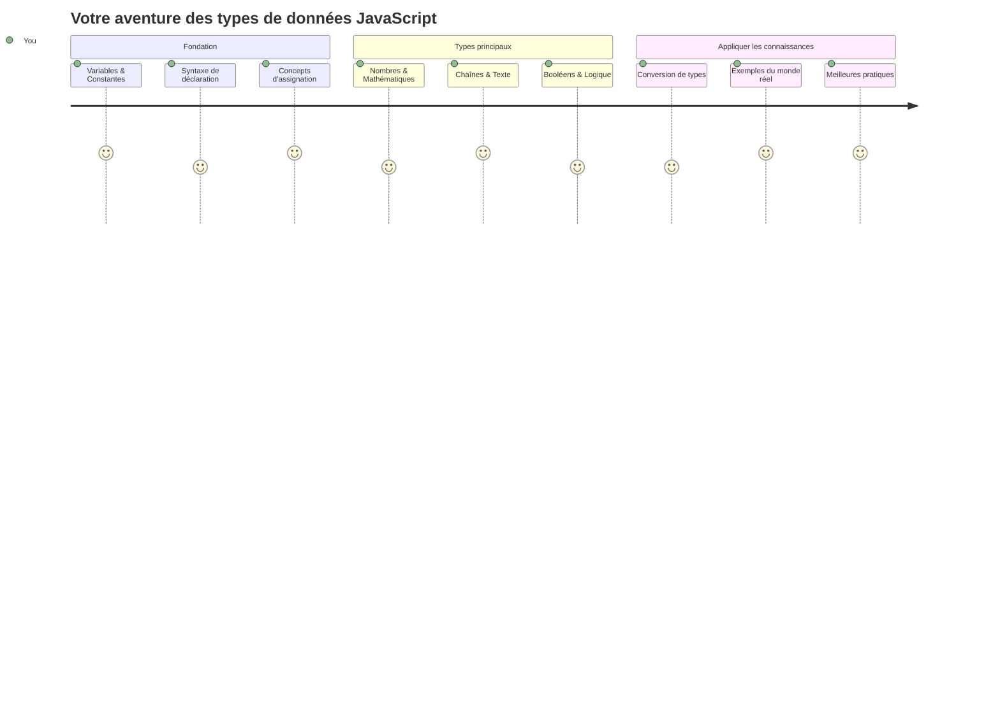
Les types de données sont l’un des concepts fondamentaux en JavaScript que vous rencontrerez dans chaque programme que vous écrivez. Pensez aux types de données comme au système de classement utilisé par les bibliothécaires anciens d’Alexandrie – ils avaient des places spécifiques pour les rouleaux contenant de la poésie, des mathématiques et des archives historiques. JavaScript organise les informations de manière similaire avec différentes catégories pour différents types de données.

Dans cette leçon, nous explorerons les types de données de base qui font fonctionner JavaScript. Vous apprendrez à manipuler des nombres, du texte, des valeurs vrai/faux, et comprendrez pourquoi choisir le bon type est essentiel pour vos programmes. Ces concepts peuvent sembler abstraits au début, mais avec la pratique, ils deviendront une seconde nature.

Comprendre les types de données rendra tout le reste en JavaScript beaucoup plus clair. Tout comme les architectes doivent comprendre les différents matériaux de construction avant de bâtir une cathédrale, ces fondamentaux soutiendront tout ce que vous construirez par la suite.

## Quiz avant la leçon
[Quiz avant la leçon](https://ff-quizzes.netlify.app/web/)

Cette leçon couvre les bases de JavaScript, le langage qui offre l’interactivité sur le web.

> Vous pouvez suivre cette leçon sur [Microsoft Learn](https://docs.microsoft.com/learn/modules/web-development-101-variables/?WT.mc_id=academic-77807-sagibbon) !

[](https://youtube.com/watch?v=JNIXfGiDWM8 "Variables en JavaScript")

[](https://youtube.com/watch?v=AWfA95eLdq8 "Types de données en JavaScript")

> 🎥 Cliquez sur les images ci-dessus pour des vidéos sur les variables et les types de données

Commençons par les variables et les types de données qui les remplissent !

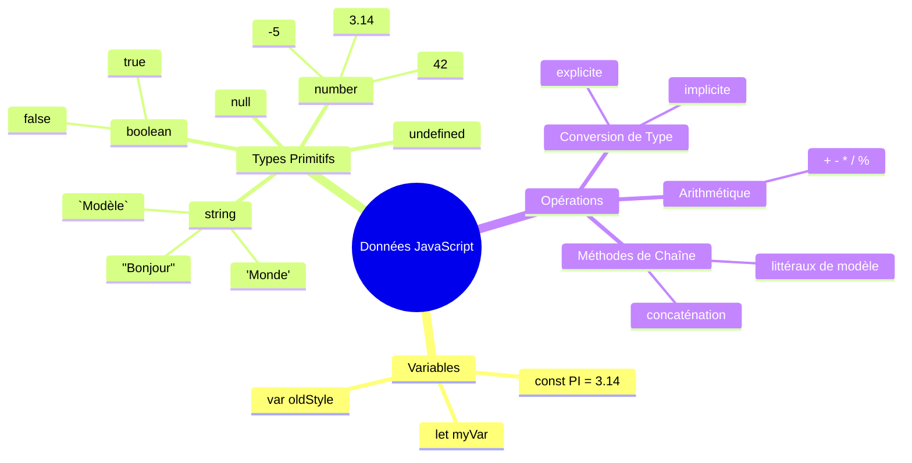
## Variables

Les variables sont des blocs de construction fondamentaux en programmation. Comme les pots étiquetés que les alchimistes médiévaux utilisaient pour stocker différentes substances, les variables vous permettent de stocker des informations et de leur donner un nom descriptif pour pouvoir y faire référence plus tard. Besoin de retenir l’âge de quelqu’un ? Stockez-le dans une variable appelée `age`. Vous voulez suivre le nom d’un utilisateur ? Gardez-le dans une variable appelée `userName`.

Nous nous concentrerons sur l’approche moderne pour créer des variables en JavaScript. Les techniques que vous apprendrez ici représentent des années d’évolution du langage et les meilleures pratiques développées par la communauté des programmeurs.

Créer et **déclarer** une variable suit la syntaxe suivante **[mot-clé] [nom]**. Elle se compose de deux parties :

- **Mot-clé**. Utilisez `let` pour les variables qui peuvent changer, ou `const` pour les valeurs qui restent les mêmes.
- **Le nom de la variable**, c’est un nom descriptif que vous choisissez vous-même.

✅ Le mot-clé `let` a été introduit dans ES6 et donne à votre variable ce qu’on appelle une _portée de bloc_ (block scope). Il est recommandé d’utiliser `let` ou `const` plutôt que l’ancien mot-clé `var`. Nous aborderons plus en détail les portées de bloc dans les futures parties.

### Tâche – travailler avec les variables

1. **Déclarez une variable**. Commençons par créer notre première variable :

    ```javascript
    let myVariable;
    ```

   **Ce que cela accomplit :**
   - Cela indique à JavaScript de créer un emplacement de stockage appelé `myVariable`
   - JavaScript alloue de l’espace en mémoire pour cette variable
   - La variable n’a actuellement aucune valeur (non définie)

2. **Donnez-lui une valeur**. Maintenant, mettons quelque chose dans notre variable :

    ```javascript
    myVariable = 123;
    ```

   **Comment fonctionne l’assignation :**
   - L’opérateur `=` assigne la valeur 123 à notre variable
   - La variable contient maintenant cette valeur au lieu d’être indéfinie
   - Vous pouvez référencer cette valeur dans tout votre code en utilisant `myVariable`

   > Remarque : l’utilisation de `=` dans cette leçon signifie que nous utilisons un « opérateur d’assignation », utilisé pour donner une valeur à une variable. Cela ne signifie pas d’égalité.

3. **Faites-le de manière intelligente**. En fait, combinons ces deux étapes :

    ```javascript
    let myVariable = 123;
    ```

    **Cette approche est plus efficace :**
    - Vous déclarez la variable et lui assignez une valeur dans une seule instruction
    - C’est la pratique standard parmi les développeurs
    - Cela réduit la longueur du code tout en maintenant la clarté

4. **Changez d’avis**. Que faire si l’on veut stocker un nombre différent ?

   ```javascript
   myVariable = 321;
   ```

   **Comprendre la réassignation :**
   - La variable contient maintenant 321 au lieu de 123
   - La valeur précédente est remplacée – les variables ne stockent qu’une valeur à la fois
   - Cette mutabilité est la caractéristique clé des variables déclarées avec `let`

   ✅ Essayez ! Vous pouvez écrire du JavaScript directement dans votre navigateur. Ouvrez une fenêtre de navigateur et accédez aux outils développeur. Dans la console, vous trouverez une invite ; tapez `let myVariable = 123`, appuyez sur entrée, puis tapez `myVariable`. Que se passe-t-il ? Notez que vous en apprendrez davantage sur ces concepts dans les leçons suivantes.

### 🧠 **Vérification de maîtrise : se familiariser avec les variables**

**Voyons comment vous vous sentez avec les variables :**
- Pouvez-vous expliquer la différence entre déclarer et assigner une variable ?
- Que se passe-t-il si vous essayez d’utiliser une variable avant de la déclarer ?
- Quand choisiriez-vous `let` plutôt que `const` pour une variable ?

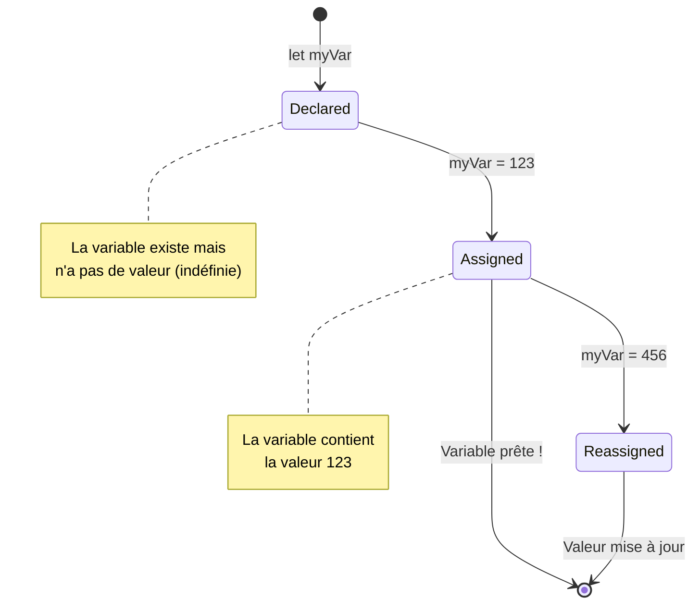
> **Conseil rapide** : Pensez aux variables comme à des boîtes de stockage étiquetées. Vous créez la boîte (`let`), y mettez quelque chose (`=`), et pouvez ensuite remplacer son contenu si nécessaire !

## Constantes

Parfois, vous devez stocker des informations qui ne doivent jamais changer pendant l’exécution du programme. Pensez aux constantes comme aux principes mathématiques que Euclide a établis dans la Grèce antique – une fois prouvés et documentés, ils sont restés fixes pour toutes références futures.

Les constantes fonctionnent de manière similaire aux variables, mais avec une restriction importante : une fois leur valeur assignée, elle ne peut pas être modifiée. Cette immutabilité aide à prévenir les modifications accidentelles de valeurs critiques dans votre programme.

La déclaration et l’initialisation d’une constante suivent les mêmes concepts qu’une variable, à l’exception du mot-clé `const`. Les constantes sont généralement déclarées en lettres majuscules.

```javascript
const MY_VARIABLE = 123;
```

**Voici ce que fait ce code :**
- **Crée** une constante nommée `MY_VARIABLE` avec la valeur 123
- **Utilise** une convention de nommage en majuscules pour les constantes
- **Empêche** toute modification future de cette valeur

Les constantes ont deux règles principales :

- **Vous devez leur donner une valeur tout de suite** – pas de constantes vides autorisées !
- **Vous ne pouvez jamais changer cette valeur** – JavaScript générera une erreur si vous essayez. Voyons ce que cela signifie :

   **Valeur simple** – Ce qui suit N’EST PAS autorisé :
   
      ```javascript
      const PI = 3;
      PI = 4; // non autorisé
      ```

   **À retenir :**
   - **Les tentatives** de réassignation d’une constante provoquent une erreur
   - **Protège** les valeurs importantes des modifications accidentelles
   - **Garantit** que la valeur reste constante dans tout votre programme
 
   **La référence à l’objet est protégée** – Ce qui suit N’EST PAS autorisé :
   
      ```javascript
      const obj = { a: 3 };
      obj = { b: 5 } // non autorisé
      ```

   **Comprendre ces concepts :**
   - **Empêche** de remplacer l’objet entier par un nouveau
   - **Protège** la référence à l’objet original
   - **Maintient** l’identité de l’objet en mémoire

    **La valeur de l’objet n’est pas protégée** – Ce qui suit EST autorisé :
    
      ```javascript
      const obj = { a: 3 };
      obj.a = 5;  // autorisé
      ```

      **Décomposer ce qui se passe ici :**
      - **Modifie** la valeur de la propriété dans l’objet
      - **Garde** la même référence d’objet
      - **Montre** que le contenu de l’objet peut changer alors que la référence reste constante

   > Notez qu’un `const` signifie que la référence est protégée de la réassignation. La valeur n’est pas _immuable_ cependant et peut changer, surtout s’il s’agit d’une structure complexe comme un objet.

## Types de données

JavaScript organise les informations en différentes catégories appelées types de données. Ce concept reflète la façon dont les savants anciens classaient la connaissance – Aristote distinguait entre différents types de raisonnements, sachant que les principes logiques ne pouvaient pas s’appliquer uniformément à la poésie, aux mathématiques et à la philosophie naturelle.

Les types de données sont importants car différentes opérations fonctionnent avec différents types d’informations. Tout comme vous ne pouvez pas faire des opérations arithmétiques sur le nom d’une personne ou alphabétiser une équation mathématique, JavaScript exige le type de donnée approprié pour chaque opération. Comprendre cela évite les erreurs et rend votre code plus fiable.

Les variables peuvent contenir de nombreux types différents de valeurs, comme des nombres et du texte. Ces différents types de valeurs sont connus sous le nom de **type de données**. Les types de données sont une partie importante du développement logiciel car ils aident les développeurs à prendre des décisions sur la façon dont le code doit être écrit et comment le logiciel doit fonctionner. De plus, certains types de données ont des caractéristiques uniques qui aident à transformer ou extraire des informations additionnelles d’une valeur.

✅ Les types de données sont également appelés les primitives de données JavaScript, car ce sont les types de données les plus élémentaires fournis par le langage. Il existe 7 types de primitives : string, number, bigint, boolean, undefined, null et symbol. Prenez un moment pour visualiser ce que chacun de ces primitives pourrait représenter. Qu’est-ce qu’un `zebra` ? Et `0` ? `true` ?

### Nombres

Les nombres sont le type de données le plus simple en JavaScript. Que vous travailliez avec des nombres entiers comme 42, des décimales comme 3.14 ou des nombres négatifs comme -5, JavaScript les gère de manière uniforme.

Vous vous souvenez de notre variable d’avant ? Ce 123 que nous avons stocké était en réalité un type de données nombre :

```javascript
let myVariable = 123;
```

**Caractéristiques clés :**
- JavaScript reconnaît automatiquement les valeurs numériques
- Vous pouvez effectuer des opérations mathématiques avec ces variables
- Aucune déclaration de type explicite n’est nécessaire

Les variables peuvent contenir tous les types de nombres, y compris les décimales ou les nombres négatifs. Les nombres peuvent aussi être utilisés avec les opérateurs arithmétiques, abordés dans la [section suivante](../../../../2-js-basics/1-data-types).

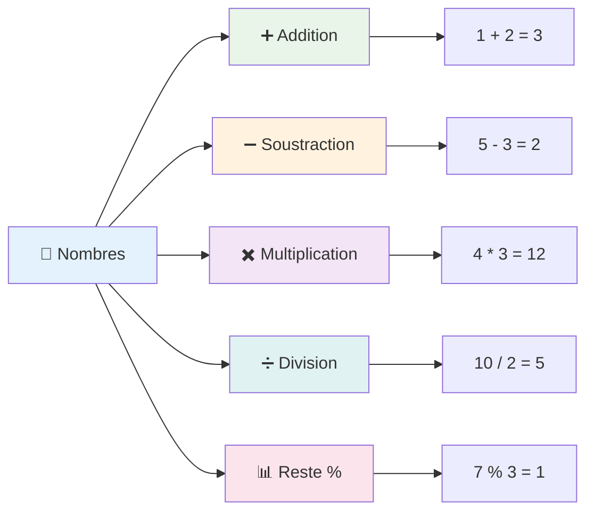
### Opérateurs arithmétiques

Les opérateurs arithmétiques vous permettent d’effectuer des calculs mathématiques en JavaScript. Ces opérateurs suivent les mêmes principes que ceux utilisés par les mathématiciens depuis des siècles – les mêmes symboles qui apparaissaient dans les travaux des savants comme Al-Khwarizmi, qui a développé la notation algébrique.

Les opérateurs fonctionnent comme vous l’attendez de la mathématique traditionnelle : plus pour l’addition, moins pour la soustraction, et ainsi de suite.

Il existe plusieurs types d’opérateurs à utiliser pour effectuer des fonctions arithmétiques, et certains sont listés ici :

| Symbole | Description                                                             | Exemple                          |
| ------- | ----------------------------------------------------------------------- | -------------------------------- |
| `+`     | **Addition** : Calcule la somme de deux nombres                         | `1 + 2 //réponse attendue : 3`   |
| `-`     | **Soustraction** : Calcule la différence entre deux nombres             | `1 - 2 //réponse attendue : -1`  |
| `*`     | **Multiplication** : Calcule le produit de deux nombres                 | `1 * 2 //réponse attendue : 2`   |
| `/`     | **Division** : Calcule le quotient de deux nombres                      | `1 / 2 //réponse attendue : 0.5` |
| `%`     | **Reste** : Calcule le reste de la division entre deux nombres          | `1 % 2 //réponse attendue : 1`   |

✅ Essayez ! Faites une opération arithmétique dans la console de votre navigateur. Les résultats vous surprennent-ils ?

### 🧮 **Vérification des compétences mathématiques : calculer avec confiance**

**Testez votre compréhension de l’arithmétique :**
- Quelle est la différence entre `/` (division) et `%` (reste) ?
- Pouvez-vous prédire ce que vaut `10 % 3` ? (Indice : ce n’est pas 3,33...)
- Pourquoi l’opérateur reste pourrait-il être utile en programmation ?

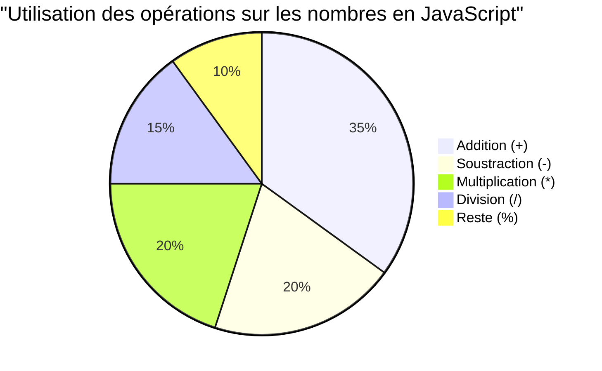
> **Un aperçu du monde réel** : L’opérateur reste (%) est extrêmement utile pour vérifier si des nombres sont pairs/impairs, créer des motifs, ou parcourir des tableaux en boucle !

### Chaînes de caractères

En JavaScript, les données textuelles sont représentées sous forme de chaînes de caractères. Le terme « chaîne » vient du concept de caractères enchaînés les uns aux autres en séquence, un peu comme les scribes des monastères médiévaux qui reliaient les lettres pour former des mots et des phrases dans leurs manuscrits.

Les chaînes sont fondamentales pour le développement web. Chaque morceau de texte affiché sur un site web – noms d’utilisateur, étiquettes de boutons, messages d’erreur, contenu – est traité comme des données de chaîne. Comprendre les chaînes est essentiel pour créer des interfaces utilisateur fonctionnelles.

Les chaînes sont des ensembles de caractères placés entre des guillemets simples ou doubles.

```javascript
'This is a string'
"This is also a string"
let myString = 'This is a string value stored in a variable';
```

**Comprendre ces concepts :**
- **Utilise** des guillemets simples `'` ou doubles `"` pour définir les chaînes
- **Stocke** des données textuelles pouvant inclure lettres, chiffres et symboles
- **Assigne** des valeurs de chaîne aux variables pour une utilisation ultérieure
- **Requiert** des guillemets pour distinguer le texte des noms de variables

N’oubliez pas d’utiliser des guillemets lors de l’écriture d’une chaîne, sinon JavaScript supposera qu’il s’agit d’un nom de variable.

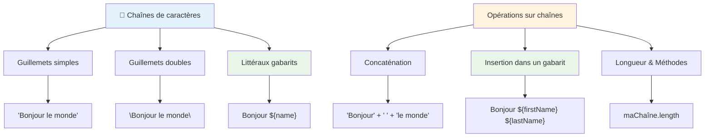
### Formatage des chaînes

La manipulation des chaînes vous permet de combiner des éléments de texte, incorporer des variables et créer un contenu dynamique qui réagit à l’état du programme. Cette technique vous permet de construire du texte de manière programmatique.

Souvent, vous avez besoin de joindre plusieurs chaînes – ce processus est appelé concaténation.
Pour **concaténer** deux chaînes ou plus, ou les joindre ensemble, utilisez l'opérateur `+`.

```javascript
let myString1 = "Hello";
let myString2 = "World";

myString1 + myString2 + "!"; //Bonjour le monde !
myString1 + " " + myString2 + "!"; //Bonjour le monde !
myString1 + ", " + myString2 + "!"; //Bonjour, le monde !
```

**Étape par étape, voici ce qui se passe :**
- **Combine** plusieurs chaînes en utilisant l'opérateur `+`
- **Joint** les chaînes directement sans espaces dans le premier exemple
- **Ajoute** des caractères d’espace `" "` entre les chaînes pour améliorer la lisibilité
- **Insère** une ponctuation comme des virgules pour créer un formatage correct

✅ Pourquoi `1 + 1 = 2` en JavaScript, mais `'1' + '1' = 11` ? Réfléchissez-y. Qu'en est-il de `'1' + 1` ?

**Les littéraux de gabarits** sont une autre façon de formater les chaînes, sauf qu’au lieu des guillemets, on utilise l’accent grave. Tout ce qui n'est pas du texte brut doit être placé à l'intérieur des espaces réservés `${ }`. Cela inclut toutes les variables qui peuvent être des chaînes.

```javascript
let myString1 = "Hello";
let myString2 = "World";

`${myString1} ${myString2}!` //Bonjour le monde !
`${myString1}, ${myString2}!` //Bonjour, le monde !
```

**Comprenons chaque partie :**
- **Utilise** les accents graves `` ` `` au lieu des guillemets ordinaires pour créer des littéraux de gabarits
- **Intègre** directement les variables à l’aide de la syntaxe de l’espace réservé `${}`
- **Préserve** les espaces et le formatage exactement comme écrits
- **Fournit** un moyen plus propre de créer des chaînes complexes avec des variables

Vous pouvez atteindre vos objectifs de formatage avec l’une ou l’autre méthode, mais les littéraux de gabarits respecteront tous les espaces et sauts de ligne.

✅ Quand utiliseriez-vous un littéral de gabarit plutôt qu’une chaîne simple ?

### 🔤 **Vérification de Maîtrise des Chaînes : Confiance en Manipulation de Texte**

**Évaluez vos compétences avec les chaînes :**
- Pouvez-vous expliquer pourquoi `'1' + '1'` est égal à `'11'` au lieu de `2` ?
- Quelle méthode de chaîne trouvez-vous plus lisible : la concaténation ou les littéraux de gabarits ?
- Que se passe-t-il si vous oubliez les guillemets autour d’une chaîne ?

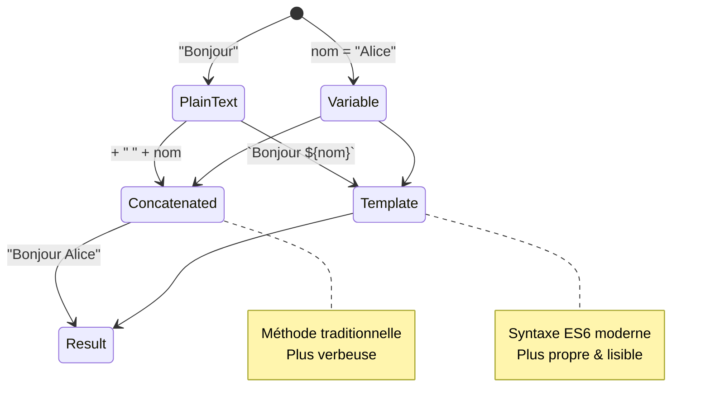
> **Astuce pro** : Les littéraux de gabarits sont généralement préférés pour construire des chaînes complexes car ils sont plus lisibles et gèrent magnifiquement les chaînes multilignes !

### Booléens

Les booléens représentent la forme la plus simple de données : ils ne peuvent contenir que l’une des deux valeurs – `true` ou `false`. Ce système logique binaire remonte aux travaux de George Boole, un mathématicien du 19e siècle qui a développé l’algèbre booléenne.

Malgré leur simplicité, les booléens sont essentiels à la logique des programmes. Ils permettent à votre code de prendre des décisions en fonction de conditions – qu’un utilisateur soit connecté, qu’un bouton ait été cliqué ou que certains critères soient remplis.

Les booléens ne peuvent avoir que deux valeurs : `true` ou `false`. Ils peuvent aider à décider quelles lignes de code doivent s’exécuter lorsque certaines conditions sont remplies. Dans de nombreux cas, les [opérateurs](../../../../2-js-basics/1-data-types) aident à définir la valeur d’un booléen et vous remarquerez souvent que des variables sont initialisées ou leurs valeurs mises à jour avec un opérateur.

```javascript
let myTrueBool = true;
let myFalseBool = false;
```

**Dans l’exemple ci-dessus, nous avons :**
- **Créé** une variable qui stocke la valeur booléenne `true`
- **Démontré** comment stocker la valeur booléenne `false`
- **Utilisé** les mots-clés exacts `true` et `false` (pas besoin de guillemets)
- **Préparé** ces variables pour les utiliser dans des instructions conditionnelles

✅ Une variable peut être considérée comme « truthy » si elle s’évalue à un booléen `true`. Il est intéressant de noter qu’en JavaScript, [toutes les valeurs sont truthy à moins qu’elles ne soient définies comme falsy](https://developer.mozilla.org/docs/Glossary/Truthy).

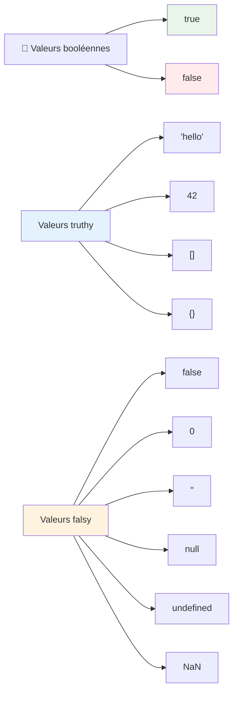
### 🎯 **Vérification de Logique Booléenne : Compétences en Prise de Décision**

**Testez votre compréhension des booléens :**
- Pourquoi pensez-vous que JavaScript a des valeurs « truthy » et « falsy » au-delà de juste `true` et `false` ?
- Pouvez-vous prédire laquelle de ces valeurs est falsy : `0`, `"0"`, `[]`, `"false"` ?
- En quoi les booléens peuvent-ils être utiles pour contrôler le flux d’un programme ?

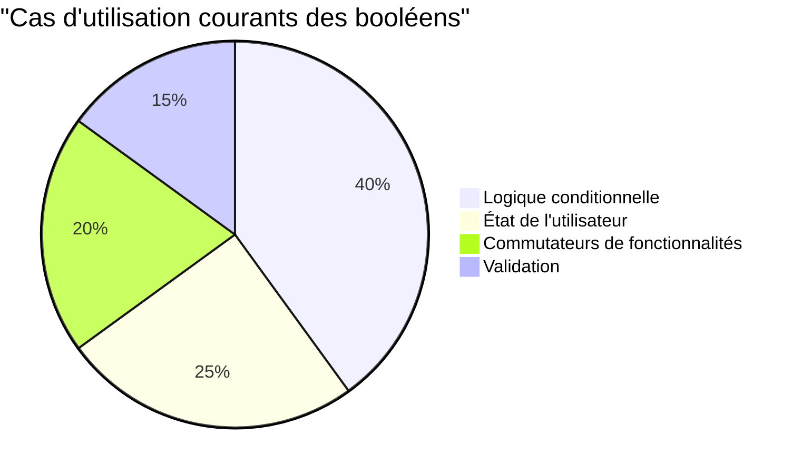
> **Rappel** : En JavaScript, seules 6 valeurs sont falsy : `false`, `0`, `""`, `null`, `undefined` et `NaN`. Tout le reste est truthy !

---

## 📊 **Votre Résumé de la Boîte à Outils des Types de Données**

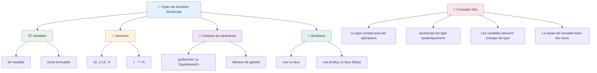
## Défi Agent GitHub Copilot 🚀

Utilisez le mode Agent pour relever le défi suivant :

**Description :** Créez un gestionnaire d’informations personnelles qui démontre tous les types de données JavaScript appris dans cette leçon tout en gérant des scénarios de données du monde réel.

**Consigne :** Construisez un programme JavaScript qui crée un objet profil utilisateur contenant : le nom d’une personne (chaîne), l’âge (nombre), le statut d’étudiant (booléen), les couleurs préférées sous forme de tableau, et un objet adresse avec des propriétés rue, ville et code postal. Incluez des fonctions pour afficher les informations du profil et mettre à jour les champs individuels. Assurez-vous de démontrer la concaténation de chaînes, les littéraux de gabarits, les opérations arithmétiques sur l’âge, et la logique booléenne pour le statut étudiant.

En savoir plus sur le [mode agent](https://code.visualstudio.com/blogs/2025/02/24/introducing-copilot-agent-mode) ici.

## 🚀 Défi

JavaScript a certains comportements qui peuvent surprendre les développeurs. Voici un exemple classique à explorer : essayez de taper ceci dans la console de votre navigateur : `let age = 1; let Age = 2; age == Age` et observez le résultat. Il retourne `false` – pouvez-vous déterminer pourquoi ?

Cela représente l’un des nombreux comportements JavaScript qu’il vaut la peine de comprendre. Une familiarité avec ces particularités vous aidera à écrire un code plus fiable et à déboguer plus efficacement.

## Quiz post-cours
[Quiz post-cours](https://ff-quizzes.netlify.app)

## Revue & Auto-apprentissage

Jetez un œil à [cette liste d’exercices JavaScript](https://css-tricks.com/snippets/javascript/) et essayez-en un. Qu’avez-vous appris ?

## Devoir

[Pratique des types de données](assignment.md)

## 🚀 Votre Chronologie de Maîtrise des Types de Données JavaScript

### ⚡ **Ce que vous pouvez faire dans les 5 prochaines minutes**
- [ ] Ouvrir la console de votre navigateur et créer 3 variables avec des types de données différents
- [ ] Essayer le défi : `let age = 1; let Age = 2; age == Age` et comprendre pourquoi c’est faux
- [ ] Pratiquer la concaténation de chaînes avec votre nom et votre nombre préféré
- [ ] Tester ce qui se passe lorsque vous ajoutez un nombre à une chaîne

### 🎯 **Ce que vous pouvez accomplir cette heure**
- [ ] Compléter le quiz post-cours et revoir les concepts confus
- [ ] Créer une mini-calculatrice qui additionne, soustrait, multiplie et divise deux nombres
- [ ] Construire un formateur de noms simple utilisant des littéraux de gabarits
- [ ] Explorer les différences entre les opérateurs de comparaison `==` et `===`
- [ ] Pratiquer la conversion entre différents types de données

### 📅 **Votre fondation JavaScript sur une semaine**
- [ ] Compléter le devoir avec confiance et créativité
- [ ] Créer un objet profil personnel utilisant tous les types de données appris
- [ ] Pratiquer avec les [exercices JavaScript de CSS-Tricks](https://css-tricks.com/snippets/javascript/)
- [ ] Construire un validateur de formulaire simple utilisant la logique booléenne
- [ ] Expérimenter avec les types de données tableau et objet (aperçu des leçons à venir)
- [ ] Rejoindre une communauté JavaScript et poser des questions sur les types de données

### 🌟 **Votre transformation sur un mois**
- [ ] Intégrer les connaissances sur les types de données dans de plus grands projets de programmation
- [ ] Comprendre quand et pourquoi utiliser chaque type de données dans des applications réelles
- [ ] Aider d’autres débutants à comprendre les fondamentaux de JavaScript
- [ ] Construire une petite application qui gère différents types de données utilisateur
- [ ] Explorer des concepts avancés de types de données comme la coercition de type et l’égalité stricte
- [ ] Contribuer à des projets JavaScript open source avec des améliorations de documentation

### 🧠 **Contrôle final de maîtrise des types de données**

**Célébrez votre fondation JavaScript :**
- Quel type de donnée vous a le plus surpris par son comportement ?
- À quel point vous sentez-vous à l’aise pour expliquer les variables vs constantes à un ami ?
- Quelle est la chose la plus intéressante que vous ayez découverte sur le système de types de JavaScript ?
- Quelle application réelle pouvez-vous imaginer construire avec ces fondamentaux ?

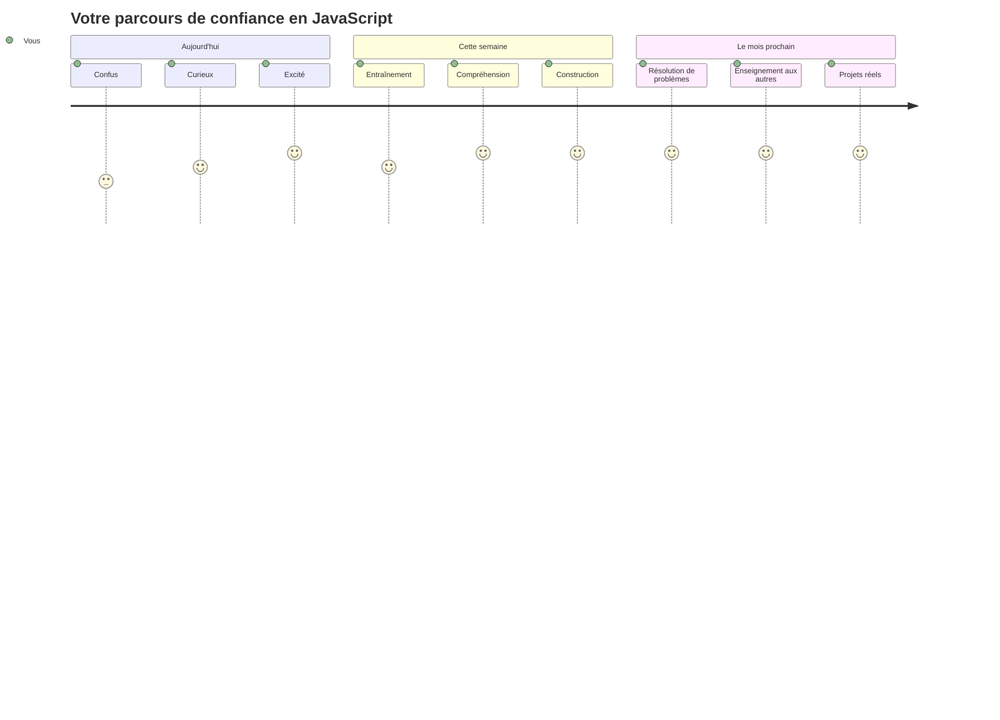
> 💡 **Vous avez construit la fondation !** Comprendre les types de données, c’est comme apprendre l’alphabet avant d’écrire des histoires. Chaque programme JavaScript que vous écrirez utilisera ces concepts fondamentaux. Vous avez maintenant les bases pour créer des sites web interactifs, des applications dynamiques et résoudre des problèmes du monde réel avec du code. Bienvenue dans le merveilleux monde de JavaScript ! 🎉

---

<!-- CO-OP TRANSLATOR DISCLAIMER START -->
**Avertissement** :  
Ce document a été traduit à l’aide du service de traduction automatique [Co-op Translator](https://github.com/Azure/co-op-translator). Bien que nous nous efforçons d’assurer l’exactitude, veuillez noter que les traductions automatisées peuvent contenir des erreurs ou des inexactitudes. Le document original dans sa langue d’origine doit être considéré comme la source faisant foi. Pour les informations critiques, il est recommandé de recourir à une traduction professionnelle réalisée par un humain. Nous ne pouvons être tenus responsables des malentendus ou des interprétations erronées résultant de l’utilisation de cette traduction.
<!-- CO-OP TRANSLATOR DISCLAIMER END -->