<!--
CO_OP_TRANSLATOR_METADATA:
{
  "original_hash": "71f7d7dafa1c7194d79ddac87f669ff9",
  "translation_date": "2026-01-06T06:01:46+00:00",
  "source_file": "2-js-basics/2-functions-methods/README.md",
  "language_code": "fr"
}
-->
# Les bases de JavaScript : Méthodes et Fonctions

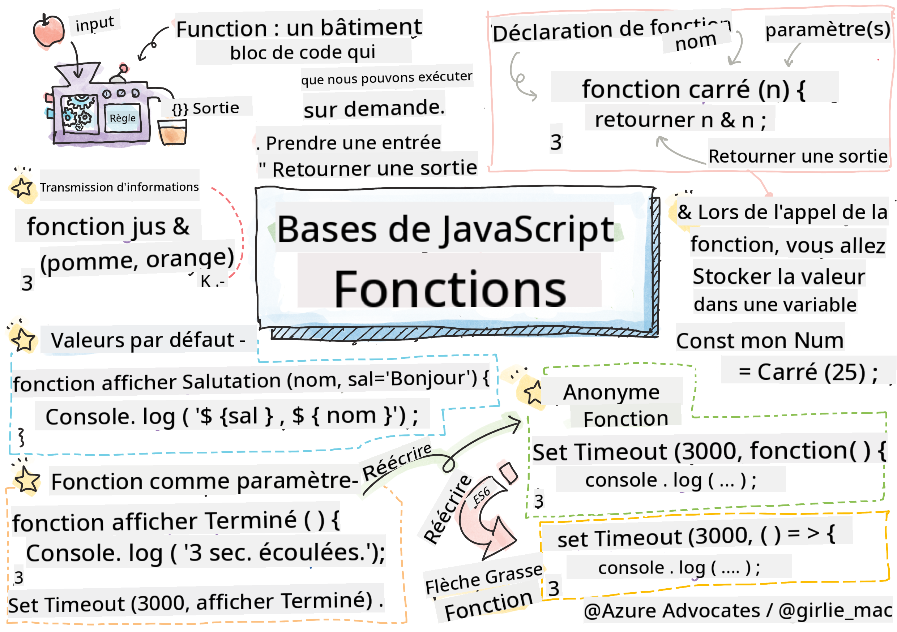
> Sketchnote par [Tomomi Imura](https://twitter.com/girlie_mac)

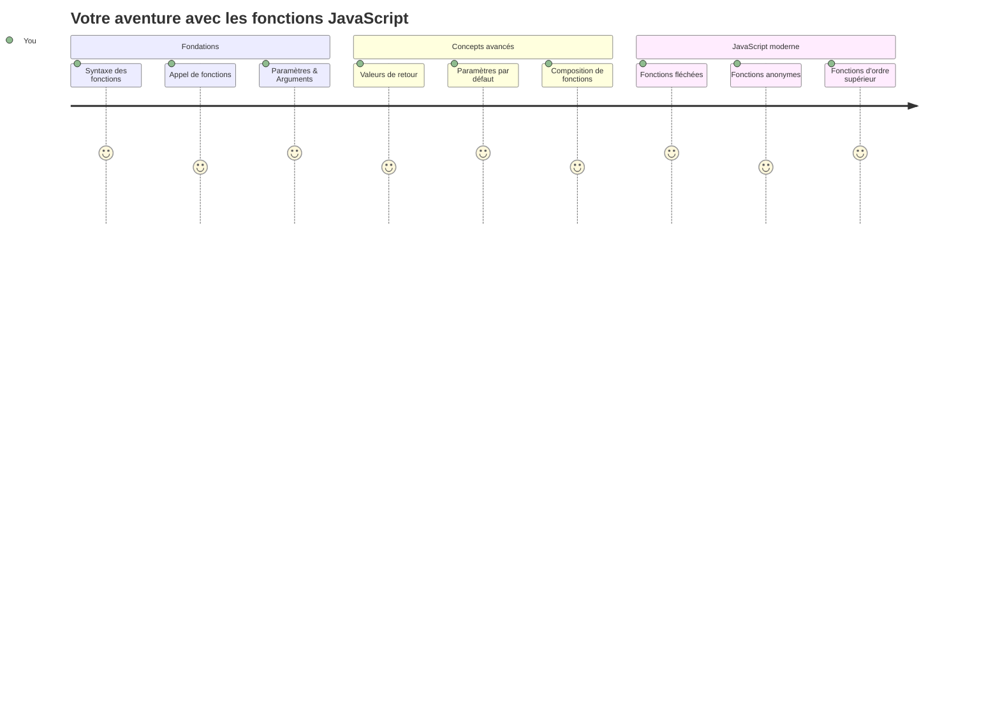
## Quiz avant la leçon
[Quiz avant la leçon](https://ff-quizzes.netlify.app)

Répéter le même code plusieurs fois est l'une des frustrations les plus courantes en programmation. Les fonctions résolvent ce problème en vous permettant d'encapsuler du code dans des blocs réutilisables. Pensez aux fonctions comme aux pièces standardisées qui ont rendu la chaîne de montage de Henry Ford révolutionnaire – une fois que vous créez un composant fiable, vous pouvez l’utiliser partout où c’est nécessaire sans le reconstruire de zéro.

Les fonctions vous permettent de regrouper des morceaux de code afin de pouvoir les réutiliser tout au long de votre programme. Plutôt que de copier-coller la même logique partout, vous pouvez créer une fonction une fois et l’appeler quand vous en avez besoin. Cette approche garde votre code organisé et facilite grandement les mises à jour.

Dans cette leçon, vous apprendrez à créer vos propres fonctions, à leur transmettre des informations, et à récupérer des résultats utiles. Vous découvrirez la différence entre fonctions et méthodes, apprendrez des syntaxes modernes, et verrez comment les fonctions peuvent collaborer entre elles. Nous construirons ces concepts étape par étape.

[](https://youtube.com/watch?v=XgKsD6Zwvlc "Methods and Functions")

> 🎥 Cliquez sur l’image ci-dessus pour une vidéo sur les méthodes et fonctions.

> Vous pouvez suivre cette leçon sur [Microsoft Learn](https://docs.microsoft.com/learn/modules/web-development-101-functions/?WT.mc_id=academic-77807-sagibbon) !

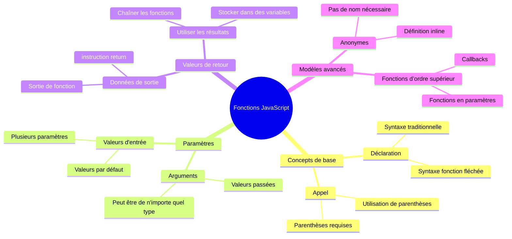
## Fonctions

Une fonction est un bloc de code autonome qui réalise une tâche spécifique. Elle encapsule une logique que vous pouvez exécuter quand vous le souhaitez.

Au lieu d’écrire plusieurs fois le même code dans votre programme, vous pouvez l’encapsuler dans une fonction et appeler cette fonction chaque fois que vous en avez besoin. Cette approche maintient votre code propre et facilite grandement les mises à jour. Imaginez la difficulté de maintenance si vous deviez modifier une logique éparpillée dans 20 endroits différents de votre base de code.

Nommer vos fonctions de façon descriptive est essentiel. Une fonction bien nommée communique clairement son but – quand vous voyez `cancelTimer()`, vous comprenez immédiatement ce qu’elle fait, tout comme un bouton clairement étiqueté vous indique exactement ce qui se passera lorsque vous cliquez dessus.

## Créer et appeler une fonction

Examinons comment créer une fonction. La syntaxe suit un modèle cohérent :

```javascript
function nameOfFunction() { // définition de fonction
 // définition/corps de fonction
}
```

Décomposons cela :
- Le mot-clé `function` indique à JavaScript « Hé, je crée une fonction ! »
- `nameOfFunction` est l’endroit où vous donnez un nom descriptif à votre fonction
- Les parenthèses `()` sont là où vous pouvez ajouter des paramètres (nous y reviendrons bientôt)
- Les accolades `{}` contiennent le code qui s’exécute quand vous appelez la fonction

Créons une fonction simple de salutation pour voir cela en action :

```javascript
function displayGreeting() {
  console.log('Hello, world!');
}
```

Cette fonction affiche « Hello, world! » dans la console. Une fois définie, vous pouvez l’utiliser autant de fois que nécessaire.

Pour exécuter (ou « appeler ») votre fonction, écrivez son nom suivi de parenthèses. JavaScript vous permet de définir votre fonction avant ou après son appel – le moteur JavaScript gérera l’ordre d’exécution.

```javascript
// appel de notre fonction
displayGreeting();
```

Lorsque vous exécutez cette ligne, tout le code à l’intérieur de la fonction `displayGreeting` s’exécute, affichant « Hello, world! » dans la console de votre navigateur. Vous pouvez appeler cette fonction autant de fois que vous le souhaitez.

### 🧠 **Vérification des fondamentaux des fonctions : Construire vos premières fonctions**

**Voyons comment vous comprenez les fonctions de base :**
- Pouvez-vous expliquer pourquoi on utilise les accolades `{}` dans la définition des fonctions ?
- Que se passe-t-il si vous écrivez `displayGreeting` sans les parenthèses ?
- Pourquoi voudriez-vous appeler la même fonction plusieurs fois ?

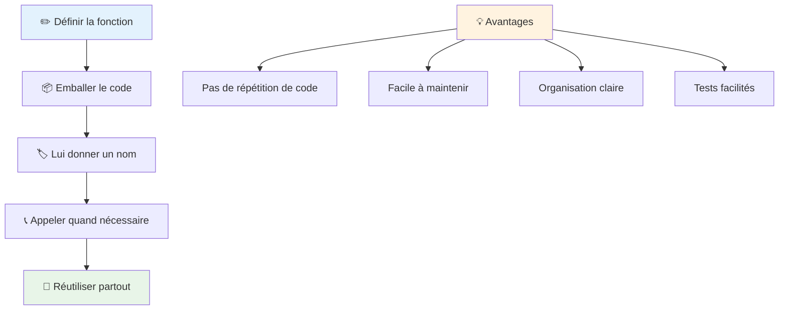
> **Note :** Vous avez utilisé des **méthodes** tout au long de ces leçons. `console.log()` est une méthode – essentiellement une fonction qui appartient à l’objet `console`. La principale différence est que les méthodes sont attachées à des objets, tandis que les fonctions sont indépendantes. Beaucoup de développeurs utilisent ces termes indifféremment dans la conversation courante.

### Bonnes pratiques des fonctions

Voici quelques conseils pour vous aider à écrire de bonnes fonctions :

- Donnez à vos fonctions des noms clairs et descriptifs – votre futur vous vous en remerciera !
- Utilisez le **camelCase** pour les noms composés (comme `calculateTotal` plutôt que `calculate_total`)
- Gardez chaque fonction concentrée sur une seule tâche

## Passer des informations à une fonction

Notre fonction `displayGreeting` est limitée – elle ne peut afficher que « Hello, world! » pour tout le monde. Les paramètres nous permettent de rendre les fonctions plus flexibles et utiles.

Les **paramètres** agissent comme des espaces réservés dans lesquels vous insérez des valeurs différentes à chaque appel de la fonction. De cette manière, la même fonction peut fonctionner avec des informations différentes à chaque utilisation.

Vous listez les paramètres à l’intérieur des parenthèses lors de la définition de votre fonction, en séparant plusieurs paramètres par des virgules :

```javascript
function name(param, param2, param3) {

}
```

Chaque paramètre agit comme un espace réservé – lorsque quelqu’un appelle votre fonction, il fournit des valeurs réelles qui remplacent ces espaces.

Modifions notre fonction de salutation pour qu’elle accepte le nom de quelqu’un :

```javascript
function displayGreeting(name) {
  const message = `Hello, ${name}!`;
  console.log(message);
}
```

Remarquez comment nous utilisons les backticks (`` ` ``) et `${}` pour insérer le nom directement dans le message – cela s’appelle un template literal, et c’est un moyen très pratique de construire des chaînes de caractères avec des variables intégrées.

Maintenant, lorsque nous appelons notre fonction, nous pouvons passer n’importe quel nom :

```javascript
displayGreeting('Christopher');
// displays "Hello, Christopher!" when run
```

JavaScript prend la chaîne `'Christopher'`, l’affecte au paramètre `name`, et crée le message personnalisé « Hello, Christopher! »

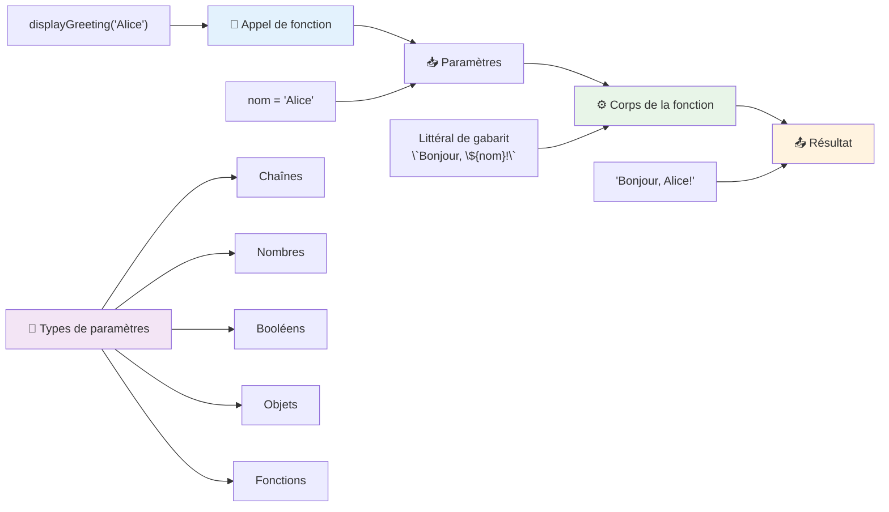
## Valeurs par défaut

Que se passe-t-il si on veut rendre certains paramètres optionnels ? C’est là qu’interviennent les valeurs par défaut !

Disons que l’on veut que les gens puissent personnaliser le mot de salutation, mais si aucun n’est donné, on utilisera simplement « Hello » par défaut. Vous pouvez définir des valeurs par défaut en utilisant le signe égal, comme pour la définition d’une variable :

```javascript
function displayGreeting(name, salutation='Hello') {
  console.log(`${salutation}, ${name}`);
}
```

Ici, `name` est toujours requis, mais `salutation` a une valeur de secours `'Hello'` si personne ne fournit une salutation différente.

Nous pouvons maintenant appeler cette fonction de deux manières différentes :

```javascript
displayGreeting('Christopher');
// affiche "Bonjour, Christopher"

displayGreeting('Christopher', 'Hi');
// affiche "Salut, Christopher"
```

Au premier appel, JavaScript utilise la valeur par défaut « Hello » puisque nous n’avons pas spécifié de salutation. Au second appel, il utilise notre salutation personnalisée « Hi ». Cette flexibilité rend les fonctions adaptables à différents cas d’usage.

### 🎛️ **Vérification de maîtrise des paramètres : rendre les fonctions flexibles**

**Testez votre compréhension des paramètres :**
- Quelle est la différence entre un paramètre et un argument ?
- Pourquoi les valeurs par défaut sont-elles utiles en programmation réelle ?
- Pouvez-vous prédire ce qui se passe si vous passez plus d’arguments que de paramètres ?

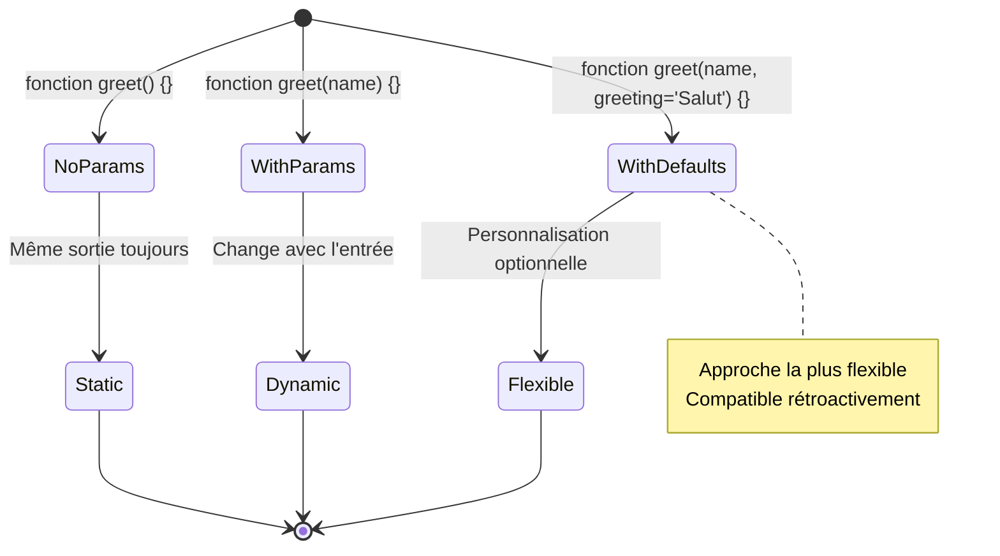
> **Astuce professionnelle** : Les paramètres par défaut rendent vos fonctions plus conviviales. Les utilisateurs peuvent commencer rapidement avec des valeurs par défaut sensées, mais personnalisent quand c’est nécessaire !

## Valeurs de retour

Jusqu’à présent, nos fonctions se contentaient d’afficher des messages dans la console, mais que faire si vous voulez que la fonction calcule quelque chose et vous renvoie le résultat ?

C’est là où les **valeurs de retour** entrent en jeu. Au lieu de simplement afficher quelque chose, une fonction peut vous rendre une valeur que vous pouvez stocker dans une variable ou utiliser dans d’autres parties de votre code.

Pour retourner une valeur, vous utilisez le mot-clé `return` suivi de ce que vous souhaitez renvoyer :

```javascript
return myVariable;
```

Voici un point important : quand une fonction rencontre une instruction `return`, elle s’arrête immédiatement et renvoie cette valeur à l’appelant.

Modifions notre fonction de salutation pour qu’elle retourne le message au lieu de l’afficher :

```javascript
function createGreetingMessage(name) {
  const message = `Hello, ${name}`;
  return message;
}
```

Maintenant au lieu d’afficher la salutation, cette fonction crée le message et nous le renvoie.

Pour utiliser la valeur retournée, on peut la stocker dans une variable comme n’importe quelle autre valeur :

```javascript
const greetingMessage = createGreetingMessage('Christopher');
```

Désormais, `greetingMessage` contient « Hello, Christopher » et nous pouvons l’utiliser partout dans notre code – l’afficher sur une page web, l’inclure dans un mail, ou la passer à une autre fonction.

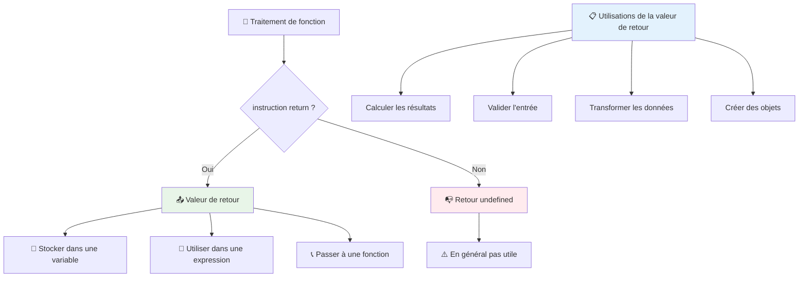
### 🔄 **Vérification des valeurs de retour : récupérer des résultats**

**Évaluez votre compréhension des valeurs de retour :**
- Que se passe-t-il avec le code placé après une instruction `return` dans une fonction ?
- Pourquoi retourner une valeur est souvent meilleur qu’afficher directement dans la console ?
- Une fonction peut-elle retourner différents types de valeurs (chaîne, nombre, booléen) ?

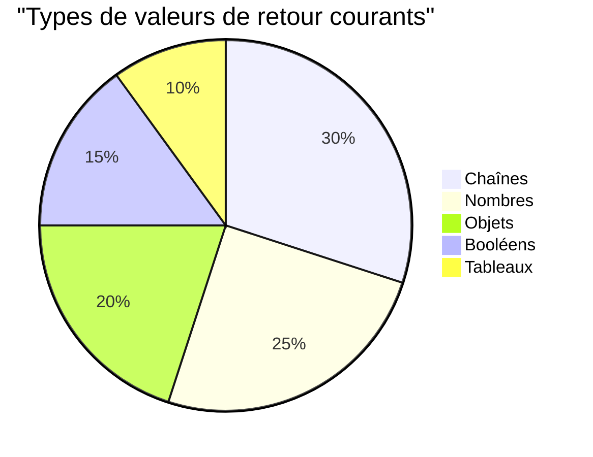
> **Insight clé :** Les fonctions qui retournent des valeurs sont plus polyvalentes parce que l’appelant décide quoi faire du résultat. Cela rend votre code plus modulaire et réutilisable !

## Passer des fonctions en paramètres à d’autres fonctions

Les fonctions peuvent être passées comme paramètres à d’autres fonctions. Bien que ce concept puisse sembler compliqué au début, c’est une fonctionnalité puissante qui permet des schémas de programmation flexibles.

Ce pattern est très courant quand vous voulez dire « quand quelque chose se produit, fais cette autre chose ». Par exemple, « quand le minuteur se termine, exécute ce code » ou « quand l’utilisateur clique sur le bouton, appelle cette fonction ».

Regardons `setTimeout`, une fonction intégrée qui attend un certain temps puis exécute du code. Il faut lui dire quel code exécuter – parfait pour passer une fonction !

Essayez ce code – après 3 secondes, vous verrez un message :

```javascript
function displayDone() {
  console.log('3 seconds has elapsed');
}
// la valeur du minuteur est en millisecondes
setTimeout(displayDone, 3000);
```

Remarquez comment nous passons `displayDone` (sans parenthèses) à `setTimeout`. Nous n’appelons pas la fonction nous-mêmes – nous la remettons à `setTimeout` en disant « appelle ceci dans 3 secondes ».

### Fonctions anonymes

Parfois, vous avez besoin d’une fonction pour une seule chose et ne voulez pas lui donner un nom. Réfléchissez : si vous utilisez une fonction une seule fois, pourquoi encombrer votre code avec un nom supplémentaire ?

JavaScript vous permet de créer des **fonctions anonymes** – fonctions sans nom que vous définissez directement là où elles sont nécessaires.

Voici comment réécrire notre exemple de minuterie avec une fonction anonyme :

```javascript
setTimeout(function() {
  console.log('3 seconds has elapsed');
}, 3000);
```

Cela donne le même résultat, mais la fonction est définie directement dans l’appel à `setTimeout`, éliminant le besoin d’une déclaration de fonction séparée.

### Fonctions fléchées

JavaScript moderne offre un moyen encore plus court d’écrire des fonctions appelé **fonctions fléchées**. Elles utilisent `=>` (qui ressemble à une flèche – vous voyez ?) et sont très populaires chez les développeurs.

Les fonctions fléchées vous permettent d’éviter le mot-clé `function` et d’écrire un code plus concis.

Voici notre exemple de minuterie avec une fonction fléchée :

```javascript
setTimeout(() => {
  console.log('3 seconds has elapsed');
}, 3000);
```

Les `()` représentent l’endroit des paramètres (vide ici), puis vient la flèche `=>`, et enfin le corps de la fonction entre accolades. Cela fournit la même fonctionnalité avec une syntaxe plus concise.

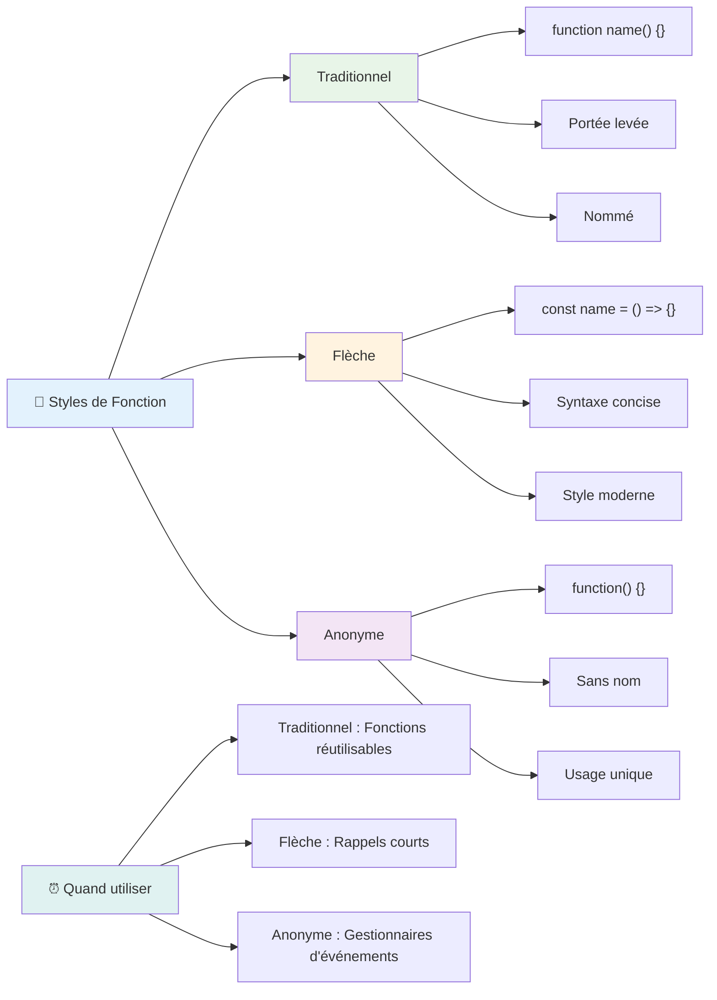
### Quand utiliser chaque approche

Quand faut-il utiliser chaque approche ? Une bonne règle pratique : si vous allez utiliser la fonction plusieurs fois, donnez-lui un nom et définissez-la séparément. Si c’est pour un usage spécifique unique, considérez une fonction anonyme. Les fonctions fléchées et la syntaxe traditionnelle sont valides, bien que les fonctions fléchées soient très répandues dans les bases de code JavaScript modernes.

### 🎨 **Vérification du style des fonctions : choisir la bonne syntaxe**

**Testez votre compréhension de la syntaxe :**
- Quand pourriez-vous préférer les fonctions fléchées à la syntaxe traditionnelle des fonctions ?
- Quel est le principal avantage des fonctions anonymes ?
- Pouvez-vous imaginer une situation où une fonction nommée est meilleure qu’une anonyme ?

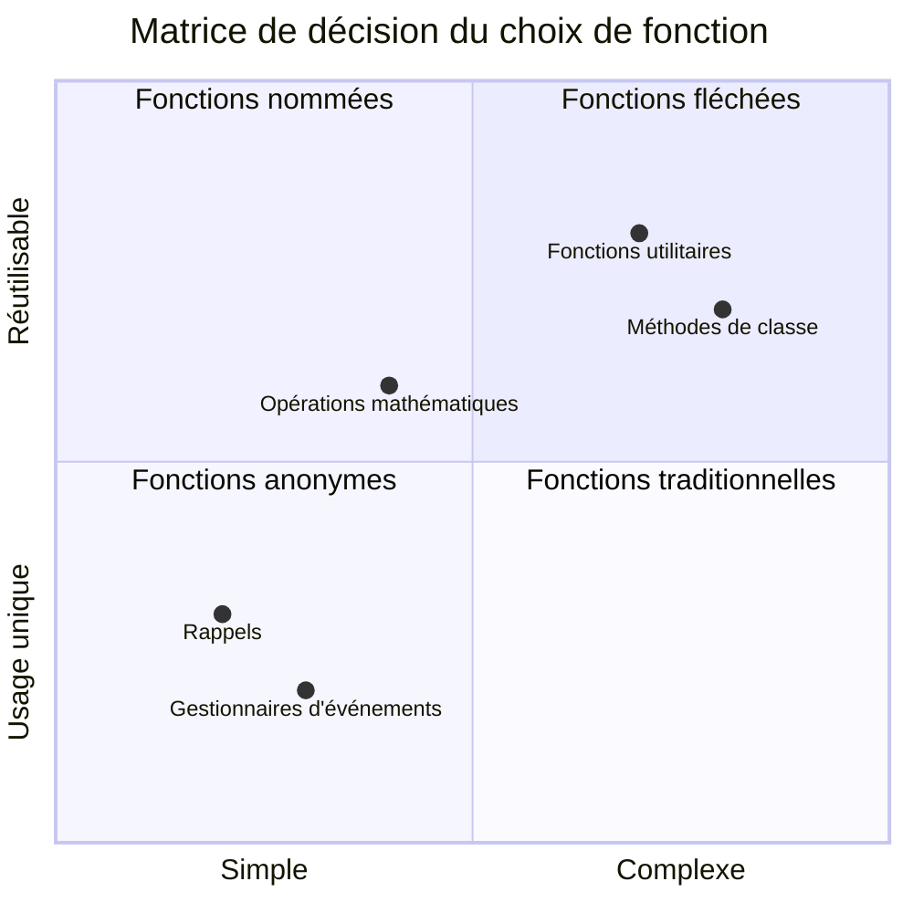
> **Tendance moderne :** Les fonctions fléchées deviennent le choix par défaut pour beaucoup de développeurs grâce à leur syntaxe concise, mais les fonctions traditionnelles ont encore leur place !

---

## 🚀 Challenge

Pouvez-vous formuler en une phrase la différence entre fonctions et méthodes ? Essayez !

## Challenge GitHub Copilot Agent 🚀

Utilisez le mode Agent pour relever le défi suivant :

**Description :** Créez une bibliothèque utilitaire de fonctions mathématiques qui illustre différents concepts de fonctions vus dans cette leçon, y compris paramètres, valeurs par défaut, valeurs de retour, et fonctions fléchées.

**Consigne :** Créez un fichier JavaScript appelé `mathUtils.js` contenant les fonctions suivantes :
1. Une fonction `add` qui prend deux paramètres et retourne leur somme
2. Une fonction `multiply` avec des valeurs par défaut pour les paramètres (le second paramètre par défaut vaut 1)
3. Une fonction fléchée `square` qui prend un nombre et retourne son carré
4. Une fonction `calculate` qui accepte une autre fonction en paramètre et deux nombres, puis applique cette fonction à ces nombres
5. Montrez l’appel de chaque fonction avec des cas tests appropriés

Pour en savoir plus sur [le mode agent](https://code.visualstudio.com/blogs/2025/02/24/introducing-copilot-agent-mode).

## Quiz après la leçon
[Quiz après la leçon](https://ff-quizzes.netlify.app)

## Révision & Autoformation

Il vaut la peine de [se documenter un peu plus sur les fonctions fléchées](https://developer.mozilla.org/docs/Web/JavaScript/Reference/Functions/Arrow_functions), car elles sont de plus en plus utilisées dans les bases de code. Entraînez-vous à écrire une fonction puis à la réécrire avec cette syntaxe.

## Devoir

[Amusez-vous avec les fonctions](assignment.md)

---

## 🧰 **Résumé de votre boîte à outils JavaScript Functions**

```mermaid
graph TD
    A["🎯 Fonctions JavaScript"] --> B["📋 Déclaration de fonction"]
    A --> C["📥 Paramètres"]
    A --> D["📤 Valeurs de retour"]
    A --> E["🎨 Syntaxe moderne"]
    
    B --> B1["function name() {}"]
    B --> B2["Nommage descriptif"]
    B --> B3["Blocs de code réutilisables"]
    
    C --> C1["Données d'entrée"]
    C --> C2["Valeurs par défaut"]
    C --> C3["Paramètres multiples"]
    
    D --> D1["instruction return"]
    D --> D2["Sortie de la fonction"]
    D --> D3["Retourner des données"]
    
    E --> E1["Fonctions fléchées : () =>"]
    E --> E2["Fonctions anonymes"]
    E --> E3["Fonctions d'ordre supérieur"]
    
    F["⚡ Avantages clés"] --> F1["Réutilisabilité du code"]
    F --> F2["Meilleure organisation"]
    F --> F3["Tests facilités"]
    F --> F4["Conception modulaire"]
    
    style A fill:#e3f2fd
    style B fill:#e8f5e8
    style C fill:#fff3e0
    style D fill:#f3e5f5
    style E fill:#e0f2f1
    style F fill:#fce4ec
```
---

## 🚀 Votre calendrier de maîtrise des fonctions JavaScript

### ⚡ **Ce que vous pouvez faire dans les 5 prochaines minutes**
- [ ] Écrire une fonction simple qui retourne votre nombre préféré
- [ ] Créer une fonction avec deux paramètres qui les additionne
- [ ] Essayez de convertir une fonction traditionnelle en syntaxe de fonction fléchée
- [ ] Entraînez-vous avec le défi : expliquez la différence entre fonctions et méthodes

### 🎯 **Ce que vous pouvez accomplir cette heure**
- [ ] Complétez le quiz post-leçon et révisez les concepts confus
- [ ] Construisez la bibliothèque d'utilitaires mathématiques du défi GitHub Copilot
- [ ] Créez une fonction qui utilise une autre fonction comme paramètre
- [ ] Entraînez-vous à écrire des fonctions avec des paramètres par défaut
- [ ] Expérimentez avec les littéraux de gabarits dans les valeurs de retour des fonctions

### 📅 **Votre maîtrise des fonctions sur une semaine**
- [ ] Complétez la mission "Amusez-vous avec les fonctions" avec créativité
- [ ] Refactorez du code répétitif que vous avez écrit en fonctions réutilisables
- [ ] Créez une petite calculatrice en utilisant uniquement des fonctions (sans variables globales)
- [ ] Entraînez-vous aux fonctions fléchées avec des méthodes de tableau comme `map()` et `filter()`
- [ ] Créez une collection de fonctions utilitaires pour les tâches courantes
- [ ] Étudiez les fonctions d'ordre supérieur et les concepts de programmation fonctionnelle

### 🌟 **Votre transformation sur un mois**
- [ ] Maîtrisez des concepts avancés des fonctions comme les closures et les portées
- [ ] Créez un projet qui utilise intensivement la composition de fonctions
- [ ] Contribuez à l’open source en améliorant la documentation des fonctions
- [ ] Enseignez à quelqu’un d’autre les fonctions et les différents styles de syntaxe
- [ ] Explorez les paradigmes de la programmation fonctionnelle en JavaScript
- [ ] Créez une bibliothèque personnelle de fonctions réutilisables pour les projets futurs

### 🏆 **Bilan final du champion des fonctions**

**Célébrez votre maîtrise des fonctions :**
- Quelle est la fonction la plus utile que vous ayez créée jusqu’à présent ?
- Comment l’apprentissage des fonctions a-t-il changé votre façon de penser l’organisation du code ?
- Quelle syntaxe de fonction préférez-vous et pourquoi ?
- Quel problème réel résoudriez-vous en écrivant une fonction ?

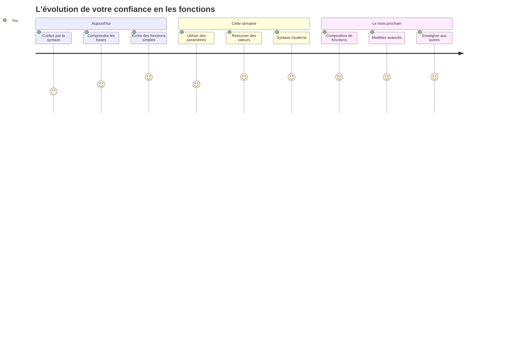
> 🎉 **Vous avez maîtrisé l’un des concepts les plus puissants de la programmation !** Les fonctions sont les blocs de construction des programmes plus vastes. Chaque application que vous développerez utilisera des fonctions pour organiser, réutiliser et structurer le code. Vous comprenez maintenant comment emballer la logique en composants réutilisables, ce qui fait de vous un programmeur plus efficace et performant. Bienvenue dans le monde de la programmation modulaire ! 🚀

---

<!-- CO-OP TRANSLATOR DISCLAIMER START -->
**Avertissement** :  
Ce document a été traduit à l’aide du service de traduction automatique [Co-op Translator](https://github.com/Azure/co-op-translator). Bien que nous nous efforcions d’assurer l’exactitude, veuillez noter que les traductions automatiques peuvent contenir des erreurs ou des imprécisions. Le document original dans sa langue d’origine doit être considéré comme la source faisant autorité. Pour les informations critiques, une traduction professionnelle réalisée par un humain est recommandée. Nous déclinons toute responsabilité en cas de malentendus ou d’interprétations erronées résultant de l’utilisation de cette traduction.
<!-- CO-OP TRANSLATOR DISCLAIMER END -->