<!--
CO_OP_TRANSLATOR_METADATA:
{
  "original_hash": "c688385d15dd3645e924ea0ffee8967f",
  "translation_date": "2026-01-06T06:06:09+00:00",
  "source_file": "2-js-basics/3-making-decisions/README.md",
  "language_code": "fr"
}
-->
# Notions de base en JavaScript : Prendre des décisions

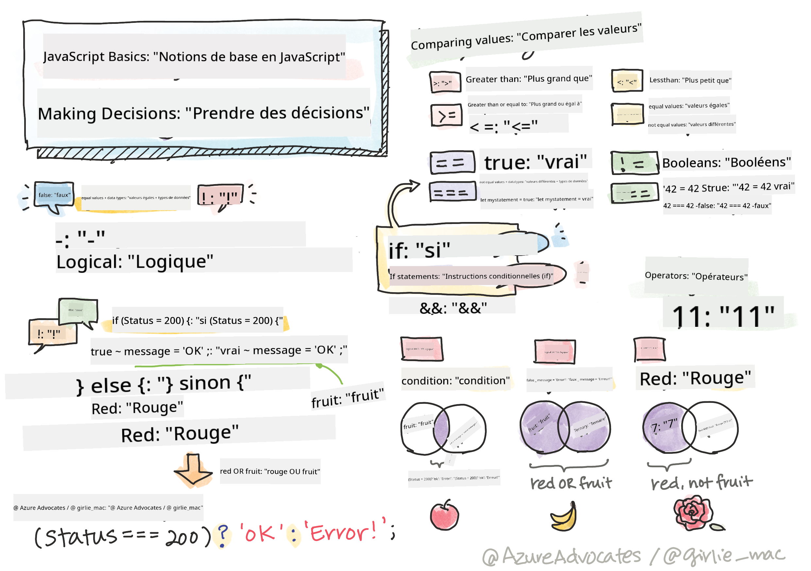

> Sketchnote par [Tomomi Imura](https://twitter.com/girlie_mac)

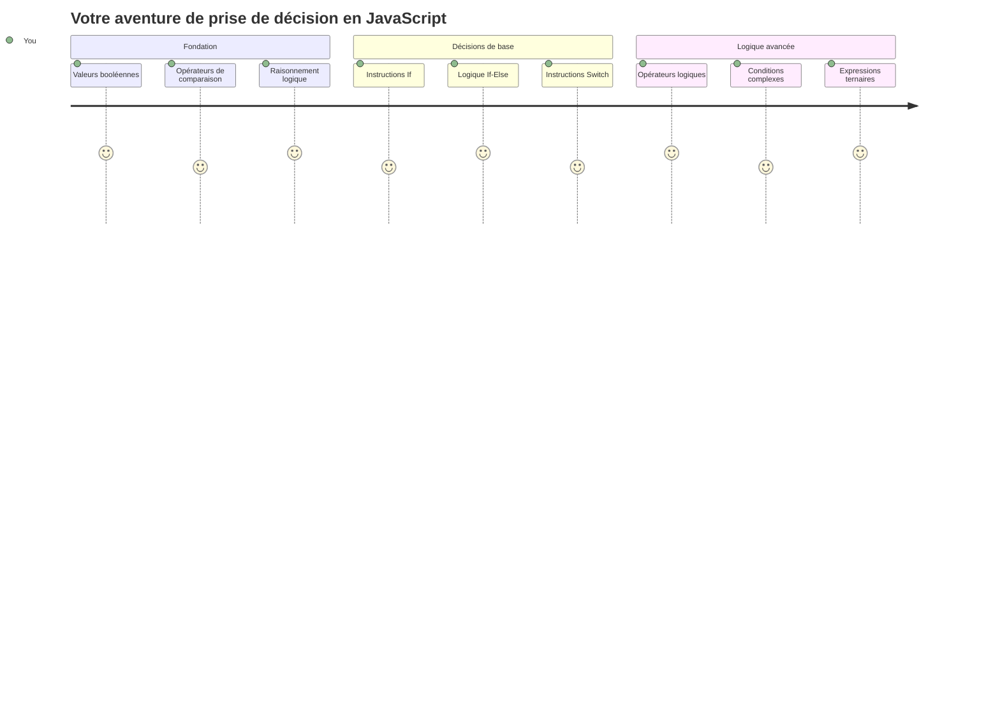
Vous êtes-vous déjà demandé comment les applications prennent des décisions intelligentes ? Comme comment un système de navigation choisit le chemin le plus rapide, ou comment un thermostat décide quand allumer le chauffage ? C’est le concept fondamental de la prise de décision en programmation.

Tout comme la machine analytique de Charles Babbage était conçue pour suivre différentes séquences d’opérations selon des conditions, les programmes modernes en JavaScript doivent faire des choix en fonction des circonstances. Cette capacité à bifurquer et à prendre des décisions transforme un code statique en applications réactives et intelligentes.

Dans cette leçon, vous apprendrez à implémenter une logique conditionnelle dans vos programmes. Nous explorerons les instructions conditionnelles, les opérateurs de comparaison et les expressions logiques qui permettent à votre code d’évaluer des situations et de répondre de manière appropriée.

## Quiz pré-conférence

[Quiz pré-conférence](https://ff-quizzes.netlify.app/web/quiz/11)

La capacité à prendre des décisions et à contrôler le flux d’un programme est un aspect fondamental de la programmation. Cette section couvre comment contrôler le chemin d’exécution de vos programmes JavaScript en utilisant des valeurs booléennes et une logique conditionnelle.

[](https://youtube.com/watch?v=SxTp8j-fMMY "Making Decisions")

> 🎥 Cliquez sur l’image ci-dessus pour une vidéo sur la prise de décisions.

> Vous pouvez suivre cette leçon sur [Microsoft Learn](https://docs.microsoft.com/learn/modules/web-development-101-if-else/?WT.mc_id=academic-77807-sagibbon) !

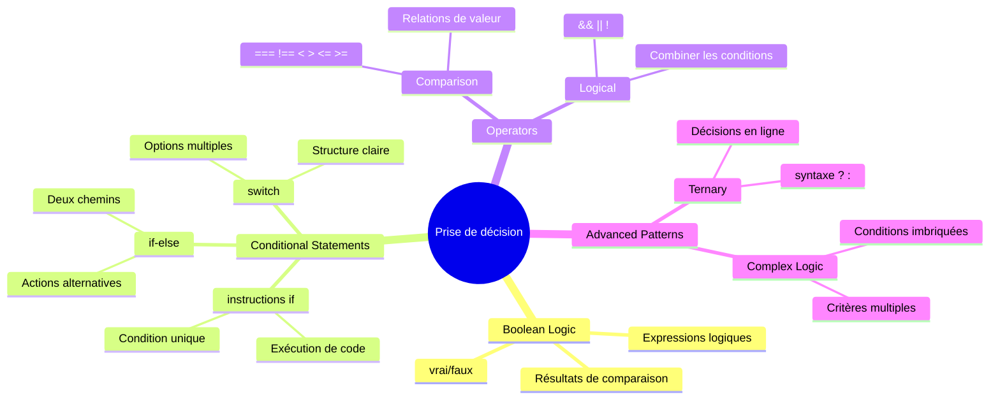
## Bref rappel sur les booléens

Avant d’explorer la prise de décision, revenons sur les valeurs booléennes vues dans notre leçon précédente. Nommées d’après le mathématicien George Boole, ces valeurs représentent des états binaires – soit `true` soit `false`. Il n’y a pas d’ambiguïté, pas de milieu.

Ces valeurs binaires forment la base de toute logique informatique. Chaque décision prise par votre programme se ramène en fin de compte à une évaluation booléenne.

Créer des variables booléennes est simple :

```javascript
let myTrueBool = true;
let myFalseBool = false;
```

Cela crée deux variables avec des valeurs booléennes explicites.

✅ Les booléens tirent leur nom du mathématicien, philosophe et logicien anglais George Boole (1815–1864).

## Opérateurs de comparaison et booléens

En pratique, vous ne levez rarement les booléens manuellement. Vous les générez plutôt en évaluant des conditions : « Ce nombre est-il plus grand que cet autre ? » ou « Ces valeurs sont-elles égales ? »

Les opérateurs de comparaison permettent ces évaluations. Ils comparent des valeurs et retournent des résultats booléens selon la relation entre les opérandes.

| Symbole | Description                                                                                                                                                    | Exemple             |
| ------- | -------------------------------------------------------------------------------------------------------------------------------------------------------------- | ------------------- |
| `<`     | **Inférieur à** : compare deux valeurs et renvoie un booléen `true` si la valeur à gauche est inférieure à celle de droite                                   | `5 < 6 // true`     |
| `<=`    | **Inférieur ou égal à** : compare deux valeurs et renvoie un booléen `true` si la valeur à gauche est inférieure ou égale à celle de droite                   | `5 <= 6 // true`    |
| `>`     | **Supérieur à** : compare deux valeurs et renvoie un booléen `true` si la valeur à gauche est supérieure à celle de droite                                   | `5 > 6 // false`    |
| `>=`    | **Supérieur ou égal à** : compare deux valeurs et renvoie un booléen `true` si la valeur à gauche est supérieure ou égale à celle de droite                   | `5 >= 6 // false`   |
| `===`   | **Égalité stricte** : compare deux valeurs et renvoie un booléen `true` si les valeurs à droite et gauche sont égales ET du même type                        | `5 === 6 // false`  |
| `!==`   | **Inégalité** : compare deux valeurs et renvoie la valeur booléenne opposée à ce qu’un opérateur d’égalité stricte renverrait                                | `5 !== 6 // true`   |

✅ Vérifiez vos connaissances en écrivant quelques comparaisons dans la console de votre navigateur. Certains résultats vous surprennent-ils ?

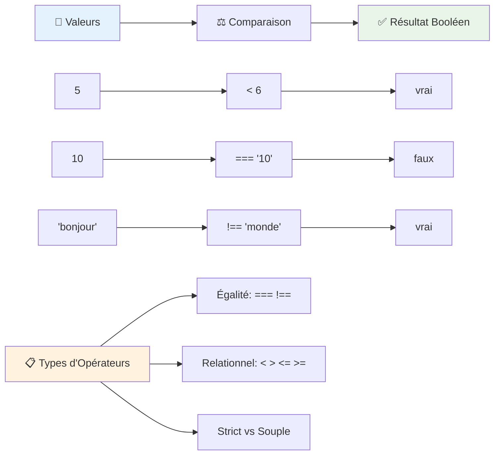
### 🧠 **Maîtrise de la comparaison : Comprendre la logique booléenne**

**Testez votre compréhension des comparaisons :**
- Pourquoi pensez-vous que `===` (égalité stricte) est généralement préféré à `==` (égalité lâche) ?
- Pouvez-vous prédire ce que retourne `5 === '5'` ? Et `5 == '5'` ?
- Quelle est la différence entre `!==` et `!=` ?

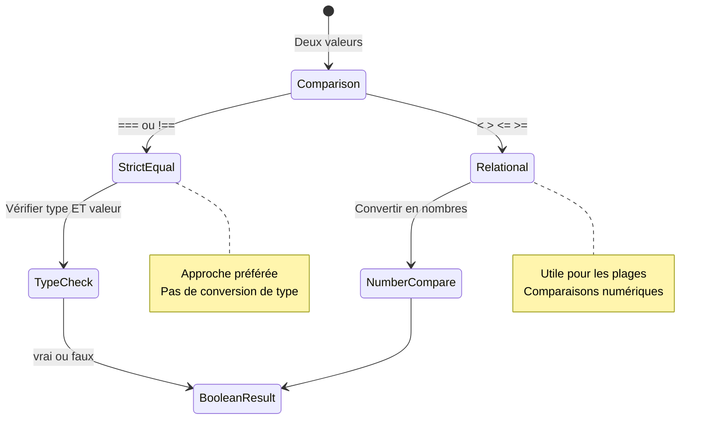
> **Astuce de pro** : Utilisez toujours `===` et `!==` pour les tests d’égalité, sauf si vous avez besoin spécifiquement de conversions de types. Cela évite des comportements inattendus !

## L’instruction If

L’instruction `if` est comme poser une question dans votre code. « Si cette condition est vraie, alors fais ceci. » C’est probablement l’outil le plus important que vous utiliserez pour prendre des décisions en JavaScript.

Voici comment cela fonctionne :

```javascript
if (condition) {
  // La condition est vraie. Le code dans ce bloc s'exécutera.
}
```

La condition se place entre parenthèses, et si elle vaut `true`, JavaScript exécute le code dans les accolades. Si elle vaut `false`, JavaScript saute tout ce bloc.

Vous utiliserez souvent des opérateurs de comparaison pour créer ces conditions. Voyons un exemple concret :

```javascript
let currentMoney = 1000;
let laptopPrice = 800;

if (currentMoney >= laptopPrice) {
  // La condition est vraie. Le code dans ce bloc sera exécuté.
  console.log("Getting a new laptop!");
}
```

Puisque `1000 >= 800` évalue à `true`, le code dans le bloc s’exécute et affiche « Getting a new laptop! » dans la console.

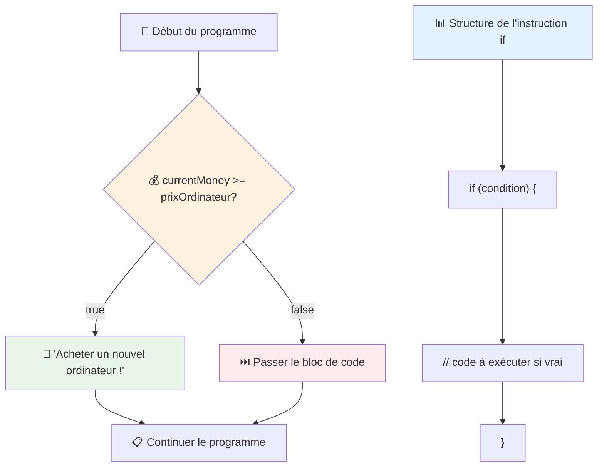
## Instruction If..Else

Mais que faire si vous voulez que votre programme fasse quelque chose de différent quand la condition est fausse ? C’est là qu’intervient `else` – c’est comme un plan B.

L’instruction `else` vous permet de dire « si cette condition n’est pas vraie, fais plutôt ceci. »

```javascript
let currentMoney = 500;
let laptopPrice = 800;

if (currentMoney >= laptopPrice) {
  // La condition est vraie. Le code dans ce bloc s'exécutera.
  console.log("Getting a new laptop!");
} else {
  // La condition est fausse. Le code dans ce bloc s'exécutera.
  console.log("Can't afford a new laptop, yet!");
}
```

Ici, comme `500 >= 800` est `false`, JavaScript saute le premier bloc et exécute celui de `else`. Vous verrez dans la console « Can't afford a new laptop, yet! ».

✅ Testez votre compréhension de ce code et du code suivant en l’exécutant dans la console d’un navigateur. Modifiez les valeurs des variables currentMoney et laptopPrice pour changer le message retourné par `console.log()`.

### 🎯 **Test de logique If-Else : chemins conditionnels**

**Évaluez votre compréhension de la logique conditionnelle :**
- Que se passe-t-il si `currentMoney` est exactement égal à `laptopPrice` ?
- Pouvez-vous imaginer un scénario réel où la logique if-else serait utile ?
- Comment pourriez-vous étendre ceci pour gérer plusieurs plages de prix ?

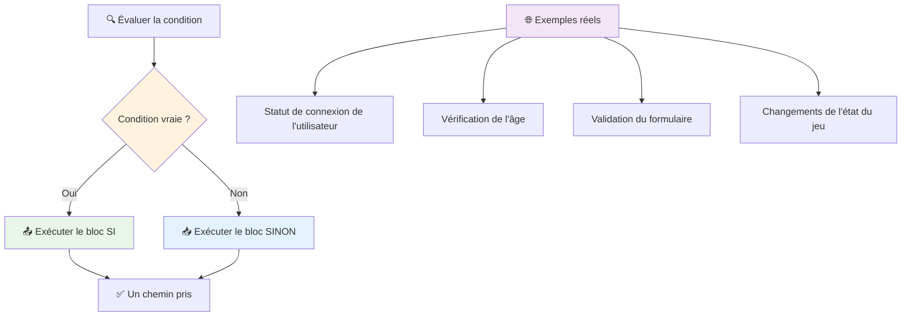
> **Insight clé** : If-else garantit qu’un seul chemin est pris. Cela garantit que votre programme a toujours une réponse à toute condition !

## L’instruction Switch

Parfois, vous devez comparer une valeur à plusieurs options. Bien que vous puissiez enchaîner plusieurs instructions `if..else`, cette méthode devient rapidement lourde. L’instruction `switch` offre une structure plus propre pour gérer plusieurs valeurs discrètes.

Le concept est semblable aux systèmes de commutateurs mécaniques utilisés dans les premières centrales téléphoniques – une valeur d’entrée détermine le chemin spécifique que l’exécution doit suivre.

```javascript
switch (expression) {
  case x:
    // bloc de code
    break;
  case y:
    // bloc de code
    break;
  default:
    // bloc de code
}
```

Voici comment elle est structurée :
- JavaScript évalue l’expression une fois
- Il regarde chaque `case` pour trouver une correspondance
- Lorsqu’il en trouve une, il exécute ce bloc de code
- Le `break` ordonne à JavaScript d’arrêter et de sortir du switch
- Si aucune correspondance n’est trouvée, il exécute le bloc `default` (s’il y en a un)

```javascript
// Programme utilisant une instruction switch pour le jour de la semaine
let dayNumber = 2;
let dayName;

switch (dayNumber) {
  case 1:
    dayName = "Monday";
    break;
  case 2:
    dayName = "Tuesday";
    break;
  case 3:
    dayName = "Wednesday";
    break;
  default:
    dayName = "Unknown day";
    break;
}
console.log(`Today is ${dayName}`);
```

Dans cet exemple, JavaScript voit que `dayNumber` vaut `2`, trouve le `case 2` correspondant, assigne « Tuesday » à `dayName`, puis sort du switch. Le résultat ? « Today is Tuesday » est affiché dans la console.

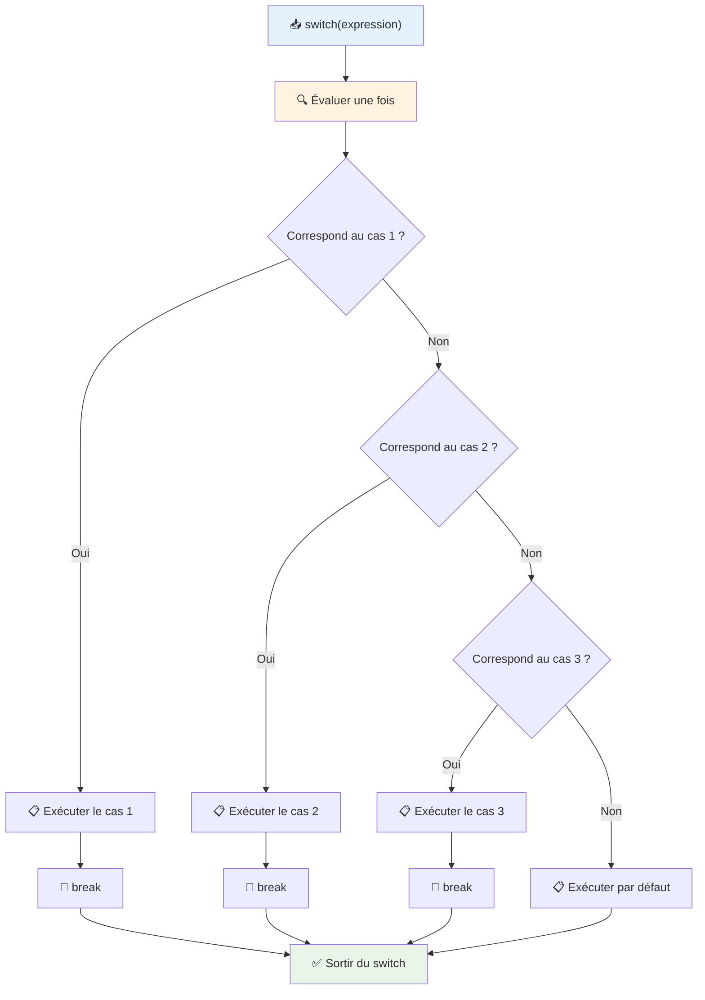
✅ Testez votre compréhension de ce code et du code suivant en l’exécutant dans la console du navigateur. Modifiez la valeur de la variable a pour changer la sortie du `console.log()`.

### 🔄 **Maîtrise de l'instruction Switch : multiples options**

**Testez votre compréhension du switch :**
- Que se passe-t-il si vous oubliez un `break` ?
- Quand utiliseriez-vous `switch` plutôt que plusieurs `if-else` ?
- Pourquoi le cas `default` est-il utile même si vous pensez avoir couvert toutes les possibilités ?

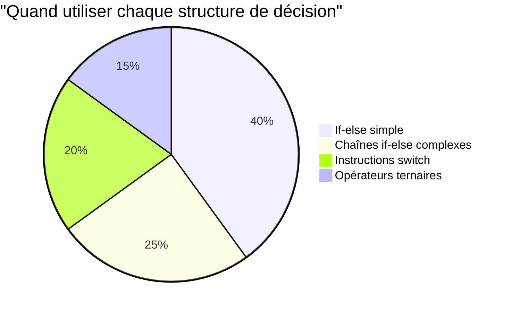
> **Bonne pratique** : Utilisez `switch` quand vous comparez une variable à plusieurs valeurs spécifiques. Utilisez `if-else` pour des plages ou des conditions complexes !

## Opérateurs logiques et booléens

Les décisions complexes nécessitent souvent d’évaluer plusieurs conditions en même temps. Tout comme l’algèbre booléenne permet aux mathématiciens de combiner des expressions logiques, la programmation propose des opérateurs logiques pour connecter plusieurs conditions booléennes.

Ces opérateurs permettent une logique conditionnelle sophistiquée en combinant des évaluations simples vrai/faux.

| Symbole | Description                                                                                      | Exemple                                                                 |
| ------- | ------------------------------------------------------------------------------------------------| ----------------------------------------------------------------------- |
| `&&`    | **ET logique** : compare deux expressions booléennes. Renvoie true **seulement** si les deux côtés sont vrais | `(5 > 3) && (5 < 10) // Les deux côtés sont vrais. Renvoie true` |
| `\|\|`  | **OU logique** : compare deux expressions booléennes. Renvoie true si au moins un côté est vrai | `(5 > 10) \|\| (5 < 10) // Un côté est faux, l’autre est vrai. Renvoie true` |
| `!`     | **NON logique** : renvoie la valeur opposée d’une expression booléenne                           | `!(5 > 10) // 5 n’est pas supérieur à 10, donc "!" en fait true`         |

Ces opérateurs vous permettent de combiner les conditions de façon utile :
- ET (`&&`) signifie que les deux conditions doivent être vraies
- OU (`||`) signifie qu’au moins une condition doit être vraie  
- NON (`!`) inverse vrai en faux (et vice versa)

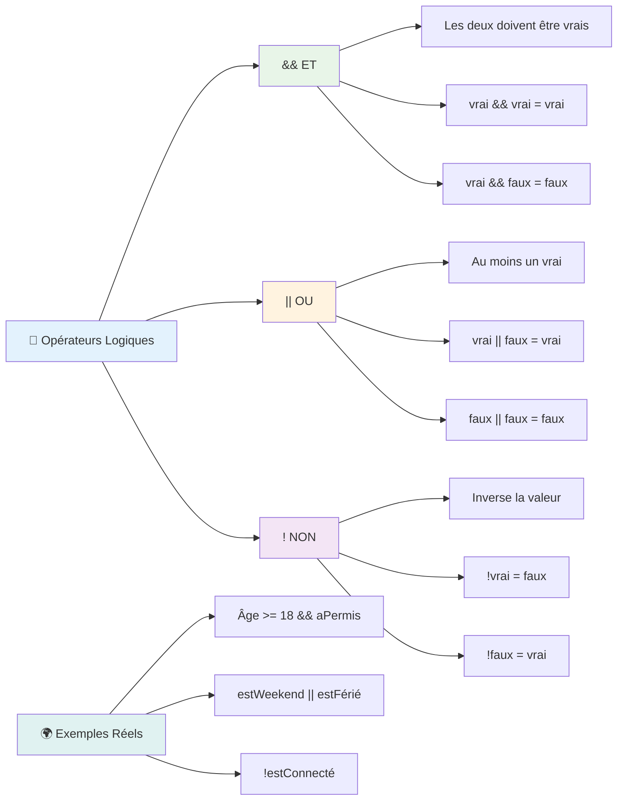
## Conditions et décisions avec opérateurs logiques

Voyons ces opérateurs logiques en action avec un exemple plus réaliste :

```javascript
let currentMoney = 600;
let laptopPrice = 800;
let laptopDiscountPrice = laptopPrice - (laptopPrice * 0.2); // Prix de l'ordinateur portable avec 20 pour cent de réduction

if (currentMoney >= laptopPrice || currentMoney >= laptopDiscountPrice) {
  // La condition est vraie. Le code dans ce bloc s'exécutera.
  console.log("Getting a new laptop!");
} else {
  // La condition est fausse. Le code dans ce bloc s'exécutera.
  console.log("Can't afford a new laptop, yet!");
}
```

Dans cet exemple : nous calculons un prix avec une remise de 20 % (640), puis évaluons si nos fonds disponibles couvrent soit le prix plein OU le prix remisé. Comme 600 satisfait au seuil du prix avec remise de 640, la condition évalue à vrai.

### 🧮 **Test des opérateurs logiques : combiner les conditions**

**Testez votre compréhension des opérateurs logiques :**
- Dans l’expression `A && B`, que se passe-t-il si A est faux ? Est-ce que B est même évalué ?
- Pouvez-vous imaginer une situation où il faudrait les trois opérateurs (&&, ||, !) ensemble ?
- Quelle est la différence entre `!user.isActive` et `user.isActive !== true` ?

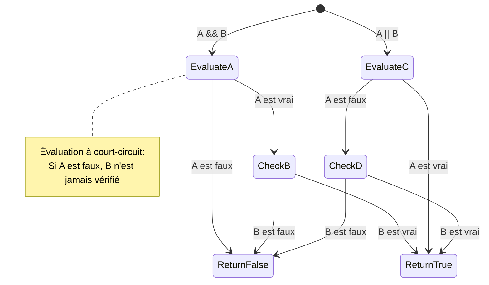
> **Astuce performance** : JavaScript utilise l'« évaluation en court-circuit » - dans `A && B`, si A est faux, B n’est même pas évalué. Profitez-en !

### Opérateur de négation

Parfois, il est plus facile de penser à quand quelque chose N’EST PAS vrai. Plutôt que demander « L’utilisateur est-il connecté ? », vous pourriez vouloir demander « L’utilisateur n’est-il PAS connecté ? ». L’opérateur point d’exclamation (`!`) inverse la logique pour vous.

```javascript
if (!condition) {
  // s'exécute si la condition est fausse
} else {
  // s'exécute si la condition est vraie
}
```

L’opérateur `!` est comme dire « l’opposé de... » – si quelque chose est `true`, `!` le rend `false`, et inversement.

### Expressions ternaires

Pour les affectations conditionnelles simples, JavaScript propose l’**opérateur ternaire**. Cette syntaxe concise vous permet d’écrire une expression conditionnelle en une seule ligne, pratique quand il faut assigner une valeur parmi deux selon une condition.

```javascript
let variable = condition ? returnThisIfTrue : returnThisIfFalse;
```

Cela se lit comme une question : « Cette condition est-elle vraie ? Si oui, utilise cette valeur. Sinon, utilise cette autre valeur. »

Voici un exemple plus concret :

```javascript
let firstNumber = 20;
let secondNumber = 10;
let biggestNumber = firstNumber > secondNumber ? firstNumber : secondNumber;
```

✅ Prenez un moment pour lire ce code plusieurs fois. Comprenez-vous le fonctionnement de ces opérateurs ?

Cette ligne signifie : « Est-ce que `firstNumber` est supérieur à `secondNumber` ? Si oui, mets `firstNumber` dans `biggestNumber`. Sinon, mets `secondNumber` dans `biggestNumber`. »

L’opérateur ternaire est juste un raccourci pour écrire cette structure traditionnelle if..else :

```javascript
let biggestNumber;
if (firstNumber > secondNumber) {
  biggestNumber = firstNumber;
} else {
  biggestNumber = secondNumber;
}
```

Les deux méthodes produisent le même résultat. L’opérateur ternaire offre de la concision, tandis que la structure if-else traditionnelle peut être plus lisible pour des conditions complexes.

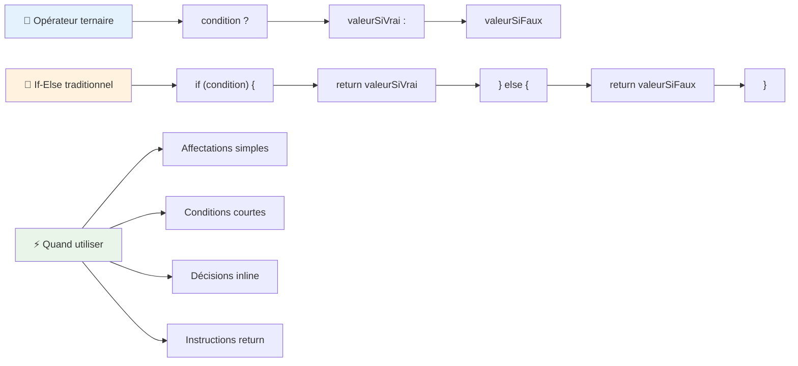
---


## 🚀 Challenge

Créez un programme écrit d’abord avec des opérateurs logiques, puis réécrivez-le en utilisant une expression ternaire. Quelle syntaxe préférez-vous ?

---

## Défi GitHub Copilot Agent 🚀

Utilisez le mode Agent pour relever le défi suivant :

**Description :** Créez un calculateur de notes complet qui démontre plusieurs concepts de prise de décision vus dans cette leçon, incluant les instructions if-else, switch, les opérateurs logiques et les expressions ternaires.

**Consigne :** Écrivez un programme JavaScript qui prend la note numérique d’un étudiant (0-100) et détermine sa mention selon les critères suivants :
- A : 90-100
- B : 80-89  
- C : 70-79
- D : 60-69
- F : en-dessous de 60

Exigences :
1. Utilisez une instruction if-else pour déterminer la mention
2. Utilisez des opérateurs logiques pour vérifier si l’étudiant réussit (note >= 60) ET a des mentions (note >= 90)  
3. Utilisez une instruction switch pour fournir des retours spécifiques pour chaque note en lettre  
4. Utilisez un opérateur ternaire pour déterminer si l’étudiant est éligible au cours suivant (note >= 70)  
5. Incluez une validation d’entrée pour garantir que le score est entre 0 et 100  

Testez votre programme avec diverses notes incluant des cas limites comme 59, 60, 89, 90, ainsi que des entrées invalides.  

En savoir plus sur le [mode agent](https://code.visualstudio.com/blogs/2025/02/24/introducing-copilot-agent-mode) ici.  


## Quiz post-conférence

[Quiz post-conférence](https://ff-quizzes.netlify.app/web/quiz/12)

## Revue & Auto-apprentissage

Lisez davantage sur les nombreux opérateurs disponibles pour l’utilisateur [sur MDN](https://developer.mozilla.org/docs/Web/JavaScript/Reference/Operators).

Parcourez le magnifique [répertoire des opérateurs](https://joshwcomeau.com/operator-lookup/) de Josh Comeau !  

## Devoir

[Opérateurs](assignment.md)

---

## 🧠 **Résumé de votre boîte à outils de prise de décision**

```mermaid
graph TD
    A["🎯 Décisions JavaScript"] --> B["🔍 Logique booléenne"]
    A --> C["📊 Instructions conditionnelles"]
    A --> D["🔗 Opérateurs logiques"]
    A --> E["⚡ Modèles avancés"]
    
    B --> B1["valeurs true/false"]
    B --> B2["Opérateurs de comparaison"]
    B --> B3["Concepts de vérité"]
    
    C --> C1["instructions if"]
    C --> C2["chaînes if-else"]
    C --> C3["instructions switch"]
    
    D --> D1["&& (ET)"]
    D --> D2["|| (OU)"]
    D --> D3["! (NON)"]
    
    E --> E1["Opérateur ternaire"]
    E --> E2["Évaluation en court-circuit"]
    E --> E3["Conditions complexes"]
    
    F["💡 Principes clés"] --> F1["Conditions claires et lisibles"]
    F --> F2["Style de comparaison cohérent"]
    F --> F3["Priorité correcte des opérateurs"]
    F --> F4["Ordre d'évaluation efficace"]
    
    style A fill:#e3f2fd
    style B fill:#e8f5e8
    style C fill:#fff3e0
    style D fill:#f3e5f5
    style E fill:#e0f2f1
    style F fill:#fce4ec
```
---

## 🚀 Votre calendrier de maîtrise de la prise de décision en JavaScript

### ⚡ **Ce que vous pouvez faire dans les 5 prochaines minutes**
- [ ] Pratiquer les opérateurs de comparaison dans la console de votre navigateur  
- [ ] Écrire une simple instruction if-else qui vérifie votre âge  
- [ ] Essayer le défi : réécrire un if-else avec un opérateur ternaire  
- [ ] Tester ce qui se passe avec différentes valeurs "truthy" et "falsy"  

### 🎯 **Ce que vous pouvez accomplir cette heure-ci**
- [ ] Compléter le quiz post-leçon et revoir les concepts confus  
- [ ] Construire le calculateur de notes complet issu du défi GitHub Copilot  
- [ ] Créer un arbre décisionnel simple pour un scénario réel (comme choisir quoi porter)  
- [ ] Pratiquer la combinaison de plusieurs conditions avec des opérateurs logiques  
- [ ] Expérimenter avec des instructions switch pour différents cas d’utilisation  

### 📅 **Maîtrise logique sur une semaine**
- [ ] Compléter le devoir sur les opérateurs avec des exemples créatifs  
- [ ] Construire une mini-application de quiz utilisant diverses structures conditionnelles  
- [ ] Créer un validateur de formulaire qui vérifie plusieurs conditions d’entrée  
- [ ] Pratiquer les exercices de [répertoire des opérateurs](https://joshwcomeau.com/operator-lookup/) de Josh Comeau  
- [ ] Refactoriser du code existant pour utiliser des structures conditionnelles plus appropriées  
- [ ] Étudier l’évaluation à court-circuit et les implications sur les performances  

### 🌟 **Transformation sur un mois**
- [ ] Maîtriser les conditions imbriquées complexes tout en maintenant la lisibilité du code  
- [ ] Construire une application avec une logique décisionnelle sophistiquée  
- [ ] Contribuer à l’open source en améliorant la logique conditionnelle dans des projets existants  
- [ ] Enseigner à quelqu’un d’autre les différentes structures conditionnelles et leur usage approprié  
- [ ] Explorer les approches de programmation fonctionnelle appliquées à la logique conditionnelle  
- [ ] Créer un guide de référence personnel des meilleures pratiques conditionnelles  

### 🏆 **Vérification finale du champion de la prise de décision**

**Célébrez votre maîtrise de la pensée logique :**  
- Quelle est la logique décisionnelle la plus complexe que vous ayez réussie à implémenter ?  
- Quelle structure conditionnelle vous paraît la plus naturelle et pourquoi ?  
- Comment l’apprentissage des opérateurs logiques a-t-il changé votre approche de résolution de problèmes ?  
- Quelle application réelle bénéficierait d’une logique décisionnelle sophistiquée ?  

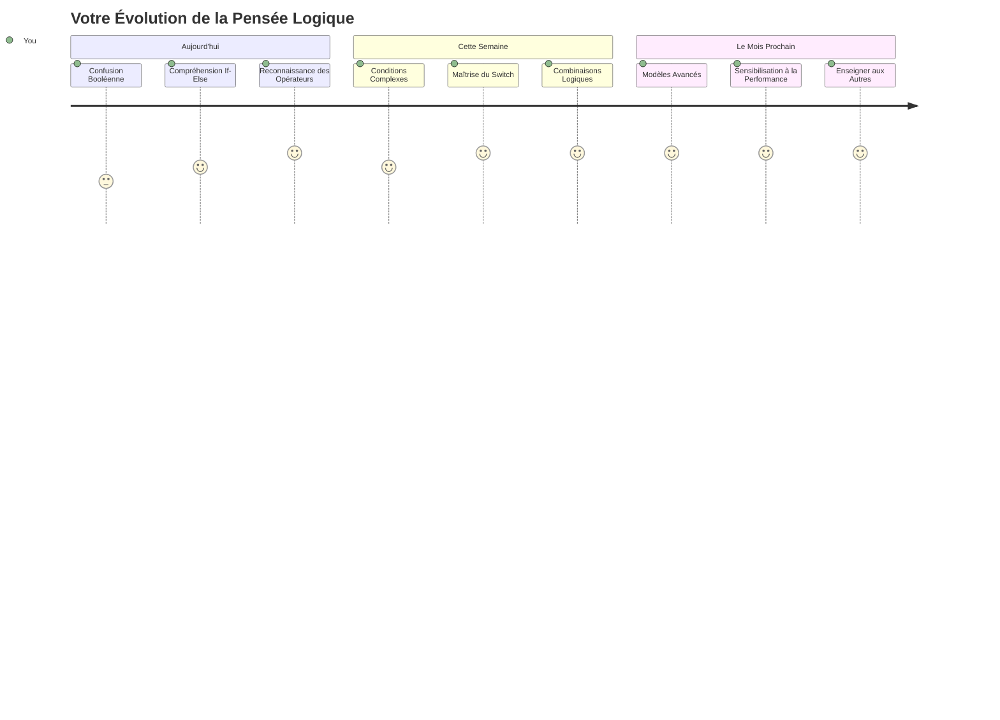
> 🧠 **Vous avez maîtrisé l’art de la prise de décision numérique !** Chaque application interactive repose sur la logique conditionnelle pour répondre intelligemment aux actions des utilisateurs et aux conditions changeantes. Vous comprenez maintenant comment faire penser vos programmes, évaluer et choisir des réponses appropriées. Cette base logique alimentera chaque application dynamique que vous développerez ! 🎉

---

<!-- CO-OP TRANSLATOR DISCLAIMER START -->
**Clause de non-responsabilité** :
Ce document a été traduit à l’aide du service de traduction automatique [Co-op Translator](https://github.com/Azure/co-op-translator). Bien que nous nous efforcions d’assurer l’exactitude, veuillez noter que les traductions automatisées peuvent contenir des erreurs ou des inexactitudes. Le document original dans sa langue d’origine doit être considéré comme la source officielle. Pour les informations critiques, il est recommandé de faire appel à une traduction professionnelle réalisée par un humain. Nous déclinons toute responsabilité en cas de malentendus ou de mauvaises interprétations résultant de l’utilisation de cette traduction.
<!-- CO-OP TRANSLATOR DISCLAIMER END -->