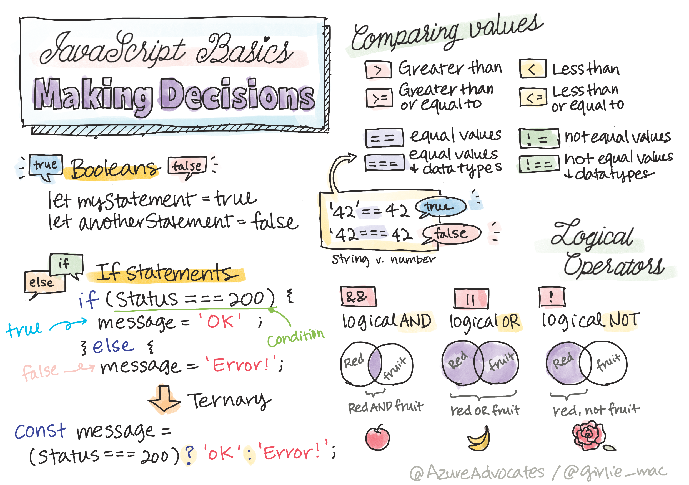

<!--
CO_OP_TRANSLATOR_METADATA:
{
  "original_hash": "888609c48329c280ca2477d2df40f2e5",
  "translation_date": "2025-08-23T22:38:14+00:00",
  "source_file": "2-js-basics/3-making-decisions/README.md",
  "language_code": "fr"
}
-->
# Notions de base en JavaScript : Prendre des décisions



> Sketchnote par [Tomomi Imura](https://twitter.com/girlie_mac)

## Quiz avant le cours

[Quiz avant le cours](https://ff-quizzes.netlify.app/web/quiz/11)

Prendre des décisions et contrôler l'ordre d'exécution de votre code le rend réutilisable et robuste. Cette section couvre la syntaxe pour contrôler le flux de données en JavaScript et son importance lorsqu'elle est utilisée avec des types de données booléens.

[](https://youtube.com/watch?v=SxTp8j-fMMY "Prendre des décisions")

> 🎥 Cliquez sur l'image ci-dessus pour une vidéo sur la prise de décisions.

> Vous pouvez suivre cette leçon sur [Microsoft Learn](https://docs.microsoft.com/learn/modules/web-development-101-if-else/?WT.mc_id=academic-77807-sagibbon)!

## Petit rappel sur les booléens

Les booléens ne peuvent avoir que deux valeurs : `true` ou `false`. Les booléens aident à décider quelles lignes de code doivent s'exécuter lorsque certaines conditions sont remplies.

Définissez votre booléen sur true ou false comme ceci :

`let myTrueBool = true`  
`let myFalseBool = false`

✅ Les booléens portent le nom du mathématicien, philosophe et logicien anglais George Boole (1815–1864).

## Opérateurs de comparaison et booléens

Les opérateurs sont utilisés pour évaluer des conditions en effectuant des comparaisons qui produiront une valeur booléenne. Voici une liste des opérateurs fréquemment utilisés.

| Symbole | Description                                                                                                                                                   | Exemple            |
| ------- | ------------------------------------------------------------------------------------------------------------------------------------------------------------- | ------------------ |
| `<`     | **Inférieur à** : Compare deux valeurs et retourne le type de données booléen `true` si la valeur à gauche est inférieure à celle de droite                  | `5 < 6 // true`    |
| `<=`    | **Inférieur ou égal à** : Compare deux valeurs et retourne le type de données booléen `true` si la valeur à gauche est inférieure ou égale à celle de droite | `5 <= 6 // true`   |
| `>`     | **Supérieur à** : Compare deux valeurs et retourne le type de données booléen `true` si la valeur à gauche est supérieure à celle de droite                  | `5 > 6 // false`   |
| `>=`    | **Supérieur ou égal à** : Compare deux valeurs et retourne le type de données booléen `true` si la valeur à gauche est supérieure ou égale à celle de droite | `5 >= 6 // false`  |
| `===`   | **Égalité stricte** : Compare deux valeurs et retourne le type de données booléen `true` si les valeurs à gauche et à droite sont égales ET du même type     | `5 === 6 // false` |
| `!==`   | **Inégalité** : Compare deux valeurs et retourne la valeur booléenne opposée à celle qu'un opérateur d'égalité stricte retournerait                          | `5 !== 6 // true`  |

✅ Testez vos connaissances en écrivant quelques comparaisons dans la console de votre navigateur. Certains résultats vous surprennent-ils ?

## Instruction If

L'instruction `if` exécutera le code entre ses blocs si la condition est vraie.

```javascript
if (condition) {
  //Condition is true. Code in this block will run.
}
```

Les opérateurs logiques sont souvent utilisés pour former la condition.

```javascript
let currentMoney;
let laptopPrice;

if (currentMoney >= laptopPrice) {
  //Condition is true. Code in this block will run.
  console.log("Getting a new laptop!");
}
```

## Instruction If..Else

L'instruction `else` exécutera le code entre ses blocs lorsque la condition est fausse. Elle est optionnelle avec une instruction `if`.

```javascript
let currentMoney;
let laptopPrice;

if (currentMoney >= laptopPrice) {
  //Condition is true. Code in this block will run.
  console.log("Getting a new laptop!");
} else {
  //Condition is false. Code in this block will run.
  console.log("Can't afford a new laptop, yet!");
}
```

✅ Testez votre compréhension de ce code et du code suivant en l'exécutant dans la console d'un navigateur. Modifiez les valeurs des variables `currentMoney` et `laptopPrice` pour changer le résultat de `console.log()`.

## Instruction Switch

L'instruction `switch` est utilisée pour effectuer différentes actions en fonction de différentes conditions. Utilisez l'instruction `switch` pour sélectionner un des nombreux blocs de code à exécuter.

```javascript
switch (expression) {
  case x:
    // code block
    break;
  case y:
    // code block
    break;
  default:
  // code block
}
```

```javascript
// program using switch statement
let a = 2;

switch (a) {
  case 1:
    a = "one";
    break;
  case 2:
    a = "two";
    break;
  default:
    a = "not found";
    break;
}
console.log(`The value is ${a}`);
```

✅ Testez votre compréhension de ce code et du code suivant en l'exécutant dans la console d'un navigateur. Modifiez les valeurs de la variable `a` pour changer le résultat de `console.log()`.

## Opérateurs logiques et booléens

Les décisions peuvent nécessiter plus d'une comparaison et peuvent être enchaînées avec des opérateurs logiques pour produire une valeur booléenne.

| Symbole | Description                                                                                     | Exemple                                                                 |
| ------- | ----------------------------------------------------------------------------------------------- | ----------------------------------------------------------------------- |
| `&&`    | **ET logique** : Compare deux expressions booléennes. Retourne true **seulement** si les deux côtés sont vrais | `(5 > 6) && (5 < 6 ) //Un côté est faux, l'autre est vrai. Retourne false` |
| `\|\|`  | **OU logique** : Compare deux expressions booléennes. Retourne true si au moins un côté est vrai | `(5 > 6) \|\| (5 < 6) //Un côté est faux, l'autre est vrai. Retourne true` |
| `!`     | **NON logique** : Retourne la valeur opposée d'une expression booléenne                         | `!(5 > 6) // 5 n'est pas supérieur à 6, mais "!" retournera true`         |

## Conditions et décisions avec des opérateurs logiques

Les opérateurs logiques peuvent être utilisés pour former des conditions dans des instructions if..else.

```javascript
let currentMoney;
let laptopPrice;
let laptopDiscountPrice = laptopPrice - laptopPrice * 0.2; //Laptop price at 20 percent off

if (currentMoney >= laptopPrice || currentMoney >= laptopDiscountPrice) {
  //Condition is true. Code in this block will run.
  console.log("Getting a new laptop!");
} else {
  //Condition is true. Code in this block will run.
  console.log("Can't afford a new laptop, yet!");
}
```

### Opérateur de négation

Vous avez vu jusqu'à présent comment utiliser une instruction `if...else` pour créer une logique conditionnelle. Tout ce qui entre dans un `if` doit s'évaluer à true/false. En utilisant l'opérateur `!`, vous pouvez _nier_ l'expression. Cela ressemblerait à ceci :

```javascript
if (!condition) {
  // runs if condition is false
} else {
  // runs if condition is true
}
```

### Expressions ternaires

`if...else` n'est pas le seul moyen d'exprimer une logique décisionnelle. Vous pouvez également utiliser ce qu'on appelle un opérateur ternaire. La syntaxe ressemble à ceci :

```javascript
let variable = condition ? <return this if true> : <return this if false>
```

Voici un exemple plus concret :

```javascript
let firstNumber = 20;
let secondNumber = 10;
let biggestNumber = firstNumber > secondNumber ? firstNumber : secondNumber;
```

✅ Prenez une minute pour lire ce code plusieurs fois. Comprenez-vous comment ces opérateurs fonctionnent ?

Ce qui précède indique que :

- si `firstNumber` est plus grand que `secondNumber`
- alors attribuez `firstNumber` à `biggestNumber`
- sinon attribuez `secondNumber`.

L'expression ternaire est simplement une manière compacte d'écrire le code ci-dessous :

```javascript
let biggestNumber;
if (firstNumber > secondNumber) {
  biggestNumber = firstNumber;
} else {
  biggestNumber = secondNumber;
}
```

---

## 🚀 Défi

Créez un programme écrit d'abord avec des opérateurs logiques, puis réécrivez-le en utilisant une expression ternaire. Quelle syntaxe préférez-vous ?

---

## Quiz après le cours

[Quiz après le cours](https://ff-quizzes.netlify.app/web/quiz/12)

## Révision et auto-apprentissage

Lisez-en davantage sur les nombreux opérateurs disponibles pour l'utilisateur [sur MDN](https://developer.mozilla.org/docs/Web/JavaScript/Reference/Operators).

Explorez l'excellent [outil de recherche d'opérateurs](https://joshwcomeau.com/operator-lookup/) de Josh Comeau !

## Devoir

[Opérateurs](assignment.md)

**Avertissement** :  
Ce document a été traduit à l'aide du service de traduction automatique [Co-op Translator](https://github.com/Azure/co-op-translator). Bien que nous nous efforcions d'assurer l'exactitude, veuillez noter que les traductions automatisées peuvent contenir des erreurs ou des inexactitudes. Le document original dans sa langue d'origine doit être considéré comme la source faisant autorité. Pour des informations critiques, il est recommandé de recourir à une traduction humaine professionnelle. Nous déclinons toute responsabilité en cas de malentendus ou d'interprétations erronées résultant de l'utilisation de cette traduction.