<!--
CO_OP_TRANSLATOR_METADATA:
{
  "original_hash": "1710a50a519a6e4a1b40a5638783018d",
  "translation_date": "2026-01-06T06:08:57+00:00",
  "source_file": "2-js-basics/4-arrays-loops/README.md",
  "language_code": "fr"
}
-->
# Les bases de JavaScript : Tableaux et Boucles

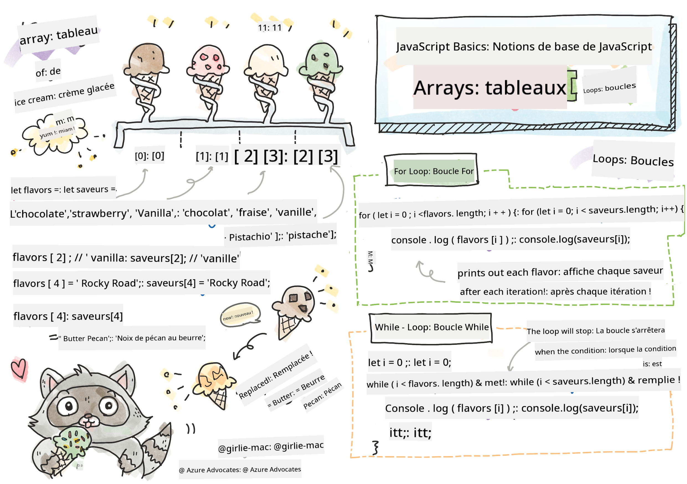
> Sketchnote par [Tomomi Imura](https://twitter.com/girlie_mac)

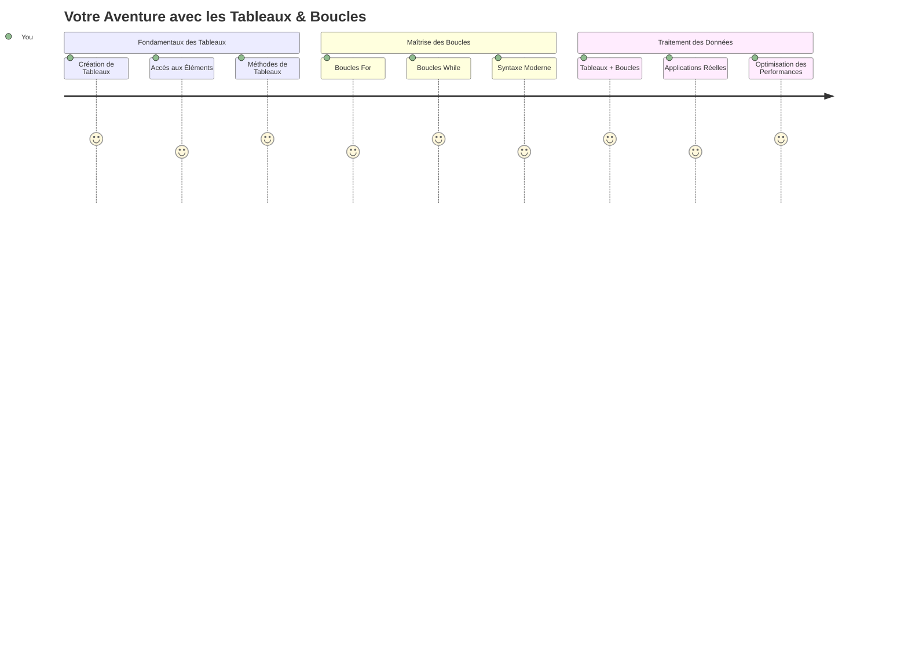
## Quiz avant la leçon
[Quiz avant la leçon](https://ff-quizzes.netlify.app/web/quiz/13)

Vous vous êtes déjà demandé comment les sites web suivent les articles dans un panier ou affichent votre liste d'amis ? C'est là que les tableaux et les boucles interviennent. Les tableaux sont comme des conteneurs numériques qui contiennent plusieurs informations, tandis que les boucles vous permettent de travailler efficacement avec toutes ces données sans écrire un code répétitif.

Ensemble, ces deux concepts forment la base pour manipuler l'information dans vos programmes. Vous apprendrez à passer de l'écriture manuelle de chaque étape à la création d'un code intelligent et efficace capable de traiter des centaines voire des milliers d'éléments rapidement.

À la fin de cette leçon, vous comprendrez comment accomplir des tâches complexes avec juste quelques lignes de code. Explorons ces concepts essentiels de la programmation.

[](https://youtube.com/watch?v=1U4qTyq02Xw "Tableaux")

[](https://www.youtube.com/watch?v=Eeh7pxtTZ3k "Boucles")

> 🎥 Cliquez sur les images ci-dessus pour des vidéos sur les tableaux et les boucles.

> Vous pouvez suivre cette leçon sur [Microsoft Learn](https://docs.microsoft.com/learn/modules/web-development-101-arrays/?WT.mc_id=academic-77807-sagibbon) !

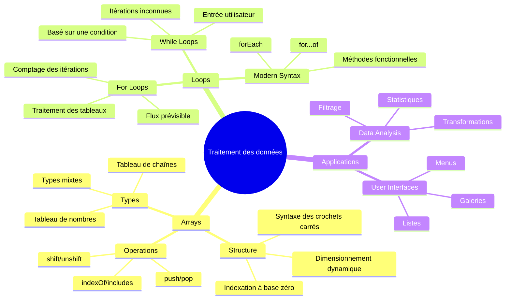
## Tableaux

Pensez aux tableaux comme à un classeur numérique - au lieu de ranger un document par tiroir, vous pouvez organiser plusieurs éléments liés dans un seul conteneur structuré. En termes de programmation, les tableaux vous permettent de stocker plusieurs informations dans un seul paquet organisé.

Que vous construisiez une galerie photo, gériez une liste de tâches ou suiviez les meilleurs scores d'un jeu, les tableaux sont la base de l'organisation des données. Voyons comment ils fonctionnent.

✅ Les tableaux sont partout autour de nous ! Pouvez-vous penser à un exemple réel de tableau, comme une installation de panneaux solaires ?

### Création de Tableaux

Créer un tableau est super simple - il suffit d'utiliser des crochets !

```javascript
// Tableau vide - comme un panier d'achat vide attendant des articles
const myArray = [];
```

**Que se passe-t-il ici ?**
Vous venez de créer un conteneur vide avec ces crochets `[]`. Pensez-y comme à une étagère de bibliothèque vide - elle est prête à contenir les livres que vous souhaitez y organiser.

Vous pouvez aussi remplir votre tableau avec des valeurs initiales dès le départ :

```javascript
// Le menu des parfums de votre glacier
const iceCreamFlavors = ["Chocolate", "Strawberry", "Vanilla", "Pistachio", "Rocky Road"];

// Les infos du profil d'un utilisateur (mélange de différents types de données)
const userData = ["John", 25, true, "developer"];

// Notes de test pour votre cours préféré
const scores = [95, 87, 92, 78, 85];
```

**Choses intéressantes à noter :**
- Vous pouvez stocker du texte, des nombres, ou même des valeurs vrai/faux dans le même tableau
- Il suffit de séparer chaque élément par une virgule - facile !
- Les tableaux sont parfaits pour garder les informations liées ensemble

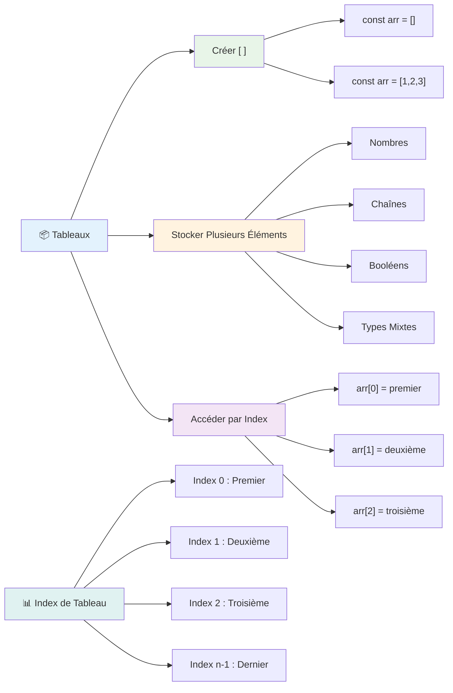
### Indexation dans les Tableaux

Voici quelque chose qui peut sembler inhabituel au début : les tableaux numérotent leurs éléments à partir de 0, pas de 1. Cette indexation à base zéro vient de la manière dont fonctionne la mémoire informatique - c’est une convention de programmation depuis les premiers jours des langages comme le C. Chaque emplacement dans le tableau reçoit un numéro d'adresse appelé **index**.

| Index | Valeur | Description |
|-------|--------|-------------|
| 0 | "Chocolat" | Premier élément |
| 1 | "Fraise" | Deuxième élément |
| 2 | "Vanille" | Troisième élément |
| 3 | "Pistache" | Quatrième élément |
| 4 | "Rocky Road" | Cinquième élément |

✅ Cela vous surprend-il que les tableaux commencent à l’index zéro ? Dans certains langages, les index commencent à 1. Il y a une histoire intéressante à ce sujet, que vous pouvez [lire sur Wikipédia](https://en.wikipedia.org/wiki/Zero-based_numbering).

**Accéder aux éléments d’un tableau :**

```javascript
const iceCreamFlavors = ["Chocolate", "Strawberry", "Vanilla", "Pistachio", "Rocky Road"];

// Accéder aux éléments individuels en utilisant la notation entre crochets
console.log(iceCreamFlavors[0]); // "Chocolat" - premier élément
console.log(iceCreamFlavors[2]); // "Vanille" - troisième élément
console.log(iceCreamFlavors[4]); // "Rocky Road" - dernier élément
```

**Décomposons ce qui se passe :**
- **Utilise** la notation avec crochets et l’index pour accéder aux éléments
- **Renvoie** la valeur stockée à cette position spécifique dans le tableau
- **Commence** à compter à partir de 0, ce qui fait que le premier élément a l’index 0

**Modifier des éléments d’un tableau :**

```javascript
// Modifier une valeur existante
iceCreamFlavors[4] = "Butter Pecan";
console.log(iceCreamFlavors[4]); // "Noix de beurre"

// Ajouter un nouvel élément à la fin
iceCreamFlavors[5] = "Cookie Dough";
console.log(iceCreamFlavors[5]); // "Pâte à biscuits"
```

**Ici, nous avons :**
- **Modifié** l’élément à l’index 4 de "Rocky Road" à "Butter Pecan"
- **Ajouté** un nouvel élément "Cookie Dough" à l’index 5
- **Élargi** automatiquement la longueur du tableau en ajoutant au-delà des limites actuelles

### Longueur du tableau et méthodes communes

Les tableaux comportent des propriétés et méthodes intégrées qui rendent le travail avec les données bien plus facile.

**Trouver la longueur d’un tableau :**

```javascript
const iceCreamFlavors = ["Chocolate", "Strawberry", "Vanilla", "Pistachio", "Rocky Road"];
console.log(iceCreamFlavors.length); // 5

// La longueur se met à jour automatiquement lorsque le tableau change
iceCreamFlavors.push("Mint Chip");
console.log(iceCreamFlavors.length); // 6
```

**Points clés à retenir :**
- **Renvoie** le nombre total d’éléments dans le tableau
- **Se met à jour** automatiquement quand des éléments sont ajoutés ou supprimés
- **Fournit** un décompte dynamique utile pour les boucles et validations

**Méthodes essentielles des tableaux :**

```javascript
const fruits = ["apple", "banana", "orange"];

// Ajouter des éléments
fruits.push("grape");           // Ajoute à la fin : ["pomme", "banane", "orange", "raisin"]
fruits.unshift("strawberry");   // Ajoute au début : ["fraise", "pomme", "banane", "orange", "raisin"]

// Supprimer des éléments
const lastFruit = fruits.pop();        // Supprime et retourne "raisin"
const firstFruit = fruits.shift();     // Supprime et retourne "fraise"

// Trouver des éléments
const index = fruits.indexOf("banana"); // Retourne 1 (position de "banane")
const hasApple = fruits.includes("apple"); // Retourne vrai
```

**Comprendre ces méthodes :**
- **Ajoute** des éléments avec `push()` (à la fin) et `unshift()` (au début)
- **Supprime** des éléments avec `pop()` (à la fin) et `shift()` (au début)
- **Localise** des éléments avec `indexOf()` et vérifie l’existence avec `includes()`
- **Renvoie** des valeurs utiles comme les éléments supprimés ou les positions

✅ Essayez par vous-même ! Utilisez la console de votre navigateur pour créer et manipuler un tableau de votre propre création.

### 🧠 **Contrôle des fondations des tableaux : Organiser vos données**

**Testez votre compréhension des tableaux :**
- Pourquoi pensez-vous que les tableaux commencent à compter à partir de 0 plutôt que 1 ?
- Que se passe-t-il si vous essayez d’accéder à un index qui n’existe pas (comme `arr[100]` dans un tableau de 5 éléments) ?
- Pouvez-vous penser à trois scénarios réels où les tableaux seraient utiles ?

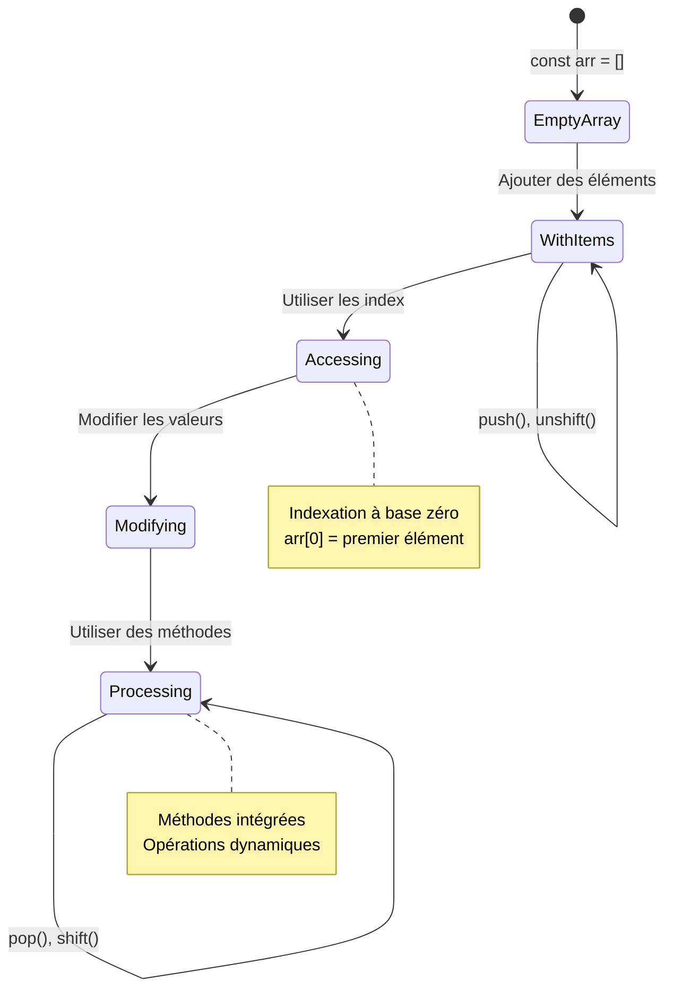
> **Aperçu du monde réel** : Les tableaux sont partout en programmation ! Flux des réseaux sociaux, paniers d’achats, galeries photo, chansons de playlists - ce sont tous des tableaux en coulisses !

## Boucles

Pensez à la célèbre punition dans les romans de Charles Dickens où les élèves devaient écrire plusieurs fois la même phrase sur une ardoise. Imaginez si vous pouviez simplement ordonner à quelqu’un d’« écrire cette phrase 100 fois » et que cela soit fait automatiquement. C’est exactement ce que font les boucles pour votre code.

Les boucles sont comme un assistant infatigable qui répète les tâches sans erreur. Que vous ayez besoin de vérifier chaque article dans un panier ou d’afficher toutes les photos d’un album, les boucles gèrent la répétition efficacement.

JavaScript offre plusieurs types de boucles. Voyons chacune et comprenons quand les utiliser.

```mermaid
flowchart TD
    A["🔄 Types de Boucles"] --> B["Boucle For"]
    A --> C["Boucle While"]
    A --> D["Boucle For...of"]
    A --> E["Méthode forEach"]
    
    B --> B1["Itérations connues"]
    B --> B2["Basé sur un compteur"]
    B --> B3["for(init; condition; incrément)"]
    
    C --> C1["Itérations inconnues"]
    C --> C2["Basé sur une condition"]
    C --> C3["while(condition)"]
    
    D --> D1["ES6+ Moderne"]
    D --> D2["Itération de tableau"]
    D --> D3["for(élément de tableau)"]
    
    E --> E1["Style fonctionnel"]
    E --> E2["Méthode de tableau"]
    E --> E3["tableau.forEach(callback)"]
    
    F["⏰ Quand Utiliser"] --> F1["For : Comptage, index"]
    F --> F2["While : Entrée utilisateur, recherche"]
    F --> F3["For...of : Itération simple"]
    F --> F4["forEach : Programmation fonctionnelle"]
    
    style A fill:#e3f2fd
    style B fill:#e8f5e8
    style C fill:#fff3e0
    style D fill:#f3e5f5
    style E fill:#e0f2f1
    style F fill:#fce4ec
```
### Boucle For

La boucle `for` est comme régler un minuteur - vous savez exactement combien de fois vous voulez que quelque chose se produise. Elle est super organisée et prévisible, ce qui la rend parfaite quand vous travaillez avec des tableaux ou que vous devez compter des éléments.

**Structure d’une boucle For :**

| Composant | But | Exemple |
|-----------|-----|---------|
| **Initialisation** | Définit le point de départ | `let i = 0` |
| **Condition** | Quand continuer | `i < 10` |
| **Incrémentation** | Comment mettre à jour | `i++` |

```javascript
// Compter de 0 à 9
for (let i = 0; i < 10; i++) {
  console.log(`Count: ${i}`);
}

// Exemple plus pratique : traitement des scores
const testScores = [85, 92, 78, 96, 88];
for (let i = 0; i < testScores.length; i++) {
  console.log(`Student ${i + 1}: ${testScores[i]}%`);
}
```

**Étape par étape, voici ce qui se passe :**
- **Initialise** la variable compteur `i` à 0 au début
- **Vérifie** la condition `i < 10` avant chaque itération
- **Exécute** le bloc de code lorsque la condition est vraie
- **Incrémente** `i` de 1 après chaque itération avec `i++`
- **S’arrête** lorsque la condition devient fausse (quand `i` atteint 10)

✅ Essayez ce code dans la console d’un navigateur. Que se passe-t-il quand vous modifiez légèrement le compteur, la condition ou l’expression d’itération ? Pouvez-vous le faire tourner à l’envers, créant un compte à rebours ?

### 🗓️ **Contrôle de maîtrise des boucles For : Répétition contrôlée**

**Évaluez votre compréhension des boucles for :**
- Quelles sont les trois parties d’une boucle for, et que fait chacune ?
- Comment parcourir un tableau à l’envers ?
- Que se passe-t-il si vous oubliez la partie incrémentation (`i++`) ?

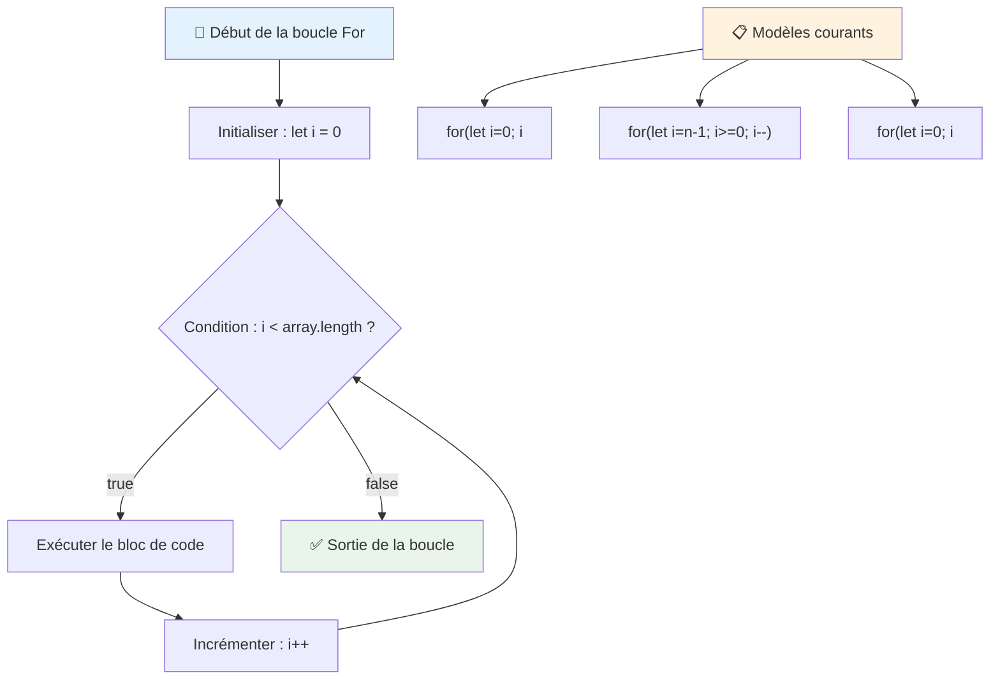
> **Sagesse sur les boucles** : Les boucles for sont parfaites quand vous savez exactement combien de fois vous devez répéter quelque chose. Elles sont le choix le plus courant pour traiter des tableaux !

### Boucle While

La boucle `while` est comme dire « continue à faire ceci tant que... » - vous ne savez peut-être pas exactement combien de fois elle tournera, mais vous savez quand arrêter. Elle est parfaite pour des choses comme demander une entrée utilisateur jusqu’à ce qu’il donne ce dont vous avez besoin, ou chercher dans des données jusqu’à trouver ce que vous cherchez.

**Caractéristiques de la boucle While :**
- **Continue** d’exécuter tant que la condition est vraie
- **Nécessite** la gestion manuelle des variables compteur
- **Vérifie** la condition avant chaque itération
- **Risques** de boucles infinies si la condition ne devient jamais fausse

```javascript
// Exemple basique de comptage
let i = 0;
while (i < 10) {
  console.log(`While count: ${i}`);
  i++; // N'oubliez pas d'incrémenter !
}

// Exemple plus pratique : traitement de la saisie utilisateur
let userInput = "";
let attempts = 0;
const maxAttempts = 3;

while (userInput !== "quit" && attempts < maxAttempts) {
  userInput = prompt(`Enter 'quit' to exit (attempt ${attempts + 1}):`);
  attempts++;
}

if (attempts >= maxAttempts) {
  console.log("Maximum attempts reached!");
}
```

**Comprendre ces exemples :**
- **Gère** manuellement la variable compteur `i` à l’intérieur du corps de la boucle
- **Incrémente** le compteur pour éviter les boucles infinies
- **Montre** un cas d’usage pratique avec saisie utilisateur et limite de tentatives
- **Inclut** des mécanismes de sécurité pour prévenir une exécution sans fin

### ♾️ **Contrôle de sagesse sur la boucle While : Répétition basée sur une condition**

**Testez votre compréhension des boucles while :**
- Quel est le principal danger en utilisant les boucles while ?
- Quand choisiriez-vous une boucle while plutôt qu’une boucle for ?
- Comment éviter les boucles infinies ?

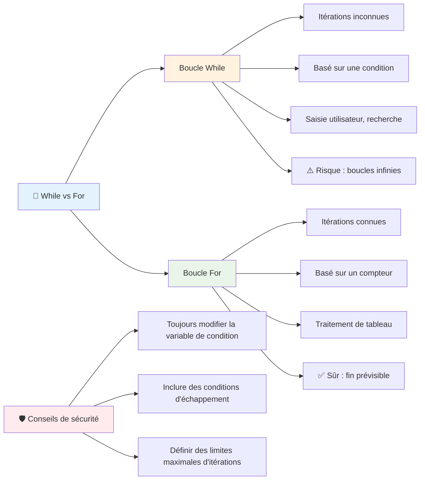
> **Sécurité avant tout** : Les boucles while sont puissantes mais demandent une gestion attentive des conditions. Assurez-vous toujours que votre condition de boucle finira par devenir fausse !

### Alternatives modernes aux boucles

JavaScript offre une syntaxe de boucles moderne qui peut rendre votre code plus lisible et moins sujet aux erreurs.

**Boucle For...of (ES6+) :**

```javascript
const colors = ["red", "green", "blue", "yellow"];

// Approche moderne - plus propre et plus sûre
for (const color of colors) {
  console.log(`Color: ${color}`);
}

// Comparer avec une boucle for traditionnelle
for (let i = 0; i < colors.length; i++) {
  console.log(`Color: ${colors[i]}`);
}
```

**Avantages clés de for...of :**
- **Élimine** la gestion des index et les erreurs hors limites
- **Donne** un accès direct aux éléments du tableau
- **Améliore** la lisibilité du code et réduit la complexité syntaxique

**Méthode forEach :**

```javascript
const prices = [9.99, 15.50, 22.75, 8.25];

// Utilisation de forEach pour un style de programmation fonctionnelle
prices.forEach((price, index) => {
  console.log(`Item ${index + 1}: $${price.toFixed(2)}`);
});

// forEach avec des fonctions fléchées pour des opérations simples
prices.forEach(price => console.log(`Price: $${price}`));
```

**Ce qu’il faut savoir sur forEach :**
- **Exécute** une fonction pour chaque élément du tableau
- **Fournit** la valeur de l’élément et son index en paramètres
- **Ne peut pas** être arrêtée prématurément (contrairement aux boucles traditionnelles)
- **Renvoie** undefined (ne crée pas un nouveau tableau)

✅ Pourquoi choisir une boucle for plutôt qu’une boucle while ? 17 000 personnes se sont posé la même question sur StackOverflow, et certaines opinions [pourraient vous intéresser](https://stackoverflow.com/questions/39969145/while-loops-vs-for-loops-in-javascript).

### 🎨 **Contrôle de syntaxe moderne : S’approprier ES6+**

**Évaluez votre compréhension moderne de JavaScript :**
- Quels sont les avantages de `for...of` par rapport aux boucles for traditionnelles ?
- Quand préféreriez-vous encore les boucles for traditionnelles ?
- Quelle est la différence entre `forEach` et `map` ?

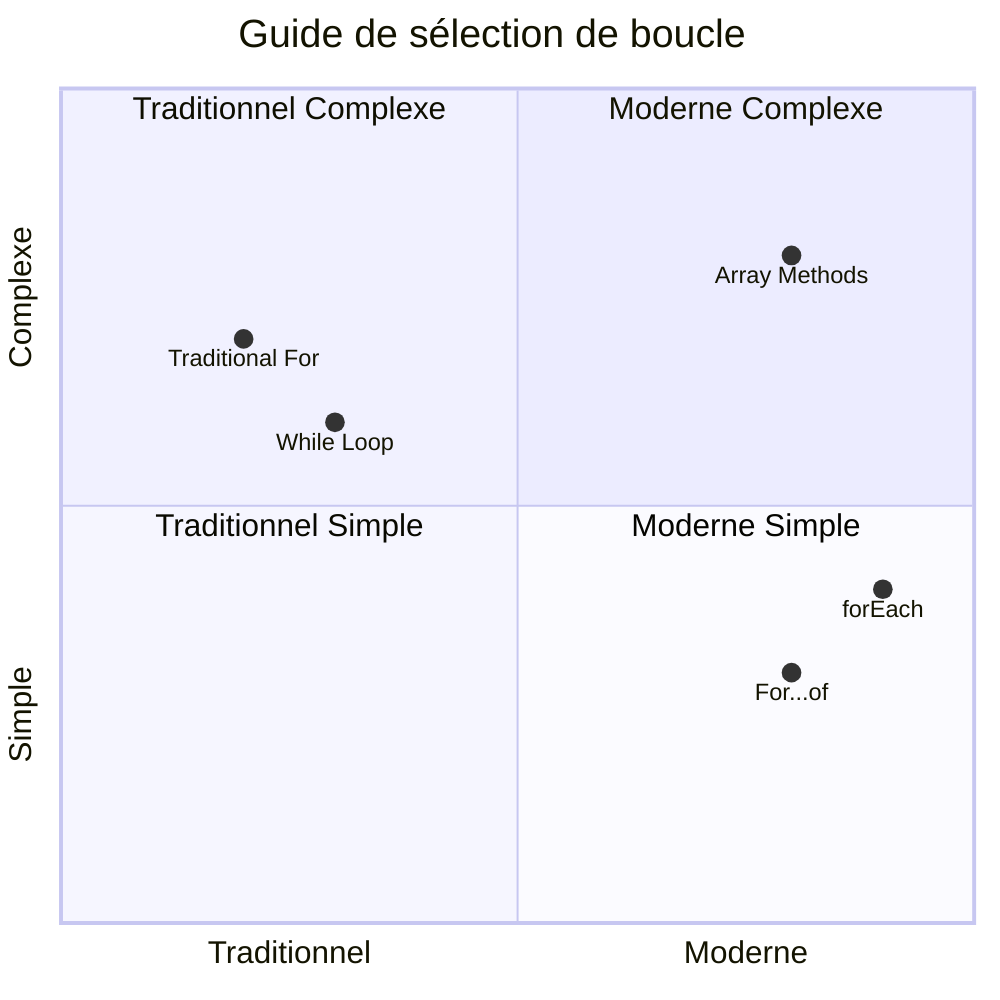
> **Tendance moderne** : Les syntaxes ES6+ comme `for...of` et `forEach` deviennent les approches préférées pour l’itération sur les tableaux car elles sont plus propres et moins sujettes aux erreurs !

## Boucles et tableaux

La combinaison de tableaux avec les boucles crée des capacités puissantes de traitement des données. Ce duo est fondamental pour de nombreuses tâches en programmation, de l’affichage des listes au calcul de statistiques.

**Traitement traditionnel des tableaux :**

```javascript
const iceCreamFlavors = ["Chocolate", "Strawberry", "Vanilla", "Pistachio", "Rocky Road"];

// Approche classique avec la boucle for
for (let i = 0; i < iceCreamFlavors.length; i++) {
  console.log(`Flavor ${i + 1}: ${iceCreamFlavors[i]}`);
}

// Approche moderne avec la boucle for...of
for (const flavor of iceCreamFlavors) {
  console.log(`Available flavor: ${flavor}`);
}
```

**Comprenons chaque approche :**
- **Utilise** la propriété length du tableau pour déterminer les limites de la boucle
- **Accède** aux éléments par index dans les boucles for traditionnelles
- **Fournit** l’accès direct aux éléments dans les boucles for...of
- **Traite** chaque élément du tableau une seule fois

**Exemple pratique de traitement des données :**

```javascript
const studentGrades = [85, 92, 78, 96, 88, 73, 89];
let total = 0;
let highestGrade = studentGrades[0];
let lowestGrade = studentGrades[0];

// Traiter toutes les notes avec une seule boucle
for (let i = 0; i < studentGrades.length; i++) {
  const grade = studentGrades[i];
  total += grade;
  
  if (grade > highestGrade) {
    highestGrade = grade;
  }
  
  if (grade < lowestGrade) {
    lowestGrade = grade;
  }
}

const average = total / studentGrades.length;
console.log(`Average: ${average.toFixed(1)}`);
console.log(`Highest: ${highestGrade}`);
console.log(`Lowest: ${lowestGrade}`);
```

**Voici comment fonctionne ce code :**
- **Initialise** des variables de suivi pour la somme et les extrêmes
- **Traite** chaque note avec une seule boucle efficace
- **Accumule** le total pour calculer la moyenne
- **Suit** les valeurs les plus hautes et les plus basses pendant l’itération
- **Calcule** les statistiques finales après la fin de la boucle

✅ Essayez de faire tourner une boucle sur un tableau que vous avez créé dans la console de votre navigateur.

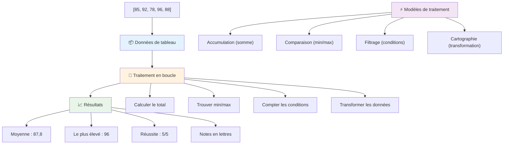
---

## Défi GitHub Copilot Agent 🚀

Utilisez le mode Agent pour relever le défi suivant :

**Description :** Construisez une fonction complète de traitement de données qui combine tableaux et boucles pour analyser un ensemble de données et générer des informations significatives.

**Consigne :** Créez une fonction appelée `analyzeGrades` qui prend un tableau d’objets de notes d’étudiants (chacun contenant les propriétés name et score) et renvoie un objet avec des statistiques incluant le score le plus élevé, le score le plus bas, la moyenne, le nombre d’étudiants ayant réussi (score >= 70), et un tableau des noms d’étudiants ayant un score supérieur à la moyenne. Utilisez au moins deux types de boucles différents dans votre solution.

Apprenez-en plus sur le [mode agent](https://code.visualstudio.com/blogs/2025/02/24/introducing-copilot-agent-mode) ici.

## 🚀 Défi
JavaScript offre plusieurs méthodes modernes de tableau qui peuvent remplacer les boucles traditionnelles pour des tâches spécifiques. Explorez [forEach](https://developer.mozilla.org/docs/Web/JavaScript/Reference/Global_Objects/Array/forEach), [for-of](https://developer.mozilla.org/docs/Web/JavaScript/Reference/Statements/for...of), [map](https://developer.mozilla.org/docs/Web/JavaScript/Reference/Global_Objects/Array/map), [filter](https://developer.mozilla.org/docs/Web/JavaScript/Reference/Global_Objects/Array/filter) et [reduce](https://developer.mozilla.org/docs/Web/JavaScript/Reference/Global_Objects/Array/reduce). 

**Votre défi :** Refactorez l'exemple des notes des étudiants en utilisant au moins trois méthodes de tableau différentes. Remarquez à quel point le code devient plus clair et plus lisible avec la syntaxe moderne de JavaScript.

## Quiz post-cours
[Quiz post-cours](https://ff-quizzes.netlify.app/web/quiz/14)


## Revue & Auto-étude

Les tableaux en JavaScript possèdent de nombreuses méthodes qui leur sont associées et qui sont extrêmement utiles pour la manipulation des données. [Informez-vous sur ces méthodes](https://developer.mozilla.org/docs/Web/JavaScript/Reference/Global_Objects/Array) et essayez-en certaines (comme push, pop, slice et splice) sur un tableau que vous aurez créé.

## Devoir

[Parcourir un tableau](assignment.md)

---

## 📊 **Résumé de votre boîte à outils Tableaux & Boucles**

```mermaid
graph TD
    A["🎯 Maîtrise des Tableaux & Boucles"] --> B["📦 Notions Fondamentales des Tableaux"]
    A --> C["🔄 Types de Boucles"]
    A --> D["🔗 Traitement des Données"]
    A --> E["🎨 Techniques Modernes"]
    
    B --> B1["Création : [ ]"]
    B --> B2["Indexation : arr[0]"]
    B --> B3["Méthodes : push, pop"]
    B --> B4["Propriétés : longueur"]
    
    C --> C1["For : Itérations Connues"]
    C --> C2["While : Basé sur Condition"]
    C --> C3["For...of : Accès Direct"]
    C --> C4["forEach : Fonctionnel"]
    
    D --> D1["Calcul de statistiques"]
    D --> D2["Transformation des données"]
    D --> D3["Filtrage & recherche"]
    D --> D4["Traitement en temps réel"]
    
    E --> E1["Fonctions fléchées"]
    E --> E2["Chaine de méthodes"]
    E --> E3["Destructuration"]
    E --> E4["Littéraux de gabarits"]
    
    F["💡 Avantages Clés"] --> F1["Gestion efficace des données"]
    F --> F2["Réduction de la répétition de code"]
    F --> F3["Solutions évolutives"]
    F --> F4["Syntaxe plus propre"]
    
    style A fill:#e3f2fd
    style B fill:#e8f5e8
    style C fill:#fff3e0
    style D fill:#f3e5f5
    style E fill:#e0f2f1
    style F fill:#fce4ec
```
---

## 🚀 Votre calendrier de maîtrise des Tableaux & Boucles

### ⚡ **Ce que vous pouvez faire dans les 5 prochaines minutes**
- [ ] Créer un tableau de vos films préférés et accéder à des éléments spécifiques
- [ ] Écrire une boucle for qui compte de 1 à 10
- [ ] Essayer le défi des méthodes modernes de tableau proposé dans la leçon
- [ ] S'exercer à l'indexation des tableaux dans la console de votre navigateur

### 🎯 **Ce que vous pouvez accomplir cette heure**
- [ ] Terminer le quiz post-cours et réviser les concepts difficiles
- [ ] Construire l'analyseur complet de notes issu du défi GitHub Copilot
- [ ] Créer un panier d'achat simple qui ajoute et supprime des articles
- [ ] S'exercer à convertir différents types de boucles
- [ ] Expérimenter avec des méthodes de tableau comme `push`, `pop`, `slice` et `splice`

### 📅 **Votre parcours de traitement des données sur une semaine**
- [ ] Terminer le devoir "Parcourir un tableau" avec des améliorations créatives
- [ ] Créer une application de liste de tâches utilisant des tableaux et des boucles
- [ ] Créer un calculateur de statistiques simple pour des données numériques
- [ ] S'exercer avec les [méthodes de tableau MDN](https://developer.mozilla.org/docs/Web/JavaScript/Reference/Global_Objects/Array)
- [ ] Construire une galerie photo ou une interface de playlist musicale
- [ ] Explorer la programmation fonctionnelle avec `map`, `filter` et `reduce`

### 🌟 **Votre transformation sur un mois**
- [ ] Maîtriser les opérations avancées sur les tableaux et l'optimisation des performances
- [ ] Construire un tableau de bord complet de visualisation de données
- [ ] Contribuer à des projets open source impliquant le traitement des données
- [ ] Enseigner à d'autres les tableaux et boucles avec des exemples pratiques
- [ ] Créer une bibliothèque personnelle de fonctions réutilisables pour le traitement des données
- [ ] Explorer des algorithmes et structures de données basés sur les tableaux

### 🏆 **Bilan final du champion du traitement des données**

**Célébrez votre maîtrise des tableaux et boucles :**
- Quelle est l'opération sur tableaux la plus utile que vous ayez apprise pour des applications réelles ?
- Quel type de boucle vous semble le plus naturel et pourquoi ?
- Comment la compréhension des tableaux et boucles a-t-elle changé votre approche de l'organisation des données ?
- Quelle tâche complexe de traitement des données souhaitez-vous aborder ensuite ?

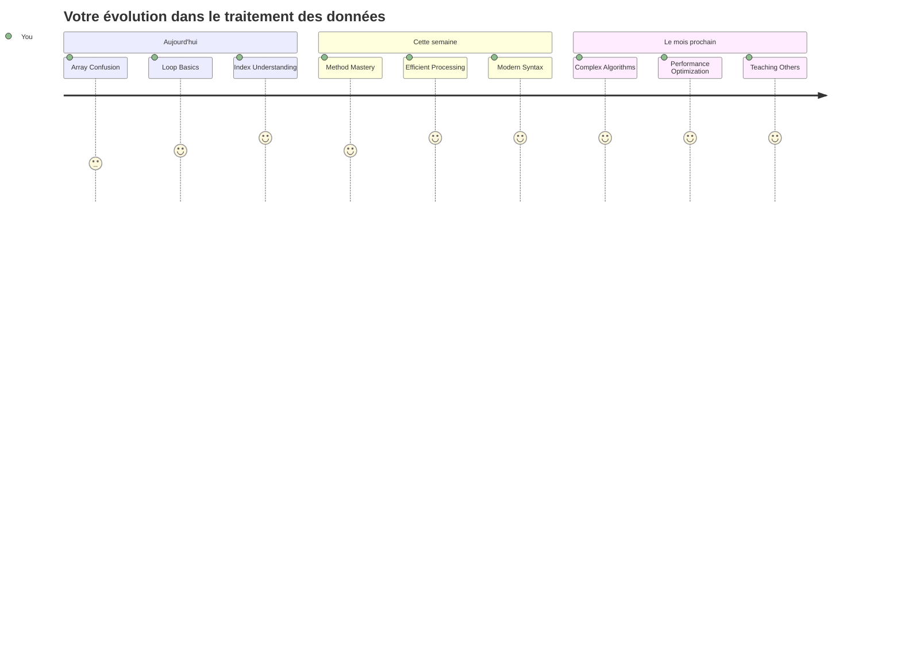
> 📦 **Vous avez débloqué la puissance de l'organisation et du traitement des données !** Les tableaux et les boucles sont la base de presque toutes les applications que vous créerez un jour. Des listes simples aux analyses de données complexes, vous avez désormais les outils pour gérer l'information de manière efficace et élégante. Chaque site web dynamique, application mobile et application basée sur les données s'appuie sur ces concepts fondamentaux. Bienvenue dans le monde du traitement des données évolutif ! 🎉

---

<!-- CO-OP TRANSLATOR DISCLAIMER START -->
**Avertissement** :  
Ce document a été traduit à l’aide du service de traduction automatique [Co-op Translator](https://github.com/Azure/co-op-translator). Bien que nous nous efforçons d’assurer l’exactitude, veuillez noter que les traductions automatiques peuvent contenir des erreurs ou des inexactitudes. Le document original dans sa langue d’origine doit être considéré comme la source officielle. Pour les informations critiques, une traduction professionnelle réalisée par un humain est recommandée. Nous déclinons toute responsabilité en cas de malentendus ou de mauvaises interprétations résultant de l’utilisation de cette traduction.
<!-- CO-OP TRANSLATOR DISCLAIMER END -->