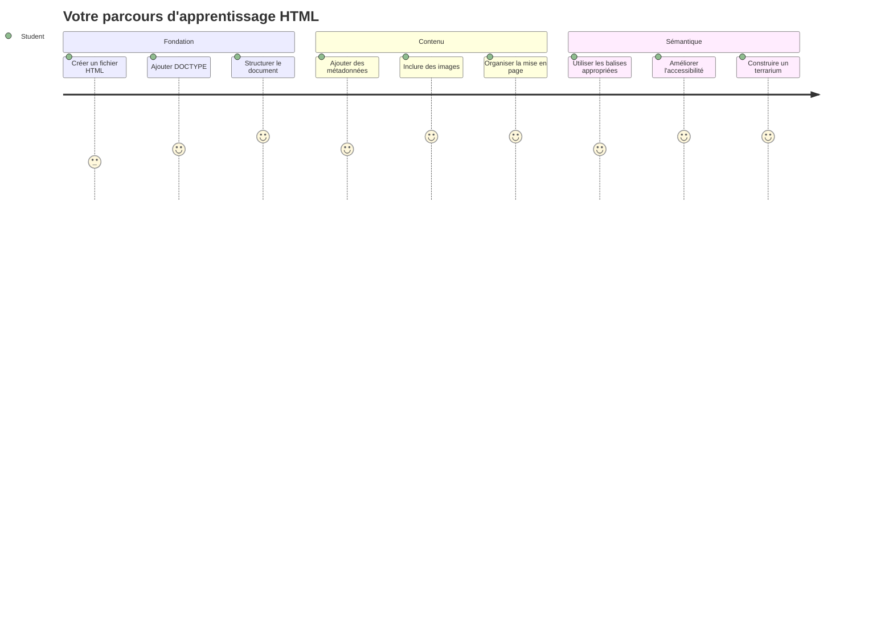
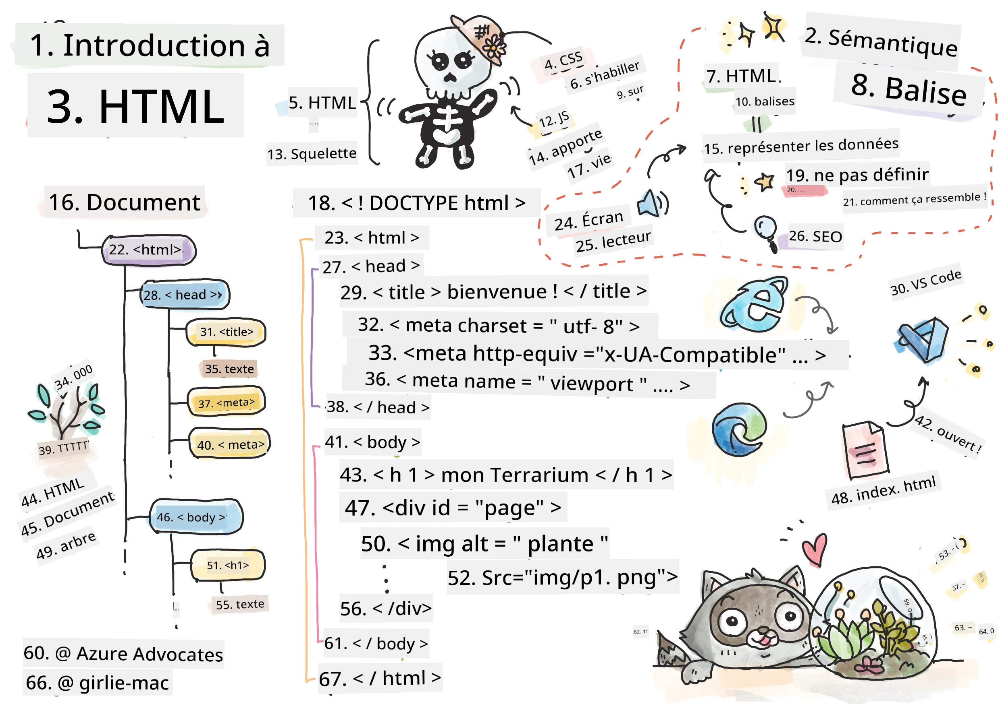
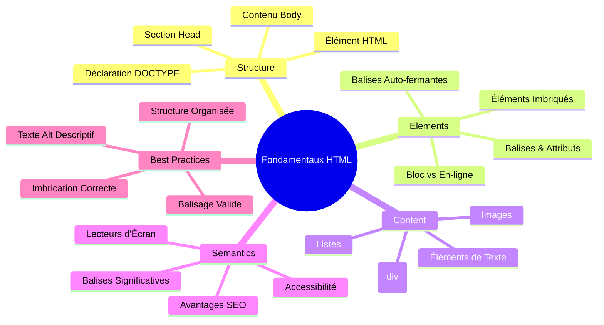
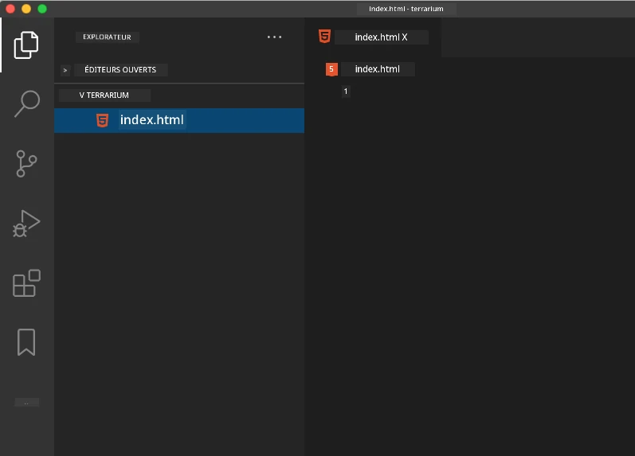
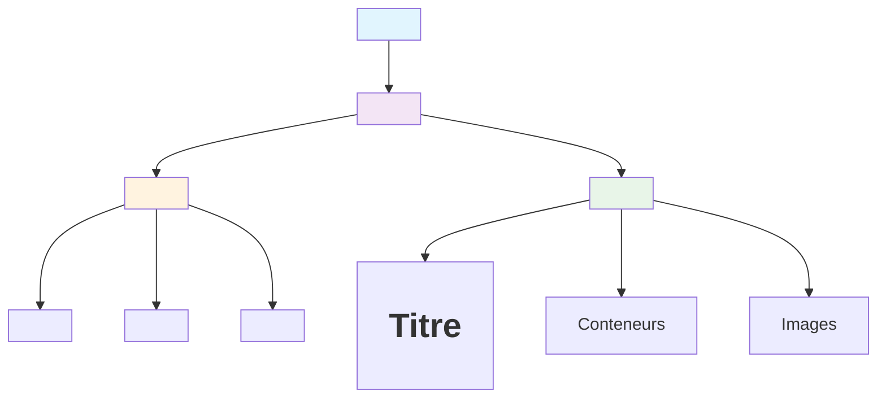
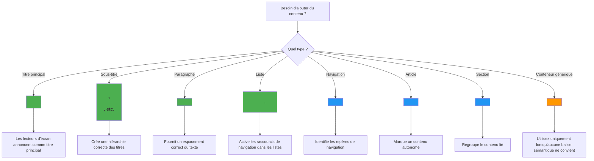
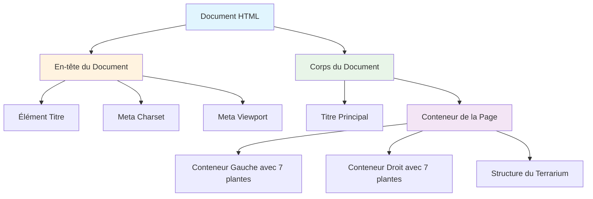
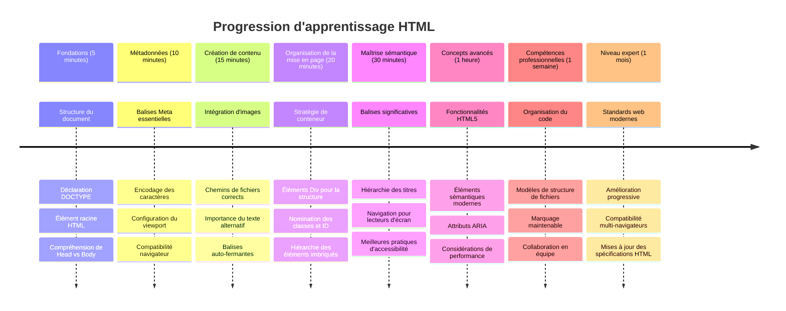

# Projet Terrarium Partie 1 : Introduction à HTML



> Sketchnote par [Tomomi Imura](https://twitter.com/girlie_mac)

HTML, ou HyperText Markup Language, est le fondement de tous les sites web que vous avez jamais visités. Pensez à HTML comme au squelette qui donne la structure aux pages web – il définit où va le contenu, comment il est organisé et ce que chaque élément représente. Alors que le CSS "habillera" ultérieurement votre HTML avec des couleurs et des mises en page, et que JavaScript lui donnera vie avec de l’interactivité, HTML fournit la structure essentielle qui rend tout le reste possible.

Dans cette leçon, vous allez créer la structure HTML pour une interface de terrarium virtuelle. Ce projet pratique vous enseignera les concepts fondamentaux de HTML tout en construisant quelque chose de visuellement engageant. Vous apprendrez comment organiser le contenu avec des éléments sémantiques, travailler avec des images, et créer la base pour une application web interactive.

À la fin de cette leçon, vous aurez une page HTML fonctionnelle affichant des images de plantes en colonnes organisées, prête à être stylisée dans la leçon suivante. Ne vous inquiétez pas si elle semble basique au départ – c’est exactement ce que HTML doit faire avant que le CSS ajoute la finition visuelle.


## Quiz Pré-Cours

[Quiz pré-cours](https://ff-quizzes.netlify.app/web/quiz/15)

> 📺 **Regardez et Apprenez** : Découvrez cette vidéo pratique
> 
> [](https://www.youtube.com/watch?v=1TvxJKBzhyQ)

## Mise en Place de Votre Projet

Avant de plonger dans le code HTML, configurons un espace de travail adéquat pour votre projet terrarium. Créer dès le départ une structure de fichiers organisée est une habitude cruciale qui vous servira tout au long de votre parcours en développement web.

### Tâche : Créez Votre Structure de Projet

Vous allez créer un dossier dédié pour votre projet terrarium et y ajouter votre premier fichier HTML. Voici deux approches que vous pouvez utiliser :

**Option 1 : Utiliser Visual Studio Code**
1. Ouvrez Visual Studio Code
2. Cliquez sur "Fichier" → "Ouvrir un dossier" ou utilisez `Ctrl+K, Ctrl+O` (Windows/Linux) ou `Cmd+K, Cmd+O` (Mac)
3. Créez un nouveau dossier nommé `terrarium` et sélectionnez-le
4. Dans le panneau Explorateur, cliquez sur l’icône "Nouveau fichier"
5. Nommez votre fichier `index.html`



**Option 2 : Utiliser des Commandes Terminal**
```bash
mkdir terrarium
cd terrarium
touch index.html
code index.html
```

**Voici ce que ces commandes accomplissent :**
- **Crée** un nouveau répertoire nommé `terrarium` pour votre projet
- **Se déplace** dans le répertoire terrarium
- **Crée** un fichier vide `index.html`
- **Ouvre** le fichier dans Visual Studio Code pour l’édition

> 💡 **Astuce Pro** : Le nom de fichier `index.html` est spécial en développement web. Lorsqu’une personne visite un site, les navigateurs recherchent automatiquement `index.html` comme page par défaut à afficher. Cela signifie qu’une URL comme `https://mysite.com/projects/` servira automatiquement le fichier `index.html` du dossier `projects` sans avoir besoin de spécifier le nom du fichier dans l’URL.

## Comprendre la Structure d’un Document HTML

Chaque document HTML suit une structure spécifique que les navigateurs doivent comprendre pour afficher correctement. Pensez à cette structure comme une lettre formelle – elle contient des éléments requis dans un ordre particulier qui aident le destinataire (ici, le navigateur) à traiter correctement le contenu.


Commençons par ajouter la base essentielle dont chaque document HTML a besoin.

### La Déclaration DOCTYPE et l’élément Racine

Les deux premières lignes de chaque fichier HTML servent d’"introduction" du document au navigateur :

```html
<!DOCTYPE html>
<html></html>
```

**Comprendre ce que fait ce code :**
- **Déclare** le type de document comme HTML5 avec `<!DOCTYPE html>`
- **Crée** l’élément racine `<html>` qui contiendra tout le contenu de la page
- **Établit** les standards web modernes pour un rendu correct par le navigateur
- **Assure** un affichage cohérent sur différents navigateurs et appareils

> 💡 **Conseil VS Code** : Survolez n’importe quelle balise HTML dans VS Code pour voir des informations utiles issues de MDN Web Docs, incluant des exemples d’utilisation et la compatibilité avec les navigateurs.

> 📚 **En savoir plus** : La déclaration DOCTYPE empêche les navigateurs d’entrer en "mode fantaisie" (quirks mode), auparavant utilisé pour supporter des sites très anciens. Le développement web moderne utilise la simple déclaration `<!DOCTYPE html>` pour assurer un [rendu conforme aux standards](https://developer.mozilla.org/docs/Web/HTML/Quirks_Mode_and_Standards_Mode).

### 🔄 **Contrôle Pédagogique**
**Pause et réflexion** : Avant de continuer, assurez-vous de comprendre :
- ✅ Pourquoi chaque document HTML a besoin d’une déclaration DOCTYPE
- ✅ Ce que contient l’élément racine `<html>`
- ✅ Comment cette structure aide les navigateurs à rendre les pages correctement

**Auto-évaluation rapide** : Pouvez-vous expliquer avec vos mots ce que signifie un "rendu conforme aux standards" ?

## Ajout des Métadonnées Essentielles du Document

La section `<head>` d’un document HTML contient des informations cruciales que les navigateurs et moteurs de recherche utilisent, mais que les visiteurs ne voient pas directement sur la page. Pensez-y comme aux informations "en coulisses" qui aident votre page web à fonctionner correctement et à s’afficher de manière adéquate sur différents appareils et plateformes.

Ces métadonnées indiquent aux navigateurs comment afficher votre page, quelle encodage de caractères utiliser, et comment gérer différentes tailles d’écran – indispensables pour créer des pages web professionnelles et accessibles.

### Tâche : Ajouter l’En-tête du Document

Insérez cette section `<head>` entre vos balises `<html>` d’ouverture et de fermeture :

```html
<head>
	<title>Welcome to my Virtual Terrarium</title>
	<meta charset="utf-8" />
	<meta http-equiv="X-UA-Compatible" content="IE=edge" />
	<meta name="viewport" content="width=device-width, initial-scale=1" />
</head>
```

**Décomposer ce que chaque élément accomplit :**
- **Définit** le titre de la page qui apparaît dans les onglets du navigateur et résultats de recherche
- **Spécifie** l’encodage de caractères UTF-8 pour un affichage correct du texte dans le monde entier
- **Assure** la compatibilité avec les versions modernes d’Internet Explorer
- **Configure** le design responsive en réglant la fenêtre graphique selon la largeur de l’appareil
- **Contrôle** le niveau de zoom initial pour afficher le contenu à sa taille naturelle

> 🤔 **Réfléchissez à ceci** : Que se passerait-il si vous mettiez une meta viewport comme ceci : `<meta name="viewport" content="width=600">` ? Cela forcerait la page à être toujours de 600 pixels de large, brisant le design responsive ! Découvrez-en plus sur la [configuration correcte du viewport](https://developer.mozilla.org/docs/Web/HTML/Viewport_meta_tag).

## Construire le Corps du Document

L’élément `<body>` contient tout le contenu visible de votre page web – tout ce que les utilisateurs verront et avec quoi ils interagiront. Alors que la section `<head>` donne des instructions au navigateur, la section `<body>` contient le contenu réel : texte, images, boutons et autres éléments créant l’interface utilisateur.

Ajoutons la structure du corps et comprenons comment les balises HTML fonctionnent ensemble pour créer un contenu significatif.

### Comprendre la Structure des Balises HTML

HTML utilise des balises appariées pour définir les éléments. La plupart des balises ont une balise d’ouverture comme `<p>` et une balise de fermeture comme `</p>`, avec du contenu entre les deux : `<p>Bonjour, monde !</p>`. Cela crée un élément paragraphe contenant le texte "Bonjour, monde !".

### Tâche : Ajouter l’Élément Corps

Mettez à jour votre fichier HTML pour inclure l’élément `<body>` :

```html
<!DOCTYPE html>
<html>
	<head>
		<title>Welcome to my Virtual Terrarium</title>
		<meta charset="utf-8" />
		<meta http-equiv="X-UA-Compatible" content="IE=edge" />
		<meta name="viewport" content="width=device-width, initial-scale=1" />
	</head>
	<body></body>
</html>
```

**Voici ce que cette structure complète fournit :**
- **Établit** le cadre de base du document HTML5
- **Inclut** les métadonnées essentielles pour un rendu correct par le navigateur
- **Crée** un corps vide prêt à accueillir votre contenu visible
- **Suit** les meilleures pratiques modernes en développement web

Vous êtes maintenant prêt à ajouter les éléments visibles de votre terrarium. Nous utiliserons des éléments `<div>` comme conteneurs pour organiser différentes sections de contenu, et des éléments `` pour afficher les images des plantes.

### Travailler avec les Images et les Conteneurs de Mise en Page

Les images sont spéciales en HTML car elles utilisent des balises "auto-fermantes". Contrairement aux éléments comme `<p></p>` qui entourent du contenu, la balise `` contient toutes les informations dont elle a besoin dans la balise elle-même via des attributs comme `src` pour le chemin de l’image et `alt` pour l’accessibilité.

Avant d’ajouter les images à votre HTML, vous devrez organiser correctement vos fichiers de projet en créant un dossier images et en ajoutant les graphiques de plantes.

**Commencez par préparer vos images :**
1. Créez un dossier nommé `images` à l’intérieur de votre dossier projet terrarium
2. Téléchargez les images de plantes depuis le [dossier solution](../../../../3-terrarium/solution/images) (14 images de plantes au total)
3. Copiez toutes les images de plantes dans votre nouveau dossier `images`

### Tâche : Créer la Mise en Page d’Affichage des Plantes

Ajoutez maintenant les images des plantes organisées en deux colonnes entre vos balises `<body></body>` :

```html
<div id="page">
	<div id="left-container" class="container">
		<div class="plant-holder">
			
		</div>
		<div class="plant-holder">
			
		</div>
		<div class="plant-holder">
			
		</div>
		<div class="plant-holder">
			
		</div>
		<div class="plant-holder">
			
		</div>
		<div class="plant-holder">
			
		</div>
		<div class="plant-holder">
			
		</div>
	</div>
	<div id="right-container" class="container">
		<div class="plant-holder">
			
		</div>
		<div class="plant-holder">
			
		</div>
		<div class="plant-holder">
			
		</div>
		<div class="plant-holder">
			
		</div>
		<div class="plant-holder">
			
		</div>
		<div class="plant-holder">
			
		</div>
		<div class="plant-holder">
			
		</div>
	</div>
</div>
```

**Étape par étape, voici ce qui se passe dans ce code :**
- **Crée** un conteneur principal de page avec `id="page"` pour contenir tout le contenu
- **Établit** deux conteneurs de colonnes : `left-container` et `right-container`
- **Organise** 7 plantes dans la colonne gauche et 7 plantes dans la colonne droite
- **Enveloppe** chaque image de plante dans un div `plant-holder` pour un positionnement individuel
- **Applique** des noms de classes cohérents pour le stylage CSS dans la prochaine leçon
- **Attribue** des ID uniques à chaque image de plante pour l’interaction JavaScript plus tard
- **Inclut** des chemins de fichiers corrects pointant vers le dossier images

> 🤔 **Réfléchissez-y** : Remarquez que toutes les images ont actuellement le même texte alternatif "plant". Ce n’est pas idéal pour l’accessibilité. Les utilisateurs de lecteurs d’écran entendraient "plant" répété 14 fois sans savoir quelle plante spécifique chaque image montre. Pouvez-vous penser à des textes alternatifs meilleurs et plus descriptifs pour chaque image ?

> 📝 **Types d’Éléments HTML** : Les éléments `<div>` sont de type "block-level" et prennent toute la largeur, tandis que les éléments `<span>` sont "inline" et ne prennent que la largeur nécessaire. Que pensez-vous qu’il se passerait si vous remplaciez tous ces `<div>` par des `<span>` ?

### 🔄 **Contrôle Pédagogique**
**Compréhension de la structure** : Prenez un moment pour revoir votre structure HTML :
- ✅ Pouvez-vous identifier les conteneurs principaux dans votre mise en page ?
- ✅ Comprenez-vous pourquoi chaque image a un ID unique ?
- ✅ Comment décririez-vous la fonction des divs `plant-holder` ?

**Inspection Visuelle** : Ouvrez votre fichier HTML dans un navigateur. Vous devriez voir :
- Une liste basique d’images de plantes
- Des images organisées en deux colonnes
- Une mise en page simple et non stylisée

**Rappelez-vous** : Cet aspect dépouillé est exactement ce à quoi HTML doit ressembler avant la stylisation CSS !

Avec ce balisage ajouté, les plantes apparaîtront à l’écran, même si elles n’auront pas encore l’air fini – c’est là que le CSS intervient dans la prochaine leçon ! Pour l’instant, vous avez une base HTML solide qui organise correctement votre contenu et suit les bonnes pratiques d’accessibilité.

## Utiliser du HTML Sémantique pour l’Accessibilité

Le HTML sémantique signifie choisir des éléments HTML basés sur leur signification et leur fonction, pas seulement leur apparence. Lorsque vous utilisez un balisage sémantique, vous communiquez la structure et la signification de votre contenu aux navigateurs, moteurs de recherche et technologies d’assistance comme les lecteurs d’écran.


Cette approche rend vos sites web plus accessibles aux utilisateurs en situation de handicap et aide les moteurs de recherche à mieux comprendre votre contenu. C’est un principe fondamental du développement web moderne qui crée de meilleures expériences pour tout le monde.

### Ajouter un Titre de Page Sémantique

Ajoutons un titre approprié à votre page terrarium. Insérez cette ligne juste après la balise `<body>` d’ouverture :

```html
<h1>My Terrarium</h1>
```

**Pourquoi le balisage sémantique est important :**
- **Aide** les lecteurs d’écran à naviguer et comprendre la structure de la page
- **Améliore** le référencement (SEO) en clarifiant la hiérarchie du contenu
- **Renforce** l’accessibilité pour les utilisateurs malvoyants ou avec des troubles cognitifs
- **Crée** de meilleures expériences utilisateur sur tous les appareils et plateformes
- **Suit** les standards web et les meilleures pratiques pour un développement professionnel

**Exemples de choix sémantiques vs non-sémantiques :**

| But | ✅ Choix Sémantique | ❌ Choix Non Sémantique |
|---------|-------------------|------------------------|
| Titre principal | `<h1>Titre</h1>` | `<div class="big-text">Titre</div>` |
| Navigation | `<nav><ul><li></li></ul></nav>` | `<div class="menu"><div></div></div>` |
| Bouton | `<button>Cliquez-moi</button>` | `<span onclick="...">Cliquez-moi</span>` |
| Contenu d’article | `<article><p></p></article>` | `<div class="content"><div></div></div>` |

> 🎥 **Voir en action** : Regardez [comment les lecteurs d’écran interagissent avec les pages web](https://www.youtube.com/watch?v=OUDV1gqs9GA) pour comprendre pourquoi le balisage sémantique est crucial pour l’accessibilité. Remarquez comment une structure HTML appropriée aide les utilisateurs à naviguer efficacement.

## Créer le Conteneur du Terrarium

Ajoutons maintenant la structure HTML pour le terrarium lui-même – le contenant en verre dans lequel les plantes seront finalement placées. Cette section illustre un concept important : HTML fournit la structure, mais sans stylage CSS, ces éléments ne seront pas encore visibles.

Le balisage du terrarium utilise des noms de classes descriptifs qui rendront le stylage CSS intuitif et maintenable dans la leçon suivante.

### Tâche : Ajouter la Structure du Terrarium

Insérez ce balisage au-dessus de la dernière balise `</div>` (avant la balise de fermeture du conteneur de la page) :

```html
<div id="terrarium">
	<div class="jar-top"></div>
	<div class="jar-walls">
		<div class="jar-glossy-long"></div>
		<div class="jar-glossy-short"></div>
	</div>
	<div class="dirt"></div>
	<div class="jar-bottom"></div>
</div>
```

**Comprendre cette structure de terrarium :**
- **Crée** un conteneur principal pour le terrarium avec un ID unique pour le stylage
- **Définit** des éléments séparés pour chaque composant visuel (haut, murs, terre, bas)
- **Comprend** des éléments imbriqués pour les effets de réflexion du verre (éléments brillants)
- **Utilise** des noms de classes descriptifs qui indiquent clairement la fonction de chaque élément
- **Prépare** la structure pour un style CSS qui créera l’apparence du terrarium en verre

> 🤔 **Vous avez remarqué ?** : Même si vous avez ajouté ce balisage, vous ne voyez rien de nouveau sur la page ! Cela illustre parfaitement comment le HTML fournit la structure tandis que le CSS fournit l’apparence. Ces éléments `<div>` existent mais n’ont pas encore de style visuel – cela arrivera dans la prochaine leçon !


### 🔄 **Contrôle pédagogique**
**Maîtrise de la structure HTML** : Avant d’avancer, assurez-vous de pouvoir :
- ✅ Expliquer la différence entre la structure HTML et l’apparence visuelle
- ✅ Identifier les éléments HTML sémantiques et non sémantiques
- ✅ Décrire comment un balisage approprié bénéficie à l’accessibilité
- ✅ Reconnaître la structure complète de l’arbre documentaire

**Testez votre compréhension** : Essayez d’ouvrir votre fichier HTML dans un navigateur avec JavaScript désactivé et CSS supprimé. Cela vous montre la structure sémantique pure que vous avez créée !

---

## Défi GitHub Copilot Agent

Utilisez le mode Agent pour relever le défi suivant :

**Description :** Créez une structure HTML sémantique pour une section guide de soins des plantes à ajouter au projet de terrarium.

**Invite :** Créez une section HTML sémantique incluant un titre principal « Guide des soins des plantes », trois sous-sections avec les titres « Arrosage », « Exigences en lumière » et « Entretien du sol », chacune contenant un paragraphe d’informations sur les soins des plantes. Utilisez des balises HTML sémantiques appropriées comme `<section>`, `<h2>`, `<h3>`, et `<p>` pour structurer le contenu correctement.

Pour en savoir plus sur le [mode agent](https://code.visualstudio.com/blogs/2025/02/24/introducing-copilot-agent-mode), consultez ce lien.

## Explorez le défi historique HTML

**Apprendre l’évolution du web**

HTML a beaucoup évolué depuis que Tim Berners-Lee a créé le premier navigateur web au CERN en 1990. Certaines anciennes balises comme `<marquee>` sont maintenant obsolètes car elles ne sont pas compatibles avec les normes modernes d'accessibilité et de conception responsive.

**Essayez cette expérience :**
1. Enveloppez temporairement votre titre `<h1>` dans une balise `<marquee>` : `<marquee><h1>Mon Terrarium</h1></marquee>`
2. Ouvrez votre page dans un navigateur et observez l’effet de défilement
3. Réfléchissez aux raisons pour lesquelles cette balise a été dépréciée (indice : pensez à l’expérience utilisateur et à l’accessibilité)
4. Retirez la balise `<marquee>` et revenez à un balisage sémantique

**Questions de réflexion :**
- Comment un titre défilant pourrait-il affecter les utilisateurs malvoyants ou sensibles au mouvement ?
- Quelles techniques CSS modernes pourraient produire des effets visuels similaires de manière plus accessible ?
- Pourquoi est-il important d’utiliser les standards web actuels au lieu d’éléments obsolètes ?

Découvrez-en plus sur les [éléments HTML obsolètes et dépréciés](https://developer.mozilla.org/docs/Web/HTML/Element#Obsolete_and_deprecated_elements) pour comprendre comment les normes web évoluent pour améliorer l’expérience utilisateur.


## Quiz post-cours

[Quiz post-cours](https://ff-quizzes.netlify.app/web/quiz/16)

## Révision et auto-apprentissage

**Approfondissez vos connaissances HTML**

HTML est la base du web depuis plus de 30 ans, passant d’un simple langage de balisage de documents à une plateforme sophistiquée pour créer des applications interactives. Comprendre cette évolution vous aide à mieux appréhender les normes web modernes et à prendre de meilleures décisions de développement.

**Parcours d’apprentissage recommandés :**

1. **Histoire et évolution du HTML**
   - Recherchez la chronologie depuis HTML 1.0 jusqu’à HTML5
   - Explorez pourquoi certaines balises ont été dépréciées (accessibilité, compatibilité mobile, maintenabilité)
   - Investiguer les nouvelles fonctionnalités HTML émergentes et propositions

2. **Approfondissement HTML sémantique**
   - Étudiez la liste complète des [éléments sémantiques HTML5](https://developer.mozilla.org/docs/Web/HTML/Element)
   - Pratiquez l’identification d’utilisation de `<article>`, `<section>`, `<aside>`, et `<main>`
   - Apprenez à utiliser les attributs ARIA pour améliorer l’accessibilité

3. **Développement web moderne**
   - Explorez [la création de sites web responsives](https://docs.microsoft.com/learn/modules/build-simple-website/?WT.mc_id=academic-77807-sagibbon) sur Microsoft Learn
   - Comprenez comment HTML s’intègre avec CSS et JavaScript
   - Apprenez les bonnes pratiques de performance web et SEO

**Questions de réflexion :**
- Quelles balises HTML dépréciées avez-vous découvertes et pourquoi ont-elles été supprimées ?
- Quelles nouvelles fonctionnalités HTML sont proposées pour les futures versions ?
- Comment le HTML sémantique contribue-t-il à l’accessibilité web et au SEO ?

### ⚡ **Ce que vous pouvez faire dans les 5 prochaines minutes**
- [ ] Ouvrir DevTools (F12) et inspecter la structure HTML de votre site web préféré
- [ ] Créer un fichier HTML simple avec des balises basiques : `<h1>`, `<p>`, et ``
- [ ] Valider votre HTML via le validateur W3C en ligne
- [ ] Essayer d’ajouter un commentaire dans votre HTML avec `<!-- commentaire -->`

### 🎯 **Ce que vous pouvez accomplir cette heure**
- [ ] Compléter le quiz post-leçon et revoir les concepts HTML sémantiques
- [ ] Construire une page web simple à propos de vous avec une structure HTML correcte
- [ ] Expérimenter avec différents niveaux de titres et balises de mise en forme de texte
- [ ] Ajouter des images et des liens pour pratiquer l’intégration multimédia
- [ ] Rechercher des fonctionnalités HTML5 que vous n’avez pas encore testées

### 📅 **Votre parcours HTML sur une semaine**
- [ ] Compléter le projet terrarium avec un balisage sémantique
- [ ] Créer une page web accessible avec des labels et rôles ARIA
- [ ] Pratiquer la création de formulaires avec différents types de champs
- [ ] Explorer les API HTML5 comme localStorage ou la géolocalisation
- [ ] Étudier les designs HTML responsives et le mobile-first
- [ ] Réviser le code HTML d’autres développeurs pour apprendre les bonnes pratiques

### 🌟 **Votre fondation web sur un mois**
- [ ] Construire un site portfolio montrant votre maîtrise du HTML
- [ ] Apprendre le templating HTML avec un framework comme Handlebars
- [ ] Contribuer à des projets open source en améliorant la documentation HTML
- [ ] Maîtriser des concepts HTML avancés comme les éléments personnalisés
- [ ] Intégrer HTML à des frameworks CSS et bibliothèques JavaScript
- [ ] Devenir mentor pour d’autres apprenant les bases du HTML

## 🎯 Votre timeline de maîtrise HTML


### 🛠️ Résumé de votre boîte à outils HTML

Après avoir complété cette leçon, vous avez maintenant :
- **Structure de document** : Fondations complètes HTML5 avec DOCTYPE approprié
- **Balisage sémantique** : Balises significatives qui améliorent l’accessibilité et le SEO
- **Intégration d’images** : Organisation correcte des fichiers et bonnes pratiques pour les textes alternatifs
- **Conteneurs de mise en page** : Utilisation stratégique de divs avec noms de classes descriptifs
- **Sensibilisation à l’accessibilité** : Compréhension de la navigation via lecteurs d’écran
- **Normes modernes** : Pratiques actuelles HTML5 et connaissances des balises dépréciées
- **Fondations projet** : Base solide pour le style CSS et l’interactivité JavaScript

**Prochaines étapes** : Votre structure HTML est prête pour le style CSS ! La fondation sémantique que vous avez construite facilitera grandement la compréhension de la prochaine leçon.


## Devoir

[Pratiquez votre HTML : Construisez une maquette de blog](assignment.md)

---

<!-- CO-OP TRANSLATOR DISCLAIMER START -->
**Avertissement** :  
Ce document a été traduit à l'aide du service de traduction automatique [Co-op Translator](https://github.com/Azure/co-op-translator). Bien que nous nous efforcions d'assurer l'exactitude, veuillez noter que les traductions automatiques peuvent contenir des erreurs ou des inexactitudes. Le document original dans sa langue d'origine doit être considéré comme la source faisant autorité. Pour les informations critiques, il est recommandé de faire appel à une traduction professionnelle humaine. Nous déclinons toute responsabilité en cas de malentendus ou d'interprétations erronées résultant de l'utilisation de cette traduction.
<!-- CO-OP TRANSLATOR DISCLAIMER END -->