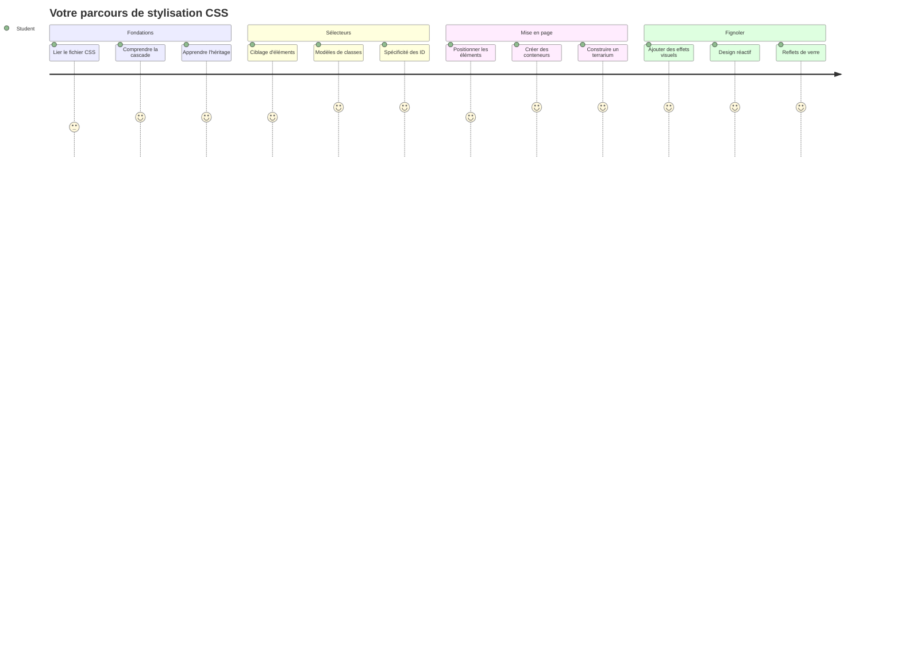
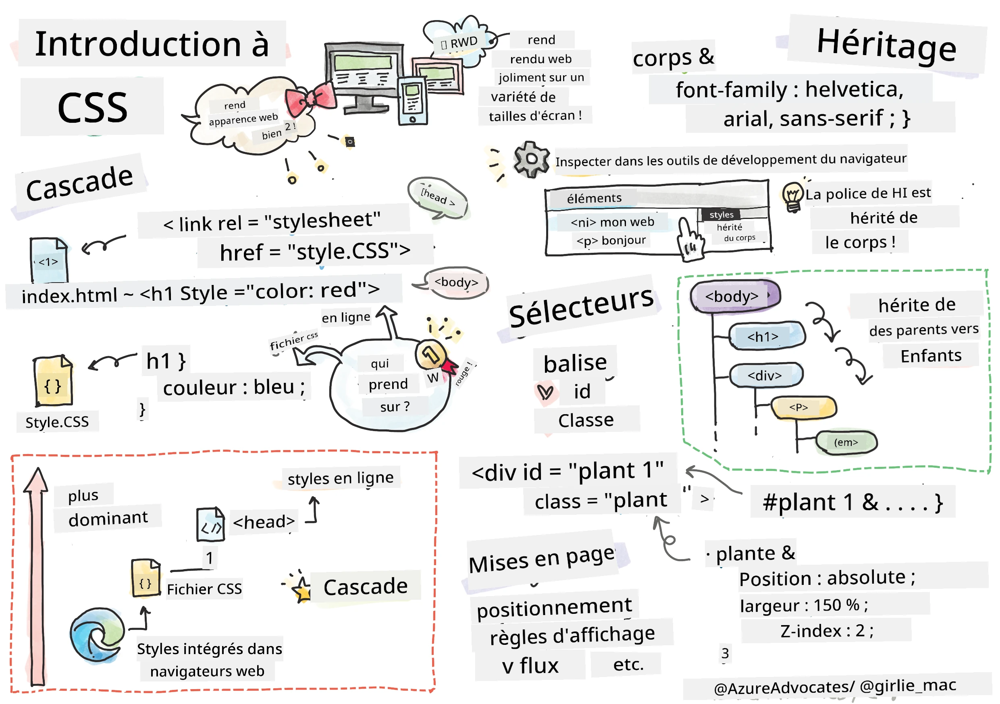
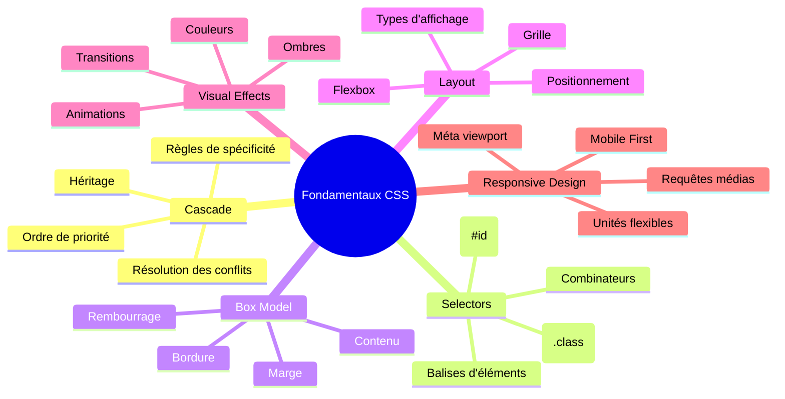
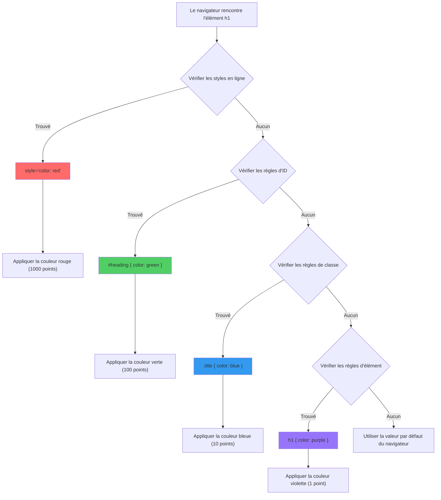
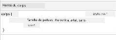
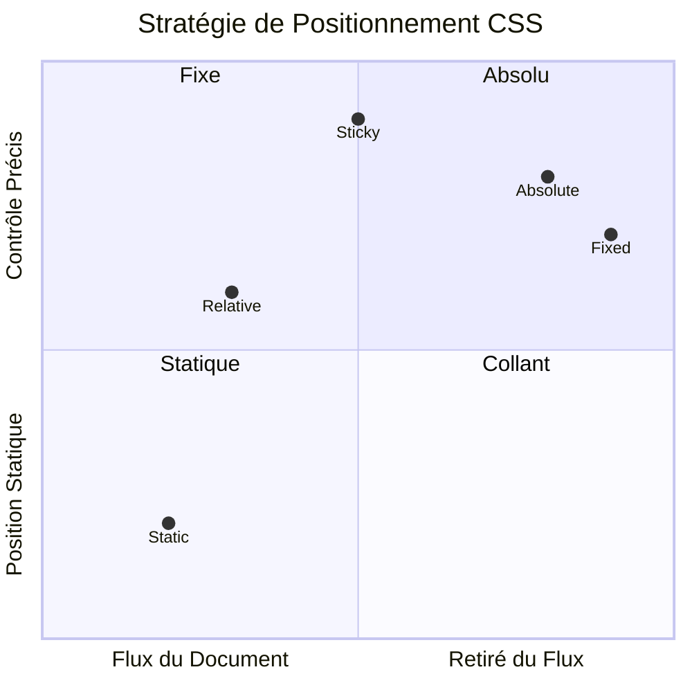
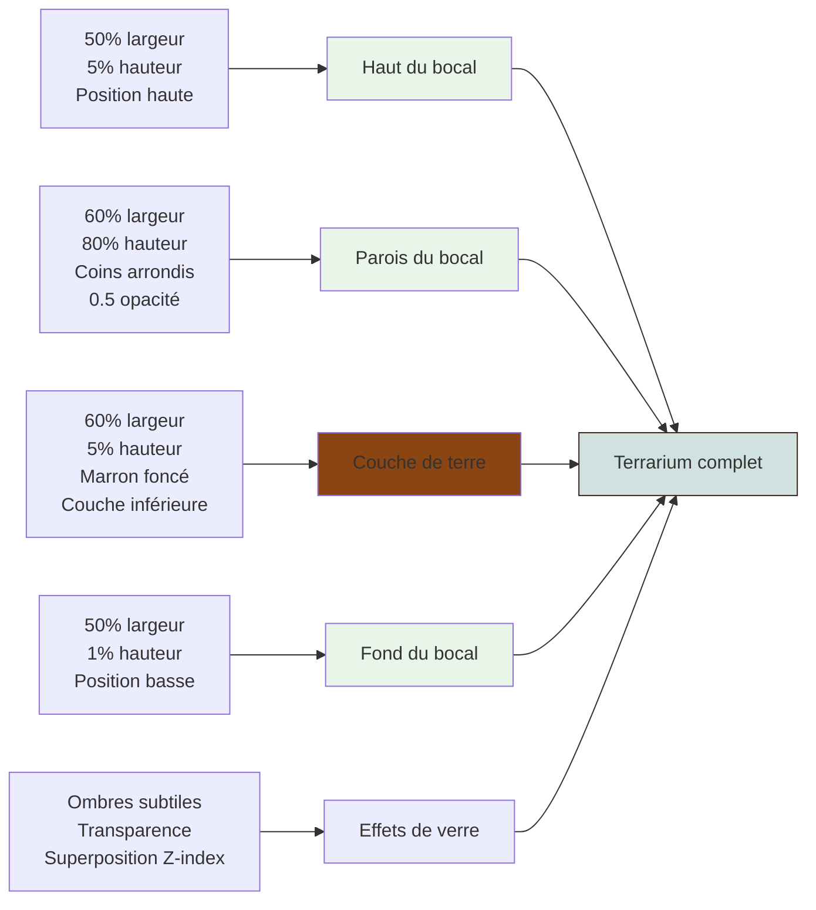
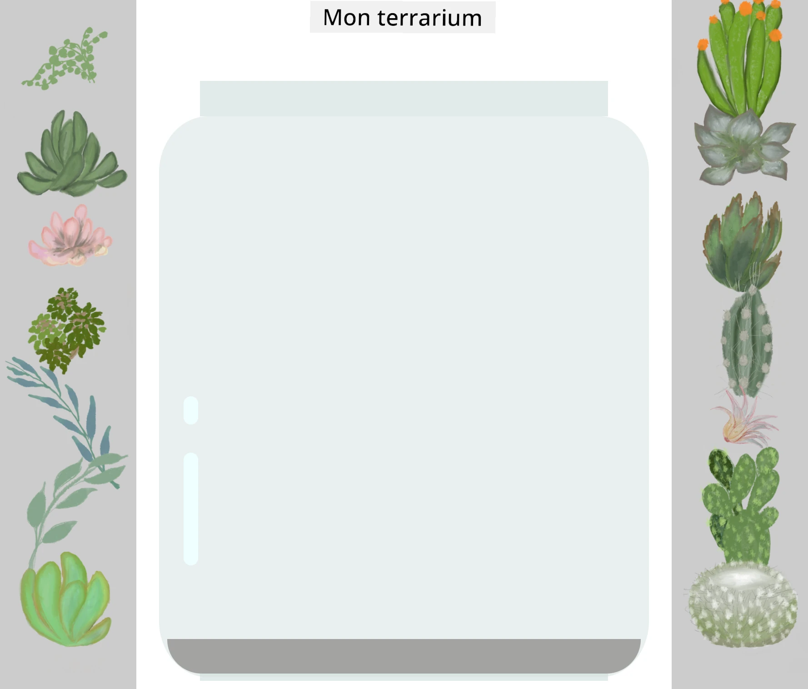
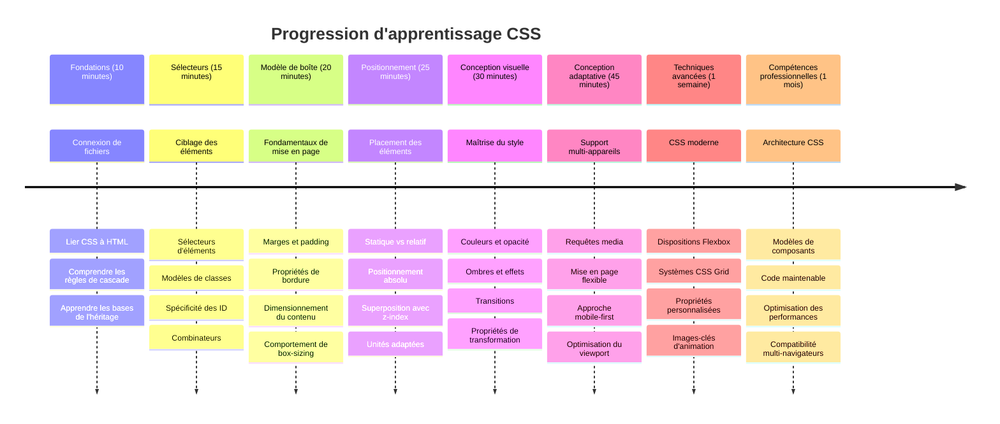

<!--
CO_OP_TRANSLATOR_METADATA:
{
  "original_hash": "e39f3a4e3bcccf94639e3af1248f8a4d",
  "translation_date": "2026-01-06T06:48:49+00:00",
  "source_file": "3-terrarium/2-intro-to-css/README.md",
  "language_code": "fr"
}
-->
# Projet Terrarium Partie 2 : Introduction au CSS



> Sketchnote par [Tomomi Imura](https://twitter.com/girlie_mac)

Vous vous souvenez comment votre terrarium HTML avait l’air assez basique ? Le CSS est ce qui transforme cette structure simple en quelque chose de visuellement attrayant.

Si le HTML est comme construire la charpente d’une maison, alors le CSS est tout ce qui fait qu’on s’y sent chez soi - les couleurs de peinture, l’agencement des meubles, l’éclairage et la façon dont les pièces s’enchaînent. Pensez à la façon dont le Palais de Versailles a commencé comme un simple pavillon de chasse, mais une attention minutieuse à la décoration et à l’agencement l’a transformé en l’un des bâtiments les plus magnifiques du monde.

Aujourd’hui, nous allons transformer votre terrarium de fonctionnel à raffiné. Vous apprendrez à positionner les éléments précisément, à faire en sorte que les mises en page s’adaptent aux différentes tailles d’écran, et à créer l’attrait visuel qui rend les sites web engageants.

À la fin de cette leçon, vous verrez comment une stylisation CSS stratégique peut améliorer considérablement votre projet. Ajoutons un peu de style à votre terrarium.


## Quiz Pré-Cours

[Quiz pré-cours](https://ff-quizzes.netlify.app/web/quiz/17)

## Démarrer avec le CSS

Le CSS est souvent perçu comme juste « rendre les choses jolies », mais il sert à bien plus que cela. Le CSS est comme être le réalisateur d’un film - vous contrôlez non seulement l’apparence de tout, mais aussi comment ça bouge, répond aux interactions, et s’adapte aux différentes situations.

Le CSS moderne est remarquablement puissant. Vous pouvez écrire du code qui ajuste automatiquement les mises en page pour les téléphones, tablettes et ordinateurs de bureau. Vous pouvez créer des animations fluides qui dirigent l’attention des utilisateurs là où c’est nécessaire. Les résultats peuvent être très impressionnants quand tout fonctionne ensemble.

> 💡 **Astuce Pro** : Le CSS évolue constamment avec de nouvelles fonctionnalités et capacités. Vérifiez toujours [CanIUse.com](https://caniuse.com) pour confirmer la prise en charge par les navigateurs des nouvelles fonctionnalités CSS avant de les utiliser dans des projets en production.

**Voici ce que nous allons accomplir dans cette leçon :**
- **Créer** un design visuel complet pour votre terrarium en utilisant les techniques CSS modernes
- **Explorer** les concepts fondamentaux comme la cascade, l’héritage et les sélecteurs CSS
- **Mettre en œuvre** des stratégies de positionnement et de mise en page responsives
- **Construire** le conteneur du terrarium avec des formes et du style CSS

### Prérequis

Vous devez avoir complété la structure HTML de votre terrarium de la leçon précédente et l’avoir prête à être stylisée.

> 📺 **Ressource Vidéo** : Découvrez ce tutoriel vidéo utile
>
> [](https://www.youtube.com/watch?v=6yIdOIV9p1I)

### Configurer votre fichier CSS

Avant de pouvoir commencer à styliser, nous devons relier le CSS à notre HTML. Cette connexion indique au navigateur où trouver les instructions de style pour notre terrarium.

Dans votre dossier terrarium, créez un nouveau fichier nommé `style.css`, puis liez-le dans la section `<head>` de votre document HTML :

```html
<link rel="stylesheet" href="./style.css" />
```

**Ce que fait ce code :**
- **Crée** une connexion entre vos fichiers HTML et CSS
- **Indique** au navigateur de charger et appliquer les styles depuis `style.css`
- **Utilise** l’attribut `rel="stylesheet"` pour spécifier qu’il s’agit d’un fichier CSS
- **Référence** le chemin du fichier avec `href="./style.css"`

## Comprendre la cascade CSS

Vous vous êtes déjà demandé pourquoi on appelle ça des « feuilles de style en cascade » ? Les styles coulent comme une cascade, et parfois ils entrent en conflit.

Considérez comment fonctionnent les structures de commandement militaire - un ordre général pourrait dire « toutes les troupes portent du vert », mais un ordre spécifique à votre unité peut dire « portez la tenue de cérémonie bleue ». L’instruction la plus spécifique prend le pas. Le CSS suit une logique similaire, et comprendre cette hiérarchie rend le débogage beaucoup plus simple.

### Expérimenter avec la priorité de cascade

Voyons la cascade en action en créant un conflit de style. D’abord, ajoutez un style en ligne à votre balise `<h1>` :

```html
<h1 style="color: red">My Terrarium</h1>
```

**Ce que fait ce code :**
- **Applique** une couleur rouge directement à l’élément `<h1>` via un style en ligne
- **Utilise** l’attribut `style` pour insérer du CSS directement dans le HTML
- **Crée** la règle de style la plus prioritaire pour cet élément spécifique

Ensuite, ajoutez cette règle dans votre fichier `style.css` :

```css
h1 {
  color: blue;
}
```

**Dans ce qui précède, nous avons :**
- **Défini** une règle CSS ciblant tous les éléments `<h1>`
- **Mis** la couleur du texte en bleu à l’aide d’une feuille de style externe
- **Créé** une règle de priorité inférieure comparée au style en ligne

✅ **Vérification de connaissances** : Quelle couleur s’affiche dans votre application web ? Pourquoi cette couleur gagne-t-elle ? Pouvez-vous penser à des scénarios où vous voudriez outrepasser des styles ?


> 💡 **Ordre de priorité CSS (du plus élevé au plus bas) :**
> 1. **Styles en ligne** (attribut style)
> 2. **IDs** (#monId)
> 3. **Classes** (.maClasse) et attributs
> 4. **Sélecteurs d’éléments** (h1, div, p)
> 5. **Valeurs par défaut du navigateur**

## Héritage CSS en action

L’héritage CSS fonctionne comme la génétique - les éléments héritent certaines propriétés de leurs parents. Si vous définissez la police sur l’élément body, tout le texte à l’intérieur utilise automatiquement cette même police. C’est semblable à la façon dont la mâchoire distinctive de la famille Habsbourg apparaissait à travers les générations sans être spécifiée individuellement.

Cependant, tout n’est pas hérité. Les styles de texte comme les polices et les couleurs s’héritent, mais les propriétés de mise en page comme les marges et bordures ne le sont pas. Comme les enfants peuvent hériter des traits physiques mais pas des choix vestimentaires de leurs parents.

### Observer l’héritage de la police

Voyons l’héritage en action en définissant une police sur l’élément `<body>` :

```css
body {
  font-family: 'Segoe UI', Tahoma, Geneva, Verdana, sans-serif;
}
```

**Décryptage de ce qui se passe ici :**
- **Définit** la famille de polices pour toute la page en ciblant l’élément `<body>`
- **Utilise** une pile de polices avec des options de secours pour une meilleure compatibilité navigateur
- **Applique** des polices système modernes qui rendent bien sur différents systèmes d’exploitation
- **Assure** que tous les éléments enfants héritent cette police sauf si spécifiquement substituée

Ouvrez les outils de développement de votre navigateur (F12), allez dans l’onglet Éléments, et inspectez votre élément `<h1>`. Vous verrez qu’il hérite de la famille de polices du body :



✅ **Temps d’expérimentation** : Essayez de définir d’autres propriétés héritables sur le `<body>` comme `color`, `line-height` ou `text-align`. Que se passe-t-il pour votre titre et les autres éléments ?

> 📝 **Propriétés héritables comprennent** : `color`, `font-family`, `font-size`, `line-height`, `text-align`, `visibility`
>
> **Propriétés non héritables comprennent** : `margin`, `padding`, `border`, `width`, `height`, `position`

### 🔄 **Bilan pédagogique**
**Compréhension des fondations CSS** : Avant de passer aux sélecteurs, assurez-vous de pouvoir :
- ✅ Expliquer la différence entre cascade et héritage
- ✅ Prédire quel style l’emportera en cas de conflit de spécificité
- ✅ Identifier quelles propriétés sont héritées des éléments parents
- ✅ Relier correctement les fichiers CSS au HTML

**Test rapide** : Si vous avez ces styles, de quelle couleur sera un `<h1>` dans un `<div class="special">` ?
```css
div { color: blue; }
.special { color: green; }
h1 { color: red; }
```
*Réponse : Rouge (le sélecteur d’élément cible directement h1)*

## Maîtriser les sélecteurs CSS

Les sélecteurs CSS sont votre moyen de cibler des éléments spécifiques pour les styler. Ils fonctionnent comme donner des directions précises - au lieu de dire « la maison », vous pourriez dire « la maison bleue avec la porte rouge dans la rue Maple ».

Le CSS offre différentes façons d’être spécifique, et choisir le bon sélecteur, c’est comme choisir le bon outil pour la tâche. Parfois vous devez styliser toutes les portes du quartier, parfois une porte en particulier.

### Sélecteurs d’éléments (balises)

Les sélecteurs d’éléments ciblent des éléments HTML par leur nom de balise. Ils sont parfaits pour définir des styles de base qui s’appliquent largement sur votre page :

```css
body {
  font-family: 'Segoe UI', Tahoma, Geneva, Verdana, sans-serif;
  margin: 0;
  padding: 0;
}

h1 {
  color: #3a241d;
  text-align: center;
  font-size: 2.5rem;
  margin-bottom: 1rem;
}
```

**Comprendre ces styles :**
- **Définit** une typographie cohérente sur toute la page avec le sélecteur `body`
- **Supprime** les marges et le padding par défaut du navigateur pour un meilleur contrôle
- **Style** tous les éléments de titre avec couleur, alignement et espacement
- **Utilise** les unités `rem` pour une taille de police évolutive et accessible

Tandis que les sélecteurs d’éléments fonctionnent bien pour les styles généraux, vous aurez besoin de sélecteurs plus spécifiques pour les composants individuels comme les plantes dans votre terrarium.

### Sélecteurs ID pour les éléments uniques

Les sélecteurs ID utilisent le symbole `#` et ciblent les éléments avec un attribut `id` spécifique. Puisque les IDs doivent être uniques sur une page, ils sont parfaits pour styler des éléments individuels et particuliers comme nos conteneurs latéraux de plantes.

Créons le style pour les conteneurs latéraux de notre terrarium où les plantes seront placées :

```css
#left-container {
  background-color: #f5f5f5;
  width: 15%;
  left: 0;
  top: 0;
  position: absolute;
  height: 100vh;
  padding: 1rem;
  box-sizing: border-box;
}

#right-container {
  background-color: #f5f5f5;
  width: 15%;
  right: 0;
  top: 0;
  position: absolute;
  height: 100vh;
  padding: 1rem;
  box-sizing: border-box;
}
```

**Ce que fait ce code :**
- **Positionne** les conteneurs aux extrémités gauche et droite en utilisant une position `absolute`
- **Utilise** les unités `vh` (hauteur de la fenêtre) pour une hauteur responsive qui s’adapte à la taille de l’écran
- **Applique** `box-sizing: border-box` pour inclure le padding dans la largeur totale
- **Supprime** les unités `px` inutiles quand la valeur est zéro pour un code plus propre
- **Définit** une couleur de fond subtile plus douce que le gris vif

✅ **Défi Qualité de Code** : Remarquez comment ce CSS viole le principe DRY (Don't Repeat Yourself). Pouvez-vous le refactorer en utilisant à la fois un ID et une classe ?

**Approche améliorée :**
```html
<div id="left-container" class="container"></div>
<div id="right-container" class="container"></div>
```

```css
.container {
  background-color: #f5f5f5;
  width: 15%;
  top: 0;
  position: absolute;
  height: 100vh;
  padding: 1rem;
  box-sizing: border-box;
}

#left-container {
  left: 0;
}

#right-container {
  right: 0;
}
```

### Sélecteurs de classes pour styles réutilisables

Les sélecteurs de classes utilisent le symbole `.` et sont parfaits lorsque vous voulez appliquer les mêmes styles à plusieurs éléments. Contrairement aux IDs, les classes peuvent être réutilisées partout dans votre HTML, ce qui les rend idéales pour des styles cohérents et répétitifs.

Dans notre terrarium, chaque plante nécessite un style similaire mais doit aussi être positionnée individuellement. Nous allons utiliser une combinaison de classes pour les styles partagés et d’IDs pour le positionnement unique.

**Voici la structure HTML pour chaque plante :**
```html
<div class="plant-holder">
  
</div>
```

**Explication des éléments clés :**
- **Utilise** `class="plant-holder"` pour un style de conteneur uniforme sur toutes les plantes
- **Applique** `class="plant"` pour un style d’image partagé et comportement commun
- **Inclus** un `id="plant1"` unique pour positionnement individuel et interaction JavaScript
- **Fournit** un texte alternatif descriptif pour l’accessibilité aux lecteurs d’écran

Ajoutez maintenant ces styles à votre fichier `style.css` :

```css
.plant-holder {
  position: relative;
  height: 13%;
  left: -0.6rem;
}

.plant {
  position: absolute;
  max-width: 150%;
  max-height: 150%;
  z-index: 2;
  transition: transform 0.3s ease;
}

.plant:hover {
  transform: scale(1.05);
}
```

**Décryptage de ces styles :**
- **Crée** un positionnement relatif pour le conteneur de plante afin d’établir un contexte de positionnement
- **Fixe** chaque conteneur de plante à 13% de hauteur pour que toutes les plantes tiennent verticalement sans défilement
- **Décale** légèrement les conteneurs vers la gauche pour mieux centrer les plantes dans leurs conteneurs
- **Permet** aux plantes de s’adapter de façon responsive avec `max-width` et `max-height`
- **Utilise** `z-index` pour superposer les plantes au-dessus d’autres éléments du terrarium
- **Ajoute** un effet subtil au survol avec des transitions CSS pour une meilleure interaction utilisateur

✅ **Réflexion critique** : Pourquoi avons-nous besoin à la fois des sélecteurs `.plant-holder` et `.plant` ? Que se passerait-il si on utilisait un seul seul ?

> 💡 **Patron de conception** : Le conteneur (`.plant-holder`) contrôle la mise en page et le positionnement, tandis que le contenu (`.plant`) contrôle l’apparence et la mise à l’échelle. Cette séparation rend le code plus maintenable et flexible.

## Comprendre le positionnement CSS

Le positionnement CSS est comme être le metteur en scène d’une pièce de théâtre - vous dirigez où chaque acteur se place et comment il se déplace sur scène. Certains acteurs suivent la formation standard, tandis que d’autres ont besoin d’un positionnement spécifique pour un effet dramatique.

Une fois que vous comprenez le positionnement, beaucoup de défis de mise en page deviennent gérables. Besoin d’une barre de navigation qui reste en haut pendant que l’utilisateur défile ? Le positionnement gère cela. Vous voulez une infobulle qui apparaît à un endroit précis ? C’est aussi du positionnement.

### Les cinq valeurs de position


| Valeur de position | Comportement | Cas d’usage |
|--------------------|--------------|-------------|
| `static`           | Flux par défaut, ignore top/left/right/bottom | Mise en page normale du document |
| `relative`         | Positionné par rapport à sa position normale | Ajustements mineurs, création de contexte de positionnement |
| `absolute`         | Positionné par rapport à l’ancêtre positionné le plus proche | Placement précis, superpositions |
| `fixed`            | Positionné par rapport à la fenêtre d’affichage | Barres de navigation, éléments flottants |
| `sticky`           | Passe de relatif à fixe selon le défilement | En-têtes qui restent visibles lors du défilement |

### Positionnement dans notre terrarium

Notre terrarium utilise une combinaison stratégique de types de positionnement pour créer la mise en page désirée :

```css
/* Container positioning */
.container {
  position: absolute; /* Removes from normal flow */
  /* ... other styles ... */
}

/* Plant holder positioning */
.plant-holder {
  position: relative; /* Creates positioning context */
  /* ... other styles ... */
}

/* Plant positioning */
.plant {
  position: absolute; /* Allows precise placement within holder */
  /* ... other styles ... */
}
```

**Comprendre la stratégie de positionnement :**
- **Les conteneurs absolus** sont retirés du flux normal du document et attachés aux bords de l’écran
- **Les conteneurs de plantes relatifs** créent un contexte de positionnement tout en restant dans le flux du document
- **Les plantes en position absolue** peuvent être positionnées précisément à l’intérieur de leurs conteneurs relatifs
- **Cette combinaison** permet aux plantes d’être empilées verticalement tout en pouvant être positionnées individuellement

> 🎯 **Pourquoi c’est important** : Les éléments `plant` ont besoin d’un positionnement absolu pour devenir déplaçables dans la leçon suivante. Le positionnement absolu les retire du flux normal, rendant possible les interactions de glisser-déposer.

✅ **Temps d’expérimentation** : Essayez de changer les valeurs de positionnement et observez les résultats :
- Que se passe-t-il si vous changez `.container` de `absolute` à `relative` ?
- Comment la mise en page change-t-elle si `.plant-holder` utilise `absolute` au lieu de `relative` ?
- Que se passe-t-il lorsque vous passez `.plant` en positionnement `relative` ?

### 🔄 **Point pédagogique**
**Maîtrise du positionnement CSS** : Faites une pause pour vérifier votre compréhension :
- ✅ Pouvez-vous expliquer pourquoi les plantes ont besoin d'un positionnement absolu pour le drag-and-drop ?
- ✅ Comprenez-vous comment les conteneurs relatifs créent un contexte de positionnement ?
- ✅ Pourquoi les conteneurs latéraux utilisent-ils un positionnement absolu ?
- ✅ Que se passerait-il si vous supprimiez entièrement les déclarations de position ?

**Lien avec le monde réel** : Pensez à la façon dont le positionnement CSS reflète la disposition dans la vie réelle :
- **Static** : Livres sur une étagère (ordre naturel)
- **Relative** : Déplacer un livre légèrement tout en gardant sa place
- **Absolute** : Placer un marque-page à une page précise
- **Fixed** : Un post-it qui reste visible lorsque vous tournez les pages

## Construire le terrarium avec CSS

Nous allons maintenant construire un bocal en verre en utilisant uniquement du CSS - pas besoin d'images ou de logiciels graphiques.

Créer l’illusion d’un verre réaliste, des ombres et des effets de profondeur à l’aide du positionnement et de la transparence démontre les capacités visuelles du CSS. Cette technique reflète la manière dont les architectes du mouvement Bauhaus utilisaient des formes géométriques simples pour créer des structures complexes et esthétiques. Une fois ces principes compris, vous reconnaîtrez les techniques CSS derrière beaucoup de designs web.


### Création des composants du bocal en verre

Construisons le bocal du terrarium pièce par pièce. Chaque partie utilise un positionnement absolu et des tailles en pourcentages pour un design responsive :

```css
.jar-walls {
  height: 80%;
  width: 60%;
  background: #d1e1df;
  border-radius: 1rem;
  position: absolute;
  bottom: 0.5%;
  left: 20%;
  opacity: 0.5;
  z-index: 1;
  box-shadow: inset 0 0 2rem rgba(0, 0, 0, 0.1);
}

.jar-top {
  width: 50%;
  height: 5%;
  background: #d1e1df;
  position: absolute;
  bottom: 80.5%;
  left: 25%;
  opacity: 0.7;
  z-index: 1;
  border-radius: 0.5rem 0.5rem 0 0;
}

.jar-bottom {
  width: 50%;
  height: 1%;
  background: #d1e1df;
  position: absolute;
  bottom: 0;
  left: 25%;
  opacity: 0.7;
  border-radius: 0 0 0.5rem 0.5rem;
}

.dirt {
  width: 60%;
  height: 5%;
  background: #3a241d;
  position: absolute;
  border-radius: 0 0 1rem 1rem;
  bottom: 1%;
  left: 20%;
  opacity: 0.7;
  z-index: -1;
}
```

**Compréhension de la construction du terrarium :**
- **Utilise** des dimensions en pourcentage pour un redimensionnement adaptatif sur toutes tailles d'écran
- **Positionne** les éléments en absolu pour les empiler et les aligner précisément
- **Applique** différentes valeurs d’opacité pour créer l’effet de transparence du verre
- **Implémente** un `z-index` pour que les plantes apparaissent à l’intérieur du bocal
- **Ajoute** des ombres portées subtiles et un rayon de bordure affiné pour un aspect plus réaliste

### Design responsif avec des pourcentages

Remarquez que toutes les dimensions utilisent des pourcentages plutôt que des valeurs fixes en pixels :

**Pourquoi c’est important :**
- **Assure** que le terrarium s’adapte proportionnellement à toute taille d’écran
- **Maintient** les relations visuelles entre les composants du bocal
- **Offre** une expérience cohérente des mobiles aux grands écrans de bureau
- **Permet** au design de s’adapter sans casser la mise en page

### Unités CSS en action

Nous utilisons les unités `rem` pour le border-radius, qui s’échelonnent en fonction de la taille de police racine. Cela crée des designs plus accessibles qui respectent les préférences de police de l’utilisateur. En savoir plus sur les [unités relatives CSS](https://www.w3.org/TR/css-values-3/#font-relative-lengths) dans la spécification officielle.

✅ **Expérimentation visuelle** : Essayez de modifier ces valeurs et observez les effets :
- Changez l’opacité du bocal de 0.5 à 0.8 – comment cela affecte-t-il l’apparence du verre ?
- Ajustez la couleur de la terre de `#3a241d` à `#8B4513` – quel impact visuel cela a-t-il ?
- Modifiez le `z-index` de la terre à 2 – que se passe-t-il dans la superposition ?

### 🔄 **Point pédagogique**
**Compréhension du design visuel CSS** : Confirmez votre maîtrise du CSS visuel :
- ✅ Comment les dimensions en pourcentage créent-elles du design adaptatif ?
- ✅ Pourquoi l’opacité crée-t-elle l’effet de transparence du verre ?
- ✅ Quel rôle joue le z-index dans la superposition des éléments ?
- ✅ Comment les valeurs de border-radius créent-elles la forme du bocal ?

**Principe de design** : Remarquez comment nous construisons des visuels complexes à partir de formes simples :
1. **Rectangles** → **Rectangles arrondis** → **Composants du bocal**
2. **Couleurs plates** → **Opacité** → **Effet verre**
3. **Éléments individuels** → **Composition en couches** → **Apparence 3D**

---

## Défi GitHub Copilot Agent 🚀

Utilisez le mode Agent pour relever le défi suivant :

**Description :** Créez une animation CSS qui fait doucement osciller les plantes du terrarium, simulant un effet de brise naturelle. Cela vous aidera à pratiquer les animations, transformations et keyframes CSS tout en améliorant l’esthétique de votre terrarium.

**Consigne :** Ajoutez des animations keyframe CSS pour faire balancer doucement les plantes du terrarium de gauche à droite. Créez une animation oscillante qui fait pivoter chaque plante légèrement (2 à 3 degrés) à gauche et à droite avec une durée de 3 à 4 secondes, et appliquez-la à la classe `.plant`. Assurez-vous que l’animation boucle infiniment avec une fonction d’accélération pour un mouvement naturel.

Pour en savoir plus sur le [mode agent](https://code.visualstudio.com/blogs/2025/02/24/introducing-copilot-agent-mode), cliquez ici.

## 🚀 Défi : Ajouter des reflets de verre

Prêt à améliorer votre terrarium avec des reflets de verre réalistes ? Cette technique ajoutera profondeur et réalisme au design.

Vous allez créer des reflets subtils qui simulent la façon dont la lumière se reflète sur les surfaces de verre. Cette approche est similaire à celle utilisée par les peintres de la Renaissance comme Jan van Eyck qui utilisaient lumière et réflexion pour donner un aspect tridimensionnel au verre peint. Voici ce que vous devrez viser :



**Votre défi :**
- **Créer** des formes ovales blanches ou claires subtiles pour les reflets du verre
- **Les positionner** stratégiquement sur le côté gauche du bocal
- **Appliquer** l’opacité et l’effet de flou appropriés pour un reflet lumineux réaliste
- **Utiliser** le `border-radius` pour créer des formes organiques rappelant des bulles
- **Expérimenter** avec des dégradés ou des ombres portées pour plus de réalisme

## Quiz post-conférence

[Quiz post-conférence](https://ff-quizzes.netlify.app/web/quiz/18)

## Approfondissez vos connaissances CSS

Le CSS peut sembler complexe au début, mais comprendre ces concepts fondamentaux fournit une base solide pour des techniques plus avancées.

**Vos prochaines étapes en CSS :**
- **Flexbox** – simplifie l’alignement et la distribution des éléments
- **CSS Grid** – offre des outils puissants pour créer des mises en page complexes
- **Variables CSS** – réduit la répétition et améliore la maintenabilité
- **Design responsive** – garantit un bon fonctionnement sur différentes tailles d’écran

### Ressources d’apprentissage interactives

Pratiquez ces concepts avec ces jeux ludiques et pratiques :
- 🐸 [Flexbox Froggy](https://flexboxfroggy.com/) – Maîtrisez Flexbox par des défis amusants
- 🌱 [Grid Garden](https://codepip.com/games/grid-garden/) – Apprenez CSS Grid en cultivant des carottes virtuelles
- 🎯 [CSS Battle](https://cssbattle.dev/) – Testez vos compétences CSS avec des défis de code

### Apprentissage complémentaire

Pour maîtriser les bases du CSS, complétez ce module Microsoft Learn : [Styliser votre application HTML avec CSS](https://docs.microsoft.com/learn/modules/build-simple-website/4-css-basics/?WT.mc_id=academic-77807-sagibbon)

### ⚡ **Ce que vous pouvez faire dans les 5 prochaines minutes**
- [ ] Ouvrir DevTools et inspecter les styles CSS de n’importe quel site avec le panneau Éléments
- [ ] Créer un fichier CSS simple et le lier à une page HTML
- [ ] Essayer de changer les couleurs avec différentes méthodes : hexadécimal, RGB et noms de couleur
- [ ] Pratiquer le modèle de boîte en ajoutant padding et margin à une div

### 🎯 **Ce que vous pouvez accomplir cette heure**
- [ ] Compléter le quiz post-leçon et revoir les fondamentaux du CSS
- [ ] Styliser votre page HTML avec des polices, couleurs et espacements
- [ ] Créer une mise en page simple avec flexbox ou grid
- [ ] Expérimenter les transitions CSS pour des effets fluides
- [ ] Pratiquer le design responsive avec des media queries

### 📅 **Votre aventure CSS sur une semaine**
- [ ] Réaliser le style du terrarium avec créativité
- [ ] Maîtriser CSS Grid en construisant une galerie photo
- [ ] Apprendre les animations CSS pour animer vos designs
- [ ] Explorer les préprocesseurs CSS comme Sass ou Less
- [ ] Étudier les principes de design et les appliquer en CSS
- [ ] Analyser et recréer des designs intéressants trouvés en ligne

### 🌟 **Votre maîtrise du design en un mois**
- [ ] Construire un système complet de design de site web responsive
- [ ] Apprendre CSS-in-JS ou des frameworks utilitaires comme Tailwind
- [ ] Contribuer à des projets open source avec des améliorations CSS
- [ ] Maîtriser des concepts avancés CSS comme les propriétés personnalisées et le containment
- [ ] Créer des bibliothèques de composants réutilisables avec du CSS modulaire
- [ ] Encadrer d’autres apprentis CSS et partager vos connaissances design

## 🎯 Votre chronologie de maîtrise CSS


### 🛠️ Résumé de votre boîte à outils CSS

Après cette leçon, vous avez maintenant :
- **Compréhension de la cascade** : Comment les styles héritent et se remplacent
- **Maîtrise des sélecteurs** : Ciblage précis avec éléments, classes et IDs
- **Compétences en positionnement** : Placement stratégique et gestion des couches d’éléments
- **Design visuel** : Création d’effets verre, ombres et transparence
- **Techniques responsives** : Mise en page en pourcentages qui s’adapte à tout écran
- **Organisation du code** : Structure CSS propre et maintenable
- **Pratiques modernes** : Utilisation d’unités relatives et design accessible

**Prochaines étapes** : Votre terrarium possède désormais structure (HTML) et style (CSS). La dernière leçon ajoutera de l’interactivité avec JavaScript !

## Devoir

[Refactorisation CSS](assignment.md)

---

<!-- CO-OP TRANSLATOR DISCLAIMER START -->
**Avertissement** :  
Ce document a été traduit à l’aide du service de traduction automatique [Co-op Translator](https://github.com/Azure/co-op-translator). Bien que nous nous efforcions d’assurer l’exactitude, veuillez noter que les traductions automatiques peuvent contenir des erreurs ou des inexactitudes. Le document original dans sa langue d’origine doit être considéré comme la source faisant autorité. Pour des informations critiques, une traduction professionnelle réalisée par un humain est recommandée. Nous déclinons toute responsabilité en cas de malentendus ou d’interprétations erronées résultant de l’utilisation de cette traduction.
<!-- CO-OP TRANSLATOR DISCLAIMER END -->