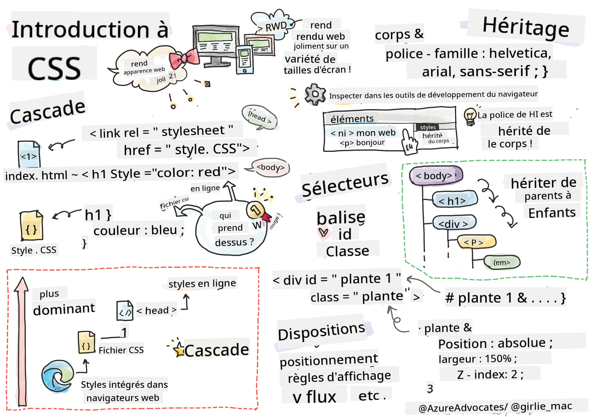

<!--
CO_OP_TRANSLATOR_METADATA:
{
  "original_hash": "acb5ae00cde004304296bb97da8ff4c3",
  "translation_date": "2025-08-29T13:41:56+00:00",
  "source_file": "3-terrarium/2-intro-to-css/README.md",
  "language_code": "fr"
}
-->
# Projet Terrarium Partie 2 : Introduction au CSS


> Sketchnote par [Tomomi Imura](https://twitter.com/girlie_mac)

## Quiz Pré-Lecture

[Quiz pré-lecture](https://ff-quizzes.netlify.app/web/quiz/17)

### Introduction

Le CSS, ou Cascading Style Sheets, résout un problème important du développement web : comment rendre votre site web attrayant. Styliser vos applications les rend plus utilisables et plus agréables visuellement ; vous pouvez également utiliser le CSS pour créer un design web adaptatif (Responsive Web Design - RWD), permettant à vos applications d'avoir une belle apparence quelle que soit la taille de l'écran. Le CSS ne se limite pas à embellir votre application ; ses spécifications incluent des animations et des transformations qui permettent des interactions sophistiquées. Le CSS Working Group aide à maintenir les spécifications actuelles du CSS ; vous pouvez suivre leur travail sur le [site du World Wide Web Consortium](https://www.w3.org/Style/CSS/members).

> Notez que le CSS est un langage qui évolue, comme tout sur le web, et que tous les navigateurs ne prennent pas en charge les parties les plus récentes des spécifications. Vérifiez toujours vos implémentations en consultant [CanIUse.com](https://caniuse.com).

Dans cette leçon, nous allons ajouter des styles à notre terrarium en ligne et en apprendre davantage sur plusieurs concepts CSS : la cascade, l'héritage, l'utilisation des sélecteurs, le positionnement et l'utilisation du CSS pour construire des mises en page. Au cours de ce processus, nous allons organiser le terrarium et créer le terrarium lui-même.

### Prérequis

Vous devez avoir construit le HTML de votre terrarium et être prêt à le styliser.

> Regardez la vidéo

> 
> [](https://www.youtube.com/watch?v=6yIdOIV9p1I)

### Tâche

Dans votre dossier terrarium, créez un nouveau fichier appelé `style.css`. Importez ce fichier dans la section `<head>` :

```html
<link rel="stylesheet" href="./style.css" />
```

---

## La Cascade

Les feuilles de style en cascade (Cascading Style Sheets) intègrent l'idée que les styles "cascadent", de sorte que l'application d'un style est guidée par sa priorité. Les styles définis par l'auteur d'un site web ont la priorité sur ceux définis par un navigateur. Les styles définis "en ligne" ont la priorité sur ceux définis dans une feuille de style externe.

### Tâche

Ajoutez le style en ligne "color: red" à votre balise `<h1>` :

```HTML
<h1 style="color: red">My Terrarium</h1>
```

Ensuite, ajoutez le code suivant à votre fichier `style.css` :

```CSS
h1 {
 color: blue;
}
```

✅ Quelle couleur s'affiche dans votre application web ? Pourquoi ? Pouvez-vous trouver un moyen de remplacer les styles ? Dans quels cas voudriez-vous faire cela, ou pourquoi pas ?

---

## L'Héritage

Les styles sont hérités d'un style ancêtre à un descendant, de sorte que les éléments imbriqués héritent des styles de leurs parents.

### Tâche

Définissez la police du corps (`body`) sur une police donnée et vérifiez la police d'un élément imbriqué :

```CSS
body {
	font-family: helvetica, arial, sans-serif;
}
```

Ouvrez la console de votre navigateur dans l'onglet 'Éléments' et observez la police du H1. Elle hérite de la police du corps, comme indiqué dans le navigateur :


✅ Pouvez-vous faire en sorte qu'un style imbriqué hérite d'une propriété différente ?

---

## Sélecteurs CSS

### Balises

Jusqu'à présent, votre fichier `style.css` ne contient que quelques balises stylisées, et l'application a un aspect assez étrange :

```CSS
body {
	font-family: helvetica, arial, sans-serif;
}

h1 {
	color: #3a241d;
	text-align: center;
}
```

Cette manière de styliser une balise vous donne le contrôle sur des éléments uniques, mais vous devez contrôler les styles de nombreuses plantes dans votre terrarium. Pour cela, vous devez exploiter les sélecteurs CSS.

### Ids

Ajoutez un style pour organiser les conteneurs gauche et droit. Comme il n'y a qu'un seul conteneur gauche et un seul conteneur droit, ils ont des ids dans le balisage. Pour les styliser, utilisez `#` :

```CSS
#left-container {
	background-color: #eee;
	width: 15%;
	left: 0px;
	top: 0px;
	position: absolute;
	height: 100%;
	padding: 10px;
}

#right-container {
	background-color: #eee;
	width: 15%;
	right: 0px;
	top: 0px;
	position: absolute;
	height: 100%;
	padding: 10px;
}
```

Ici, vous avez placé ces conteneurs avec un positionnement absolu à l'extrême gauche et à l'extrême droite de l'écran, et utilisé des pourcentages pour leur largeur afin qu'ils puissent s'adapter aux petits écrans mobiles.

✅ Ce code est assez répétitif, donc pas "DRY" (Don't Repeat Yourself) ; pouvez-vous trouver une meilleure façon de styliser ces ids, peut-être avec un id et une classe ? Vous devrez modifier le balisage et refactoriser le CSS :

```html
<div id="left-container" class="container"></div>
```

### Classes

Dans l'exemple ci-dessus, vous avez stylisé deux éléments uniques à l'écran. Si vous voulez que des styles s'appliquent à plusieurs éléments à l'écran, vous pouvez utiliser des classes CSS. Faites cela pour organiser les plantes dans les conteneurs gauche et droit.

Notez que chaque plante dans le balisage HTML a une combinaison d'ids et de classes. Les ids ici sont utilisés par le JavaScript que vous ajouterez plus tard pour manipuler le placement des plantes dans le terrarium. Les classes, cependant, donnent à toutes les plantes un style donné.

```html
<div class="plant-holder">
	
</div>
```

Ajoutez le code suivant à votre fichier `style.css` :

```CSS
.plant-holder {
	position: relative;
	height: 13%;
	left: -10px;
}

.plant {
	position: absolute;
	max-width: 150%;
	max-height: 150%;
	z-index: 2;
}
```

Ce qui est notable dans cet extrait, c'est le mélange de positionnement relatif et absolu, que nous aborderons dans la section suivante. Regardez comment les hauteurs sont gérées par des pourcentages :

Vous définissez la hauteur du support de plante à 13 %, un bon chiffre pour s'assurer que toutes les plantes s'affichent dans chaque conteneur vertical sans besoin de défilement.

Vous déplacez le support de plante vers la gauche pour que les plantes soient plus centrées dans leur conteneur. Les images ont une grande quantité d'arrière-plan transparent pour les rendre plus faciles à déplacer, donc elles doivent être poussées vers la gauche pour mieux s'adapter à l'écran.

Ensuite, la plante elle-même reçoit une largeur maximale de 150 %. Cela lui permet de se redimensionner à mesure que le navigateur se redimensionne. Essayez de redimensionner votre navigateur ; les plantes restent dans leurs conteneurs mais se redimensionnent pour s'adapter.

Autre point notable : l'utilisation de z-index, qui contrôle l'altitude relative d'un élément (afin que les plantes soient au-dessus du conteneur et semblent être à l'intérieur du terrarium).

✅ Pourquoi avez-vous besoin à la fois d'un sélecteur CSS pour le support de plante et pour la plante ?

## Positionnement CSS

Mélanger les propriétés de positionnement (il existe des positions statiques, relatives, fixes, absolues et collantes) peut être un peu délicat, mais lorsqu'il est bien fait, cela vous donne un bon contrôle sur les éléments de vos pages.

Les éléments positionnés en absolu sont positionnés par rapport à leurs ancêtres positionnés les plus proches, et s'il n'y en a pas, ils sont positionnés par rapport au corps du document.

Les éléments positionnés en relatif sont positionnés en fonction des instructions CSS pour ajuster leur placement par rapport à leur position initiale.

Dans notre exemple, le `plant-holder` est un élément positionné en relatif qui est positionné dans un conteneur positionné en absolu. Le comportement résultant est que les conteneurs latéraux sont fixés à gauche et à droite, et le `plant-holder` est imbriqué, s'ajustant dans les barres latérales, laissant de l'espace pour que les plantes soient placées en colonne verticale.

> La `plant` elle-même a également un positionnement absolu, nécessaire pour la rendre déplaçable, comme vous le découvrirez dans la prochaine leçon.

✅ Expérimentez en changeant les types de positionnement des conteneurs latéraux et du `plant-holder`. Que se passe-t-il ?

## Mises en page CSS

Maintenant, vous allez utiliser ce que vous avez appris pour construire le terrarium lui-même, entièrement en CSS !

Tout d'abord, stylisez les enfants de la div `.terrarium` comme un rectangle arrondi en utilisant le CSS :

```CSS
.jar-walls {
	height: 80%;
	width: 60%;
	background: #d1e1df;
	border-radius: 1rem;
	position: absolute;
	bottom: 0.5%;
	left: 20%;
	opacity: 0.5;
	z-index: 1;
}

.jar-top {
	width: 50%;
	height: 5%;
	background: #d1e1df;
	position: absolute;
	bottom: 80.5%;
	left: 25%;
	opacity: 0.7;
	z-index: 1;
}

.jar-bottom {
	width: 50%;
	height: 1%;
	background: #d1e1df;
	position: absolute;
	bottom: 0%;
	left: 25%;
	opacity: 0.7;
}

.dirt {
	width: 60%;
	height: 5%;
	background: #3a241d;
	position: absolute;
	border-radius: 0 0 1rem 1rem;
	bottom: 1%;
	left: 20%;
	opacity: 0.7;
	z-index: -1;
}
```

Notez l'utilisation des pourcentages ici. Si vous réduisez votre navigateur, vous pouvez voir comment le bocal se redimensionne également. Remarquez également les pourcentages de largeur et de hauteur pour les éléments du bocal et comment chaque élément est positionné absolument au centre, fixé en bas de la fenêtre.

Nous utilisons également `rem` pour le rayon de bordure, une longueur relative à la police. Lisez-en plus sur ce type de mesure relative dans les [spécifications CSS](https://www.w3.org/TR/css-values-3/#font-relative-lengths).

✅ Essayez de changer les couleurs et l'opacité du bocal par rapport à celles de la terre. Que se passe-t-il ? Pourquoi ?

---

## 🚀Défi

Ajoutez un éclat "bulle" dans la zone inférieure gauche du bocal pour lui donner un aspect plus vitreux. Vous styliserez les `.jar-glossy-long` et `.jar-glossy-short` pour ressembler à un reflet brillant. Voici à quoi cela ressemblerait :


Pour compléter le quiz post-lecture, parcourez ce module Learn : [Stylisez votre application HTML avec CSS](https://docs.microsoft.com/learn/modules/build-simple-website/4-css-basics/?WT.mc_id=academic-77807-sagibbon)

## Quiz Post-Lecture

[Quiz post-lecture](https://ff-quizzes.netlify.app/web/quiz/18)

## Révision & Étude Personnelle

Le CSS semble trompeusement simple, mais il y a de nombreux défis lorsqu'il s'agit de styliser parfaitement une application pour tous les navigateurs et toutes les tailles d'écran. CSS-Grid et Flexbox sont des outils développés pour rendre le travail un peu plus structuré et fiable. Apprenez à utiliser ces outils en jouant à [Flexbox Froggy](https://flexboxfroggy.com/) et [Grid Garden](https://codepip.com/games/grid-garden/).

## Devoir

[Refactorisation CSS](assignment.md)

---

**Avertissement** :  
Ce document a été traduit à l'aide du service de traduction automatique [Co-op Translator](https://github.com/Azure/co-op-translator). Bien que nous nous efforcions d'assurer l'exactitude, veuillez noter que les traductions automatisées peuvent contenir des erreurs ou des inexactitudes. Le document original dans sa langue d'origine doit être considéré comme la source faisant autorité. Pour des informations critiques, il est recommandé de recourir à une traduction professionnelle réalisée par un humain. Nous ne sommes pas responsables des malentendus ou des interprétations erronées résultant de l'utilisation de cette traduction.