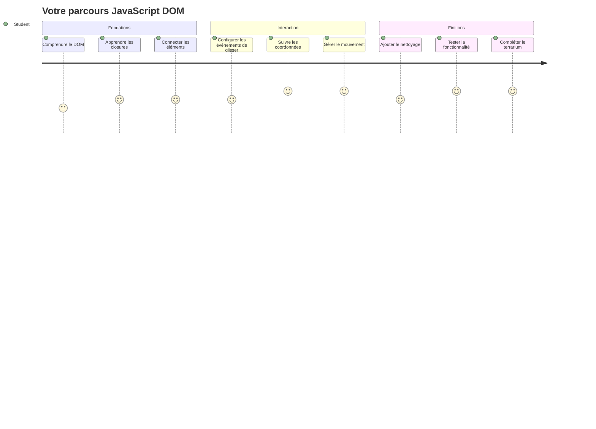
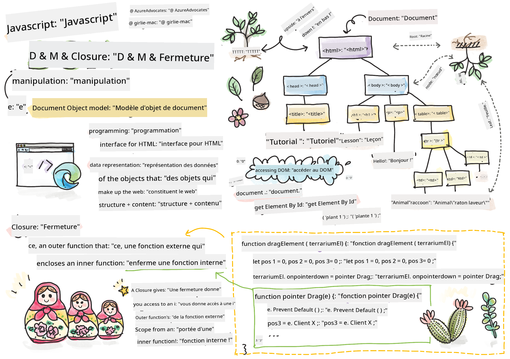
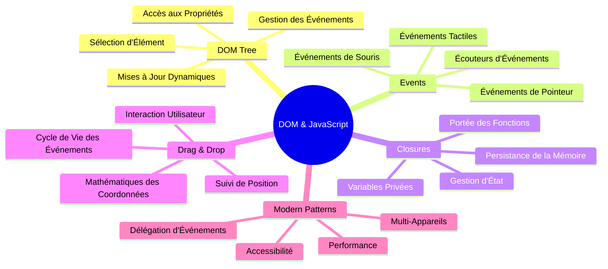
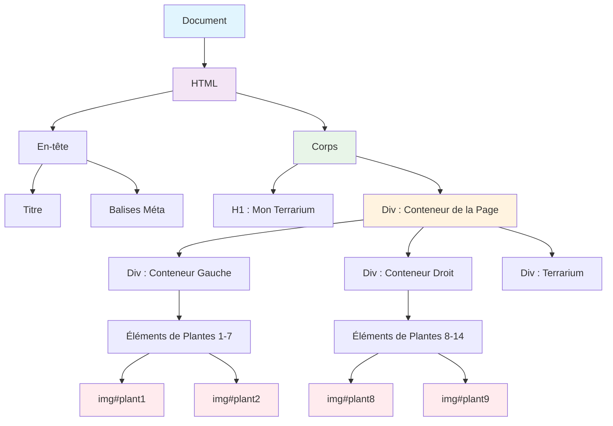
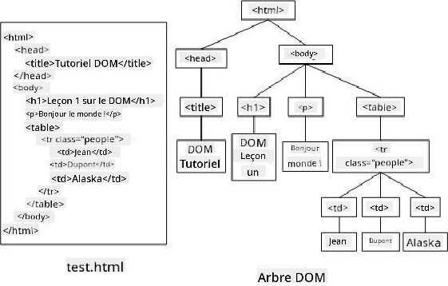
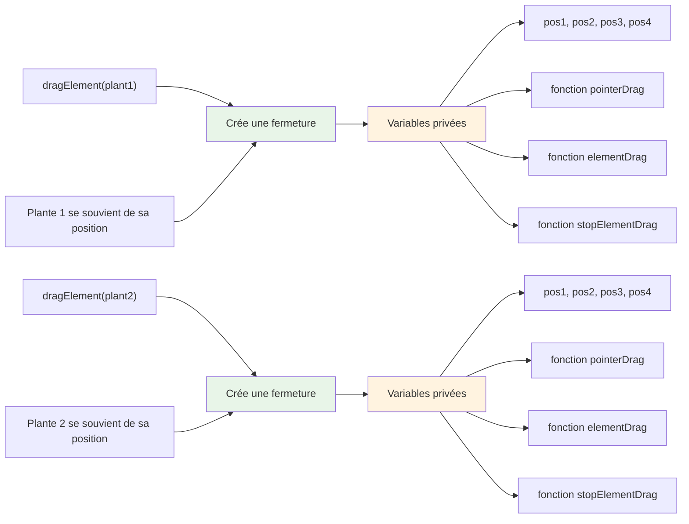
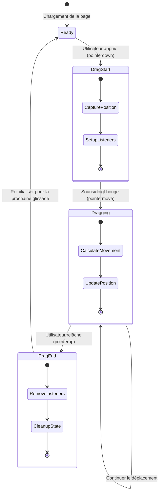
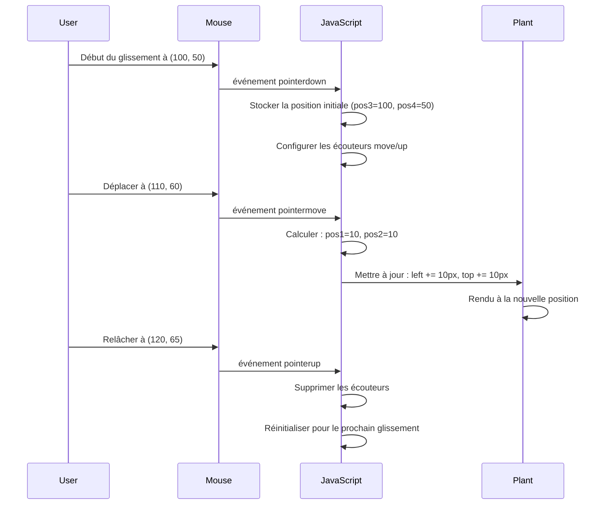
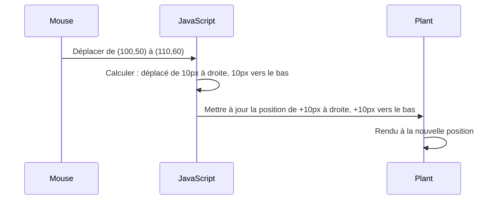
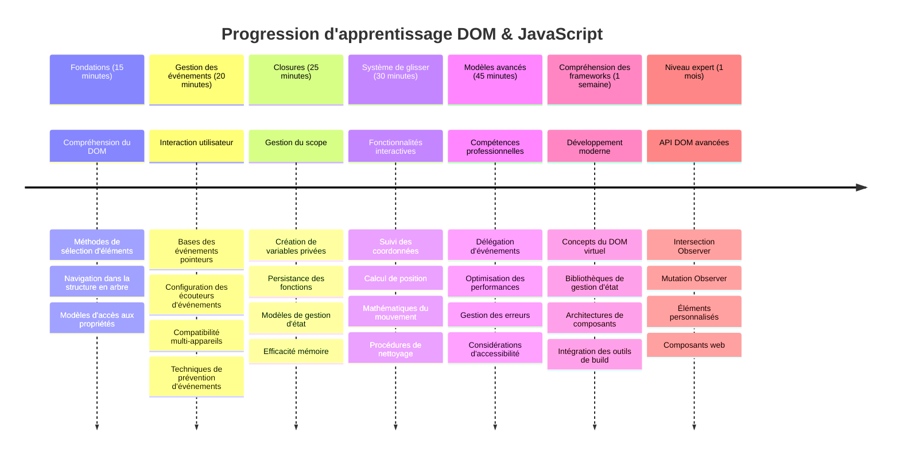

<!--
CO_OP_TRANSLATOR_METADATA:
{
  "original_hash": "973e48ad87d67bf5bb819746c9f8e302",
  "translation_date": "2026-01-06T06:46:19+00:00",
  "source_file": "3-terrarium/3-intro-to-DOM-and-closures/README.md",
  "language_code": "fr"
}
-->
# Projet Terrarium Partie 3 : Manipulation du DOM et Closures en JavaScript



> Sketchnote par [Tomomi Imura](https://twitter.com/girlie_mac)

Bienvenue dans l'un des aspects les plus passionnants du développement web - rendre les choses interactives ! Le Document Object Model (DOM) est comme un pont entre votre HTML et JavaScript, et aujourd'hui nous l'utiliserons pour donner vie à votre terrarium. Lorsque Tim Berners-Lee a créé le premier navigateur web, il imaginait un web où les documents pourraient être dynamiques et interactifs - le DOM rend cette vision possible.

Nous allons également explorer les closures JavaScript, qui peuvent sembler intimidantes au début. Pensez aux closures comme à la création de « poches de mémoire » où vos fonctions peuvent se souvenir d'informations importantes. C'est comme si chaque plante dans votre terrarium avait sa propre fiche de données pour suivre sa position. À la fin de cette leçon, vous comprendrez à quel point elles sont naturelles et utiles.

Voici ce que nous construisons : un terrarium où les utilisateurs peuvent glisser-déposer les plantes où ils veulent. Vous apprendrez les techniques de manipulation du DOM qui alimentent tout, des uploads de fichiers par glisser-déposer aux jeux interactifs. Donnons vie à votre terrarium.


## Quiz avant la leçon

[Quiz avant la leçon](https://ff-quizzes.netlify.app/web/quiz/19)

## Comprendre le DOM : Votre passerelle vers des pages web interactives

Le Document Object Model (DOM) est la manière dont JavaScript communique avec vos éléments HTML. Lorsque votre navigateur charge une page HTML, il crée une représentation structurée de cette page en mémoire - c'est le DOM. Pensez-y comme un arbre généalogique où chaque élément HTML est un membre de la famille auquel JavaScript peut accéder, modifier ou réarranger.

La manipulation du DOM transforme les pages statiques en sites web interactifs. Chaque fois que vous voyez un bouton changer de couleur au survol, un contenu qui se met à jour sans rafraîchir la page, ou des éléments que vous pouvez glisser, c'est la manipulation du DOM qui s'en charge.




> Une représentation du DOM et du balisage HTML qui le référence. Par [Olfa Nasraoui](https://www.researchgate.net/publication/221417012_Profile-Based_Focused_Crawler_for_Social_Media-Sharing_Websites)

**Voici ce qui rend le DOM puissant :**
- **Fournit** un moyen structuré d'accéder à n'importe quel élément sur votre page
- **Permet** des mises à jour dynamiques de contenu sans rechargement de page
- **Autorise** une réponse en temps réel aux interactions de l'utilisateur comme les clics et les glissements
- **Crée** la base pour les applications web interactives modernes

## Closures en JavaScript : créer un code organisé et puissant

Une [closure JavaScript](https://developer.mozilla.org/docs/Web/JavaScript/Closures) est comme donner à une fonction son propre espace de travail privé avec une mémoire persistante. Considérez comment les pinsons de Darwin aux îles Galápagos ont chacun développé des becs spécialisés basés sur leur environnement spécifique - les closures fonctionnent de manière similaire, créant des fonctions spécialisées qui « se souviennent » de leur contexte spécifique même après que leur fonction parente ait terminé.

Dans notre terrarium, les closures aident chaque plante à se souvenir de sa propre position de manière indépendante. Ce modèle apparaît tout au long du développement professionnel JavaScript, ce qui en fait un concept précieux à comprendre.


> 💡 **Comprendre les Closures** : Les closures sont un sujet important en JavaScript, et beaucoup de développeurs les utilisent pendant des années avant de maîtriser tous les aspects théoriques. Aujourd'hui, nous nous concentrons sur l'application pratique - vous verrez les closures émerger naturellement au fur et à mesure que nous construisons nos fonctionnalités interactives. La compréhension se développera en voyant comment elles résolvent des problèmes réels.


> Une représentation du DOM et du balisage HTML qui le référence. Par [Olfa Nasraoui](https://www.researchgate.net/publication/221417012_Profile-Based_Focused_Crawler_for_Social_Media-Sharing_Websites)

Dans cette leçon, nous allons compléter notre projet de terrarium interactif en créant le JavaScript qui permettra à un utilisateur de manipuler les plantes sur la page.

## Avant de commencer : se préparer au succès

Vous aurez besoin de vos fichiers HTML et CSS des leçons précédentes sur le terrarium - nous allons rendre ce design statique interactif. Si vous nous rejoignez pour la première fois, compléter ces leçons d'abord vous donnera un contexte important.

Voici ce que nous allons construire :
- **Glisser-déposer fluide** pour toutes les plantes du terrarium
- **Suivi des coordonnées** pour que les plantes se souviennent de leur position
- **Une interface interactive complète** avec JavaScript vanilla
- **Un code propre et organisé** utilisant des patterns de closure

## Préparer votre fichier JavaScript

Créons le fichier JavaScript qui rendra votre terrarium interactif.

**Étape 1 : Créez votre fichier script**

Dans votre dossier terrarium, créez un nouveau fichier nommé `script.js`.

**Étape 2 : Liez le JavaScript à votre HTML**

Ajoutez cette balise script dans la section `<head>` de votre fichier `index.html` :

```html
<script src="./script.js" defer></script>
```

**Pourquoi l'attribut `defer` est important :**
- **Assure** que votre JavaScript attend que tout le HTML soit chargé
- **Évite** les erreurs quand JavaScript cherche des éléments pas encore prêts
- **Garantit** que tous vos éléments de plante sont disponibles pour l'interaction
- **Offre** de meilleures performances que de placer les scripts en bas de page

> ⚠️ **Note importante** : L'attribut `defer` empêche des problèmes de timing courants. Sans lui, JavaScript pourrait essayer d'accéder aux éléments HTML avant leur chargement, entraînant des erreurs.

---

## Connecter JavaScript à vos éléments HTML

Avant de rendre les éléments déplaçables, JavaScript doit les localiser dans le DOM. Pensez à cela comme un système de catalogage de bibliothèque - une fois que vous avez le numéro de catalogue, vous pouvez trouver exactement le livre qu'il vous faut et accéder à tout son contenu.

Nous allons utiliser la méthode `document.getElementById()` pour faire ces connexions. C'est comme un système de classement précis - vous fournissez un ID, et il trouve exactement l'élément dont vous avez besoin dans votre HTML.

### Activer la fonctionnalité glisser pour toutes les plantes

Ajoutez ce code à votre fichier `script.js` :

```javascript
// Activer la fonctionnalité de glisser pour les 14 plantes
dragElement(document.getElementById('plant1'));
dragElement(document.getElementById('plant2'));
dragElement(document.getElementById('plant3'));
dragElement(document.getElementById('plant4'));
dragElement(document.getElementById('plant5'));
dragElement(document.getElementById('plant6'));
dragElement(document.getElementById('plant7'));
dragElement(document.getElementById('plant8'));
dragElement(document.getElementById('plant9'));
dragElement(document.getElementById('plant10'));
dragElement(document.getElementById('plant11'));
dragElement(document.getElementById('plant12'));
dragElement(document.getElementById('plant13'));
dragElement(document.getElementById('plant14'));
```

**Ce que ce code réalise :**
- **Localise** chaque élément plante dans le DOM grâce à son ID unique
- **Récupère** une référence JavaScript à chaque élément HTML
- **Passe** chaque élément à une fonction `dragElement` (que nous allons créer ensuite)
- **Prépare** chaque plante à l'interaction glisser-déposer
- **Relie** votre structure HTML à la fonctionnalité JavaScript

> 🎯 **Pourquoi utiliser des IDs plutôt que des classes ?** Les IDs offrent des identifiants uniques pour des éléments spécifiques, tandis que les classes CSS sont destinées au style de groupes d'éléments. Lorsque JavaScript doit manipuler des éléments individuels, les IDs offrent la précision et la performance nécessaires.

> 💡 **Astuce pro** : Remarquez que nous appelons `dragElement()` pour chaque plante individuellement. Cette approche garantit que chaque plante obtient son propre comportement de glissement indépendant, ce qui est essentiel pour une interaction utilisateur fluide.

### 🔄 **Contrôle pédagogique**
**Compréhension de la connexion au DOM** : Avant de passer à la fonctionnalité de glisser, vérifiez que vous pouvez :
- ✅ Expliquer comment `document.getElementById()` localise les éléments HTML
- ✅ Comprendre pourquoi nous utilisons des IDs uniques pour chaque plante
- ✅ Décrire le rôle de l'attribut `defer` dans les balises script
- ✅ Reconnaître comment JavaScript et HTML se connectent via le DOM

**Auto-test rapide** : Que se passerait-il si deux éléments avaient le même ID ? Pourquoi `getElementById()` ne retourne qu'un seul élément ?
*Réponse : Les IDs doivent être uniques ; en cas de duplication, seul le premier élément est retourné*

---

## Construire la closure dragElement

Nous allons maintenant créer le cœur de notre fonctionnalité de glissement : une closure qui gère le comportement de déplacement pour chaque plante. Cette closure contiendra plusieurs fonctions internes qui travaillent ensemble pour suivre les mouvements de la souris et mettre à jour les positions des éléments.

Les closures sont parfaites pour cette tâche car elles nous permettent de créer des variables « privées » qui persistent entre les appels de fonction, donnant à chaque plante son propre système indépendant de suivi des coordonnées.

### Comprendre les closures avec un exemple simple

Laissez-moi vous démontrer les closures avec un exemple simple qui illustre le concept :

```javascript
function createCounter() {
    let count = 0; // C'est comme une variable privée
    
    function increment() {
        count++; // La fonction interne se souvient de la variable externe
        return count;
    }
    
    return increment; // Nous renvoyons la fonction interne
}

const myCounter = createCounter();
console.log(myCounter()); // 1
console.log(myCounter()); // 2
```

**Ce qui se passe dans ce pattern de closure :**
- **Crée** une variable privée `count` qui existe uniquement dans cette closure
- **La fonction interne** peut accéder et modifier cette variable externe (le mécanisme de closure)
- **Lorsque nous retournons** la fonction interne, elle maintient sa connexion à ces données privées
- **Même après** que `createCounter()` ait fini son exécution, `count` persiste et se souvient de sa valeur

### Pourquoi les closures sont parfaites pour la fonctionnalité de glissement

Pour notre terrarium, chaque plante doit se souvenir de ses coordonnées actuelles. Les closures offrent la solution parfaite :

**Avantages clés pour notre projet :**
- **Maintien** des variables de position privées pour chaque plante indépendamment
- **Préservation** des données de coordonnées entre événements de glissement
- **Prévention** des conflits de variables entre différents éléments déplaçables
- **Création** d'une structure de code propre et organisée

> 🎯 **Objectif d'apprentissage** : Vous n'avez pas besoin de maîtriser chaque aspect des closures maintenant. Concentrez-vous sur la façon dont elles nous aident à organiser le code et à maintenir l'état pour notre fonctionnalité de glissement.


### Créer la fonction dragElement

Construisons maintenant la fonction principale qui gèrera toute la logique de glissement. Ajoutez cette fonction juste en dessous de vos déclarations d'éléments plante :

```javascript
function dragElement(terrariumElement) {
    // Initialiser les variables de suivi de position
    let pos1 = 0,  // Position X précédente de la souris
        pos2 = 0,  // Position Y précédente de la souris
        pos3 = 0,  // Position X actuelle de la souris
        pos4 = 0;  // Position Y actuelle de la souris
    
    // Configurer le gestionnaire d'événement de glisser initial
    terrariumElement.onpointerdown = pointerDrag;
}
```

**Comprendre le système de suivi de position :**
- **`pos1` et `pos2`** : Stockent la différence entre les anciennes et nouvelles positions de la souris
- **`pos3` et `pos4`** : Suivent les coordonnées actuelles de la souris
- **`terrariumElement`** : L'élément plante spécifique que nous rendons déplaçable
- **`onpointerdown`** : L'événement qui déclenche lorsque l'utilisateur commence à glisser

**Voici comment fonctionne le pattern closure :**
- **Crée** des variables de position privées pour chaque élément plante
- **Maintient** ces variables tout au long du cycle de vie du glissement
- **Assure** que chaque plante suit ses propres coordonnées indépendamment
- **Offre** une interface propre via la fonction `dragElement`

### Pourquoi utiliser les événements pointer ?

Vous vous demandez peut-être pourquoi nous utilisons `onpointerdown` au lieu du plus familier `onclick`. Voici la raison :

| Type d’événement | Adapté pour | Le bémol |
|------------------|-------------|------------|
| `onclick` | Clics simples sur boutons | Ne gère pas le glissement (seulement clics et relâchements) |
| `onpointerdown` | Souris et tactile | Récent, mais bien supporté aujourd’hui |
| `onmousedown` | Souris de bureau uniquement | Ne fonctionne pas sur mobile |

**Pourquoi les événements pointer sont parfaits pour ce que nous construisons :**
- **Fonctionne bien** que l'utilisateur utilise une souris, un doigt ou un stylet
- **Offre la même sensation** sur ordinateur portable, tablette ou téléphone
- **Gère** le véritable mouvement de glissement (pas seulement clic)
- **Crée** une expérience fluide que les utilisateurs attendent des applis web modernes

> 💡 **Préparation au futur** : Les événements pointer sont la manière moderne de gérer les interactions utilisateur. Au lieu d’écrire un code séparé pour souris et tactile, vous avez les deux gratuits. Plutôt sympa, non ?

### 🔄 **Contrôle pédagogique**
**Compréhension de la gestion d’événements** : Faites une pause pour confirmer votre compréhension :
- ✅ Pourquoi utilisons-nous les événements pointer au lieu des événements souris ?
- ✅ Comment les variables de closure persistent-elles entre les appels de fonction ?
- ✅ Quel rôle joue `preventDefault()` pour un glissement fluide ?
- ✅ Pourquoi attachons-nous les écouteurs au document plutôt qu'aux éléments individuels ?

**Lien avec le monde réel** : Pensez aux interfaces glisser-déposer que vous utilisez quotidiennement :
- **Transferts de fichiers** : Glisser des fichiers dans une fenêtre de navigateur
- **Tableaux Kanban** : Déplacer des tâches entre colonnes
- **Galeries d'images** : Réarranger l’ordre des photos
- **Interfaces mobiles** : Glisser et balayer sur écran tactile

---

## La fonction pointerDrag : Capturer le début d’un glissement

Quand un utilisateur appuie sur une plante (que ce soit avec un clic souris ou un toucher), la fonction `pointerDrag` entre en action. Cette fonction capture les coordonnées initiales et met en place le système de glissement.

Ajoutez cette fonction dans votre closure `dragElement`, juste après la ligne `terrariumElement.onpointerdown = pointerDrag;` :

```javascript
function pointerDrag(e) {
    // Empêcher le comportement par défaut du navigateur (comme la sélection de texte)
    e.preventDefault();
    
    // Capturer la position initiale de la souris/tactile
    pos3 = e.clientX;  // Coordonnée X où le glissement a commencé
    pos4 = e.clientY;  // Coordonnée Y où le glissement a commencé
    
    // Configurer les écouteurs d'événements pour le processus de glissement
    document.onpointermove = elementDrag;
    document.onpointerup = stopElementDrag;
}
```

**Étape par étape, voici ce qui se passe :**
- **Empêche** les comportements par défaut du navigateur qui pourraient perturber le glissement
- **Enregistre** les coordonnées précises où l’utilisateur a commencé le geste de glissement
- **Établit** des écouteurs d’événements pour le mouvement de glissement en cours
- **Prépare** le système pour suivre le déplacement souris/doigt sur tout le document

### Comprendre la prévention d’événements

La ligne `e.preventDefault()` est cruciale pour un glissement fluide :

**Sans cette prévention, les navigateurs pourraient :**
- **Sélectionner** du texte lors du glissement sur la page
- **Déclencher** des menus contextuels au clic droit et glissement
- **Interférer** avec notre comportement personnalisé de glissement
- **Créer** des artefacts visuels pendant l’opération de glissement

> 🔍 **Expérimentez** : Après avoir fini cette leçon, essayez de retirer `e.preventDefault()` et observez l’impact sur l’expérience de glissement. Vous comprendrez vite pourquoi cette ligne est essentielle !

### Système de suivi des coordonnées

Les propriétés `e.clientX` et `e.clientY` nous donnent les coordonnées précises de la souris/toucher :

| Propriété | Ce qu’elle mesure | Cas d’usage |
|-----------|-------------------|-------------|
| `clientX` | Position horizontale relative à la fenêtre | Suivi des mouvements gauche-droite |
| `clientY` | Position verticale relative à la fenêtre | Suivi des mouvements haut-bas |
**Comprendre ces coordonnées :**
- **Fournit** des informations de positionnement pixel-perfect
- **Se met à jour** en temps réel au fur et à mesure que l’utilisateur déplace son pointeur
- **Reste** cohérent à travers différentes tailles d’écran et niveaux de zoom
- **Permet** des interactions de glisser-lâcher fluides et réactives

### Mise en place des écouteurs d’événements au niveau du document

Remarquez comment nous attachons les événements de déplacement et d’arrêt à l’ensemble du `document`, pas seulement à l’élément plante :

```javascript
document.onpointermove = elementDrag;
document.onpointerup = stopElementDrag;
```

**Pourquoi attacher au document :**
- **Continue** à suivre même lorsque la souris quitte l’élément plante
- **Empêche** l’interruption du glisser si l’utilisateur se déplace rapidement
- **Fournit** un glissement fluide sur tout l’écran
- **Gère** les cas limites où le curseur sort de la fenêtre du navigateur

> ⚡ **Note de performance** : Nous nettoierons ces écouteurs au niveau du document lorsque le glisser s’arrête afin d’éviter les fuites mémoire et les problèmes de performance.

## Compléter le système de glisser : déplacement et nettoyage

Nous allons maintenant ajouter les deux fonctions restantes qui gèrent le déplacement effectif lors du glisser et le nettoyage lorsque le glisser s’arrête. Ces fonctions travaillent ensemble pour créer un mouvement fluide et réactif des plantes à travers votre terrarium.

### La fonction elementDrag : suivi du mouvement

Ajoutez la fonction `elementDrag` juste après l’accolade fermante de `pointerDrag` :

```javascript
function elementDrag(e) {
    // Calculer la distance parcourue depuis le dernier événement
    pos1 = pos3 - e.clientX;  // Distance horizontale parcourue
    pos2 = pos4 - e.clientY;  // Distance verticale parcourue
    
    // Mettre à jour le suivi de la position actuelle
    pos3 = e.clientX;  // Nouvelle position X actuelle
    pos4 = e.clientY;  // Nouvelle position Y actuelle
    
    // Appliquer le déplacement à la position de l'élément
    terrariumElement.style.top = (terrariumElement.offsetTop - pos2) + 'px';
    terrariumElement.style.left = (terrariumElement.offsetLeft - pos1) + 'px';
}
```

**Comprendre les mathématiques des coordonnées :**
- **`pos1` et `pos2`** : calculent la distance parcourue par la souris depuis la dernière mise à jour
- **`pos3` et `pos4`** : stockent la position actuelle de la souris pour le calcul suivant
- **`offsetTop` et `offsetLeft`** : récupèrent la position actuelle de l’élément sur la page
- **Logique de soustraction** : déplace l’élément de la même quantité que celle parcourue par la souris


**Voici la décomposition du calcul du mouvement :**
1. **Mesure** la différence entre les anciennes et nouvelles positions de la souris
2. **Calcule** combien déplacer l’élément en fonction du mouvement de la souris
3. **Met à jour** les propriétés CSS de position de l’élément en temps réel
4. **Stocke** la nouvelle position comme base pour le prochain calcul de mouvement

### Représentation visuelle des calculs


### La fonction stopElementDrag : nettoyage

Ajoutez la fonction de nettoyage après l’accolade fermante de `elementDrag` :

```javascript
function stopElementDrag() {
    // Supprimer les écouteurs d'événements au niveau du document
    document.onpointerup = null;
    document.onpointermove = null;
}
```

**Pourquoi le nettoyage est essentiel :**
- **Empêche** les fuites mémoire dues aux écouteurs d’événements persistants
- **Arrête** le comportement de glisser dès que l’utilisateur relâche la plante
- **Permet** à d’autres éléments d’être glissés indépendamment
- **Réinitialise** le système pour la prochaine opération de glisser

**Ce qui se passe sans nettoyage :**
- Les écouteurs d’événements continuent de fonctionner même après l’arrêt du glisser
- La performance se dégrade à mesure que les écouteurs non utilisés s’accumulent
- Comportements inattendus lors d’interactions avec d’autres éléments
- Les ressources du navigateur sont gaspillées à gérer des événements inutiles

### Comprendre les propriétés CSS de position

Notre système de glisser manipule deux propriétés CSS clés :

| Propriété | Ce qu’elle contrôle | Comment nous l’utilisons |
|------------|---------------------|-------------------------|
| `top`      | Distance par rapport au bord supérieur | Positionnement vertical lors du glisser |
| `left`     | Distance par rapport au bord gauche | Positionnement horizontal lors du glisser |

**Points clés à propos des propriétés offset :**
- **`offsetTop`** : distance actuelle du haut de l’élément parent positionné
- **`offsetLeft`** : distance actuelle du bord gauche de l’élément parent positionné
- **Contexte de positionnement** : ces valeurs sont relatives à l’ancêtre positionné le plus proche
- **Mises à jour en temps réel** : changement immédiat lorsque nous modifions les propriétés CSS

> 🎯 **Philosophie de design** : Ce système de glisser est intentionnellement flexible – il n’y a pas de « zones de dépôt » ou de restrictions. Les utilisateurs peuvent placer les plantes où ils veulent, leur donnant un contrôle créatif total sur la conception de leur terrarium.

## Synthèse : votre système complet de glisser

Félicitations ! Vous venez de construire un système sophistiqué de glisser-déposer en JavaScript vanilla. Votre fonction complète `dragElement` contient désormais une closure puissante qui gère :

**Ce que votre closure accomplit :**
- **Maintient** des variables de position privées pour chaque plante indépendamment
- **Gère** tout le cycle de vie du glisser du début à la fin
- **Fournit** un mouvement fluide et réactif sur tout l’écran
- **Nettoie** correctement les ressources pour prévenir les fuites mémoire
- **Crée** une interface intuitive et créative pour la conception de terrariums

### Tester votre terrarium interactif

Testez maintenant votre terrarium interactif ! Ouvrez votre fichier `index.html` dans un navigateur web et essayez la fonctionnalité :

1. **Cliquez et maintenez** sur une plante pour commencer à la glisser
2. **Déplacez votre souris ou doigt** et regardez la plante suivre en douceur
3. **Relâchez** pour déposer la plante à sa nouvelle position
4. **Expérimentez** avec différents agencements pour explorer l’interface

🥇 **Succès** : Vous avez créé une application web pleinement interactive en utilisant des concepts fondamentaux que les développeurs professionnels utilisent quotidiennement. Cette fonctionnalité de glisser-déposer utilise les mêmes principes que les téléversements de fichiers, les tableaux Kanban, et bien d’autres interfaces interactives.

### 🔄 **Point pédagogique**
**Compréhension complète du système** : Vérifiez votre maîtrise du système complet de glisser :
- ✅ Comment les closures maintiennent-elles un état indépendant pour chaque plante ?
- ✅ Pourquoi le calcul des coordonnées est-il nécessaire pour un mouvement fluide ?
- ✅ Que se passerait-il si on oubliait de nettoyer les écouteurs d’événements ?
- ✅ Comment ce modèle s’adapte-t-il à des interactions plus complexes ?

**Réflexion sur la qualité du code** : Passez en revue votre solution complète :
- **Conception modulaire** : chaque plante a sa propre instance de closure
- **Efficacité événementielle** : bonne configuration et nettoyage des écouteurs
- **Compatibilité multi-appareils** : fonctionne sur bureau et mobile
- **Conscience de la performance** : pas de fuites mémoire ni calculs redondants


---

## Défi GitHub Copilot Agent 🚀

Utilisez le mode Agent pour compléter le défi suivant :

**Description :** Améliorez le projet terrarium en ajoutant une fonctionnalité de réinitialisation qui remet toutes les plantes à leurs positions originales avec des animations fluides.

**Consigne :** Créez un bouton de réinitialisation qui, lorsqu’on clique dessus, anime toutes les plantes pour revenir à leurs positions originales dans la barre latérale en utilisant des transitions CSS. La fonction doit stocker les positions originales au chargement de la page et faire revenir en douceur les plantes à ces positions sur 1 seconde lorsque le bouton reset est pressé.

En savoir plus sur le [mode agent](https://code.visualstudio.com/blogs/2025/02/24/introducing-copilot-agent-mode).

## 🚀 Défi supplémentaire : développez vos compétences

Prêt à faire passer votre terrarium au niveau supérieur ? Essayez d’implémenter ces améliorations :

**Extensions créatives :**
- **Double-cliquez** sur une plante pour la faire passer devant (manipulation du z-index)
- **Ajoutez un retour visuel** comme un léger halo au survol des plantes
- **Implémentez des limites** pour empêcher les plantes d’être déplacées hors du terrarium
- **Créez une fonction de sauvegarde** qui mémorise les positions des plantes avec localStorage
- **Ajoutez des effets sonores** lors de la prise et du dépôt des plantes

> 💡 **Opportunité d’apprentissage** : Chacun de ces défis vous enseignera de nouveaux aspects de la manipulation du DOM, de la gestion des événements et du design de l’expérience utilisateur.

## Quiz post-lecture

[Quiz post-lecture](https://ff-quizzes.netlify.app/web/quiz/20)

## Revue & auto-apprentissage : approfondir votre compréhension

Vous maîtrisez les fondamentaux de la manipulation du DOM et des closures, mais il y a toujours plus à explorer ! Voici quelques pistes pour développer vos connaissances et compétences.

### Approches alternatives du glisser-déposer

Nous avons utilisé les événements pointer pour une flexibilité maximale, mais le développement web offre plusieurs approches :

| Approche | Idéal pour | Valeur pédagogique |
|----------|------------|--------------------|
| [API HTML Drag and Drop](https://developer.mozilla.org/docs/Web/API/HTML_Drag_and_Drop_API) | Téléversements de fichiers, zones de glisser formelles | Comprendre les capacités natives du navigateur |
| [Événements tactiles](https://developer.mozilla.org/docs/Web/API/Touch_events) | Interactions spécifiques au mobile | Modèles de développement mobile-first |
| Propriétés CSS `transform` | Animations fluides | Techniques d’optimisation des performances |

### Sujets avancés de manipulation DOM

**Étapes suivantes dans votre parcours :**
- **Délégation d’événements** : gérer efficacement les événements sur plusieurs éléments
- **Intersection Observer** : détecter quand les éléments entrent ou sortent du viewport
- **Mutation Observer** : surveiller les changements dans la structure DOM
- **Web Components** : créer des éléments UI réutilisables et encapsulés
- **Concepts de Virtual DOM** : comprendre comment les frameworks optimisent les mises à jour DOM

### Ressources essentielles pour continuer à apprendre

**Documentation technique :**
- [Guide MDN sur les événements pointer](https://developer.mozilla.org/docs/Web/API/Pointer_events) - référence complète
- [Spécification W3C Pointer Events](https://www.w3.org/TR/pointerevents1/) - documentation officielle
- [Approfondissement des closures JavaScript](https://developer.mozilla.org/docs/Web/JavaScript/Closures) - patterns avancés de closures

**Compatibilité des navigateurs :**
- [CanIUse.com](https://caniuse.com/) - vérification du support des fonctionnalités selon navigateur
- [Données de compatibilité MDN](https://github.com/mdn/browser-compat-data) - informations détaillées

**Opportunités de pratique :**
- **Construisez** un jeu de puzzle utilisant des mécaniques similaires de glisser
- **Créez** un tableau Kanban avec gestionnaire de tâches par glisser-déposer
- **Concevez** une galerie d’images avec arrangement des photos par glisser
- **Expérimentez** avec les gestes tactiles pour les interfaces mobiles

> 🎯 **Stratégie d’apprentissage** : La meilleure façon de solidifier ces concepts est de pratiquer. Essayez de construire des variations d’interfaces glissantes – chaque projet vous apprendra quelque chose de nouveau sur l’interaction utilisateur et la manipulation du DOM.

### ⚡ **Ce que vous pouvez faire dans les 5 prochaines minutes**
- [ ] Ouvrir les DevTools du navigateur et taper `document.querySelector('body')` dans la console
- [ ] Essayer de modifier le texte d’une page web avec `innerHTML` ou `textContent`
- [ ] Ajouter un écouteur d’événement clic à un bouton ou un lien
- [ ] Inspecter la structure du DOM avec le panneau Éléments

### 🎯 **Ce que vous pouvez accomplir cette heure**
- [ ] Terminer le quiz post-formation et revoir les concepts de manipulation DOM
- [ ] Créer une page web interactive qui répond aux clics
- [ ] Pratiquer la gestion des événements avec différents types (clic, survol, touche)
- [ ] Construire une liste de tâches ou un compteur simple via manipulation DOM
- [ ] Explorer la relation entre éléments HTML et objets JavaScript

### 📅 **Votre parcours JavaScript sur une semaine**
- [ ] Compléter le projet terrarium interactif avec fonctionnalité glisser-déposer
- [ ] Maîtriser la délégation d’événements pour gérer efficacement les interactions
- [ ] Apprendre sur la boucle d’événements et JavaScript asynchrone
- [ ] Pratiquer les closures en construisant des modules avec état privé
- [ ] Explorer les API DOM modernes comme Intersection Observer
- [ ] Construire des composants interactifs sans frameworks

### 🌟 **Votre maîtrise JavaScript sur un mois**
- [ ] Créer une application single-page complexe avec JavaScript vanilla
- [ ] Apprendre un framework moderne (React, Vue ou Angular) et le comparer au DOM vanilla
- [ ] Contribuer à des projets open source JavaScript
- [ ] Maîtriser des concepts avancés comme les web components et les custom elements
- [ ] Construire des applications web performantes avec des patterns DOM optimaux
- [ ] Enseigner la manipulation du DOM et les fondamentaux JavaScript

## 🎯 Votre feuille de route pour la maîtrise du DOM en JavaScript


### 🛠️ Résumé de votre boîte à outils JavaScript

Après avoir terminé cette leçon, vous avez acquis :
- **Maîtrise du DOM** : sélection d’éléments, manipulation de propriétés, navigation dans l’arbre DOM
- **Expertise événementielle** : gestion des interactions multi-appareils avec les événements pointer
- **Compréhension des closures** : gestion d’état privé et persistance des fonctions
- **Systèmes interactifs** : implémentation complète du glisser-déposer depuis zéro
- **Conscience de la performance** : nettoyage correct des événements et gestion mémoire
- **Patrons modernes** : techniques d’organisation de code utilisées en développement professionnel
- **Expérience utilisateur** : création d’interfaces intuitives et réactives

**Compétences professionnelles acquises** : Vous avez construit des fonctionnalités utilisant les mêmes techniques que :
- **Tableaux Trello/Kanban** : glisser des cartes entre les colonnes
- **Systèmes de téléversement de fichiers** : prise en charge du glisser-déposer de fichiers
- **Galeries d’images** : interfaces d’arrangement de photos
- **Applications mobiles** : modèles d’interactions tactiles

**Prochaine étape** : vous êtes prêt à explorer les frameworks modernes comme React, Vue ou Angular qui s’appuient sur ces concepts fondamentaux de manipulation DOM !

## Devoir

[Travaillez un peu plus avec le DOM](assignment.md)

---

<!-- CO-OP TRANSLATOR DISCLAIMER START -->
**Avis de non-responsabilité** :  
Ce document a été traduit à l’aide du service de traduction automatique [Co-op Translator](https://github.com/Azure/co-op-translator). Bien que nous nous efforçions d’assurer l’exactitude, veuillez noter que les traductions automatiques peuvent contenir des erreurs ou des inexactitudes. Le document original dans sa langue d’origine doit être considéré comme la source faisant autorité. Pour les informations critiques, une traduction professionnelle réalisée par un humain est recommandée. Nous déclinons toute responsabilité en cas de malentendus ou de mauvaises interprétations résultant de l’utilisation de cette traduction.
<!-- CO-OP TRANSLATOR DISCLAIMER END -->