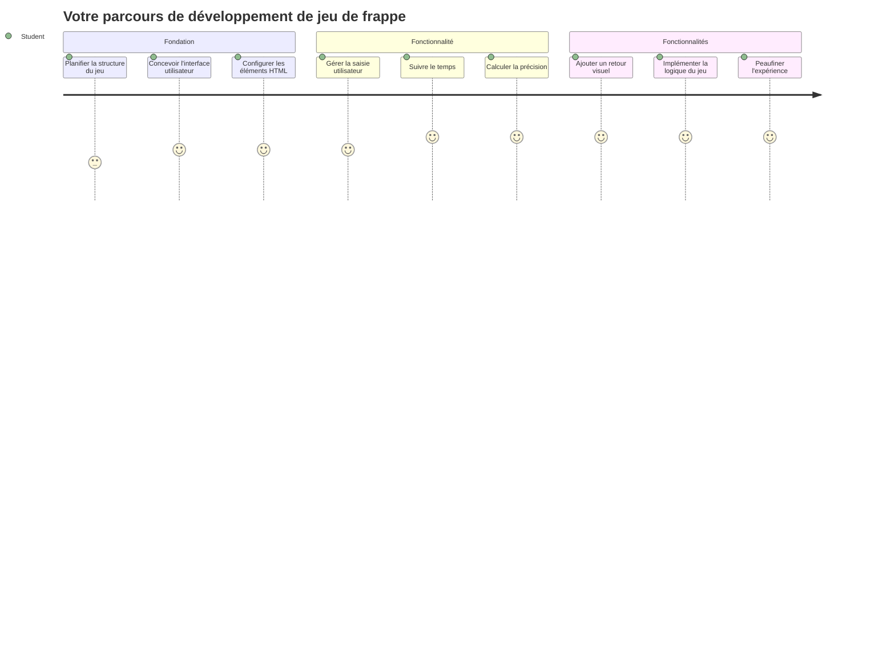
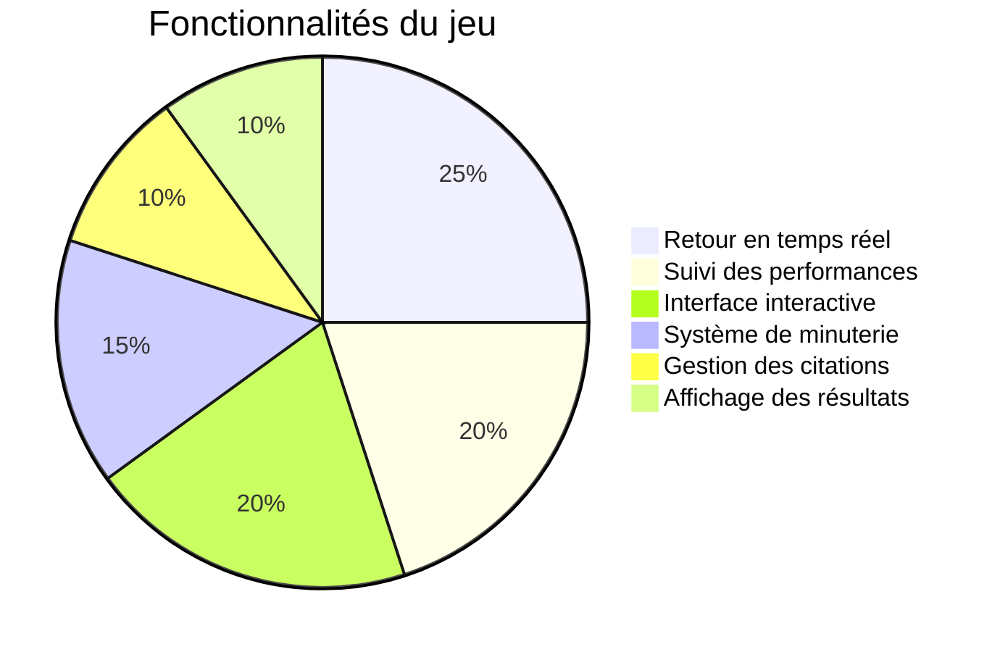
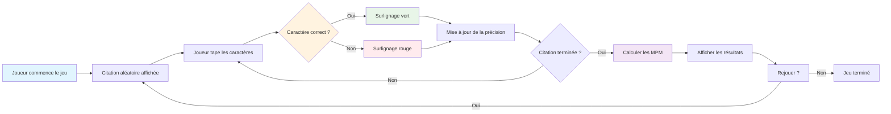
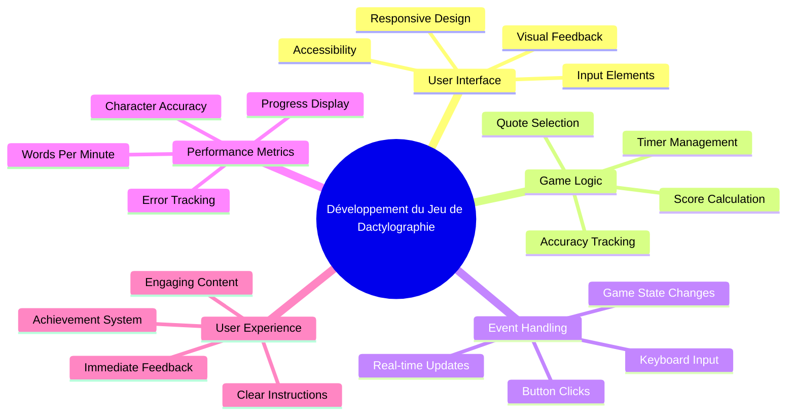
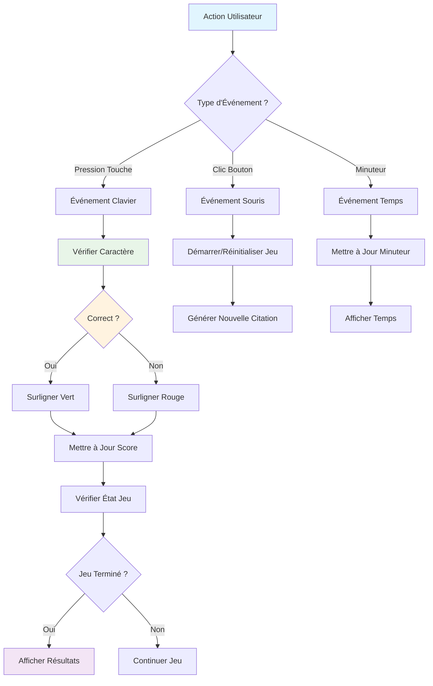
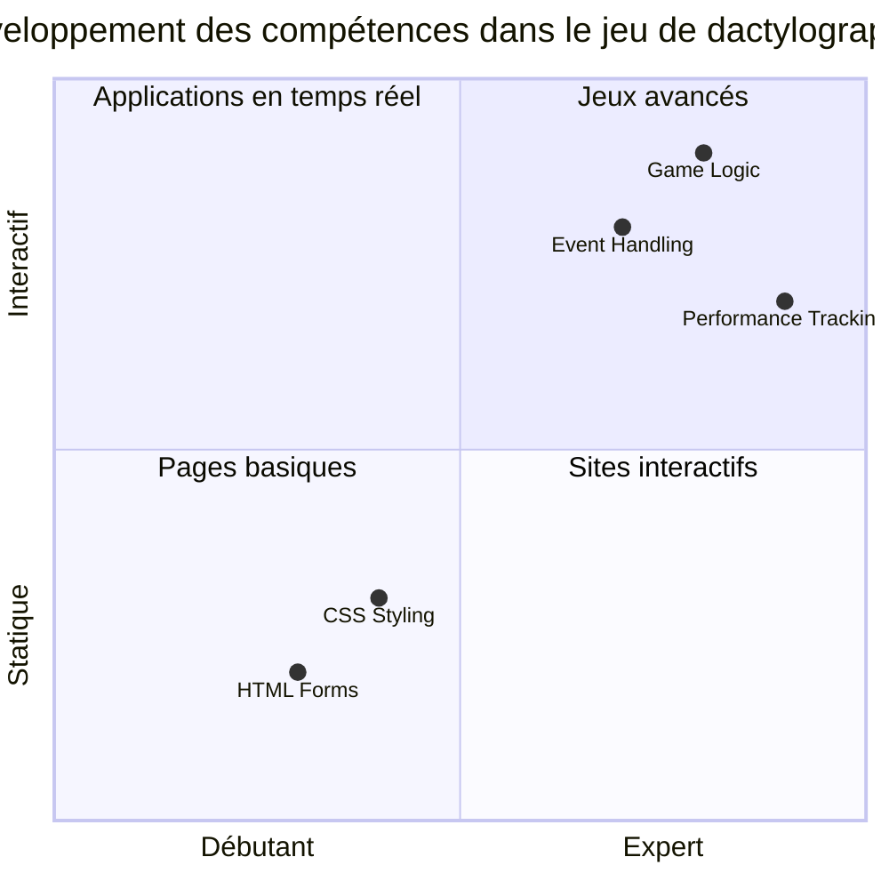
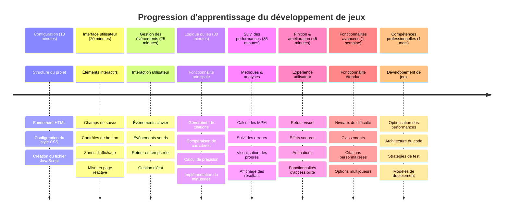

# Programmation Événementielle - Créez un Jeu de Dactylographie

## Introduction

Voici quelque chose que tout développeur sait mais dont on parle rarement : taper vite est un super pouvoir ! 🚀 Pensez-y - plus vous pouvez transférer rapidement vos idées de votre cerveau à votre éditeur de code, plus votre créativité peut s'exprimer. C'est comme avoir un canal direct entre vos pensées et l'écran.

Vous voulez savoir l'un des meilleurs moyens pour améliorer cette compétence ? Vous avez deviné - nous allons créer un jeu !

> Créons ensemble un jeu de dactylographie génial !

Prêt à mettre en pratique toutes ces compétences en JavaScript, HTML et CSS que vous avez apprises ? Nous allons construire un jeu de dactylographie qui vous mettra au défi avec des citations aléatoires du légendaire détective [Sherlock Holmes](https://en.wikipedia.org/wiki/Sherlock_Holmes). Le jeu suivra votre vitesse et votre précision de frappe - et croyez-moi, c'est plus addictif que vous ne le pensez !

## Ce Que Vous Devez Savoir

Avant de commencer, assurez-vous d'être à l'aise avec ces concepts (ne vous inquiétez pas si vous avez besoin d'un rafraîchissement rapide - nous sommes tous passés par là !) :

- Créer des contrôles de saisie de texte et de boutons
- CSS et définition de styles avec des classes  
- Notions de base en JavaScript
  - Créer un tableau
  - Générer un nombre aléatoire
  - Obtenir l'heure actuelle

Si certains de ces points vous semblent un peu rouillés, ce n’est pas grave du tout ! Parfois, la meilleure façon de consolider vos connaissances est de plonger dans un projet et de comprendre les choses en avançant.

### 🔄 **Bilan Pédagogique**
**Évaluation des Fondations** : Avant de commencer le développement, assurez-vous de comprendre :
- ✅ Comment fonctionnent les formulaires HTML et les éléments d'entrée
- ✅ Les classes CSS et le style dynamique
- ✅ Les écouteurs d'événements et gestionnaires en JavaScript
- ✅ La manipulation des tableaux et la sélection aléatoire
- ✅ La mesure du temps et les calculs associés

**Test Rapide** : Pouvez-vous expliquer comment ces concepts fonctionnent ensemble dans un jeu interactif ?
- **Les événements** se déclenchent lorsque les utilisateurs interagissent avec des éléments
- **Les gestionnaires** traitent ces événements et mettent à jour l'état du jeu
- **Le CSS** fournit un retour visuel aux actions de l'utilisateur
- **Le chronométrage** permet de mesurer les performances et la progression du jeu

## Construisons Ce Projet !

[Créer un jeu de dactylographie en utilisant la programmation événementielle](./typing-game/README.md)

### ⚡ **Ce Que Vous Pouvez Faire Dans Les 5 Prochaines Minutes**
- [ ] Ouvrez la console de votre navigateur et essayez d'écouter les événements clavier avec `addEventListener`
- [ ] Créez une page HTML simple avec un champ de saisie et testez la détection de frappe
- [ ] Pratiquez la manipulation des chaînes en comparant le texte saisi avec le texte cible
- [ ] Expérimentez avec `setTimeout` pour comprendre les fonctions de temporisation

### 🎯 **Ce Que Vous Pouvez Accomplir Cette Heure**
- [ ] Complétez le quiz post-leçon et comprenez la programmation événementielle
- [ ] Construisez une version basique du jeu de dactylographie avec validation des mots
- [ ] Ajoutez un retour visuel pour les frappes correctes et incorrectes
- [ ] Implémentez un système de score simple basé sur la vitesse et la précision
- [ ] Stylisez votre jeu avec CSS pour le rendre visuellement attractif

### 📅 **Votre Développement de Jeu Sur Une Semaine**
- [ ] Terminez le jeu complet avec toutes ses fonctionnalités et la finition
- [ ] Ajoutez des niveaux de difficulté avec une complexité variable des mots
- [ ] Implémentez le suivi des statistiques utilisateur (Mots Par Minute, précision dans le temps)
- [ ] Créez des effets sonores et des animations pour une meilleure expérience utilisateur
- [ ] Rendez votre jeu responsive pour les appareils tactiles
- [ ] Partagez votre jeu en ligne et recueillez les retours des utilisateurs

### 🌟 **Votre Développement Interactif Sur Un Mois**
- [ ] Créez plusieurs jeux explorant différents modes d’interaction
- [ ] Apprenez les boucles de jeu, la gestion d’état, et l’optimisation des performances
- [ ] Contribuez à des projets open source de développement de jeux
- [ ] Maîtrisez les concepts avancés de chronométrage et animations fluides
- [ ] Constituez un portfolio présentant diverses applications interactives
- [ ] Devenez mentor pour d’autres intéressés par le développement de jeux et l’interaction utilisateur

## 🎯 Votre Chronologie de Maîtrise du Jeu de Dactylographie

### 🛠️ Résumé de Votre Boîte à Outils de Développement de Jeu

Après avoir terminé ce projet, vous aurez maîtrisé :
- **Programmation Événementielle** : Interfaces utilisateurs réactives aux entrées
- **Retour en Temps Réel** : Mises à jour visuelles et de performance instantanées
- **Mesure de Performance** : Systèmes précis de chronométrage et de score
- **Gestion de l’État du Jeu** : Contrôle du flux de l’application et de l’expérience utilisateur
- **Conception Interactive** : Création d’expériences addictives et engageantes
- **APIs Web Modernes** : Exploitation des capacités du navigateur pour des interactions riches
- **Patrons d’Accessibilité** : Design inclusif pour tous les utilisateurs

**Applications Réelles** : Ces compétences s’appliquent directement à :
- **Applications Web** : Toute interface interactive ou tableau de bord
- **Logiciels Éducatifs** : Plateformes d’apprentissage et outils d’évaluation des compétences
- **Outils de Productivité** : Éditeurs de texte, IDE et logiciels de collaboration
- **Industrie du Jeu** : Jeux sur navigateur et divertissement interactif
- **Développement Mobile** : Interfaces tactiles et gestion des gestes

**Niveau Suivant** : Vous êtes prêt à explorer des frameworks de jeu avancés, des systèmes multijoueurs en temps réel ou des applications interactives complexes !

## Crédits

Écrit avec ♥️ par [Christopher Harrison](http://www.twitter.com/geektrainer)

---

<!-- CO-OP TRANSLATOR DISCLAIMER START -->
**Avertissement** :  
Ce document a été traduit à l’aide du service de traduction automatique [Co-op Translator](https://github.com/Azure/co-op-translator). Bien que nous nous efforcions d’en assurer l’exactitude, veuillez noter que les traductions automatiques peuvent contenir des erreurs ou des imprécisions. Le document original dans sa langue d’origine doit être considéré comme la source faisant foi. Pour les informations critiques, une traduction professionnelle réalisée par un humain est recommandée. Nous déclinons toute responsabilité en cas de malentendus ou de mauvaises interprétations résultant de l’utilisation de cette traduction.
<!-- CO-OP TRANSLATOR DISCLAIMER END -->