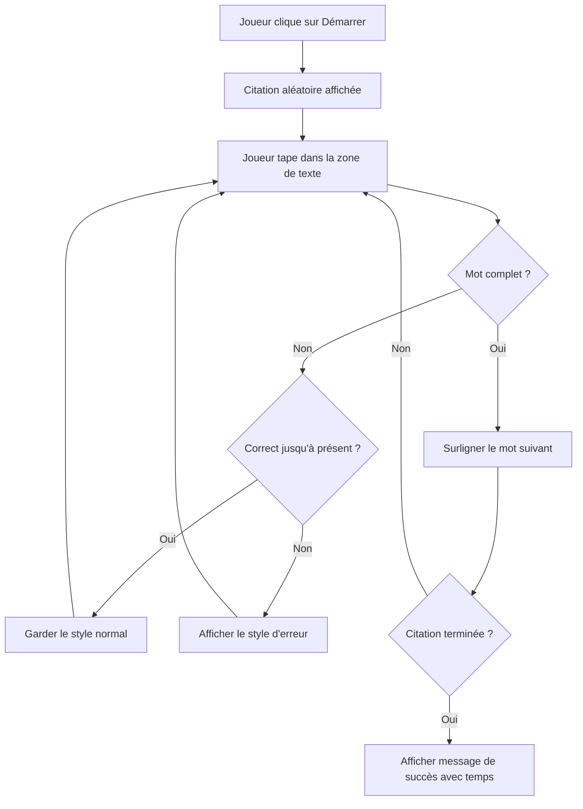
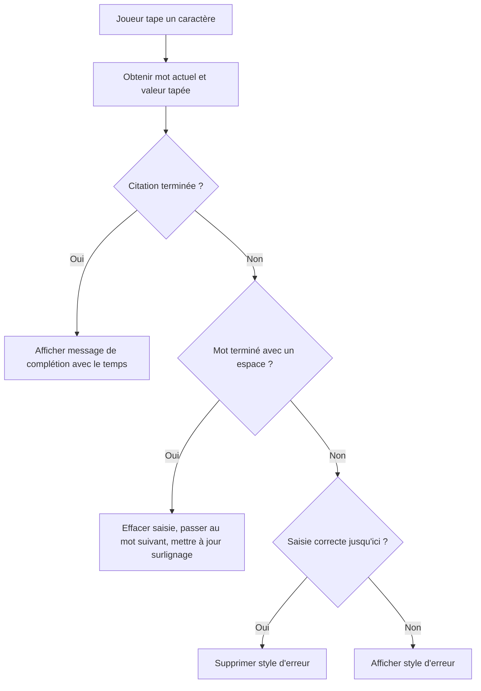
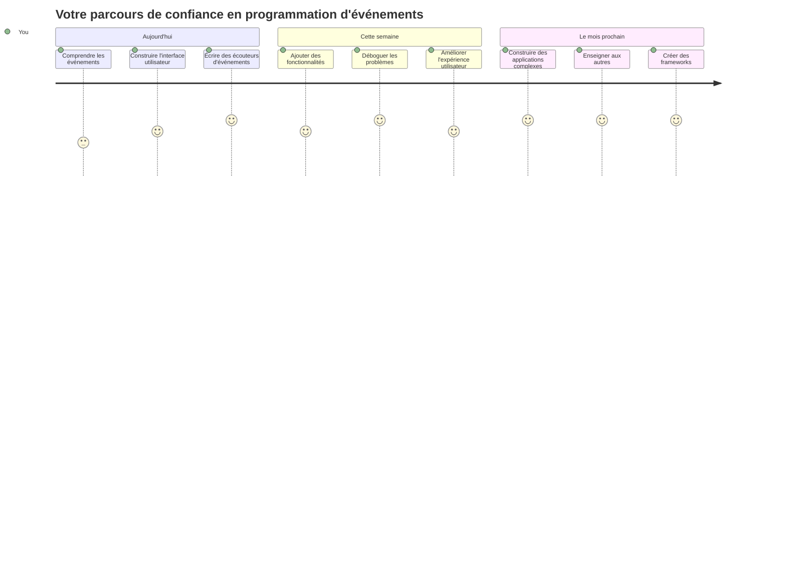

# Créer un jeu en utilisant des événements

Vous êtes-vous déjà demandé comment les sites web savent quand vous cliquez sur un bouton ou tapez dans une zone de texte ? C’est la magie de la programmation événementielle ! Quoi de mieux pour apprendre cette compétence essentielle qu’en créant quelque chose d’utile — un jeu de vitesse de frappe qui réagit à chaque touche que vous pressez.

Vous allez voir de première main comment les navigateurs web « parlent » à votre code JavaScript. Chaque fois que vous cliquez, tapez ou déplacez votre souris, le navigateur envoie de petits messages (nous appelons ça des événements) à votre code, et c’est vous qui décidez comment répondre !

Quand nous aurons fini, vous aurez créé un vrai jeu de frappe qui suit votre vitesse et votre précision. Plus important encore, vous comprendrez les concepts fondamentaux qui animent chaque site interactif que vous avez utilisé. Plongeons-nous dedans !

## Quiz pré-conférence

[Quiz pré-conférence](https://ff-quizzes.netlify.app/web/quiz/21)

## Programmation événementielle

Pensez à votre application ou site web préféré : qu’est-ce qui le rend vivant et réactif ? Tout est dans sa façon de réagir à ce que vous faites ! Chaque tap, clic, glissement ou pression de touche crée ce que nous appelons un « événement », et c’est là que la vraie magie du développement web se produit.

Voici ce qui rend la programmation web si intéressante : on ne sait jamais quand quelqu’un va cliquer sur ce bouton ou commencer à taper dans une zone de texte. Il peut cliquer immédiatement, attendre cinq minutes, ou peut-être ne jamais cliquer du tout ! Cette imprévisibilité signifie que nous devons penser différemment la façon dont nous écrivons notre code.

Au lieu d’écrire un code qui s’exécute de haut en bas comme une recette, nous écrivons un code qui attend patiemment que quelque chose se produise. C’est similaire à la façon dont les opérateurs télégraphiques au 19ème siècle restaient à côté de leurs machines, prêts à répondre au moment où un message arrivait sur le fil.

Alors, qu’est-ce qu’un « événement » exactement ? Simplement, c’est quelque chose qui arrive ! Quand vous cliquez sur un bouton — c’est un événement. Quand vous tapez une lettre — c’est un événement. Quand vous déplacez votre souris — c’est un autre événement.

La programmation événementielle nous permet de configurer notre code pour écouter et répondre. Nous créons des fonctions spéciales appelées **écouteurs d’événements** qui attendent patiemment que des choses spécifiques se produisent, puis se déclenchent quand c’est le cas.

Pensez aux écouteurs d’événements comme une sonnette pour votre code. Vous installez la sonnette (`addEventListener()`), vous dites quel son elle doit écouter (comme un « clic » ou une « pression de touche »), puis vous spécifiez ce qui doit arriver quand quelqu’un sonne (votre fonction personnalisée).

**Voici comment fonctionnent les écouteurs d’événements :**
- **Écoute** des actions spécifiques de l’utilisateur comme des clics, des frappes de touches ou des mouvements de souris
- **Exécute** votre code personnalisé quand l'événement spécifié se produit
- **Réagit** immédiatement aux interactions utilisateur, créant une expérience fluide
- **Gère** plusieurs événements sur le même élément grâce à différents écouteurs

> **NOTE :** Il est utile de souligner qu’il existe de nombreuses façons de créer des écouteurs d’événements. Vous pouvez utiliser des fonctions anonymes, ou créer des fonctions nommées. Vous pouvez utiliser différentes méthodes rapides, comme définir la propriété `click`, ou utiliser `addEventListener()`. Dans notre exercice, nous allons nous concentrer sur `addEventListener()` et les fonctions anonymes, car c’est probablement la technique la plus courante utilisée par les développeurs web. C’est aussi la plus flexible, car `addEventListener()` fonctionne pour tous les événements, et le nom de l’événement peut être fourni en paramètre.

### Événements courants

Alors que les navigateurs web offrent des dizaines d’événements différents que vous pouvez écouter, la plupart des applications interactives s’appuient sur une poignée d’événements essentiels. Comprendre ces événements fondamentaux vous donnera les bases pour créer des interactions utilisateur sophistiquées.

Il existe [des dizaines d’événements](https://developer.mozilla.org/docs/Web/Events) disponibles auxquels vous pouvez vous abonner lors de la création d’une application. En gros, tout ce qu’un utilisateur fait sur une page déclenche un événement, ce qui vous donne beaucoup de pouvoir pour garantir qu’il obtienne l’expérience désirée. Heureusement, vous aurez normalement besoin d’un petit nombre d’événements. En voici quelques-uns courants (y compris les deux que nous utiliserons pour créer notre jeu) :

| Événement | Description | Cas d’utilisation courants |
|-----------|-------------|----------------------------|
| `click` | L’utilisateur a cliqué sur quelque chose | Boutons, liens, éléments interactifs |
| `contextmenu` | L’utilisateur a cliqué avec le bouton droit de la souris | Menus contextuels personnalisés |
| `select` | L’utilisateur a sélectionné du texte | Édition de texte, opérations de copie |
| `input` | L’utilisateur a saisi du texte | Validation de formulaire, recherche en temps réel |

**Comprendre ces types d’événements :**
- **Se déclenche** lorsque les utilisateurs interagissent avec des éléments spécifiques sur votre page
- **Fournit** des détails sur l’action de l’utilisateur via des objets événementiels
- **Vous permet** de créer des applications web réactives et interactives
- **Fonctionne** de manière cohérente sur différents navigateurs et appareils

## Créer le jeu

Maintenant que vous comprenez comment fonctionnent les événements, mettons ces connaissances en pratique en créant quelque chose d’utile. Nous allons créer un jeu de vitesse de frappe qui démontre la gestion des événements tout en vous aidant à développer une compétence importante de développeur.

Nous allons créer un jeu pour explorer comment les événements fonctionnent en JavaScript. Notre jeu testera la capacité de frappe d’un joueur, une des compétences les plus sous-estimées que tout développeur devrait avoir. Petite anecdote : la disposition de clavier QWERTY que nous utilisons aujourd’hui a été conçue dans les années 1870 pour les machines à écrire — et les bonnes compétences de frappe sont toujours aussi précieuses pour les programmeurs aujourd’hui ! Le déroulement général du jeu sera le suivant :


**Voici comment notre jeu fonctionnera :**  
- **Commence** lorsque le joueur clique sur le bouton de démarrage et affiche une citation aléatoire  
- **Suit** la progression de frappe du joueur mot par mot en temps réel  
- **Met en surbrillance** le mot actuel pour guider la concentration du joueur  
- **Fournit** un retour visuel immédiat en cas d’erreurs de frappe  
- **Calcule** et affiche le temps total à la fin de la citation  

Construisons notre jeu, et apprenons les événements !

### Structure des fichiers

Avant de commencer à coder, organisons-nous ! Avoir une structure de fichiers propre dès le départ vous évitera des maux de tête plus tard et rendra votre projet plus professionnel. 😊

Nous allons rester simples avec seulement trois fichiers : `index.html` pour la structure de la page, `script.js` pour toute notre logique de jeu, et `style.css` pour tout rendre joli. C’est le trio classique qui alimente la majorité du web !

**Créez un nouveau dossier pour votre travail en ouvrant une console ou un terminal et en exécutant la commande suivante :**

```bash
# Linux ou macOS
mkdir typing-game && cd typing-game

# Windows
md typing-game && cd typing-game
```
  
**Voici ce que font ces commandes :**  
- **Crée** un nouveau répertoire appelé `typing-game` pour vos fichiers de projet  
- **Se place** automatiquement dans ce répertoire nouvellement créé  
- **Met en place** un espace de travail propre pour votre développement de jeu  

**Ouvrez Visual Studio Code :**

```bash
code .
```
  
**Cette commande :**  
- **Lance** Visual Studio Code dans le répertoire courant  
- **Ouvre** votre dossier de projet dans l’éditeur  
- **Vous donne** accès à tous les outils de développement dont vous aurez besoin  

**Ajoutez trois fichiers au dossier dans Visual Studio Code avec les noms suivants :**  
- `index.html` - Contient la structure et le contenu de votre jeu  
- `script.js` - Gère toute la logique du jeu et les écouteurs d’événements  
- `style.css` - Définit l’apparence visuelle et le style  

## Créer l’interface utilisateur

Construisons maintenant la scène où toute l’action de notre jeu aura lieu ! Pensez à cela comme au panneau de contrôle d’un vaisseau spatial — nous devons nous assurer que tout ce dont nos joueurs ont besoin est là où ils s’attendent à le trouver.

Voyons ce dont notre jeu a réellement besoin. Si vous jouiez à un jeu de frappe, qu’est-ce que vous aimeriez voir à l’écran ? Voici ce dont nous aurons besoin :

| Élément UI | But | Élément HTML |
|------------|-----|--------------|
| Affichage de la citation | Affiche le texte à taper | `<p>` avec `id="quote"` |
| Zone de message | Affiche les messages de statut et de réussite | `<p>` avec `id="message"` |
| Zone de saisie | Où les joueurs tapent la citation | `<input>` avec `id="typed-value"` |
| Bouton de démarrage | Lance le jeu | `<button>` avec `id="start"` |

**Comprendre la structure de l’interface :**  
- **Organise** le contenu logiquement de haut en bas  
- **Assigne** des ID uniques aux éléments pour le ciblage JavaScript  
- **Offre** une hiérarchie visuelle claire pour une meilleure expérience utilisateur  
- **Inclut** des éléments HTML sémantiques pour l’accessibilité  

Chacun d’eux aura besoin d’ID pour que nous puissions les manipuler dans notre JavaScript. Nous allons aussi ajouter des références aux fichiers CSS et JavaScript que nous allons créer.

Créez un nouveau fichier nommé `index.html`. Ajoutez le HTML suivant :

```html
<!-- inside index.html -->
<html>
<head>
  <title>Typing game</title>
  <link rel="stylesheet" href="style.css">
</head>
<body>
  <h1>Typing game!</h1>
  <p>Practice your typing skills with a quote from Sherlock Holmes. Click **start** to begin!</p>
  <p id="quote"></p> <!-- This will display our quote -->
  <p id="message"></p> <!-- This will display any status messages -->
  <div>
    <input type="text" aria-label="current word" id="typed-value" /> <!-- The textbox for typing -->
    <button type="button" id="start">Start</button> <!-- To start the game -->
  </div>
  <script src="script.js"></script>
</body>
</html>
```
  
**Décomposons ce que cette structure HTML accomplit :**  
- **Lie** la feuille de style CSS dans le `<head>` pour le style  
- **Crée** un titre clair et des instructions pour les utilisateurs  
- **Établit** des paragraphes réservés avec des ID spécifiques pour du contenu dynamique  
- **Inclut** un champ de saisie avec des attributs d’accessibilité  
- **Fournit** un bouton de démarrage pour déclencher le jeu  
- **Charge** le fichier JavaScript à la fin pour des performances optimales  

### Lancer l’application

Tester votre application fréquemment pendant le développement vous aide à détecter les problèmes tôt et à voir vos progrès en temps réel. Live Server est un outil précieux qui actualise automatiquement votre navigateur à chaque sauvegarde, rendant le développement beaucoup plus efficace.

Il est toujours préférable de développer de manière itérative pour voir comment les choses évoluent. Lançons notre application. Il existe une merveilleuse extension pour Visual Studio Code appelée [Live Server](https://marketplace.visualstudio.com/items?itemName=ritwickdey.LiveServer&WT.mc_id=academic-77807-sagibbon) qui hébergera votre application localement et rafraîchira le navigateur à chaque sauvegarde.

**Installez [Live Server](https://marketplace.visualstudio.com/items?itemName=ritwickdey.LiveServer&WT.mc_id=academic-77807-sagibbon) en suivant le lien et en cliquant sur Installer :**

**Voici ce qui se passe lors de l’installation :**  
- **Invite** votre navigateur à ouvrir Visual Studio Code  
- **Vous guide** à travers le processus d’installation de l’extension  
- **Peut nécessiter** un redémarrage de Visual Studio Code pour terminer l’installation  

**Une fois installé, dans Visual Studio Code, cliquez sur Ctrl-Shift-P (ou Cmd-Shift-P) pour ouvrir la palette de commandes :**

**Comprendre la palette de commandes :**  
- **Fournit** un accès rapide à toutes les commandes de VS Code  
- **Recherche** les commandes pendant que vous tapez  
- **Propose** des raccourcis clavier pour un développement plus rapide  

**Tapez « Live Server: Open with Live Server » :**

**Ce que fait Live Server :**  
- **Démarre** un serveur de développement local pour votre projet  
- **Actualise automatiquement** le navigateur quand vous sauvegardez des fichiers  
- **Serre** vos fichiers depuis une URL locale (typiquement `localhost:5500`)  

**Ouvrez un navigateur et allez à `https://localhost:5500` :**

Vous devriez maintenant voir la page que vous avez créée ! Ajoutons un peu de fonctionnalité.

## Ajouter le CSS

Faisons maintenant en sorte que les choses soient jolies ! Les retours visuels sont cruciaux pour les interfaces utilisateur depuis les débuts de l’informatique. Dans les années 1980, les chercheurs ont découvert qu’un retour visuel immédiat améliore considérablement les performances de l’utilisateur et réduit les erreurs. C’est exactement ce que nous allons créer.

Notre jeu doit être limpide sur ce qui se passe. Les joueurs doivent savoir immédiatement quel mot ils doivent taper, et s’ils font une erreur, ils doivent la voir tout de suite. Créons un style simple mais efficace :

Créez un nouveau fichier nommé `style.css` et ajoutez le code suivant.

```css
/* inside style.css */
.highlight {
  background-color: yellow;
}

.error {
  background-color: lightcoral;
  border: red;
}
```
  
**Comprendre ces classes CSS :**  
- **Met en surbrillance** le mot actuel avec un fond jaune pour un guidage visuel clair  
- **Signale** les erreurs de frappe avec une couleur de fond corail clair  
- **Fournit** un retour immédiat sans perturber le flux de frappe de l’utilisateur  
- **Utilise** des couleurs contrastées pour l’accessibilité et une communication visuelle claire  

✅ En ce qui concerne le CSS, vous pouvez organiser votre page comme vous le souhaitez. Prenez un peu de temps pour rendre la page plus attrayante : 

- Choisissez une police différente  
- Colorez les titres  
- Redimensionnez les éléments  

## JavaScript

Voici où cela devient intéressant ! 🎉 Nous avons notre structure HTML et notre style CSS, mais pour l’instant, notre jeu est comme une belle voiture sans moteur. JavaScript sera ce moteur — c’est ce qui fait que tout fonctionne réellement et répond aux actions des joueurs.

C’est ici que vous verrez votre création prendre vie. Nous allons aborder cela étape par étape pour que rien ne soit trop écrasant :

| Étape | But | Ce que vous apprendrez |
|-------|-----|------------------------|
| [Créer les constantes](../../../../4-typing-game/typing-game) | Mettre en place les citations et références DOM | Gestion des variables et sélection DOM |
| [Écouteur pour démarrer le jeu](../../../../4-typing-game/typing-game) | Gérer l’initialisation du jeu | Gestion des événements et mise à jour de l’UI |
| [Écouteur pour la frappe](../../../../4-typing-game/typing-game) | Traiter la saisie utilisateur en temps réel | Validation d’entrée et retour dynamique |

**Cette approche structurée vous aide à :**  
- **Organiser** votre code en sections logiques et gérables  
- **Construire** la fonctionnalité par étapes pour faciliter le débogage  
- **Comprendre** comment les différentes parties de votre application fonctionnent ensemble  
- **Créer** des modèles réutilisables pour vos futurs projets  

Mais d’abord, créez un nouveau fichier nommé `script.js`.

### Ajouter les constantes

Avant de plonger dans l’action, rassemblons toutes nos ressources ! Tout comme le centre de contrôle de la NASA configure tous ses systèmes de suivi avant un lancement, il est beaucoup plus facile d’avoir tout préparé et prêt à l’emploi. Cela nous évite de courir après des choses plus tard et aide à prévenir les fautes de frappe.

Voici ce que nous devons configurer d’abord :

| Type de données | But | Exemple |
|-----------------|-----|---------|
| Tableau de citations | Stocke toutes les citations possibles pour le jeu | `['Citation 1', 'Citation 2', ...]` |
| Tableau de mots | Découpe la citation actuelle en mots individuels | `['Quand', 'tu', 'as', ...]` |
| Index du mot | Suit le mot que le joueur est en train de taper | `0, 1, 2, 3...` |
| Heure de début | Calcule le temps écoulé pour le score | `Date.now()` |

**Nous aurons également besoin de références à nos éléments UI :**
| Élément | ID | Objectif |
|---------|----|---------|
| Champ de texte | `typed-value` | Où les joueurs tapent |
| Affichage de la citation | `quote` | Affiche la citation à taper |
| Zone de message | `message` | Affiche les mises à jour de statut |

```javascript
// dans script.js
// toutes nos citations
const quotes = [
    'When you have eliminated the impossible, whatever remains, however improbable, must be the truth.',
    'There is nothing more deceptive than an obvious fact.',
    'I ought to know by this time that when a fact appears to be opposed to a long train of deductions it invariably proves to be capable of bearing some other interpretation.',
    'I never make exceptions. An exception disproves the rule.',
    'What one man can invent another can discover.',
    'Nothing clears up a case so much as stating it to another person.',
    'Education never ends, Watson. It is a series of lessons, with the greatest for the last.',
];
// stocker la liste des mots et l'index du mot que le joueur est en train de taper
let words = [];
let wordIndex = 0;
// le temps de départ
let startTime = Date.now();
// éléments de la page
const quoteElement = document.getElementById('quote');
const messageElement = document.getElementById('message');
const typedValueElement = document.getElementById('typed-value');
```

**Décomposons ce que ce code de configuration accomplit :**
- **Stocke** un tableau de citations de Sherlock Holmes en utilisant `const` puisque les citations ne changeront pas
- **Initialise** des variables de suivi avec `let` puisque ces valeurs vont évoluer pendant le jeu
- **Capture** les références aux éléments DOM en utilisant `document.getElementById()` pour un accès efficace
- **Établit** la base de toute la fonctionnalité du jeu avec des noms de variables clairs et descriptifs
- **Organise** les données et éléments liés de manière logique pour une maintenance plus facile du code

✅ Allez-y et ajoutez plus de citations à votre jeu

> 💡 **Astuce Pro** : Nous pouvons récupérer les éléments quand nous voulons dans le code en utilisant `document.getElementById()`. Parce que nous allons faire référence à ces éléments régulièrement, nous éviterons les fautes de frappe avec des littéraux de chaîne en utilisant des constantes. Des frameworks comme [Vue.js](https://vuejs.org/) ou [React](https://reactjs.org/) peuvent vous aider à mieux gérer la centralisation de votre code.
>
**Voici pourquoi cette approche fonctionne si bien :**
- **Évite** les erreurs d'orthographe lorsque l'on fait référence aux éléments plusieurs fois
- **Améliore** la lisibilité du code avec des noms constants descriptifs
- **Permet** une meilleure prise en charge de l'IDE avec l'autocomplétion et la vérification des erreurs
- **Facilite** le refactoring si les IDs des éléments changent plus tard

Prenez une minute pour regarder une vidéo sur l'utilisation de `const`, `let` et `var`

[](https://youtube.com/watch?v=JNIXfGiDWM8 "Types of variables")

> 🎥 Cliquez sur l'image ci-dessus pour une vidéo sur les variables.

### Ajouter la logique de démarrage

C’est ici que tout se met en place ! 🚀 Vous êtes sur le point d’écrire votre premier vrai écouteur d’événements, et c’est plutôt satisfaisant de voir votre code répondre à un clic sur un bouton.

Pensez-y : quelque part, un joueur va cliquer sur ce bouton « Démarrer », et votre code doit être prêt pour lui. Nous ne savons pas quand il va cliquer – peut-être tout de suite, peut-être après avoir pris un café – mais quand ce sera le cas, votre jeu prend vie.

Quand l’utilisateur clique sur `start`, il faut sélectionner une citation, configurer l’interface utilisateur, et configurer le suivi du mot actuel et du temps. Voici le JavaScript que vous devez ajouter ; nous en discutons juste après le bloc de script.

```javascript
// à la fin de script.js
document.getElementById('start').addEventListener('click', () => {
  // obtenir une citation
  const quoteIndex = Math.floor(Math.random() * quotes.length);
  const quote = quotes[quoteIndex];
  // Mettre la citation dans un tableau de mots
  words = quote.split(' ');
  // réinitialiser l'index des mots pour le suivi
  wordIndex = 0;

  // Mises à jour de l'interface utilisateur
  // Créer un tableau d'éléments span afin de pouvoir définir une classe
  const spanWords = words.map(function(word) { return `<span>${word} </span>`});
  // Convertir en chaîne et définir comme innerHTML sur l'affichage de la citation
  quoteElement.innerHTML = spanWords.join('');
  // Mettre en surbrillance le premier mot
  quoteElement.childNodes[0].className = 'highlight';
  // Effacer tous les messages précédents
  messageElement.innerText = '';

  // Configurer la zone de texte
  // Vider la zone de texte
  typedValueElement.value = '';
  // définir le focus
  typedValueElement.focus();
  // définir le gestionnaire d'événements

  // Démarrer le minuteur
  startTime = new Date().getTime();
});
```

**Décomposons le code en sections logiques :**

**📊 Configuration du suivi des mots :**
- **Sélectionne** une citation aléatoire en utilisant `Math.floor()` et `Math.random()` pour varier
- **Convertit** la citation en un tableau de mots individuels en utilisant `split(' ')`
- **Réinitialise** `wordIndex` à 0 car les joueurs commencent par le premier mot
- **Prépare** l’état du jeu pour une nouvelle partie

**🎨 Configuration de l’UI et affichage :**
- **Crée** un tableau d’éléments `<span>`, enveloppant chaque mot pour un style individuel
- **Assemble** les éléments span en une seule chaîne pour une mise à jour DOM efficace
- **Met en surbrillance** le premier mot en ajoutant la classe CSS `highlight`
- **Efface** tous les messages de jeu précédents pour offrir un cadre propre

**⌨️ Préparation de la zone de texte :**
- **Vide** tout texte existant dans le champ de saisie
- **Donne le focus** à la zone de texte pour que les joueurs puissent commencer à taper immédiatement
- **Prépare** l’aire de saisie pour la nouvelle session de jeu

**⏱️ Initialisation du chronomètre :**
- **Capture** l’horodatage actuel avec `new Date().getTime()`
- **Permet** un calcul précis de la vitesse de frappe et du temps de complétion
- **Démarre** le suivi de performance pour la session de jeu

### Ajouter la logique de frappe

Voici où nous abordons le cœur de notre jeu ! Ne vous inquiétez pas si ça semble beaucoup au début – nous allons parcourir chaque partie, et à la fin, vous verrez à quel point c’est logique.

Ce que nous construisons est assez sophistiqué : à chaque fois que quelqu’un tape une lettre, notre code va vérifier ce qu’il a tapé, lui donner un retour, et décider de ce qui doit se passer ensuite. C’est similaire à la façon dont les premiers traitements de texte comme WordStar dans les années 1970 offraient un retour en temps réel aux dactylographes.

```javascript
// à la fin de script.js
typedValueElement.addEventListener('input', () => {
  // Obtenez le mot actuel
  const currentWord = words[wordIndex];
  // obtenez la valeur actuelle
  const typedValue = typedValueElement.value;

  if (typedValue === currentWord && wordIndex === words.length - 1) {
    // fin de la phrase
    // Afficher le succès
    const elapsedTime = new Date().getTime() - startTime;
    const message = `CONGRATULATIONS! You finished in ${elapsedTime / 1000} seconds.`;
    messageElement.innerText = message;
  } else if (typedValue.endsWith(' ') && typedValue.trim() === currentWord) {
    // fin du mot
    // effacer typedValueElement pour le nouveau mot
    typedValueElement.value = '';
    // passer au mot suivant
    wordIndex++;
    // réinitialiser le nom de classe pour tous les éléments de la citation
    for (const wordElement of quoteElement.childNodes) {
      wordElement.className = '';
    }
    // mettre en surbrillance le nouveau mot
    quoteElement.childNodes[wordIndex].className = 'highlight';
  } else if (currentWord.startsWith(typedValue)) {
    // actuellement correct
    // mettre en surbrillance le mot suivant
    typedValueElement.className = '';
  } else {
    // état d'erreur
    typedValueElement.className = 'error';
  }
});
```

**Comprendre le flux de la logique de frappe :**

Cette fonction utilise une approche cascade, vérifiant les conditions de la plus spécifique à la plus générale. Décomposons chaque scénario :


**🏁 Citation terminée (Scénario 1) :**
- **Vérifie** si la valeur tapée correspond au mot actuel ET si nous sommes sur le dernier mot
- **Calcule** le temps écoulé en soustrayant l’heure de début de l’heure actuelle
- **Convertit** les millisecondes en secondes en divisant par 1 000
- **Affiche** un message de félicitations avec le temps de complétion

**✅ Mot terminé (Scénario 2) :**
- **Détecte** la fin du mot quand la saisie se termine par un espace
- **Valide** que l’entrée recadrée correspond exactement au mot actuel
- **Vide** le champ de saisie pour le mot suivant
- **Passe** au mot suivant en incrémentant `wordIndex`
- **Met à jour** la mise en surbrillance visuelle en supprimant toutes les classes et en surlignant le nouveau mot

**📝 Frappe en cours (Scénario 3) :**
- **Vérifie** que le mot actuel commence par ce qui a été tapé jusqu’à présent
- **Supprime** tout style d’erreur pour montrer que la saisie est correcte
- **Permet** de continuer à taper sans interruption

**❌ État d’erreur (Scénario 4) :**
- **Se déclenche** quand le texte tapé ne correspond pas au début attendu du mot
- **Applique** la classe CSS d’erreur pour fournir un retour visuel immédiat
- **Aide** les joueurs à identifier et corriger rapidement les erreurs

## Testez votre application

Regardez ce que vous avez accompli ! 🎉 Vous venez de créer un vrai jeu de frappe fonctionnel à partir de zéro en utilisant la programmation événementielle. Prenez un moment pour apprécier cela – ce n’est pas une mince affaire !

Maintenant vient la phase de test ! Est-ce que ça fonctionne comme prévu ? Avons-nous oublié quelque chose ? Voici le truc : s'il y a un problème qui ne fonctionne pas parfaitement du premier coup, c’est tout à fait normal. Même les développeurs expérimentés trouvent régulièrement des bugs dans leur code. C’est toute la beauté du processus de développement !

Cliquez sur `start`, et commencez à taper ! Ça devrait ressembler un peu à l’animation que nous avons vue précédemment.


**Ce qu’il faut tester dans votre application :**
- **Vérifie** que cliquer sur Démarrer affiche une citation aléatoire
- **Confirme** que la frappe surligne correctement le mot actuel
- **Vérifie** que le style d’erreur apparaît pour une frappe incorrecte
- **S’assure** que terminer un mot déplace correctement la surbrillance
- **Teste** que finir la citation affiche le message de fin avec le temps

**Conseils courants de débogage :**
- **Consultez** la console du navigateur (F12) pour voir les erreurs JavaScript
- **Vérifiez** que les noms de fichiers correspondent exactement (sensible à la casse)
- **Assurez-vous** que Live Server est bien lancé et rafraîchit correctement
- **Testez** différentes citations pour vérifier que la sélection aléatoire fonctionne

---

## Défi GitHub Copilot Agent 🎮

Utilisez le mode Agent pour relever le défi suivant :

**Description :** Étendez le jeu de frappe en implémentant un système de difficulté qui ajuste le jeu selon la performance du joueur. Ce défi vous aidera à pratiquer la gestion avancée d’événements, l’analyse des données, et les mises à jour dynamiques de l’UI.

**Consigne :** Créez un système d’ajustement de difficulté pour le jeu de frappe qui :
1. Suit la vitesse de frappe du joueur (mots par minute) et le pourcentage de précision
2. S’ajuste automatiquement à trois niveaux de difficulté : Facile (citations simples), Moyen (citations actuelles), Difficile (citations complexes avec ponctuation)
3. Affiche le niveau de difficulté actuel et les statistiques du joueur dans l’UI
4. Implémente un compteur de séries qui augmente la difficulté après 3 bonnes performances consécutives
5. Ajoute un retour visuel (couleurs, animations) pour indiquer les changements de difficulté

Ajoutez les éléments HTML nécessaires, styles CSS, et fonctions JavaScript pour implémenter cette fonctionnalité. Intégrez une gestion correcte des erreurs et assurez-vous que le jeu reste accessible avec des labels ARIA appropriés.

En savoir plus sur le [mode agent](https://code.visualstudio.com/blogs/2025/02/24/introducing-copilot-agent-mode) ici.

## 🚀 Défi

Prêt à faire passer votre jeu de frappe au niveau supérieur ? Essayez d’implémenter ces fonctionnalités avancées pour approfondir votre compréhension de la gestion d’événements et de la manipulation du DOM :

**Ajoutez plus de fonctionnalités :**

| Fonctionnalité | Description | Compétences que vous pratiquerez |
|----------------|-------------|----------------------------------|
| **Contrôle d’entrée** | Désactive l’écouteur d’événement `input` à la fin, et le réactive quand le bouton est cliqué | Gestion des événements et contrôle d’état |
| **Gestion de l’état UI** | Désactive la zone de texte quand le joueur termine la citation | Manipulation des propriétés DOM |
| **Dialogue modal** | Affiche une boîte de dialogue modale avec le message de succès | Modèles UI avancés et accessibilité |
| **Système de meilleur score** | Stocke les meilleurs scores en utilisant `localStorage` | API de stockage navigateur et persistance des données |

**Conseils d’implémentation :**
- **Recherchez** `localStorage.setItem()` et `localStorage.getItem()` pour le stockage persistant
- **Pratiquez** l’ajout et la suppression dynamique d’écouteurs d’événements
- **Explorez** les éléments HTML dialog ou les modèles modaux CSS
- **Considérez** l’accessibilité lors de la désactivation et activation des contrôles de formulaire

## Quiz post-cours

[Quiz post-cours](https://ff-quizzes.netlify.app/web/quiz/22)

---

## 🚀 Votre calendrier de maîtrise du jeu de frappe

### ⚡ **Ce que vous pouvez faire dans les 5 prochaines minutes**
- [ ] Testez votre jeu de frappe avec différentes citations pour assurer qu’il fonctionne bien
- [ ] Expérimentez avec le style CSS – essayez de changer les couleurs de surbrillance et d’erreur
- [ ] Ouvrez les outils de développement de votre navigateur (F12) et regardez la console pendant que vous jouez
- [ ] Challengez-vous à terminer une citation aussi vite que possible

### ⏰ **Ce que vous pouvez accomplir cette heure**
- [ ] Ajoutez plus de citations au tableau (peut-être issues de vos livres ou films préférés)
- [ ] Implémentez le système de meilleur score avec localStorage de la section défi
- [ ] Créez un calculateur de mots par minute à afficher après chaque partie
- [ ] Ajoutez des effets sonores pour les frappes correctes, les erreurs et la fin

### 📅 **Votre aventure d’une semaine**
- [ ] Construisez une version multijoueur où des amis peuvent s’affronter côte à côte
- [ ] Créez différents niveaux de difficulté avec des complexités de citations variées
- [ ] Ajoutez une barre de progression montrant combien de la citation est terminée
- [ ] Implémentez des comptes utilisateurs avec un suivi des statistiques personnelles
- [ ] Concevez des thèmes personnalisés et laissez les utilisateurs choisir leur style préféré

### 🗓️ **Votre transformation d’un mois**
- [ ] Créez un cours de frappe avec des leçons qui enseignent progressivement le placement des doigts
- [ ] Construisez des analyses qui montrent quelles lettres ou mots causent le plus d’erreurs
- [ ] Ajoutez le support pour différentes langues et dispositions de clavier
- [ ] Intégrez des API éducatives pour extraire des citations de bases de données littéraires
- [ ] Publiez votre jeu de frappe amélioré pour que d’autres puissent l’utiliser et en profiter

### 🎯 **Réflexion finale**

**Avant de passer à la suite, prenez un moment pour célébrer :**
- Quel a été le moment le plus satisfaisant lors de la création de ce jeu ?
- Que pensez-vous de la programmation événementielle maintenant comparé à vos débuts ?
- Quelle fonctionnalité êtes-vous impatient d’ajouter pour rendre ce jeu unique ?
- Comment pourriez-vous appliquer les concepts de gestion d’événements à d’autres projets ?


> 🌟 **Rappelez-vous** : Vous venez de maîtriser l’un des concepts clés qui alimentent chaque site web et application interactive. La programmation événementielle est ce qui rend le web vivant et réactif. Chaque fois que vous voyez un menu déroulant, un formulaire qui se valide en temps réel, ou un jeu qui répond à vos clics, vous comprenez maintenant la magie derrière tout cela. Vous n’apprenez pas seulement à coder – vous apprenez à créer des expériences intuitives et engageantes ! 🎉

---

## Revue & Auto-apprentissage

Lisez sur [tous les événements disponibles](https://developer.mozilla.org/docs/Web/Events) pour le développeur via le navigateur web, et réfléchissez aux scénarios dans lesquels vous utiliseriez chacun.

## Devoir

[Créez un nouveau jeu clavier](assignment.md)

---

<!-- CO-OP TRANSLATOR DISCLAIMER START -->
**Avis de non-responsabilité** :  
Ce document a été traduit à l’aide du service de traduction IA [Co-op Translator](https://github.com/Azure/co-op-translator). Bien que nous nous efforçons d’assurer l’exactitude, veuillez noter que les traductions automatisées peuvent contenir des erreurs ou des inexactitudes. Le document original dans sa langue d’origine doit être considéré comme la source faisant foi. Pour les informations critiques, une traduction professionnelle réalisée par un humain est recommandée. Nous déclinons toute responsabilité en cas de malentendus ou de mauvaises interprétations résultant de l’utilisation de cette traduction.
<!-- CO-OP TRANSLATOR DISCLAIMER END -->