<!--
CO_OP_TRANSLATOR_METADATA:
{
  "original_hash": "00aa85715e1efd4930c17a23e3012e69",
  "translation_date": "2026-01-06T06:30:09+00:00",
  "source_file": "5-browser-extension/1-about-browsers/README.md",
  "language_code": "fr"
}
-->
# Browser Extension Project Part 1: Tout sur les navigateurs

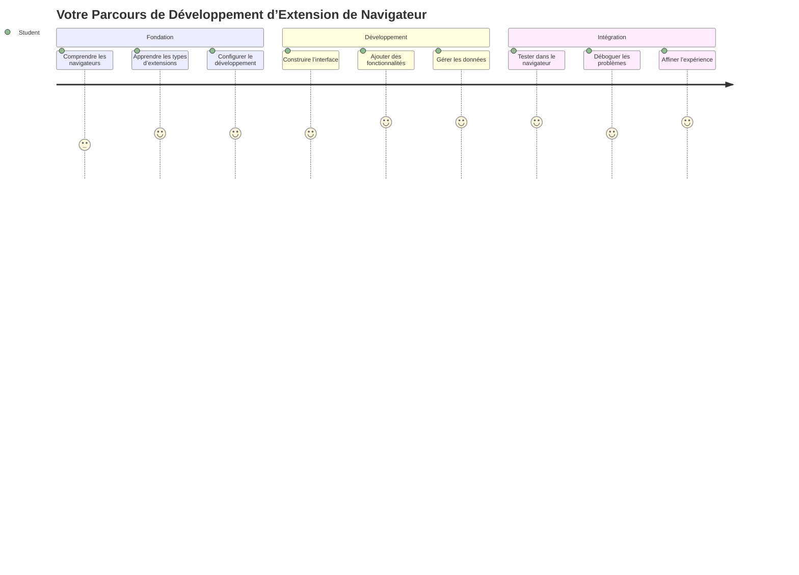
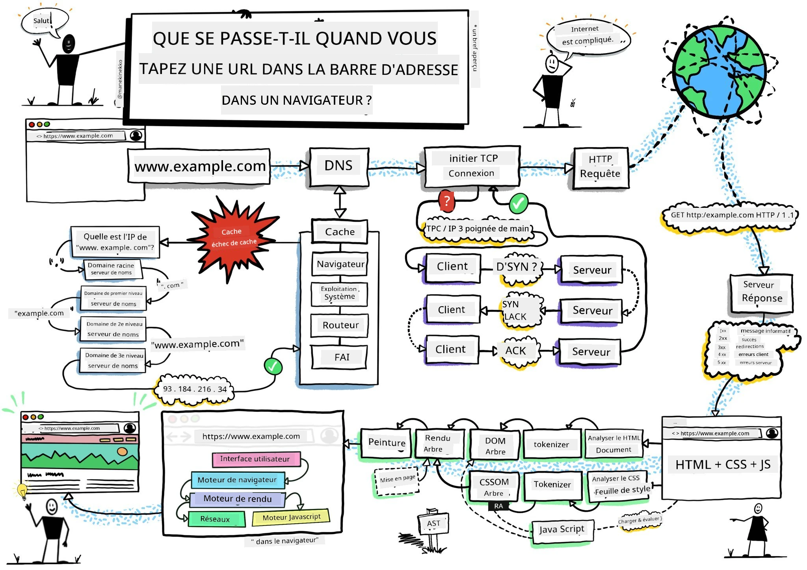
> Sketchnote par [Wassim Chegham](https://dev.to/wassimchegham/ever-wondered-what-happens-when-you-type-in-a-url-in-an-address-bar-in-a-browser-3dob)

## Quiz avant la leçon

[Quiz avant la leçon](https://ff-quizzes.netlify.app/web/quiz/23)

### Introduction

Les extensions de navigateur sont des mini-applications qui améliorent votre expérience de navigation web. À l'image de la vision originale de Tim Berners-Lee pour un web interactif, les extensions étendent les capacités du navigateur au-delà de la simple consultation de documents. Des gestionnaires de mots de passe qui sécurisent vos comptes aux sélecteurs de couleurs qui aident les designers à choisir les teintes parfaites, les extensions résolvent les défis quotidiens de la navigation.

Avant de créer votre première extension, comprenons comment fonctionnent les navigateurs. Tout comme Alexander Graham Bell devait comprendre la transmission du son avant d'inventer le téléphone, connaître les fondamentaux du navigateur vous aidera à créer des extensions qui s'intègrent parfaitement aux systèmes existants.

À la fin de cette leçon, vous comprendrez l'architecture des navigateurs et aurez commencé à construire votre première extension.

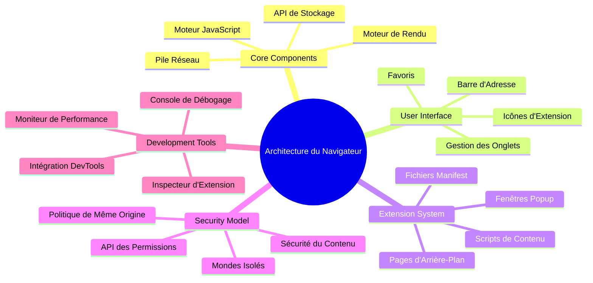
## Comprendre les navigateurs web

Un navigateur web est essentiellement un interprète sophistiqué de documents. Lorsque vous tapez "google.com" dans la barre d'adresse, le navigateur effectue une série complexe d'opérations - il demande du contenu à des serveurs du monde entier, puis analyse et affiche ce code sous forme de pages web interactives que vous voyez.

Ce processus reflète la conception du premier navigateur web, WorldWideWeb, créé par Tim Berners-Lee en 1990 pour rendre les documents hyperliés accessibles à tous.

✅ **Un peu d'histoire** : Le premier navigateur s'appelait 'WorldWideWeb' et a été créé par Sir Timothy Berners-Lee en 1990.

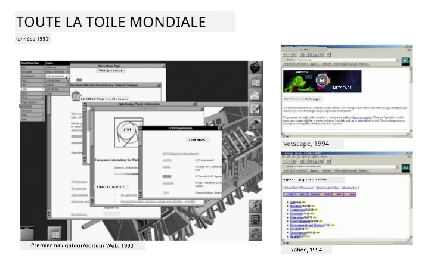
> Quelques navigateurs anciens, via [Karen McGrane](https://www.slideshare.net/KMcGrane/week-4-ixd-history-personal-computing)

### Comment les navigateurs traitent le contenu web

Le processus entre la saisie d'une URL et l'affichage d'une page web implique plusieurs étapes coordonnées qui se déroulent en quelques secondes :

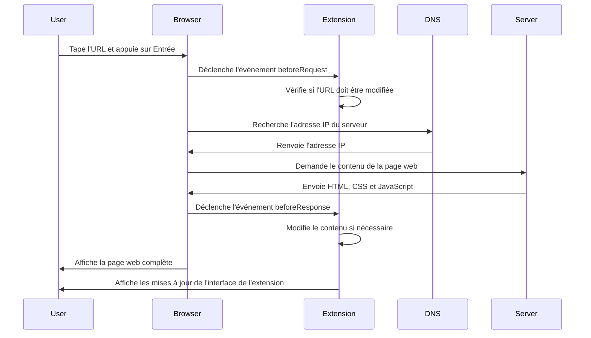
**Voici ce que ce processus accomplit :**
- **Traduit** l'URL lisible par l'humain en une adresse IP du serveur via une requête DNS
- **Établit** une connexion sécurisée avec le serveur web en utilisant les protocoles HTTP ou HTTPS
- **Demande** le contenu spécifique de la page web au serveur
- **Reçoit** le balisage HTML, le style CSS et le code JavaScript du serveur
- **Rend** tout le contenu en une page web interactive que vous voyez

### Fonctionnalités principales du navigateur

Les navigateurs modernes offrent de nombreuses fonctionnalités que les développeurs d'extensions peuvent exploiter :

| Fonctionnalité | But | Opportunités pour les extensions |
|----------------|-----|----------------------------------|
| **Moteur de rendu** | Affiche HTML, CSS et JavaScript | Modification de contenu, injection de styles |
| **Moteur JavaScript** | Exécute le code JavaScript | Scripts personnalisés, interactions API |
| **Stockage local** | Sauvegarde des données localement | Préférences utilisateur, données en cache |
| **Pile réseau** | Gère les requêtes web | Surveillance des requêtes, analyse des données |
| **Modèle de sécurité** | Protège les utilisateurs contre les contenus malveillants | Filtrage de contenu, améliorations de sécurité |

**Comprendre ces fonctionnalités vous aide à :**
- **Identifier** où votre extension peut apporter le plus de valeur
- **Choisir** les bonnes API de navigateur pour la fonctionnalité de votre extension
- **Concevoir** des extensions qui fonctionnent efficacement avec les systèmes du navigateur
- **Assurer** que votre extension respecte les meilleures pratiques de sécurité du navigateur

### Considérations pour le développement multi-navigateurs

Les différents navigateurs implémentent les standards avec de légères variations, semblables à la manière dont différents langages de programmation peuvent traiter un même algorithme différemment. Chrome, Firefox et Safari ont chacun des caractéristiques uniques que les développeurs doivent prendre en compte lors du développement d'extensions.

> 💡 **Astuce pro** : Utilisez [caniuse.com](https://www.caniuse.com) pour vérifier quelles technologies web sont supportées sur les différents navigateurs. Cela est précieux lors de la planification des fonctionnalités de votre extension !

**Points clés pour le développement d'extensions :**
- **Testez** votre extension sur les navigateurs Chrome, Firefox et Edge
- **Adaptez** votre code aux différentes API d'extensions et formats de manifestes des navigateurs
- **Gérez** les différences de performance et limitations
- **Fournissez** des solutions de secours pour les fonctionnalités spécifiques à certains navigateurs qui pourraient ne pas être disponibles

✅ **Insight analytique** : Vous pouvez déterminer quels navigateurs vos utilisateurs préfèrent en installant des outils analytiques dans vos projets web. Ces données vous aident à prioriser les navigateurs à supporter en premier.

## Comprendre les extensions de navigateur

Les extensions de navigateur résolvent des problèmes courants de navigation web en ajoutant des fonctionnalités directement à l'interface du navigateur. Plutôt que de nécessiter des applications séparées ou des flux de travail complexes, les extensions fournissent un accès immédiat à des outils et fonctionnalités.

Ce concept reflète la façon dont les pionniers de l'informatique, comme Douglas Engelbart, envisageaient d'augmenter les capacités humaines grâce à la technologie - les extensions augmentent la fonctionnalité basique de votre navigateur.

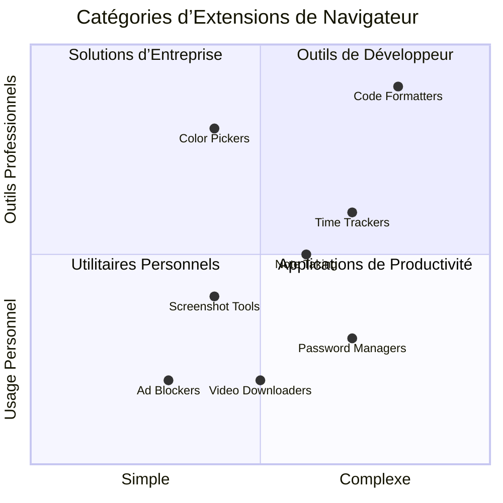
**Catégories populaires d'extensions et leurs bénéfices :**
- **Outils de productivité** : gestionnaires de tâches, applications de prise de notes, et chronomètres qui vous aident à rester organisé
- **Améliorations de sécurité** : gestionnaires de mots de passe, bloqueurs de publicités, et outils de confidentialité qui protègent vos données
- **Outils pour développeurs** : formateurs de code, sélecteurs de couleur, et utilitaires de débogage qui facilitent le développement
- **Amélioration du contenu** : modes lecture, téléchargeurs vidéo, et outils de capture d'écran qui améliorent votre expérience web

✅ **Question de réflexion** : Quelles sont vos extensions de navigateur préférées ? Quelles tâches spécifiques accomplissent-elles, et comment améliorent-elles votre expérience de navigation ?

### 🔄 **Contrôle pédagogique**  
**Compréhension de l'architecture du navigateur** : Avant de passer au développement d'extensions, assurez-vous de pouvoir :  
- ✅ Expliquer comment les navigateurs traitent les requêtes web et affichent le contenu  
- ✅ Identifier les composants principaux de l'architecture du navigateur  
- ✅ Comprendre comment les extensions s'intègrent à la fonctionnalité du navigateur  
- ✅ Reconnaître le modèle de sécurité qui protège les utilisateurs  

**Auto-test rapide** : Pouvez-vous tracer le chemin depuis la saisie d'une URL jusqu'à l'affichage d'une page ?  
1. **Résolution DNS** convertit l'URL en adresse IP  
2. **Requête HTTP** récupère le contenu du serveur  
3. **Analyse** traite le HTML, CSS, et JavaScript  
4. **Rendu** affiche la page web finale  
5. **Extensions** peuvent modifier le contenu à plusieurs étapes  

## Installer et gérer les extensions

Comprendre le processus d'installation d'une extension vous aide à anticiper l'expérience utilisateur lorsque des personnes installent votre extension. Le processus d'installation est standardisé sur les navigateurs modernes, avec de légères variations dans la conception de l'interface.

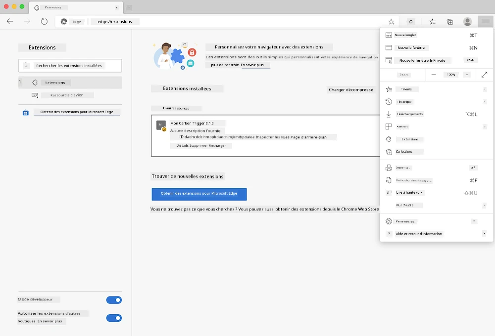

> **Important** : Assurez-vous d'activer le mode développeur et d'autoriser les extensions provenant d'autres magasins lors du test de vos propres extensions.

### Processus d'installation d'extensions en développement

Lorsque vous développez et testez vos propres extensions, suivez ce flux de travail :

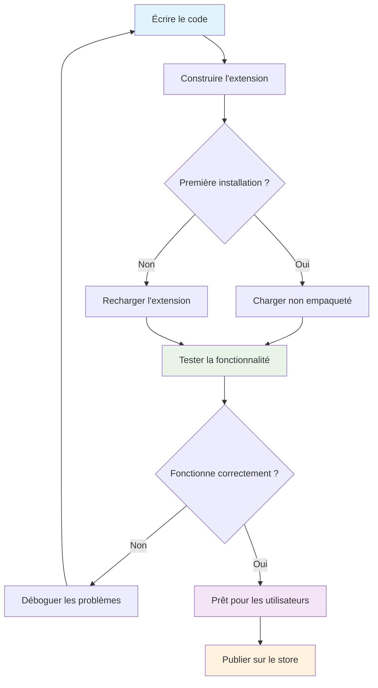
```bash
# Étape 1 : Construisez votre extension
npm run build
```

**Ce que cette commande accomplit :**
- **Compile** votre code source en fichiers prêts pour le navigateur
- **Regroupe** les modules JavaScript en paquets optimisés
- **Génère** les fichiers finaux de l'extension dans le dossier `/dist`
- **Prépare** votre extension pour l'installation et le test

**Étape 2 : Accédez aux extensions du navigateur**
1. **Ouvrez** la page de gestion des extensions de votre navigateur
2. **Cliquez** sur le bouton "Paramètres et plus" (l'icône `...`) en haut à droite
3. **Sélectionnez** "Extensions" dans le menu déroulant

**Étape 3 : Chargez votre extension**
- **Pour une nouvelle installation** : choisissez `charger l’extension non empaquetée` et sélectionnez votre dossier `/dist`
- **Pour les mises à jour** : cliquez sur `recharger` à côté de votre extension déjà installée
- **Pour les tests** : activez le "Mode développeur" pour accéder à des fonctionnalités supplémentaires de débogage

### Installation d'extensions en production

> ✅ **Note** : Ces instructions pour le développement s'appliquent spécifiquement aux extensions que vous créez vous-même. Pour installer des extensions publiées, rendez-vous dans les magasins officiels d’extensions de navigateur comme le [Microsoft Edge Add-ons store](https://microsoftedge.microsoft.com/addons/Microsoft-Edge-Extensions-Home).

**Comprendre la différence :**
- **Installations en développement** vous permettent de tester des extensions non publiées durant le développement
- **Installations en magasin** offrent des extensions validées, publiées et mises à jour automatiquement
- **Installation par sideload** permet d’installer des extensions hors des magasins officiels (requiert le mode développeur)

## Construire votre extension Empreinte Carbone

Nous allons créer une extension de navigateur qui affiche l'empreinte carbone de la consommation énergétique de votre région. Ce projet illustre les concepts essentiels du développement d'extensions tout en créant un outil pratique pour la sensibilisation environnementale.

Cette approche suit le principe de "l'apprentissage par la pratique" qui s’est avéré efficace depuis les théories éducatives de John Dewey - combinant compétences techniques avec des applications concrètes et significatives.

### Exigences du projet

Avant de commencer le développement, rassemblons les ressources nécessaires et les dépendances :

**Accès API requis :**
- **[Clé API CO2 Signal](https://www.co2signal.com/)** : Entrez votre adresse email pour recevoir votre clé API gratuite
- **[Code région](http://api.electricitymap.org/v3/zones)** : Trouvez le code de votre région grâce à [Electricity Map](https://www.electricitymap.org/map) (par exemple, Boston utilise 'US-NEISO')

**Outils de développement :**
- **[Node.js et NPM](https://www.npmjs.com)** : Outil de gestion de paquets pour installer les dépendances du projet
- **[Code de départ](../../../../5-browser-extension/start)** : Téléchargez le dossier `start` pour commencer le développement

✅ **En savoir plus** : Améliorez vos compétences en gestion de paquets avec ce [module Learn complet](https://docs.microsoft.com/learn/modules/create-nodejs-project-dependencies/?WT.mc_id=academic-77807-sagibbon)

### Comprendre la structure du projet

Comprendre la structure du projet aide à organiser le travail de développement efficacement. Comme la Bibliothèque d'Alexandrie était organisée pour un accès facile au savoir, une base de code bien structurée rend le développement plus efficace :

```
project-root/
├── dist/                    # Built extension files
│   ├── manifest.json        # Extension configuration
│   ├── index.html           # User interface markup
│   ├── background.js        # Background script functionality
│   └── main.js              # Compiled JavaScript bundle
├── src/                     # Source development files
│   └── index.js             # Your main JavaScript code
├── package.json             # Project dependencies and scripts
└── webpack.config.js        # Build configuration
```

**Ce que chaque fichier accomplit :**
- **`manifest.json`** : **Définit** les métadonnées, permissions et points d'entrée de l'extension
- **`index.html`** : **Crée** l'interface utilisateur visible quand les utilisateurs cliquent sur votre extension
- **`background.js`** : **Gère** les tâches en arrière-plan et les écouteurs d'événements du navigateur
- **`main.js`** : **Contient** le JavaScript final regroupé après le processus de build
- **`src/index.js`** : **Contient** le code principal de développement qui sera compilé en `main.js`

> 💡 **Conseil d'organisation** : Stockez votre clé API et le code région dans une note sécurisée pour y accéder facilement pendant le développement. Vous aurez besoin de ces valeurs pour tester la fonctionnalité de l'extension.

✅ **Note de sécurité** : Ne jamais commettre de clés API ou d’identifiants sensibles dans votre dépôt de code. Nous vous montrerons comment les gérer en toute sécurité dans les étapes suivantes.

## Création de l'interface de l'extension

Nous allons maintenant construire les composants de l'interface utilisateur. L'extension utilise une approche à deux écrans : un écran de configuration pour la configuration initiale et un écran de résultats pour l'affichage des données.

Cela suit le principe de divulgation progressive utilisé dans la conception d'interface depuis les débuts de l'informatique - révéler les informations et options dans une séquence logique pour éviter de surcharger les utilisateurs.

### Vue d'ensemble des vues de l'extension

**Vue de configuration** - Configuration utilisateur initiale :  
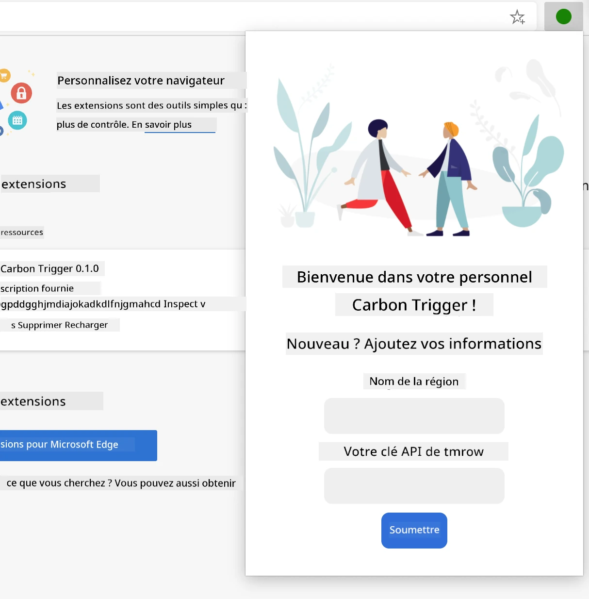

**Vue des résultats** - Affichage des données d'empreinte carbone :  
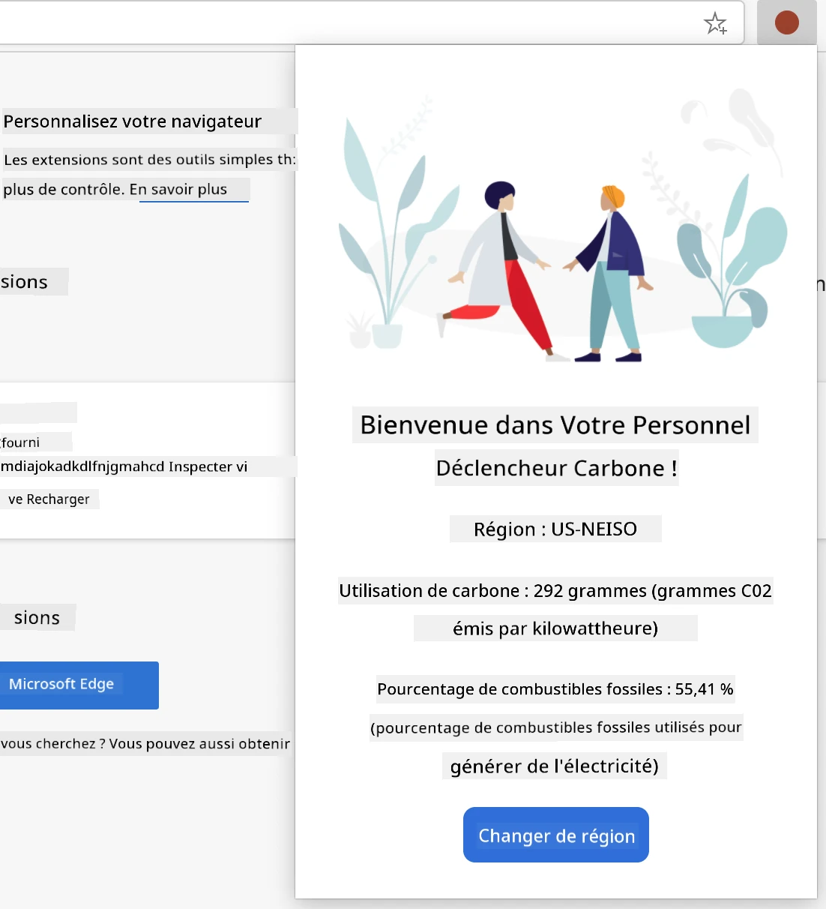

### Création du formulaire de configuration

Le formulaire de configuration recueille les données de configuration utilisateur lors de la première utilisation. Une fois configurées, ces informations sont conservées dans le stockage du navigateur pour les sessions futures.

Dans le fichier `/dist/index.html`, ajoutez cette structure de formulaire :

```html
<form class="form-data" autocomplete="on">
    <div>
        <h2>New? Add your Information</h2>
    </div>
    <div>
        <label for="region">Region Name</label>
        <input type="text" id="region" required class="region-name" />
    </div>
    <div>
        <label for="api">Your API Key from tmrow</label>
        <input type="text" id="api" required class="api-key" />
    </div>
    <button class="search-btn">Submit</button>
</form>
```

**Ce que ce formulaire accomplit :**
- **Crée** une structure de formulaire sémantique avec des labels appropriés et des associations d’éléments
- **Active** l'autocomplétion du navigateur pour une meilleure expérience utilisateur
- **Exige** que les deux champs soient remplis avant soumission grâce à l'attribut `required`
- **Organise** les champs avec des classes descriptives pour faciliter le style et le ciblage JavaScript
- **Fournit** des instructions claires pour les utilisateurs qui configurent l'extension pour la première fois

### Création de l’affichage des résultats

Ensuite, créez la zone de résultats qui affichera les données d'empreinte carbone. Ajoutez ce HTML sous le formulaire :

```html
<div class="result">
    <div class="loading">loading...</div>
    <div class="errors"></div>
    <div class="data"></div>
    <div class="result-container">
        <p><strong>Region: </strong><span class="my-region"></span></p>
        <p><strong>Carbon Usage: </strong><span class="carbon-usage"></span></p>
        <p><strong>Fossil Fuel Percentage: </strong><span class="fossil-fuel"></span></p>
    </div>
    <button class="clear-btn">Change region</button>
</div>
```

**Ce que cette structure fournit :**
- **`loading`** : **Affiche** un message de chargement pendant la récupération des données API
- **`errors`** : **Montre** les messages d'erreur si les appels API échouent ou si les données sont invalides
- **`data`** : **Contient** les données brutes pour le débogage durant le développement
- **`result-container`** : **Présente** les informations formatées de l’empreinte carbone aux utilisateurs
- **`clear-btn`** : **Permet** aux utilisateurs de changer de région et reconfigurer l’extension

### Mise en place du processus de build

Installons maintenant les dépendances du projet et testons le processus de build :

```bash
npm install
```

**Ce que ce processus d’installation accomplit :**
- **Télécharge** Webpack et autres dépendances de développement spécifiées dans `package.json`
- **Configure** la chaîne de compilation pour compiler le JavaScript moderne
- **Prépare** l’environnement de développement pour la construction et le test de l’extension
- **Active** le regroupement, l’optimisation et la compatibilité multi-navigateurs du code

> 💡 **Insight sur le build** : Webpack regroupe votre code source de `/src/index.js` dans `/dist/main.js`. Ce processus optimise votre code pour la production et assure la compatibilité avec les navigateurs.

### Tester vos progrès

À ce stade, vous pouvez tester votre extension :
1. **Exécutez** la commande de build pour compiler votre code  
2. **Chargez** l'extension dans votre navigateur en utilisant le mode développeur  
3. **Vérifiez** que le formulaire s'affiche correctement et a un aspect professionnel  
4. **Contrôlez** que tous les éléments du formulaire sont correctement alignés et fonctionnels  

**Ce que vous avez accompli :**  
- **Construit** la structure HTML de base pour votre extension  
- **Créé** les interfaces de configuration et de résultats avec un balisage sémantique approprié  
- **Mis en place** un workflow de développement moderne utilisant des outils standards de l'industrie  
- **Préparé** les bases pour ajouter des fonctionnalités JavaScript interactives  

### 🔄 **Point Pédagogique**  
**Progrès dans le développement de l'extension** : Vérifiez votre compréhension avant de continuer :  
- ✅ Pouvez-vous expliquer le rôle de chaque fichier dans la structure du projet ?  
- ✅ Comprenez-vous comment le processus de build transforme votre code source ?  
- ✅ Pourquoi séparons-nous la configuration et les résultats dans différentes sections de l'interface utilisateur ?  
- ✅ Comment la structure du formulaire soutient-elle à la fois l’utilisabilité et l’accessibilité ?  

**Compréhension du workflow de développement** : Vous devriez maintenant être capable de :  
1. **Modifier** le HTML et le CSS pour l'interface de votre extension  
2. **Exécuter** la commande de build pour compiler vos changements  
3. **Recharger** l'extension dans votre navigateur pour tester les mises à jour  
4. **Déboguer** les problèmes en utilisant les outils de développement du navigateur  

Vous avez terminé la première phase du développement d’une extension de navigateur. Comme les frères Wright ont d'abord dû comprendre l'aérodynamique avant de réussir le vol, comprendre ces concepts fondamentaux vous prépare à construire des fonctionnalités interactives plus complexes dans la prochaine leçon.  

## GitHub Copilot Agent Challenge 🚀  

Utilisez le mode Agent pour relever le défi suivant :  

**Description :** Améliorez l'extension de navigateur en ajoutant la validation de formulaire et des retours utilisateur pour améliorer l'expérience lors de la saisie de clés API et de codes régionaux.  

**Consigne :** Créez des fonctions de validation JavaScript qui vérifient si le champ de clé API contient au moins 20 caractères et si le code de région suit le format correct (comme 'US-NEISO'). Ajoutez un retour visuel en changeant la bordure des champs en vert pour les entrées valides et en rouge pour celles invalides. Ajoutez aussi un bouton bascule pour afficher/masquer la clé API pour des raisons de sécurité.  

En savoir plus sur le [mode agent](https://code.visualstudio.com/blogs/2025/02/24/introducing-copilot-agent-mode) ici.  

## 🚀 Défi  

Jetez un œil à un magasin d’extensions de navigateur et installez-en une dans votre navigateur. Vous pouvez examiner ses fichiers d'une manière intéressante. Que découvrez-vous ?  

## Quiz Post-Leçon  

[Quiz post-leçon](https://ff-quizzes.netlify.app/web/quiz/24)  

## Revue & Auto-apprentissage  

Dans cette leçon, vous avez appris un peu sur l'histoire du navigateur web ; profitez-en pour découvrir comment les inventeurs du World Wide Web ont envisagé son usage en lisant plus sur son histoire. Quelques sites utiles incluent :  

[L'Histoire des Navigateurs Web](https://www.mozilla.org/firefox/browsers/browser-history/)  

[Histoire du Web](https://webfoundation.org/about/vision/history-of-the-web/)  

[Une interview de Tim Berners-Lee](https://www.theguardian.com/technology/2019/mar/12/tim-berners-lee-on-30-years-of-the-web-if-we-dream-a-little-we-can-get-the-web-we-want)  

### ⚡ **Ce que vous pouvez faire dans les 5 prochaines minutes**  
- [ ] Ouvrir la page des extensions Chrome/Edge (chrome://extensions) et explorer celles que vous avez installées  
- [ ] Regarder l’onglet Réseau des DevTools de votre navigateur lors du chargement d’une page web  
- [ ] Essayer de visualiser le code source d’une page (Ctrl+U) pour voir la structure HTML  
- [ ] Inspecter n’importe quel élément d’une page web et modifier son CSS dans DevTools  

### 🎯 **Ce que vous pouvez accomplir cette heure-ci**  
- [ ] Terminer le quiz post-leçon et comprendre les fondamentaux du navigateur  
- [ ] Créer un fichier manifest.json basique pour une extension de navigateur  
- [ ] Construire une extension simple « Hello World » qui affiche un popup  
- [ ] Tester le chargement de votre extension en mode développeur  
- [ ] Explorer la documentation des extensions pour votre navigateur cible  

### 📅 **Votre parcours d’une semaine pour l’extension**  
- [ ] Compléter une extension fonctionnelle et utile  
- [ ] Découvrir les scripts de contenu, scripts en arrière-plan, et interactions popup  
- [ ] Maîtriser les API de navigateur comme le stockage, les onglets, et la messagerie  
- [ ] Concevoir des interfaces conviviales pour votre extension  
- [ ] Tester votre extension sur différents sites et scénarios  
- [ ] Publier votre extension sur la boutique d'extensions du navigateur  

### 🌟 **Votre développement navigateur sur un mois**  
- [ ] Créer plusieurs extensions répondant à différents besoins utilisateurs  
- [ ] Apprendre les API avancées du navigateur et les meilleures pratiques de sécurité  
- [ ] Contribuer à des projets open source d’extensions de navigateur  
- [ ] Maîtriser la compatibilité multi-navigateurs et l’amélioration progressive  
- [ ] Créer des outils et modèles de développement d’extensions pour d'autres  
- [ ] Devenir un expert des extensions browser aidant d’autres développeurs  

## 🎯 Votre calendrier de maîtrise des extensions de navigateur  

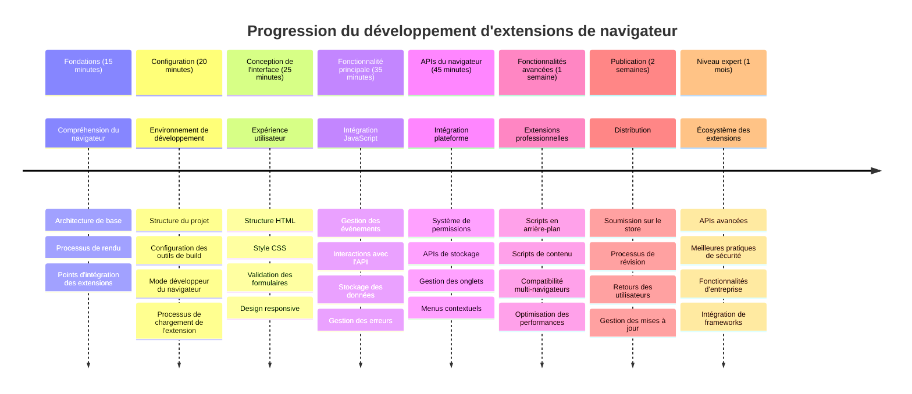
### 🛠️ Résumé de votre boîte à outils de développement d’extension  

Après avoir terminé cette leçon, vous disposez maintenant de :  
- **Connaissances en architecture de navigateur** : Compréhension des moteurs de rendu, des modèles de sécurité et de l’intégration des extensions  
- **Environnement de développement** : Chaîne d’outils moderne avec Webpack, NPM et capacités de débogage  
- **Base UI/UX** : Structure HTML sémantique avec modèles de divulgation progressive  
- **Sensibilisation à la sécurité** : Compréhension des permissions navigateur et des bonnes pratiques de développement sécurisées  
- **Concepts multi-navigateurs** : Connaissance des considérations de compatibilité et des approches de test  
- **Intégration d’API** : Fondations pour travailler avec des sources de données externes  
- **Workflow professionnel** : Procédures de développement et de test standards de l’industrie  

**Applications réelles** : Ces compétences s’appliquent directement à :  
- **Développement web** : Applications monopage et applications web progressives  
- **Applications de bureau** : Electron et logiciels desktop basés sur le web  
- **Développement mobile** : Apps hybrides et solutions mobiles web  
- **Outils d’entreprise** : Applications de productivité internes et automatisation des workflows  
- **Open Source** : Contribution à des projets d’extensions de navigateur et aux standards web  

**Niveau supérieur** : Vous êtes prêt à ajouter des fonctionnalités interactives, à travailler avec les API navigateur, et à créer des extensions qui résolvent de vrais problèmes utilisateurs !  

## Devoir  

[Re-stylisez votre extension](assignment.md)

---

<!-- CO-OP TRANSLATOR DISCLAIMER START -->
**Avertissement** :  
Ce document a été traduit à l’aide du service de traduction automatique [Co-op Translator](https://github.com/Azure/co-op-translator). Bien que nous fassions tout notre possible pour garantir l’exactitude, veuillez noter que les traductions automatiques peuvent contenir des erreurs ou des inexactitudes. Le document original dans sa langue d’origine doit être considéré comme la source faisant foi. Pour les informations critiques, une traduction professionnelle réalisée par un humain est recommandée. Nous déclinons toute responsabilité en cas de malentendus ou de mauvaises interprétations résultant de l’utilisation de cette traduction.
<!-- CO-OP TRANSLATOR DISCLAIMER END -->