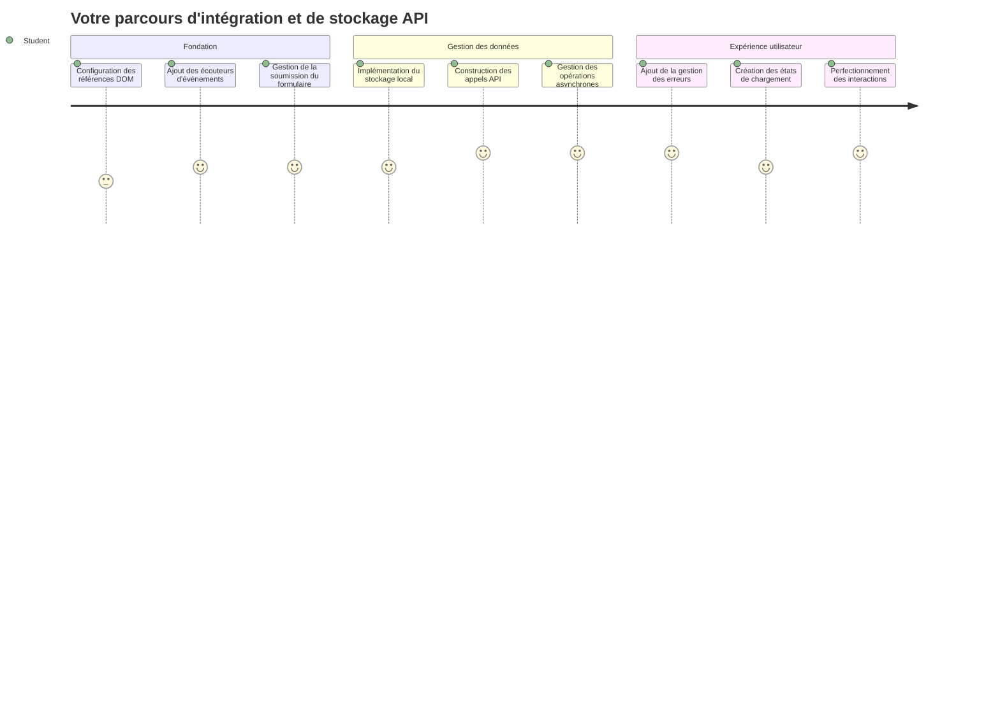
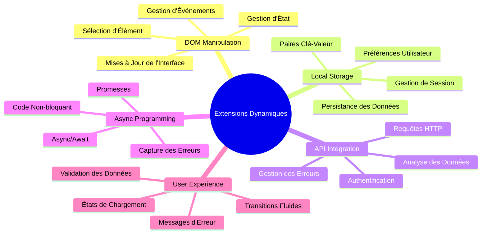
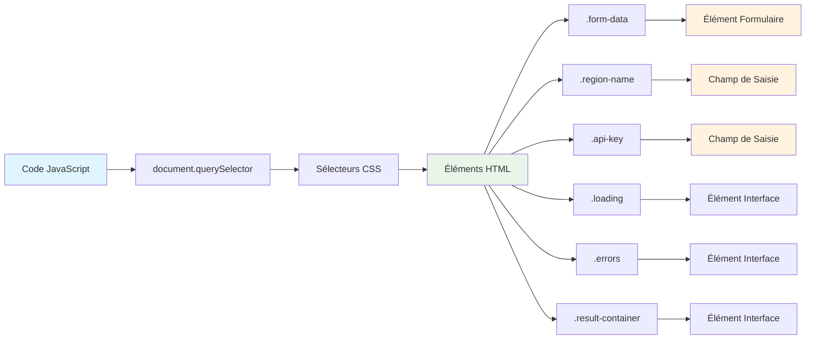
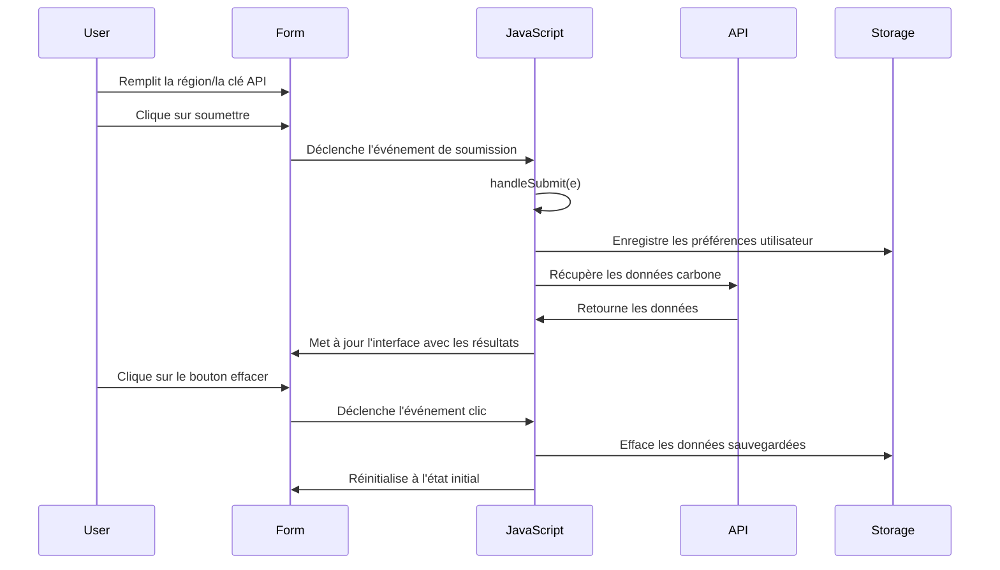
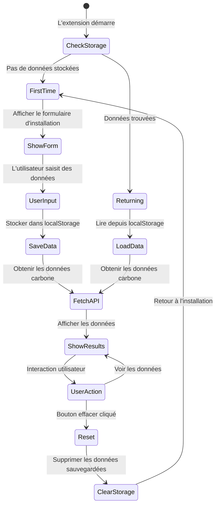
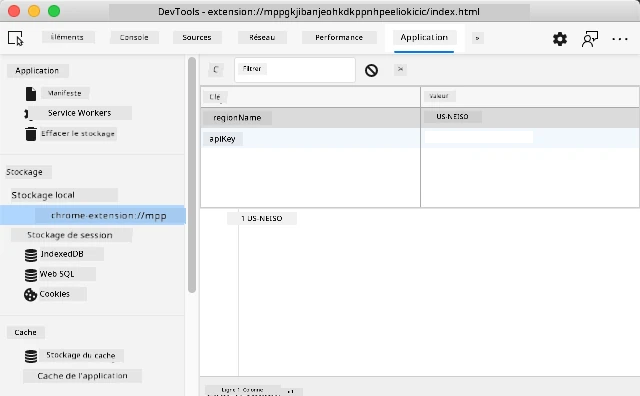
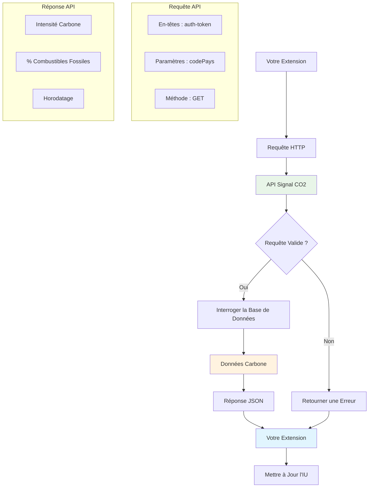
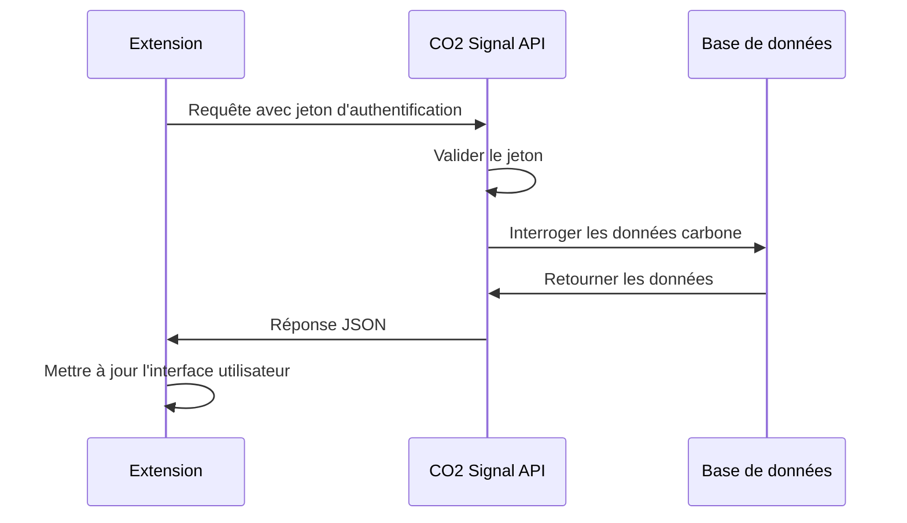
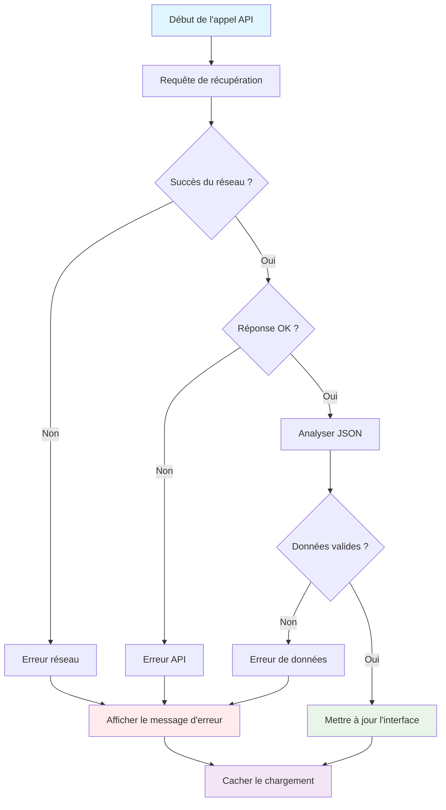
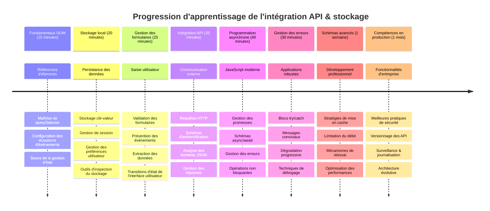

# Projet d'extension de navigateur Partie 2 : Appeler une API, utiliser le stockage local


## Quiz avant la leçon

[Quiz avant la leçon](https://ff-quizzes.netlify.app/web/quiz/25)

## Introduction

Vous vous souvenez de cette extension de navigateur que vous avez commencé à construire ? Pour l'instant, vous avez un formulaire qui a l'air sympa, mais il est essentiellement statique. Aujourd'hui, nous allons lui donner vie en le connectant à de vraies données et en lui donnant une mémoire.

Pensez aux ordinateurs de contrôle de mission Apollo - ils n'affichaient pas simplement des informations fixes. Ils communiquaient constamment avec les engins spatiaux, se mettaient à jour avec les données télémétriques, et mémorisaient les paramètres critiques de la mission. C'est ce genre de comportement dynamique que nous allons construire aujourd'hui. Votre extension ira sur Internet, récupérera de vraies données environnementales et se souviendra de vos réglages pour la prochaine fois.

L'intégration d'API peut sembler complexe, mais c'est en réalité apprendre à votre code comment communiquer avec d'autres services. Que vous récupériez des données météo, des flux de réseaux sociaux, ou des informations sur l'empreinte carbone comme nous le ferons aujourd'hui, il s'agit d'établir ces connexions numériques. Nous verrons aussi comment les navigateurs peuvent conserver des informations - de la même manière que les bibliothèques utilisaient des catalogues de fiches pour se souvenir où se trouvaient les livres.

À la fin de cette leçon, vous aurez une extension de navigateur qui récupère de vraies données, stocke les préférences utilisateur, et offre une expérience fluide. Commençons !


✅ Suivez les segments numérotés dans les fichiers appropriés pour savoir où placer votre code

## Configurer les éléments à manipuler dans l’extension

Avant que votre JavaScript puisse manipuler l’interface, il doit référencer des éléments HTML spécifiques. C’est comme si un télescope devait être pointé sur certaines étoiles - avant que Galilée puisse étudier les lunes de Jupiter, il devait localiser et se concentrer sur Jupiter lui-même.

Dans votre fichier `index.js`, nous allons créer des variables `const` qui capturent les références à chaque élément important du formulaire. C’est similaire à la manière dont les scientifiques étiquettent leur équipement - plutôt que de chercher à travers tout le laboratoire à chaque fois, ils peuvent accéder directement à ce dont ils ont besoin.


```javascript
// champs de formulaire
const form = document.querySelector('.form-data');
const region = document.querySelector('.region-name');
const apiKey = document.querySelector('.api-key');

// résultats
const errors = document.querySelector('.errors');
const loading = document.querySelector('.loading');
const results = document.querySelector('.result-container');
const usage = document.querySelector('.carbon-usage');
const fossilfuel = document.querySelector('.fossil-fuel');
const myregion = document.querySelector('.my-region');
const clearBtn = document.querySelector('.clear-btn');
```

**Voici ce que fait ce code :**
- **Capture** les éléments du formulaire avec `document.querySelector()` utilisant des sélecteurs CSS de classes
- **Crée** des références aux champs de saisie pour le nom de la région et la clé API
- **Établit** des connexions aux éléments d’affichage des résultats pour les données d’utilisation carbone
- **Configure** l’accès à des éléments UI comme les indicateurs de chargement et les messages d’erreur
- **Stocke** chaque référence d’élément dans une variable `const` pour réutilisation facile dans tout le code

## Ajouter des écouteurs d’événements

Maintenant, nous allons faire en sorte que votre extension réagisse aux actions de l’utilisateur. Les écouteurs d’événements sont la manière dont votre code surveille les interactions utilisateur. Pensez-y comme les opérateurs dans les premiers centraux téléphoniques - ils écoutaient les appels entrants et connectaient les bons circuits quand quelqu’un voulait établir une communication.


```javascript
form.addEventListener('submit', (e) => handleSubmit(e));
clearBtn.addEventListener('click', (e) => reset(e));
init();
```

**Comprendre ces concepts :**
- **Attache** un écouteur de soumission au formulaire qui se déclenche quand l’utilisateur appuie sur Entrée ou clique sur soumettre
- **Connecte** un écouteur de clic au bouton de réinitialisation pour remettre le formulaire à zéro
- **Passe** l’objet événement `(e)` aux fonctions gestionnaires pour un contrôle supplémentaire
- **Appelle** la fonction `init()` immédiatement pour configurer l’état initial de votre extension

✅ Remarquez la syntaxe abrégée des fonctions fléchées utilisée ici. Cette approche moderne de JavaScript est plus propre que les expressions de fonctions traditionnelles, mais les deux fonctionnent aussi bien !

### 🔄 **Bilan pédagogique**
**Compréhension de la gestion des événements** : Avant de passer à l’initialisation, assurez-vous de pouvoir :
- ✅ Expliquer comment `addEventListener` relie les actions utilisateur aux fonctions JavaScript
- ✅ Comprendre pourquoi on passe l’objet événement `(e)` aux fonctions gestionnaires
- ✅ Reconnaître la différence entre les événements `submit` et `click`
- ✅ Décrire quand la fonction `init()` s’exécute et pourquoi

**Test rapide** : Que se passerait-il si vous oubliiez `e.preventDefault()` lors de la soumission d’un formulaire ?
*Réponse : La page se rechargerait, perdant tout l’état JavaScript et interrompant l’expérience utilisateur*

## Construire les fonctions d’initialisation et de réinitialisation

Créons la logique d’initialisation pour votre extension. La fonction `init()` est comme le système de navigation d’un navire vérifiant ses instruments - elle détermine l’état actuel et ajuste l’interface en conséquence. Elle vérifie si quelqu’un a déjà utilisé votre extension et charge ses réglages précédents.

La fonction `reset()` offre aux utilisateurs un nouveau départ - similaire à la façon dont les scientifiques remettent à zéro leurs instruments entre les expériences pour garantir des données propres.

```javascript
function init() {
	// Vérifiez si l'utilisateur a déjà enregistré les identifiants API
	const storedApiKey = localStorage.getItem('apiKey');
	const storedRegion = localStorage.getItem('regionName');

	// Définir l'icône de l'extension sur vert générique (espace réservé pour une leçon future)
	// TODO : Implémenter la mise à jour de l'icône dans la prochaine leçon

	if (storedApiKey === null || storedRegion === null) {
		// Utilisateur pour la première fois : afficher le formulaire de configuration
		form.style.display = 'block';
		results.style.display = 'none';
		loading.style.display = 'none';
		clearBtn.style.display = 'none';
		errors.textContent = '';
	} else {
		// Utilisateur de retour : charger automatiquement ses données enregistrées
		displayCarbonUsage(storedApiKey, storedRegion);
		results.style.display = 'none';
		form.style.display = 'none';
		clearBtn.style.display = 'block';
	}
}

function reset(e) {
	e.preventDefault();
	// Effacer la région stockée pour permettre à l'utilisateur de choisir un nouvel emplacement
	localStorage.removeItem('regionName');
	// Redémarrer le processus d'initialisation
	init();
}
```

**Détaillons ce qui se passe ici :**
- **Récupère** la clé API et la région stockées dans le stockage local du navigateur
- **Vérifie** s’il s’agit d’un utilisateur pour la première fois (pas de données stockées) ou d’un utilisateur de retour
- **Affiche** le formulaire de configuration pour les nouveaux utilisateurs et masque les autres éléments d’interface
- **Charge** automatiquement les données sauvegardées pour les utilisateurs de retour et affiche l’option de réinitialisation
- **Gère** l’état de l’interface utilisateur selon les données disponibles

**Concepts clés sur le stockage local :**
- **Persiste** les données entre les sessions du navigateur (contrairement au stockage de session)
- **Stocke** les données sous forme de paires clé-valeur avec `getItem()` et `setItem()`
- **Retourne** `null` quand aucune donnée n’existe pour une clé donnée
- **Offre** un moyen simple de se souvenir des préférences et réglages utilisateur

> 💡 **Comprendre le stockage dans le navigateur** : [LocalStorage](https://developer.mozilla.org/docs/Web/API/Window/localStorage) est comme donner une mémoire persistante à votre extension. Pensez à la manière dont l’ancienne Bibliothèque d’Alexandrie conservait les rouleaux - l’information restait disponible même quand les chercheurs partaient et revenaient.
>
> **Caractéristiques clés :**
> - **Persiste** les données même après la fermeture du navigateur
> - **Survit** aux redémarrages de l’ordinateur et aux plantages du navigateur
> - **Offre** un espace de stockage important pour les préférences utilisateur
> - **Permet** un accès instantané sans latence réseau

> **Note importante** : Votre extension de navigateur possède son propre stockage local isolé, séparé des pages web classiques. Cela offre sécurité et empêche les conflits avec d’autres sites.

Vous pouvez consulter vos données stockées en ouvrant les outils développeur du navigateur (F12), en naviguant vers l’onglet **Application**, puis en développant la section **Local Storage**.




> ⚠️ **Considération de sécurité** : Dans les applications en production, stocker les clés API dans LocalStorage présente des risques de sécurité puisque JavaScript peut accéder à ces données. Pour l’apprentissage, cette approche fonctionne bien, mais les applications réelles doivent utiliser un stockage sécurisé côté serveur pour les informations sensibles.

## Gérer la soumission du formulaire

Maintenant, nous allons gérer ce qui se passe lorsqu’un utilisateur soumet votre formulaire. Par défaut, les navigateurs rechargent la page lors d’une soumission de formulaire, mais nous allons intercepter ce comportement pour offrir une expérience plus fluide.

Cette approche reflète la façon dont le contrôle de mission gère les communications avec les engins spatiaux - au lieu de réinitialiser tout le système pour chaque transmission, ils maintiennent un fonctionnement continu tout en traitant les nouvelles informations.

Créez une fonction qui capture l’événement de soumission du formulaire et extrait la saisie de l’utilisateur :

```javascript
function handleSubmit(e) {
	e.preventDefault();
	setUpUser(apiKey.value, region.value);
}
```

**Dans ce code, nous avons :**
- **Empêché** le comportement par défaut de soumission qui actualiserait la page
- **Extrait** les valeurs saisies par l’utilisateur dans les champs clé API et région
- **Passé** les données du formulaire à la fonction `setUpUser()` pour traitement
- **Maintenu** un comportement d’application monopage en évitant les rechargements de page

✅ N’oubliez pas que vos champs du formulaire HTML incluent l’attribut `required`, donc le navigateur valide automatiquement que l’utilisateur a fourni la clé API et la région avant d’exécuter cette fonction.

## Configurer les préférences utilisateur

La fonction `setUpUser` est responsable de sauvegarder les identifiants de l’utilisateur et d’initier le premier appel API. Cela crée une transition fluide entre la configuration et l’affichage des résultats.

```javascript
function setUpUser(apiKey, regionName) {
	// Enregistrer les identifiants utilisateur pour les sessions futures
	localStorage.setItem('apiKey', apiKey);
	localStorage.setItem('regionName', regionName);
	
	// Mettre à jour l'interface utilisateur pour afficher l'état de chargement
	loading.style.display = 'block';
	errors.textContent = '';
	clearBtn.style.display = 'block';
	
	// Récupérer les données de consommation de carbone avec les identifiants de l'utilisateur
	displayCarbonUsage(apiKey, regionName);
}
```

**Étape par étape, voici ce qui se passe :**
- **Sauve** la clé API et le nom de la région dans le stockage local pour usage futur
- **Affiche** un indicateur de chargement pour informer l’utilisateur que les données sont en cours de récupération
- **Efface** les messages d’erreur précédents de l’écran
- **Rend visible** le bouton de réinitialisation pour que l’utilisateur puisse reset plus tard
- **Lance** l’appel à l’API pour récupérer les vraies données d’utilisation carbone

Cette fonction crée une expérience utilisateur fluide en gérant à la fois la persistance des données et la mise à jour de l’interface utilisateur en une seule action coordonnée.

## Afficher les données d’usage de carbone

Nous allons maintenant connecter votre extension à des sources de données externes via des API. Cela transforme votre extension d’un outil autonome en quelque chose qui peut accéder à des informations en temps réel venant de partout sur Internet.

**Comprendre les API**

Les [API](https://www.webopedia.com/TERM/A/API.html) sont la manière dont différentes applications communiquent entre elles. Pensez à elles comme au télégraphe qui reliait des villes éloignées au 19ème siècle - les opérateurs envoyaient des requêtes aux stations distantes et recevaient des réponses avec l’information demandée. Chaque fois que vous consultez un réseau social, posez une question à un assistant vocal, ou utilisez une application de livraison, les API facilitent ces échanges de données.


**Concepts clés sur les API REST :**
- **REST** signifie « Representational State Transfer »
- **Utilise** les méthodes HTTP standard (GET, POST, PUT, DELETE) pour interagir avec les données
- **Retourne** des données dans des formats prévisibles, typiquement JSON
- **Fournit** des points d’accès URL cohérents pour différents types de requêtes

✅ L’[API CO2 Signal](https://www.co2signal.com/) que nous utiliserons fournit des données en temps réel sur l’intensité carbone des réseaux électriques dans le monde. Cela aide les utilisateurs à comprendre l’impact environnemental de leur consommation d’électricité !

> 💡 **Comprendre JavaScript asynchrone** : Le mot-clé [`async`](https://developer.mozilla.org/docs/Web/JavaScript/Reference/Statements/async_function) permet à votre code de gérer plusieurs opérations en parallèle. Quand vous demandez des données à un serveur, vous ne voulez pas que toute votre extension se fige - ce serait comme si le contrôle aérien arrêtait toutes ses opérations en attendant la réponse d’un avion.
>
> **Atouts principaux :**
> - **Maintient** la réactivité de l’extension pendant le chargement des données
> - **Permet** à d’autres codes de s’exécuter pendant les requêtes réseau
> - **Améliore** la lisibilité du code par rapport aux schémas traditionnels de callbacks
> - **Autorise** une gestion élégante des erreurs réseau

Voici une courte vidéo sur `async` :

[](https://youtube.com/watch?v=YwmlRkrxvkk "Async et Await pour gérer les promesses")

> 🎥 Cliquez sur l’image ci-dessus pour une vidéo sur async/await.

### 🔄 **Bilan pédagogique**
**Compréhension de la programmation asynchrone** : Avant de plonger dans la fonction API, vérifiez que vous comprenez :
- ✅ Pourquoi nous utilisons `async/await` au lieu de bloquer toute l’extension
- ✅ Comment les blocs `try/catch` gèrent élégamment les erreurs réseau
- ✅ La différence entre opérations synchrones et asynchrones
- ✅ Pourquoi les appels API peuvent échouer et comment gérer ces échecs

**Lien avec le monde réel** : Considérez ces exemples asynchrones du quotidien :
- **Commander un repas** : Vous ne restez pas à attendre dans la cuisine - vous prenez votre reçu et continuez d’autres activités
- **Envoyer des emails** : Votre application mail ne se bloque pas pendant l’envoi - vous pouvez en composer d’autres
- **Charger des pages web** : Les images se chargent progressivement pendant que vous pouvez déjà lire le texte

**Flux d’authentification API :**

Créez la fonction pour récupérer et afficher les données d’utilisation carbone :

```javascript
// Approche moderne de l'API fetch (aucune dépendance externe nécessaire)
async function displayCarbonUsage(apiKey, region) {
	try {
		// Récupérer les données d'intensité carbone depuis l'API CO2 Signal
		const response = await fetch('https://api.co2signal.com/v1/latest', {
			method: 'GET',
			headers: {
				'auth-token': apiKey,
				'Content-Type': 'application/json'
			},
			// Ajouter des paramètres de requête pour la région spécifique
			...new URLSearchParams({ countryCode: region }) && {
				url: `https://api.co2signal.com/v1/latest?countryCode=${region}`
			}
		});

		// Vérifier si la requête API a réussi
		if (!response.ok) {
			throw new Error(`API request failed: ${response.status}`);
		}

		const data = await response.json();
		const carbonData = data.data;

		// Calculer la valeur d'intensité carbone arrondie
		const carbonIntensity = Math.round(carbonData.carbonIntensity);

		// Mettre à jour l'interface utilisateur avec les données récupérées
		loading.style.display = 'none';
		form.style.display = 'none';
		myregion.textContent = region.toUpperCase();
		usage.textContent = `${carbonIntensity} grams (grams CO₂ emitted per kilowatt hour)`;
		fossilfuel.textContent = `${carbonData.fossilFuelPercentage.toFixed(2)}% (percentage of fossil fuels used to generate electricity)`;
		results.style.display = 'block';

		// TODO : calculateColor(carbonIntensity) - à implémenter dans la prochaine leçon

	} catch (error) {
		console.error('Error fetching carbon data:', error);
		
		// Afficher un message d'erreur convivial pour l'utilisateur
		loading.style.display = 'none';
		results.style.display = 'none';
		errors.textContent = 'Sorry, we couldn\'t fetch data for that region. Please check your API key and region code.';
	}
}
```

**Explications de ce qui se passe ici :**
- **Utilise** l’API moderne `fetch()` au lieu de bibliothèques externes comme Axios pour un code plus propre et sans dépendance
- **Met en œuvre** une vérification correcte des erreurs avec `response.ok` pour détecter rapidement les échecs API
- **Gère** les opérations asynchrones avec `async/await` pour un flux de code plus lisible
- **S’authentifie** auprès de l’API CO2 Signal en utilisant l’en-tête `auth-token`
- **Analyse** les données JSON de réponse et extrait les informations d’intensité carbone
- **Met à jour** plusieurs éléments de l’interface utilisateur avec des données environnementales formatées
- **Fournit** des messages d’erreur conviviaux lorsque les appels API échouent

**Concepts modernes JavaScript démontrés :**
- **Littéraux de gabarits** avec la syntaxe `${}` pour un formatage propre des chaînes
- **Gestion des erreurs** avec les blocs try/catch pour des applications robustes
- **Pattern async/await** pour gérer proprement les requêtes réseau
- **Déstructuration d’objets** pour extraire des données spécifiques des réponses API
- **Chaînage de méthodes** pour manipuler plusieurs fois le DOM

✅ Cette fonction démontre plusieurs compétences clés du développement web - communication avec des serveurs externes, gestion de l’authentification, traitement des données, mise à jour des interfaces, et gestion élégante des erreurs. Ce sont des compétences fondamentales utilisées régulièrement par les développeurs professionnels.


### 🔄 **Bilan pédagogique**
**Compréhension complète du système** : Vérifiez votre maîtrise de l’ensemble du flux :
- ✅ Comment les références DOM permettent à JavaScript de contrôler l’interface
- ✅ Pourquoi le stockage local crée une persistance entre les sessions du navigateur
- ✅ Comment async/await permet les appels API sans figer l’extension
- ✅ Ce qui se passe quand les appels API échouent et comment les erreurs sont gérées
- ✅ Pourquoi l’expérience utilisateur inclut des états de chargement et des messages d’erreur

🎉 **Ce que vous avez accompli :** Vous avez créé une extension de navigateur qui :
- **Se connecte** à Internet et récupère de vraies données environnementales
- **Persiste** les réglages utilisateur entre les sessions
- **Gère** les erreurs avec élégance au lieu de planter
- **Offre** une expérience utilisateur fluide et professionnelle

Testez votre travail en exécutant `npm run build` puis en actualisant votre extension dans le navigateur. Vous avez maintenant un traceur d’empreinte carbone fonctionnel. La prochaine leçon ajoutera une fonctionnalité dynamique d’icône pour compléter l’extension.

---

## Défi GitHub Copilot Agent 🚀

Utilisez le mode Agent pour relever le défi suivant :
**Description :** Améliorez l'extension de navigateur en ajoutant des améliorations de gestion des erreurs et des fonctionnalités d'expérience utilisateur. Ce défi vous aidera à vous entraîner à travailler avec les API, le stockage local et la manipulation du DOM en utilisant des modèles JavaScript modernes.

**Consigne :** Créez une version améliorée de la fonction displayCarbonUsage qui inclut : 1) Un mécanisme de réessai pour les appels API échoués avec backoff exponentiel, 2) Une validation de l'entrée pour le code de région avant d'effectuer l'appel API, 3) Une animation de chargement avec indicateurs de progression, 4) La mise en cache des réponses API dans localStorage avec des timestamps d'expiration (cache pendant 30 minutes), et 5) Une fonctionnalité pour afficher les données historiques des appels API précédents. Ajoutez également des commentaires JSDoc de style TypeScript appropriés pour documenter tous les paramètres de fonction et les types de retour.

En savoir plus sur [agent mode](https://code.visualstudio.com/blogs/2025/02/24/introducing-copilot-agent-mode) ici.

## 🚀 Défi

Développez votre compréhension des API en explorant la richesse des API disponibles côté navigateur pour le développement web. Choisissez l’une de ces API navigateur et réalisez une petite démonstration :

- [Geolocation API](https://developer.mozilla.org/docs/Web/API/Geolocation_API) - Obtenir la localisation actuelle de l’utilisateur
- [Notification API](https://developer.mozilla.org/docs/Web/API/Notifications_API) - Envoyer des notifications de bureau
- [HTML Drag and Drop API](https://developer.mozilla.org/docs/Web/API/HTML_Drag_and_Drop_API) - Créer des interfaces interactives de glisser-déposer
- [Web Storage API](https://developer.mozilla.org/docs/Web/API/Web_Storage_API) - Techniques avancées de stockage local
- [Fetch API](https://developer.mozilla.org/docs/Web/API/Fetch_API) - Alternative moderne à XMLHttpRequest

**Questions de recherche à considérer :**
- Quels problèmes réels cette API résout-elle ?
- Comment l’API gère-t-elle les erreurs et cas limites ?
- Quelles considérations de sécurité existent lors de l’utilisation de cette API ?
- Quelle est la compatibilité de cette API selon les différents navigateurs ?

Après vos recherches, identifiez quelles caractéristiques rendent une API conviviale pour les développeurs et fiable.

## Quiz après la leçon

[Quiz après la leçon](https://ff-quizzes.netlify.app/web/quiz/26)

## Révision & Auto-étude

Vous avez appris dans cette leçon sur localStorage et les API, tous deux très utiles pour le développeur web professionnel. Pouvez-vous réfléchir à la façon dont ces deux éléments fonctionnent ensemble ? Imaginez comment vous architectureriez un site web qui stocke des éléments utilisés par une API.

### ⚡ **Ce que vous pouvez faire dans les 5 prochaines minutes**
- [ ] Ouvrir l’onglet Application de DevTools et explorer localStorage sur n’importe quel site web
- [ ] Créer un formulaire HTML simple et tester la validation de formulaire dans le navigateur
- [ ] Essayer de stocker et récupérer des données avec localStorage dans la console du navigateur
- [ ] Inspecter les données de formulaire soumises en utilisant l’onglet Réseau

### 🎯 **Ce que vous pouvez accomplir cette heure**
- [ ] Compléter le quiz post-leçon et comprendre les concepts de gestion de formulaires
- [ ] Construire un formulaire d’extension navigateur qui sauvegarde les préférences utilisateur
- [ ] Implémenter une validation côté client avec des messages d’erreur utiles
- [ ] S’exercer à utiliser l’API chrome.storage pour la persistance des données d’extension
- [ ] Créer une interface utilisateur qui réagit aux paramètres utilisateur sauvegardés

### 📅 **Votre construction d’extension sur une semaine**
- [ ] Compléter une extension navigateur complète avec fonctionnalité formulaire
- [ ] Maîtriser différentes options de stockage : local, synchronisé, et session
- [ ] Implémenter des fonctionnalités avancées de formulaire comme l’autocomplétion et la validation
- [ ] Ajouter des fonctionnalités d’import/export des données utilisateur
- [ ] Tester soigneusement votre extension sur différents navigateurs
- [ ] Soigner l’expérience utilisateur et la gestion des erreurs de votre extension

### 🌟 **Votre maîtrise des API Web sur un mois**
- [ ] Construire des applications complexes utilisant diverses API de stockage navigateur
- [ ] Apprendre les modèles de développement "offline-first"
- [ ] Contribuer à des projets open source impliquant la persistance des données
- [ ] Maîtriser le développement axé sur la confidentialité et la conformité RGPD
- [ ] Créer des bibliothèques réutilisables pour la gestion de formulaires et des données
- [ ] Partager vos connaissances sur les API Web et le développement d’extensions

## 🎯 Votre calendrier de maîtrise du développement d’extensions


### 🛠️ Résumé de votre boîte à outils de développement full-stack

Après avoir terminé cette leçon, vous avez désormais :
- **Maîtrise du DOM** : ciblage précis et manipulation d’éléments
- **Expertise en stockage** : gestion persistante des données avec localStorage
- **Intégration API** : récupération de données en temps réel et authentification
- **Programmation asynchrone** : opérations non bloquantes avec JavaScript moderne
- **Gestion des erreurs** : applications robustes qui gèrent élégamment les échecs
- **Expérience Utilisateur** : états de chargement, validation et interactions fluides
- **Modèles modernes** : API fetch, async/await, et fonctionnalités ES6+

**Compétences professionnelles acquises** : Vous avez implémenté des modèles utilisés dans :
- **Applications Web** : applications monopage avec sources de données externes
- **Développement mobile** : applications basées sur API avec capacités offline
- **Logiciels de bureau** : applications Electron avec stockage persistant
- **Systèmes d’entreprise** : authentification, mise en cache et gestion des erreurs
- **Frameworks modernes** : gestion de données React/Vue/Angular

**Niveau suivant** : Vous êtes prêt à explorer des sujets avancés comme les stratégies de mise en cache, les connexions WebSocket en temps réel ou la gestion complexe d’état !

## Devoir

[Adopter une API](assignment.md)

---

<!-- CO-OP TRANSLATOR DISCLAIMER START -->
**Avertissement** :  
Ce document a été traduit à l’aide du service de traduction automatique [Co-op Translator](https://github.com/Azure/co-op-translator). Bien que nous nous efforçons d’assurer l’exactitude, veuillez noter que les traductions automatiques peuvent contenir des erreurs ou des inexactitudes. Le document original dans sa langue d’origine doit être considéré comme la source faisant foi. Pour les informations critiques, une traduction professionnelle réalisée par un humain est recommandée. Nous déclinons toute responsabilité en cas de malentendus ou d’interprétations erronées résultant de l’utilisation de cette traduction.
<!-- CO-OP TRANSLATOR DISCLAIMER END -->