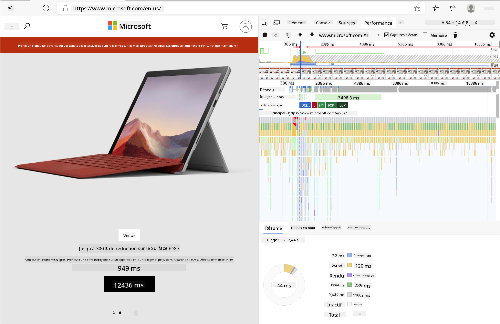
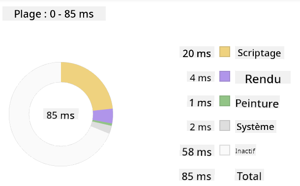
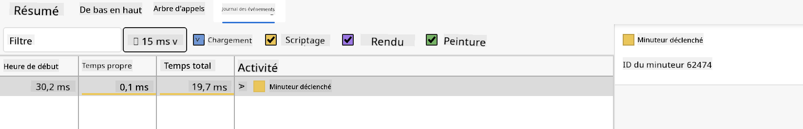

<!--
CO_OP_TRANSLATOR_METADATA:
{
  "original_hash": "49b58721a71cfda824e2f3e1f46908c6",
  "translation_date": "2025-08-29T13:35:21+00:00",
  "source_file": "5-browser-extension/3-background-tasks-and-performance/README.md",
  "language_code": "fr"
}
-->
# Projet d'extension de navigateur Partie 3 : Découvrez les tâches en arrière-plan et la performance

## Quiz avant le cours

[Quiz avant le cours](https://ff-quizzes.netlify.app/web/quiz/27)

### Introduction

Dans les deux dernières leçons de ce module, vous avez appris à créer un formulaire et une zone d'affichage pour les données récupérées depuis une API. C'est une méthode très classique pour établir une présence sur le web. Vous avez même appris à gérer la récupération de données de manière asynchrone. Votre extension de navigateur est presque terminée.

Il reste à gérer certaines tâches en arrière-plan, comme le rafraîchissement de la couleur de l'icône de l'extension. C'est donc le moment idéal pour parler de la manière dont le navigateur gère ce type de tâche. Réfléchissons à ces tâches dans le contexte de la performance de vos ressources web pendant leur développement.

## Les bases de la performance web

> "La performance d'un site web repose sur deux aspects : la vitesse de chargement de la page et la rapidité d'exécution du code." -- [Zack Grossbart](https://www.smashingmagazine.com/2012/06/javascript-profiling-chrome-developer-tools/)

Le sujet de l'optimisation des sites web pour qu'ils soient extrêmement rapides sur tous types d'appareils, pour tous types d'utilisateurs, dans toutes sortes de situations, est, sans surprise, vaste. Voici quelques points à garder à l'esprit lorsque vous développez un projet web classique ou une extension de navigateur.

La première chose à faire pour garantir l'efficacité de votre site est de collecter des données sur ses performances. Le premier endroit pour cela est dans les outils de développement de votre navigateur web. Dans Edge, vous pouvez sélectionner le bouton "Paramètres et plus" (l'icône des trois points en haut à droite du navigateur), puis naviguer vers Plus d'outils > Outils de développement et ouvrir l'onglet Performance. Vous pouvez également utiliser les raccourcis clavier `Ctrl` + `Shift` + `I` sur Windows ou `Option` + `Command` + `I` sur Mac pour ouvrir les outils de développement.

L'onglet Performance contient un outil de profilage. Ouvrez un site web (essayez, par exemple, [https://www.microsoft.com](https://www.microsoft.com/?WT.mc_id=academic-77807-sagibbon)) et cliquez sur le bouton 'Enregistrer', puis actualisez le site. Arrêtez l'enregistrement à tout moment, et vous pourrez voir les routines générées pour 'script', 'render' et 'paint' le site :



✅ Consultez la [documentation Microsoft](https://docs.microsoft.com/microsoft-edge/devtools-guide/performance/?WT.mc_id=academic-77807-sagibbon) sur le panneau Performance dans Edge.

> Astuce : pour obtenir une lecture précise du temps de démarrage de votre site, videz le cache de votre navigateur.

Sélectionnez des éléments de la chronologie du profil pour zoomer sur les événements qui se produisent pendant le chargement de votre page.

Obtenez un aperçu des performances de votre page en sélectionnant une partie de la chronologie du profil et en regardant le panneau de résumé :



Vérifiez le panneau du journal des événements pour voir si un événement a pris plus de 15 ms :



✅ Familiarisez-vous avec votre outil de profilage ! Ouvrez les outils de développement sur ce site et voyez s'il y a des goulots d'étranglement. Quel est l'actif qui se charge le plus lentement ? Le plus rapidement ?

## Vérifications de profilage

En général, il existe des "zones problématiques" que tout développeur web devrait surveiller lors de la création d'un site pour éviter les mauvaises surprises au moment de la mise en production.

**Taille des ressources** : Le web est devenu plus "lourd", et donc plus lent, ces dernières années. Une partie de ce poids est liée à l'utilisation des images.

✅ Parcourez l'[Internet Archive](https://httparchive.org/reports/page-weight) pour une vue historique du poids des pages et plus encore.

Une bonne pratique consiste à s'assurer que vos images sont optimisées et livrées à la bonne taille et résolution pour vos utilisateurs.

**Traversées du DOM** : Le navigateur doit construire son modèle d'objet de document (DOM) en fonction du code que vous écrivez. Il est donc dans l'intérêt d'une bonne performance de page de garder vos balises minimales, en utilisant et en stylisant uniquement ce dont la page a besoin. À ce propos, le CSS excessif associé à une page pourrait être optimisé ; les styles nécessaires uniquement sur une page ne doivent pas être inclus dans la feuille de style principale, par exemple.

**JavaScript** : Tout développeur JavaScript devrait surveiller les scripts qui bloquent le rendu et doivent être chargés avant que le reste du DOM puisse être traversé et peint dans le navigateur. Pensez à utiliser `defer` avec vos scripts en ligne (comme cela est fait dans le module Terrarium).

✅ Essayez quelques sites sur un [site de test de vitesse](https://www.webpagetest.org/) pour en savoir plus sur les vérifications courantes effectuées pour déterminer la performance d'un site.

Maintenant que vous avez une idée de la manière dont le navigateur rend les ressources que vous lui envoyez, examinons les dernières étapes nécessaires pour terminer votre extension :

### Créer une fonction pour calculer la couleur

Dans `/src/index.js`, ajoutez une fonction appelée `calculateColor()` après la série de variables `const` que vous avez définies pour accéder au DOM :

```JavaScript
function calculateColor(value) {
	let co2Scale = [0, 150, 600, 750, 800];
	let colors = ['#2AA364', '#F5EB4D', '#9E4229', '#381D02', '#381D02'];

	let closestNum = co2Scale.sort((a, b) => {
		return Math.abs(a - value) - Math.abs(b - value);
	})[0];
	console.log(value + ' is closest to ' + closestNum);
	let num = (element) => element > closestNum;
	let scaleIndex = co2Scale.findIndex(num);

	let closestColor = colors[scaleIndex];
	console.log(scaleIndex, closestColor);

	chrome.runtime.sendMessage({ action: 'updateIcon', value: { color: closestColor } });
}
```

Que se passe-t-il ici ? Vous passez une valeur (l'intensité carbone) issue de l'appel API que vous avez complété dans la dernière leçon, puis vous calculez à quel point sa valeur est proche de l'indice présenté dans le tableau des couleurs. Ensuite, vous envoyez cette valeur de couleur la plus proche au runtime de Chrome.

Le chrome.runtime dispose [d'une API](https://developer.chrome.com/extensions/runtime) qui gère toutes sortes de tâches en arrière-plan, et votre extension en tire parti :

> "Utilisez l'API chrome.runtime pour récupérer la page d'arrière-plan, retourner les détails du manifeste et écouter et répondre aux événements du cycle de vie de l'application ou de l'extension. Vous pouvez également utiliser cette API pour convertir le chemin relatif des URL en URL entièrement qualifiées."

✅ Si vous développez cette extension de navigateur pour Edge, cela pourrait vous surprendre d'utiliser une API Chrome. Les versions plus récentes du navigateur Edge fonctionnent sur le moteur de navigateur Chromium, ce qui vous permet de tirer parti de ces outils.

> Notez que si vous souhaitez profiler une extension de navigateur, lancez les outils de développement depuis l'extension elle-même, car elle constitue une instance de navigateur distincte.

### Définir une couleur d'icône par défaut

Maintenant, dans la fonction `init()`, définissez l'icône sur une couleur verte générique pour commencer en appelant à nouveau l'action `updateIcon` de Chrome :

```JavaScript
chrome.runtime.sendMessage({
	action: 'updateIcon',
		value: {
			color: 'green',
		},
});
```

### Appeler la fonction, exécuter l'appel

Ensuite, appelez la fonction que vous venez de créer en l'ajoutant à la promesse retournée par l'API C02Signal :

```JavaScript
//let CO2...
calculateColor(CO2);
```

Enfin, dans `/dist/background.js`, ajoutez l'écouteur pour ces appels d'action en arrière-plan :

```JavaScript
chrome.runtime.onMessage.addListener(function (msg, sender, sendResponse) {
	if (msg.action === 'updateIcon') {
		chrome.browserAction.setIcon({ imageData: drawIcon(msg.value) });
	}
});
//borrowed from energy lollipop extension, nice feature!
function drawIcon(value) {
	let canvas = document.createElement('canvas');
	let context = canvas.getContext('2d');

	context.beginPath();
	context.fillStyle = value.color;
	context.arc(100, 100, 50, 0, 2 * Math.PI);
	context.fill();

	return context.getImageData(50, 50, 100, 100);
}
```

Dans ce code, vous ajoutez un écouteur pour tout message envoyé au gestionnaire de tâches en arrière-plan. Si le message est appelé 'updateIcon', le code suivant est exécuté pour dessiner une icône de la couleur appropriée en utilisant l'API Canvas.

✅ Vous en apprendrez davantage sur l'API Canvas dans les [leçons du jeu spatial](../../6-space-game/2-drawing-to-canvas/README.md).

Maintenant, reconstruisez votre extension (`npm run build`), actualisez et lancez votre extension, et observez le changement de couleur. Est-ce le bon moment pour faire une course ou laver la vaisselle ? Maintenant, vous le savez !

Félicitations, vous avez créé une extension de navigateur utile et appris davantage sur le fonctionnement du navigateur et sur la manière de profiler ses performances.

---

## 🚀 Défi

Explorez des sites web open source qui existent depuis longtemps et, en vous basant sur leur historique GitHub, essayez de déterminer comment ils ont été optimisés au fil des années pour la performance, si cela a été fait. Quel est le problème le plus courant ?

## Quiz après le cours

[Quiz après le cours](https://ff-quizzes.netlify.app/web/quiz/28)

## Révision et étude personnelle

Envisagez de vous inscrire à une [newsletter sur la performance](https://perf.email/).

Explorez certaines des façons dont les navigateurs évaluent la performance web en examinant les onglets de performance dans leurs outils web. Trouvez-vous des différences majeures ?

## Devoir

[Analyser un site pour la performance](assignment.md)

---

**Avertissement** :  
Ce document a été traduit à l'aide du service de traduction automatique [Co-op Translator](https://github.com/Azure/co-op-translator). Bien que nous nous efforcions d'assurer l'exactitude, veuillez noter que les traductions automatisées peuvent contenir des erreurs ou des inexactitudes. Le document original dans sa langue d'origine doit être considéré comme la source faisant autorité. Pour des informations critiques, il est recommandé de faire appel à une traduction humaine professionnelle. Nous déclinons toute responsabilité en cas de malentendus ou d'interprétations erronées résultant de l'utilisation de cette traduction.