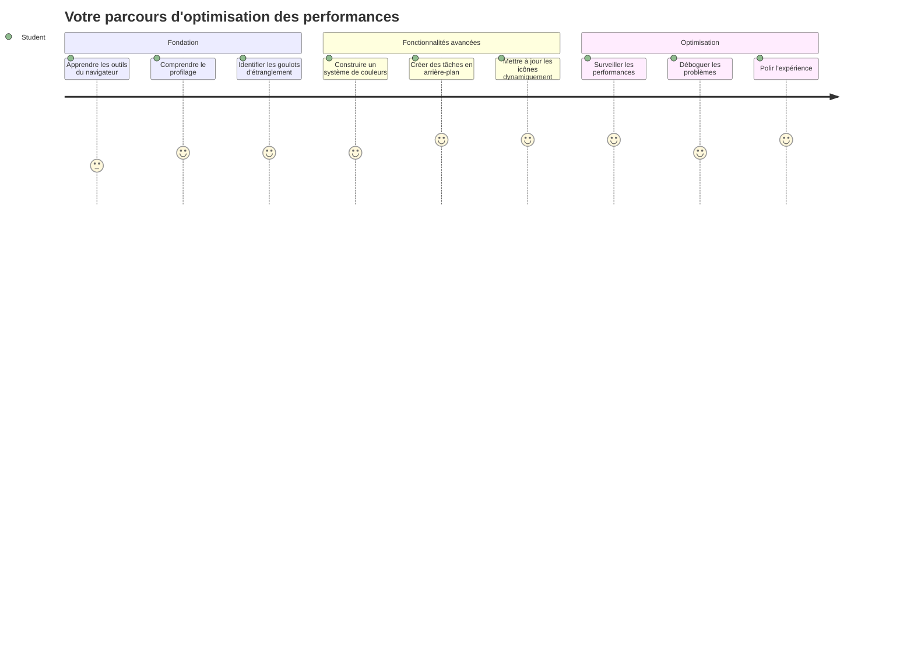
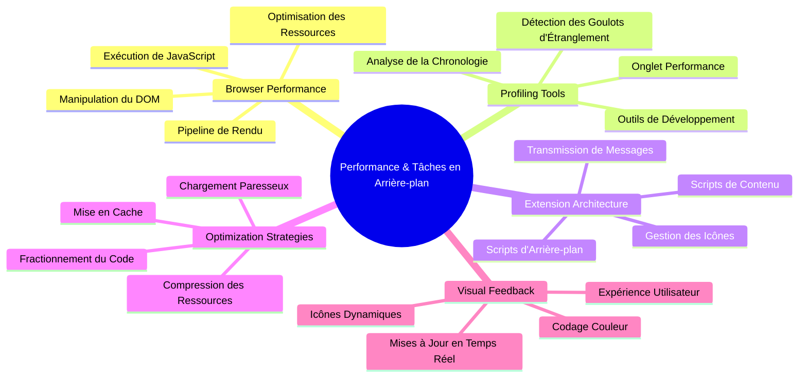
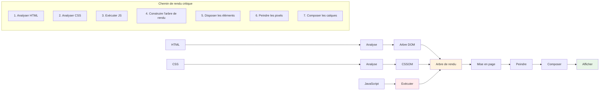
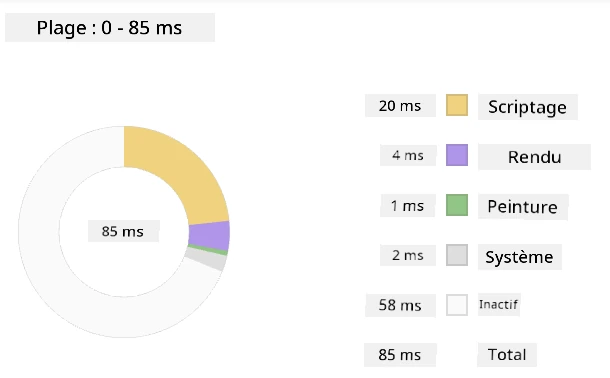
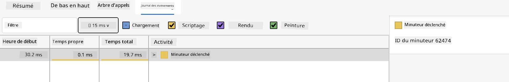
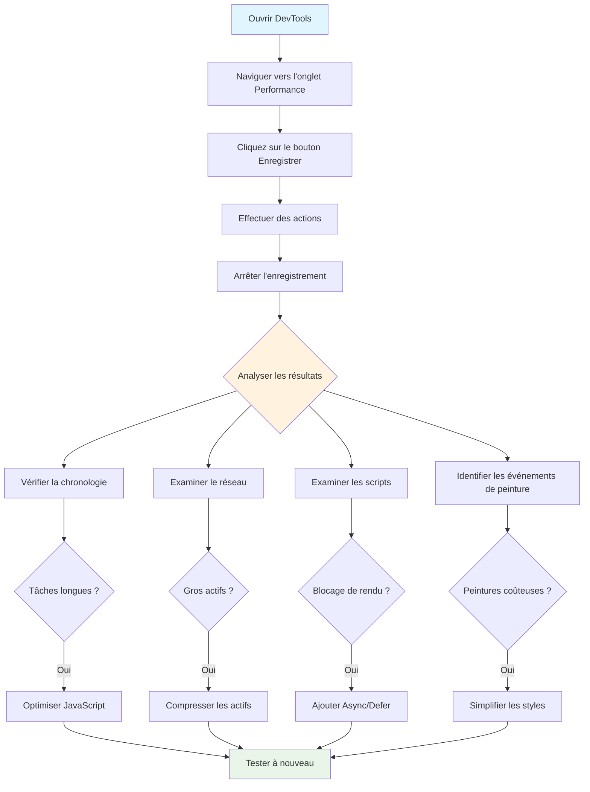
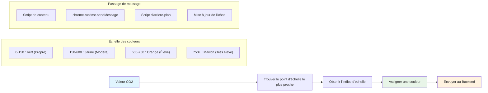
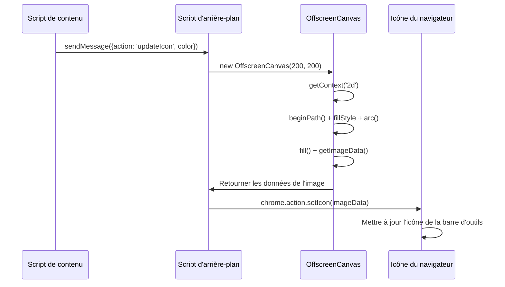
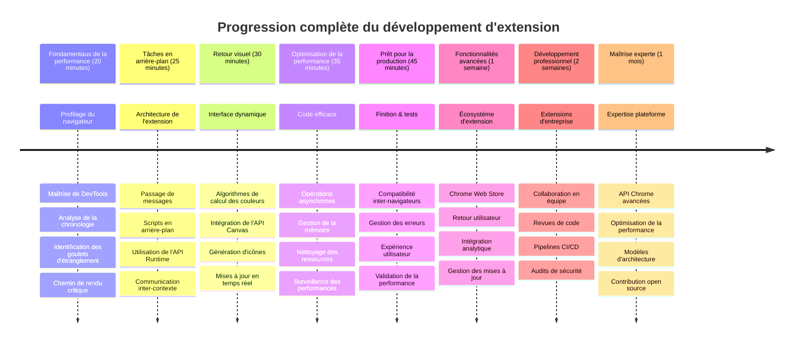

<!--
CO_OP_TRANSLATOR_METADATA:
{
  "original_hash": "b275fed2c6fc90d2b9b6661a3225faa2",
  "translation_date": "2026-01-06T06:28:08+00:00",
  "source_file": "5-browser-extension/3-background-tasks-and-performance/README.md",
  "language_code": "fr"
}
-->
# Projet d’extension de navigateur Partie 3 : Découvrez les tâches en arrière-plan et les performances


Vous vous êtes déjà demandé pourquoi certaines extensions de navigateur sont réactives et rapides alors que d’autres semblent lentes ? Le secret réside dans ce qui se passe en coulisses. Pendant que les utilisateurs naviguent dans l’interface de votre extension, un monde entier de processus en arrière-plan gère discrètement la récupération des données, la mise à jour des icônes et la gestion des ressources système.

Voici notre dernière leçon de la série sur les extensions de navigateur, et nous allons faire en sorte que votre traceur d’empreinte carbone fonctionne parfaitement. Vous allez ajouter des mises à jour dynamiques de l’icône et apprendre à repérer les problèmes de performance avant qu’ils ne deviennent problématiques. C’est un peu comme régler une voiture de course - de petites optimisations peuvent faire une énorme différence dans le fonctionnement global.

À la fin, vous aurez une extension soignée et comprendrez les principes de performance qui distinguent les bonnes applications web des excellentes. Plongeons dans le monde de l’optimisation des navigateurs.

## Quiz avant la leçon

[Quiz avant la leçon](https://ff-quizzes.netlify.app/web/quiz/27)

### Introduction

Dans nos leçons précédentes, vous avez construit un formulaire, connecté celui-ci à une API et abordé la récupération asynchrone des données. Votre extension prend belle forme.

Il faut maintenant ajouter les touches finales - comme faire en sorte que l’icône de l’extension change de couleur selon les données carbone. Cela me rappelle comment la NASA a dû optimiser chaque système du vaisseau Apollo. Ils ne pouvaient se permettre aucun cycle ou mémoire gaspillée car des vies dépendaient de la performance. Même si notre extension de navigateur n’est pas aussi critique, les mêmes principes s’appliquent - un code efficace crée de meilleures expériences utilisateur.


## Bases de la performance web

Quand votre code fonctionne efficacement, les personnes peuvent réellement *sentir* la différence. Vous connaissez ce moment où une page charge instantanément ou une animation est fluide ? C’est la bonne performance à l’œuvre.

La performance ne concerne pas seulement la vitesse - il s’agit de créer des expériences web qui paraissent naturelles au lieu d’être lourdes et frustrantes. Aux débuts de l’informatique, Grace Hopper gardait célèbrement une nanoseconde (un morceau de fil d’environ un pied de long) sur son bureau pour montrer jusqu’où la lumière voyage en un milliardième de seconde. C’était sa façon d’expliquer pourquoi chaque microseconde compte en informatique. Explorons les outils de détective qui vous aident à comprendre ce qui ralentit les choses.

> « La performance d’un site web repose sur deux choses : la rapidité de chargement de la page, et la rapidité du code qui s’y exécute. » -- [Zack Grossbart](https://www.smashingmagazine.com/2012/06/javascript-profiling-chrome-developer-tools/)

Le sujet de la façon de rendre vos sites ultra-rapides sur tous types d’appareils, pour tous types d’utilisateurs, dans toutes sortes de situations, est logiquement vaste. Voici quelques points à garder en tête lorsque vous construisez un projet web standard ou une extension de navigateur.

La première étape pour optimiser votre site est de comprendre ce qui se passe réellement sous le capot. Heureusement, votre navigateur est équipé d’outils de détection puissants intégrés.


Pour ouvrir les Outils de développement dans Edge, cliquez sur ces trois points en haut à droite, puis allez dans Plus d’outils > Outils de développement. Ou utilisez le raccourci clavier : `Ctrl` + `Shift` + `I` sur Windows ou `Option` + `Command` + `I` sur Mac. Une fois là, cliquez sur l’onglet Performance - c’est ici que vous ferez votre enquête.

**Voici votre boîte à outils de détective de performance :**
- **Ouvrez** les Outils de développement (vous les utiliserez constamment en tant que développeur !)
- **Allez** à l’onglet Performance - pensez-y comme au tracker d’activité physique de votre application web
- **Appuyez** sur le bouton Enregistrer et regardez votre page en action
- **Étudiez** les résultats pour repérer ce qui ralentit les choses

Essayons cela. Ouvrez un site web (Microsoft.com fonctionne bien) et cliquez sur ce bouton « Enregistrer ». Maintenant, rafraîchissez la page et regardez le profileur capturer tout ce qui se passe. Quand vous arrêtez l’enregistrement, vous verrez une répartition détaillée de comment le navigateur « script », « rend » et « peint » le site. Cela me fait penser à la manière dont le centre de contrôle de mission surveille chaque système durant le lancement d’une fusée - vous obtenez des données en temps réel sur ce qui se passe et quand.


✅ La [Documentation Microsoft](https://docs.microsoft.com/microsoft-edge/devtools-guide/performance/?WT.mc_id=academic-77807-sagibbon) propose beaucoup plus de détails si vous souhaitez approfondir

> Astuce de pro : Vide le cache de votre navigateur avant de tester pour voir comment votre site performe pour les visiteurs de la première fois - c’est généralement très différent des visites répétées !

Sélectionnez des éléments dans la timeline du profil pour zoomer sur des événements qui se produisent pendant le chargement de votre page.

Prenez un instantané des performances de votre page en sélectionnant une partie de la timeline du profil et en regardant le panneau de résumé :



Consultez le panneau du journal des événements pour voir si un événement a duré plus de 15 ms :



✅ Familiarisez-vous avec votre profileur ! Ouvrez les outils de développement sur ce site et voyez s’il y a des goulots d’étranglement. Quel est l’actif qui charge le plus lentement ? Le plus rapidement ?


## Que rechercher lors du profiling

Lancer le profileur n’est que le début - le véritable talent consiste à savoir ce que ces graphiques colorés vous disent réellement. Ne vous inquiétez pas, vous apprendrez à les lire. Les développeurs expérimentés savent repérer les signes avant-coureurs avant qu’ils ne deviennent de véritables problèmes.

Parlons des suspects habituels - les fauteurs de trouble de la performance qui ont tendance à s’infiltrer dans les projets web. Comme Marie Curie qui devait surveiller attentivement les niveaux de radiation dans son laboratoire, nous devons observer certains schémas qui annoncent des problèmes. Les détecter tôt vous évitera (et à vos utilisateurs) beaucoup de frustrations.

**Tailles des actifs** : Les sites web sont devenus « plus lourds » au fil des ans, et une grande partie de ce poids supplémentaire provient des images. C’est comme si nous remplissions nos valises numériques de plus en plus.

✅ Consultez l’[Internet Archive](https://httparchive.org/reports/page-weight) pour voir comment la taille des pages a évolué dans le temps - c’est très révélateur.

**Voici comment garder vos actifs optimisés :**
- **Compressez** ces images ! Les formats modernes comme WebP peuvent réduire de manière spectaculaire la taille des fichiers
- **Servez** la bonne taille d’image pour chaque appareil - pas besoin d’envoyer des images de bureau gigantesques aux téléphones
- **Minifiez** votre CSS et JavaScript - chaque octet compte
- **Utilisez** le chargement différé (lazy loading) pour que les images ne se téléchargent que lorsque l’utilisateur fait défiler la page jusqu’à elles

**Parcours du DOM** : Le navigateur doit construire son Document Object Model en fonction du code que vous écrivez, donc pour une bonne performance de page, il faut garder vos balises au minimum, utiliser et styler uniquement ce qui est nécessaire. À ce propos, le CSS en excès associé à une page peut être optimisé ; par exemple, les styles nécessaires uniquement sur une page ne doivent pas être inclus dans la feuille de style principale.

**Stratégies clés pour l’optimisation du DOM :**
- **Minimiser** le nombre d’éléments HTML et les niveaux d’imbrication
- **Supprimer** les règles CSS inutilisées et consolider efficacement les feuilles de styles
- **Organiser** le CSS pour ne charger que ce qui est nécessaire pour chaque page
- **Structurer** le HTML de manière sémantique pour un meilleur parsing par le navigateur

**JavaScript** : Tout développeur JavaScript doit surveiller les scripts qui bloquent le rendu et qui doivent être chargés avant que le reste du DOM puisse être parcouru et rendu dans le navigateur. Pensez à utiliser `defer` avec vos scripts en ligne (comme dans le module Terrarium).

**Techniques modernes d’optimisation JavaScript :**
- **Utilisation** de l’attribut `defer` pour charger les scripts après l’analyse du DOM
- **Implémentation** du découpage du code (code splitting) pour ne charger que le JavaScript nécessaire
- **Application** du chargement différé pour les fonctionnalités non critiques
- **Minimisation** de l’utilisation des bibliothèques et frameworks lourds quand c’est possible

✅ Essayez quelques sites sur un [site de test de vitesse](https://www.webpagetest.org/) pour en savoir plus sur les contrôles courants effectués pour déterminer la performance d’un site.

### 🔄 **Point pédagogique**
**Compréhension de la performance** : Avant de construire des fonctionnalités d’extension, assurez-vous de pouvoir :
- ✅ Expliquer le chemin critique de rendu de HTML aux pixels
- ✅ Identifier les goulots d’étranglement courants en matière de performance dans les applications web
- ✅ Utiliser les outils développeur du navigateur pour profiler la performance d’une page
- ✅ Comprendre comment la taille des actifs et la complexité du DOM impactent la vitesse

**Auto-évaluation rapide** : Que se passe-t-il lorsque vous avez du JavaScript bloquant le rendu ?
*Réponse : Le navigateur doit télécharger et exécuter le script avant de pouvoir continuer à analyser le HTML et à rendre la page*

**Impact réel sur la performance** :
- **Délai de 100 ms** : Les utilisateurs remarquent le ralentissement
- **Délai de 1 seconde** : Les utilisateurs commencent à perdre leur concentration
- **3 secondes et plus** : 40 % des utilisateurs quittent la page
- **Réseaux mobiles** : La performance est encore plus cruciale

Maintenant que vous avez une idée de la façon dont le navigateur rend les actifs que vous lui envoyez, voyons les dernières étapes nécessaires pour compléter votre extension :

### Créer une fonction pour calculer la couleur

Nous allons maintenant créer une fonction qui transforme des données numériques en couleurs significatives. Pensez-y comme à un feu de circulation - vert pour l’énergie propre, rouge pour une forte intensité carbone.

Cette fonction prendra les données CO2 de notre API et déterminera la couleur qui représente le mieux l’impact environnemental. C’est similaire à la façon dont les scientifiques utilisent un code couleur dans des cartes de chaleur pour visualiser des données complexes - des températures océaniques à la formation d’étoiles. Ajoutons cela dans `/src/index.js`, juste après ces variables `const` que nous avons définies plus tôt:


```javascript
function calculateColor(value) {
	// Définir l'échelle d'intensité de CO2 (grammes par kWh)
	const co2Scale = [0, 150, 600, 750, 800];
	// Couleurs correspondantes du vert (propre) au brun foncé (forte émission de carbone)
	const colors = ['#2AA364', '#F5EB4D', '#9E4229', '#381D02', '#381D02'];

	// Trouver la valeur d'échelle la plus proche de notre entrée
	const closestNum = co2Scale.sort((a, b) => {
		return Math.abs(a - value) - Math.abs(b - value);
	})[0];
	
	console.log(`${value} is closest to ${closestNum}`);
	
	// Trouver l'index pour la correspondance des couleurs
	const num = (element) => element > closestNum;
	const scaleIndex = co2Scale.findIndex(num);

	const closestColor = colors[scaleIndex];
	console.log(scaleIndex, closestColor);

	// Envoyer un message de mise à jour de couleur au script en arrière-plan
	chrome.runtime.sendMessage({ action: 'updateIcon', value: { color: closestColor } });
}
```

**Décomposons cette petite fonction astucieuse :**
- **Crée** deux tableaux - un pour les niveaux de CO2, un autre pour les couleurs (vert = propre, marron = sale !)
- **Trouve** la correspondance la plus proche de notre valeur CO2 réelle en triant astucieusement le tableau
- **Récupère** la couleur associée grâce à la méthode findIndex()
- **Envoie** un message au script d’arrière-plan de Chrome avec la couleur choisie
- **Utilise** les littéraux de gabarits (ces backticks) pour formater proprement les chaînes de caractères
- **Garde** tout organisé avec des déclarations const

L’[API](https://developer.chrome.com/extensions/runtime) `chrome.runtime` est comme le système nerveux de votre extension - elle gère toutes les communications et tâches en coulisses :

> « Utilisez l’API chrome.runtime pour récupérer la page d’arrière-plan, retourner des détails sur le manifeste, et écouter et répondre aux événements dans le cycle de vie de l’application ou de l’extension. Vous pouvez aussi utiliser cette API pour convertir les chemins relatifs des URLs en URLs entièrement qualifiées. »

**Pourquoi l’API Chrome Runtime est si pratique :**
- **Permet** aux différentes parties de votre extension de communiquer entre elles
- **Gère** le travail en arrière-plan sans bloquer l’interface utilisateur
- **Manage** les événements du cycle de vie de votre extension
- **Facilite** la transmission des messages entre scripts

✅ Si vous développez cette extension pour Edge, il pourrait vous surprendre que vous utilisiez une API chrome. Les versions récentes de Edge fonctionnent sur le moteur Chromium, donc vous pouvez exploiter ces outils.


> **Astuce de pro** : Si vous voulez profiler une extension de navigateur, lancez les outils de développement depuis l’extension elle-même, car elle est son propre instance de navigateur séparée. Cela vous donne accès aux métriques spécifiques à l’extension.

### Définir une couleur d’icône par défaut

Avant de commencer à récupérer de vraies données, donnons à notre extension un point de départ. Personne n’aime regarder une icône vide ou cassée. On commencera avec une couleur verte pour que les utilisateurs sachent que l’extension fonctionne dès l’installation.

Dans votre fonction `init()`, configurons cette icône verte par défaut :

```javascript
chrome.runtime.sendMessage({
	action: 'updateIcon',
	value: {
		color: 'green',
	},
});
```

**Ce que cette initialisation accomplit :**
- **Définit** une couleur verte neutre comme état par défaut
- **Fournit** un retour visuel immédiat lors du chargement de l’extension
- **Établit** le schéma de communication avec le script d’arrière-plan
- **Assure** que les utilisateurs voient une extension fonctionnelle avant le chargement des données

### Appeler la fonction, exécuter l’appel

Connectons maintenant tout cela pour que, quand de nouvelles données CO2 arrivent, votre icône se mette automatiquement à jour avec la bonne couleur. C’est comme connecter le dernier circuit dans un appareil électronique - tous les composants fonctionnent alors comme un système.

Ajoutez cette ligne juste après l’obtention des données CO2 de l’API :

```javascript
// Après avoir récupéré les données de CO2 depuis l'API
// laisser CO2 = data.data[0].intensity.actual;
calculateColor(CO2);
```

**Cette intégration accomplit :**
- **Relie** le flux de données API avec le système d’indicateur visuel
- **Déclenche** automatiquement les mises à jour de l’icône quand de nouvelles données arrivent
- **Assure** un retour visuel en temps réel basé sur l’intensité carbone actuelle
- **Maintient** la séparation des préoccupations entre la récupération des données et la logique d’affichage

Et enfin, dans `/dist/background.js`, ajoutez l’écouteur pour ces appels d’action en arrière-plan :

```javascript
// Écouter les messages du script de contenu
chrome.runtime.onMessage.addListener(function (msg, sender, sendResponse) {
	if (msg.action === 'updateIcon') {
		chrome.action.setIcon({ imageData: drawIcon(msg.value) });
	}
});

// Dessiner une icône dynamique en utilisant l'API Canvas
// Emprunté à l'extension energy lollipop - belle fonctionnalité !
function drawIcon(value) {
	// Créer un canvas hors écran pour de meilleures performances
	const canvas = new OffscreenCanvas(200, 200);
	const context = canvas.getContext('2d');

	// Dessiner un cercle coloré représentant l'intensité carbone
	context.beginPath();
	context.fillStyle = value.color;
	context.arc(100, 100, 50, 0, 2 * Math.PI);
	context.fill();

	// Retourner les données de l'image pour l'icône du navigateur
	return context.getImageData(50, 50, 100, 100);
}
```

**Voici ce que fait ce script d’arrière-plan :**
- **Écoute** les messages de votre script principal (comme une réceptionniste répondant aux appels)
- **Traite** les requêtes ‘updateIcon’ pour changer votre icône dans la barre d’outils
- **Crée** de nouvelles icônes à la volée avec l’API Canvas
- **Dessine** un simple cercle coloré qui montre l’intensité carbone actuelle
- **Met à jour** votre barre d’outils de navigateur avec la nouvelle icône
- **Utilise** OffscreenCanvas pour une performance fluide (pas de blocage de l’interface)

✅ Vous en apprendrez plus sur l’API Canvas dans les [leçons du Space Game](../../6-space-game/2-drawing-to-canvas/README.md).


### 🔄 **Point pédagogique**
**Compréhension complète de l’extension** : Vérifiez votre maîtrise de tout le système :
- ✅ Comment fonctionne le passage de messages entre les différents scripts de l’extension ?
- ✅ Pourquoi utilisons-nous OffscreenCanvas au lieu du Canvas classique pour la performance ?
- ✅ Quel rôle joue l’API Chrome Runtime dans l’architecture des extensions ?
- ✅ Comment l’algorithme de calcul des couleurs mappe-t-il les données au retour visuel ?

**Considérations de performance** : Votre extension démontre maintenant :
- **Messagerie efficace** : Communication claire entre les contextes des scripts
- **Rendu optimisé** : OffscreenCanvas empêche le blocage de l’interface utilisateur
- **Mises à jour en temps réel** : Changements dynamiques de l’icône basés sur des données réelles
- **Gestion de la mémoire** : Nettoyage et gestion appropriés des ressources

**Il est temps de tester votre extension :**
- **Construisez** tout avec `npm run build`
- **Rechargez** votre extension dans le navigateur (n’oubliez pas cette étape)
- **Ouvrez** votre extension et regardez l’icône changer de couleur
- **Vérifiez** comment elle réagit aux données réelles de carbone du monde entier

Maintenant, vous saurez en un coup d’œil s’il est bon de lancer cette lessive ou s’il vaut mieux attendre une énergie plus propre. Vous venez de créer quelque chose de vraiment utile et d’en apprendre sur la performance des navigateurs en chemin.

## Défi Agent GitHub Copilot 🚀

Utilisez le mode Agent pour accomplir le défi suivant :

**Description :** Améliorez les capacités de surveillance des performances de l’extension en ajoutant une fonction qui suit et affiche les temps de chargement des différents composants de l’extension.

**Consigne :** Créez un système de suivi de la performance pour l’extension qui mesure et enregistre le temps nécessaire pour récupérer les données de CO2 via l’API, calculer les couleurs, et mettre à jour l’icône. Ajoutez une fonction nommée `performanceTracker` qui utilise l’API Performance pour mesurer ces opérations et afficher les résultats dans la console du navigateur avec des horodatages et des métriques de durée.

En savoir plus sur [le mode agent](https://code.visualstudio.com/blogs/2025/02/24/introducing-copilot-agent-mode) ici.

## 🚀 Défi

Voici une mission de détective intéressante : choisissez quelques sites open source qui existent depuis des années (comme Wikipedia, GitHub ou Stack Overflow) et fouillez dans leur historique de commits. Pouvez-vous repérer où ils ont effectué des améliorations de performance ? Quels problèmes revenaient régulièrement ?

**Votre approche d’enquête :**
- **Cherchez** dans les messages de commits des mots comme « optimiser », « performance », ou « plus rapide »
- **Observez** des motifs — corrigent-ils toujours les mêmes types de problèmes ?
- **Identifiez** les coupables courants qui ralentissent les sites
- **Partagez** vos découvertes — d’autres développeurs apprendront d’exemples concrets

## Quiz Post-Cours

[Quiz post-cours](https://ff-quizzes.netlify.app/web/quiz/28)

## Revue & Auto-Étude

Envisagez de vous abonner à une [newsletter sur la performance](https://perf.email/)

Explorez comment les navigateurs mesurent la performance web en examinant les onglets performance dans leurs outils développeurs. Trouvez-vous des différences majeures ?

### ⚡ **Ce que vous pouvez faire dans les 5 prochaines minutes**
- [ ] Ouvrir le Gestionnaire des tâches du navigateur (Shift+Esc dans Chrome) pour voir l’utilisation des ressources des extensions
- [ ] Utiliser l’onglet Performance de DevTools pour enregistrer et analyser les performances d’une page web
- [ ] Vérifier la page Extensions du navigateur pour voir quelles extensions ralentissent le démarrage
- [ ] Essayer de désactiver temporairement des extensions pour observer les différences de performance

### 🎯 **Ce que vous pouvez accomplir cette heure-ci**
- [ ] Compléter le quiz post-cours et comprendre les concepts de performance
- [ ] Implémenter un script d’arrière-plan pour votre extension navigateur
- [ ] Apprendre à utiliser browser.alarms pour des tâches de fond efficaces
- [ ] Pratiquer le passage de messages entre scripts de contenu et scripts d’arrière-plan
- [ ] Mesurer et optimiser l’utilisation des ressources de votre extension

### 📅 **Votre parcours performance sur une semaine**
- [ ] Réaliser une extension navigateur haute performance avec fonctionnalités d’arrière-plan
- [ ] Maîtriser les service workers et l’architecture moderne des extensions
- [ ] Implémenter des stratégies efficaces de synchronisation et mise en cache des données
- [ ] Apprendre des techniques avancées de débogage pour la performance d’extension
- [ ] Optimiser votre extension pour la fonctionnalité ET l’efficacité des ressources
- [ ] Créer des tests complets pour les scénarios de performance d’extension

### 🌟 **Votre maîtrise de l’optimisation sur un mois**
- [ ] Construire des extensions navigateur de niveau entreprise avec performance optimale
- [ ] Apprendre à utiliser Web Workers, Service Workers, et les performances web modernes
- [ ] Contribuer à des projets open source axés sur l’optimisation des performances
- [ ] Maîtriser l’architecture interne des navigateurs et les techniques avancées de débogage
- [ ] Créer des outils de surveillance de la performance et des guides des bonnes pratiques
- [ ] Devenir un expert en performance aidant à optimiser les applications web

## 🎯 Votre chronologie de maîtrise des extensions navigateur


### 🛠️ Votre boîte à outils complète pour le développement d’extensions

Après avoir terminé cette trilogie, vous maîtrisez désormais :
- **Architecture du navigateur** : compréhension approfondie de l’intégration des extensions aux systèmes du navigateur
- **Profilage de performance** : capacité à identifier et corriger les goulets d’étranglement avec les outils développeurs
- **Programmation asynchrone** : modèles JavaScript modernes pour des opérations réactives et non bloquantes
- **Intégration API** : récupération des données externes avec authentification et gestion des erreurs
- **Design visuel** : mises à jour d’interface dynamiques et génération graphique basée sur Canvas
- **Passage de messages** : communication inter-scripts dans les architectures des extensions
- **Expérience utilisateur** : états de chargement, gestion des erreurs, et interactions intuitives
- **Compétences de production** : tests, débogage, et optimisation pour un déploiement réel

**Applications concrètes** : Vos compétences en développement d’extension s’appliquent directement à :
- **Applications Web Progressives** : architectures similaires et modèles de performance
- **Applications de bureau Electron** : applications multiplateformes utilisant les technologies web
- **Applications hybrides mobiles** : développement Cordova/PhoneGap utilisant les API web
- **Applications web d’entreprise** : tableaux de bord complexes et outils de productivité
- **Extensions Chrome DevTools** : outils avancés pour développeurs et débogage
- **Intégration API Web** : toute application qui communique avec des services externes

**Impact professionnel** : Vous pouvez désormais :
- **Créer** des extensions navigateur prêtes pour la production, du concept au déploiement
- **Optimiser** la performance des applications web avec des outils de profilage standards du secteur
- **Architecturer** des systèmes scalables avec une séparation correcte des responsabilités
- **Déboguer** des opérations asynchrones complexes et la communication inter-contexte
- **Contribuer** aux projets open source d’extensions et aux standards du navigateur

**Opportunités de niveau supérieur** :
- **Développeur Chrome Web Store** : publier des extensions pour des millions d’utilisateurs
- **Ingénieur performance web** : spécialisé en optimisation et expérience utilisateur
- **Développeur plateforme navigateur** : contribuer au développement des moteurs de navigateur
- **Créateur de frameworks d'extensions** : construire des outils pour aider d’autres développeurs
- **Relations développeurs** : partager vos connaissances via enseignement et création de contenu

🌟 **Succès débloqué** : Vous venez de créer une extension navigateur complète et fonctionnelle démontrant des pratiques professionnelles et des standards web modernes !

## Devoir

[Analysez un site pour la performance](assignment.md)

---

<!-- CO-OP TRANSLATOR DISCLAIMER START -->
**Avertissement** :  
Ce document a été traduit à l’aide du service de traduction automatique [Co-op Translator](https://github.com/Azure/co-op-translator). Bien que nous nous efforcions d’assurer l’exactitude, veuillez noter que les traductions automatiques peuvent contenir des erreurs ou des inexactitudes. Le document original dans sa langue d’origine doit être considéré comme la source faisant autorité. Pour des informations critiques, une traduction professionnelle réalisée par un humain est recommandée. Nous déclinons toute responsabilité en cas de malentendus ou d’interprétations erronées résultant de l’utilisation de cette traduction.
<!-- CO-OP TRANSLATOR DISCLAIMER END -->