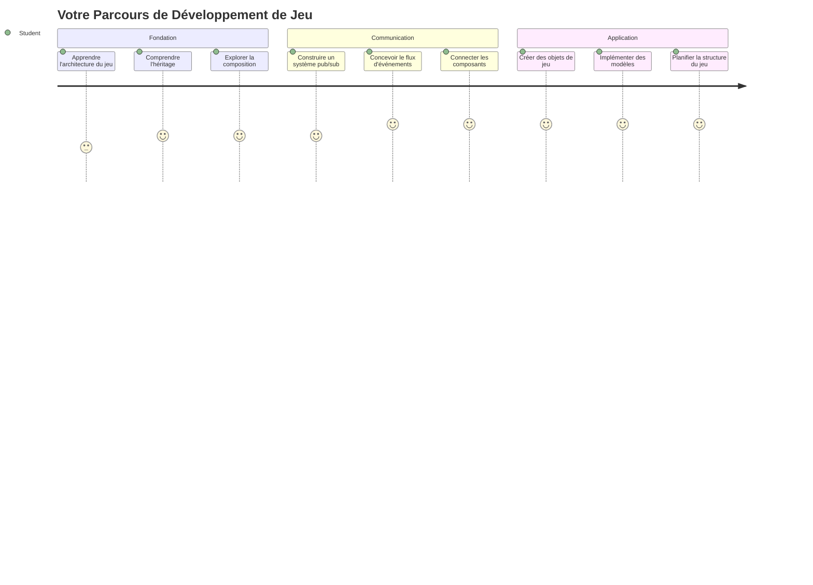
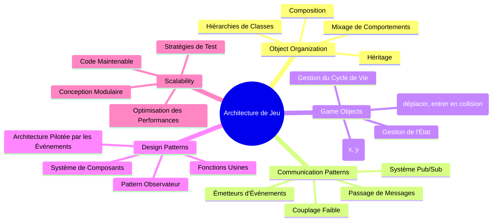
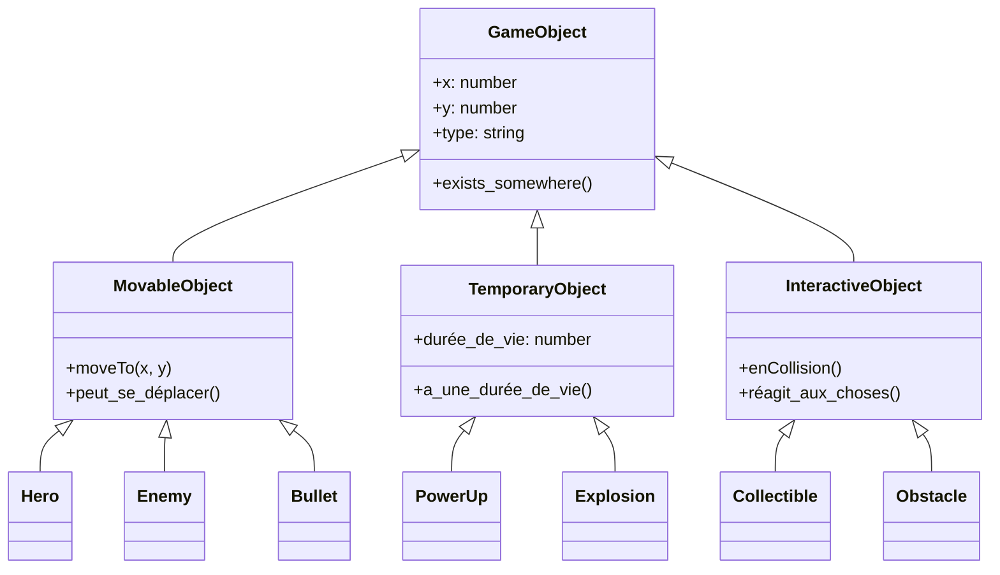
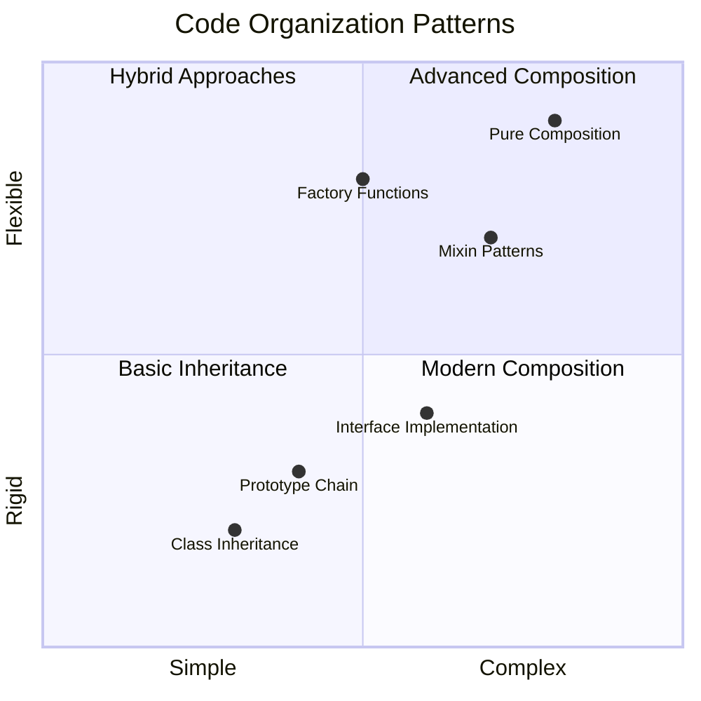
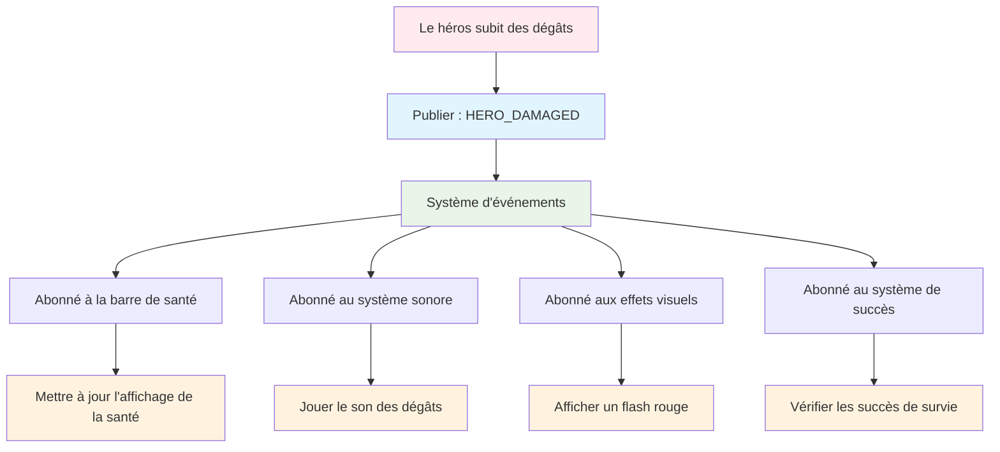
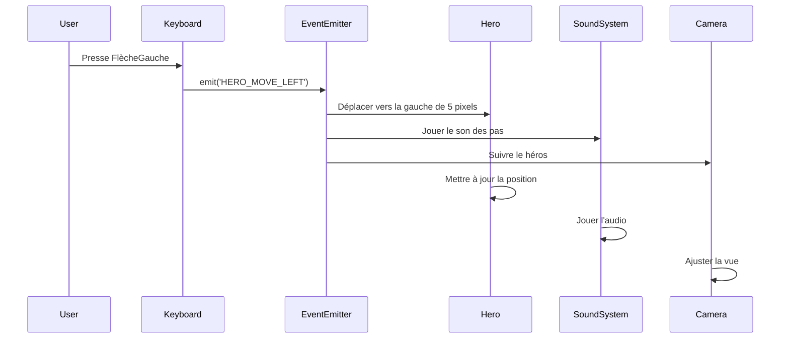
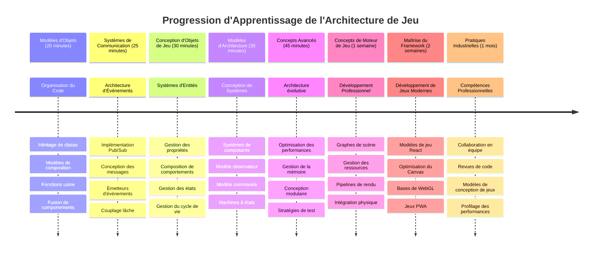

# Construire un jeu spatial Partie 1 : Introduction




Tout comme le centre de contrôle de la NASA coordonne plusieurs systèmes lors d'un lancement spatial, nous allons créer un jeu spatial qui démontre comment différentes parties d’un programme peuvent fonctionner ensemble de manière fluide. En créant quelque chose que vous pouvez vraiment jouer, vous apprendrez des concepts essentiels de programmation applicables à tout projet logiciel.

Nous explorerons deux approches fondamentales pour organiser le code : l’héritage et la composition. Ce ne sont pas seulement des concepts académiques – ce sont les mêmes schémas qui alimentent tout, des jeux vidéo aux systèmes bancaires. Nous implémenterons également un système de communication appelé pub/sub qui fonctionne comme les réseaux de communication utilisés dans les engins spatiaux, permettant à différents composants de partager des informations sans créer de dépendances.

À la fin de cette série, vous comprendrez comment construire des applications capables de s’adapter et d’évoluer – que vous développiez des jeux, des applications web, ou tout autre système logiciel.


## Quiz avant la conférence

[Quiz avant la conférence](https://ff-quizzes.netlify.app/web/quiz/29)

## Héritage et composition dans le développement de jeux

À mesure que les projets gagnent en complexité, l’organisation du code devient critique. Ce qui commence comme un simple script peut devenir difficile à maintenir sans structure adéquate – tout comme les missions Apollo nécessitaient une coordination minutieuse entre des milliers de composants.

Nous explorerons deux approches fondamentales pour organiser le code : l’héritage et la composition. Chacune a des avantages distincts, et comprendre les deux vous aide à choisir l’approche appropriée selon les situations. Nous illustrerons ces concepts à travers notre jeu spatial, où héros, ennemis, bonus, et autres objets doivent interagir efficacement.

✅ Un des livres sur la programmation les plus célèbres a trait aux [design patterns](https://fr.wikipedia.org/wiki/Motif_de_conception).

Dans tout jeu, vous avez des `objets de jeu` – les éléments interactifs qui peuplent votre univers. Héros, ennemis, bonus et effets visuels sont tous des objets de jeu. Chacun existe à des coordonnées d’écran spécifiques en utilisant des valeurs `x` et `y`, comme sur un plan cartésien.

Malgré leurs différences visuelles, ces objets partagent souvent des comportements fondamentaux :

- **Ils existent quelque part** – Chaque objet a des coordonnées x et y pour que le jeu sache où l’afficher
- **Beaucoup peuvent se déplacer** – Les héros courent, les ennemis poursuivent, les projectiles volent à l’écran
- **Ils ont une durée de vie** – Certains restent toujours, d’autres (comme les explosions) apparaissent brièvement puis disparaissent
- **Ils réagissent à leur environnement** – Lorsqu’il y a collision, les bonus sont collectés, les barres de vie se mettent à jour

✅ Pensez à un jeu comme Pac-Man. Pouvez-vous identifier les quatre types d’objets listés ci-dessus dans ce jeu ?


### Exprimer le comportement par le code

Maintenant que vous comprenez les comportements communs partagés par les objets de jeu, explorons comment les implémenter en JavaScript. Vous pouvez exprimer le comportement des objets via des méthodes attachées soit aux classes soit aux objets individuels, et plusieurs approches sont possibles.

**L’approche par classes**

Les classes et l’héritage offrent une manière structurée d’organiser les objets de jeu. À l’image du système de classification taxonomique développé par Carl Linnaeus, vous commencez par une classe de base contenant des propriétés communes, puis créez des classes spécialisées qui héritent de ces fondamentaux tout en ajoutant des capacités spécifiques.

✅ L’héritage est un concept important à comprendre. En savoir plus sur [l’héritage dans l’article MDN](https://developer.mozilla.org/docs/Web/JavaScript/Inheritance_and_the_prototype_chain).

Voici comment vous pouvez implémenter des objets de jeu en utilisant les classes et l’héritage :

```javascript
// Étape 1 : Créez la classe de base GameObject
class GameObject {
  constructor(x, y, type) {
    this.x = x;
    this.y = y;
    this.type = type;
  }
}
```

**Décomposons cela pas à pas :**
- Nous créons un modèle basique que chaque objet de jeu peut utiliser
- Le constructeur enregistre où se trouve l’objet (`x`, `y`) et quel type d’objet c’est
- Cela devient la base sur laquelle tous vos objets de jeu vont se construire

```javascript
// Étape 2 : Ajouter la capacité de mouvement via l'héritage
class Movable extends GameObject {
  constructor(x, y, type) {
    super(x, y, type); // Appeler le constructeur parent
  }

  // Ajouter la capacité de se déplacer à une nouvelle position
  moveTo(x, y) {
    this.x = x;
    this.y = y;
  }
}
```

**Dans l’exemple ci-dessus, nous avons :**
- **Étendu** la classe GameObject pour ajouter une fonctionnalité de déplacement
- **Appelé** le constructeur parent avec `super()` pour initialiser les propriétés héritées
- **Ajouté** une méthode `moveTo()` qui met à jour la position de l’objet

```javascript
// Étape 3 : Créez des types d'objets de jeu spécifiques
class Hero extends Movable {
  constructor(x, y) {
    super(x, y, 'Hero'); // Définir le type automatiquement
  }
}

class Tree extends GameObject {
  constructor(x, y) {
    super(x, y, 'Tree'); // Les arbres n'ont pas besoin de mouvement
  }
}

// Étape 4 : Utilisez vos objets de jeu
const hero = new Hero(0, 0);
hero.moveTo(5, 5); // Le héros peut bouger !

const tree = new Tree(10, 15);
// tree.moveTo() provoquerait une erreur - les arbres ne peuvent pas bouger
```

**Comprendre ces concepts :**
- **Crée** des types d’objets spécialisés qui héritent des comportements appropriés
- **Démontre** comment l’héritage permet une inclusion sélective des fonctionnalités
- **Montre** que les héros peuvent se déplacer tandis que les arbres restent immobiles
- **Illustre** comment la hiérarchie de classes empêche des actions inappropriées

✅ Prenez quelques minutes pour ré-imaginer un héros de Pac-Man (Inky, Pinky ou Blinky, par exemple) et comment il serait écrit en JavaScript.

**L’approche par composition**

La composition suit une philosophie de conception modulaire, similaire à la manière dont les ingénieurs conçoivent des engins spatiaux avec des composants interchangeables. Plutôt que d’hériter d’une classe parente, vous combinez des comportements spécifiques pour créer des objets avec exactement les fonctionnalités dont ils ont besoin. Cette approche offre une flexibilité sans les contraintes hiérarchiques rigides.

```javascript
// Étape 1 : Créer des objets de comportement de base
const gameObject = {
  x: 0,
  y: 0,
  type: ''
};

const movable = {
  moveTo(x, y) {
    this.x = x;
    this.y = y;
  }
};
```

**Voici ce que fait ce code :**
- **Définit** un objet de base `gameObject` avec des propriétés de position et de type
- **Crée** un objet comportement `movable` séparé avec des fonctionnalités de déplacement
- **Sépare** les préoccupations en gardant les données de position et la logique de mouvement indépendantes

```javascript
// Étape 2 : Composer des objets en combinant des comportements
const movableObject = { ...gameObject, ...movable };

// Étape 3 : Créer des fonctions usine pour différents types d'objets
function createHero(x, y) {
  return {
    ...movableObject,
    x,
    y,
    type: 'Hero'
  };
}

function createStatic(x, y, type) {
  return {
    ...gameObject,
    x,
    y,
    type
  };
}
```

**Dans l’exemple ci-dessus, nous avons :**
- **Combiné** les propriétés de l’objet de base avec le comportement de déplacement en utilisant la syntaxe spread
- **Créé** des fonctions fabriques qui retournent des objets personnalisés
- **Permis** une création d’objets flexible sans hiérarchies rigides de classes
- **Autorisé** les objets à avoir exactement les comportements dont ils ont besoin

```javascript
// Étape 4 : Créez et utilisez vos objets composés
const hero = createHero(10, 10);
hero.moveTo(5, 5); // Fonctionne parfaitement !

const tree = createStatic(0, 0, 'Tree');
// tree.moveTo() est indéfini - aucun comportement de déplacement n'a été composé
```

**Points clés à retenir :**
- **Compose** les objets en mélangeant des comportements plutôt qu’en les héritant
- **Offre** plus de flexibilité que les hiérarchies rigides d’héritage
- **Permet** aux objets d’avoir exactement les fonctionnalités dont ils ont besoin
- **Utilise** la syntaxe spread moderne de JavaScript pour une combinaison propre des objets
```

**Which Pattern Should You Choose?**

**Which Pattern Should You Choose?**



> 💡 **Astuce Pro** : Les deux schémas ont leur place dans le développement moderne JavaScript. Les classes fonctionnent bien pour des hiérarchies clairement définies, tandis que la composition brille lorsqu’il faut une flexibilité maximale.
> 
**Voici quand utiliser chaque approche :**
- **Choisissez** l’héritage quand vous avez de claires relations « est-un » (un Héros *est un* objet Déplacable)
- **Privilégiez** la composition quand vous avez des relations « a-un » (un Héros *a* des capacités de déplacement)
- **Considérez** les préférences de votre équipe et les exigences du projet
- **Rappelez-vous** que vous pouvez mélanger les deux approches dans la même application

### 🔄 **Vérification pédagogique**
**Compréhension de l’organisation des objets** : Avant de passer aux schémas de communication, assurez-vous d’être capable de :
- ✅ Expliquer la différence entre héritage et composition
- ✅ Identifier quand utiliser des classes contre des fonctions fabriques
- ✅ Comprendre le fonctionnement du mot-clé `super()` dans l’héritage
- ✅ Reconnaître les avantages de chaque approche pour le développement de jeu

**Auto-test rapide** : Comment créeriez-vous un Ennemi Volant qui peut à la fois se déplacer et voler ?
- **Approche héritage** : `class FlyingEnemy extends Movable`
- **Approche composition** : `{ ...movable, ...flyable, ...gameObject }`

**Lien avec le réel** : Ces modèles apparaissent partout :
- **Composants React** : Props (composition) contre héritage de classes
- **Moteurs de jeux** : systèmes entité-composant utilisant la composition
- **Applications mobiles** : frameworks UI souvent basés sur des hiérarchies d’héritage

## Schémas de communication : le système Pub/Sub

À mesure que les applications deviennent complexes, gérer la communication entre les composants devient un défi. Le modèle d’édition-abonnement (pub/sub) résout ce problème en suivant des principes similaires à la radiodiffusion – un émetteur peut atteindre plusieurs récepteurs sans savoir qui écoute.

Considérez ce qui se passe lorsqu’un héros subit des dégâts : la barre de vie s’actualise, des effets sonores jouent, un retour visuel apparaît. Plutôt que de coupler directement l’objet héros à ces systèmes, le pub/sub permet au héros de diffuser un message « dommage reçu ». Tout système qui doit répondre à ce type de message peut s’abonner et réagir en conséquence.

✅ **Pub/Sub** signifie « publish-subscribe » (publication-abonnement)


### Comprendre l’architecture Pub/Sub

Le modèle pub/sub garde les différentes parties de votre application faiblement couplées, ce qui signifie qu’elles peuvent collaborer sans dépendre directement les unes des autres. Cette séparation rend votre code plus maintenable, testable, et flexible face aux changements.

**Les principaux acteurs du pub/sub :**
- **Messages** – Des étiquettes textuelles simples comme `'PLAYER_SCORED'` qui décrivent ce qui s’est passé (avec des infos supplémentaires)
- **Émetteurs (publishers)** – Les objets qui crient « Quelque chose s’est passé ! » à tous ceux qui écoutent
- **Abonnés (subscribers)** – Les objets qui disent « Cet événement m’intéresse » et réagissent lorsqu’il arrive
- **Système d’événements** – L’intermédiaire qui assure que les messages atteignent les bons auditeurs

### Construire un système d’événements

Créons un système d’événement simple mais puissant qui illustre ces concepts :

```javascript
// Étape 1 : Créez la classe EventEmitter
class EventEmitter {
  constructor() {
    this.listeners = {}; // Stocker tous les écouteurs d'événements
  }
  
  // Enregistrer un écouteur pour un type de message spécifique
  on(message, listener) {
    if (!this.listeners[message]) {
      this.listeners[message] = [];
    }
    this.listeners[message].push(listener);
  }
  
  // Envoyer un message à tous les écouteurs enregistrés
  emit(message, payload = null) {
    if (this.listeners[message]) {
      this.listeners[message].forEach(listener => {
        listener(message, payload);
      });
    }
  }
}
```

**Décomposons ce qui se passe ici :**
- **Crée** un gestionnaire d’événements central via une classe simple
- **Stocke** les auditeurs dans un objet organisé par type de message
- **Enregistre** de nouveaux auditeurs avec la méthode `on()`
- **Diffuse** les messages à tous les auditeurs intéressés avec `emit()`
- **Supporte** les données optionnelles pour passer des informations pertinentes

### Mettre tout ensemble : un exemple pratique

Voyons cela en action ! Nous allons créer un système de déplacement simple qui montre à quel point pub/sub est propre et flexible :

```javascript
// Étape 1 : Définissez vos types de messages
const Messages = {
  HERO_MOVE_LEFT: 'HERO_MOVE_LEFT',
  HERO_MOVE_RIGHT: 'HERO_MOVE_RIGHT',
  ENEMY_SPOTTED: 'ENEMY_SPOTTED'
};

// Étape 2 : Créez votre système d'événements et vos objets de jeu
const eventEmitter = new EventEmitter();
const hero = createHero(0, 0);
```

**Voici ce que fait ce code :**
- **Définit** un objet constant pour éviter les fautes de frappe dans les noms de messages
- **Crée** une instance de l’émetteur d’événements pour gérer toute la communication
- **Initialise** un objet héros à la position de départ

```javascript
// Étape 3 : Configurer les écouteurs d'événements (abonnés)
eventEmitter.on(Messages.HERO_MOVE_LEFT, () => {
  hero.moveTo(hero.x - 5, hero.y);
  console.log(`Hero moved to position: ${hero.x}, ${hero.y}`);
});

eventEmitter.on(Messages.HERO_MOVE_RIGHT, () => {
  hero.moveTo(hero.x + 5, hero.y);
  console.log(`Hero moved to position: ${hero.x}, ${hero.y}`);
});
```

**Dans l’exemple ci-dessus, nous avons :**
- **Enregistré** des auditeurs d’événements qui répondent aux messages de déplacement
- **Mis à jour** la position du héros en fonction de la direction du déplacement
- **Ajouté** des logs console pour suivre les changements de position du héros
- **Séparé** la logique de déplacement du traitement des entrées claviers

```javascript
// Étape 4 : Connecter la saisie du clavier aux événements (éditeurs)
window.addEventListener('keydown', (event) => {
  switch(event.key) {
    case 'ArrowLeft':
      eventEmitter.emit(Messages.HERO_MOVE_LEFT);
      break;
    case 'ArrowRight':
      eventEmitter.emit(Messages.HERO_MOVE_RIGHT);
      break;
  }
});
```

**Comprendre ces concepts :**
- **Connecte** la saisie clavier aux événements du jeu sans couplage étroit
- **Permet** au système d’entrée de communiquer avec les objets jeu indirectement
- **Autorise** plusieurs systèmes à répondre aux mêmes événements clavier
- **Facilite** le changement des touches ou l’ajout de nouvelles méthodes d’entrée


> 💡 **Astuce Pro** : La beauté de ce schéma réside dans la flexibilité ! Vous pouvez facilement ajouter des effets sonores, des secousses d’écran, ou des effets particulaires simplement en ajoutant plus d’auditeurs – sans modifier le code clavier ou déplacement existant.
> 
**Voici pourquoi vous allez aimer cette approche :**
- Ajouter des nouvelles fonctionnalités devient ultra simple – il suffit d’écouter les événements qui vous intéressent
- Plusieurs composants peuvent réagir au même événement sans se gêner
- Les tests sont beaucoup plus simples car chaque partie fonctionne indépendamment
- Quand un problème survient, vous savez exactement où chercher

### Pourquoi Pub/Sub évolue efficacement

Le modèle pub/sub garde sa simplicité à mesure que les applications deviennent plus complexes. Que ce soit pour gérer des dizaines d’ennemis, des interfaces dynamiques, ou des systèmes audio, ce schéma supporte l’évolution sans changer l’architecture. Les nouvelles fonctionnalités s’intègrent dans l’existant sans compromettre la fonctionnalité établie.

> ⚠️ **Erreur fréquente** : Ne créez pas trop tôt trop de types de messages spécifiques. Commencez avec des catégories larges et affinez-les au fur et à mesure que les besoins de votre jeu se précisent.
> 
**Bonnes pratiques à respecter :**
- **Groupez** les messages liés dans des catégories logiques
- **Utilisez** des noms descriptifs qui indiquent clairement ce qui s’est passé
- **Gardez** le contenu des messages simple et ciblé
- **Documentez** vos types de messages pour faciliter la collaboration d’équipe

### 🔄 **Vérification pédagogique**
**Compréhension de l’architecture événementielle** : Vérifiez votre maîtrise du système complet :
- ✅ Comment le modèle pub/sub évite-t-il le couplage fort entre composants ?
- ✅ Pourquoi est-il plus facile d’ajouter des fonctionnalités avec une architecture événementielle ?
- ✅ Quel rôle joue le EventEmitter dans le flux de communication ?
- ✅ Comment les constantes de message évitent-elles les bugs et améliorent la maintenabilité ?

**Défi de conception** : Comment géreriez-vous ces scénarios de jeu avec le pub/sub ?
1. **Mort d’un ennemi** : Mettre à jour le score, jouer un son, faire apparaître un bonus, retirer de l’écran
2. **Niveau terminé** : Arrêter la musique, afficher UI, sauvegarder la progression, charger le niveau suivant
3. **Bonus collecté** : Améliorer les capacités, mettre à jour l’UI, jouer un effet, lancer un compte à rebours

**Lien professionnel** : Ce modèle apparaît dans :
- **Frameworks Frontend** : systèmes d’événements React/Vue
- **Services Backend** : communication microservices
- **Moteurs de jeux** : système d’événements Unity
- **Développement mobile** : systèmes de notification iOS/Android

---

## Défi GitHub Copilot Agent 🚀

Utilisez le mode Agent pour relever le défi suivant :

**Description :** Créez un système d’objets de jeu simple utilisant à la fois l’héritage et le modèle pub/sub. Vous implémenterez un jeu basique où différents objets peuvent communiquer par événements sans se connaître directement.

**Consigne :** Créez un système de jeu JavaScript avec ces exigences : 1) Créez une classe GameObject de base avec les coordonnées x, y et une propriété type. 2) Créez une classe Hero qui étend GameObject et peut se déplacer. 3) Créez une classe Enemy qui étend GameObject et peut poursuivre le héros. 4) Implémentez une classe EventEmitter pour le modèle pub/sub. 5) Configurez des auditeurs d’événements pour que lorsque le héros se déplace, les ennemis proches reçoivent un événement 'HERO_MOVED' et mettent à jour leur position pour se diriger vers le héros. Incluez des consoles.log pour montrer la communication entre objets.

En savoir plus sur [le mode agent](https://code.visualstudio.com/blogs/2025/02/24/introducing-copilot-agent-mode).

## 🚀 Défi
Considérez comment le modèle pub-sub peut améliorer l’architecture d’un jeu. Identifiez quels composants doivent émettre des événements et comment le système doit y répondre. Concevez un concept de jeu et cartographiez les schémas de communication entre ses composants.

## Quiz post-conférence

[Quiz post-conférence](https://ff-quizzes.netlify.app/web/quiz/30)

## Révision & auto-apprentissage

Apprenez-en plus sur Pub/Sub en [lisant à ce sujet](https://docs.microsoft.com/azure/architecture/patterns/publisher-subscriber/?WT.mc_id=academic-77807-sagibbon).

### ⚡ **Ce que vous pouvez faire dans les 5 prochaines minutes**
- [ ] Ouvrez un jeu HTML5 en ligne et inspectez son code avec DevTools
- [ ] Créez un élément Canvas HTML5 simple et dessinez une forme basique
- [ ] Essayez d’utiliser `setInterval` pour créer une boucle d’animation simple
- [ ] Explorez la documentation de l’API Canvas et testez une méthode de dessin

### 🎯 **Ce que vous pouvez accomplir cette heure**
- [ ] Terminez le quiz post-lesson et comprenez les concepts du développement de jeu
- [ ] Mettez en place la structure de votre projet de jeu avec des fichiers HTML, CSS et JavaScript
- [ ] Créez une boucle de jeu basique qui met à jour et affiche en continu
- [ ] Dessinez vos premiers sprites de jeu sur le canevas
- [ ] Implémentez le chargement basique des assets pour les images et sons

### 📅 **Votre création de jeu sur une semaine**
- [ ] Complétez le jeu spatial complet avec toutes les fonctionnalités prévues
- [ ] Ajoutez des graphismes soignés, des effets sonores et des animations fluides
- [ ] Implémentez les états du jeu (écran de démarrage, gameplay, fin de jeu)
- [ ] Créez un système de score et un suivi de la progression du joueur
- [ ] Rendez votre jeu responsive et accessible sur différents appareils
- [ ] Partagez votre jeu en ligne et recueillez les retours des joueurs

### 🌟 **Votre développement de jeu sur un mois**
- [ ] Créez plusieurs jeux explorant différents genres et mécaniques
- [ ] Apprenez un framework de développement de jeux comme Phaser ou Three.js
- [ ] Contribuez à des projets open source de développement de jeux
- [ ] Maîtrisez les patterns avancés de programmation de jeux et l’optimisation
- [ ] Constituez un portfolio démontrant vos compétences en développement de jeux
- [ ] Devenez mentor pour d’autres intéressés par le développement de jeux et les médias interactifs

## 🎯 Votre calendrier de maîtrise du développement de jeux


### 🛠️ Résumé de votre boîte à outils pour l’architecture de jeux

Après avoir terminé cette leçon, vous avez désormais :
- **Maîtrise des patterns de conception** : Compréhension des compromis héritage vs composition
- **Architecture événementielle** : Implémentation pub/sub pour une communication évolutive
- **Conception orientée objet** : Hiérarchies de classes et composition de comportements
- **JavaScript moderne** : Fonctions factory, syntaxe spread et patterns ES6+
- **Architecture évolutive** : Principes de découplage et de conception modulaire
- **Fondations du développement de jeux** : Systèmes d’entités et patterns de composants
- **Patterns professionnels** : Approches industrielles pour l’organisation du code

**Applications réelles** : Ces patterns s’appliquent directement à :
- **Frameworks frontend** : Architecture des composants React/Vue et gestion d’état
- **Services backend** : Communication microservices et systèmes événementiels
- **Développement mobile** : Architecture d’applications iOS/Android et systèmes de notifications
- **Moteurs de jeux** : Unity, Unreal et développement de jeux web
- **Logiciels d’entreprise** : Event sourcing et conception de systèmes distribués
- **Conception d’API** : Services RESTful et communication en temps réel

**Compétences professionnelles acquises** : Vous pouvez désormais :
- **Concevoir** des architectures logicielles évolutives avec des patterns éprouvés
- **Implémenter** des systèmes événementiels gérant des interactions complexes
- **Choisir** des stratégies d’organisation du code adaptées à différents scénarios
- **Déboguer** et maintenir efficacement des systèmes faiblement couplés
- **Communiquer** les décisions techniques en utilisant une terminologie standard

**Niveau supérieur** : Vous êtes prêt à implémenter ces patterns dans un vrai jeu, explorer des sujets avancés du développement de jeux, ou appliquer ces concepts architecturaux aux applications web !

🌟 **Succès débloqué** : Vous maîtrisez désormais les patterns fondamentaux d’architecture logicielle qui alimentent tout, des jeux simples aux systèmes d’entreprise complexes !

## Devoir

[Maquettage d’un jeu](assignment.md)

---

<!-- CO-OP TRANSLATOR DISCLAIMER START -->
**Avertissement** :  
Ce document a été traduit à l'aide du service de traduction automatique [Co-op Translator](https://github.com/Azure/co-op-translator). Bien que nous nous efforcions d'assurer son exactitude, veuillez noter que les traductions automatisées peuvent contenir des erreurs ou des inexactitudes. Le document original dans sa langue d'origine doit être considéré comme la source faisant foi. Pour les informations critiques, il est recommandé de faire appel à une traduction professionnelle réalisée par un humain. Nous déclinons toute responsabilité en cas de malentendus ou d’interprétations erronées résultant de l’utilisation de cette traduction.
<!-- CO-OP TRANSLATOR DISCLAIMER END -->