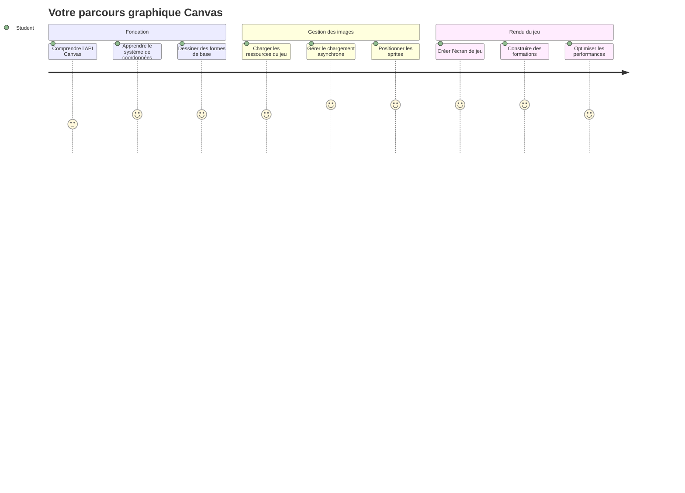
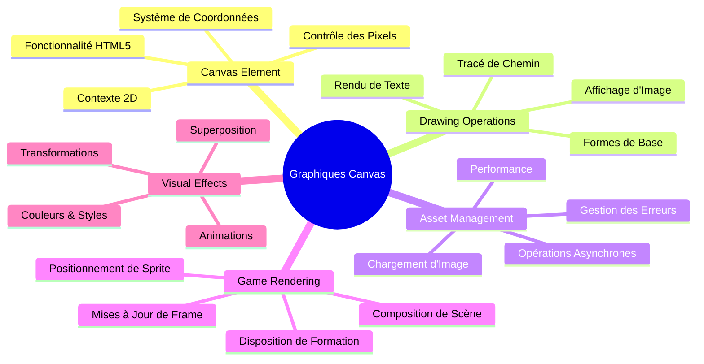
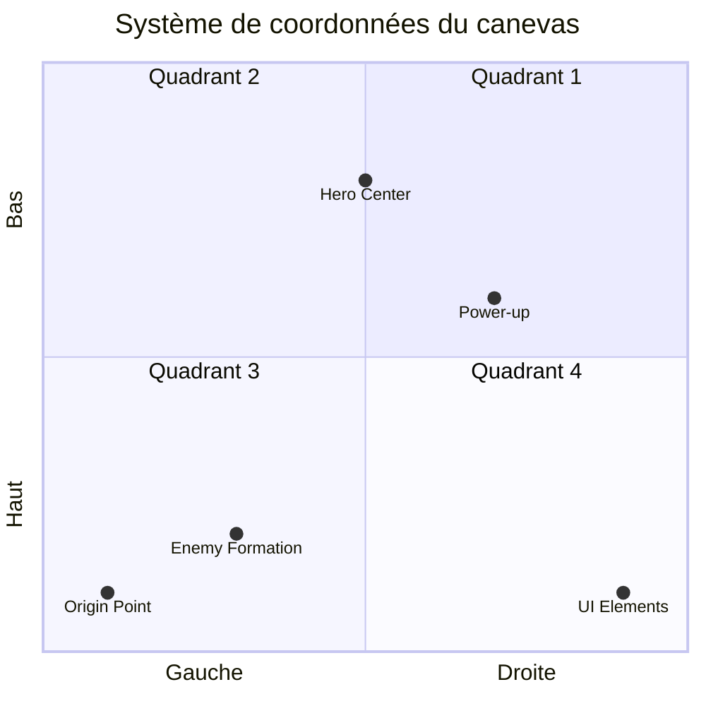
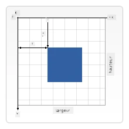
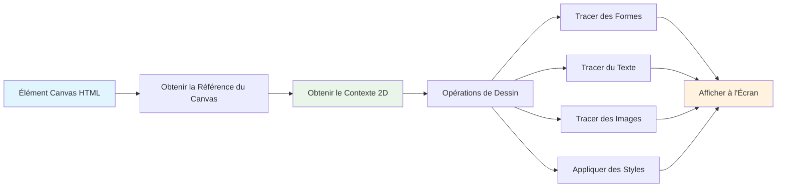
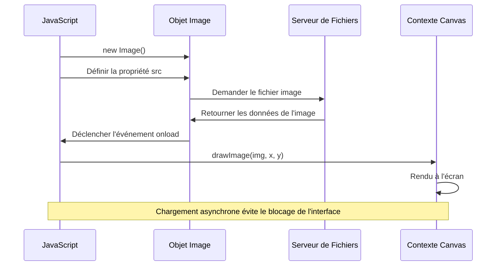
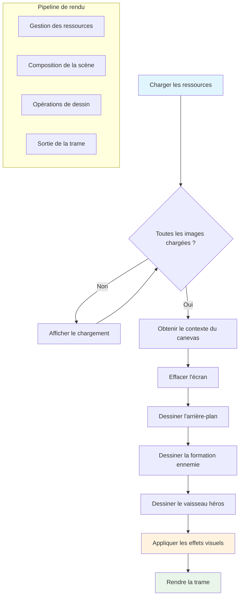
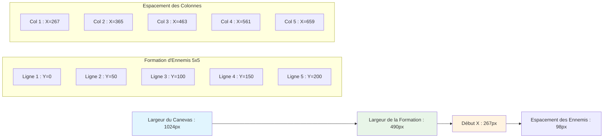
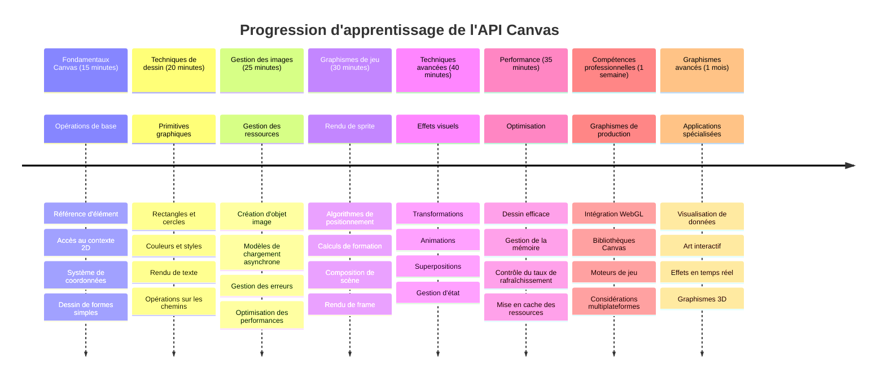

# Construire un Jeu Spatial Partie 2 : Dessiner le Héros et les Monstres sur le Canvas


L'API Canvas est l'une des fonctionnalités les plus puissantes du développement web pour créer des graphiques dynamiques et interactifs directement dans votre navigateur. Dans cette leçon, nous allons transformer cet élément HTML `<canvas>` vide en un monde de jeu rempli de héros et de monstres. Pensez au canvas comme votre planche à dessin numérique où le code devient visuel.

Nous construisons sur ce que vous avez appris dans la leçon précédente, et maintenant nous allons plonger dans les aspects visuels. Vous apprendrez à charger et afficher des sprites de jeu, à positionner précisément les éléments, et à créer la fondation visuelle de votre jeu spatial. Cela fait le pont entre les pages web statiques et les expériences dynamiques et interactives.

À la fin de cette leçon, vous aurez une scène de jeu complète avec votre vaisseau héros positionné correctement et des formations ennemies prêtes pour le combat. Vous comprendrez comment les jeux modernes rendent les graphiques dans les navigateurs et acquerrez des compétences pour créer vos propres expériences visuelles interactives. Explorons les graphiques canvas et donnons vie à votre jeu spatial !


## Quiz Pré-Cours

[Quiz pré-cours](https://ff-quizzes.netlify.app/web/quiz/31)

## Le Canvas

Alors, qu'est-ce que exactement cet élément `<canvas>` ? C'est la solution HTML5 pour créer des graphiques dynamiques et des animations dans les navigateurs web. Contrairement aux images ou vidéos classiques qui sont statiques, le canvas vous donne un contrôle au niveau du pixel sur tout ce qui apparaît à l'écran. Cela le rend parfait pour les jeux, les visualisations de données et l'art interactif. Pensez-y comme une surface de dessin programmable où JavaScript devient votre pinceau.

Par défaut, un élément canvas ressemble à un rectangle vide et transparent sur votre page. Mais c'est là que réside son potentiel ! Sa véritable puissance émerge lorsque vous utilisez JavaScript pour dessiner des formes, charger des images, créer des animations, et faire réagir les choses aux interactions utilisateur. C’est similaire à la manière dont les pionniers de l’infographie aux Bell Labs dans les années 1960 devaient programmer chaque pixel pour créer les premières animations numériques.

✅ Lisez [plus sur l’API Canvas](https://developer.mozilla.org/docs/Web/API/Canvas_API) sur MDN.

Voici comment il est typiquement déclaré, comme partie du corps de la page :

```html
<canvas id="myCanvas" width="200" height="100"></canvas>
```
  
**Voici ce que fait ce code :**  
- **Définit** l'attribut `id` pour que vous puissiez référencer cet élément canvas spécifique en JavaScript  
- **Définit** la `width` en pixels pour contrôler la largeur horizontale du canvas  
- **Établit** la `height` en pixels pour déterminer les dimensions verticales du canvas  

## Dessiner de la Géométrie Simple

Maintenant que vous savez ce qu’est le canvas, explorons comment réellement dessiner dessus ! Le canvas utilise un système de coordonnées qui peut vous sembler familier de votre cours de mathématiques, mais il y a une importante différence spécifique aux graphiques informatiques.

Le canvas utilise un système de coordonnées cartésiennes avec un axe x (horizontal) et un axe y (vertical) pour positionner tout ce que vous dessinez. Mais voici la différence clé : contrairement au système de coordonnées des mathématiques, le point d'origine `(0,0)` commence en haut à gauche, avec les valeurs x qui augmentent en allant vers la droite et les valeurs y qui augmentent en descendant. Cette approche remonte aux premiers écrans d’ordinateur où les faisceaux électroniques balayait du haut vers le bas, faisant du coin supérieur gauche le point de départ naturel.


  
> Image de [MDN](https://developer.mozilla.org/docs/Web/API/Canvas_API/Tutorial/Drawing_shapes)

Pour dessiner sur l’élément canvas, vous suivrez le même processus en trois étapes qui forme la base de tous les graphismes sur canvas. Une fois que vous faites cela quelques fois, cela devient naturel :


1. **Obtenir une référence** à votre élément Canvas depuis le DOM (comme pour n’importe quel autre élément HTML)  
2. **Obtenir le contexte de rendu 2D** – qui fournit toutes les méthodes de dessin  
3. **Commencer à dessiner !** Utilisez les méthodes intégrées du contexte pour créer vos graphismes  

Voici à quoi cela ressemble en code :

```javascript
// Étape 1 : Obtenir l'élément canvas
const canvas = document.getElementById("myCanvas");

// Étape 2 : Obtenir le contexte de rendu 2D
const ctx = canvas.getContext("2d");

// Étape 3 : Définir la couleur de remplissage et dessiner un rectangle
ctx.fillStyle = 'red';
ctx.fillRect(0, 0, 200, 200); // x, y, largeur, hauteur
```
  
**Décomposons ceci étape par étape :**  
- Nous **attrapons** notre élément canvas en utilisant son ID et le stockons dans une variable  
- Nous **obtenons** le contexte de rendu 2D – c’est notre boîte à outils pleine de méthodes de dessin  
- Nous **disons** au canvas que nous voulons remplir avec du rouge en utilisant la propriété `fillStyle`  
- Nous **dessinons** un rectangle en partant du coin supérieur gauche (0,0) qui fait 200 pixels de large et de haut  

✅ L'API Canvas se concentre principalement sur les formes 2D, mais vous pouvez aussi dessiner des éléments 3D sur un site web ; pour cela, vous pourriez utiliser l’[API WebGL](https://developer.mozilla.org/docs/Web/API/WebGL_API).

Vous pouvez dessiner toutes sortes de choses avec l’API Canvas comme :

- **Des formes géométriques**, nous avons déjà montré comment dessiner un rectangle, mais il y a beaucoup plus à dessiner.  
- **Du texte**, vous pouvez dessiner du texte avec n’importe quelle police et couleur que vous souhaitez.  
- **Des images**, vous pouvez dessiner une image à partir d’un asset d’image comme un .jpg ou .png par exemple.  

✅ Essayez ! Vous savez comment dessiner un rectangle, pouvez-vous dessiner un cercle sur une page ? Jetez un œil à des dessins Canvas intéressants sur CodePen. Voici un [exemple particulièrement impressionnant](https://codepen.io/dissimulate/pen/KrAwx).

### 🔄 **Contrôle pédagogique**  
**Compréhension des Fondamentaux du Canvas** : Avant de passer au chargement d’images, assurez-vous que vous pouvez :  
- ✅ Expliquer comment le système de coordonnées du canvas diffère des coordonnées mathématiques  
- ✅ Comprendre le processus en trois étapes des opérations de dessin sur canvas  
- ✅ Identifier ce que fournit le contexte de rendu 2D  
- ✅ Décrire comment fillStyle et fillRect fonctionnent ensemble  

**Test rapide** : Comment dessineriez-vous un cercle bleu à la position (100, 50) avec un rayon de 25 ?  
```javascript
ctx.fillStyle = 'blue';
ctx.beginPath();
ctx.arc(100, 50, 25, 0, 2 * Math.PI);
ctx.fill();
```
  
**Méthodes de dessin Canvas que vous connaissez maintenant** :  
- **fillRect()** : Dessine des rectangles remplis  
- **fillStyle** : Définit les couleurs et motifs  
- **beginPath()** : Démarre de nouveaux tracés de dessin  
- **arc()** : Crée des cercles et des courbes  

## Charger et Dessiner un Asset Image

Dessiner des formes basiques est utile pour commencer, mais la plupart des jeux ont besoin d’images réelles ! Les sprites, arrière-plans, et textures sont ce qui donne aux jeux leur attrait visuel. Charger et afficher des images sur le canvas fonctionne différemment du dessin de formes géométriques, mais c’est simple une fois qu’on comprend le processus.

Nous devons créer un objet `Image`, charger notre fichier image (cela se fait de façon asynchrone, ce qui signifie "en arrière-plan"), puis le dessiner sur le canvas une fois qu’il est prêt. Cette approche garantit que vos images s’affichent correctement sans bloquer votre application pendant leur chargement.


### Chargement d’Image Basique  

```javascript
const img = new Image();
img.src = 'path/to/my/image.png';
img.onload = () => {
  // Image chargée et prête à être utilisée
  console.log('Image loaded successfully!');
};
```
  
**Voici ce qui se passe dans ce code :**  
- Nous **créons** un tout nouvel objet Image pour contenir notre sprite ou texture  
- Nous **indiquons** quel fichier image charger en définissant le chemin source  
- Nous **écoutons** l’événement load pour savoir exactement quand l’image est prête à l’emploi  

### Une meilleure manière de charger les images

Voici une manière plus robuste de gérer le chargement des images que les développeurs professionnels utilisent couramment. Nous allons encapsuler le chargement de l’image dans une fonction basée sur Promise – cette approche, popularisée lorsque les Promises JavaScript sont devenues standard en ES6, rend votre code plus organisé et gère les erreurs proprement :

```javascript
function loadAsset(path) {
  return new Promise((resolve, reject) => {
    const img = new Image();
    img.src = path;
    img.onload = () => {
      resolve(img);
    };
    img.onerror = () => {
      reject(new Error(`Failed to load image: ${path}`));
    };
  });
}

// Utilisation moderne avec async/await
async function initializeGame() {
  try {
    const heroImg = await loadAsset('hero.png');
    const monsterImg = await loadAsset('monster.png');
    // Les images sont maintenant prêtes à être utilisées
  } catch (error) {
    console.error('Failed to load game assets:', error);
  }
}
```
  
**Ce que nous avons fait ici :**  
- **Enveloppé** toute cette logique de chargement d’image dans une Promise pour mieux la gérer  
- **Ajouté** une gestion des erreurs qui nous indique réellement quand quelque chose ne va pas  
- **Utilisé** la syntaxe moderne async/await parce qu’elle est beaucoup plus claire à lire  
- **Inclus** des blocs try/catch pour gérer élégamment les pépins de chargement  

Une fois vos images chargées, les dessiner sur le canvas est en fait assez simple :

```javascript
async function renderGameScreen() {
  try {
    // Charger les ressources du jeu
    const heroImg = await loadAsset('hero.png');
    const monsterImg = await loadAsset('monster.png');

    // Obtenir le canevas et le contexte
    const canvas = document.getElementById("myCanvas");
    const ctx = canvas.getContext("2d");

    // Dessiner les images à des positions spécifiques
    ctx.drawImage(heroImg, canvas.width / 2, canvas.height / 2);
    ctx.drawImage(monsterImg, 0, 0);
  } catch (error) {
    console.error('Failed to render game screen:', error);
  }
}
```
  
**Explorons cela étape par étape :**  
- Nous **chargeons** nos images héros et monstre en arrière-plan via await  
- Nous **attrapons** notre élément canvas et obtenons ce contexte de rendu 2D dont nous avons besoin  
- Nous **positionnons** l’image du héros exactement au centre en utilisant quelques calculs de coordonnées rapides  
- Nous **plaçons** l’image du monstre en haut à gauche pour démarrer notre formation ennemie  
- Nous **attrapons** toute erreur pouvant survenir lors du chargement ou du rendu  


## Il est maintenant temps de commencer à construire votre jeu

Nous allons maintenant tout assembler pour créer la fondation visuelle de votre jeu spatial. Vous avez une bonne compréhension des fondamentaux du canvas et des techniques de chargement d’images, cette section pratique vous guidera pour construire un écran de jeu complet avec des sprites positionnés correctement.

### Ce qu’il faut construire

Vous allez créer une page web avec un élément Canvas. Elle doit afficher un écran noir `1024*768`. Nous vous avons fourni deux images :

- Vaisseau héros

   

- Monstre 5×5

   

### Étapes recommandées pour démarrer le développement

Localisez les fichiers de démarrage qui ont été créés pour vous dans le sous-dossier `your-work`. Votre structure de projet devrait contenir :

```bash
your-work/
├── assets/
│   ├── enemyShip.png
│   └── player.png
├── index.html
├── app.js
└── package.json
```
  
**Voici avec quoi vous travaillez :**  
- **Les sprites de jeu** résident dans le dossier `assets/` pour que tout reste organisé  
- **Votre fichier HTML principal** configure l’élément canvas et prépare tout  
- **Un fichier JavaScript** où vous écrirez toute votre magie de rendu de jeu  
- **Un package.json** qui configure un serveur de développement pour que vous puissiez tester localement  

Ouvrez ce dossier dans Visual Studio Code pour commencer le développement. Vous aurez besoin d’un environnement de développement local avec Visual Studio Code, NPM, et Node.js installés. Si vous n’avez pas `npm` installé sur votre ordinateur, [voici comment l’installer](https://www.npmjs.com/get-npm).

Démarrez votre serveur de développement en naviguant vers le dossier `your-work` :

```bash
cd your-work
npm start
```
  
**Cette commande fait des choses plutôt cool :**  
- **Démarre** un serveur local à l’adresse `http://localhost:5000` pour que vous puissiez tester votre jeu  
- **Sert** correctement tous vos fichiers pour que votre navigateur puisse les charger correctement  
- **Surveille** vos fichiers pour les changements afin que vous puissiez développer sereinement  
- **Vous offre** un environnement de développement professionnel pour tout tester  

> 💡 **Note** : Votre navigateur affichera initialement une page blanche – c’est normal ! Au fur et à mesure que vous ajoutez du code, actualisez votre navigateur pour voir vos changements. Cette approche de développement itérative est similaire à la manière dont la NASA a construit l’ordinateur de guidage Apollo – en testant chaque composant avant de l’intégrer dans le système plus large.

### Ajouter du code

Ajoutez le code requis dans `your-work/app.js` pour accomplir les tâches suivantes :

1. **Dessiner un canvas avec un fond noir**  
   > 💡 **Voici comment** : Trouvez le TODO dans `/app.js` et ajoutez juste deux lignes. Réglez `ctx.fillStyle` sur noir, puis utilisez `ctx.fillRect()` à partir de (0,0) avec les dimensions de votre canvas. Facile !  

2. **Charger les textures du jeu**  
   > 💡 **Voici comment** : Utilisez `await loadAsset()` pour charger vos images joueur et ennemis. Stockez-les dans des variables pour pouvoir les utiliser plus tard. Rappelez-vous – elles n’apparaîtront pas tant que vous ne les aurez pas dessinées !  

3. **Dessiner le vaisseau héros au centre en bas**  
   > 💡 **Voici comment** : Utilisez `ctx.drawImage()` pour positionner votre héros. Pour la coordonnée x, essayez `canvas.width / 2 - 45` pour le centrer, et pour la coordonnée y utilisez `canvas.height - canvas.height / 4` pour le placer dans la zone inférieure.  

4. **Dessiner une formation 5×5 de vaisseaux ennemis**  
   > 💡 **Voici comment** : Trouvez la fonction `createEnemies` et installez une boucle imbriquée. Vous devrez faire un peu de maths pour l'espacement et le positionnement, mais ne vous inquiétez pas – je vous montrerai exactement comment faire !  

D’abord, établissez des constantes pour un bon agencement de la formation ennemie :

```javascript
const ENEMY_TOTAL = 5;
const ENEMY_SPACING = 98;
const FORMATION_WIDTH = ENEMY_TOTAL * ENEMY_SPACING;
const START_X = (canvas.width - FORMATION_WIDTH) / 2;
const STOP_X = START_X + FORMATION_WIDTH;
```
  
**Décomposons ce que font ces constantes :**  
- Nous **fixons** 5 ennemis par ligne et colonne (une belle grille 5×5)  
- Nous **définissons** l’espace entre ennemis pour qu’ils ne paraissent pas entassés  
- Nous **calculons** la largeur totale de notre formation  
- Nous **déterminons** où commencer et finir pour que la formation semble centrée  


Ensuite, créez des boucles imbriquées pour dessiner la formation ennemie :

```javascript
for (let x = START_X; x < STOP_X; x += ENEMY_SPACING) {
  for (let y = 0; y < 50 * 5; y += 50) {
    ctx.drawImage(enemyImg, x, y);
  }
}
```
  
**Voici ce que fait cette boucle imbriquée :**  
- La boucle externe **se déplace** de gauche à droite sur la formation  
- La boucle interne **va** de haut en bas pour créer des rangées nettes  
- Nous **dessinons** chaque sprite ennemi aux coordonnées x,y exactes que nous avons calculées  
- Tout reste **uniformément espacé** pour un rendu professionnel et organisé  

### 🔄 **Contrôle pédagogique**  
**Maîtrise du rendu de jeu** : Vérifiez votre compréhension du système de rendu complet :  
- ✅ Comment le chargement asynchrone des images empêche le blocage de l’interface utilisateur au démarrage du jeu ?  
- ✅ Pourquoi calculons-nous les positions de la formation ennemie avec des constantes plutôt que de coder en dur ?  
- ✅ Quel rôle le contexte de rendu 2D joue-t-il dans les opérations de dessin ?  
- ✅ Comment les boucles imbriquées créent-elles des formations organisées de sprites ?  

**Considérations de performance** : Votre jeu démontre maintenant :  
- **Chargement efficace des assets** : gestion des images basée sur Promise  
- **Rendu organisé** : opérations de dessin structurées  
- **Positionnement mathématique** : placement calculé des sprites  
- **Gestion des erreurs** : prise en charge élégante des échecs  

**Concepts de programmation visuelle** : Vous avez appris :
- **Systèmes de coordonnées** : Traduire les mathématiques en positions à l'écran  
- **Gestion des sprites** : Chargement et affichage des graphismes du jeu  
- **Algorithmes de formation** : Modèles mathématiques pour des mises en page organisées  
- **Opérations asynchrones** : JavaScript moderne pour une expérience utilisateur fluide  

## Résultat

Le résultat final devrait ressembler à ceci :


## Solution

Essayez d'abord de le résoudre vous-même mais si vous êtes bloqué, jetez un œil à une [solution](../../../../6-space-game/2-drawing-to-canvas/solution/app.js)

---

## Défi GitHub Copilot Agent 🚀

Utilisez le mode Agent pour relever le défi suivant :

**Description :** Améliorez votre canvas de jeu spatial en ajoutant des effets visuels et des éléments interactifs en utilisant les techniques de Canvas API que vous avez apprises.

**Consigne :** Créez un nouveau fichier appelé `enhanced-canvas.html` avec un canvas affichant des étoiles animées en arrière-plan, une barre de vie pulsante pour le vaisseau héros, et des vaisseaux ennemis qui descendent lentement. Incluez un code JavaScript qui dessine des étoiles scintillantes à des positions et opacités aléatoires, implémente une barre de vie qui change de couleur selon le niveau de santé (vert > jaune > rouge), et anime les vaisseaux ennemis pour qu’ils descendent à différentes vitesses à l’écran.

En savoir plus sur le [mode agent](https://code.visualstudio.com/blogs/2025/02/24/introducing-copilot-agent-mode).

## 🚀 Challenge

Vous avez appris à dessiner avec l’API Canvas 2D ; jetez un œil à l’[API WebGL](https://developer.mozilla.org/docs/Web/API/WebGL_API), et essayez de dessiner un objet 3D.

## Quiz post-cours

[Quiz post-cours](https://ff-quizzes.netlify.app/web/quiz/32)

## Revue & Auto-apprentissage

Apprenez-en davantage sur l’API Canvas en [la lisant](https://developer.mozilla.org/docs/Web/API/Canvas_API).

### ⚡ **Ce que vous pouvez faire dans les 5 prochaines minutes**
- [ ] Ouvrir la console du navigateur et créer un élément canvas avec `document.createElement('canvas')`
- [ ] Essayer de dessiner un rectangle avec `fillRect()` sur un contexte canvas
- [ ] Expérimenter avec différentes couleurs via la propriété `fillStyle`
- [ ] Dessiner un cercle simple avec la méthode `arc()`

### 🎯 **Ce que vous pouvez accomplir cette heure**
- [ ] Terminer le quiz post-leçon et comprendre les fondamentaux du canvas
- [ ] Créer une application de dessin canvas avec plusieurs formes et couleurs
- [ ] Implémenter le chargement d’images et le rendu de sprites pour votre jeu
- [ ] Construire une animation simple qui déplace des objets sur le canvas
- [ ] Pratiquer les transformations canvas comme l’échelle, la rotation et la translation

### 📅 **Votre parcours Canvas sur une semaine**
- [ ] Compléter le jeu spatial avec des graphismes polis et animations de sprites
- [ ] Maîtriser les techniques avancées de canvas comme dégradés, motifs et compositing
- [ ] Créer des visualisations interactives avec canvas pour représenter des données
- [ ] Apprendre les techniques d’optimisation du canvas pour des performances fluides
- [ ] Réaliser une application de dessin ou peinture avec divers outils
- [ ] Explorer les patterns de programmation créative et l’art génératif avec canvas

### 🌟 **Votre maîtrise graphique en un mois**
- [ ] Construire des applications graphiques complexes avec Canvas 2D et WebGL
- [ ] Apprendre les concepts de programmation graphique et les bases des shaders
- [ ] Contribuer à des bibliothèques graphiques open source et outils de visualisation
- [ ] Maîtriser l’optimisation des performances pour des applications graphiques intensives
- [ ] Créer du contenu éducatif sur la programmation canvas et l’infographie
- [ ] Devenir un expert en programmation graphique qui aide les autres à créer des expériences visuelles

## 🎯 Votre calendrier de maîtrise graphique Canvas


### 🛠️ Résumé de votre boîte à outils Canvas Graphiques

Après avoir terminé cette leçon, vous disposez désormais de :  
- **Maîtrise de l’API Canvas** : Compréhension complète de la programmation graphique 2D  
- **Mathématiques des coordonnées** : Positionnement précis et algorithmes de mise en forme  
- **Gestion des actifs** : Chargement d’images professionnel et gestion des erreurs  
- **Pipeline de rendu** : Approche structurée de composition de scènes  
- **Graphismes de jeu** : Positionnement de sprites et calculs de formation  
- **Programmation asynchrone** : Modèles modernes JavaScript pour des performances fluides  
- **Programmation visuelle** : Traduction de concepts mathématiques en graphismes à l’écran  

**Applications réelles** : Vos compétences Canvas s’appliquent directement à :  
- **Visualisation de données** : Graphiques, diagrammes et tableaux de bord interactifs  
- **Développement de jeux** : Jeux 2D, simulations et expériences interactives  
- **Art numérique** : Codage créatif et projets d’art génératif  
- **Design UI/UX** : Graphismes personnalisés et éléments interactifs  
- **Logiciels éducatifs** : Outils d’apprentissage visuel et simulations  
- **Applications web** : Graphiques dynamiques et visualisations en temps réel  

**Compétences professionnelles acquises** : Vous pouvez maintenant :  
- **Construire** des solutions graphiques personnalisées sans bibliothèques externes  
- **Optimiser** les performances de rendu pour une expérience utilisateur fluide  
- **Debuguer** des problèmes visuels complexes grâce aux outils développeur du navigateur  
- **Concevoir** des systèmes graphiques évolutifs avec des principes mathématiques  
- **Intégrer** des graphismes Canvas avec des frameworks web modernes  

**Méthodes de l’API Canvas maîtrisées** :  
- **Gestion des éléments** : getElementById, getContext  
- **Opérations de dessin** : fillRect, drawImage, fillStyle  
- **Chargement d’actifs** : Objets Image, modèles Promise  
- **Positionnement mathématique** : Calculs de coordonnées, algorithmes de formation  

**Niveau suivant** : Vous êtes prêt à ajouter animations, interactions utilisateur, détection de collisions, ou à explorer WebGL pour les graphismes 3D !

🌟 **Succès débloqué** : Vous avez construit un système complet de rendu de jeu avec les techniques fondamentales de l’API Canvas !

## Exercice

[Jouez avec l’API Canvas](assignment.md)

---

<!-- CO-OP TRANSLATOR DISCLAIMER START -->
**Avis de non-responsabilité** :
Ce document a été traduit à l'aide du service de traduction automatique [Co-op Translator](https://github.com/Azure/co-op-translator). Bien que nous nous efforcions d'assurer l'exactitude, veuillez noter que les traductions automatiques peuvent contenir des erreurs ou des inexactitudes. Le document original dans sa langue d'origine doit être considéré comme la source faisant foi. Pour toute information critique, il est recommandé de faire appel à une traduction humaine professionnelle. Nous déclinons toute responsabilité en cas de malentendus ou de mauvaises interprétations résultant de l'utilisation de cette traduction.
<!-- CO-OP TRANSLATOR DISCLAIMER END -->