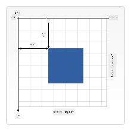

<!--
CO_OP_TRANSLATOR_METADATA:
{
  "original_hash": "056641280211e52fd0adb81b6058ec55",
  "translation_date": "2025-08-29T13:38:11+00:00",
  "source_file": "6-space-game/2-drawing-to-canvas/README.md",
  "language_code": "fr"
}
-->
# Construire un jeu spatial Partie 2 : Dessiner le héros et les monstres sur le Canvas

## Quiz avant le cours

[Quiz avant le cours](https://ff-quizzes.netlify.app/web/quiz/31)

## Le Canvas

Le canvas est un élément HTML qui, par défaut, n'a aucun contenu ; c'est une toile vierge. Vous devez y ajouter du contenu en dessinant dessus.

✅ Lisez [plus d'informations sur l'API Canvas](https://developer.mozilla.org/docs/Web/API/Canvas_API) sur MDN.

Voici comment il est généralement déclaré, en tant que partie du corps de la page :

```html
<canvas id="myCanvas" width="200" height="100"></canvas>
```

Ci-dessus, nous définissons les propriétés `id`, `width` et `height`.

- `id` : définissez cet identifiant pour pouvoir y faire référence lorsque vous devez interagir avec lui.
- `width` : c'est la largeur de l'élément.
- `height` : c'est la hauteur de l'élément.

## Dessiner des formes simples

Le Canvas utilise un système de coordonnées cartésiennes pour dessiner des éléments. Il utilise donc un axe x et un axe y pour exprimer où quelque chose est situé. La position `0,0` correspond au coin supérieur gauche, et le coin inférieur droit correspond aux valeurs WIDTH et HEIGHT que vous avez définies pour le canvas.


> Image provenant de [MDN](https://developer.mozilla.org/docs/Web/API/Canvas_API/Tutorial/Drawing_shapes)

Pour dessiner sur l'élément canvas, vous devez suivre les étapes suivantes :

1. **Obtenir une référence** à l'élément Canvas.
2. **Obtenir une référence** au contexte qui se trouve sur l'élément Canvas.
3. **Effectuer une opération de dessin** en utilisant l'élément contexte.

Le code correspondant à ces étapes ressemble généralement à ceci :

```javascript
// draws a red rectangle
//1. get the canvas reference
canvas = document.getElementById("myCanvas");

//2. set the context to 2D to draw basic shapes
ctx = canvas.getContext("2d");

//3. fill it with the color red
ctx.fillStyle = 'red';

//4. and draw a rectangle with these parameters, setting location and size
ctx.fillRect(0,0, 200, 200) // x,y,width, height
```

✅ L'API Canvas se concentre principalement sur les formes 2D, mais vous pouvez également dessiner des éléments 3D sur un site web ; pour cela, vous pourriez utiliser l'[API WebGL](https://developer.mozilla.org/docs/Web/API/WebGL_API).

Avec l'API Canvas, vous pouvez dessiner toutes sortes de choses, comme :

- **Des formes géométriques** : nous avons déjà montré comment dessiner un rectangle, mais il y a bien plus à explorer.
- **Du texte** : vous pouvez dessiner du texte avec n'importe quelle police et couleur.
- **Des images** : vous pouvez dessiner une image à partir d'une ressource comme un fichier .jpg ou .png, par exemple.

✅ Essayez-le ! Vous savez comment dessiner un rectangle, pouvez-vous dessiner un cercle sur une page ? Consultez des dessins intéressants réalisés avec Canvas sur CodePen. Voici un [exemple particulièrement impressionnant](https://codepen.io/dissimulate/pen/KrAwx).

## Charger et dessiner une ressource image

Vous chargez une ressource image en créant un objet `Image` et en définissant sa propriété `src`. Ensuite, vous écoutez l'événement `load` pour savoir quand elle est prête à être utilisée. Le code ressemble à ceci :

### Charger une ressource

```javascript
const img = new Image();
img.src = 'path/to/my/image.png';
img.onload = () => {
  // image loaded and ready to be used
}
```

### Modèle de chargement de ressource

Il est recommandé d'encapsuler le code ci-dessus dans une structure comme celle-ci, afin qu'il soit plus facile à utiliser et que vous ne tentiez de le manipuler que lorsqu'il est complètement chargé :

```javascript
function loadAsset(path) {
  return new Promise((resolve) => {
    const img = new Image();
    img.src = path;
    img.onload = () => {
      // image loaded and ready to be used
      resolve(img);
    }
  })
}

// use like so

async function run() {
  const heroImg = await loadAsset('hero.png')
  const monsterImg = await loadAsset('monster.png')
}

```

Pour dessiner des ressources de jeu à l'écran, votre code ressemblerait à ceci :

```javascript
async function run() {
  const heroImg = await loadAsset('hero.png')
  const monsterImg = await loadAsset('monster.png')

  canvas = document.getElementById("myCanvas");
  ctx = canvas.getContext("2d");
  ctx.drawImage(heroImg, canvas.width/2,canvas.height/2);
  ctx.drawImage(monsterImg, 0,0);
}
```

## Il est temps de commencer à construire votre jeu

### Ce que vous allez construire

Vous allez créer une page web avec un élément Canvas. Elle doit afficher un écran noir de `1024*768`. Nous vous avons fourni deux images :

- Vaisseau du héros

   

- Monstre 5*5

   

### Étapes recommandées pour démarrer le développement

Trouvez les fichiers qui ont été créés pour vous dans le sous-dossier `your-work`. Il devrait contenir les éléments suivants :

```bash
-| assets
  -| enemyShip.png
  -| player.png
-| index.html
-| app.js
-| package.json
```

Ouvrez une copie de ce dossier dans Visual Studio Code. Vous devez avoir un environnement de développement local configuré, de préférence avec Visual Studio Code, NPM et Node installés. Si vous n'avez pas `npm` configuré sur votre ordinateur, [voici comment faire](https://www.npmjs.com/get-npm).

Démarrez votre projet en naviguant dans le dossier `your_work` :

```bash
cd your-work
npm start
```

Cela démarrera un serveur HTTP à l'adresse `http://localhost:5000`. Ouvrez un navigateur et entrez cette adresse. Pour l'instant, la page est vide, mais cela va changer.

> Remarque : pour voir les modifications à l'écran, actualisez votre navigateur.

### Ajouter du code

Ajoutez le code nécessaire dans `your-work/app.js` pour résoudre les points suivants :

1. **Dessiner** un canvas avec un fond noir  
   > astuce : ajoutez deux lignes sous le TODO approprié dans `/app.js`, en définissant l'élément `ctx` sur noir et les coordonnées haut/gauche à 0,0, avec une hauteur et une largeur égales à celles du canvas.
2. **Charger** les textures  
   > astuce : ajoutez les images du joueur et des ennemis en utilisant `await loadTexture` et en passant le chemin de l'image. Vous ne les verrez pas encore à l'écran !
3. **Dessiner** le héros au centre de l'écran dans la moitié inférieure  
   > astuce : utilisez l'API `drawImage` pour dessiner `heroImg` à l'écran, en définissant `canvas.width / 2 - 45` et `canvas.height - canvas.height / 4)`.
4. **Dessiner** 5*5 monstres  
   > astuce : vous pouvez maintenant décommenter le code pour dessiner les ennemis à l'écran. Ensuite, allez dans la fonction `createEnemies` et complétez-la.

   Tout d'abord, définissez quelques constantes :

    ```javascript
    const MONSTER_TOTAL = 5;
    const MONSTER_WIDTH = MONSTER_TOTAL * 98;
    const START_X = (canvas.width - MONSTER_WIDTH) / 2;
    const STOP_X = START_X + MONSTER_WIDTH;
    ```

    puis, créez une boucle pour dessiner le tableau de monstres à l'écran :

    ```javascript
    for (let x = START_X; x < STOP_X; x += 98) {
        for (let y = 0; y < 50 * 5; y += 50) {
          ctx.drawImage(enemyImg, x, y);
        }
      }
    ```

## Résultat

Le résultat final devrait ressembler à ceci :


## Solution

Essayez de résoudre cela par vous-même d'abord, mais si vous êtes bloqué, consultez une [solution](../../../../6-space-game/2-drawing-to-canvas/solution/app.js).

---

## 🚀 Défi

Vous avez appris à dessiner avec l'API Canvas axée sur la 2D ; jetez un œil à l'[API WebGL](https://developer.mozilla.org/docs/Web/API/WebGL_API) et essayez de dessiner un objet 3D.

## Quiz après le cours

[Quiz après le cours](https://ff-quizzes.netlify.app/web/quiz/32)

## Révision et auto-apprentissage

Apprenez-en davantage sur l'API Canvas en [lisant à ce sujet](https://developer.mozilla.org/docs/Web/API/Canvas_API).

## Devoir

[Expérimentez avec l'API Canvas](assignment.md)

---

**Avertissement** :  
Ce document a été traduit à l'aide du service de traduction automatique [Co-op Translator](https://github.com/Azure/co-op-translator). Bien que nous nous efforcions d'assurer l'exactitude, veuillez noter que les traductions automatisées peuvent contenir des erreurs ou des inexactitudes. Le document original dans sa langue d'origine doit être considéré comme la source faisant autorité. Pour des informations critiques, il est recommandé de faire appel à une traduction professionnelle humaine. Nous déclinons toute responsabilité en cas de malentendus ou d'interprétations erronées résultant de l'utilisation de cette traduction.