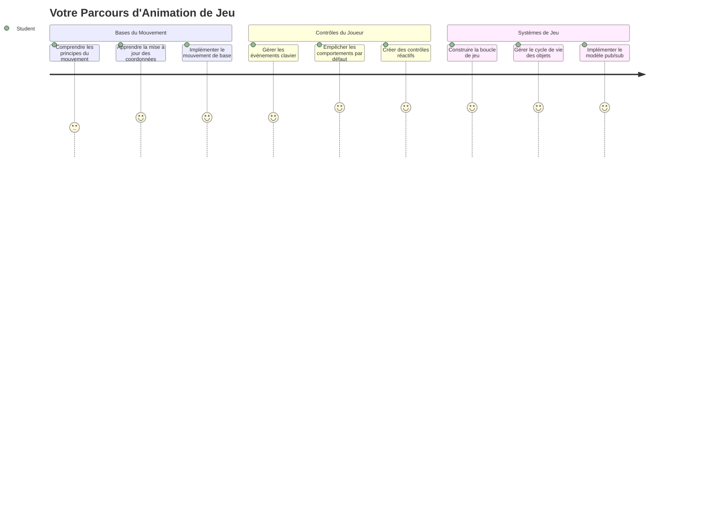
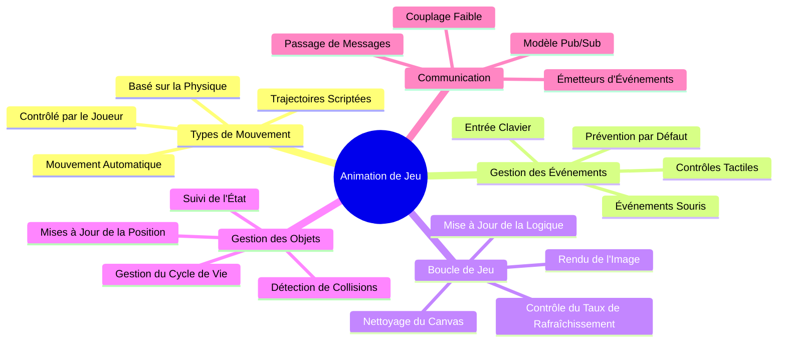
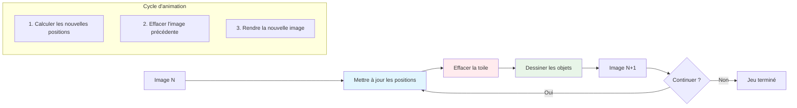
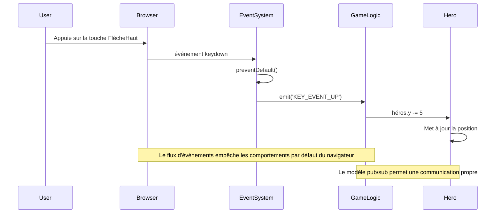
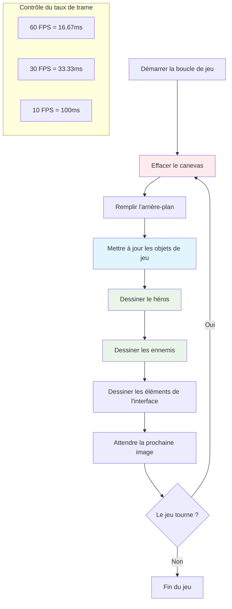
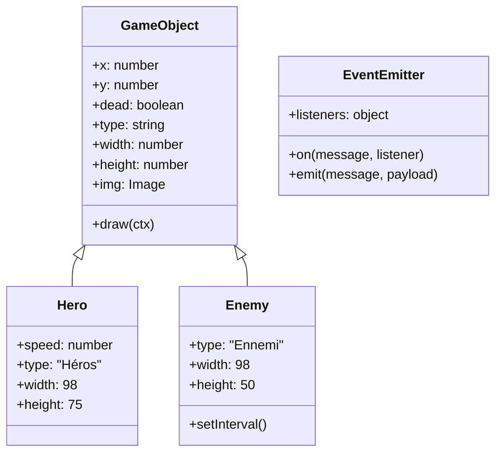
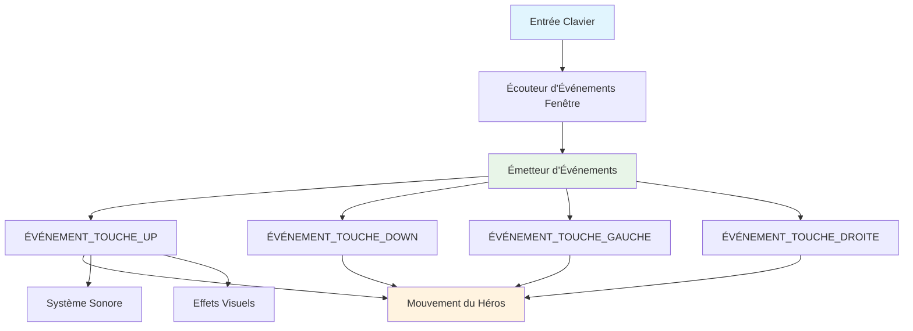
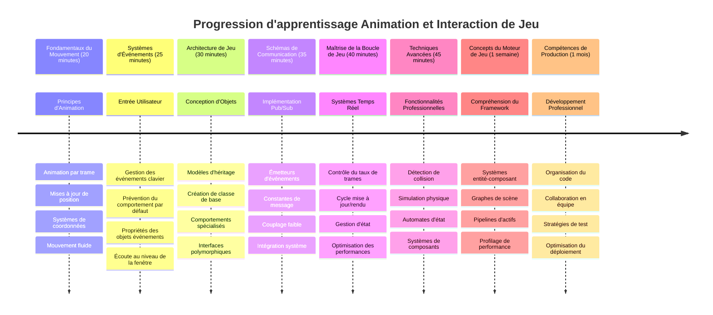

<!--
CO_OP_TRANSLATOR_METADATA:
{
  "original_hash": "8c55a2bd4bc0ebe4c88198fd563a9e09",
  "translation_date": "2026-01-06T06:24:13+00:00",
  "source_file": "6-space-game/3-moving-elements-around/README.md",
  "language_code": "fr"
}
-->
# Construire un jeu spatial Partie 3 : Ajouter du mouvement


Pensez à vos jeux préférés – ce qui les rend captivants, ce ne sont pas seulement de jolis graphismes, mais la façon dont tout bouge et répond à vos actions. Pour l'instant, votre jeu spatial est comme une belle peinture, mais nous allons ajouter du mouvement qui lui donnera vie.

Quand les ingénieurs de la NASA ont programmé l'ordinateur de guidage pour les missions Apollo, ils ont fait face à un défi similaire : comment faire en sorte qu'un vaisseau spatial réponde aux commandes du pilote tout en maintenant automatiquement les corrections de trajectoire ? Les principes que nous allons apprendre aujourd'hui font écho à ces mêmes concepts – gérer un mouvement contrôlé par le joueur parallèlement aux comportements automatiques du système.

Dans cette leçon, vous apprendrez à faire glisser des vaisseaux spatiaux à l'écran, à répondre aux commandes du joueur et à créer des mouvements fluides. Nous décomposerons tout en concepts gérables qui se construisent naturellement les uns sur les autres.

À la fin, les joueurs piloteront leur vaisseau héros autour de l'écran tandis que les vaisseaux ennemis patrouilleront au-dessus. Plus important encore, vous comprendrez les principes fondamentaux qui animent les systèmes de mouvement dans les jeux.


## Quiz pré-conférence

[Quiz pré-conférence](https://ff-quizzes.netlify.app/web/quiz/33)

## Comprendre le mouvement dans les jeux

Les jeux prennent vie lorsque les choses commencent à bouger, et il y a fondamentalement deux façons dont cela se produit :

- **Mouvement contrôlé par le joueur** : lorsque vous appuyez sur une touche ou cliquez avec la souris, quelque chose bouge. C'est la connexion directe entre vous et votre monde de jeu.
- **Mouvement automatique** : lorsque le jeu décide lui-même de déplacer des éléments – comme ces vaisseaux ennemis qui doivent patrouiller l'écran que vous fassiez quelque chose ou non.

Faire bouger des objets à l'écran d'un ordinateur est plus simple que vous ne le pensez. Vous vous souvenez de ces coordonnées x et y en cours de mathématiques ? C'est exactement avec cela que nous travaillons ici. Quand Galilée a observé les lunes de Jupiter en 1610, il faisait en quelque sorte la même chose – tracer des positions dans le temps pour comprendre les mouvements.

Faire bouger des choses à l'écran, c'est comme créer une animation en flipbook – vous devez suivre ces trois étapes simples :


1. **Mettre à jour la position** – changer l'endroit où doit se trouver votre objet (peut-être le déplacer de 5 pixels vers la droite)
2. **Effacer l'ancienne image** – nettoyer l'écran pour ne pas voir de traînées fantômes partout
3. **Dessiner la nouvelle image** – placer votre objet à son nouvel emplacement

Faites cela assez vite, et bam ! Vous obtenez un mouvement fluide qui paraît naturel aux joueurs.

Voici à quoi cela peut ressembler en code :

```javascript
// Définir l'emplacement du héros
hero.x += 5;
// Effacer le rectangle qui contient le héros
ctx.clearRect(0, 0, canvas.width, canvas.height);
// Redessiner l'arrière-plan du jeu et le héros
ctx.fillRect(0, 0, canvas.width, canvas.height);
ctx.fillStyle = "black";
ctx.drawImage(heroImg, hero.x, hero.y);
```

**Voici ce que fait ce code :**
- **Met à jour** la coordonnée x du héros de 5 pixels pour le déplacer horizontalement
- **Efface** toute la zone du canvas pour supprimer l'image précédente
- **Remplit** le canvas avec une couleur de fond noire
- **Redessine** l’image du héros à sa nouvelle position

✅ Pouvez-vous penser à une raison pour laquelle redessiner votre héros plusieurs fois par seconde pourrait engendrer des coûts de performance ? Lisez à propos des [alternatives à ce modèle](https://developer.mozilla.org/en-US/docs/Web/API/Canvas_API/Tutorial/Optimizing_canvas).

## Gérer les événements clavier

C'est ici que nous connectons la saisie du joueur à l'action du jeu. Quand quelqu'un appuie sur la barre d'espace pour tirer un laser ou touche une flèche pour esquiver un astéroïde, votre jeu doit détecter et répondre à cette saisie.

Les événements clavier se produisent au niveau de la fenêtre, ce qui signifie que toute votre fenêtre de navigateur écoute ces frappes. Les clics de souris, quant à eux, peuvent être liés à des éléments spécifiques (comme cliquer sur un bouton). Pour notre jeu spatial, nous allons nous concentrer sur les contrôles clavier car c’est ce qui donne aux joueurs cette sensation classique d’arcade.

Cela me rappelle comment, au 19ᵉ siècle, les opérateurs de télégraphe devaient traduire le morse en messages significatifs – nous faisons quelque chose de similaire, traduisant les touches en commandes de jeu.

Pour gérer un événement, vous devez utiliser la méthode `addEventListener()` de la fenêtre et lui fournir deux paramètres. Le premier paramètre est le nom de l'événement, par exemple `keyup`. Le second est la fonction qui sera invoquée lorsque l'événement se produit.

Voici un exemple :

```javascript
window.addEventListener('keyup', (evt) => {
  // evt.key = représentation sous forme de chaîne de la touche
  if (evt.key === 'ArrowUp') {
    // faire quelque chose
  }
});
```

**Décomposons ce qui se passe ici :**
- **Écoute** les événements clavier sur toute la fenêtre
- **Capture** l'objet event qui contient des informations sur la touche pressée
- **Vérifie** si la touche pressée correspond à une touche précise (dans ce cas, la flèche haut)
- **Exécute** du code lorsque la condition est remplie

Pour les événements clavier, il y a deux propriétés sur l’objet event que vous pouvez utiliser pour voir quelle touche a été pressée :

- `key` - c'est une représentation en chaîne de la touche pressée, par exemple `'ArrowUp'`
- `keyCode` - c'est une représentation numérique, par exemple `37` correspond à `ArrowLeft`

✅ La manipulation des événements clavier est utile hors du développement de jeux. À quoi d'autre cette technique pourrait-elle servir selon vous ?


### Touches spéciales : un avertissement !

Certaines touches ont des comportements intégrés au navigateur qui peuvent interférer avec votre jeu. Les touches fléchées font défiler la page et la barre d'espace fait sauter vers le bas – des comportements que vous ne voulez pas quand quelqu'un pilote son vaisseau spatial.

Nous pouvons empêcher ces comportements par défaut et laisser notre jeu gérer les entrées à la place. C’est similaire à la façon dont les premiers programmeurs informatiques devaient outrepasser les interruptions système pour créer des comportements personnalisés – nous faisons la même chose au niveau du navigateur. Voici comment :

```javascript
const onKeyDown = function (e) {
  console.log(e.keyCode);
  switch (e.keyCode) {
    case 37:
    case 39:
    case 38:
    case 40: // Flèches directionnelles
    case 32:
      e.preventDefault();
      break; // Espace
    default:
      break; // ne bloque pas les autres touches
  }
};

window.addEventListener('keydown', onKeyDown);
```

**Comprendre ce code de prévention :**
- **Vérifie** les codes de touches spécifiques qui peuvent causer un comportement indésirable du navigateur
- **Empêche** l’action par défaut du navigateur pour les flèches et la barre d’espace
- **Permet** aux autres touches de fonctionner normalement
- **Utilise** `e.preventDefault()` pour stopper le comportement intégré du navigateur

### 🔄 **Vérification pédagogique**
**Compréhension de la gestion des événements** : Avant de passer au mouvement automatique, assurez-vous de pouvoir :
- ✅ Expliquer la différence entre les événements `keydown` et `keyup`
- ✅ Comprendre pourquoi on empêche les comportements par défaut du navigateur
- ✅ Décrire comment les écouteurs d’événements connectent la saisie utilisateur à la logique du jeu
- ✅ Identifier quelles touches pourraient interférer avec les contrôles du jeu

**Auto-test rapide** : Que se passerait-il si vous ne préveniez pas le comportement par défaut pour les flèches ?
*Réponse : Le navigateur ferait défiler la page, perturbant le mouvement du jeu*

**Architecture du système d’événements** : Vous comprenez maintenant :
- **Écoute au niveau de la fenêtre** : capturer les événements au niveau du navigateur
- **Propriétés de l'objet event** : chaînes `key` vs nombres `keyCode`
- **Empêcher le comportement par défaut** : stopper les comportements indésirables du navigateur
- **Logique conditionnelle** : répondre à des combinaisons de touches spécifiques

## Mouvement induit par le jeu

Parlons maintenant des objets qui bougent sans commande du joueur. Pensez aux vaisseaux ennemis qui croisent l'écran, aux projectiles qui volent en ligne droite, ou aux nuages qui dérivent en arrière-plan. Ce mouvement autonome rend votre monde de jeu vivant même quand personne ne touche aux contrôles.

Nous utilisons les minuteries intégrées de JavaScript pour mettre à jour les positions à intervalles réguliers. Ce concept est similaire au fonctionnement des horloges à pendule – un mécanisme régulier qui déclenche des actions temporisées cohérentes. Voici à quel point cela peut être simple :

```javascript
const id = setInterval(() => {
  // Déplacer l'ennemi sur l'axe y
  enemy.y += 10;
}, 100);
```

**Voici ce que fait ce code de mouvement :**
- **Crée** une minuterie qui s’exécute toutes les 100 millisecondes
- **Met à jour** la coordonnée y de l’ennemi de 10 pixels à chaque fois
- **Stocke** l’ID de l’intervalle pour pouvoir l’arrêter plus tard si besoin
- **Déplace** l’ennemi automatiquement vers le bas de l’écran

## La boucle de jeu

Voici le concept qui relie tout – la boucle de jeu. Si votre jeu était un film, la boucle de jeu serait le projecteur, montrant image par image si vite que tout paraît se mouvoir en douceur.

Chaque jeu a une telle boucle qui tourne en arrière-plan. C’est une fonction qui met à jour tous les objets du jeu, redessine l’écran et répète ce processus en continu. Elle suit votre héros, tous les ennemis, tous les lasers qui volent – l’état complet du jeu.

Ce concept me rappelle comment les premiers animateurs cinématographiques comme Walt Disney redessinaient les personnages image après image pour créer l’illusion du mouvement. Nous faisons la même chose, mais avec du code au lieu de crayons.

Voici à quoi ressemble typiquement une boucle de jeu, exprimée en code :


```javascript
const gameLoopId = setInterval(() => {
  function gameLoop() {
    ctx.clearRect(0, 0, canvas.width, canvas.height);
    ctx.fillStyle = "black";
    ctx.fillRect(0, 0, canvas.width, canvas.height);
    drawHero();
    drawEnemies();
    drawStaticObjects();
  }
  gameLoop();
}, 200);
```

**Comprendre la structure de la boucle de jeu :**
- **Efface** tout le canvas pour supprimer l’image précédente
- **Remplit** l’arrière-plan avec une couleur unie
- **Dessine** tous les objets du jeu à leurs positions actuelles
- **Répète** ce processus toutes les 200 millisecondes pour créer une animation fluide
- **Gère** le taux de rafraîchissement en contrôlant le timing de l’intervalle

## Continuer le jeu spatial

Nous allons maintenant ajouter du mouvement à la scène statique que vous avez construite précédemment. Nous allons la transformer en une expérience interactive. Nous allons avancer étape par étape pour que chaque morceau se construise sur les précédents.

Récupérez le code là où nous nous étions arrêtés dans la leçon précédente (ou commencez avec le code dans le dossier [Part II - starter](../../../../6-space-game/3-moving-elements-around/your-work) si vous avez besoin de repartir à zéro).

**Voici ce que nous construisons aujourd’hui :**
- **Contrôles du héros** : Les flèches piloteront votre vaisseau spatial à l’écran
- **Mouvement des ennemis** : Ces vaisseaux aliens commenceront leur avance

Commençons à implémenter ces fonctionnalités.

## Étapes recommandées

Repérez les fichiers qui ont été créés pour vous dans le sous-dossier `your-work`. Il doit contenir les éléments suivants :

```bash
-| assets
  -| enemyShip.png
  -| player.png
-| index.html
-| app.js
-| package.json
```

Vous commencez votre projet dans le dossier `your-work` en tapant :

```bash
cd your-work
npm start
```

**Ce que fait cette commande :**
- **Navigue** vers le répertoire de votre projet
- **Lance** un serveur HTTP à l’adresse `http://localhost:5000`
- **Sert** vos fichiers de jeu pour que vous puissiez les tester dans un navigateur

Cela démarrera un serveur HTTP à l’adresse `http://localhost:5000`. Ouvrez un navigateur et saisissez cette adresse, vous devriez voir le héros et tous les ennemis ; rien ne bouge – pour l’instant !

### Ajouter du code

1. **Ajoutez des objets dédiés** pour `hero`, `enemy` et `game object`, ils doivent avoir des propriétés `x` et `y`. (Souvenez-vous de la partie sur [l'héritage ou la composition](../README.md)).

   *ASTUCE* `game object` devrait être celui qui possède `x` et `y` ainsi que la capacité de se dessiner sur un canvas.

   > **Conseil** : Commencez par ajouter une nouvelle classe `GameObject` avec un constructeur comme ci-dessous, puis dessinez-la sur le canvas :

    ```javascript
    class GameObject {
      constructor(x, y) {
        this.x = x;
        this.y = y;
        this.dead = false;
        this.type = "";
        this.width = 0;
        this.height = 0;
        this.img = undefined;
      }
    
      draw(ctx) {
        ctx.drawImage(this.img, this.x, this.y, this.width, this.height);
      }
    }
    ```

    **Comprendre cette classe de base :**
    - **Définit** des propriétés communes à tous les objets du jeu (position, taille, image)
    - **Inclut** un indicateur `dead` pour savoir si l’objet doit être supprimé
    - **Fournit** une méthode `draw()` qui rend l’objet sur le canvas
    - **Fixe** des valeurs par défaut pour toutes les propriétés que les classes enfants peuvent redéfinir


    Maintenant, étendez cette `GameObject` pour créer le `Hero` et l’`Enemy` :
    
    ```javascript
    class Hero extends GameObject {
      constructor(x, y) {
        super(x, y);
        this.width = 98;
        this.height = 75;
        this.type = "Hero";
        this.speed = 5;
      }
    }
    ```

    ```javascript
    class Enemy extends GameObject {
      constructor(x, y) {
        super(x, y);
        this.width = 98;
        this.height = 50;
        this.type = "Enemy";
        const id = setInterval(() => {
          if (this.y < canvas.height - this.height) {
            this.y += 5;
          } else {
            console.log('Stopped at', this.y);
            clearInterval(id);
          }
        }, 300);
      }
    }
    ```

    **Concepts clés dans ces classes :**
    - **Hérite** de `GameObject` avec le mot-clé `extends`
    - **Appelle** le constructeur parent avec `super(x, y)`
    - **Définit** des dimensions et propriétés spécifiques pour chaque type d’objet
    - **Implémente** un mouvement automatique pour les ennemis avec `setInterval()`

2. **Ajoutez des gestionnaires d’événements clavier** pour gérer la navigation (déplacer le héros haut/bas gauche/droite)

   *RAPPEL* c’est un système cartésien, le coin supérieur gauche est `0,0`. N’oubliez pas d’ajouter du code pour bloquer le *comportement par défaut*.

   > **Conseil** : Créez votre fonction `onKeyDown` et attachez-la à la fenêtre :

   ```javascript
   const onKeyDown = function (e) {
     console.log(e.keyCode);
     // Ajouter le code de la leçon ci-dessus pour arrêter le comportement par défaut
     switch (e.keyCode) {
       case 37:
       case 39:
       case 38:
       case 40: // Flèches directionnelles
       case 32:
         e.preventDefault();
         break; // Espace
       default:
         break; // ne pas bloquer les autres touches
     }
   };

   window.addEventListener("keydown", onKeyDown);
   ```
    
   **Ce que fait ce gestionnaire d’événements :**
   - **Écoute** les événements `keydown` sur toute la fenêtre
   - **Affiche** dans la console le code de la touche pour vous aider à déboguer les touches pressées
   - **Empêche** le comportement par défaut du navigateur pour les flèches et la barre d’espace
   - **Permet** aux autres touches de fonctionner normalement
   
   Regardez la console de votre navigateur à ce stade, vous verrez les frappes de touches affichées.

3. **Implémentez** le [pattern Pub-Sub](../README.md), cela gardera votre code propre dans les parties restantes.

   Le modèle Publish-Subscribe aide à organiser votre code en séparant la détection des événements de leur gestion. Cela rend votre code plus modulaire et plus facile à maintenir.

   Pour cette dernière partie, vous pouvez :

   1. **Ajouter un écouteur d’événements** sur la fenêtre :

       ```javascript
       window.addEventListener("keyup", (evt) => {
         if (evt.key === "ArrowUp") {
           eventEmitter.emit(Messages.KEY_EVENT_UP);
         } else if (evt.key === "ArrowDown") {
           eventEmitter.emit(Messages.KEY_EVENT_DOWN);
         } else if (evt.key === "ArrowLeft") {
           eventEmitter.emit(Messages.KEY_EVENT_LEFT);
         } else if (evt.key === "ArrowRight") {
           eventEmitter.emit(Messages.KEY_EVENT_RIGHT);
         }
       });
       ```

   **Ce que fait ce système d’événements :**
   - **Détecte** les entrées clavier et les convertit en événements personnalisés du jeu
   - **Sépare** la détection des entrées de la logique du jeu
   - **Facilite** le changement des contrôles sans affecter le code du jeu
   - **Permet** à plusieurs systèmes de répondre à la même entrée


   2. **Créer une classe EventEmitter** pour publier et s’abonner aux messages :

       ```javascript
       class EventEmitter {
         constructor() {
           this.listeners = {};
         }
       
         on(message, listener) {
           if (!this.listeners[message]) {
             this.listeners[message] = [];
           }
           this.listeners[message].push(listener);
         }
       
   3. **Ajouter des constantes** et configurer l’EventEmitter :

       ```javascript
       const Messages = {
         KEY_EVENT_UP: "KEY_EVENT_UP",
         KEY_EVENT_DOWN: "KEY_EVENT_DOWN",
         KEY_EVENT_LEFT: "KEY_EVENT_LEFT",
         KEY_EVENT_RIGHT: "KEY_EVENT_RIGHT",
       };
       
       let heroImg, 
           enemyImg, 
           laserImg,
           canvas, ctx, 
           gameObjects = [], 
           hero, 
           eventEmitter = new EventEmitter();
       ```

   **Comprendre la configuration :**
   - **Définit** des constantes pour les messages afin d’éviter les fautes de frappe et faciliter la refactorisation
   - **Déclare** des variables pour les images, le contexte du canvas, et l’état du jeu
   - **Crée** un émetteur d’événements global pour le système pub-sub
   - **Initialise** un tableau pour contenir tous les objets du jeu

   4. **Initialisez le jeu**

       ```javascript
       function initGame() {
         gameObjects = [];
         createEnemies();
         createHero();
       
         eventEmitter.on(Messages.KEY_EVENT_UP, () => {
           hero.y -= 5;
         });
       
         eventEmitter.on(Messages.KEY_EVENT_DOWN, () => {
           hero.y += 5;
         });
       
         eventEmitter.on(Messages.KEY_EVENT_LEFT, () => {
           hero.x -= 5;
         });
       
4. **Configurez la boucle de jeu**

   Refactorez la fonction `window.onload` pour initialiser le jeu et mettre en place une boucle de jeu avec un bon intervalle. Vous ajouterez également un faisceau laser :

    ```javascript
    window.onload = async () => {
      canvas = document.getElementById("canvas");
      ctx = canvas.getContext("2d");
      heroImg = await loadTexture("assets/player.png");
      enemyImg = await loadTexture("assets/enemyShip.png");
      laserImg = await loadTexture("assets/laserRed.png");
    
      initGame();
      const gameLoopId = setInterval(() => {
        ctx.clearRect(0, 0, canvas.width, canvas.height);
        ctx.fillStyle = "black";
        ctx.fillRect(0, 0, canvas.width, canvas.height);
        drawGameObjects(ctx);
      }, 100);
    };
    ```

   **Comprendre la configuration du jeu :**
   - **Attend** que la page soit complètement chargée avant de commencer
   - **Récupère** l’élément canvas et son contexte de rendu 2D
   - **Charge** tous les assets image de manière asynchrone avec `await`
   - **Démarre** la boucle de jeu qui tourne à des intervalles de 100 ms (10 FPS)
   - **Efface** et redessine tout l’écran à chaque image

5. **Ajoutez du code** pour déplacer les ennemis à un certain intervalle

    Refactorez la fonction `createEnemies()` pour créer les ennemis et les pousser dans la nouvelle classe gameObjects :

    ```javascript
    function createEnemies() {
      const MONSTER_TOTAL = 5;
      const MONSTER_WIDTH = MONSTER_TOTAL * 98;
      const START_X = (canvas.width - MONSTER_WIDTH) / 2;
      const STOP_X = START_X + MONSTER_WIDTH;
    
      for (let x = START_X; x < STOP_X; x += 98) {
        for (let y = 0; y < 50 * 5; y += 50) {
          const enemy = new Enemy(x, y);
          enemy.img = enemyImg;
          gameObjects.push(enemy);
        }
      }
    }
    ```

    **Ce que fait la création des ennemis :**
    - **Calcule** les positions pour centrer les ennemis sur l’écran
    - **Crée** une grille d’ennemis avec des boucles imbriquées
    - **Assigne** l’image de l’ennemi à chaque objet ennemi
    - **Ajoute** chaque ennemi dans le tableau global des objets du jeu
    
    et ajoutez une fonction `createHero()` qui fait un processus similaire pour le héros.
    
    ```javascript
    function createHero() {
      hero = new Hero(
        canvas.width / 2 - 45,
        canvas.height - canvas.height / 4
      );
      hero.img = heroImg;
      gameObjects.push(hero);
    }
    ```

    **Ce que fait la création du héros :**
    - **Positionne** le héros en bas au centre de l’écran
    - **Assigne** l’image du héros à l’objet héros
    - **Ajoute** le héros au tableau des objets du jeu pour le rendu

    et enfin, ajoutez une fonction `drawGameObjects()` pour commencer le dessin :

    ```javascript
    function drawGameObjects(ctx) {
      gameObjects.forEach(go => go.draw(ctx));
    }
    ```

    **Comprendre la fonction de dessin :**
    - **Itère** sur tous les objets du jeu dans le tableau
    - **Appelle** la méthode `draw()` sur chaque objet
    - **Passe** le contexte du canvas pour que les objets puissent se dessiner eux-mêmes

    ### 🔄 **Vérification Pédagogique**
    **Compréhension complète du système de jeu** : Vérifiez votre maîtrise de toute l’architecture :
    - ✅ Comment l’héritage permet à Hero et Enemy de partager les propriétés communes de GameObject ?
    - ✅ Pourquoi le modèle pub/sub rend votre code plus maintenable ?
    - ✅ Quel rôle joue la boucle de jeu dans la création d’une animation fluide ?
    - ✅ Comment les écouteurs d’événements connectent les entrées utilisateur au comportement des objets du jeu ?

    **Intégration système** : Votre jeu démontre maintenant :
    - **Conception orientée objet** : classes de base avec héritage spécialisé
    - **Architecture pilotée par les événements** : modèle pub/sub pour un couplage lâche
    - **Cadre d’animation** : boucle de jeu avec mises à jour de frame constantes
    - **Gestion des entrées** : événements clavier avec prévention du comportement par défaut
    - **Gestion des ressources** : chargement d’images et rendu de sprites

    **Patrons professionnels** : Vous avez implémenté :
    - **Séparation des responsabilités** : logique de jeu séparée du rendu
    - **Polymorphisme** : tous les objets du jeu partagent une interface de dessin commune
    - **Passage de messages** : communication propre entre composants
    - **Gestion des ressources** : gestion efficace des sprites et animations

    Vos ennemis devraient commencer à avancer sur votre vaisseau héros !
      }
    }
    ```
    
    and add a `createHero()` function to do a similar process for the hero.
    
    ```javascript
    function createHero() {
      hero = new Hero(
        canvas.width / 2 - 45,
        canvas.height - canvas.height / 4
      );
      hero.img = heroImg;
      gameObjects.push(hero);
    }
    ```

    et enfin, ajoutez une fonction `drawGameObjects()` pour commencer le dessin :

    ```javascript
    function drawGameObjects(ctx) {
      gameObjects.forEach(go => go.draw(ctx));
    }
    ```

    Vos ennemis devraient commencer à avancer sur votre vaisseau héros !

---

## Défi GitHub Copilot Agent 🚀

Voici un défi qui améliorera la finition de votre jeu : ajouter des limites et des contrôles fluides. Actuellement, votre héros peut sortir de l’écran, et les mouvements peuvent paraître saccadés.

**Votre mission :** Faites en sorte que votre vaisseau spatial se comporte de façon plus réaliste en implémentant des limites à l’écran et un mouvement fluide. C’est similaire à la façon dont les systèmes de contrôle de vol de la NASA empêchent les engins spatiaux de dépasser des paramètres opérationnels sûrs.

**Voici ce qu’il faut construire :** Créez un système qui maintient votre vaisseau héros à l’intérieur de l’écran, et faites en sorte que les commandes soient fluides. Quand le joueur maintient une touche fléchée enfoncée, le vaisseau doit glisser de manière continue plutôt que d’avancer par sauts discrets. Envisagez d’ajouter un retour visuel lorsque le vaisseau touche les limites de l’écran – peut-être un effet subtil indiquant la bordure de la zone de jeu.

En savoir plus sur [le mode agent](https://code.visualstudio.com/blogs/2025/02/24/introducing-copilot-agent-mode) ici.

## 🚀 Défi

L’organisation du code devient de plus en plus importante à mesure que les projets grandissent. Vous avez peut-être remarqué que votre fichier devient surchargé avec fonctions, variables et classes mêlées ensemble. Cela me rappelle comment les ingénieurs de la mission Apollo ont dû créer des systèmes clairs et maintenables sur lesquels plusieurs équipes pouvaient travailler simultanément.

**Votre mission :**
Pensez comme un architecte logiciel. Comment organiseriez-vous votre code pour que dans six mois, vous (ou un collègue) puissiez comprendre ce qui se passe ? Même si tout reste dans un seul fichier pour l’instant, vous pouvez créer une meilleure organisation :

- **Regrouper les fonctions liées** avec des en-têtes de commentaires clairs
- **Séparer les responsabilités** - garder la logique du jeu séparée du rendu
- **Utiliser des conventions de nommage** cohérentes pour variables et fonctions
- **Créer des modules** ou namespaces pour organiser les différents aspects de votre jeu
- **Ajouter de la documentation** qui explique le but de chaque section majeure

**Questions de réflexion :**
- Quelles parties de votre code sont les plus difficiles à comprendre lors d’un retour ultérieur ?
- Comment pourriez-vous organiser votre code pour faciliter la contribution d’une autre personne ?
- Que se passerait-il si vous vouliez ajouter de nouvelles fonctionnalités comme des power-ups ou différents types d’ennemis ?

## Quiz post-lecture

[Quiz post-lecture](https://ff-quizzes.netlify.app/web/quiz/34)

## Revue & Auto-apprentissage

Nous avons tout construit à partir de zéro, ce qui est fantastique pour apprendre, mais voici un petit secret – il existe d’excellents frameworks JavaScript qui peuvent se charger de beaucoup de tâches lourdes pour vous. Une fois que vous serez à l’aise avec les fondamentaux que nous avons abordés, il vaut la peine de [explorer ce qui est disponible](https://github.com/collections/javascript-game-engines).

Pensez aux frameworks comme à une boîte à outils bien équipée plutôt que de fabriquer chaque outil à la main. Ils peuvent résoudre de nombreux défis d’organisation du code dont nous avons parlé, en plus d’offrir des fonctionnalités qu’il vous faudrait des semaines pour coder vous-même.

**Choses qui valent la peine d’être explorées :**
- Comment les moteurs de jeu organisent le code – vous serez émerveillé par les patrons ingénieux qu’ils utilisent
- Astuces de performance pour faire tourner les jeux canvas parfaitement fluides  
- Fonctionnalités modernes de JavaScript qui peuvent rendre votre code plus propre et plus maintenable
- Différentes approches pour gérer les objets du jeu et leurs relations

## 🎯 Votre calendrier de maîtrise de l’animation de jeu


### 🛠️ Résumé de votre boîte à outils de développement de jeu

Après avoir complété cette leçon, vous avez maintenant maîtrisé :
- **Principes d’animation** : mouvement basé sur les frames et transitions fluides
- **Programmation pilotée par événements** : gestion des entrées clavier avec une bonne gestion des événements
- **Conception orientée objet** : hiérarchies d’héritage et interfaces polymorphes
- **Patrons de communication** : architecture pub/sub pour un code maintenable
- **Architecture de boucle de jeu** : cycles de mise à jour et de rendu en temps réel
- **Systèmes d’entrée** : cartographie du contrôle utilisateur avec prévention des comportements par défaut
- **Gestion des ressources** : chargement de sprites et techniques de rendu efficaces

### ⚡ **Ce que vous pouvez faire dans les 5 prochaines minutes**
- [ ] Ouvrir la console du navigateur et essayer `addEventListener('keydown', console.log)` pour voir les événements clavier
- [ ] Créer un simple élément div et le déplacer avec les flèches du clavier
- [ ] Expérimenter avec `setInterval` pour créer un mouvement continu
- [ ] Essayer de prévenir le comportement par défaut avec `event.preventDefault()`

### 🎯 **Ce que vous pouvez accomplir cette heure**
- [ ] Compléter le quiz post-lesson et comprendre la programmation pilotée par événements
- [ ] Construire le vaisseau héros mobile avec commandes clavier complètes
- [ ] Implémenter des mouvements fluides d’ennemis
- [ ] Ajouter des limites pour empêcher les objets de jeu de sortir de l’écran
- [ ] Créer une détection basique de collision entre objets du jeu

### 📅 **Votre parcours d’animation sur une semaine**
- [ ] Terminer le jeu spatial complet avec mouvements et interactions polis
- [ ] Ajouter des schémas de mouvements avancés comme courbes, accélération et physique
- [ ] Implémenter des transitions fluides et fonctions d’easing
- [ ] Créer des effets de particules et systèmes de retour visuel
- [ ] Optimiser la performance du jeu pour du 60fps fluide
- [ ] Ajouter des contrôles tactiles mobiles et un design responsive

### 🌟 **Votre développement interactif sur un mois**
- [ ] Construire des applications interactives complexes avec des systèmes d’animation avancés
- [ ] Apprendre des bibliothèques d’animation comme GSAP ou créer votre propre moteur d’animation
- [ ] Contribuer à des projets open source de développement de jeux et d’animation
- [ ] Maîtriser l’optimisation des performances pour des applications graphiques intensives
- [ ] Créer du contenu pédagogique sur le développement de jeux et l’animation
- [ ] Constituer un portfolio montrant vos compétences avancées en programmation interactive

**Applications réelles** : Vos compétences en animation de jeu s’appliquent directement à :
- **Applications Web interactives** : tableaux de bord dynamiques et interfaces en temps réel
- **Visualisation de données** : graphiques animés et graphismes interactifs
- **Logiciels éducatifs** : simulations interactives et outils d’apprentissage
- **Développement mobile** : jeux tactiles et gestion des gestes
- **Applications de bureau** : apps Electron avec animations fluides
- **Animations Web** : bibliothèques CSS et JavaScript d’animation

**Compétences professionnelles acquises** : Vous pouvez maintenant :
- **Architecturer** des systèmes pilotés par événements évolutifs
- **Implémenter** des animations fluides via des principes mathématiques
- **Déboguer** des systèmes d’interaction complexes avec les outils développeurs
- **Optimiser** la performance des jeux pour différents appareils et navigateurs
- **Concevoir** des structures de code maintenables avec des patrons éprouvés

**Concepts de développement de jeux maîtrisés** :
- **Gestion du taux de rafraîchissement** : comprendre les FPS et le contrôle du timing
- **Gestion des entrées** : systèmes clavier et événement multi-plateformes
- **Cycle de vie des objets** : création, mise à jour et destruction
- **Synchronisation d’état** : garder l’état du jeu cohérent à travers les frames
- **Architecture événementielle** : communication découplée entre systèmes de jeu

**Niveau supérieur** : Vous êtes prêt à ajouter détection de collisions, systèmes de score, effets sonores, ou à explorer des frameworks modernes comme Phaser ou Three.js !

🌟 **Succès débloqué** : Vous avez construit un système de jeu interactif complet avec une architecture professionnelle !

## Devoir

[Commentez votre code](assignment.md)

---

<!-- CO-OP TRANSLATOR DISCLAIMER START -->
**Avertissement** :  
Ce document a été traduit à l’aide du service de traduction automatisée [Co-op Translator](https://github.com/Azure/co-op-translator). Bien que nous nous efforçons d’assurer l’exactitude, veuillez noter que les traductions automatisées peuvent contenir des erreurs ou des inexactitudes. Le document original dans sa langue d’origine doit être considéré comme la source faisant autorité. Pour les informations critiques, une traduction professionnelle humaine est recommandée. Nous ne sommes pas responsables des malentendus ou des interprétations erronées résultant de l’utilisation de cette traduction.
<!-- CO-OP TRANSLATOR DISCLAIMER END -->