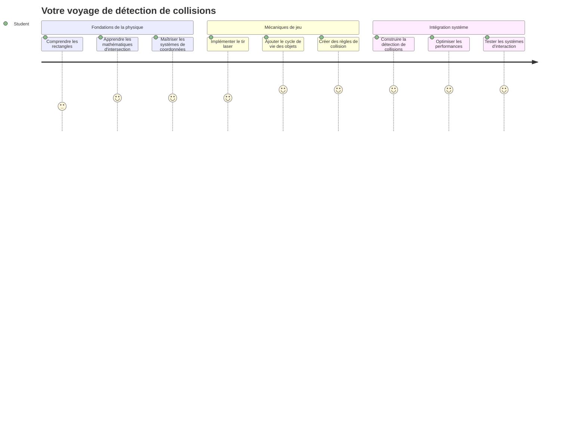
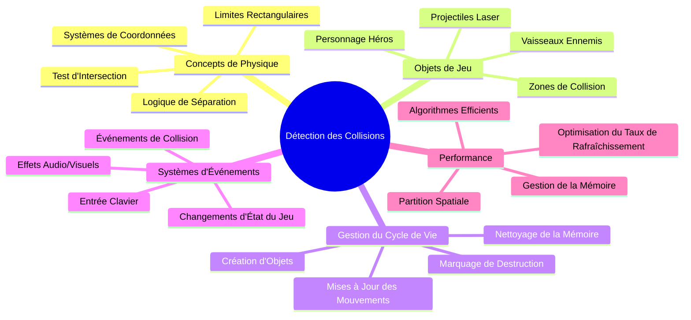
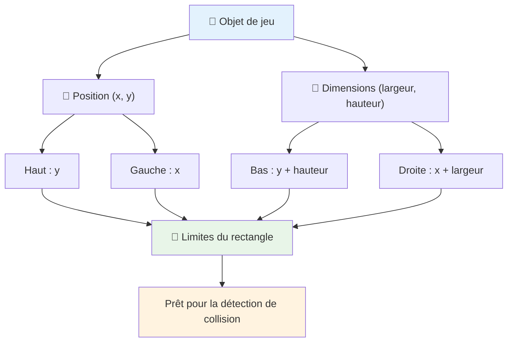
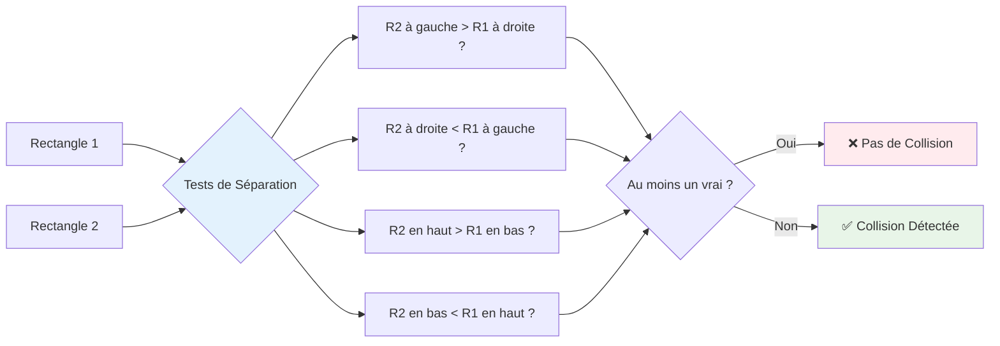
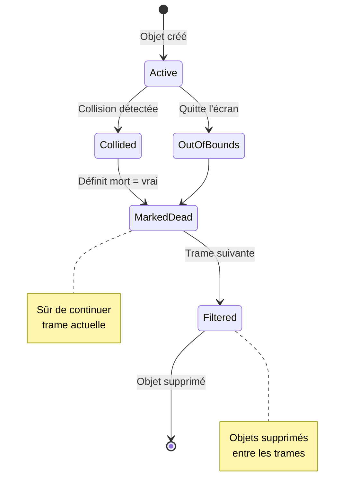
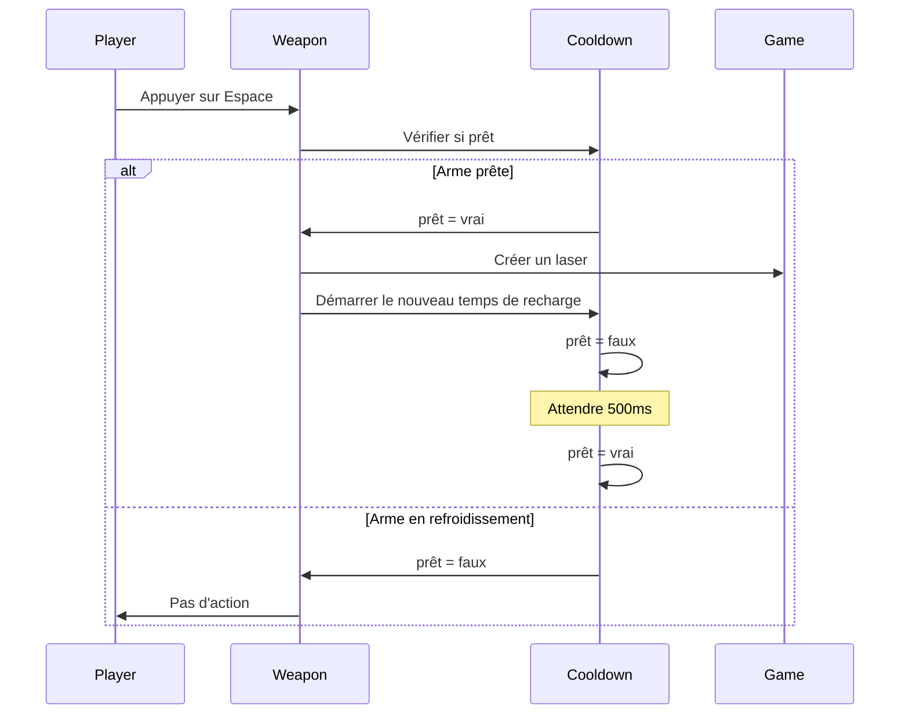
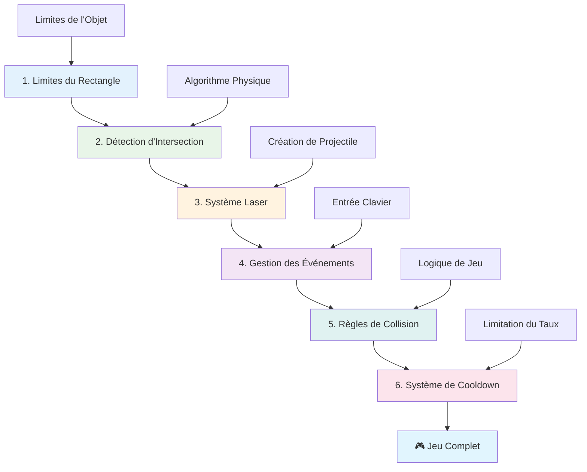
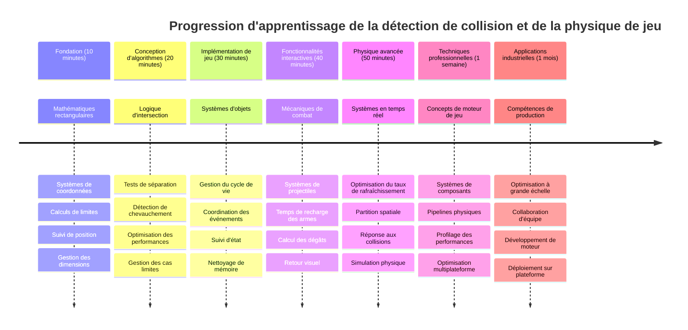

# Construire un jeu spatial Partie 4 : Ajouter un laser et détecter les collisions


## Quiz avant le cours

[Quiz avant le cours](https://ff-quizzes.netlify.app/web/quiz/35)

Pensez au moment dans Star Wars où les torpilles à protons de Luke frappent la bouche d’aération de l’Étoile de la Mort. Cette détection précise de collision a changé le destin de la galaxie ! Dans les jeux, la détection de collision fonctionne de la même manière : elle détermine quand les objets interagissent et ce qui se passe ensuite.

Dans cette leçon, vous allez ajouter des armes laser à votre jeu spatial et implémenter la détection de collision. Tout comme les planificateurs de mission de la NASA calculent les trajectoires des engins spatiaux pour éviter les débris, vous apprendrez à détecter quand les objets du jeu s’intersectent. Nous décomposerons cela en étapes gérables qui s’appuient les unes sur les autres.

À la fin, vous aurez un système de combat fonctionnel où les lasers détruisent les ennemis et les collisions déclenchent des événements de jeu. Ces mêmes principes de collision sont utilisés dans tout, des simulations physiques aux interfaces web interactives.


✅ Faites un peu de recherche sur le tout premier jeu vidéo jamais écrit. Quelle était sa fonctionnalité ?

## Détection de collision

La détection de collision fonctionne comme les capteurs de proximité du module lunaire Apollo - elle vérifie constamment les distances et déclenche des alertes quand des objets se rapprochent trop. Dans les jeux, ce système détermine quand les objets interagissent et ce qui doit se passer ensuite.

L’approche que nous allons utiliser considère chaque objet du jeu comme un rectangle, similaire à la façon dont les systèmes de contrôle du trafic aérien utilisent des formes géométriques simplifiées pour suivre les avions. Cette méthode rectangulaire peut sembler basique, mais elle est efficace en calcul et fonctionne bien pour la plupart des scénarios de jeu.

### Représentation rectangle

Chaque objet du jeu a besoin de coordonnées limites, comme le rover Mars Pathfinder a cartographié son emplacement à la surface martienne. Voici comment nous définissons ces coordonnées limites :


```javascript
rectFromGameObject() {
  return {
    top: this.y,
    left: this.x,
    bottom: this.y + this.height,
    right: this.x + this.width
  }
}
```

**Décomposons cela :**
- **Bord supérieur** : C’est simplement où commence votre objet verticalement (sa position y)
- **Bord gauche** : Où il commence horizontalement (sa position x) 
- **Bord inférieur** : Ajoutez la hauteur à la position y - maintenant vous savez où il finit !
- **Bord droit** : Ajoutez la largeur à la position x - et vous avez la limite complète

### Algorithme d’intersection

La détection d’intersections de rectangles utilise une logique similaire à celle du télescope spatial Hubble pour déterminer si des objets célestes se chevauchent dans son champ de vision. L’algorithme vérifie la séparation :


```javascript
function intersectRect(r1, r2) {
  return !(r2.left > r1.right ||
    r2.right < r1.left ||
    r2.top > r1.bottom ||
    r2.bottom < r1.top);
}
```

**Le test de séparation fonctionne comme un système radar :**
- Le rectangle 2 est-il complètement à droite du rectangle 1 ?
- Le rectangle 2 est-il complètement à gauche du rectangle 1 ?
- Le rectangle 2 est-il complètement en dessous du rectangle 1 ?
- Le rectangle 2 est-il complètement au-dessus du rectangle 1 ?

Si aucune de ces conditions n’est vraie, les rectangles doivent se chevaucher. Cette approche reflète la façon dont les opérateurs radar déterminent si deux avions sont à des distances sûres.

## Gestion du cycle de vie des objets

Quand un laser touche un ennemi, les deux objets doivent être retirés du jeu. Cependant, supprimer des objets en plein milieu d'une boucle peut provoquer des plantages - une leçon apprise à la dure avec les premiers systèmes informatiques comme l’ordinateur de guidage Apollo. À la place, nous utilisons une approche de "marquage pour suppression" qui supprime en toute sécurité les objets entre les images.


Voici comment nous marquons un objet pour suppression :

```javascript
// Marquer l'objet pour suppression
enemy.dead = true;
```

**Pourquoi cette approche fonctionne :**
- Nous marquons l'objet comme "mort" mais ne le supprimons pas immédiatement
- Cela permet à la trame de jeu actuelle de se terminer en toute sécurité
- Pas de plantages dus à l'utilisation d'un objet déjà supprimé !

Puis filtrez les objets marqués avant le prochain cycle de rendu :

```javascript
gameObjects = gameObjects.filter(go => !go.dead);
```

**Ce que fait ce filtrage :**
- Crée une nouvelle liste contenant uniquement les objets "vivants"
- Élimine tout ce qui est marqué comme mort
- Maintient votre jeu fluide
- Empêche la surconsommation mémoire due à l'accumulation d'objets détruits

## Mise en œuvre des mécaniques du laser

Les projectiles laser dans les jeux fonctionnent sur le même principe que les torpilles à photons dans Star Trek – ce sont des objets discrets qui voyagent en ligne droite jusqu’à ce qu’ils touchent quelque chose. Chaque pression sur la barre d’espace crée un nouvel objet laser qui se déplace à l’écran.

Pour que cela fonctionne, nous devons coordonner plusieurs éléments :

**Composants clés à mettre en œuvre :**
- **Créer** des objets laser qui apparaissent depuis la position du héros
- **Gérer** l’entrée clavier pour déclencher la création de lasers
- **Gérer** le mouvement et le cycle de vie des lasers
- **Implémenter** une représentation visuelle pour les projectiles laser

## Implémentation du contrôle du taux de tir

Un taux de tir illimité surchargerait le moteur de jeu et rendrait le gameplay trop facile. Les vrais systèmes d’armes ont des contraintes similaires – même les phasers de l’USS Enterprise avaient besoin de temps pour se recharger entre les tirs.

Nous allons mettre en place un système de cooldown (temps de recharge) qui empêche les tirs en rafale tout en maintenant des commandes réactives :


```javascript
class Cooldown {
  constructor(time) {
    this.cool = false;
    setTimeout(() => {
      this.cool = true;
    }, time);
  }
}

class Weapon {
  constructor() {
    this.cooldown = null;
  }
  
  fire() {
    if (!this.cooldown || this.cooldown.cool) {
      // Créer un projectile laser
      this.cooldown = new Cooldown(500);
    } else {
      // L'arme est encore en refroidissement
    }
  }
}
```

**Comment fonctionne le cooldown :**
- Quand l’arme est créée, elle est "chaude" (on ne peut pas tirer immédiatement)
- Après la période de délai, elle devient "froide" (prête à tirer)
- Avant de tirer, on vérifie : "L’arme est-elle froide ?"
- Cela empêche les clics intempestifs tout en gardant des commandes réactives

✅ Référez-vous à la leçon 1 de la série du jeu spatial pour vous rappeler les cooldowns.

## Construction du système de collision

Vous allez étendre votre code de jeu spatial existant pour créer un système de détection de collision. Comme le système automatique d’évitement de collision de la Station Spatiale Internationale, votre jeu surveillera en continu les positions des objets et réagira aux intersections.

En partant du code de votre leçon précédente, vous ajouterez la détection de collisions avec des règles spécifiques qui gouvernent les interactions d’objets.

> 💡 **Astuce Pro** : Le sprite laser est déjà inclus dans votre dossier d’actifs et référencé dans votre code, prêt à être utilisé.

### Règles de collision à implémenter

**Mécaniques de jeu à ajouter :**
1. **Laser touche ennemi** : L’objet ennemi est détruit lorsqu’il est frappé par un projectile laser
2. **Laser touche la bordure de l’écran** : Le laser est supprimé lorsqu’il atteint le bord supérieur de l’écran
3. **Collision ennemi et héros** : Les deux objets sont détruits lorsqu’ils s’intersectent
4. **Ennemi atteint le bas** : Condition de fin de jeu quand les ennemis atteignent le bas de l’écran

### 🔄 **Point Pédagogique**
**Fondements de la détection de collision** : Avant d’implémenter, assurez-vous de comprendre :
- ✅ Comment les limites rectangulaires définissent les zones de collision
- ✅ Pourquoi le test de séparation est plus efficace que le calcul d’intersection
- ✅ L’importance de la gestion du cycle de vie des objets dans les boucles de jeu
- ✅ Comment les systèmes pilotés par événements coordonnent les réponses aux collisions

**Auto-test rapide** : Que se passerait-il si vous supprimiez les objets immédiatement au lieu de les marquer ?
*Réponse : La suppression en milieu de boucle pourrait provoquer des plantages ou passer des objets en revue sans les traiter*

**Compréhension physique** : Vous avez maintenant compris :
- **Systèmes de coordonnées** : Comment position et dimensions créent des limites
- **Logique d’intersection** : Principes mathématiques derrière la détection de collision
- **Optimisation des performances** : Pourquoi les algorithmes efficaces sont essentiels en temps réel
- **Gestion mémoire** : Des patterns sûrs de cycle de vie des objets pour la stabilité

## Configuration de votre environnement de développement

Bonne nouvelle – nous avons déjà préparé la majeure partie des bases pour vous ! Tous vos actifs de jeu et la structure de base attendent dans le sous-dossier `your-work`, prêts à ce que vous y ajoutiez les fonctionnalités de collision avancées.

### Structure du projet

```bash
-| assets
  -| enemyShip.png
  -| player.png
  -| laserRed.png
-| index.html
-| app.js
-| package.json
```

**Comprendre la structure des fichiers :**
- **Contient** toutes les images sprites nécessaires pour les objets du jeu
- **Inclut** le document HTML principal et le fichier d’application JavaScript
- **Fournit** une configuration de package pour le serveur de développement local

### Démarrage du serveur de développement

Naviguez dans votre dossier projet et lancez le serveur local :

```bash
cd your-work
npm start
```

**Cette séquence de commandes :**
- **Change** le répertoire vers votre dossier de travail
- **Démarre** un serveur HTTP local sur `http://localhost:5000`
- **Servez** vos fichiers de jeu pour tests et développement
- **Permet** le développement en direct avec rechargement automatique

Ouvrez votre navigateur et dirigez-vous vers `http://localhost:5000` pour voir l’état actuel de votre jeu avec le héros et les ennemis affichés à l’écran.

### Implémentation étape par étape

Comme l’approche systématique utilisée par la NASA pour programmer la sonde Voyager, nous implémenterons la détection de collision méthodiquement, en construisant chaque composant étape par étape.


#### 1. Ajouter des limites de collision rectangulaires

D’abord, enseignons à nos objets de jeu comment décrire leurs limites. Ajoutez cette méthode à votre classe `GameObject` :

```javascript
rectFromGameObject() {
    return {
      top: this.y,
      left: this.x,
      bottom: this.y + this.height,
      right: this.x + this.width,
    };
  }
```

**Cette méthode réalise :**
- **Crée** un objet rectangle avec des coordonnées limites précises
- **Calcule** les bords inférieur et droit en utilisant position plus dimensions
- **Retourne** un objet prêt pour les algorithmes de détection de collision
- **Fournit** une interface standardisée pour tous les objets du jeu

#### 2. Implémenter la détection d’intersection

Créons maintenant notre détective de collision - une fonction qui peut dire quand deux rectangles se chevauchent :

```javascript
function intersectRect(r1, r2) {
  return !(
    r2.left > r1.right ||
    r2.right < r1.left ||
    r2.top > r1.bottom ||
    r2.bottom < r1.top
  );
}
```

**Cet algorithme fonctionne en :**
- **Testant** quatre conditions de séparation entre les rectangles
- **Renvoyant** `false` si une condition de séparation est vraie
- **Indiquant** une collision quand il n’y a pas de séparation
- **Utilisant** la négation logique pour un test d’intersection efficace

#### 3. Implémenter le système de tir laser

Voici la partie excitante ! Mettons en place le système de tir laser.

##### Constantes de messages

D’abord, définissons quelques types de messages pour que les différentes parties de notre jeu puissent communiquer :

```javascript
KEY_EVENT_SPACE: "KEY_EVENT_SPACE",
COLLISION_ENEMY_LASER: "COLLISION_ENEMY_LASER",
COLLISION_ENEMY_HERO: "COLLISION_ENEMY_HERO",
```

**Ces constantes offrent :**
- **Standardisation** des noms d’événements dans toute l’application
- **Communication cohérente** entre les systèmes de jeu
- **Prévention** des fautes de frappe dans l’enregistrement des gestionnaires d’événements

##### Gestion des entrées clavier

Ajoutez la détection de la touche espace dans votre écouteur d’événements clavier :

```javascript
} else if(evt.keyCode === 32) {
  eventEmitter.emit(Messages.KEY_EVENT_SPACE);
}
```

**Ce gestionnaire d’entrée :**
- **Détecte** les pressions sur la touche espace avec keyCode 32
- **Émet** un message d’événement standardisé
- **Permet** une logique de tir découplée

##### Configuration de l’écouteur d’événements

Enregistrez le comportement de tir dans votre fonction `initGame()` :

```javascript
eventEmitter.on(Messages.KEY_EVENT_SPACE, () => {
 if (hero.canFire()) {
   hero.fire();
 }
});
```

**Cet écouteur d’événements :**
- **Répond** aux événements de touche espace
- **Vérifie** le statut du cooldown de tir
- **Déclenche** la création de lasers quand c’est autorisé

Ajoutez la gestion des collisions laser-ennemi :

```javascript
eventEmitter.on(Messages.COLLISION_ENEMY_LASER, (_, { first, second }) => {
  first.dead = true;
  second.dead = true;
});
```

**Ce gestionnaire de collision :**
- **Reçoit** les données d’événement de collision avec les deux objets
- **Marque** les deux objets pour suppression
- **Assure** un nettoyage approprié après la collision

#### 4. Créer la classe Laser

Implémentez un projectile laser qui se déplace vers le haut et gère son propre cycle de vie :

```javascript
class Laser extends GameObject {
  constructor(x, y) {
    super(x, y);
    this.width = 9;
    this.height = 33;
    this.type = 'Laser';
    this.img = laserImg;
    
    let id = setInterval(() => {
      if (this.y > 0) {
        this.y -= 15;
      } else {
        this.dead = true;
        clearInterval(id);
      }
    }, 100);
  }
}
```

**Cette implémentation de classe :**
- **Étend** GameObject pour hériter de la fonctionnalité de base
- **Définit** les dimensions appropriées pour le sprite laser
- **Crée** un mouvement automatique vers le haut avec `setInterval()`
- **Gère** l’auto-destruction en atteignant le haut de l’écran
- **Gère** son propre timing d’animation et nettoyage

#### 5. Implémenter le système de détection de collision

Créez une fonction complète de détection de collision :

```javascript
function updateGameObjects() {
  const enemies = gameObjects.filter(go => go.type === 'Enemy');
  const lasers = gameObjects.filter(go => go.type === "Laser");
  
  // Tester les collisions entre laser et ennemi
  lasers.forEach((laser) => {
    enemies.forEach((enemy) => {
      if (intersectRect(laser.rectFromGameObject(), enemy.rectFromGameObject())) {
        eventEmitter.emit(Messages.COLLISION_ENEMY_LASER, {
          first: laser,
          second: enemy,
        });
      }
    });
  });

  // Supprimer les objets détruits
  gameObjects = gameObjects.filter(go => !go.dead);
}
```

**Ce système de collision :**
- **Filtre** les objets de jeu par type pour un test efficace
- **Teste** chaque laser contre chaque ennemi pour les intersections
- **Émet** des événements de collision quand des intersections sont détectées
- **Nettoie** les objets détruits après le traitement des collisions

> ⚠️ **Important** : Ajoutez `updateGameObjects()` à votre boucle principale dans `window.onload` pour activer la détection des collisions.

#### 6. Ajouter un système de cooldown à la classe Hero

Améliorez la classe Hero avec des mécaniques de tir et limitation du taux de tir :

```javascript
class Hero extends GameObject {
  constructor(x, y) {
    super(x, y);
    this.width = 99;
    this.height = 75;
    this.type = "Hero";
    this.speed = { x: 0, y: 0 };
    this.cooldown = 0;
  }
  
  fire() {
    gameObjects.push(new Laser(this.x + 45, this.y - 10));
    this.cooldown = 500;

    let id = setInterval(() => {
      if (this.cooldown > 0) {
        this.cooldown -= 100;
      } else {
        clearInterval(id);
      }
    }, 200);
  }
  
  canFire() {
    return this.cooldown === 0;
  }
}
```

**Comprendre la classe Hero améliorée :**
- **Initialise** un minuteur de cooldown à zéro (prêt à tirer)
- **Crée** des objets laser positionnés au-dessus du vaisseau du héros
- **Définit** la période de cooldown pour éviter les tirs rapides
- **Décrémente** le minuteur de cooldown via des mises à jour basées sur intervalle
- **Fournit** une méthode `canFire()` pour vérifier si le tir est possible

### 🔄 **Point Pédagogique**
**Compréhension complète du système** : Vérifiez votre maîtrise du système de collision :
- ✅ Comment les limites rectangulaires permettent une détection efficace des collisions ?
- ✅ Pourquoi la gestion du cycle de vie des objets est cruciale pour la stabilité du jeu ?
- ✅ Comment le système de cooldown prévient les problèmes de performance ?
- ✅ Quel rôle joue l’architecture pilotée par événements dans la gestion des collisions ?

**Intégration système** : Votre détection de collision démontre :
- **Précision mathématique** : Algorithmes d’intersection de rectangles
- **Optimisation des performances** : Modèles efficaces de test de collision
- **Gestion mémoire** : Création et destruction d’objets sûre
- **Coordination événementielle** : Communication découplée des systèmes
- **Traitement en temps réel** : Cycles de mise à jour par image

**Patterns professionnels** : Vous avez mis en œuvre :
- **Séparation des préoccupations** : Physique, rendu, et entrée séparés
- **Conception orientée objet** : Héritage et polymorphisme
- **Gestion d’état** : Cycle de vie des objets et suivi d’état de jeu
- **Optimisation de performance** : Algorithmes efficaces pour usage temps réel

### Tester votre implémentation

Votre jeu spatial intègre désormais une détection complète des collisions et des mécaniques de combat. 🚀 Testez ces nouvelles capacités :
- **Déplacez-vous** avec les touches fléchées pour vérifier les contrôles de mouvement
- **Tirez des lasers** avec la barre d’espace – remarquez comment le cooldown empêche les tirs en rafale
- **Observez les collisions** quand les lasers touchent les ennemis, déclenchant la suppression
- **Vérifiez le nettoyage** lorsque les objets détruits disparaissent du jeu

Vous avez réussi à implémenter un système de détection de collision en utilisant les mêmes principes mathématiques qui guident la navigation des engins spatiaux et la robotique.

### ⚡ **Ce que vous pouvez faire dans les 5 prochaines minutes**
- [ ] Ouvrez les outils de développement du navigateur et placez des points d’arrêt dans votre fonction de détection de collision
- [ ] Essayez de modifier la vitesse des lasers ou le mouvement des ennemis pour voir les effets de collision
- [ ] Expérimentez avec différentes valeurs de cooldown pour tester les taux de tir
- [ ] Ajouter des instructions `console.log` pour suivre les événements de collision en temps réel

### 🎯 **Ce que vous pouvez accomplir cette heure**
- [ ] Terminer le quiz post-leçon et comprendre les algorithmes de détection de collision
- [ ] Ajouter des effets visuels comme des explosions lors de collisions
- [ ] Implémenter différents types de projectiles avec des propriétés variées
- [ ] Créer des power-ups qui améliorent temporairement les capacités du joueur
- [ ] Ajouter des effets sonores pour rendre les collisions plus satisfaisantes

### 📅 **Votre programmation physique sur une semaine**
- [ ] Compléter le jeu spatial complet avec des systèmes de collision affinés
- [ ] Implémenter des formes de collision avancées au-delà des rectangles (cercles, polygones)
- [ ] Ajouter des systèmes de particules pour des effets d’explosion réalistes
- [ ] Créer un comportement d’ennemi complexe avec évitement de collision
- [ ] Optimiser la détection de collision pour de meilleures performances avec de nombreux objets
- [ ] Ajouter une simulation physique comme la quantité de mouvement et des mouvements réalistes

### 🌟 **Votre maîtrise de la physique du jeu sur un mois**
- [ ] Construire des jeux avec des moteurs physiques avancés et des simulations réalistes
- [ ] Apprendre la détection de collision 3D et les algorithmes de partition spatiale
- [ ] Contribuer aux bibliothèques open source de physique et moteurs de jeu
- [ ] Maîtriser l’optimisation des performances pour les applications graphiques intensives
- [ ] Créer du contenu éducatif autour de la physique du jeu et la détection de collision
- [ ] Constituer un portfolio présentant des compétences avancées en programmation physique

## 🎯 Votre Timeline de Maîtrise de la Détection de Collision


### 🛠️ Résumé de Votre Boîte à Outils Physique de Jeu

Après avoir terminé cette leçon, vous avez maîtrisé :
- **Mathématiques de collision** : Algorithmes d’intersection de rectangles et systèmes de coordonnées
- **Optimisation des performances** : Détection de collision efficace pour les applications en temps réel
- **Gestion du cycle de vie des objets** : Modèles sûrs pour création, mise à jour et destruction
- **Architecture événementielle** : Systèmes découplés pour la réponse aux collisions
- **Intégration dans la boucle de jeu** : Mises à jour physiques image par image et coordination du rendu
- **Systèmes d’entrée** : Contrôles réactifs avec limitation de débit et retour utilisateur
- **Gestion de la mémoire** : Pool d’objets efficace et stratégies de nettoyage

**Applications réelles** : Vos compétences en détection de collision s’appliquent directement à :
- **Simulations interactives** : Modélisation scientifique et outils pédagogiques
- **Conception d’interfaces utilisateur** : Interactions glisser-déposer et détection tactile
- **Visualisation de données** : Graphiques interactifs et éléments cliquables
- **Développement mobile** : Reconnaissance des gestes tactiles et gestion des collisions
- **Programmation robotique** : Planification de trajectoire et évitement d’obstacles
- **Graphismes informatiques** : Ray tracing et algorithmes spatiaux

**Compétences professionnelles acquises** : Vous pouvez maintenant :
- **Concevoir** des algorithmes efficaces pour la détection de collision en temps réel
- **Implémenter** des systèmes physiques qui s’adaptent à la complexité des objets
- **Déboguer** des systèmes d’interaction complexes avec des principes mathématiques
- **Optimiser** les performances pour différents matériels et capacités de navigateurs
- **Architecturer** des systèmes de jeu maintenables avec des modèles de conception éprouvés

**Concepts de développement de jeu maîtrisés** :
- **Simulation physique** : Détection et réponse aux collisions en temps réel
- **Ingénierie des performances** : Algorithmes optimisés pour applications interactives
- **Systèmes d’événements** : Communication découplée entre composants du jeu
- **Gestion d’objets** : Modèles efficaces du cycle de vie pour contenu dynamique
- **Gestion des entrées** : Contrôles réactifs avec retours appropriés

**Niveau suivant** : Vous êtes prêt à explorer des moteurs physiques avancés comme Matter.js, implémenter la détection de collision 3D ou construire des systèmes complexes de particules !

🌟 **Succès débloqué** : Vous avez construit un système d’interaction complet basé sur la physique avec une détection de collision professionnelle !

## Défi GitHub Copilot Agent 🚀

Utilisez le mode Agent pour compléter le défi suivant :

**Description :** Améliorez le système de détection de collision en implémentant des power-ups qui apparaissent aléatoirement et fournissent des capacités temporaires lorsqu’ils sont collectés par le vaisseau héros.

**Invite :** Créez une classe PowerUp qui étend GameObject et implémentez la détection de collision entre le héros et les power-ups. Ajoutez au moins deux types de power-ups : un qui augmente la cadence de tir (réduit le cooldown) et un autre qui crée un bouclier temporaire. Incluez une logique d’apparition qui crée les power-ups à des intervalles et positions aléatoires.

---


## 🚀 Défi

Ajoutez une explosion ! Jetez un œil aux assets du jeu dans [le dépôt Space Art](../../../../6-space-game/solution/spaceArt/readme.txt) et essayez d’ajouter une explosion lorsque le laser touche un alien

## Quiz post-conférence

[Quiz post-conférence](https://ff-quizzes.netlify.app/web/quiz/36)

## Revue & Auto-apprentissage

Expérimentez avec les intervalles dans votre jeu jusqu’à présent. Que se passe-t-il lorsque vous les modifiez ? Lisez plus sur les [événements de temporisation en JavaScript](https://www.freecodecamp.org/news/javascript-timing-events-settimeout-and-setinterval/).

## Devoir

[Explorer les collisions](assignment.md)

---

<!-- CO-OP TRANSLATOR DISCLAIMER START -->
**Avertissement** :  
Ce document a été traduit à l’aide du service de traduction automatique [Co-op Translator](https://github.com/Azure/co-op-translator). Bien que nous nous efforcions d’assurer l’exactitude, veuillez noter que les traductions automatiques peuvent contenir des erreurs ou des inexactitudes. Le document original dans sa langue d’origine doit être considéré comme la source faisant autorité. Pour toute information critique, une traduction professionnelle réalisée par un humain est recommandée. Nous déclinons toute responsabilité en cas de malentendus ou de mauvaises interprétations résultant de l’utilisation de cette traduction.
<!-- CO-OP TRANSLATOR DISCLAIMER END -->