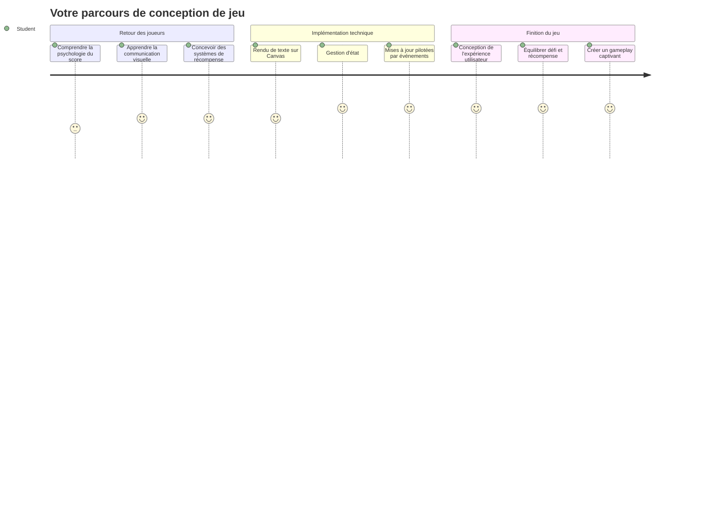
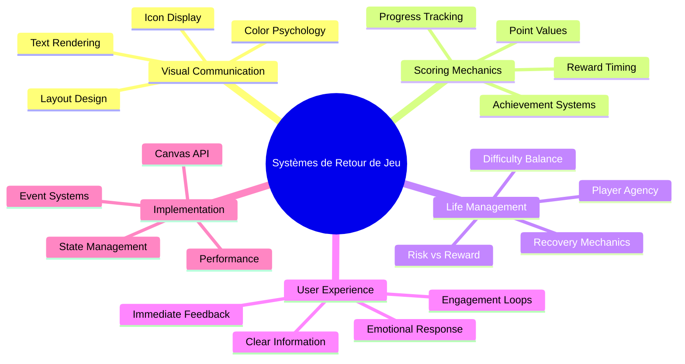
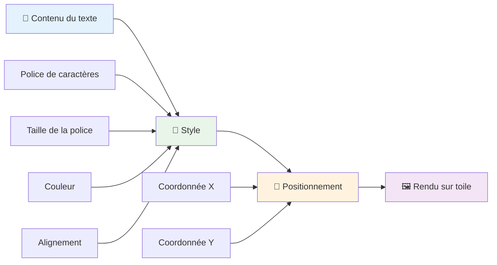
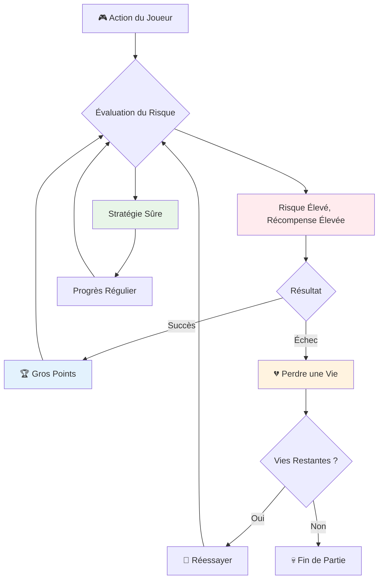
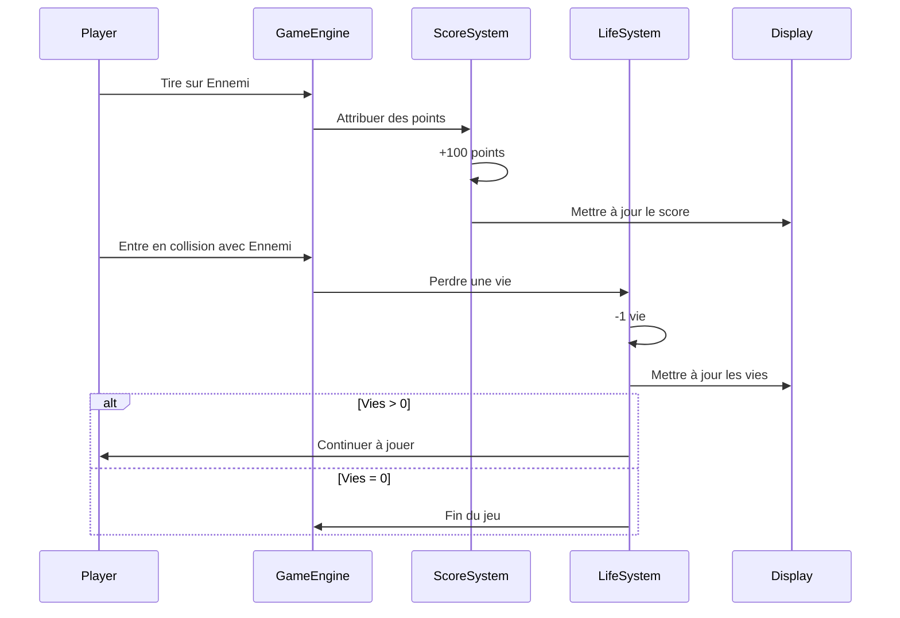
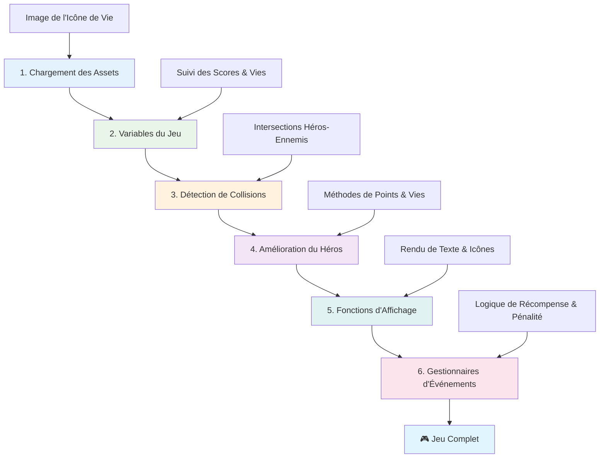
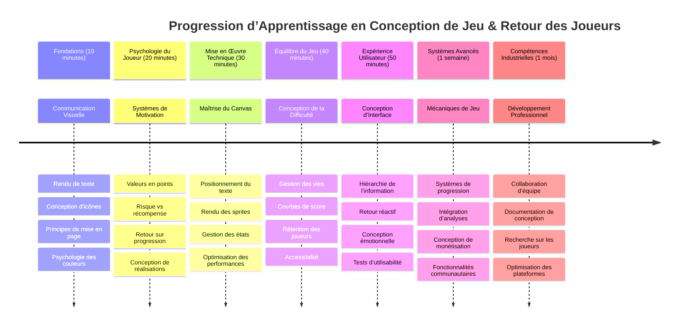

# Construire un jeu spatial partie 5 : Score et vies


## Quiz pré-conférence

[Quiz pré-conférence](https://ff-quizzes.netlify.app/web/quiz/37)

Prêt à faire en sorte que votre jeu spatial ressemble vraiment à un jeu ? Ajoutons le score et la gestion des vies - les mécanismes fondamentaux qui ont transformé les premiers jeux d’arcade comme Space Invaders de simples démonstrations en divertissements addictifs. C’est là que votre jeu devient véritablement jouable.


## Afficher du texte à l'écran – La voix de votre jeu

Pour afficher votre score, nous devons apprendre à rendre du texte sur le canvas. La méthode `fillText()` est votre outil principal pour cela – c’est la même technique utilisée dans les jeux d’arcade classiques pour afficher les scores et les informations d’état.


Vous avez un contrôle complet sur l’apparence du texte :

```javascript
ctx.font = "30px Arial";
ctx.fillStyle = "red";
ctx.textAlign = "right";
ctx.fillText("show this on the screen", 0, 0);
```

✅ Plongez plus en profondeur dans [l’ajout de texte sur un canvas](https://developer.mozilla.org/docs/Web/API/Canvas_API/Tutorial/Drawing_text) – vous pourriez être surpris de voir à quel point vous pouvez faire preuve de créativité avec les polices et les styles !

## Vies – Plus qu’un simple nombre

En game design, une « vie » représente la marge d’erreur du joueur. Ce concept remonte aux machines de flipper, où vous aviez plusieurs billes pour jouer. Dans les premiers jeux vidéo comme Asteroids, les vies donnaient aux joueurs la permission de prendre des risques et d’apprendre de leurs erreurs.


La représentation visuelle compte énormément – afficher des icônes de vaisseau au lieu de simplement « Vies : 3 » crée une reconnaissance visuelle immédiate, similaire à la façon dont les bornes d’arcade utilisaient l’iconographie pour communiquer au-delà des barrières linguistiques.

## Construire votre système de récompense

Nous allons maintenant implémenter les systèmes de retour d’information essentiels qui maintiennent l’engagement des joueurs :


- **Système de score** : Chaque vaisseau ennemi détruit rapporte 100 points (les nombres ronds sont plus faciles à calculer mentalement pour les joueurs). Le score s’affiche en bas à gauche.
- **Compteur de vies** : Votre héros commence avec trois vies – une norme fixée par les premiers jeux d’arcade pour équilibrer défi et jouabilité. Chaque collision avec un ennemi coûte une vie. Nous afficherons les vies restantes en bas à droite à l’aide d’icônes de vaisseau .

## C’est parti !

Tout d’abord, configurez votre espace de travail. Naviguez vers les fichiers dans votre sous-dossier `your-work`. Vous devriez voir ces fichiers :

```bash
-| assets
  -| enemyShip.png
  -| player.png
  -| laserRed.png
-| index.html
-| app.js
-| package.json
```

Pour tester votre jeu, lancez le serveur de développement depuis le dossier `your_work` :

```bash
cd your-work
npm start
```

Cela lance un serveur local à `http://localhost:5000`. Ouvrez cette adresse dans votre navigateur pour voir votre jeu. Testez les contrôles avec les flèches et essayez de tirer sur les ennemis pour vérifier que tout fonctionne.


### À vous de coder !

1. **Récupérez les ressources visuelles nécessaires**. Copiez la ressource `life.png` du dossier `solution/assets/` dans votre dossier `your-work`. Puis ajoutez lifeImg à votre fonction window.onload :

    ```javascript
    lifeImg = await loadTexture("assets/life.png");
    ```

1. N’oubliez pas d’ajouter `lifeImg` à votre liste de ressources :

    ```javascript
    let heroImg,
    ...
    lifeImg,
    ...
    eventEmitter = new EventEmitter();
    ```
  
2. **Configurez vos variables de jeu**. Ajoutez du code pour suivre votre score total (au départ à 0) et les vies restantes (au départ à 3). Nous afficherons ces informations à l’écran pour que les joueurs sachent toujours où ils en sont.

3. **Implémentez la détection de collisions**. Étendez votre fonction `updateGameObjects()` pour détecter quand les ennemis rentrent en collision avec votre héros :

    ```javascript
    enemies.forEach(enemy => {
        const heroRect = hero.rectFromGameObject();
        if (intersectRect(heroRect, enemy.rectFromGameObject())) {
          eventEmitter.emit(Messages.COLLISION_ENEMY_HERO, { enemy });
        }
      })
    ```

4. **Ajoutez le suivi des vies et des points à votre héros**.  
   1. **Initialisez les compteurs**. Sous `this.cooldown = 0` dans votre classe `Hero`, configurez la vie et les points :

        ```javascript
        this.life = 3;
        this.points = 0;
        ```

   1. **Affichez ces valeurs au joueur**. Créez des fonctions pour dessiner ces valeurs à l’écran :

        ```javascript
        function drawLife() {
          // À FAIRE, 35, 27
          const START_POS = canvas.width - 180;
          for(let i=0; i < hero.life; i++ ) {
            ctx.drawImage(
              lifeImg, 
              START_POS + (45 * (i+1) ), 
              canvas.height - 37);
          }
        }
        
        function drawPoints() {
          ctx.font = "30px Arial";
          ctx.fillStyle = "red";
          ctx.textAlign = "left";
          drawText("Points: " + hero.points, 10, canvas.height-20);
        }
        
        function drawText(message, x, y) {
          ctx.fillText(message, x, y);
        }

        ```

   1. **Intégrez tout dans votre boucle de jeu**. Ajoutez ces fonctions à votre fonction window.onload juste après `updateGameObjects()` :

        ```javascript
        drawPoints();
        drawLife();
        ```

### 🔄 **Point pédagogique**  
**Compréhension du game design** : Avant d’implémenter les conséquences, assurez-vous de comprendre :  
- ✅ Comment le feedback visuel communique l’état du jeu aux joueurs  
- ✅ Pourquoi un emplacement cohérent des éléments UI améliore l’ergonomie  
- ✅ La psychologie derrière les valeurs de points et la gestion des vies  
- ✅ Comment le rendu du texte sur canvas diffère du texte HTML  

**Auto-test rapide** : Pourquoi les jeux d’arcade utilisent-ils généralement des nombres ronds pour les points ?  
*Réponse : Les nombres ronds sont plus faciles à calculer mentalement pour les joueurs et procurent des récompenses psychologiques satisfaisantes.*

**Principes d’expérience utilisateur** : Vous appliquez maintenant :  
- **Hiérarchie visuelle** : Informations importantes placées en évidence  
- **Feedback immédiat** : Mises à jour en temps réel des actions du joueur  
- **Charge cognitive** : Présentation simple et claire des informations  
- **Design émotionnel** : Icônes et couleurs qui créent une connexion avec le joueur  

1. **Implémentez les conséquences et récompenses du jeu**. Nous allons maintenant ajouter les systèmes de retour qui rendent les actions du joueur significatives :

   1. **Les collisions coûtent des vies**. Chaque fois que votre héros percute un ennemi, vous devez perdre une vie.  
   
      Ajoutez cette méthode à votre classe `Hero` :

        ```javascript
        decrementLife() {
          this.life--;
          if (this.life === 0) {
            this.dead = true;
          }
        }
        ```

   2. **Tirer sur les ennemis rapporte des points**. Chaque tir réussi rapporte 100 points, offrant un feedback positif immédiat pour les tirs précis.

      Étendez votre classe Hero avec cette méthode d’incrémentation :
    
        ```javascript
          incrementPoints() {
            this.points += 100;
          }
        ```

        Maintenant, connectez ces fonctions aux événements de collision :

        ```javascript
        eventEmitter.on(Messages.COLLISION_ENEMY_LASER, (_, { first, second }) => {
           first.dead = true;
           second.dead = true;
           hero.incrementPoints();
        })

        eventEmitter.on(Messages.COLLISION_ENEMY_HERO, (_, { enemy }) => {
           enemy.dead = true;
           hero.decrementLife();
        });
        ```

✅ Curieux de découvrir d’autres jeux construits avec JavaScript et Canvas ? Explorez un peu – vous pourriez être surpris de ce qui est possible !

Après avoir implémenté ces fonctionnalités, testez votre jeu pour voir le système complet de feedback en action. Vous devriez voir les icônes de vie en bas à droite, votre score en bas à gauche, et observer comment les collisions réduisent les vies tandis que les tirs réussis augmentent le score.

Votre jeu dispose désormais des mécaniques essentielles qui rendaient les jeux d’arcade classiques si captivants – des objectifs clairs, un feedback immédiat, et des conséquences significatives pour les actions du joueur.

### 🔄 **Point pédagogique**  
**Système complet de game design** : Vérifiez votre maîtrise des systèmes de feedback pour le joueur :  
- ✅ Comment les mécaniques de score créent motivation et engagement  
- ✅ Pourquoi la cohérence visuelle est importante pour l’interface utilisateur  
- ✅ Comment le système de vies équilibre défi et rétention des joueurs  
- ✅ Quel rôle joue le feedback immédiat dans une expérience de jeu satisfaisante  

**Intégration système** : Votre système de feedback démontre :  
- **Design UX** : Communication visuelle claire et hiérarchie de l’information  
- **Architecture pilotée par événements** : Mises à jour réactives aux actions du joueur  
- **Gestion d’état** : Suivi et affichage des données de jeu dynamiques  
- **Maîtrise du canvas** : Rendu du texte et positionnement des sprites  
- **Psychologie du jeu** : Compréhension de la motivation et de l’engagement du joueur  

**Patrons professionnels** : Vous avez implémenté :  
- **Architecture MVC** : Séparation logique, données et présentation du jeu  
- **Patron Observateur** : Mises à jour pilotées par événements des changements d’état  
- **Design par composants** : Fonctions réutilisables pour le rendu et la logique  
- **Optimisation des performances** : Rendu efficace dans les boucles de jeu  

### ⚡ **Ce que vous pouvez faire dans les 5 prochaines minutes**  
- [ ] Expérimentez différentes tailles de police et couleurs pour l’affichage du score  
- [ ] Essayez de modifier les valeurs des points et observez l’effet sur la sensation de jeu  
- [ ] Ajoutez des console.log pour suivre quand les points et vies changent  
- [ ] Testez des cas limites comme l’épuisement des vies ou l’atteinte de scores élevés  

### 🎯 **Objectifs pour cette heure**  
- [ ] Compléter le quiz après la leçon et comprendre la psychologie du game design  
- [ ] Ajouter des effets sonores pour les scores et la perte de vies  
- [ ] Implémenter un système de high score avec localStorage  
- [ ] Créer différentes valeurs de points selon le type d’ennemi  
- [ ] Ajouter des effets visuels comme un écran qui tremble à la perte d’une vie  

### 📅 **Votre parcours de game design sur une semaine**  
- [ ] Compléter le jeu spatial complet avec des systèmes de feedback peaufinés  
- [ ] Implémenter des mécaniques de score avancées comme des multiplicateurs de combos  
- [ ] Ajouter des succès et du contenu débloquable  
- [ ] Créer une progression de difficulté et équilibrer le jeu  
- [ ] Concevoir des interfaces utilisateur pour les menus et écrans de fin de partie  
- [ ] Étudier d’autres jeux pour comprendre les mécanismes d’engagement  

### 🌟 **Votre maîtrise du développement de jeux sur un mois**  
- [ ] Construire des jeux complets avec des systèmes sophistiqués de progression  
- [ ] Apprendre l’analyse de jeu et la mesure du comportement joueur  
- [ ] Contribuer à des projets de développement de jeux open source  
- [ ] Maîtriser des patrons avancés de game design et la monétisation  
- [ ] Créer des contenus éducatifs sur le game design et l’expérience utilisateur  
- [ ] Constituer un portfolio démontrant vos compétences en design et développement de jeux  

## 🎯 Votre timeline de maîtrise en game design


### 🛠️ Résumé de votre boîte à outils game design

Après cette leçon, vous maîtrisez maintenant :  
- **Psychologie du joueur** : Comprendre motivation, risque/récompense et boucles d’engagement  
- **Communication visuelle** : Design UI efficace avec texte, icônes et mise en page  
- **Systèmes de feedback** : Réponse en temps réel aux actions du joueur et aux événements du jeu  
- **Gestion d’état** : Suivi et affichage efficaces des données dynamiques du jeu  
- **Rendu de texte sur canvas** : Affichage professionnel avec style et positionnement  
- **Intégration d’événements** : Connecter les actions utilisateur à des conséquences significatives  
- **Équilibre de jeu** : Concevoir des courbes de difficulté et des systèmes de progression  

**Applications réelles** : Vos compétences en game design s’appliquent directement à :  
- **Design d’interface utilisateur** : Création d’interfaces engageantes et intuitives  
- **Développement produit** : Comprendre la motivation utilisateur et les boucles de feedback  
- **Technologie éducative** : Gamification et systèmes d’engagement à l’apprentissage  
- **Visualisation de données** : Rendre l’information complexe accessible et attractive  
- **Développement mobile** : Mécaniques de rétention et design de l’expérience utilisateur  
- **Marketing technologique** : Compréhension du comportement utilisateur et optimisation conversion  

**Compétences professionnelles acquises** : Vous pouvez désormais :  
- **Concevoir** des expériences utilisateurs qui motivent et engagent  
- **Implémenter** des systèmes de feedback qui guident efficacement le comportement utilisateur  
- **Équilibrer** défi et accessibilité dans des systèmes interactifs  
- **Créer** une communication visuelle adaptée à différents groupes d’utilisateurs  
- **Analyser** le comportement utilisateur et itérer sur les améliorations de design  

**Concepts de développement de jeux maîtrisés** :  
- **Motivation du joueur** : Comprendre ce qui motive engagement et rétention  
- **Design visuel** : Créer des interfaces claires, attrayantes et fonctionnelles  
- **Intégration système** : Connecter plusieurs systèmes de jeu pour une expérience cohérente  
- **Optimisation des performances** : Rendu efficace et gestion d’état  
- **Accessibilité** : Concevoir pour différents niveaux de compétence et besoins des joueurs  

**Niveau supérieur** : Vous êtes prêt à explorer des patrons de game design avancés, implémenter des systèmes d’analytics, ou étudier la monétisation et la rétention des joueurs !

🌟 **Succès débloqué** : Vous avez construit un système complet de feedback joueur avec des principes professionnels de game design !

---

## Défi GitHub Copilot Agent 🚀

Utilisez le mode Agent pour relever le défi suivant :

**Description :** Améliorez le système de score du jeu spatial en implémentant une fonction de high score avec stockage persistant et des mécaniques de score bonus.

**Consigne :** Créez un système de high score qui sauvegarde le meilleur score du joueur dans localStorage. Ajoutez des points bonus pour les tués consécutifs d’ennemis (système de combo) et implémentez différentes valeurs de points selon les types d’ennemis. Incluez un indicateur visuel quand le joueur atteint un nouveau high score et affichez le high score actuel à l’écran.

## 🚀 Challenge

Vous avez maintenant un jeu fonctionnel avec score et vies. Réfléchissez aux fonctionnalités supplémentaires qui pourraient améliorer l’expérience joueur.

## Quiz post-conférence

[Quiz post-conférence](https://ff-quizzes.netlify.app/web/quiz/38)

## Révision & Auto-étude

Vous voulez explorer davantage ? Recherchez différentes approches pour les systèmes de score et de vies dans les jeux. Il existe des moteurs de jeu fascinants comme [PlayFab](https://playfab.com) qui gèrent les scores, classements et progression des joueurs. Comment l’intégration d’un tel système pourrait-elle faire passer votre jeu au niveau supérieur ?

## Devoir

[Construire un jeu à score](assignment.md)

---

<!-- CO-OP TRANSLATOR DISCLAIMER START -->
**Avertissement** :  
Ce document a été traduit à l'aide du service de traduction automatique [Co-op Translator](https://github.com/Azure/co-op-translator). Bien que nous nous efforçons d'assurer l'exactitude, veuillez noter que les traductions automatisées peuvent contenir des erreurs ou des inexactitudes. Le document original dans sa langue d'origine doit être considéré comme la source faisant foi. Pour les informations critiques, il est recommandé de recourir à une traduction professionnelle humaine. Nous déclinons toute responsabilité en cas de malentendus ou d'interprétations erronées résultant de l'utilisation de cette traduction.
<!-- CO-OP TRANSLATOR DISCLAIMER END -->