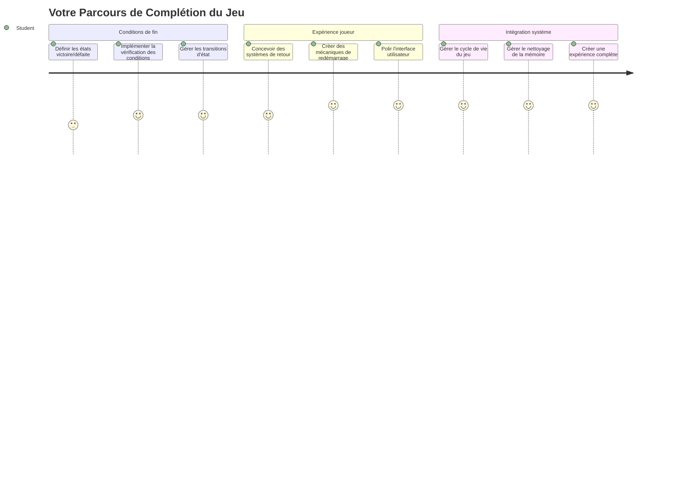
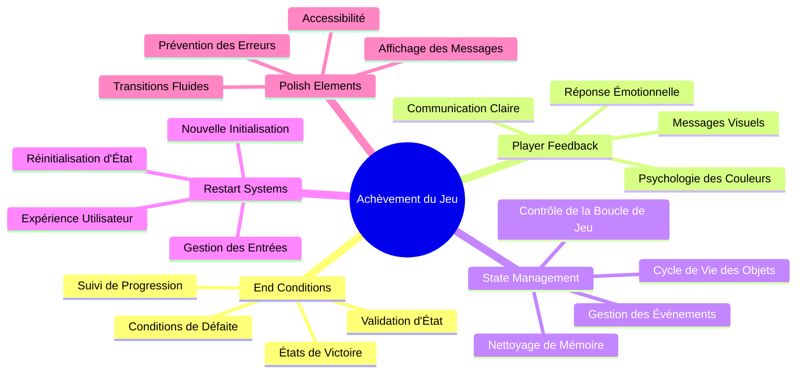
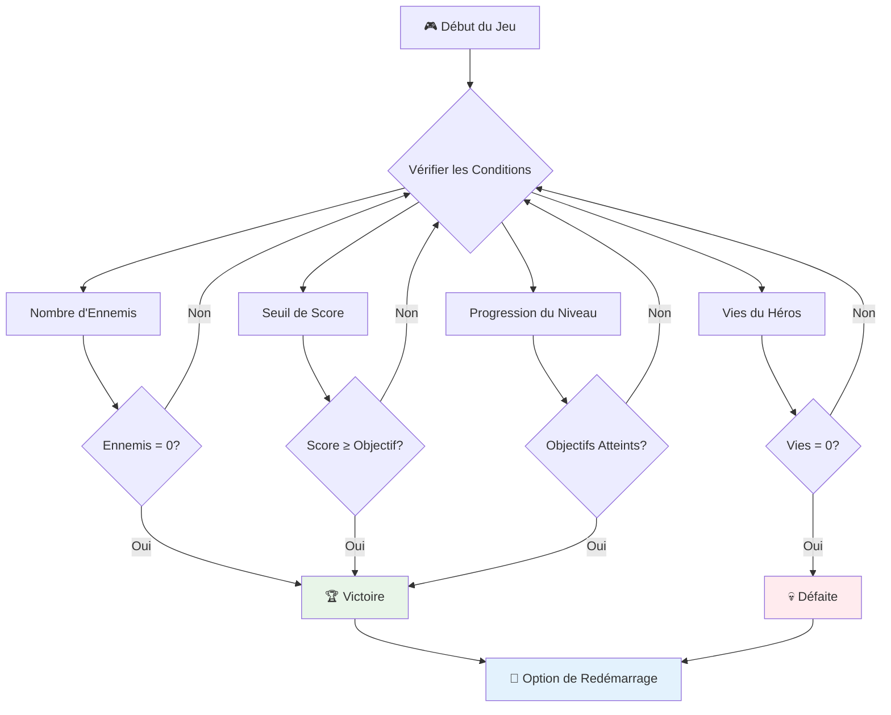
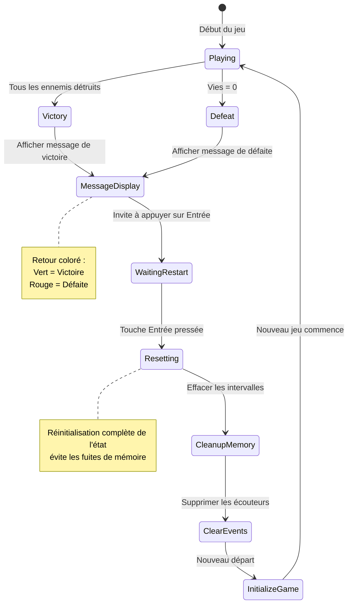
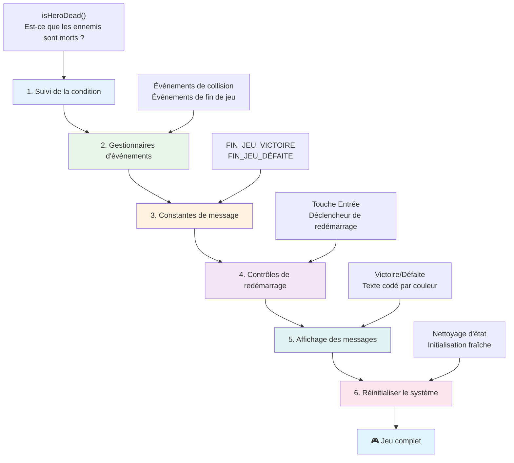
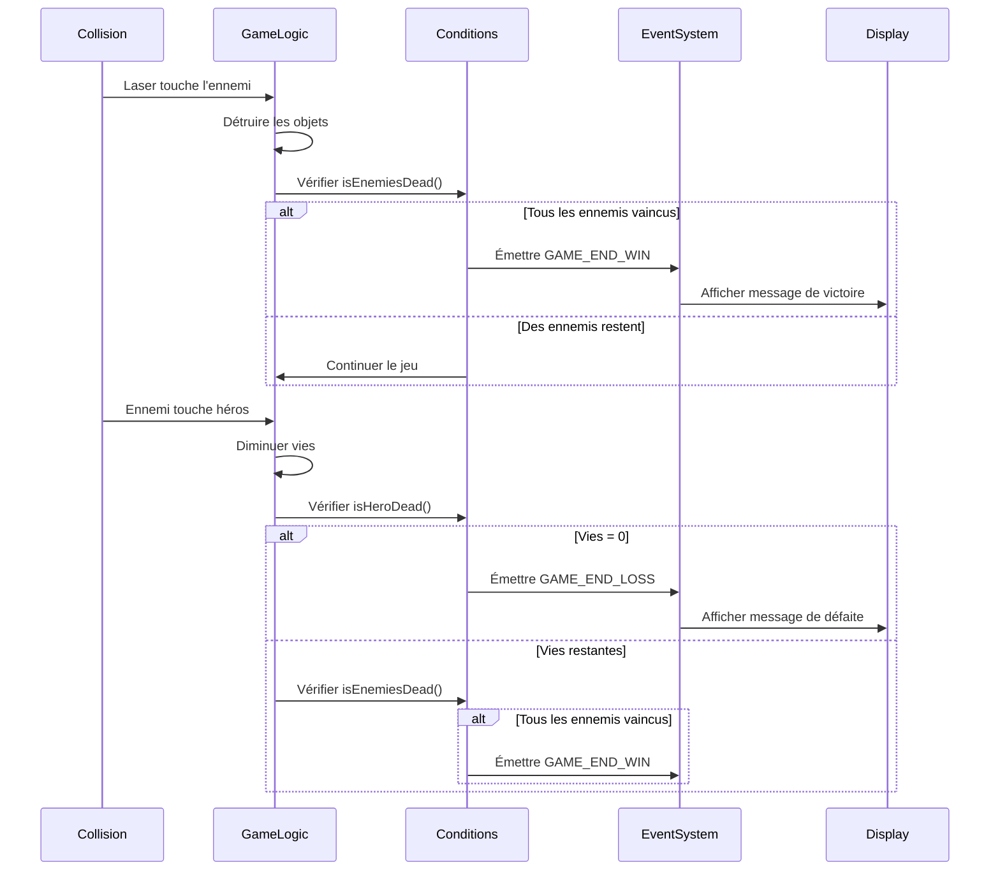
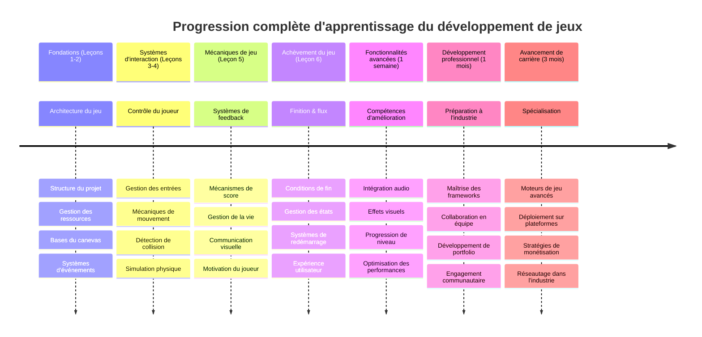

# Construisez un Jeu Spatial Partie 6 : Fin et Redémarrage


Tout grand jeu a besoin de conditions de fin claires et d’un mécanisme de redémarrage fluide. Vous avez créé un impressionnant jeu spatial avec déplacement, combat et score - il est maintenant temps d’ajouter les pièces finales qui lui donnent un sentiment d’achèvement.

Votre jeu tourne actuellement indéfiniment, comme les sondes Voyager que la NASA a lancées en 1977 - toujours en voyage dans l’espace des décennies plus tard. Si cela convient parfaitement à l’exploration spatiale, les jeux nécessitent des points de fin définis pour créer des expériences satisfaisantes.

Aujourd’hui, nous allons implémenter des conditions de victoire/défaite appropriées ainsi qu’un système de redémarrage. À la fin de cette leçon, vous aurez un jeu abouti que les joueurs pourront terminer et rejouer, à l’instar des jeux d’arcade classiques qui ont défini le médium.


## Quiz Préalable à la Leçon

[Quiz préalable à la leçon](https://ff-quizzes.netlify.app/web/quiz/39)

## Comprendre les Conditions de Fin de Jeu

Quand votre jeu doit-il se terminer ? Cette question fondamentale a façonné la conception des jeux depuis l’ère des premières arcades. Pac-Man se termine quand vous êtes attrapé par les fantômes ou que vous avez mangé tous les points, alors que Space Invaders se termine lorsque les aliens atteignent le bas ou que vous les avez tous détruits.

En tant que créateur du jeu, vous définissez les conditions de victoire et de défaite. Pour notre jeu spatial, voici des approches éprouvées qui créent un gameplay engageant :


- **`N` vaisseaux ennemis ont été détruits** : C’est très courant, si vous divisez un jeu en plusieurs niveaux, d’exiger la destruction de `N` vaisseaux ennemis pour terminer un niveau  
- **Votre vaisseau a été détruit** : Certains jeux se terminent si votre vaisseau est détruit. Une autre approche courante est d’avoir des vies. Chaque fois qu’un vaisseau est détruit, une vie est retirée. Une fois toutes les vies perdues, vous perdez la partie.  
- **Vous avez collecté `N` points** : Une autre condition de fin classique consiste à accumuler des points. La manière d’obtenir des points dépend de vous, mais il est courant d’en attribuer pour diverses actions comme détruire un vaisseau ennemi ou collecter des objets que ces derniers *laissent tomber* en étant détruits.  
- **Terminer un niveau** : Cela peut impliquer plusieurs conditions telles que `X` vaisseaux ennemis détruits, `Y` points collectés ou bien qu’un objet spécifique ait été ramassé.

## Implémentation du Système de Redémarrage

Les bons jeux encouragent la rejouabilité grâce à des mécanismes de redémarrage fluides. Quand les joueurs terminent une partie (ou subissent une défaite), ils souhaitent souvent essayer à nouveau immédiatement - que ce soit pour battre leur score ou améliorer leur performance.


Tetris illustre parfaitement cela : quand les blocs atteignent le haut, vous pouvez lancer immédiatement une nouvelle partie sans naviguer dans des menus complexes. Nous allons construire un système similaire qui réinitialise proprement l’état du jeu et permet aux joueurs de reprendre rapidement l’action.

✅ **Réflexion** : Pensez aux jeux auxquels vous avez joué. Dans quelles conditions se terminent-ils, et comment êtes-vous invités à redémarrer ? Qu’est-ce qui rend un redémarrage fluide ou frustrant ?

## Ce que Vous Allez Construire

Vous allez implémenter les fonctionnalités finales qui transformeront votre projet en une expérience complète. Ces éléments distinguent un jeu soigné d’un simple prototype.

**Voici ce que nous ajoutons aujourd’hui :**

1. **Condition de victoire** : Éliminez tous les ennemis et obtenez une célébration digne de ce nom (vous l’avez bien mérité !)  
2. **Condition de défaite** : Perdez toutes vos vies et affichez l’écran de défaite  
3. **Mécanisme de redémarrage** : Appuyez sur Entrée pour repartir instantanément - car une partie ne suffit jamais  
4. **Gestion d’état** : Tableau nettoyé à chaque fois - pas d’ennemis restants ni de bugs étranges de la partie précédente

## Mise en Route

Préparons votre environnement de développement. Vous devriez avoir tous vos fichiers de jeu spatial des leçons précédentes prêts.

**Votre projet devrait ressembler à ceci :**

```bash
-| assets
  -| enemyShip.png
  -| player.png
  -| laserRed.png
  -| life.png
-| index.html
-| app.js
-| package.json
```
  
**Démarrez votre serveur de développement :**

```bash
cd your-work
npm start
```
  
**Cette commande :**  
- Lance un serveur local sur `http://localhost:5000`  
- Sert correctement vos fichiers  
- Rafraîchit automatiquement quand vous faites des modifications

Ouvrez `http://localhost:5000` dans votre navigateur et vérifiez que votre jeu fonctionne. Vous devriez pouvoir vous déplacer, tirer et interagir avec les ennemis. Une fois confirmé, nous pouvons poursuivre l’implémentation.

> 💡 **Astuce Pro** : Pour éviter des avertissements dans Visual Studio Code, déclarez `gameLoopId` en haut de votre fichier comme `let gameLoopId;` au lieu de le déclarer dans la fonction `window.onload`. Cela suit les bonnes pratiques modernes de déclaration de variables en JavaScript.


## Étapes d’Implémentation

### Étape 1 : Créer les Fonctions de Suivi des Conditions de Fin

Nous avons besoin de fonctions pour surveiller quand le jeu doit se terminer. Comme des capteurs sur la Station Spatiale Internationale qui surveillent en permanence des systèmes critiques, ces fonctions vérifieront continuellement l’état du jeu.

```javascript
function isHeroDead() {
  return hero.life <= 0;
}

function isEnemiesDead() {
  const enemies = gameObjects.filter((go) => go.type === "Enemy" && !go.dead);
  return enemies.length === 0;
}
```
  
**Voici ce qui se passe en coulisses :**  
- **Vérifie** si notre héros n’a plus de vies (aïe !)  
- **Compte** combien d’ennemis sont encore vivants et en jeu  
- **Retourne** `true` lorsque le champ de bataille est débarrassé des ennemis  
- **Utilise** une logique simple true/false pour rester clair  
- **Filtre** tous les objets du jeu pour trouver les survivants

### Étape 2 : Mettre à Jour les Gestionnaires d’Événements pour les Conditions de Fin

Nous allons maintenant connecter ces vérifications de conditions au système d’événements du jeu. Chaque fois qu’une collision survient, le jeu évaluera si elle déclenche une condition de fin. Cela crée un retour immédiat sur les événements critiques.


```javascript
eventEmitter.on(Messages.COLLISION_ENEMY_LASER, (_, { first, second }) => {
    first.dead = true;
    second.dead = true;
    hero.incrementPoints();

    if (isEnemiesDead()) {
      eventEmitter.emit(Messages.GAME_END_WIN);
    }
});

eventEmitter.on(Messages.COLLISION_ENEMY_HERO, (_, { enemy }) => {
    enemy.dead = true;
    hero.decrementLife();
    if (isHeroDead())  {
      eventEmitter.emit(Messages.GAME_END_LOSS);
      return; // perte avant la victoire
    }
    if (isEnemiesDead()) {
      eventEmitter.emit(Messages.GAME_END_WIN);
    }
});

eventEmitter.on(Messages.GAME_END_WIN, () => {
    endGame(true);
});
  
eventEmitter.on(Messages.GAME_END_LOSS, () => {
  endGame(false);
});
```
  
**Ce qui se passe ici :**  
- **Laser touche ennemi** : Les deux disparaissent, vous gagnez des points, et on vérifie si vous avez gagné  
- **Ennemi vous touche** : Vous perdez une vie, et on vérifie si vous êtes toujours en vie  
- **Ordre intelligent** : On vérifie d’abord la défaite (personne ne veut gagner et perdre en même temps !)  
- **Réactions instantanées** : Dès qu’un événement important arrive, le jeu le sait

### Étape 3 : Ajouter de Nouvelles Constantes de Message

Vous devez ajouter de nouveaux types de message à votre objet constant `Messages`. Ces constantes aident à maintenir la cohérence et évitent les fautes de frappe dans votre système d’événements.

```javascript
GAME_END_LOSS: "GAME_END_LOSS",
GAME_END_WIN: "GAME_END_WIN",
```
  
**Dans ce qui précède, nous avons :**  
- **Ajouté** des constantes pour les événements de fin de jeu afin de maintenir la cohérence  
- **Utilisé** des noms descriptifs qui indiquent clairement l’objet de l’événement  
- **Respecté** la convention de nommage existante pour les types de messages

### Étape 4 : Implémenter les Contrôles de Redémarrage

Vous allez maintenant ajouter les contrôles clavier qui permettent aux joueurs de redémarrer le jeu. La touche Entrée est un choix naturel car elle est communément associée à la confirmation d’actions et au démarrage de nouvelles parties.

**Ajoutez la détection de la touche Entrée à votre écouteur d’événement keydown existant :**

```javascript
else if(evt.key === "Enter") {
   eventEmitter.emit(Messages.KEY_EVENT_ENTER);
}
```
  
**Ajoutez la nouvelle constante de message :**

```javascript
KEY_EVENT_ENTER: "KEY_EVENT_ENTER",
```
  
**Ce qu’il faut savoir :**  
- **Étend** votre système existant de gestion des événements clavier  
- **Utilise** la touche Entrée comme déclencheur de redémarrage pour une expérience utilisateur intuitive  
- **Émet** un événement personnalisé que d’autres parties de votre jeu peuvent écouter  
- **Maintient** le même modèle que vos autres contrôles clavier

### Étape 5 : Créer le Système d’Affichage des Messages

Votre jeu doit communiquer clairement les résultats aux joueurs. Nous allons créer un système de messages qui affiche les états de victoire et défaite en texte coloré, à la manière des interfaces terminales des premiers ordinateurs où le vert indiquait le succès et le rouge signalait une erreur.

**Créez la fonction `displayMessage()` :**

```javascript
function displayMessage(message, color = "red") {
  ctx.font = "30px Arial";
  ctx.fillStyle = color;
  ctx.textAlign = "center";
  ctx.fillText(message, canvas.width / 2, canvas.height / 2);
}
```
  
**Étape par étape, voici ce qui se passe :**  
- **Définit** la taille et la famille de police pour un texte clair et lisible  
- **Applique** un paramètre de couleur avec "rouge" par défaut pour les avertissements  
- **Centre** le texte horizontalement et verticalement sur le canvas  
- **Utilise** les paramètres par défaut modernes de JavaScript pour la flexibilité sur la couleur  
- **Exploite** le contexte 2D du canvas pour un rendu direct du texte

**Créez la fonction `endGame()` :**

```javascript
function endGame(win) {
  clearInterval(gameLoopId);

  // Définir un délai pour garantir que tous les rendus en attente sont terminés
  setTimeout(() => {
    ctx.clearRect(0, 0, canvas.width, canvas.height);
    ctx.fillStyle = "black";
    ctx.fillRect(0, 0, canvas.width, canvas.height);
    if (win) {
      displayMessage(
        "Victory!!! Pew Pew... - Press [Enter] to start a new game Captain Pew Pew",
        "green"
      );
    } else {
      displayMessage(
        "You died !!! Press [Enter] to start a new game Captain Pew Pew"
      );
    }
  }, 200)  
}
```
  
**Ce que fait cette fonction :**  
- **Gèle** tout en place - plus de vaisseaux ou de lasers en mouvement  
- **Prend** une petite pause (200ms) pour laisser la dernière image s’afficher  
- **Efface** l’écran et le peint en noir pour un effet dramatique  
- **Affiche** des messages différents pour les gagnants et les perdants  
- **Code** les textes avec des couleurs - vert pour bien, rouge pour… pas si bien  
- **Indique** aux joueurs comment reprendre la partie

### 🔄 **Point pédagogique**  
**Gestion de l’État du Jeu** : Avant d’implémenter la réinitialisation, assurez-vous de comprendre :  
- ✅ Comment les conditions de fin créent des objectifs de jeu clairs  
- ✅ Pourquoi le feedback visuel est essentiel à la compréhension du joueur  
- ✅ L’importance du nettoyage correct pour éviter les fuites de mémoire  
- ✅ Comment l’architecture pilotée par événements permet des transitions d’état propres

**Auto-test rapide** : Que se passerait-il si vous ne supprimiez pas les écouteurs d’événements lors du reset ?  
*Réponse : Des fuites mémoire et des gestionnaires d’événements en double provoquant des comportements imprévisibles*

**Principes de Conception de Jeux** : Vous implémentez maintenant :  
- **Objectifs clairs** : Les joueurs savent précisément ce qui définit la réussite ou l’échec  
- **Retour immédiat** : Les changements d’état du jeu sont communiqués instantanément  
- **Contrôle utilisateur** : Les joueurs peuvent redémarrer quand ils le souhaitent  
- **Fiabilité système** : Le nettoyage évite bugs et problèmes de performance

### Étape 6 : Implémenter la Fonctionnalité de Réinitialisation

Le système de réinitialisation doit complètement nettoyer l’état actuel du jeu et initialiser une nouvelle session. Cela garantit un démarrage propre sans données résiduelles de la partie précédente.

**Créez la fonction `resetGame()` :**

```javascript
function resetGame() {
  if (gameLoopId) {
    clearInterval(gameLoopId);
    eventEmitter.clear();
    initGame();
    gameLoopId = setInterval(() => {
      ctx.clearRect(0, 0, canvas.width, canvas.height);
      ctx.fillStyle = "black";
      ctx.fillRect(0, 0, canvas.width, canvas.height);
      drawPoints();
      drawLife();
      updateGameObjects();
      drawGameObjects(ctx);
    }, 100);
  }
}
```
  
**Comprenons chaque partie :**  
- **Vérifie** si une boucle de jeu est en cours avant de réinitialiser  
- **Arrête** la boucle de jeu existante pour stopper toutes les activités en cours  
- **Supprime** tous les écouteurs d’événements pour éviter les fuites mémoire  
- **Réinitialise** l’état du jeu avec des objets et variables neufs  
- **Démarre** une nouvelle boucle de jeu avec toutes les fonctions nécessaires  
- **Maintient** le même intervalle de 100 ms pour des performances cohérentes

**Ajoutez le gestionnaire d’événement de la touche Entrée dans votre fonction `initGame()` :**

```javascript
eventEmitter.on(Messages.KEY_EVENT_ENTER, () => {
  resetGame();
});
```
  
**Ajoutez la méthode `clear()` à votre classe EventEmitter :**

```javascript
clear() {
  this.listeners = {};
}
```
  
**Points clés à retenir :**  
- **Relie** la pression de la touche Entrée à la réinitialisation du jeu  
- **Enregistre** ce gestionnaire lors de l’initialisation du jeu  
- **Fournit** une méthode propre pour retirer tous les écouteurs lors du reset  
- **Préserve** la mémoire en nettoyant les gestionnaires entre les parties  
- **Remet** l’objet des écouteurs à l’état vide pour un nouvel initialisation fraîche  

## Félicitations ! 🎉

👽 💥 🚀 Vous avez réussi à créer un jeu complet de A à Z. Comme les programmeurs qui ont créé les premiers jeux vidéo dans les années 1970, vous avez transformé des lignes de code en une expérience interactive avec des mécaniques de jeu appropriées et un retour utilisateur clair. 🚀 💥 👽

**Vous avez accompli :**  
- **Implémenté** des conditions complètes de victoire et défaite avec retour utilisateur  
- **Créé** un système de redémarrage fluide pour un gameplay continuel  
- **Conçu** une communication visuelle claire pour les états du jeu  
- **Géré** des transitions d’état complexes et le nettoyage associé  
- **Assemblé** tous les composants en un jeu cohérent et jouable

### 🔄 **Point pédagogique**  
**Système complet de développement de jeu** : Célébrez votre maîtrise du cycle complet de développement :  
- ✅ Comment les conditions de fin créent des expériences satisfaisantes  
- ✅ Pourquoi la gestion d’état correcte est cruciale pour la stabilité  
- ✅ Comment le feedback visuel améliore la compréhension des joueurs  
- ✅ Quel rôle joue le système de redémarrage dans la rétention des joueurs

**Maîtrise du système** : Votre jeu complet démontre :  
- **Développement full-stack** : De la gestion graphique à l’entrée utilisateur en passant par la gestion d’état  
- **Architecture professionnelle** : Systèmes pilotés par événements avec nettoyage adéquat  
- **Conception UX** : Feedback clair et contrôles intuitifs  
- **Optimisation** : Rendu performant et gestion mémoire efficace  
- **Finition et complétude** : Tous les détails qui rendent un jeu abouti

**Compétences prêtes pour l’industrie** : Vous avez implémenté :  
- **Architecture boucle de jeu** : Systèmes en temps réel avec performance constante  
- **Programmation événementielle** : Systèmes découplés et évolutifs  
- **Gestion d’état** : Manipulation de données complexe et gestion du cycle de vie  
- **Design d’interface** : Communication claire et contrôles réactifs  
- **Tests et débogage** : Développement itératif et résolution de problèmes

### ⚡ **Ce que vous pouvez faire dans les 5 prochaines minutes**  
- [ ] Jouer à votre jeu complet et tester toutes les conditions de victoire et défaite  
- [ ] Expérimenter avec différents paramètres de conditions de fin  
- [ ] Ajouter des instructions console.log pour suivre les changements d’état  
- [ ] Partager votre jeu avec des amis et recueillir leurs retours

### 🎯 **Ce que vous pouvez accomplir cette heure**  
- [ ] Réaliser le quiz post-leçon et réfléchir sur votre parcours de développement  
- [ ] Ajouter des effets sonores pour les états de victoire et défaite  
- [ ] Implémenter des conditions de fin supplémentaires comme des limites de temps ou objectifs bonus  
- [ ] Créer différents niveaux de difficulté avec des nombres ennemis variables  
- [ ] Polir la présentation visuelle avec meilleures polices et couleurs

### 📅 **Votre maîtrise du développement de jeu en une semaine**  
- [ ] Compléter le jeu spatial enrichi avec plusieurs niveaux et progression  
- [ ] Ajouter des fonctionnalités avancées comme des power-ups, différents types d’ennemis, et armes spéciales  
- [ ] Créer un système de score élevé avec stockage persistant  
- [ ] Concevoir des interfaces utilisateur pour menus, réglages et options  
- [ ] Optimiser les performances pour différents appareils et navigateurs  
- [ ] Déployer votre jeu en ligne et le partager avec la communauté
### 🌟 **Votre carrière de développement de jeux sur un mois**
- [ ] Créez plusieurs jeux complets explorant différents genres et mécaniques
- [ ] Apprenez des frameworks avancés de développement de jeux comme Phaser ou Three.js
- [ ] Contribuez à des projets open source de développement de jeux
- [ ] Étudiez les principes de conception de jeux et la psychologie des joueurs
- [ ] Créez un portfolio présentant vos compétences en développement de jeux
- [ ] Connectez-vous avec la communauté de développement de jeux et continuez à apprendre

## 🎯 Votre calendrier complet de maîtrise du développement de jeux


### 🛠️ Résumé complet de votre boîte à outils de développement de jeux

Après avoir terminé cette série complète de jeux spatiaux, vous avez maintenant maîtrisé :
- **Architecture de jeu** : systèmes événementiels, boucles de jeu, et gestion d'état
- **Programmation graphique** : API Canvas, rendu de sprites, et effets visuels
- **Systèmes d'entrée** : gestion du clavier, détection de collisions, et contrôles réactifs
- **Conception de jeu** : retour du joueur, systèmes de progression, et mécaniques d'engagement
- **Optimisation des performances** : rendu efficace, gestion de la mémoire, et contrôle du taux de rafraîchissement
- **Expérience utilisateur** : communication claire, contrôles intuitifs, et détails de finition
- **Patrons professionnels** : code propre, techniques de débogage, et organisation de projet

**Applications réelles** : Vos compétences en développement de jeux s'appliquent directement à :
- **Applications Web interactives** : interfaces dynamiques et systèmes en temps réel
- **Visualisation de données** : graphiques animés et graphiques interactifs
- **Technologie éducative** : ludification et expériences d'apprentissage engageantes
- **Développement mobile** : interactions tactiles et optimisation des performances
- **Logiciels de simulation** : moteurs physiques et modélisation en temps réel
- **Industries créatives** : art interactif, divertissement, et expériences numériques

**Compétences professionnelles acquises** : Vous pouvez maintenant :
- **Architecturer** des systèmes interactifs complexes depuis zéro
- **Déboguer** des applications en temps réel via des approches systématiques
- **Optimiser** les performances pour des expériences utilisateur fluides
- **Concevoir** des interfaces utilisateur attrayantes et des patterns d’interaction
- **Collaborer** efficacement sur des projets techniques avec une bonne organisation du code

**Concepts maîtrisés en développement de jeux** :
- **Systèmes en temps réel** : boucles de jeu, gestion du taux de rafraîchissement, et performances
- **Architecture événementielle** : systèmes découplés et passage de messages
- **Gestion d’état** : gestion complexe des données et cycle de vie
- **Programmation d’interface utilisateur** : graphiques Canvas et design réactif
- **Théorie de la conception de jeux** : psychologie du joueur et mécaniques d’engagement

**Niveau supérieur** : Vous êtes prêt à explorer des frameworks de jeu avancés, la 3D, les systèmes multijoueurs, ou à passer à des rôles professionnels dans le développement de jeux !

🌟 **Succès débloqué** : Vous avez complété un parcours complet de développement de jeu et construit une expérience interactive de qualité professionnelle de A à Z !

**Bienvenue dans la communauté du développement de jeux !** 🎮✨

## Défi GitHub Copilot Agent 🚀

Utilisez le mode Agent pour relever ce défi :

**Description :** Améliorez le jeu spatial en implémentant un système de progression de niveaux avec difficulté croissante et fonctionnalités bonus.

**Consigne :** Créez un système de jeu spatial à plusieurs niveaux où chaque niveau comporte plus de vaisseaux ennemis avec une vitesse et une santé accrues. Ajoutez un multiplicateur de score qui augmente à chaque niveau, et implémentez des power-ups (comme tir rapide ou bouclier) qui apparaissent aléatoirement lorsque des ennemis sont détruits. Incluez un bonus de fin de niveau et affichez le niveau actuel à l’écran en plus du score et des vies existants.

En savoir plus sur le [mode agent](https://code.visualstudio.com/blogs/2025/02/24/introducing-copilot-agent-mode) ici.

## 🚀 Défi d’amélioration optionnel

**Ajoutez de l’audio à votre jeu** : améliorez votre expérience de jeu en implémentant des effets sonores ! Pensez à ajouter des sons pour :

- **Tirs laser** lorsque le joueur tire
- **Destruction des ennemis** quand les vaisseaux sont touchés
- **Dégâts reçus par le héros** lorsque le joueur subit des coups
- **Musique de victoire** lorsque le jeu est gagné
- **Son de défaite** lorsque le jeu est perdu

**Exemple d’implémentation audio :**

```javascript
// Créer des objets audio
const laserSound = new Audio('assets/laser.wav');
const explosionSound = new Audio('assets/explosion.wav');

// Jouer des sons pendant les événements du jeu
function playLaserSound() {
  laserSound.currentTime = 0; // Réinitialiser au début
  laserSound.play();
}
```

**Ce que vous devez savoir :**
- **Crée** des objets Audio pour différents effets sonores
- **Réinitialise** `currentTime` pour permettre les effets sonores en rafale
- **Gère** les politiques d’autoplay des navigateurs en déclenchant les sons via des interactions utilisateurs
- **Contrôle** le volume et le timing pour une meilleure expérience de jeu

> 💡 **Ressource d’apprentissage** : Explorez ce [sandbox audio](https://www.w3schools.com/jsref/tryit.asp?filename=tryjsref_audio_play) pour en savoir plus sur l’implémentation audio dans les jeux JavaScript.

## Quiz post-conférence

[Quiz post-conférence](https://ff-quizzes.netlify.app/web/quiz/40)

## Révision & auto-apprentissage

Votre mission est de créer un jeu exemple original ; explorez donc quelques jeux intéressants pour voir quel type de jeu vous aimeriez créer.

## Devoir

[Créer un jeu exemple](assignment.md)

---

<!-- CO-OP TRANSLATOR DISCLAIMER START -->
**Avertissement** :  
Ce document a été traduit à l’aide du service de traduction automatique [Co-op Translator](https://github.com/Azure/co-op-translator). Bien que nous nous efforcions d’assurer l’exactitude, veuillez noter que les traductions automatisées peuvent contenir des erreurs ou des inexactitudes. Le document original dans sa langue d’origine doit être considéré comme la source faisant foi. Pour des informations essentielles, une traduction professionnelle humaine est recommandée. Nous ne saurions être tenus responsables de tout malentendu ou mauvaise interprétation résultant de l’utilisation de cette traduction.
<!-- CO-OP TRANSLATOR DISCLAIMER END -->