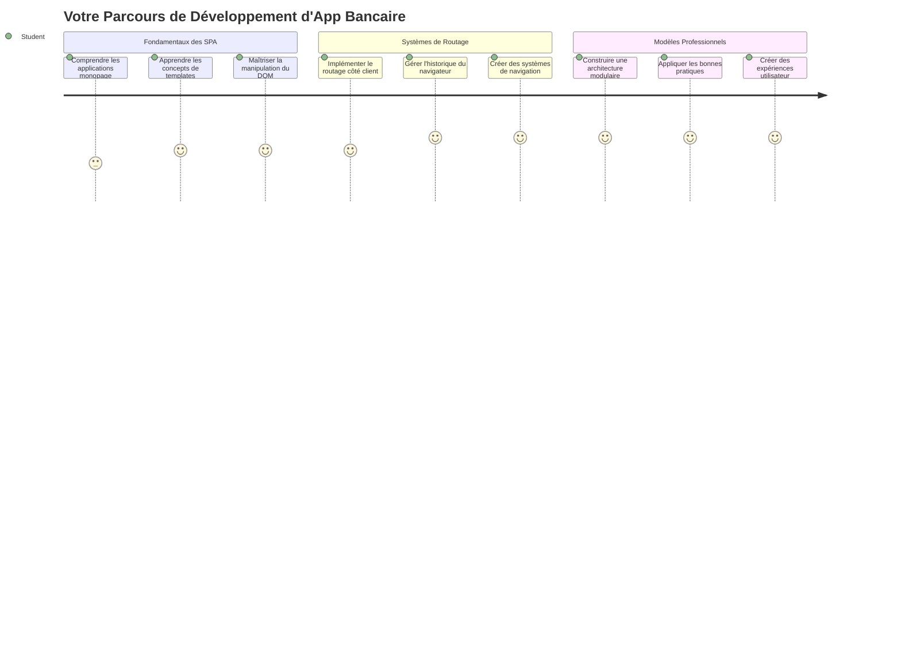
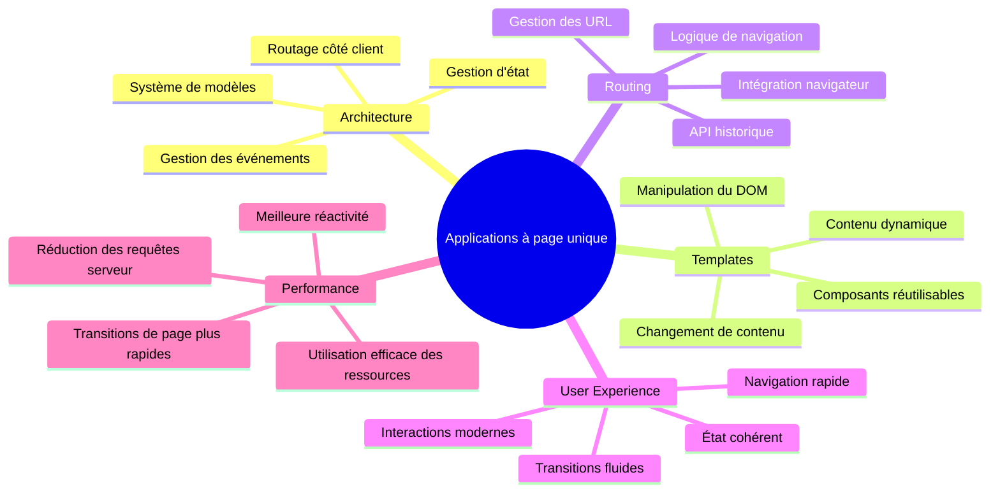
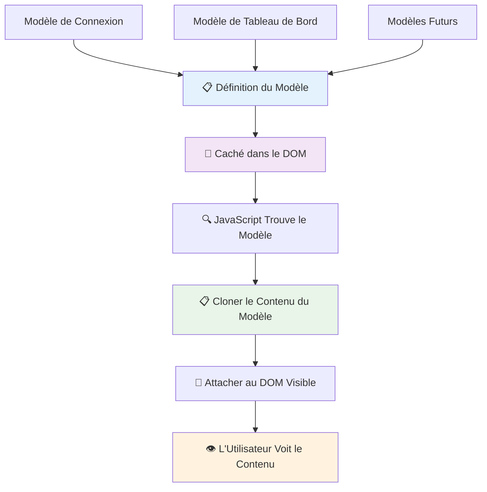
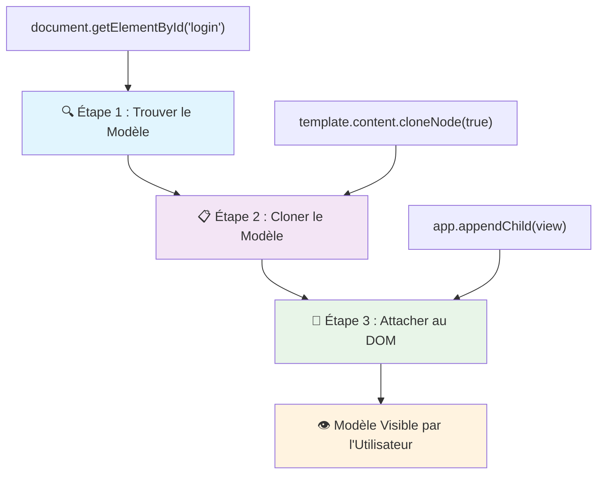
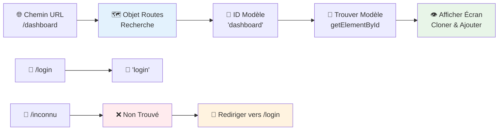
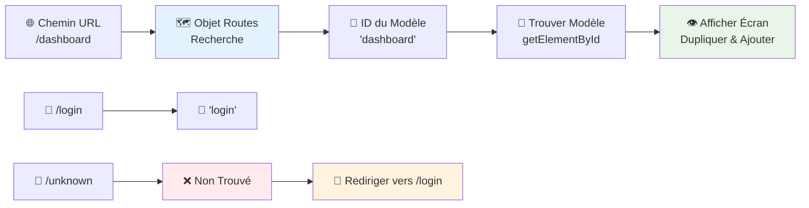
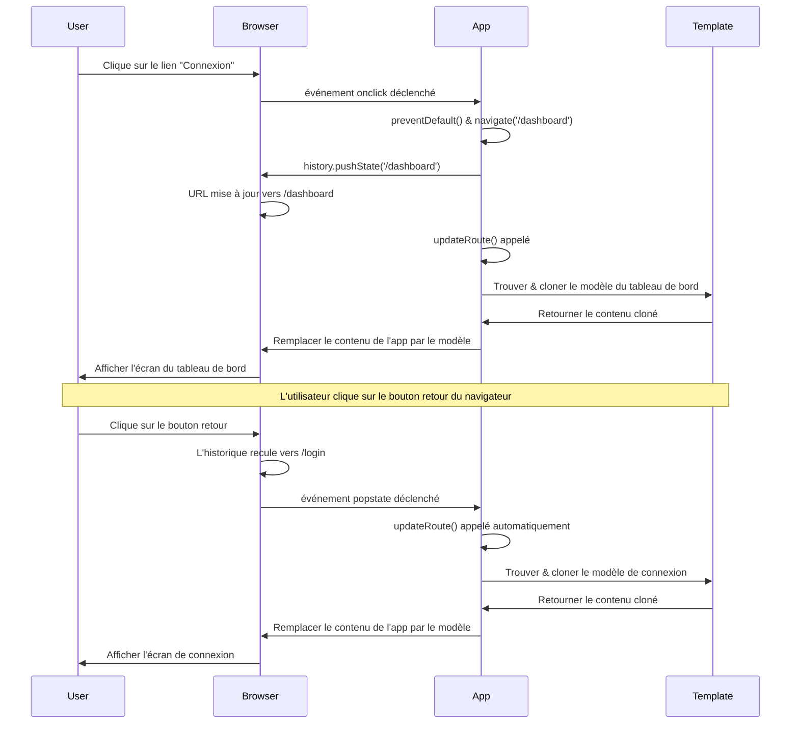
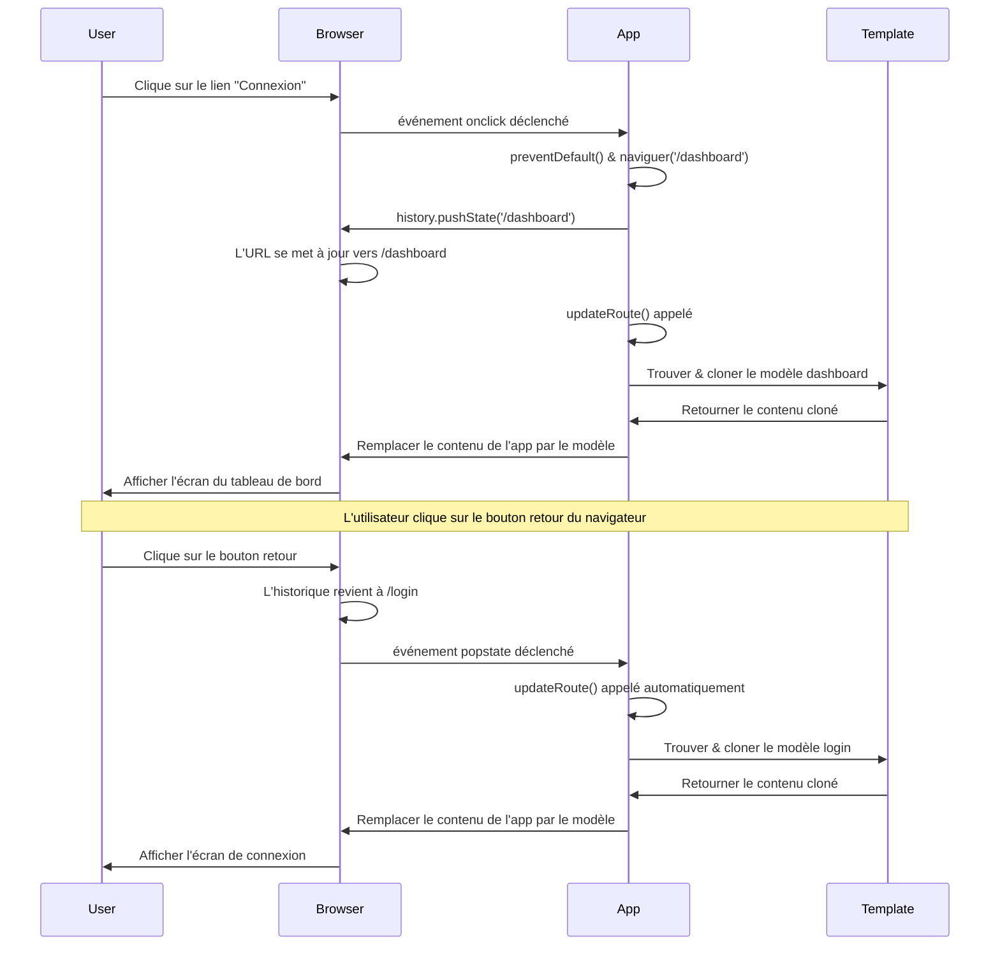
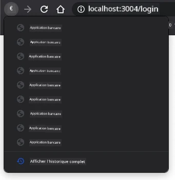
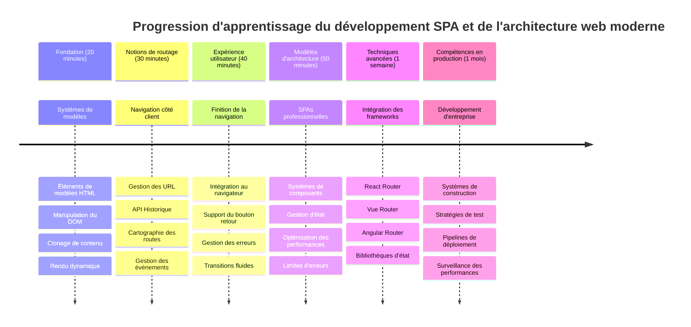

# Construire une application bancaire Partie 1 : Modèles HTML et Routes dans une application web


Lorsque l'ordinateur de guidage d'Apollo 11 a navigué vers la lune en 1969, il a dû basculer entre différents programmes sans redémarrer tout le système. Les applications web modernes fonctionnent de manière similaire – elles changent ce que vous voyez sans recharger tout depuis le début. Cela crée l'expérience fluide et réactive que les utilisateurs attendent aujourd'hui.

Contrairement aux sites Web traditionnels qui rechargent des pages entières à chaque interaction, les applications web modernes mettent à jour uniquement les parties nécessitant un changement. Cette approche, un peu comme le centre de contrôle qui bascule entre différents affichages tout en maintenant une communication constante, crée cette expérience fluide que nous avons appris à attendre.

Voici ce qui rend la différence si spectaculaire :

| Applications multi-pages traditionnelles | Applications modernes monopages |
|-----------------------------------------|---------------------------------|
| **Navigation** | Rechargement complet de la page à chaque écran | Changement instantané du contenu |
| **Performance** | Plus lent à cause du téléchargement complet du HTML | Plus rapide avec des mises à jour partielles |
| **Expérience utilisateur** | Flashs de page perturbants | Transitions fluides semblables à une application |
| **Partage des données** | Difficile entre les pages | Gestion facile de l'état |
| **Développement** | Plusieurs fichiers HTML à maintenir | Un seul HTML avec des modèles dynamiques |

**Comprendre l'évolution :**
- **Les applications traditionnelles** nécessitent des requêtes serveur pour chaque action de navigation
- **Les SPA modernes** se chargent une fois et mettent à jour le contenu dynamiquement via JavaScript
- **Les attentes des utilisateurs** privilégient désormais des interactions instantanées et fluides
- **Les bénéfices en performance** incluent une bande passante réduite et des réponses plus rapides

Dans cette leçon, nous allons construire une application bancaire avec plusieurs écrans qui s'enchaînent parfaitement. Comme les scientifiques utilisent des instruments modulaires pouvant être reconfigurés pour différentes expériences, nous utiliserons des modèles HTML comme composants réutilisables qui peuvent être affichés selon les besoins.

Vous travaillerez avec des modèles HTML (plans réutilisables pour différents écrans), le routage JavaScript (le système qui bascule entre les écrans) et l’API historique du navigateur (qui maintient le bon fonctionnement du bouton retour). Ce sont les mêmes techniques fondamentales utilisées par des frameworks comme React, Vue et Angular.

À la fin, vous aurez une application bancaire fonctionnelle qui démontre les principes professionnels des applications monopages.


## Questionnaire préalable à la leçon

[Questionnaire préalable à la leçon](https://ff-quizzes.netlify.app/web/quiz/41)

### Ce dont vous aurez besoin

Nous aurons besoin d’un serveur web local pour tester notre application bancaire – ne vous inquiétez pas, c’est plus simple que ça en a l’air ! Si vous n’en avez pas déjà un configuré, installez simplement [Node.js](https://nodejs.org) et lancez `npx lite-server` depuis votre dossier de projet. Cette commande pratique démarre un serveur local et ouvre automatiquement votre application dans le navigateur.

### Préparation

Sur votre ordinateur, créez un dossier nommé `bank` avec un fichier `index.html` à l’intérieur. Nous partirons de ce [modèle HTML](https://fr.wikipedia.org/wiki/Boilerplate) :

```html
<!DOCTYPE html>
<html lang="en">
  <head>
    <meta charset="UTF-8">
    <meta name="viewport" content="width=device-width, initial-scale=1.0">
    <title>Bank App</title>
  </head>
  <body>
    <!-- This is where you'll work -->
  </body>
</html>
```

**Voici ce que ce modèle fournit :**
- **Établit** la structure du document HTML5 avec la déclaration DOCTYPE correcte
- **Configure** l’encodage des caractères en UTF-8 pour la prise en charge internationale
- **Active** le design responsive avec la balise meta viewport pour la compatibilité mobile
- **Définit** un titre descriptif qui apparaît dans l'onglet du navigateur
- **Crée** une section body propre où nous construirons notre application

> 📁 **Aperçu de la structure du projet**
>
> **À la fin de cette leçon, votre projet contiendra :**
> ```
> bank/
> ├── index.html      <!-- Main HTML with templates -->
> ├── app.js          <!-- Routing and navigation logic -->
> └── style.css       <!-- (Optional for future lessons) -->
> ```
>
> **Responsabilités des fichiers :**
> - **index.html** : Contient tous les modèles et fournit la structure de l’application
> - **app.js** : Gère le routage, la navigation et la gestion des modèles
> - **Modèles** : Définissent l’interface utilisateur pour la connexion, le tableau de bord et autres écrans

---

## Modèles HTML

Les modèles résolvent un problème fondamental dans le développement web. Lorsque Gutenberg a inventé l’imprimerie à caractères mobiles dans les années 1440, il s’est rendu compte qu’au lieu de sculpter des pages entières, il pouvait créer des blocs de lettres réutilisables et les disposer selon les besoins. Les modèles HTML fonctionnent selon le même principe – au lieu de créer des fichiers HTML séparés pour chaque écran, vous définissez des structures réutilisables qui peuvent être affichées selon les besoins.


Considérez les modèles comme des plans pour différentes parties de votre application. Tout comme un architecte crée un plan et le réutilise plusieurs fois au lieu de redessiner des pièces identiques, nous créons les modèles une fois puis les instancions selon le besoin. Le navigateur garde ces modèles cachés jusqu’à ce que JavaScript les active.

Si vous souhaitez créer plusieurs écrans pour une page web, une solution serait de créer un fichier HTML pour chaque écran que vous voulez afficher. Cependant, cette solution présente quelques inconvénients :

- Vous devez recharger tout le HTML à chaque changement d’écran, ce qui peut être lent.
- Il est difficile de partager des données entre les différents écrans.

Une autre approche consiste à n’avoir qu’un seul fichier HTML et définir plusieurs [modèles HTML](https://developer.mozilla.org/fr/docs/Web/HTML/Element/template) en utilisant l’élément `<template>`. Un modèle est un bloc HTML réutilisable qui n’est pas affiché par le navigateur et doit être instancié au moment de l’exécution en utilisant JavaScript.

### Construisons-le

Nous allons créer une application bancaire avec deux écrans principaux : une page de connexion et un tableau de bord. Commençons par ajouter un élément de remplacement dans le corps de notre HTML – c’est ici que tous nos écrans différents apparaîtront :

```html
<div id="app">Loading...</div>
```

**Comprendre ce placeholder :**
- **Crée** un conteneur avec l’ID "app" où tous les écrans seront affichés
- **Affiche** un message de chargement jusqu’à ce que JavaScript initialise le premier écran
- **Fournit** un point d’ancrage unique pour notre contenu dynamique
- **Permet** un ciblage facile depuis JavaScript avec `document.getElementById()`

> 💡 **Astuce Pro** : Puisque le contenu de cet élément sera remplacé, vous pouvez y mettre un message ou un indicateur de chargement qui s’affichera pendant le chargement de l’application.

Ensuite, ajoutons sous ce placeholder le modèle HTML pour la page de connexion. Pour l’instant, nous y mettrons seulement un titre et une section contenant un lien que nous utiliserons pour naviguer.

```html
<template id="login">
  <h1>Bank App</h1>
  <section>
    <a href="/dashboard">Login</a>
  </section>
</template>
```

**Décomposition de ce modèle de connexion :**
- **Définit** un modèle avec l’identifiant unique "login" pour le ciblage JavaScript
- **Inclut** un titre principal qui établit la marque de l’application
- **Contient** un élément `<section>` sémantique pour grouper le contenu lié
- **Fournit** un lien de navigation qui mènera les utilisateurs vers le tableau de bord

Puis, nous ajouterons un autre modèle HTML pour la page du tableau de bord. Cette page contiendra différentes sections :

- Un en-tête avec un titre et un lien de déconnexion
- Le solde actuel du compte bancaire
- Une liste de transactions, affichée dans un tableau

```html
<template id="dashboard">
  <header>
    <h1>Bank App</h1>
    <a href="/login">Logout</a>
  </header>
  <section>
    Balance: 100$
  </section>
  <section>
    <h2>Transactions</h2>
    <table>
      <thead>
        <tr>
          <th>Date</th>
          <th>Object</th>
          <th>Amount</th>
        </tr>
      </thead>
      <tbody></tbody>
    </table>
  </section>
</template>
```

**Comprenons chaque partie de ce tableau de bord :**
- **Structure** la page avec un élément `<header>` sémantique contenant la navigation
- **Affiche** le titre de l’application de manière cohérente pour le branding
- **Fournit** un lien de déconnexion qui redirige vers l’écran de connexion
- **Montre** le solde actuel du compte dans une section dédiée
- **Organise** les données des transactions avec un tableau HTML bien structuré
- **Définit** les en-têtes de colonnes pour Date, Objet et Montant
- **Laisse** le corps du tableau vide pour une injection dynamique de contenu ultérieure

> 💡 **Astuce Pro** : Lors de la création de modèles HTML, si vous voulez voir à quoi cela ressemble, vous pouvez commenter les lignes `<template>` et `</template>` en les entourant de `<!-- -->`.

### 🔄 **Vérification pédagogique**
**Compréhension du système de modèles** : Avant d’implémenter le JavaScript, assurez-vous de comprendre :
- ✅ En quoi les modèles diffèrent des éléments HTML classiques
- ✅ Pourquoi les modèles restent cachés jusqu’à activation par JavaScript
- ✅ L’importance de la structure HTML sémantique dans les modèles
- ✅ Comment les modèles permettent des composants UI réutilisables

**Auto-test rapide** : Que se passe-t-il si vous retirez les balises `<template>` autour de votre HTML ?
*Réponse : Le contenu devient immédiatement visible et perd sa fonctionnalité de modèle*

**Avantages de l’architecture** : Les modèles offrent :
- **Réutilisabilité** : Une définition, plusieurs instances
- **Performance** : Pas d’analyse HTML redondante
- **Maintenabilité** : Structure UI centralisée
- **Flexibilité** : Basculement dynamique du contenu

✅ Pourquoi selon vous utilisons-nous des attributs `id` sur les modèles ? Pourrait-on utiliser autre chose comme des classes ?

## Donner vie aux modèles avec JavaScript

Maintenant, il faut rendre nos modèles fonctionnels. Comme une imprimante 3D prend un plan numérique et crée un objet physique, JavaScript prend nos modèles cachés et crée des éléments visibles et interactifs que les utilisateurs peuvent voir et utiliser.

Le processus suit trois étapes cohérentes qui forment la base du développement web moderne. Une fois que vous comprenez ce modèle, vous le reconnaîtrez dans de nombreux frameworks et bibliothèques.

Si vous ouvrez votre fichier HTML actuel dans un navigateur, vous verrez qu’il reste bloqué à afficher `Loading...`. C’est parce que nous devons ajouter du code JavaScript pour instancier et afficher les modèles HTML.

Instancier un modèle se fait généralement en 3 étapes :

1. Récupérer l’élément modèle dans le DOM, par exemple avec [`document.getElementById`](https://developer.mozilla.org/fr/docs/Web/API/Document/getElementById).
2. Cloner l’élément modèle, en utilisant [`cloneNode`](https://developer.mozilla.org/fr/docs/Web/API/Node/cloneNode).
3. L’attacher au DOM sous un élément visible, par exemple avec [`appendChild`](https://developer.mozilla.org/fr/docs/Web/API/Node/appendChild).


**Décomposition visuelle du processus :**
- **Étape 1** localise le modèle caché dans la structure DOM
- **Étape 2** crée une copie fonctionnelle modifiable en sécurité
- **Étape 3** insère la copie dans la zone visible de la page
- **Résultat** : un écran fonctionnel avec lequel l’utilisateur peut interagir

✅ Pourquoi devons-nous cloner le modèle avant de l’attacher au DOM ? Que pensez-vous qu’il se passerait si nous évitions cette étape ?

### Tâche

Créez un nouveau fichier nommé `app.js` dans votre dossier de projet et importez ce fichier dans la section `<head>` de votre HTML :

```html
<script src="app.js" defer></script>
```

**Comprendre cet import de script :**
- **Relie** le fichier JavaScript à notre document HTML
- **Utilise** l’attribut `defer` pour s’assurer que le script s’exécute après l’analyse HTML
- **Permet** l’accès à tous les éléments DOM puisqu’ils sont entièrement chargés avant l’exécution du script
- **Suit** les bonnes pratiques modernes de chargement et performance des scripts

Maintenant dans `app.js`, créons une nouvelle fonction `updateRoute` :

```js
function updateRoute(templateId) {
  const template = document.getElementById(templateId);
  const view = template.content.cloneNode(true);
  const app = document.getElementById('app');
  app.innerHTML = '';
  app.appendChild(view);
}
```

**Étape par étape, voici ce qui se passe :**
- **Localise** l’élément modèle en utilisant son identifiant unique
- **Crée** une copie profonde du contenu du modèle avec `cloneNode(true)`
- **Trouve** le conteneur app où le contenu sera affiché
- **Vide** tout contenu existant dans le conteneur app
- **Insère** le contenu cloné du modèle dans le DOM visible

Appelez maintenant cette fonction avec l’un des modèles et regardez le résultat.

```js
updateRoute('login');
```

**Ce que cet appel de fonction accomplit :**
- **Active** le modèle de connexion en passant son ID comme paramètre
- **Démontre** comment basculer programmatiquement entre différents écrans de l’application
- **Affiche** l’écran de connexion à la place du message "Loading..."

✅ Quel est l’objectif de ce code `app.innerHTML = '';` ? Que se passe-t-il sans lui ?

## Création des routes

Le routage consiste essentiellement à associer des URLs au contenu approprié. Imaginez comment les premiers opérateurs téléphoniques utilisaient des centraux pour connecter les appels – ils prenaient une requête entrante et la routaient vers la bonne destination. Le routage web fonctionne de façon similaire, prenant une requête URL et déterminant le contenu à afficher.


Traditionnellement, les serveurs web géraient cela en servant différents fichiers HTML pour différentes URLs. Comme nous construisons une application monopage, nous devons gérer ce routage nous-mêmes avec JavaScript. Cette approche nous donne plus de contrôle sur l'expérience utilisateur et la performance.


**Comprendre le flux de routage :**
- **Les changements d’URL** déclenchent une recherche dans notre configuration de routes
- **Les routes valides** correspondent à des IDs de modèles spécifiques pour rendu
- **Les routes invalides** déclenchent un comportement de secours pour empêcher les états cassés
- **Le rendu des modèles** suit le processus en trois étapes que nous avons appris plus tôt

Quand on parle d’une application web, on appelle *routage* l’intention de mapper **URLs** à des écrans spécifiques qui doivent être affichés. Sur un site web avec plusieurs fichiers HTML, cela se fait automatiquement car les chemins de fichiers sont reflétés dans l’URL. Par exemple, avec ces fichiers dans votre dossier de projet :

```
mywebsite/index.html
mywebsite/login.html
mywebsite/admin/index.html
```

Si vous créez un serveur web avec "mywebsite" comme racine, le mappage URL sera :

```
https://site.com            --> mywebsite/index.html
https://site.com/login.html --> mywebsite/login.html
https://site.com/admin/     --> mywebsite/admin/index.html
```

Cependant, pour notre application web, nous utilisons un seul fichier HTML contenant tous les écrans, donc ce comportement par défaut ne nous aidera pas. Nous devons créer cette carte manuellement et mettre à jour le modèle affiché avec JavaScript.

### Tâche

Nous allons utiliser un objet simple pour implémenter une [table de correspondance](https://fr.wikipedia.org/wiki/Table_de_hashage) entre les chemins URL et nos modèles. Ajoutez cet objet en haut de votre fichier `app.js`.

```js
const routes = {
  '/login': { templateId: 'login' },
  '/dashboard': { templateId: 'dashboard' },
};
```

**Comprendre cette configuration de routes :**
- **Définit** une correspondance entre les chemins URL et les identifiants de modèles
- **Utilise** la syntaxe objet où les clés sont des chemins URL et les valeurs contiennent les informations sur le modèle
- **Permet** de rechercher facilement quel modèle afficher pour une URL donnée
- **Fournit** une structure évolutive pour ajouter de nouvelles routes à l'avenir
Modifions maintenant un peu la fonction `updateRoute`. Au lieu de passer directement le `templateId` en argument, nous voulons le récupérer en regardant d'abord l'URL actuelle, puis utiliser notre map pour obtenir la valeur correspondante de l'ID du template. Nous pouvons utiliser [`window.location.pathname`](https://developer.mozilla.org/docs/Web/API/Location/pathname) pour obtenir uniquement la section du chemin de l'URL.

```js
function updateRoute() {
  const path = window.location.pathname;
  const route = routes[path];

  const template = document.getElementById(route.templateId);
  const view = template.content.cloneNode(true);
  const app = document.getElementById('app');
  app.innerHTML = '';
  app.appendChild(view);
}
```

**Décomposons ce qui se passe ici :**
- **Extrait** le chemin actuel de l'URL du navigateur en utilisant `window.location.pathname`
- **Cherche** la configuration de route correspondante dans notre objet routes
- **Récupère** l'ID du template à partir de la configuration de la route
- **Suit** le même processus de rendu de template qu'auparavant
- **Crée** un système dynamique qui réagit aux changements d'URL

Ici, nous avons associé les routes que nous avons déclarées au template correspondant. Vous pouvez tester que cela fonctionne correctement en changeant l'URL manuellement dans votre navigateur.

✅ Que se passe-t-il si vous entrez un chemin inconnu dans l'URL ? Comment pourrions-nous résoudre cela ?

## Ajout de la navigation

Avec le routage établi, les utilisateurs ont besoin d'un moyen de naviguer dans l'application. Les sites web traditionnels rechargent des pages entières lorsqu'on clique sur des liens, mais nous voulons mettre à jour à la fois l'URL et le contenu sans rafraîchir la page. Cela crée une expérience plus fluide similaire à la manière dont les applications de bureau changent de vues.

Nous devons coordonner deux choses : mettre à jour l'URL du navigateur pour que les utilisateurs puissent mettre des pages en favoris et partager des liens, et afficher le contenu approprié. Lorsqu'il est bien implémenté, cela crée la navigation fluide attendue des applications modernes.


### 🔄 **Vérification pédagogique**
**Architecture d'une application monopage (SPA)** : Vérifiez votre compréhension du système complet :
- ✅ En quoi le routage côté client diffère-t-il du routage traditionnel côté serveur ?
- ✅ Pourquoi l'API History est-elle essentielle pour une navigation SPA correcte ?
- ✅ Comment les templates permettent-ils un contenu dynamique sans rechargement de page ?
- ✅ Quel rôle joue la gestion des événements dans l'interception de la navigation ?

**Intégration système** : Votre SPA démontre :
- **Gestion des templates** : Composants UI réutilisables avec contenu dynamique
- **Routage côté client** : Gestion de l'URL sans requêtes serveur
- **Architecture pilotée par événements** : Navigation réactive et interactions utilisateur
- **Intégration navigateur** : Support correct du bouton retour/avant et de l'historique
- **Optimisation des performances** : Transitions rapides et charge serveur réduite

**Bonnes pratiques professionnelles** : Vous avez implémenté :
- **Séparation Modèle-Vue** : Templates séparés de la logique applicative
- **Gestion d'état** : État URL synchronisé avec le contenu affiché
- **Amélioration progressive** : JavaScript qui améliore la fonctionnalité HTML basique
- **Expérience utilisateur** : Navigation fluide et sans rafraîchissement de page

> � **Aperçu d'architecture** : Composants du système de navigation
>
> **Ce que vous construisez :**
> - **🔄 Gestion de l'URL** : Mise à jour de la barre d'adresse sans rechargement
> - **📋 Système de templates** : Changement dynamique du contenu selon la route  
> - **📚 Intégration de l'historique** : Maintien du fonctionnement des boutons retour/avant
> - **🛡️ Gestion des erreurs** : Repli gracieux pour les routes invalides ou manquantes
>
> **Fonctionnement des composants ensemble :**
> - **Écoute** des événements de navigation (clics, changements d'historique)
> - **Mise à jour** de l'URL via l'API History
> - **Rendu** du template adapté à la nouvelle route
> - **Maintien** d'une expérience utilisateur fluide

L'étape suivante pour notre application est d'ajouter la possibilité de naviguer entre les pages sans avoir à changer l'URL manuellement. Cela implique deux choses :

  1. Mettre à jour l'URL actuelle
  2. Mettre à jour le template affiché en fonction de la nouvelle URL

Nous avons déjà pris en charge la deuxième partie avec la fonction `updateRoute`, il nous reste donc à trouver comment mettre à jour l'URL actuelle.

Nous allons devoir utiliser JavaScript et plus particulièrement la fonction [`history.pushState`](https://developer.mozilla.org/docs/Web/API/History/pushState) qui permet de mettre à jour l'URL et créer une nouvelle entrée dans l'historique de navigation, sans recharger le HTML.

> ⚠️ **Note importante** : Alors que l'élément HTML ancre [`<a href>`](https://developer.mozilla.org/docs/Web/HTML/Element/a) peut être utilisé seul pour créer des liens vers différentes URLs, cela provoque par défaut le rechargement de la page HTML. Il est nécessaire d'empêcher ce comportement lors de la gestion du routage avec du JavaScript personnalisé, en utilisant la fonction preventDefault() sur l'événement de clic.

### Tâche

Créons une nouvelle fonction que nous pouvons utiliser pour naviguer dans notre app :

```js
function navigate(path) {
  window.history.pushState({}, path, path);
  updateRoute();
}
```

**Compréhension de cette fonction de navigation :**
- **Met à jour** l'URL du navigateur avec le nouveau chemin via `history.pushState`
- **Ajoute** une nouvelle entrée à la pile d'historique pour un support correct des boutons retour/avant
- **Déclenche** la fonction `updateRoute()` pour afficher le template correspondant
- **Maintient** l'expérience SPA sans rechargement de page

Cette méthode met d'abord à jour l'URL actuelle en fonction du chemin donné, puis met à jour le template. La propriété `window.location.origin` retourne la racine de l'URL, ce qui permet de reconstruire une URL complète à partir d'un chemin donné.

Maintenant que nous avons cette fonction, nous pouvons régler le problème si un chemin ne correspond à aucune route définie. Nous allons modifier la fonction `updateRoute` en ajoutant une solution de secours vers une route existante si aucune correspondance n'est trouvée.

```js
function updateRoute() {
  const path = window.location.pathname;
  const route = routes[path];

  if (!route) {
    return navigate('/login');
  }

  const template = document.getElementById(route.templateId);
  const view = template.content.cloneNode(true);
  const app = document.getElementById('app');
  app.innerHTML = '';
  app.appendChild(view);
}
```

**Points clés à retenir :**
- **Vérifie** si une route existe pour le chemin actuel
- **Redirige** vers la page de connexion lorsqu'une route invalide est utilisée
- **Fournit** un mécanisme de secours pour éviter une navigation cassée
- **Assure** que les utilisateurs voient toujours un écran valide, même avec une URL incorrecte

Si une route ne peut pas être trouvée, nous redirigeons maintenant vers la page `login`.

Créons maintenant une fonction pour récupérer l'URL lorsqu'un lien est cliqué, et pour empêcher le comportement par défaut du navigateur pour les liens :

```js
function onLinkClick(event) {
  event.preventDefault();
  navigate(event.target.href);
}
```

**Décomposition de ce gestionnaire de clic :**
- **Empêche** le comportement par défaut du navigateur grâce à `preventDefault()`
- **Extrait** l'URL de destination à partir de l'élément de lien cliqué
- **Appelle** notre fonction de navigation personnalisée au lieu de recharger la page
- **Maintient** une expérience fluide de type application monopage

```html
<a href="/dashboard" onclick="onLinkClick(event)">Login</a>
...
<a href="/login" onclick="onLinkClick(event)">Logout</a>
```

**Ce que réalise ce binding onclick :**
- **Connecte** chaque lien à notre système de navigation personnalisé
- **Transmet** l'événement de clic à notre fonction `onLinkClick` pour traitement
- **Permet** une navigation fluide sans rechargement
- **Maintient** une structure URL correcte que les utilisateurs peuvent mettre en favoris ou partager

L'attribut [`onclick`](https://developer.mozilla.org/docs/Web/API/GlobalEventHandlers/onclick) lie l'événement `click` au code JavaScript, ici l'appel à la fonction `navigate()`.

Essayez de cliquer sur ces liens, vous devriez maintenant pouvoir naviguer entre les différentes pages de votre app.

✅ La méthode `history.pushState` fait partie de la norme HTML5 et est implémentée dans [tous les navigateurs modernes](https://caniuse.com/?search=pushState). Si vous développez une app web pour des navigateurs plus anciens, il existe un petit truc à utiliser à la place de cette API : en utilisant un [hash ("#")](https://fr.wikipedia.org/wiki/Fragment_URI) avant le chemin, vous pouvez implémenter un routage qui fonctionne avec la navigation ordinaire des ancres et sans rechargement de page, car son but était de créer des liens internes dans une page.

## Faire fonctionner les boutons retour et avant

Les boutons retour et avant sont fondamentaux pour la navigation web, tout comme les contrôleurs de mission de la NASA peuvent revoir les états précédents d’un système lors des missions spatiales. Les utilisateurs attendent que ces boutons fonctionnent, et quand ce n’est pas le cas, l'expérience de navigation attendue est brisée.

Notre application SPA nécessite une configuration supplémentaire pour supporter cela. Le navigateur maintient une pile d’historique (à laquelle nous avons ajouté des entrées avec `history.pushState`), mais lorsque les utilisateurs naviguent dans cet historique, notre app doit répondre en mettant à jour le contenu affiché en conséquence.


**Points d’interaction clés :**
- **Actions utilisateur** déclenchent la navigation via clics ou boutons du navigateur
- **App** intercepte les clics sur liens pour empêcher le rechargement de page
- **API History** gère les changements d’URL et la pile d’historique du navigateur
- **Templates** fournissent la structure du contenu pour chaque écran
- **Écouteurs d'événements** assurent que l’app réagit à tous les types de navigation

L’utilisation de `history.pushState` crée de nouvelles entrées dans l’historique de navigation du navigateur. Vous pouvez vérifier cela en maintenant appuyé le *bouton retour* de votre navigateur, cela devrait afficher quelque chose comme ceci :



Si vous cliquez plusieurs fois sur le bouton retour, vous verrez que l’URL change et que l'historique est mis à jour, mais que le même template reste affiché.

C’est parce que l’application ne sait pas qu’elle doit appeler `updateRoute()` à chaque changement d’historique. Si vous regardez la [documentation de `history.pushState`](https://developer.mozilla.org/docs/Web/API/History/pushState), vous pouvez voir que si l’état change – ce qui signifie que nous avons changé d’URL – l’événement [`popstate`](https://developer.mozilla.org/docs/Web/API/Window/popstate_event) est déclenché. Nous allons utiliser cela pour corriger ce problème.

### Tâche

Pour garantir que le template affiché est mis à jour lorsque l’historique du navigateur change, nous allons attacher une nouvelle fonction qui appelle `updateRoute()`. Nous ferons cela en bas de notre fichier `app.js` :

```js
window.onpopstate = () => updateRoute();
updateRoute();
```

**Compréhension de cette intégration de l’historique :**
- **Écoute** les événements `popstate` qui se produisent quand l’utilisateur navigue avec les boutons du navigateur
- **Utilise** une fonction fléchée pour une syntaxe plus concise du gestionnaire d’événements
- **Appelle** automatiquement `updateRoute()` à chaque changement d’état de l’historique
- **Initialise** l’app en appelant `updateRoute()` lorsque la page charge pour la première fois
- **Garantit** que le bon template est affiché peu importe comment l’utilisateur navigue

> 💡 **Astuce pro** : Nous avons utilisé une [fonction fléchée](https://developer.mozilla.org/docs/Web/JavaScript/Reference/Functions/Arrow_functions) ici pour déclarer notre gestionnaire d'événement `popstate` par souci de concision, mais une fonction classique fonctionnerait de la même manière.

Voici une vidéo de rappel sur les fonctions fléchées :

[](https://youtube.com/watch?v=OP6eEbOj2sc "Fonctions Fléchées")

> 🎥 Cliquez sur l'image ci-dessus pour voir une vidéo sur les fonctions fléchées.

Essayez maintenant d’utiliser les boutons retour et avant de votre navigateur, et vérifiez que la route affichée est bien mise à jour cette fois.

### ⚡ **Ce que vous pouvez faire dans les 5 prochaines minutes**
- [ ] Testez la navigation de votre application bancaire avec les boutons retour/avant du navigateur
- [ ] Essayez de taper différentes URLs manuellement dans la barre d’adresse pour tester le routage
- [ ] Ouvrez les outils de développement du navigateur et inspectez comment les templates sont clonés dans le DOM
- [ ] Expérimentez avec des console.log pour suivre le flux du routage

### 🎯 **Ce que vous pouvez accomplir cette heure**
- [ ] Terminez le quiz post-leçon et comprenez les concepts d’architecture SPA
- [ ] Ajoutez des styles CSS pour rendre les templates de votre app bancaire professionnels
- [ ] Implémentez la page d’erreur 404 avec gestion appropriée des erreurs
- [ ] Créez la page de crédits avec des fonctionnalités de routage supplémentaires
- [ ] Ajoutez des états de chargement et des transitions entre les changements de template

### 📅 **Votre parcours de développement SPA sur une semaine**
- [ ] Complétez l’application bancaire complète avec formulaires, gestion de données et persistance
- [ ] Ajoutez des fonctionnalités avancées de routage comme les paramètres de route et les routes imbriquées
- [ ] Implémentez des gardes de navigation et du routage basé sur l’authentification
- [ ] Créez des composants template réutilisables et une bibliothèque de composants
- [ ] Ajoutez des animations et transitions pour une expérience utilisateur plus fluide
- [ ] Déployez votre SPA sur une plateforme d’hébergement et configurez correctement le routage

### 🌟 **Votre maîtrise de l’architecture frontend en un mois**
- [ ] Construisez des SPA complexes avec des frameworks modernes comme React, Vue ou Angular
- [ ] Apprenez des patterns avancés de gestion d’état et des bibliothèques associées
- [ ] Maîtrisez les outils de build et les workflows de développement pour les SPA
- [ ] Implémentez des fonctionnalités de Progressive Web App et de fonctionnement hors ligne
- [ ] Étudiez des techniques d’optimisation des performances pour des SPA à grande échelle
- [ ] Contribuez à des projets SPA open source et partagez vos connaissances

## 🎯 Votre calendrier de maîtrise de l'application monopage


### 🛠️ Résumé de votre boîte à outils de développement SPA

Après avoir terminé cette leçon, vous avez maîtrisé :
- **Architecture de template** : Composants HTML réutilisables avec rendu dynamique
- **Routage côté client** : Gestion de l’URL et navigation sans rechargement
- **Intégration navigateur** : Usage de l’API History et support boutons retour/avant
- **Systèmes pilotés par événements** : Gestion de la navigation et interactions utilisateur
- **Manipulation DOM** : Clonage de templates, changement de contenu et gestion d’éléments
- **Gestion des erreurs** : Repli gracieux pour routes invalides et contenus manquants
- **Patterns de performance** : Chargement et rendu efficaces du contenu

**Applications réelles** : Vos compétences en développement SPA s’appliquent directement à :
- **Applications web modernes** : Développement avec React, Vue, Angular et autres frameworks
- **Progressive Web Apps** : Applications fonctionnant hors ligne avec expérience semblable à une app native
- **Tableaux de bord d’entreprise** : Applications métier complexes avec multiples vues
- **Plateformes e-commerce** : Catalogues produits, paniers d’achat et processus de paiement
- **Gestion de contenu** : Création et édition de contenu dynamique
- **Développement mobile** : Applications hybrides utilisant des technologies web

**Compétences professionnelles acquises** : Vous pouvez désormais :
- **Architecturer** des applications monopage avec une séparation appropriée des responsabilités
- **Mettre en œuvre** des systèmes de routage côté client qui évoluent avec la complexité de l'application
- **Déboguer** des flux de navigation complexes en utilisant les outils de développement du navigateur
- **Optimiser** les performances de l'application grâce à une gestion efficace des modèles
- **Concevoir** des expériences utilisateur qui semblent natives et réactives

**Concepts de développement frontend maîtrisés** :
- **Architecture composant** : Modèles UI réutilisables et systèmes de templates
- **Synchronisation d'état** : Gestion de l'état via l'URL et historique du navigateur
- **Programmation événementielle** : Gestion des interactions utilisateur et navigation
- **Optimisation des performances** : Manipulation efficace du DOM et chargement de contenu
- **Conception de l'expérience utilisateur** : Transitions fluides et navigation intuitive

**Niveau suivant** : Vous êtes prêt à explorer les frameworks frontend modernes, la gestion avancée d'état, ou construire des applications d'entreprise complexes !

🌟 **Succès débloqué** : Vous avez construit une base professionnelle pour une application monopage avec des patterns d'architecture web modernes !

---

## Défi Agent GitHub Copilot 🚀

Utilisez le mode Agent pour relever le défi suivant :

**Description :** Améliorez l'application bancaire en implémentant la gestion des erreurs et un modèle de page 404 pour les routes invalides, améliorant ainsi l'expérience utilisateur lors de la navigation vers des pages inexistantes.

**Prompt :** Créez un nouveau modèle HTML avec l'id "not-found" affichant une page d'erreur 404 conviviale avec du style. Puis modifiez la logique de routage JavaScript pour afficher ce modèle lorsque les utilisateurs naviguent vers des URLs invalides, et ajoutez un bouton "Retour à l'accueil" qui revient à la page de connexion.

En savoir plus sur [le mode agent](https://code.visualstudio.com/blogs/2025/02/24/introducing-copilot-agent-mode) ici.

## 🚀 Challenge

Ajoutez un nouveau template et une route pour une troisième page qui affiche les crédits de cette application.

**Objectifs du défi :**
- **Créer** un nouveau template HTML avec une structure de contenu appropriée
- **Ajouter** la nouvelle route à votre objet de configuration des routes
- **Inclure** des liens de navigation vers et depuis la page des crédits
- **Tester** que toute la navigation fonctionne correctement avec l'historique du navigateur

## Quiz post-conférence

[Quiz post-conférence](https://ff-quizzes.netlify.app/web/quiz/42)

## Revue & Auto-apprentissage

Le routage est l'un des aspects étonnamment complexes du développement web, surtout lorsque le web passe des comportements de rafraîchissement de page aux rafraîchissements de page d'application monopage. Lisez un peu sur [comment le service Azure Static Web App](https://docs.microsoft.com/azure/static-web-apps/routes/?WT.mc_id=academic-77807-sagibbon) gère le routage. Pouvez-vous expliquer pourquoi certaines décisions décrites dans ce document sont nécessaires ?

**Ressources d'apprentissage supplémentaires :**
- **Explorez** comment les frameworks populaires comme React Router et Vue Router implémentent le routage côté client
- **Recherchez** les différences entre le routage basé sur le hash et le routage avec l'API history
- **Apprenez** sur le rendu côté serveur (SSR) et comment il impacte les stratégies de routage
- **Investiguez** comment les Progressive Web Apps (PWAs) gèrent le routage et la navigation

## Travail à faire

[Améliorez le routage](assignment.md)

---

<!-- CO-OP TRANSLATOR DISCLAIMER START -->
**Avertissement** :  
Ce document a été traduit à l’aide du service de traduction automatique [Co-op Translator](https://github.com/Azure/co-op-translator). Bien que nous nous efforcions d’être précis, veuillez noter que les traductions automatiques peuvent contenir des erreurs ou des inexactitudes. Le document original dans sa langue native doit être considéré comme la source faisant foi. Pour les informations critiques, une traduction professionnelle effectuée par un humain est recommandée. Nous déclinons toute responsabilité en cas de malentendus ou de mauvaises interprétations résultant de l’utilisation de cette traduction.
<!-- CO-OP TRANSLATOR DISCLAIMER END -->