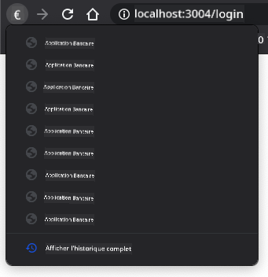

<!--
CO_OP_TRANSLATOR_METADATA:
{
  "original_hash": "8a07db14e75ac62f013b7de5df05981d",
  "translation_date": "2025-08-29T13:33:30+00:00",
  "source_file": "7-bank-project/1-template-route/README.md",
  "language_code": "fr"
}
-->
# Créer une application bancaire Partie 1 : Modèles HTML et routes dans une application web

## Quiz avant le cours

[Quiz avant le cours](https://ff-quizzes.netlify.app/web/quiz/41)

### Introduction

Depuis l'apparition de JavaScript dans les navigateurs, les sites web sont devenus plus interactifs et complexes que jamais. Les technologies web sont désormais couramment utilisées pour créer des applications entièrement fonctionnelles qui s'exécutent directement dans un navigateur, que l'on appelle [applications web](https://en.wikipedia.org/wiki/Web_application). Étant donné que les applications web sont très interactives, les utilisateurs ne veulent pas attendre un rechargement complet de la page à chaque action. C'est pourquoi JavaScript est utilisé pour mettre à jour directement le HTML via le DOM, offrant ainsi une expérience utilisateur plus fluide.

Dans cette leçon, nous allons poser les bases pour créer une application bancaire web, en utilisant des modèles HTML pour créer plusieurs écrans qui peuvent être affichés et mis à jour sans avoir à recharger toute la page HTML.

### Prérequis

Vous avez besoin d'un serveur web local pour tester l'application web que nous allons construire dans cette leçon. Si vous n'en avez pas, vous pouvez installer [Node.js](https://nodejs.org) et utiliser la commande `npx lite-server` depuis votre dossier de projet. Cela créera un serveur web local et ouvrira votre application dans un navigateur.

### Préparation

Sur votre ordinateur, créez un dossier nommé `bank` avec un fichier nommé `index.html` à l'intérieur. Nous allons commencer avec ce [code de base HTML](https://en.wikipedia.org/wiki/Boilerplate_code) :

```html
<!DOCTYPE html>
<html lang="en">
  <head>
    <meta charset="UTF-8">
    <meta name="viewport" content="width=device-width, initial-scale=1.0">
    <title>Bank App</title>
  </head>
  <body>
    <!-- This is where you'll work -->
  </body>
</html>
```

---

## Modèles HTML

Si vous souhaitez créer plusieurs écrans pour une page web, une solution serait de créer un fichier HTML pour chaque écran que vous voulez afficher. Cependant, cette solution présente certains inconvénients :

- Vous devez recharger tout le HTML lors du changement d'écran, ce qui peut être lent.
- Il est difficile de partager des données entre les différents écrans.

Une autre approche consiste à n'avoir qu'un seul fichier HTML et à définir plusieurs [modèles HTML](https://developer.mozilla.org/docs/Web/HTML/Element/template) en utilisant l'élément `<template>`. Un modèle est un bloc HTML réutilisable qui n'est pas affiché par le navigateur et qui doit être instancié à l'exécution via JavaScript.

### Tâche

Nous allons créer une application bancaire avec deux écrans : la page de connexion et le tableau de bord. Tout d'abord, ajoutons dans le corps HTML un élément de remplacement que nous utiliserons pour instancier les différents écrans de notre application :

```html
<div id="app">Loading...</div>
```

Nous lui donnons un `id` pour le localiser plus facilement avec JavaScript par la suite.

> Astuce : puisque le contenu de cet élément sera remplacé, nous pouvons y mettre un message ou un indicateur de chargement qui sera affiché pendant le chargement de l'application.

Ensuite, ajoutons en dessous le modèle HTML pour la page de connexion. Pour l'instant, nous y mettrons uniquement un titre et une section contenant un lien que nous utiliserons pour effectuer la navigation.

```html
<template id="login">
  <h1>Bank App</h1>
  <section>
    <a href="/dashboard">Login</a>
  </section>
</template>
```

Puis, ajoutons un autre modèle HTML pour la page du tableau de bord. Cette page contiendra différentes sections :

- Un en-tête avec un titre et un lien de déconnexion
- Le solde actuel du compte bancaire
- Une liste de transactions, affichée dans un tableau

```html
<template id="dashboard">
  <header>
    <h1>Bank App</h1>
    <a href="/login">Logout</a>
  </header>
  <section>
    Balance: 100$
  </section>
  <section>
    <h2>Transactions</h2>
    <table>
      <thead>
        <tr>
          <th>Date</th>
          <th>Object</th>
          <th>Amount</th>
        </tr>
      </thead>
      <tbody></tbody>
    </table>
  </section>
</template>
```

> Astuce : lorsque vous créez des modèles HTML, si vous voulez voir à quoi ils ressemblent, vous pouvez commenter les lignes `<template>` et `</template>` en les entourant de `<!-- -->`.

✅ Pourquoi pensez-vous que nous utilisons des attributs `id` sur les modèles ? Pourrait-on utiliser autre chose comme des classes ?

## Afficher les modèles avec JavaScript

Si vous essayez votre fichier HTML actuel dans un navigateur, vous verrez qu'il reste bloqué sur `Loading...`. C'est parce que nous devons ajouter du code JavaScript pour instancier et afficher les modèles HTML.

L'instanciation d'un modèle se fait généralement en 3 étapes :

1. Récupérer l'élément modèle dans le DOM, par exemple en utilisant [`document.getElementById`](https://developer.mozilla.org/docs/Web/API/Document/getElementById).
2. Cloner l'élément modèle, en utilisant [`cloneNode`](https://developer.mozilla.org/docs/Web/API/Node/cloneNode).
3. L'attacher au DOM sous un élément visible, par exemple en utilisant [`appendChild`](https://developer.mozilla.org/docs/Web/API/Node/appendChild).

✅ Pourquoi devons-nous cloner le modèle avant de l'attacher au DOM ? Que pensez-vous qu'il se passerait si nous sautions cette étape ?

### Tâche

Créez un nouveau fichier nommé `app.js` dans votre dossier de projet et importez ce fichier dans la section `<head>` de votre HTML :

```html
<script src="app.js" defer></script>
```

Maintenant, dans `app.js`, nous allons créer une nouvelle fonction `updateRoute` :

```js
function updateRoute(templateId) {
  const template = document.getElementById(templateId);
  const view = template.content.cloneNode(true);
  const app = document.getElementById('app');
  app.innerHTML = '';
  app.appendChild(view);
}
```

Ce que nous faisons ici correspond exactement aux 3 étapes décrites ci-dessus. Nous instancions le modèle avec l'id `templateId` et mettons son contenu cloné dans notre élément de remplacement de l'application. Notez que nous devons utiliser `cloneNode(true)` pour copier tout l'arbre du modèle.

Appelez maintenant cette fonction avec l'un des modèles et regardez le résultat.

```js
updateRoute('login');
```

✅ Quel est le but de ce code `app.innerHTML = '';` ? Que se passe-t-il sans lui ?

## Créer des routes

Lorsqu'on parle d'une application web, on appelle *Routing* l'intention de mapper des **URLs** à des écrans spécifiques qui doivent être affichés. Sur un site web avec plusieurs fichiers HTML, cela se fait automatiquement car les chemins des fichiers sont reflétés dans l'URL. Par exemple, avec ces fichiers dans votre dossier de projet :

```
mywebsite/index.html
mywebsite/login.html
mywebsite/admin/index.html
```

Si vous créez un serveur web avec `mywebsite` comme racine, le mapping des URLs sera :

```
https://site.com            --> mywebsite/index.html
https://site.com/login.html --> mywebsite/login.html
https://site.com/admin/     --> mywebsite/admin/index.html
```

Cependant, pour notre application web, nous utilisons un seul fichier HTML contenant tous les écrans, donc ce comportement par défaut ne nous aidera pas. Nous devons créer ce mapping manuellement et mettre à jour l'écran affiché en utilisant JavaScript.

### Tâche

Nous allons utiliser un simple objet pour implémenter un [map](https://en.wikipedia.org/wiki/Associative_array) entre les chemins d'URL et nos modèles. Ajoutez cet objet en haut de votre fichier `app.js`.

```js
const routes = {
  '/login': { templateId: 'login' },
  '/dashboard': { templateId: 'dashboard' },
};
```

Modifions maintenant un peu la fonction `updateRoute`. Au lieu de passer directement `templateId` comme argument, nous voulons le récupérer en regardant d'abord l'URL actuelle, puis utiliser notre map pour obtenir la valeur de l'id du modèle correspondant. Nous pouvons utiliser [`window.location.pathname`](https://developer.mozilla.org/docs/Web/API/Location/pathname) pour obtenir uniquement la section du chemin de l'URL.

```js
function updateRoute() {
  const path = window.location.pathname;
  const route = routes[path];

  const template = document.getElementById(route.templateId);
  const view = template.content.cloneNode(true);
  const app = document.getElementById('app');
  app.innerHTML = '';
  app.appendChild(view);
}
```

Ici, nous avons mappé les routes que nous avons déclarées au modèle correspondant. Vous pouvez essayer de vérifier que cela fonctionne correctement en modifiant l'URL manuellement dans votre navigateur.

✅ Que se passe-t-il si vous entrez un chemin inconnu dans l'URL ? Comment pourrions-nous résoudre cela ?

## Ajouter la navigation

La prochaine étape pour notre application est d'ajouter la possibilité de naviguer entre les pages sans avoir à modifier l'URL manuellement. Cela implique deux choses :

1. Mettre à jour l'URL actuelle
2. Mettre à jour le modèle affiché en fonction de la nouvelle URL

Nous avons déjà pris en charge la deuxième partie avec la fonction `updateRoute`, donc nous devons comprendre comment mettre à jour l'URL actuelle.

Nous devrons utiliser JavaScript et plus précisément [`history.pushState`](https://developer.mozilla.org/docs/Web/API/History/pushState), qui permet de mettre à jour l'URL et de créer une nouvelle entrée dans l'historique de navigation, sans recharger le HTML.

> Note : Bien que l'élément HTML d'ancre [`<a href>`](https://developer.mozilla.org/docs/Web/HTML/Element/a) puisse être utilisé seul pour créer des hyperliens vers différentes URLs, il fera recharger le HTML par défaut. Il est nécessaire d'empêcher ce comportement lors de la gestion des routes avec un JavaScript personnalisé, en utilisant la fonction `preventDefault()` sur l'événement de clic.

### Tâche

Créons une nouvelle fonction que nous pouvons utiliser pour naviguer dans notre application :

```js
function navigate(path) {
  window.history.pushState({}, path, path);
  updateRoute();
}
```

Cette méthode met d'abord à jour l'URL actuelle en fonction du chemin donné, puis met à jour le modèle. La propriété `window.location.origin` retourne la racine de l'URL, nous permettant de reconstruire une URL complète à partir d'un chemin donné.

Maintenant que nous avons cette fonction, nous pouvons résoudre le problème que nous avons si un chemin ne correspond à aucune route définie. Nous allons modifier la fonction `updateRoute` en ajoutant une solution de secours vers l'une des routes existantes si nous ne trouvons pas de correspondance.

```js
function updateRoute() {
  const path = window.location.pathname;
  const route = routes[path];

  if (!route) {
    return navigate('/login');
  }

  ...
```

Si une route ne peut pas être trouvée, nous redirigerons maintenant vers la page de connexion.

Créons maintenant une fonction pour obtenir l'URL lorsqu'un lien est cliqué et pour empêcher le comportement par défaut du navigateur pour les liens :

```js
function onLinkClick(event) {
  event.preventDefault();
  navigate(event.target.href);
}
```

Complétons le système de navigation en ajoutant des liaisons à nos liens *Login* et *Logout* dans le HTML.

```html
<a href="/dashboard" onclick="onLinkClick(event)">Login</a>
...
<a href="/login" onclick="onLinkClick(event)">Logout</a>
```

L'objet `event` ci-dessus capture l'événement `click` et le transmet à notre fonction `onLinkClick`.

En utilisant l'attribut [`onclick`](https://developer.mozilla.org/docs/Web/API/GlobalEventHandlers/onclick), liez l'événement `click` au code JavaScript, ici l'appel à la fonction `navigate()`.

Essayez de cliquer sur ces liens, vous devriez maintenant pouvoir naviguer entre les différents écrans de votre application.

✅ La méthode `history.pushState` fait partie de la norme HTML5 et est implémentée dans [tous les navigateurs modernes](https://caniuse.com/?search=pushState). Si vous construisez une application web pour des navigateurs plus anciens, il existe une astuce que vous pouvez utiliser à la place de cette API : en utilisant un [hash (`#`)](https://en.wikipedia.org/wiki/URI_fragment) avant le chemin, vous pouvez implémenter un routage qui fonctionne avec la navigation classique des ancres et ne recharge pas la page, car son objectif était de créer des liens internes dans une page.

## Gérer les boutons de retour et d'avance du navigateur

L'utilisation de `history.pushState` crée de nouvelles entrées dans l'historique de navigation du navigateur. Vous pouvez vérifier cela en maintenant le bouton *retour* de votre navigateur, il devrait afficher quelque chose comme ceci :



Si vous essayez de cliquer plusieurs fois sur le bouton retour, vous verrez que l'URL actuelle change et que l'historique est mis à jour, mais le même modèle continue d'être affiché.

C'est parce que l'application ne sait pas que nous devons appeler `updateRoute()` chaque fois que l'historique change. Si vous consultez la documentation de [`history.pushState`](https://developer.mozilla.org/docs/Web/API/History/pushState), vous verrez que si l'état change - c'est-à-dire que nous avons déplacé vers une URL différente - l'événement [`popstate`](https://developer.mozilla.org/docs/Web/API/Window/popstate_event) est déclenché. Nous allons utiliser cela pour corriger ce problème.

### Tâche

Pour nous assurer que le modèle affiché est mis à jour lorsque l'historique du navigateur change, nous allons attacher une nouvelle fonction qui appelle `updateRoute()`. Nous ferons cela en bas de notre fichier `app.js` :

```js
window.onpopstate = () => updateRoute();
updateRoute();
```

> Note : nous avons utilisé une [fonction fléchée](https://developer.mozilla.org/docs/Web/JavaScript/Reference/Functions/Arrow_functions) ici pour déclarer notre gestionnaire d'événement `popstate` par souci de concision, mais une fonction régulière fonctionnerait de la même manière.

Voici une vidéo de rappel sur les fonctions fléchées :

[](https://youtube.com/watch?v=OP6eEbOj2sc "Fonctions fléchées")

> 🎥 Cliquez sur l'image ci-dessus pour une vidéo sur les fonctions fléchées.

Essayez maintenant d'utiliser les boutons de retour et d'avance de votre navigateur, et vérifiez que la route affichée est correctement mise à jour cette fois.

---

## 🚀 Défi

Ajoutez un nouveau modèle et une route pour une troisième page qui affiche les crédits de cette application.

## Quiz après le cours

[Quiz après le cours](https://ff-quizzes.netlify.app/web/quiz/42)

## Révision et étude personnelle

Le routage est l'une des parties étonnamment complexes du développement web, surtout à mesure que le web passe des comportements de rafraîchissement de page aux rafraîchissements de page des applications monopage. Lisez un peu sur [comment le service Azure Static Web App](https://docs.microsoft.com/azure/static-web-apps/routes/?WT.mc_id=academic-77807-sagibbon) gère le routage. Pouvez-vous expliquer pourquoi certaines des décisions décrites dans ce document sont nécessaires ?

## Devoir

[Améliorez le routage](assignment.md)

---

**Avertissement** :  
Ce document a été traduit à l'aide du service de traduction automatique [Co-op Translator](https://github.com/Azure/co-op-translator). Bien que nous nous efforcions d'assurer l'exactitude, veuillez noter que les traductions automatisées peuvent contenir des erreurs ou des inexactitudes. Le document original dans sa langue d'origine doit être considéré comme la source faisant autorité. Pour des informations critiques, il est recommandé de faire appel à une traduction humaine professionnelle. Nous déclinons toute responsabilité en cas de malentendus ou d'interprétations erronées résultant de l'utilisation de cette traduction.