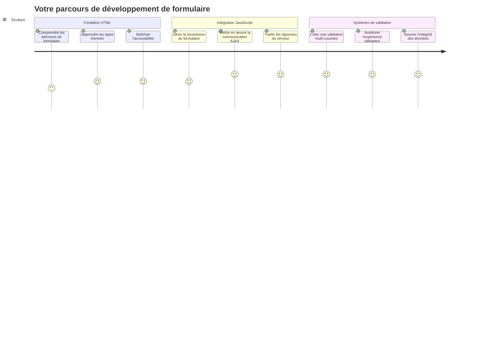
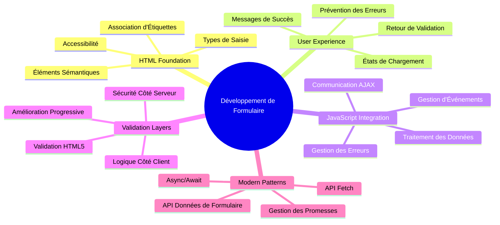
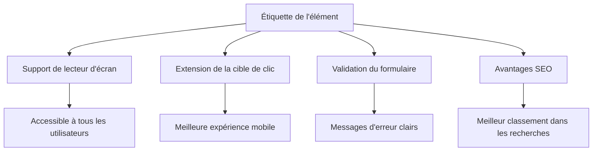
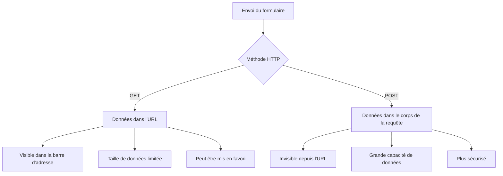
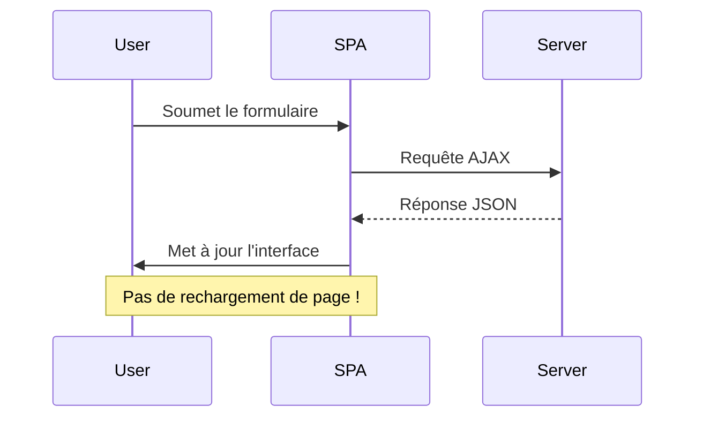
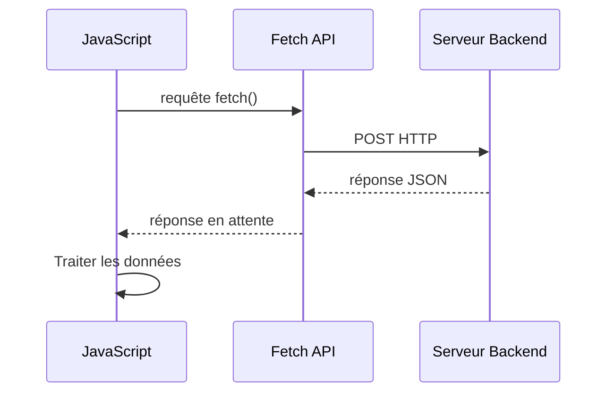
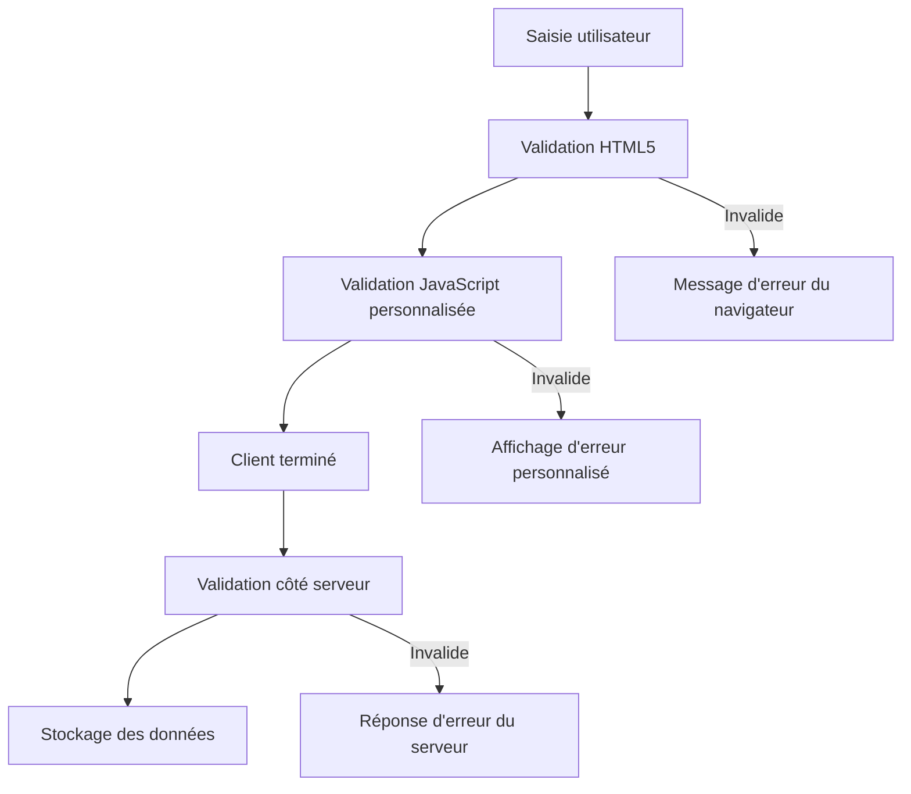
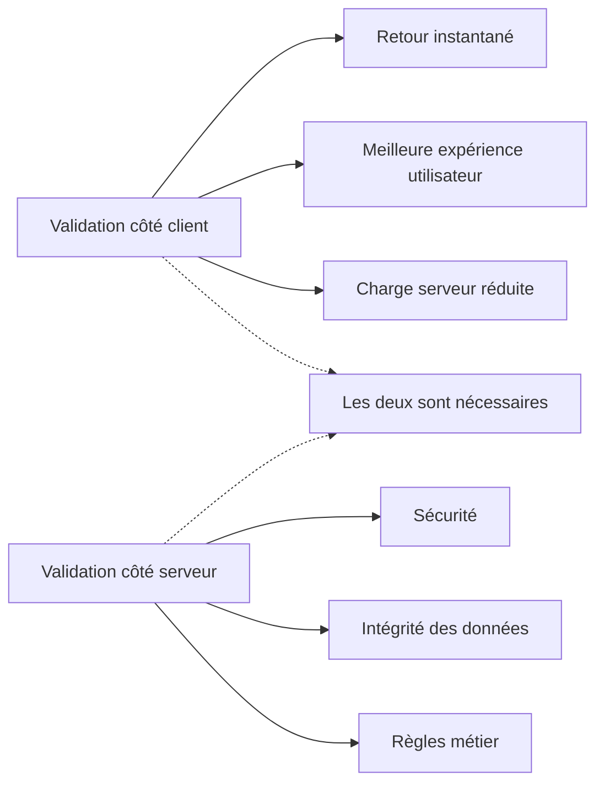
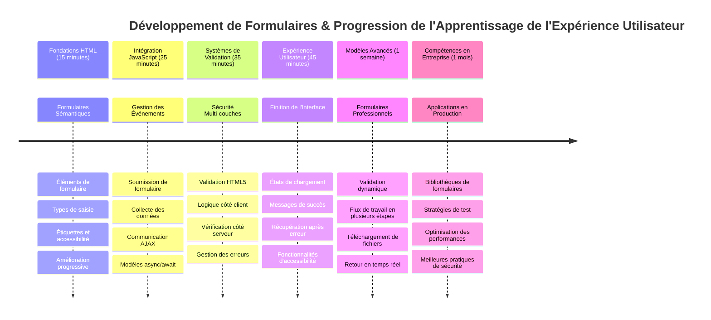
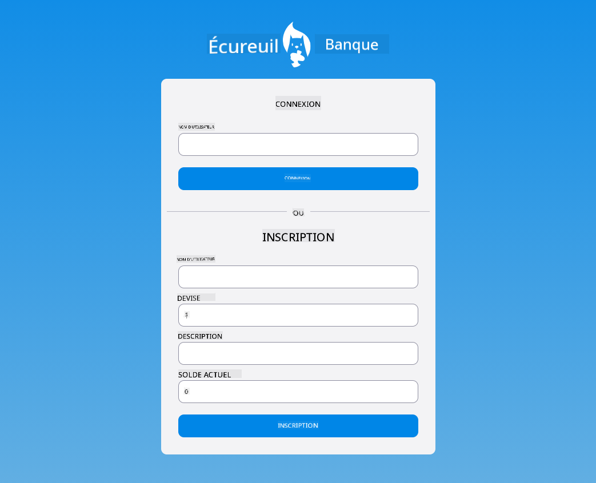

<!--
CO_OP_TRANSLATOR_METADATA:
{
  "original_hash": "7cbdbd132d39a2bb493e85bc2a9387cc",
  "translation_date": "2026-01-06T06:32:06+00:00",
  "source_file": "7-bank-project/2-forms/README.md",
  "language_code": "fr"
}
-->
# Construire une application bancaire Partie 2 : Construire un formulaire de connexion et d'inscription


## Quiz avant la leçon

[Quiz avant la leçon](https://ff-quizzes.netlify.app/web/quiz/43)

Vous est-il déjà arrivé de remplir un formulaire en ligne et de voir votre format d'email rejeté ? Ou de perdre toutes vos informations après avoir cliqué sur envoyer ? Nous avons tous vécu ces expériences frustrantes.

Les formulaires sont le pont entre vos utilisateurs et les fonctionnalités de votre application. Comme les protocoles soigneusement établis que les contrôleurs aériens utilisent pour guider les avions en toute sécurité vers leurs destinations, des formulaires bien conçus fournissent un retour clair et préviennent les erreurs coûteuses. Des formulaires maladroits, en revanche, peuvent faire fuir les utilisateurs plus vite qu’une mauvaise communication dans un aéroport très fréquenté.

Dans cette leçon, nous allons transformer votre application bancaire statique en une application interactive. Vous apprendrez à construire des formulaires qui valident les entrées utilisateurs, communiquent avec les serveurs et fournissent des feedbacks utiles. Pensez-y comme à construire l’interface de contrôle qui permet aux utilisateurs de naviguer dans les fonctionnalités de votre application.

À la fin, vous disposerez d’un système complet de connexion et d’inscription avec validation qui guide les utilisateurs vers le succès plutôt que la frustration.


## Prérequis

Avant de commencer à construire des formulaires, assurons-nous que tout est bien configuré. Cette leçon reprend là où nous nous étions arrêtés dans la précédente, donc si vous avez sauté des étapes, il serait utile de revenir et de faire fonctionner les bases d'abord.

### Configuration requise

| Composant | Statut | Description |
|-----------|--------|-------------|
| [Modèles HTML](../1-template-route/README.md) | ✅ Requis | La structure de base de votre application bancaire |
| [Node.js](https://nodejs.org) | ✅ Requis | Environnement d'exécution JavaScript pour le serveur |
| [Serveur API bancaire](../api/README.md) | ✅ Requis | Service backend pour le stockage des données |

> 💡 **Astuce de développement** : Vous allez lancer deux serveurs distincts simultanément – un pour votre application front-end bancaire et un autre pour l’API backend. Cette configuration reflète le développement réel où les services frontend et backend fonctionnent indépendamment.

### Configuration du serveur

**Votre environnement de développement inclura :**
- **Serveur frontend** : Sert votre application bancaire (généralement port `3000`)
- **Serveur API backend** : Gère le stockage et la récupération des données (port `5000`)
- **Les deux serveurs** peuvent fonctionner simultanément sans conflits

**Tester votre connexion à l'API :**
```bash
curl http://localhost:5000/api
# Réponse attendue : "API bancaire v1.0.0"
```

**Si vous voyez la réponse avec la version de l’API, vous êtes prêt à continuer !**

---

## Comprendre les formulaires HTML et les contrôles

Les formulaires HTML sont le moyen par lequel les utilisateurs communiquent avec votre application web. Pensez-y comme au télégraphe qui reliait des lieux éloignés au 19e siècle – ils sont le protocole de communication entre l’intention de l’utilisateur et la réponse de l’application. Lorsqu’ils sont conçus avec soin, ils capturent les erreurs, guident la mise en forme des entrées et fournissent des suggestions utiles.

Les formulaires modernes sont bien plus sophistiqués que les simples champs texte. HTML5 a introduit des types d’entrée spécialisés qui prennent en charge la validation des emails, le formatage des nombres et la sélection de dates automatiquement. Ces améliorations bénéficient à la fois à l'accessibilité et à l’expérience utilisateur mobile.

### Éléments essentiels du formulaire

**Les blocs de construction indispensables à tout formulaire :**

```html
<!-- Basic form structure -->
<form id="userForm" method="POST">
  <label for="username">Username</label>
  <input id="username" name="username" type="text" required>
  
  <button type="submit">Submit</button>
</form>
```

**Voici ce que fait ce code :**
- **Crée** un conteneur de formulaire avec un identifiant unique
- **Spécifie** la méthode HTTP pour la soumission des données
- **Associe** des étiquettes aux champs pour l’accessibilité
- **Définit** un bouton de soumission pour traiter le formulaire

### Types et attributs d’entrée modernes

| Type d'entrée | Utilité | Exemple d'utilisation |
|---------------|---------|----------------------|
| `text` | Saisie de texte générale | `<input type="text" name="username">` |
| `email` | Validation d’email | `<input type="email" name="email">` |
| `password` | Saisie de texte masquée | `<input type="password" name="password">` |
| `number` | Saisie numérique | `<input type="number" name="balance" min="0">` |
| `tel` | Numéros de téléphone | `<input type="tel" name="phone">` |

> 💡 **Avantage moderne de HTML5** : Utiliser les types d’entrée spécifiques offre une validation automatique, des claviers mobiles adaptés, et un meilleur support d’accessibilité sans JavaScript supplémentaire !

### Types de boutons et comportement

```html
<!-- Different button behaviors -->
<button type="submit">Save Data</button>     <!-- Submits the form -->
<button type="reset">Clear Form</button>    <!-- Resets all fields -->
<button type="button">Custom Action</button> <!-- No default behavior -->
```

**Voici ce que fait chaque type de bouton :**
- **Boutons de soumission** : Déclenchent la soumission du formulaire et envoient les données à l’URL spécifiée
- **Boutons de réinitialisation** : Remettent tous les champs du formulaire à leur état initial
- **Boutons ordinaires** : N'ont aucun comportement par défaut, nécessitent du JavaScript personnalisé pour fonctionner

> ⚠️ **Note importante** : L’élément `<input>` est auto-fermant et ne nécessite pas de balise de fermeture. La bonne pratique moderne est d’écrire `<input>` sans la barre oblique.

### Construire votre formulaire de connexion

Créons maintenant un formulaire de connexion pratique qui démontre les bonnes pratiques modernes des formulaires HTML. Nous allons commencer par une structure de base et l’améliorer progressivement avec des fonctionnalités d’accessibilité et de validation.

```html
<template id="login">
  <h1>Bank App</h1>
  <section>
    <h2>Login</h2>
    <form id="loginForm" novalidate>
      <div class="form-group">
        <label for="username">Username</label>
        <input id="username" name="user" type="text" required 
               autocomplete="username" placeholder="Enter your username">
      </div>
      <button type="submit">Login</button>
    </form>
  </section>
</template>
```

**Décomposons ce qui se passe ici :**
- **Structure** le formulaire avec des éléments HTML5 sémantiques
- **Groupe** les éléments liés avec des conteneurs `div` dotés de classes significatives
- **Associe** les étiquettes aux champs avec les attributs `for` et `id`
- **Inclut** des attributs modernes comme `autocomplete` et `placeholder` pour une meilleure expérience utilisateur
- **Ajoute** `novalidate` pour gérer la validation avec JavaScript au lieu du navigateur

### Le pouvoir des étiquettes appropriées

**Pourquoi les labels sont importants pour un développement web moderne :**


**Ce que les labels appropriés accomplissent :**
- **Permet** aux lecteurs d’écran d’annoncer clairement les champs du formulaire
- **Élargit** la zone cliquable (cliquer sur le label focalise le champ)
- **Améliore** l’utilisabilité mobile avec des cibles tactiles plus larges
- **Supporte** la validation du formulaire avec des messages d’erreur explicites
- **Renforce** le SEO en donnant un sens sémantique aux éléments du formulaire

> 🎯 **Objectif accessibilité** : Chaque champ de formulaire doit avoir un label associé. Cette simple pratique rend vos formulaires utilisables par tous, y compris les utilisateurs en situation de handicap, et améliore l’expérience pour tous.

### Créer le formulaire d’inscription

Le formulaire d’inscription demande des informations plus détaillées pour créer un compte complet. Construisons-le avec les fonctionnalités modernes de HTML5 et une accessibilité améliorée.

```html
<hr/>
<h2>Register</h2>
<form id="registerForm" novalidate>
  <div class="form-group">
    <label for="user">Username</label>
    <input id="user" name="user" type="text" required 
           autocomplete="username" placeholder="Choose a username">
  </div>
  
  <div class="form-group">
    <label for="currency">Currency</label>
    <input id="currency" name="currency" type="text" value="$" 
           required maxlength="3" placeholder="USD, EUR, etc.">
  </div>
  
  <div class="form-group">
    <label for="description">Account Description</label>
    <input id="description" name="description" type="text" 
           maxlength="100" placeholder="Personal savings, checking, etc.">
  </div>
  
  <div class="form-group">
    <label for="balance">Starting Balance</label>
    <input id="balance" name="balance" type="number" value="0" 
           min="0" step="0.01" placeholder="0.00">
  </div>
  
  <button type="submit">Create Account</button>
</form>
```

**Dans l’exemple ci-dessus, nous avons :**
- **Organisé** chaque champ dans des divs conteneurs pour un meilleur style et agencement
- **Ajouté** des attributs `autocomplete` appropriés pour la saisie automatique du navigateur
- **Inclus** un texte d’aide avec des placeholders pour guider la saisie
- **Défini** des valeurs par défaut sensées avec l’attribut `value`
- **Appliqué** des attributs de validation comme `required`, `maxlength`, et `min`
- **Utilisé** `type="number"` pour le champ solde avec support décimal

### Explorer les types d’entrée et leur comportement

**Les types d’entrée modernes offrent des fonctionnalités améliorées :**

| Fonctionnalité | Avantage | Exemple |
|----------------|----------|---------|
| `type="number"` | Clavier numérique sur mobile | Saisie plus facile du solde |
| `step="0.01"` | Contrôle de la précision décimale | Permet les centimes en monnaie |
| `autocomplete` | Remplissage automatique du navigateur | Complétion plus rapide du formulaire |
| `placeholder` | Indices contextuels | Guide les attentes de l’utilisateur |

> 🎯 **Défi accessibilité** : Essayez de naviguer dans les formulaires uniquement avec votre clavier ! Utilisez `Tab` pour passer d’un champ à l’autre, `Espace` pour cocher les cases, et `Enter` pour soumettre. Cette expérience vous aide à comprendre comment les utilisateurs de lecteurs d’écran interagissent avec vos formulaires.

### 🔄 **Point pédagogique**
**Compréhension des bases du formulaire** : Avant d’implémenter JavaScript, assurez-vous de comprendre :
- ✅ Comment le HTML sémantique crée des structures de formulaire accessibles
- ✅ Pourquoi les types d’entrée sont importants pour les claviers mobiles et la validation
- ✅ La relation entre les labels et les contrôles de formulaire
- ✅ Comment les attributs du formulaire affectent le comportement par défaut du navigateur

**Auto-test rapide** : Que se passe-t-il si vous soumettez un formulaire sans gestion JavaScript ?
*Réponse : Le navigateur effectue la soumission par défaut, généralement en redirigeant vers l’URL d’action*

**Avantages des formulaires HTML5** : Les formulaires modernes fournissent :
- **Validation intégrée** : Vérification automatique du format email et nombres
- **Optimisation mobile** : Claviers adaptés selon le type d’entrée
- **Accessibilité** : Support des lecteurs d’écran et navigation au clavier
- **Amélioration progressive** : Fonctionne même quand JavaScript est désactivé

## Comprendre les méthodes de soumission des formulaires

Quand quelqu’un remplit votre formulaire et clique sur envoyer, ces données doivent aller quelque part — généralement vers un serveur qui peut les sauvegarder. Il existe plusieurs façons de procéder, et savoir laquelle utiliser peut vous éviter bien des soucis plus tard.

Voyons ce qui se passe réellement quand quelqu’un clique sur ce bouton de soumission.

### Comportement par défaut du formulaire

Commençons par observer ce qui se passe avec la soumission basique d’un formulaire :

**Testez vos formulaires actuels :**
1. Cliquez sur le bouton *S’inscrire* de votre formulaire
2. Observez les changements dans la barre d’adresse de votre navigateur
3. Notez comment la page se recharge et les données apparaissent dans l’URL


### Comparaison des méthodes HTTP


**Comprendre les différences :**

| Méthode | Cas d’usage | Emplacement des données | Niveau de sécurité | Limite de taille |
|---------|-------------|-------------------------|--------------------|------------------|
| `GET`   | Recherches, filtres | Paramètres dans l’URL | Faible (visible) | ~2000 caractères |
| `POST`  | Comptes utilisateurs, données sensibles | Corps de la requête | Élevé (caché) | Pas de limite pratique |

**Comprendre les différences fondamentales :**
- **GET** : Ajoute les données du formulaire dans l’URL sous forme de paramètres (adapté aux opérations de recherche)
- **POST** : Inclut les données dans le corps de la requête (indispensable pour les informations sensibles)
- **Limitations de GET** : Contraintes de taille, données visibles, historique dans le navigateur
- **Avantages de POST** : Capacité de données élevée, confidentialité, support du téléchargement de fichiers

> 💡 **Bonne pratique** : Utilisez `GET` pour les formulaires de recherche et les filtres (récupération de données), et `POST` pour l’inscription, la connexion et la création de données.

### Configurer la soumission du formulaire

Configurons votre formulaire d’inscription pour communiquer correctement avec l’API backend en utilisant la méthode POST :

```html
<form id="registerForm" action="//localhost:5000/api/accounts" 
      method="POST" novalidate>
```

**Voici ce que cette configuration fait :**
- **Dirige** la soumission du formulaire vers votre point de terminaison API
- **Utilise** la méthode POST pour une transmission sécurisée des données
- **Inclut** `novalidate` pour gérer la validation avec JavaScript

### Tester la soumission du formulaire

**Suivez ces étapes pour tester votre formulaire :**
1. **Remplissez** le formulaire d’inscription avec vos informations
2. **Cliquez** sur le bouton "Créer un compte"
3. **Observez** la réponse du serveur dans votre navigateur


**Ce que vous devriez voir :**
- **Le navigateur redirige** vers l’URL du point de terminaison API
- **Réponse JSON** contenant les données de votre nouveau compte créé
- **Confirmation du serveur** que le compte a été créé avec succès

> 🧪 **Temps d’expérimentation** : Essayez de vous inscrire à nouveau avec le même nom d’utilisateur. Quelle réponse obtenez-vous ? Cela vous aide à comprendre comment le serveur gère les doublons et les conditions d’erreur.

### Comprendre les réponses JSON

**Quand le serveur traite votre formulaire avec succès :**
```json
{
  "user": "john_doe",
  "currency": "$",
  "description": "Personal savings",
  "balance": 100,
  "id": "unique_account_id"
}
```

**Cette réponse confirme :**
- **La création** d’un nouveau compte avec vos données spécifiées
- **L’attribution** d’un identifiant unique pour référence future
- **Le retour** de toutes les informations du compte pour vérification
- **L’indication** d’un stockage réussi dans la base de données

## Gestion moderne des formulaires avec JavaScript

Les soumissions traditionnelles de formulaire provoquent un rechargement complet de la page, un peu comme les premières missions spatiales qui nécessitaient des redémarrages complets du système pour corriger la trajectoire. Cette approche perturbe l’expérience utilisateur et fait perdre l’état de l’application.

La gestion des formulaires avec JavaScript fonctionne comme les systèmes de guidage continus utilisés par les engins spatiaux modernes – effectuant des ajustements en temps réel sans perdre le contexte de navigation. Nous pouvons intercepter les soumissions, fournir un feedback immédiat, gérer les erreurs élégamment et mettre à jour l’interface selon les réponses du serveur tout en conservant la position de l’utilisateur dans l’application.

### Pourquoi éviter les rechargements de page ?


**Avantages de la gestion JavaScript des formulaires :**
- **Maintient** l’état et le contexte de l’application
- **Fournit** un feedback instantané et des indicateurs de chargement
- **Permet** la gestion dynamique des erreurs et la validation
- **Crée** des expériences utilisateur fluides, semblables à des applications
- **Autorise** une logique conditionnelle selon les réponses du serveur

### Transition des formulaires traditionnels aux modernes

**Défis de l’approche traditionnelle :**
- **Redirige** les utilisateurs hors de votre application
- **Perd** l’état et le contexte actuel de l’application
- **Nécessite** des rechargements complets pour des opérations simples
- **Offre** un contrôle limité sur les feedbacks utilisateurs

**Avantages de l’approche JavaScript moderne :**
- **Conserve** les utilisateurs dans votre application
- **Maintient** tous les états et données de l’application
- **Permet** la validation et le feedback en temps réel
- **Soutient** l’amélioration progressive et l’accessibilité

### Implémentation de la gestion JavaScript des formulaires

Remplaçons la soumission traditionnelle du formulaire par un gestionnaire d’événements JavaScript moderne :

```html
<!-- Remove the action attribute and add event handling -->
<form id="registerForm" method="POST" novalidate>
```

**Ajoutez la logique d’inscription dans votre fichier `app.js` :**

```javascript
// Gestion moderne de formulaires pilotée par les événements
function register() {
  const registerForm = document.getElementById('registerForm');
  const formData = new FormData(registerForm);
  const data = Object.fromEntries(formData);
  const jsonData = JSON.stringify(data);
  
  console.log('Form data prepared:', data);
}

// Attacher un écouteur d'événements lorsque la page se charge
document.addEventListener('DOMContentLoaded', () => {
  const registerForm = document.getElementById('registerForm');
  registerForm.addEventListener('submit', (event) => {
    event.preventDefault(); // Empêcher la soumission de formulaire par défaut
    register();
  });
});
```

**Décomposons ce qui se passe ici :**
- **Empêche** la soumission par défaut avec `event.preventDefault()`
- **Récupère** l’élément formulaire avec une sélection DOM moderne
- **Extrait** les données du formulaire via l’API puissante `FormData`
- **Convertit** FormData en objet simple avec `Object.fromEntries()`
- **Sérialise** les données au format JSON pour la communication serveur
- **Affiche** les données traitées pour le débogage et la vérification

### Comprendre l’API FormData

**L’API FormData offre une gestion puissante des formulaires :**
```javascript
// Exemple de ce que FormData capture
const formData = new FormData(registerForm);

// FormData capture automatiquement :
// {
//   "user": "john_doe",
//   "currency": "$",
//   "description": "Compte personnel",
//   "balance": "100"
// }
```

**Avantages de l’API FormData :**
- **Collecte complète** : Capture tous les éléments du formulaire, y compris le texte, les fichiers et les entrées complexes
- **Connaissance des types** : Gère automatiquement différents types d’entrée sans codage personnalisé
- **Efficacité** : Élimine la collecte manuelle des champs avec un seul appel API
- **Adaptabilité** : Maintient la fonctionnalité même si la structure du formulaire évolue

### Création de la fonction de communication avec le serveur

Construisons maintenant une fonction robuste pour communiquer avec votre serveur API en utilisant les modèles JavaScript modernes :

```javascript
async function createAccount(account) {
  try {
    const response = await fetch('//localhost:5000/api/accounts', {
      method: 'POST',
      headers: { 
        'Content-Type': 'application/json',
        'Accept': 'application/json'
      },
      body: account
    });
    
    // Vérifiez si la réponse a réussi
    if (!response.ok) {
      throw new Error(`HTTP error! status: ${response.status}`);
    }
    
    return await response.json();
  } catch (error) {
    console.error('Account creation failed:', error);
    return { error: error.message || 'Network error occurred' };
  }
}
```

**Comprendre JavaScript asynchrone :**


**Ce que cette implémentation moderne accomplit :**
- **Utilise** `async/await` pour un code asynchrone plus lisible
- **Inclut** une gestion appropriée des erreurs avec des blocs try/catch
- **Vérifie** le statut de la réponse avant de traiter les données
- **Définit** les en-têtes appropriés pour la communication JSON
- **Fournit** des messages d’erreur détaillés pour le débogage
- **Retourne** une structure de données cohérente pour les cas de succès et d’erreur

### La puissance du Fetch API moderne

**Avantages de Fetch API par rapport aux anciennes méthodes :**

| Fonctionnalité | Bénéfice | Implémentation |
|----------------|----------|----------------|
| Basé sur les Promises | Code async propre | `await fetch()` |
| Personnalisation des requêtes | Contrôle HTTP complet | Headers, méthodes, corps |
| Gestion des réponses | Analyse flexible des données | `.json()`, `.text()`, `.blob()` |
| Gestion des erreurs | Capture complète des erreurs | Blocs try/catch |

> 🎥 **En savoir plus** : [Tutoriel Async/Await](https://youtube.com/watch?v=YwmlRkrxvkk) – Comprendre les modèles JavaScript asynchrones pour le développement web moderne.

**Concepts clés pour la communication serveur :**
- **Fonctions asynchrones** permettent de mettre en pause l’exécution en attendant les réponses du serveur
- **Mot-clé await** rend le code asynchrone lisible comme du code synchrone
- **Fetch API** fournit des requêtes HTTP modernes basées sur des Promises
- **Gestion des erreurs** garantit une réponse élégante en cas de problèmes réseau

### Compléter la fonction d’enregistrement

Rassemblons tout avec une fonction d’enregistrement complète et prête pour la production :

```javascript
async function register() {
  const registerForm = document.getElementById('registerForm');
  const submitButton = registerForm.querySelector('button[type="submit"]');
  
  try {
    // Afficher l'état de chargement
    submitButton.disabled = true;
    submitButton.textContent = 'Creating Account...';
    
    // Traiter les données du formulaire
    const formData = new FormData(registerForm);
    const jsonData = JSON.stringify(Object.fromEntries(formData));
    
    // Envoyer au serveur
    const result = await createAccount(jsonData);
    
    if (result.error) {
      console.error('Registration failed:', result.error);
      alert(`Registration failed: ${result.error}`);
      return;
    }
    
    console.log('Account created successfully!', result);
    alert(`Welcome, ${result.user}! Your account has been created.`);
    
    // Réinitialiser le formulaire après une inscription réussie
    registerForm.reset();
    
  } catch (error) {
    console.error('Unexpected error:', error);
    alert('An unexpected error occurred. Please try again.');
  } finally {
    // Restaurer l'état du bouton
    submitButton.disabled = false;
    submitButton.textContent = 'Create Account';
  }
}
```

**Cette implémentation améliorée inclut :**
- **Fournit** un retour visuel pendant la soumission du formulaire
- **Désactive** le bouton de soumission pour éviter les doubles envois
- **Gère** les erreurs attendues et inattendues de manière élégante
- **Affiche** des messages conviviales de succès et d’erreur
- **Réinitialise** le formulaire après un enregistrement réussi
- **Restaure** l’état de l’interface quel que soit le résultat

### Tester votre implémentation

**Ouvrez les outils de développement de votre navigateur et testez l’enregistrement :**

1. **Ouvrez** la console du navigateur (F12 → Onglet Console)
2. **Remplissez** le formulaire d’enregistrement
3. **Cliquez** sur "Créer un compte"
4. **Observez** les messages dans la console et les retours utilisateurs


**Ce que vous devriez voir :**
- **État de chargement** visible sur le bouton de soumission
- **Logs console** affichant des informations détaillées sur le processus
- **Message de succès** apparaissant lorsque la création du compte réussit
- **Réinitialisation automatique** du formulaire après soumission réussie

> 🔒 **Considération de sécurité** : Actuellement, les données circulent en HTTP, ce qui n’est pas sécurisé pour la production. Dans les applications réelles, utilisez toujours HTTPS pour chiffrer les transmissions de données. En savoir plus sur la [sécurité HTTPS](https://fr.wikipedia.org/wiki/HTTPS) et pourquoi c’est essentiel pour protéger les données utilisateurs.

### 🔄 **Point pédagogique**
**Intégration moderne de JavaScript** : Vérifiez votre compréhension de la gestion asynchrone des formulaires :
- ✅ Comment `event.preventDefault()` modifie-t-il le comportement par défaut du formulaire ?
- ✅ Pourquoi l’API FormData est-elle plus efficace que la collecte manuelle des champs ?
- ✅ Comment les modèles async/await améliorent-ils la lisibilité du code ?
- ✅ Quel rôle joue la gestion des erreurs dans l’expérience utilisateur ?

**Architecture système** : La gestion de votre formulaire démontre :
- **Programmation événementielle** : les formulaires réagissent aux actions utilisateur sans rechargement de page
- **Communication asynchrone** : les requêtes serveur ne bloquent pas l’interface utilisateur
- **Gestion des erreurs** : dégradation élégante en cas d’échec de requêtes réseau
- **Gestion d’état** : les mises à jour de l’UI reflètent correctement les réponses serveur
- **Amélioration progressive** : la fonctionnalité de base fonctionne, JavaScript l’améliore

**Modèles professionnels** : Vous avez mis en œuvre :
- **Responsabilité unique** : les fonctions ont des buts clairs et ciblés
- **Frontières d’erreur** : les blocs try/catch empêchent les plantages de l’application
- **Retour utilisateur** : états de chargement et messages de succès/erreur
- **Transformation des données** : FormData vers JSON pour la communication serveur

## Validation complète des formulaires

La validation empêche la frustration de découvrir des erreurs seulement après la soumission. Comme les multiples systèmes redondants à bord de la Station spatiale internationale, une validation efficace emploie plusieurs couches de vérifications de sécurité.

L’approche optimale combine la validation au niveau navigateur pour un retour immédiat, la validation JavaScript pour améliorer l’expérience utilisateur, et la validation côté serveur pour la sécurité et l’intégrité des données. Cette redondance assure à la fois satisfaction utilisateur et protection du système.

### Comprendre les couches de validation


**Stratégie de validation multi-couches :**
- **Validation HTML5** : contrôles immédiats dans le navigateur
- **Validation JavaScript** : logique personnalisée et expérience utilisateur
- **Validation serveur** : vérifications finales de sécurité et intégrité des données
- **Amélioration progressive** : fonctionne même si JavaScript est désactivé

### Attributs de validation HTML5

**Outils de validation modernes à votre disposition :**

| Attribut | But | Exemple | Comportement du navigateur |
|----------|-----|---------|----------------------------|
| `required` | Champs obligatoires | `<input required>` | Empêche la soumission vide |
| `minlength`/`maxlength` | Limites de longueur texte | `<input maxlength="20">` | Applique les limites de caractères |
| `min`/`max` | Plages numériques | `<input min="0" max="1000">` | Valide les bornes numériques |
| `pattern` | Règles regex personnalisées | `<input pattern="[A-Za-z]+">` | Correspond à des formats spécifiques |
| `type` | Validation selon type de données | `<input type="email">` | Validation spécifique au format |

### Style CSS pour la validation

**Créer un retour visuel pour les états de validation :**

```css
/* Valid input styling */
input:valid {
  border-color: #28a745;
  background-color: #f8fff9;
}

/* Invalid input styling */
input:invalid {
  border-color: #dc3545;
  background-color: #fff5f5;
}

/* Focus states for better accessibility */
input:focus:valid {
  box-shadow: 0 0 0 0.2rem rgba(40, 167, 69, 0.25);
}

input:focus:invalid {
  box-shadow: 0 0 0 0.2rem rgba(220, 53, 69, 0.25);
}
```

**Ce que ces indices visuels accomplissent :**
- **Bords verts** : Indiquent une validation réussie, comme les feux verts au centre de contrôle
- **Bords rouges** : Signalent une erreur de validation nécessitant de l’attention
- **Mise en surbrillance au focus** : Fournit un contexte visuel clair pour la saisie en cours
- **Style cohérent** : Établit des modèles d’interface prévisibles pour l’apprentissage utilisateur

> 💡 **Astuce Pro** : Utilisez les pseudo-classes CSS `:valid` et `:invalid` pour fournir un retour visuel immédiat au fur et à mesure que les utilisateurs tapent, créant une interface réactive et utile.

### Mise en œuvre d’une validation complète

Améliorons votre formulaire d’inscription avec une validation robuste offrant une excellente expérience utilisateur et qualité de données :

```html
<form id="registerForm" method="POST" novalidate>
  <div class="form-group">
    <label for="user">Username <span class="required">*</span></label>
    <input id="user" name="user" type="text" required 
           minlength="3" maxlength="20" 
           pattern="[a-zA-Z0-9_]+" 
           autocomplete="username"
           title="Username must be 3-20 characters, letters, numbers, and underscores only">
    <small class="form-text">Choose a unique username (3-20 characters)</small>
  </div>
  
  <div class="form-group">
    <label for="currency">Currency <span class="required">*</span></label>
    <input id="currency" name="currency" type="text" required 
           value="$" maxlength="3" 
           pattern="[A-Z$€£¥₹]+" 
           title="Enter a valid currency symbol or code">
    <small class="form-text">Currency symbol (e.g., $, €, £)</small>
  </div>
  
  <div class="form-group">
    <label for="description">Account Description</label>
    <input id="description" name="description" type="text" 
           maxlength="100" 
           placeholder="Personal savings, checking, etc.">
    <small class="form-text">Optional description (up to 100 characters)</small>
  </div>
  
  <div class="form-group">
    <label for="balance">Starting Balance</label>
    <input id="balance" name="balance" type="number" 
           value="0" min="0" step="0.01" 
           title="Enter a positive number for your starting balance">
    <small class="form-text">Initial account balance (minimum $0.00)</small>
  </div>
  
  <button type="submit">Create Account</button>
</form>
```

**Comprendre la validation améliorée :**
- **Combine** indicateurs de champs obligatoires avec descriptions utiles
- **Inclut** des attributs `pattern` pour la validation des formats
- **Fournit** des attributs `title` pour l’accessibilité et les infobulles
- **Ajoute** du texte d’aide pour guider la saisie
- **Utilise** une structure HTML sémantique pour une meilleure accessibilité

### Règles de validation avancées

**Ce que chaque règle de validation accomplit :**

| Champ | Règles de validation | Bénéfice pour l’utilisateur |
|-------|---------------------|-----------------------------|
| Nom d’utilisateur | `required`, `minlength="3"`, `maxlength="20"`, `pattern="[a-zA-Z0-9_]+"` | Garantit des identifiants valides et uniques |
| Devise | `required`, `maxlength="3"`, `pattern="[A-Z$€£¥₹]+"` | Accepte les symboles monétaires courants |
| Solde | `min="0"`, `step="0.01"`, `type="number"` | Empêche les soldes négatifs |
| Description | `maxlength="100"` | Limites de longueur raisonnables |

### Tester le comportement de la validation

**Essayez ces scénarios de validation :**
1. **Soumettez** le formulaire avec des champs obligatoires vides
2. **Saisissez** un nom d’utilisateur de moins de 3 caractères
3. **Essayez** des caractères spéciaux dans le champ nom d’utilisateur
4. **Indiquez** un montant de solde négatif


**Ce que vous observerez :**
- **Le navigateur affiche** les messages natifs de validation
- **Les styles changent** selon les états `:valid` et `:invalid`
- **La soumission du formulaire** est empêchée tant que toutes les validations ne sont pas validées
- **Le focus se déplace automatiquement** sur le premier champ invalide

### Validation côté client vs côté serveur


**Pourquoi vous avez besoin des deux couches :**
- **Validation côté client** : Retour immédiat et amélioration de l’expérience utilisateur
- **Validation côté serveur** : Assure la sécurité et gère les règles métier complexes
- **Approche combinée** : Crée des applications robustes, conviviales et sécurisées
- **Amélioration progressive** : Fonctionne même lorsque JavaScript est désactivé

> 🛡️ **Rappel sécurité** : Ne faites jamais confiance uniquement à la validation côté client ! Les utilisateurs malveillants peuvent passer outre, la validation côté serveur est donc essentielle pour la sécurité et l’intégrité des données.

### ⚡ **Ce que vous pouvez faire dans les prochaines 5 minutes**
- [ ] Testez votre formulaire avec des données non valides pour voir les messages de validation
- [ ] Essayez de soumettre le formulaire avec JavaScript désactivé pour voir la validation HTML5
- [ ] Ouvrez les DevTools du navigateur et inspectez les données du formulaire envoyées au serveur
- [ ] Expérimentez avec différents types d’entrée pour observer les changements de clavier mobile

### 🎯 **Ce que vous pouvez accomplir cette heure-ci**
- [ ] Compléter le quiz post-leçon et comprendre les concepts de gestion de formulaire
- [ ] Mettre en place le défi de validation complète avec un retour en temps réel
- [ ] Ajouter un style CSS pour créer des formulaires professionnels
- [ ] Créer la gestion des erreurs pour les noms d’utilisateur en double et erreurs serveur
- [ ] Ajouter des champs de confirmation de mot de passe avec validation de correspondance

### 📅 **Votre parcours de maîtrise du formulaire sur une semaine**
- [ ] Compléter l’application bancaire complète avec des fonctionnalités de formulaire avancées
- [ ] Mettre en œuvre des capacités de téléchargement de fichiers pour photos de profil ou documents
- [ ] Ajouter des formulaires en plusieurs étapes avec indicateurs de progression et gestion d’état
- [ ] Créer des formulaires dynamiques qui s’adaptent selon les sélections utilisateur
- [ ] Implémenter l’enregistrement automatique et la récupération du formulaire pour une meilleure expérience utilisateur
- [ ] Ajouter des validations avancées comme la vérification email et formatage de numéro de téléphone

### 🌟 **Votre maîtrise du développement frontend sur un mois**
- [ ] Construire des applications de formulaire complexes avec logique conditionnelle et workflows
- [ ] Apprendre les bibliothèques et frameworks de formulaire pour un développement rapide
- [ ] Maîtriser les directives accessibilité et principes de design inclusif
- [ ] Mettre en œuvre l’internationalisation et la localisation pour des formulaires globaux
- [ ] Créer des bibliothèques de composants de formulaire réutilisables et systèmes de design
- [ ] Contribuer à des projets open source de formulaire et partager les bonnes pratiques

## 🎯 Votre calendrier de maîtrise du développement de formulaire


### 🛠️ Résumé de votre boîte à outils pour le développement de formulaire

Après avoir terminé cette leçon, vous avez maîtrisé :
- **Formulaires HTML5** : structure sémantique, types d’entrée et fonctionnalités d’accessibilité
- **Gestion JavaScript des formulaires** : gestion des événements, collecte des données, communication AJAX
- **Architecture de validation** : validation multi-couches pour sécurité et expérience utilisateur
- **Programmation asynchrone** : Fetch API moderne et modèles async/await
- **Gestion des erreurs** : traitement complet des erreurs et systèmes de retour utilisateur
- **Conception de l’expérience utilisateur** : états de chargement, messages de succès et récupération d’erreur
- **Amélioration progressive** : formulaires fonctionnels sur tous navigateurs et configurations

**Applications réelles** : vos compétences en développement de formulaire s’appliquent directement à :
- **Applications e-commerce** : processus de paiement, inscription de compte, formulaires de paiement
- **Logiciels d’entreprise** : systèmes de saisie de données, interfaces de reporting, applications workflow
- **Gestion de contenu** : plateformes de publication, contenu généré par les utilisateurs, interfaces administratives
- **Applications financières** : interfaces bancaires, plateformes d’investissement, systèmes de transactions
- **Systèmes de santé** : portails patients, prise de rendez-vous, formulaires de dossiers médicaux
- **Plateformes éducatives** : inscription aux cours, outils d’évaluation, gestion de l’apprentissage

**Compétences professionnelles acquises** : vous pouvez désormais :
- **Concevoir** des formulaires accessibles pour tous les utilisateurs, y compris en situation de handicap
- **Implémenter** une validation sécurisée empêchant la corruption des données et les vulnérabilités
- **Créer** des interfaces utilisateur réactives fournissant un retour clair et des consignes
- **Déboguer** des interactions complexes de formulaire avec les outils de développement et l’analyse réseau
- **Optimiser** les performances du formulaire via une gestion efficace des données et des validations

**Concepts de développement frontend maîtrisés** :
- **Architecture événementielle** : gestion et réponse aux interactions utilisateur
- **Programmation asynchrone** : communication serveur non bloquante et gestion des erreurs
- **Validation des données** : contrôles côté client et serveur pour sécurité et intégrité
- **Conception expérience utilisateur** : interfaces intuitives guidant les utilisateurs vers le succès
- **Ingénierie de l’accessibilité** : design inclusif adapté aux besoins diversifiés

**Niveau supérieur** : vous êtes prêt à explorer des bibliothèques de formulaire avancées, implémenter des règles complexes, ou construire des systèmes de collecte de données d’entreprise !

🌟 **Succès débloqué** : vous avez construit un système complet de gestion de formulaire avec validation professionnelle, gestion des erreurs et modèles d’expérience utilisateur !

---


---

## Défi GitHub Copilot Agent 🚀

Utilisez le mode Agent pour relever le défi suivant :

**Description :** Améliorez le formulaire d’inscription avec une validation complète côté client et un retour utilisateur. Ce défi vous aidera à pratiquer la validation des formulaires, la gestion des erreurs et l’amélioration de l’expérience utilisateur avec un retour interactif.
**Invite :** Créez un système complet de validation de formulaire pour le formulaire d'inscription qui inclut : 1) un retour en temps réel pour chaque champ pendant la saisie, 2) des messages de validation personnalisés qui apparaissent sous chaque champ de saisie, 3) un champ de confirmation de mot de passe avec validation de correspondance, 4) des indicateurs visuels (comme des coches vertes pour les champs valides et des avertissements rouges pour les champs invalides), 5) un bouton de soumission qui ne devient activé que lorsque toutes les validations sont satisfaites. Utilisez les attributs de validation HTML5, le CSS pour le style des états de validation, et JavaScript pour le comportement interactif.

En savoir plus sur le [mode agent](https://code.visualstudio.com/blogs/2025/02/24/introducing-copilot-agent-mode) ici.

## 🚀 Défi

Affichez un message d'erreur dans le HTML si l'utilisateur existe déjà.

Voici un exemple de l'apparence que peut avoir la page de connexion finale après un peu de stylisation :



## Quiz post-conférence

[Quiz post-conférence](https://ff-quizzes.netlify.app/web/quiz/44)

## Révision & Auto-apprentissage

Les développeurs ont fait preuve de beaucoup de créativité dans leurs efforts de création de formulaires, notamment en ce qui concerne les stratégies de validation. Découvrez différents flux de formulaires en explorant [CodePen](https://codepen.com) ; pouvez-vous trouver des formulaires intéressants et inspirants ?

## Devoir

[Stylisez votre application bancaire](assignment.md)

---

<!-- CO-OP TRANSLATOR DISCLAIMER START -->
**Avertissement** :  
Ce document a été traduit à l’aide du service de traduction automatique [Co-op Translator](https://github.com/Azure/co-op-translator). Bien que nous nous efforçions d’assurer l’exactitude, veuillez noter que les traductions automatisées peuvent contenir des erreurs ou des inexactitudes. Le document original dans sa langue d’origine doit être considéré comme la source faisant foi. Pour les informations critiques, une traduction professionnelle humaine est recommandée. Nous déclinons toute responsabilité en cas de malentendus ou d’interprétations erronées résultant de l’utilisation de cette traduction.
<!-- CO-OP TRANSLATOR DISCLAIMER END -->