<!--
CO_OP_TRANSLATOR_METADATA:
{
  "original_hash": "86ee5069f27ea3151389d8687c95fac9",
  "translation_date": "2026-01-06T06:36:50+00:00",
  "source_file": "7-bank-project/3-data/README.md",
  "language_code": "fr"
}
-->
# Construire une application bancaire Partie 3 : Méthodes de récupération et d’utilisation des données

Pensez à l’ordinateur de l’Enterprise dans Star Trek - quand le Capitaine Picard demande l’état du vaisseau, l’information apparaît instantanément sans que toute l’interface ne s’arrête et se reconstruise. Ce flux d’informations fluide est exactement ce que nous construisons ici avec la récupération dynamique des données.

Pour l’instant, votre application bancaire est comme un journal imprimé - informative mais statique. Nous allons la transformer en quelque chose de plus proche du centre de contrôle de la NASA, où les données circulent en continu et se mettent à jour en temps réel sans interrompre le flux de travail de l’utilisateur.

Vous apprendrez à communiquer avec les serveurs de manière asynchrone, gérer des données qui arrivent à différents moments, et transformer des informations brutes en quelque chose de significatif pour vos utilisateurs. C’est la différence entre un simple démonstrateur et un logiciel prêt pour la production.

## ⚡ Ce que vous pouvez faire dans les 5 prochaines minutes

**Parcours rapide pour développeurs occupés**

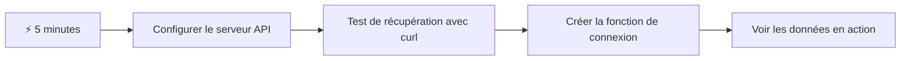
- **Minute 1-2** : Lancez votre serveur API (`cd api && npm start`) et testez la connexion
- **Minute 3** : Créez une fonction basique `getAccount()` utilisant fetch
- **Minute 4** : Branchez le formulaire de connexion avec `action="javascript:login()"`
- **Minute 5** : Testez la connexion et observez les données du compte apparaître dans la console

**Commandes de test rapide** :  
```bash
# Vérifier que l'API fonctionne
curl http://localhost:5000/api

# Tester la récupération des données du compte
curl http://localhost:5000/api/accounts/test
```
  
**Pourquoi c’est important** : En 5 minutes, vous verrez la magie de la récupération asynchrone des données qui alimente toutes les applications web modernes. C’est la base qui rend les applications réactives et vivantes.

## 🗺️ Votre parcours d’apprentissage des applications web axées sur les données

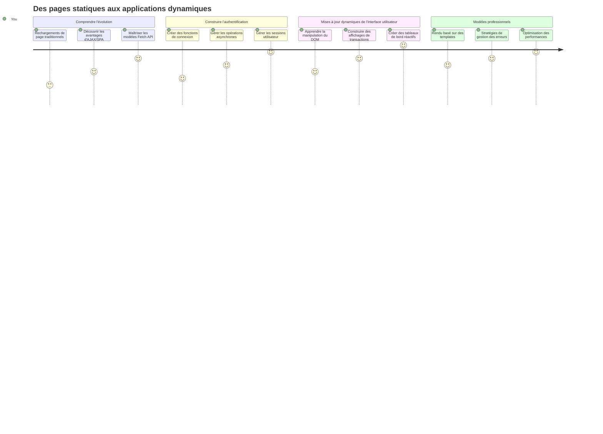
**Votre destination d’apprentissage** : À la fin de cette leçon, vous comprendrez comment les applications web modernes récupèrent, traitent et affichent les données de façon dynamique, créant l’expérience utilisateur fluide que nous attendons des applications professionnelles.

## Quiz préalable à la leçon

[Quiz préalable à la leçon](https://ff-quizzes.netlify.app/web/quiz/45)

### Prérequis

Avant de plonger dans la récupération des données, assurez-vous d’avoir ces éléments prêts :

- **Leçon précédente** : Terminez le [formulaire de connexion et d’inscription](../2-forms/README.md) - nous allons construire sur cette base
- **Serveur local** : Installez [Node.js](https://nodejs.org) et [exécutez le serveur API](../api/README.md) pour fournir les données de compte
- **Connexion API** : Testez la connexion à votre serveur avec cette commande :

```bash
curl http://localhost:5000/api
# Réponse attendue : "API bancaire v1.0.0"
```
  
Ce test rapide garantit que tous les éléments communiquent correctement :  
- Vérifie que Node.js fonctionne correctement sur votre machine  
- Confirme que votre serveur API est actif et répond  
- Valide que votre app peut atteindre le serveur (comme vérifier la radio avant une mission)

## 🧠 Aperçu de l’écosystème de gestion des données

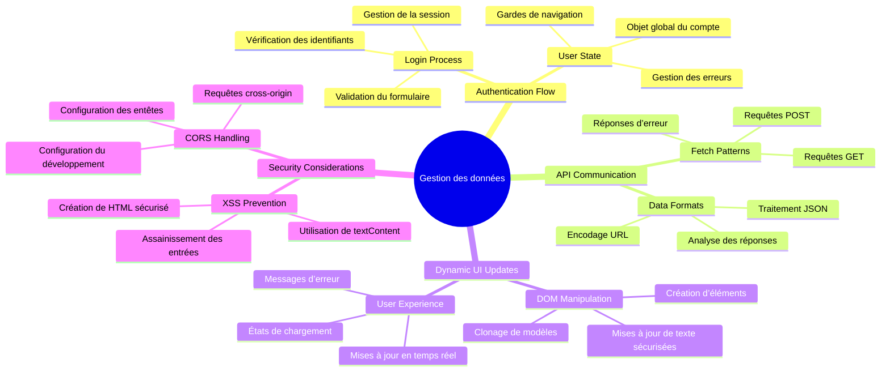
**Principe de base** : Les applications web modernes sont des systèmes d’orchestration des données - elles coordonnent entre interfaces utilisateur, APIs serveur, et modèles de sécurité des navigateurs pour créer des expériences fluides et réactives.

---

## Comprendre la récupération des données dans les applications web modernes

La manière dont les applications web gèrent les données a énormément évolué au cours des deux dernières décennies. Comprendre cette évolution vous aidera à apprécier pourquoi des techniques modernes comme AJAX et l’API Fetch sont si puissantes et pourquoi elles sont devenues des outils indispensables pour les développeurs web.

Explorons comment les sites traditionnels fonctionnaient comparé aux applications dynamiques et réactives que nous construisons aujourd’hui.

### Applications multi-pages traditionnelles (MPA)

Aux débuts du web, chaque clic était comme changer de chaîne sur une vieille télévision - l’écran devenait blanc, puis se branchait lentement sur le nouveau contenu. C’était la réalité des premières applications web, où chaque interaction signifiait reconstruire entièrement la page depuis zéro.

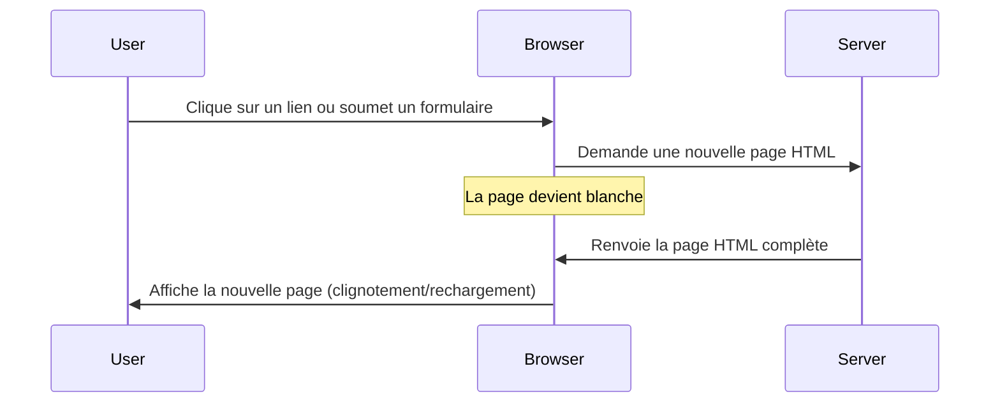
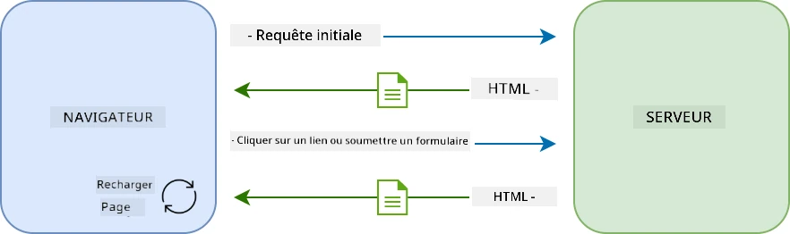

**Pourquoi cette approche semblait lourde :**  
- Chaque clic impliquait de reconstruire toute la page depuis le début  
- Les utilisateurs étaient interrompus dans leurs pensées par ces flashs de page agaçants  
- Votre connexion Internet travaillait en surchauffe en téléchargeant le même en-tête et pied de page en boucle  
- Les applications ressemblaient plus à cliquer dans un classeur qu’à utiliser un logiciel

### Applications monpage modernes (SPA)

AJAX (Asynchronous JavaScript and XML) a complètement changé ce paradigme. À l’image du design modulaire de la Station Spatiale Internationale, où les astronautes peuvent remplacer des composants individuels sans tout reconstruire, AJAX nous permet de mettre à jour des parties spécifiques d’une page web sans tout recharger. Malgré le nom évoquant XML, on utilise aujourd’hui surtout JSON, mais le principe reste : ne mettre à jour que ce qui doit changer.

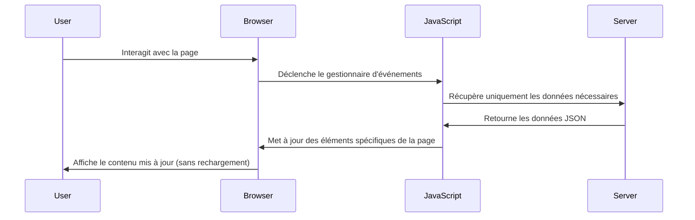
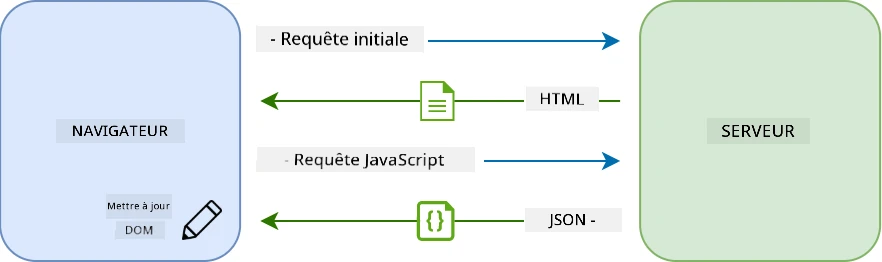

**Pourquoi les SPA sont tellement mieux ressenties :**  
- Seules les parties effectivement modifiées sont mises à jour (intelligent, non ?)  
- Plus d’interruptions brutales - vos utilisateurs restent dans leur flux  
- Moins de données sur le réseau signifie un chargement plus rapide  
- Tout est fluide et réactif, comme les apps sur votre téléphone

### L’évolution vers l’API moderne Fetch

Les navigateurs modernes proposent l’[API `Fetch`](https://developer.mozilla.org/docs/Web/API/Fetch_API), qui remplace l’ancienne [`XMLHttpRequest`](https://developer.mozilla.org/docs/Web/API/XMLHttpRequest/Using_XMLHttpRequest). Comme la différence entre utiliser un télégraphe et envoyer un email, Fetch API utilise les promesses pour un code asynchrone plus propre et gère naturellement le JSON.

| Fonctionnalité | XMLHttpRequest | Fetch API |
|----------------|----------------|-----------|
| **Syntaxe** | Basée sur des callbacks complexes | Basée sur des promesses claires |
| **Gestion JSON** | Analyse manuelle requise | Méthode intégrée `.json()` |
| **Gestion des erreurs** | Informations d’erreur limitées | Détails d’erreur complets |
| **Support moderne** | Compatibilité legacy | Promesses ES6+ et async/await |

> 💡 **Compatibilité des navigateurs** : Bonne nouvelle - l’API Fetch fonctionne dans tous les navigateurs modernes ! Si vous êtes curieux des versions spécifiques, [caniuse.com](https://caniuse.com/fetch) présente le tableau complet de compatibilité.  
>  
**En résumé :**  
- Fonctionne parfaitement sur Chrome, Firefox, Safari et Edge (en gros partout où sont vos utilisateurs)  
- Seul Internet Explorer nécessite une aide supplémentaire (et honnêtement, il est temps de laisser tomber IE)  
- Vous prépare parfaitement pour les élégants patterns async/await que nous utiliserons plus tard

### Implémentation de la connexion utilisateur et récupération des données

Passons maintenant à la mise en place du système de connexion qui transforme votre application bancaire d’un affichage statique à une application fonctionnelle. À l’image des protocoles d’authentification utilisés dans des installations militaires sécurisées, nous vérifierons les identifiants utilisateur puis fournirons l’accès à leurs données spécifiques.

Nous construirons cela pas à pas, en commençant par l’authentification basique puis en ajoutant les capacités de récupération de données.

#### Étape 1 : Créer la base de la fonction de connexion

Ouvrez votre fichier `app.js` et ajoutez une nouvelle fonction `login`. Elle gérera le processus d’authentification utilisateur :

```javascript
async function login() {
  const loginForm = document.getElementById('loginForm');
  const user = loginForm.user.value;
}
```
  
**Décortiquons cela :**  
- Ce mot-clé `async` ? Il indique à JavaScript « hé, cette fonction pourrait devoir patienter »  
- On récupère notre formulaire depuis la page (rien de compliqué, juste retrouver par son ID)  
- Puis on extrait ce que l’utilisateur a tapé comme nom d’utilisateur  
- Astuce sympa : vous pouvez accéder à n’importe quel champ de formulaire par son attribut `name` - pas besoin d’appels supplémentaires getElementById !

> 💡 **Accès aux formulaires** : Chaque contrôle de formulaire peut être accédé par son nom (défini en HTML via l’attribut `name`) en tant que propriété de l’élément formulaire. Cela offre une façon claire et lisible de récupérer les données du formulaire.

#### Étape 2 : Créer la fonction de récupération des données de compte

Ensuite, créons une fonction dédiée pour récupérer les données du compte depuis le serveur. Cela suit le même modèle que votre fonction d’inscription mais se concentre sur la récupération de données :

```javascript
async function getAccount(user) {
  try {
    const response = await fetch('//localhost:5000/api/accounts/' + encodeURIComponent(user));
    return await response.json();
  } catch (error) {
    return { error: error.message || 'Unknown error' };
  }
}
```
  
**Voici ce que fait ce code :**  
- **Utilise** l’API `fetch` moderne pour demander les données de manière asynchrone  
- **Construit** une URL de requête GET avec le paramètre du nom d’utilisateur  
- **Applique** `encodeURIComponent()` pour gérer proprement les caractères spéciaux dans l’URL  
- **Convertit** la réponse en format JSON pour faciliter la manipulation des données  
- **Gère** les erreurs avec élégance en renvoyant un objet erreur plutôt que de planter

> ⚠️ **Note de sécurité** : La fonction `encodeURIComponent()` gère les caractères spéciaux dans les URLs. À l’image des systèmes de codage utilisés dans les communications navales, elle assure que votre message arrive exactement comme prévu, sans risque qu’un caractère comme "#" ou "&" soit mal interprété.  
>  
**Pourquoi c’est important :**  
- Empêche les caractères spéciaux de casser les URLs  
- Protège contre des attaques de manipulation d’URL  
- Assure que votre serveur reçoit bien les données prévues  
- Suit les bonnes pratiques de développement sécurisé

#### Comprendre les requêtes HTTP GET

Voici quelque chose qui pourrait vous surprendre : quand vous utilisez `fetch` sans options supplémentaires, il crée automatiquement une requête [`GET`](https://developer.mozilla.org/docs/Web/HTTP/Methods/GET). C’est parfait pour ce que nous faisons - demander au serveur « hé, puis-je voir les données de compte de cet utilisateur ? »

Pensez aux requêtes GET comme des demandes polies d’emprunter un livre à la bibliothèque - vous demandez à voir quelque chose qui existe déjà. Les requêtes POST (que nous avons utilisées pour l’inscription) sont plutôt comme soumettre un nouveau livre à ajouter à la collection.

| Requête GET | Requête POST |
|-------------|--------------|
| **But** | Récupérer des données existantes | Envoyer de nouvelles données au serveur |
| **Paramètres** | Dans le chemin/chaîne de requête de l’URL | Dans le corps de la requête |
| **Mise en cache** | Peut être mise en cache par les navigateurs | Typiquement non mise en cache |
| **Sécurité** | Visible dans l’URL/logs | Cachée dans le corps de la requête |

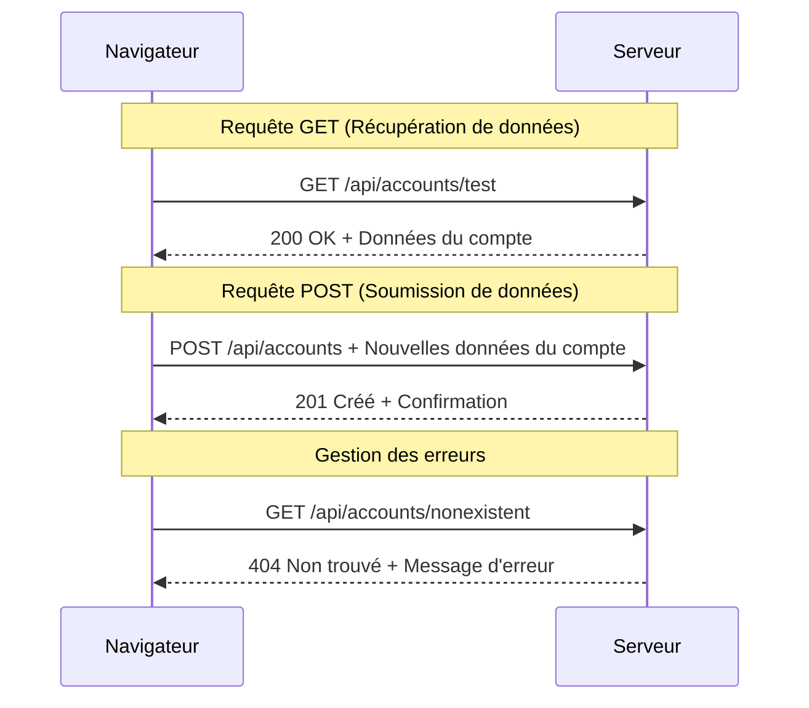
#### Étape 3 : Tout assembler

Voici la partie satisfaisante - connectons votre fonction de récupération des comptes au processus de connexion. C’est là que tout s’imbrique :

```javascript
async function login() {
  const loginForm = document.getElementById('loginForm');
  const user = loginForm.user.value;
  const data = await getAccount(user);

  if (data.error) {
    return console.log('loginError', data.error);
  }

  account = data;
  navigate('/dashboard');
}
```
  
Cette fonction suit une séquence claire :  
- Extrait le nom d’utilisateur depuis le champ du formulaire  
- Demande les données du compte utilisateur au serveur  
- Gère les erreurs qui peuvent survenir durant le processus  
- Stocke les données du compte et navigue vers le tableau de bord en cas de succès

> 🎯 **Pattern Async/Await** : Comme `getAccount` est une fonction asynchrone, on utilise le mot-clé `await` pour suspendre l’exécution jusqu’à ce que le serveur réponde. Cela empêche le code de continuer avec des données indéfinies.

#### Étape 4 : Créer un emplacement pour vos données

Votre application a besoin d’un endroit pour mémoriser les informations du compte une fois chargées. Pensez à cela comme la mémoire à court terme de votre app - un endroit pour garder sous la main les données de l’utilisateur actuel. Ajoutez cette ligne en haut de votre fichier `app.js` :

```javascript
// Ceci contient les données du compte de l'utilisateur actuel
let account = null;
```
  
**Pourquoi c’est nécessaire :**  
- Garde les données du compte accessibles de partout dans votre app  
- Commencer avec `null` signifie « personne n’est encore connecté »  
- Est mise à jour quand quelqu’un se connecte ou s’inscrit avec succès  
- Sert de source unique de vérité - pas de confusion sur l’utilisateur connecté

#### Étape 5 : Connecter votre formulaire

Connectons maintenant votre toute nouvelle fonction de connexion à votre formulaire HTML. Mettez à jour votre balise formulaire ainsi :

```html
<form id="loginForm" action="javascript:login()">
  <!-- Your existing form inputs -->
</form>
```
  
**Ce que ce petit changement fait :**  
- Empêche le formulaire d’exécuter son comportement par défaut « recharger toute la page »  
- Appelle votre fonction JavaScript personnalisée à la place  
- Garde tout fluide, comme une application monpage  
- Vous donne un contrôle total sur ce qui se passe quand les utilisateurs cliquent sur « Connexion »

#### Étape 6 : Améliorer votre fonction d’inscription

Pour plus de cohérence, mettez à jour votre fonction `register` pour qu’elle stocke aussi les données du compte et navigue vers le tableau de bord :

```javascript
// Ajoutez ces lignes à la fin de votre fonction d'enregistrement
account = result;
navigate('/dashboard');
```
  
**Cet ajout fournit :**  
- **Transition fluide** de l’inscription vers le tableau de bord  
- **Expérience utilisateur cohérente** entre le flux de connexion et d’inscription  
- **Accès immédiat** aux données du compte après inscription réussie

#### Tester votre implémentation

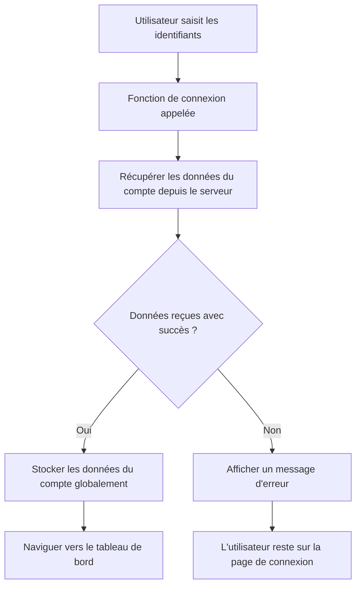
**Il est temps de tester :**  
1. Créez un nouveau compte pour vous assurer que tout fonctionne  
2. Essayez de vous connecter avec ces mêmes identifiants  
3. Jetez un œil à la console de votre navigateur (F12) si quelque chose semble bizarre  
4. Assurez-vous d’arriver sur le tableau de bord après une connexion réussie

Si quelque chose ne marche pas, pas de panique ! La plupart des problèmes sont des fautes de frappe ou un serveur API non lancé.

#### Un mot rapide sur la magie Cross-Origin

Vous vous demandez peut-être : « Comment mon app web peut-elle parler à ce serveur API alors qu’ils tournent sur des ports différents ? » Excellente question ! Cela touche à un point que tout développeur web rencontre tôt ou tard.

> 🔒 **Sécurité Cross-Origin** : Les navigateurs appliquent une « politique de même origine » pour empêcher les communications non autorisées entre domaines différents. À l’image du système de contrôle au Pentagone, ils vérifient que la communication est autorisée avant d’autoriser le transfert de données.  
>  
**Dans notre configuration :**  
- Votre app web tourne sur `localhost:3000` (serveur de dev)  
- Votre serveur API tourne sur `localhost:5000` (serveur backend)  
- Le serveur API inclut des [en-têtes CORS](https://developer.mozilla.org/docs/Web/HTTP/CORS) qui autorisent explicitement la communication avec votre app web

Cette configuration reflète le développement réel où les apps frontend et backend tournent généralement sur des serveurs séparés.

> 📚 **En savoir plus** : Approfondissez les APIs et la récupération de données avec ce [module complet Microsoft Learn sur les APIs](https://docs.microsoft.com/learn/modules/use-apis-discover-museum-art/?WT.mc_id=academic-77807-sagibbon).

## Donner vie à vos données dans le HTML

Maintenant, nous allons rendre les données récupérées visibles aux utilisateurs via la manipulation du DOM. Comme le processus de développement de photographies dans une chambre noire, nous transformons des données invisibles en quelque chose que les utilisateurs peuvent voir et manipuler.
La manipulation du DOM est la technique qui transforme des pages web statiques en applications dynamiques qui mettent à jour leur contenu en fonction des interactions utilisateur et des réponses du serveur.

### Choisir le bon outil pour le travail

Quand il s'agit de mettre à jour votre HTML avec JavaScript, vous avez plusieurs options. Pensez-y comme à différents outils dans une boîte à outils - chacun parfait pour des tâches spécifiques :

| Méthode | Ce pour quoi elle est idéale | Quand l'utiliser | Niveau de sécurité |
|---------|-----------------------------|------------------|--------------------|
| `textContent` | Affichage sécurisé des données utilisateur | Chaque fois que vous affichez du texte | ✅ Solide comme un roc |
| `createElement()` + `append()` | Construction de mises en page complexes | Création de nouvelles sections/listes | ✅ Infaillible |
| `innerHTML` | Définition du contenu HTML | ⚠️ Essayez d'éviter celui-ci | ❌ Risqué |

#### La façon sûre d'afficher du texte : textContent

La propriété [`textContent`](https://developer.mozilla.org/docs/Web/API/Node/textContent) est votre meilleur allié pour afficher les données utilisateur. C'est comme avoir un videur pour votre page web - rien de nuisible ne passe :

```javascript
// La méthode sûre et fiable pour mettre à jour le texte
const balanceElement = document.getElementById('balance');
balanceElement.textContent = account.balance;
```

**Avantages de textContent :**
- Traite tout comme du texte brut (empêche l'exécution de scripts)
- Efface automatiquement le contenu existant
- Efficace pour des mises à jour de texte simples
- Offre une sécurité intégrée contre les contenus malveillants

#### Créer des éléments HTML dynamiques

Pour un contenu plus complexe, combinez [`document.createElement()`](https://developer.mozilla.org/docs/Web/API/Document/createElement) avec la méthode [`append()`](https://developer.mozilla.org/docs/Web/API/ParentNode/append) :

```javascript
// Méthode sûre pour créer de nouveaux éléments
const transactionItem = document.createElement('div');
transactionItem.className = 'transaction-item';
transactionItem.textContent = `${transaction.date}: ${transaction.description}`;
container.append(transactionItem);
```

**Comprendre cette approche :**
- **Crée** de nouveaux éléments DOM de manière programmatique
- **Maintient** un contrôle total sur les attributs et le contenu des éléments
- **Permet** des structures d'éléments imbriqués complexes
- **Préserve** la sécurité en séparant la structure du contenu

> ⚠️ **Considération de sécurité** : Bien que [`innerHTML`](https://developer.mozilla.org/docs/Web/API/Element/innerHTML) apparaisse dans de nombreux tutoriels, il peut exécuter des scripts intégrés. Comme les protocoles de sécurité au CERN qui empêchent l'exécution non autorisée de code, l'utilisation de `textContent` et `createElement` offre des alternatives plus sûres.
> 
**Risques de innerHTML :**
- Exécute toutes les balises `<script>` dans les données utilisateur
- Vulnérable aux attaques d'injection de code
- Crée des vulnérabilités potentielles en matière de sécurité
- Les alternatives plus sûres que nous utilisons fournissent une fonctionnalité équivalente

### Rendre les erreurs plus conviviales pour l'utilisateur

Actuellement, les erreurs de connexion n'apparaissent que dans la console du navigateur, ce qui est invisible pour les utilisateurs. Comme la différence entre le diagnostic interne d'un pilote et le système d'information passager, nous devons communiquer les informations importantes par le canal approprié.

Afficher des messages d'erreur visibles offre aux utilisateurs un retour immédiat sur ce qui a mal tourné et comment procéder.

#### Étape 1 : Ajouter un emplacement pour les messages d'erreur

D'abord, donnons un emplacement aux messages d'erreur dans votre HTML. Ajoutez ceci juste avant votre bouton de connexion pour que les utilisateurs le voient naturellement :

```html
<!-- This is where error messages will appear -->
<div id="loginError" role="alert"></div>
<button>Login</button>
```

**Ce qui se passe ici :**
- Nous créons un conteneur vide qui reste invisible jusqu'à ce qu'il soit nécessaire
- Il est positionné là où les utilisateurs regardent naturellement après avoir cliqué sur "Connexion"
- Ce `role="alert"` est un joli détail pour les lecteurs d'écran - il dit à la technologie d'assistance « hé, c’est important ! »
- L’`id` unique offre une cible facile à notre JavaScript

#### Étape 2 : Créer une fonction helper pratique

Faisons une petite fonction utilitaire capable de mettre à jour le texte de n'importe quel élément. C’est une de ces fonctions "écrite une fois, utilisée partout" qui vous fera gagner du temps :

```javascript
function updateElement(id, text) {
  const element = document.getElementById(id);
  element.textContent = text;
}
```

**Avantages de la fonction :**
- Interface simple ne nécessitant qu’un ID d’élément et un contenu texte
- Localise et met à jour les éléments DOM de façon sécurisée
- Modèle réutilisable qui réduit la duplication du code
- Maintient un comportement de mise à jour cohérent dans toute l’application

#### Étape 3 : Afficher les erreurs là où les utilisateurs peuvent les voir

Maintenant, remplaçons ce message caché dans la console par quelque chose que les utilisateurs peuvent réellement voir. Mettez à jour votre fonction de connexion :

```javascript
// Au lieu de simplement enregistrer dans la console, montrez à l'utilisateur ce qui ne va pas
if (data.error) {
  return updateElement('loginError', data.error);
}
```

**Ce petit changement fait une grande différence :**
- Les messages d'erreur apparaissent là où les utilisateurs regardent
- Fini les échecs silencieux et mystérieux
- Les utilisateurs reçoivent un retour immédiat et exploitable
- Votre application commence à paraître professionnelle et attentive

Maintenant, lorsque vous testez avec un compte invalide, vous verrez un message d’erreur utile directement sur la page !


#### Étape 4 : Être inclusif avec l'accessibilité

Voici quelque chose de cool à propos de ce `role="alert"` que nous avons ajouté plus tôt – ce n’est pas juste du décor ! Ce petit attribut crée ce qu’on appelle une [région dynamique](https://developer.mozilla.org/docs/Web/Accessibility/ARIA/ARIA_Live_Regions) qui annonce immédiatement les changements aux lecteurs d’écran :

```html
<div id="loginError" role="alert"></div>
```

**Pourquoi c’est important :**
- Les utilisateurs de lecteurs d’écran entendent le message d’erreur dès qu'il apparaît
- Tout le monde reçoit la même information importante, peu importe comment il navigue
- C’est une façon simple de rendre votre application accessible à davantage de personnes
- Montre que vous vous souciez de créer des expériences inclusives

Les petites attentions comme celle-ci différencient les bons développeurs des excellents !

### 🎯 Vérification pédagogique : modèles d’authentification

**Pause et réflexion** : Vous venez de mettre en place un flux complet d’authentification. C’est un modèle fondamental en développement web.

**Auto-évaluation rapide** :
- Pouvez-vous expliquer pourquoi nous utilisons async/await pour les appels API ?
- Que se passerait-il si nous oubliions la fonction `encodeURIComponent()` ?
- Comment notre gestion des erreurs améliore-t-elle l’expérience utilisateur ?

**Lien avec le monde réel** : Les modèles que vous avez appris ici (récupération asynchrone des données, gestion des erreurs, retour utilisateur) sont utilisés dans toutes les grandes applications web, des réseaux sociaux aux sites de commerce électronique. Vous développez des compétences prêtes pour la production !

**Question challenge** : Comment pourriez-vous modifier ce système d’authentification pour gérer plusieurs rôles utilisateur (client, administrateur, guichetier) ? Pensez à la structure des données et aux changements d’interface utilisateur nécessaires.

#### Étape 5 : Appliquer le même modèle à l’enregistrement

Pour la cohérence, mettez en œuvre la même gestion d’erreurs dans votre formulaire d’inscription :

1. **Ajoutez** un élément d’affichage d’erreur dans votre HTML d’inscription :
```html
<div id="registerError" role="alert"></div>
```

2. **Mettez à jour** votre fonction d’enregistrement pour utiliser le même modèle d’affichage d’erreur :
```javascript
if (data.error) {
  return updateElement('registerError', data.error);
}
```

**Avantages d’une gestion d’erreurs cohérente :**
- **Offre** une expérience utilisateur uniforme dans tous les formulaires
- **Réduit** la charge cognitive grâce à des modèles familiers
- **Simplifie** la maintenance avec du code réutilisable
- **Garantit** le respect des normes d’accessibilité partout dans l’application

## Créer votre tableau de bord dynamique

Maintenant, nous allons transformer votre tableau de bord statique en une interface dynamique qui affiche les données réelles du compte. Comme la différence entre un horaire de vol imprimé et les panneaux de départ en temps réel dans les aéroports, nous passons d’informations statiques à des affichages réactifs et en direct.

En utilisant les techniques de manipulation du DOM que vous avez apprises, nous allons créer un tableau de bord qui se met à jour automatiquement avec les informations actuelles du compte.

### Apprivoiser vos données

Avant de commencer à construire, jetons un coup d’œil au type de données que votre serveur renvoie. Lorsqu’un utilisateur se connecte avec succès, voici le trésor d’informations à votre disposition :

```json
{
  "user": "test",
  "currency": "$",
  "description": "Test account",
  "balance": 75,
  "transactions": [
    { "id": "1", "date": "2020-10-01", "object": "Pocket money", "amount": 50 },
    { "id": "2", "date": "2020-10-03", "object": "Book", "amount": -10 },
    { "id": "3", "date": "2020-10-04", "object": "Sandwich", "amount": -5 }
  ]
}
```

**Cette structure de données fournit :**
- **`user`** : Parfait pour personnaliser l’expérience (« Bienvenue, Sarah ! »)
- **`currency`** : Assure l’affichage correct des montants monétaires
- **`description`** : Un nom convivial pour le compte
- **`balance`** : Le solde actuel si important
- **`transactions`** : L’historique complet des transactions avec tous les détails

Tout ce dont vous avez besoin pour construire un tableau de bord bancaire professionnel !

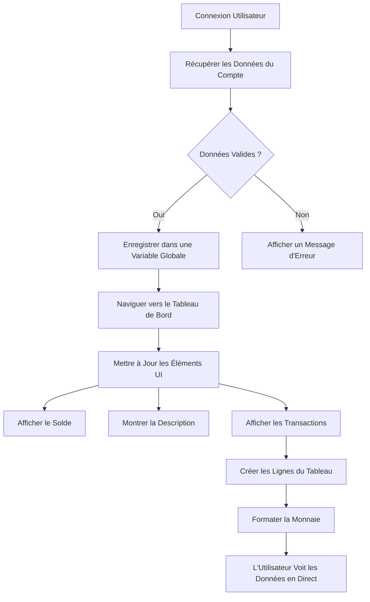
> 💡 **Astuce pro** : Vous voulez voir votre tableau de bord en action immédiatement ? Utilisez le nom d’utilisateur `test` lors de la connexion - il contient des données d’exemple préchargées pour voir tout fonctionner sans avoir à créer de transactions.
> 
**Pourquoi le compte test est pratique :**
- Livré avec des données d’exemple réalistes déjà chargées
- Parfait pour voir comment les transactions s’affichent
- Idéal pour tester les fonctionnalités du tableau de bord
- Vous évite de devoir créer manuellement des données factices

### Créer les éléments d’affichage du tableau de bord

Construisons votre interface de tableau de bord étape par étape, en commençant par les informations de résumé du compte, puis en avançant vers des fonctionnalités plus complexes comme les listes de transactions.

#### Étape 1 : Mettre à jour la structure HTML

Commencez par remplacer la section statique « Solde » par des éléments de substitution dynamiques que votre JavaScript pourra remplir :

```html
<section>
  Balance: <span id="balance"></span><span id="currency"></span>
</section>
```

Ensuite, ajoutez une section pour la description du compte. Puisque cela agit comme un titre pour le contenu du tableau de bord, utilisez du HTML sémantique :

```html
<h2 id="description"></h2>
```

**Comprendre la structure HTML :**
- **Utilise** des éléments `<span>` séparés pour le solde et la devise afin d’avoir un contrôle individuel
- **Applique** des IDs uniques à chaque élément pour cibler en JavaScript
- **Suit** le HTML sémantique en utilisant un `<h2>` pour la description du compte
- **Crée** une hiérarchie logique pour les lecteurs d’écran et le référencement

> ✅ **Insight accessibilité** : La description du compte fonctionne comme un titre pour le contenu du tableau de bord et est marquée comme un en-tête. Apprenez-en plus sur la façon dont [la structure des titres](https://www.nomensa.com/blog/2017/how-structure-headings-web-accessibility) impacte l’accessibilité. Pouvez-vous identifier d’autres éléments sur votre page qui pourraient bénéficier de balises d’en-tête ?

#### Étape 2 : Créer la fonction de mise à jour du tableau de bord

Créez maintenant une fonction qui remplit votre tableau de bord avec des données réelles du compte :

```javascript
function updateDashboard() {
  if (!account) {
    return navigate('/login');
  }

  updateElement('description', account.description);
  updateElement('balance', account.balance.toFixed(2));
  updateElement('currency', account.currency);
}
```

**Étape par étape, voici ce que fait cette fonction :**
- **Vérifie** que les données du compte existent avant de continuer
- **Redirige** les utilisateurs non authentifiés vers la page de connexion
- **Met à jour** la description du compte en utilisant la fonction réutilisable `updateElement`
- **Formate** le solde pour afficher toujours deux décimales
- **Affiche** le symbole monétaire approprié

> 💰 **Formatage de l’argent** : Cette méthode [`toFixed(2)`](https://developer.mozilla.org/docs/Web/JavaScript/Reference/Global_Objects/Number/toFixed) est une bouée de sauvetage ! Elle garantit que votre solde ressemble toujours à de l’argent réel - « 75.00 » au lieu de simplement « 75 ». Vos utilisateurs apprécieront ce formatage monétaire familier.

#### Étape 3 : S’assurer que le tableau de bord se met à jour

Pour garantir que votre tableau de bord se rafraîchit avec les données actuelles chaque fois qu’un utilisateur le consulte, nous devons connecter cela à votre système de navigation. Si vous avez complété l’[exercice de la leçon 1](../1-template-route/assignment.md), cela devrait vous sembler familier. Sinon, pas d’inquiétude – voici ce qu’il vous faut :

Ajoutez ceci à la fin de votre fonction `updateRoute()` :

```javascript
if (typeof route.init === 'function') {
  route.init();
}
```

Puis mettez à jour vos routes pour inclure l’initialisation du tableau de bord :

```javascript
const routes = {
  '/login': { templateId: 'login' },
  '/dashboard': { templateId: 'dashboard', init: updateDashboard }
};
```

**Ce que ce montage astucieux fait :**
- Vérifie si une route a un code d’initialisation spécial
- Exécute ce code automatiquement lorsque la route se charge
- Garantit que votre tableau de bord affiche toujours des données fraîches et à jour
- Garde votre logique de routage propre et organisée

#### Tester votre tableau de bord

Après avoir mis en œuvre ces modifications, testez votre tableau de bord :

1. **Connectez-vous** avec un compte test
2. **Vérifiez** que vous êtes redirigé vers le tableau de bord
3. **Contrôlez** que la description du compte, le solde et la devise s’affichent correctement
4. **Essayez de vous déconnecter puis reconnecter** pour vous assurer que les données se rafraîchissent correctement

Votre tableau de bord devrait maintenant afficher des informations dynamiques sur le compte qui se mettent à jour en fonction de l’utilisateur connecté !

## Construire des listes de transactions intelligentes avec des templates

Au lieu de créer manuellement du HTML pour chaque transaction, nous allons utiliser des templates pour générer automatiquement un formatage cohérent. Comme les composants standardisés utilisés dans la fabrication spatiale, les templates garantissent que chaque ligne de transaction suit la même structure et apparence.

Cette technique évolue efficacement de quelques transactions à des milliers, tout en maintenant des performances et une présentation cohérentes.

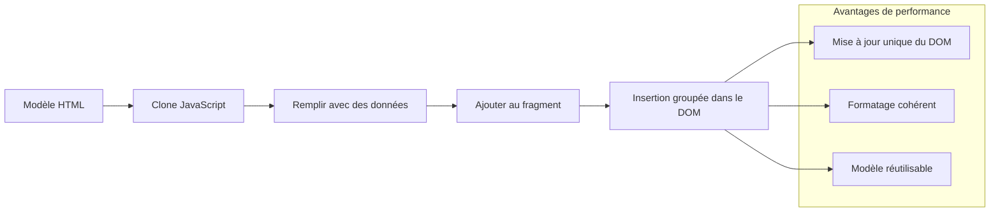
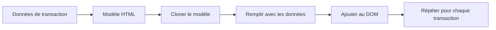
### Étape 1 : Créer le template de la transaction

Commencez par ajouter un template réutilisable pour les lignes de transaction dans le `<body>` de votre HTML :

```html
<template id="transaction">
  <tr>
    <td></td>
    <td></td>
    <td></td>
  </tr>
</template>
```

**Comprendre les templates HTML :**
- **Définit** la structure d’une seule ligne de tableau
- **Reste** invisible jusqu’à ce qu’elle soit clonée et remplie par JavaScript
- **Inclut** trois cellules pour la date, la description et le montant
- **Fournit** un modèle réutilisable pour un formatage cohérent

### Étape 2 : Préparer votre tableau pour du contenu dynamique

Ensuite, ajoutez un `id` à la partie corps du tableau pour que JavaScript puisse facilement le cibler :

```html
<tbody id="transactions"></tbody>
```

**Ce que cela accomplit :**
- **Crée** une cible claire pour insérer les lignes de transaction
- **Sépare** la structure du tableau du contenu dynamique
- **Permet** de vider facilement et de remplir à nouveau les données des transactions

### Étape 3 : Construire la fonction fabrique de ligne de transaction

Créez maintenant une fonction qui transforme les données de transaction en éléments HTML :

```javascript
function createTransactionRow(transaction) {
  const template = document.getElementById('transaction');
  const transactionRow = template.content.cloneNode(true);
  const tr = transactionRow.querySelector('tr');
  tr.children[0].textContent = transaction.date;
  tr.children[1].textContent = transaction.object;
  tr.children[2].textContent = transaction.amount.toFixed(2);
  return transactionRow;
}
```

**Décomposer cette fonction fabrique :**
- **Récupère** l’élément template par son ID
- **Clône** le contenu du template pour une manipulation sécurisée
- **Sélectionne** la ligne de tableau à l’intérieur du contenu cloné
- **Remplit** chaque cellule avec les données de la transaction
- **Formate** le montant pour afficher les décimales correctes
- **Retourne** la ligne complète prête à être insérée

### Étape 4 : Générer efficacement plusieurs lignes de transaction

Ajoutez ce code à votre fonction `updateDashboard()` pour afficher toutes les transactions :

```javascript
const transactionsRows = document.createDocumentFragment();
for (const transaction of account.transactions) {
  const transactionRow = createTransactionRow(transaction);
  transactionsRows.appendChild(transactionRow);
}
updateElement('transactions', transactionsRows);
```

**Comprendre cette approche efficace :**
- **Crée** un fragment de document pour grouper les opérations DOM
- **Itère** sur toutes les transactions dans les données du compte
- **Génère** une ligne pour chaque transaction via la fonction fabrique
- **Collecte** toutes les lignes dans le fragment avant de les ajouter au DOM
- **Effectue** une seule mise à jour du DOM au lieu de plusieurs insertions individuelles
> ⚡ **Optimisation des performances** : [`document.createDocumentFragment()`](https://developer.mozilla.org/docs/Web/API/Document/createDocumentFragment) fonctionne comme la chaîne d'assemblage chez Boeing - les composants sont préparés hors de la ligne principale, puis installés en tant qu'unité complète. Cette approche de regroupement minimise les reflows du DOM en effectuant une seule insertion au lieu de multiples opérations individuelles.

### Étape 5 : Améliorez la fonction de mise à jour pour un contenu mixte

Votre fonction `updateElement()` ne gère actuellement que le contenu textuel. Mettez-la à jour pour qu'elle fonctionne avec du texte et des nœuds DOM :

```javascript
function updateElement(id, textOrNode) {
  const element = document.getElementById(id);
  element.textContent = ''; // Removes all children
  element.append(textOrNode);
}
```

**Améliorations clés dans cette mise à jour :**
- **Efface** le contenu existant avant d'ajouter du nouveau contenu
- **Accepte** soit des chaînes de texte soit des nœuds DOM en paramètres
- **Utilise** la méthode [`append()`](https://developer.mozilla.org/docs/Web/API/ParentNode/append) pour plus de flexibilité
- **Maintient** la compatibilité ascendante avec l'utilisation textuelle existante

### Faites un essai de votre tableau de bord

C'est l'heure de la vérité ! Voyons votre tableau de bord dynamique en action :

1. Connectez-vous avec le compte `test` (il contient des données exemples prêtes à l'emploi)
2. Naviguez vers votre tableau de bord
3. Vérifiez que les lignes de transactions s'affichent avec une mise en forme appropriée
4. Assurez-vous que les dates, descriptions et montants sont corrects

Si tout fonctionne, vous devriez voir une liste de transactions pleinement fonctionnelle sur votre tableau de bord ! 🎉

**Ce que vous avez accompli :**
- Construit un tableau de bord qui s'adapte à n'importe quelle quantité de données
- Créé des modèles réutilisables pour une mise en forme cohérente
- Mis en œuvre des techniques efficaces de manipulation du DOM
- Développé une fonctionnalité comparable à des applications bancaires en production

Vous avez réussi à transformer une page web statique en une application web dynamique.

### 🎯 Point pédagogique : Génération de contenu dynamique

**Compréhension de l'architecture** : Vous avez mis en place un pipeline sophistiqué de données vers interface utilisateur qui reflète les modèles utilisés dans des frameworks comme React, Vue et Angular.

**Concepts clés maîtrisés** :
- **Rendu basé sur des templates** : création de composants UI réutilisables
- **Fragments de document** : optimisation des performances du DOM
- **Manipulation sécurisée du DOM** : prévention des vulnérabilités de sécurité
- **Transformation des données** : conversion des données serveur en interfaces utilisateurs

**Lien avec l'industrie** : Ces techniques constituent la base des frameworks frontend modernes. Le DOM virtuel de React, le système de templates de Vue et l’architecture composants d’Angular s’appuient tous sur ces concepts fondamentaux.

**Question de réflexion** : Comment étendriez-vous ce système pour gérer des mises à jour en temps réel (comme des nouvelles transactions apparaissant automatiquement) ? Pensez aux WebSockets ou aux Server-Sent Events.

---

## 📈 Votre ligne du temps de maîtrise de la gestion des données

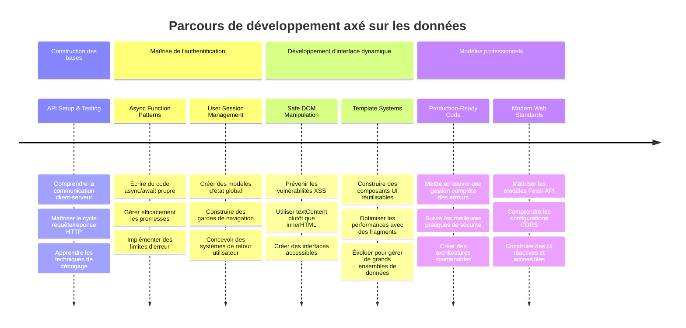
**🎓 Palier de fin d’apprentissage** : Vous avez construit avec succès une application web complète pilotée par les données utilisant des patterns JavaScript modernes. Ces compétences se traduisent directement dans le travail avec des frameworks comme React, Vue ou Angular.

**🔄 Capacités de niveau supérieur :**
- Prêt à explorer les frameworks frontend qui s’appuient sur ces concepts
- Préparé à implémenter des fonctionnalités temps réel avec WebSockets
- Équipé pour créer des Progressive Web Apps avec capacités hors-ligne
- Bases posées pour apprendre des patterns avancés de gestion d’état

## Défi GitHub Copilot Agent 🚀

Utilisez le mode Agent pour réaliser le défi suivant :

**Description :** Améliorez l’application bancaire en implémentant une fonctionnalité de recherche et de filtrage des transactions permettant aux utilisateurs de trouver des transactions spécifiques par plage de dates, montant ou description.

**Consigne :** Créez une fonctionnalité de recherche pour l’application bancaire comprenant : 1) Un formulaire de recherche avec champs pour plage de dates (de/à), montant minimum/maximum, et mots-clés de description de transaction, 2) Une fonction `filterTransactions()` qui filtre le tableau account.transactions selon les critères de recherche, 3) Mettez à jour la fonction `updateDashboard()` pour afficher les résultats filtrés, et 4) Ajoutez un bouton « Effacer les filtres » pour réinitialiser l’affichage. Utilisez les méthodes modernes JavaScript des tableaux comme `filter()` et gérez les cas limites liés aux critères de recherche vides.

Découvrez-en plus sur le [mode agent](https://code.visualstudio.com/blogs/2025/02/24/introducing-copilot-agent-mode) ici.

## 🚀 Défi

Prêt à faire passer votre application bancaire au niveau supérieur ? Donnons-lui un aspect et une sensation que vous aurez vraiment envie d'utiliser. Voici quelques idées pour stimuler votre créativité :

**Rendez-le beau** : Ajoutez du style CSS pour transformer votre tableau de bord fonctionnel en quelque chose de visuellement attrayant. Pensez à des lignes épurées, un bon espacement, et peut-être même quelques animations subtiles.

**Rendez-le responsive** : Essayez d’utiliser les [media queries](https://developer.mozilla.org/docs/Web/CSS/Media_Queries) pour créer un [design responsive](https://developer.mozilla.org/docs/Web/Progressive_web_apps/Responsive/responsive_design_building_blocks) qui fonctionne parfaitement sur téléphones, tablettes et ordinateurs. Vos utilisateurs vous remercieront !

**Ajoutez un peu de fantaisie** : Envisagez de coder par couleur les transactions (vert pour les revenus, rouge pour les dépenses), d’ajouter des icônes, ou de créer des effets au survol qui rendent l’interface interactive.

Voici à quoi pourrait ressembler un tableau de bord élégant :

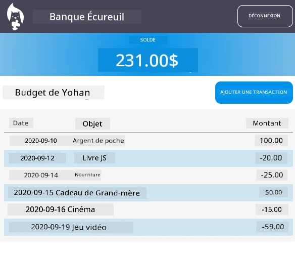

Ne vous sentez pas obligé de correspondre exactement à ça – utilisez-le comme source d’inspiration et faites-le vôtre !

## Quiz post-lecture

[Quiz post-lecture](https://ff-quizzes.netlify.app/web/quiz/46)

## Devoir

[Refactorisez et commentez votre code](assignment.md)

---

<!-- CO-OP TRANSLATOR DISCLAIMER START -->
**Avertissement** :  
Ce document a été traduit à l’aide du service de traduction automatique [Co-op Translator](https://github.com/Azure/co-op-translator). Bien que nous nous efforçons d’assurer l’exactitude, veuillez noter que les traductions automatisées peuvent contenir des erreurs ou des inexactitudes. Le document original dans sa langue d’origine doit être considéré comme la source faisant foi. Pour les informations critiques, une traduction professionnelle réalisée par un humain est recommandée. Nous déclinons toute responsabilité en cas de malentendus ou de mauvaises interprétations résultant de l’utilisation de cette traduction.
<!-- CO-OP TRANSLATOR DISCLAIMER END -->