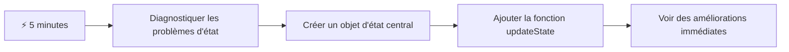
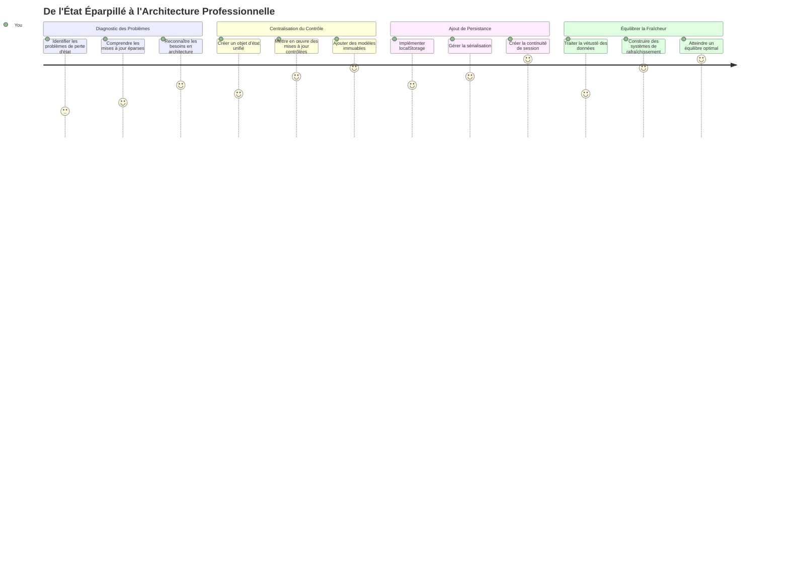
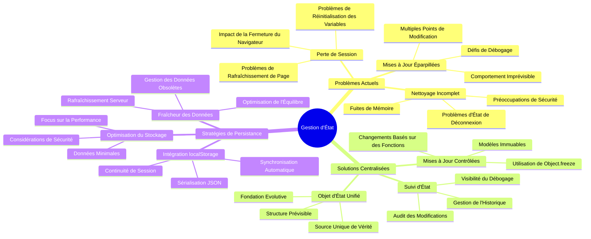
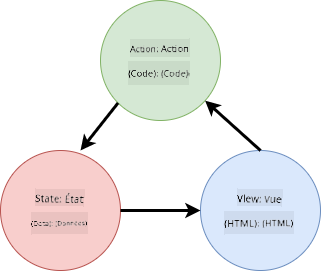
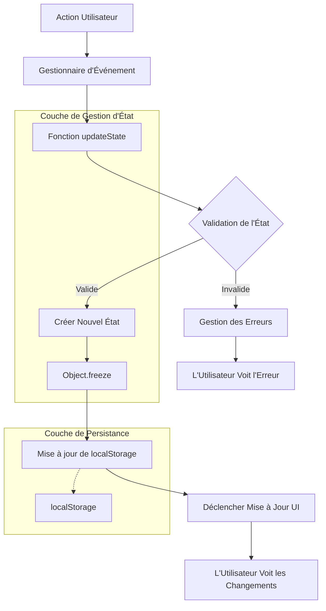
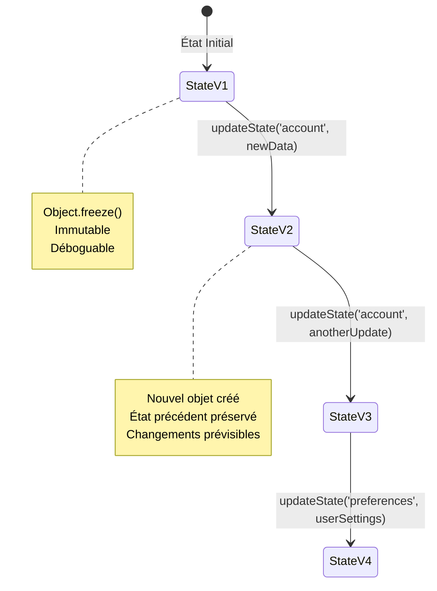
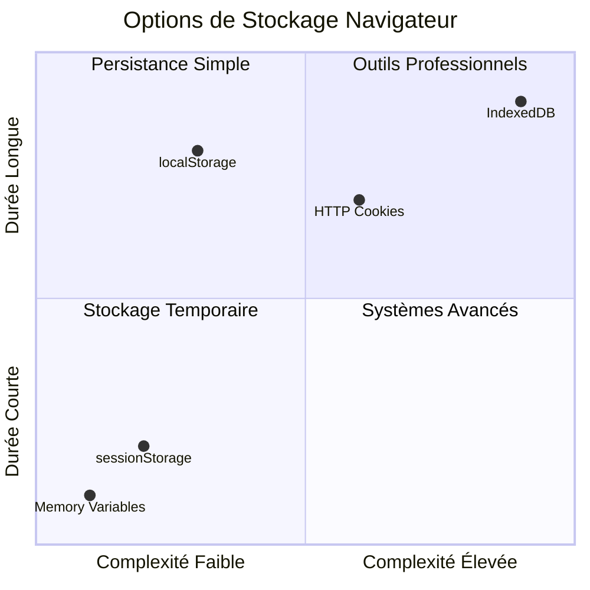
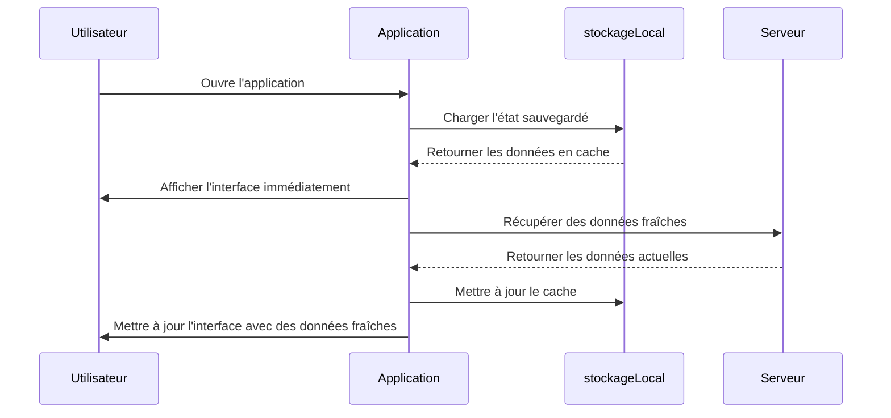
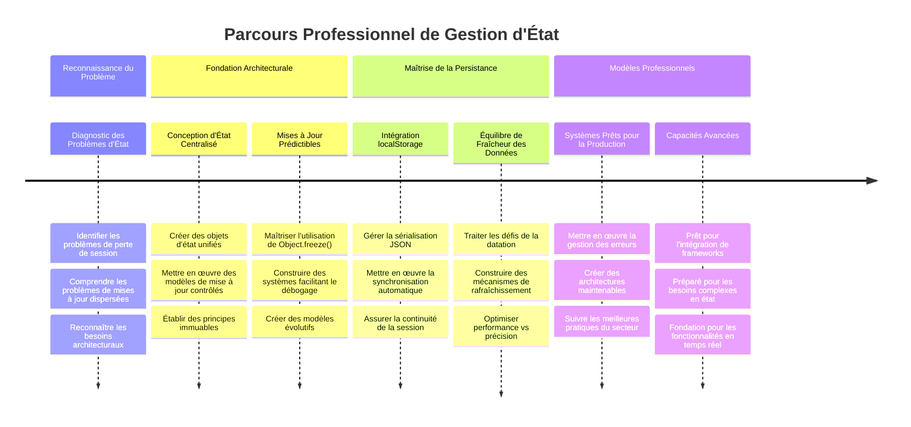

<!--
CO_OP_TRANSLATOR_METADATA:
{
  "original_hash": "b807b09df716dc48a2b750835bf8e933",
  "translation_date": "2026-01-06T06:39:39+00:00",
  "source_file": "7-bank-project/4-state-management/README.md",
  "language_code": "fr"
}
-->
# Construire une application bancaire Partie 4 : Concepts de gestion d’état

## ⚡ Ce que vous pouvez faire dans les 5 prochaines minutes

**Parcours de démarrage rapide pour les développeurs occupés**


- **Minute 1** : Tester le problème d’état actuel - se connecter, rafraîchir la page, observer la déconnexion
- **Minute 2** : Remplacer `let account = null` par `let state = { account: null }`
- **Minute 3** : Créer une fonction simple `updateState()` pour des mises à jour contrôlées
- **Minute 4** : Mettre à jour une fonction pour utiliser le nouveau modèle
- **Minute 5** : Tester la meilleure prévisibilité et capacité de débogage

**Test de diagnostic rapide** :
```javascript
// Avant : État dispersé
let account = null; // Perdu au rafraîchissement !

// Après : État centralisé
let state = Object.freeze({ account: null }); // Contrôlé et traçable !
```

**Pourquoi c’est important** : En 5 minutes, vous allez expérimenter la transformation d’une gestion d’état chaotique vers des modèles prévisibles et débogables. C’est la base qui rend les applications complexes maintenables.

## 🗺️ Votre parcours d’apprentissage vers la maîtrise de la gestion d’état


**Destination de votre parcours** : À la fin de cette leçon, vous aurez construit un système de gestion d’état professionnel qui gère la persistance, la fraîcheur des données et des mises à jour prévisibles - les mêmes modèles utilisés dans des applications en production.

## Quiz pré-conférence

[Quiz pré-conférence](https://ff-quizzes.netlify.app/web/quiz/47)

## Introduction

La gestion d’état est comme le système de navigation du vaisseau Voyager – quand tout fonctionne bien, on remarque à peine sa présence. Mais quand il y a un problème, cela fait la différence entre atteindre l’espace interstellaire ou dériver perdu dans le vide cosmique. En développement web, l’état représente tout ce que votre application doit retenir : le statut de connexion de l’utilisateur, les données de formulaire, l’historique de navigation, et les états temporaires de l’interface.

À mesure que votre application bancaire a évolué d’un simple formulaire de connexion vers une application plus sophistiquée, vous avez probablement rencontré certains défis courants. Actualiser la page provoque une déconnexion inattendue des utilisateurs. Fermer le navigateur fait disparaître tous les progrès. Déboguer un problème vous amène à explorer plusieurs fonctions qui modifient toutes les mêmes données de manières différentes.

Ce ne sont pas des signes de mauvais code – ce sont les douleurs normales de croissance qui surviennent quand les applications atteignent un certain seuil de complexité. Chaque développeur fait face à ces défis lorsque ses applications passent de la phase de « preuve de concept » à « prêtes pour la production ».

Dans cette leçon, nous allons implémenter un système centralisé de gestion d’état qui transformera votre application bancaire en une application fiable et professionnelle. Vous apprendrez à gérer les flux de données de manière prévisible, à persister correctement les sessions utilisateur, et à créer une expérience utilisateur fluide que requièrent les applications web modernes.

## Prérequis

Avant de plonger dans les concepts de gestion d’état, vous devez avoir configuré correctement votre environnement de développement et avoir les bases de votre application bancaire en place. Cette leçon s’appuie directement sur les concepts et le code des parties précédentes de cette série.

Assurez-vous d’avoir les composants suivants prêts avant de continuer :

**Configuration requise :**
- Terminez la [leçon sur la récupération des données](../3-data/README.md) – votre application doit charger et afficher les données de compte avec succès
- Installez [Node.js](https://nodejs.org) sur votre système pour exécuter l’API backend
- Lancez localement le [serveur API](../api/README.md) pour gérer les opérations sur les données de compte

**Tester votre environnement :**

Vérifiez que votre serveur API fonctionne correctement en exécutant cette commande dans un terminal :

```sh
curl http://localhost:5000/api
# -> devrait retourner "Bank API v1.0.0" en résultat
```

**Ce que fait cette commande :**
- **Envoie** une requête GET à votre serveur API local
- **Teste** la connexion et vérifie que le serveur répond
- **Retourne** les informations de version de l’API si tout fonctionne correctement

## 🧠 Vue d’ensemble de l’architecture de gestion d’état


**Principe fondamental** : La gestion d’état professionnelle équilibre prévisibilité, persistance et performance pour créer des expériences utilisateur fiables, capables d’évoluer des interactions simples aux workflows complexes d’application.

---

## Diagnostic des problèmes actuels d’état

À la manière de Sherlock Holmes examinant une scène de crime, nous devons comprendre exactement ce qui se passe dans notre implémentation actuelle avant de résoudre le mystère des sessions utilisateur disparues.

Faisons une expérience simple qui révèle les défis sous-jacents de gestion d’état :

**🧪 Essayez ce test de diagnostic :**
1. Connectez-vous à votre application bancaire et allez au tableau de bord
2. Rafraîchissez la page du navigateur
3. Observez ce qui arrive à votre statut de connexion

Si vous êtes redirigé vers l’écran de connexion, vous avez découvert le problème classique de persistance d’état. Ce comportement survient parce que notre implémentation actuelle stocke les données utilisateur dans des variables JavaScript qui se réinitialisent à chaque chargement de page.

**Problèmes de l’implémentation actuelle :**

La simple variable `account` de notre [leçon précédente](../3-data/README.md) crée trois problèmes majeurs qui impactent à la fois l’expérience utilisateur et la maintenabilité du code :

| Problème | Cause technique | Impact utilisateur |
|---------|--------|----------------|
| **Perte de session** | Rafraîchissement de page réinitialise les variables JavaScript | Les utilisateurs doivent se réauthentifier fréquemment |
| **Mises à jour dispersées** | Plusieurs fonctions modifient l’état directement | Le débogage devient de plus en plus difficile |
| **Nettoyage incomplet** | La déconnexion ne supprime pas toutes les références d’état | Risques potentiels de sécurité et confidentialité |

**Le défi architectural :**

Comme la conception compartimentée du Titanic qui semblait robuste jusqu’à ce que plusieurs compartiments soient simultanément inondés, corriger ces problèmes individuellement ne règle pas le problème architectural sous-jacent. Nous avons besoin d’une solution globale de gestion d’état.

> 💡 **Qu’essayons-nous vraiment d’accomplir ?**

La [gestion d’état](https://fr.wikipedia.org/wiki/Gestion_d%27%C3%A9tat) consiste en fait à résoudre deux énigmes fondamentales :

1. **Où sont mes données ?** : Suivre quelles informations nous avons et d’où elles viennent
2. **Tout le monde est-il sur la même longueur d’onde ?** : S’assurer que ce que voient les utilisateurs correspond à ce qui se passe réellement

**Notre plan d’action :**

Au lieu de courir après notre queue, nous allons créer un système de **gestion d’état centralisé**. Pensez-y comme avoir une personne vraiment organisée en charge de toutes les choses importantes :




**Comprendre ce flux de données :**
- **Centralise** tout l’état de l’application en un seul endroit
- **Dirige** tous les changements d’état via des fonctions contrôlées
- **Assure** que l’interface reste synchronisée avec l’état actuel
- **Fournit** un modèle clair et prévisible pour la gestion des données

> 💡 **Perspective professionnelle** : Cette leçon se concentre sur les concepts fondamentaux. Pour les applications complexes, des bibliothèques comme [Redux](https://redux.js.org) offrent des fonctionnalités avancées de gestion d’état. Comprendre ces principes de base vous aidera à maîtriser n’importe quelle bibliothèque de gestion d’état.

> ⚠️ **Sujet avancé** : Nous ne couvrirons pas les mises à jour automatiques de l’interface déclenchées par les changements d’état, car cela implique des concepts de [programmation réactive](https://fr.wikipedia.org/wiki/Programmation_r%C3%A9active). Considérez cela comme une excellente étape suivante dans votre parcours d’apprentissage !

### Tâche : Centraliser la structure d’état

Commençons à transformer notre gestion d’état dispersée en un système centralisé. Cette première étape établit les bases de toutes les améliorations à venir.

**Étape 1 : Créez un objet d’état central**

Remplacez la simple déclaration `account` :

```js
let account = null;
```

Par un objet d’état structuré :

```js
let state = {
  account: null
};
```

**Pourquoi ce changement est important :**
- **Centralise** toutes les données de l’application en un seul endroit
- **Prépare** la structure pour ajouter plus de propriétés d’état plus tard
- **Établit** une frontière claire entre l’état et les autres variables
- **Crée** un modèle qui évolue avec la croissance de votre application

**Étape 2 : Mettez à jour les schémas d’accès à l’état**

Mettez à jour vos fonctions pour utiliser la nouvelle structure d’état :

**Dans les fonctions `register()` et `login()`**, remplacez :
```js
account = ...
```

Par :
```js
state.account = ...
```

**Dans la fonction `updateDashboard()`**, ajoutez cette ligne en haut :
```js
const account = state.account;
```

**Ce que ces mises à jour accomplissent :**
- **Conservent** la fonctionnalité existante tout en améliorant la structure
- **Préparent** votre code à une gestion d’état plus sophistiquée
- **Créent** des modèles cohérents pour accéder aux données d’état
- **Établissent** la base pour des mises à jour centralisées de l’état

> 💡 **Note** : Ce refactoring ne résout pas immédiatement nos problèmes, mais crée la base essentielle pour les puissantes améliorations à venir !

### 🎯 Bilan pédagogique : Principes de centralisation

**Pause et réflexion** : Vous venez d’implémenter la base de la gestion d’état centralisée. C’est une décision architecturale cruciale.

**Auto-évaluation rapide** :
- Pouvez-vous expliquer pourquoi centraliser l’état dans un objet est préférable à des variables dispersées ?
- Que se passerait-il si vous oubliez de mettre à jour une fonction pour utiliser `state.account` ?
- Comment ce modèle prépare-t-il votre code à des fonctionnalités plus avancées ?

**Lien avec le monde réel** : Le modèle de centralisation que vous avez appris est la base des frameworks modernes comme Redux, Vuex, et React Context. Vous construisez la même pensée architecturale utilisée dans les grandes applications.

**Question de défi** : Si vous deviez ajouter des préférences utilisateur (thème, langue) dans votre application, où les ajouteriez-vous dans la structure d’état ? Comment cela évoluerait-il ?

## Implémenter des mises à jour d’état contrôlées

Avec notre état centralisé, l’étape suivante consiste à établir des mécanismes contrôlés pour les modifications de données. Cette approche assure des changements d’état prévisibles et un débogage facilité.

Le principe central ressemble au contrôle du trafic aérien : au lieu de permettre à plusieurs fonctions de modifier l’état indépendamment, nous allons canaliser tous les changements via une fonction unique et contrôlée. Ce modèle offre une supervision claire de quand et comment les données changent.

**Gestion d’état immuable :**

Nous traiterons notre objet `state` comme [*immuable*](https://fr.wikipedia.org/wiki/Objet_immuable), ce qui signifie que nous ne le modifions jamais directement. À chaque changement, nous créons un nouvel objet d’état avec les données mises à jour.

Bien que cette approche puisse sembler inefficace au premier abord comparée aux modifications directes, elle offre d’importants avantages pour le débogage, les tests et la prévisibilité de l’application.

**Avantages de la gestion d’état immuable :**

| Avantage | Description | Impact |
|---------|-------------|--------|
| **Prévisibilité** | Les changements ne se font que via des fonctions contrôlées | Plus facile à déboguer et tester |
| **Suivi historique** | Chaque changement d’état crée un nouvel objet | Permet la fonctionnalité d’annulation/restauration |
| **Prévention des effets de bord** | Pas de modifications accidentelles | Évite les bugs mystérieux |
| **Optimisation des performances** | Facile à détecter quand l’état a réellement changé | Permet des mises à jour UI efficaces |

**Immutabilité en JavaScript avec `Object.freeze()` :**

JavaScript fournit [`Object.freeze()`](https://developer.mozilla.org/docs/Web/JavaScript/Reference/Global_Objects/Object/freeze) pour empêcher les modifications d’objet :

```js
const immutableState = Object.freeze({ account: userData });
// Toute tentative de modifier immutableState générera une erreur
```

**Décryptage de ce qui se passe ici :**
- **Empêche** les affectations ou suppressions directes de propriétés
- **Lance** des exceptions si des tentatives de modification sont faites
- **Garantit** que les changements d’état doivent se faire via des fonctions contrôlées
- **Crée** un contrat clair sur la manière de mettre à jour l’état

> 💡 **Approfondissement** : Apprenez la différence entre objets immuables *superficiels* et *profonds* dans la [documentation MDN](https://developer.mozilla.org/docs/Web/JavaScript/Reference/Global_Objects/Object/freeze#What_is_shallow_freeze). Comprendre cette distinction est crucial pour des structures d’état complexes.


### Tâche

Créons une nouvelle fonction `updateState()` :

```js
function updateState(property, newData) {
  state = Object.freeze({
    ...state,
    [property]: newData
  });
}
```

Dans cette fonction, nous créons un nouvel objet d’état et copions les données de l’état précédent en utilisant l’[*opérateur spread (`...`)*](https://developer.mozilla.org/docs/Web/JavaScript/Reference/Operators/Spread_syntax#Spread_in_object_literals). Ensuite, nous écrasons une propriété particulière de l’objet d’état avec les nouvelles données en utilisant la [notation entre crochets](https://developer.mozilla.org/docs/Web/JavaScript/Guide/Working_with_Objects#Objects_and_properties) `[property]` pour l’assignation. Enfin, nous bloquons l’objet pour empêcher les modifications avec `Object.freeze()`. Pour l’instant, nous avons uniquement la propriété `account` stockée dans l’état, mais avec cette approche, vous pouvez ajouter autant de propriétés que nécessaire.

Nous allons aussi mettre à jour l’initialisation de `state` pour s’assurer que l’état initial est gelé aussi :

```js
let state = Object.freeze({
  account: null
});
```

Ensuite, mettez à jour la fonction `register` en remplaçant l’assignation `state.account = result;` par :

```js
updateState('account', result);
```

Faites de même avec la fonction `login`, en remplaçant `state.account = data;` par :

```js
updateState('account', data);
```

Profitons-en également pour régler le problème des données de compte non effacées lorsque l’utilisateur clique sur *Déconnexion*.

Créez une nouvelle fonction `logout()` :

```js
function logout() {
  updateState('account', null);
  navigate('/login');
}
```

Dans `updateDashboard()`, remplacez la redirection `return navigate('/login');` par `return logout()`;

Essayez de créer un nouveau compte, de vous déconnecter puis de vous reconnecter pour vérifier que tout fonctionne correctement.

> Conseil : vous pouvez regarder tous les changements d’état en ajoutant `console.log(state)` au bas de `updateState()` et en ouvrant la console des outils de développement de votre navigateur.

## Implémenter la persistance des données

Le problème de perte de session que nous avons identifié plus tôt nécessite une solution de persistance qui maintient l’état utilisateur à travers les sessions du navigateur. Cela transforme notre application d’une expérience temporaire en un outil fiable et professionnel.

Considérez comment les horloges atomiques maintiennent une précision temporelle même lors de coupures de courant en stockant l’état critique dans une mémoire non volatile. De même, les applications web ont besoin de mécanismes de stockage persistants pour préserver les données essentielles de l’utilisateur à travers les sessions et rafraîchissements de page.

**Questions stratégiques sur la persistance des données :**

Avant d’implémenter la persistance, considérez ces facteurs critiques :

| Question | Contexte application bancaire | Impact de la décision |
|----------|-------------------|----------------|
| **Les données sont-elles sensibles ?** | Solde de compte, historique des transactions | Choisir des méthodes de stockage sécurisées |
| **Combien de temps doit-il persister ?** | État de connexion vs. préférences temporaires de l'interface utilisateur | Sélectionnez la durée de stockage appropriée |
| **Le serveur en a-t-il besoin ?** | Jetons d'authentification vs. paramètres de l'interface utilisateur | Déterminez les exigences de partage |

**Options de stockage dans le navigateur :**

Les navigateurs modernes offrent plusieurs mécanismes de stockage, chacun conçu pour des cas d'utilisation différents :

**APIs de stockage principales :**

1. **[`localStorage`](https://developer.mozilla.org/docs/Web/API/Window/localStorage)** : Stockage [clé/valeur persistant](https://en.wikipedia.org/wiki/Key%E2%80%93value_database)  
   - **Persiste** les données indéfiniment entre les sessions du navigateur  
   - **Survit** aux redémarrages du navigateur et de l'ordinateur  
   - **Ciblé** sur le domaine spécifique du site web  
   - **Parfait** pour les préférences utilisateur et états de connexion  

2. **[`sessionStorage`](https://developer.mozilla.org/docs/Web/API/Window/sessionStorage)** : Stockage temporaire pour la session  
   - **Fonctionne** de manière identique à localStorage durant la session active  
   - **S'efface** automatiquement à la fermeture de l'onglet du navigateur  
   - **Idéal** pour les données temporaires qui ne doivent pas persister  

3. **[Cookies HTTP](https://developer.mozilla.org/docs/Web/HTTP/Cookies)** : Stockage partagé avec le serveur  
   - **Envoyés automatiquement** avec chaque requête au serveur  
   - **Parfaits** pour les jetons d'[authentification](https://en.wikipedia.org/wiki/Authentication)  
   - **Limités** en taille et peuvent impacter les performances  

**Exigence de sérialisation des données :**

`localStorage` et `sessionStorage` ne stockent que des [chaînes de caractères](https://developer.mozilla.org/docs/Web/JavaScript/Reference/Global_Objects/String) :

```js
// Convertir les objets en chaînes JSON pour le stockage
const accountData = { user: 'john', balance: 150 };
localStorage.setItem('account', JSON.stringify(accountData));

// Analyser les chaînes JSON en objets lors de la récupération
const savedAccount = JSON.parse(localStorage.getItem('account'));
```
  
**Comprendre la sérialisation :**  
- **Convertit** les objets JavaScript en chaînes JSON via [`JSON.stringify()`](https://developer.mozilla.org/docs/Web/JavaScript/Reference/Global_Objects/JSON/stringify)  
- **Reconstruit** les objets depuis JSON via [`JSON.parse()`](https://developer.mozilla.org/docs/Web/JavaScript/Reference/Global_Objects/JSON/parse)  
- **Gère** automatiquement les objets imbriqués complexes et les tableaux  
- **Échoue** avec les fonctions, valeurs undefined et références circulaires  

> 💡 **Option avancée** : Pour des applications hors ligne complexes avec de grands jeux de données, considérez l'API [`IndexedDB`](https://developer.mozilla.org/docs/Web/API/IndexedDB_API). Elle offre une base de données complète côté client, mais requiert une mise en œuvre plus complexe.  


### Tâche : Implémenter une persistance avec localStorage  

Implémentons un stockage persistant pour que les utilisateurs restent connectés jusqu'à déconnexion explicite. Nous utiliserons `localStorage` pour stocker les données de compte entre les sessions.  

**Étape 1 : Définir la configuration du stockage**  

```js
const storageKey = 'savedAccount';
```
  
**Ce que fournit cette constante :**  
- **Crée** un identifiant cohérent pour nos données stockées  
- **Évite** les erreurs typographiques dans les clés de stockage  
- **Facilite** la modification de la clé de stockage si besoin  
- **Suit** les meilleures pratiques pour un code maintenable  

**Étape 2 : Ajouter la persistance automatique**  

Ajoutez cette ligne à la fin de la fonction `updateState()` :

```js
localStorage.setItem(storageKey, JSON.stringify(state.account));
```
  
**Analyse de ce qui se passe ici :**  
- **Convertit** l'objet compte en chaîne JSON pour le stockage  
- **Enregistre** les données en utilisant notre clé de stockage cohérente  
- **S'exécute** automatiquement à chaque mise à jour d'état  
- **Garantit** la synchronisation constante des données stockées et de l'état actuel  

> 💡 **Avantage architectural** : Comme toutes les mises à jour d'état passent par `updateState()`, ajouter la persistance a seulement demandé une ligne. Cela montre l'intérêt d'une bonne architecture !  

**Étape 3 : Restaurer l'état au chargement de l'application**  

Créez une fonction d'initialisation pour restaurer les données sauvegardées :

```js
function init() {
  const savedAccount = localStorage.getItem(storageKey);
  if (savedAccount) {
    updateState('account', JSON.parse(savedAccount));
  }

  // Notre code d'initialisation précédent
  window.onpopstate = () => updateRoute();
  updateRoute();
}

init();
```
  
**Comprendre le processus d'initialisation :**  
- **Récupère** les données de compte précédemment sauvegardées dans localStorage  
- **Analyse** la chaîne JSON pour retrouver un objet JavaScript  
- **Met à jour** l'état via notre fonction de mise à jour contrôlée  
- **Restaure** automatiquement la session utilisateur au chargement de la page  
- **S'exécute** avant les mises à jour de route pour garantir l'état disponible  

**Étape 4 : Optimiser la route par défaut**  

Modifiez la route par défaut pour exploiter la persistance :  

Dans `updateRoute()`, remplacez :  
```js
// Remplacer : return navigate('/login');
return navigate('/dashboard');
```
  
**Pourquoi ce changement est pertinent :**  
- **Tire parti** efficacement de notre nouveau système de persistance  
- **Permet** au tableau de bord de gérer les vérifications d'authentification  
- **Redirige** automatiquement vers la connexion si aucune session sauvegardée n'existe  
- **Crée** une expérience utilisateur plus fluide  

**Tester votre implémentation :**  

1. Connectez-vous à votre application bancaire  
2. Actualisez la page du navigateur  
3. Vérifiez que vous restez connecté et sur le tableau de bord  
4. Fermez et rouvrez votre navigateur  
5. Naviguez à nouveau vers votre application et confirmez que vous êtes toujours connecté  

🎉 **Félicitations** : Vous avez implémenté avec succès une gestion de l'état persistant ! Votre application se comporte désormais comme une application web professionnelle.  

### 🎯 Vérification pédagogique : Architecture de persistance  

**Compréhension architecturale** : Vous avez mis en place une couche sophistiquée de persistance, équilibrant expérience utilisateur et complexité de gestion des données.  

**Concepts clés maîtrisés** :  
- **Sérialisation JSON** : conversion d'objets complexes en chaînes stockables  
- **Synchronisation automatique** : les changements d'état déclenchent la persistance  
- **Récupération de session** : restauration du contexte utilisateur après interruption  
- **Persistance centralisée** : une seule fonction de mise à jour gère tout le stockage  

**Lien avec l'industrie** : Ce modèle de persistance est fondamental pour les Progressive Web Apps (PWA), applications hors ligne et expériences mobiles modernes. Vous développez des capacités de niveau production.  

**Question de réflexion** : Comment modifieriez-vous ce système pour gérer plusieurs comptes utilisateurs sur un même appareil ? Prenez en compte les implications de confidentialité et sécurité.  

## Équilibrer persistance et fraîcheur des données  

Notre système de persistance maintient avec succès les sessions utilisateur, mais introduit un nouveau défi : la vétusté des données. Lorsque plusieurs utilisateurs ou applications modifient les mêmes données serveurs, les informations locales mises en cache deviennent obsolètes.  

Cette situation rappelle les navigateurs vikings qui utilisaient à la fois des cartes d'étoiles stockées et des observations célestes actuelles. Les cartes fournissaient une constance, mais les navigateurs avaient besoin d'observations fraîches pour tenir compte des conditions changeantes. De même, notre application a besoin à la fois d'un état utilisateur persistant et de données serveurs actualisées.  

**🧪 Découverte du problème de fraîcheur des données :**  

1. Connectez-vous au tableau de bord avec le compte `test`  
2. Exécutez cette commande dans un terminal pour simuler une transaction externe :  

```sh
curl --request POST \
     --header "Content-Type: application/json" \
     --data "{ \"date\": \"2020-07-24\", \"object\": \"Bought book\", \"amount\": -20 }" \
     http://localhost:5000/api/accounts/test/transactions
```
  
3. Actualisez la page du tableau de bord dans le navigateur  
4. Observez si la nouvelle transaction apparaît  

**Ce que ce test démontre :**  
- **Montre** comment le stockage local peut devenir "obsolète"  
- **Simule** des scénarios réels où des données changent hors de votre application  
- **Révèle** la tension entre persistance et fraîcheur des données  

**Le défi de l'obsolescence des données :**  

| Problème | Cause | Impact utilisateur |  
|----------|-------|--------------------|  
| **Données obsolètes** | localStorage n'expire jamais automatiquement | Les utilisateurs voient des informations périmées |  
| **Modifications serveurs** | D'autres apps/utilisateurs modifient les mêmes données | Vues incohérentes entre plateformes |  
| **Cache vs. réalité** | Le cache local ne correspond pas à l'état serveur | Mauvaise expérience utilisateur et confusion |  

**Stratégie de solution :**  

Nous allons implémenter un modèle de "rafraîchissement au chargement" qui équilibre les avantages de la persistance avec le besoin de données fraîches. Cette approche maintient une expérience fluide tout en assurant la précision des données.  


### Tâche : Implémenter un système de rafraîchissement des données  

Nous allons créer un système qui récupère automatiquement les données fraîches du serveur tout en conservant les bénéfices de notre gestion d'état persistante.  

**Étape 1 : Créer une fonction de mise à jour des données du compte**  

```js
async function updateAccountData() {
  const account = state.account;
  if (!account) {
    return logout();
  }

  const data = await getAccount(account.user);
  if (data.error) {
    return logout();
  }

  updateState('account', data);
}
```
  
**Comprendre la logique de cette fonction :**  
- **Vérifie** si un utilisateur est actuellement connecté (`state.account` existe)  
- **Redirige** vers la déconnexion si aucune session valide n'est trouvée  
- **Récupère** les données fraîches du compte depuis le serveur via `getAccount()`  
- **Gère** les erreurs serveur en déconnectant les sessions invalides  
- **Met à jour** l'état avec les données fraîches via notre système contrôlé de mise à jour  
- **Déclenche** la persistance automatique dans localStorage via `updateState()`  

**Étape 2 : Créer un gestionnaire de rafraîchissement pour le tableau de bord**  

```js
async function refresh() {
  await updateAccountData();
  updateDashboard();
}
```
  
**Ce que réalise cette fonction de rafraîchissement :**  
- **Coordonne** la récupération des données et la mise à jour de l'interface  
- **Attend** le chargement des données fraîches avant mise à jour de l'affichage  
- **Garantit** que le tableau de bord affiche les informations les plus récentes  
- **Maintient** une séparation claire entre gestion des données et mise à jour UI  

**Étape 3 : Intégrer au système de routes**  

Modifiez votre configuration de route pour déclencher le rafraîchissement automatiquement :  

```js
const routes = {
  '/login': { templateId: 'login' },
  '/dashboard': { templateId: 'dashboard', init: refresh }
};
```
  
**Fonctionnement de cette intégration :**  
- **Exécute** la fonction de rafraîchissement à chaque chargement de la route du tableau de bord  
- **Assure** l'affichage de données fraîches quand l'utilisateur navigue sur le tableau de bord  
- **Maintient** la structure de route existante tout en ajoutant la fraîcheur des données  
- **Fournit** un modèle cohérent d'initialisation spécifique aux routes  

**Tester votre système de rafraîchissement de données :**  

1. Connectez-vous à votre application bancaire  
2. Exécutez la commande curl évoquée précédemment pour créer une nouvelle transaction  
3. Actualisez la page du tableau de bord ou naviguez ailleurs puis revenez  
4. Vérifiez que la nouvelle transaction apparaît immédiatement  

🎉 **Parfait équilibre atteint** : Votre application combine désormais l'expérience fluide d'un état persistant avec la précision de données serveurs fraîches !  

## 📈 Votre timeline de maîtrise de la gestion d'état  


**🎓 Étape finale** : Vous avez développé un système complet de gestion d'état utilisant les mêmes principes que Redux, Vuex et autres bibliothèques professionnelles. Ces modèles passent des apps simples aux applications d'entreprise.  

**🔄 Capacités avancées :**  
- Prêt à maîtriser des frameworks de gestion d'état (Redux, Zustand, Pinia)  
- Préparé à implémenter des fonctionnalités temps réel avec WebSockets  
- Équipé pour construire des Progressive Web Apps hors ligne d'abord  
- Solide fondation pour des patterns avancés comme machines à états et observateurs  

## Défi GitHub Copilot Agent 🚀  

Utilisez le mode Agent pour relever ce défi :  

**Description :** Implémentez un système complet de gestion d'état avec fonctionnalités d'annulation/rétablissement pour l'application bancaire. Ce défi vous fera pratiquer des concepts avancés tels que le suivi historique des états, les mises à jour immuables et la synchronisation interface utilisateur.  

**Consigne :** Créez un système de gestion d'état amélioré incluant : 1) un tableau historique d'états suivi, 2) des fonctions undo/redo permettant de revenir aux états antérieurs, 3) des boutons UI undo/redo sur le tableau de bord, 4) une limite maximale de 10 états pour éviter les problèmes mémoire, et 5) un nettoyage approprié de l'historique à la déconnexion. Assurez-vous que undo/redo fonctionne avec les changements de solde et persiste après actualisation du navigateur.  

En savoir plus sur [mode agent](https://code.visualstudio.com/blogs/2025/02/24/introducing-copilot-agent-mode).  

## 🚀 Challenge : Optimisation du stockage  

Votre implémentation gère désormais efficacement les sessions utilisateurs, le rafraîchissement des données et la gestion d'état. Cependant, réfléchissez à l'optimalité de notre approche actuelle entre efficacité du stockage et fonctionnalité.  

À l'image des maîtres d'échecs qui distinguent pièces essentielles et pions sacrificiels, une gestion d'état efficace requiert d'identifier quelles données doivent persister versus celles qui doivent toujours être fraîches depuis le serveur.  

**Analyse d'optimisation :**  

Évaluez votre implémentation actuelle de localStorage en considérant ces questions stratégiques :  
- Quelle est l'information minimale requise pour maintenir l'authentification utilisateur ?  
- Quelles données changent suffisamment souvent pour que la mise en cache locale soit peu intéressante ?  
- Comment optimiser le stockage sans dégrader l'expérience utilisateur ?  

Ce type d'analyse architecturale distingue les développeurs expérimentés qui prennent en compte à la fois fonctionnalité et efficience dans leurs solutions.  

**Stratégie d'implémentation :**  
- **Identifiez** les données essentielles à persister (probablement juste l'identification utilisateur)  
- **Modifiez** votre implémentation localStorage pour ne stocker que ces données critiques  
- **Assurez** le chargement systématique des données fraîches à chaque visite du tableau de bord  
- **Testez** que l'expérience utilisateur reste la même avec cette approche optimisée  

**Réflexion avancée :**  
- **Comparez** les compromis entre le stockage des données complètes du compte versus uniquement les jetons d'authentification  
- **Documentez** vos décisions et justifications pour l'équipe future  

Ce défi vous aidera à penser comme un développeur professionnel mêlant expérience utilisateur et efficience applicative. Prenez le temps d'expérimenter différentes approches !  

## Quiz post-conférence  

[Quiz post-conférence](https://ff-quizzes.netlify.app/web/quiz/48)  

## Devoir  

[Implémenter la boîte de dialogue « Ajouter une transaction »](assignment.md)  

Voici un exemple de résultat après avoir complété le devoir :  


---

<!-- CO-OP TRANSLATOR DISCLAIMER START -->
**Avis de non-responsabilité** :  
Ce document a été traduit à l’aide du service de traduction automatique [Co-op Translator](https://github.com/Azure/co-op-translator). Bien que nous nous efforcions d’assurer l’exactitude, veuillez noter que les traductions automatiques peuvent contenir des erreurs ou des inexactitudes. Le document original dans sa langue d’origine doit être considéré comme la source faisant foi. Pour les informations critiques, une traduction professionnelle effectuée par un humain est recommandée. Nous déclinons toute responsabilité en cas de malentendus ou de mauvaises interprétations résultant de l’utilisation de cette traduction.
<!-- CO-OP TRANSLATOR DISCLAIMER END -->