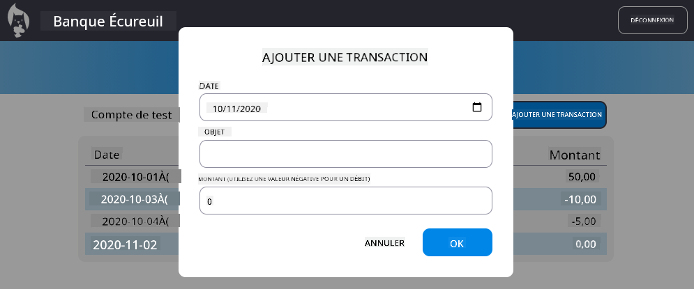

<!--
CO_OP_TRANSLATOR_METADATA:
{
  "original_hash": "b46acf79da8550d76445eed00b06c878",
  "translation_date": "2025-10-03T12:44:06+00:00",
  "source_file": "7-bank-project/4-state-management/README.md",
  "language_code": "fr"
}
-->
# Créer une application bancaire Partie 4 : Concepts de gestion d'état

## Quiz avant le cours

[Quiz avant le cours](https://ff-quizzes.netlify.app/web/quiz/47)

### Introduction

À mesure qu'une application web se développe, il devient difficile de suivre tous les flux de données. Quel code obtient les données, quelle page les utilise, où et quand elles doivent être mises à jour... il est facile de se retrouver avec un code désordonné et difficile à maintenir. Cela est particulièrement vrai lorsque vous devez partager des données entre différentes pages de votre application, comme les données utilisateur. Le concept de *gestion d'état* a toujours existé dans tous les types de programmes, mais avec la complexité croissante des applications web, il est désormais essentiel d'y réfléchir dès le développement.

Dans cette dernière partie, nous allons examiner l'application que nous avons construite pour repenser la gestion de l'état, permettant de prendre en charge le rafraîchissement du navigateur à tout moment et de conserver les données entre les sessions utilisateur.

### Prérequis

Vous devez avoir terminé la partie [récupération de données](../3-data/README.md) de l'application web pour cette leçon. Vous devez également installer [Node.js](https://nodejs.org) et [exécuter l'API serveur](../api/README.md) localement afin de pouvoir gérer les données de compte.

Vous pouvez tester que le serveur fonctionne correctement en exécutant cette commande dans un terminal :

```sh
curl http://localhost:5000/api
# -> should return "Bank API v1.0.0" as a result
```

---

## Repenser la gestion d'état

Dans la [leçon précédente](../3-data/README.md), nous avons introduit un concept basique d'état dans notre application avec la variable globale `account` qui contient les données bancaires de l'utilisateur actuellement connecté. Cependant, notre implémentation actuelle présente quelques défauts. Essayez de rafraîchir la page lorsque vous êtes sur le tableau de bord. Que se passe-t-il ?

Il y a trois problèmes avec le code actuel :

- L'état n'est pas conservé, un rafraîchissement du navigateur vous ramène à la page de connexion.
- Plusieurs fonctions modifient l'état. À mesure que l'application se développe, cela peut rendre difficile le suivi des changements et il est facile d'oublier de mettre à jour une partie.
- L'état n'est pas nettoyé, donc lorsque vous cliquez sur *Déconnexion*, les données du compte sont toujours présentes même si vous êtes sur la page de connexion.

Nous pourrions mettre à jour notre code pour résoudre ces problèmes un par un, mais cela entraînerait une duplication de code et rendrait l'application plus complexe et difficile à maintenir. Ou nous pourrions prendre quelques minutes pour repenser notre stratégie.

> Quels problèmes essayons-nous vraiment de résoudre ici ?

La [gestion d'état](https://en.wikipedia.org/wiki/State_management) consiste à trouver une bonne approche pour résoudre ces deux problèmes particuliers :

- Comment garder les flux de données d'une application compréhensibles ?
- Comment maintenir les données d'état toujours synchronisées avec l'interface utilisateur (et vice versa) ?

Une fois ces problèmes résolus, tout autre problème que vous pourriez rencontrer pourrait déjà être corrigé ou devenir plus facile à résoudre. Il existe de nombreuses approches possibles pour résoudre ces problèmes, mais nous opterons pour une solution courante qui consiste à **centraliser les données et les moyens de les modifier**. Les flux de données fonctionneraient ainsi :


> Nous ne couvrirons pas ici la partie où les données déclenchent automatiquement la mise à jour de la vue, car elle est liée à des concepts plus avancés de [programmation réactive](https://en.wikipedia.org/wiki/Reactive_programming). C'est un bon sujet à approfondir si vous êtes prêt à plonger plus profondément.

✅ Il existe de nombreuses bibliothèques avec différentes approches de gestion d'état, [Redux](https://redux.js.org) étant une option populaire. Consultez les concepts et les modèles utilisés, car cela peut souvent être un bon moyen d'apprendre quels problèmes potentiels vous pourriez rencontrer dans les grandes applications web et comment ils peuvent être résolus.

### Tâche

Nous allons commencer par un peu de refactoring. Remplacez la déclaration `account` :

```js
let account = null;
```

Par :

```js
let state = {
  account: null
};
```

L'idée est de *centraliser* toutes les données de notre application dans un seul objet d'état. Nous n'avons pour l'instant que `account` dans l'état, donc cela ne change pas grand-chose, mais cela ouvre la voie à des évolutions.

Nous devons également mettre à jour les fonctions qui l'utilisent. Dans les fonctions `register()` et `login()`, remplacez `account = ...` par `state.account = ...`;

Au début de la fonction `updateDashboard()`, ajoutez cette ligne :

```js
const account = state.account;
```

Ce refactoring en lui-même n'a pas apporté beaucoup d'améliorations, mais l'idée était de poser les bases des prochains changements.

## Suivre les changements de données

Maintenant que nous avons mis en place l'objet `state` pour stocker nos données, l'étape suivante consiste à centraliser les mises à jour. L'objectif est de faciliter le suivi de tout changement et de savoir quand ils se produisent.

Pour éviter que des modifications soient apportées à l'objet `state`, il est également recommandé de le considérer comme [*immuable*](https://en.wikipedia.org/wiki/Immutable_object), ce qui signifie qu'il ne peut pas être modifié du tout. Cela implique également que vous devez créer un nouvel objet d'état si vous souhaitez modifier quoi que ce soit. En procédant ainsi, vous vous protégez contre des [effets secondaires](https://en.wikipedia.org/wiki/Side_effect_(computer_science)) indésirables et ouvrez des possibilités pour de nouvelles fonctionnalités dans votre application, comme la mise en œuvre d'annulation/rétablissement, tout en facilitant le débogage. Par exemple, vous pourriez enregistrer chaque changement apporté à l'état et conserver un historique des modifications pour comprendre l'origine d'un bug.

En JavaScript, vous pouvez utiliser [`Object.freeze()`](https://developer.mozilla.org/docs/Web/JavaScript/Reference/Global_Objects/Object/freeze) pour créer une version immuable d'un objet. Si vous essayez de modifier un objet immuable, une exception sera levée.

✅ Connaissez-vous la différence entre un objet immuable *superficiel* et *profond* ? Vous pouvez en lire davantage [ici](https://developer.mozilla.org/docs/Web/JavaScript/Reference/Global_Objects/Object/freeze#What_is_shallow_freeze).

### Tâche

Créons une nouvelle fonction `updateState()` :

```js
function updateState(property, newData) {
  state = Object.freeze({
    ...state,
    [property]: newData
  });
}
```

Dans cette fonction, nous créons un nouvel objet d'état et copions les données de l'état précédent en utilisant le [*spread (`...`) operator*](https://developer.mozilla.org/docs/Web/JavaScript/Reference/Operators/Spread_syntax#Spread_in_object_literals). Ensuite, nous remplaçons une propriété particulière de l'objet d'état avec les nouvelles données en utilisant la [notation entre crochets](https://developer.mozilla.org/docs/Web/JavaScript/Guide/Working_with_Objects#Objects_and_properties) `[property]` pour l'affectation. Enfin, nous verrouillons l'objet pour empêcher les modifications en utilisant `Object.freeze()`. Pour l'instant, nous n'avons que la propriété `account` stockée dans l'état, mais avec cette approche, vous pouvez ajouter autant de propriétés que nécessaire.

Nous mettrons également à jour l'initialisation de `state` pour nous assurer que l'état initial est également figé :

```js
let state = Object.freeze({
  account: null
});
```

Après cela, mettez à jour la fonction `register` en remplaçant l'affectation `state.account = result;` par :

```js
updateState('account', result);
```

Faites de même avec la fonction `login`, en remplaçant `state.account = data;` par :

```js
updateState('account', data);
```

Nous allons maintenant en profiter pour résoudre le problème des données de compte qui ne sont pas effacées lorsque l'utilisateur clique sur *Déconnexion*.

Créez une nouvelle fonction `logout()` :

```js
function logout() {
  updateState('account', null);
  navigate('/login');
}
```

Dans `updateDashboard()`, remplacez la redirection `return navigate('/login');` par `return logout()`;

Essayez de créer un nouveau compte, de vous déconnecter et de vous reconnecter pour vérifier que tout fonctionne toujours correctement.

> Astuce : vous pouvez examiner tous les changements d'état en ajoutant `console.log(state)` à la fin de `updateState()` et en ouvrant la console dans les outils de développement de votre navigateur.

## Conserver l'état

La plupart des applications web ont besoin de conserver des données pour fonctionner correctement. Toutes les données critiques sont généralement stockées dans une base de données et accessibles via une API serveur, comme les données de compte utilisateur dans notre cas. Mais parfois, il est également intéressant de conserver certaines données dans l'application cliente qui s'exécute dans votre navigateur, pour une meilleure expérience utilisateur ou pour améliorer les performances de chargement.

Lorsque vous souhaitez conserver des données dans votre navigateur, il y a quelques questions importantes à vous poser :

- *Les données sont-elles sensibles ?* Vous devriez éviter de stocker des données sensibles côté client, comme les mots de passe utilisateur.
- *Pendant combien de temps avez-vous besoin de conserver ces données ?* Prévoyez-vous d'accéder à ces données uniquement pour la session en cours ou souhaitez-vous qu'elles soient stockées indéfiniment ?

Il existe plusieurs façons de stocker des informations dans une application web, en fonction de ce que vous souhaitez accomplir. Par exemple, vous pouvez utiliser les URL pour stocker une requête de recherche et la rendre partageable entre utilisateurs. Vous pouvez également utiliser les [cookies HTTP](https://developer.mozilla.org/docs/Web/HTTP/Cookies) si les données doivent être partagées avec le serveur, comme les informations d'[authentification](https://en.wikipedia.org/wiki/Authentication).

Une autre option consiste à utiliser l'une des nombreuses API de navigateur pour stocker des données. Deux d'entre elles sont particulièrement intéressantes :

- [`localStorage`](https://developer.mozilla.org/docs/Web/API/Window/localStorage) : un [Key/Value store](https://en.wikipedia.org/wiki/Key%E2%80%93value_database) permettant de conserver des données spécifiques au site web actuel entre différentes sessions. Les données enregistrées dans celui-ci n'expirent jamais.
- [`sessionStorage`](https://developer.mozilla.org/docs/Web/API/Window/sessionStorage) : celui-ci fonctionne de la même manière que `localStorage`, sauf que les données stockées sont effacées lorsque la session se termine (lorsque le navigateur est fermé).

Notez que ces deux API permettent uniquement de stocker des [chaînes de caractères](https://developer.mozilla.org/docs/Web/JavaScript/Reference/Global_Objects/String). Si vous souhaitez stocker des objets complexes, vous devrez les sérialiser au format [JSON](https://developer.mozilla.org/docs/Web/JavaScript/Reference/Global_Objects/JSON) en utilisant [`JSON.stringify()`](https://developer.mozilla.org/docs/Web/JavaScript/Reference/Global_Objects/JSON/stringify).

✅ Si vous souhaitez créer une application web qui ne fonctionne pas avec un serveur, il est également possible de créer une base de données côté client en utilisant l'API [`IndexedDB`](https://developer.mozilla.org/docs/Web/API/IndexedDB_API). Celle-ci est réservée à des cas d'utilisation avancés ou si vous devez stocker une quantité importante de données, car elle est plus complexe à utiliser.

### Tâche

Nous voulons que nos utilisateurs restent connectés jusqu'à ce qu'ils cliquent explicitement sur le bouton *Déconnexion*, donc nous utiliserons `localStorage` pour stocker les données du compte. Tout d'abord, définissons une clé que nous utiliserons pour stocker nos données.

```js
const storageKey = 'savedAccount';
```

Ajoutez ensuite cette ligne à la fin de la fonction `updateState()` :

```js
localStorage.setItem(storageKey, JSON.stringify(state.account));
```

Avec cela, les données du compte utilisateur seront conservées et toujours à jour, car nous avons centralisé toutes nos mises à jour d'état précédemment. C'est ici que nous commençons à bénéficier de tous nos refactorings précédents 🙂.

Comme les données sont enregistrées, nous devons également nous occuper de leur restauration lorsque l'application est chargée. Étant donné que nous commencerons à avoir plus de code d'initialisation, il peut être judicieux de créer une nouvelle fonction `init`, qui inclut également notre code précédent en bas de `app.js` :

```js
function init() {
  const savedAccount = localStorage.getItem(storageKey);
  if (savedAccount) {
    updateState('account', JSON.parse(savedAccount));
  }

  // Our previous initialization code
  window.onpopstate = () => updateRoute();
  updateRoute();
}

init();
```

Ici, nous récupérons les données enregistrées, et s'il y en a, nous mettons à jour l'état en conséquence. Il est important de faire cela *avant* de mettre à jour la route, car il pourrait y avoir du code qui dépend de l'état lors de la mise à jour de la page.

Nous pouvons également faire de la page *Tableau de bord* la page par défaut de notre application, car nous conservons maintenant les données du compte. Si aucune donnée n'est trouvée, le tableau de bord s'occupe de rediriger vers la page *Connexion* de toute façon. Dans `updateRoute()`, remplacez le fallback `return navigate('/login');` par `return navigate('/dashboard');`.

Connectez-vous maintenant à l'application et essayez de rafraîchir la page. Vous devriez rester sur le tableau de bord. Avec cette mise à jour, nous avons résolu tous nos problèmes initiaux...

## Rafraîchir les données

...Mais nous pourrions également en avoir créé un nouveau. Oups !

Accédez au tableau de bord en utilisant le compte `test`, puis exécutez cette commande dans un terminal pour créer une nouvelle transaction :

```sh
curl --request POST \
     --header "Content-Type: application/json" \
     --data "{ \"date\": \"2020-07-24\", \"object\": \"Bought book\", \"amount\": -20 }" \
     http://localhost:5000/api/accounts/test/transactions
```

Essayez maintenant de rafraîchir votre page de tableau de bord dans le navigateur. Que se passe-t-il ? Voyez-vous la nouvelle transaction ?

L'état est conservé indéfiniment grâce à `localStorage`, mais cela signifie également qu'il n'est jamais mis à jour jusqu'à ce que vous vous déconnectiez de l'application et vous reconnectiez !

Une stratégie possible pour résoudre cela est de recharger les données du compte chaque fois que le tableau de bord est chargé, afin d'éviter des données obsolètes.

### Tâche

Créez une nouvelle fonction `updateAccountData` :

```js
async function updateAccountData() {
  const account = state.account;
  if (!account) {
    return logout();
  }

  const data = await getAccount(account.user);
  if (data.error) {
    return logout();
  }

  updateState('account', data);
}
```

Cette méthode vérifie que nous sommes actuellement connectés, puis recharge les données du compte depuis le serveur.

Créez une autre fonction nommée `refresh` :

```js
async function refresh() {
  await updateAccountData();
  updateDashboard();
}
```

Celle-ci met à jour les données du compte, puis s'occupe de mettre à jour le HTML de la page du tableau de bord. C'est ce que nous devons appeler lorsque la route du tableau de bord est chargée. Mettez à jour la définition de la route avec :

```js
const routes = {
  '/login': { templateId: 'login' },
  '/dashboard': { templateId: 'dashboard', init: refresh }
};
```

Essayez maintenant de recharger le tableau de bord, il devrait afficher les données du compte mises à jour.

---

## 🚀 Défi

Maintenant que nous rechargeons les données du compte chaque fois que le tableau de bord est chargé, pensez-vous que nous avons encore besoin de conserver *toutes les données du compte* ?

Essayez de travailler ensemble pour modifier ce qui est enregistré et chargé depuis `localStorage` afin d'inclure uniquement ce qui est absolument nécessaire au fonctionnement de l'application.

## Quiz après le cours
[Quiz après le cours](https://ff-quizzes.netlify.app/web/quiz/48)

## Devoir

[Implémenter la boîte de dialogue "Ajouter une transaction"](assignment.md)

Voici un exemple de résultat après avoir terminé le devoir :



---

**Avertissement** :  
Ce document a été traduit à l'aide du service de traduction automatique [Co-op Translator](https://github.com/Azure/co-op-translator). Bien que nous nous efforcions d'assurer l'exactitude, veuillez noter que les traductions automatiques peuvent contenir des erreurs ou des inexactitudes. Le document original dans sa langue d'origine doit être considéré comme la source faisant autorité. Pour des informations critiques, il est recommandé de recourir à une traduction humaine professionnelle. Nous ne sommes pas responsables des malentendus ou des interprétations erronées résultant de l'utilisation de cette traduction.