<!--
CO_OP_TRANSLATOR_METADATA:
{
  "original_hash": "a9a3bcc037a447e2d8994d99e871cd9f",
  "translation_date": "2026-01-06T06:11:38+00:00",
  "source_file": "8-code-editor/1-using-a-code-editor/README.md",
  "language_code": "fr"
}
-->
# Utilisation d’un Éditeur de Code : Maîtriser VSCode.dev

Vous vous rappelez dans *The Matrix* quand Neo devait se brancher à un immense terminal informatique pour accéder au monde numérique ? Les outils de développement web actuels racontent une histoire opposée – des capacités incroyablement puissantes accessibles de partout. VSCode.dev est un éditeur de code basé sur navigateur qui apporte des outils de développement professionnels sur n’importe quel appareil disposant d’une connexion internet.

Tout comme l’imprimerie a rendu les livres accessibles à tous, pas seulement aux scribes dans les monastères, VSCode.dev démocratise le codage. Vous pouvez travailler sur des projets depuis un ordinateur de bibliothèque, un labo scolaire, ou n’importe où où vous avez accès au navigateur. Pas d’installation, pas de limitations du type « j’ai besoin de ma configuration spécifique ».

À la fin de cette leçon, vous comprendrez comment naviguer dans VSCode.dev, ouvrir des dépôts GitHub directement dans votre navigateur, et utiliser Git pour le contrôle de version – toutes des compétences que les développeurs professionnels utilisent quotidiennement.

## ⚡ Ce Que Vous Pouvez Faire Dans Les 5 Prochaines Minutes

**Chemin de démarrage rapide pour développeurs occupés**


- **Minute 1** : Accédez à [vscode.dev](https://vscode.dev) - aucune installation nécessaire
- **Minute 2** : Connectez-vous avec GitHub pour relier vos dépôts
- **Minute 3** : Essayez l’astuce URL : remplacez `github.com` par `vscode.dev/github` dans n’importe quelle URL de dépôt
- **Minute 4** : Créez un nouveau fichier et regardez la coloration syntaxique fonctionner automatiquement
- **Minute 5** : Faites une modification et validez-la via le panneau Contrôle de Source

**URL de test rapide** :
```
# Transform this:
github.com/microsoft/Web-Dev-For-Beginners

# Into this:
vscode.dev/github/microsoft/Web-Dev-For-Beginners
```

**Pourquoi c’est important** : En 5 minutes, vous expérimenterez la liberté de coder partout avec des outils professionnels. Cela représente l’avenir du développement – accessible, puissant, et immédiat.

## 🗺️ Votre Parcours d’Apprentissage à Travers le Développement Basé sur le Cloud

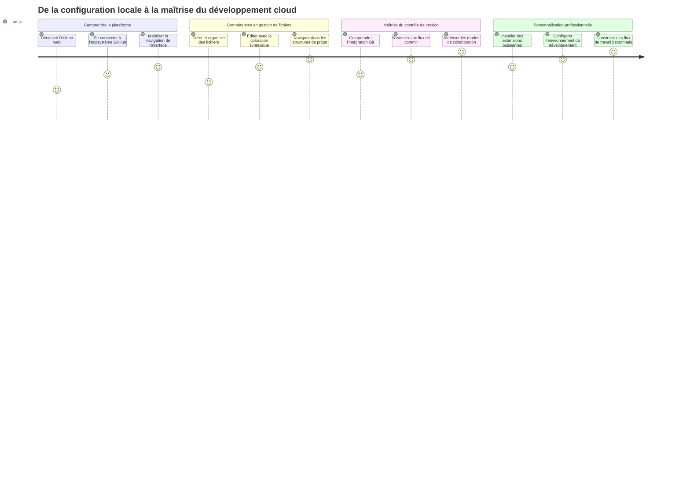
**Votre destination d’apprentissage** : À la fin de cette leçon, vous aurez maîtrisé un environnement de développement cloud professionnel qui fonctionne depuis n’importe quel appareil, vous permettant de coder avec les mêmes outils que les développeurs des grandes entreprises tech.

## Ce Que Vous Apprendrez

Après avoir parcouru ceci ensemble, vous serez capable de :

- Naviguer dans VSCode.dev comme si c’était votre second chez-vous – trouver tout ce dont vous avez besoin sans vous perdre
- Ouvrir n’importe quel dépôt GitHub dans votre navigateur et commencer à éditer immédiatement (c’est assez magique !)
- Utiliser Git pour suivre vos modifications et sauvegarder votre progression comme un pro
- Booster votre éditeur avec des extensions qui rendent le codage plus rapide et plus ludique
- Créer et organiser vos fichiers projets avec assurance

## Ce Dont Vous Aurez Besoin

Les prérequis sont simples :

- Un compte [GitHub gratuit](https://github.com) (nous vous guiderons pour la création si nécessaire)
- Une familiarité de base avec les navigateurs web
- La leçon GitHub Basics fournit un contexte utile, bien que non essentiel

> 💡 **Nouveau sur GitHub ?** Créer un compte est gratuit et prend quelques minutes. Comme une carte de bibliothèque vous donne accès aux livres dans le monde entier, un compte GitHub ouvre les portes des dépôts de code sur tout Internet.

## 🧠 Aperçu de l’Écosystème de Développement Cloud

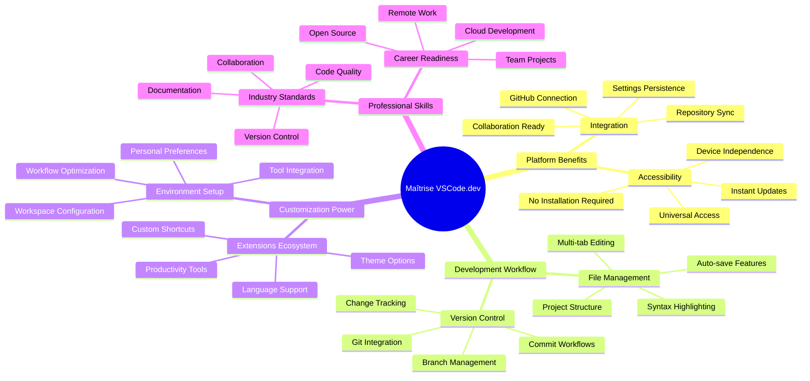
**Principe Fondamental** : Les environnements de développement basés sur le cloud représentent l’avenir du codage – fournissant des outils professionnels accessibles, collaboratifs et indépendants de la plateforme.

## Pourquoi Les Éditeurs de Code Basés sur le Web Comptent

Avant Internet, les chercheurs dans différentes universités ne pouvaient pas facilement partager leurs recherches. Puis est arrivé ARPANET dans les années 1960, reliant des ordinateurs à distance. Les éditeurs de code basés sur le web suivent ce même principe – rendre des outils puissants accessibles quel que soit votre emplacement physique ou votre appareil.

Un éditeur de code sert d’espace de travail de développement, où vous écrivez, éditez et organisez vos fichiers de code. Contrairement à de simples éditeurs de texte, les éditeurs de code professionnels fournissent la coloration syntaxique, la détection d’erreurs et des fonctionnalités de gestion de projet.

VSCode.dev apporte ces capacités dans votre navigateur :

**Avantages de l’édition basée sur le web :**

| Fonctionnalité | Description | Bénéfice Pratique |
|----------------|-------------|-------------------|
| **Indépendance de la plateforme** | Fonctionne sur n’importe quel appareil avec un navigateur | Travaillez sur différents ordinateurs sans accroc |
| **Aucune installation requise** | Accès via une URL web | Contourne les restrictions d’installation logicielle |
| **Mises à jour automatiques** | Fonctionne toujours avec la dernière version | Accès aux nouvelles fonctionnalités sans mises à jour manuelles |
| **Intégration de dépôt** | Connexion directe à GitHub | Éditez du code sans gérer les fichiers localement |

**Implications pratiques :**
- Continuité de travail entre différents environnements
- Interface cohérente peu importe le système d’exploitation
- Capacités immédiates de collaboration
- Réduction des besoins de stockage local

## Explorer VSCode.dev

Tout comme le laboratoire de Marie Curie contenait des équipements sophistiqués dans un espace relativement simple, VSCode.dev regroupe des outils de développement professionnels dans une interface navigateur. Cette application web fournit la même fonctionnalité de base que les éditeurs de code de bureau.

Commencez par naviguer sur [vscode.dev](https://vscode.dev) dans votre navigateur. L’interface charge sans téléchargement ni installation système – une application directe des principes du cloud computing.

### Connecter Votre Compte GitHub

À l’image du téléphone d’Alexander Graham Bell qui reliait des lieux distants, relier votre compte GitHub fait le pont entre VSCode.dev et vos dépôts de code. Lorsque vous êtes invité à vous connecter avec GitHub, il est recommandé d’accepter cette liaison.

**L’intégration GitHub fournit :**
- Accès direct à vos dépôts depuis l’éditeur
- Paramètres et extensions synchronisés entre appareils
- Flux de sauvegarde simplifié vers GitHub
- Environnement de développement personnalisé

### Faire Connaissance Avec Votre Nouvel Espace de Travail

Une fois que tout est chargé, vous verrez un espace de travail joliment épuré, conçu pour vous garder concentré sur l’essentiel – votre code !


**Voici votre visite du quartier :**
- **Barre d’activité** (la bande sur la gauche) : votre navigation principale avec Explorateur 📁, Recherche 🔍, Contrôle de Source 🌿, Extensions 🧩, et Paramètres ⚙️
- **Barre latérale** (le panneau à côté) : change pour vous montrer des infos pertinentes selon votre sélection
- **Zone d’édition** (le grand espace au milieu) : c’est là que la magie opère – votre espace principal de codage

**Prenez un moment pour explorer :**
- Cliquez sur les icônes de la Barre d’activité et voyez ce que chacune fait
- Remarquez comment la barre latérale change pour afficher différentes informations – plutôt sympa, non ?
- La vue Explorateur (📁) est probablement là où vous passerez le plus de temps, alors familiarisez-vous avec

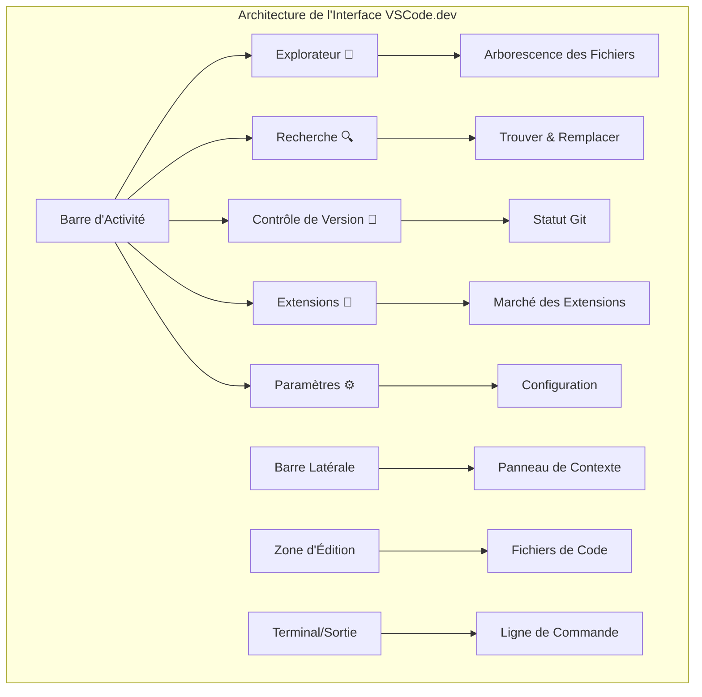
## Ouvrir des Dépôts GitHub

Avant Internet, les chercheurs devaient se déplacer physiquement dans des bibliothèques pour accéder aux documents. Les dépôts GitHub fonctionnent de façon similaire – ce sont des collections de code stockées à distance. VSCode.dev élimine l’étape classique de téléchargement des dépôts sur votre machine locale avant de les éditer.

Cette capacité permet un accès immédiat à n’importe quel dépôt public pour consulter, modifier ou contribuer. Voici deux méthodes pour ouvrir des dépôts :

### Méthode 1 : Le Maniement Par Clic

Parfait quand vous commencez dans VSCode.dev et souhaitez ouvrir un dépôt spécifique. C’est simple et adapté aux débutants :

**Voici comment faire :**

1. Rendez-vous sur [vscode.dev](https://vscode.dev) si vous n’y êtes pas encore
2. Cherchez le bouton "Open Remote Repository" sur l’écran d’accueil et cliquez dessus

   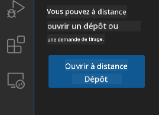

3. Collez l’URL de n’importe quel dépôt GitHub (essayez celui-ci : `https://github.com/microsoft/Web-Dev-For-Beginners`)
4. Appuyez sur Entrée et regardez la magie opérer !

**Astuce pro – Le raccourci Palette de Commandes :**

Envie de vous sentir comme un magicien du code ? Essayez ce raccourci clavier : Ctrl+Shift+P (ou Cmd+Shift+P sur Mac) pour ouvrir la Palette de Commandes :

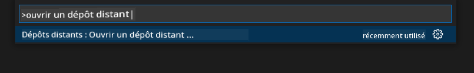

**La Palette de Commandes, c’est comme un moteur de recherche pour tout ce que vous pouvez faire :**
- Tapez "open remote" et elle vous trouvera l’outil pour ouvrir un dépôt
- Elle se souvient des dépôts que vous avez ouverts récemment (très pratique !)
- Une fois habitué, vous aurez l’impression de coder à la vitesse de l’éclair
- C’est en quelque sorte la version VSCode.dev de "Hey Siri, mais pour coder"

### Méthode 2 : La Technique de Modification d’URL

Comme HTTP et HTTPS utilisent des protocoles différents tout en conservant la même structure de domaine, VSCode.dev utilise un modèle d’URL qui reflète le système d’adressage de GitHub. N’importe quelle URL de dépôt GitHub peut être modifiée pour s’ouvrir directement dans VSCode.dev.

**Modèle de transformation d’URL :**

| Type de Dépôt | URL GitHub | URL VSCode.dev |
|---------------|------------|----------------|
| **Dépôt Public** | `github.com/microsoft/Web-Dev-For-Beginners` | `vscode.dev/github/microsoft/Web-Dev-For-Beginners` |
| **Projet Personnel** | `github.com/votre-nom/utilisateur-mon-projet` | `vscode.dev/github/votre-nom/utilisateur-mon-projet` |
| **N’importe Quel Dépôt Accessible** | `github.com/leur-nom/utilisateur-depot-genial` | `vscode.dev/github/leur-nom/utilisateur-depot-genial` |

**Mise en œuvre :**
- Remplacez `github.com` par `vscode.dev/github`
- Conservez tous les autres composants de l’URL inchangés
- Fonctionne avec n’importe quel dépôt public accessible
- Offre un accès immédiat à l’édition

> 💡 **Astuce qui change la vie** : Mettez en favoris les versions VSCode.dev de vos dépôts préférés. J’ai des favoris comme "Modifier Mon Portfolio" et "Corriger Documentation" qui me mènent directement en mode édition !

**Quelle méthode utiliser ?**
- **La méthode interface** : Idéale quand vous explorez ou ne vous souvenez plus des noms exacts des dépôts
- **L’astuce URL** : Parfaite pour un accès ultra-rapide quand vous savez exactement où aller

### 🎯 Check-pédagogique : Accès au Développement Cloud

**Pause et réflexion** : Vous venez d’apprendre deux méthodes pour accéder aux dépôts de code via un navigateur web. Cela représente un changement fondamental dans la manière dont fonctionne le développement.

**Auto-évaluation rapide** :
- Pouvez-vous expliquer pourquoi l’édition basée sur le web élimine la configuration traditionnelle d’un environnement de développement ?
- Quels avantages la technique de modification d’URL offre-t-elle par rapport au clonage git local ?
- Comment cette approche change-t-elle votre manière de contribuer aux projets open source ?

**Lien avec le monde réel** : Des grandes entreprises comme GitHub, GitLab, et Replit ont bâti leurs plateformes de développement sur ces principes "cloud-first". Vous apprenez les mêmes flux de travail utilisés par des équipes professionnelles de développement à travers le monde.

**Question défi** : Comment le développement basé sur le cloud pourrait-il changer la manière dont le codage est enseigné dans les écoles ? Pensez aux exigences matérielles, à la gestion logicielle, et aux possibilités collaboratives.

## Travailler Avec Les Fichiers et Projets

Maintenant que vous avez un dépôt ouvert, commençons à construire ! VSCode.dev vous donne tout ce dont vous avez besoin pour créer, éditer et organiser vos fichiers de code. Pensez-y comme à votre atelier digital – chaque outil est là où vous en avez besoin.

Entrons dans les tâches quotidiennes qui constitueront la majeure partie de votre flux de travail de codage.

### Créer de Nouveaux Fichiers

Comme organiser des plans dans le bureau d’un architecte, la création de fichiers dans VSCode.dev suit une approche structurée. Le système supporte tous les types de fichiers standards du développement web.

**Processus de création de fichier :**

1. Naviguez vers le dossier cible dans la barre latérale Explorateur
2. Survolez le nom du dossier pour faire apparaître l’icône "Nouveau Fichier" (📄+)
3. Entrez le nom du fichier incluant l’extension appropriée (`style.css`, `script.js`, `index.html`)
4. Appuyez sur Entrée pour créer le fichier

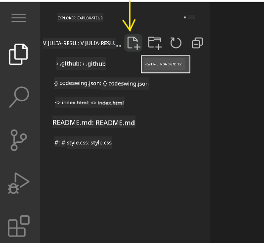

**Conventions de nommage :**
- Utilisez des noms descriptifs qui indiquent la fonction du fichier
- Incluez les extensions pour une coloration syntaxique correcte
- Suivez des schémas de nommage cohérents dans vos projets
- Employez des minuscules et des traits d’union à la place des espaces

### Éditer et Sauvegarder les Fichiers

C’est là que le vrai plaisir commence ! L’éditeur de VSCode.dev regorge de fonctionnalités utiles qui rendent le codage fluide et intuitif. C’est comme avoir un assistant d’écriture très intelligent, mais pour le code.

**Votre flux de travail d’édition :**

1. Cliquez sur n’importe quel fichier dans l’Explorateur pour l’ouvrir dans la zone principale
2. Commencez à taper et regardez VSCode.dev vous aider avec les couleurs, les suggestions et la détection d’erreurs
3. Sauvegardez votre travail avec Ctrl+S (Windows/Linux) ou Cmd+S (Mac) – même si l’enregistrement automatique est aussi actif !

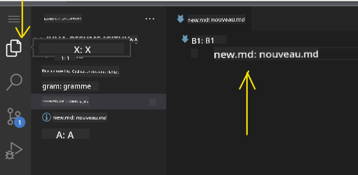

**Les choses cool qui se passent pendant que vous codez :**
- Votre code est joliment coloré pour le rendre facile à lire
- VSCode.dev suggère des complétions en tapant (comme la correction automatique, mais bien plus intelligente)
- Il détecte les fautes de frappe et erreurs avant même que vous sauvegardiez
- Vous pouvez avoir plusieurs fichiers ouverts dans des onglets, comme dans un navigateur
- Tout s’enregistre automatiquement en arrière-plan

> ⚠️ **Astuce rapide** : Même si l’enregistrement automatique est là pour vous, appuyer sur Ctrl+S ou Cmd+S reste une bonne habitude. Cela sauvegarde tout immédiatement et déclenche des fonctionnalités supplémentaires comme la vérification des erreurs.

### Contrôle de Version Avec Git

Comme les archéologues qui créent des registres détaillés des couches de fouilles, Git suit les changements dans votre code au fil du temps. Ce système préserve l’historique du projet et vous permet de revenir à des versions antérieures si nécessaire. VSCode.dev inclut une fonctionnalité Git intégrée.

**Interface Contrôle de Source :**

1. Accédez au panneau Contrôle de Source via l’icône 🌿 dans la Barre d’Activité
2. Les fichiers modifiés apparaissent dans la section "Modifications"
3. La coloration indique les types de changement : vert pour ajouts, rouge pour suppressions


**Sauvegarder votre travail (le flux de travail du commit) :**

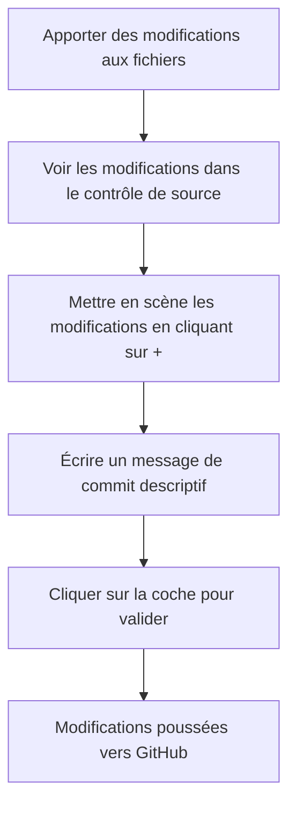
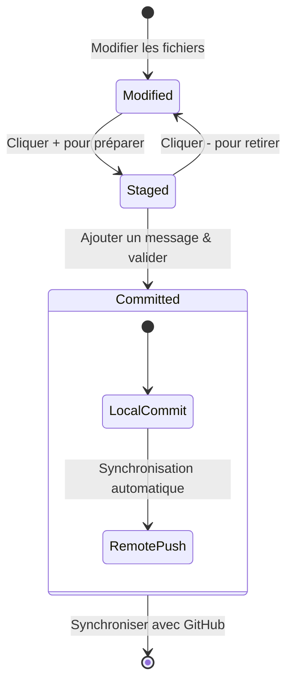
**Voici votre processus pas à pas :**
- Cliquez sur l’icône "+" à côté des fichiers que vous voulez sauvegarder (cela les "staging")
- Vérifiez une dernière fois que vous êtes satisfait de toutes vos modifications mises en scène
- Rédigez une courte note expliquant ce que vous avez fait (c’est votre « message de commit »)
- Cliquez sur le bouton avec la coche pour tout sauvegarder sur GitHub
- Si vous changez d’avis, l’icône d’annulation vous permet de rejeter les modifications

**Rédiger de bons messages de commit (c’est plus facile que vous ne le pensez !) :**
- Décrivez simplement ce que vous avez fait, par exemple « Ajouter un formulaire de contact » ou « Corriger la navigation cassée »
- Restez court et concis – pensez longueur tweet, pas dissertation
- Commencez par des verbes d’action comme « Ajouter », « Corriger », « Mettre à jour » ou « Supprimer »
- **Exemples efficaces** : « Ajouter un menu de navigation responsive », « Corriger les problèmes de mise en page mobile », « Mettre à jour les couleurs pour une meilleure accessibilité »

> 💡 **Conseil de navigation rapide** : Utilisez le menu hamburger (☰) en haut à gauche pour revenir rapidement à votre dépôt GitHub et voir vos modifications validées en ligne. C’est comme un portail entre votre environnement d’édition et la maison de votre projet sur GitHub !

## Améliorer les fonctionnalités avec des extensions

Tout comme un atelier d’artisan contient des outils spécialisés pour différentes tâches, VSCode.dev peut être personnalisé avec des extensions qui ajoutent des capacités spécifiques. Ces plugins développés par la communauté répondent aux besoins courants du développement comme le formatage du code, l’aperçu en direct et une intégration Git améliorée.

Le marketplace des extensions héberge des milliers d’outils gratuits créés par des développeurs du monde entier. Chaque extension résout des problèmes de flux de travail particuliers, vous permettant de construire un environnement de développement personnalisé adapté à vos besoins et préférences spécifiques.

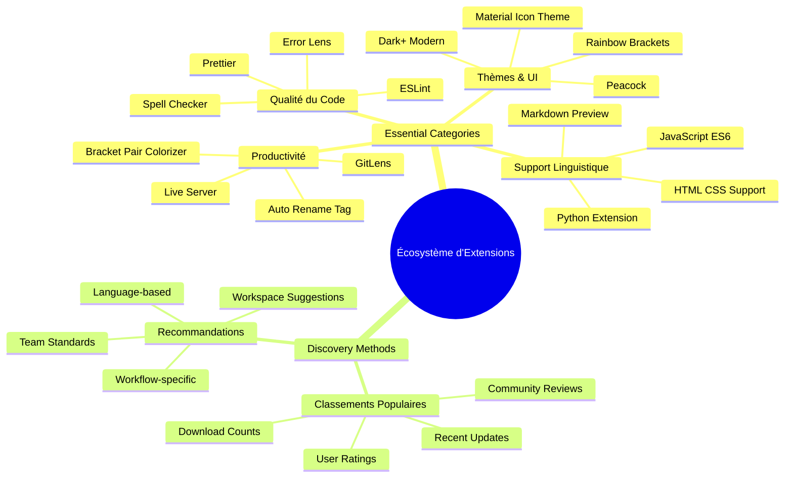
### Trouver vos extensions parfaites

Le marketplace des extensions est vraiment bien organisé, vous ne vous perdrez pas en cherchant ce dont vous avez besoin. Il est conçu pour vous aider à découvrir à la fois des outils spécifiques et des choses sympas dont vous ne soupçonniez même pas l’existence !

**Accéder au marketplace :**

1. Cliquez sur l’icône Extensions (🧩) dans la barre d’activité
2. Parcourez ou recherchez quelque chose de spécifique
3. Cliquez sur tout ce qui vous semble intéressant pour en savoir plus

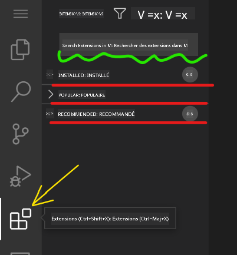

**Ce que vous y verrez :**

| Section | Contenu | Pourquoi c’est utile |
|----------|---------|----------|
| **Installées** | Extensions que vous avez déjà ajoutées | Votre boîte à outils personnelle de développement |
| **Populaires** | Les favoris du public | Ce à quoi la plupart des développeurs font confiance |
| **Recommandées** | Suggestions intelligentes pour votre projet | Les recommandations utiles de VSCode.dev |

**Ce qui rend la navigation facile :**
- Chaque extension affiche les notes, le nombre de téléchargements et des avis d’utilisateurs réels
- Vous avez des captures d’écran et des descriptions claires de ce que fait chaque extension
- Tout est clairement marqué avec des infos de compatibilité
- Des extensions similaires sont suggérées pour comparer les options

### Installer des extensions (C’est super facile !)

Ajouter de nouvelles fonctionnalités à votre éditeur est aussi simple que de cliquer sur un bouton. Les extensions s’installent en quelques secondes et fonctionnent immédiatement – pas besoin de redémarrer, pas d’attente.

**Voici tout ce que vous devez faire :**

1. Cherchez ce que vous voulez (essayez « live server » ou « prettier »)
2. Cliquez sur une extension qui vous plaît pour voir plus de détails
3. Lisez ce qu’elle fait et consultez les notes
4. Cliquez sur le bouton bleu « Installer » et c’est terminé !


**Ce qui se passe en coulisses :**
- L’extension se télécharge et s’installe automatiquement
- Les nouvelles fonctionnalités apparaissent immédiatement dans votre interface
- Tout commence à fonctionner tout de suite (sérieusement, c’est aussi rapide !)
- Si vous êtes connecté, l’extension se synchronise sur tous vos appareils

**Quelques extensions que je recommande de commencer à utiliser :**
- **Live Server** : Voir votre site web se mettre à jour en temps réel pendant que vous codez (celle-ci est magique !)
- **Prettier** : Rend votre code propre et professionnel automatiquement
- **Auto Rename Tag** : Changez une balise HTML et son partenaire se met aussi à jour
- **Bracket Pair Colorizer** : Colore vos parenthèses pour ne jamais vous perdre
- **GitLens** : Boostez vos fonctionnalités Git avec plein d’infos utiles

### Personnaliser vos extensions

La plupart des extensions proposent des paramètres que vous pouvez ajuster pour qu’elles fonctionnent exactement comme vous le souhaitez. C’est comme régler le siège et les rétroviseurs dans une voiture – chacun a ses préférences !

**Ajuster les paramètres d’une extension :**

1. Trouvez votre extension installée dans le panneau Extensions
2. Cherchez la petite icône d’engrenage (⚙️) à côté de son nom et cliquez dessus
3. Choisissez « Paramètres de l’extension » dans le menu déroulant
4. Modifiez les réglages jusqu’à ce que ce soit parfait pour votre flux de travail

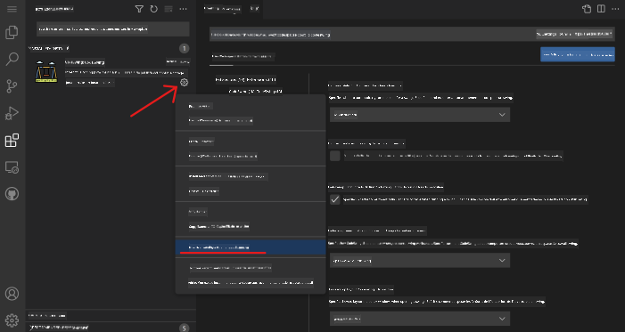

**Choses courantes que vous pourriez vouloir modifier :**
- Comment votre code est formaté (tabulations vs espaces, longueur des lignes, etc.)
- Quelles raccourcis clavier déclenchent quelles actions
- Sur quels types de fichiers l’extension doit fonctionner
- Activer ou désactiver certaines fonctionnalités pour rester organisé

### Garder vos extensions bien rangées

Au fur et à mesure que vous découvrez des extensions sympas, vous voudrez garder votre collection propre et fluide. VSCode.dev facilite vraiment cette gestion.

**Vos options de gestion des extensions :**

| Ce que vous pouvez faire | Quand c’est utile | Astuce pro |
|--------|---------|----------|
| **Désactiver** | Tester si une extension cause des problèmes | Mieux que désinstaller si vous voulez la récupérer plus tard |
| **Désinstaller** | Supprimer complètement les extensions inutiles | Garde votre environnement propre et rapide |
| **Mettre à jour** | Obtenir les dernières fonctionnalités et corrections | Se fait généralement automatiquement, mais ça vaut le coup de vérifier |

**Comment je gère mes extensions :**
- Tous les quelques mois, je fais le point sur ce que j’ai installé et supprime ce que je n’utilise pas
- Je garde mes extensions à jour pour avoir les dernières améliorations et sécurités
- Si quelque chose semble lent, je désactive temporairement des extensions pour identifier le coupable
- Je lis les notes de mise à jour lors des grosses versions – parfois il y a des nouveautés sympas !

> ⚠️ **Conseil performance** : Les extensions sont géniales, mais en avoir trop peut ralentir l’outil. Concentrez-vous sur celles qui améliorent vraiment votre vie et n’hésitez pas à supprimer celles que vous n’utilisez jamais.

### 🎯 Point pédagogique : Personnalisation de l’environnement de développement

**Compréhension de l’architecture** : Vous avez appris à personnaliser un environnement de développement professionnel avec des extensions créées par la communauté. Cela reflète comment les équipes d’entreprise créent des chaînes d’outils standardisées.

**Concepts clés maîtrisés** :
- **Découverte d’extensions** : Trouver des outils qui résolvent des défis spécifiques de développement
- **Configuration de l’environnement** : Personnaliser les outils selon vos préférences ou celles de l’équipe
- **Optimisation des performances** : Trouver l’équilibre entre fonctionnalités et performance système
- **Collaboration communautaire** : Exploiter des outils créés par la communauté mondiale de développeurs

**Lien avec l’industrie** : Les écosystèmes d’extensions alimentent des plateformes majeures comme VS Code, Chrome DevTools et les IDE modernes. Savoir évaluer, installer et configurer les extensions est essentiel pour les flux professionnels de développement.

**Question de réflexion** : Comment aborderiez-vous la mise en place d’un environnement de développement standardisé pour une équipe de 10 développeurs ? Réfléchissez à la cohérence, aux performances et aux préférences individuelles.

## 📈 Votre timeline de maîtrise du développement cloud

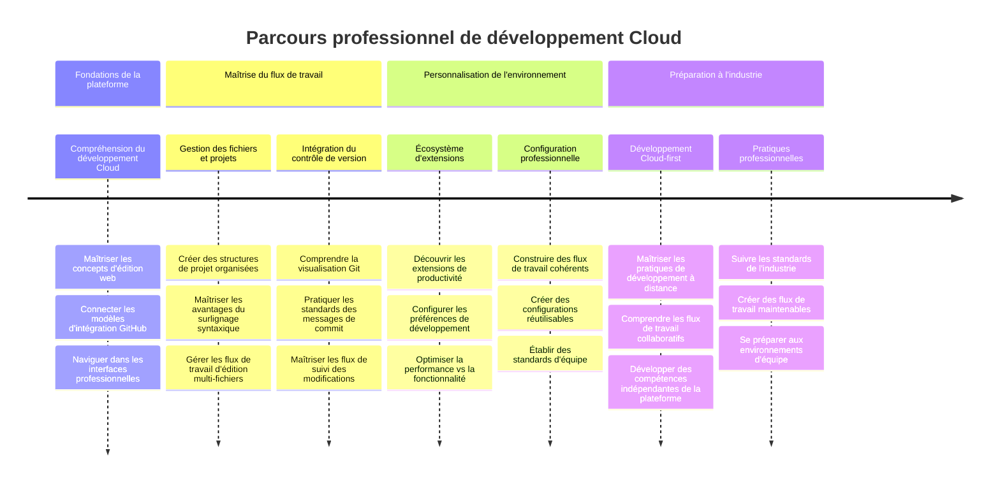
**🎓 Étape de graduation** : Vous avez maîtrisé avec succès le développement cloud utilisant les mêmes outils et flux professionnels employés par les développeurs de grandes entreprises technologiques. Ces compétences représentent le futur du développement logiciel.

**🔄 Capacités de niveau supérieur** :
- Prêt à explorer des plateformes avancées de développement cloud (Codespaces, GitPod)
- Préparé à travailler dans des équipes de développement distribuées
- Capable de contribuer à des projets open source à l’échelle mondiale
- Bases posées pour les pratiques modernes de DevOps et d’intégration continue

## Défi GitHub Copilot Agent 🚀

À l’image de l’approche structurée utilisée par la NASA pour les missions spatiales, ce défi consiste en une application systématique des compétences VSCode.dev dans un scénario complet de workflow.

**Objectif :** Démontrer une maîtrise de VSCode.dev en établissant un workflow complet de développement web.

**Exigences du projet :** Avec l’aide du mode Agent, réalisez ces tâches :
1. Forker un dépôt existant ou en créer un nouveau
2. Mettre en place une structure de projet fonctionnelle avec fichiers HTML, CSS et JavaScript
3. Installer et configurer trois extensions améliorant le développement
4. Pratiquer le contrôle de version avec des messages de commit descriptifs
5. Expérimenter la création et modification de branches fonctionnelles
6. Documenter le processus et les apprentissages dans un fichier README.md

Cet exercice consolide tous les concepts VSCode.dev en un workflow pratique applicable à vos futurs projets.

En savoir plus sur [le mode agent](https://code.visualstudio.com/blogs/2025/02/24/introducing-copilot-agent-mode).

## Exercice

Il est temps de mettre ces compétences en pratique ! J’ai un projet concret qui vous permettra de tout appliquer : [Créer un site web de CV avec VSCode.dev](./assignment.md)

Cet exercice vous guide pour construire un site web professionnel de CV entièrement dans votre navigateur. Vous utiliserez toutes les fonctionnalités VSCode.dev que nous avons explorées, et à la fin, vous aurez un site superbe et une confiance solide dans votre nouveau workflow.

## Continuez à explorer et développer vos compétences

Vous avez maintenant une base solide, mais il y a tellement d’autres choses passionnantes à découvrir ! Voici quelques ressources et idées pour faire passer vos compétences VSCode.dev au niveau supérieur :

**Documentation officielle à garder dans vos favoris :**
- [Documentation Web VSCode](https://code.visualstudio.com/docs/editor/vscode-web?WT.mc_id=academic-0000-alfredodeza) – Le guide complet pour éditer dans le navigateur
- [GitHub Codespaces](https://docs.github.com/en/codespaces) – Pour ceux qui veulent encore plus de puissance dans le cloud

**Fonctionnalités sympas à tester ensuite :**
- **Raccourcis clavier** : Apprenez les combinaisons qui vous feront vous sentir comme un ninja du code
- **Paramètres d’espace de travail** : Configurez différents environnements pour différents types de projets
- **Espaces de travail multi-racines** : Travaillez sur plusieurs dépôts en même temps (super pratique !)
- **Intégration du terminal** : Accédez aux outils en ligne de commande directement dans votre navigateur

**Idées de pratique :**
- Plongez dans des projets open source et contribuez via VSCode.dev – c’est une excellente façon de s’impliquer !
- Essayez différentes extensions pour trouver votre configuration idéale
- Créez des modèles de projet pour les types de sites que vous construisez le plus souvent
- Entraînez-vous aux workflows Git comme le branching et le merging – ces compétences sont précieuses en équipe

---

**Vous avez maîtrisé le développement dans le navigateur !** 🎉 Comme l’invention d’instruments portables a permis aux scientifiques de faire des recherches dans des lieux éloignés, VSCode.dev vous permet de coder professionnellement depuis n’importe quel appareil connecté à Internet.

Ces compétences reflètent les pratiques actuelles de l’industrie – de nombreux développeurs professionnels utilisent les environnements de développement cloud pour leur flexibilité et leur accessibilité. Vous avez appris un workflow qui s’adapte aussi bien aux projets individuels qu’aux grandes collaborations en équipe.

Appliquez ces techniques à votre prochain projet de développement ! 🚀

---

<!-- CO-OP TRANSLATOR DISCLAIMER START -->
**Avis de non-responsabilité** :  
Ce document a été traduit à l’aide du service de traduction automatique [Co-op Translator](https://github.com/Azure/co-op-translator). Bien que nous nous efforcions d’assurer l’exactitude, veuillez noter que les traductions automatiques peuvent contenir des erreurs ou des inexactitudes. Le document original dans sa langue d’origine doit être considéré comme la source faisant autorité. Pour les informations critiques, il est recommandé de recourir à une traduction professionnelle effectuée par un humain. Nous ne saurions être tenus responsables de tout malentendu ou mauvaise interprétation résultant de l’utilisation de cette traduction.
<!-- CO-OP TRANSLATOR DISCLAIMER END -->