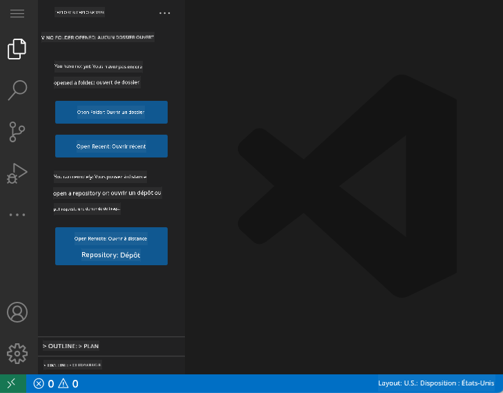
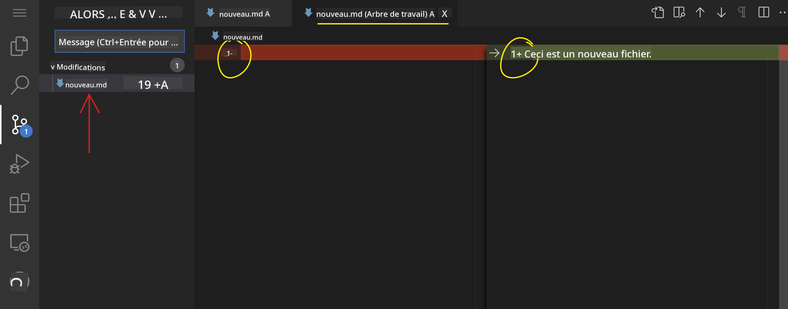

<!--
CO_OP_TRANSLATOR_METADATA:
{
  "original_hash": "1ba61d96a11309a2a6ea507496dcf7e5",
  "translation_date": "2025-08-29T13:43:07+00:00",
  "source_file": "8-code-editor/1-using-a-code-editor/README.md",
  "language_code": "fr"
}
-->
# Utiliser un éditeur de code

Cette leçon couvre les bases de l'utilisation de [VSCode.dev](https://vscode.dev), un éditeur de code basé sur le web, afin que vous puissiez modifier votre code et contribuer à un projet sans rien installer sur votre ordinateur.

## Objectifs d'apprentissage

Dans cette leçon, vous apprendrez à :

- Utiliser un éditeur de code dans un projet de programmation
- Suivre les modifications avec le contrôle de version
- Personnaliser l'éditeur pour le développement

### Prérequis

Avant de commencer, vous devrez créer un compte sur [GitHub](https://github.com). Rendez-vous sur [GitHub](https://github.com/) et créez un compte si ce n'est pas déjà fait.

### Introduction

Un éditeur de code est un outil essentiel pour écrire des programmes et collaborer sur des projets de programmation existants. Une fois que vous comprenez les bases d'un éditeur et comment utiliser ses fonctionnalités, vous pourrez les appliquer lors de l'écriture de code.

## Premiers pas avec VSCode.dev

[VSCode.dev](https://vscode.dev) est un éditeur de code accessible via le web. Vous n'avez pas besoin d'installer quoi que ce soit pour l'utiliser, tout comme ouvrir n'importe quel autre site web. Pour commencer avec l'éditeur, ouvrez le lien suivant : [https://vscode.dev](https://vscode.dev). Si vous n'êtes pas connecté à [GitHub](https://github.com/), suivez les instructions pour vous connecter ou créer un nouveau compte, puis connectez-vous.

Une fois chargé, l'interface devrait ressembler à cette image :



Il y a trois sections principales, de la gauche vers la droite :

1. La _barre d'activité_ qui inclut quelques icônes, comme la loupe 🔎, l'engrenage ⚙️, et quelques autres.
2. La barre d'activité étendue qui par défaut affiche l'_Explorateur_, appelée la _barre latérale_.
3. Enfin, la zone de code à droite.

Cliquez sur chacune des icônes pour afficher un menu différent. Une fois terminé, cliquez sur l'_Explorateur_ pour revenir à l'état initial.

Lorsque vous commencez à créer ou modifier du code, cela se fera dans la plus grande zone à droite. Vous utiliserez également cette zone pour visualiser du code existant, ce que vous ferez ensuite.

## Ouvrir un dépôt GitHub

La première chose à faire est d'ouvrir un dépôt GitHub. Il existe plusieurs façons d'ouvrir un dépôt. Dans cette section, vous découvrirez deux méthodes pour ouvrir un dépôt et commencer à travailler sur des modifications.

### 1. Avec l'éditeur

Utilisez l'éditeur lui-même pour ouvrir un dépôt distant. Si vous allez sur [VSCode.dev](https://vscode.dev), vous verrez un bouton _"Open Remote Repository"_ :


Vous pouvez également utiliser la palette de commandes. La palette de commandes est une boîte de saisie où vous pouvez taper n'importe quel mot faisant partie d'une commande ou d'une action pour trouver la commande appropriée à exécuter. Utilisez le menu en haut à gauche, puis sélectionnez _View_, et choisissez ensuite _Command Palette_, ou utilisez le raccourci clavier suivant : Ctrl-Shift-P (sur MacOS, ce serait Command-Shift-P).


Une fois le menu ouvert, tapez _open remote repository_, puis sélectionnez la première option. Plusieurs dépôts auxquels vous participez ou que vous avez ouverts récemment apparaîtront. Vous pouvez également utiliser une URL GitHub complète pour en sélectionner un. Utilisez l'URL suivante et collez-la dans la boîte :

```
https://github.com/microsoft/Web-Dev-For-Beginners
```

✅ Si cela fonctionne, vous verrez tous les fichiers de ce dépôt chargés dans l'éditeur de texte.

### 2. En utilisant l'URL

Vous pouvez également utiliser directement une URL pour charger un dépôt. Par exemple, l'URL complète du dépôt actuel est [https://github.com/microsoft/Web-Dev-For-Beginners](https://github.com/microsoft/Web-Dev-For-Beginners), mais vous pouvez remplacer le domaine GitHub par `VSCode.dev/github` et charger le dépôt directement. L'URL résultante serait [https://vscode.dev/github/microsoft/Web-Dev-For-Beginners](https://vscode.dev/github/microsoft/Web-Dev-For-Beginners).

## Modifier des fichiers

Une fois que vous avez ouvert le dépôt dans le navigateur/vscode.dev, l'étape suivante consiste à effectuer des mises à jour ou des modifications sur le projet.

### 1. Créer un nouveau fichier

Vous pouvez créer un fichier dans un dossier existant ou dans le répertoire/dossier racine. Pour créer un nouveau fichier, ouvrez un emplacement/dossier où vous souhaitez enregistrer le fichier, sélectionnez l'icône _'New file ...'_ sur la barre d'activité _(à gauche)_, donnez-lui un nom et appuyez sur Entrée.


### 2. Modifier et enregistrer un fichier dans le dépôt

Utiliser vscode.dev est utile lorsque vous souhaitez effectuer des mises à jour rapides sur votre projet sans avoir à charger de logiciel localement.  
Pour mettre à jour votre code, cliquez sur l'icône 'Explorer', également située sur la barre d'activité, pour afficher les fichiers et dossiers du dépôt.  
Sélectionnez un fichier pour l'ouvrir dans la zone de code, effectuez vos modifications et enregistrez.


Une fois que vous avez terminé de mettre à jour votre projet, sélectionnez l'icône _`source control`_ qui contient toutes les nouvelles modifications que vous avez apportées au dépôt.

Pour visualiser les modifications apportées à votre projet, sélectionnez les fichiers dans le dossier `Changes` de la barre d'activité étendue. Cela ouvrira un 'Working Tree' pour vous permettre de voir visuellement les modifications apportées au fichier. Le rouge indique une suppression dans le projet, tandis que le vert indique un ajout.



Si vous êtes satisfait des modifications apportées, survolez le dossier `Changes` et cliquez sur le bouton `+` pour préparer les modifications. Préparer signifie simplement préparer vos modifications pour les valider sur GitHub.

Si, cependant, vous n'êtes pas à l'aise avec certaines modifications et souhaitez les annuler, survolez le dossier `Changes` et sélectionnez l'icône `undo`.

Ensuite, saisissez un `commit message` _(Une description des modifications apportées au projet)_, cliquez sur l'icône de validation pour valider et pousser vos modifications.

Une fois que vous avez terminé de travailler sur votre projet, sélectionnez l'icône du menu hamburger en haut à gauche pour revenir au dépôt sur github.com.


## Utiliser des extensions

Installer des extensions sur VSCode vous permet d'ajouter de nouvelles fonctionnalités et des options de personnalisation à votre environnement de développement pour améliorer votre flux de travail. Ces extensions vous aident également à ajouter la prise en charge de plusieurs langages de programmation et sont souvent des extensions génériques ou basées sur des langages.

Pour parcourir la liste de toutes les extensions disponibles, cliquez sur l'icône _`Extensions`_ dans la barre d'activité et commencez à taper le nom de l'extension dans le champ de recherche intitulé _'Search Extensions in Marketplace'_.  
Vous verrez une liste d'extensions, chacune contenant **le nom de l'extension, le nom de l'éditeur, une description en une phrase, le nombre de téléchargements** et **une note en étoiles**.


Vous pouvez également voir toutes les extensions précédemment installées en développant le dossier _`Installed`_, les extensions populaires utilisées par la plupart des développeurs dans le dossier _`Popular`_, et les extensions recommandées pour vous, soit par les utilisateurs du même espace de travail, soit en fonction des fichiers récemment ouverts dans le dossier _`Recommended`_.


### 1. Installer des extensions

Pour installer une extension, tapez son nom dans le champ de recherche et cliquez dessus pour afficher des informations supplémentaires sur l'extension dans la zone de code une fois qu'elle apparaît dans la barre d'activité étendue.

Vous pouvez soit cliquer sur le _bouton bleu d'installation_ dans la barre d'activité étendue pour l'installer, soit utiliser le bouton d'installation qui apparaît dans la zone de code une fois que vous sélectionnez l'extension pour charger des informations supplémentaires.


### 2. Personnaliser les extensions

Après avoir installé l'extension, vous devrez peut-être modifier son comportement et la personnaliser en fonction de vos préférences. Pour ce faire, sélectionnez l'icône Extensions, et cette fois, votre extension apparaîtra dans le dossier _Installed_. Cliquez sur l'_**icône d'engrenage**_ et naviguez vers _Extensions Setting_.


### 3. Gérer les extensions

Après avoir installé et utilisé votre extension, vscode.dev propose des options pour gérer votre extension en fonction de différents besoins. Par exemple, vous pouvez choisir de :

- **Désactiver :** _(Vous désactivez temporairement une extension lorsque vous n'en avez plus besoin mais ne souhaitez pas la désinstaller complètement)_

    Sélectionnez l'extension installée dans la barre d'activité étendue > cliquez sur l'icône d'engrenage > sélectionnez 'Disable' ou 'Disable (Workspace)' **OU** ouvrez l'extension dans la zone de code et cliquez sur le bouton bleu Disable.

- **Désinstaller :** Sélectionnez l'extension installée dans la barre d'activité étendue > cliquez sur l'icône d'engrenage > sélectionnez 'Uninstall' **OU** ouvrez l'extension dans la zone de code et cliquez sur le bouton bleu Uninstall.

---

## Devoir

[Créer un site web de CV en utilisant vscode.dev](https://github.com/microsoft/Web-Dev-For-Beginners/blob/main/8-code-editor/1-using-a-code-editor/assignment.md)

## Révision et auto-apprentissage

Lisez-en davantage sur [VSCode.dev](https://code.visualstudio.com/docs/editor/vscode-web?WT.mc_id=academic-0000-alfredodeza) et certaines de ses autres fonctionnalités.

---

**Avertissement** :  
Ce document a été traduit à l'aide du service de traduction automatique [Co-op Translator](https://github.com/Azure/co-op-translator). Bien que nous nous efforcions d'assurer l'exactitude, veuillez noter que les traductions automatisées peuvent contenir des erreurs ou des inexactitudes. Le document original dans sa langue d'origine doit être considéré comme la source faisant autorité. Pour des informations critiques, il est recommandé de faire appel à une traduction humaine professionnelle. Nous déclinons toute responsabilité en cas de malentendus ou d'interprétations erronées résultant de l'utilisation de cette traduction.