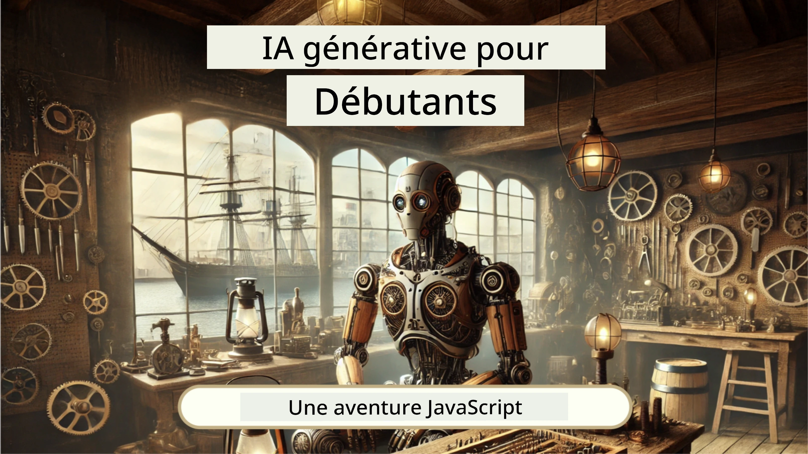
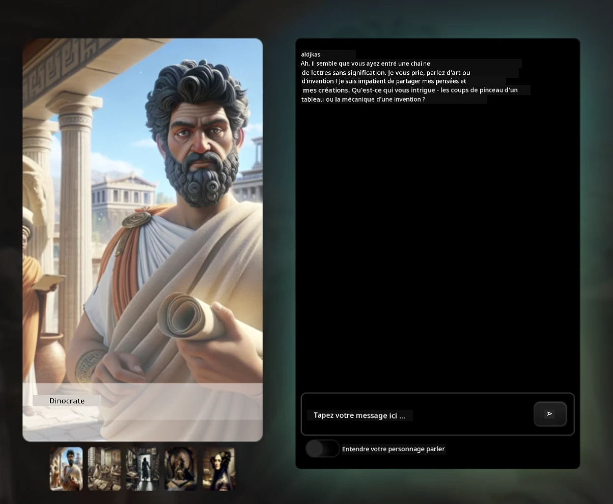
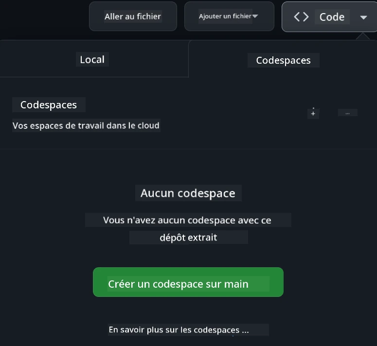

[](https://github.com/microsoft/Web-Dev-For-Beginners/blob/master/LICENSE)
[](https://GitHub.com/microsoft/Web-Dev-For-Beginners/graphs/contributors/)
[](https://GitHub.com/microsoft/Web-Dev-For-Beginners/issues/)
[](https://GitHub.com/microsoft/Web-Dev-For-Beginners/pulls/)
[](http://makeapullrequest.com) 

[](https://GitHub.com/microsoft/Web-Dev-For-Beginners/watchers/)
[](https://GitHub.com/microsoft/Web-Dev-For-Beginners/network/)
[](https://GitHub.com/microsoft/Web-Dev-For-Beginners/stargazers/)

[](https://discord.gg/nTYy5BXMWG)

# Développement Web pour Débutants - Un programme

Apprenez les fondamentaux du développement web avec notre cours complet de 12 semaines proposé par les défenseurs du cloud Microsoft. Chacune des 24 leçons explore JavaScript, CSS et HTML à travers des projets pratiques tels que des terrariums, des extensions de navigateur et des jeux spatiaux. Participez aux quiz, discussions et missions pratiques. Améliorez vos compétences et optimisez votre rétention des connaissances grâce à notre pédagogie efficace basée sur des projets. Commencez votre parcours de codage dès aujourd’hui !

Rejoignez la communauté Azure AI Foundry sur Discord

[](https://discord.gg/nTYy5BXMWG)

Suivez ces étapes pour commencer à utiliser ces ressources :
1. **Faites un Fork du dépôt** : Cliquez sur [](https://GitHub.com/microsoft/Web-Dev-For-Beginners/fork)
2. **Clonez le dépôt** :   `git clone https://github.com/microsoft/Web-Dev-For-Beginners.git`
3. [**Rejoignez le Discord Azure AI Foundry et rencontrez des experts et d’autres développeurs**](https://discord.com/invite/ByRwuEEgH4)

### 🌐 Support Multi-langue

#### Pris en charge via GitHub Action (Automatisé & Toujours à jour)

<!-- CO-OP TRANSLATOR LANGUAGES TABLE START -->
[Arabe](../ar/README.md) | [Bengali](../bn/README.md) | [Bulgare](../bg/README.md) | [Birman (Myanmar)](../my/README.md) | [Chinois (Simplifié)](../zh-CN/README.md) | [Chinois (Traditionnel, Hong Kong)](../zh-HK/README.md) | [Chinois (Traditionnel, Macao)](../zh-MO/README.md) | [Chinois (Traditionnel, Taïwan)](../zh-TW/README.md) | [Croate](../hr/README.md) | [Tchèque](../cs/README.md) | [Danois](../da/README.md) | [Néerlandais](../nl/README.md) | [Estonien](../et/README.md) | [Finnois](../fi/README.md) | [Français](./README.md) | [Allemand](../de/README.md) | [Grec](../el/README.md) | [Hébreu](../he/README.md) | [Hindi](../hi/README.md) | [Hongrois](../hu/README.md) | [Indonésien](../id/README.md) | [Italien](../it/README.md) | [Japonais](../ja/README.md) | [Kannada](../kn/README.md) | [Coréen](../ko/README.md) | [Lituanien](../lt/README.md) | [Malais](../ms/README.md) | [Malayalam](../ml/README.md) | [Marathi](../mr/README.md) | [Népalais](../ne/README.md) | [Pidgin nigérian](../pcm/README.md) | [Norvégien](../no/README.md) | [Persan (Farsi)](../fa/README.md) | [Polonais](../pl/README.md) | [Portugais (Brésil)](../pt-BR/README.md) | [Portugais (Portugal)](../pt-PT/README.md) | [Punjabi (Gurmukhi)](../pa/README.md) | [Roumain](../ro/README.md) | [Russe](../ru/README.md) | [Serbe (Cyrillique)](../sr/README.md) | [Slovaque](../sk/README.md) | [Slovène](../sl/README.md) | [Espagnol](../es/README.md) | [Swahili](../sw/README.md) | [Suédois](../sv/README.md) | [Tagalog (Filipino)](../tl/README.md) | [Tamoul](../ta/README.md) | [Télougou](../te/README.md) | [Thaï](../th/README.md) | [Turc](../tr/README.md) | [Ukrainien](../uk/README.md) | [Ourdou](../ur/README.md) | [Vietnamien](../vi/README.md)

> **Préférez-vous cloner localement ?**

> Ce dépôt contient plus de 50 traductions, ce qui augmente considérablement la taille du téléchargement. Pour cloner sans les traductions, utilisez le sparse checkout :
> ```bash
> git clone --filter=blob:none --sparse https://github.com/microsoft/Web-Dev-For-Beginners.git
> cd Web-Dev-For-Beginners
> git sparse-checkout set --no-cone '/*' '!translations' '!translated_images'
> ```
> Cela vous fournit tout ce dont vous avez besoin pour suivre le cours avec un téléchargement beaucoup plus rapide.
<!-- CO-OP TRANSLATOR LANGUAGES TABLE END -->

**Si vous souhaitez avoir des langues supplémentaires prises en charge, elles sont listées [ici](https://github.com/Azure/co-op-translator/blob/main/getting_started/supported-languages.md)**

[](https://open.vscode.dev/microsoft/Web-Dev-For-Beginners)

#### 🧑‍🎓 _Êtes-vous un étudiant ?_

Visitez la [**page Student Hub**](https://docs.microsoft.com/learn/student-hub/?WT.mc_id=academic-77807-sagibbon) où vous trouverez des ressources pour débutants, des packs étudiants et même des moyens d’obtenir un bon de certification gratuit. C’est la page à mettre en favori et à consulter régulièrement car nous mettons à jour le contenu chaque mois.

### 📣 Annonce - Nouveaux défis en mode GitHub Copilot Agent à réaliser !

Nouveau défi ajouté, cherchez "GitHub Copilot Agent Challenge 🚀" dans la plupart des chapitres. C’est un nouveau défi à réaliser en utilisant GitHub Copilot et le mode Agent. Si vous n’avez jamais utilisé le mode Agent, il est capable non seulement de générer du texte mais aussi de créer et éditer des fichiers, d’exécuter des commandes et plus encore.

### 📣 Annonce - _Nouveau projet à construire utilisant l’IA générative_ 

Nouveau projet Assistant IA ajouté, découvrez-le [projet](./9-chat-project/README.md)

### 📣 Annonce - _Nouveau programme_ sur l’IA générative pour JavaScript vient d’être publié

Ne manquez pas notre nouveau programme sur l’IA générative !

Visitez [https://aka.ms/genai-js-course](https://aka.ms/genai-js-course) pour commencer !



- Leçons couvrant tout, des bases au RAG.
- Interagissez avec des personnages historiques utilisant GenAI et notre application compagnon.
- Narration ludique et engageante, vous voyagez dans le temps !




Chaque leçon inclut une mission à accomplir, une vérification des connaissances et un défi pour vous guider sur des sujets comme :
- Le prompt et l’ingénierie des prompts
- Génération d’applications de texte et d’images
- Applications de recherche

Visitez [https://aka.ms/genai-js-course](https://aka.ms/genai-js-course) pour commencer !


## 🌱 Commencer

> **Enseignants**, nous avons [inclus quelques suggestions](for-teachers.md) sur la manière d’utiliser ce programme. Nous serions ravis d’avoir vos retours [sur notre forum de discussion](https://github.com/microsoft/Web-Dev-For-Beginners/discussions/categories/teacher-corner) !

**[Apprenants](https://aka.ms/student-page/?WT.mc_id=academic-77807-sagibbon)**, pour chaque leçon, commencez par un quiz avant le cours, puis poursuivez avec la lecture du matériel, la réalisation des différentes activités et vérifiez votre compréhension avec le quiz après le cours.

Pour enrichir votre expérience d’apprentissage, connectez-vous avec vos pairs pour travailler ensemble sur les projets ! Les discussions sont encouragées sur notre [forum de discussion](https://github.com/microsoft/Web-Dev-For-Beginners/discussions), où notre équipe de modérateurs sera disponible pour répondre à vos questions.

Pour approfondir votre formation, nous recommandons vivement d’explorer [Microsoft Learn](https://learn.microsoft.com/users/wirelesslife/collections/p1ddcy5jwy0jkm?WT.mc_id=academic-77807-sagibbon) pour des supports d’études supplémentaires.

### 📋 Installation de votre environnement

Ce programme dispose d’un environnement de développement prêt à l’emploi ! Au début, vous pouvez choisir d’exécuter le programme dans un [Codespace](https://github.com/features/codespaces/) (_un environnement basé sur navigateur, sans besoin d’installer quoi que ce soit_), ou localement sur votre ordinateur en utilisant un éditeur de texte tel que [Visual Studio Code](https://code.visualstudio.com/?WT.mc_id=academic-77807-sagibbon).

#### Créez votre dépôt
Pour enregistrer facilement votre travail, il est recommandé de créer votre propre copie de ce dépôt. Vous pouvez le faire en cliquant sur le bouton **Utiliser ce modèle** en haut de la page. Cela créera un nouveau dépôt sur votre compte GitHub avec une copie du programme.

Suivez ces étapes :
1. **Forkez le dépôt** : Cliquez sur le bouton "Fork" en haut à droite de cette page.
2. **Clonez le dépôt** :   `git clone https://github.com/microsoft/Web-Dev-For-Beginners.git`

#### Exécuter le programme dans un Codespace

Dans votre copie de ce dépôt que vous avez créée, cliquez sur le bouton **Code** puis sélectionnez **Open with Codespaces**. Cela créera un nouveau Codespace où travailler.



#### Exécuter le programme localement sur votre ordinateur

Pour exécuter ce programme localement sur votre ordinateur, vous aurez besoin d’un éditeur de texte, d’un navigateur et d’un outil en ligne de commande. Notre première leçon, [Introduction aux langages de programmation et outils du métier](../../1-getting-started-lessons/1-intro-to-programming-languages), vous guidera à travers les différentes options pour chacun de ces outils afin de sélectionner ce qui vous convient le mieux.

Nous recommandons d’utiliser [Visual Studio Code](https://code.visualstudio.com/?WT.mc_id=academic-77807-sagibbon) comme éditeur, qui inclut également un [Terminal](https://code.visualstudio.com/docs/terminal/basics/?WT.mc_id=academic-77807-sagibbon). Vous pouvez télécharger Visual Studio Code [ici](https://code.visualstudio.com/?WT.mc_id=academic-77807-sagibbon).


1. Clonez votre dépôt sur votre ordinateur. Vous pouvez le faire en cliquant sur le bouton **Code** et en copiant l’URL :

    [CodeSpace](./images/createcodespace.png)
    Ensuite, ouvrez [Terminal](https://code.visualstudio.com/docs/terminal/basics/?WT.mc_id=academic-77807-sagibbon) dans [Visual Studio Code](https://code.visualstudio.com/?WT.mc_id=academic-77807-sagibbon) et exécutez la commande suivante, en remplaçant `<your-repository-url>` par l’URL que vous venez de copier :

    ```bash 
    git clone <your-repository-url>
    ```

2. Ouvrez le dossier dans Visual Studio Code. Vous pouvez le faire en cliquant sur **Fichier** > **Ouvrir un dossier** et en sélectionnant le dossier que vous venez de cloner.


>  Extensions Visual Studio Code recommandées :
>
> * [Live Server](https://marketplace.visualstudio.com/items?itemName=ritwickdey.LiveServer&WT.mc_id=academic-77807-sagibbon) – pour prévisualiser les pages HTML dans Visual Studio Code
> * [Copilot](https://marketplace.visualstudio.com/items?itemName=GitHub.copilot&WT.mc_id=academic-77807-sagibbon) – pour vous aider à écrire du code plus rapidement

## 📂 Chaque leçon inclut :

- un sketchnote optionnel
- une vidéo complémentaire optionnelle
- un quiz d’échauffement avant la leçon
- la leçon écrite
- pour les leçons basées sur un projet, des guides étape par étape pour construire le projet
- des vérifications des connaissances
- un défi
- des lectures complémentaires
- un devoir
- un [quiz post-leçon](https://ff-quizzes.netlify.app/web/)

> **Une note à propos des quiz** : Tous les quiz sont contenus dans le dossier Quiz-app, 48 quiz au total composés de trois questions chacun. Ils sont disponibles [ici](https://ff-quizzes.netlify.app/web/) ; l’application quiz peut être exécutée localement ou déployée sur Azure ; suivez les instructions dans le dossier `quiz-app`.

## 🗃️ Leçons

|     |                       Nom du projet                       |                            Concepts enseignés                             | Objectifs d’apprentissage                                                                                                                 |                                                         Leçon liée                                                          |         Auteur          |
| :-: | :------------------------------------------------------: | :--------------------------------------------------------------------: | ----------------------------------------------------------------------------------------------------------------------------------- | :----------------------------------------------------------------------------------------------------------------------------: | :---------------------: |
| 01  |                     Prise en main                         |           Introduction à la programmation et aux outils du métier          | Apprendre les bases sous-jacentes de la plupart des langages de programmation et sur les logiciels qui aident les développeurs pros | [Introduction aux langages de programmation et outils du métier](./1-getting-started-lessons/1-intro-to-programming-languages/README.md) |         Jasmine         |
| 02  |                     Prise en main                         |             Bases de GitHub, travail collaboratif en équipe              | Comment utiliser GitHub dans votre projet, comment collaborer avec d’autres sur une base de code                                        |                            [Introduction à GitHub](./1-getting-started-lessons/2-github-basics/README.md)                             |          Floor          |
| 03  |                     Prise en main                         |                             Accessibilité                               | Apprendre les bases de l’accessibilité web                                                                                              |                       [Fondamentaux de l’accessibilité](./1-getting-started-lessons/3-accessibility/README.md)                     |       Christopher       |
| 04  |                        Bases JS                           |                         Types de données en JavaScript                  | Les bases des types de données JavaScript                                                                                                |                                       [Types de données](./2-js-basics/1-data-types/README.md)                                        |         Jasmine         |
| 05  |                        Bases JS                           |                         Fonctions et méthodes                           | Apprendre les fonctions et méthodes pour gérer le flux logique d’une application                                                        |                              [Fonctions et méthodes](./2-js-basics/2-functions-methods/README.md)                                    | Jasmine et Christopher  |
| 06  |                        Bases JS                           |                        Prise de décisions avec JS                       | Apprendre à créer des conditions dans votre code en utilisant des méthodes de prise de décision                                         |                                 [Prise de décisions](./2-js-basics/3-making-decisions/README.md)                                  |         Jasmine         |
| 07  |                        Bases JS                           |                            Tableaux et boucles                          | Travailler avec des données via des tableaux et des boucles en JavaScript                                                               |                                   [Tableaux et boucles](./2-js-basics/4-arrays-loops/README.md)                                    |         Jasmine         |
| 08  |       [Terrarium](./3-terrarium/solution/README.md)       |                            HTML en pratique                             | Construire le HTML pour créer un terrarium en ligne, en se concentrant sur la construction d’une mise en page                          |                                 [Introduction à HTML](./3-terrarium/1-intro-to-html/README.md)                                 |           Jen           |
| 09  |       [Terrarium](./3-terrarium/solution/README.md)       |                            CSS en pratique                              | Construire le CSS pour styliser le terrarium en ligne, en se concentrant sur les bases du CSS y compris le responsive design          |                                  [Introduction au CSS](./3-terrarium/2-intro-to-css/README.md)                                  |           Jen           |
| 10  |            [Terrarium](./3-terrarium/solution/README.md)            |                 Closures JavaScript, manipulation du DOM               | Construire le JavaScript pour faire fonctionner le terrarium comme une interface de glisser-déposer, en se concentrant sur les closures et la manipulation du DOM |                  [Closures JavaScript, manipulation du DOM](./3-terrarium/3-intro-to-DOM-and-closures/README.md)                   |           Jen           |
| 11  |          [Jeu de frappe](./4-typing-game/solution/README.md)          |                          Construire un jeu de frappe                   | Apprendre à utiliser les événements clavier pour piloter la logique de votre application JavaScript                                     |                                [Programmation événementielle](./4-typing-game/typing-game/README.md)                               |       Christopher       |
| 12  | [Extension navigateur verte](./5-browser-extension/solution/README.md) |                         Travailler avec les navigateurs                | Apprendre comment fonctionnent les navigateurs, leur histoire, et comment structurer les premiers éléments d’une extension            |                               [À propos des navigateurs](./5-browser-extension/1-about-browsers/README.md)                         |           Jen           |
| 13  | [Extension navigateur verte](./5-browser-extension/solution/README.md) | Construire un formulaire, appeler une API et stocker des variables localement | Construire les éléments JavaScript de votre extension navigateur pour appeler une API en utilisant des variables stockées localement  |                [API, formulaires, et stockage local](./5-browser-extension/2-forms-browsers-local-storage/README.md)               |           Jen           |
| 14  | [Extension navigateur verte](./5-browser-extension/solution/README.md) |        Processus en arrière-plan dans le navigateur, performance web   | Utiliser les processus en arrière-plan du navigateur pour gérer l’icône de l’extension ; apprendre les performances web et quelques optimisations        |             [Tâches en arrière-plan et performance](./5-browser-extension/3-background-tasks-and-performance/README.md)          |           Jen           |
| 15  |           [Jeu spatial](./6-space-game/solution/README.md)           |             Développement de jeux avancé avec JavaScript              | Apprendre l’héritage avec les classes et la composition ainsi que le modèle Pub/Sub, en préparation à la création d’un jeu            |                      [Introduction au développement avancé de jeux](./6-space-game/1-introduction/README.md)                      |          Chris          |
| 16  |           [Jeu spatial](./6-space-game/solution/README.md)           |                           Dessiner sur un canvas                       | Apprendre l’API Canvas, utilisée pour dessiner des éléments à l’écran                                                                  |                                [Dessiner sur Canvas](./6-space-game/2-drawing-to-canvas/README.md)                                 |          Chris          |
| 17  |           [Jeu spatial](./6-space-game/solution/README.md)           |                   Déplacer des éléments à l’écran                      | Découvrir comment donner du mouvement aux éléments à l’aide des coordonnées cartésiennes et de l’API Canvas                            |                           [Déplacement d’éléments](./6-space-game/3-moving-elements-around/README.md)                           |          Chris          |
| 18  |           [Jeu spatial](./6-space-game/solution/README.md)           |                          Détection de collision                        | Faire entrer en collision les éléments et réagir via des frappes clavier, et prévoir une fonction de temps de recharge pour assurer la performance du jeu     |                              [Détection de collision](./6-space-game/4-collision-detection/README.md)                            |          Chris          |
| 19  |           [Jeu spatial](./6-space-game/solution/README.md)           |                             Tenue du score                             | Effectuer des calculs mathématiques basés sur le statut et la performance du jeu                                                        |                                    [Gestion du score](./6-space-game/5-keeping-score/README.md)                                    |          Chris          |
| 20  |           [Jeu spatial](./6-space-game/solution/README.md)           |                     Fin et redémarrage du jeu                          | Apprendre à finir et redémarrer le jeu, y compris nettoyer les ressources et réinitialiser les variables                               |                                [Condition de fin](./6-space-game/6-end-condition/README.md)                                     |          Chris          |
| 21  |         [Application bancaire](./7-bank-project/solution/README.md)          |                 Modèles HTML et routes dans une application web       | Apprendre à créer le squelette d’un site multipage avec routage et modèles HTML                                                       |                            [Modèles HTML et routes](./7-bank-project/1-template-route/README.md)                                |          Yohan          |
| 22  |         [Application bancaire](./7-bank-project/solution/README.md)          |                  Construire un formulaire de connexion et d’inscription | Apprendre à construire des formulaires et gérer les routines de validation                                                            |                                           [Formulaires](./7-bank-project/2-forms/README.md)                                           |          Yohan          |
| 23  |         [Application bancaire](./7-bank-project/solution/README.md)          |                   Méthodes de récupération et d’utilisation des données | Comment les données circulent dans votre application, comment les récupérer, les stocker et les éliminer                             |                                            [Données](./7-bank-project/3-data/README.md)                                            |          Yohan          |
| 24  |         [Application bancaire](./7-bank-project/solution/README.md)          |                      Concepts de gestion de l’état                    | Apprendre comment votre application conserve l’état et comment le gérer de façon programmatique                                       |                                [Gestion de l’état](./7-bank-project/4-state-management/README.md)                                |          Yohan          |
| 25 | [Code Browser/VScode](../../8-code-editor) | Travailler avec VScode | Apprendre à utiliser un éditeur de code | [Utiliser l’éditeur VScode](./8-code-editor/1-using-a-code-editor/README.md) | Chris |
| 26 | [Assistants IA](./9-chat-project/README.md) | Travailler avec l'IA | Apprendre à construire son propre assistant IA | [Projet assistant IA](./9-chat-project/README.md) | Chris |

## 🏫 Pédagogie

Notre curriculum est conçu en tenant compte de deux principes pédagogiques clés :
* apprentissage par projet
* quiz fréquents

Le programme enseigne les fondamentaux de JavaScript, HTML, et CSS, ainsi que les derniers outils et techniques utilisés par les développeurs web actuels. Les étudiants auront l’occasion de développer une expérience pratique en créant un jeu de frappe, un terrarium virtuel, une extension de navigateur écologique, un jeu de type space invader, et une application bancaire pour entreprises. À la fin de la série, les étudiants auront acquis une solide compréhension du développement web.

> 🎓 Vous pouvez suivre les premières leçons de ce curriculum sous la forme d’un [Parcours d’apprentissage](https://docs.microsoft.com/learn/paths/web-development-101/?WT.mc_id=academic-77807-sagibbon) sur Microsoft Learn !

En veillant à ce que le contenu soit aligné sur les projets, le processus devient plus engageant pour les étudiants et la rétention des concepts est renforcée. Nous avons également écrit plusieurs leçons d’introduction aux bases de JavaScript pour présenter les concepts, accompagnées d’une vidéo de la collection de tutoriels vidéo « [Beginners Series to: JavaScript](https://channel9.msdn.com/Series/Beginners-Series-to-JavaScript/?WT.mc_id=academic-77807-sagibbon) », dont certains auteurs ont contribué à ce curriculum.

De plus, un quiz à faible enjeu avant la classe fixe l’intention de l’étudiant à apprendre un sujet, tandis qu’un second quiz après la classe assure une meilleure rétention. Ce curriculum a été conçu pour être flexible et amusant et peut être suivi dans son intégralité ou en partie. Les projets commencent petits et deviennent de plus en plus complexes à la fin du cycle de 12 semaines.

Même si nous avons volontairement évité d’introduire des frameworks JavaScript afin de nous concentrer sur les compétences de base nécessaires en tant que développeur web avant d’adopter un framework, une bonne étape suivante pour compléter ce curriculum serait d’apprendre Node.js via une autre collection de vidéos : « [Beginner Series to: Node.js](https://channel9.msdn.com/Series/Beginners-Series-to-Nodejs/?WT.mc_id=academic-77807-sagibbon) ».

> Consultez notre [Code de conduite](CODE_OF_CONDUCT.md) et nos lignes directrices pour la [Contribution](CONTRIBUTING.md). Nous accueillons vos retours constructifs !


## 🧭 Accès hors ligne

Vous pouvez utiliser cette documentation hors ligne en utilisant [Docsify](https://docsify.js.org/#/). Forkez ce dépôt, [installez Docsify](https://docsify.js.org/#/quickstart) sur votre machine locale, puis dans le dossier racine de ce dépôt, tapez `docsify serve`. Le site sera servi sur le port 3000 sur votre localhost : `localhost:3000`.

## 📘 PDF

Un PDF de toutes les leçons est disponible [ici](https://microsoft.github.io/Web-Dev-For-Beginners/pdf/readme.pdf).


## 🎒 Autres cours
Notre équipe produit d'autres cours ! Découvrez :

<!-- CO-OP TRANSLATOR OTHER COURSES START -->
### LangChain
[](https://aka.ms/langchain4j-for-beginners)
[](https://aka.ms/langchainjs-for-beginners?WT.mc_id=m365-94501-dwahlin)
[](https://github.com/microsoft/langchain-for-beginners?WT.mc_id=m365-94501-dwahlin)
---

### Azure / Edge / MCP / Agents
[](https://github.com/microsoft/AZD-for-beginners?WT.mc_id=academic-105485-koreyst)
[](https://github.com/microsoft/edgeai-for-beginners?WT.mc_id=academic-105485-koreyst)
[](https://github.com/microsoft/mcp-for-beginners?WT.mc_id=academic-105485-koreyst)
[](https://github.com/microsoft/ai-agents-for-beginners?WT.mc_id=academic-105485-koreyst)

---
 
### Série IA générative
[](https://github.com/microsoft/generative-ai-for-beginners?WT.mc_id=academic-105485-koreyst)
[-9333EA?style=for-the-badge&labelColor=E5E7EB&color=9333EA)](https://github.com/microsoft/Generative-AI-for-beginners-dotnet?WT.mc_id=academic-105485-koreyst)
[-C084FC?style=for-the-badge&labelColor=E5E7EB&color=C084FC)](https://github.com/microsoft/generative-ai-for-beginners-java?WT.mc_id=academic-105485-koreyst)
[-E879F9?style=for-the-badge&labelColor=E5E7EB&color=E879F9)](https://github.com/microsoft/generative-ai-with-javascript?WT.mc_id=academic-105485-koreyst)

---
 
### Apprentissage fondamental
[](https://aka.ms/ml-beginners?WT.mc_id=academic-105485-koreyst)
[](https://aka.ms/datascience-beginners?WT.mc_id=academic-105485-koreyst)
[](https://aka.ms/ai-beginners?WT.mc_id=academic-105485-koreyst)
[](https://github.com/microsoft/Security-101?WT.mc_id=academic-96948-sayoung)
[](https://aka.ms/webdev-beginners?WT.mc_id=academic-105485-koreyst)
[](https://aka.ms/iot-beginners?WT.mc_id=academic-105485-koreyst)
[](https://github.com/microsoft/xr-development-for-beginners?WT.mc_id=academic-105485-koreyst)

---
 
### Série Copilot
[](https://aka.ms/GitHubCopilotAI?WT.mc_id=academic-105485-koreyst)
[](https://github.com/microsoft/mastering-github-copilot-for-dotnet-csharp-developers?WT.mc_id=academic-105485-koreyst)
[](https://github.com/microsoft/CopilotAdventures?WT.mc_id=academic-105485-koreyst)
<!-- CO-OP TRANSLATOR OTHER COURSES END -->

## Obtenir de l'aide

Si vous êtes bloqué ou avez des questions sur la création d'applications IA. Rejoignez d'autres apprenants et des développeurs expérimentés dans des discussions sur MCP. C'est une communauté d'entraide où les questions sont les bienvenues et les connaissances partagées librement.

[](https://discord.gg/nTYy5BXMWG)

Si vous avez des retours sur le produit ou des erreurs lors de la création, visitez :

[](https://aka.ms/foundry/forum)

## Licence

Ce dépôt est sous licence MIT. Voir le fichier [LICENSE](../../LICENSE) pour plus d'informations.

---

<!-- CO-OP TRANSLATOR DISCLAIMER START -->
**Avertissement** :  
Ce document a été traduit à l’aide du service de traduction automatisée [Co-op Translator](https://github.com/Azure/co-op-translator). Bien que nous nous efforcions d’assurer l’exactitude, veuillez noter que les traductions automatiques peuvent contenir des erreurs ou des inexactitudes. Le document original dans sa langue d’origine doit être considéré comme la source faisant foi. Pour les informations critiques, une traduction professionnelle réalisée par un humain est recommandée. Nous ne saurions être tenus responsables des malentendus ou interprétations erronées résultant de l’utilisation de cette traduction.
<!-- CO-OP TRANSLATOR DISCLAIMER END -->