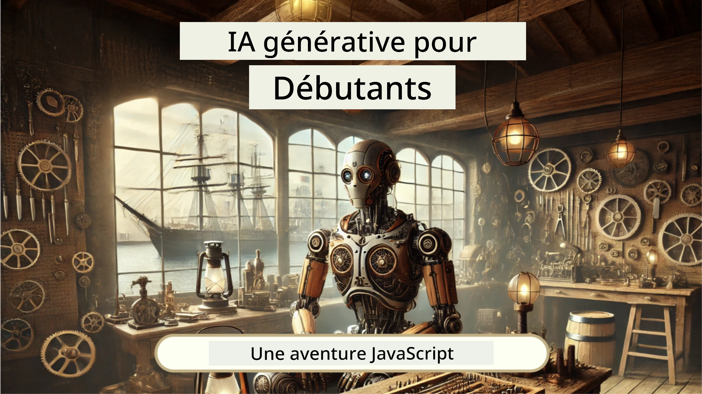
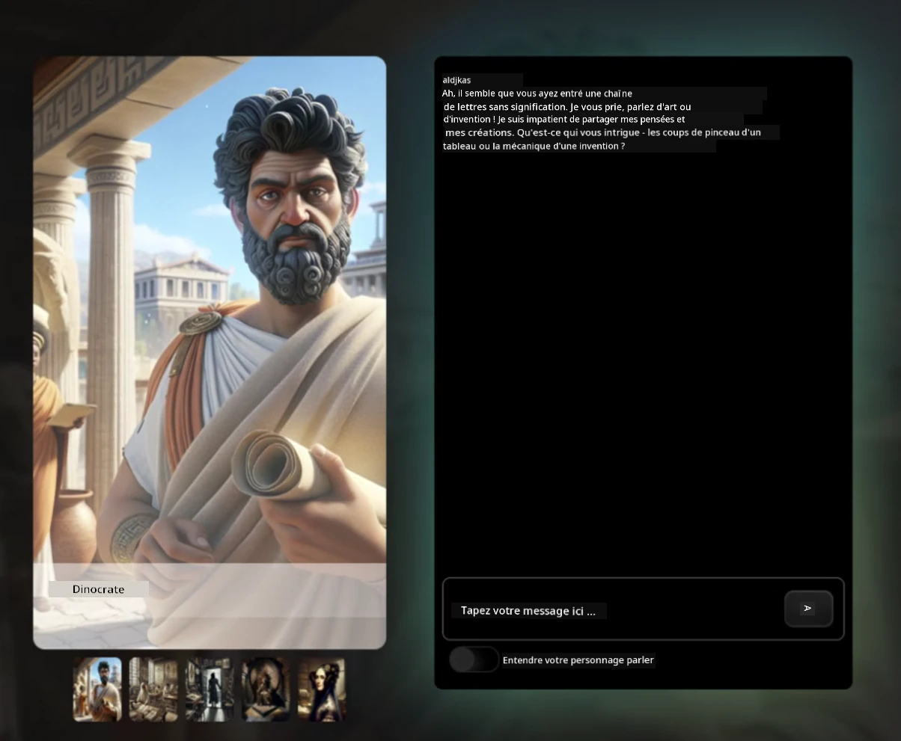
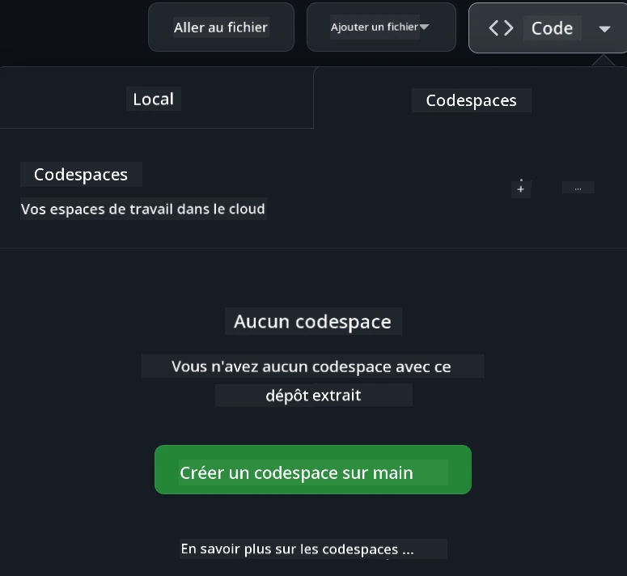

[](https://github.com/microsoft/Web-Dev-For-Beginners/blob/master/LICENSE)
[](https://GitHub.com/microsoft/Web-Dev-For-Beginners/graphs/contributors/)
[](https://GitHub.com/microsoft/Web-Dev-For-Beginners/issues/)
[](https://GitHub.com/microsoft/Web-Dev-For-Beginners/pulls/)
[](http://makeapullrequest.com) 

[](https://GitHub.com/microsoft/Web-Dev-For-Beginners/watchers/)
[](https://GitHub.com/microsoft/Web-Dev-For-Beginners/network/)
[](https://GitHub.com/microsoft/Web-Dev-For-Beginners/stargazers/)

[](https://discord.gg/nTYy5BXMWG)

# Développement Web pour Débutants - Un Programme

Apprenez les fondamentaux du développement web avec notre cours complet de 12 semaines conçu par les Défenseurs du Cloud Microsoft. Chacune des 24 leçons explore JavaScript, CSS et HTML à travers des projets pratiques comme des terrariums, des extensions de navigateur et des jeux spatiaux. Participez à des quiz, des discussions et des exercices pratiques. Améliorez vos compétences et optimisez votre rétention des connaissances grâce à notre pédagogie efficace basée sur des projets. Commencez votre apprentissage du code dès aujourd'hui !

Rejoignez la Communauté Azure AI Foundry sur Discord

[](https://discord.gg/nTYy5BXMWG)

Suivez ces étapes pour commencer à utiliser ces ressources :  
1. **Faites un fork du dépôt** : Cliquez sur [](https://GitHub.com/microsoft/Web-Dev-For-Beginners/fork)  
2. **Clonez le dépôt** : `git clone https://github.com/microsoft/Web-Dev-For-Beginners.git`  
3. [**Rejoignez le Discord Azure AI Foundry et rencontrez des experts ainsi que d'autres développeurs**](https://discord.com/invite/ByRwuEEgH4)  

### 🌐 Support Multilingue

#### Pris en charge via GitHub Action (Automatisé et Toujours à Jour)

<!-- CO-OP TRANSLATOR LANGUAGES TABLE START -->
[Arabic](../ar/README.md) | [Bengali](../bn/README.md) | [Bulgarian](../bg/README.md) | [Burmese (Myanmar)](../my/README.md) | [Chinese (Simplified)](../zh-CN/README.md) | [Chinese (Traditional, Hong Kong)](../zh-HK/README.md) | [Chinese (Traditional, Macau)](../zh-MO/README.md) | [Chinese (Traditional, Taiwan)](../zh-TW/README.md) | [Croatian](../hr/README.md) | [Czech](../cs/README.md) | [Danish](../da/README.md) | [Dutch](../nl/README.md) | [Estonian](../et/README.md) | [Finnish](../fi/README.md) | [French](./README.md) | [German](../de/README.md) | [Greek](../el/README.md) | [Hebrew](../he/README.md) | [Hindi](../hi/README.md) | [Hungarian](../hu/README.md) | [Indonesian](../id/README.md) | [Italian](../it/README.md) | [Japanese](../ja/README.md) | [Kannada](../kn/README.md) | [Khmer](../km/README.md) | [Korean](../ko/README.md) | [Lithuanian](../lt/README.md) | [Malay](../ms/README.md) | [Malayalam](../ml/README.md) | [Marathi](../mr/README.md) | [Nepali](../ne/README.md) | [Nigerian Pidgin](../pcm/README.md) | [Norwegian](../no/README.md) | [Persian (Farsi)](../fa/README.md) | [Polish](../pl/README.md) | [Portuguese (Brazil)](../pt-BR/README.md) | [Portuguese (Portugal)](../pt-PT/README.md) | [Punjabi (Gurmukhi)](../pa/README.md) | [Romanian](../ro/README.md) | [Russian](../ru/README.md) | [Serbian (Cyrillic)](../sr/README.md) | [Slovak](../sk/README.md) | [Slovenian](../sl/README.md) | [Spanish](../es/README.md) | [Swahili](../sw/README.md) | [Swedish](../sv/README.md) | [Tagalog (Filipino)](../tl/README.md) | [Tamil](../ta/README.md) | [Telugu](../te/README.md) | [Thai](../th/README.md) | [Turkish](../tr/README.md) | [Ukrainian](../uk/README.md) | [Urdu](../ur/README.md) | [Vietnamese](../vi/README.md)

> **Vous préférez cloner localement ?**  
>  
> Ce dépôt comprend plus de 50 traductions, ce qui augmente significativement la taille du téléchargement. Pour cloner sans les traductions, utilisez le checkout sparse :  
>  
> **Bash / macOS / Linux :**  
> ```bash
> git clone --filter=blob:none --sparse https://github.com/microsoft/Web-Dev-For-Beginners.git
> cd Web-Dev-For-Beginners
> git sparse-checkout set --no-cone '/*' '!translations' '!translated_images'
> ```
>  
> **CMD (Windows) :**  
> ```cmd
> git clone --filter=blob:none --sparse https://github.com/microsoft/Web-Dev-For-Beginners.git
> cd Web-Dev-For-Beginners
> git sparse-checkout set --no-cone "/*" "!translations" "!translated_images"
> ```
>  
> Cela vous donne tout ce dont vous avez besoin pour suivre le cours avec un téléchargement beaucoup plus rapide.  
<!-- CO-OP TRANSLATOR LANGUAGES TABLE END -->

**Si vous souhaitez que d'autres langues de traduction soient prises en charge, elles sont listées [ici](https://github.com/Azure/co-op-translator/blob/main/getting_started/supported-languages.md)**

[](https://open.vscode.dev/microsoft/Web-Dev-For-Beginners)

#### 🧑‍🎓 _Êtes-vous étudiant ?_

Visitez la [**page Hub Étudiant**](https://docs.microsoft.com/learn/student-hub/?WT.mc_id=academic-77807-sagibbon) où vous trouverez des ressources pour débutants, des packs pour étudiants et même des moyens d'obtenir un bon de certificat gratuit. C’est la page que vous voudrez mettre en favori et consulter régulièrement car son contenu est mis à jour chaque mois.

### 📣 Annonce - Nouveaux défis en mode GitHub Copilot Agent à compléter !

Nouveau défi ajouté, cherchez le "Défi GitHub Copilot Agent 🚀" dans la plupart des chapitres. C’est un nouveau défi à compléter en utilisant GitHub Copilot et le mode Agent. Si vous n'avez jamais utilisé le mode Agent, il est capable non seulement de générer du texte, mais aussi de créer et modifier des fichiers, exécuter des commandes et plus encore.

### 📣 Annonce - _Nouveau projet à construire en utilisant l’IA générative_

Nouveau projet Assistant IA ajouté, consultez le [projet](./9-chat-project/README.md)

### 📣 Annonce - _Nouveau programme_ sur l’IA générative pour JavaScript vient d’être publié

Ne manquez pas notre nouveau programme sur l’IA générative !

Visitez [https://aka.ms/genai-js-course](https://aka.ms/genai-js-course) pour commencer !



- Des leçons couvrant tout, des bases au RAG.  
- Interagissez avec des personnages historiques grâce à GenAI et notre application compagnon.  
- Une narration amusante et immersive, vous voyagerez dans le temps !



Chaque leçon comprend un devoir à réaliser, un contrôle de connaissances et un défi pour vous guider dans l’apprentissage de sujets comme :  
- Le prompt et l’ingénierie du prompt  
- La génération d’applications texte et image  
- Les applications de recherche  

Visitez [https://aka.ms/genai-js-course](https://aka.ms/genai-js-course) pour commencer !

## 🌱 Pour commencer

> **Enseignants**, nous avons [inclus quelques suggestions](for-teachers.md) sur comment utiliser ce programme. Nous attendons vos retours [dans notre forum de discussion](https://github.com/microsoft/Web-Dev-For-Beginners/discussions/categories/teacher-corner) !

**[Apprenants](https://aka.ms/student-page/?WT.mc_id=academic-77807-sagibbon)**, pour chaque leçon, commencez par un quiz pré-conférence puis lisez le contenu de la conférence, complétez les diverses activités et vérifiez votre compréhension via le quiz post-conférence.

Pour améliorer votre expérience d’apprentissage, connectez-vous avec vos pairs pour travailler ensemble sur les projets ! Les discussions sont encouragées sur notre [forum de discussion](https://github.com/microsoft/Web-Dev-For-Beginners/discussions) où notre équipe de modérateurs sera disponible pour répondre à vos questions.

Pour approfondir vos connaissances, nous recommandons vivement d’explorer [Microsoft Learn](https://learn.microsoft.com/users/wirelesslife/collections/p1ddcy5jwy0jkm?WT.mc_id=academic-77807-sagibbon) pour des supports d’étude supplémentaires.

### 📋 Configuration de votre environnement

Ce programme dispose d’un environnement de développement prêt à l’emploi ! Pour démarrer, vous pouvez choisir d’exécuter le programme dans un [Codespace](https://github.com/features/codespaces/) (_un environnement basé sur navigateur, sans installation nécessaire_), ou localement sur votre ordinateur avec un éditeur de texte comme [Visual Studio Code](https://code.visualstudio.com/?WT.mc_id=academic-77807-sagibbon).

#### Créez votre dépôt
Pour sauvegarder facilement votre travail, il est recommandé de créer votre propre copie de ce dépôt. Vous pouvez le faire en cliquant sur le bouton **Use this template** en haut de la page. Cela créera un nouveau dépôt dans votre compte GitHub avec une copie du programme.

Suivez ces étapes :  
1. **Faites un fork du dépôt** : Cliquez sur le bouton "Fork" en haut à droite de cette page.  
2. **Clonez le dépôt** : `git clone https://github.com/microsoft/Web-Dev-For-Beginners.git`  

#### Exécuter le programme dans un Codespace

Dans votre copie de ce dépôt, cliquez sur le bouton **Code** puis sélectionnez **Open with Codespaces**. Cela créera un nouveau Codespace pour que vous puissiez travailler.



#### Exécuter le programme localement sur votre ordinateur

Pour exécuter ce programme localement, vous aurez besoin d’un éditeur de texte, d’un navigateur et d’un outil en ligne de commande. Notre première leçon, [Introduction aux langages de programmation et outils du métier](../../1-getting-started-lessons/1-intro-to-programming-languages), vous guidera à travers diverses options pour chacun de ces outils afin que vous puissiez choisir ce qui vous convient le mieux.

Nous recommandons l’utilisation de [Visual Studio Code](https://code.visualstudio.com/?WT.mc_id=academic-77807-sagibbon) comme éditeur, qui inclut également un [Terminal](https://code.visualstudio.com/docs/terminal/basics/?WT.mc_id=academic-77807-sagibbon) intégré. Vous pouvez télécharger Visual Studio Code [ici](https://code.visualstudio.com/?WT.mc_id=academic-77807-sagibbon).
1. Clonez votre dépôt sur votre ordinateur. Vous pouvez le faire en cliquant sur le bouton **Code** et en copiant l’URL :

    [CodeSpace](./images/createcodespace.png)

    Ensuite, ouvrez [Terminal](https://code.visualstudio.com/docs/terminal/basics/?WT.mc_id=academic-77807-sagibbon) dans [Visual Studio Code](https://code.visualstudio.com/?WT.mc_id=academic-77807-sagibbon) et exécutez la commande suivante, en remplaçant `<your-repository-url>` par l'URL que vous venez de copier :

    ```bash 
    git clone <your-repository-url>
    ```

2. Ouvrez le dossier dans Visual Studio Code. Vous pouvez le faire en cliquant sur **Fichier** > **Ouvrir le dossier** et en sélectionnant le dossier que vous venez de cloner.


>  Extensions Visual Studio Code recommandées :
>
> * [Live Server](https://marketplace.visualstudio.com/items?itemName=ritwickdey.LiveServer&WT.mc_id=academic-77807-sagibbon) - pour prévisualiser les pages HTML dans Visual Studio Code
> * [Copilot](https://marketplace.visualstudio.com/items?itemName=GitHub.copilot&WT.mc_id=academic-77807-sagibbon) - pour vous aider à écrire du code plus rapidement

## 📂 Chaque leçon comprend :

- sketchnote optionnelle
- vidéo complémentaire optionnelle
- quiz d’échauffement avant la leçon
- leçon écrite
- pour les leçons basées sur un projet, des guides étape par étape pour construire le projet
- vérifications des connaissances
- un défi
- lectures complémentaires
- devoir
- [quiz post-leçon](https://ff-quizzes.netlify.app/web/)

> **Une note à propos des quiz** : Tous les quiz sont contenus dans le dossier Quiz-app, avec 48 quiz au total de trois questions chacun. Ils sont disponibles [ici](https://ff-quizzes.netlify.app/web/) ; l’application de quiz peut être exécutée localement ou déployée sur Azure ; suivez les instructions dans le dossier `quiz-app`.

## 🗃️ Leçons

|     |                       Nom du Projet                        |                           Concepts Enseignés                            | Objectifs d’Apprentissage                                                                                                          |                                                        Leçon Associée                                                        |        Auteur          |
| :-: | :--------------------------------------------------------: | :---------------------------------------------------------------------: | ---------------------------------------------------------------------------------------------------------------------------------- | :---------------------------------------------------------------------------------------------------------------------------: | :--------------------: |
| 01  |                     Premiers Pas                          |          Introduction à la Programmation et Outils du Métier            | Apprendre les bases communes à la plupart des langages de programmation et sur les logiciels qui aident les développeurs pros      | [Introduction aux langages de programmation et aux outils](./1-getting-started-lessons/1-intro-to-programming-languages/README.md) |         Jasmine        |
| 02  |                     Premiers Pas                          |             Bases de GitHub, y compris le travail en équipe             | Comment utiliser GitHub dans votre projet et collaborer avec d’autres sur une base de code                                            |                            [Introduction à GitHub](./1-getting-started-lessons/2-github-basics/README.md)                            |          Floor         |
| 03  |                     Premiers Pas                          |                             Accessibilité                              | Apprendre les bases de l’accessibilité web                                                                                         |                      [Fondamentaux de l’accessibilité](./1-getting-started-lessons/3-accessibility/README.md)                      |      Christopher       |
| 04  |                       Bases JS                            |                        Types de données en JavaScript                   | Les bases des types de données en JavaScript                                                                                        |                                     [Types de données](./2-js-basics/1-data-types/README.md)                                      |         Jasmine        |
| 05  |                       Bases JS                            |                       Fonctions et Méthodes                            | Apprendre les fonctions et méthodes pour gérer le flux logique d’une application                                                    |                              [Fonctions et Méthodes](./2-js-basics/2-functions-methods/README.md)                                | Jasmine et Christopher |
| 06  |                       Bases JS                            |                      Prise de décisions avec JS                        | Apprendre à créer des conditions dans votre code grâce aux méthodes de prise de décisions                                           |                                 [Prise de décisions](./2-js-basics/3-making-decisions/README.md)                                  |         Jasmine        |
| 07  |                       Bases JS                            |                         Tableaux et Boucles                            | Travailler avec les données en utilisant tableaux et boucles en JavaScript                                                          |                                    [Tableaux et boucles](./2-js-basics/4-arrays-loops/README.md)                                   |         Jasmine        |
| 08  |         [Terrarium](./3-terrarium/solution/README.md)         |                         HTML en Pratique                               | Construire le HTML pour créer un terrarium en ligne, en se concentrant sur la création d’une mise en page                         |                               [Introduction au HTML](./3-terrarium/1-intro-to-html/README.md)                               |           Jen          |
| 09  |         [Terrarium](./3-terrarium/solution/README.md)         |                         CSS en Pratique                                | Construire le CSS pour styliser le terrarium en ligne, en se concentrant sur les bases du CSS y compris le rendu responsive          |                                [Introduction au CSS](./3-terrarium/2-intro-to-css/README.md)                                |           Jen          |
| 10  |            [Terrarium](./3-terrarium/solution/README.md)            |               Fermetures JavaScript, manipulation DOM                  | Écrire le JavaScript pour rendre le terrarium fonctionnel en tant qu’interface drag/drop, en se concentrant sur les closures et DOM |                     [Closures JS, manipulation DOM](./3-terrarium/3-intro-to-DOM-and-closures/README.md)                      |           Jen          |
| 11  |            [Jeu de frappe](./4-typing-game/solution/README.md)         |                         Construire un jeu de frappe                    | Apprendre à utiliser les événements clavier pour piloter la logique de votre application JavaScript                                 |                                [Programmation événementielle](./4-typing-game/typing-game/README.md)                                 |      Christopher       |
| 12  | [Extension Navigateur Vert](./5-browser-extension/solution/README.md) |                        Travailler avec les navigateurs                 | Découvrir comment fonctionnent les navigateurs, leur histoire, et comment initier les premiers éléments d’une extension            |                               [À propos des navigateurs](./5-browser-extension/1-about-browsers/README.md)                               |           Jen          |
| 13  | [Extension Navigateur Vert](./5-browser-extension/solution/README.md) |     Construire un formulaire, appeler une API et stocker localement    | Construire les éléments JavaScript de votre extension navigateur pour appeler une API en utilisant des variables en stockage local |                 [APIs, formulaires et stockage local](./5-browser-extension/2-forms-browsers-local-storage/README.md)                  |           Jen          |
| 14  | [Extension Navigateur Vert](./5-browser-extension/solution/README.md) |        Processus en arrière-plan dans le navigateur, performance web   | Utiliser les processus en arrière-plan du navigateur pour gérer l’icône de l’extension ; apprendre la performance web et optimisations |             [Tâches en arrière-plan et performance](./5-browser-extension/3-background-tasks-and-performance/README.md)              |           Jen          |
| 15  |           [Jeu Spatial](./6-space-game/solution/README.md)           |            Développement avancé de jeu avec JavaScript                 | Apprendre l’héritage utilisant classes et composition ainsi que le pattern Pub/Sub, en préparation au développement d’un jeu         |                      [Introduction au développement avancé](./6-space-game/1-introduction/README.md)                       |          Chris         |
| 16  |           [Jeu Spatial](./6-space-game/solution/README.md)           |                        Dessiner sur Canvas                              | Découvrir l’API Canvas, utilisée pour dessiner des éléments sur écran                                                             |                                [Dessiner sur Canvas](./6-space-game/2-drawing-to-canvas/README.md)                                |          Chris         |
| 17  |           [Jeu Spatial](./6-space-game/solution/README.md)           |                  Déplacer des éléments à l’écran                        | Découvrir comment les éléments peuvent se déplacer avec les coordonnées cartésiennes et l’API Canvas                               |                          [Déplacer des éléments](./6-space-game/3-moving-elements-around/README.md)                          |          Chris         |
| 18  |           [Jeu Spatial](./6-space-game/solution/README.md)           |                       Détection de collisions                           | Faire entrer en collision les éléments et réagir grâce aux pressions de touches, avec une fonction de refroidissement pour la performance |                               [Détection de collisions](./6-space-game/4-collision-detection/README.md)                               |          Chris         |
| 19  |           [Jeu Spatial](./6-space-game/solution/README.md)           |                           Gestion du score                              | Effectuer des calculs mathématiques basés sur le statut et la performance du jeu                                                  |                                   [Gestion du score](./6-space-game/5-keeping-score/README.md)                                   |          Chris         |
| 20  |           [Jeu Spatial](./6-space-game/solution/README.md)           |                     Fin et redémarrage du jeu                          | Apprendre à terminer et redémarrer une partie, y compris le nettoyage des ressources et la réinitialisation des variables         |                                 [La condition de fin](./6-space-game/6-end-condition/README.md)                                 |          Chris         |
| 21  |         [Application bancaire](./7-bank-project/solution/README.md)          |              Templates HTML et Routes dans une application web          | Apprendre à créer l’ossature d’un site web multipages avec routage et templates HTML                                                |                            [Templates HTML et Routes](./7-bank-project/1-template-route/README.md)                             |          Yohan         |
| 22  |         [Application bancaire](./7-bank-project/solution/README.md)          |               Construire un formulaire de connexion et d'inscription   | Apprendre la construction de formulaires et la gestion des validations                                                              |                                           [Formulaires](./7-bank-project/2-forms/README.md)                                           |          Yohan         |
| 23  |         [Application bancaire](./7-bank-project/solution/README.md)          |                     Méthodes pour récupérer et utiliser les données    | Comment les données entrent et sortent de votre application, comment les récupérer, stocker et gérer                               |                                            [Données](./7-bank-project/3-data/README.md)                                            |          Yohan         |
| 24  |         [Application bancaire](./7-bank-project/solution/README.md)          |                       Concepts de gestion d’état                        | Comprendre comment votre application conserve l’état et comment le gérer par programmation                                         |                                [Gestion d’état](./7-bank-project/4-state-management/README.md)                                |          Yohan         |
| 25 | [Code Navigateur/VScode](../../8-code-editor) | Travailler avec VScode | Apprendre à utiliser un éditeur de code | [Utiliser l’éditeur de code VScode](./8-code-editor/1-using-a-code-editor/README.md) | Chris |
| 26 | [Assistants IA](./9-chat-project/README.md) | Travailler avec l’IA | Apprendre à créer votre propre assistant IA | [Projet Assistant IA](./9-chat-project/README.md) | Chris |

## 🏫 Pédagogie

Notre programme est conçu autour de deux principes pédagogiques clés :
* apprentissage par projets
* quiz fréquents

Le programme enseigne les fondamentaux du JavaScript, HTML et CSS, ainsi que les outils et techniques les plus récents utilisés par les développeurs web d’aujourd’hui. Les étudiants auront l’opportunité de développer une expérience pratique en construisant un jeu de frappe, un terrarium virtuel, une extension de navigateur écologique, un jeu de type space-invader, et une application bancaire pour entreprises. À la fin de la série, les étudiants auront acquis une solide compréhension du développement web.

> 🎓 Vous pouvez suivre les premières leçons de ce programme en tant que [Parcours d’apprentissage](https://docs.microsoft.com/learn/paths/web-development-101/?WT.mc_id=academic-77807-sagibbon) sur Microsoft Learn !

En alignant le contenu sur des projets, le processus est rendu plus attrayant pour les étudiants et la rétention des concepts est améliorée. Nous avons aussi créé plusieurs leçons de base en JavaScript pour introduire les concepts, associées à une vidéo de la collection de tutoriels vidéo "[Beginners Series to: JavaScript](https://channel9.msdn.com/Series/Beginners-Series-to-JavaScript/?WT.mc_id=academic-77807-sagibbon)", dont certains auteurs ont contribué à ce programme.

De plus, un quiz à faible enjeu avant la classe prépare l’intention d’apprentissage de l’étudiant sur un sujet, tandis qu’un second quiz après la classe assure une meilleure rétention. Ce programme est conçu pour être flexible et ludique et peut être suivi en totalité ou en partie. Les projets commencent petits et deviennent de plus en plus complexes à la fin du cycle de 12 semaines.

Bien que nous ayons délibérément évité d’introduire des frameworks JavaScript afin de nous concentrer sur les compétences de base nécessaires avant l’adoption d’un framework, une bonne étape suivante serait d’apprendre Node.js via une autre collection de vidéos : "[Beginner Series to: Node.js](https://channel9.msdn.com/Series/Beginners-Series-to-Nodejs/?WT.mc_id=academic-77807-sagibbon)".

> Consultez nos directives [Code de conduite](CODE_OF_CONDUCT.md) et [Contribution](CONTRIBUTING.md). Nous accueillons vos retours constructifs !

## 🧭 Accès hors ligne

Vous pouvez consulter cette documentation hors ligne en utilisant [Docsify](https://docsify.js.org/#/). Forkez ce dépôt, [installez Docsify](https://docsify.js.org/#/quickstart) sur votre machine locale, puis dans le dossier racine de ce dépôt, tapez `docsify serve`. Le site sera servi sur le port 3000 sur votre localhost : `localhost:3000`.

## 📘 PDF
Un PDF de toutes les leçons est disponible [ici](https://microsoft.github.io/Web-Dev-For-Beginners/pdf/readme.pdf).


## 🎒 Autres cours

Notre équipe produit d'autres cours ! Découvrez :

<!-- CO-OP TRANSLATOR OTHER COURSES START -->
### LangChain
[](https://aka.ms/langchain4j-for-beginners)
[](https://aka.ms/langchainjs-for-beginners?WT.mc_id=m365-94501-dwahlin)
[](https://github.com/microsoft/langchain-for-beginners?WT.mc_id=m365-94501-dwahlin)
---

### Azure / Edge / MCP / Agents
[](https://github.com/microsoft/AZD-for-beginners?WT.mc_id=academic-105485-koreyst)
[](https://github.com/microsoft/edgeai-for-beginners?WT.mc_id=academic-105485-koreyst)
[](https://github.com/microsoft/mcp-for-beginners?WT.mc_id=academic-105485-koreyst)
[](https://github.com/microsoft/ai-agents-for-beginners?WT.mc_id=academic-105485-koreyst)

---
 
### Série IA générative
[](https://github.com/microsoft/generative-ai-for-beginners?WT.mc_id=academic-105485-koreyst)
[-9333EA?style=for-the-badge&labelColor=E5E7EB&color=9333EA)](https://github.com/microsoft/Generative-AI-for-beginners-dotnet?WT.mc_id=academic-105485-koreyst)
[-C084FC?style=for-the-badge&labelColor=E5E7EB&color=C084FC)](https://github.com/microsoft/generative-ai-for-beginners-java?WT.mc_id=academic-105485-koreyst)
[-E879F9?style=for-the-badge&labelColor=E5E7EB&color=E879F9)](https://github.com/microsoft/generative-ai-with-javascript?WT.mc_id=academic-105485-koreyst)

---
 
### Apprentissage de base
[](https://aka.ms/ml-beginners?WT.mc_id=academic-105485-koreyst)
[](https://aka.ms/datascience-beginners?WT.mc_id=academic-105485-koreyst)
[](https://aka.ms/ai-beginners?WT.mc_id=academic-105485-koreyst)
[](https://github.com/microsoft/Security-101?WT.mc_id=academic-96948-sayoung)
[](https://aka.ms/webdev-beginners?WT.mc_id=academic-105485-koreyst)
[](https://aka.ms/iot-beginners?WT.mc_id=academic-105485-koreyst)
[](https://github.com/microsoft/xr-development-for-beginners?WT.mc_id=academic-105485-koreyst)

---
 
### Série Copilot
[](https://aka.ms/GitHubCopilotAI?WT.mc_id=academic-105485-koreyst)
[](https://github.com/microsoft/mastering-github-copilot-for-dotnet-csharp-developers?WT.mc_id=academic-105485-koreyst)
[](https://github.com/microsoft/CopilotAdventures?WT.mc_id=academic-105485-koreyst)
<!-- CO-OP TRANSLATOR OTHER COURSES END -->

## Obtenir de l'aide

Si vous êtes bloqué ou avez des questions sur la création d'applications d'IA, rejoignez d'autres apprenants et développeurs expérimentés dans les discussions sur MCP. C'est une communauté de soutien où les questions sont les bienvenues et où les connaissances sont librement partagées.

[](https://discord.gg/nTYy5BXMWG)

Si vous avez des retours produit ou des erreurs lors du développement, rendez-vous sur :

[](https://aka.ms/foundry/forum)

## Licence

Ce dépôt est sous licence MIT. Consultez le fichier [LICENSE](../../LICENSE) pour plus d'informations.

---

<!-- CO-OP TRANSLATOR DISCLAIMER START -->
**Avertissement** :  
Ce document a été traduit à l'aide du service de traduction automatique [Co-op Translator](https://github.com/Azure/co-op-translator). Bien que nous nous efforcions d'assurer l'exactitude, veuillez noter que les traductions automatisées peuvent contenir des erreurs ou des inexactitudes. Le document original dans sa langue native doit être considéré comme la source faisant foi. Pour des informations cruciales, une traduction professionnelle humaine est recommandée. Nous ne sommes pas responsables des malentendus ou des interprétations erronées résultant de l'utilisation de cette traduction.
<!-- CO-OP TRANSLATOR DISCLAIMER END -->