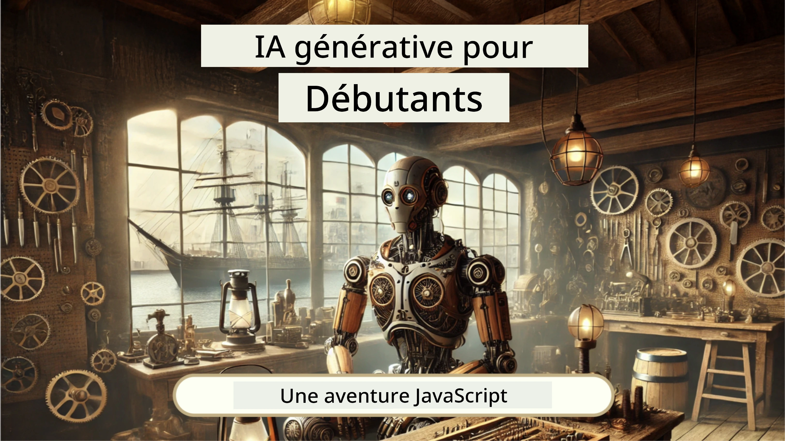
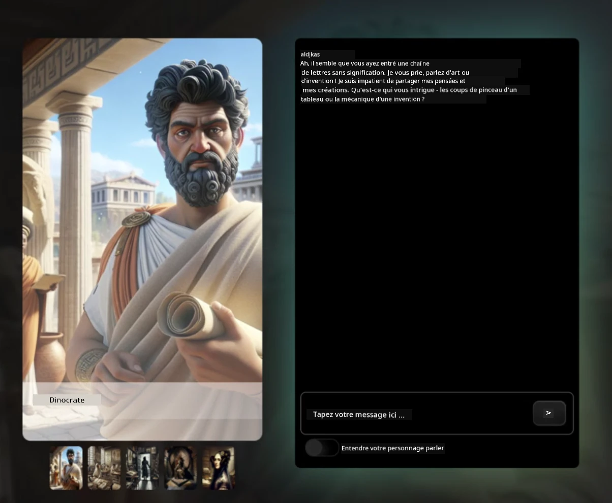
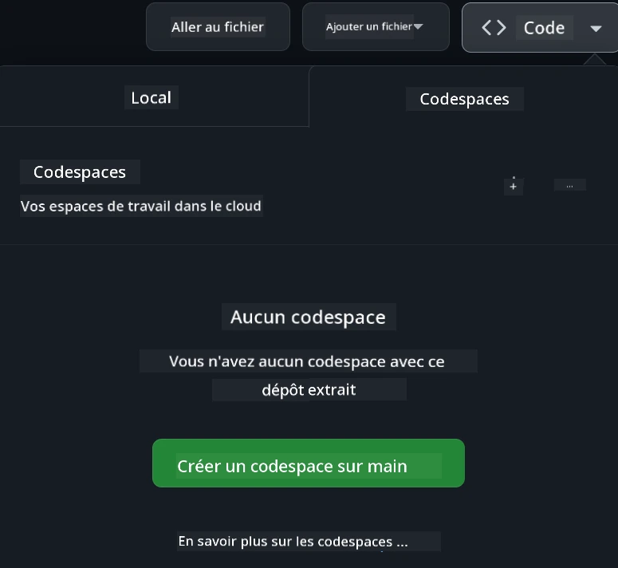

[](https://github.com/microsoft/Web-Dev-For-Beginners/blob/master/LICENSE)
[](https://GitHub.com/microsoft/Web-Dev-For-Beginners/graphs/contributors/)
[](https://GitHub.com/microsoft/Web-Dev-For-Beginners/issues/)
[](https://GitHub.com/microsoft/Web-Dev-For-Beginners/pulls/)
[](http://makeapullrequest.com) 

[](https://GitHub.com/microsoft/Web-Dev-For-Beginners/watchers/)
[](https://GitHub.com/microsoft/Web-Dev-For-Beginners/network/)
[](https://GitHub.com/microsoft/Web-Dev-For-Beginners/stargazers/)

[](https://discord.gg/nTYy5BXMWG)

# Développement Web pour Débutants - Un Programme

Apprenez les fondamentaux du développement web avec notre cours complet de 12 semaines par les Microsoft Cloud Advocates. Chacune des 24 leçons explore JavaScript, CSS et HTML à travers des projets pratiques tels que des terrariums, des extensions de navigateur et des jeux spatiaux. Participez à des quiz, discussions et exercices pratiques. Améliorez vos compétences et optimisez votre rétention des connaissances grâce à notre pédagogie efficace basée sur des projets. Commencez votre parcours de programmation dès aujourd’hui !

Rejoignez le Discord Azure AI Foundry et rencontrez des experts et autres développeurs.

[](https://discord.gg/nTYy5BXMWG)

Suivez ces étapes pour commencer à utiliser ces ressources :
1. **Forkez le Dépôt** : Cliquez sur [](https://GitHub.com/microsoft/Web-Dev-For-Beginners/fork)
2. **Clonez le Dépôt** :   `git clone https://github.com/microsoft/Web-Dev-For-Beginners.git`
3. [**Rejoignez le Discord Azure AI Foundry et rencontrez experts et développeurs**](https://discord.com/invite/ByRwuEEgH4)

### 🌐 Support Multilingue

#### Pris en charge via GitHub Action (Automatisé & Toujours à jour)

<!-- CO-OP TRANSLATOR LANGUAGES TABLE START -->
[Arabe](../ar/README.md) | [Bengali](../bn/README.md) | [Bulgare](../bg/README.md) | [Birman (Myanmar)](../my/README.md) | [Chinois (Simplifié)](../zh-CN/README.md) | [Chinois (Traditionnel, Hong Kong)](../zh-HK/README.md) | [Chinois (Traditionnel, Macao)](../zh-MO/README.md) | [Chinois (Traditionnel, Taïwan)](../zh-TW/README.md) | [Croate](../hr/README.md) | [Tchèque](../cs/README.md) | [Danois](../da/README.md) | [Néerlandais](../nl/README.md) | [Estonien](../et/README.md) | [Finnois](../fi/README.md) | [Français](./README.md) | [Allemand](../de/README.md) | [Grec](../el/README.md) | [Hébreu](../he/README.md) | [Hindi](../hi/README.md) | [Hongrois](../hu/README.md) | [Indonésien](../id/README.md) | [Italien](../it/README.md) | [Japonais](../ja/README.md) | [Kannada](../kn/README.md) | [Khmer](../km/README.md) | [Coréen](../ko/README.md) | [Lituanien](../lt/README.md) | [Malais](../ms/README.md) | [Malayalam](../ml/README.md) | [Marathi](../mr/README.md) | [Népalais](../ne/README.md) | [Pidgin Nigérian](../pcm/README.md) | [Norvégien](../no/README.md) | [Persan (Farsi)](../fa/README.md) | [Polonais](../pl/README.md) | [Portugais (Brésil)](../pt-BR/README.md) | [Portugais (Portugal)](../pt-PT/README.md) | [Pendjabi (Gurmukhi)](../pa/README.md) | [Roumain](../ro/README.md) | [Russe](../ru/README.md) | [Serbe (Cyrillique)](../sr/README.md) | [Slovaque](../sk/README.md) | [Slovène](../sl/README.md) | [Espagnol](../es/README.md) | [Swahili](../sw/README.md) | [Suédois](../sv/README.md) | [Tagalog (Philippin)](../tl/README.md) | [Tamoul](../ta/README.md) | [Télougou](../te/README.md) | [Thaï](../th/README.md) | [Turc](../tr/README.md) | [Ukrainien](../uk/README.md) | [Ourdou](../ur/README.md) | [Vietnamien](../vi/README.md)

> **Préférez cloner localement ?**
>
> Ce dépôt inclut plus de 50 traductions de langues ce qui augmente significativement la taille du téléchargement. Pour cloner sans traductions, utilisez le sparse checkout :
>
> **Bash / macOS / Linux :**
> ```bash
> git clone --filter=blob:none --sparse https://github.com/microsoft/Web-Dev-For-Beginners.git
> cd Web-Dev-For-Beginners
> git sparse-checkout set --no-cone '/*' '!translations' '!translated_images'
> ```
>
> **CMD (Windows) :**
> ```cmd
> git clone --filter=blob:none --sparse https://github.com/microsoft/Web-Dev-For-Beginners.git
> cd Web-Dev-For-Beginners
> git sparse-checkout set --no-cone "/*" "!translations" "!translated_images"
> ```
>
> Cela vous fournit tout ce dont vous avez besoin pour compléter le cours avec un téléchargement beaucoup plus rapide.
<!-- CO-OP TRANSLATOR LANGUAGES TABLE END -->

**Si vous souhaitez d’autres traductions, les langues supportées sont listées ici. [ici](https://github.com/Azure/co-op-translator/blob/main/getting_started/supported-languages.md)**

[](https://open.vscode.dev/microsoft/Web-Dev-For-Beginners)

#### 🧑‍🎓 _Vous êtes étudiant ?_

Visitez la [**page du Student Hub**](https://docs.microsoft.com/learn/student-hub/?WT.mc_id=academic-77807-sagibbon) où vous trouverez des ressources pour débutants, des packs étudiants et même des moyens pour obtenir un bon de certificat gratuit. C’est la page à mettre en favori et à consulter de temps en temps car le contenu change chaque mois.

### 📣 Annonce - Nouveaux défis du mode GitHub Copilot Agent à compléter !

Nouveau défi ajouté, recherchez « GitHub Copilot Agent Challenge 🚀 » dans la plupart des chapitres. C’est un nouveau défi à réaliser avec GitHub Copilot et le mode Agent. Si vous n’avez jamais utilisé le mode Agent auparavant, il peut non seulement générer du texte, mais aussi créer et modifier des fichiers, exécuter des commandes, et plus encore.

### 📣 Annonce - _Nouveau projet à construire avec l’IA générative_

Nouveau projet Assistant IA ajouté, découvrez-le [projet](./9-chat-project/README.md)

### 📣 Annonce - _Nouveau programme_ sur l’IA générative pour JavaScript vient d’être publié

Ne manquez pas notre nouveau programme sur l’IA générative !

Visitez [https://aka.ms/genai-js-course](https://aka.ms/genai-js-course) pour commencer !



- Leçons couvrant tout, des bases à la RAG.
- Interagissez avec des personnages historiques grâce à GenAI et notre application compagnon.
- Narration amusante et engageante, vous voyagerez dans le temps !




Chaque leçon inclut un exercice à réaliser, une vérification des connaissances et un défi pour vous guider dans l’apprentissage de sujets tels que :
- La formulation de requêtes et l’ingénierie de prompts
- La génération d’applications de texte et d’image
- Les applications de recherche

Visitez [https://aka.ms/genai-js-course](https://aka.ms/genai-js-course) pour commencer !


## 🌱 Pour Bien Commencer

> **Enseignants**, nous avons [inclus quelques suggestions](for-teachers.md) sur comment utiliser ce programme. Nous aimerions avoir vos retours [sur notre forum de discussion](https://github.com/microsoft/Web-Dev-For-Beginners/discussions/categories/teacher-corner) !

**[Apprenants](https://aka.ms/student-page/?WT.mc_id=academic-77807-sagibbon)**, pour chaque leçon, commencez par un quiz avant la leçon et poursuivez en lisant le matériel, en réalisant les différentes activités puis vérifiez votre compréhension avec le quiz après la leçon.

Pour améliorer votre expérience d’apprentissage, connectez-vous avec vos pairs pour travailler ensemble sur les projets ! Les discussions sont encouragées sur notre [forum de discussion](https://github.com/microsoft/Web-Dev-For-Beginners/discussions) où notre équipe de modérateurs sera disponible pour répondre à vos questions.

Pour approfondir votre formation, nous recommandons vivement d’explorer [Microsoft Learn](https://learn.microsoft.com/users/wirelesslife/collections/p1ddcy5jwy0jkm?WT.mc_id=academic-77807-sagibbon) pour des ressources complémentaires.

### 📋 Configuration de votre environnement

Ce programme dispose d’un environnement de développement prêt à l’emploi ! Dès le début, vous pouvez choisir d’exécuter le programme dans un [Codespace](https://github.com/features/codespaces/) (_un environnement dans le navigateur, sans installation nécessaire_), ou localement sur votre ordinateur en utilisant un éditeur de texte comme [Visual Studio Code](https://code.visualstudio.com/?WT.mc_id=academic-77807-sagibbon).

#### Créez votre dépôt
Pour sauvegarder facilement votre travail, il est recommandé de créer votre propre copie de ce dépôt. Vous pouvez le faire en cliquant sur le bouton **Utiliser ce modèle** en haut de la page. Cela créera un nouveau dépôt dans votre compte GitHub avec une copie du programme.

Suivez ces étapes :
1. **Forkez le Dépôt** : Cliquez sur le bouton « Fork » en haut à droite de cette page.
2. **Clonez le Dépôt** :   `git clone https://github.com/microsoft/Web-Dev-For-Beginners.git`

#### Exécuter le programme dans un Codespace

Dans votre copie de ce dépôt que vous avez créée, cliquez sur le bouton **Code** puis sélectionnez **Ouvrir avec Codespaces**. Cela créera un nouveau Codespace pour vous permettre de travailler.



#### Exécuter le programme localement sur votre ordinateur

Pour exécuter ce programme localement sur votre ordinateur, vous aurez besoin d’un éditeur de texte, d’un navigateur et d’un outil en ligne de commande. Notre première leçon, [Introduction aux langages de programmation et outils du métier](../../1-getting-started-lessons/1-intro-to-programming-languages), vous guidera à travers différentes options pour chacun de ces outils afin que vous choisissiez ce qui vous convient le mieux.

Nous recommandons d’utiliser [Visual Studio Code](https://code.visualstudio.com/?WT.mc_id=academic-77807-sagibbon) comme éditeur, qui dispose également d’un [Terminal](https://code.visualstudio.com/docs/terminal/basics/?WT.mc_id=academic-77807-sagibbon) intégré. Vous pouvez télécharger Visual Studio Code [ici](https://code.visualstudio.com/?WT.mc_id=academic-77807-sagibbon).
1. Clonez votre dépôt sur votre ordinateur. Vous pouvez le faire en cliquant sur le bouton **Code** et en copiant l'URL :

    [CodeSpace](./images/createcodespace.png)

    Ensuite, ouvrez [Terminal](https://code.visualstudio.com/docs/terminal/basics/?WT.mc_id=academic-77807-sagibbon) dans [Visual Studio Code](https://code.visualstudio.com/?WT.mc_id=academic-77807-sagibbon) et exécutez la commande suivante, en remplaçant `<your-repository-url>` par l’URL que vous venez de copier :

    ```bash 
    git clone <your-repository-url>
    ```

2. Ouvrez le dossier dans Visual Studio Code. Vous pouvez le faire en cliquant sur **Fichier** > **Ouvrir un dossier** et en sélectionnant le dossier que vous venez de cloner.


>  Extensions Visual Studio Code recommandées :  
>  
> * [Live Server](https://marketplace.visualstudio.com/items?itemName=ritwickdey.LiveServer&WT.mc_id=academic-77807-sagibbon) - pour prévisualiser les pages HTML dans Visual Studio Code  
> * [Copilot](https://marketplace.visualstudio.com/items?itemName=GitHub.copilot&WT.mc_id=academic-77807-sagibbon) - pour vous aider à coder plus rapidement

## 📂 Chaque leçon comprend :

- sketchnote optionnel
- vidéo complémentaire optionnelle
- quiz d’échauffement avant la leçon
- leçon écrite
- pour les leçons basées sur un projet, des guides étape par étape pour construire le projet
- vérifications des connaissances
- un défi
- lecture complémentaire
- devoir
- [quiz post-leçon](https://ff-quizzes.netlify.app/web/)

> **Une note concernant les quiz** : Tous les quiz se trouvent dans le dossier Quiz-app, 48 quiz au total avec trois questions chacun. Ils sont disponibles [ici](https://ff-quizzes.netlify.app/web/) ; l’application de quiz peut être lancée localement ou déployée sur Azure ; suivez les instructions dans le dossier `quiz-app`.

## 🗃️ Leçons

|     |                       Nom du Projet                       |                            Concepts Enseignés                             | Objectifs d’apprentissage                                                                                                           |                                                         Leçon liée                                                         |         Auteur          |
| :-: | :------------------------------------------------------: | :--------------------------------------------------------------------: | ----------------------------------------------------------------------------------------------------------------------------------- | :--------------------------------------------------------------------------------------------------------------------------: | :---------------------: |
| 01  |                     Premiers pas                      |           Introduction à la programmation et aux outils du métier           | Découvrez les bases communes à la plupart des langages de programmation et les logiciels qui aident les développeurs professionnels dans leur travail | [Intro aux langages de programmation et outils](./1-getting-started-lessons/1-intro-to-programming-languages/README.md) |         Jasmine         |
| 02  |                     Premiers pas                      |             Notions de base de GitHub, y compris travail en équipe             | Apprenez à utiliser GitHub dans vos projets, comment collaborer avec d’autres sur une base de code                                   |                            [Introduction à GitHub](./1-getting-started-lessons/2-github-basics/README.md)                             |          Floor          |
| 03  |                     Premiers pas                      |                             Accessibilité                              | Apprenez les bases de l’accessibilité web                                                                                           |                       [Fondamentaux de l’accessibilité](./1-getting-started-lessons/3-accessibility/README.md)                       |       Christopher       |
| 04  |                        JS Basics                         |                         Types de données JavaScript                          | Les bases des types de données en JavaScript                                                                                        |                                       [Types de données](./2-js-basics/1-data-types/README.md)                                        |         Jasmine         |
| 05  |                        JS Basics                         |                         Fonctions et méthodes                          | Apprenez les fonctions et méthodes pour gérer le flux logique d’une application                                                    |                              [Fonctions et méthodes](./2-js-basics/2-functions-methods/README.md)                               | Jasmine et Christopher |
| 06  |                        JS Basics                         |                        Prise de décisions avec JS                        | Apprenez à créer des conditions dans votre code en utilisant les méthodes de prise de décision                                     |                                 [Prise de décisions](./2-js-basics/3-making-decisions/README.md)                                  |         Jasmine         |
| 07  |                        JS Basics                         |                            Tableaux et boucles                            | Manipulez des données avec des tableaux et des boucles en JavaScript                                                               |                                   [Tableaux et boucles](./2-js-basics/4-arrays-loops/README.md)                                    |         Jasmine         |
| 08  |       [Terrarium](./3-terrarium/solution/README.md)       |                            HTML en pratique                            | Construisez le HTML pour créer un terrarium en ligne, en vous concentrant sur la création d’une mise en page                       |                                 [Introduction au HTML](./3-terrarium/1-intro-to-html/README.md)                                 |           Jen           |
| 09  |       [Terrarium](./3-terrarium/solution/README.md)       |                            CSS en pratique                             | Construisez le CSS pour styliser le terrarium en ligne, en vous concentrant sur les bases du CSS dont la responsivité de la page   |                                  [Introduction au CSS](./3-terrarium/2-intro-to-css/README.md)                                  |           Jen           |
| 10  |            [Terrarium](./3-terrarium/solution/README.md)            |                 Fermetures JavaScript, manipulation du DOM                  | Construisez le JavaScript pour rendre le terrarium fonctionnel avec une interface glisser-déposer, en vous concentrant sur les fermetures et la manipulation du DOM             |                  [Fermetures JavaScript, manipulation du DOM](./3-terrarium/3-intro-to-DOM-and-closures/README.md)                   |           Jen           |
| 11  |          [Typing Game](./4-typing-game/solution/README.md)          |                          Construire un jeu de frappe                           | Apprenez à utiliser les événements clavier pour diriger la logique de votre application JavaScript                                   |                                [Programmation événementielle](./4-typing-game/typing-game/README.md)                                |       Christopher       |
| 12  | [Extension de navigateur verte](./5-browser-extension/solution/README.md) |                         Travailler avec les navigateurs                          | Apprenez le fonctionnement des navigateurs, leur histoire, et comment créer les premiers éléments d’une extension de navigateur    |                               [À propos des navigateurs](./5-browser-extension/1-about-browsers/README.md)                                |           Jen           |
| 13  | [Extension de navigateur verte](./5-browser-extension/solution/README.md) | Construire un formulaire, appeler une API et stocker des variables dans le stockage local | Construisez les éléments JavaScript de votre extension de navigateur pour appeler une API en utilisant des variables stockées localement                      |                [APIs, formulaires et stockage local](./5-browser-extension/2-forms-browsers-local-storage/README.md)                 |           Jen           |
| 14  | [Extension de navigateur verte](./5-browser-extension/solution/README.md) |          Processus d’arrière-plan dans le navigateur, performance web          | Utilisez les processus d’arrière-plan du navigateur pour gérer l’icône de l’extension ; apprenez la performance web et des optimisations pour l’améliorer   |             [Tâches de fond et performance](./5-browser-extension/3-background-tasks-and-performance/README.md)              |           Jen           |
| 15  |           [Jeu spatial](./6-space-game/solution/README.md)           |             Développement de jeux avancé avec JavaScript             | Apprenez l’héritage utilisant à la fois les classes et la composition ainsi que le modèle Pub/Sub, en préparation à la création d’un jeu              |                      [Introduction au développement avancé de jeux](./6-space-game/1-introduction/README.md)                       |          Chris          |
| 16  |           [Jeu spatial](./6-space-game/solution/README.md)           |                           Dessiner sur le canevas                            | Découvrez l’API Canvas, utilisée pour dessiner des éléments à l’écran                                                               |                                [Dessiner sur le canevas](./6-space-game/2-drawing-to-canvas/README.md)                                |          Chris          |
| 17  |           [Jeu spatial](./6-space-game/solution/README.md)           |                   Déplacer des éléments à l’écran                    | Découvrez comment déplacer des éléments en utilisant les coordonnées cartésiennes et l’API Canvas                                     |                           [Déplacer des éléments](./6-space-game/3-moving-elements-around/README.md)                           |          Chris          |
| 18  |           [Jeu spatial](./6-space-game/solution/README.md)           |                          Détection de collision                           | Faites collisionner les éléments et réagir mutuellement avec des pressions sur les touches et fournissez une fonction de temps de récupération pour assurer une bonne performance du jeu    |                              [Détection de collision](./6-space-game/4-collision-detection/README.md)                              |          Chris          |
| 19  |           [Jeu spatial](./6-space-game/solution/README.md)           |                             Tenue du score                              | Effectuez des calculs mathématiques en fonction du statut et de la performance du jeu                                                |                                    [Tenue du score](./6-space-game/5-keeping-score/README.md)                                    |          Chris          |
| 20  |           [Jeu spatial](./6-space-game/solution/README.md)           |                     Fin et redémarrage du jeu                     | Apprenez à terminer et redémarrer le jeu, y compris nettoyer les ressources et réinitialiser les variables                          |                                [La condition de fin](./6-space-game/6-end-condition/README.md)                                 |          Chris          |
| 21  |         [Application bancaire](./7-bank-project/solution/README.md)          |                 Modèles HTML et routes dans une application web                 | Apprenez à créer la structure d’un site web multipage avec routage et modèles HTML                                                  |                            [Modèles HTML et routes](./7-bank-project/1-template-route/README.md)                             |          Yohan          |
| 22  |         [Application bancaire](./7-bank-project/solution/README.md)          |                  Créer un formulaire de connexion et d’inscription                   | Apprenez à construire des formulaires et gérer les routines de validation                                                          |                                           [Formulaires](./7-bank-project/2-forms/README.md)                                           |          Yohan          |
| 23  |         [Application bancaire](./7-bank-project/solution/README.md)          |                   Méthodes pour récupérer et utiliser des données                   | Comment les données entrent et sortent de votre application, comment les récupérer, stocker et éliminer                           |                                            [Données](./7-bank-project/3-data/README.md)                                            |          Yohan          |
| 24  |         [Application bancaire](./7-bank-project/solution/README.md)          |                      Concepts de gestion d’état                      | Apprenez comment votre application conserve son état et comment le gérer programmatiquement                                         |                                [Gestion d’état](./7-bank-project/4-state-management/README.md)                                |          Yohan          |
| 25 | [Code navigateur/VScode](../../8-code-editor) | Travailler avec VScode | Apprenez à utiliser un éditeur de code | [Utiliser l’éditeur de code VScode](./8-code-editor/1-using-a-code-editor/README.md) | Chris |
| 26 | [Assistants IA](./9-chat-project/README.md) | Travailler avec l’IA | Apprenez à construire votre propre assistant IA | [Projet assistant IA](./9-chat-project/README.md) | Chris |

## 🏫 Pédagogie

Notre programme est conçu autour de deux principes pédagogiques clés :  
* apprentissage par projet  
* quiz fréquents  

Le programme enseigne les fondamentaux de JavaScript, HTML et CSS, ainsi que les outils et techniques actuels utilisés par les développeurs web. Les étudiants auront l’occasion de développer une expérience pratique en construisant un jeu de frappe, un terrarium virtuel, une extension de navigateur écologique, un jeu de type space-invader et une application bancaire pour les entreprises. À la fin de la série, les étudiants auront acquis une compréhension solide du développement web.

> 🎓 Vous pouvez suivre les premières leçons de ce programme comme un [parcours d’apprentissage](https://docs.microsoft.com/learn/paths/web-development-101/?WT.mc_id=academic-77807-sagibbon) sur Microsoft Learn !

En veillant à ce que les contenus correspondent aux projets, le processus devient plus engageant pour les étudiants et la rétention des concepts est renforcée. Nous avons également rédigé plusieurs leçons d’introduction aux bases de JavaScript pour présenter les concepts, accompagnées d’une vidéo de la collection de tutoriels vidéo "[Beginners Series to: JavaScript](https://channel9.msdn.com/Series/Beginners-Series-to-JavaScript/?WT.mc_id=academic-77807-sagibbon)", dont certains auteurs ont contribué à ce programme.

De plus, un quiz à enjeu faible avant le cours oriente l’intention de l’étudiant vers l’apprentissage d’un sujet, tandis qu’un second quiz après le cours garantit une meilleure rétention. Ce programme a été conçu pour être flexible et ludique et peut être suivi en totalité ou en partie. Les projets commencent petits et deviennent de plus en plus complexes à la fin du cycle de 12 semaines.

Bien que nous ayons volontairement évité d’introduire des frameworks JavaScript pour nous concentrer sur les compétences de base nécessaires en tant que développeur web avant d’adopter un framework, une bonne étape suivante pour compléter ce programme serait d’apprendre Node.js via une autre collection de vidéos : "[Beginner Series to: Node.js](https://channel9.msdn.com/Series/Beginners-Series-to-Nodejs/?WT.mc_id=academic-77807-sagibbon)".

> Consultez notre [Code de conduite](CODE_OF_CONDUCT.md) et nos directives de [contribution](CONTRIBUTING.md). Vos retours constructifs sont les bienvenus !


## 🧭 Accès hors ligne

Vous pouvez exécuter cette documentation hors ligne en utilisant [Docsify](https://docsify.js.org/#/). Forkez ce dépôt, [installez Docsify](https://docsify.js.org/#/quickstart) sur votre machine locale, puis dans le dossier racine de ce dépôt, tapez `docsify serve`. Le site web sera servi sur le port 3000 de votre localhost : `localhost:3000`.

## 📘 PDF
Un PDF de toutes les leçons est disponible [ici](https://microsoft.github.io/Web-Dev-For-Beginners/pdf/readme.pdf).


## 🎒 Autres cours

Notre équipe produit d'autres cours ! Découvrez :

<!-- CO-OP TRANSLATOR OTHER COURSES START -->
### LangChain
[](https://aka.ms/langchain4j-for-beginners)
[](https://aka.ms/langchainjs-for-beginners?WT.mc_id=m365-94501-dwahlin)
[](https://github.com/microsoft/langchain-for-beginners?WT.mc_id=m365-94501-dwahlin)
---

### Azure / Edge / MCP / Agents
[](https://github.com/microsoft/AZD-for-beginners?WT.mc_id=academic-105485-koreyst)
[](https://github.com/microsoft/edgeai-for-beginners?WT.mc_id=academic-105485-koreyst)
[](https://github.com/microsoft/mcp-for-beginners?WT.mc_id=academic-105485-koreyst)
[](https://github.com/microsoft/ai-agents-for-beginners?WT.mc_id=academic-105485-koreyst)

---
 
### Série IA générative
[](https://github.com/microsoft/generative-ai-for-beginners?WT.mc_id=academic-105485-koreyst)
[-9333EA?style=for-the-badge&labelColor=E5E7EB&color=9333EA)](https://github.com/microsoft/Generative-AI-for-beginners-dotnet?WT.mc_id=academic-105485-koreyst)
[-C084FC?style=for-the-badge&labelColor=E5E7EB&color=C084FC)](https://github.com/microsoft/generative-ai-for-beginners-java?WT.mc_id=academic-105485-koreyst)
[-E879F9?style=for-the-badge&labelColor=E5E7EB&color=E879F9)](https://github.com/microsoft/generative-ai-with-javascript?WT.mc_id=academic-105485-koreyst)

---
 
### Apprentissage fondamental
[](https://aka.ms/ml-beginners?WT.mc_id=academic-105485-koreyst)
[](https://aka.ms/datascience-beginners?WT.mc_id=academic-105485-koreyst)
[](https://aka.ms/ai-beginners?WT.mc_id=academic-105485-koreyst)
[](https://github.com/microsoft/Security-101?WT.mc_id=academic-96948-sayoung)
[](https://aka.ms/webdev-beginners?WT.mc_id=academic-105485-koreyst)
[](https://aka.ms/iot-beginners?WT.mc_id=academic-105485-koreyst)
[](https://github.com/microsoft/xr-development-for-beginners?WT.mc_id=academic-105485-koreyst)

---
 
### Série Copilot
[](https://aka.ms/GitHubCopilotAI?WT.mc_id=academic-105485-koreyst)
[](https://github.com/microsoft/mastering-github-copilot-for-dotnet-csharp-developers?WT.mc_id=academic-105485-koreyst)
[](https://github.com/microsoft/CopilotAdventures?WT.mc_id=academic-105485-koreyst)
<!-- CO-OP TRANSLATOR OTHER COURSES END -->

## Obtenir de l'aide

Si vous êtes bloqué ou si vous avez des questions sur la création d'applications d'IA. Rejoignez d'autres apprenants et développeurs expérimentés pour discuter de MCP. C'est une communauté bienveillante où les questions sont les bienvenues et le savoir est partagé librement.

[](https://discord.gg/nTYy5BXMWG)

Si vous avez des retours produit ou des erreurs lors du développement, visitez :

[](https://aka.ms/foundry/forum)

## Licence

Ce dépôt est sous licence MIT. Consultez le fichier [LICENSE](../../LICENSE) pour plus d'informations.

---

<!-- CO-OP TRANSLATOR DISCLAIMER START -->
**Avertissement** :  
Ce document a été traduit à l’aide du service de traduction automatisée [Co-op Translator](https://github.com/Azure/co-op-translator). Bien que nous nous efforcions d’assurer l’exactitude, veuillez noter que les traductions automatiques peuvent contenir des erreurs ou des inexactitudes. Le document original dans sa langue natale doit être considéré comme la source faisant foi. Pour des informations critiques, il est recommandé de recourir à une traduction professionnelle réalisée par un humain. Nous déclinons toute responsabilité en cas de malentendus ou d’interprétations erronées découlant de l’utilisation de cette traduction.
<!-- CO-OP TRANSLATOR DISCLAIMER END -->