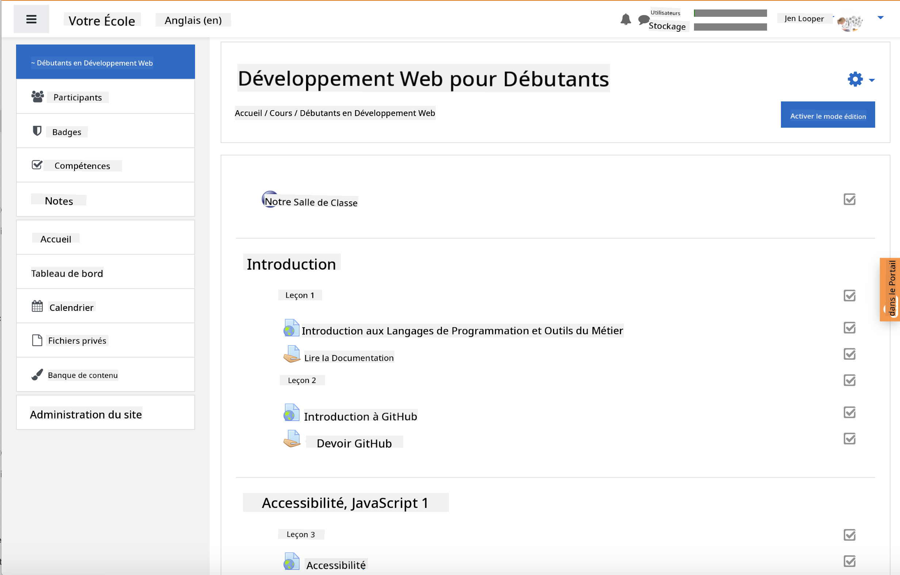

<!--
CO_OP_TRANSLATOR_METADATA:
{
  "original_hash": "71009af209f81cc01a1f2d324200375f",
  "translation_date": "2025-10-03T08:22:54+00:00",
  "source_file": "for-teachers.md",
  "language_code": "fr"
}
-->
### Pour les enseignants

Vous êtes invités à utiliser ce programme dans votre classe. Il fonctionne parfaitement avec GitHub Classroom et les principales plateformes LMS, et peut également être utilisé comme un dépôt autonome avec vos élèves.

### Utilisation avec GitHub Classroom

Pour gérer les leçons et les devoirs par cohorte, créez un dépôt par leçon afin que GitHub Classroom puisse associer chaque devoir de manière indépendante.

- Faites un fork de ce dépôt dans votre organisation.
- Créez un dépôt séparé pour chaque leçon en extrayant chaque dossier de leçon dans son propre dépôt.
  - Option A : Créez des dépôts vides (un par leçon) et copiez le contenu du dossier de la leçon dans chacun.
  - Option B : Utilisez une approche qui préserve l'historique Git (par exemple, divisez un dossier en un nouveau dépôt) si vous avez besoin de conserver la provenance.
- Dans GitHub Classroom, créez un devoir par leçon et pointez-le vers le dépôt correspondant.
- Paramètres recommandés :
  - Visibilité du dépôt : privée pour le travail des élèves.
  - Utilisez le code de départ de la branche par défaut du dépôt de la leçon.
  - Ajoutez des modèles d'issues et de pull requests pour les quiz et les soumissions.
  - Configurez éventuellement l'auto-évaluation et les tests si vos leçons en incluent.
- Conventions utiles :
  - Noms de dépôts comme lesson-01-intro, lesson-02-html, etc.
  - Étiquettes : quiz, assignment, needs-review, late, resubmission.
  - Tags/versions par cohorte (par exemple, v2025-term1).

Astuce : Évitez de stocker les dépôts dans des dossiers synchronisés (par exemple, OneDrive/Google Drive) pour éviter les conflits Git sous Windows.

### Utilisation avec Moodle, Canvas ou Blackboard

Ce programme inclut des packages importables pour les flux de travail LMS courants.

- Moodle : Utilisez le fichier d'importation Moodle [Moodle upload file](../../../../../../../teaching-files/webdev-moodle.mbz) pour charger le cours complet.
- Common Cartridge : Utilisez le fichier Common Cartridge [Common Cartridge file](../../../../../../../teaching-files/webdev-common-cartridge.imscc) pour une compatibilité LMS plus large.
- Remarques :
  - Moodle Cloud a un support limité pour Common Cartridge. Préférez le fichier Moodle ci-dessus, qui peut également être importé dans Canvas.
  - Après l'importation, vérifiez les modules, les dates d'échéance et les paramètres des quiz pour les adapter à votre calendrier.

> Le programme dans une classe Moodle

> Le programme dans Canvas

### Utilisation directe du dépôt (sans Classroom)

Si vous préférez ne pas utiliser GitHub Classroom, vous pouvez suivre le cours directement depuis ce dépôt.

- Formats synchrones/en ligne (Zoom/Teams) :
  - Organisez des échauffements dirigés par un mentor ; utilisez des salles de discussion pour les quiz.
  - Annoncez une plage horaire pour les quiz ; les élèves soumettent leurs réponses sous forme d'issues GitHub.
  - Pour les devoirs collaboratifs, les élèves travaillent dans des dépôts publics de leçons et ouvrent des pull requests.
- Formats privés/asynchrones :
  - Les élèves font un fork de chaque leçon dans leurs propres dépôts **privés** et vous ajoutent comme collaborateur.
  - Ils soumettent via des issues (quiz) et des pull requests (devoirs) sur votre dépôt de classe ou leurs forks privés.

### Bonnes pratiques

- Proposez une leçon d'orientation sur les bases de Git/GitHub, les issues et les PRs.
- Utilisez des listes de contrôle dans les issues pour les quiz/devoirs en plusieurs étapes.
- Ajoutez un fichier CONTRIBUTING.md et un CODE_OF_CONDUCT.md pour définir les normes de la classe.
- Ajoutez des notes sur l'accessibilité (texte alternatif, sous-titres) et proposez des PDF imprimables.
- Versionnez votre contenu par trimestre et bloquez les dépôts de leçons après publication.

### Retour et assistance

Nous souhaitons que ce programme fonctionne pour vous et vos élèves. Veuillez ouvrir une nouvelle issue dans ce dépôt pour signaler des bugs, faire des demandes ou proposer des améliorations, ou entamez une discussion dans le Teacher Corner.

---

**Avertissement** :  
Ce document a été traduit à l'aide du service de traduction automatique [Co-op Translator](https://github.com/Azure/co-op-translator). Bien que nous nous efforcions d'assurer l'exactitude, veuillez noter que les traductions automatisées peuvent contenir des erreurs ou des inexactitudes. Le document original dans sa langue d'origine doit être considéré comme la source faisant autorité. Pour des informations critiques, il est recommandé de recourir à une traduction humaine professionnelle. Nous déclinons toute responsabilité en cas de malentendus ou d'interprétations erronées résultant de l'utilisation de cette traduction.