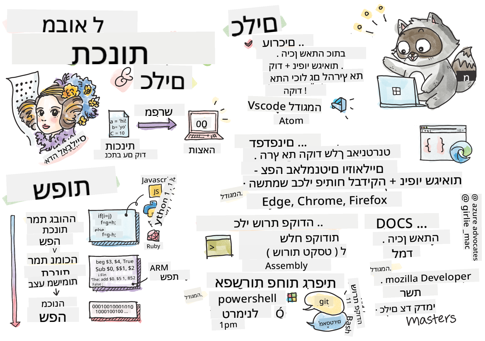

<!--
CO_OP_TRANSLATOR_METADATA:
{
  "original_hash": "2dcbb9259dee4f20a4f08d9a1aa2bd4c",
  "translation_date": "2025-08-29T01:21:22+00:00",
  "source_file": "1-getting-started-lessons/1-intro-to-programming-languages/README.md",
  "language_code": "he"
}
-->
# מבוא לשפות תכנות וכלי עבודה

השיעור הזה מכסה את היסודות של שפות תכנות. הנושאים המוצגים כאן רלוונטיים לרוב שפות התכנות המודרניות כיום. בחלק "כלי עבודה", תלמדו על תוכנות שימושיות שמסייעות לכם כמפתחים.


> סקיצה מאת [Tomomi Imura](https://twitter.com/girlie_mac)

## שאלון לפני השיעור
[שאלון לפני השיעור](https://forms.office.com/r/dru4TE0U9n?origin=lprLink)

## מבוא

בשיעור הזה נעסוק ב:

- מהי תכנות?
- סוגי שפות תכנות
- אלמנטים בסיסיים בתוכנית
- תוכנות וכלים שימושיים למפתח מקצועי

> ניתן לקחת את השיעור הזה ב-[Microsoft Learn](https://docs.microsoft.com/learn/modules/web-development-101/introduction-programming/?WT.mc_id=academic-77807-sagibbon)!

## מהי תכנות?

תכנות (המכונה גם קידוד) הוא תהליך כתיבת הוראות למכשיר כמו מחשב או מכשיר נייד. אנו כותבים את ההוראות הללו באמצעות שפת תכנות, שמפורשת לאחר מכן על ידי המכשיר. מערכי ההוראות הללו עשויים להיקרא בשמות שונים, אך *תוכנית*, *תוכנית מחשב*, *אפליקציה (app)* ו-*קובץ הרצה* הם כמה מהשמות הפופולריים.

*תוכנית* יכולה להיות כל דבר שנכתב עם קוד; אתרים, משחקים ואפליקציות טלפון הם תוכניות. למרות שאפשר ליצור תוכנית ללא כתיבת קוד, ההיגיון הבסיסי מפורש על ידי המכשיר, וההיגיון הזה ככל הנראה נכתב עם קוד. תוכנית ש-*רצה* או *מבצעת* קוד מבצעת הוראות. המכשיר שבו אתם קוראים את השיעור הזה מריץ תוכנית שמדפיסה אותו על המסך שלכם.

✅ בצעו מחקר קטן: מי נחשב למתכנת המחשב הראשון בעולם?

## שפות תכנות

שפות תכנות מאפשרות למפתחים לכתוב הוראות למכשיר. מכשירים יכולים להבין רק בינארי (0 ו-1), ולרוב המפתחים זו לא דרך יעילה לתקשר. שפות תכנות הן הכלי לתקשורת בין בני אדם למחשבים.

שפות תכנות מגיעות בפורמטים שונים ועשויות לשרת מטרות שונות. לדוגמה, JavaScript משמשת בעיקר לאפליקציות אינטרנט, בעוד Bash משמשת בעיקר למערכות הפעלה.

*שפות ברמה נמוכה* דורשות בדרך כלל פחות שלבים מאשר *שפות ברמה גבוהה* כדי שמכשיר יפרש הוראות. עם זאת, מה שהופך שפות ברמה גבוהה לפופולריות הוא הקריאות והתמיכה שלהן. JavaScript נחשבת לשפה ברמה גבוהה.

הקוד הבא ממחיש את ההבדל בין שפה ברמה גבוהה עם JavaScript לבין שפה ברמה נמוכה עם קוד אסמבלי ARM.

```javascript
let number = 10
let n1 = 0, n2 = 1, nextTerm;

for (let i = 1; i <= number; i++) {
    console.log(n1);
    nextTerm = n1 + n2;
    n1 = n2;
    n2 = nextTerm;
}
```

```c
 area ascen,code,readonly
 entry
 code32
 adr r0,thumb+1
 bx r0
 code16
thumb
 mov r0,#00
 sub r0,r0,#01
 mov r1,#01
 mov r4,#10
 ldr r2,=0x40000000
back add r0,r1
 str r0,[r2]
 add r2,#04
 mov r3,r0
 mov r0,r1
 mov r1,r3
 sub r4,#01
 cmp r4,#00
 bne back
 end
```

תאמינו או לא, *שניהם עושים את אותו הדבר*: מדפיסים רצף פיבונאצ'י עד 10.

✅ רצף פיבונאצ'י [מוגדר](https://en.wikipedia.org/wiki/Fibonacci_number) כקבוצת מספרים שבה כל מספר הוא סכום של שני המספרים הקודמים לו, החל מ-0 ו-1. עשרת המספרים הראשונים ברצף פיבונאצ'י הם 0, 1, 1, 2, 3, 5, 8, 13, 21 ו-34.

## אלמנטים בתוכנית

הוראה יחידה בתוכנית נקראת *פקודה* ובדרך כלל תהיה לה תו או רווח שמסמן היכן ההוראה מסתיימת, או *מסתיימת*. איך תוכנית מסתיימת משתנה בין שפה לשפה.

פקודות בתוך תוכנית עשויות להסתמך על נתונים שסופקו על ידי משתמש או ממקור אחר כדי לבצע הוראות. נתונים יכולים לשנות את אופן הפעולה של תוכנית, ולכן שפות תכנות מגיעות עם דרך לאחסן נתונים באופן זמני כך שניתן יהיה להשתמש בהם מאוחר יותר. אלה נקראים *משתנים*. משתנים הם פקודות שמורות למכשיר לשמור נתונים בזיכרון שלו. משתנים בתוכניות דומים למשתנים באלגברה, שבהם יש להם שם ייחודי והערך שלהם עשוי להשתנות עם הזמן.

יש סיכוי שחלק מהפקודות לא יבוצעו על ידי מכשיר. זה בדרך כלל נעשה בכוונה על ידי המפתח או בטעות כאשר מתרחשת שגיאה בלתי צפויה. סוג זה של שליטה על אפליקציה הופך אותה ליותר חזקה וניתנת לתחזוקה. בדרך כלל, שינויים אלה בשליטה מתרחשים כאשר תנאים מסוימים מתקיימים. פקודה נפוצה בשפות תכנות מודרניות לשליטה על אופן הפעולה של תוכנית היא פקודת `if..else`.

✅ תלמדו יותר על סוג הפקודה הזה בשיעורים הבאים.

## כלי עבודה

[](https://youtube.com/watch?v=69WJeXGBdxg "Tools of the Trade")

> 🎥 לחצו על התמונה למעלה לצפייה בסרטון על כלים

בחלק הזה תלמדו על כמה תוכנות שעשויות להיות מאוד שימושיות כשאתם מתחילים את המסע שלכם כמפתחים מקצועיים.

**סביבת פיתוח** היא סט ייחודי של כלים ותכונות שמפתח משתמש בהם לעיתים קרובות בעת כתיבת תוכנה. חלק מהכלים הללו הותאמו לצרכים הספציפיים של המפתח, ועשויים להשתנות עם הזמן אם המפתח משנה סדרי עדיפויות בעבודה, בפרויקטים אישיים, או כאשר הוא משתמש בשפת תכנות אחרת. סביבת פיתוח היא ייחודית כמו המפתחים שמשתמשים בה.

### עורכים

אחד הכלים הקריטיים ביותר לפיתוח תוכנה הוא העורך. עורכים הם המקום שבו אתם כותבים את הקוד שלכם ולעיתים גם המקום שבו אתם מריצים אותו.

מפתחים מסתמכים על עורכים מכמה סיבות נוספות:

- *איתור באגים* מסייע לחשוף באגים ושגיאות על ידי מעבר על הקוד, שורה אחר שורה. חלק מהעורכים כוללים יכולות איתור באגים; ניתן להתאים אותם ולהוסיף אותם לשפות תכנות ספציפיות.
- *הדגשת תחביר* מוסיפה צבעים ועיצוב טקסט לקוד, מה שהופך אותו לקריא יותר. רוב העורכים מאפשרים התאמה אישית של הדגשת תחביר.
- *תוספים ואינטגרציות* הם כלים מיוחדים למפתחים, על ידי מפתחים. כלים אלה לא נבנו לתוך העורך הבסיסי. לדוגמה, מפתחים רבים מתעדים את הקוד שלהם כדי להסביר איך הוא עובד. הם עשויים להתקין תוסף לבדיקת איות כדי לעזור למצוא שגיאות כתיב בתיעוד. רוב התוספים מיועדים לשימוש בתוך עורך ספציפי, ורוב העורכים מגיעים עם דרך לחפש תוספים זמינים.
- *התאמה אישית* מאפשרת למפתחים ליצור סביבת פיתוח ייחודית שמתאימה לצרכים שלהם. רוב העורכים ניתנים להתאמה אישית רבה ועשויים גם לאפשר למפתחים ליצור תוספים מותאמים אישית.

#### עורכים פופולריים ותוספים לפיתוח אינטרנט

- [Visual Studio Code](https://code.visualstudio.com/?WT.mc_id=academic-77807-sagibbon)
  - [Code Spell Checker](https://marketplace.visualstudio.com/items?itemName=streetsidesoftware.code-spell-checker)
  - [Live Share](https://marketplace.visualstudio.com/items?itemName=MS-vsliveshare.vsliveshare)
  - [Prettier - Code formatter](https://marketplace.visualstudio.com/items?itemName=esbenp.prettier-vscode)
- [Atom](https://atom.io/)
  - [spell-check](https://atom.io/packages/spell-check)
  - [teletype](https://atom.io/packages/teletype)
  - [atom-beautify](https://atom.io/packages/atom-beautify)
  
- [Sublimetext](https://www.sublimetext.com/)
  - [emmet](https://emmet.io/)
  - [SublimeLinter](http://www.sublimelinter.com/en/stable/)

### דפדפנים

כלי קריטי נוסף הוא הדפדפן. מפתחי אינטרנט מסתמכים על הדפדפן כדי לראות איך הקוד שלהם פועל באינטרנט. הוא גם משמש להצגת האלמנטים הוויזואליים של דף אינטרנט שנכתבו בעורך, כמו HTML.

רבים מהדפדפנים מגיעים עם *כלי מפתחים* (DevTools) שמכילים סט של תכונות ומידע מועילים כדי לעזור למפתחים לאסוף וללכוד מידע חשוב על האפליקציה שלהם. לדוגמה: אם לדף אינטרנט יש שגיאות, לפעמים מועיל לדעת מתי הן התרחשו. ניתן להגדיר את כלי המפתחים בדפדפן כדי ללכוד מידע זה.

#### דפדפנים וכלי מפתחים פופולריים

- [Edge](https://docs.microsoft.com/microsoft-edge/devtools-guide-chromium/?WT.mc_id=academic-77807-sagibbon)
- [Chrome](https://developers.google.com/web/tools/chrome-devtools/)
- [Firefox](https://developer.mozilla.org/docs/Tools)

### כלי שורת פקודה

חלק מהמפתחים מעדיפים תצוגה פחות גרפית למשימות היומיומיות שלהם ומסתמכים על שורת הפקודה כדי להשיג זאת. כתיבת קוד דורשת כמות משמעותית של הקלדה וחלק מהמפתחים מעדיפים לא להפריע לזרימה שלהם על המקלדת. הם ישתמשו בקיצורי מקלדת כדי לעבור בין חלונות שולחן העבודה, לעבוד על קבצים שונים ולהשתמש בכלים. רוב המשימות יכולות להתבצע עם עכבר, אך יתרון אחד של שימוש בשורת הפקודה הוא שניתן לבצע הרבה עם כלי שורת פקודה מבלי הצורך לעבור בין העכבר למקלדת. יתרון נוסף של שורת הפקודה הוא שהיא ניתנת להתאמה אישית, ניתן לשמור תצורה מותאמת אישית, לשנות אותה מאוחר יותר ולייבא אותה למחשבי פיתוח אחרים. מכיוון שסביבות פיתוח כל כך ייחודיות לכל מפתח, חלקם יימנעו משימוש בשורת הפקודה, חלקם יסתמכו עליה לחלוטין, וחלקם יעדיפו שילוב של השניים.

### אפשרויות שורת פקודה פופולריות

אפשרויות לשורת הפקודה ישתנו בהתאם למערכת ההפעלה שבה אתם משתמשים.

*💻 = מגיעה מותקנת מראש במערכת ההפעלה.*

#### Windows

- [Powershell](https://docs.microsoft.com/powershell/scripting/overview?view=powershell-7/?WT.mc_id=academic-77807-sagibbon) 💻
- [Command Line](https://docs.microsoft.com/windows-server/administration/windows-commands/windows-commands/?WT.mc_id=academic-77807-sagibbon) (המכונה גם CMD) 💻
- [Windows Terminal](https://docs.microsoft.com/windows/terminal/?WT.mc_id=academic-77807-sagibbon)
- [mintty](https://mintty.github.io/)
  
#### MacOS

- [Terminal](https://support.apple.com/guide/terminal/open-or-quit-terminal-apd5265185d-f365-44cb-8b09-71a064a42125/mac) 💻
- [iTerm](https://iterm2.com/)
- [Powershell](https://docs.microsoft.com/powershell/scripting/install/installing-powershell-core-on-macos?view=powershell-7/?WT.mc_id=academic-77807-sagibbon)

#### Linux

- [Bash](https://www.gnu.org/software/bash/manual/html_node/index.html) 💻
- [KDE Konsole](https://docs.kde.org/trunk5/en/konsole/konsole/index.html)
- [Powershell](https://docs.microsoft.com/powershell/scripting/install/installing-powershell-core-on-linux?view=powershell-7/?WT.mc_id=academic-77807-sagibbon)

#### כלי שורת פקודה פופולריים

- [Git](https://git-scm.com/) (💻 ברוב מערכות ההפעלה)
- [NPM](https://www.npmjs.com/)
- [Yarn](https://classic.yarnpkg.com/en/docs/cli/)

### תיעוד

כאשר מפתח רוצה ללמוד משהו חדש, הוא ככל הנראה יפנה לתיעוד כדי ללמוד כיצד להשתמש בו. מפתחים מסתמכים לעיתים קרובות על תיעוד כדי להדריך אותם כיצד להשתמש בכלים ושפות בצורה נכונה, וגם כדי להעמיק את הידע שלהם על איך זה עובד.

#### תיעוד פופולרי על פיתוח אינטרנט

- [Mozilla Developer Network (MDN)](https://developer.mozilla.org/docs/Web), מאת Mozilla, המוציאים לאור של דפדפן [Firefox](https://www.mozilla.org/firefox/)
- [Frontend Masters](https://frontendmasters.com/learn/)
- [Web.dev](https://web.dev), מאת Google, המוציאים לאור של [Chrome](https://www.google.com/chrome/)
- [התיעוד של Microsoft](https://docs.microsoft.com/microsoft-edge/#microsoft-edge-for-developers), עבור [Microsoft Edge](https://www.microsoft.com/edge)
- [W3 Schools](https://www.w3schools.com/where_to_start.asp)

✅ בצעו מחקר: עכשיו כשאתם יודעים את היסודות של סביבת מפתח אינטרנט, השוו אותה לסביבת מעצב אינטרנט.

---

## 🚀 אתגר

השוו בין כמה שפות תכנות. מהם כמה מהמאפיינים הייחודיים של JavaScript לעומת Java? ומה לגבי COBOL לעומת Go?

## שאלון אחרי השיעור
[שאלון אחרי השיעור](https://ff-quizzes.netlify.app/web/)

## סקירה ולימוד עצמי

למדו קצת על השפות השונות הזמינות למתכנת. נסו לכתוב שורה בשפה אחת, ואז כתבו אותה מחדש בשתי שפות אחרות. מה למדתם?

## משימה

[קריאת התיעוד](assignment.md)

---

**כתב ויתור**:  
מסמך זה תורגם באמצעות שירות תרגום מבוסס בינה מלאכותית [Co-op Translator](https://github.com/Azure/co-op-translator). למרות שאנו שואפים לדיוק, יש לקחת בחשבון שתרגומים אוטומטיים עשויים להכיל שגיאות או אי-דיוקים. המסמך המקורי בשפתו המקורית נחשב למקור הסמכותי. למידע קריטי, מומלץ להשתמש בתרגום מקצועי על ידי מתרגם אנושי. איננו נושאים באחריות לכל אי-הבנה או פרשנות שגויה הנובעת משימוש בתרגום זה.