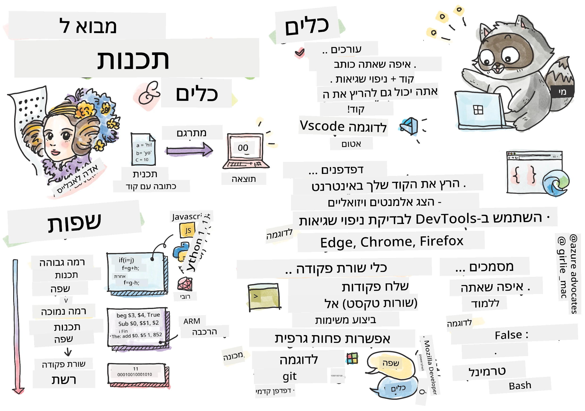
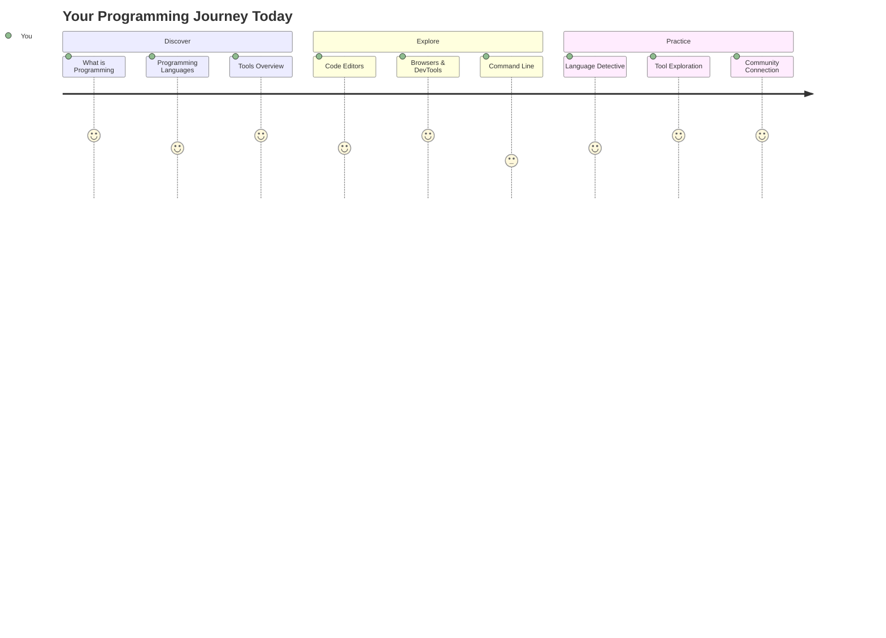
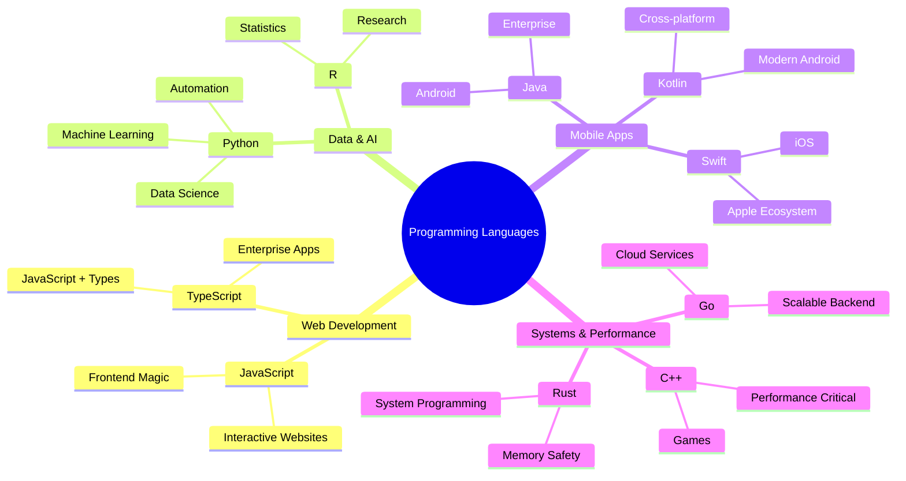
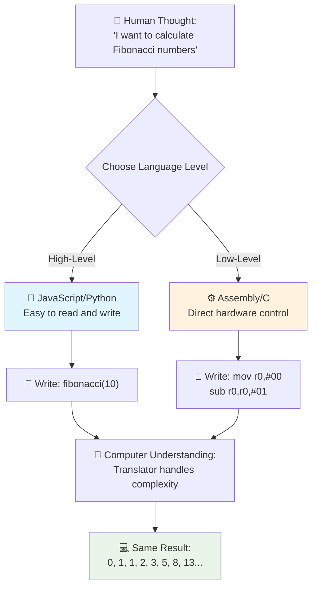
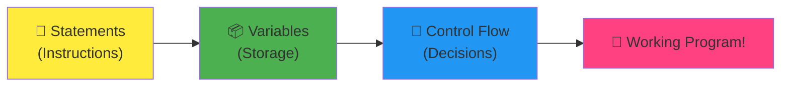
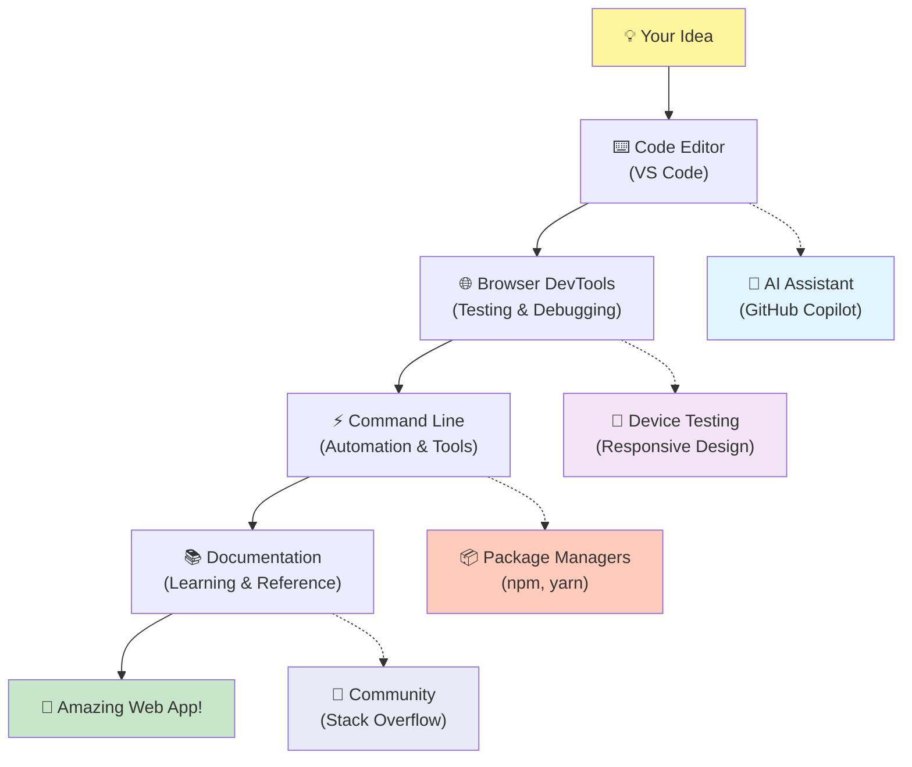
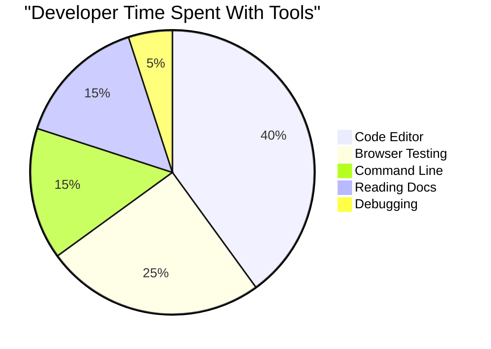
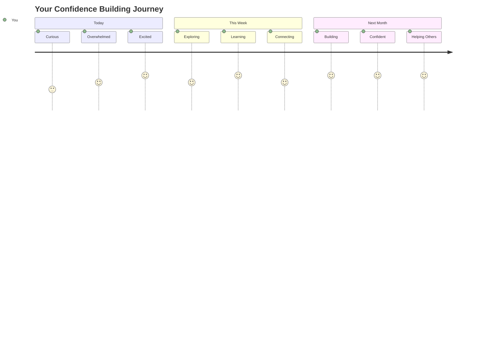

# מבוא לשפות תכנות וכלי פיתוח מודרניים

היי שם, מפתח עתידי! 👋 אפשר לספר לך משהו שעדיין גורם לי להתרגש כל יום מחדש? אתה עומד לגלות שתכנות זה לא רק מחשבים – זה כמו לקבל כוחות-על שמאפשרים לך להפוך את הרעיונות הכי פרועים שלך למציאות!

אתה מכיר את הרגע הזה שבו אתה משתמש באפליקציה האהובה עליך והכול פשוט עובד בצורה מושלמת? כשאתה לוחץ על כפתור ומשהו קסום קורה שגורם לך לחשוב "וואו, איך הם עשו את זה?" ובכן, מישהו בדיוק כמוך – כנראה יושב בבית קפה אהוב עליו ב-2 בלילה עם האספרסו השלישי שלו – כתב את הקוד שיצר את הקסם הזה. והנה מה שיפיל אותך מהכיסא: בסוף השיעור הזה, לא רק שתבין איך הם עשו את זה, אלא גם תשתוקק לנסות בעצמך!

תראה, אני לגמרי מבין אם תכנות מרגיש לך מפחיד כרגע. כשאני התחלתי, באמת חשבתי שצריך להיות גאון מתמטי או להתחיל לתכנת מגיל חמש. אבל הנה מה ששינה לי את התפיסה לגמרי: תכנות זה בדיוק כמו ללמוד לנהל שיחות בשפה חדשה. מתחילים מ"שלום" ו"תודה", ואז מתקדמים להזמנת קפה, ולפני שאתה שם לב, אתה מנהל דיונים פילוסופיים עמוקים! רק שבמקרה הזה, אתה מנהל שיחות עם מחשבים, ובכנות? הם השותפים הכי סבלניים לשיחה שתפגוש – הם אף פעם לא שופטים את הטעויות שלך ותמיד מוכנים לנסות שוב!

היום, אנחנו הולכים לחקור את הכלים המדהימים שהופכים את פיתוח האינטרנט המודרני לא רק לאפשרי, אלא לממכר ברצינות. אני מדבר על אותם עורכים, דפדפנים ותהליכי עבודה שהמפתחים בנטפליקס, ספוטיפיי, ובסטודיו האפליקציות האהוב עליך משתמשים בהם כל יום. והנה החלק שיגרום לך לרקוד משמחה: רוב הכלים המקצועיים האלה, ברמת תעשייה, הם לגמרי בחינם!


> איור מאת [Tomomi Imura](https://twitter.com/girlie_mac)



## בוא נראה מה אתה כבר יודע!

לפני שנקפוץ לדברים המהנים, אני סקרן – מה אתה כבר יודע על עולם התכנות הזה? ואם אתה מסתכל על השאלות וחושב "אין לי מושג על שום דבר מזה", זה לא רק בסדר, זה מושלם! זה אומר שאתה בדיוק במקום הנכון. תחשוב על החידון הזה כמו מתיחות לפני אימון – אנחנו רק מחממים את שרירי המוח!

[קח את חידון ההכנה לשיעור](https://forms.office.com/r/dru4TE0U9n?origin=lprLink)

## ההרפתקה שאנחנו עומדים לצאת אליה יחד

אוקיי, אני באמת מתרגש ממה שאנחנו הולכים לחקור היום! ברצינות, הלוואי שיכולתי לראות את הפנים שלך כשחלק מהקונספטים האלה יתחברו. הנה המסע המדהים שאנחנו יוצאים אליו יחד:

- **מה זה בעצם תכנות (ולמה זה הדבר הכי מגניב שיש!)** – נגלה איך קוד הוא בעצם הקסם הבלתי נראה שמניע את כל מה שסביבך, מהשעון המעורר שיודע איכשהו שזה יום שני בבוקר ועד האלגוריתם שממליץ לך על הסרטים המושלמים בנטפליקס.
- **שפות תכנות והאישיות המדהימה שלהן** – תאר לעצמך שאתה נכנס למסיבה שבה לכל אדם יש כוחות-על שונים ודרכים ייחודיות לפתור בעיות. זה בדיוק העולם של שפות התכנות, ואתה הולך להתאהב בהן!
- **אבני הבניין הבסיסיות שמאפשרות קסם דיגיטלי** – תחשוב על זה כמו ערכת LEGO יצירתית אולטימטיבית. ברגע שתבין איך החלקים האלה מתחברים, תבין שאתה יכול לבנות כל דבר שהדמיון שלך חולם עליו.
- **כלים מקצועיים שיגרמו לך להרגיש כאילו קיבלת שרביט קסמים** – אני לא מגזים כאן – הכלים האלה באמת יגרמו לך להרגיש שיש לך כוחות-על, והחלק הכי טוב? אלה אותם כלים שהמקצוענים משתמשים בהם!

> 💡 **הנה העניין**: אל תחשוב אפילו לנסות לזכור הכול היום! כרגע, אני רק רוצה שתרגיש את הניצוץ של ההתרגשות לגבי מה שאפשרי. הפרטים יידבקו באופן טבעי כשנתרגל יחד – ככה למידה אמיתית מתרחשת!

> אתה יכול לקחת את השיעור הזה ב-[Microsoft Learn](https://docs.microsoft.com/learn/modules/web-development-101/introduction-programming/?WT.mc_id=academic-77807-sagibbon)!

## אז מה זה בעצם *תכנות*?

טוב, בואו ניגש לשאלה של מיליון הדולר: מה זה באמת תכנות?

אני אספר לך סיפור ששינה לגמרי את איך שאני חושב על זה. בשבוע שעבר ניסיתי להסביר לאמא שלי איך להשתמש בשלט החדש של הטלוויזיה החכמה שלנו. תפסתי את עצמי אומר דברים כמו "לחצי על הכפתור האדום, אבל לא הכפתור האדום הגדול, הכפתור האדום הקטן בצד שמאל... לא, השמאל השני שלך... אוקיי, עכשיו תחזיקי אותו לשתי שניות, לא אחת, לא שלוש..." מוכר? 😅

זה תכנות! זו האמנות של לתת הוראות מפורטות, שלב אחר שלב, למשהו שהוא מאוד חזק אבל צריך שהכול יוסבר בצורה מושלמת. רק שבמקום להסביר לאמא שלך (שיכולה לשאול "איזה כפתור אדום?!"), אתה מסביר למחשב (שפשוט עושה בדיוק מה שאמרת, גם אם מה שאמרת לא בדיוק מה שהתכוונת).

הנה מה שהדהים אותי כשגיליתי את זה: מחשבים הם בעצם די פשוטים בבסיסם. הם מבינים רק שני דברים – 1 ו-0, שזה בעצם רק "כן" ו"לא" או "דלוק" ו"כבוי". זהו! אבל כאן מגיע הקסם – אנחנו לא צריכים לדבר ב-1 ו-0 כאילו אנחנו במטריקס. כאן נכנסות **שפות התכנות** לתמונה. הן כמו מתורגמן הכי טוב בעולם שלוקח את המחשבות האנושיות שלך ומתרגם אותן לשפת מחשב.

והנה מה שעדיין גורם לי לצמרמורת כל בוקר כשאני מתעורר: כל דבר דיגיטלי בחיים שלך התחיל עם מישהו בדיוק כמוך, כנראה יושב בפיג'מה עם כוס קפה, מקליד קוד במחשב הנייד שלו. הפילטר באינסטגרם שגורם לך להיראות מושלם? מישהו כתב את זה. ההמלצה שהובילה אותך לשיר החדש האהוב עליך? מפתח בנה את האלגוריתם הזה. האפליקציה שעוזרת לך לחלק את החשבון בארוחת ערב עם חברים? כן, מישהו חשב "זה מעצבן, אני בטוח יכול לפתור את זה" ואז... הוא עשה את זה!

כשאתה לומד לתכנת, אתה לא רק רוכש מיומנות חדשה – אתה הופך לחלק מהקהילה המדהימה הזו של פותרי בעיות שמבלים את ימיהם במחשבה, "מה אם אני יכול לבנות משהו שישפר את היום של מישהו קצת יותר?" בכנות, יש משהו יותר מגניב מזה?

✅ **ציד עובדות כיפי**: הנה משהו מגניב לחפש כשיש לך רגע פנוי – מי לדעתך היה המתכנת הראשון בעולם? אני אתן לך רמז: זה אולי לא מי שאתה מצפה! הסיפור מאחורי האדם הזה הוא מרתק ומראה שתכנות תמיד היה קשור ליצירתיות ולחשיבה מחוץ לקופסה.

### 🧠 **זמן לבדוק: איך אתה מרגיש?**

**קח רגע לחשוב:**
- האם הרעיון של "לתת הוראות למחשבים" ברור לך עכשיו?
- האם אתה יכול לחשוב על משימה יומיומית שהיית רוצה להפוך לאוטומטית באמצעות תכנות?
- אילו שאלות עולות לך בראש לגבי כל עניין התכנות הזה?

> **זכור**: זה לגמרי נורמלי אם חלק מהקונספטים עדיין לא ברורים לך. ללמוד תכנות זה כמו ללמוד שפה חדשה – לוקח זמן למוח לבנות את הקשרים הנכונים. אתה עושה עבודה נהדרת!

## שפות תכנות הן כמו טעמים שונים של קסם

אוקיי, זה הולך להישמע מוזר, אבל תישאר איתי – שפות תכנות הן כמו סוגים שונים של מוזיקה. תחשוב על זה: יש לך ג'אז, שהוא חלק ומאולתר, רוק שהוא עוצמתי וישיר, קלאסי שהוא אלגנטי ומובנה, והיפ-הופ שהוא יצירתי ומלא ביטוי. לכל סגנון יש את האווירה שלו, את הקהילה של מעריצים נלהבים, וכל אחד מהם מושלם למצבי רוח ואירועים שונים.

שפות תכנות עובדות בדיוק אותו הדבר! אתה לא תשתמש באותה שפה כדי לבנות משחק מובייל כיפי כמו שתשתמש כדי לנתח כמויות עצומות של נתוני אקלים, בדיוק כמו שלא תנגן מטאל כבד בשיעור יוגה (טוב, ברוב שיעורי היוגה בכל אופן! 😄).

אבל הנה מה שמדהים אותי כל פעם מחדש כשאני חושב על זה: השפות האלה הן כמו שיש לך את המתרגם הכי סבלני ומבריק בעולם שיושב ממש לידך. אתה יכול להביע את הרעיונות שלך בצורה שנראית טבעית למוח האנושי שלך, והן מטפלות בכל העבודה המורכבת של תרגום זה לשפת המחשב. זה כמו שיש לך חבר שמדבר בצורה מושלמת גם "יצירתיות אנושית" וגם "לוגיקה מחשבית" – והוא אף פעם לא מתעייף, אף פעם לא צריך הפסקות קפה, ואף פעם לא שופט אותך על כך ששאלת את אותה שאלה פעמיים!

### שפות תכנות פופולריות והשימושים שלהן



| שפה | הכי טוב ל... | למה היא פופולרית |
|----------|----------|------------------|
| **JavaScript** | פיתוח אתרים, ממשקי משתמש | פועלת בדפדפנים ומפעילה אתרים אינטראקטיביים |
| **Python** | מדעי הנתונים, אוטומציה, AI | קלה לקריאה ולמידה, ספריות חזקות |
| **Java** | אפליקציות ארגוניות, אפליקציות אנדרואיד | עצמאית מפלטפורמה, יציבה למערכות גדולות |
| **C#** | אפליקציות חלונות, פיתוח משחקים | תמיכה חזקה באקוסיסטם של מיקרוסופט |
| **Go** | שירותי ענן, מערכות אחוריות | מהירה, פשוטה, מעוצבת למחשוב מודרני |

### שפות ברמה גבוהה מול שפות ברמה נמוכה

אוקיי, זה היה באמת הקונספט ששבר לי את המוח כשאני התחלתי ללמוד, אז אני הולך לשתף את האנלוגיה שסוף סוף גרמה לי להבין את זה – ואני באמת מקווה שזה יעזור גם לך!

תאר לעצמך שאתה מבקר במדינה שבה אתה לא מדבר את השפה, ואתה נואש למצוא את השירותים הקרובים (כולנו היינו שם, נכון? 😅):

- **תכנות ברמה נמוכה** זה כמו ללמוד את הדיאלקט המקומי כל כך טוב שאתה יכול לשוחח עם הסבתא שמוכרת פירות בפינה באמצעות רפרנסים תרבותיים, סלנג מקומי ובדיחות פנימיות שרק מישהו שגדל שם יבין. מרשים מאוד ויעיל להפליא... אם במקרה אתה שולט! אבל די מכריע כשאתה רק מנסה למצוא שירותים.

- **תכנות ברמה גבוהה** זה כמו שיש לך את החבר המקומי המדהים שפשוט מבין אותך. אתה יכול לומר "אני באמת צריך למצוא שירותים" באנגלית פשוטה, והוא מטפל בכל התרגום התרבותי ונותן לך הוראות בצורה שמובנת למוח הלא-מקומי שלך.

במונחי תכנות:
- **שפות ברמה נמוכה** (כמו Assembly או C) מאפשרות לך לנהל שיחות מפורטות להפליא עם החומרה של המחשב, אבל אתה צריך לחשוב כמו מכונה, שזה... טוב, בוא נגיד שזה שינוי מחשבתי די גדול!
- **שפות ברמה גבוהה** (כמו JavaScript, Python או C#) מאפשרות לך לחשוב כמו בן אדם בזמן שהן מטפלות בכל שפת המכונה מאחורי הקלעים. בנוסף, יש להן קהילות מאוד מזמינות מלאות באנשים שזוכרים איך זה להיות חדש ורוצים באמת לעזור!

נחש אילו אני הולך להציע לך להתחיל איתן? 😉 שפות ברמה גבוהה הן כמו גלגלי עזר שאתה אף פעם לא באמת רוצה להוריד כי הן הופכות את כל החוויה להרבה יותר מהנה!



### תן לי להראות לך למה שפות ברמה גבוהה כל כך ידידותיות

אוקיי, אני עומד להראות לך משהו שמדגים בצורה מושלמת למה התאהבתי בשפות ברמה גבוהה, אבל קודם – אני צריך שתבטיח לי משהו. כשאתה רואה את דוגמת הקוד הראשונה, אל תיבהל! זה אמור להיראות מאיים. זו בדיוק הנקודה שאני מנסה להבהיר!

אנחנו הולכים להסתכל על אותה משימה בדיוק שנכתבה בשני סגנונות שונים לחלוטין. שניהם יוצרים את מה שנקרא רצף פיבונאצ'י – זה דפוס מתמטי יפהפה שבו כל מספר הוא סכום של שני הקודמים לו: 0, 1, 1, 2, 3, 5, 8, 13... (עובדה מעניינת: תמצא את הדפוס הזה כמעט בכל מקום בטבע – ספירלות של זרעי חמנייה, דפוסי אצטרובלים, אפילו הדרך שבה גלקסיות נוצרות!)

מוכן לראות את ההבדל? בוא נתחיל!

**שפה ברמה גבוהה (JavaScript) – ידידותית לאדם:**

```javascript
// Step 1: Basic Fibonacci setup
const fibonacciCount = 10;
let current = 0;
let next = 1;

console.log('Fibonacci sequence:');
```

**הנה מה שהקוד הזה עושה:**
- **הגדרת** קבוע שמציין כמה מספרי פיבונאצ'י אנחנו רוצים ליצור
- **אתחול** שני משתנים למעקב אחר המספר הנוכחי והבא ברצף
- **הגדרת** ערכי ההתחלה (0 ו-1) שמגדירים את דפוס פיבונאצ'י
- **הצגת** הודעת כותרת לזיהוי הפלט שלנו

```javascript
// Step 2: Generate the sequence with a loop
for (let i = 0; i < fibonacciCount; i++) {
  console.log(`Position ${i + 1}: ${current}`);
  
  // Calculate next number in sequence
  const sum = current + next;
  current = next;
  next = sum;
}
```

**פירוט מה קורה כאן:**
- **לולאה** דרך כל מיקום ברצף שלנו באמצעות לולאת `for`
- **הצגת** כל מספר עם מיקומו באמצעות תבנית פורמט טקסט
- **חישוב** המספר הבא ברצף פיבונאצ'י על ידי הוספת הערכים הנוכחיים והבאים
- **עדכון** משתני המעקב שלנו למעבר לאיטרציה הבאה

```javascript
// Step 3: Modern functional approach
const generateFibonacci = (count) => {
  const sequence = [0, 1];
  
  for (let i = 2; i < count; i++) {
    sequence[i] = sequence[i - 1] + sequence[i - 2];
  }
  
  return sequence;
};

// Usage example
const fibSequence = generateFibonacci(10);
console.log(fibSequence);
```

**במהלך הקוד הזה:**
- **יצרנו** פונקציה לשימוש חוזר באמצעות תחביר פונקציה מודרני
- **בנינו** מערך לאחסון הרצף המלא במקום להציג מספר אחד בכל פעם
- **השתמשנו** באינדקסים של מערך לחישוב כל מספר חדש מערכים קודמים
- **החזרנו** את הרצף המלא לשימוש גמיש בחלקים אחרים של התוכנית שלנו

**שפה ברמה נמוכה (ARM Assembly) – ידידותית למחשב:**

```assembly
 area ascen,code,readonly
 entry
 code32
 adr r0,thumb+1
 bx r0
 code16
thumb
 mov r0,#00
 sub r0,r0,#01
 mov r1,#01
 mov r4,#10
 ldr r2,=0x40000000
back add r0,r1
 str r0,[r2]
 add r2,#04
 mov r3,r0
 mov r0,r1
 mov r1,r3
 sub r4,#01
 cmp r4,#00
 bne back
 end
```

שים לב איך הגרסה של JavaScript נקראת כמעט כמו הוראות באנגלית, בעוד שהגרסה של Assembly משתמשת בפקודות קריפטיות שמבצעות שליטה ישירה על המעבד של המחשב. שתיהן מבצעות את אותה משימה בדיוק, אבל השפה ברמה גבוהה הרבה יותר קלה להבנה, כתיבה ותחזוקה.

**הבדלים מרכזיים שתשים לב אליהם:**
- **קריאות**: JavaScript משתמשת בשמות תיאוריים כמו `fibonacciCount` בעוד ש-Assembly משתמשת בתוויות קריפטיות כמו `r0`, `r1`
- **הערות**: שפות תכנות ברמה גבוהה מעודדות כתיבת הערות שמסבירות את הקוד והופכות אותו למובן מאליו.
- **מבנה**: הזרימה הלוגית של JavaScript תואמת את הדרך שבה בני אדם חושבים על בעיות שלב אחר שלב.
- **תחזוקה**: עדכון גרסת JavaScript לדרישות שונות הוא פשוט וברור.

✅ **על סדרת פיבונאצ'י**: הדפוס המספרי המדהים הזה (שבו כל מספר שווה לסכום של שני המספרים הקודמים: 0, 1, 1, 2, 3, 5, 8...) מופיע ממש *בכל מקום* בטבע! תמצאו אותו בספירלות של חמניות, בדפוסים של אצטרובלים, בצורת הקימור של קונכיות נאוטילוס ואפילו באופן שבו ענפי עצים גדלים. זה די מדהים איך מתמטיקה וקוד יכולים לעזור לנו להבין ולשחזר את הדפוסים שהטבע משתמש בהם כדי ליצור יופי!

## אבני הבניין שמייצרות את הקסם

טוב, עכשיו כשכבר ראיתם איך שפות תכנות נראות בפעולה, בואו נפרק את החלקים הבסיסיים שמרכיבים כל תוכנה שנכתבה אי פעם. תחשבו עליהם כמו המרכיבים החיוניים במתכון האהוב עליכם – ברגע שתבינו מה כל אחד עושה, תוכלו לקרוא ולכתוב קוד כמעט בכל שפה!

זה קצת כמו ללמוד את הדקדוק של תכנות. זוכרים בבית הספר שלמדתם על שמות עצם, פעלים ואיך להרכיב משפטים? לתכנות יש גרסה משלו לדקדוק, ובכנות, זה הרבה יותר הגיוני וסלחני מדקדוק באנגלית אי פעם! 😄

### פקודות: ההוראות שלב אחר שלב

נתחיל עם **פקודות** – הן כמו משפטים בודדים בשיחה עם המחשב שלכם. כל פקודה אומרת למחשב לעשות דבר ספציפי אחד, קצת כמו לתת הוראות: "פנה שמאלה כאן", "עצור באור אדום", "חנה במקום הזה".

מה שאני אוהב בפקודות זה כמה שהן בדרך כלל קריאות. תראו את זה:

```javascript
// Basic statements that perform single actions
const userName = "Alex";                    
console.log("Hello, world!");              
const sum = 5 + 3;                         
```

**הנה מה שהקוד הזה עושה:**
- **הכרזה** על משתנה קבוע לאחסון שם המשתמש
- **הצגת** הודעת ברכה בפלט הקונסולה
- **חישוב** ואחסון תוצאה של פעולה מתמטית

```javascript
// Statements that interact with web pages
document.title = "My Awesome Website";      
document.body.style.backgroundColor = "lightblue";
```

**שלב אחר שלב, הנה מה שקורה:**
- **שינוי** כותרת הדף שמופיעה בלשונית הדפדפן
- **שינוי** צבע הרקע של כל גוף הדף

### משתנים: מערכת הזיכרון של התוכנה שלכם

אוקיי, **משתנים** הם בכנות אחד המושגים האהובים עליי ללמד כי הם כל כך דומים לדברים שאתם כבר משתמשים בהם כל יום!

תחשבו לרגע על רשימת אנשי הקשר בטלפון שלכם. אתם לא זוכרים את המספרים של כולם – במקום זאת, אתם שומרים "אמא", "החבר הכי טוב" או "פיצריה שמספקת עד 2 בלילה" ונותנים לטלפון לזכור את המספרים בפועל. משתנים עובדים בדיוק באותה צורה! הם כמו מיכלים עם תוויות שבהם התוכנה שלכם יכולה לאחסן מידע ולשלוף אותו מאוחר יותר באמצעות שם שבאמת הגיוני.

הנה מה שממש מגניב: משתנים יכולים להשתנות בזמן שהתוכנה שלכם פועלת (מכאן השם "משתנה" – הבנתם את הרעיון?). בדיוק כמו שאתם עשויים לעדכן את איש הקשר של הפיצריה כשאתם מגלים מקום אפילו טוב יותר, משתנים יכולים להתעדכן כשהתוכנה שלכם לומדת מידע חדש או כשהמצבים משתנים!

תנו לי להראות לכם כמה זה פשוט ויפה:

```javascript
// Step 1: Creating basic variables
const siteName = "Weather Dashboard";        
let currentWeather = "sunny";               
let temperature = 75;                       
let isRaining = false;                      
```

**הבנת המושגים האלה:**
- **אחסון** ערכים שאינם משתנים במשתנים מסוג `const` (כמו שם האתר)
- **שימוש** ב-`let` לערכים שיכולים להשתנות במהלך התוכנית
- **הקצאת** סוגי נתונים שונים: מחרוזות (טקסט), מספרים ובוליאנים (אמת/שקר)
- **בחירת** שמות תיאוריים שמסבירים מה כל משתנה מכיל

```javascript
// Step 2: Working with objects to group related data
const weatherData = {                       
  location: "San Francisco",
  humidity: 65,
  windSpeed: 12
};
```

**בקטע הזה עשינו:**
- **יצירת** אובייקט לקיבוץ מידע קשור על מזג האוויר
- **ארגון** מספר חלקי מידע תחת שם משתנה אחד
- **שימוש** בזוגות מפתח-ערך כדי לתייג כל חלק מידע בצורה ברורה

```javascript
// Step 3: Using and updating variables
console.log(`${siteName}: Today is ${currentWeather} and ${temperature}°F`);
console.log(`Wind speed: ${weatherData.windSpeed} mph`);

// Updating changeable variables
currentWeather = "cloudy";                  
temperature = 68;                          
```

**בואו נבין כל חלק:**
- **הצגת** מידע באמצעות תבניות מחרוזות עם תחביר `${}`
- **גישה** למאפייני אובייקט באמצעות נקודה (`weatherData.windSpeed`)
- **עדכון** משתנים שהוכרזו עם `let` כדי לשקף תנאים משתנים
- **שילוב** מספר משתנים ליצירת הודעות משמעותיות

```javascript
// Step 4: Modern destructuring for cleaner code
const { location, humidity } = weatherData; 
console.log(`${location} humidity: ${humidity}%`);
```

**מה שצריך לדעת:**
- **שליפת** מאפיינים ספציפיים מאובייקטים באמצעות השמה מפורקת
- **יצירת** משתנים חדשים באופן אוטומטי עם אותם שמות כמו מפתחות האובייקט
- **פישוט** קוד על ידי הימנעות משימוש חוזר בנקודה

### זרימת שליטה: ללמד את התוכנה שלכם לחשוב

אוקיי, כאן התכנות הופך למדהים באמת! **זרימת שליטה** היא בעצם ללמד את התוכנה שלכם איך לקבל החלטות חכמות, בדיוק כמו שאתם עושים כל יום בלי לחשוב על זה.

תארו לעצמכם: הבוקר כנראה עברתם משהו כמו "אם יורד גשם, אני אקח מטריה. אם קר, אני אלבש מעיל. אם אני מאחר, אני אדלג על ארוחת הבוקר ואקח קפה בדרך." המוח שלכם באופן טבעי עוקב אחרי לוגיקת אם-אז עשרות פעמים ביום!

זה מה שגורם לתוכניות להרגיש חכמות וחיות במקום פשוט לעקוב אחרי תסריט משעמם וצפוי. הן יכולות באמת להסתכל על מצב, להעריך מה קורה ולהגיב בהתאם. זה כמו לתת לתוכנה שלכם מוח שיכול להתאים את עצמו ולקבל החלטות!

רוצים לראות איך זה עובד בצורה יפהפייה? תנו לי להראות לכם:

```javascript
// Step 1: Basic conditional logic
const userAge = 17;

if (userAge >= 18) {
  console.log("You can vote!");
} else {
  const yearsToWait = 18 - userAge;
  console.log(`You'll be able to vote in ${yearsToWait} year(s).`);
}
```

**הנה מה שהקוד הזה עושה:**
- **בדיקה** אם גיל המשתמש עומד בדרישות ההצבעה
- **ביצוע** בלוקים קוד שונים בהתאם לתוצאת התנאי
- **חישוב** והצגת כמה זמן נותר עד לזכאות להצבעה אם מתחת לגיל 18
- **מתן** משוב ספציפי ומועיל לכל תרחיש

```javascript
// Step 2: Multiple conditions with logical operators
const userAge = 17;
const hasPermission = true;

if (userAge >= 18 && hasPermission) {
  console.log("Access granted: You can enter the venue.");
} else if (userAge >= 16) {
  console.log("You need parent permission to enter.");
} else {
  console.log("Sorry, you must be at least 16 years old.");
}
```

**פירוק מה שקורה כאן:**
- **שילוב** מספר תנאים באמצעות אופרטור `&&` (וגם)
- **יצירת** היררכיה של תנאים באמצעות `else if` למספר תרחישים
- **טיפול** בכל המקרים האפשריים עם משפט `else` סופי
- **מתן** משוב ברור וניתן לפעולה לכל מצב שונה

```javascript
// Step 3: Concise conditional with ternary operator
const votingStatus = userAge >= 18 ? "Can vote" : "Cannot vote yet";
console.log(`Status: ${votingStatus}`);
```

**מה שצריך לזכור:**
- **שימוש** באופרטור תנאי (`? :`) לתנאים פשוטים עם שתי אפשרויות
- **כתיבת** התנאי קודם, אחריו `?`, ואז תוצאה אמת, ואז `:`, ואז תוצאה שקר
- **יישום** דפוס זה כשצריך להקצות ערכים על בסיס תנאים

```javascript
// Step 4: Handling multiple specific cases
const dayOfWeek = "Tuesday";

switch (dayOfWeek) {
  case "Monday":
  case "Tuesday":
  case "Wednesday":
  case "Thursday":
  case "Friday":
    console.log("It's a weekday - time to work!");
    break;
  case "Saturday":
  case "Sunday":
    console.log("It's the weekend - time to relax!");
    break;
  default:
    console.log("Invalid day of the week");
}
```

**הקוד הזה משיג את הדברים הבאים:**
- **התאמה** של ערך המשתנה למספר מקרים ספציפיים
- **קיבוץ** מקרים דומים יחד (ימי חול מול סופי שבוע)
- **ביצוע** בלוק הקוד המתאים כשנמצא התאמה
- **הכללת** מקרה `default` לטיפול בערכים בלתי צפויים
- **שימוש** בפקודות `break` כדי למנוע מהקוד להמשיך למקרה הבא

> 💡 **אנלוגיה לעולם האמיתי**: תחשבו על זרימת שליטה כמו שיש לכם GPS הכי סבלני בעולם שנותן לכם הוראות. הוא עשוי לומר "אם יש פקק ברחוב הראשי, קחו את הכביש המהיר במקום. אם יש עבודות בכביש המהיר, נסו את הדרך הנופית." תוכניות משתמשות בדיוק באותו סוג של לוגיקה תנאית כדי להגיב בצורה חכמה למצבים שונים ותמיד לתת למשתמשים את החוויה הטובה ביותר.

### 🎯 **בדיקת מושגים: שליטה באבני הבניין**

**בואו נראה איך אתם מתקדמים עם היסודות:**
- האם אתם יכולים להסביר את ההבדל בין משתנה לפקודה במילים שלכם?
- תחשבו על תרחיש בעולם האמיתי שבו הייתם משתמשים בהחלטת אם-אז (כמו הדוגמה של ההצבעה שלנו)
- מה הפתיע אתכם בלוגיקת תכנות?

**בוסטר ביטחון מהיר:**


✅ **מה צפוי בהמשך**: אנחנו הולכים ליהנות בטירוף כשנעמיק עוד יותר במושגים האלה ונמשיך במסע המדהים הזה יחד! כרגע, פשוט תתמקדו בהתרגשות מכל האפשרויות המדהימות שמחכות לכם. הכישורים והטכניקות הספציפיים יידבקו באופן טבעי כשנתרגל יחד – אני מבטיח שזה הולך להיות הרבה יותר כיף ממה שאתם מצפים!

## הכלים של המקצוע

טוב, כאן אני באמת מתרגש עד שאני בקושי יכול להתאפק! 🚀 אנחנו עומדים לדבר על הכלים המדהימים שיגרמו לכם להרגיש כאילו קיבלתם את המפתחות לחללית דיגיטלית.

אתם יודעים איך לשף יש את הסכינים המושלמים שמרגישים כמו הארכה של הידיים שלו? או איך למוזיקאי יש את הגיטרה האחת הזאת שנראה שהיא שרה ברגע שהוא נוגע בה? ובכן, למפתחים יש את הגרסה שלנו לכלים הקסומים האלה, והנה מה שיפיל לכם את הלסת – רובם לגמרי בחינם!

אני כמעט קופץ מהכיסא שלי מרוב התרגשות לשתף אתכם בזה כי הם שינו לחלוטין איך אנחנו בונים תוכנה. אנחנו מדברים על עוזרי קוד מבוססי AI שיכולים לעזור לכתוב את הקוד שלכם (אני לא צוחק!), סביבות ענן שבהן תוכלו לבנות יישומים שלמים מכל מקום עם Wi-Fi, וכלי דיבאגינג כל כך מתקדמים שהם כמו ראיית רנטגן לתוכניות שלכם.

והנה החלק שעדיין נותן לי צמרמורת: אלה לא "כלים למתחילים" שתגדלו מהם. אלה אותם כלים מקצועיים בדיוק שמפתחים בגוגל, נטפליקס, ובסטודיו האפליקציות העצמאי שאתם אוהבים משתמשים בהם ממש ברגע זה. אתם הולכים להרגיש כל כך מקצועיים כשאתם משתמשים בהם!



### עורכי קוד ו-IDEs: החברים הדיגיטליים החדשים שלכם

בואו נדבר על עורכי קוד – הם עומדים להפוך למקומות האהובים עליכם לבלות בהם! תחשבו עליהם כעל מקדש הקוד האישי שלכם שבו תבלו את רוב הזמן ביצירת ושיפור היצירות הדיגיטליות שלכם.

אבל הנה מה שממש קסום בעורכים מודרניים: הם לא רק עורכי טקסט מפוארים. הם כמו שיש לכם את המנטור הכי מבריק ותומך שיושב לידכם 24/7. הם תופסים את הטעויות שלכם לפני שאתם בכלל שמים לב, מציעים שיפורים שגורמים לכם להיראות כמו גאונים, עוזרים לכם להבין מה כל חלק בקוד עושה, וחלקם אפילו יכולים לנבא מה אתם עומדים להקליד ולהציע לסיים את המחשבות שלכם!

אני זוכר כשגיליתי לראשונה השלמה אוטומטית – הרגשתי כאילו אני חי בעתיד. אתם מתחילים להקליד משהו, והעורך שלכם אומר, "היי, חשבתם על הפונקציה הזאת שעושה בדיוק מה שאתם צריכים?" זה כמו שיש לכם קורא מחשבות כחבר קוד שלכם!

**מה הופך את העורכים האלה לכל כך מדהימים?**

עורכי קוד מודרניים מציעים מגוון מרשים של תכונות שנועדו לשפר את הפרודוקטיביות שלכם:

| תכונה | מה היא עושה | למה היא עוזרת |
|-------|--------------|---------------|
| **הדגשת תחביר** | צובעת חלקים שונים בקוד שלכם | מקלה על קריאת הקוד וזיהוי שגיאות |
| **השלמה אוטומטית** | מציעה קוד בזמן שאתם מקלידים | מאיצה את הכתיבה ומפחיתה טעויות |
| **כלי דיבאגינג** | עוזרים לכם למצוא ולתקן שגיאות | חוסכים שעות של פתרון בעיות |
| **הרחבות** | מוסיפות תכונות מיוחדות | מאפשרות התאמה אישית של העורך לכל טכנולוגיה |
| **עוזרי AI** | מציעים קוד והסברים | מאיצים את הלמידה והפרודוקטיביות |

> 🎥 **משאב וידאו**: רוצים לראות את הכלים האלה בפעולה? צפו ב-[וידאו על הכלים של המקצוע](https://youtube.com/watch?v=69WJeXGBdxg) לסקירה מקיפה.

#### עורכים מומלצים לפיתוח אתרים

**[Visual Studio Code](https://code.visualstudio.com/?WT.mc_id=academic-77807-sagibbon)** (חינם)
- הכי פופולרי בקרב מפתחי אתרים
- מערכת הרחבות מצוינת
- טרמינל מובנה ואינטגרציה עם Git
- **הרחבות חובה**:
  - [GitHub Copilot](https://marketplace.visualstudio.com/items?itemName=GitHub.copilot) - הצעות קוד מבוססות AI
  - [Live Share](https://marketplace.visualstudio.com/items?itemName=MS-vsliveshare.vsliveshare) - שיתוף פעולה בזמן אמת
  - [Prettier](https://marketplace.visualstudio.com/items?itemName=esbenp.prettier-vscode) - עיצוב קוד אוטומטי
  - [Code Spell Checker](https://marketplace.visualstudio.com/items?itemName=streetsidesoftware.code-spell-checker) - זיהוי טעויות כתיב בקוד

**[JetBrains WebStorm](https://www.jetbrains.com/webstorm/)** (בתשלום, חינם לסטודנטים)
- כלי דיבאגינג ובדיקות מתקדמים
- השלמה חכמה של קוד
- בקרת גרסאות מובנית

**IDEs מבוססי ענן** (מחירים משתנים)
- [GitHub Codespaces](https://github.com/features/codespaces) - VS Code מלא בדפדפן שלכם
- [Replit](https://replit.com/) - מעולה ללמידה ושיתוף קוד
- [StackBlitz](https://stackblitz.com/) - פיתוח אתרים מלא, מיידי

> 💡 **טיפ להתחלה**: התחילו עם Visual Studio Code – הוא חינמי, בשימוש נרחב בתעשייה, ויש לו קהילה עצומה שיוצרת מדריכים והרחבות מועילים.

### דפדפני אינטרנט: המעבדה הסודית שלכם לפיתוח

אוקיי, תתכוננו להיות מופתעים לחלוטין! אתם יודעים איך השתמשתם בדפדפנים כדי לגלול ברשתות חברתיות ולצפות בסרטונים? ובכן, מתברר שהם הסתירו את המעבדה הסודית המדהימה הזאת למפתחים כל הזמן הזה, רק מחכים שתגלו אותה!

בכל פעם שאתם לוחצים לחיצה ימנית על דף אינטרנט ובוחרים "Inspect Element", אתם פותחים עולם נסתר של כלי פיתוח שהם באמת יותר חזקים מחלק מהתוכנות היקרות ששילמתי עליהן מאות דולרים בעבר. זה כמו לגלות שהמטבח הרגיל שלכם מסתיר מעבדה של שף מקצועי מאחורי פאנל סודי!
בפעם הראשונה שמישהו הראה לי את כלי הפיתוח של הדפדפן, ביליתי בערך שלוש שעות בלחיצה על כל מיני דברים ואמרתי לעצמי "רגע, זה יכול לעשות גם את זה?!" אפשר ממש לערוך כל אתר בזמן אמת, לראות בדיוק כמה מהר הכל נטען, לבדוק איך האתר שלך נראה במכשירים שונים ואפילו לנפות שגיאות ב-JavaScript כמו מקצוען אמיתי. זה פשוט מדהים!

**למה דפדפנים הם הנשק הסודי שלך:**

כשאתה יוצר אתר או אפליקציה, אתה צריך לראות איך הם נראים ומתנהגים בעולם האמיתי. דפדפנים לא רק מציגים את העבודה שלך, אלא גם מספקים משוב מפורט על ביצועים, נגישות ובעיות פוטנציאליות.

#### כלי פיתוח בדפדפן (DevTools)

דפדפנים מודרניים כוללים סוויטות פיתוח מקיפות:

| קטגוריית כלי | מה הוא עושה | דוגמה לשימוש |
|---------------|--------------|------------------|
| **Element Inspector** | צפייה ועריכה של HTML/CSS בזמן אמת | התאמת עיצוב כדי לראות תוצאות מיידיות |
| **Console** | צפייה בהודעות שגיאה ובדיקת JavaScript | ניפוי בעיות וניסויים בקוד |
| **Network Monitor** | מעקב אחר טעינת משאבים | אופטימיזציה לביצועים וזמני טעינה |
| **Accessibility Checker** | בדיקה לעיצוב כוללני | לוודא שהאתר שלך עובד עבור כל המשתמשים |
| **Device Simulator** | תצוגה במידות מסך שונות | בדיקת עיצוב רספונסיבי ללא צורך במכשירים מרובים |

#### דפדפנים מומלצים לפיתוח

- **[Chrome](https://developers.google.com/web/tools/chrome-devtools/)** - כלי פיתוח סטנדרטיים בתעשייה עם תיעוד נרחב
- **[Firefox](https://developer.mozilla.org/docs/Tools)** - כלים מצוינים ל-CSS Grid ולנגישות
- **[Edge](https://docs.microsoft.com/microsoft-edge/devtools-guide-chromium/?WT.mc_id=academic-77807-sagibbon)** - מבוסס על Chromium עם משאבי פיתוח של מיקרוסופט

> ⚠️ **טיפ חשוב לבדיקות**: תמיד בדוק את האתרים שלך בכמה דפדפנים! מה שעובד בצורה מושלמת ב-Chrome עשוי להיראות שונה ב-Safari או Firefox. מפתחים מקצועיים בודקים בכל הדפדפנים המרכזיים כדי להבטיח חוויות משתמש עקביות.

### כלי שורת הפקודה: השער שלך לכוחות העל של המפתחים

טוב, בואו נדבר בכנות על שורת הפקודה, כי אני רוצה שתשמעו את זה ממישהו שבאמת מבין. בפעם הראשונה שראיתי אותה – רק מסך שחור מפחיד עם טקסט מהבהב – חשבתי לעצמי, "לא, ממש לא! זה נראה כמו משהו מסרט האקרים משנות ה-80, ואני בטוח לא מספיק חכם בשביל זה!" 😅

אבל הנה מה שהייתי רוצה שמישהו יגיד לי אז, ומה שאני אומר לכם עכשיו: שורת הפקודה לא מפחידה – היא בעצם כמו לנהל שיחה ישירה עם המחשב שלך. תחשבו על זה כמו ההבדל בין להזמין אוכל דרך אפליקציה מפוארת עם תמונות ותפריטים (שזה נחמד וקל) לבין להיכנס למסעדה המקומית האהובה עליכם, שם השף יודע בדיוק מה אתם אוהבים ויכול להכין משהו מושלם רק אם תגידו "תפתיע אותי במשהו מדהים."

שורת הפקודה היא המקום שבו מפתחים מרגישים כמו קוסמים אמיתיים. אתם מקלידים כמה מילים שנראות קסומות (טוב, הן רק פקודות, אבל הן מרגישות קסומות!), לוחצים על Enter, ובום – יצרתם מבני פרויקטים שלמים, התקנתם כלים חזקים מכל העולם, או פרסמתם את האפליקציה שלכם באינטרנט למיליוני אנשים. ברגע שתחוו את הכוח הזה בפעם הראשונה, זה באמת ממכר!

**למה שורת הפקודה תהפוך לכלי האהוב עליכם:**

למרות שממשקים גרפיים נהדרים להרבה משימות, שורת הפקודה מצטיינת באוטומציה, דיוק ומהירות. הרבה כלי פיתוח עובדים בעיקר דרך ממשקי שורת פקודה, ולמידה כיצד להשתמש בהם ביעילות יכולה לשפר משמעותית את הפרודוקטיביות שלכם.

```bash
# Step 1: Create and navigate to project directory
mkdir my-awesome-website
cd my-awesome-website
```

**מה הקוד הזה עושה:**
- **יוצר** ספרייה חדשה בשם "my-awesome-website" עבור הפרויקט שלכם
- **מנווט** לתוך הספרייה החדשה כדי להתחיל לעבוד

```bash
# Step 2: Initialize project with package.json
npm init -y

# Install modern development tools
npm install --save-dev vite prettier eslint
npm install --save-dev @eslint/js
```

**שלב אחר שלב, מה קורה כאן:**
- **מאתחל** פרויקט חדש של Node.js עם הגדרות ברירת מחדל באמצעות `npm init -y`
- **מתקין** את Vite ככלי בנייה מודרני לפיתוח מהיר ובנייה לפרודקשן
- **מוסיף** את Prettier לעיצוב קוד אוטומטי ואת ESLint לבדיקת איכות קוד
- **משתמש** בדגל `--save-dev` כדי לסמן את אלה כתלויות לפיתוח בלבד

```bash
# Step 3: Create project structure and files
mkdir src assets
echo '<!DOCTYPE html><html><head><title>My Site</title></head><body><h1>Hello World</h1></body></html>' > index.html

# Start development server
npx vite
```

**במהלך זה, עשינו:**
- **ארגון** הפרויקט על ידי יצירת תיקיות נפרדות לקוד מקור ולמשאבים
- **יצירת** קובץ HTML בסיסי עם מבנה מסמך נכון
- **התחלת** שרת הפיתוח של Vite לטעינה מחדש בזמן אמת והחלפת מודולים חמים

#### כלי שורת פקודה חיוניים לפיתוח אתרים

| כלי | מטרה | למה אתם צריכים אותו |
|------|---------|-----------------|
| **[Git](https://git-scm.com/)** | בקרת גרסאות | מעקב אחר שינויים, שיתוף פעולה עם אחרים, גיבוי העבודה שלכם |
| **[Node.js & npm](https://nodejs.org/)** | סביבת ריצה ל-JavaScript וניהול חבילות | הרצת JavaScript מחוץ לדפדפנים, התקנת כלי פיתוח מודרניים |
| **[Vite](https://vitejs.dev/)** | כלי בנייה ושרת פיתוח | פיתוח מהיר עם החלפת מודולים חמים |
| **[ESLint](https://eslint.org/)** | איכות קוד | זיהוי ותיקון אוטומטי של בעיות בקוד JavaScript |
| **[Prettier](https://prettier.io/)** | עיצוב קוד | שמירה על עיצוב קוד עקבי וקריא |

#### אפשרויות ספציפיות לפלטפורמות

**Windows:**
- **[Windows Terminal](https://docs.microsoft.com/windows/terminal/?WT.mc_id=academic-77807-sagibbon)** - טרמינל מודרני ועשיר בתכונות
- **[PowerShell](https://docs.microsoft.com/powershell/?WT.mc_id=academic-77807-sagibbon)** 💻 - סביבת סקריפטים חזקה
- **[Command Prompt](https://docs.microsoft.com/windows-server/administration/windows-commands/?WT.mc_id=academic-77807-sagibbon)** 💻 - שורת הפקודה המסורתית של Windows

**macOS:**
- **[Terminal](https://support.apple.com/guide/terminal/)** 💻 - אפליקציית טרמינל מובנית
- **[iTerm2](https://iterm2.com/)** - טרמינל משופר עם תכונות מתקדמות

**Linux:**
- **[Bash](https://www.gnu.org/software/bash/)** 💻 - shell סטנדרטי של Linux
- **[KDE Konsole](https://docs.kde.org/trunk5/en/konsole/konsole/index.html)** - אמולטור טרמינל מתקדם

> 💻 = מותקן מראש במערכת ההפעלה

> 🎯 **מסלול לימוד**: התחילו עם פקודות בסיסיות כמו `cd` (שינוי ספרייה), `ls` או `dir` (רשימת קבצים), ו-`mkdir` (יצירת תיקייה). תרגלו עם פקודות זרימת עבודה מודרניות כמו `npm install`, `git status`, ו-`code .` (פותח את הספרייה הנוכחית ב-VS Code). ככל שתהיו יותר נוחים, תתחילו ללמוד פקודות מתקדמות וטכניקות אוטומציה.

### תיעוד: המנטור הלמידה שתמיד זמין

טוב, אני רוצה לשתף סוד קטן שיגרום לכם להרגיש הרבה יותר טוב לגבי היותכם מתחילים: אפילו המפתחים המנוסים ביותר מבלים חלק גדול מזמנם בקריאת תיעוד. וזה לא כי הם לא יודעים מה הם עושים – זה בעצם סימן לחוכמה!

תחשבו על תיעוד כעל גישה למורים הכי סבלניים ומנוסים בעולם, שזמינים 24/7. נתקעתם בבעיה ב-2 בלילה? התיעוד שם עם חיבוק וירטואלי חם ותשובה מדויקת שאתם צריכים. רוצים ללמוד על תכונה חדשה ומגניבה שכולם מדברים עליה? התיעוד תומך בכם עם דוגמאות שלב אחר שלב. מנסים להבין למה משהו עובד כמו שהוא עובד? ניחשתם נכון – התיעוד מוכן להסביר את זה בצורה שתגרום לזה סוף סוף להתחבר!

הנה משהו ששינה לגמרי את הפרספקטיבה שלי: עולם פיתוח האתרים מתקדם במהירות מדהימה, ואף אחד (אני מתכוון ממש אף אחד!) לא זוכר הכל בעל פה. ראיתי מפתחים בכירים עם ניסיון של 15+ שנים מחפשים תחביר בסיסי, ואתם יודעים מה? זה לא מביך – זה חכם! זה לא על זיכרון מושלם; זה על לדעת איפה למצוא תשובות אמינות במהירות ולהבין איך ליישם אותן.

**היכן מתרחש הקסם האמיתי:**

מפתחים מקצועיים מבלים חלק משמעותי מזמנם בקריאת תיעוד – לא כי הם לא יודעים מה הם עושים, אלא כי עולם פיתוח האתרים מתפתח כל כך מהר, שהישארות מעודכנת דורשת למידה מתמשכת. תיעוד טוב עוזר לכם להבין לא רק *איך* להשתמש במשהו, אלא גם *למה* ו*מתי* להשתמש בו.

#### משאבי תיעוד חיוניים

**[Mozilla Developer Network (MDN)](https://developer.mozilla.org/docs/Web)**
- הסטנדרט הזהב לתיעוד טכנולוגיות אינטרנט
- מדריכים מקיפים ל-HTML, CSS ו-JavaScript
- כולל מידע על תאימות דפדפנים
- מציע דוגמאות מעשיות ודמואים אינטראקטיביים

**[Web.dev](https://web.dev)** (מאת Google)
- שיטות עבודה מומלצות לפיתוח אתרים מודרני
- מדריכים לאופטימיזציית ביצועים
- עקרונות עיצוב כוללני ונגישות
- מחקרים ממקרים אמיתיים

**[Microsoft Developer Documentation](https://docs.microsoft.com/microsoft-edge/#microsoft-edge-for-developers)**
- משאבי פיתוח לדפדפן Edge
- מדריכים לאפליקציות אינטרנט מתקדמות
- תובנות לפיתוח חוצה פלטפורמות

**[Frontend Masters Learning Paths](https://frontendmasters.com/learn/)**
- תוכניות לימוד מובנות
- קורסי וידאו ממומחים בתעשייה
- תרגילי קידוד מעשיים

> 📚 **אסטרטגיית לימוד**: אל תנסו לשנן תיעוד – במקום זאת, למדו איך לנווט בו ביעילות. סמנו במועדפים הפניות שאתם משתמשים בהן לעיתים קרובות ותרגלו שימוש בפונקציות החיפוש כדי למצוא מידע ספציפי במהירות.

### 🔧 **בדיקת שליטה בכלים: מה מדבר אליכם?**

**קחו רגע לחשוב:**
- איזה כלי הכי מרגש אתכם לנסות ראשון? (אין תשובה שגויה!)
- האם שורת הפקודה עדיין מרגישה מאיימת, או שאתם סקרנים לגביה?
- האם אתם יכולים לדמיין שימוש בכלי הפיתוח של הדפדפן כדי להציץ מאחורי הקלעים של האתרים האהובים עליכם?



> **תובנה כיפית**: רוב המפתחים מבלים כ-40% מזמנם בעורך הקוד שלהם, אבל שימו לב כמה זמן מוקדש לבדיקות, למידה ופתרון בעיות. תכנות זה לא רק כתיבת קוד – זה יצירת חוויות!

✅ **מחשבה מעניינת**: הנה משהו מעניין לחשוב עליו – איך לדעתכם הכלים לבניית אתרים (פיתוח) עשויים להיות שונים מהכלים לעיצוב המראה שלהם (עיצוב)? זה כמו ההבדל בין להיות אדריכל שמעצב בית יפה לבין הקבלן שבאמת בונה אותו. שניהם חיוניים, אבל הם צריכים ארגזי כלים שונים! מחשבה כזו באמת תעזור לכם לראות את התמונה הגדולה של איך אתרים מתעוררים לחיים.

## אתגר סוכן GitHub Copilot 🚀

השתמשו במצב סוכן כדי להשלים את האתגר הבא:

**תיאור:** חקרו את התכונות של עורך קוד מודרני או IDE והדגימו כיצד הוא יכול לשפר את זרימת העבודה שלכם כמפתחי אתרים.

**הנחיה:** בחרו עורך קוד או IDE (כמו Visual Studio Code, WebStorm או IDE מבוסס ענן). רשמו שלוש תכונות או הרחבות שעוזרות לכם לכתוב, לנפות שגיאות או לתחזק קוד בצורה יעילה יותר. עבור כל אחת, ספקו הסבר קצר על איך היא משפרת את זרימת העבודה שלכם.

---

## 🚀 אתגר

**טוב, בלש, מוכן לתיק הראשון שלך?**

עכשיו כשיש לך את הבסיס המדהים הזה, יש לי הרפתקה שתעזור לך לראות עד כמה עולם התכנות מגוון ומרתק באמת. ותשמע – זה לא על כתיבת קוד עדיין, אז אין לחץ! תחשוב על עצמך כבלש שפות על התיק הראשון המרגש שלו!

**המשימה שלך, אם תבחר לקבל אותה:**
1. **הפוך לחוקר שפות**: בחר שלוש שפות תכנות מעולמות שונים לחלוטין – אולי אחת שבונה אתרים, אחת שיוצרת אפליקציות מובייל ואחת שמנתחת נתונים למדענים. מצא דוגמאות לאותה משימה פשוטה שנכתבה בכל אחת מהשפות. אני מבטיח שתהיה מופתע לחלוטין כמה הן יכולות להיראות שונות בזמן שהן עושות בדיוק את אותו הדבר!

2. **גלה את סיפורי המקור שלהן**: מה הופך כל שפה למיוחדת? הנה עובדה מגניבה – כל שפת תכנות נוצרה כי מישהו חשב, "אתם יודעים מה? חייב להיות דרך טובה יותר לפתור את הבעיה הספציפית הזו." האם תוכל להבין מה היו הבעיות האלה? חלק מהסיפורים האלה באמת מרתקים!

3. **פגוש את הקהילות**: בדוק כמה כל קהילה של השפה מסבירת פנים ונלהבת. חלקן כוללות מיליוני מפתחים שמשתפים ידע ועוזרים זה לזה, אחרות קטנות יותר אבל מאוד מלוכדות ותומכות. אתה תאהב לראות את האישיות השונה של הקהילות האלה!

4. **עקוב אחרי תחושת הבטן שלך**: איזו שפה מרגישה הכי נגישה לך כרגע? אל תדאג לגבי הבחירה "המושלמת" – פשוט הקשב לאינסטינקטים שלך! אין כאן תשובה שגויה, ותמיד תוכל לחקור אחרות מאוחר יותר.

**עבודת בלשות בונוס**: נסה לגלות אילו אתרים או אפליקציות גדולות נבנו עם כל שפה. אני מבטיח שתהיה מופתע לגלות מה מניע את Instagram, Netflix או את המשחק הנייד שאתה לא יכול להפסיק לשחק!

> 💡 **זכור**: אתה לא מנסה להפוך למומחה באף אחת מהשפות האלה היום. אתה רק מכיר את השכונה לפני שאתה מחליט איפה אתה רוצה להתמקם. קח את הזמן, תהנה מזה ותן לסקרנות שלך להוביל אותך!

## בואו נחגוג את מה שגיליתם!

וואו, ספגת כל כך הרבה מידע מדהים היום! אני באמת מתרגש לראות כמה מהמסע המדהים הזה נשאר איתך. וזכור – זה לא מבחן שבו אתה צריך להיות מושלם. זה יותר כמו חגיגה של כל הדברים המגניבים שלמדת על העולם המרתק הזה שאתה עומד לצלול לתוכו!

[קח את מבחן הסיכום לאחר השיעור](https://ff-quizzes.netlify.app/web/)
## סקירה ולימוד עצמי

**קחו את הזמן לחקור וליהנות מזה!**

היום כיסיתם הרבה נושאים, וזה משהו להתגאות בו! עכשיו מגיע החלק הכיפי – לחקור את הנושאים שעוררו את סקרנותכם. זכרו, זה לא שיעורי בית – זו הרפתקה!

**צללו עמוק יותר למה שמלהיב אתכם:**

**התנסו בשפות תכנות:**
- בקרו באתרים הרשמיים של 2-3 שפות שתפסו את תשומת לבכם. לכל אחת יש אישיות וסיפור משלה!
- נסו כמה סביבות תכנות אונליין כמו [CodePen](https://codepen.io/), [JSFiddle](https://jsfiddle.net/), או [Replit](https://replit.com/). אל תפחדו להתנסות – אתם לא יכולים לשבור שום דבר!
- קראו על איך השפה האהובה עליכם נוצרה. באמת, חלק מהסיפורים האלה מרתקים ויעזרו לכם להבין למה השפות פועלות כפי שהן.

**התרגלו לכלים החדשים שלכם:**
- הורידו את Visual Studio Code אם עדיין לא עשיתם זאת – זה חינמי ואתם הולכים לאהוב את זה!
- הקדישו כמה דקות לגלוש בשוק התוספים. זה כמו חנות אפליקציות לעורך הקוד שלכם!
- פתחו את כלי המפתחים בדפדפן שלכם ופשוט לחצו מסביב. אל תדאגו להבין הכל – פשוט תכירו את מה שיש שם.

**הצטרפו לקהילה:**
- עקבו אחרי כמה קהילות מפתחים ב-[Dev.to](https://dev.to/), [Stack Overflow](https://stackoverflow.com/), או [GitHub](https://github.com/). קהילת התכנות מאוד מקבלת פנים למתחילים!
- צפו בכמה סרטוני תכנות ידידותיים למתחילים ביוטיוב. יש כל כך הרבה יוצרים נהדרים שם שזוכרים איך זה להיות מתחילים.
- שקלו להצטרף למפגשים מקומיים או קהילות אונליין. תאמינו לי, מפתחים אוהבים לעזור למתחילים!

> 🎯 **הקשיבו, הנה מה שאני רוצה שתזכרו**: אף אחד לא מצפה שתהפכו לקוסמי תכנות בן לילה! כרגע, אתם רק מתחילים להכיר את העולם המדהים הזה שאתם עומדים להיות חלק ממנו. קחו את הזמן, תהנו מהמסע, וזכרו – כל מפתח שאתם מעריצים היה פעם בדיוק במקום שבו אתם נמצאים עכשיו, מרגיש נרגש ואולי קצת מוצף. זה לגמרי נורמלי, וזה אומר שאתם עושים את זה נכון.

---

## משימה

[קריאת המסמכים](assignment.md)

> 💡 **רמז קטן למשימה שלכם**: אני ממש אשמח לראות אתכם חוקרים כמה כלים שלא כיסינו עדיין! דלגו על העורכים, הדפדפנים וכלי שורת הפקודה שכבר דיברנו עליהם – יש יקום מדהים של כלים לפיתוח שמחכה להתגלות. חפשו כאלה שמתוחזקים באופן פעיל ויש להם קהילות תוססות ועוזרות (בדרך כלל יש להם את המדריכים הטובים ביותר ואת האנשים הכי תומכים כשאתם נתקעים וצריכים יד ידידותית).

---

## 🚀 ציר הזמן של מסע התכנות שלכם

### ⚡ **מה אפשר לעשות ב-5 הדקות הבאות**
- [ ] סמנו במועדפים 2-3 אתרים של שפות תכנות שתפסו את תשומת לבכם
- [ ] הורידו את Visual Studio Code אם עדיין לא עשיתם זאת
- [ ] פתחו את כלי המפתחים בדפדפן שלכם (F12) ולחצו מסביב בכל אתר
- [ ] הצטרפו לקהילה אחת של תכנות (Dev.to, Reddit r/webdev, או Stack Overflow)

### ⏰ **מה אפשר להשיג בשעה הקרובה**
- [ ] השלימו את מבחן הסיכום של השיעור וחשבו על התשובות שלכם
- [ ] התקינו את VS Code עם תוסף GitHub Copilot
- [ ] נסו דוגמת "Hello World" בשתי שפות תכנות שונות אונליין
- [ ] צפו בסרטון "יום בחיי מפתח" ביוטיוב
- [ ] התחילו את עבודת הבילוש שלכם על שפות תכנות (מהאתגר)

### 📅 **ההרפתקה שלכם לשבוע הקרוב**
- [ ] השלימו את המשימה וחקרו 3 כלים חדשים לפיתוח
- [ ] עקבו אחרי 5 מפתחים או חשבונות תכנות ברשתות החברתיות
- [ ] נסו לבנות משהו קטן ב-CodePen או Replit (אפילו רק "שלום, [השם שלכם]!")
- [ ] קראו פוסט בבלוג של מפתח על מסע התכנות שלו
- [ ] הצטרפו למפגש וירטואלי או צפו בהרצאת תכנות
- [ ] התחילו ללמוד את השפה שבחרתם עם מדריכים אונליין

### 🗓️ **הטרנספורמציה שלכם לחודש הקרוב**
- [ ] בנו את הפרויקט הקטן הראשון שלכם (אפילו דף אינטרנט פשוט נחשב!)
- [ ] תרמו לפרויקט קוד פתוח (התחילו עם תיקוני תיעוד)
- [ ] היו מנטורים למישהו שמתחיל את מסע התכנות שלו
- [ ] צרו את אתר תיק העבודות שלכם כמפתחים
- [ ] התחברו לקהילות מפתחים מקומיות או קבוצות לימוד
- [ ] התחילו לתכנן את אבן הדרך הבאה שלכם בלמידה

### 🎯 **בדיקת השתקפות סופית**

**לפני שתמשיכו, קחו רגע לחגוג:**
- מה הדבר האחד בתכנות שהלהיב אתכם היום?
- איזה כלי או מושג אתם רוצים לחקור קודם?
- איך אתם מרגישים לגבי התחלת מסע התכנות הזה?
- מה השאלה האחת שהייתם רוצים לשאול מפתח כרגע?



> 🌟 **זכרו**: כל מומחה היה פעם מתחיל. כל מפתח בכיר הרגיש בדיוק כמו שאתם מרגישים עכשיו – נרגש, אולי קצת מוצף, ובטוח סקרן לגבי מה שאפשרי. אתם בחברה מדהימה, והמסע הזה הולך להיות מדהים. ברוכים הבאים לעולם הנפלא של התכנות! 🎉

---

**הצהרת אחריות**:  
מסמך זה תורגם באמצעות שירות תרגום AI [Co-op Translator](https://github.com/Azure/co-op-translator). למרות שאנו שואפים לדיוק, יש לקחת בחשבון שתרגומים אוטומטיים עשויים להכיל שגיאות או אי דיוקים. המסמך המקורי בשפתו המקורית צריך להיחשב כמקור סמכותי. עבור מידע קריטי, מומלץ להשתמש בתרגום מקצועי אנושי. איננו אחראים לאי הבנות או לפרשנויות שגויות הנובעות משימוש בתרגום זה.