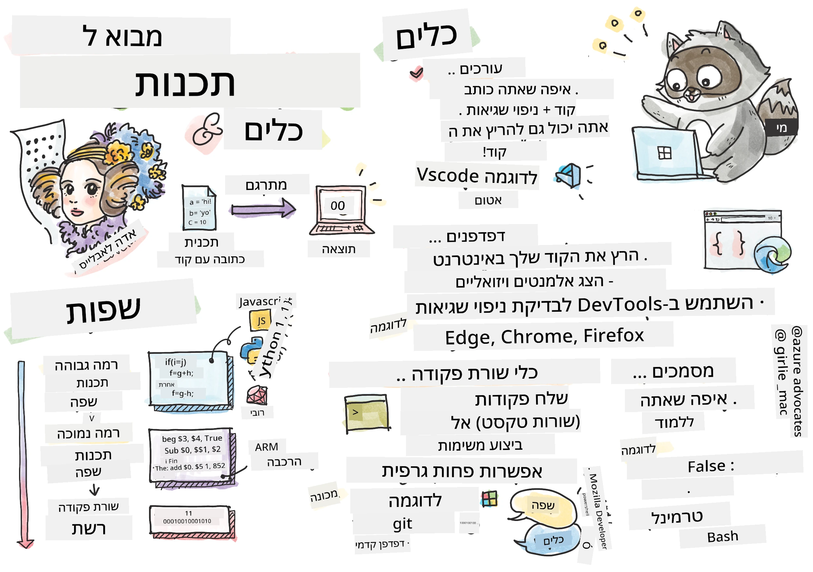
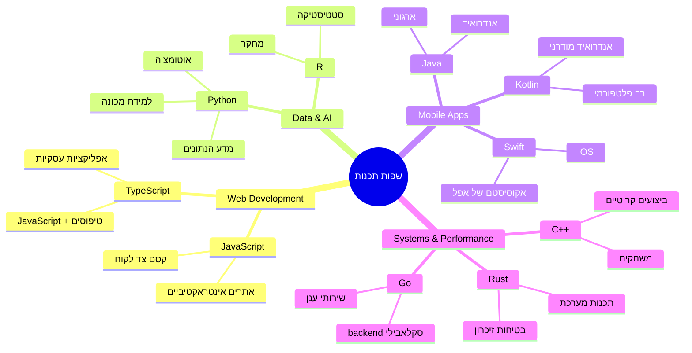
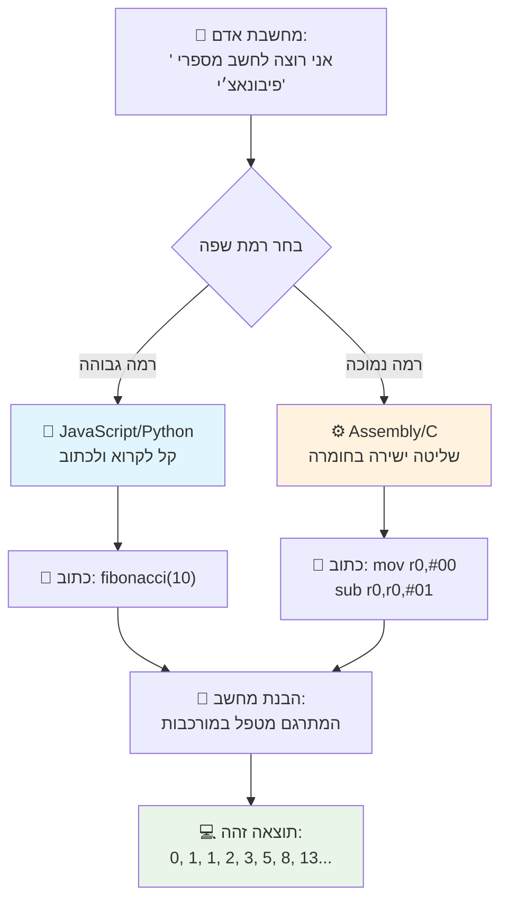
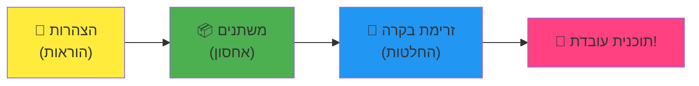
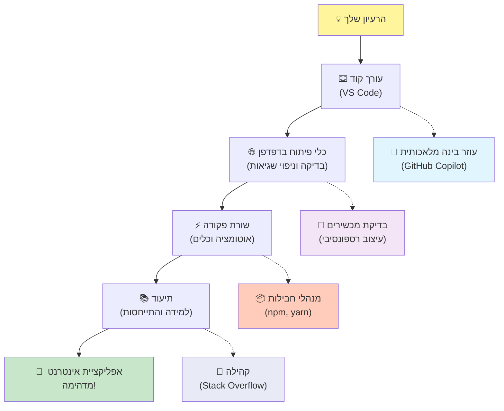
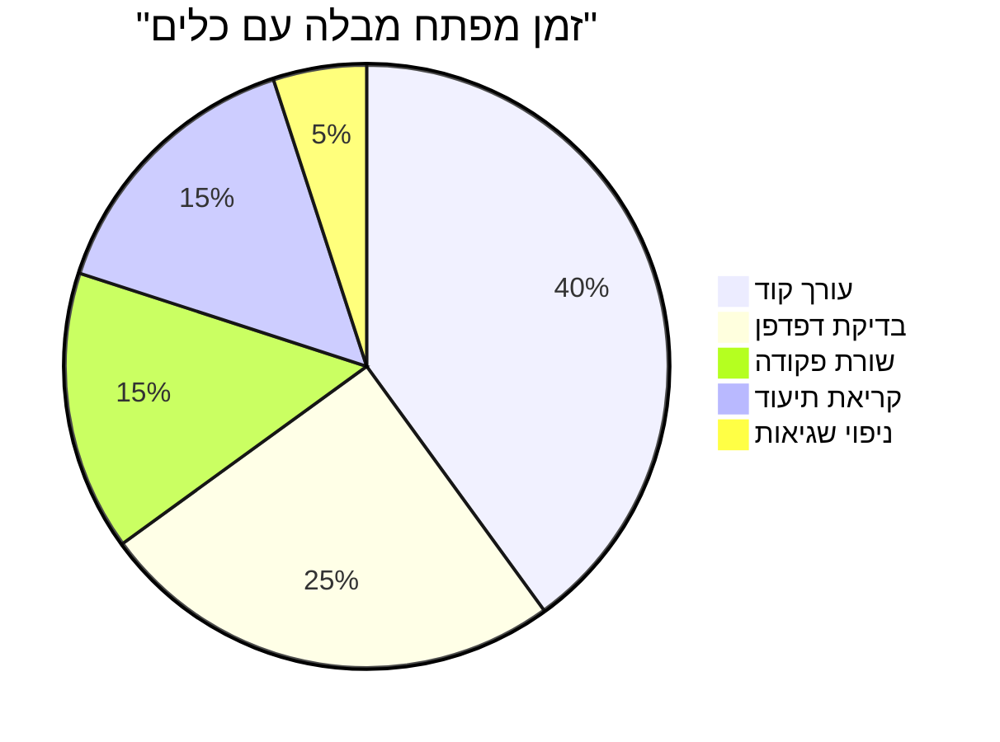

# مقدمة לשפות תכנות וכלי פיתוח מודרניים

היי שם, מפתח עתידי! 👋 אפשר לספר לך משהו שעדיין מרגש אותי כל יום מחדש? אתה עומד לגלות שהתכנות זה לא רק על מחשבים – זה על יש לך כוחות-על ממשיים כדי להביא את הרעיונות הפרועים ביותר שלך לחיים!

אתה מכיר את הרגע כשאתה משתמש באפליקציה האהובה עליך והכל פשוט מסתדר בצורה מושלמת? כשאתה לוחץ על כפתור וקרה משהו קסום לגמרי שגורם לך להגיד "וואו, איך הם עשו את זה?" ובכן, מישהו בדיוק כמוך – כנראה שיושב בבית הקפה האהוב עליו בשעה 2 בלילה עם האספרסו השלישי שלו – כתב את הקוד שיצר את הקסם הזה. וזה מה שיפוצץ לך את המוח: בסוף השיעור הזה, לא רק שתבין איך הם עשו את זה, אלא גם תחוש ברצון עז לנסות את זה בעצמך!

תקשיב, אני לגמרי מבין אם עכשיו התכנות נראה מפחיד. כשהתחלתי לראשונה, האמנתי בכנות שצריך להיות גאון במתמטיקה או לתכנת מאז שהיית בן חמש. אבל הנה מה ששינה לגמרי את הפרספקטיבה שלי: תכנות זה בדיוק כמו ללמוד לנהל שיחות בשפה חדשה. אתה מתחיל עם "שלום" ו"תודה", ממשיך להזמין קפה, ובטרם תדע – אתה מנהל דיונים פילוסופיים עמוקים! רק שבמקרה הזה, אתה מדבר עם מחשבים, ובאמת? הם השותפים לשיעורי שיחה הסבלניים ביותר שתוכל לפגוש – הם אף פעם לא שופטים את הטעויות שלך ותמיד נרגשים לנסות שוב!

היום, נחקור כלים מדהימים שהופכים את פיתוח האינטרנט המודרני לא רק לאפשרי, אלא לממכר ברצינות. אני מדבר על אותם עורכי קוד, דפדפנים וזרימות עבודה בדיוק שבהם מפתחים בנטפליקס, ספוטיפיי והסטודיו האינטימי האהוב עליך משתמשים מדי יום. וזה החלק שיגרום לך לרקוד משמחה: רוב כלי המקצועיים, התקניים בתעשייה האלה הם חינמיים לחלוטין!


> סקצ'נוט מאת [Tomomi Imura](https://twitter.com/girlie_mac)


```mermaid
journey
    title המסע שלך לתכנות היום
    section גילה
      מה זה תכנות: 5: You
      שפות תכנות: 4: You
      סקירת כלים: 5: You
    section חקור
      עורכי קוד: 4: You
      דפדפנים & כלי פיתוח: 5: You
      שורת פקודה: 3: You
    section תרגל
      בלש שפות: 4: You
      חקר כלים: 5: You
      קשר עם קהילה: 5: You
```
## בוא נראה מה כבר אתה יודע!

לפני שנצלול לדברים המהנים, אני סקרן – מה כבר אתה יודע על עולם התכנות הזה? ותקשיב, אם אתה מסתכל על השאלות האלה וחושב "אין לי בכלל מושג על כל זה," זה לא רק בסדר, זה מושלם! זאת אומרת שאתה במקום הנכון לגמרי. תחשוב על החידון הזה כמו מתיחה לפני אימון – אנחנו פשוט מחממים את השרירים של המוח!

[קח את החידון לפני השיעור](https://ff-quizzes.netlify.app/web/)


## ההרפתקה שאנחנו עומדים לצעוד בה יחד

אז טוב, אני ממש מתרגש ממה שאנחנו עומדים לחקור היום! ברצינות, הלוואי ויכולתי לראות את הפנים שלך כשהמושגים האלה מתחברים. הנה המסע המדהים שאנחנו עושים יחד:

- **מה זה תכנות באמת (ולמה זה הדבר הכי מגניב שקיים!)** – נגלה איך קוד הוא הקסם הלא נראה שמפעיל כל דבר סביבך, מהאזעקה שיודעת שמדובר ביום שני בבוקר ועד האלגוריתם שממליץ לך בדיוק את התוכן שלך בנטפליקס
- **שפות תכנות ואישיותיהן המדהימות** – דמיין להיכנס למסיבה שבה כל אדם יש לו כוחות-על שונים ודרכים שונות לפתור בעיות. כך עולם שפות התכנות, ואתה הולך לאהוב להכיר אותן!
- **הבלוקים היסודיים שבונים את הקסם הדיגיטלי** – תחשוב על זה כמו סט לגו יצירתי מושלם. ברגע שאתה מבין איך החלקים האלה מתחברים, תגלה שאתה יכול לבנות כל דבר שהדמיון שלך חולם עליו
- **כלים מקצועיים שיגרמו לך להרגיש כאילו זה הרגע שסופסוף קיבלת שרביט של קוסם** – אני לא מגזים פה – הכלים האלה באמת יגרמו לך להרגיש שיש לך כוחות-על, והחלק הכי טוב? אלו אותם כלים שהמקצוענים משתמשים בהם!

> 💡 **הנה הדבר:** אל תנסה לזכור הכל היום! עכשיו, אני פשוט רוצה שתחוש את ניצוץ ההתלהבות ממה שאפשרי. הפרטים יידבקו לך באופן טבעי כשנשבית יחד – ככה למידה אמיתית קורה!

> אתה יכול לקחת את השיעור הזה ב-[Microsoft Learn](https://learn.microsoft.com/en-us/learn/modules/web-development-101/introduction-programming/?WT.mc_id=academic-77807-sagibbon)!

## אז מה זה *בדיוק* תכנות?

טוב, בוא נתמודד עם השאלה במיליון דולר: מה זה תכנות, באמת?

אני אתן לך סיפור ששינה לחלוטין את התפיסה שלי על זה. בשבוע שעבר, ניסיתי להסביר לאמא שלי איך להשתמש בשלט החכם החדש של הטלוויזיה שלנו. תפסתי את עצמי אומר דברים כמו "לחצי על הכפתור האדום, אבל לא הכפתור האדום הגדול, הכפתור האדום הקטן משמאל... לא, הכוון השני שלך... טוב, עכשיו החזיקי אותו לשתי שניות, לא אחת, לא שלוש..." נשמע מוכר? 😅

זה תכנות! זה האמנות של לתת הוראות מפורטות ומדויקות בשלבים למשהו חזק מאוד אבל שצריך שהכל יהיה לא מנוסח במדויק. אבל במקום להסביר לאמא שלך (שיכולה לשאול "איזה כפתור אדום?!"), אתה מסביר למחשב (שעושה בדיוק מה שאתה אומר, אפילו אם מה שאמרת זה לא בדיוק מה שהתכוונת).

הנה מה שפוצץ לי את המוח כשהתחלתי ללמוד את זה: המחשבים בעצם די פשוטים ביסודם. הם מבינים רק שתי דברים – 1 ו-0, שזה בעצם רק "כן" ו"לא" או "פועל" ו"מכובה". זהו! אבל כאן מתחיל הקסם – אנחנו לא צריכים לדבר ב-1 ו-0 כאילו אנחנו במטריקס. כאן נכנסות לתמונה **שפות התכנות**. הן כמו מתרגם מהטובים בעולם שלוקח את המחשבות האנושיות שלך וממיר אותן לשפת המחשב.

וזה מה שעדיין נותן לי צמרמורת אמיתית כל בוקר שאני מתעורר: *הכל* דיגיטלי בחיים שלך התחיל ממישהו בדיוק כמוך, כנראה שיושב בג'אגר שלו עם כוס קפה, מקליד קוד במחשב הנייד שלו. הפילטר באינסטגרם שגורם לך להיראות מושלם? מישהו כתב את הקוד שלו. ההמלצה שהובילה אותך לשיר האהוב החדש שלך? מפתח בנה את האלגוריתם ההוא. האפליקציה שעוזרת לך לחלק את החשבון בערב עם חברים? כן, מישהו חשב "זה מעצבן, בטוח שאני יכול לתקן את זה" ואז... הוא עשה את זה!

כשאתה לומד לתכנת, אתה לא רק רוכש מיומנות חדשה – אתה נהפך לחלק מהקהילה המדהימה הזו של פותרי בעיות שמבלים את ימיהם בחשיבה, "מה אם אפשר לבנות משהו שישפר למישהו את היום קצת?" באמת, יש משהו מגניב מזה?

✅ **ציד עובדות כיפי**: הנה משהו מגניב במיוחד לחפש כשיש לך רגע פנוי – מי לדעתך היה המתכנת הראשון בעולם? אגיש לך רמז: אולי זה לא מי שאתה חושב! הסיפור מאחורי האדם הזה סוחף לחלוטין ומראה שתכנות תמיד היה על פתרון בעיות יצירתי וחשיבה מחוץ לקופסה.

### 🧠 **זמן בדיקה: איך אתה מרגיש?**

**קח רגע להרהר:**
- האם עכשיו אתה מבין את הרעיון של "לתת הוראות למחשבים"?
- האם יש משימה יומיומית שהיית רוצה לאוטומט בעזרת תכנות?
- אילו שאלות עולות לך בראש לגבי כל עניין התכנות הזה?

> **תזכור**: זה לגמרי נורמלי אם כמה מושגים מרגישים מעורפלים כרגע. ללמוד תכנות זה כמו ללמוד שפה חדשה – לוקח זמן למוח שלך לבנות את הנתיבים הנוירוניים. אתה עושה עבודה מעולה!

## שפות תכנות הן כמו טעמים שונים של קסם

טוב, זה יישמע מוזר, אבל תישאר איתי – שפות תכנות דומות להרבה לסוגים שונים של מוסיקה. תחשוב על זה: יש ג'אז חלק וספונטני, רוק חזק וישיר, קלאסי אלגנטי ומבנה, והיפ-הופ יצירתי ובוטה. לכל סגנון יש וייב משלו, קהילה משלה של מעריצים נלהבים, וכל אחד מושלם למצבים ולמצבי רוח שונים.

כך בדיוק עובדות שפות התכנות! לא היית משתמש באותה שפה לבניית משחק מהנה למובייל כמו זו שתרצה לעבד נתוני אקלים גדולים, בדיוק כמו שלא תנגן מטאל דת' בשיעור יוגה (טוב, ברוב שיעורי היוגה בכל אופן! 😄).

אבל הנה מה שמפוצץ לי את המוח כל פעם שאני חושב על זה: השפות האלה הן כמו מתורגמן סבלני ומבריק שיושב ממש לידך. אתה יכול להביע את מחשבותיך בדרך שברורה למוח האנושי שלך, והן מטפלות בכל העבודה המסובכת של התרגום ל-1 ו-0 שהמחשבים באמת מדברים בה. זה כמו שיש לך חבר ששוטף בצורה מושלמת את שני התחומים – "יצירתיות אנושית" ו"לוגיקת מחשב" – והם אף פעם לא מתעייפים, אף פעם לא צריכים הפסקת קפה, ואף פעם לא שופטים אותך כשאתה שואל את אותו השאלה פעמיים!

### שפות תכנות פופולריות ושימושיהן


```mermaid
mindmap
  root((שפות תכנות))
    Web Development
      JavaScript
        קסם צד לקוח
        אתרים אינטראקטיביים
      TypeScript
        JavaScript + טיפוסים
        אפליקציות עסקיות
    Data & AI
      Python
        מדע הנתונים
        למידת מכונה
        אוטומציה
      R
        סטטיסטיקה
        מחקר
    Mobile Apps
      Java
        אנדרואיד
        ארגוני
      Swift
        iOS
        אקוסיסטם של אפל
      Kotlin
        אנדרואיד מודרני
        רב פלטפורמי
    Systems & Performance
      C++
        משחקים
        ביצועים קריטיים
      Rust
        בטיחות זיכרון
        תכנות מערכת
      Go
        שירותי ענן
        backend סקלאבילי
```
| שפה | מתאים ל- | למה היא פופולרית |
|----------|----------|------------------|
| **JavaScript** | פיתוח רשת, ממשקי משתמש | רצה בדפדפנים ומפעילה אתרי אינטרנט אינטראקטיביים |
| **Python** | מדעי נתונים, אוטומציה, בינה מלאכותית | קריאה ולמידה קלה, ספריות חזקות |
| **Java** | אפליקציות ארגוניות, אפליקציות לאנדרואיד | לא תלוי פלטפורמה, חזק למערכות גדולות |
| **C#** | אפליקציות חלונות, פיתוח משחקים | תמיכה חזקה באקו-סיסטם של מיקרוסופט |
| **Go** | שירותי ענן, מערכות backend | מהיר, פשוט, מתוכנן למחשוב מודרני |

### שפות ברמה גבוהה מול שפות ברמה נמוכה

טוב, זה באמת היה הרעיון ששבר לי את הראש כשעוד התחלתי ללמוד, אז אני הולך לשתף את האנלוגיה שעושה את הקליקה סוף סוף עבורי – ואני מאוד מקווה שזה יעזור גם לך!

דמיין שאתה מבקר במדינה שבה אתה לא מדבר את השפה, ואתה ממש צריך למצוא את השירותים הקרובים ביותר (כולנו היינו שם, נכון? 😅):

- **תכנות ברמה נמוכה** הוא כמו ללמוד כל כך טוב את הניב המקומי שאתה יכול לשוחח עם הסבתא שמוכרת פירות בפינה, עם כל ההקשרים תרבותיים, סלנג מקומי ובדיחות פנימיות שרק מישהו שגדל שם יבין. מרשים מאוד ויעיל להפליא... אם אתה שולט בשפה! אבל די מפחיד כשאתה רק מנסה למצוא שירותים.

- **תכנות ברמה גבוהה** הוא כמו שיהיה לך חבר מקומי מדהים שמבין אותך. אתה יכול לומר "אני ממש צריך למצוא שירותים" באנגלית פשוטה, והוא מטפל בכל התרגום התרבותי ונותן לך הוראות בדרך שמובנת למוח הזר שלך.

במונחי תכנות:
- **שפות ברמה נמוכה** (כמו Assembly או C) מאפשרות שיחות מפורטות מאוד עם חומרת המחשב עצמה, אבל אתה צריך לחשוב כמו מכונה, שזה… טוב, נגיד שזה שינוי מנטלי די משמעותי!
- **שפות ברמה גבוהה** (כמו JavaScript, Python או C#) מאפשרות לך לחשוב כמו בן אדם בזמן שהן מטפלות בכל שפת המכונה מאחורי הקלעים. בנוסף, יש להן קהילות מוזמנות ומכילות מלאות אנשים שזוכרים איך זה היה חדש ורוצים לעזור באמת!

נחש מה אני הולך להציע לך להתחיל איתו? 😉 שפות ברמה גבוהה הן כמו להחזיק בעגלות אימון שאתה אף פעם לא באמת רוצה להסיר כי הן עושות את כל החוויה למהנה הרבה יותר!


```mermaid
flowchart TB
    A["👤 מחשבת אדם:<br/>'אני רוצה לחשב מספרי פיבונאצ׳י'"] --> B{בחר רמת שפה}
    
    B -->|רמה גבוהה| C["🌟 JavaScript/Python<br/>קל לקרוא ולכתוב"]
    B -->|רמה נמוכה| D["⚙️ Assembly/C<br/>שליטה ישירה בחומרה"]
    
    C --> E["📝 כתוב: fibonacci(10)"]
    D --> F["📝 כתוב: mov r0,#00<br/>sub r0,r0,#01"]
    
    E --> G["🤖 הבנת מחשב:<br/>המתרגם מטפל במורכבות"]
    F --> G
    
    G --> H["💻 תוצאה זהה:<br/>0, 1, 1, 2, 3, 5, 8, 13..."]
    
    style C fill:#e1f5fe
    style D fill:#fff3e0
    style H fill:#e8f5e8
```
### תן לי להראות לך למה שפות ברמה גבוהה כל כך ידידותיות

טוב, אני עומד להראות לך משהו שמדגים בצורה מושלמת למה נפלתי על שפות ברמה גבוהה, אבל קודם – אני צריך ממך הבטחה אחת. כשתראה את דוגמת הקוד הראשונה, אל תבהל! אמור להראות מפחיד. זה בדיוק הנקודה שאני מנסה להעביר!

אנחנו הולכים לראות את אותה המשימה בדיוק כתובה בשתי סגנונות לגמרי שונים. שתיהן יוצרות את רצף פיבונאצ'י – זה דפוס מתמטי יפהפה שבו כל מספר הוא סכום של שני הקודמים לו: 0, 1, 1, 2, 3, 5, 8, 13... (עובדה נוספת: תמצא דפוס זה בכל מקום בטבע – סלסלי זרעי חמניה, דפוסי ארז, אפילו בדרך שבה גלקסיות מתקבצות!)

מוכן לראות את ההבדל? בוא נתחיל!

**שפת רמה גבוהה (JavaScript) – ידידותית לאדם:**

```javascript
// שלב 1: הגדרת פיבונאצ'י בסיסית
const fibonacciCount = 10;
let current = 0;
let next = 1;

console.log('Fibonacci sequence:');
```

**מה שהקוד הזה עושה:**
- **הגדר** קבוע כדי לציין כמה מספרי פיבונאצ'י אנחנו רוצים ליצור
- **אתחל** שני משתנים לעקוב אחר המספר הנוכחי והבא ברצף
- **קבע** את הערכים ההתחלתיים (0 ו-1) שמגדירים את דפוס פיבונאצ'י
- **הצג** כותרת זיהוי לתוצאה שלנו

```javascript
// שלב 2: יצירת הרצף באמצעות לולאה
for (let i = 0; i < fibonacciCount; i++) {
  console.log(`Position ${i + 1}: ${current}`);
  
  // חשב את המספר הבא ברצף
  const sum = current + next;
  current = next;
  next = sum;
}
```

**פירוק מה שקורה כאן:**
- **לולאה** על כל מיקום ברצף שלנו באמצעות לולאת `for`
- **הצג** כל מספר עם מיקומו באמצעות פורמט מחרוזת תבנית
- **חשב** את מספר פיבונאצ'י הבא על ידי חיבור הערכים הנוכחיים והבאים
- **עדכן** את המשתנים שלנו כדי לעבור לאיטרציה הבאה

```javascript
// שלב 3: גישה פונקציונלית מודרנית
const generateFibonacci = (count) => {
  const sequence = [0, 1];
  
  for (let i = 2; i < count; i++) {
    sequence[i] = sequence[i - 1] + sequence[i - 2];
  }
  
  return sequence;
};

// דוגמת שימוש
const fibSequence = generateFibonacci(10);
console.log(fibSequence);
```

**במופע שלמעלה עיצבנו:**
- **יצרנו** פונקציה שניתן לשימוש חוזר באמצעות תחביר חץ מודרני
- **בנינו** מערך כדי לאחסן את כל הרצף במקום להציג כל מספר בנפרד
- **השתמשנו** באינדקס של המערך כדי לחשב כל מספר חדש מהקודמים לו
- **החזרנו** את כל הרצף לשימוש גמיש בחלקים אחרים בתוכנית שלנו

**שפת רמה נמוכה (ARM Assembly) – ידידותית למחשב:**

```assembly
 area ascen,code,readonly
 entry
 code32
 adr r0,thumb+1
 bx r0
 code16
thumb
 mov r0,#00
 sub r0,r0,#01
 mov r1,#01
 mov r4,#10
 ldr r2,=0x40000000
back add r0,r1
 str r0,[r2]
 add r2,#04
 mov r3,r0
 mov r0,r1
 mov r1,r3
 sub r4,#01
 cmp r4,#00
 bne back
 end
```

שימו לב כיצד הגרסה ב-JavaScript כמעט קוראת כמו הוראות באנגלית, בעוד שגרסת ה-Assembly משתמשת בפקודות מסתוריות ששולטות ישירות במעבד המחשב. שתיהן משיגות את אותה מטרה בדיוק, אבל שפת הרמה הגבוהה הרבה יותר קלה להבנה, כתיבה ותחזוקה עבור בני אדם.

**הבדלים מרכזיים שתבחין בהם:**
- **קריאות**: ג'אווה סקריפט משתמש בשמות תיאורים כמו `fibonacciCount` בעוד ש-Assembly משתמשת בתוויות מסתוריות כמו `r0`, `r1`
- **הערות**: שפות ברמה גבוהה מעודדות הערות הסברתיות שעושות את הקוד לתיעוד עצמי
- **מבנה**: הזרימה הלוגית של ג'אווה סקריפט מתאימה לאופן שבו בני אדם חושבים על בעיות שלב אחר שלב
- **תחזוקה**: עדכון הגרסה של ג'אווה סקריפט לדרישות שונות הוא פשוט וברור

✅ **על רצף פיבונאצ'י**: תבנית המספרים הנהדרת הזו (שבה כל מספר שווה לסכום של השניים שלפניו: 0, 1, 1, 2, 3, 5, 8...) מופיעה ממש *בכל מקום* בטבע! תמצאו אותה בספירלות חמניות, בתבניות של קונקלוציוס, בדרך שבה הקונכיות של נאוטילוס מתעקמות, ואפילו באופן שבו ענפי העץ גדלים. זה ממש מדהים איך המתמטיקה והקוד יכולים לעזור לנו להבין ולשחזר את הדפוסים שהטבע משתמש בהם ליצירת יופי!

## אבני הבניין שגורמות לקסם לקרות

טוב, עכשיו שכבר ראיתם איך שפות תכנות נראות בפעולה, בואו נפרק את החלקים היסודיים שמהווים ממש כל תוכנית שנכתבה אי פעם. תחשבו עליהם כמו המרכיבים החיוניים במתכון האהוב עליכם – ברגע שתבינו מה כל חלק עושה, תוכלו לקרוא ולכתוב קוד כמעט בכל שפה!

זה קצת כמו ללמוד את הדקדוק של תכנות. זוכרים בבית הספר כשלמדתם על שמות עצם, פעלים ואיך להרכיב משפטים? לתכנות יש דקדוק משלו, ובכנות, הוא הרבה יותר לוגי וסלחן מאשר דקדוק האנגלית אי פעם היה! 😄

### משפטים: ההוראות שלב אחר שלב

בואו נתחיל עם **משפטים** – אלה כמו משפטים בודדים בשיחה עם המחשב שלכם. כל משפט אומר למחשב לעשות דבר ספציפי אחד, קצת כמו נתינת הוראות: "פנה שמאלה כאן," "עצור בנורה האדומה," "החנה במקום הזה."

מה שאני אוהב במשפטים הוא כמה שהם בדרך כלל קריאים. תראו את זה:

```javascript
// משפטים בסיסיים שמבצעים פעולות בודדות
const userName = "Alex";                    
console.log("Hello, world!");              
const sum = 5 + 3;                         
```

**הנה מה שהקוד הזה עושה:**
- **הכרזת** משתנה קבוע לשמירת שם המשתמש
- **הצגת** הודעת ברכה בפלט הקונסול
- **חישוב** ואחסון תוצאה של פעולה מתמטית

```javascript
// הצהרות שמתקשרות עם דפי אינטרנט
document.title = "My Awesome Website";      
document.body.style.backgroundColor = "lightblue";
```

**שלב אחר שלב, הנה מה שקורה:**
- **שינוי** כותרת הדף שמופיעה בטאב הדפדפן
- **שינוי** צבע רקע של גוף הדף כולו

### משתנים: מערכת הזיכרון של התוכנית שלך

טוב, **משתנים** הם בכנות אחד המושגים האהובים עלי ביותר ללמד כי הם כל כך דומים לדברים שאתם כבר משתמשים בהם כל יום!

תחשבו על רשימת אנשי הקשר בטלפון שלכם לשנייה. אתם לא זוכרים בעל פה את מספרי הטלפון של כולם – במקום זה, אתם שומרים "אמא", "החבר הטוב ביותר", או "פיצה שמספקת עד 2 בלילה" ומאפשרים לטלפון לזכור את המספרים האמיתיים. המשתנים פועלים בדיוק באותו אופן! הם כמו מיכלים עם תוויות שבהם התוכנית שלך יכולה לאחסן מידע ולשלוף אותו מאוחר יותר באמצעות שם שממש הגיוני.

הנה מה שהכי מגניב: המשתנים יכולים להשתנות כשהתוכנית שלך רצה (ומכאן השם "משתנה" – רואים מה עשו?). בדיוק כמו שאתה עשוי לעדכן את איש הקשר של הפיצה כשאתה מוצא מקום עוד יותר טוב, המשתנים יכולים להתעדכן כשהתוכנית שלך לומדת מידע חדש או כשמצבים משתנים!

בוא אראה לך כמה זה פשוט ויפה:

```javascript
// שלב 1: יצירת משתנים בסיסיים
const siteName = "Weather Dashboard";        
let currentWeather = "sunny";               
let temperature = 75;                       
let isRaining = false;                      
```

**הבנת המושגים הללו:**
- **אחסון** ערכים שאינם משתנים במשתני `const` (כמו שם האתר)
- **שימוש** ב-`let` לערכים שעשויים להשתנות במהלך התוכנית
- **הקצאת** סוגי מידע שונים: מחרוזות (טקסט), מספרים ובוליאנים (true/false)
- **בחירת** שמות תיאוריים שמסבירים מה כל משתנה מכיל

```javascript
// שלב 2: עבודה עם אובייקטים כדי לקבץ נתונים קשורים
const weatherData = {                       
  location: "San Francisco",
  humidity: 65,
  windSpeed: 12
};
```

**בקטע למעלה, עשינו:**
- **יצרנו** אובייקט לאיגוד מידע קשור למזג האוויר
- **ארגנו** כמה פרטי מידע תחת שם משתנה אחד
- **השתמשנו** בזוגות מפתח-ערך כדי לתייג כל פריט מידע בצורה ברורה

```javascript
// שלב 3: שימוש ועדכון משתנים
console.log(`${siteName}: Today is ${currentWeather} and ${temperature}°F`);
console.log(`Wind speed: ${weatherData.windSpeed} mph`);

// עדכון משתנים ניתנים לשינוי
currentWeather = "cloudy";                  
temperature = 68;                          
```

**בואו נבין כל חלק:**
- **הצגת** מידע באמצעות טמפלטים עם התחביר `${}`
- **גישה** לתכונות של אובייקטים באמצעות הציון בנקודה (`weatherData.windSpeed`)
- **עדכון** משתנים שהוכרזו עם `let` כדי לשקף תנאים שמשתנים
- **שילוב** כמה משתנים ליצירת הודעות בעלות משמעות

```javascript
// שלב 4: פירוק מתקדם לקוד נקי יותר
const { location, humidity } = weatherData; 
console.log(`${location} humidity: ${humidity}%`);
```

**מה שאתם צריכים לדעת:**
- **חליצה** של תכונות מסוימות מתוך אובייקטים באמצעות השמה מפורקת (destructuring)
- **יצירת** משתנים חדשים אוטומטית עם אותם שמות כמו מפתחות האובייקט
- **פישוט** הקוד על ידי הימנעות משימוש חוזר בסימון נקודה

### זרימת שליטה: ללמד את התוכנית שלך לחשוב

טוב, כאן התכנות נעשה פשוט מהמם ממש! **זרימת שליטה** היא בעצם ללמד את התוכנית שלך איך לקבל החלטות חכמות, בדיוק כמו שאתה עושה כל יום בלי לחשוב אפילו.

תדמיין את זה: הבוקר כנראה עברתם משהו כמו "אם יורד גשם, אקח מטרייה. אם קר, אלביש מעיל. אם אני מאחר, אתעלם מארוחת הבוקר ואקח קפה בדרך." המוח שלך עוקב באופן טבעי אחרי הלוגיקה הזאת עם תנאים עשרות פעמים ביום!

זו הסיבה שתוכניות מרגישות חכמות וחיות במקום פשוט לבצע סקריפט משעמם וניתן לחיזוי. הן באמת יכולות להסתכל על מצב, להעריך מה קורה, ולהגיב בהתאם. זה כמו לתת לתוכנית שלך מוח שיכול להסתגל ולקבל בחירות!

רוצה לראות כמה זה עובד נפלא? תן לי להראות:

```javascript
// שלב 1: לוגיקה בסיסית מותנית
const userAge = 17;

if (userAge >= 18) {
  console.log("You can vote!");
} else {
  const yearsToWait = 18 - userAge;
  console.log(`You'll be able to vote in ${yearsToWait} year(s).`);
}
```

**הנה מה שהקוד הזה עושה:**
- **בודק** אם גיל המשתמש עומד בדרישת ההצבעה
- **מבצע** קטעי קוד שונים בהתאם לתוצאה של התנאי
- **מחשב** ומציג כמה זמן נותר עד להיות זכאי להצביע אם מתחת לגיל 18
- **נותן** משוב מסוים ומועיל לכל תרחיש

```javascript
// שלב 2: תנאים מרובים עם מפעילים לוגיים
const userAge = 17;
const hasPermission = true;

if (userAge >= 18 && hasPermission) {
  console.log("Access granted: You can enter the venue.");
} else if (userAge >= 16) {
  console.log("You need parent permission to enter.");
} else {
  console.log("Sorry, you must be at least 16 years old.");
}
```

**פירוק מה שקורה כאן:**
- **שילוב** מספר תנאים באמצעות האופרטור `&&` (וגם)
- **יצירת** היררכיה של תנאים עם `else if` לתרחישים שונים
- **טיפול** בכל המקרים האפשריים עם משפט `else` סופי
- **מתן** משוב ברור ומעשי לכל מצב שונה

```javascript
// שלב 3: תנאי תמציתי עם אופרטור טרינרי
const votingStatus = userAge >= 18 ? "Can vote" : "Cannot vote yet";
console.log(`Status: ${votingStatus}`);
```

**מה שצריך לזכור:**
- **שימוש** באופרטור הטרנרי (`? :`) לתנאים פשוטים עם שתי אפשרויות
- **כתיבת** התנאי ראשון, אחריו `?`, ואז תוצאה אם אמת, אחריה `:`, ואז תוצאה אם שקר
- **החלה** של התבנית הזו כשצריך להקצות ערכים בהתאם לתנאים

```javascript
// שלב 4: טיפול במקרים ספציפיים מרובים
const dayOfWeek = "Tuesday";

switch (dayOfWeek) {
  case "Monday":
  case "Tuesday":
  case "Wednesday":
  case "Thursday":
  case "Friday":
    console.log("It's a weekday - time to work!");
    break;
  case "Saturday":
  case "Sunday":
    console.log("It's the weekend - time to relax!");
    break;
  default:
    console.log("Invalid day of the week");
}
```

**הקוד הזה משיג את הדברים הבאים:**
- **התאמה** של ערך המשתנה למקרים ספציפיים מרובים
- **קיבוץ** מקרים דומים יחד (ימי השבוע לעומת סופי שבוע)
- **ביצוע** קטע הקוד המתאים כשהתאים נמצא
- **כלול** מקרה `default` לטיפול בערכים לא צפויים
- **שימוש** בפקודות `break` למניעת המשך הקוד למקרה הבא

> 💡 **הסבר מהחיים האמיתיים**: תחשוב על זרימת שליטה כמו ה-GPS הסבלני ביותר בעולם שנותן לך הוראות. הוא עשוי לומר "אם יש תנועה ברחוב הראשי, קח את הנתיב המהיר. אם יש עבודות בדרך המהירה, נסה את הדרך הנופית." תוכניות משתמשות בדיוק באותו סוג של לוגיקה מותנית כדי להגיב בצורה חכמה למצבים שונים ולתת למשתמש את החוויה הטובה ביותר.

### 🎯 **בדיקת מושג: שליטה באבני היסוד**

**בוא נראה איך אתה מתקדם עם היסודות:**
- האם אתה יכול להסביר את ההבדל בין משתנה למשפט במילים שלך?
- חשוב על סיטואציה אמיתית שבה תשתמש בהחלטת if-then (כמו בדוגמה של ההצבעה)
- מה הדבר האחד בלוגיקת תכנות שהפתיע אותך?

**דחיפה מהירה של ביטחון עצמי:**

```mermaid
flowchart LR
    A["📝 הצהרות<br/>(הוראות)"] --> B["📦 משתנים<br/>(אחסון)"] --> C["🔀 זרימת בקרה<br/>(החלטות)"] --> D["🎉 תוכנית עובדת!"]
    
    style A fill:#ffeb3b
    style B fill:#4caf50
    style C fill:#2196f3
    style D fill:#ff4081
```
✅ **מה מצפה בהמשך**: עומדים לבוא רגעים ממש מדהימים כשנצלול עמוק יותר למושגים האלו ונמשיך במסע המדהים הזה יחד! כרגע, פשוט התרכז בהרגשת ההתרגשות לגבי כל האפשרויות המדהימות שמחכות לך. הכישורים והטכניקות הספציפיים ייכנסו באופן טבעי כשנתרגל יחד – אני מבטיח שזה הולך להיות הרבה יותר כיף ממה שציפית!

## כלי המסחר

טוב, כאן באמת אני כל כך מתרגש עד שאני בקושי מתאפק! 🚀 עומדים לדבר על הכלים המדהימים שיעשו אותך להרגיש כאילו קיבלת מפתחות לחללית דיגיטלית.

אתה יודע איך לפור쉐 יש את הסכינים המאוזנות להפליא שנראות כמו תוספות לידיים שלהם? או איך למוזיקאי יש את הגיטרה ההיא שנראית כאילו היא מתחילה לשיר מהרגע שנוגעים בה? ובכן, למפתחים יש את הגרסה שלהם לכלים הקסומים האלו, והנה מה שהיהדר אותך לגמרי – רובם חינמיים לחלוטין!

אני מקפץ בכיסא כשאני חושב על שיתוף הכלים הללו איתך כי הם שינו לגמרי את הדרך שבה אנחנו בונים תוכנה. אנחנו מדברים על עוזרי קידוד מופעלים על ידי AI שיכולים לעזור לכתוב את הקוד שלך (אני לא צוחק!), סביבות ענן שבהן אתה יכול לבנות אפליקציות שלמות מכל מקום עם Wi-Fi, וכלי דיבוג כה מתוחכמים שהם כמו להחזיק ראיית קרן איקס לתוכניות שלך.

והנה החלק שעדיין עושה לי צמרמורת: אלה לא "כלים למתחילים" שתגדל מהם. אלה אותם כלים מקצועיים בדיוק שמפתחים בגוגל, נטפליקס והסטודיו האפליקציית אינדיפנדנט שאתה אוהב משתמשים בהם בזמן הזה ממש. תרגיש כמו מקצוען אמיתי כשאתה משתמש בהם!


```mermaid
graph TD
    A["💡 הרעיון שלך"] --> B["⌨️ עורך קוד<br/>(VS Code)"] 
    B --> C["🌐 כלי פיתוח בדפדפן<br/>(בדיקה וניפוי שגיאות)"]
    C --> D["⚡ שורת פקודה<br/>(אוטומציה וכלים)"]
    D --> E["📚 תיעוד<br/>(למידה והתייחסות)"]
    E --> F["🚀 אפליקציית אינטרנט מדהימה!"]
    
    B -.-> G["🤖 עוזר בינה מלאכותית<br/>(GitHub Copilot)"]
    C -.-> H["📱 בדיקת מכשירים<br/>(עיצוב רספונסיבי)"]
    D -.-> I["📦 מנהלי חבילות<br/>(npm, yarn)"]
    E -.-> J["👥 קהילה<br/>(Stack Overflow)"]
    
    style A fill:#fff59d
    style F fill:#c8e6c9
    style G fill:#e1f5fe
    style H fill:#f3e5f5
    style I fill:#ffccbc
    style J fill:#e8eaf6
```
### עורך קוד ו-IDE: החברים הדיגיטליים החדשים שלך

בוא נדבר על עורכי הקוד – הם עומדים להפוך למקומות האהובים עליך ביותר לבלות בהם! תחשוב עליהם כמקום המקודד האישי שלך שבו תבלה את רוב הזמן ביצירת והשלמת היצירות הדיגיטליות שלך.

אבל הנה מה שמדהים בעורכים מודרניים: הם לא רק עורך טקסט מפונפן. הם כמו חונך קידוד מבריק ותומך שיושב לידך 24/7. הם תופסים את הטעויות שלך עוד לפני ששמת לב, מציעים שיפורים שגורמים לך להיראות כמו גאון, עוזרים להבין מה כל קטע קוד עושה, וחלקם אפילו יכולים לחזות מה אתה עומד להקליד ולהציע לסיים את המחשבות שלך!

אני זוכר כשגיליתי את ההשלמה האוטומטית – הרגשתי כאילו אני חי בעתיד. אתה מתחיל להקליד משהו והעורך שלך אומר, "האם חשבת על הפונקציה הזאת שעושה בדיוק את מה שאתה צריך?" זה כמו שיש לך קורא מחשבות כחבר לקוד!

**מה עושה את העורכים הללו כל כך מדהימים?**

עורכי הקוד המודרניים מציעים מערך מרשים של תכונות שנועדו לשפר את הפרודוקטיביות שלך:

| תכונה | מה היא עושה | למה זה עוזר |
|---------|--------------|--------------|
| **הדגשת תחביר** | צבעים לחלקים שונים של הקוד שלך | מקל על קריאת הקוד וזיהוי שגיאות |
| **השלמה אוטומטית** | מציע קוד בזמן ההקלדה | מזרז קידוד ומוריד טעויות הקלדה |
| **כלי דיבוג** | עוזר למצוא ולתקן שגיאות | חוסך שעות של פתרון בעיות |
| **תוספים** | מוסיף תכונות מיוחדות | מתאים את העורך לטכנולוגיה כלשהי |
| **עוזרי AI** | מציע קוד והסברים | מאיץ למידה ופרודוקטיביות |

> 🎥 **משאב וידאו**: רוצה לראות את הכלים האלה בפעולה? צפה ב-[וידאו של כלים למסחר](https://youtube.com/watch?v=69WJeXGBdxg) לסקירה מקיפה.

#### עורכים מומלצים לפיתוח ווב

**[Visual Studio Code](https://code.visualstudio.com/?WT.mc_id=academic-77807-sagibbon)** (חינמי)
- הפופולרי ביותר בקרב מפתחי ווב
- מערכת תוספים מצוינת
- טרמינל מובנה ואינטגרציה עם Git
- **תוספים חובה**:
  - [GitHub Copilot](https://marketplace.visualstudio.com/items?itemName=GitHub.copilot) - הצעות קוד מופעלות AI
  - [Live Share](https://marketplace.visualstudio.com/items?itemName=MS-vsliveshare.vsliveshare) - שיתוף פעולה בזמן אמת
  - [Prettier](https://marketplace.visualstudio.com/items?itemName=esbenp.prettier-vscode) - עיצוב קוד אוטומטי
  - [Code Spell Checker](https://marketplace.visualstudio.com/items?itemName=streetsidesoftware.code-spell-checker) - תופס טעויות כתיב בקוד שלך

**[JetBrains WebStorm](https://www.jetbrains.com/webstorm/)** (בתשלום, בחינם לסטודנטים)
- כלי דיבוג ובדיקות מתקדמים
- השלמת קוד אינטליגנטית
- שליטה בגרסאות מובנית

**סביבות IDE מבוססות ענן** (מחירים שונים)
- [GitHub Codespaces](https://github.com/features/codespaces) - VS Code מלא בדפדפן שלך
- [Replit](https://replit.com/) - מעולה ללמידה ושיתוף קוד
- [StackBlitz](https://stackblitz.com/) - פיתוח ווב מיידי מלא

> 💡 **טיפ להתחלה**: התחל עם Visual Studio Code – חינמי, בשימוש נרחב בתעשייה, ויש קהילה ענקית שצורכת מדריכים ותוספים מועילים.

### דפדפני ווב: המעבדה הסודית שלך לפיתוח

טוב, התכונן שיתפוצץ לך המוח! אתה יודע איך השתמשת בדפדפנים כדי לגלול ברשתות חברתיות ולצפות בסרטונים? ובכן, מסתבר שהם מסתירים את המעבדה המדהימה הזו לפיתוח כל הזמן, רק ממתינים שתגלה אותה!

כל פעם שאתה מקיש קליק ימני על דף אינטרנט ובוחר "Inspect Element", אתה פותח עולם סודי של כלי פיתוח שהם באמת יותר חזקים מתוכנות יקרות שעברתי לשלם מאות שקלים עליהם. זה כמו לגלות שהמטבח הרגיל שלך הסתיר מאחורי לוח סודי מעבדה מקצועית של שף!
הפעם הראשונה שמישהו הראה לי את כלי הפיתוח בדפדפן, ביליתי בערך שלוש שעות רק לוחץ מכל כיוון ואומר "חכו, גם את זה זה יכול לעשות?!" אתה יכול literally לערוך כל אתר בזמן אמת, לראות בדיוק כמה מהר הכל נטען, לבדוק איך האתר שלך נראה במכשירים שונים, ואפילו לבצע דיבוג של JavaScript כמו מקצוען אמיתי. זה פשוט מדהים!

**הנה למה הדפדפנים הם הנשק הסודי שלך:**

כשאתה יוצר אתר או אפליקציה, אתה צריך לראות איך הם נראים ומתנהגים בעולם האמיתי. הדפדפנים לא רק מציגים את העבודה שלך אלא גם מספקים משוב מפורט על ביצועים, נגישות, ובעיות פוטנציאליות.

#### כלי מפתח בדפדפן (DevTools)

דפדפנים מודרניים כוללים ערכות פיתוח מקיפות:

| קטגוריית כלי | מה זה עושה | דוגמה לשימוש |
|---------------|--------------|------------------|
| **בוחן אלמנטים** | צפייה ועריכה של HTML/CSS בזמן אמת | התאמת עיצוב לצפייה בתוצאות מיידיות |
| **קונסולה** | צפייה בהודעות שגיאה ובדיקת JavaScript | דיבוג בעיות וניסוי קוד |
| **מעקב רשת** | מעקב אחר טעינת משאבים | אופטימיזציה של ביצועים וזמני טעינה |
| **בודק נגישות** | בדיקה לעיצוב כוללני | לוודא שהאתר עובד עבור כל המשתמשים |
| **סימולטור מכשירים** | תצוגה במידות מסך שונות | בדיקת עיצוב רספונסיבי בלי צורך במכשירים רבים |

#### דפדפנים מומלצים לפיתוח

- **[Chrome](https://developers.google.com/web/tools/chrome-devtools/)** - DevTools תקני בתעשייה עם תיעוד רב
- **[Firefox](https://developer.mozilla.org/docs/Tools)** - כלים מצוינים ל-CSS Grid ונגישות
- **[Edge](https://docs.microsoft.com/microsoft-edge/devtools-guide-chromium/?WT.mc_id=academic-77807-sagibbon)** - מבוסס על Chromium עם משאבי מפתח של מיקרוסופט

> ⚠️ **טיפ חשוב לבדיקות**: תמיד בדוק אתרים בכמה דפדפנים! מה שעובד מושלם ב-Chrome עשוי להיראות שונה ב-Safari או Firefox. מפתחים מקצועיים בודקים בכל הדפדפנים הגדולים כדי להבטיח חוויית משתמש עקבית.


### כלי שורת פקודה: שער הכוח של המפתח

טוב, נתחיל ברגע כנה לגמרי לגבי שורת הפקודה, כי אני רוצה שתשמע את זה ממישהו שלגמרי מבין. כשהראיתי לי אותה לראשונה – רק המסך השחור המפחיד והטקסט המקפץ – ממש חשבתי, "לא, בהחלט לא! זה נראה כמו משהו מסרט ההאקרים משנות ה-80, ואני בהחלט לא חכם מספיק לזה!" 😅

אבל הנה מה שבאמת הייתי רוצה שמישהו היה אומר לי אז, ומה שאני אומר לך עכשיו: שורת הפקודה בכלל לא מפחידה – היא בעצם כמו שיחה ישירה עם המחשב שלך. תחשוב עליה כהבדל בין להזמין אוכל דרך אפליקציה מפונפנת עם תמונות ותפריטים (שזה נח וקל) לבין להיכנס למסעדה האהובה עליך שבה השף יודע בדיוק מה אתה אוהב ויכול להכין משהו מושלם רק כשאתה אומר "הפתיע אותי במשהו מדהים."

שורת הפקודה היא המקום שבו מפתחים מרגישים כמו קוסמים אמיתיים. אתה מקליד כמה מילים שנראות קסומות (ובסוף הן פשוט פקודות, אבל מרגישות קסומות!), לוחץ אנטר, ובום – יצרת מבני פרויקט שלמים, התקנת כלים רבי-עוצמה מכל העולם, או פרסת את האפליקציה שלך באינטרנט למיליוני צופים. ברגע שאתה טועם את הכוח הזה, זה ממש ממכר!

**למה שורת הפקודה תהיה הכלי האהוב עליך:**

בעוד שממשקים גרפיים מצוינים למשימות רבות, שורת הפקודה מצטיינת באוטומציה, דיוק ומהירות. רבים מכלי הפיתוח פועלים בעיקר דרך שורת הפקודה, ולמידה לשימוש אפקטיבי בהם יכולה לשפר משמעותית את הפרודוקטיביות שלך.

```bash
# שלב 1: צור ונווט לתיקיית הפרויקט
mkdir my-awesome-website
cd my-awesome-website
```

**מה הקוד הזה עושה:**
- **יוצר** תיקיה חדשה בשם "my-awesome-website" לפרויקט שלך
- **נווט** לתוך התיקיה שנוצרה כדי להתחיל לעבוד

```bash
# שלב 2: אתחל את הפרויקט עם package.json
npm init -y

# התקן כלים מודרניים לפיתוח
npm install --save-dev vite prettier eslint
npm install --save-dev @eslint/js
```

**שלב אחרי שלב, מה שקורה כאן:**
- **אתחל** פרויקט Node.js חדש עם הגדרות ברירת מחדל באמצעות `npm init -y`
- **התקן** את Vite ככלי בנייה מודרני לפיתוח מהיר ובניית הפקה
- **הוסף** Prettier לעיצוב קוד אוטומטי ו-ESLint לבדיקה איכותית של הקוד
- **השתמש** בדגל `--save-dev` לסימון התלויות כאילו לפיתוח בלבד

```bash
# שלב 3: צור מבנה וملفات المشروع
mkdir src assets
echo '<!DOCTYPE html><html><head><title>My Site</title></head><body><h1>Hello World</h1></body></html>' > index.html

# הפעל את שרת הפיתוח
npx vite
```

**בשלבים שלמעלה:**
- **ארגנו** את הפרויקט שלנו ביצירת תיקיות נפרדות לקוד המקור ולמשאבים
- **יצרנו** קובץ HTML בסיסי עם מבנה מסמכים תקני
- **הפעלנו** את שרת הפיתוח של Vite לטעינה מחדש חיה והחלפת מודולים חמים

#### כלי שורת פקודה חיוניים לפיתוח ווב

| כלי | מטרה | למה אתה צריך את זה |
|------|---------|-----------------|
| **[Git](https://git-scm.com/)** | ניהול גרסאות | מעקב אחרי שינויים, שיתוף פעולה, גיבוי עבודה |
| **[Node.js & npm](https://nodejs.org/)** | סביבה להרצת JavaScript וניהול חבילות | הפעלת JavaScript מחוץ לדפדפנים, התקנת כלים מודרניים לפיתוח |
| **[Vite](https://vitejs.dev/)** | כלי בנייה ושרת פיתוח | פיתוח מהיר במיוחד עם החלפת מודולים חמה |
| **[ESLint](https://eslint.org/)** | איכות קוד | מציאת ותיקון אוטומטי של בעיות ב-JavaScript |
| **[Prettier](https://prettier.io/)** | עיצוב קוד | שומר על קוד מעוצב וקורא באופן עקבי |

#### אפשרויות לפי פלטפורמות

**Windows:**
- **[Windows Terminal](https://docs.microsoft.com/windows/terminal/?WT.mc_id=academic-77807-sagibbon)** - טרמינל מודרני ועשיר תכונות
- **[PowerShell](https://docs.microsoft.com/powershell/?WT.mc_id=academic-77807-sagibbon)** 💻 - סביבת סקריפטינג עוצמתית
- **[Command Prompt](https://learn.microsoft.com/windows-server/administration/windows-commands/windows-commands)** 💻 - שורת הפקודה המסורתית של Windows

**macOS:**
- **[Terminal](https://support.apple.com/guide/terminal/)** 💻 - אפליקציית טרמינל מובנית
- **[iTerm2](https://iterm2.com/)** - טרמינל משופר עם תכונות מתקדמות

**Linux:**
- **[Bash](https://www.gnu.org/software/bash/)** 💻 - מעטפת לינוקס סטנדרטית
- **[KDE Konsole](https://docs.kde.org/trunk5/en/konsole/konsole/index.html)** - אמולטור טרמינל מתקדם

> 💻 = מותקן מראש במערכת ההפעלה

> 🎯 **מסלול למידה**: התחל עם פקודות בסיסיות כמו `cd` (שינוי תיקיה), `ls` או `dir` (רשימת קבצים), ו-`mkdir` (יצירת תיקייה). תרגל עם פקודות עבודה מודרניות כמו `npm install`, `git status`, ו-`code .` (פותח את התיקיה הנוכחית ב-VS Code). ככל שתתקל בנוחות, תאסוף טבעי פקודות מתקדמות וטכניקות אוטומציה.


### תיעוד: המדריך הזמין שלך לכל זמן

טוב, אני רוצה לשתף סוד קטן שיעשה לך הרגשה טובה יותר בתור מתחיל: גם המפתחים המנוסים ביותר מבלים חלק ניכר מזמנם בקריאת תיעוד. וזה לא כי הם לא יודעים מה הם עושים – זו בעצם תעודת חכמה!

תחשוב על התיעוד כמו גישה למורים הכי סבלניים, מקצועיים ועם ידע בלתי נגמר, הזמינים 24/7. תקוע בבעיה בשעת 2 לפנות בוקר? התיעוד נמצא שם עם חיבוק וירטואלי חם ובדיוק התשובה שאתה צריך. רוצה ללמוד על תכונה חדשה ומלהיבה שכולם מדברים עליה? התיעוד שם בשבילך עם דוגמאות מפורטות. מנסה להבין למה משהו עובד דווקא כך? ניחשת נכון – התיעוד מוכן להסביר את זה בדרך שתבין פתאום!

יש דבר ששינה לגמרי את הפרספקטיבה שלי: עולם הפיתוח נע במהירות מטורפת, ואף אחד (ולא ממש אף אחד!) לא זוכר הכל בעל פה. ראיתי מפתחים בכירים עם מעל 15 שנות ניסיון מחפשים תחביר בסיסי, ואתה יודע מה? זה לא מביך – זה חכם! זה לא עניין של זיכרון מושלם, אלא לדעת איפה למצוא תשובות אמינות במהירות ואיך ליישם אותן.

**כאן מתחילה הקסם האמיתי:**

מפתחים מקצועיים מבלים חלק נכבד מזמנם בקריאת תיעוד – לא כי הם לא יודעים, אלא כי נוף הפיתוח משתנה כל הזמן והישארות מעודכנת מחייבת למידה מתמשכת. תיעוד טוב עוזר לך להבין לא רק *איך* להשתמש במשהו, אלא גם *למה* ומתי להשתמש בו.

#### מקורות תיעוד חיוניים

**[Mozilla Developer Network (MDN)](https://developer.mozilla.org/docs/Web)**
- הסטנדרט הזהב לתיעוד טכנולוגיות ווב
- מדריכים מקיפים ל-HTML, CSS, ו-JavaScript
- כולל מידע על תאימות דפדפנים
- דוגמאות מעשיות והדגמות אינטראקטיביות

**[Web.dev](https://web.dev)** (על ידי Google)
- שיטות עבודה מומלצות לפיתוח ווב מודרני
- מדריכים לאופטימיזציית ביצועים
- עקרונות נגישות ועיצוב כוללני
- מקרי בוחן מפרויקטים אמיתיים

**[תיעוד מפתחי מיקרוסופט](https://docs.microsoft.com/microsoft-edge/#microsoft-edge-for-developers)**
- משאבים לפיתוח בדפדפן Edge
- מדריכים לאפליקציות ווב פרוגרסיביות
- תובנות לפיתוח בין פלטפורמות

**[Frontend Masters Learning Paths](https://frontendmasters.com/learn/)**
- מסלולי למידה מובנים
- קורסים בווידאו ממומחים בתעשייה
- תרגילי קידוד מעשיים

> 📚 **אסטרטגיית לימוד**: אל תנסה לשנן תיעוד – במקום זאת, למד לניווט יעיל בו. שמור סימניות למקורות בהם אתה משתמש לעיתים קרובות ותרגל להשתמש בפונקציות חיפוש למציאת מידע מהיר.

### 🔧 **בדיקת שליטה בכלים: מה מדבר אליך?**

**קח רגע לחשוב:**
- באיזה כלי אתה הכי מתרגש לנסות תחילה? (אין תשובה שגויה!)
- שורת הפקודה עדיין מרתיעה אותך, או שמסקרנת אותך?
- האם אתה יכול לדמיין להשתמש ב-DevTools של הדפדפן כדי להציץ מאחורי הקלעים של האתרים האהובים עליך?


```mermaid
pie title "זמן מפתח מבלה עם כלים"
    "עורך קוד" : 40
    "בדיקת דפדפן" : 25
    "שורת פקודה" : 15
    "קריאת תיעוד" : 15
    "ניפוי שגיאות" : 5
```
> **תובנה מהנה**: רוב המפתחים מבלים כ-40% מזמנם בעורך הקוד, אבל שים לב כמה זמן הולך לבדיקות, לימוד ופתרון בעיות. תכנות זה לא רק לכתוב קוד – זה לעצב חוויות!

✅ **מזון למחשבה**: הנה משהו מעניין לשקול – איך לדעתך הכלים לבניית אתרים (פיתוח) שונים מהכלים לעיצוב איך הם נראים (עיצוב)? זה כמו ההבדל בין אדריכל שמעצבן בית יפה ולקבלן שבונה אותו בפועל. שניהם חשובים, אבל הם צריכים ארגז כלים שונה! מחשבה כזו תעזור לך באמת לראות את התמונה הכוללת של איך אתרים נוצרים.

## אתגר סוכן GitHub Copilot 🚀

השתמש במצב סוכן כדי להשלים את האתגר הבא:

**תיאור:** חקור את התכונות של עורך קוד מודרני או IDE והראה כיצד הוא יכול לשפר את זרימת העבודה שלך כמפתח ווב.

**הנחיה:** בחר עורך קוד או IDE (כגון Visual Studio Code, WebStorm, או IDE מבוסס ענן). רשם שלוש תכונות או תוספים שעוזרים לך לכתוב, לדבג או לתחזק קוד ביעילות גבוהה יותר. לכל אחד ספק הסבר קצר על האופן שבו הוא משפר את זרימת העבודה שלך.

---

## 🚀 האתגר

**אז מה, בלש, מוכן למקרה הראשון שלך?**

עכשיו כשיש לך את הבסיס המדהים הזה, יש לי הרפתקה שתעזור לך לראות כמה עולם התכנות מגוון ומסקרן באמת. ותקשיב – זה לא על כתיבת קוד עדיין, אז בלי לחץ! תחשוב על עצמך כבלש שפות תכנות בחקירה הראשונה המרגשת שלך!

**המשימה שלך, אם תבחר לקבל אותה:**
1. **הפוך למגלה שפות**: בחר שלוש שפות תכנות מעולמות שונים לחלוטין – אולי אחת לבניית אתרים, אחת ליצירת אפליקציות מובייל, ואחת לעיבוד נתונים למדענים. מצא דוגמאות של אותו משימה פשוטה בכולן. מבטיח שתהיה מופתע עד כמה הן שונות למרות שהן עושות את אותו הדבר בדיוק!

2. **גלה את סיפור המקור שלהן**: מה עושה כל שפה מיוחדת? הנה עובדה מגניבה – כל שפת תכנות נוצרה כי מישהו חשב, "אתה יודע מה? חייב להיות דרך טובה יותר לפתור את הבעיה הזו." תוכל להבין מה היו הבעיות האלו? כמה מהסיפורים האלה באמת מרתקים!

3. **הכיר את הקהילות**: בדוק כמה כל קהילה של שפה מקבלת ומלאת תשוקה. יש שהן עם מיליוני מפתחים שמשתפים ידע ועוזרים אחד לשני, ואחרות קטנות אך מאוד מלוכדות ותומכות. תהנה לראות האופי השונה של הקהילות האלו!

4. **עקוב אחרי תחושת הבטן שלך**: איזו שפה הכי נגישה לך כרגע? אל תדאג לבחור "מושלם" – פשוט הקשב לאינסטינקט שלך! אין תשובה לא נכונה כאן, ותמיד אפשר לחקור אחרות מאוחר יותר.

**עבודה בלשית בונוס**: נסה לגלות אילו אתרים או אפליקציות מובילות בנויים בכל שפה. מבטיח שתתפלא לגלות מה מניע את אינסטגרם, נטפליקס, או את משחק המובייל שאתה לא מפסיק לשחק בו!

> 💡 **זכור**: לא מנסים להיות מומחה באף אחת מהשפות היום. אתה רק מכיר את השכונה לפני שאתה מחליט איפה להתחיל. קח את הזמן, תהנה, ותן לסקרנות להנחות אותך!

## בואו נחגוג את מה שגילית!

ווואו, ספגת כל כך הרבה מידע מדהים היום! אני ממש מתרגש לראות כמה מהמסע המופלא הזה נדבק בך. וזכור – זה לא מבחן שבו אתה צריך לקבל הכל מושלם. זה יותר כמו חגיגה של כל הדברים הקוליים שלמדת על העולם המרתק שאתה עומד לצלול אליו!

[עבור למבחן לאחר השיעור](https://ff-quizzes.netlify.app/web/)

## סקירה ולמידה עצמית

**קח את הזמן לחקור וליהנות!**
כיסוי רחב עשית היום, וזה משהו שחשוב להתגאות בו! עכשיו מגיע החלק המהנה – לחקור את הנושאים שעוררו את סקרנותך. תזכור, זה לא שיעורי בית – זו הרפתקה!

**צלול לעומק למה שמרגש אותך:**

**התנסה בשפות תכנות:**
- בקר באתרים הרשמיים של 2-3 שפות שתפסו את תשומת ליבך. לכל אחת יש אישיות וסיפור משלה!
- נסה כמה מגרשי קוד מקוונים כמו [CodePen](https://codepen.io/), [JSFiddle](https://jsfiddle.net/), או [Replit](https://replit.com/). אל תפחד להתנסות – אין מה לשבור!
- קרא על איך שפת התכנות האהובה עליך נוצרה. ברצינות, חלק מהסיפורים האלה מרתקים ויעזרו לך להבין למה שפות עובדות כפי שהן עובדות.

**התרגל לכלים החדשים שלך:**
- הורד את Visual Studio Code אם עדיין לא עשית זאת – זה בחינם ואתה בהחלט תאהב אותו!
- הקדש כמה דקות לגלוש בשוק התוספים. זה כמו חנות אפליקציות לעורך הקוד שלך!
- פתח את כלים למפתחים בדפדפן וגלוש אותם קצת. אל תדאג להבין הכל – רק התרגל למה שיש שם.

**הצטרף לקהילה:**
- עקוב אחרי קהילות מפתחים ב-[Dev.to](https://dev.to/), [Stack Overflow](https://stackoverflow.com/), או [GitHub](https://github.com/). קהילת התכנות מאוד פתוחה למתחילים!
- צפה בסרטונים ידידותיים למתחילים ב-YouTube. יש כל כך הרבה יוצרים מעולים שזוכרים איך זה להתחיל.
- שקול להצטרף למפגשים מקומיים או לקהילות מקוונות. תאמין לי, מפתחים אוהבים לעזור לחדשים!

> 🎯 **הקשב, הנה מה שאני רוצה שזכור**: אין ציפייה שתהפוך לקוסם קוד בן לילה! כרגע, אתה רק מתחיל להכיר את העולם המדהים החדש שאתה עומד להיות חלק ממנו. קח את זמנך, תהנה מהמסע, ותזכור – כל מפתח שאתה מעריץ ישב פעם בדיוק איפה שאתה יושב עכשיו, התרגש ואולי קצת מוצף. זה לגמרי נורמלי, ומשמעותו שאתה עושה את זה נכון!


## משימה

[Reading the Docs](assignment.md)

> 💡 **דחיפה קטנה למשימה שלך**: הייתי ממש שמח לראות אותך בודק כלים שעדיין לא כיסינו! דלג על העורכים, הדפדפנים וכלי שורת הפקודה שדיברנו עליהם – יש עולם מדהים של כלים לפיתוח שמחכים להתגלות. חפש כלים שמתוחזקים באופן פעיל ויש להם קהילות חיות ותומכות (אלו בדרך כלל עם המדריכים הכי טובים והאנשים הכי עוזרים כשאתה נתקל בקושי וצריך עזרה).

---

## 🚀 ציר זמן למסע התכנות שלך

### ⚡ **מה אפשר לעשות בחמש הדקות הבאות**
- [ ] סימן כפול 2-3 אתרי שפות תכנות שתפסו את תשומת ליבך
- [ ] הורד את Visual Studio Code אם עדיין לא עשית זאת
- [ ] פתח את כלים למפתחים בדפדפן (F12) וגלוש באתר כלשהו
- [ ] הצטרף לקהילת מפתחים אחת (Dev.to, Reddit r/webdev, או Stack Overflow)

### ⏰ **מה אפשר להשלים בשעה הקרובה**
- [ ] סיים את בחן אחרי השיעור והרהר בתשובותיך
- [ ] התקן ב-VS Code את תוסף GitHub Copilot
- [ ] נסה דוגמת "Hello World" בשתי שפות תכנות שונות אונליין
- [ ] צפה בסרטון "יום בחייו של מפתח" ב-YouTube
- [ ] התחל בתחקיר על שפת התכנות שלך (מהאתגר)

### 📅 **ההרפתקה השבועית שלך**
- [ ] סיים את המשימה וחקור 3 כלים חדשים לפיתוח
- [ ] עקוב אחרי 5 מפתחים או חשבונות תכנות ברשתות החברתיות
- [ ] נסה לבנות משהו קטן ב-CodePen או Replit (אפילו רק "Hello, [Your Name]!")
- [ ] קרא פוסט בלוג של מפתח על מסע הקידוד שלו
- [ ] הצטרף למפגש וירטואלי או צפה בהרצאה על תכנות
- [ ] התחל ללמוד את השפה שבחרת עם מדריכים מקוונים

### 🗓️ **השינוי החודשי שלך**
- [ ] בנה את הפרויקט הקטן הראשון שלך (אפילו דף אינטרנט פשוט נחשב!)
- [ ] תרום לפרויקט קוד פתוח (תתחיל בתיקוני תיעוד)
- [ ] הדריך מישהו שעדיין בתחילת דרכו בתכנות
- [ ] צור אתר פורטפוליו כמפתח
- [ ] התחבר לקהילות מפתחים מקומיות או קבוצות לימוד
- [ ] תתחיל לתכנן את ציון הדרך הבא בלימוד שלך

### 🎯 **בדיקת רפלקשן סופית**

**לפני שאתה ממשיך, קח רגע לחגוג:**
- מה היה הדבר שמרגש אותך לגבי תכנות היום?
- איזה כלי או מושג תרצה לחקור קודם?
- איך אתה מרגיש לגבי התחלת המסע בתכנות הזה?
- איזו שאלה היית רוצה לשאול מפתח דווקא עכשיו?


```mermaid
journey
    title מסע בניית הביטחון העצמי שלך
    section היום
      סקרן: 3: You
      מוצף: 4: You
      נרגש: 5: You
    section השבוע
      חוקר: 4: You
      לומד: 5: You
      מחבר: 4: You
    section החודש הבא
      בונה: 5: You
      בטוח בעצמו: 5: You
      עוזר לאחרים: 5: You
```
> 🌟 **זכור**: כל מומחה היה פעם מתחיל. כל מפתח בכיר הרגיש בדיוק כפי שאתה מרגיש עכשיו – נרגש, אולי מעט מוצף, ובוודאי סקרן לגבי האפשרויות. אתה בחברה נפלאה, והמסע הזה הולך להיות מדהים. ברוך הבא לעולם הקסום של התכנות! 🎉

---

<!-- CO-OP TRANSLATOR DISCLAIMER START -->
**הצהרת ויתור**:
מסמך זה תורגם באמצעות שירות תרגום מבוסס בינה מלאכותית [Co-op Translator](https://github.com/Azure/co-op-translator). בעוד שאנו שואפים לדיוק, יש להביא בחשבון כי תרגומים אוטומטיים עלולים להכיל שגיאות או אי-דיוקים. המסמך המקורי בשפתו המקורית נחשב כמקור הסמכות. למידע קריטי מומלץ תרגום מקצועי על ידי אדם. אנו אינם אחראים לכל אי-הבנה או פרשנות שגויה הנובעים משימוש בתרגום זה.
<!-- CO-OP TRANSLATOR DISCLAIMER END -->