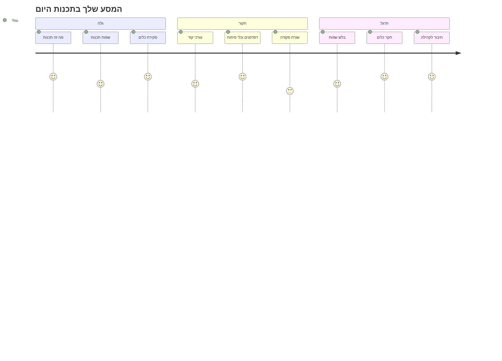
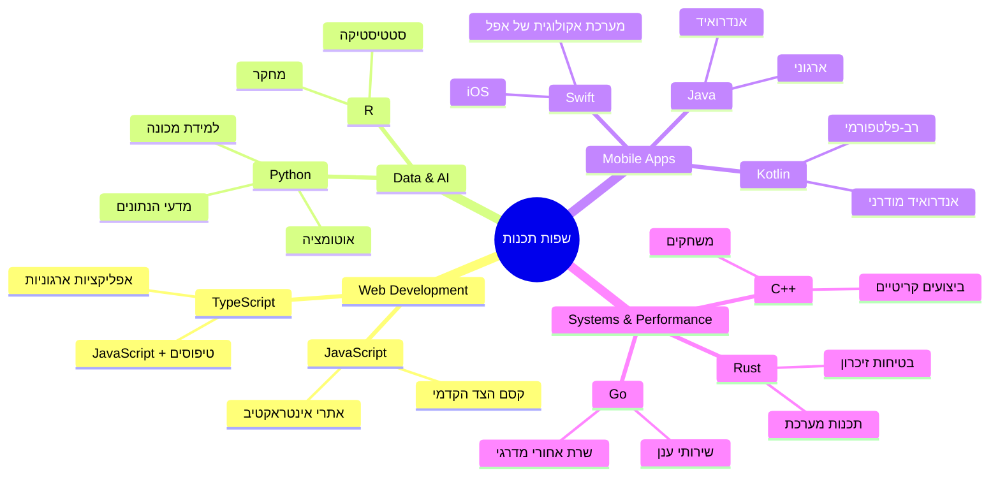
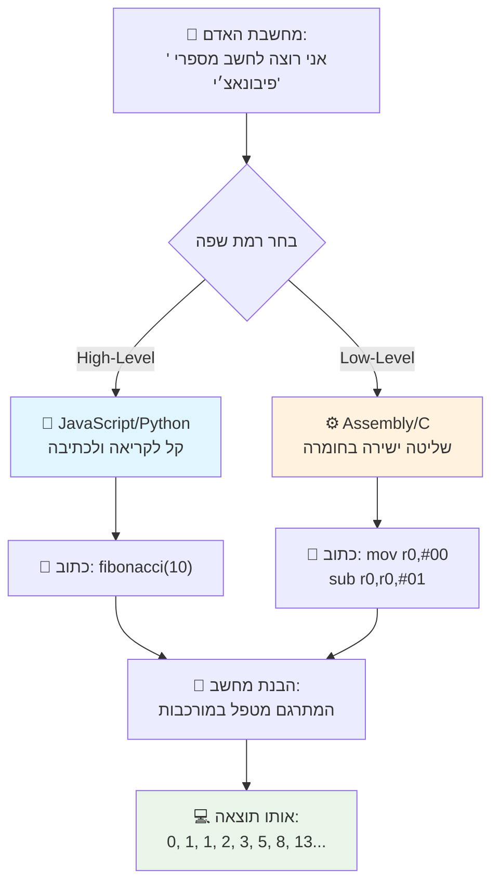
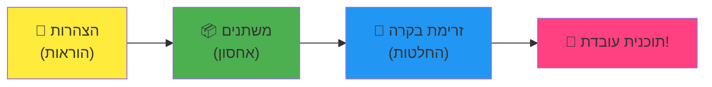
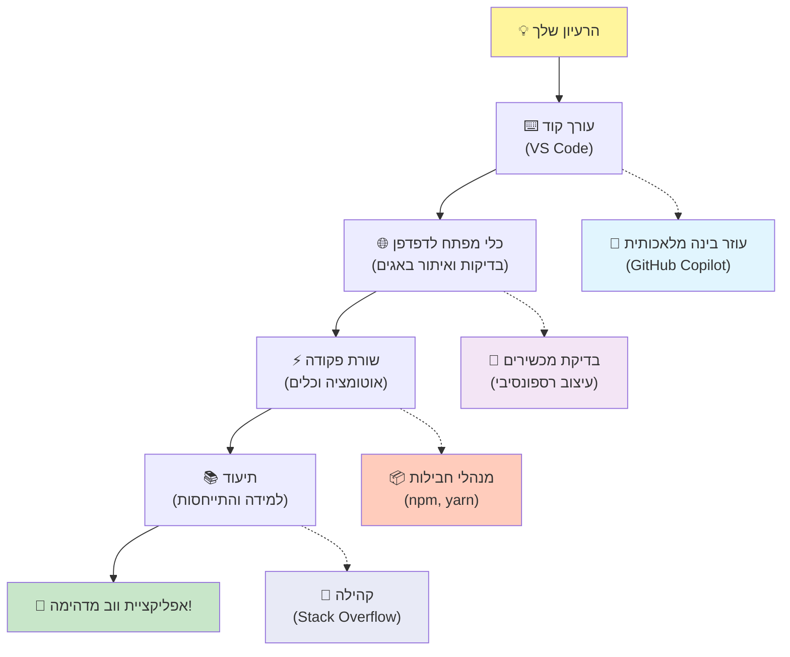
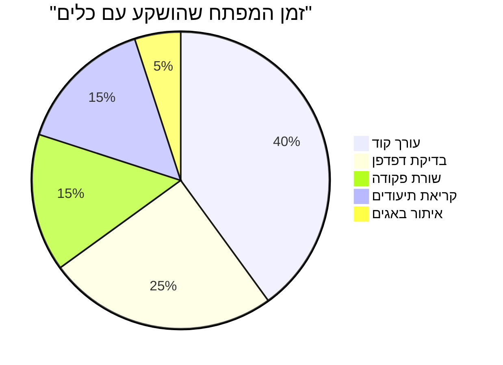
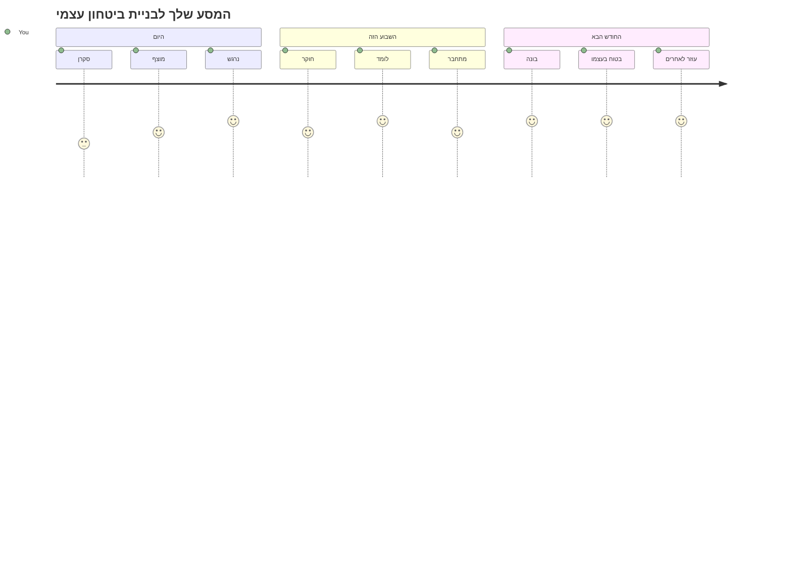

# مقدمة לשפות תכנות וכלים מודרניים למפתחים

היי שם, מפתח עתידי! 👋 אפשר לספר לך משהו שעדיין מצמרר אותי כל יום? אתה עומד לגלות שתכנות זה לא רק על מחשבים – זה על לקבל כוחות-על אמיתיים להביא את הרעיונות הפרועים שלך לחיים!

אתה יודע את הרגע כשאתה משתמש באפליקציה האהובה עליך והכל פשוט מתאים בצורה מושלמת? כשאתה לוחץ על כפתור וקרה משהו קסום שגורם לך לחשוב "וואו, איך הם עשו את זה?" ובכן, מישהו בדיוק כמוך – כנראה יושב בבית הקפה האהוב עליו בשעה 2 לפנות בוקר עם אספרסו שלישי – כתב את הקוד שיצר את הקסם הזה. והנה מה שיפיל אותך מהרגליים: בסוף השיעור הזה, לא רק שתבין איך הם עשו את זה, אלא שגם תבער לנסות את זה בעצמך!

תראה, אני לגמרי מבין אם התכנות מרגיש מפחיד כרגע. כשאני התחלתי, באמת חשבתי שאתה צריך להיות איזה גאון מתמטי או לקודד מאז שבילית חמש שנים. אבל הנה מה ששינה לגמרי את נקודת המבט שלי: תכנות זה בדיוק כמו ללמוד לנהל שיחות בשפה חדשה. אתה מתחיל ב"שלום" ו"תודה," ואז מגיע להזמין קפה, ולפני שאתה מבין, אתה מנהל שיחות פילוסופיות עמוקות! רק שבמקרה הזה, אתה מנהל שיחות עם מחשבים, ובאמת? הם השותפים הכי סבלניים לשיחה שתפגוש – הם אף פעם לא שופטים את הטעויות שלך ותמיד שמחים לנסות שוב!

היום אנחנו הולכים לחקור את הכלים המדהימים שהופכים את פיתוח האינטרנט המודרני לא רק לאפשרי, אלא גם ממכר ברצינות. אני מדבר על אותם עורכים, דפדפנים וזרמי עבודה שפותחים בנטפליקס, ספוטיפיי והסטודיו האינדי האהוב עליך משתמשים בהם כל יום. והנה החלק שיגרום לך לרקוד מרוצה: רוב הכלים האלו שהם ברמת מקצוענים ולפני תעשייה הם לגמרי חינמיים!


> שיקנוט מאת [Tomomi Imura](https://twitter.com/girlie_mac)


```mermaid
journey
    title המסע שלך בתכנות היום
    section גלה
      מה זה תכנות: 5: You
      שפות תכנות: 4: You
      סקירת כלים: 5: You
    section חקור
      עורכי קוד: 4: You
      דפדפנים וכלי פיתוח: 5: You
      שורת פקודה: 3: You
    section תרגל
      בלש שפות: 4: You
      חקר כלים: 5: You
      חיבור לקהילה: 5: You
```
## בוא נראה מה אתה כבר יודע!

לפני שנתקפץ לדברים הכיפיים, אני סקרן – מה כבר אתה יודע על עולם התכנות הזה? ואם אתה מסתכל על השאלות האלה וחושב "אין לי בכלל מושג על כל זה," זה לא רק בסדר, זה מושלם! זה אומר שאתה במקום המתאים בדיוק. תחשוב על החידון הזה כמו התמתחות לפני אימון – אנחנו פשוט מחממים את השרירים של המוח!

[עשו את החידון לפני השיעור](https://ff-quizzes.netlify.app/web/)


## ההרפתקה שאנחנו עומדים לעשות יחד

טוב, אני באמת מתרגש ממה שאנחנו הולכים לגלות היום! בכנות, הייתי רוצה לראות את פניך כשלחלק מהרעיונות האלו פתאום יתחברו. זו המסע המדהים שאנחנו לוקחים יחד:

- **מה זה תכנות בעצם (ולמה זה הדבר הכי מגניב אי פעם!)** – נגלה איך קוד הוא בעצם הקסם הבלתי נראה שמפעיל את כל מה שסביבך, מהאזעקה שיודעת שזה יום שני בבוקר ועד האלגוריתם שממליץ בדיוק לך בנטפליקס
- **שפות התכנות ואישיותן המדהימות** – תדמיין שאתה נכנס למסיבה שכל אחד בה עם כוחות-על שונים ושיטות שונות לפתור בעיות. ככה העולם של שפות תכנות, ואתה הולך לאהוב להכיר אותן!
- **האבנים הבסיסיות שגורמות לקסם הדיגיטלי לקרות** – תחשוב על זה כמו ערכת לגו יצירתית על-סף – ברגע שאתה מבין איך החלקים האלו מתחברים, תבין שאתה יכול לבנות כל מה שהדמיון שלך חולם עליו
- **כלים מקצועיים שיגרמו לך להרגיש כמו שקיבלת שרביט קוסם** – אני לא מגזים פה – הכלים האלו באמת יגרמו לך להרגיש שיש לך כוחות-על, והחלק הכי טוב? אלה אותם כלים שהמקצוענים משתמשים בהם!

> 💡 **הנה הדבר**: אל תחשוב אפילו לנסות לשנן הכל היום! כרגע, אני רק רוצה שתחוש את הניצוץ של ההתרגשות לגבי מה אפשרי. הפרטים יידבקו בטבעיות כשנתרגל יחד – כך באמת לומדים!

> אתה יכול לקחת את השיעור הזה ב[Microsoft Learn](https://learn.microsoft.com/en-us/learn/modules/web-development-101/introduction-programming/?WT.mc_id=academic-77807-sagibbon)!

## אז מה בדיוק *זה* תכנות?

טוב, בוא נתמודד עם השאלה במיליון דולר: מה זה תכנות, באמת?

אני אתן לך סיפור ששינה לגמרי איך אני חושב על זה. בשבוע שעבר, ניסיתי להסביר לאמא שלי איך להשתמש בשלט החדש שלנו לטלוויזיה החכמה. תפסתי את עצמי אומר דברים כמו "לחצי על הכפתור האדום, אבל לא הכפתור האדום הגדול, הכפתור האדום הקטן משמאל... לא, הצד השני שלך... טוב, עכשיו החזקי אותו לשתי שניות, לא אחת, לא שלוש..." נשמע מוכר? 😅

זה תכנות! זו האמנות לתת הוראות מפורטות שלב-אחרי-שלב למשהו מאוד חזק אבל צריך את כל הפרטים בדיוק מושלם. רק שבמקום להסביר לאמא שלך (שאולי שואלת "איזה כפתור אדום?!"), אתה מסביר למחשב (שפשוט עושה מה שאתה אומר, גם אם זה לא בדיוק מה שהתכוונת).

וזה מה שהפיל אותי מהרגליים כשאני למדתי את זה לראשונה: מחשבים בעצם די פשוטים בבסיס שלהם. הם מבינים רק שתי דברים – 1 ו-0, שזה בעצם "כן" ו"לא" או "דלוק" ו"כבה." זהו! אבל כאן מתחיל הקסם – אנחנו לא צריכים לדבר ב-1 ו-0 כאילו אנחנו במטריקס. פה שפות תכנות באות להצלה. הן כמו המתרגם הכי טוב בעולם שלוקח את המחשבות האנושיות והרגילות שלך ומתרגם אותן לשפת המחשב.

והנה מה שעדיין מצמרר אותי כל בוקר כשאני קם: פשוט *הכל* הדיגיטלי בחייך התחיל ממישהו בדיוק כמוך, כנראה יושב בפיג'מה עם כוס קפה, מקליד קוד במחשב הנייד שלו. מסנן האינסטגרם שגורם לך להיראות מושלם? מישהו כתב את זה. ההמלצה שהובילה אותך לשיר האהוב החדש? מפתח בנה את האלגוריתם הזה. האפליקציה שעוזרת לך לחלק חשבון ארוחת ערב עם חברים? כן, מישהו חשב "זה מעצבן, בטח אני יכול לתקן את זה" ואז... הוא עשה את זה!

כשאתה לומד לתכנת, אתה לא רק רוכש מיומנות חדשה – אתה הופך לחלק מהקהילה המדהימה של פותרי הבעיות שמבלים את ימיהם בחשיבה, "מה אם אוכל לבנות משהו שישפר את היום של מישהו קצת?" באמת, יש משהו מגניב מזה?

✅ **משימת עובדה מהנה**: הנה משהו ממש מגניב לחפש כשיש לך רגע פנוי – מי לדעתך היה מתכנת המחשב הראשון בעולם? אני אתן לך רמז: זה אולי לא מי שאתה מצפה! הסיפור מאחורי האדם הזה מרתק ומראה שתכנות תמיד היה על יצירתיות בפתרון בעיות וחשיבה מחוץ לקופסה.

### 🧠 **זמן בדיקה: איך אתה מרגיש?**

**קח רגע להרהר:**
- האם ההבנה של "לתת הוראות למחשבים" הגיונית לך עכשיו?
- האם אתה יכול לחשוב על משימה יומית שתרצה לאוטומט בעזרת תכנות?
- אילו שאלות עולות לך בראש לגבי כל נושא התכנות הזה?

> **זכור**: זה לגמרי טבעי אם חלק מהקונספטים עדיין מרגישים מעורפלים כרגע. ללמוד תכנות זה כמו ללמוד שפה חדשה – לוקח זמן למוח שלך לבנות את המסלולים העצביים. אתה עושה עבודה מעולה!

## שפות תכנות הן כמו טעמים שונים של קסם

טוב, זה הולך להישמע מוזר, אבל תתמיד איתי – שפות תכנות הן הרבה כמו סוגי מוזיקה שונים. תחשוב על זה: יש לך ג'אז שזורם ואימפרוביזטיבי, רוק חזק וישיר, קלאסי אלגנטי ומסודר, והיפ-הופ יצירתי ומביע. לכל סגנון יש אווירה משלו, קהילה של מעריצים מושקעים, וכל אחד מתאים למצבי רוח ואירועים שונים.

שפות תכנות עובדות באותו אופן! לא היית משתמש באותה שפה לבניית משחק כיף למובייל כמו שתשתמש לניתוח כמויות עצומות של נתוני אקלים, בדיוק כפי שלא תשמיע מטאל קשה בשיעור יוגה (טוב, רוב שיעורי היוגה בכל מקרה! 😄).

אבל הנה מה שגורם לי להתפעל כל פעם שאני חושב על זה: השפות האלו הן כמו התרגום הכי סבלני וברור בעולם שיושב בדיוק לידך. אתה יכול להביע את הרעיונות שלך בצורה שמרגישה טבעית למוח האנושי שלך, והן מטפלות בכל העבודה המורכבת של תרגום זה ל-1 ו-0 שהמחשבים באמת מבינים. זה כמו להיות עם חבר שרה חריף בשתי השפות – "יצירתיות אנושית" ו"לוגיקת מחשב" – והם אף פעם לא מתעייפים, לא צריכים הפסקות קפה, ולא שופטים אותך כשאתה שואל את אותה השאלה פעמיים!

### שפות תכנות פופולריות ושימושיהן


```mermaid
mindmap
  root((שפות תכנות))
    Web Development
      JavaScript
        קסם הצד הקדמי
        אתרי אינטראקטיב
      TypeScript
        JavaScript + טיפוסים
        אפליקציות ארגוניות
    Data & AI
      Python
        מדעי הנתונים
        למידת מכונה
        אוטומציה
      R
        סטטיסטיקה
        מחקר
    Mobile Apps
      Java
        אנדרואיד
        ארגוני
      Swift
        iOS
        מערכת אקולוגית של אפל
      Kotlin
        אנדרואיד מודרני
        רב-פלטפורמי
    Systems & Performance
      C++
        משחקים
        ביצועים קריטיים
      Rust
        בטיחות זיכרון
        תכנות מערכת
      Go
        שירותי ענן
        שרת אחורי מדרגי
```
| שפה | הטובה ביותר ל- | למה היא פופולרית |
|----------|----------|------------------|
| **JavaScript** | פיתוח ווב, ממשקי משתמש | רצה בדפדפנים ומאפשרת אתרי אינטראקטיביים |
| **Python** | מדעי הנתונים, אוטומציה, AI | קריאה ולמידה קלים, ספריות עוצמתיות |
| **Java** | יישומי ארגונים, אפליקציות אנדרואיד | עצמאית לפלטפורמה, עמידה למערכות גדולות |
| **C#** | אפליקציות ווינדוס, פיתוח משחקים | תמיכה חזקה מאקוסיסטם מיקרוסופט |
| **Go** | שירותי ענן, מערכות backend | מהירה, פשוטה, עוצבה למחשוב מודרני |

### שפות ברמה גבוהה לעומת ברמה נמוכה

טוב, הכנה כנה: זה היה הקונספט ששבר לי את המוח כשהתחלתי ללמוד, אז אני אספר את האנלוגיה שאחרון שעשתה לי את הקליק – ואני ממש מקווה שהיא יעילה גם עבורך!

תדמיין שאתה מבקר במדינה שאינך מדבר את השפה שלה, ואתה חייב למצוא את השירותים הכי קרובים (כולנו היינו שם, נכון? 😅):

- **תכנות ברמה נמוכה** זה כמו ללמוד את הניב המקומי כל כך טוב שאתה יכול לשוחח עם הסבתא שמוכרת פירות בפינה באמצעות רפרנסים תרבותיים, סלנג מקומי ובדיחות פנימיות שרק מי שגדל שם יבין. מרשים מאוד ויעיל... אם אתה שולט! אבל די מתסכל כשכל מה שאתה מנסה זה למצוא שירותים.

- **תכנות ברמה גבוהה** זה כמו שיש לך את החבר המקומי הנהדר הזה שמבין אותך. אתה יכול לומר "אני ממש צריך למצוא שירותים" באנגלית פשוטה, והוא מתרגם את כל הקונטקסט התרבותי ונותן לך הוראות בצורה שמגיעה טוב למוח הלא מקומי שלך.

בתחום התכנות:
- **שפות ברמה נמוכה** (כמו Assembly או C) מאפשרות לך לנהל שיחות מפורטות מאוד עם חומרת המחשב האמיתית, אבל אתה צריך לחשוב כמו מכונה, שזה... טוב, בוא נגיד זה שינוי מנטלי גדול!
- **שפות ברמה גבוהה** (כמו JavaScript, Python או C#) מאפשרות לך לחשוב כמו בן אדם בזמן שהן מטפלות בכל שפת המכונה מאחורי הקלעים. בנוסף, יש להן קהילות מאוד תומכות מלאות בבני אדם שזוכרים איך היה להיות חדש ורוצים לעזור באמת!

נחש מה אני אמליץ להתחיל איתו? 😉 שפות ברמה גבוהה הן כמו גלגלי אימון שאתה אף פעם באמת לא רוצה לזרוק כי הן עושות את כל החוויה הרבה יותר מהנה!


```mermaid
flowchart TB
    A["👤 מחשבת האדם:<br/>'אני רוצה לחשב מספרי פיבונאצ׳י'"] --> B{בחר רמת שפה}
    
    B -->|High-Level| C["🌟 JavaScript/Python<br/>קל לקריאה ולכתיבה"]
    B -->|Low-Level| D["⚙️ Assembly/C<br/>שליטה ישירה בחומרה"]
    
    C --> E["📝 כתוב: fibonacci(10)"]
    D --> F["📝 כתוב: mov r0,#00<br/>sub r0,r0,#01"]
    
    E --> G["🤖 הבנת מחשב:<br/>המתרגם מטפל במורכבות"]
    F --> G
    
    G --> H["💻 אותו תוצאה:<br/>0, 1, 1, 2, 3, 5, 8, 13..."]
    
    style C fill:#e1f5fe
    style D fill:#fff3e0
    style H fill:#e8f5e8
```
### תן לי להראות לך למה שפות ברמה גבוהה הרבה יותר ידידותיות

טוב, אני עומד להראות לך משהו שמדגים בצורה מושלמת למה התאהבתי בשפות ברמה גבוהה, אבל קודם – אני צריך שתבטיח לי משהו. כשתראה את דוגמת הקוד הראשונה, אל תיבהל! זה אמור להיראות מפחיד. זה בדיוק הנקודה שאני מעלה!

אנחנו עומדים לראות את אותה המשימה בדיוק כתובה בשתי סגנונות שונים לחלוטין. שתיהן יוצרים את רצף פיבונאצ'י – זה דפוס מתמטי יפהפה שבו כל מספר הוא סכום שני הקודמים לו: 0, 1, 1, 2, 3, 5, 8, 13... (עובדה: תמצא את הדפוס הזה בכל מקום בטבע – ספירלות בזרעי חמניות, דפוסי אשכולות אורנים, אפילו באופן היווצרות גלקסיות!)

מוכן לראות את ההבדל? בוא נצא לדרך!

**שפה ברמה גבוהה (JavaScript) – ידידותית לבני אדם:**

```javascript
// שלב 1: הגדרת פיבונאצ'י בסיסית
const fibonacciCount = 10;
let current = 0;
let next = 1;

console.log('Fibonacci sequence:');
```

**מה שהקוד הזה עושה:**
- **הצהרת** קבוע לציון כמה מספרים בפיבונאצ'י אנחנו רוצים לייצר
- **אתחול** שני משתנים למעקב אחרי המספר הנוכחי והמספר הבא ברצף
- **הגדרת** הערכים ההתחלתיים (0 ו-1) שמגדירים את דפוס פיבונאצ'י
- **הצגת** הודעת כותרת לזיהוי הפלט שלנו

```javascript
// שלב 2: יצירת הרצף עם לולאה
for (let i = 0; i < fibonacciCount; i++) {
  console.log(`Position ${i + 1}: ${current}`);
  
  // חישוב המספר הבא ברצף
  const sum = current + next;
  current = next;
  next = sum;
}
```

**פירוק מה שקורה כאן:**
- **לולאה** עוברת על כל מיקום ברצף שלנו באמצעות לולאת `for`
- **מציגה** כל מספר עם המיקום שלו באמצעות תבנית מחרוזות
- **מחושבת** המספר הבא בפיבונאצ'י על ידי סכימת הערכים הנוכחיים והבאים
- **מעודכנת** המשתנים למעקב לקראת האיטרציה הבאה

```javascript
// שלב 3: גישה פונקציונלית מודרנית
const generateFibonacci = (count) => {
  const sequence = [0, 1];
  
  for (let i = 2; i < count; i++) {
    sequence[i] = sequence[i - 1] + sequence[i - 2];
  }
  
  return sequence;
};

// דוגמת שימוש
const fibSequence = generateFibonacci(10);
console.log(fibSequence);
```

**בדוגמה למעלה עשינו:**
- **יצירת** פונקציה שניתנת לשימוש חוזר באמצעות סינטקס של חץ מודרני
- **בניית** מערך לשמירת הרצף המלא במקום הצגה אחד-אחד
- **שימוש** באינדקסציה במערך לחישוב כל מספר חדש מתוך הערכים הקודמים
- **החזרת** הרצף המלא לשימוש גמיש בחלקים אחרים בתוכנית

**שפה ברמה נמוכה (ARM Assembly) – ידידותית למחשב:**

```assembly
 area ascen,code,readonly
 entry
 code32
 adr r0,thumb+1
 bx r0
 code16
thumb
 mov r0,#00
 sub r0,r0,#01
 mov r1,#01
 mov r4,#10
 ldr r2,=0x40000000
back add r0,r1
 str r0,[r2]
 add r2,#04
 mov r3,r0
 mov r0,r1
 mov r1,r3
 sub r4,#01
 cmp r4,#00
 bne back
 end
```

שים לב איך הגרסה ב-JavaScript כמעט קוראת כמו הוראות באנגלית, ואילו גרסת ה-Assembly משתמשת בפקודות מסתוריות ששולטות ישירות במעבד המחשב. שתיהן מבצעות את אותה המשימה בדיוק, אבל שפת הרמה הגבוהה הרבה יותר קלה לאנשים להבין, לכתוב ולתחזק.

**הבדלים עיקריים שתשים לב אליהם:**
- **קריאות**: JavaScript משתמש בשמות תיאוריים כמו `fibonacciCount` בעוד Assembly משתמשת בתוויות מסתוריות כמו `r0`, `r1`
- **הערות**: שפות ברמת על מעודדות הערות הסבר שמאפשרות לקוד לתעד את עצמו
- **מבנה**: הזרימה הלוגית ב-JavaScript מתאימה לאופן שבו בני אדם חושבים על בעיות שלב אחר שלב
- **תחזוקה**: עדכון הגרסה ב-JavaScript לצרכים שונים הוא פשוט וברור

✅ **על רצף פיבונאצ'י**: דפוס המספרים המרהיב הזה לחלוטין (בו כל מספר שווה לסכום שני המספרים שלפניו: 0, 1, 1, 2, 3, 5, 8...) מופיע ממש *בהכל* בטבע! תמצאו אותו בספירלות של חמניות, בדפוסי אשכולות אורנים, בצורה שבה קונכיות נאוטילוס מתעקמות, ואפילו בצורה שבה ענפי העצים גדלים. זה מדהים איך מתמטיקה וקוד יכולים לעזור לנו להבין ולשחזר את הדפוסים שהטבע משתמש בהם ליצירת יופי!

## אבני הבניין שגורמות לקסם לקרות

טוב, עכשיו כשראית איך שפות תכנות נראות בפעולה, בואו נפרק את החלקים הבסיסיים שמרכיבים כל תוכנית שנכתבה אי פעם. תאזרו את זה כמו את מרכיבי המתכון האהוב עליכם – ברגע שתבינו מה כל אחד מהם עושה, תוכלו לקרוא ולכתוב קוד כמעט בכל שפה!

זה קצת כמו ללמוד את הדקדוק של התכנות. זוכרים בבית הספר כשלמדתם על שמות עצם, פעלים ואיך להרכיב משפטים? לתכנות יש את הגרסה שלו של דקדוק, וכנות אומרת, היא הרבה יותר לוגית ומכילה מדקדוק האנגלית אי פעם היה! 😄

### משפטים: ההוראות שלב-אחר-שלב

נתחיל עם **משפטים** – אלה כמו משפטים בודדים בשיחה עם המחשב שלכם. כל משפט אומר למחשב לעשות דבר מסוים, קצת כמו לתת הוראות: "פנה שמאלה כאן," "תעצור באור האדום," "חנה במקום הזה."

מה שאני אוהב במשפטים הוא כמה שהם בדרך כלל קריאים. תסתכלו על זה:

```javascript
// ביטויים בסיסיים שמבצעים פעולות בודדות
const userName = "Alex";                    
console.log("Hello, world!");              
const sum = 5 + 3;                         
```

**הנה מה שהקוד הזה עושה:**
- **הכרז** על משתנה קבוע שבו ישמר שם משתמש
- **הצג** הודעת ברכה בקונסול
- **חשב** ושמור את התוצאה של פעולה מתמטית

```javascript
// הצהרות שמתקשרות עם דפי אינטרנט
document.title = "My Awesome Website";      
document.body.style.backgroundColor = "lightblue";
```

**שלב אחר שלב, כך זה עובד:**
- **שנה** את כותרת העמוד שמופיעה בלשונית הדפדפן
- **שנה** את צבע הרקע של גוף הדף כולו

### משתנים: מערכת הזיכרון של התוכנית שלך

טוב, **משתנים** הם באמת אחד המושגים האהובים עליי ללמד כי הם כל כך דומים לדברים שאתם כבר משתמשים בהם בכל יום!

תחשבו על רשימת אנשי הקשר של הטלפון שלכם לרגע. אתם לא שומרים את כל המספרים בזיכרון – במקום זאת, אתם שומרים "אמא," "החבר הכי טוב," או "פיצה שמספקת עד השעה 2 בלילה" ונותנים לטלפון שלכם לזכור את המספרים האמיתיים. המשתנים עובדים בדיוק כמו זה! הם כמו מכולות מתוויות שבהן התוכנית שלכם יכולה לאחסן מידע ולשלוף אותו מאוחר יותר באמצעות שם שמתאים.

הסיבה שזה כל כך מגניב: משתנים יכולים להשתנות בזמן שהתוכנית רצה (ומכאן השם "משתנה" – הבנתם את הרמז?). בדיוק כמו שאתם אולי מעדכנים את האישור לפיצה כשאתם מגלים מקום טוב יותר, המשתנים יכולים להתעדכן כשהתוכנית לומדת מידע חדש או כשהמצבים משתנים!

תנו לי להראות לכם כמה פשוט זה יכול להיות:

```javascript
// שלב 1: יצירת משתנים בסיסיים
const siteName = "Weather Dashboard";        
let currentWeather = "sunny";               
let temperature = 75;                       
let isRaining = false;                      
```

**הבנת המושגים האלה:**
- **אחסן** ערכים שלא משתנים במשתני `const` (כמו שם האתר)
- **השתמש** ב-`let` לערכים שיכולים להשתנות לאורך התוכנית שלך
- **הקצה** סוגי נתונים שונים: מחרוזות (טקסט), מספרים, ובוליאנים (אמת/שקר)
- **בחר** שמות תיאוריים שמסבירים מה מכיל כל משתנה

```javascript
// שלב 2: עבודה עם אובייקטים כדי לקבץ נתונים קשורים
const weatherData = {                       
  location: "San Francisco",
  humidity: 65,
  windSpeed: 12
};
```

**בקטע הקוד שלמעלה:**
- **יצרנו** אובייקט לארגון מידע קשור למזג האוויר
- **ארגנו** מספר פרטים תחת שם משתנה אחד
- **השתמשנו** בזוגות מפתח-ערך לתיוג ברור של כל פרט

```javascript
// שלב 3: שימוש ועדכון משתנים
console.log(`${siteName}: Today is ${currentWeather} and ${temperature}°F`);
console.log(`Wind speed: ${weatherData.windSpeed} mph`);

// עדכון משתנים ניתנים לשינוי
currentWeather = "cloudy";                  
temperature = 68;                          
```

**הבנת כל חלק:**
- **הצג** מידע באמצעות תבניות מחרוזת עם תחביר `${}`
- **גש** לתכונות של האובייקט באמצעות נקודה (`weatherData.windSpeed`)
- **עדכן** משתנים שהוכרזו ב-`let` כדי לשקף מצבים משתנים
- **שלב** מספר משתנים ליצירת הודעות משמעותיות

```javascript
// שלב 4: פיצול מודרני לקוד נקי יותר
const { location, humidity } = weatherData; 
console.log(`${location} humidity: ${humidity}%`);
```

**מה שצריך לדעת:**
- **חלץ** תכונות מסוימות מתוך אובייקטים באמצעות השמת פירוק
- **צור** משתנים חדשים אוטומטית עם אותם שמות כמו מפתחות האובייקט
- **פשט** את הקוד באמצעות הימנעות מחזרות של סימון נקודה

### זרימת בקרה: מלמד את התוכנית שלך לחשוב

טוב, כאן התכנות נהיה לגמרי מדהים! **זרימת בקרה** זו בעצם ללמד את התוכנית שלך איך לקבל החלטות חכמות, בדיוק כמו שאתה עושה כל יום בלי אפילו לחשוב על זה.

דמיין: הבוקר סביר שעברת משהו כמו "אם יורד גשם, אקח מטרייה. אם קר, אלבש מעיל. אם אני מאחר, אזווית ארוחת בוקר ואקח קפה בדרך." המוח שלך באופן טבעי עוקב אחרי לוגיקת אם-אז עשרות פעמים ביום!

זה מה שהופך תוכניות לאינטליגנטיות וחיות במקום פשוט לעקוב אחרי תסריט משעמם וניתן לחיזוי. הן יכולות להסתכל על מצב, להעריך מה קורה, ולהגיב בהתאם. זה כמו לתת לתוכנית שלך מוח שיכול להסתגל ולקבל החלטות!

רוצה לראות איך זה עובד בצורה מדהימה? תן לי להראות לך:

```javascript
// שלב 1: לוגיקה תנאי בסיסית
const userAge = 17;

if (userAge >= 18) {
  console.log("You can vote!");
} else {
  const yearsToWait = 18 - userAge;
  console.log(`You'll be able to vote in ${yearsToWait} year(s).`);
}
```

**מה שהקוד הזה עושה:**
- **בדוק** אם גיל המשתמש עומד בדרישת ההצבעה
- **בצע** בלוקים שונים של קוד על בסיס תוצאת התנאי
- **חשב** והצג כמה זמן נותר עד שתהיה זכאות להצביע אם מתחת לגיל 18
- **ספק** משוב ספציפי ומועיל לכל תרחיש

```javascript
// שלב 2: תנאים מרובים עם אופרטורים לוגיים
const userAge = 17;
const hasPermission = true;

if (userAge >= 18 && hasPermission) {
  console.log("Access granted: You can enter the venue.");
} else if (userAge >= 16) {
  console.log("You need parent permission to enter.");
} else {
  console.log("Sorry, you must be at least 16 years old.");
}
```

**פירוק מה שקורה כאן:**
- **שלב** תנאים מרובים באמצעות האופרטור `&&` (וגם)
- **צור** היררכיית תנאים עם `else if` לתרחישים מרובים
- **טפל** בכל המקרים האפשריים עם משפט `else` סופי
- **ספק** משוב ברור ופעולתי לכל מצב שונה

```javascript
// שלב 3: תנאי תמציתי עם אופרטור טרינרי
const votingStatus = userAge >= 18 ? "Can vote" : "Cannot vote yet";
console.log(`Status: ${votingStatus}`);
```

**מה שצריך לזכור:**
- **השתמש** באופרטור הטורנרי (`? :`) לתנאים פשוטים עם שתי אפשרויות
- **כתוב** תחילה את התנאי, אחריו `?`, אז תוצאה של אמת, אחריה `:`, ואז תוצאה של שקר
- **החל** את התבנית הזו כשצריך להקצות ערכים בהתבסס על תנאים

```javascript
// שלב 4: טיפול במקרים ספציפיים מרובים
const dayOfWeek = "Tuesday";

switch (dayOfWeek) {
  case "Monday":
  case "Tuesday":
  case "Wednesday":
  case "Thursday":
  case "Friday":
    console.log("It's a weekday - time to work!");
    break;
  case "Saturday":
  case "Sunday":
    console.log("It's the weekend - time to relax!");
    break;
  default:
    console.log("Invalid day of the week");
}
```

**קוד זה משיג את הדברים הבאים:**
- **התאם** את ערך המשתנה למספר מקרים ספציפיים
- **קבץ** מקרים דומים יחד (ימי השבוע מול סופי שבוע)
- **בצע** את בלוק הקוד המתאים כאשר נמצא התאמה
- **כלול** מקרה `default` לטיפול בערכים לא צפויים
- **השתמש** בפקודות `break` כדי למנוע המשך לקוד במקרים הבאים

> 💡 **אנלוגיה מהחיים האמיתיים**: חשבו על זרימת הבקרה כמו על GPS הסבלני ביותר בעולם שנותן לך הוראות. הוא עשוי לומר "אם יש פקקים ברחוב הראשי, קח את הכביש המהיר במקום. אם יש עבודות בכביש המהיר, נסה את הדרך הנופית." תוכניות משתמשות באותו סוג לוגיקה מותנית כדי להגיב בצורה אינטליגנטית למצבים שונים ולספק למשתמשים את החוויה הטובה ביותר.

### 🎯 **בדיקת מושגים: שליטה באבני בניין**

**בואו נראה איך אתם מסתדרים עם הבסיס:**
- האם תוכלו להסביר את ההבדל בין משתנה למשפט במילים שלכם?
- חשבו על תרחיש אמיתי שבו תשתמשו בהחלטת אם-אז (כמו בדוגמת ההצבעה שלנו)
- מה הפתיע אתכם בלוגיקת התכנות?

**הגברת בטחון מהירה:**

```mermaid
flowchart LR
    A["📝 הצהרות<br/>(הוראות)"] --> B["📦 משתנים<br/>(אחסון)"] --> C["🔀 זרימת בקרה<br/>(החלטות)"] --> D["🎉 תוכנית עובדת!"]
    
    style A fill:#ffeb3b
    style B fill:#4caf50
    style C fill:#2196f3
    style D fill:#ff4081
```
✅ **מה שמגיע עכשיו**: אנחנו עומדים ליהנות ממש ממש קפיצה עמוקה יותר למושגים האלה כשנמשיך במסע המדהים הזה יחד! כרגע, תתמקדו בהרגשה של ההתרגשות מכל האפשרויות המדהימות שמלפניכם. הכישורים והטכניקות המדויקות יגיעו באופן טבעי כשנתרגל ביחד – מבטיח שזה יהיה הרבה יותר כיף ממה שציפיתם!

## כלי המסחר

טוב, כאן אני באמת מתרגש עד כדי כך שקשה לי להתאפק! 🚀 אנחנו עומדים לדבר על הכלים המדהימים שגורמים לך להרגיש כאילו זה עתה קיבלת את מפתחות החללית הדיגיטלית.

אתה יודע איך לשף יש את הסכינים המאוזנים להפליא שמרגישים כמו המשך של הידיים שלו? או איך למוזיקאי יש את הגיטרה שכשאוחזים בה היא כאילו שרה? ובכן, למפתחים יש את הגרסה שלהם של הכלים הקסומים האלה, והנה מה שיציף את המוח שלך לחלוטין – רובם לגמרי חינמיים!

אני כמעט מתרוצץ בכיסא מהתרגשות לחשוף את זה לכם כי הם שינו לגמרי איך אנחנו בונים תוכנה. אנחנו מדברים על עוזרים לתכנות עם טכנולוגיית AI שיכולים לעזור לכתוב את הקוד שלך (בלי בדיחה!), סביבות ענן שבהן אתה יכול לבנות יישומים שלמים מכל מקום שיש בו Wi-Fi, וכלי ניפוי שגיאות כה מתקדמים שהם כמו להחזיק בראיית אקס-ריי לתוכניות שלך.

והנה החלק שעדיין נותן לי צמרמורת: אלה לא כלים למתחילים שתעבור עליהם. אלה אותם כלים מקצועיים בדיוק שמפתחים ב-Google, Netflix, והסטודיו האינדיפנדנטי שאתה אוהב משתמשים בהם ברגע זה ממש. אתה תרגיש כמו מקצוען אמיתי כשאתה משתמש בהם!


```mermaid
graph TD
    A["💡 הרעיון שלך"] --> B["⌨️ עורך קוד<br/>(VS Code)"] 
    B --> C["🌐 כלי מפתח לדפדפן<br/>(בדיקות ואיתור באגים)"]
    C --> D["⚡ שורת פקודה<br/>(אוטומציה וכלים)"]
    D --> E["📚 תיעוד<br/>(למידה והתייחסות)"]
    E --> F["🚀 אפליקציית ווב מדהימה!"]
    
    B -.-> G["🤖 עוזר בינה מלאכותית<br/>(GitHub Copilot)"]
    C -.-> H["📱 בדיקת מכשירים<br/>(עיצוב רספונסיבי)"]
    D -.-> I["📦 מנהלי חבילות<br/>(npm, yarn)"]
    E -.-> J["👥 קהילה<br/>(Stack Overflow)"]
    
    style A fill:#fff59d
    style F fill:#c8e6c9
    style G fill:#e1f5fe
    style H fill:#f3e5f5
    style I fill:#ffccbc
    style J fill:#e8eaf6
```
### עורכי קוד ו-IDE: החברים הדיגיטליים החדשים שלך

בוא נדבר על עורכי קוד – הם הולכים להיות המקומות האהובים עליך לבלות! תחשוב עליהם כמקדש הקוד הפרטי שלך שבו תבלה את רוב הזמן ביצירה והתמקצעות של היצירות הדיגיטליות שלך.

אבל הנה מה שיש קסום מאוד בעורכים מודרניים: הם לא סתם עורך טקסט מפואר. הם כמו מנטור לתכנות הכי חכם ותומך שיושב לצידך 24/7. הם תופסים טעויות הקלדה עוד לפני שאתה שם לב, מציעים שיפורים שגורמים לך להיראות גאון, עוזרים לך להבין כל פיסת קוד, ויש אפילו כאלה שיכולים לנבא מה אתה עומד להקליד ולהציע להשלים את המחשבות שלך!

אני זוכר כשגיליתי את ההשלמה האוטומטית – הרגשתי ממש כאילו אני חי בעתיד. אתה מתחיל להקליד משהו, והעורך שלך אומר, "האם חשבת על הפונקציה הזו שעושה בדיוק את מה שאתה צריך?" זה כמו שיהיה לך קורא מחשבות כחבר הקוד!

**מה הופך את העורכים האלה למדהימים כל כך?**

עורכי קוד מודרניים מציעים מערך מרשים של תכונות שנועדו להגביר את הפרודוקטיביות שלך:

| תכונה | מה היא עושה | למה זה עוזר |
|---------|--------------|--------------|
| **הדגשת תחביר** | צובע חלקים שונים בקוד שלך | מקל על קריאת הקוד וזיהוי שגיאות |
| **השלמה אוטומטית** | מציע קוד כשאתה מקליד | מזרז את התכנות ומפחית טעויות הקלדה |
| **כלי ניפוי שגיאות** | עוזר למצוא ולתקן שגיאות | חוסך שעות של פתרון בעיות |
| **הרחבות** | מוסיף תכונות מתמחות | מאפשר התאמה אישית של העורך לכל טכנולוגיה |
| **עוזרי AI** | מציעים קוד והסברים | מ aceler מצביעים על למידה ופרודוקטיביות |

> 🎥 **משאב וידאו**: רוצה לראות את הכלים האלה בפעולה? צפה ב-[וידאו כלים למסחר](https://youtube.com/watch?v=69WJeXGBdxg) למבט כולל.

#### עורכים מומלצים לפיתוח ווב

**[Visual Studio Code](https://code.visualstudio.com/?WT.mc_id=academic-77807-sagibbon)** (חינמי)
- הפופולרי ביותר בקרב מפתחי ווב
- אקוסיסטם מצוין של הרחבות
- טרמינל מובנה ואינטגרציה עם Git
- **הרחבות חובה**:
  - [GitHub Copilot](https://marketplace.visualstudio.com/items?itemName=GitHub.copilot) - הצעות קוד מופעלות ב-AI
  - [Live Share](https://marketplace.visualstudio.com/items?itemName=MS-vsliveshare.vsliveshare) - שיתוף פעולה בזמן אמת
  - [Prettier](https://marketplace.visualstudio.com/items?itemName=esbenp.prettier-vscode) - עיצוב קוד אוטומטי
  - [Code Spell Checker](https://marketplace.visualstudio.com/items?itemName=streetsidesoftware.code-spell-checker) - תפס טעויות כתיב בקוד

**[JetBrains WebStorm](https://www.jetbrains.com/webstorm/)** (בתשלום, חינמי לסטודנטים)
- כלים מתקדמים לניפוי שגיאות ובדיקות
- השלמת קוד חכמה
- בקרת גרסאות מובנית

**IDE מבוססי ענן** (מחירים משתנים)
- [GitHub Codespaces](https://github.com/features/codespaces) - VS Code מלא בדפדפן שלך
- [Replit](https://replit.com/) - מעולה ללמידה ושיתוף קוד
- [StackBlitz](https://stackblitz.com/) - פיתוח ווב מיידי במלואו

> 💡 **טיפ להתחלה**: התחל עם Visual Studio Code – הוא חינמי, בשימוש נרחב בתעשייה, ויש לו קהילה ענקית שיוצרת מדריכים והרחבות מועילות.

### דפדפני אינטרנט: המעבדה הסודית שלך לפיתוח

טוב, התכונן שינהפך לך את התודעה! אתה יודע איך אתה משתמש בדפדפנים לגלול ברשתות חברתיות ולצפות בסרטונים? אז מסתבר שהם הסתירו את המעבדה הסודית והמדהימה הזו לפיתוח כל הזמן הזה, מחכה שתגלה אותה!

בכל פעם שלוחצים קליק ימני על דף אינטרנט ובוחרים "בדוק אלמנט," אתה פותח עולם נסתר של כלי מפתח שהם אותנטיים יותר חזקים מתוכנות יקרות ששילמתי להן מאות שקלים. זה כמו לגלות שהמטבח הרגיל שלך הסתיר מעבדת שף מקצועית מאחורי לוח סודי!
הפעם הראשונה שמישהו הראה לי את כלי הפיתוח בדפדפן (DevTools), ביליתי בערך שלוש שעות רק לוחץ סביב ואומר "חכה, גם את זה הוא יכול?!" בפועל, אפשר לערוך כל אתר בזמן אמת, לראות בדיוק כמה מהר הכל נטען, לבדוק איך האתר שלך נראה במכשירים שונים ואפילו לנפות באג‘ים ב-JavaScript כמו מקצוען אמיתי. זה פשוט מדהים ומעורר מחשבה!

**הנה למה הדפדפנים הם הנשק הסודי שלך:**

כשאתה יוצר אתר או אפליקציה, אתה צריך לראות איך הם נראים ומתנהגים בעולם האמיתי. הדפדפנים לא רק מציגים את העבודה שלך, אלא גם מספקים משוב מפורט על ביצועים, נגישות ובעיות פוטנציאליות.

#### כלי המפתח בדפדפן (DevTools)

דפדפנים מודרניים כוללים ערכות פיתוח מקיפות:

| קטגוריית כלי | מה הכלי עושה | דוגמה לשימוש |
|---------------|--------------|------------------|
| **בוחן אלמנטים** | הצגה ועריכה של HTML/CSS בזמן אמת | התאמת עיצוב ותצוגה מיידית |
| **מסוף** | הצגת הודעות שגיאה ובדיקת JavaScript | פתרון בעיות ונסיונות קוד |
| **מוניטור רשת** | מעקב אחר טעינת משאבים | אופטימיזציה של ביצועים וזמנים לטעינה |
| **בודק נגישות** | בדיקה של עיצוב כוללני | הבטחת תקינות האתר לכל המשתמשים |
| **סימולטור מכשירים** | תצוגה במידות מסך שונות | בדיקת עיצוב רספונסיבי בלי מכשירים שונים |

#### דפדפנים מומלצים לפיתוח

- **[Chrome](https://developers.google.com/web/tools/chrome-devtools/)** - כלי פיתוח נפוצים בתעשייה עם תיעוד נרחב
- **[Firefox](https://developer.mozilla.org/docs/Tools)** - כלים מצוינים ל-CSS Grid ונגישות
- **[Edge](https://docs.microsoft.com/microsoft-edge/devtools-guide-chromium/?WT.mc_id=academic-77807-sagibbon)** - מבוסס על Chromium עם מקורות פיתוח של מיקרוסופט

> ⚠️ **טיפ חשוב לבדיקה**: תמיד בדוק אתרים שלך בכמה דפדפנים! מה שעובד מצוין ב-Chrome עשוי להראות שונה ב-Safari או Firefox. מפתחים מקצועיים בודקים בכל הדפדפנים המרכזיים כדי להבטיח חוויית משתמש עקבית.


### כלי שורת הפקודה: שער הכוח שלך כמפתח

טוב, בואו נקדיש רגע של כנות לגבי שורת הפקודה, כי רוצה שתשמע את זה מאדם שמבין באמת. כשראיתי אותה לראשונה – רק מסך שחור מפחיד עם טקסט מהבהב – חשבתי ממש, "לא, בהחלט לא! זה נראה כמו משהו מסרט האקרים משנות ה-80, ואני בטוח לא חכם מספיק לזה!" 😅

אבל הנה מה שהייתי רוצה שמישהו היה אומר לי אז, ומה שאני אומר לך עכשיו: שורת הפקודה לא מפחידה – היא בעצם כמו שיחה ישירה עם המחשב שלך. תחשוב על זה כמו ההבדל בין להזמין אוכל דרך אפליקציה מפוארת עם תמונות ותפריטים (שזה נוח וקל) לבין להיכנס למסעדה האהובה עליך שבה השף יודע בדיוק מה אתה אוהב ויכול להכין משהו מושלם רק שתאמר "הפתע אותי במשהו מדהים."

שורת הפקודה היא המקום שבו מפתחים מרגישים כמו קוסמים מוחלטים. אתה מקליד כמה מילים שנראות קסומות (טוב, הן סתם פקודות, אבל זה מרגיש קסום!), לוחץ אנטר, ויום-טוב – יצרת מבני פרויקטים שלמים, התקנת כלי פיתוח רבי עוצמה מרחבי העולם או פרסת את האפליקציה שלך באינטרנט למיליוני אנשים לצפייה. ברגע שאתה טועם את הכוח הזה, זה די ממכר!

**למה שורת הפקודה תהפוך לכלי האהוב עליך:**

בעוד ממשקי גרפיקה מצוינים למשימות רבות, שורת הפקודה מצטיינת באוטומציה, דיוק ומהירות. רבים מכלי הפיתוח עובדים בעיקר בשורת פקודה, ולימוד השימוש בהם בצורה יעילה יכול לשפר פלאים את הפרודוקטיביות שלך.

```bash
# שלב 1: צור ונווט לתיקיית הפרויקט
mkdir my-awesome-website
cd my-awesome-website
```

**הנה מה שהקוד הזה עושה:**
- **יצירת** תיקייה חדשה בשם "my-awesome-website" עבור הפרויקט שלך
- **כניסה** לתיקייה החדשה כדי להתחיל עבודה

```bash
# שלב 2: אתחול הפרויקט עם package.json
npm init -y

# התקן כלי פיתוח מודרניים
npm install --save-dev vite prettier eslint
npm install --save-dev @eslint/js
```

**שלב אחר שלב, הנה מה שקורה:**
- **איתחול** פרויקט Node.js חדש עם הגדרות ברירת מחדל באמצעות `npm init -y`
- **התקנת** Vite ככלי בנייה מודרני לפיתוח מהיר ובניית הפקה
- **הוספת** Prettier לפורמט אוטומטי של הקוד ו-ESLint לבדיקת איכות הקוד
- **שימוש** ב-`--save-dev` לסימון תלותות לפיתוח בלבד

```bash
# שלב 3: יצירת מבנה הפרויקט והקבצים
mkdir src assets
echo '<!DOCTYPE html><html><head><title>My Site</title></head><body><h1>Hello World</h1></body></html>' > index.html

# הפעלת שרת הפיתוח
npx vite
```

**כפי שנעשה למעלה:**
- **ארגון** הפרויקט על ידי יצירת תיקיות נפרדות לקוד מקור ונכסים
- **יצירת** קובץ HTML בסיסי עם מבנה תקין
- **הפעלת** שרת הפיתוח של Vite לטעינה מחדש ו-Hot Module Replacement

#### כלי שורת פקודה חיוניים לפיתוח אתרים

| כלי | מטרה | למה אתה צריך אותו |
|------|---------|-----------------|
| **[Git](https://git-scm.com/)** | בקרת גרסאות | מעקב אחר שינויים, שיתוף פעולה, גיבוי עבודה |
| **[Node.js & npm](https://nodejs.org/)** | סביבת ריצה לנג'אווה סקריפט וניהול חבילות | הרצת JS מחוץ לדפדפן, התקנת כלי פיתוח מודרניים |
| **[Vite](https://vitejs.dev/)** | כלי בנייה ושרת פיתוח | פיתוח מהיר במיוחד עם החלפת מודולים חמה |
| **[ESLint](https://eslint.org/)** | איכות קוד | מציאת ותקון עצמאי של בעיות בקוד JS |
| **[Prettier](https://prettier.io/)** | עיצוב קוד | שמירה על קוד בפורמט אחיד וקריא |

#### אפשרויות לפי פלטפורמה

**Windows:**
- **[Windows Terminal](https://docs.microsoft.com/windows/terminal/?WT.mc_id=academic-77807-sagibbon)** - טרמינל מודרני ועשיר בתכונות
- **[PowerShell](https://docs.microsoft.com/powershell/?WT.mc_id=academic-77807-sagibbon)** 💻 - סביבה עוצמתית לסקריפטים
- **[Command Prompt](https://docs.microsoft.com/windows-server/administration/windows-commands/?WT.mc_id=academic-77807-sagibbon)** 💻 - שורת הפקודה המסורתית של Windows

**macOS:**
- **[Terminal](https://support.apple.com/guide/terminal/)** 💻 - אפליקציית טרמינל מובנית
- **[iTerm2](https://iterm2.com/)** - טרמינל משופר עם תכונות מתקדמות

**Linux:**
- **[Bash](https://www.gnu.org/software/bash/)** 💻 - מעטפת סטנדרטית בלינוקס
- **[KDE Konsole](https://docs.kde.org/trunk5/en/konsole/konsole/index.html)** - אמולטור טרמינל מתקדם

> 💻 = מותקן מראש במערכת ההפעלה

> 🎯 **נתיב למידה**: התחל בפקודות בסיסיות כמו `cd` (שנה תיקייה), `ls` או `dir` (רשום קבצים) ו-`mkdir` (צור תיקיה). התנסה בפקודות עבודה מודרניות כמו `npm install`, `git status` ו-`code .` (פותח את התיקייה הנוכחית ב-VS Code). עם הזמן תלמד פקודות מתקדמות וטכניקות אוטומציה.

### תיעוד: המנטור ללמידה שתמיד לצדך

טוב, תן לי לחלוק סוד קטן שיעזור לך להרגיש טוב יותר בתור מתחיל: גם המפתחים המנוסים מבלים הרבה זמן בקריאת תיעוד. וזה לא כי הם לא יודעים מה הם עושים – זה בעצם סימן לחכמה!

תחשוב על התיעוד בתור גישה למורים הסבלניים, בעלי הידע העצום, הזמינים 24/7. תקוע בבעיה בשתיים לפנות בוקר? התיעוד שם עם חיבוק וירטואלי חם ותשובה מדויקת. רוצה ללמוד על תכונה חדשה שכולם מדברים עליה? התיעוד כאן עם דוגמאות שלב אחר שלב. מנסה להבין למה משהו עובד כמו שהוא עובד? ניחשת נכון – התיעוד מוכן להסביר בדרך שתגרום לך להבין לבסוף!

הנה משהו ששינה לגמרי את נקודת המבט שלי: עולם הפיתוח מתקדם במהירות מטורפת, ואף אחד (אני מתכוון ממש אף אחד!) לא זוכר הכל בעל פה. ראיתי מפתחים בכירים עם מעל 15 שנות ניסיון שמחפשים דקדוק בסיסי, ואתה יודע מה? זה כלל לא מבייש – זה חכם! זה לא עניין של זיכרון מושלם, אלא לדעת איפה למצוא תשובות אמינות במהירות ולהבין איך ליישם אותן.

**פה הקסם האמיתי קורה:**

מפתחים מקצועיים מבלים מרבית זמנם בקריאת תיעוד – לא כי הם לא יודעים, אלא כי הנוף של פיתוח האינטרנט משתנה כל כך מהר שצריך ללמוד תמיד. תיעוד טוב מסייע לך להבין לא רק *איך* להשתמש במשהו, אלא *למה* ומתי להשתמש בו.

#### משאבי תיעוד חיוניים

**[Mozilla Developer Network (MDN)](https://developer.mozilla.org/docs/Web)**
- הסטנדרט הזהב לתיעוד טכנולוגיות אינטרנט
- מדריכים מקיפים ל-HTML, CSS ו-JavaScript
- כולל מידע על תאימות לדפדפנים
- כולל דוגמאות מעשיות והדגמות אינטראקטיביות

**[Web.dev](https://web.dev)** (מאת גוגל)
- שיטות עבודה מתקדמות לפיתוח אינטרנט
- מדריכים לאופטימיזציה של ביצועים
- עקרונות נגישות ועיצוב כוללני
- מקרי מבחן מפרויקטים אמיתיים

**[Microsoft Developer Documentation](https://docs.microsoft.com/microsoft-edge/#microsoft-edge-for-developers)**
- מקורות לפיתוח בדפדפן Edge
- מדריכים ל-Progressive Web Apps
- תובנות לפיתוח חוצה פלטפורמות

**[Frontend Masters Learning Paths](https://frontendmasters.com/learn/)**
- תוכניות לימוד מובנות
- קורסי וידאו ממומחים בתעשייה
- תרגולים מעשיים

> 📚 **אסטרטגיית לימוד**: אל תנסה לשנן תיעוד – במקום זאת, למד איך לנווט בו ביעילות. סמן הפניות שימושיות בתדירות גבוהה ותרגל חיפוש מידע ספציפי במהירות.

### 🔧 **בדיקת שליטה בכלים: מה מדבר אליך?**

**קח רגע לחשוב:**
- איזה כלי הכי מתרגש לך לנסות ראשון? (אין תשובה לא נכונה!)
- האם שורת הפקודה עדיין מרגישה מאיימת, או שאתה סקרן לגביה?
- האם אתה יכול לדמיין להשתמש בכלי הפיתוח בדפדפן כדי להציץ מאחורי הקלעים של האתרים האהובים עליך?


```mermaid
pie title "זמן המפתח שהושקע עם כלים"
    "עורך קוד" : 40
    "בדיקת דפדפן" : 25
    "שורת פקודה" : 15
    "קריאת תיעודים" : 15
    "איתור באגים" : 5
```
> **תובנה מעניינת**: מרבית המפתחים מבלים כ-40% מזמנם בעורך הקוד, אך שים לב כמה זמן מוקדש לבדיקה, ללמידה ולפתרון בעיות. תכנות זו לא רק כתיבת קוד – זו יצירת חוויות!

✅ **מועד למחשבה**: הנה משהו מעניין לשקול – איך לדעתך הכלים לבניית אתרים (פיתוח) שונים מהכלים לעיצוב איך הם נראים (עיצוב)? זה כמו ההבדל בין אדריכל שמתכנן בית יפה לבין קבלן שבונה אותו בפועל. שניהם חשובים, אבל כל אחד זקוק לקופסת כלים שונה! חשיבה כזו תעזור לך לראות את התמונה הגדולה של איך אתרים באים לחיים.

## אתגר סוכן GitHub Copilot 🚀

השתמש במצב סוכן כדי להשלים את האתגר הבא:

**תיאור:** חקור תכונות של עורך קוד מודרני או IDE והדגם כיצד הוא יכול לשפר את תהליך העבודה שלך כמפתח ווב.

**הנחיה:** בחר עורך קוד או IDE (כגון Visual Studio Code, WebStorm או IDE מבוסס ענן). פרט שלוש תכונות או הרחבות שעוזרות לך לכתוב, לנפות באגים או לתחזק קוד ביעילות. עבור כל אחד, הסבר בקצרה כיצד הוא מועיל לתהליך העבודה שלך.

---

## 🚀 אתגר

**טוב, בלש, מוכן לתיק הראשון שלך?**

עכשיו כשיש לך את הבסיס המדהים הזה, יש לי הרפתקה שתעזור לך לראות כמה העולם של התכנות מגוון ומרתק באמת. והקשב – זה לא על כתיבת קוד עדיין, אז בלי לחץ! תחשוב על עצמך כבלש שפת תכנות בתיק המרגש הראשון שלו!

**המשימה שלך, אם תבחר לקבלה:**
1. **הפוך לחוקר שפות:** בחר שלוש שפות תכנות מיקום שונים לגמרי – אולי אחת לבניית אתרים, אחת ליצירת אפליקציות מובייל, ואחת לעיבוד מידע למדענים. חפש דוגמאות לאותה משימה פשוטה בכל שפה. מבטיח שתתפלא עד כמה הן שונות למרות שהן עושות את אותו הדבר בדיוק!

2. **גלה את סיפורי המקור שלהן:** מה עושה כל שפה למיוחדת? הנה עובדה מגניבה – כל שפת תכנות נוצרה כי מישהו חשב, "אתה יודע מה? חייב להיות דרך טובה יותר לפתור את הבעיה הזאת." האם תוכל לברר מה היו הבעיות האלה? כמה סיפורים ממש מסקרנים!

3. **הכר את הקהילות:** בדוק כמה כל קהילה של שפה מסבירת פנים ותומכת. יש כאלו עם מיליוני מפתחים שמשתפים ידע ועוזרים זה לזה, אחרים קטנים אבל מאוחדים ותומכים. תאהב לראות את האישיויות השונות שיש לקהילות האלה!

4. **לך על האינטואיציה:** איזו שפה מרגישה לך הכי נגישה כרגע? אל תתחרט על הבחירה "המאושרת" – פשוט תקשיב לתחושת הבטן שלך! אין תשובה לא נכונה כאן, ותמיד תוכל לחקור שפות נוספות אחר כך.

**עבודה נוספת לבלש:** נסה לגלות אילו אתרים או אפליקציות גדולות נבנו באיזו שפה. אני מבטיח שתתפלא לגלות מי מפעיל את Instagram, Netflix או את משחק המובייל שאי אפשר להפסיק לשחק בו!

> 💡 **זכור**: אתה לא מנסה להפוך למומחה באף אחת מהשפות היום. אתה רק מכיר את השכונה לפני שתחליט איפה להקים חנות. קח את הזמן, תיהנה, ותן לסקרנות להוביל אותך!

## בוא נחגוג את מה שגילית!

וואו, ספגת כל כך הרבה מידע מדהים היום! אני באמת מתרגש לראות כמה מהמסע המדהים הזה נחקק בך. וזכור – זה לא מבחן שבו צריך להיות מושלם. זו יותר חגיגה של כל הדברים המגניבים שלמדת על העולם המרתק הזה שאליו אתה עומד לצלול!

[לקח את מבחן הערכה](https://ff-quizzes.netlify.app/web/)

## סקירה ולמידה עצמית

**קח את הזמן לךון וליהנות!**
כבר כיסית לא מעט היום, וזה משהו שצריך להתגאות בו! עכשיו מגיע החלק הכיפי – לחקור את הנושאים שהבעירו את הסקרנות שלך. תזכור, זה לא שיעורי בית – זו הרפתקה!

**צלול לעומק למה שמלהיב אותך:**

**תנסה בעצמך עם שפות תכנות:**
- בקר באתרי האינטרנט הרשמיים של 2-3 שפות שתפסו את תשומת ליבך. לכל אחת יש אישיות וסיפור משלה!
- נסה כמה מגרשי קוד אונליין כמו [CodePen](https://codepen.io/), [JSFiddle](https://jsfiddle.net/), או [Replit](https://replit.com/). אל תפחד להתנסות – אי אפשר לשבור שום דבר!
- קרא על איך שפת התכנות האהובה עליך נוצרה. ברצינות, כמה מהסיפורים האלו מרתקים ויעזרו לך להבין למה שפות עובדות כפי שהן עובדות.

**התרגל לכלים החדשים שלך:**
- הורד את Visual Studio Code אם עדיין לא עשית זאת – זה חינמי ותאהב את זה!
- הקדש כמה דקות לגלוש בשוק התוספים. זה כמו חנות אפליקציות לעורך הקוד שלך!
- פתח את כלי המפתחים בדפדפן שלך ותלחץ קצת כאן ושם. אל דאגה אם אינך מבין הכל – פשוט תתרגל למה שיש שם.

**הצטרף לקהילה:**
- עקוב אחרי כמה קהילות מפתחים ב-[Dev.to](https://dev.to/), [Stack Overflow](https://stackoverflow.com/), או [GitHub](https://github.com/). קהילת התכנות פתוחה בצורה מדהימה לחדשים!
- צפה בכמה סרטונים ידידותיים למתחילים על כתיבת קוד ביוטיוב. יש כל כך הרבה יוצרים נהדרים שמזכירים מה זה להתחיל.
- שקול להצטרף למפגשים מקומיים או לקהילות אונליין. תאמין לי, מפתחים אוהבים לעזור לחדשים!

> 🎯 **תקשיב, הנה מה שאני רוצה שתזכור**: לא מצפים ממך להפוך לקוסם קוד בן לילה! כרגע אתה פשוט מכיר את העולם החדש המדהים שאתה עומד להיות חלק ממנו. קח את הזמן, תהנה מהמסע, וזכור – כל מפתח שאתה מעריך ישב פעם בדיוק איפה שאתה עכשיו, מרגיש נלהב ואולי קצת מוצף. זה לגמרי נורמלי, וזה אומר שאתה בדרך הנכונה!


## משימה

[Reading the Docs](assignment.md)

> 💡 **דחף קטן למשימה שלך**: אני ממש אשמח לראות אותך חוקר כלים שאנחנו עדיין לא כיסינו! דלג על העורכים, הדפדפנים וכלי השורת פקודה שכבר דיברנו עליהם – יש כל כך הרבה עולם מדהים של כלי פיתוח מחכה שתגלה אותו. חפש כאלה שמטופלים באופן פעיל ויש להם קהילות תוססות ותומכות (אלו נוטות להיות עם ההדרכות הכי טובות והאנשים הכי מסבירים כשנתקעת וצריך ידידות).

---

## 🚀 לוח הזמנים של מסע התכנות שלך

### ⚡ **מה אפשר לעשות ב-5 הדקות הקרובות**
- [ ] שמור אתרי אינטרנט של 2-3 שפות תכנות שתפסו את תשומת ליבך
- [ ] הורד את Visual Studio Code אם עדיין לא עשית זאת
- [ ] פתח את כלי המפתחים בדפדפן (F12) ולחץ באתר כלשהו
- [ ] הצטרף לקהילת תכנות אחת (Dev.to, Reddit r/webdev, או Stack Overflow)

### ⏰ **מה אפשר להשיג במהלך השעה הקרובה**
- [ ] סיים את המבחן לאחר השיעור והרהר בתשובות שלך
- [ ] התקן את תוסף GitHub Copilot ב-VS Code
- [ ] נסה דוגמת "Hello World" ב-2 שפות תכנות שונות אונליין
- [ ] צפה בסרטון "יום בחיי מפתח" ביוטיוב
- [ ] התחל בחקירת שפת התכנות שלך (מהאתגר)

### 📅 **הרפתקה של שבוע שלם**
- [ ] סיים את המשימה וחקור 3 כלים חדשים לפיתוח
- [ ] עקוב אחרי 5 מפתחים או חשבונות תכנות ברשתות החברתיות
- [ ] נסה לבנות משהו קטן ב-CodePen או Replit (אפילו רק "Hello, [השמך שלך]!")
- [ ] קרא פוסט בלוג של מפתח על מסע התכנות שלו
- [ ] הצטרף למפגש וירטואלי או צפה בהרצאת תכנות
- [ ] התחל ללמוד את השפה שבחרת עם הדרכות אונליין

### 🗓️ **הטרנספורמציה של חודש**
- [ ] בנה את הפרויקט הקטן הראשון שלך (אפילו דף אינטרנט פשוט נחשב!)
- [ ] תרום לפרויקט קוד פתוח (התחל בתיקוני תיעוד)
- [ ] היה מנטור למישהו שבא לעולם התכנות עכשיו
- [ ] צור אתר פורטפוליו כמפתח
- [ ] קשר לקהילות מפתחים מקומיות או קבוצות לימוד
- [ ] התחל לתכנן את שלב הלמידה הבא שלך

### 🎯 **בדיקת השתקפות סופית**

**לפני שאתה ממשיך, קח רגע לחגוג:**
- מה הדבר היחיד בתכנות שהלהיב אותך היום?
- איזה כלי או מושג אתה רוצה לחקור ראשון?
- איך אתה מרגיש לגבי התחלת מסע התכנות הזה?
- איזו שאלה היית רוצה לשאול מפתח כרגע?


```mermaid
journey
    title המסע שלך לבניית ביטחון עצמי
    section היום
      סקרן: 3: You
      מוצף: 4: You
      נרגש: 5: You
    section השבוע הזה
      חוקר: 4: You
      לומד: 5: You
      מתחבר: 4: You
    section החודש הבא
      בונה: 5: You
      בטוח בעצמו: 5: You
      עוזר לאחרים: 5: You
```
> 🌟 **זכור**: כל מומחה היה פעם מתחיל. כל מפתח בכיר הרגיש בדיוק כמוך עכשיו – נלהב, אולי קצת מוצף, ומוזמן מאוד לגלות מה אפשרי. אתה בחברה מדהימה, והמסע הזה עומד להיות מרגש. ברוך הבא לעולם הנפלא של התכנות! 🎉

---

<!-- CO-OP TRANSLATOR DISCLAIMER START -->
**הצהרת אחריות**:  
מסמך זה תורגם בשימוש בשירות תרגום מבוסס בינה מלאכותית [Co-op Translator](https://github.com/Azure/co-op-translator). למרות שאנו שואפים לדיוק, יש לקחת בחשבון שתרגומים אוטומטיים עלולים להכיל שגיאות או אי דיוקים. יש להתייחס למסמך המקורי בשפתו כהמקור הסמכותי. למידע קריטי מומלץ להשתמש בתרגום מקצועי על ידי אדם. איננו אחראים לכל הבנה מוטעית או פרשנות שגויה הנובעת משימוש בתרגום זה.
<!-- CO-OP TRANSLATOR DISCLAIMER END -->