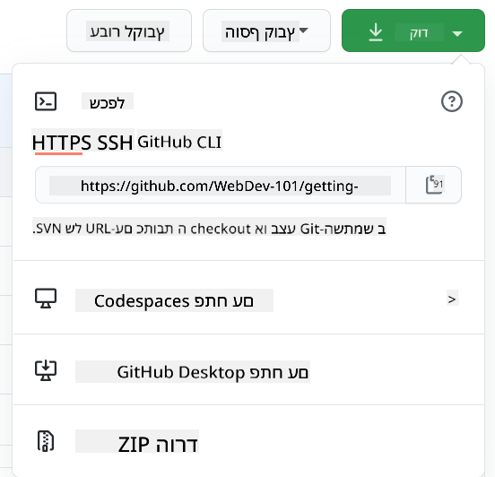

<!--
CO_OP_TRANSLATOR_METADATA:
{
  "original_hash": "ea65b75e488aa33a3cc5cb1c6c3f047a",
  "translation_date": "2025-10-03T14:04:45+00:00",
  "source_file": "1-getting-started-lessons/2-github-basics/README.md",
  "language_code": "he"
}
-->
# הקדמה ל-GitHub

השיעור הזה מכסה את היסודות של GitHub, פלטפורמה לאירוח וניהול שינויים בקוד שלך.


> איור מאת [Tomomi Imura](https://twitter.com/girlie_mac)

## שאלון לפני השיעור
[שאלון לפני השיעור](https://ff-quizzes.netlify.app)

## הקדמה

בשיעור הזה נלמד:

- איך לעקוב אחרי העבודה שאתה עושה במחשב שלך
- איך לעבוד על פרויקטים עם אחרים
- איך לתרום לתוכנה בקוד פתוח

### דרישות מקדימות

לפני שמתחילים, יש לבדוק אם Git מותקן. בטרמינל הקלד:  
`git --version`

אם Git לא מותקן, [הורד Git](https://git-scm.com/downloads). לאחר מכן, הגדר את הפרופיל המקומי שלך ב-Git דרך הטרמינל:
* `git config --global user.name "your-name"`
* `git config --global user.email "your-email"`

כדי לבדוק אם Git כבר מוגדר, ניתן להקליד:
`git config --list`

תצטרך גם חשבון GitHub, עורך קוד (כמו Visual Studio Code), ותצטרך לפתוח את הטרמינל (או: שורת הפקודה).

גש ל-[github.com](https://github.com/) ופתח חשבון אם עדיין אין לך, או התחבר ומלא את הפרופיל שלך.

✅ GitHub הוא לא מאגר הקוד היחיד בעולם; יש אחרים, אבל GitHub הוא המוכר ביותר.

### הכנה

תצטרך תיקייה עם פרויקט קוד במחשב המקומי שלך (מחשב נייד או PC), ומאגר ציבורי ב-GitHub, שישמש כדוגמה לאיך לתרום לפרויקטים של אחרים.

---

## ניהול קוד

נניח שיש לך תיקייה מקומית עם פרויקט קוד ואתה רוצה להתחיל לעקוב אחרי ההתקדמות שלך באמצעות git - מערכת ניהול גרסאות. יש אנשים שמשווים שימוש ב-git לכתיבת מכתב אהבה לעצמך בעתיד. קריאת הודעות ה-commit שלך ימים, שבועות או חודשים לאחר מכן תאפשר לך להיזכר מדוע קיבלת החלטה מסוימת, או "לחזור אחורה" בשינוי - זאת כמובן אם כתבת הודעות commit טובות.

### משימה: צור מאגר ותחייב קוד  

> צפה בסרטון
> 
> [](https://www.youtube.com/watch?v=9R31OUPpxU4)

1. **צור מאגר ב-GitHub**. ב-GitHub.com, בלשונית המאגרים או מהסרגל העליון, מצא את כפתור **מאגר חדש**.

   1. תן למאגר שלך (תיקייה) שם.
   1. בחר **צור מאגר**.

1. **נווט לתיקיית העבודה שלך**. בטרמינל, עבור לתיקייה (המכונה גם ספרייה) שברצונך להתחיל לעקוב אחריה. הקלד:

   ```bash
   cd [name of your folder]
   ```

1. **אתחל מאגר git**. בפרויקט שלך הקלד:

   ```bash
   git init
   ```

1. **בדוק סטטוס**. כדי לבדוק את הסטטוס של המאגר שלך הקלד:

   ```bash
   git status
   ```

   הפלט יכול להיראות כך:

   ```output
   Changes not staged for commit:
   (use "git add <file>..." to update what will be committed)
   (use "git checkout -- <file>..." to discard changes in working directory)

        modified:   file.txt
        modified:   file2.txt
   ```

   בדרך כלל פקודת `git status` אומרת לך דברים כמו אילו קבצים מוכנים ל_שמירה_ במאגר או יש בהם שינויים שתרצה לשמר.

1. **הוסף את כל הקבצים למעקב**  
   זה נקרא גם שלב קבצים/הוספת קבצים לאזור ההמתנה.

   ```bash
   git add .
   ```

   הפקודה `git add` עם הארגומנט `.` מציינת שכל הקבצים והשינויים שלך יתווספו למעקב.

1. **הוסף קבצים נבחרים למעקב**

   ```bash
   git add [file or folder name]
   ```

   זה עוזר לנו להוסיף רק קבצים נבחרים לאזור ההמתנה כשאנחנו לא רוצים להתחייב לכל הקבצים בבת אחת.

1. **בטל שלב של כל הקבצים**

   ```bash
   git reset
   ```

   הפקודה הזו עוזרת לנו לבטל שלב של כל הקבצים בבת אחת.

1. **בטל שלב של קובץ מסוים**

   ```bash
   git reset [file or folder name]
   ```

   הפקודה הזו עוזרת לנו לבטל שלב של קובץ מסוים בבת אחת שאנחנו לא רוצים לכלול בהתחייבות הבאה.

1. **שמור את העבודה שלך**. בשלב הזה הוספת את הקבצים לאזור שנקרא _אזור ההמתנה_. מקום שבו Git עוקב אחרי הקבצים שלך. כדי להפוך את השינוי לקבוע, עליך _להתחייב_ לקבצים. כדי לעשות זאת, צור _commit_ עם הפקודה `git commit`. ה-commit מייצג נקודת שמירה בהיסטוריה של המאגר שלך. הקלד את הפקודה הבאה כדי ליצור commit:

   ```bash
   git commit -m "first commit"
   ```

   זה מתחייב לכל הקבצים שלך, עם ההודעה "first commit". להודעות commit עתידיות תרצה להיות יותר תיאורי כדי להעביר איזה סוג שינוי ביצעת.

1. **חבר את מאגר Git המקומי שלך ל-GitHub**. מאגר Git טוב במחשב שלך, אבל בשלב מסוים תרצה שיהיה לך גיבוי של הקבצים שלך איפשהו וגם להזמין אנשים אחרים לעבוד איתך על המאגר שלך. מקום נהדר לעשות זאת הוא GitHub. זוכר שכבר יצרנו מאגר ב-GitHub? אז הדבר היחיד שצריך לעשות הוא לחבר את מאגר Git המקומי שלך ל-GitHub. הפקודה `git remote add` תעשה בדיוק את זה. הקלד את הפקודה הבאה:

   > שים לב, לפני שאתה מקליד את הפקודה, עבור לדף המאגר שלך ב-GitHub כדי למצוא את כתובת ה-URL של המאגר. תשתמש בה בפקודה למטה. החלף ```https://github.com/username/repository_name.git``` בכתובת ה-URL של GitHub שלך.

   ```bash
   git remote add origin https://github.com/username/repository_name.git
   ```

   זה יוצר _remote_, או חיבור, בשם "origin" שמצביע על המאגר ב-GitHub שיצרת קודם.

1. **שלח קבצים מקומיים ל-GitHub**. עד כה יצרת _חיבור_ בין המאגר המקומי למאגר ב-GitHub. בוא נשלח את הקבצים האלה ל-GitHub עם הפקודה הבאה `git push`, כך:

   > שים לב, שם הענף שלך עשוי להיות שונה כברירת מחדל מ```main```.

   ```bash
   git push -u origin main
   ```

   זה שולח את ה-commits שלך בענף "main" ל-GitHub. הגדרת הענף `upstream` כולל `-u` בפקודה יוצרת קישור בין הענף המקומי שלך לענף המרוחק, כך שתוכל פשוט להשתמש ב-git push או git pull מבלי לציין את שם הענף בעתיד. Git ישתמש אוטומטית בענף ה-upstream ולא תצטרך לציין את שם הענף במפורש בפקודות עתידיות.

2. **להוסיף עוד שינויים**. אם תרצה להמשיך לבצע שינויים ולדחוף אותם ל-GitHub, תצטרך להשתמש בשלוש הפקודות הבאות:

   ```bash
   git add .
   git commit -m "type your commit message here"
   git push
   ```

   > טיפ, ייתכן שתרצה גם לאמץ קובץ `.gitignore` כדי למנוע מקבצים שאתה לא רוצה לעקוב אחריהם להופיע ב-GitHub - כמו קובץ הערות שאתה שומר באותה תיקייה אבל אין לו מקום במאגר ציבורי. תוכל למצוא תבניות לקבצי `.gitignore` ב-[תבניות .gitignore](https://github.com/github/gitignore).

#### הודעות Commit

שורת נושא נהדרת להודעת commit ב-Git משלימה את המשפט הבא:  
אם ייושם, commit זה יבצע <שורת הנושא שלך כאן>

לנושא השתמש בזמן הווה, ציווי: "שנה" ולא "שינה" או "משנה".  
כמו בנושא, גם בגוף (אופציונלי) השתמש בזמן הווה, ציווי. הגוף צריך לכלול את המוטיבציה לשינוי ולהשוות זאת להתנהגות הקודמת. אתה מסביר את ה`למה`, לא את ה`איך`.

✅ הקדש כמה דקות לגלוש ב-GitHub. האם תוכל למצוא הודעת commit ממש טובה? האם תוכל למצוא אחת מינימלית מאוד? איזה מידע לדעתך הכי חשוב ומועיל להעביר בהודעת commit?

### משימה: שתף פעולה

הסיבה העיקרית לשים דברים ב-GitHub הייתה לאפשר שיתוף פעולה עם מפתחים אחרים.

## עבודה על פרויקטים עם אחרים

> צפה בסרטון
>
> [](https://www.youtube.com/watch?v=bFCM-PC3cu8)

במאגר שלך, נווט ל-`Insights > Community` כדי לראות איך הפרויקט שלך משתווה לסטנדרטים קהילתיים מומלצים.

   הנה כמה דברים שיכולים לשפר את המאגר שלך ב-GitHub:
   - **תיאור**. האם הוספת תיאור לפרויקט שלך?
   - **README**. האם הוספת README? GitHub מספק הנחיות לכתיבת [README](https://docs.github.com/articles/about-readmes/?WT.mc_id=academic-77807-sagibbon).
   - **הנחיות לתרומה**. האם לפרויקט שלך יש [הנחיות לתורמים](https://docs.github.com/articles/setting-guidelines-for-repository-contributors/?WT.mc_id=academic-77807-sagibbon)?
   - **קוד התנהגות**. [קוד התנהגות](https://docs.github.com/articles/adding-a-code-of-conduct-to-your-project/),
   - **רישיון**. אולי הכי חשוב, [רישיון](https://docs.github.com/articles/adding-a-license-to-a-repository/)?

כל המשאבים האלה יועילו בהכנסת חברי צוות חדשים. ואלו בדרך כלל הדברים שתורמים חדשים מסתכלים עליהם לפני שהם בכלל מסתכלים על הקוד שלך, כדי להבין אם הפרויקט שלך הוא המקום הנכון עבורם להשקיע את זמנם.

✅ קבצי README, למרות שהם דורשים זמן להכנה, לעיתים קרובות מוזנחים על ידי מנהלים עסוקים. האם תוכל למצוא דוגמה ל-README תיאורי במיוחד? הערה: ישנם [כלים שיעזרו ליצור README טובים](https://www.makeareadme.com/) שאולי תרצה לנסות.

### משימה: מיזוג קוד

מסמכי תרומה עוזרים לאנשים לתרום לפרויקט. הם מסבירים אילו סוגי תרומות אתה מחפש ואיך התהליך עובד. תורמים יצטרכו לעבור סדרת שלבים כדי להיות מסוגלים לתרום למאגר שלך ב-GitHub:

1. **פיצול המאגר שלך**. סביר להניח שתרצה שאנשים _יפצלו_ את הפרויקט שלך. פיצול פירושו יצירת עותק של המאגר שלך בפרופיל GitHub שלהם.
1. **שכפול**. משם הם ישכפלו את הפרויקט למחשב המקומי שלהם.
1. **יצירת ענף**. תרצה לבקש מהם ליצור _ענף_ עבור העבודה שלהם.
1. **מיקוד השינוי באזור אחד**. בקש מהתורמים להתרכז בתרומות שלהם בדבר אחד בכל פעם - כך הסיכויים שתוכל _למזג_ את העבודה שלהם גבוהים יותר. דמיין שהם כותבים תיקון באג, מוסיפים תכונה חדשה ומעדכנים כמה בדיקות - מה אם תרצה, או תוכל ליישם רק 2 מתוך 3, או 1 מתוך 3 שינויים?

✅ דמיין מצב שבו ענפים הם קריטיים במיוחד לכתיבה ושחרור קוד טוב. אילו מקרים שימושיים אתה יכול לחשוב עליהם?

> הערה, היה השינוי שאתה רוצה לראות בעולם, ויצור ענפים גם עבור העבודה שלך. כל ה-commits שתבצע יבוצעו על הענף שאתה כרגע "checked out" אליו. השתמש ב-`git status` כדי לראות באיזה ענף אתה נמצא.

בוא נעבור על תהליך העבודה של תורם. נניח שהתורם כבר _פיצל_ ו_שכפל_ את המאגר כך שיש לו מאגר Git מוכן לעבודה במחשב המקומי שלו:

1. **צור ענף**. השתמש בפקודה `git branch` כדי ליצור ענף שיכיל את השינויים שהם מתכוונים לתרום:

   ```bash
   git branch [branch-name]
   ```

1. **עבור לענף העבודה**. עבור לענף שצוין ועדכן את ספריית העבודה עם `git switch`:

   ```bash
   git switch [branch-name]
   ```

1. **בצע עבודה**. בשלב הזה תרצה להוסיף את השינויים שלך. אל תשכח לספר ל-Git על כך עם הפקודות הבאות:

   ```bash
   git add .
   git commit -m "my changes"
   ```

   ודא שאתה נותן ל-commit שלך שם טוב, למענך וגם למען מנהל המאגר שאתה עוזר לו.

1. **שלב את העבודה שלך עם הענף `main`**. בשלב מסוים סיימת לעבוד ואתה רוצה לשלב את העבודה שלך עם זו של הענף `main`. הענף `main` עשוי להשתנות בינתיים, אז ודא שאתה קודם מעדכן אותו לגרסה האחרונה עם הפקודות הבאות:

   ```bash
   git switch main
   git pull
   ```

   בשלב הזה תרצה לוודא שכל _התנגשויות_, מצבים שבהם Git לא יכול בקלות _לשלב_ את השינויים, יקרו בענף העבודה שלך. לכן, הרץ את הפקודות הבאות:

   ```bash
   git switch [branch_name]
   git merge main
   ```

   הפקודה `git merge main` תביא את כל השינויים מ-`main` לענף שלך. בתקווה שתוכל פשוט להמשיך. אם לא, VS Code יגיד לך איפה Git _מבולבל_ ואתה פשוט תשנה את הקבצים המושפעים כדי לומר איזה תוכן הוא המדויק ביותר.

   כדי לעבור לענף אחר, השתמש בפקודה המודרנית `git switch`:
   ```bash
   git switch [branch_name]


1. **שלח את העבודה שלך ל-GitHub**. שליחת העבודה שלך ל-GitHub פירושה שני דברים. דחיפת הענף שלך למאגר שלך ואז פתיחת PR, Pull Request.

   ```bash
   git push --set-upstream origin [branch-name]
   ```

   הפקודה לעיל יוצרת את הענף במאגר המפוצל שלך.
1. **פתח PR**. עכשיו, הגיע הזמן לפתוח PR. כדי לעשות זאת, נווט למאגר המפוצל שלך ב-GitHub. תראה ב-GitHub הודעה שמציעה לך ליצור PR חדש. לחץ עליה ותועבר לממשק שבו תוכל לשנות את כותרת הודעת ה-commit ולתת תיאור מתאים יותר. עכשיו, מנהל המאגר שממנו פיצלת יראה את ה-PR שלך ו_בתקווה_ יעריך אותו ו_ימזג_ אותו. מזל טוב, אתה עכשיו תורם, איזה כיף :)

1. **ניקוי**. נחשב כפרקטיקה טובה לבצע _ניקוי_ לאחר שמיזגת בהצלחה PR. כדאי לנקות גם את הסניף המקומי שלך וגם את הסניף שדחפת ל-GitHub. קודם כל, נמחק אותו מקומית עם הפקודה הבאה:

   ```bash
   git branch -d [branch-name]
   ```
  
לאחר מכן, עבור לדף GitHub של המאגר המפוצל והסר את הסניף המרוחק שדחפת אליו.

`Pull request` אולי נשמע כמו מונח מוזר, כי בעצם אתה רוצה לדחוף את השינויים שלך לפרויקט. אבל המנהל (בעל הפרויקט) או הצוות המרכזי צריכים לשקול את השינויים שלך לפני שהם ממזגים אותם עם הסניף "הראשי" של הפרויקט, כך שבעצם אתה מבקש החלטה לשינוי ממנהל הפרויקט.

Pull request הוא המקום להשוות ולדון בהבדלים שהוכנסו בסניף, עם ביקורות, הערות, בדיקות משולבות ועוד. Pull request טוב עוקב פחות או יותר אחרי אותם כללים כמו הודעת commit. ניתן להוסיף הפניה לבעיה ב-tracker של הבעיות, למשל כאשר העבודה שלך פותרת בעיה. עושים זאת באמצעות `#` ואחריו מספר הבעיה. לדוגמה: `#97`.

🤞בתקווה שכל הבדיקות יעברו ובעלי הפרויקט ימזגו את השינויים שלך לפרויקט🤞

עדכן את הסניף המקומי הנוכחי שלך עם כל ה-commits החדשים מהסניף המרוחק המתאים ב-GitHub:

`git pull`

## איך לתרום לקוד פתוח

ראשית, בוא נמצא מאגר (**repo**) ב-GitHub שמעניין אותך ושאליו תרצה לתרום שינוי. תרצה להעתיק את התוכן שלו למחשב שלך.

✅ דרך טובה למצוא מאגרים ידידותיים למתחילים היא [לחפש לפי התג 'good-first-issue'](https://github.blog/2020-01-22-browse-good-first-issues-to-start-contributing-to-open-source/).



יש כמה דרכים להעתיק קוד. אחת מהן היא "לשכפל" את התוכן של המאגר, באמצעות HTTPS, SSH, או באמצעות GitHub CLI (ממשק שורת הפקודה).

פתח את הטרמינל שלך ושכפל את המאגר כך:
`git clone https://github.com/ProjectURL`

כדי לעבוד על הפרויקט, עבור לתיקייה הנכונה:
`cd ProjectURL`

תוכל גם לפתוח את כל הפרויקט באמצעות [Codespaces](https://github.com/features/codespaces), עורך הקוד המובנה/סביבת הפיתוח בענן של GitHub, או [GitHub Desktop](https://desktop.github.com/).

לבסוף, תוכל להוריד את הקוד בתיקייה מכווצת.

### כמה דברים מעניינים נוספים על GitHub

תוכל לככב, לעקוב ו/או "לפצל" כל מאגר ציבורי ב-GitHub. תוכל למצוא את המאגרים שכיכבת בתפריט הנפתח בפינה הימנית העליונה. זה כמו סימניות, אבל לקוד.

לפרויקטים יש tracker לבעיות, בדרך כלל ב-GitHub בלשונית "Issues" אלא אם צוין אחרת, שבו אנשים דנים בבעיות הקשורות לפרויקט. ולשונית Pull Requests היא המקום שבו אנשים דנים ומבקרים שינויים שנמצאים בתהליך.

ייתכן שלפרויקטים יש גם דיונים בפורומים, רשימות תפוצה או ערוצי צ'אט כמו Slack, Discord או IRC.

✅ הסתכל סביב המאגר החדש שלך ב-GitHub ונסה כמה דברים, כמו עריכת הגדרות, הוספת מידע למאגר שלך ויצירת פרויקט (כמו לוח Kanban). יש הרבה מה לעשות!

---

## 🚀 אתגר

שתף פעולה עם חבר כדי לעבוד על הקוד אחד של השני. צרו פרויקט יחד, פצלו קוד, צרו סניפים ומזגו שינויים.

## חידון לאחר ההרצאה  
[חידון לאחר ההרצאה](https://ff-quizzes.netlify.app/web/en/)

## סקירה ולימוד עצמי

קרא עוד על [תרומה לתוכנה בקוד פתוח](https://opensource.guide/how-to-contribute/#how-to-submit-a-contribution).

[דף עזר ל-Git](https://training.github.com/downloads/github-git-cheat-sheet/).

תרגל, תרגל, תרגל. ל-GitHub יש מסלולי לימוד מצוינים זמינים דרך [skills.github.com](https://skills.github.com):

- [השבוע הראשון ב-GitHub](https://skills.github.com/#first-week-on-github)

תמצא גם קורסים מתקדמים יותר.

## משימה

השלם את [הקורס השבוע הראשון ב-GitHub](https://skills.github.com/#first-week-on-github)

---

**הצהרת אחריות**:  
מסמך זה תורגם באמצעות שירות תרגום מבוסס בינה מלאכותית [Co-op Translator](https://github.com/Azure/co-op-translator). למרות שאנו שואפים לדיוק, יש לקחת בחשבון שתרגומים אוטומטיים עשויים להכיל שגיאות או אי דיוקים. המסמך המקורי בשפתו המקורית צריך להיחשב כמקור סמכותי. עבור מידע קריטי, מומלץ להשתמש בתרגום מקצועי על ידי אדם. אנו לא נושאים באחריות לאי הבנות או לפרשנויות שגויות הנובעות משימוש בתרגום זה.