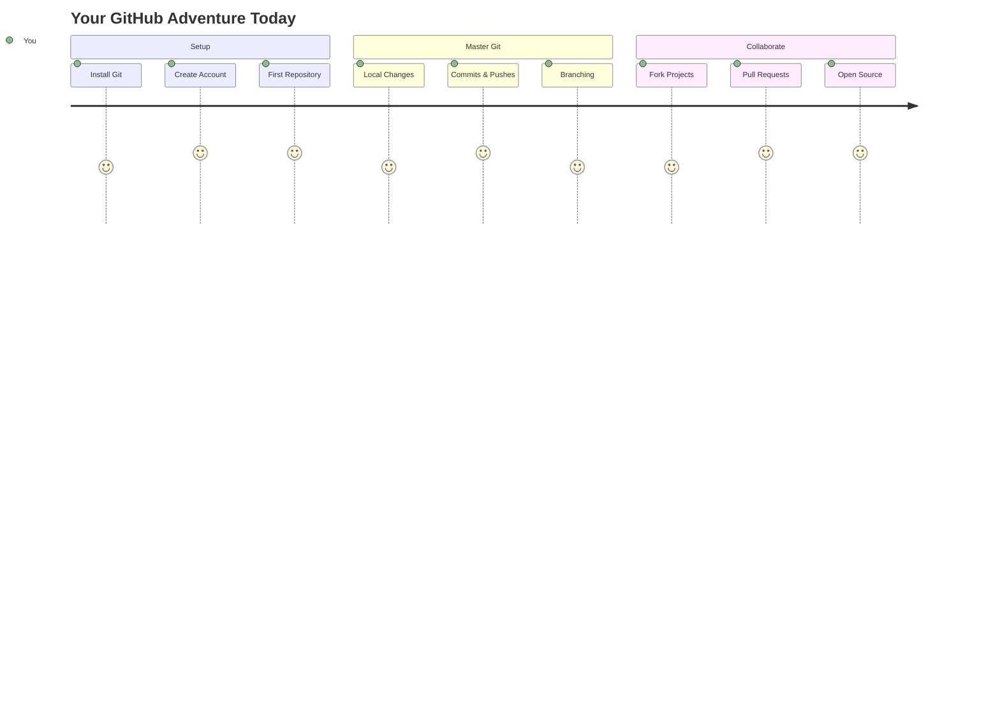
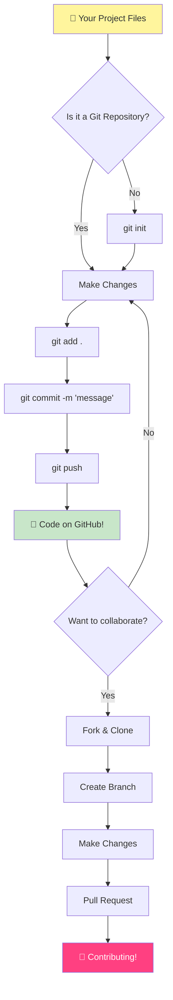
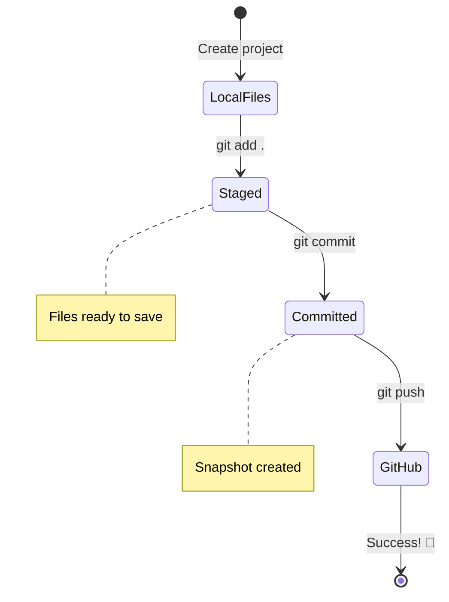
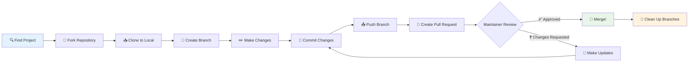
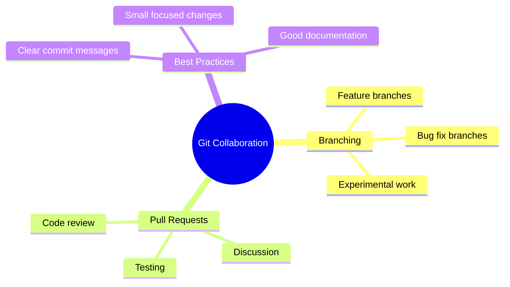
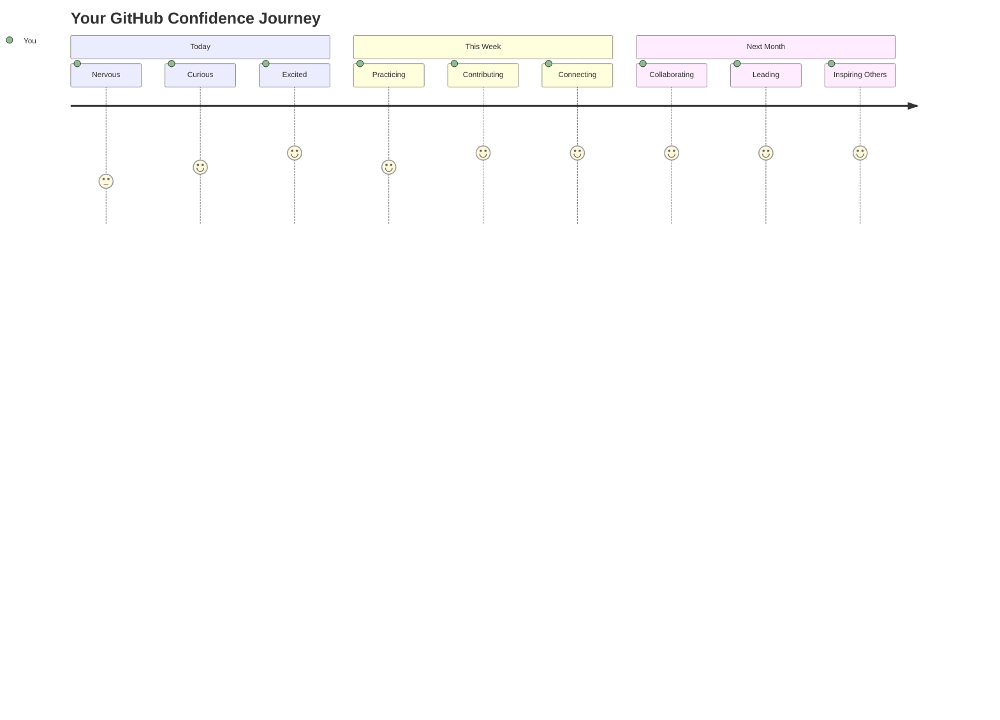

<!--
CO_OP_TRANSLATOR_METADATA:
{
  "original_hash": "0fe3ff66299b447f1c8cb34dcbf0c5ef",
  "translation_date": "2025-11-04T02:17:07+00:00",
  "source_file": "1-getting-started-lessons/2-github-basics/README.md",
  "language_code": "he"
}
-->
# מבוא ל-GitHub

היי, מפתח עתידי! 👋 מוכן להצטרף למיליוני מתכנתים ברחבי העולם? אני באמת מתרגש להכיר לך את GitHub – תחשוב על זה כמו רשת חברתית למתכנתים, רק שבמקום לשתף תמונות של ארוחת הצהריים שלך, אנחנו משתפים קוד ובונים דברים מדהימים יחד!

הנה מה שמדהים אותי: כל אפליקציה בטלפון שלך, כל אתר שאתה מבקר בו, ורוב הכלים שתלמד להשתמש בהם נבנו על ידי צוותי מפתחים ששיתפו פעולה בפלטפורמות כמו GitHub. האפליקציה המוזיקלית שאתה אוהב? מישהו כמוך תרם לה. המשחק שאתה לא יכול להפסיק לשחק? כן, כנראה נבנה בשיתוף פעולה ב-GitHub. ועכשיו אתה הולך ללמוד איך להיות חלק מהקהילה המדהימה הזו!

אני יודע שזה אולי מרגיש קצת הרבה בהתחלה – אני זוכר את הפעם הראשונה שעמדתי מול עמוד GitHub ותהיתי "מה כל זה אומר בכלל?" אבל הנה העניין: כל מפתח התחיל בדיוק מהמקום שבו אתה נמצא עכשיו. בסוף השיעור הזה, יהיה לך מאגר GitHub משלך (תחשוב על זה כמו תצוגת הפרויקטים האישית שלך בענן), ותדע איך לשמור את העבודה שלך, לשתף אותה עם אחרים ואפילו לתרום לפרויקטים שמיליוני אנשים משתמשים בהם.

אנחנו נעבור את המסע הזה יחד, צעד אחר צעד. בלי לחץ, בלי למהר – רק אתה, אני, וכמה כלים ממש מגניבים שעומדים להפוך לחברים הכי טובים שלך!


> איור מאת [Tomomi Imura](https://twitter.com/girlie_mac)



## שאלון לפני השיעור
[שאלון לפני השיעור](https://ff-quizzes.netlify.app)

## מבוא

לפני שנצלול לדברים המרגשים באמת, בואו נכין את המחשב שלכם לקצת קסם של GitHub! תחשבו על זה כמו לארגן את ציוד האמנות שלכם לפני יצירת יצירת מופת – כשיש את הכלים הנכונים הכל הרבה יותר חלק ומהנה.

אני אעבור איתכם על כל שלב בהגדרה באופן אישי, ואני מבטיח שזה לא נראה כל כך מפחיד כמו שזה נראה במבט ראשון. אם משהו לא מובן מיד, זה לגמרי נורמלי! אני זוכר את הפעם הראשונה שהגדרתי את סביבת הפיתוח שלי והרגשתי כאילו אני מנסה לקרוא הירוגליפים עתיקים. כל מפתח היה בדיוק במקום שבו אתם נמצאים עכשיו, תוהים אם הם עושים את זה נכון. ספוילר: אם אתם כאן ולומדים, אתם כבר עושים את זה נכון! 🌟

בשיעור הזה, נלמד:

- איך לעקוב אחרי העבודה שאתם עושים במחשב שלכם
- איך לעבוד על פרויקטים עם אחרים
- איך לתרום לתוכנה בקוד פתוח

### דרישות מקדימות

בואו נכין את המחשב שלכם לקצת קסם של GitHub! אל תדאגו – ההגדרה הזו היא משהו שצריך לעשות רק פעם אחת, ואז תהיו מוכנים לכל מסע הקידוד שלכם.

טוב, בואו נתחיל עם הבסיס! קודם כל, אנחנו צריכים לבדוק אם Git כבר נמצא במחשב שלכם. Git הוא בעצם כמו עוזר סופר-חכם שזוכר כל שינוי שאתם עושים בקוד שלכם – הרבה יותר טוב מללחוץ Ctrl+S כל שתי שניות (כולנו היינו שם!).

בואו נראה אם Git כבר מותקן על ידי הקלדת הפקודה הזו בטרמינל שלכם:
`git --version`

אם Git עדיין לא שם, אין בעיה! פשוט לכו ל-[הורדת Git](https://git-scm.com/downloads) ותורידו אותו. אחרי שהתקנתם אותו, אנחנו צריכים להציג את Git לכם כמו שצריך:

> 💡 **הגדרה ראשונה**: הפקודות האלה אומרות ל-Git מי אתם. המידע הזה יצורף לכל commit שאתם עושים, אז בחרו שם ואימייל שאתם מרגישים בנוח לשתף בפומבי.

```bash
git config --global user.name "your-name"
git config --global user.email "your-email"
```

כדי לבדוק אם Git כבר מוגדר, אתם יכולים להקליד:
```bash
git config --list
```

תצטרכו גם חשבון GitHub, עורך קוד (כמו Visual Studio Code), ותצטרכו לפתוח את הטרמינל שלכם (או: command prompt).

גשו ל-[github.com](https://github.com/) וצרו חשבון אם עדיין אין לכם, או התחברו ומלאו את הפרופיל שלכם.

💡 **טיפ מודרני**: שקלו להגדיר [מפתחות SSH](https://docs.github.com/en/authentication/connecting-to-github-with-ssh) או להשתמש ב-[GitHub CLI](https://cli.github.com/) לאימות קל יותר ללא סיסמאות.

✅ GitHub הוא לא מאגר הקוד היחיד בעולם; יש אחרים, אבל GitHub הוא המוכר ביותר.

### הכנה

תצטרכו גם תיקייה עם פרויקט קוד במחשב המקומי שלכם (לפטופ או PC), וגם מאגר ציבורי ב-GitHub, שישמש כדוגמה לאיך לתרום לפרויקטים של אחרים.

### שמירה על הקוד שלכם בטוח

בואו נדבר רגע על אבטחה – אבל אל תדאגו, אנחנו לא הולכים להעמיס עליכם דברים מפחידים! תחשבו על הפרקטיקות האלו כמו לנעול את הרכב או הבית שלכם. אלו הרגלים פשוטים שהופכים לטבע שני ושומרים על העבודה הקשה שלכם.

נראה לכם את הדרכים המודרניות והבטוחות לעבוד עם GitHub מההתחלה. כך תפתחו הרגלים טובים שישרתו אתכם היטב לאורך הקריירה שלכם כמתכנתים.

כשעובדים עם GitHub, חשוב לעקוב אחרי פרקטיקות אבטחה מומלצות:

| תחום אבטחה | פרקטיקה מומלצת | למה זה חשוב |
|-------------|----------------|--------------|
| **אימות** | השתמשו במפתחות SSH או ב-Personal Access Tokens | סיסמאות פחות בטוחות ונמצאות בתהליך הסרה |
| **אימות דו-שלבי** | הפעילו 2FA בחשבון GitHub שלכם | מוסיף שכבת הגנה נוספת לחשבון |
| **אבטחת מאגר** | לעולם אל תתחייבו מידע רגיש | מפתחות API וסיסמאות לא צריכים להיות במאגרים ציבוריים |
| **ניהול תלות** | הפעילו Dependabot לעדכונים | שומר על התלויות שלכם בטוחות ומעודכנות |

> ⚠️ **תזכורת אבטחה קריטית**: לעולם אל תתחייבו מפתחות API, סיסמאות או מידע רגיש אחר לשום מאגר. השתמשו במשתני סביבה ובקבצי `.gitignore` כדי להגן על מידע רגיש.

**הגדרת אימות מודרנית:**

```bash
# Generate SSH key (modern ed25519 algorithm)
ssh-keygen -t ed25519 -C "your_email@example.com"

# Set up Git to use SSH
git remote set-url origin git@github.com:username/repository.git
```

> 💡 **טיפ מקצועי**: מפתחות SSH מבטלים את הצורך להקליד סיסמאות שוב ושוב והם בטוחים יותר משיטות אימות מסורתיות.

---

## ניהול הקוד שלכם כמו מקצוענים

טוב, כאן הדברים באמת מתחילים להיות מרגשים! 🎉 אנחנו עומדים ללמוד איך לעקוב ולנהל את הקוד שלכם כמו מקצוענים, ובכנות, זה אחד הדברים האהובים עליי ללמד כי זה משנה את כללי המשחק.

תארו לעצמכם: אתם כותבים סיפור מדהים, ואתם רוצים לעקוב אחרי כל טיוטה, כל עריכה מבריקה, וכל רגע של "וואו, זה גאוני!" לאורך הדרך. זה בדיוק מה ש-Git עושה עבור הקוד שלכם! זה כמו מחברת מסע בזמן מדהימה שזוכרת הכל – כל הקשה, כל שינוי, כל רגע של "אופס, זה הרס הכל" שאפשר מיד לבטל.

אני אהיה כנה – זה אולי מרגיש קצת מרתיע בהתחלה. כשאני התחלתי, חשבתי "למה אני לא יכול פשוט לשמור את הקבצים שלי כמו רגיל?" אבל תאמינו לי: ברגע ש-Git יתחבר לכם (וזה יקרה!), תהיה לכם אחת מאותן רגעי הארה שבהם תחשבו "איך אי פעם קודדתי בלי זה?" זה כמו לגלות שאתם יכולים לעוף אחרי שהלכתם לכל מקום כל החיים!

נניח שיש לכם תיקייה מקומית עם פרויקט קוד ואתם רוצים להתחיל לעקוב אחרי ההתקדמות שלכם באמצעות git - מערכת ניהול גרסאות. יש אנשים שמשווים שימוש ב-git לכתיבת מכתב אהבה לעצמכם בעתיד. קריאת הודעות ה-commit שלכם ימים, שבועות או חודשים לאחר מכן תאפשר לכם להיזכר למה קיבלתם החלטה מסוימת, או "לחזור אחורה" בשינוי – כלומר, כשאתם כותבים הודעות commit טובות.



### משימה: צרו את המאגר הראשון שלכם!

> 🎯 **המשימה שלכם (ואני כל כך מתרגש בשבילכם!)**: אנחנו הולכים ליצור יחד את מאגר GitHub הראשון שלכם! עד סוף התהליך, יהיה לכם פינה קטנה משלכם באינטרנט שבה הקוד שלכם יישמר, ותעשו את ה-commit הראשון שלכם (זה אומר לשמור את העבודה שלכם בצורה חכמה).
>
> זה באמת רגע מיוחד – אתם עומדים להצטרף באופן רשמי לקהילת המפתחים העולמית! אני עדיין זוכר את ההתרגשות של יצירת המאגר הראשון שלי וחשבתי "וואו, אני באמת עושה את זה!"

בואו נעבור את ההרפתקה הזו יחד, צעד אחר צעד. קחו את הזמן עם כל חלק – אין פרס על למהר, ואני מבטיח שכל שלב יתחבר. זכרו, כל כוכב קידוד שאתם מעריצים היה פעם בדיוק במקום שבו אתם נמצאים עכשיו, עומד ליצור את המאגר הראשון שלו. כמה זה מגניב?

> צפו בסרטון
> 
> [](https://www.youtube.com/watch?v=9R31OUPpxU4)

**בואו נעשה את זה יחד:**

1. **צרו את המאגר שלכם ב-GitHub**. גשו ל-GitHub.com וחפשו את הכפתור הירוק **New** (או את הסימן **+** בפינה הימנית העליונה). לחצו עליו ובחרו **New repository**.

   הנה מה לעשות:
   1. תנו למאגר שלכם שם – שיהיה משהו משמעותי עבורכם!
   1. הוסיפו תיאור אם תרצו (זה עוזר לאחרים להבין על מה הפרויקט שלכם)
   1. החליטו אם אתם רוצים שהוא יהיה ציבורי (שכולם יוכלו לראות אותו) או פרטי (רק בשבילכם)
   1. אני ממליץ לסמן את התיבה להוספת קובץ README – זה כמו דף הבית של הפרויקט שלכם
   1. לחצו **Create repository** וחגגו – הרגע יצרתם את המאגר הראשון שלכם! 🎉

2. **גשו לתיקיית הפרויקט שלכם**. עכשיו בואו נפתח את הטרמינל שלכם (אל תדאגו, זה לא מפחיד כמו שזה נראה!). אנחנו צריכים להגיד למחשב שלכם איפה נמצאים קבצי הפרויקט שלכם. הקלידו את הפקודה הזו:

   ```bash
   cd [name of your folder]
   ```

   **מה אנחנו עושים כאן:**
   - אנחנו בעצם אומרים למחשב "היי, קח אותי לתיקיית הפרויקט שלי"
   - זה כמו לפתוח תיקייה ספציפית בשולחן העבודה שלכם, אבל אנחנו עושים את זה עם פקודות טקסט
   - החליפו את `[name of your folder]` בשם האמיתי של תיקיית הפרויקט שלכם

3. **הפכו את התיקייה שלכם למאגר Git**. כאן הקסם מתחיל! הקלידו:

   ```bash
   git init
   ```

   **הנה מה שקרה עכשיו (דברים די מגניבים!):**
   - Git יצר תיקייה מוסתרת בשם `.git` בפרויקט שלכם – אתם לא תראו אותה, אבל היא שם!
   - התיקייה הרגילה שלכם היא עכשיו "מאגר" שיכול לעקוב אחרי כל שינוי שאתם עושים
   - תחשבו על זה כמו לתת לתיקייה שלכם כוחות-על לזכור הכל

4. **בדקו מה קורה**. בואו נראה מה Git חושב על הפרויקט שלכם כרגע:

   ```bash
   git status
   ```

   **להבין מה Git אומר לכם:**
   
   אתם עשויים לראות משהו שנראה כך:

   ```output
   Changes not staged for commit:
   (use "git add <file>..." to update what will be committed)
   (use "git restore <file>..." to discard changes in working directory)

        modified:   file.txt
        modified:   file2.txt
   ```

   **אל תיבהלו! הנה מה שזה אומר:**
   - קבצים ב**אדום** הם קבצים שיש בהם שינויים אבל הם עדיין לא מוכנים לשמירה
   - קבצים ב**ירוק** (כשאתם רואים אותם) מוכנים לשמירה
   - Git עוזר לכם על ידי כך שהוא אומר לכם בדיוק מה אתם יכולים לעשות הלאה

   > 💡 **טיפ מקצועי**: הפקודה `git status` היא החברה הכי טובה שלכם! השתמשו בה בכל פעם שאתם מבולבלים לגבי מה שקורה. זה כמו לשאול את Git "היי, מה המצב כרגע?"

5. **הכינו את הקבצים שלכם לשמירה** (זה נקרא "staging"):

   ```bash
   git add .
   ```

   **מה שעשינו עכשיו:**
   - אמרנו ל-Git "היי, אני רוצה לכלול את כל הקבצים שלי בשמירה הבאה"
   - ה-`.` זה כמו להגיד "הכל בתיקייה הזו"
   - עכשיו הקבצים שלכם "מוכנים לשמירה" ומוכנים לשלב הבא

   **רוצים להיות יותר סלקטיביים?** אתם יכולים להוסיף רק קבצים ספציפיים:

   ```bash
   git add [file or folder name]
   ```

   **למה שתרצו לעשות את זה?**
   - לפעמים אתם רוצים לשמור שינויים קשורים יחד
   - זה עוזר לכם לארגן את העבודה שלכם לקטעים הגיוניים
   - מקל להבין מה השתנה ומתי

   **שיניתם את דעתכם?** אין בעיה! אתם יכולים להסיר קבצים מהשלב הזה כך:

   ```bash
   # Unstage everything
   git reset
   
   # Unstage just one file
   git reset [file name]
   ```

   אל דאגה – זה לא מוחק את העבודה שלכם, זה רק מוציא קבצים מה"ערימה המוכנה לשמירה".

6. **שמרו את העבודה שלכם באופן קבוע** (עשו את ה-commit הראשון שלכם!):

   ```bash
   git commit -m "first commit"
   ```

   **🎉 מזל טוב! עשיתם את ה-commit הראשון שלכם!**
   
   **הנה מה שקרה עכשיו:**
   - Git לקח "תמונת מצב" של כל הקבצים המוכנים בשלב הזה
   - הודעת ה-commit שלכם "first commit" מסבירה על מה נקודת השמירה הזו
   - Git נתן לתמונת המצב הזו מזהה ייחודי כך שתמיד תוכלו למצוא אותה
   - התחלתם רשמית לעקוב אחרי ההיסטוריה של הפרויקט שלכם!

   > 💡 **הודעות commit עתידיות**: ל-commits הבאים שלכם, היו יותר תיאוריים! במקום "updated stuff", נסו "Add contact form to homepage" או "Fix navigation menu bug". העצמי העתידי שלכם יודה לכם!

7. **חברו את הפרויקט המקומי שלכם ל-GitHub**. כרגע, הפרויקט שלכם קיים רק במחשב שלכם. בואו נחבר אותו למאגר GitHub שלכם כדי שתוכלו לשתף אותו עם העולם!

   קודם כל, גשו לעמוד המאגר שלכם ב-GitHub והעתיקו את ה-URL. ואז חזרו לכאן והקלידו:

   ```bash
   git remote add origin https://github.com/username/repository_name.git
   ```
   
   (החליפו את ה-URL הזה ב-URL האמיתי של המאגר שלכם!)
**מה שעשינו עכשיו:**
- יצרנו חיבור בין הפרויקט המקומי שלך לבין מאגר ה-GitHub שלך.
- "Origin" הוא רק כינוי למאגר ה-GitHub שלך – זה כמו להוסיף איש קשר לטלפון שלך.
- עכשיו ה-Git המקומי שלך יודע לאן לשלוח את הקוד שלך כשאתה מוכן לשתף אותו.

💡 **דרך קלה יותר**: אם התקנת את GitHub CLI, תוכל לעשות זאת בפקודה אחת:
   ```bash
   gh repo create my-repo --public --push --source=.
   ```

8. **שלח את הקוד שלך ל-GitHub** (הרגע הגדול!):

   ```bash
   git push -u origin main
   ```

**🚀 זהו זה! אתה מעלה את הקוד שלך ל-GitHub!**

**מה קורה כאן:**
- הקומיטים שלך עוברים מהמחשב שלך ל-GitHub.
- הדגל `-u` יוצר חיבור קבוע כך שהעלאות עתידיות יהיו קלות יותר.
- "main" הוא שם הענף הראשי שלך (כמו התיקייה הראשית).
- אחרי זה, תוכל פשוט להקליד `git push` להעלאות עתידיות!

💡 **הערה מהירה**: אם הענף שלך נקרא בשם אחר (כמו "master"), השתמש בשם הזה. תוכל לבדוק עם `git branch --show-current`.

9. **קצב העבודה היומי החדש שלך** (כאן זה מתחיל להיות ממכר!):

מעכשיו, בכל פעם שתבצע שינויים בפרויקט שלך, יש לך את הריקוד הפשוט הזה בשלושה שלבים:

   ```bash
   git add .
   git commit -m "describe what you changed"
   git push
   ```

**זה הופך להיות פעימת הלב של הקידוד שלך:**
- בצע שינויים מדהימים בקוד שלך ✨
- שלב אותם עם `git add` ("היי Git, שים לב לשינויים האלה!")
- שמור אותם עם `git commit` והוסף הודעה תיאורית (העתיד שלך יודה לך!)
- שתף אותם עם העולם באמצעות `git push` 🚀
- חזור על הפעולה – ברצינות, זה הופך להיות טבעי כמו לנשום!

אני אוהב את זרימת העבודה הזו כי זה כמו שיש נקודות שמירה מרובות במשחק וידאו. ביצעת שינוי שאתה אוהב? תבצע קומיט! רוצה לנסות משהו מסוכן? אין בעיה – תמיד תוכל לחזור לקומיט האחרון אם הדברים משתבשים!

> 💡 **טיפ**: אולי תרצה גם לאמץ קובץ `.gitignore` כדי למנוע קבצים שאתה לא רוצה לעקוב אחריהם מלהופיע ב-GitHub - כמו קובץ הערות שאתה שומר באותה תיקייה אבל אין לו מקום במאגר ציבורי. תוכל למצוא תבניות לקבצי `.gitignore` ב-[.gitignore templates](https://github.com/github/gitignore) או ליצור אחד באמצעות [gitignore.io](https://www.toptal.com/developers/gitignore).

### 🧠 **בדיקת מאגר ראשון: איך זה הרגיש?**

**קח רגע לחגוג ולהרהר:**
- איך הרגיש לראות את הקוד שלך מופיע ב-GitHub בפעם הראשונה?
- איזה שלב היה הכי מבלבל, ואיזה היה מפתיע קל?
- האם תוכל להסביר את ההבדל בין `git add`, `git commit`, ו-`git push` במילים שלך?



> **זכור**: אפילו מפתחים מנוסים לפעמים שוכחים את הפקודות המדויקות. הפיכת זרימת העבודה הזו לזיכרון שריר דורשת תרגול - אתה עושה עבודה נהדרת!

#### זרימות עבודה מודרניות ב-Git

שקול לאמץ את הפרקטיקות המודרניות הבאות:

- **קומיטים קונבנציונליים**: השתמש בפורמט הודעת קומיט סטנדרטי כמו `feat:`, `fix:`, `docs:` וכו'. למד עוד ב-[conventionalcommits.org](https://www.conventionalcommits.org/)
- **קומיטים אטומיים**: הפוך כל קומיט לייצג שינוי לוגי יחיד.
- **קומיטים תכופים**: בצע קומיטים לעיתים קרובות עם הודעות תיאוריות במקום קומיטים גדולים ונדירים.

#### הודעות קומיט

שורת נושא מצוינת להודעת קומיט משלימה את המשפט הבא:
אם ייושם, הקומיט הזה י<שורת הנושא שלך כאן>

לשורת הנושא השתמש בצורת ציווי, זמן הווה: "שנה" ולא "שינה" או "משנה". 
כמו בשורת הנושא, גם בגוף (אופציונלי) השתמש בצורת ציווי, זמן הווה. הגוף צריך לכלול את המוטיבציה לשינוי ולהשוות זאת להתנהגות הקודמת. אתה מסביר את ה`למה`, לא את ה`איך`.

✅ קח כמה דקות לגלוש ב-GitHub. האם תוכל למצוא הודעת קומיט ממש טובה? האם תוכל למצוא אחת מינימלית מאוד? איזה מידע לדעתך הכי חשוב ומועיל להעביר בהודעת קומיט?

## עבודה עם אחרים (החלק הכיפי!)

תחזיק חזק כי כאן GitHub הופך להיות קסום לחלוטין! 🪄 כבר שלטת בניהול הקוד שלך, אבל עכשיו אנחנו צוללים לחלק האהוב עליי – שיתוף פעולה עם אנשים מדהימים מכל העולם.

תאר לעצמך: אתה מתעורר מחר ורואה שמישהו בטוקיו שיפר את הקוד שלך בזמן שישנת. ואז מישהו בברלין מתקן באג שנתקעת עליו. עד הצהריים, מפתח בסאו פאולו הוסיף תכונה שמעולם לא חשבת עליה. זה לא מדע בדיוני – זה פשוט יום שלישי ביקום של GitHub!

מה שמרגש אותי באמת הוא שהכישורים לשיתוף פעולה שאתה עומד ללמוד? אלו בדיוק אותן זרימות עבודה שצוותים בגוגל, מיקרוסופט והסטארטאפים האהובים עליך משתמשים בהם כל יום. אתה לא רק לומד כלי מגניב – אתה לומד את השפה הסודית שמאפשרת לעולם התוכנה כולו לעבוד יחד.

ברצינות, ברגע שתחווה את ההתרגשות של מישהו שממזג את בקשת המשיכה הראשונה שלך, תבין למה מפתחים כל כך נלהבים לגבי קוד פתוח. זה כמו להיות חלק מפרויקט הצוות הכי גדול והכי יצירתי בעולם!

> צפה בסרטון
>
> [](https://www.youtube.com/watch?v=bFCM-PC3cu8)

הסיבה העיקרית לשים דברים ב-GitHub הייתה לאפשר שיתוף פעולה עם מפתחים אחרים.



במאגר שלך, נווט ל-`Insights > Community` כדי לראות איך הפרויקט שלך משתווה לסטנדרטים קהילתיים מומלצים.

רוצה להפוך את המאגר שלך למקצועי ומזמין? עבור למאגר שלך ולחץ על `Insights > Community`. התכונה המגניבה הזו מראה לך איך הפרויקט שלך משתווה למה שקהילת GitHub מחשיבה כ"פרקטיקות מאגר טובות".

> 🎯 **להפוך את הפרויקט שלך למבריק**: מאגר מאורגן היטב עם תיעוד טוב הוא כמו חנות נקייה ומזמינה. זה מראה לאנשים שאתה משקיע בעבודה שלך וגורם לאחרים לרצות לתרום!

**הנה מה שהופך מאגר למדהים:**

| מה להוסיף | למה זה חשוב | מה זה עושה בשבילך |
|------------|-------------|--------------------|
| **תיאור** | רושם ראשוני חשוב! | אנשים יודעים מיד מה הפרויקט שלך עושה |
| **README** | דף הבית של הפרויקט שלך | כמו מדריך ידידותי למבקרים חדשים |
| **הנחיות לתרומה** | מראה שאתה מקבל עזרה | אנשים יודעים בדיוק איך הם יכולים לעזור לך |
| **קוד התנהגות** | יוצר מרחב ידידותי | כולם מרגישים מוזמנים להשתתף |
| **רישיון** | בהירות משפטית | אחרים יודעים איך הם יכולים להשתמש בקוד שלך |
| **מדיניות אבטחה** | מראה שאתה אחראי | מדגים פרקטיקות מקצועיות |

> 💡 **טיפ מקצועי**: GitHub מספק תבניות לכל הקבצים האלה. בעת יצירת מאגר חדש, סמן את התיבות כדי ליצור את הקבצים האלה באופן אוטומטי.

**תכונות מודרניות של GitHub לחקור:**

🤖 **אוטומציה ו-CI/CD:**
- **GitHub Actions** לבדיקות אוטומטיות ופריסה.
- **Dependabot** לעדכוני תלות אוטומטיים.

💬 **קהילה וניהול פרויקטים:**
- **GitHub Discussions** לשיחות קהילתיות מעבר לבעיות.
- **GitHub Projects** לניהול פרויקטים בסגנון קאנבן.
- **כללי הגנה על ענפים** לאכיפת סטנדרטים של איכות קוד.

כל המשאבים האלה יועילו בתהליך קליטת חברי צוות חדשים. ואלו בדרך כלל הדברים שהמשתתפים החדשים מסתכלים עליהם לפני שהם בכלל מסתכלים על הקוד שלך, כדי להבין אם הפרויקט שלך הוא המקום הנכון להשקיע בו את זמנם.

✅ קבצי README, למרות שלוקח זמן להכין אותם, לעיתים קרובות מוזנחים על ידי מנהלים עסוקים. האם תוכל למצוא דוגמה לאחד שמתאר בצורה יוצאת דופן? הערה: ישנם [כלים שעוזרים ליצור README טובים](https://www.makeareadme.com/) שאולי תרצה לנסות.

### משימה: מיזוג קוד

מסמכי תרומה עוזרים לאנשים לתרום לפרויקט. הם מסבירים אילו סוגי תרומות אתה מחפש ואיך התהליך עובד. משתתפים יצטרכו לעבור סדרת שלבים כדי להיות מסוגלים לתרום למאגר שלך ב-GitHub:

1. **פיצול המאגר שלך**. כנראה שתרצה שאנשים _יפצלו_ את הפרויקט שלך. פיצול אומר יצירת עותק של המאגר בפרופיל ה-GitHub שלהם.
1. **שכפול**. משם הם ישכפלו את הפרויקט למחשב המקומי שלהם.
1. **יצירת ענף**. תרצה לבקש מהם ליצור _ענף_ עבור העבודה שלהם.
1. **מיקוד השינוי שלהם באזור אחד**. בקש מהמשתתפים להתרכז בתרומות שלהם בדבר אחד בכל פעם - כך הסיכויים שתוכל _למזג_ את העבודה שלהם גבוהים יותר. תאר לעצמך שהם כותבים תיקון באג, מוסיפים תכונה חדשה ומעדכנים כמה בדיקות - מה אם אתה רוצה, או יכול ליישם רק 2 מתוך 3, או 1 מתוך 3 שינויים?

✅ דמיין מצב שבו ענפים הם קריטיים במיוחד לכתיבה ולשחרור קוד טוב. אילו מקרי שימוש אתה יכול לחשוב עליהם?

> הערה, היה השינוי שאתה רוצה לראות בעולם, וצור ענפים גם עבור העבודה שלך. כל הקומיטים שתבצע ייעשו על הענף שבו אתה "נמצא". השתמש ב-`git status` כדי לראות באיזה ענף אתה נמצא.

בוא נעבור על זרימת עבודה של משתתף. נניח שהמשתתף כבר _פיצל_ ו_שכפל_ את המאגר כך שיש לו מאגר Git מוכן לעבודה על המחשב המקומי שלו:

1. **יצירת ענף**. השתמש בפקודה `git branch` כדי ליצור ענף שיכיל את השינויים שהם מתכוונים לתרום:

   ```bash
   git branch [branch-name]
   ```

   > 💡 **גישה מודרנית**: תוכל גם ליצור ולעבור לענף החדש בפקודה אחת:
   ```bash
   git switch -c [branch-name]
   ```

1. **מעבר לענף העבודה**. עבור לענף שצוין ועדכן את ספריית העבודה עם `git switch`:

   ```bash
   git switch [branch-name]
   ```

   > 💡 **הערה מודרנית**: `git switch` הוא החלופה המודרנית ל-`git checkout` בעת מעבר בין ענפים. זה ברור ובטוח יותר למתחילים.

1. **בצע עבודה**. בשלב זה תרצה להוסיף את השינויים שלך. אל תשכח להודיע ל-Git על כך עם הפקודות הבאות:

   ```bash
   git add .
   git commit -m "my changes"
   ```

   > ⚠️ **איכות הודעת קומיט**: ודא שאתה נותן לקומיט שלך שם טוב, גם בשבילך וגם בשביל מנהל המאגר שאתה עוזר לו. היה ספציפי לגבי מה ששינית!

1. **שילוב העבודה שלך עם ענף ה-`main`**. בשלב מסוים סיימת לעבוד ואתה רוצה לשלב את העבודה שלך עם זו של ענף ה-`main`. ייתכן שענף ה-`main` השתנה בינתיים, אז ודא שאתה מעדכן אותו לגרסה האחרונה עם הפקודות הבאות:

   ```bash
   git switch main
   git pull
   ```

   בשלב זה תרצה לוודא שכל _קונפליקטים_, מצבים שבהם Git לא יכול _לשלב_ את השינויים בקלות, מתרחשים בענף העבודה שלך. לכן, הרץ את הפקודות הבאות:

   ```bash
   git switch [branch_name]
   git merge main
   ```

   הפקודה `git merge main` תביא את כל השינויים מ-main לתוך הענף שלך. בתקווה תוכל פשוט להמשיך. אם לא, VS Code יראה לך איפה Git _מבולבל_ ואתה פשוט תשנה את הקבצים המושפעים כדי לציין איזה תוכן הוא הכי מדויק.

   💡 **חלופה מודרנית**: שקול להשתמש ב-`git rebase` להיסטוריה נקייה יותר:
   ```bash
   git rebase main
   ```
   זה משחזר את הקומיטים שלך על גבי ענף ה-main האחרון, ויוצר היסטוריה לינארית.

1. **שלח את העבודה שלך ל-GitHub**. שליחת העבודה שלך ל-GitHub אומרת שני דברים. דחיפת הענף שלך למאגר שלך ואז פתיחת PR, Pull Request.

   ```bash
   git push --set-upstream origin [branch-name]
   ```

   הפקודה לעיל יוצרת את הענף במאגר המפוצל שלך.

### 🤝 **בדיקת מיומנויות שיתוף פעולה: מוכן לעבוד עם אחרים?**

**בוא נראה איך אתה מרגיש לגבי שיתוף פעולה:**
- האם הרעיון של פיצול ובקשות משיכה הגיוני לך עכשיו?
- מהו דבר אחד לגבי עבודה עם ענפים שאתה רוצה לתרגל יותר?
- כמה נוח לך לתרום לפרויקט של מישהו אחר?



> **מגביר ביטחון**: כל מפתח שאתה מעריץ היה פעם לחוץ לגבי בקשת המשיכה הראשונה שלו. קהילת GitHub מאוד מקבלת פנים למתחילים!

1. **פתח PR**. לאחר מכן, תרצה לפתוח PR. אתה עושה זאת על ידי ניווט למאגר המפוצל ב-GitHub. תראה אינדיקציה ב-GitHub שבה הוא שואל אם אתה רוצה ליצור PR חדש, תלחץ על זה ותועבר לממשק שבו תוכל לשנות את כותרת הודעת הקומיט, לתת לה תיאור מתאים יותר. עכשיו מנהל המאגר שפיצלת יראה את ה-PR הזה ו_בתקווה_ הוא יעריך ו_ימזג_ את ה-PR שלך. עכשיו אתה משתתף, יאי :)

   💡 **טיפ מודרני**: תוכל גם ליצור PRs באמצעות GitHub CLI:
   ```bash
   gh pr create --title "Your PR title" --body "Description of changes"
   ```

   🔧 **פרקטיקות מומלצות ל-PRs**:
   - קישור לבעיות קשורות באמצעות מילות מפתח כמו "Fixes #123".
   - הוספת צילומי מסך לשינויים בממשק המשתמש.
   - בקשת סוקרים ספציפיים.
   - שימוש ב-PRs טיוטה לעבודה בתהליך.
   - ודא שכל בדיקות ה-CI עוברות לפני בקשת סקירה.
1. **ניקוי**. נחשב כמעשה טוב לנקות אחרי שממזגים בהצלחה PR. כדאי לנקות גם את הסניף המקומי וגם את הסניף שהעליתם ל-GitHub. קודם כל, נמחק אותו מקומית עם הפקודה הבאה:

   ```bash
   git branch -d [branch-name]
   ```
  
לאחר מכן, גשו לדף GitHub של הריפו המפוצל והסירו את הסניף המרוחק שהעליתם אליו.

`Pull request` נשמע כמו מונח מוזר כי בעצם אתם רוצים לדחוף את השינויים שלכם לפרויקט. אבל המתחזק (בעל הפרויקט) או צוות הליבה צריכים לשקול את השינויים שלכם לפני שממזגים אותם עם הסניף "הראשי" של הפרויקט, כך שבעצם אתם מבקשים החלטת שינוי מהמתחזק.

Pull request הוא המקום להשוות ולדון בהבדלים שהוכנסו בסניף עם ביקורות, תגובות, בדיקות משולבות ועוד. Pull request טוב עוקב פחות או יותר אחרי אותם כללים כמו הודעת commit. ניתן להוסיף התייחסות לבעיה במעקב הבעיות, למשל כאשר העבודה שלכם פותרת בעיה מסוימת. עושים זאת באמצעות `#` ואחריו מספר הבעיה שלכם. לדוגמה `#97`.

🤞אצבעות משולבות שכל הבדיקות יעברו ובעלי הפרויקט ימזגו את השינויים שלכם לפרויקט🤞

עדכנו את הסניף המקומי הנוכחי שלכם עם כל ה-commits החדשים מהסניף המרוחק המתאים ב-GitHub:

`git pull`

## תרומה לקוד פתוח (ההזדמנות שלכם לעשות שינוי!)

מוכנים למשהו שיפיל לכם את הלסת? 🤯 בואו נדבר על תרומה לפרויקטים של קוד פתוח – ואני מתרגש רק מלחשוב על לשתף את זה איתכם!

זו ההזדמנות שלכם להיות חלק ממשהו באמת יוצא דופן. תארו לעצמכם שאתם משפרים את הכלים שמיליוני מפתחים משתמשים בהם כל יום, או מתקנים באג באפליקציה שחברים שלכם אוהבים. זה לא רק חלום – זה בדיוק מה שתרומה לקוד פתוח מאפשרת!

הנה מה שמרגש אותי כל פעם שאני חושב על זה: כל כלי שאתם לומדים להשתמש בו – עורך הקוד שלכם, המסגרות שנחקור, אפילו הדפדפן שבו אתם קוראים את זה – התחיל עם מישהו בדיוק כמוכם שעשה את התרומה הראשונה שלו. אותו מפתח מבריק שבנה את התוסף האהוב עליכם ל-VS Code? הוא היה פעם מתחיל שלחץ על "create pull request" עם ידיים רועדות, בדיוק כמו שאתם עומדים לעשות.

והנה החלק הכי יפה: קהילת הקוד הפתוח היא כמו חיבוק קבוצתי ענק של האינטרנט. רוב הפרויקטים מחפשים באופן פעיל מתחילים ויש להם בעיות מתויגות כ-"good first issue" במיוחד עבור אנשים כמוכם! המתחזקים באמת מתרגשים כשהם רואים תורמים חדשים כי הם זוכרים את הצעדים הראשונים שלהם.

```mermaid
flowchart TD
    A[🔍 Explore GitHub] --> B[🏷️ Find "good first issue"]
    B --> C[📖 Read Contributing Guidelines]
    C --> D[🍴 Fork Repository]
    D --> E[💻 Set Up Local Environment]
    E --> F[🌿 Create Feature Branch]
    F --> G[✨ Make Your Contribution]
    G --> H[🧪 Test Your Changes]
    H --> I[📝 Write Clear Commit]
    I --> J[📤 Push & Create PR]
    J --> K[💬 Engage with Feedback]
    K --> L[🎉 Merged! You're a Contributor!]
    L --> M[🌟 Find Next Issue]
    
    style A fill:#e1f5fe
    style L fill:#c8e6c9
    style M fill:#fff59d
```
  
אתם לא רק לומדים לתכנת כאן – אתם מתכוננים להצטרף למשפחה עולמית של בונים שמתעוררים כל יום וחושבים "איך נוכל להפוך את העולם הדיגיטלי לקצת יותר טוב?" ברוכים הבאים למועדון! 🌟

קודם כל, בואו נמצא ריפו ב-GitHub שמעניין אתכם ושאליו תרצו לתרום שינוי. תרצו להעתיק את התוכן שלו למחשב שלכם.

✅ דרך טובה למצוא ריפואים ידידותיים למתחילים היא [לחפש לפי התג 'good-first-issue'](https://github.blog/2020-01-22-browse-good-first-issues-to-start-contributing-to-open-source/).


יש כמה דרכים להעתיק קוד. אחת מהן היא "שכפול" התוכן של הריפו, באמצעות HTTPS, SSH, או באמצעות GitHub CLI (ממשק שורת הפקודה).

פתחו את הטרמינל שלכם ושכפלו את הריפו כך:
```bash
# Using HTTPS
git clone https://github.com/ProjectURL

# Using SSH (requires SSH key setup)
git clone git@github.com:username/repository.git

# Using GitHub CLI
gh repo clone username/repository
```
  
כדי לעבוד על הפרויקט, עברו לתיקייה המתאימה:  
`cd ProjectURL`

ניתן גם לפתוח את כל הפרויקט באמצעות:  
- **[GitHub Codespaces](https://github.com/features/codespaces)** - סביבת פיתוח בענן של GitHub עם VS Code בדפדפן  
- **[GitHub Desktop](https://desktop.github.com/)** - אפליקציית GUI לפעולות Git  
- **[GitHub.dev](https://github.dev)** - לחצו על מקש `.` בכל ריפו ב-GitHub כדי לפתוח את VS Code בדפדפן  
- **VS Code** עם תוסף GitHub Pull Requests  

לבסוף, ניתן להוריד את הקוד בתיקייה מכווצת.

### עוד כמה דברים מעניינים על GitHub

ניתן לככב, לעקוב ו/או "לשכפל" כל ריפו ציבורי ב-GitHub. ניתן למצוא את הריפואים שכיכבתם בתפריט הנפתח בפינה הימנית העליונה. זה כמו סימניות, אבל לקוד.

לפרויקטים יש מעקב בעיות, לרוב ב-GitHub בלשונית "Issues" אלא אם צוין אחרת, שם אנשים דנים בבעיות הקשורות לפרויקט. ולשונית Pull Requests היא המקום שבו אנשים דנים ומבקרים שינויים שנמצאים בתהליך.

ייתכן שלפרויקטים יש גם דיונים בפורומים, רשימות תפוצה או ערוצי צ'אט כמו Slack, Discord או IRC.

🔧 **תכונות מודרניות של GitHub**:  
- **GitHub Discussions** - פורום מובנה לשיחות קהילתיות  
- **GitHub Sponsors** - תמיכה כספית במתחזקים  
- **לשונית Security** - דיווחים על פגיעויות וייעוץ אבטחה  
- **לשונית Actions** - צפייה בתהליכי עבודה אוטומטיים וצינורות CI/CD  
- **לשונית Insights** - ניתוחים על תורמים, commits ובריאות הפרויקט  
- **לשונית Projects** - כלי ניהול פרויקטים מובנים של GitHub  

✅ הסתכלו סביב הריפו החדש שלכם ב-GitHub ונסו כמה דברים, כמו עריכת הגדרות, הוספת מידע לריפו שלכם, יצירת פרויקט (כמו לוח קנבן), והגדרת GitHub Actions לאוטומציה. יש הרבה מה לעשות!

---

## 🚀 אתגר

טוב, הגיע הזמן לבדוק את כוחות העל החדשים שלכם ב-GitHub! 🚀 הנה אתגר שיגרום לכל הדברים להתחבר בצורה הכי מספקת:

תפסו חבר (או את בן המשפחה שתמיד שואל מה אתם עושים עם כל ה"ענייני מחשב" האלה) וצאו להרפתקת קידוד משותפת יחד! כאן הקסם האמיתי קורה – צרו פרויקט, תנו להם לשכפל אותו, צרו כמה סניפים, ומזגו שינויים כמו המקצוענים שאתם הופכים להיות.

אני לא אשקר – כנראה שתצחקו בשלב מסוים (במיוחד כששניכם תנסו לשנות את אותה שורה), אולי תגרדו את הראש בתהייה, אבל בהחלט יהיו לכם את הרגעים המדהימים של "אהה!" שהופכים את כל הלמידה לשווה את זה. בנוסף, יש משהו מיוחד בלשתף את המיזוג הראשון המוצלח עם מישהו אחר – זה כמו חגיגה קטנה של כמה רחוק הגעתם!

אין לכם עדיין חבר לקוד? אין בעיה בכלל! קהילת GitHub מלאה באנשים מסבירי פנים שמבינים איך זה להיות חדש. חפשו ריפואים עם תוויות "good first issue" – הם בעצם אומרים "היי מתחילים, בואו ללמוד איתנו!" כמה זה מדהים?

## מבחן לאחר ההרצאה  
[מבחן לאחר ההרצאה](https://ff-quizzes.netlify.app/web/en/)

## סקירה והמשך למידה

וואו! 🎉 תראו אתכם – הרגע כבשתם את יסודות GitHub כמו אלופים אמיתיים! אם המוח שלכם מרגיש קצת מלא עכשיו, זה לגמרי נורמלי ובכנות סימן טוב. הרגע למדתם כלים שלקח לי שבועות להרגיש בנוח איתם כשהתחלתי.

Git ו-GitHub הם כלים חזקים מאוד (באמת חזקים), וכל מפתח שאני מכיר – כולל אלה שנראים כמו קוסמים עכשיו – היה צריך להתאמן ולהתבלבל קצת לפני שהכל התחבר. העובדה שעברתם את השיעור הזה אומרת שאתם כבר בדרך לשלוט בכמה מהכלים החשובים ביותר בארגז הכלים של המפתח.

הנה כמה משאבים מדהימים שיעזרו לכם להתאמן ולהיות אפילו יותר מדהימים:

- [מדריך לתרומה לתוכנה בקוד פתוח](https://opensource.guide/how-to-contribute/#how-to-submit-a-contribution) – המפה שלכם לעשות שינוי  
- [דף עזר ל-Git](https://training.github.com/downloads/github-git-cheat-sheet/) – שמרו את זה בהישג יד לעיון מהיר!

וזכרו: תרגול מוביל להתקדמות, לא לשלמות! ככל שתשתמשו ב-Git וב-GitHub, זה יהפוך לטבעי יותר. GitHub יצרו כמה קורסים אינטראקטיביים מדהימים שמאפשרים לכם להתאמן בסביבה בטוחה:

- [מבוא ל-GitHub](https://github.com/skills/introduction-to-github)  
- [תקשורת באמצעות Markdown](https://github.com/skills/communicate-using-markdown)  
- [GitHub Pages](https://github.com/skills/github-pages)  
- [ניהול קונפליקטים במיזוג](https://github.com/skills/resolve-merge-conflicts)

**מרגישים הרפתקנים? בדקו את הכלים המודרניים האלה:**  
- [תיעוד GitHub CLI](https://cli.github.com/manual/) – כשאתם רוצים להרגיש כמו קוסמי שורת הפקודה  
- [תיעוד GitHub Codespaces](https://docs.github.com/en/codespaces) – קוד בענן!  
- [תיעוד GitHub Actions](https://docs.github.com/en/actions) – אוטומציה לכל הדברים  
- [שיטות עבודה מומלצות ל-Git](https://www.atlassian.com/git/tutorials/comparing-workflows) – שדרגו את שיטות העבודה שלכם  

## אתגר סוכן GitHub Copilot 🚀

השתמשו במצב סוכן כדי להשלים את האתגר הבא:

**תיאור:** צרו פרויקט פיתוח אתרים שיתופי שמדגים את תהליך העבודה המלא של GitHub שלמדתם בשיעור הזה. אתגר זה יעזור לכם לתרגל יצירת ריפו, תכונות שיתוף פעולה ותהליכי עבודה מודרניים של Git בסביבה אמיתית.

**הנחיה:** צרו ריפו ציבורי חדש ב-GitHub עבור פרויקט פשוט של "משאבי פיתוח אתרים". הריפו צריך לכלול קובץ README.md מובנה היטב שמפרט כלים ומשאבים שימושיים לפיתוח אתרים, מאורגנים לפי קטגוריות (HTML, CSS, JavaScript וכו'). הגדירו את הריפו עם סטנדרטים קהילתיים מתאימים כולל רישיון, הנחיות לתרומה וקוד התנהגות. צרו לפחות שני סניפי פיצ'רים: אחד להוספת משאבי CSS ואחד למשאבי JavaScript. בצעו commits לכל סניף עם הודעות commit תיאוריות, ואז צרו pull requests כדי למזג את השינויים חזרה ל-main. הפעילו תכונות GitHub כמו Issues, Discussions, והגדירו תהליך עבודה בסיסי של GitHub Actions לבדיקות אוטומטיות.

## משימה

המשימה שלכם, אם תבחרו לקבל אותה: השלימו את הקורס [מבוא ל-GitHub](https://github.com/skills/introduction-to-github) ב-GitHub Skills. הקורס האינטראקטיבי הזה יאפשר לכם לתרגל את כל מה שלמדתם בסביבה בטוחה ומודרכת. בנוסף, תקבלו תג מגניב כשתסיימו! 🏅

**מרגישים מוכנים לעוד אתגרים?**  
- הגדירו אימות SSH לחשבון GitHub שלכם (לא עוד סיסמאות!)  
- נסו להשתמש ב-GitHub CLI לפעולות Git היומיות שלכם  
- צרו ריפו עם תהליך עבודה של GitHub Actions  
- חקרו את GitHub Codespaces על ידי פתיחת הריפו הזה ממש בעורך מבוסס ענן  

---

## 🚀 ציר הזמן לשליטה ב-GitHub

### ⚡ **מה תוכלו לעשות ב-5 הדקות הקרובות**  
- [ ] ככבו את הריפו הזה ועוד 3 פרויקטים שמעניינים אתכם  
- [ ] הגדירו אימות דו-שלבי לחשבון GitHub שלכם  
- [ ] צרו README פשוט עבור הריפו הראשון שלכם  
- [ ] עקבו אחרי 5 מפתחים שהעבודה שלהם מעוררת בכם השראה  

### 🎯 **מה תוכלו להשיג בשעה הקרובה**  
- [ ] השלימו את המבחן לאחר השיעור וחשבו על המסע שלכם ב-GitHub  
- [ ] הגדירו מפתחות SSH לאימות GitHub ללא סיסמה  
- [ ] בצעו את ה-commit המשמעותי הראשון שלכם עם הודעת commit מעולה  
- [ ] חקרו את לשונית "Explore" של GitHub כדי לגלות פרויקטים פופולריים  
- [ ] תרגלו שכפול ריפו וביצוע שינוי קטן  

### 📅 **הרפתקת GitHub שלכם לשבוע הקרוב**  
- [ ] השלימו את קורסי GitHub Skills (מבוא ל-GitHub, Markdown)  
- [ ] בצעו את ה-pull request הראשון שלכם לפרויקט קוד פתוח  
- [ ] הקימו אתר GitHub Pages כדי להציג את העבודה שלכם  
- [ ] הצטרפו לדיונים ב-GitHub בפרויקטים שמעניינים אתכם  
- [ ] צרו ריפו עם סטנדרטים קהילתיים מתאימים (README, רישיון וכו')  
- [ ] נסו את GitHub Codespaces לפיתוח מבוסס ענן  

### 🌟 **הטרנספורמציה שלכם לחודש הקרוב**  
- [ ] תרמו ל-3 פרויקטים שונים של קוד פתוח  
- [ ] היו מנטורים למישהו חדש ב-GitHub (תנו את זה הלאה!)  
- [ ] הגדירו תהליכי עבודה אוטומטיים עם GitHub Actions  
- [ ] בנו תיק עבודות שמציג את התרומות שלכם ב-GitHub  
- [ ] השתתפו ב-Hacktoberfest או אירועי קהילה דומים  
- [ ] הפכו למתחזקים של הפרויקט שלכם שאחרים תורמים לו  

### 🎓 **בדיקת שליטה סופית ב-GitHub**

**חגגו כמה רחוק הגעתם:**  
- מה הדבר האהוב עליכם בשימוש ב-GitHub?  
- איזו תכונת שיתוף פעולה הכי מרגשת אתכם?  
- כמה אתם מרגישים בטוחים לתרום לקוד פתוח עכשיו?  
- מה הפרויקט הראשון שתרצו לתרום לו?


  
> 🌍 **ברוכים הבאים לקהילת המפתחים העולמית!** עכשיו יש לכם את הכלים לשתף פעולה עם מיליוני מפתחים ברחבי העולם. התרומה הראשונה שלכם אולי תיראה קטנה, אבל זכרו - כל פרויקט קוד פתוח גדול התחיל עם מישהו שעשה את ה-commit הראשון שלו. השאלה היא לא אם תשפיעו, אלא איזה פרויקט מדהים ייהנה מהפרספקטיבה הייחודית שלכם קודם! 🚀  

זכרו: כל מומחה היה פעם מתחיל. אתם יכולים לעשות את זה! 💪

---

**הצהרת אחריות**:  
מסמך זה תורגם באמצעות שירות תרגום AI [Co-op Translator](https://github.com/Azure/co-op-translator). למרות שאנו שואפים לדיוק, יש לקחת בחשבון שתרגומים אוטומטיים עשויים להכיל שגיאות או אי דיוקים. המסמך המקורי בשפתו המקורית צריך להיחשב כמקור סמכותי. עבור מידע קריטי, מומלץ להשתמש בתרגום מקצועי אנושי. אנו לא נושאים באחריות לכל אי הבנות או פרשנויות שגויות הנובעות משימוש בתרגום זה.