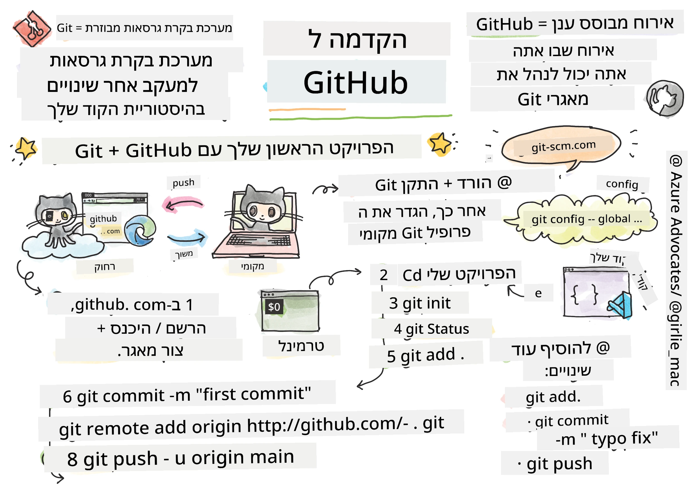
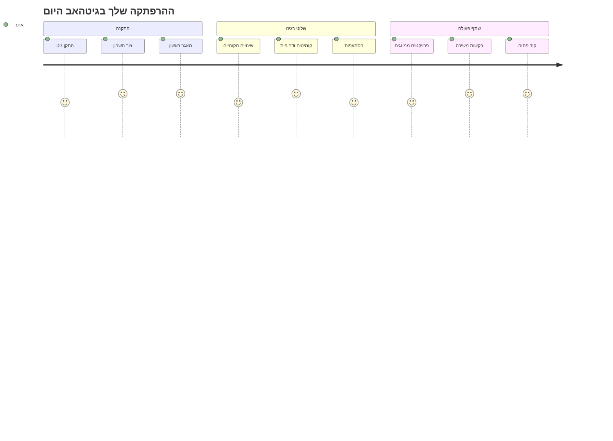
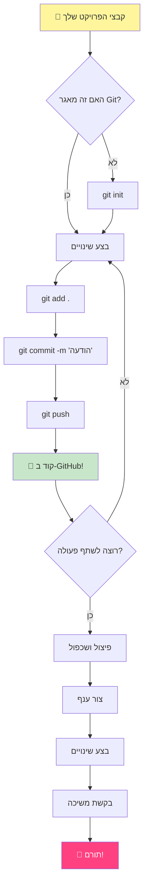
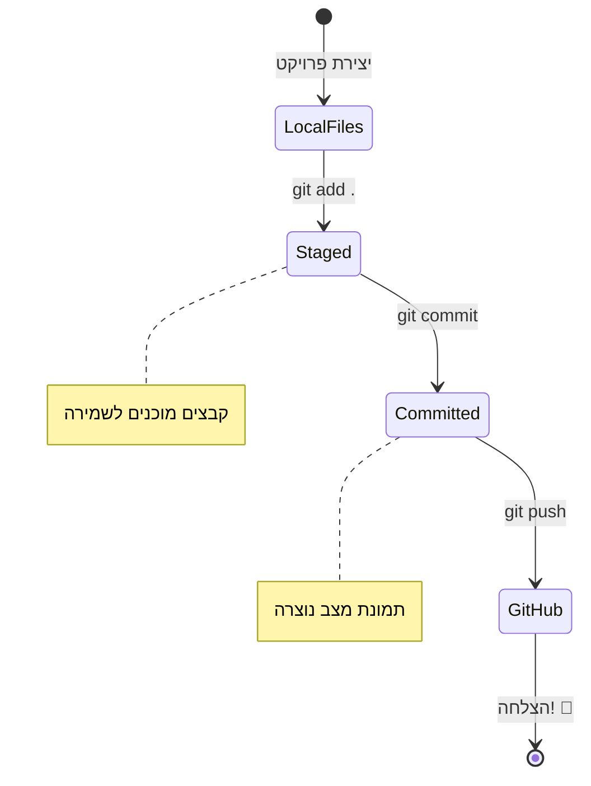
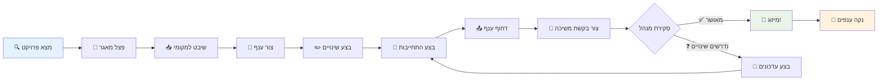
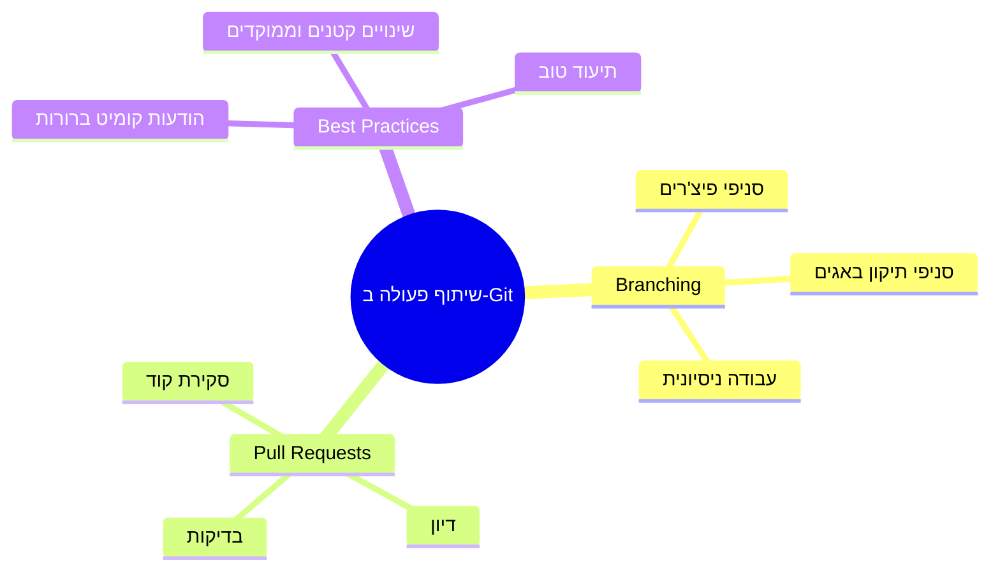
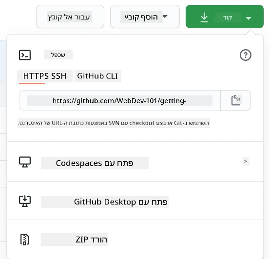
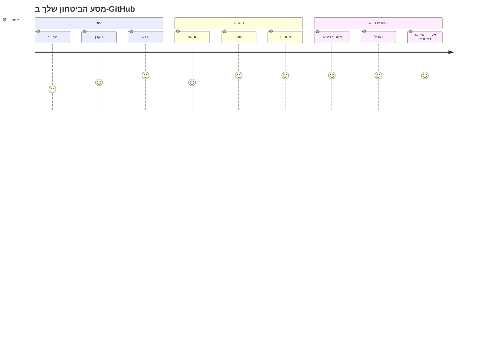

<!--
CO_OP_TRANSLATOR_METADATA:
{
  "original_hash": "5c383cc2cc23bb164b06417d1c107a44",
  "translation_date": "2025-11-25T18:05:30+00:00",
  "source_file": "1-getting-started-lessons/2-github-basics/README.md",
  "language_code": "he"
}
-->
# מבוא ל-GitHub

היי, מפתח עתידי! 👋 מוכן להצטרף למיליוני מתכנתים ברחבי העולם? אני באמת מתרגש להכיר לך את GitHub – תחשוב על זה כמו רשת חברתית למתכנתים, אבל במקום לשתף תמונות של ארוחת הצהריים שלך, אנחנו משתפים קוד ובונים דברים מדהימים יחד!

הנה מה שמדהים אותי: כל אפליקציה בטלפון שלך, כל אתר שאתה מבקר בו, ורוב הכלים שתלמד להשתמש בהם נבנו על ידי צוותי מפתחים ששיתפו פעולה בפלטפורמות כמו GitHub. האפליקציה למוזיקה שאתה אוהב? מישהו כמוך תרם לה. המשחק שאתה לא יכול להפסיק לשחק? כן, כנראה נבנה עם שיתוף פעולה ב-GitHub. ועכשיו אתה הולך ללמוד איך להיות חלק מהקהילה המדהימה הזו!

אני יודע שזה עשוי להרגיש קצת הרבה בהתחלה – אני זוכר את עצמי בוהה בדף GitHub הראשון שלי וחושב "מה זה כל זה?". אבל הנה העניין: כל מפתח התחיל בדיוק מהמקום שבו אתה נמצא עכשיו. בסוף השיעור הזה, יהיה לך מאגר GitHub משלך (תחשוב על זה כמו תצוגת הפרויקטים האישית שלך בענן), ותדע איך לשמור את העבודה שלך, לשתף אותה עם אחרים ואפילו לתרום לפרויקטים שמיליוני אנשים משתמשים בהם.

אנחנו הולכים לעבור את המסע הזה יחד, צעד אחר צעד. בלי למהר, בלי לחץ – רק אתה, אני, וכמה כלים מגניבים שהולכים להפוך לחברים הכי טובים שלך!


> איור מאת [Tomomi Imura](https://twitter.com/girlie_mac)


## חידון לפני השיעור
[חידון לפני השיעור](https://ff-quizzes.netlify.app)

## מבוא

לפני שנצלול לדברים המרגשים באמת, בואו נכין את המחשב שלכם לקצת קסם של GitHub! תחשבו על זה כמו לארגן את ציוד האמנות שלכם לפני יצירת יצירת מופת – כשיש לכם את הכלים הנכונים, הכל הופך לחלק ומהנה הרבה יותר.

אני הולך להדריך אתכם בכל שלב של ההגדרה באופן אישי, ואני מבטיח שזה לא מפחיד כמו שזה נראה במבט ראשון. אם משהו לא מובן מיד, זה לגמרי נורמלי! אני זוכר את הפעם הראשונה שהגדרתי סביבת פיתוח והרגשתי כאילו אני מנסה לקרוא הירוגליפים עתיקים. כל מפתח היה בדיוק במקום שבו אתם נמצאים עכשיו, תוהים אם הם עושים את זה נכון. ספוילר: אם אתם כאן ולומדים, אתם כבר עושים את זה נכון! 🌟

בשיעור הזה נלמד:

- לעקוב אחרי העבודה שאתם עושים במחשב שלכם
- לעבוד על פרויקטים עם אחרים
- איך לתרום לתוכנה בקוד פתוח

### דרישות מוקדמות

בואו נכין את המחשב שלכם לקצת קסם של GitHub! אל תדאגו – ההגדרה הזו היא משהו שתצטרכו לעשות רק פעם אחת, ואז תהיו מוכנים לכל מסע הקידוד שלכם.

בסדר, בואו נתחיל עם הבסיס! קודם כל, אנחנו צריכים לבדוק אם Git כבר מותקן במחשב שלכם. Git הוא בעצם כמו עוזר חכם במיוחד שזוכר כל שינוי שאתם עושים בקוד שלכם – הרבה יותר טוב מלהכות Ctrl+S כל שתי שניות (כולנו היינו שם!).

בואו נראה אם Git כבר מותקן על ידי הקלדת הפקודה הקסומה הזו בטרמינל שלכם:
`git --version`

אם Git עדיין לא מותקן, אין בעיה! פשוט גשו ל-[הורדת Git](https://git-scm.com/downloads) והורידו אותו. לאחר שהתקנתם אותו, אנחנו צריכים להציג את Git בפניכם כמו שצריך:

> 💡 **הגדרה ראשונית**: הפקודות האלו אומרות ל-Git מי אתם. המידע הזה יצורף לכל commit שתעשו, אז בחרו שם ואימייל שאתם מרגישים בנוח לשתף בפומבי.

```bash
git config --global user.name "your-name"
git config --global user.email "your-email"
```

כדי לבדוק אם Git כבר מוגדר, תוכלו להקליד:
```bash
git config --list
```

תצטרכו גם חשבון GitHub, עורך קוד (כמו Visual Studio Code), ותצטרכו לפתוח את הטרמינל שלכם (או: שורת הפקודה).

גשו ל-[github.com](https://github.com/) וצרו חשבון אם עדיין אין לכם, או התחברו ומלאו את הפרופיל שלכם.

💡 **טיפ מודרני**: שקלו להגדיר [מפתחות SSH](https://docs.github.com/en/authentication/connecting-to-github-with-ssh) או להשתמש ב-[GitHub CLI](https://cli.github.com/) לאימות קל יותר ללא סיסמאות.

✅ GitHub הוא לא מאגר הקוד היחיד בעולם; יש אחרים, אבל GitHub הוא המוכר ביותר.

### הכנה

תצטרכו גם תיקייה עם פרויקט קוד במחשב המקומי שלכם (מחשב נייד או PC), וגם מאגר ציבורי ב-GitHub, שישמש כדוגמה לאיך לתרום לפרויקטים של אחרים.

### שמירה על הקוד שלכם בטוח

בואו נדבר רגע על אבטחה – אבל אל תדאגו, אנחנו לא הולכים להעמיס עליכם דברים מפחידים! תחשבו על הפרקטיקות האלו כמו לנעול את הרכב או הבית שלכם. אלו הרגלים פשוטים שהופכים לטבע שני ושומרים על העבודה הקשה שלכם מוגנת.

נראה לכם את הדרכים המודרניות והמאובטחות לעבוד עם GitHub מההתחלה. כך, תפתחו הרגלים טובים שישרתו אתכם לאורך כל הקריירה שלכם כמתכנתים.

כשעובדים עם GitHub, חשוב לעקוב אחרי פרקטיקות האבטחה הטובות ביותר:

| תחום אבטחה | פרקטיקה מומלצת | למה זה חשוב |
|-------------|----------------|--------------|
| **אימות** | השתמשו במפתחות SSH או Personal Access Tokens | סיסמאות פחות מאובטחות ונמצאות בתהליך הסרה |
| **אימות דו-שלבי** | הפעילו 2FA בחשבון ה-GitHub שלכם | מוסיף שכבת הגנה נוספת לחשבון |
| **אבטחת מאגר** | לעולם אל תתחייבו מידע רגיש | מפתחות API וסיסמאות לא צריכים להיות במאגרים ציבוריים |
| **ניהול תלות** | הפעילו Dependabot לעדכונים | שומר על התלויות שלכם מאובטחות ומעודכנות |

> ⚠️ **תזכורת אבטחה קריטית**: לעולם אל תתחייבו מפתחות API, סיסמאות או מידע רגיש אחר לשום מאגר. השתמשו במשתני סביבה ובקבצי `.gitignore` כדי להגן על נתונים רגישים.

**הגדרת אימות מודרנית:**

```bash
# צור מפתח SSH (אלגוריתם ed25519 מודרני)
ssh-keygen -t ed25519 -C "your_email@example.com"

# הגדר את Git לשימוש ב-SSH
git remote set-url origin git@github.com:username/repository.git
```

> 💡 **טיפ מקצועי**: מפתחות SSH מבטלים את הצורך להקליד סיסמאות שוב ושוב והם מאובטחים יותר משיטות אימות מסורתיות.

---

## ניהול הקוד שלכם כמו מקצוענים

אוקיי, כאן הדברים באמת מתחילים להיות מרגשים! 🎉 אנחנו עומדים ללמוד איך לעקוב ולנהל את הקוד שלכם כמו מקצוענים, ובכנות, זה אחד הדברים האהובים עליי ללמד כי זה משנה את כללי המשחק.

תארו לעצמכם: אתם כותבים סיפור מדהים, ואתם רוצים לעקוב אחרי כל טיוטה, כל עריכה מבריקה וכל "רגע של גאונות" לאורך הדרך. זה בדיוק מה ש-Git עושה עבור הקוד שלכם! זה כמו מחברת מסע בזמן מדהימה שזוכרת הכל – כל הקשה, כל שינוי, כל "אופס, זה שבר הכל" שאפשר לבטל מיד.

אני אהיה כנה – זה עשוי להרגיש קצת מבלבל בהתחלה. כשאני התחלתי, חשבתי "למה אני לא יכול פשוט לשמור את הקבצים שלי כמו תמיד?" אבל תאמינו לי: ברגע ש-Git יתחבר לכם (וזה יקרה!), יהיה לכם רגע של "איך אי פעם קודדתי בלי זה?" זה כמו לגלות שאתם יכולים לעוף אחרי שהלכתם כל החיים.

נניח שיש לכם תיקייה מקומית עם פרויקט קוד ואתם רוצים להתחיל לעקוב אחרי ההתקדמות שלכם באמצעות git - מערכת ניהול גרסאות. יש אנשים שמשווים שימוש ב-git לכתיבת מכתב אהבה לעצמכם בעתיד. קריאת הודעות ה-commit שלכם ימים, שבועות או חודשים מאוחר יותר תאפשר לכם להיזכר למה קיבלתם החלטה מסוימת, או "לחזור אחורה" לשינוי – כלומר, כשאתם כותבים הודעות commit טובות.


### משימה: צרו את המאגר הראשון שלכם!

> 🎯 **המשימה שלכם (ואני כל כך מתרגש בשבילכם!)**: אנחנו הולכים ליצור יחד את מאגר ה-GitHub הראשון שלכם! עד שנסיים כאן, יהיה לכם פינה קטנה באינטרנט שבה הקוד שלכם יגור, ותעשו את ה-"commit" הראשון שלכם (זה אומר לשמור את העבודה שלכם בצורה חכמה במיוחד).
>
> זה באמת רגע מיוחד – אתם עומדים להצטרף רשמית לקהילה הגלובלית של מפתחים! אני עדיין זוכר את ההתרגשות של יצירת המאגר הראשון שלי וחשבתי "וואו, אני באמת עושה את זה!"

בואו נעבור את ההרפתקה הזו יחד, צעד אחר צעד. קחו את הזמן עם כל חלק – אין פרס למהר, ואני מבטיח שכל שלב יתחבר. זכרו, כל כוכב קידוד שאתם מעריצים היה פעם בדיוק במקום שבו אתם נמצאים, עומד ליצור את המאגר הראשון שלו. כמה מגניב זה?

> צפו בסרטון
> 
> [](https://www.youtube.com/watch?v=9R31OUPpxU4)

**בואו נעשה את זה יחד:**

1. **צרו את המאגר שלכם ב-GitHub**. גשו ל-GitHub.com וחפשו את הכפתור הירוק הבולט **New** (או את הסימן **+** בפינה הימנית העליונה). לחצו עליו ובחרו **New repository**.

   הנה מה לעשות:
   1. תנו למאגר שלכם שם – משהו משמעותי עבורכם!
   1. הוסיפו תיאור אם תרצו (זה עוזר לאחרים להבין על מה הפרויקט שלכם)
   1. החליטו אם אתם רוצים שהוא יהיה ציבורי (כולם יכולים לראות אותו) או פרטי (רק עבורכם)
   1. אני ממליץ לסמן את התיבה להוספת קובץ README – זה כמו דף הבית של הפרויקט שלכם
   1. לחצו על **Create repository** וחגגו – הרגע יצרתם את המאגר הראשון שלכם! 🎉

2. **נווטו לתיקיית הפרויקט שלכם**. עכשיו בואו נפתח את הטרמינל שלכם (אל תדאגו, זה לא מפחיד כמו שזה נראה!). אנחנו צריכים לומר למחשב שלכם איפה נמצאים קבצי הפרויקט שלכם. הקלידו את הפקודה הזו:

   ```bash
   cd [name of your folder]
   ```

   **מה אנחנו עושים כאן:**
   - אנחנו בעצם אומרים "היי מחשב, קח אותי לתיקיית הפרויקט שלי"
   - זה כמו לפתוח תיקייה מסוימת על שולחן העבודה שלכם, אבל אנחנו עושים את זה עם פקודות טקסט
   - החליפו `[name of your folder]` בשם האמיתי של תיקיית הפרויקט שלכם

3. **הפכו את התיקייה שלכם למאגר Git**. כאן הקסם קורה! הקלידו:

   ```bash
   git init
   ```

   **הנה מה שקרה עכשיו (דברים די מגניבים!):**
   - Git יצר תיקייה מוסתרת `.git` בפרויקט שלכם – אתם לא תראו אותה, אבל היא שם!
   - התיקייה הרגילה שלכם היא עכשיו "מאגר" שיכול לעקוב אחרי כל שינוי שתעשו
   - תחשבו על זה כמו לתת לתיקייה שלכם כוחות על לזכור הכל

4. **בדקו מה קורה**. בואו נראה מה Git חושב על הפרויקט שלכם כרגע:

   ```bash
   git status
   ```

   **להבין מה Git אומר לכם:**
   
   אתם עשויים לראות משהו שנראה כך:

   ```output
   Changes not staged for commit:
   (use "git add <file>..." to update what will be committed)
   (use "git restore <file>..." to discard changes in working directory)

        modified:   file.txt
        modified:   file2.txt
   ```

   **אל תיבהלו! הנה מה שזה אומר:**
   - קבצים ב**אדום** הם קבצים שיש בהם שינויים אבל הם עדיין לא מוכנים לשמירה
   - קבצים ב**ירוק** (כשתראו אותם) מוכנים לשמירה
   - Git עוזר בכך שהוא אומר לכם בדיוק מה תוכלו לעשות הלאה

   > 💡 **טיפ מקצועי**: הפקודה `git status` היא החברה הכי טובה שלכם! השתמשו בה בכל פעם שאתם מבולבלים לגבי מה קורה. זה כמו לשאול את Git "היי, מה המצב כרגע?"

5. **הכינו את הקבצים שלכם לשמירה** (זה נקרא "staging"):

   ```bash
   git add .
   ```

   **מה שעשינו עכשיו:**
   - אמרנו ל-Git "היי, אני רוצה לכלול את כל הקבצים שלי בשמירה הבאה"
   - הנקודה `.` היא כמו לומר "הכל בתיקייה הזו"
   - עכשיו הקבצים שלכם "מוכנים" לשלב הבא

   **רוצים להיות יותר סלקטיביים?** תוכלו להוסיף רק קבצים מסוימים:

   ```bash
   git add [file or folder name]
   ```

   **למה שתרצו לעשות את זה?**
   - לפעמים תרצו לשמור שינויים קשורים יחד
   - זה עוזר לכם לארגן את העבודה שלכם לקטעים לוגיים
   - מקל על הבנת מה השתנה ומתי

   **שיניתם את דעתכם?** אין בעיה! תוכלו להסיר קבצים מהשלב כך:

   ```bash
   # בטל שלב הכל
   git reset
   
   # בטל שלב רק קובץ אחד
   git reset [file name]
   ```

   אל תדאגו – זה לא מוחק את העבודה שלכם, זה רק מוציא קבצים מה"ערימה המוכנה לשמירה".

6. **שמרו את העבודה שלכם לצמיתות** (עשו את ה-commit הראשון שלכם!):

   ```bash
   git commit -m "first commit"
   ```

   **🎉 מזל טוב! הרגע עשיתם את ה-commit הראשון שלכם!**
   
   **הנה מה שקרה עכשיו:**
   - Git לקח "תמונת מצב" של כל הקבצים שהיו מוכנים בשלב הזה
   - הודעת ה-commit שלכם "first commit" מסבירה על מה נקודת השמירה הזו
   - Git נתן לתמונת המצב הזו מזהה ייחודי כך שתוכלו תמיד למצוא אותה מאוחר יותר
   - התחלתם רשמית לעקוב אחרי ההיסטוריה של הפרויקט שלכם!

   > 💡 **הודעות commit עתידיות**: עבור ה-commits הבאים שלכם, היו יותר תיאוריים! במקום "עדכון דברים", נסו "הוספת טופס יצירת קשר לדף הבית" או "תיקון באג בתפריט הניווט". עצמכם בעתיד יודה לכם!

7. **חברו את הפרויקט המקומי שלכם ל-GitHub**. כרגע, הפרויקט שלכם קיים רק במחשב שלכם. בואו נחבר אותו למאגר ה-GitHub שלכם כדי שתוכלו לשתף אותו עם העולם!

   קודם, גשו לדף המאגר שלכם ב-GitHub והעתיקו את ה-URL. לאחר מכן חזרו לכאן והקלידו:

   ```bash
   git remote add origin https://github.com/username/repository_name.git
   ```
   
   (החליפו את ה-URL הזה ב-URL האמיתי של המאגר שלכם!)

   **מה שעשינו עכשיו:**
   - יצרנו חיבור בין הפרויקט המקומי שלך לבין מאגר ה-GitHub שלך  
   - "Origin" הוא רק כינוי למאגר ה-GitHub שלך – זה כמו להוסיף איש קשר לטלפון שלך  
   - עכשיו Git המקומי שלך יודע לאן לשלוח את הקוד שלך כשאתה מוכן לשתף אותו  

   💡 **דרך קלה יותר**: אם התקנת את GitHub CLI, תוכל לעשות זאת בפקודה אחת:  
   ```bash
   gh repo create my-repo --public --push --source=.
   ```
  
8. **שלח את הקוד שלך ל-GitHub** (הרגע הגדול!):  

   ```bash
   git push -u origin main
   ```
  
   **🚀 זהו זה! אתה מעלה את הקוד שלך ל-GitHub!**  

   **מה קורה כאן:**  
   - הקומיטים שלך עוברים מהמחשב שלך ל-GitHub  
   - הדגל `-u` יוצר חיבור קבוע כך שהעלאות עתידיות יהיו קלות יותר  
   - "main" הוא שם הענף הראשי שלך (כמו התיקייה הראשית)  
   - אחרי זה, תוכל פשוט להקליד `git push` להעלאות עתידיות!  

   💡 **הערה מהירה**: אם הענף שלך נקרא בשם אחר (כמו "master"), השתמש בשם הזה. תוכל לבדוק זאת עם `git branch --show-current`.  

9. **קצב העבודה היומי החדש שלך** (כאן זה מתחיל להיות ממכר!):  

   מעכשיו, בכל פעם שתבצע שינויים בפרויקט שלך, יש לך את הריקוד הפשוט הזה בשלושה שלבים:  

   ```bash
   git add .
   git commit -m "describe what you changed"
   git push
   ```
  
   **זה הופך לדופק הקידוד שלך:**  
   - בצע שינויים מדהימים בקוד שלך ✨  
   - שלב אותם עם `git add` ("היי Git, שים לב לשינויים האלה!")  
   - שמור אותם עם `git commit` והודעה תיאורית (העתיד שלך יודה לך!)  
   - שתף אותם עם העולם באמצעות `git push` 🚀  
   - חזור על התהליך – ברצינות, זה הופך לטבעי כמו לנשום!  

   אני אוהב את זרימת העבודה הזו כי זה כמו שיש לך נקודות שמירה מרובות במשחק וידאו. עשית שינוי שאתה אוהב? תבצע קומיט! רוצה לנסות משהו מסוכן? אין בעיה – תמיד תוכל לחזור לקומיט האחרון אם הדברים משתבשים!  

   > 💡 **טיפ**: ייתכן שתרצה גם לאמץ קובץ `.gitignore` כדי למנוע מקבצים שאתה לא רוצה לעקוב אחריהם להופיע ב-GitHub - כמו קובץ הערות שאתה שומר באותה תיקייה אבל אין לו מקום במאגר ציבורי. תוכל למצוא תבניות לקבצי `.gitignore` ב-[.gitignore templates](https://github.com/github/gitignore) או ליצור אחד באמצעות [gitignore.io](https://www.toptal.com/developers/gitignore).  

### 🧠 **בדיקת מאגר ראשון: איך זה הרגיש?**  

**קח רגע לחגוג ולהרהר:**  
- איך הרגשת כשראית את הקוד שלך מופיע ב-GitHub בפעם הראשונה?  
- איזה שלב היה הכי מבלבל, ואיזה היה מפתיע בקלות שלו?  
- האם תוכל להסביר במילים שלך את ההבדל בין `git add`, `git commit`, ו-`git push`?  


> **זכור**: אפילו מפתחים מנוסים לפעמים שוכחים את הפקודות המדויקות. הפיכת זרימת העבודה הזו לזיכרון שריר דורשת תרגול - אתה עושה עבודה נהדרת!  

#### זרימות עבודה מודרניות ב-Git  

שקול לאמץ את השיטות המודרניות הבאות:  

- **קומיטים קונבנציונליים**: השתמש בפורמט הודעות קומיט סטנדרטי כמו `feat:`, `fix:`, `docs:` וכו'. למד עוד ב-[conventionalcommits.org](https://www.conventionalcommits.org/)  
- **קומיטים אטומיים**: הפוך כל קומיט לייצג שינוי לוגי יחיד  
- **קומיטים תכופים**: בצע קומיטים לעיתים קרובות עם הודעות תיאוריות במקום קומיטים גדולים ולא תכופים  

#### הודעות קומיט  

שורת נושא מצוינת להודעת קומיט משלימה את המשפט הבא:  
אם ייושם, הקומיט הזה <שורת הנושא שלך כאן>  

לנושא השתמש בזמן הווה, ציווי: "שנה" ולא "שינה" או "משנה".  
כמו בנושא, גם בגוף (אופציונלי) השתמש בזמן הווה, ציווי. הגוף צריך לכלול את המוטיבציה לשינוי ולהשוות זאת להתנהגות הקודמת. אתה מסביר את ה"למה", לא את ה"איך".  

✅ קח כמה דקות לגלוש ב-GitHub. האם תוכל למצוא הודעת קומיט ממש טובה? האם תוכל למצוא אחת מינימלית במיוחד? איזה מידע לדעתך הכי חשוב ושימושי להעביר בהודעת קומיט?  

## עבודה עם אחרים (החלק הכיפי!)  

תחזיק חזק כי כאן GitHub הופך להיות קסום לחלוטין! 🪄 למדת לנהל את הקוד שלך, אבל עכשיו אנחנו צוללים לחלק האהוב עליי – שיתוף פעולה עם אנשים מדהימים מכל רחבי העולם.  

תאר לעצמך: אתה מתעורר מחר ורואה שמישהו בטוקיו שיפר את הקוד שלך בזמן שישנת. אחר כך מישהו בברלין מתקן באג שנתקעת עליו. ובצהריים, מפתח בסאו פאולו מוסיף תכונה שלא חשבת עליה בכלל. זה לא מדע בדיוני – זה פשוט יום שלישי ביקום של GitHub!  

מה שמרגש אותי באמת הוא שהכישורים לשיתוף פעולה שאתה עומד ללמוד? אלה בדיוק אותן זרימות עבודה שצוותים בגוגל, מיקרוסופט, והסטארטאפים האהובים עליך משתמשים בהן כל יום. אתה לא רק לומד כלי מגניב – אתה לומד את השפה הסודית שמאפשרת לעולם התוכנה כולו לעבוד יחד.  

ברצינות, ברגע שתחווה את ההתרגשות של מישהו שממזג את בקשת המשיכה הראשונה שלך, תבין למה מפתחים כל כך נלהבים לגבי קוד פתוח. זה כמו להיות חלק מפרויקט הצוות הכי גדול והכי יצירתי בעולם!  

> צפה בסרטון  
>
> [](https://www.youtube.com/watch?v=bFCM-PC3cu8)  

הסיבה העיקרית להעלות דברים ל-GitHub הייתה לאפשר שיתוף פעולה עם מפתחים אחרים.  


במאגר שלך, נווט ל-`Insights > Community` כדי לראות איך הפרויקט שלך משתווה לסטנדרטים הקהילתיים המומלצים.  

רוצה שהמאגר שלך ייראה מקצועי ומזמין? עבור למאגר שלך ולחץ על `Insights > Community`. התכונה המגניבה הזו מראה לך איך הפרויקט שלך משתווה למה שהקהילה של GitHub מחשיבה כ"פרקטיקות מאגר טובות".  

> 🎯 **להבריק את הפרויקט שלך**: מאגר מאורגן היטב עם תיעוד טוב הוא כמו חנות מסודרת ומזמינה. זה מראה לאנשים שאכפת לך מהעבודה שלך וגורם לאחרים לרצות לתרום!  

**הנה מה שהופך מאגר למדהים:**  

| מה להוסיף | למה זה חשוב | מה זה עושה עבורך |  
|-------------|-------------------|---------------------|  
| **תיאור** | רושם ראשוני חשוב! | אנשים יודעים מיד מה הפרויקט שלך עושה |  
| **README** | דף הבית של הפרויקט שלך | כמו מדריך ידידותי למבקרים חדשים |  
| **הנחיות לתרומה** | מראה שאתה מקבל עזרה | אנשים יודעים בדיוק איך הם יכולים לעזור לך |  
| **קוד התנהגות** | יוצר מרחב ידידותי | כולם מרגישים מוזמנים להשתתף |  
| **רישיון** | בהירות משפטית | אחרים יודעים איך הם יכולים להשתמש בקוד שלך |  
| **מדיניות אבטחה** | מראה שאתה אחראי | מדגים פרקטיקות מקצועיות |  

> 💡 **טיפ מקצועי**: GitHub מספק תבניות לכל הקבצים האלה. כשאתה יוצר מאגר חדש, סמן את התיבות כדי ליצור אוטומטית את הקבצים האלה.  

**תכונות מודרניות של GitHub לחקור:**  

🤖 **אוטומציה ו-CI/CD:**  
- **GitHub Actions** לבדיקות אוטומטיות ופריסה  
- **Dependabot** לעדכוני תלות אוטומטיים  

💬 **קהילה וניהול פרויקטים:**  
- **GitHub Discussions** לשיחות קהילתיות מעבר לבעיות  
- **GitHub Projects** לניהול פרויקטים בסגנון קאנבן  
- **חוקי הגנה על ענפים** לאכיפת סטנדרטים של איכות קוד  

כל המשאבים האלה יועילו בהכנסת חברי צוות חדשים. ואלה בדרך כלל הדברים שתרומים חדשים מסתכלים עליהם לפני שהם בכלל מסתכלים על הקוד שלך, כדי להבין אם הפרויקט שלך הוא המקום הנכון עבורם להשקיע את זמנם.  

✅ קבצי README, למרות שלוקח זמן להכין אותם, לעיתים קרובות מוזנחים על ידי מתחזקים עסוקים. האם תוכל למצוא דוגמה לאחד שמתאר במיוחד? הערה: ישנם [כלים לעזרה ביצירת README טובים](https://www.makeareadme.com/) שאולי תרצה לנסות.  

### משימה: מיזוג קוד  

מסמכי תרומה עוזרים לאנשים לתרום לפרויקט. הם מסבירים אילו סוגי תרומות אתה מחפש ואיך התהליך עובד. תורמים יצטרכו לעבור סדרת שלבים כדי להיות מסוגלים לתרום למאגר שלך ב-GitHub:  

1. **פיצול המאגר שלך** כנראה תרצה שאנשים _יפצלו_ את הפרויקט שלך. פיצול משמעו יצירת עותק של המאגר שלך בפרופיל ה-GitHub שלהם.  
1. **שכפול**. משם הם ישכפלו את הפרויקט למחשב המקומי שלהם.  
1. **יצירת ענף**. תרצה לבקש מהם ליצור _ענף_ עבור העבודה שלהם.  
1. **מיקוד השינוי שלהם לאזור אחד**. בקש מהתורמים להתרכז בתרומות שלהם בדבר אחד בכל פעם - כך הסיכויים שתוכל _למזג_ את העבודה שלהם גבוהים יותר. תאר לעצמך שהם כותבים תיקון באג, מוסיפים תכונה חדשה, ומעדכנים כמה בדיקות - מה אם תרצה, או תוכל ליישם רק 2 מתוך 3, או 1 מתוך 3 שינויים?  

✅ דמיין מצב שבו ענפים הם קריטיים במיוחד לכתיבה ושחרור קוד טוב. אילו מקרים אתה יכול לחשוב עליהם?  

> הערה, היה השינוי שאתה רוצה לראות בעולם, וצור ענפים גם עבור העבודה שלך. כל קומיט שתבצע ייעשה על הענף שאתה כרגע "נמצא בו". השתמש ב-`git status` כדי לראות באיזה ענף אתה נמצא.  

בוא נעבור על זרימת עבודה של תורם. נניח שהתורם כבר _פיצל_ ו_שכפל_ את המאגר כך שיש לו מאגר Git מוכן לעבודה על המחשב המקומי שלו:  

1. **יצירת ענף**. השתמש בפקודה `git branch` כדי ליצור ענף שיכיל את השינויים שהם מתכוונים לתרום:  

   ```bash
   git branch [branch-name]
   ```
  
   > 💡 **גישה מודרנית**: תוכל גם ליצור ולעבור לענף החדש בפקודה אחת:  
   ```bash
   git switch -c [branch-name]
   ```
  
1. **מעבר לענף העבודה**. עבור לענף שצוין ועדכן את ספריית העבודה עם `git switch`:  

   ```bash
   git switch [branch-name]
   ```
  
   > 💡 **הערה מודרנית**: `git switch` הוא התחליף המודרני ל-`git checkout` כשמשנים ענפים. זה ברור ובטוח יותר למתחילים.  

1. **בצע עבודה**. בשלב זה תרצה להוסיף את השינויים שלך. אל תשכח להודיע ל-Git על כך עם הפקודות הבאות:  

   ```bash
   git add .
   git commit -m "my changes"
   ```
  
   > ⚠️ **איכות הודעת קומיט**: ודא שאתה נותן לקומיט שלך שם טוב, גם בשבילך וגם בשביל מתחזק המאגר שאתה עוזר לו. היה ספציפי לגבי מה ששינית!  

1. **שלב את העבודה שלך עם הענף `main`**. בשלב מסוים סיימת לעבוד ואתה רוצה לשלב את העבודה שלך עם זו של הענף `main`. ייתכן שהענף `main` השתנה בינתיים, אז ודא שאתה מעדכן אותו לגרסה האחרונה עם הפקודות הבאות:  

   ```bash
   git switch main
   git pull
   ```
  
   בשלב זה תרצה לוודא שכל _התנגשויות_, מצבים שבהם ל-Git קשה _לשלב_ את השינויים, קורים בענף העבודה שלך. לכן הרץ את הפקודות הבאות:  

   ```bash
   git switch [branch_name]
   git merge main
   ```
  
   הפקודה `git merge main` תביא את כל השינויים מהענף `main` לענף שלך. בתקווה תוכל פשוט להמשיך. אם לא, VS Code יראה לך היכן Git _מבולבל_ ותוכל לשנות את הקבצים המושפעים כדי לציין איזה תוכן הוא המדויק ביותר.  

   💡 **חלופה מודרנית**: שקול להשתמש ב-`git rebase` להיסטוריה נקייה יותר:  
   ```bash
   git rebase main
   ```
  
   זה משחזר את הקומיטים שלך על גבי הענף `main` האחרון, ויוצר היסטוריה ליניארית.  

1. **שלח את העבודה שלך ל-GitHub**. שליחת העבודה שלך ל-GitHub משמעה שני דברים. דחיפת הענף שלך למאגר שלך ואז פתיחת PR, בקשת משיכה.  

   ```bash
   git push --set-upstream origin [branch-name]
   ```
  
   הפקודה לעיל יוצרת את הענף במאגר המפוצל שלך.  

### 🤝 **בדיקת מיומנויות שיתוף פעולה: מוכן לעבוד עם אחרים?**  

**בוא נראה איך אתה מרגיש לגבי שיתוף פעולה:**  
- האם הרעיון של פיצול ובקשות משיכה הגיוני לך עכשיו?  
- מהו דבר אחד לגבי עבודה עם ענפים שאתה רוצה לתרגל יותר?  
- עד כמה אתה מרגיש בנוח לתרום לפרויקט של מישהו אחר?  


> **מגביר ביטחון**: כל מפתח שאתה מעריץ היה פעם לחוץ לגבי בקשת המשיכה הראשונה שלו. הקהילה של GitHub מאוד מקבלת פנים לחדשים!  

1. **פתח PR**. לאחר מכן, תרצה לפתוח PR. תעשה זאת על ידי ניווט למאגר המפוצל ב-GitHub. תראה אינדיקציה ב-GitHub ששואלת אם אתה רוצה ליצור PR חדש, תלחץ על זה ותועבר לממשק שבו תוכל לשנות את כותרת הודעת הקומיט, לתת לה תיאור מתאים יותר. עכשיו מתחזק המאגר שפיצלת יראה את ה-PR הזה ו_בתקווה_ יעריך ו_ימזג_ את ה-PR שלך. עכשיו אתה תורם, יאיי :)  

   💡 **טיפ מודרני**: תוכל גם ליצור PRs באמצעות GitHub CLI:  
   ```bash
   gh pr create --title "Your PR title" --body "Description of changes"
   ```
  
   🔧 **שיטות עבודה מומלצות ל-PRs**:  
   - קישור לבעיות קשורות באמצעות מילות מפתח כמו "Fixes #123"  
   - הוספת צילומי מסך לשינויים בממשק המשתמש  
   - בקשת סוקרים ספציפיים  
   - שימוש ב-PRs בטיוטה לעבודה בתהליך  
   - ודא שכל בדיקות ה-CI עוברות לפני בקשת סקירה  
1. **ניקוי**. נחשב כפרקטיקה טובה _לנקות_ אחרי שמיזגת בהצלחה PR. אתה רוצה לנקות גם את הסניף המקומי שלך וגם את הסניף שדחפת ל-GitHub. קודם כל, בוא נמחק אותו מקומית עם הפקודה הבאה:

   ```bash
   git branch -d [branch-name]
   ```
  
וודא שאתה נכנס לדף GitHub של הריפו המפוצל ומסיר את הסניף המרוחק שדחפת אליו.

`Pull request` נשמע כמו מונח מוזר כי בעצם אתה רוצה לדחוף את השינויים שלך לפרויקט. אבל המתחזק (בעל הפרויקט) או צוות הליבה צריכים לשקול את השינויים שלך לפני שהם ממזגים אותם עם הסניף "הראשי" של הפרויקט, אז בעצם אתה מבקש החלטת שינוי ממתחזק.

Pull request הוא המקום להשוות ולדון בהבדלים שהוכנסו בסניף עם ביקורות, תגובות, בדיקות משולבות ועוד. Pull request טוב עוקב פחות או יותר אחרי אותם כללים כמו הודעת commit. אתה יכול להוסיף הפניה לבעיה ב-tracker של בעיות, למשל כאשר העבודה שלך פותרת בעיה. זה נעשה באמצעות `#` ואחריו מספר הבעיה שלך. לדוגמה `#97`.

🤞מחזיקים אצבעות שכל הבדיקות עוברות ובעלי הפרויקט ממזגים את השינויים שלך לפרויקט🤞

עדכן את הסניף המקומי הנוכחי שלך עם כל ה-commits החדשים מהסניף המרוחק המתאים ב-GitHub:

`git pull`

## לתרום לקוד פתוח (ההזדמנות שלך לעשות שינוי!)

מוכן למשהו שיפיל לך את הלסת? 🤯 בוא נדבר על תרומה לפרויקטים של קוד פתוח – ואני מתרגש רק מלחשוב על לשתף את זה איתך!

זו ההזדמנות שלך להיות חלק ממשהו באמת יוצא דופן. תאר לעצמך לשפר את הכלים שמיליוני מפתחים משתמשים בהם כל יום, או לתקן באג באפליקציה שחברים שלך אוהבים. זה לא רק חלום – זה בדיוק מה שתרומה לקוד פתוח עוסקת בו!

הנה מה שמרגש אותי כל פעם מחדש: כל כלי שלמדת איתו – עורך הקוד שלך, המסגרות שנחקור, אפילו הדפדפן שבו אתה קורא את זה – התחיל עם מישהו בדיוק כמוך שעשה את התרומה הראשונה שלו. אותו מפתח מבריק שבנה את ההרחבה האהובה עליך ל-VS Code? הוא היה פעם מתחיל שלחץ על "create pull request" בידיים רועדות, בדיוק כמו שאתה עומד לעשות.

והנה החלק הכי יפה: קהילת הקוד הפתוח היא כמו חיבוק קבוצתי ענק של האינטרנט. רוב הפרויקטים מחפשים באופן פעיל מתחילים ויש להם בעיות מתויגות "good first issue" במיוחד בשביל אנשים כמוך! מתחזקים באמת מתרגשים כשהם רואים תורמים חדשים כי הם זוכרים את הצעדים הראשונים שלהם.

```mermaid
flowchart TD
    A[🔍 חקור את GitHub] --> B[🏷️ מצא "בעיה ראשונה טובה"]
    B --> C[📖 קרא את הנחיות התרומה]
    C --> D[🍴 עשה Fork למאגר]
    D --> E[💻 הגדר סביבה מקומית]
    E --> F[🌿 צור ענף פיצ'ר]
    F --> G[✨ בצע את התרומה שלך]
    G --> H[🧪 בדוק את השינויים שלך]
    H --> I[📝 כתוב התחייבות ברורה]
    I --> J[📤 דחוף וצור PR]
    J --> K[💬 התמודד עם משוב]
    K --> L[🎉 מוזג! אתה תורם!]
    L --> M[🌟 מצא את הבעיה הבאה]
    
    style A fill:#e1f5fe
    style L fill:#c8e6c9
    style M fill:#fff59d
```  
אתה לא רק לומד לקודד כאן – אתה מתכונן להצטרף למשפחה גלובלית של בונים שמתעוררים כל יום וחושבים "איך נוכל להפוך את העולם הדיגיטלי לקצת יותר טוב?" ברוך הבא למועדון! 🌟

קודם כל, בוא נמצא ריפו (או **repo**) ב-GitHub שמעניין אותך ושאליו תרצה לתרום שינוי. תרצה להעתיק את התוכן שלו למחשב שלך.

✅ דרך טובה למצוא ריפואים 'ידידותיים למתחילים' היא [לחפש לפי התג 'good-first-issue'](https://github.blog/2020-01-22-browse-good-first-issues-to-start-contributing-to-open-source/).



יש כמה דרכים להעתיק קוד. אחת מהן היא "לשכפל" את התוכן של הריפו, באמצעות HTTPS, SSH, או באמצעות GitHub CLI (ממשק שורת הפקודה).

פתח את הטרמינל שלך ושכפל את הריפו כך:
```bash
# שימוש ב-HTTPS
git clone https://github.com/ProjectURL

# שימוש ב-SSH (דורש הגדרת מפתח SSH)
git clone git@github.com:username/repository.git

# שימוש ב-GitHub CLI
gh repo clone username/repository
```
  
כדי לעבוד על הפרויקט, עבור לתיקייה הנכונה:  
`cd ProjectURL`

אתה יכול גם לפתוח את כל הפרויקט באמצעות:  
- **[GitHub Codespaces](https://github.com/features/codespaces)** - סביבת פיתוח בענן של GitHub עם VS Code בדפדפן  
- **[GitHub Desktop](https://desktop.github.com/)** - אפליקציית GUI לפעולות Git  
- **[GitHub.dev](https://github.dev)** - לחץ על מקש `.` בכל ריפו של GitHub כדי לפתוח את VS Code בדפדפן  
- **VS Code** עם הרחבת Pull Requests של GitHub  

לבסוף, אתה יכול להוריד את הקוד בתיקייה מכווצת.

### כמה דברים מעניינים נוספים על GitHub

אתה יכול לככב, לצפות ו/או "למזלג" כל ריפו ציבורי ב-GitHub. תוכל למצוא את הריפואים שכיכבת בתפריט הנפתח בפינה הימנית העליונה. זה כמו סימניות, אבל לקוד.

לפרויקטים יש tracker של בעיות, בדרך כלל ב-GitHub בלשונית "Issues" אלא אם צוין אחרת, שבו אנשים דנים בבעיות הקשורות לפרויקט. ולשונית Pull Requests היא המקום שבו אנשים דנים ומבקרים שינויים שנמצאים בתהליך.

לפרויקטים עשויים להיות גם דיונים בפורומים, רשימות תפוצה, או ערוצי צ'אט כמו Slack, Discord או IRC.

🔧 **תכונות מודרניות של GitHub**:  
- **GitHub Discussions** - פורום מובנה לשיחות קהילתיות  
- **GitHub Sponsors** - תמיכה כספית במתחזקים  
- **לשונית Security** - דוחות פגיעות וייעוץ אבטחה  
- **לשונית Actions** - צפייה בזרימות עבודה אוטומטיות וצינורות CI/CD  
- **לשונית Insights** - ניתוחים על תורמים, commits, ובריאות הפרויקט  
- **לשונית Projects** - כלי ניהול פרויקטים מובנים של GitHub  

✅ הסתכל סביב הריפו החדש שלך ב-GitHub ונסה כמה דברים, כמו עריכת הגדרות, הוספת מידע לריפו שלך, יצירת פרויקט (כמו לוח Kanban), והגדרת GitHub Actions לאוטומציה. יש הרבה מה לעשות!

---

## 🚀 אתגר

טוב, הגיע הזמן לבדוק את כוחות העל החדשים שלך ב-GitHub! 🚀 הנה אתגר שיגרום להכל להתחבר בצורה הכי מספקת:

תפוס חבר (או את בן המשפחה שתמיד שואל מה אתה עושה עם כל ה"דברים האלה במחשב") וצאו להרפתקת קידוד משותפת יחד! כאן הקסם האמיתי קורה – צרו פרויקט, תנו להם למזלג אותו, צרו כמה סניפים, ומזגו שינויים כמו המקצוענים שאתם הופכים להיות.

אני לא אשקר – כנראה שתצחקו בשלב מסוים (במיוחד כששניכם תנסו לשנות את אותו שורה), אולי תגרדו את הראש בתהייה, אבל בהחלט יהיו לכם את הרגעים המדהימים של "אהה!" שהופכים את כל הלמידה למשתלמת. בנוסף, יש משהו מיוחד בלשתף את המיזוג הראשון המוצלח עם מישהו אחר – זה כמו חגיגה קטנה של כמה רחוק הגעתם!

אין לכם עדיין חבר לקוד? אין בעיה בכלל! קהילת GitHub מלאה באנשים מקסימים שמזכירים איך זה היה להיות חדשים. חפשו ריפואים עם תוויות "good first issue" – הם בעצם אומרים "היי מתחילים, בואו ללמוד איתנו!" כמה זה מדהים?

## חידון לאחר ההרצאה  
[חידון לאחר ההרצאה](https://ff-quizzes.netlify.app/web/en/)

## סקירה והמשך למידה

וואו! 🎉 תראו אתכם – הרגע כבשתם את הבסיסים של GitHub כמו אלופים אמיתיים! אם המוח שלכם מרגיש קצת מלא עכשיו, זה לגמרי נורמלי ובכנות סימן טוב. הרגע למדתם כלים שלקח לי שבועות להרגיש בנוח איתם כשהתחלתי.

Git ו-GitHub הם כלים חזקים להפליא (באמת חזקים), וכל מפתח שאני מכיר – כולל אלה שנראים כמו קוסמים עכשיו – היה צריך להתאמן ולמעוד קצת לפני שהכל התחבר. העובדה שעברתם את השיעור הזה אומרת שאתם כבר בדרך לשלוט בכמה מהכלים הכי חשובים בארגז הכלים של מפתח.

הנה כמה משאבים מדהימים שיעזרו לכם להתאמן ולהיות אפילו יותר מדהימים:

- [מדריך לתרומה לתוכנה בקוד פתוח](https://opensource.guide/how-to-contribute/#how-to-submit-a-contribution) – המפה שלכם לעשות שינוי  
- [דף עזר ל-Git](https://training.github.com/downloads/github-git-cheat-sheet/) – שמרו את זה בהישג יד לעיון מהיר!

וזכרו: תרגול מוביל להתקדמות, לא לשלמות! ככל שתשתמשו יותר ב-Git וב-GitHub, זה יהפוך לטבעי יותר. GitHub יצרה כמה קורסים אינטראקטיביים מדהימים שמאפשרים לכם להתאמן בסביבה בטוחה:

- [מבוא ל-GitHub](https://github.com/skills/introduction-to-github)  
- [תקשורת באמצעות Markdown](https://github.com/skills/communicate-using-markdown)  
- [GitHub Pages](https://github.com/skills/github-pages)  
- [ניהול קונפליקטים במיזוג](https://github.com/skills/resolve-merge-conflicts)

**מרגישים הרפתקנים? בדקו את הכלים המודרניים האלה:**  
- [תיעוד GitHub CLI](https://cli.github.com/manual/) – כשאתם רוצים להרגיש כמו קוסמי שורת הפקודה  
- [תיעוד GitHub Codespaces](https://docs.github.com/en/codespaces) – קוד בענן!  
- [תיעוד GitHub Actions](https://docs.github.com/en/actions) – אוטומציה לכל הדברים  
- [שיטות עבודה מומלצות ל-Git](https://www.atlassian.com/git/tutorials/comparing-workflows) – שדרגו את זרימת העבודה שלכם  

## אתגר סוכן GitHub Copilot 🚀

השתמשו במצב סוכן כדי להשלים את האתגר הבא:

**תיאור:** צרו פרויקט פיתוח אתרים שיתופי שמדגים את זרימת העבודה המלאה של GitHub שלמדתם בשיעור הזה. אתגר זה יעזור לכם לתרגל יצירת ריפו, תכונות שיתוף פעולה, וזרימות עבודה מודרניות של Git בסביבה אמיתית.

**הנחיה:** צרו ריפו ציבורי חדש ב-GitHub לפרויקט פשוט של "משאבי פיתוח אתרים". הריפו צריך לכלול קובץ README.md מובנה היטב שמפרט כלים ומשאבים שימושיים לפיתוח אתרים, מאורגנים לפי קטגוריות (HTML, CSS, JavaScript וכו'). הגדירו את הריפו עם סטנדרטים קהילתיים מתאימים כולל רישיון, הנחיות לתרומה וקוד התנהגות. צרו לפחות שני סניפי פיצ'רים: אחד להוספת משאבי CSS ואחד למשאבי JavaScript. בצעו commits לכל סניף עם הודעות commit תיאוריות, ואז צרו pull requests כדי למזג את השינויים חזרה ל-main. הפעילו תכונות GitHub כמו Issues, Discussions, והגדירו זרימת עבודה בסיסית של GitHub Actions לבדיקות אוטומטיות.

## משימה

המשימה שלך, אם תבחר לקבל אותה: השלם את הקורס [מבוא ל-GitHub](https://github.com/skills/introduction-to-github) ב-GitHub Skills. הקורס האינטראקטיבי הזה יאפשר לך לתרגל את כל מה שלמדת בסביבה בטוחה ומודרכת. בנוסף, תקבל תג מגניב כשתסיים! 🏅

**מרגישים מוכנים לעוד אתגרים?**  
- הגדרו אימות SSH לחשבון GitHub שלכם (לא עוד סיסמאות!)  
- נסו להשתמש ב-GitHub CLI לפעולות Git היומיות שלכם  
- צרו ריפו עם זרימת עבודה של GitHub Actions  
- חקרו את GitHub Codespaces על ידי פתיחת הריפו הזה ממש בעורך מבוסס ענן  

---

## 🚀 ציר הזמן לשליטה ב-GitHub

### ⚡ **מה תוכלו לעשות ב-5 הדקות הבאות**
- [ ] ככבו את הריפו הזה ועוד 3 פרויקטים שמעניינים אתכם  
- [ ] הגדירו אימות דו-שלבי לחשבון GitHub שלכם  
- [ ] צרו README פשוט לריפו הראשון שלכם  
- [ ] עקבו אחרי 5 מפתחים שהעבודה שלהם מעוררת בכם השראה  

### 🎯 **מה תוכלו להשיג בשעה הקרובה**
- [ ] השלימו את החידון לאחר השיעור וחשבו על המסע שלכם ב-GitHub  
- [ ] הגדירו מפתחות SSH לאימות GitHub ללא סיסמאות  
- [ ] בצעו את ה-commit המשמעותי הראשון שלכם עם הודעת commit נהדרת  
- [ ] חקרו את לשונית "Explore" של GitHub כדי לגלות פרויקטים פופולריים  
- [ ] תרגלו מזלוג ריפו וביצוע שינוי קטן  

### 📅 **הרפתקת GitHub של שבוע**
- [ ] השלימו את קורסי GitHub Skills (מבוא ל-GitHub, Markdown)  
- [ ] בצעו את ה-pull request הראשון שלכם לפרויקט קוד פתוח  
- [ ] הגדירו אתר GitHub Pages כדי להציג את העבודה שלכם  
- [ ] הצטרפו לדיונים ב-GitHub בפרויקטים שמעניינים אתכם  
- [ ] צרו ריפו עם סטנדרטים קהילתיים מתאימים (README, רישיון וכו')  
- [ ] נסו את GitHub Codespaces לפיתוח מבוסס ענן  

### 🌟 **הטרנספורמציה שלכם בחודש**
- [ ] תרמו ל-3 פרויקטים שונים של קוד פתוח  
- [ ] היו מנטורים למישהו חדש ב-GitHub (תנו בחזרה!)  
- [ ] הגדירו זרימות עבודה אוטומטיות עם GitHub Actions  
- [ ] בנו תיק עבודות שמציג את התרומות שלכם ב-GitHub  
- [ ] השתתפו ב-Hacktoberfest או אירועי קהילה דומים  
- [ ] הפכו למתחזקים של הפרויקט שלכם שאחרים תורמים לו  

### 🎓 **בדיקת שליטה סופית ב-GitHub**

**חגגו כמה רחוק הגעתם:**  
- מה הדבר האהוב עליכם בשימוש ב-GitHub?  
- איזו תכונת שיתוף פעולה הכי מרגשת אתכם?  
- כמה בטוחים אתם מרגישים לגבי תרומה לקוד פתוח עכשיו?  
- מה הפרויקט הראשון שתרצו לתרום לו?


> 🌍 **ברוכים הבאים לקהילת המפתחים הגלובלית!** עכשיו יש לכם את הכלים לשתף פעולה עם מיליוני מפתחים ברחבי העולם. התרומה הראשונה שלכם עשויה להיראות קטנה, אבל זכרו - כל פרויקט קוד פתוח גדול התחיל עם מישהו שעשה את ה-commit הראשון שלו. השאלה היא לא אם תעשו שינוי, אלא איזה פרויקט מדהים ייהנה מהפרספקטיבה הייחודית שלכם קודם! 🚀

זכרו: כל מומחה היה פעם מתחיל. אתם יכולים לעשות את זה! 💪

---

<!-- CO-OP TRANSLATOR DISCLAIMER START -->
**כתב ויתור**:  
מסמך זה תורגם באמצעות שירות תרגום AI [Co-op Translator](https://github.com/Azure/co-op-translator). למרות שאנו שואפים לדיוק, יש להיות מודעים לכך שתרגומים אוטומטיים עשויים להכיל שגיאות או אי דיוקים. המסמך המקורי בשפתו המקורית צריך להיחשב כמקור סמכותי. עבור מידע קריטי, מומלץ להשתמש בתרגום מקצועי אנושי. איננו אחראים לאי הבנות או לפרשנויות שגויות הנובעות משימוש בתרגום זה.
<!-- CO-OP TRANSLATOR DISCLAIMER END -->