<!--
CO_OP_TRANSLATOR_METADATA:
{
  "original_hash": "7f2c48e04754724123ea100a822765e5",
  "translation_date": "2025-11-04T02:15:38+00:00",
  "source_file": "1-getting-started-lessons/3-accessibility/README.md",
  "language_code": "he"
}
-->
# יצירת דפי אינטרנט נגישים

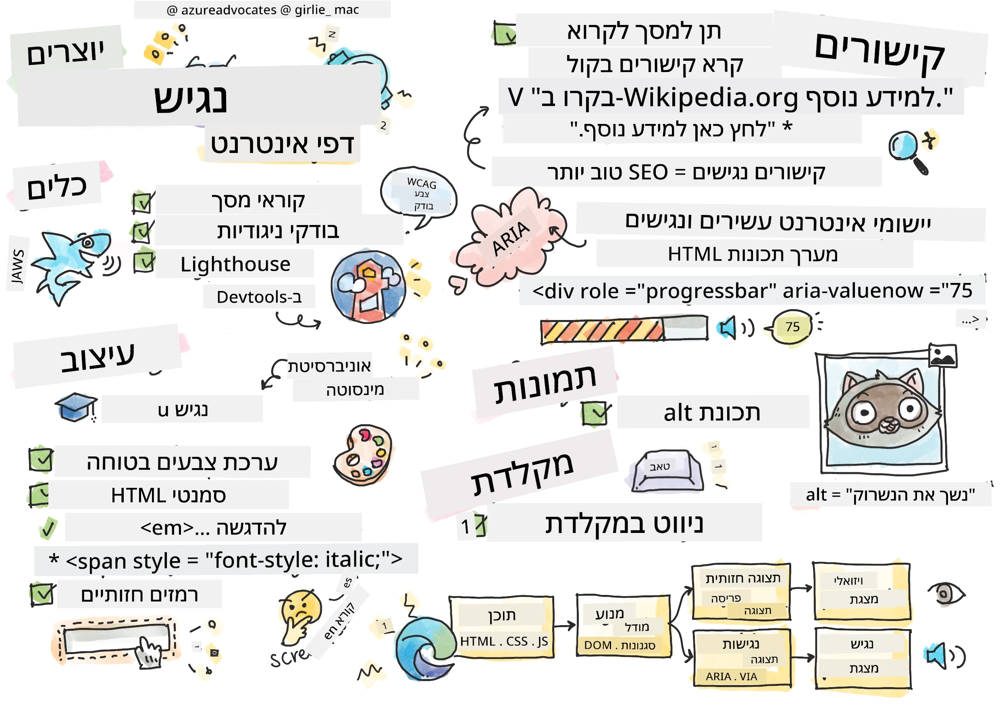
> איור מאת [Tomomi Imura](https://twitter.com/girlie_mac)

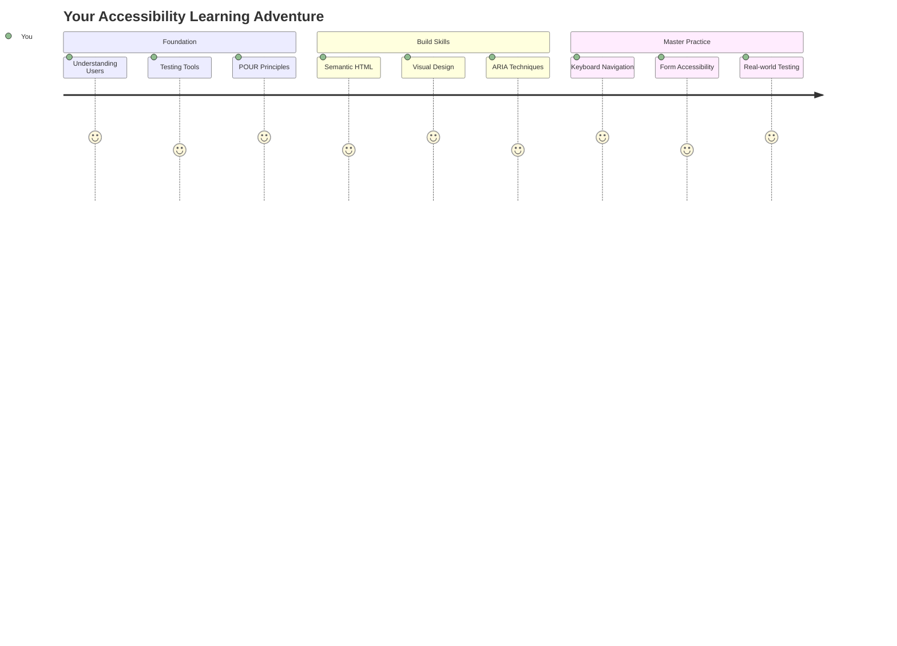

## שאלון לפני השיעור
[שאלון לפני השיעור](https://ff-quizzes.netlify.app/web/)

> הכוח של האינטרנט טמון באוניברסליות שלו. גישה לכולם, ללא קשר למוגבלות, היא היבט חיוני.
>
> \- סר טימותי ברנרס-לי, מנהל W3C וממציא ה-WWW

הנה משהו שעשוי להפתיע אתכם: כשאתם בונים אתרי אינטרנט נגישים, אתם לא רק עוזרים לאנשים עם מוגבלויות—אתם למעשה משפרים את האינטרנט עבור כולם!

שמתם לב פעם לשיפועים בפינות רחוב? הם תוכננו במקור עבור כיסאות גלגלים, אבל עכשיו הם עוזרים גם להורים עם עגלות, עובדים עם עגלות משלוחים, נוסעים עם מזוודות על גלגלים וגם לרוכבי אופניים. בדיוק כך עובד עיצוב אתרים נגיש—פתרונות שמיועדים לקבוצה אחת לעיתים קרובות מועילים לכולם. די מגניב, נכון?

בשיעור הזה, נחקור כיצד ליצור אתרים שעובדים באמת עבור כולם, לא משנה איך הם גולשים באינטרנט. תגלו טכניקות מעשיות שכבר מובנות בסטנדרטים של האינטרנט, תתנסו בכלי בדיקה ותראו כיצד נגישות הופכת את האתרים שלכם לשימושיים יותר עבור כל המשתמשים.

בסוף השיעור הזה, תהיה לכם הביטחון להפוך את הנגישות לחלק טבעי מתהליך הפיתוח שלכם. מוכנים לחקור כיצד בחירות עיצוביות מחושבות יכולות לפתוח את האינטרנט למיליארדי משתמשים? בואו נתחיל!

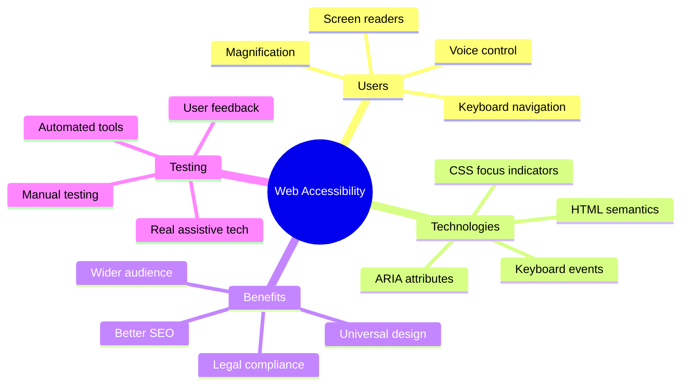

> ניתן לקחת את השיעור הזה ב-[Microsoft Learn](https://docs.microsoft.com/learn/modules/web-development-101/accessibility/?WT.mc_id=academic-77807-sagibbon)!

## הבנת טכנולוגיות מסייעות

לפני שנצלול לקוד, בואו נקדיש רגע להבין כיצד אנשים עם יכולות שונות חווים את האינטרנט. זה לא רק תיאוריה—הבנת דפוסי הניווט האמיתיים הללו תהפוך אתכם למפתחים טובים יותר!

טכנולוגיות מסייעות הן כלים מדהימים שעוזרים לאנשים עם מוגבלויות לתקשר עם אתרים בדרכים שעשויות להפתיע אתכם. ברגע שתבינו איך הטכנולוגיות הללו עובדות, יצירת חוויות אינטרנט נגישות תהפוך להרבה יותר אינטואיטיבית. זה כמו ללמוד לראות את הקוד שלכם דרך עיניים של מישהו אחר.

### קוראי מסך

[קוראי מסך](https://en.wikipedia.org/wiki/Screen_reader) הם טכנולוגיות מתקדמות שממירות טקסט דיגיטלי לדיבור או פלט ברייל. למרות שהם משמשים בעיקר אנשים עם לקויות ראייה, הם גם מועילים מאוד למשתמשים עם לקויות למידה כמו דיסלקציה.

אני אוהב לחשוב על קורא מסך כמו מספר חכם שמקריא לכם ספר. הוא מקריא תוכן בקול רם בסדר לוגי, מכריז על אלמנטים אינטראקטיביים כמו "כפתור" או "קישור", ומספק קיצורי מקלדת לניווט בדף. אבל הנה העניין—קוראי מסך יכולים לעבוד את הקסם שלהם רק אם נבנה אתרים עם מבנה נכון ותוכן משמעותי. כאן אתם נכנסים לתמונה כמפתחים!

**קוראי מסך פופולריים בפלטפורמות שונות:**
- **Windows**: [NVDA](https://www.nvaccess.org/about-nvda/) (חינמי והפופולרי ביותר), [JAWS](https://webaim.org/articles/jaws/), [Narrator](https://support.microsoft.com/windows/complete-guide-to-narrator-e4397a0d-ef4f-b386-d8ae-c172f109bdb1/?WT.mc_id=academic-77807-sagibbon) (מובנה)
- **macOS/iOS**: [VoiceOver](https://support.apple.com/guide/voiceover/welcome/10) (מובנה ומאוד מתקדם)
- **Android**: [TalkBack](https://support.google.com/accessibility/android/answer/6283677) (מובנה)
- **Linux**: [Orca](https://wiki.gnome.org/Projects/Orca) (חינמי וקוד פתוח)

**כיצד קוראי מסך מנווטים תוכן אינטרנטי:**

קוראי מסך מספקים שיטות ניווט מרובות שהופכות את הגלישה ליעילה עבור משתמשים מנוסים:
- **קריאה רציפה**: מקריא תוכן מלמעלה למטה, כמו קריאת ספר
- **ניווט לפי אזורים**: מעבר בין חלקי הדף (כותרת, ניווט, תוכן ראשי, תחתית)
- **ניווט לפי כותרות**: דילוג בין כותרות להבנת מבנה הדף
- **רשימות קישורים**: יצירת רשימה של כל הקישורים לגישה מהירה
- **בקרי טפסים**: ניווט ישיר בין שדות קלט וכפתורים

> 💡 **הנה משהו שהדהים אותי**: 68% ממשתמשי קוראי מסך מנווטים בעיקר לפי כותרות ([סקר WebAIM](https://webaim.org/projects/screenreadersurvey9/#finding)). זה אומר שמבנה הכותרות שלכם הוא כמו מפת דרכים עבור המשתמשים—כשאתם עושים את זה נכון, אתם ממש עוזרים לאנשים למצוא את דרכם בתוכן שלכם מהר יותר!

### בניית תהליך בדיקה

יש חדשות טובות—בדיקות נגישות יעילות לא חייבות להיות מכבידות! כדאי לשלב כלים אוטומטיים (הם מצוינים בזיהוי בעיות ברורות) עם בדיקות ידניות. הנה גישה שיטתית שמצאתי שתופסת את רוב הבעיות בלי לגזול את כל היום שלכם:

**תהליך בדיקה ידני חיוני:**

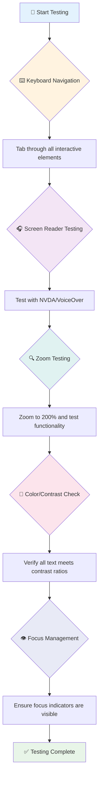

**רשימת בדיקות שלב-אחר-שלב:**
1. **ניווט באמצעות מקלדת**: השתמשו רק ב-Tab, Shift+Tab, Enter, Space ומקשי חצים
2. **בדיקת קורא מסך**: הפעילו NVDA, VoiceOver או Narrator ונווטו בעיניים עצומות
3. **בדיקת זום**: בדקו ברמות זום של 200% ו-400%
4. **אימות ניגודיות צבעים**: בדקו את כל הטקסט ורכיבי הממשק
5. **בדיקת אינדיקטור מיקוד**: ודאו שלכל האלמנטים האינטראקטיביים יש מצבי מיקוד נראים

✅ **התחילו עם Lighthouse**: פתחו את DevTools בדפדפן שלכם, הריצו בדיקת נגישות של Lighthouse, ואז השתמשו בתוצאות כדי לכוון את אזורי המיקוד של הבדיקות הידניות שלכם.

### כלי זום והגדלה

אתם יודעים איך לפעמים אתם צובטים כדי להגדיל את הטקסט בטלפון כשזה קטן מדי, או מתאמצים לראות את המסך במחשב נייד באור שמש חזק? משתמשים רבים מסתמכים על כלי הגדלה כדי להפוך תוכן לקריא כל יום. זה כולל אנשים עם ראייה חלשה, מבוגרים, וכל מי שניסה לקרוא אתר בחוץ.

טכנולוגיות זום מודרניות התפתחו מעבר להגדלה בלבד. הבנת איך הכלים הללו עובדים תעזור לכם ליצור עיצובים רספונסיביים שנשארים פונקציונליים ואטרקטיביים בכל רמת הגדלה.

**יכולות זום בדפדפנים מודרניים:**
- **זום דף**: מגדיל את כל התוכן באופן פרופורציונלי (טקסט, תמונות, פריסה) - זו השיטה המועדפת
- **זום טקסט בלבד**: מגדיל את גודל הפונט תוך שמירה על הפריסה המקורית
- **צביטה להגדלה**: תמיכה במחוות ניידות להגדלה זמנית
- **תמיכה בדפדפנים**: כל הדפדפנים המודרניים תומכים בזום עד 500% מבלי לשבור את הפונקציונליות

**תוכנות הגדלה מיוחדות:**
- **Windows**: [Magnifier](https://support.microsoft.com/windows/use-magnifier-to-make-things-on-the-screen-easier-to-see-414948ba-8b1c-d3bd-8615-0e5e32204198) (מובנה), [ZoomText](https://www.freedomscientific.com/training/zoomtext/getting-started/)
- **macOS/iOS**: [Zoom](https://www.apple.com/accessibility/mac/vision/) (מובנה עם תכונות מתקדמות)

> ⚠️ **שיקול עיצובי**: WCAG דורש שהתוכן יישאר פונקציונלי כאשר הוא מוגדל ל-200%. ברמה זו, הגלילה האופקית צריכה להיות מינימלית, וכל האלמנטים האינטראקטיביים צריכים להישאר נגישים.

✅ **בדקו את העיצוב הרספונסיבי שלכם**: הגדילו את הדפדפן שלכם ל-200% ו-400%. האם הפריסה שלכם מתאימה בצורה חלקה? האם עדיין ניתן לגשת לכל הפונקציונליות ללא גלילה מוגזמת?

## כלים מודרניים לבדיקת נגישות

עכשיו כשאתם מבינים איך אנשים מנווטים באינטרנט עם טכנולוגיות מסייעות, בואו נחקור את הכלים שעוזרים לכם לבנות ולבדוק אתרי אינטרנט נגישים.

תחשבו על זה ככה: כלים אוטומטיים מצוינים בזיהוי בעיות ברורות (כמו טקסט חלופי חסר), בעוד שבדיקות ידניות עוזרות לכם לוודא שהאתר שלכם מרגיש טוב לשימוש בעולם האמיתי. יחד, הם נותנים לכם ביטחון שהאתרים שלכם עובדים עבור כולם.

### בדיקת ניגודיות צבעים

יש חדשות טובות: ניגודיות צבעים היא אחת מבעיות הנגישות הנפוצות ביותר, אבל היא גם אחת הקלות ביותר לתיקון. ניגודיות טובה מועילה לכולם—ממשתמשים עם לקויות ראייה ועד אנשים שמנסים לקרוא את הטלפון שלהם בחוף הים.

**דרישות ניגודיות של WCAG:**

| סוג טקסט | WCAG AA (מינימום) | WCAG AAA (משופר) |
|-----------|-------------------|---------------------|
| **טקסט רגיל** (מתחת ל-18pt) | יחס ניגודיות 4.5:1 | יחס ניגודיות 7:1 |
| **טקסט גדול** (18pt+ או 14pt+ מודגש) | יחס ניגודיות 3:1 | יחס ניגודיות 4.5:1 |
| **רכיבי ממשק משתמש** (כפתורים, גבולות טפסים) | יחס ניגודיות 3:1 | יחס ניגודיות 3:1 |

**כלי בדיקה חיוניים:**
- [Colour Contrast Analyser](https://www.tpgi.com/color-contrast-checker/) - אפליקציית שולחן עבודה עם בוחר צבעים
- [WebAIM Contrast Checker](https://webaim.org/resources/contrastchecker/) - מבוסס אינטרנט עם משוב מיידי
- [Stark](https://www.getstark.co/) - תוסף כלי עיצוב ל-Figma, Sketch, Adobe XD
- [Accessible Colors](https://accessible-colors.com/) - מציאת פלטות צבעים נגישות

✅ **בנו פלטות צבעים טובות יותר**: התחילו עם צבעי המותג שלכם והשתמשו בבודקי ניגודיות כדי ליצור וריאציות נגישות. תעדו אותם כטוקנים צבע נגישים במערכת העיצוב שלכם.

### בדיקת נגישות מקיפה

הבדיקות הנגישות היעילות ביותר משלבות גישות מרובות. אף כלי אחד לא תופס הכל, ולכן בניית שגרת בדיקה עם שיטות שונות מבטיחה כיסוי יסודי.

**בדיקות מבוססות דפדפן (מובנות ב-DevTools):**
- **Chrome/Edge**: בדיקת נגישות של Lighthouse + פאנל נגישות
- **Firefox**: Accessibility Inspector עם תצוגת עץ מפורטת
- **Safari**: לשונית בדיקה ב-Web Inspector עם סימולציית VoiceOver

**תוספים מקצועיים לבדיקות:**
- [axe DevTools](https://www.deque.com/axe/devtools/) - בדיקות אוטומטיות בתקן תעשייתי
- [WAVE](https://wave.webaim.org/extension/) - משוב חזותי עם הדגשת שגיאות
- [Accessibility Insights](https://accessibilityinsights.io/) - חבילת בדיקות מקיפה של Microsoft

**אינטגרציה עם שורת פקודה ו-CI/CD:**
- [axe-core](https://github.com/dequelabs/axe-core) - ספריית JavaScript לבדיקה אוטומטית
- [Pa11y](https://pa11y.org/) - כלי בדיקת נגישות בשורת פקודה
- [Lighthouse CI](https://github.com/GoogleChrome/lighthouse-ci) - ניקוד נגישות אוטומטי

> 🎯 **מטרת בדיקה**: שאפו לציון נגישות של Lighthouse של 95+ כבסיס שלכם. זכרו, כלים אוטומטיים תופסים רק כ-30-40% מבעיות הנגישות—בדיקות ידניות עדיין חיוניות!

### 🧠 **בדיקת מיומנויות: מוכנים למצוא בעיות?**

**בואו נראה איך אתם מרגישים לגבי בדיקות נגישות:**
- איזו שיטת בדיקה נראית לכם הכי נגישה כרגע?
- האם אתם יכולים לדמיין שימוש בניווט באמצעות מקלדת בלבד למשך יום שלם?
- מהו מחסום נגישות אחד שחוויתם באופן אישי באינטרנט?

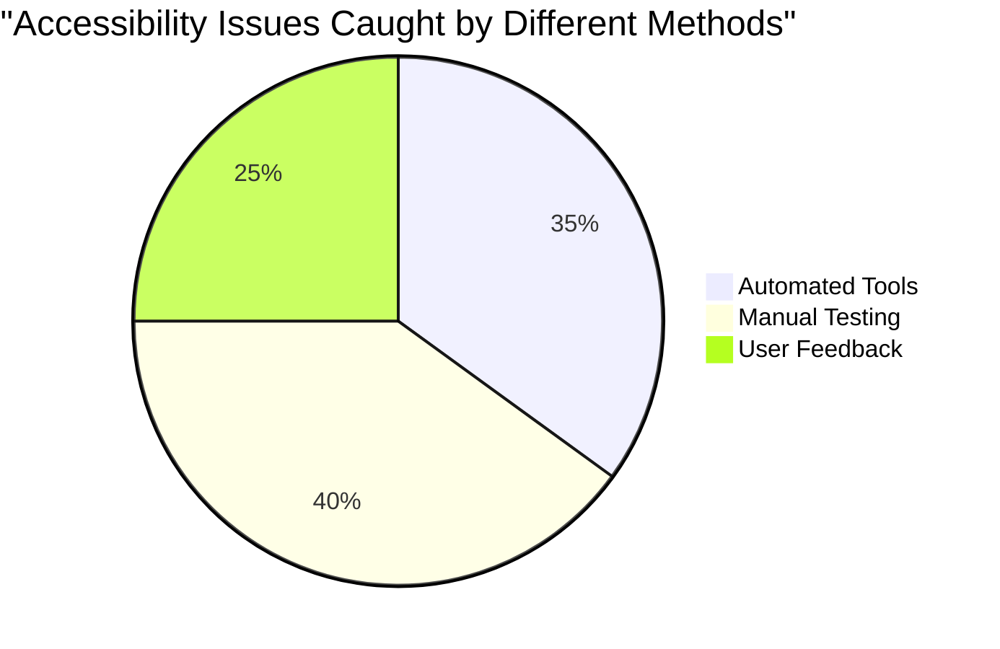

> **מגביר ביטחון**: בודקי נגישות מקצועיים משתמשים בדיוק בשילוב השיטות הזה. אתם לומדים שיטות עבודה בתקן תעשייתי!

## בניית נגישות מהיסוד

המפתח להצלחה בנגישות הוא לבנות אותה לתוך היסודות מהיום הראשון. אני יודע שזה מפתה לחשוב "אני אוסיף נגישות מאוחר יותר," אבל זה כמו לנסות להוסיף רמפה לבית אחרי שהוא כבר נבנה. אפשרי? כן. קל? לא ממש.

חשבו על נגישות כמו תכנון בית—הרבה יותר קל לכלול נגישות לכיסאות גלגלים בתוכניות האדריכליות הראשוניות מאשר לשנות הכל מאוחר יותר.

### עקרונות POUR: היסוד שלכם לנגישות

הנחיות נגישות תוכן אינטרנטי (WCAG) מבוססות על ארבעה עקרונות יסוד שמרכיבים את POUR. אל תדאגו—אלו לא מושגים אקדמיים יבשים! הם למעשה הנחיות מעשיות ליצירת תוכן שעובד עבור כולם.

ברגע שתבינו את POUR, קבלת החלטות נגישות תהפוך להרבה יותר אינטואיטיבית. זה כמו שיש לכם רשימת בדיקה מנטלית שמנחה את בחירות העיצוב שלכם. בואו נפרק את זה:

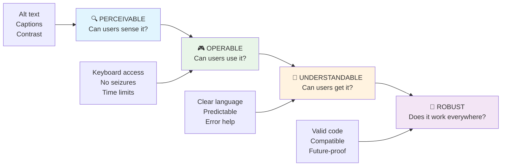

**🔍 ניתן לתפיסה**: מידע חייב להיות מוצג בדרכים שהמשתמשים יכולים לתפוס באמצעות החושים הזמינים שלהם

- ספקו חלופות טקסט לתוכן שאינו טקסט (תמונות, סרטונים, אודיו)
- ודאו ניגודיות צבעים מספקת לכל הטקסט ורכיבי הממשק
- הציעו כתוביות ותמלילים לתוכן מולטימדיה
- עיצבו תוכן שנשאר פונקציונלי כשהוא מוגדל עד 200%
- השתמשו במאפיינים חושיים מרובים (לא רק צבע) כדי להעביר מידע

**🎮 ניתן לתפעול**: כל רכיבי הממשק חייבים להיות ניתנים לתפעול באמצעות שיטות קלט זמינות

- הפכו את כל הפונקציונליות לנגישה דרך ניווט במקלדת
- ספקו למשתמשים זמן מספיק לקרוא ולהגיב לתוכן
- הימנעו מתוכן שגורם להתקפים או הפרעות וסטיבולריות
- עזרו למשתמשים לנווט ביעילות עם מבנה ברור ואזורי ניווט
- ודאו שלאלמנטים אינטראקטיביים יש גדלי מטרה מספקים (מינימום 44px)

**📖 ניתן להבנה**: מידע ותפעול ממשק חייבים להיות ברורים ומובנים

- השתמשו בשפה ברורה ופשוטה המתאימה לקהל שלכם
- ודאו שהתוכן מופיע ופועל בדרכים צפויות ועקביות
- ספקו הוראות ברורות והודעות שגיאה עבור קלט משתמש
- עזרו למשתמשים להבין ולתקן טעויות בטפסים
- ארגנו תוכן עם סדר קריאה לוגי והיררכיית מידע

**💪 עמיד**: תוכן חייב לעבוד בצורה אמינה בטכנולוגיות שונות ובמכשירים מסייעים

- **השתמשו ב-HTML תקני וסמנטי כבסיס שלכם**
- **ודאו תאימות עם טכנולוגיות מסייעות נוכחיות ועתידיות**

- **בדוק את האתר בדפדפנים, מכשירים וכלי עזר שונים**
- **בנה תוכן כך שיתפקד בצורה טובה גם כאשר תכונות מתקדמות אינן נתמכות**

### 🎯 **בדיקת עקרונות POUR: להפוך את זה לבלתי נשכח**

**מחשבות מהירות על היסודות:**
- האם תוכל לחשוב על תכונה באתר שנכשלת בכל אחד מעקרונות POUR?
- איזה עיקרון מרגיש לך הכי טבעי כמפתח?
- כיצד עקרונות אלו יכולים לשפר את העיצוב עבור כולם, לא רק עבור משתמשים עם מוגבלויות?

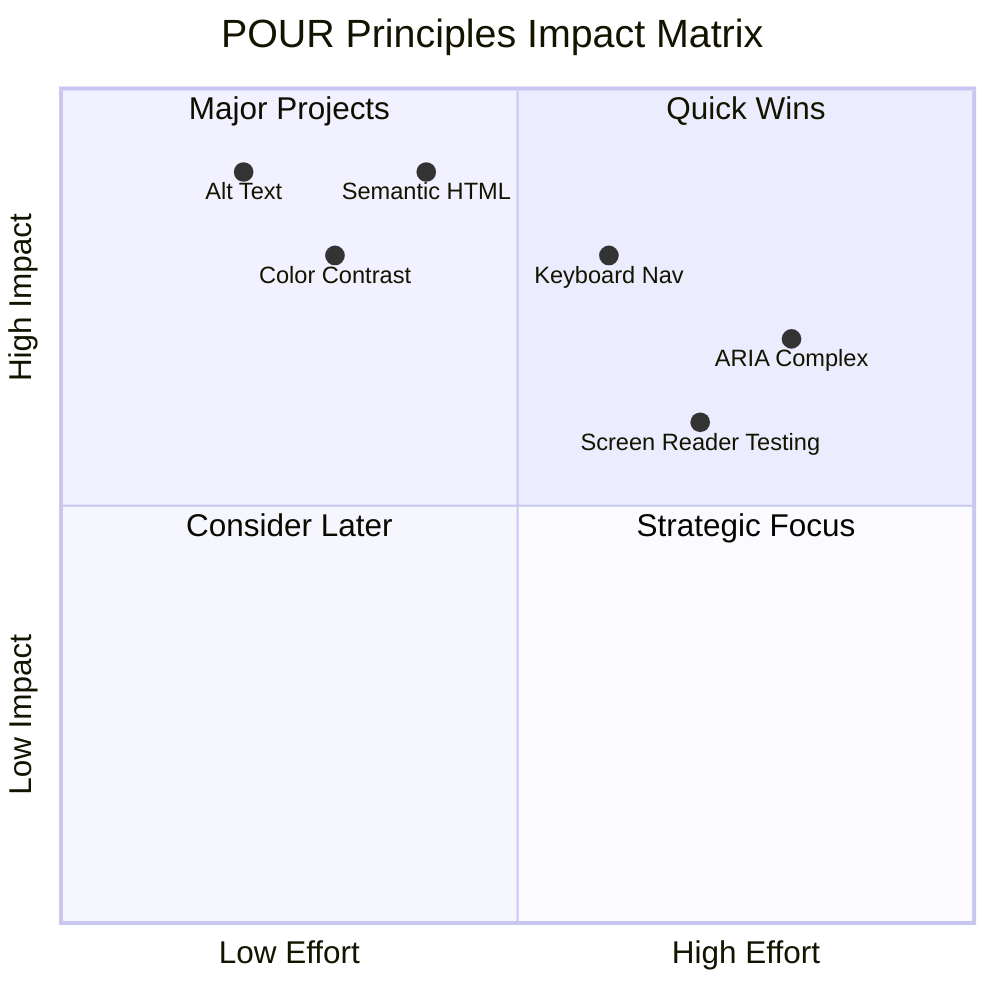

> **זכור**: התחל עם שיפורים בעלי השפעה גבוהה ומאמץ נמוך. HTML סמנטי וטקסט חלופי (alt text) מעניקים את השיפור הגדול ביותר בנגישות במינימום מאמץ!

## יצירת עיצוב חזותי נגיש

עיצוב חזותי טוב ונגישות הולכים יד ביד. כאשר מעצבים עם מחשבה על נגישות, לעיתים קרובות מגלים שהמגבלות הללו מובילות לפתרונות נקיים ואלגנטיים יותר שמועילים לכל המשתמשים.

בואו נחקור כיצד ליצור עיצובים חזותיים מושכים שעובדים עבור כולם, ללא קשר ליכולות הראייה שלהם או לתנאים שבהם הם צופים בתוכן שלכם.

### אסטרטגיות צבע ונגישות חזותית

צבע הוא כלי רב עוצמה לתקשורת, אך הוא לעולם לא צריך להיות הדרך היחידה להעברת מידע חשוב. עיצוב מעבר לצבע יוצר חוויות חזקות ומכילות יותר שעובדות במגוון מצבים.

**עיצוב עבור הבדלי ראיית צבעים:**

כ-8% מהגברים ו-0.5% מהנשים סובלים מהבדלי ראיית צבעים (לעיתים קרובות נקרא "עיוורון צבעים"). הסוגים הנפוצים ביותר הם:
- **דויטרנופיה**: קושי להבחין בין אדום לירוק
- **פרוטנופיה**: אדום נראה כהה יותר
- **טריטנופיה**: קושי עם כחול וצהוב (נדיר)

**אסטרטגיות צבע מכילות:**

```css
/* ❌ Bad: Using only color to indicate status */
.error { color: red; }
.success { color: green; }

/* ✅ Good: Color plus icons and context */
.error {
  color: #d32f2f;
  border-left: 4px solid #d32f2f;
}
.error::before {
  content: "⚠️";
  margin-right: 8px;
}

.success {
  color: #2e7d32;
  border-left: 4px solid #2e7d32;
}
.success::before {
  content: "✅";
  margin-right: 8px;
}
```

**מעבר לדרישות בסיסיות של ניגודיות:**
- בדוק את בחירות הצבעים שלך עם סימולטורים לעיוורון צבעים
- השתמש בדפוסים, טקסטורות או צורות לצד קידוד צבעים
- ודא שמצבים אינטראקטיביים נשארים מובחנים גם ללא צבע
- שקול כיצד העיצוב שלך נראה במצב ניגודיות גבוהה

✅ **בדוק את נגישות הצבעים שלך**: השתמש בכלים כמו [Coblis](https://www.color-blindness.com/coblis-color-blindness-simulator/) כדי לראות כיצד האתר שלך נראה למשתמשים עם סוגי ראיית צבעים שונים.

### אינדיקטורים למיקוד ועיצוב אינטראקציות

אינדיקטורים למיקוד הם המקבילה הדיגיטלית של סמן—הם מראים למשתמשי מקלדת היכן הם נמצאים בדף. אינדיקטורים למיקוד מעוצבים היטב משפרים את החוויה עבור כולם על ידי הפיכת האינטראקציות לברורות וצפויות.

**שיטות מודרניות לאינדיקטורים למיקוד:**

```css
/* Enhanced focus styles that work across browsers */
button:focus-visible {
  outline: 2px solid #0066cc;
  outline-offset: 2px;
  box-shadow: 0 0 0 4px rgba(0, 102, 204, 0.25);
}

/* Remove focus outline for mouse users, preserve for keyboard users */
button:focus:not(:focus-visible) {
  outline: none;
}

/* Focus-within for complex components */
.card:focus-within {
  box-shadow: 0 0 0 3px rgba(74, 144, 164, 0.5);
  border-color: #4A90A4;
}

/* Ensure focus indicators meet contrast requirements */
.custom-focus:focus-visible {
  outline: 3px solid #ffffff;
  outline-offset: 2px;
  box-shadow: 0 0 0 6px #000000;
}
```

**דרישות לאינדיקטורים למיקוד:**
- **נראות**: חייבים להיות בעלי יחס ניגודיות של לפחות 3:1 עם האלמנטים הסובבים
- **רוחב**: עובי מינימלי של 2px סביב כל האלמנט
- **התמדה**: צריכים להישאר גלויים עד שהמיקוד עובר למקום אחר
- **הבחנה**: חייבים להיות שונים מבחינה חזותית ממצבי UI אחרים

> 💡 **טיפ עיצובי**: אינדיקטורים למיקוד מעולים משתמשים לעיתים קרובות בשילוב של קו מתאר, box-shadow ושינויים בצבע כדי להבטיח נראות על רקעים והקשרים שונים.

✅ **בדוק את אינדיקטורי המיקוד שלך**: עבר דרך האתר שלך באמצעות מקש Tab וציין אילו אלמנטים כוללים אינדיקטורים ברורים למיקוד. האם יש כאלה שקשה לראות או חסרים לחלוטין?

### HTML סמנטי: הבסיס לנגישות

HTML סמנטי הוא כמו לתת לכלי עזר מערכת ניווט GPS לאתר שלך. כשאתה משתמש באלמנטים HTML הנכונים למטרתם המיועדת, אתה בעצם מספק לקוראי מסך, מקלדות וכלים אחרים מפת דרכים מפורטת שעוזרת למשתמשים לנווט בצורה יעילה.

הנה אנלוגיה שבאמת התחברה אליי: HTML סמנטי הוא ההבדל בין ספרייה מאורגנת היטב עם קטגוריות ברורות ושלטים מועילים לבין מחסן שבו הספרים מפוזרים באופן אקראי. בשני המקומות יש את אותם ספרים, אבל באיזה מהם היית מעדיף לנסות למצוא משהו? בדיוק!

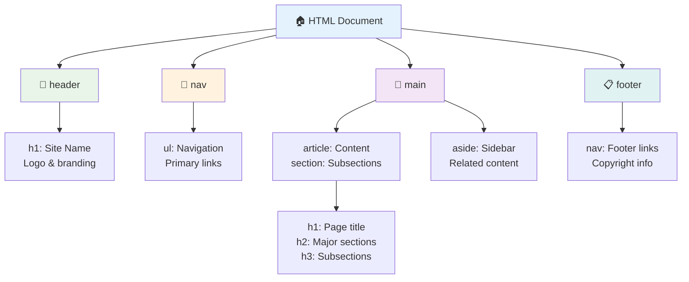

**אבני הבניין של מבנה דף נגיש:**

```html
<!-- Landmark elements provide page navigation structure -->
<header>
  <h1>Your Site Name</h1>
  <nav aria-label="Main navigation">
    <ul>
      <li><a href="/home">Home</a></li>
      <li><a href="/about">About</a></li>
      <li><a href="/services">Services</a></li>
    </ul>
  </nav>
</header>

<main>
  <article>
    <header>
      <h1>Article Title</h1>
      <p>Published on <time datetime="2024-10-14">October 14, 2024</time></p>
    </header>
    
    <section>
      <h2>First Section</h2>
      <p>Content that relates to this section...</p>
    </section>
    
    <section>
      <h2>Second Section</h2>
      <p>More related content...</p>
    </section>
  </article>
  
  <aside>
    <h2>Related Links</h2>
    <nav aria-label="Related articles">
      <ul>
        <li><a href="/related-1">First related article</a></li>
        <li><a href="/related-2">Second related article</a></li>
      </ul>
    </nav>
  </aside>
</main>

<footer>
  <p>&copy; 2024 Your Site Name. All rights reserved.</p>
  <nav aria-label="Footer links">
    <ul>
      <li><a href="/privacy">Privacy Policy</a></li>
      <li><a href="/contact">Contact Us</a></li>
    </ul>
  </nav>
</footer>
```

**מדוע HTML סמנטי משנה את הנגישות:**

| אלמנט סמנטי | מטרה | יתרון לקוראי מסך |
|--------------|-------|------------------|
| `<header>` | כותרת דף או מקטע | "נקודת ציון באנר" - ניווט מהיר לראש הדף |
| `<nav>` | קישורי ניווט | "נקודת ציון ניווט" - רשימת מקטעי ניווט |
| `<main>` | תוכן עיקרי של הדף | "נקודת ציון עיקרית" - מעבר ישיר לתוכן |
| `<article>` | תוכן עצמאי | מציין גבולות של מאמר |
| `<section>` | קבוצות תוכן עם נושא | מספק מבנה לתוכן |
| `<aside>` | תוכן צדדי קשור | "נקודת ציון משלימה" |
| `<footer>` | תחתית דף או מקטע | "נקודת ציון מידע תוכן" |

**יכולות על של קוראי מסך עם HTML סמנטי:**
- **ניווט לפי נקודות ציון**: מעבר בין מקטעים עיקריים בדף באופן מיידי
- **מתארי כותרות**: יצירת תוכן עניינים ממבנה הכותרות
- **רשימות אלמנטים**: יצירת רשימות של כל הקישורים, הכפתורים או בקרי הטפסים
- **מודעות להקשר**: הבנת הקשרים בין מקטעי תוכן

> 🎯 **בדיקה מהירה**: נסה לנווט באתר שלך עם קורא מסך באמצעות קיצורי דרך לנקודות ציון (D לנקודת ציון, H לכותרת, K לקישור ב-NVDA/JAWS). האם הניווט הגיוני?

### 🏗️ **בדיקת שליטה ב-HTML סמנטי: בניית יסודות חזקים**

**בואו נבחן את ההבנה הסמנטית שלכם:**
- האם תוכל לזהות את נקודות הציון בדף אינטרנט רק על ידי הסתכלות ב-HTML?
- כיצד היית מסביר לחבר את ההבדל בין `<section>` ל-`<div>`?
- מה הדבר הראשון שתבדוק אם משתמש קורא מסך מדווח על בעיות ניווט?

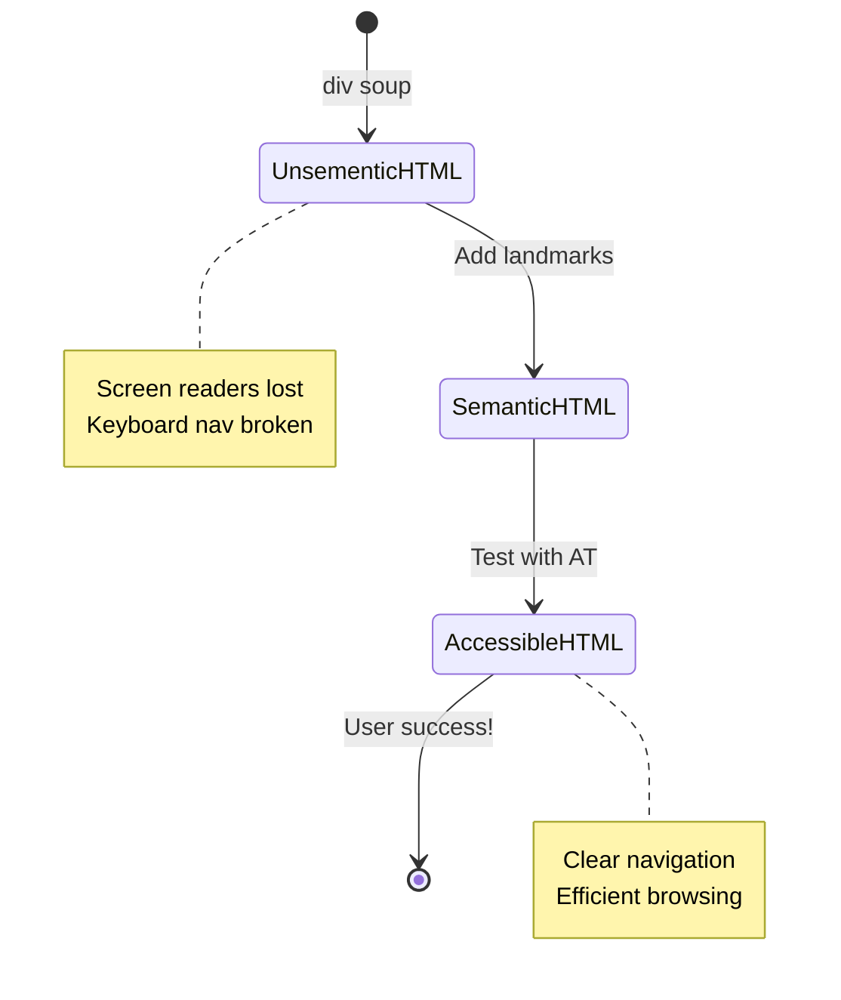

> **תובנה מקצועית**: HTML סמנטי טוב פותר כ-70% מבעיות הנגישות באופן אוטומטי. שלוט ביסוד הזה ואתה בדרך הנכונה!

✅ **בדוק את המבנה הסמנטי שלך**: השתמש בלוח הנגישות ב-DevTools של הדפדפן שלך כדי לצפות בעץ הנגישות ולוודא שהסימון שלך יוצר מבנה לוגי.

### היררכיית כותרות: יצירת מתאר תוכן לוגי

כותרות הן קריטיות לתוכן נגיש—הן כמו עמוד השדרה שמחזיק את הכל יחד. משתמשי קוראי מסך מסתמכים מאוד על כותרות כדי להבין ולנווט בתוכן שלך. תחשוב על זה כמו לספק תוכן עניינים לדף שלך.

**הנה הכלל הזהב לכותרות:**
לעולם אל תדלג על רמות. תמיד התקדמו באופן לוגי מ-`<h1>` ל-`<h2>` ל-`<h3>` וכן הלאה. זוכר איך היית עושה מתארים בבית הספר? זה בדיוק אותו עיקרון—לא היית מדלג מ-"I. נקודה עיקרית" ישר ל-"C. תת-תת-נקודה" בלי "A. תת-נקודה" באמצע, נכון?

**דוגמה למבנה כותרות מושלם:**

```html
<!-- ✅ Excellent: Logical, hierarchical progression -->
<main>
  <h1>Complete Guide to Web Accessibility</h1>
  
  <section>
    <h2>Understanding Screen Readers</h2>
    <p>Introduction to screen reader technology...</p>
    
    <h3>Popular Screen Reader Software</h3>
    <p>NVDA, JAWS, and VoiceOver comparison...</p>
    
    <h3>Testing with Screen Readers</h3>
    <p>Step-by-step testing instructions...</p>
  </section>
  
  <section>
    <h2>Color and Contrast Guidelines</h2>
    <p>Designing with sufficient contrast...</p>
    
    <h3>WCAG Contrast Requirements</h3>
    <p>Understanding the different contrast levels...</p>
    
    <h3>Testing Tools and Techniques</h3>
    <p>Tools for verifying contrast ratios...</p>
  </section>
</main>
```

```html
<!-- ❌ Problematic: Skipping levels, inconsistent structure -->
<h1>Page Title</h1>
<h3>Subsection</h3> <!-- Skipped h2 -->
<h2>This should come before h3</h2>
<h1>Another main heading?</h1> <!-- Multiple h1s -->
```

**שיטות עבודה מומלצות לכותרות:**
- **כותרת `<h1>` אחת בלבד לכל דף**: בדרך כלל כותרת הדף הראשית או כותרת התוכן העיקרי
- **התקדמות לוגית**: לעולם אל תדלג על רמות (h1 → h2 → h3, לא h1 → h3)
- **תוכן תיאורי**: הפוך את הכותרות למשמעותיות גם כשהן נקראות מחוץ להקשר
- **עיצוב חזותי עם CSS**: השתמש ב-CSS למראה, ברמות HTML למבנה

**סטטיסטיקות ניווט של קוראי מסך:**
- 68% ממשתמשי קוראי מסך מנווטים לפי כותרות ([סקר WebAIM](https://webaim.org/projects/screenreadersurvey9/#finding))
- משתמשים מצפים למצוא מתאר כותרות לוגי
- כותרות מספקות את הדרך המהירה ביותר להבין את מבנה הדף

> 💡 **טיפ מקצועי**: השתמש בתוספי דפדפן כמו "HeadingsMap" כדי להמחיש את מבנה הכותרות שלך. זה צריך להיראות כמו תוכן עניינים מאורגן היטב.

✅ **בדוק את מבנה הכותרות שלך**: השתמש בניווט כותרות של קורא מסך (מקש H ב-NVDA) כדי לעבור בין הכותרות שלך. האם ההתקדמות מספרת את הסיפור של התוכן שלך בצורה לוגית?

### טכניקות נגישות חזותיות מתקדמות

מעבר ליסודות של ניגודיות וצבע, ישנן טכניקות מתוחכמות שעוזרות ליצור חוויות חזותיות באמת מכילות. שיטות אלו מבטיחות שהתוכן שלך יעבוד בתנאי צפייה שונים ובטכנולוגיות עזר.

**אסטרטגיות תקשורת חזותית חיוניות:**

- **משוב רב-מודאלי**: שלב רמזים חזותיים, טקסטואליים ולעיתים גם קוליים
- **חשיפה הדרגתית**: הצגת מידע במנות קטנות לעיכול
- **דפוסי אינטראקציה עקביים**: השתמש בכינויים מוכרים של ממשק משתמש
- **טיפוגרפיה רספונסיבית**: התאם את גודל הטקסט למכשירים שונים
- **מצבי טעינה ושגיאה**: ספק משוב ברור לכל פעולות המשתמש

**כלי CSS לשיפור הנגישות:**

```css
/* Screen reader only text - visually hidden but accessible */
.sr-only {
  position: absolute;
  width: 1px;
  height: 1px;
  padding: 0;
  margin: -1px;
  overflow: hidden;
  clip: rect(0, 0, 0, 0);
  white-space: nowrap;
  border: 0;
}

/* Skip link for keyboard navigation */
.skip-link {
  position: absolute;
  top: -40px;
  left: 6px;
  background: #000000;
  color: #ffffff;
  padding: 8px 16px;
  text-decoration: none;
  border-radius: 4px;
  font-weight: bold;
  transition: top 0.3s ease;
  z-index: 1000;
}

.skip-link:focus {
  top: 6px;
}

/* Reduced motion respect */
@media (prefers-reduced-motion: reduce) {
  .skip-link {
    transition: none;
  }
  
  * {
    animation-duration: 0.01ms !important;
    animation-iteration-count: 1 !important;
    transition-duration: 0.01ms !important;
  }
}

/* High contrast mode support */
@media (prefers-contrast: high) {
  .button {
    border: 2px solid;
  }
}
```

> 🎯 **תבנית נגישות**: "קישור דילוג" חיוני למשתמשי מקלדת. הוא צריך להיות האלמנט הראשון שניתן להתמקד בו בדף שלך ולדלג ישירות לאזור התוכן הראשי.

✅ **הוסף דילוג ניווט**: הוסף קישורי דילוג לדפים שלך ובדוק אותם על ידי לחיצה על מקש Tab מיד כשהדף נטען. הם צריכים להופיע ולאפשר לך לדלג לתוכן הראשי.

## יצירת טקסט קישור משמעותי

קישורים הם בעצם הכבישים של האינטרנט, אבל טקסט קישור שנכתב בצורה גרועה הוא כמו שלטי דרכים שאומרים רק "מקום" במקום "מרכז העיר שיקגו". לא מאוד מועיל, נכון?

הנה משהו שהדהים אותי כששמעתי עליו לראשונה: קוראי מסך יכולים להוציא את כל הקישורים מדף ולהציג אותם כרשימה אחת גדולה. תאר לעצמך שמישהו נותן לך מדריך לכל הקישורים בדף שלך. האם כל אחד מהם יהיה מובן בפני עצמו? זה המבחן שטקסט הקישור שלך צריך לעבור!

### הבנת דפוסי ניווט קישורים

קוראי מסך מציעים תכונות ניווט קישורים חזקות שמסתמכות על טקסט קישור שנכתב היטב:

**שיטות ניווט קישורים:**
- **קריאה רציפה**: קישורים נקראים בהקשר כחלק מזרימת התוכן
- **יצירת רשימת קישורים**: כל קישורי הדף נאספים למדריך חיפוש
- **ניווט מהיר**: מעבר בין קישורים באמצעות קיצורי מקלדת (מקש K ב-NVDA)
- **פונקציית חיפוש**: מציאת קישורים ספציפיים על ידי הקלדת טקסט חלקי

**מדוע ההקשר חשוב:**
כשמשתמשי קוראי מסך יוצרים רשימת קישורים, הם רואים משהו כזה:
- "הורד דוח"
- "למד עוד"
- "לחץ כאן"
- "מדיניות פרטיות"
- "לחץ כאן"

רק שניים מהקישורים הללו מספקים מידע מועיל כשהם נקראים מחוץ להקשר!

> 📊 **השפעת משתמש**: משתמשי קוראי מסך סורקים רשימות קישורים כדי להבין את תוכן הדף במהירות. טקסט קישור גנרי מכריח אותם לחזור להקשר של כל קישור, מה שמאט משמעותית את חוויית הגלישה שלהם.

### טעויות נפוצות בטקסט קישור שיש להימנע מהן

הבנת מה לא עובד עוזרת לזהות ולתקן בעיות נגישות בתוכן קיים.

**❌ טקסט קישור גנרי שאינו מספק הקשר:**

```html
<!-- Meaningless when read from a link list -->
<p>Our sustainability efforts are detailed in our recent report. 
   <a href="/sustainability-2024.pdf">Click here</a> to view it.</p>

<!-- Repeated generic text throughout the page -->
<div class="article-card">
  <h3>Web Accessibility Guide</h3>
  <p>Learn the fundamentals...</p>
  <a href="/accessibility-guide">Read more</a>
</div>
<div class="article-card">
  <h3>Color Contrast Tips</h3>
  <p>Improve your design...</p>
  <a href="/color-contrast">Read more</a>
</div>

<!-- URLs as link text (difficult for screen readers to announce) -->
<p>Visit https://www.w3.org/WAI/WCAG21/quickref/ for WCAG guidelines.</p>

<!-- Vague action words -->
<a href="/contact">Go</a> | <a href="/about">See</a> | <a href="/help">View</a>
```

**מדוע דפוסים אלו נכשלים:**
- **"לחץ כאן"** לא אומר דבר על היעד
- **"קרא עוד"** שחוזר על עצמו מספר פעמים יוצר בלבול
- **כתובות URL גולמיות** קשה לקוראי מסך להגות בצורה ברורה
- **מילים בודדות** כמו "לך" או "ראה" חסרות הקשר תיאורי

### כתיבת טקסט קישור מצוין

טקסט קישור תיאורי מועיל לכולם—משתמשים רואים יכולים לסרוק קישורים במהירות, ומשתמשי קוראי מסך מבינים את היעדים מיד.

**✅ דוגמאות לטקסט קישור ברור ותיאורי:**

```html
<!-- Descriptive text that explains the destination -->
<p>Our comprehensive <a href="/sustainability-2024.pdf">2024 sustainability report (PDF, 2.1MB)</a> details our environmental initiatives.</p>

<!-- Specific, unique link text for each card -->
<div class="article-card">
  <h3>Web Accessibility Guide</h3>
  <p>Learn the fundamentals of inclusive design...</p>
  <a href="/accessibility-guide">Read our complete web accessibility guide</a>
</div>
<div class="article-card">
  <h3>Color Contrast Tips</h3>
  <p>Improve your design with better color choices...</p>
  <a href="/color-contrast">Explore color contrast best practices</a>
</div>

<!-- Meaningful text instead of raw URLs -->
<p>The <a href="https://www.w3.org/WAI/WCAG21/quickref/">WCAG 2.1 Quick Reference guide</a> provides comprehensive accessibility guidelines.</p>

<!-- Descriptive action links -->
<a href="/contact">Contact our support team</a> | 
<a href="/about">About our company</a> | 
<a href="/help">Get help with your account</a>
```

**שיטות עבודה מומלצות לטקסט קישור:**
- **היה ספציפי**: "הורד את דוח הכספים הרבעוני" לעומת "הורד"
- **כלול סוג וגודל קובץ**: "(PDF, 1.2MB)" עבור קבצים להורדה
- **ציין אם קישורים נפתחים חיצונית**: "(נפתח בחלון חדש)" כשמתאים
- **השתמש בשפה פעילה**: "צור קשר" לעומת "דף יצירת קשר"
- **שמור על תמציתיות**: שאף ל-2-8 מילים כשאפשר

### דפוסי נגישות קישורים מתקדמים

לפעמים מגבלות עיצוב חזותי או דרישות טכניות דורשות פתרונות מיוחדים. הנה טכניקות מתוחכמות למצבים מאתגרים נפוצים:

**שימוש ב-ARIA להקשר משופר:**

```html
<!-- When button text must be short but needs more context -->
<a href="/report.pdf" 
   aria-label="Download 2024 annual financial report, PDF format, 2.3MB">
  Download Report
</a>

<!-- When the full context comes from surrounding content -->
<h3 id="sustainability-heading">Sustainability Initiative</h3>
<p>Our efforts to reduce environmental impact...</p>
<a href="/sustainability-details" 
   aria-labelledby="sustainability-heading"
   aria-describedby="sustainability-summary">
  Learn more
</a>
<p id="sustainability-summary">Detailed breakdown of our 2024 environmental goals and achievements</p>
```

**ציון סוגי קבצים ויעדים חיצוניים:**

```html
<!-- Method 1: Include information in visible link text -->
<a href="/annual-report.pdf">
  Download our 2024 annual report (PDF, 2.3MB)
</a>

<!-- Method 2: Use screen reader-only text for file details -->
<a href="/annual-report.pdf">
  Download our 2024 annual report
  <span class="sr-only">(PDF format, 2.3MB)</span>
</a>

<!-- Method 3: External link indication -->
<a href="https://example.com" 
   target="_blank" 
   aria-describedby="external-link-warning">
  Visit external resource
</a>
<span id="external-link-warning" class="sr-only">
  (opens in new window)
</span>

<!-- Method 4: Using CSS for visual indicators -->
<a href="https://example.com" class="external-link">
  External resource
</a>
```

```css
/* Visual indicator for external links */
.external-link::after {
  content: " ↗";
  font-size: 0.8em;
  color: #666;
}

/* Screen reader announcement for external links */
.external-link::before {
  content: "External link: ";
  position: absolute;
  left: -10000px;
  width: 1px;
  height: 1px;
  overflow: hidden;
}
```

> ⚠️ **חשוב**: כשמשתמשים ב-`target="_blank"`, תמיד הודע למשתמשים שהקישור נפתח בחלון או לשונית חדשה. שינויים בלתי צפויים בניווט יכולים להיות מבלבלים.

✅ **בדוק את הקשר הקישורים שלך**: השתמש בכלי המפתחים של הדפדפן שלך כדי ליצור רשימה של כל הקישורים בדף שלך. האם תוכל להבין את מטרת כל קישור ללא הקשר סביבו?

## ARIA: שדרוג נגישות HTML

[יישומי אינטרנט עשירים נגישים (ARIA)](https://developer.mozilla.org/docs/Web/Accessibility/ARIA) הם כמו מתורגמן אוניברסלי בין יישומי האינטרנט המורכבים שלך לבין טכנולוגיות עזר. כאשר HTML לבדו לא יכול לבטא את כל מה שהרכיבים האינטראקטיביים שלך עושים, ARIA נכנס כדי למלא את הפערים הללו.

אני אוהב לחשוב על ARIA כעל הוספת הערות מועילות ל-HTML שלך—כמו הוראות במה בתסריט שמסייעות לשחקנים להבין את תפקידיהם והקשרים ביניהם.

**הנה הכלל הכי חשוב לגבי ARIA**: תמיד השתמש קודם ב-HTML סמנטי, ואז הוסף ARIA כדי לשפר אותו. תחשוב על ARIA כתיבול, לא המנה העיקרית. הוא צריך להבהיר ולשפר את מבנה ה-HTML שלך, לעולם לא להחליף אותו. קודם כל תבנה את היסודות בצורה נכונה!

### יישום אסטרטגי של ARIA

ARIA הוא כלי עוצמתי, אבל עם
**חמש הקטגוריות של ARIA:**

1. **Roles**: מהו האלמנט הזה? (`button`, `tab`, `dialog`)
2. **Properties**: מהן התכונות שלו? (`aria-required`, `aria-haspopup`)
3. **States**: מהו מצבו הנוכחי? (`aria-expanded`, `aria-checked`)
4. **Landmarks**: היכן הוא ממוקם במבנה הדף? (`banner`, `navigation`, `main`)
5. **Live regions**: כיצד יש להכריז על שינויים? (`aria-live`, `aria-atomic`)

### תבניות ARIA חיוניות לאפליקציות ווב מודרניות

תבניות אלו פותרות את האתגרים הנפוצים ביותר בנגישות באפליקציות ווב אינטראקטיביות:

**מתן שמות ותיאור אלמנטים:**

```html
<!-- aria-label: Provides accessible name when visible text isn't sufficient -->
<button aria-label="Close newsletter subscription dialog">×</button>

<!-- aria-labelledby: References existing text as the accessible name -->
<section aria-labelledby="news-heading">
  <h2 id="news-heading">Latest News</h2>
  <!-- news content -->
</section>

<!-- aria-describedby: Links to additional descriptive text -->
<input type="password" 
       aria-describedby="pwd-requirements pwd-strength"
       required>
<div id="pwd-requirements">
  Password must contain at least 8 characters, including uppercase, lowercase, and numbers.
</div>
<div id="pwd-strength" aria-live="polite">
  <!-- Dynamic password strength indicator -->
</div>
```

**אזורים חיים לתוכן דינמי:**

```html
<!-- Polite announcements (don't interrupt current speech) -->
<div aria-live="polite" id="status-updates">
  <!-- Status messages appear here -->
</div>

<!-- Assertive announcements (interrupt and announce immediately) -->
<div aria-live="assertive" id="urgent-alerts">
  <!-- Error messages and critical alerts -->
</div>

<!-- Loading states with live regions -->
<button id="submit-btn" aria-describedby="loading-status">
  Submit Application
</button>
<div id="loading-status" aria-live="polite" aria-atomic="true">
  <!-- "Processing your application..." appears here -->
</div>
```

**דוגמה לווידג'ט אינטראקטיבי (אקורדיון):**

```html
<div class="accordion">
  <h3>
    <button aria-expanded="false" 
            aria-controls="panel-1" 
            id="accordion-trigger-1"
            class="accordion-trigger">
      Accessibility Guidelines
    </button>
  </h3>
  <div id="panel-1" 
       role="region"
       aria-labelledby="accordion-trigger-1" 
       hidden>
    <p>WCAG 2.1 provides comprehensive guidelines...</p>
  </div>
</div>
```

```javascript
// JavaScript to manage accordion state
function toggleAccordion(trigger) {
  const panel = document.getElementById(trigger.getAttribute('aria-controls'));
  const isExpanded = trigger.getAttribute('aria-expanded') === 'true';
  
  // Toggle states
  trigger.setAttribute('aria-expanded', !isExpanded);
  panel.hidden = isExpanded;
  
  // Announce change to screen readers
  const status = document.getElementById('status-updates');
  status.textContent = isExpanded ? 'Section collapsed' : 'Section expanded';
}
```

### שיטות עבודה מומלצות ליישום ARIA

ARIA היא כלי עוצמתי אך דורשת יישום זהיר. הקפדה על ההנחיות הבאות תבטיח ש-ARIA תתרום לנגישות במקום להפריע לה:

**🛡️ עקרונות ליבה:**

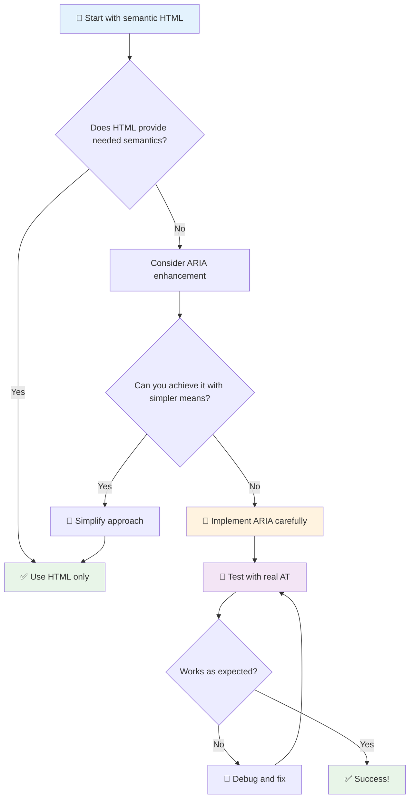

1. **HTML סמנטי תחילה**: תמיד העדיפו `<button>` על פני `<div role="button">`
2. **אל תשברו סמנטיקה**: לעולם אל תעקפו את המשמעות הקיימת של HTML (הימנעו מ-`<h1 role="button">`)
3. **שמרו על נגישות מקלדת**: כל אלמנט ARIA אינטראקטיבי חייב להיות נגיש לחלוטין באמצעות מקלדת
4. **בדקו עם משתמשים אמיתיים**: תמיכת ARIA משתנה משמעותית בין טכנולוגיות מסייעות
5. **התחילו פשוט**: יישומי ARIA מורכבים נוטים יותר לטעויות

**🔍 תהליך בדיקה:**

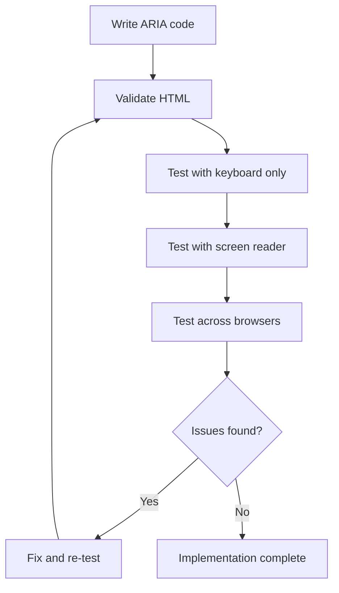

**🚫 טעויות נפוצות ב-ARIA שיש להימנע מהן:**

- **מידע סותר**: אל תסתור את הסמנטיקה של HTML
- **תוויות יתר**: יותר מדי מידע ARIA עלול להעמיס על המשתמשים
- **ARIA סטטית**: שכחת לעדכן מצבי ARIA כאשר התוכן משתנה
- **יישומים לא נבדקים**: ARIA שעובדת בתיאוריה אך נכשלת בפועל
- **חוסר תמיכה במקלדת**: תפקידי ARIA ללא אינטראקציות מקלדת מתאימות

> 💡 **משאבי בדיקה**: השתמשו בכלים כמו [accessibility-checker](https://www.npmjs.com/package/accessibility-checker) לאימות ARIA אוטומטי, אך תמיד בדקו עם קוראי מסך אמיתיים לחוויה מלאה.

### 🎭 **בדיקת מיומנויות ARIA: מוכנים לאינטראקציות מורכבות?**

**העריכו את הביטחון שלכם ב-ARIA:**
- מתי תבחרו ב-ARIA על פני HTML סמנטי? (רמז: כמעט אף פעם!)
- האם תוכלו להסביר מדוע `<div role="button">` בדרך כלל גרוע יותר מ-`<button>`?
- מה הדבר החשוב ביותר לזכור לגבי בדיקות ARIA?

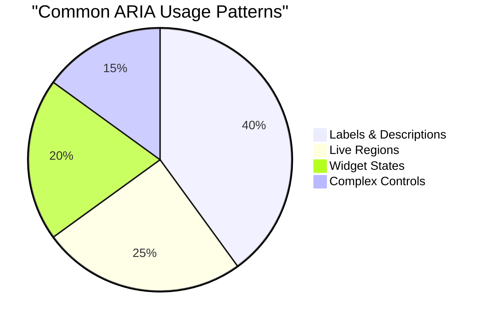

> **תובנה מרכזית**: רוב השימוש ב-ARIA הוא לתיאור ותווית אלמנטים. תבניות ווידג'ט מורכבות הן הרבה פחות נפוצות ממה שאולי תחשבו!

✅ **למדו מהמומחים**: חקרו את [מדריך שיטות העבודה של ARIA](https://w3c.github.io/aria-practices/) לתבניות ויישומים מוכחים של ווידג'טים אינטראקטיביים מורכבים.

## הפיכת תמונות ומדיה לנגישות

תוכן חזותי וקולי הם חלקים חיוניים מחוויות ווב מודרניות, אך הם יכולים ליצור מחסומים אם לא מיושמים בצורה מתחשבת. המטרה היא להבטיח שהמידע וההשפעה הרגשית של המדיה יגיעו לכל משתמש. ברגע שתתרגלו לזה, זה יהפוך לטבע שני.

סוגים שונים של מדיה דורשים גישות נגישות שונות. זה כמו בישול—לא תטפלו בדג עדין באותה דרך שתטפלו בסטייק כבד. הבנת ההבדלים הללו עוזרת לכם לבחור את הפתרון הנכון לכל מצב.

### נגישות אסטרטגית לתמונות

כל תמונה באתר שלכם משרתת מטרה. הבנת המטרה הזו עוזרת לכם לכתוב טקסט חלופי טוב יותר וליצור חוויות יותר מכילות.

**ארבעת סוגי התמונות ואסטרטגיות הטקסט החלופי שלהן:**

**תמונות אינפורמטיביות** - מעבירות מידע חשוב:
```html

```

**תמונות דקורטיביות** - חזותיות בלבד ללא ערך מידע:
```html

```

**תמונות פונקציונליות** - משמשות ככפתורים או בקרות:
```html
<button>
  
</button>
```

**תמונות מורכבות** - גרפים, דיאגרמות, אינפוגרפיקה:
```html

<div id="chart-description">
  <p>Detailed description: Sales data shows a steady increase across all quarters...</p>
</div>
```

### נגישות וידאו ואודיו

**דרישות וידאו:**
- **כתוביות**: גרסה טקסטואלית של תוכן מדובר ואפקטים קוליים
- **תיאורים קוליים**: קריינות של אלמנטים חזותיים עבור משתמשים עיוורים
- **תמלולים**: גרסה טקסטואלית מלאה של כל תוכן קולי וחזותי

```html
<video controls>
  <source src="video.mp4" type="video/mp4">
  <track kind="captions" src="captions.vtt" srclang="en" label="English">
  <track kind="descriptions" src="descriptions.vtt" srclang="en" label="Audio descriptions">
</video>
```

**דרישות אודיו:**
- **תמלולים**: גרסה טקסטואלית של כל תוכן מדובר
- **אינדיקטורים חזותיים**: עבור תוכן אודיו בלבד, ספקו רמזים חזותיים

### טכניקות מודרניות לתמונות

**שימוש ב-CSS לתמונות דקורטיביות:**
```css
.hero-section {
  background-image: url('decorative-hero.jpg');
  /* Decorative images in CSS don't need alt text */
}
```

**תמונות רספונסיביות עם נגישות:**
```html
<picture>
  <source media="(min-width: 800px)" srcset="large-chart.png">
  <source media="(min-width: 400px)" srcset="medium-chart.png">
  
</picture>
```

✅ **בדקו את נגישות התמונות**: השתמשו בקורא מסך כדי לנווט בדף עם תמונות. האם אתם מקבלים מספיק מידע כדי להבין את התוכן?

## ניווט מקלדת וניהול פוקוס

משתמשים רבים מנווטים באינטרנט רק באמצעות המקלדת. זה כולל אנשים עם מוגבלויות מוטוריות, משתמשים מנוסים שמוצאים את המקלדת מהירה יותר מהעכבר, וכל מי שהעכבר שלו הפסיק לעבוד. לוודא שהאתר שלכם עובד היטב עם קלט מקלדת הוא חיוני ולעיתים קרובות הופך את האתר שלכם ליעיל יותר עבור כולם.

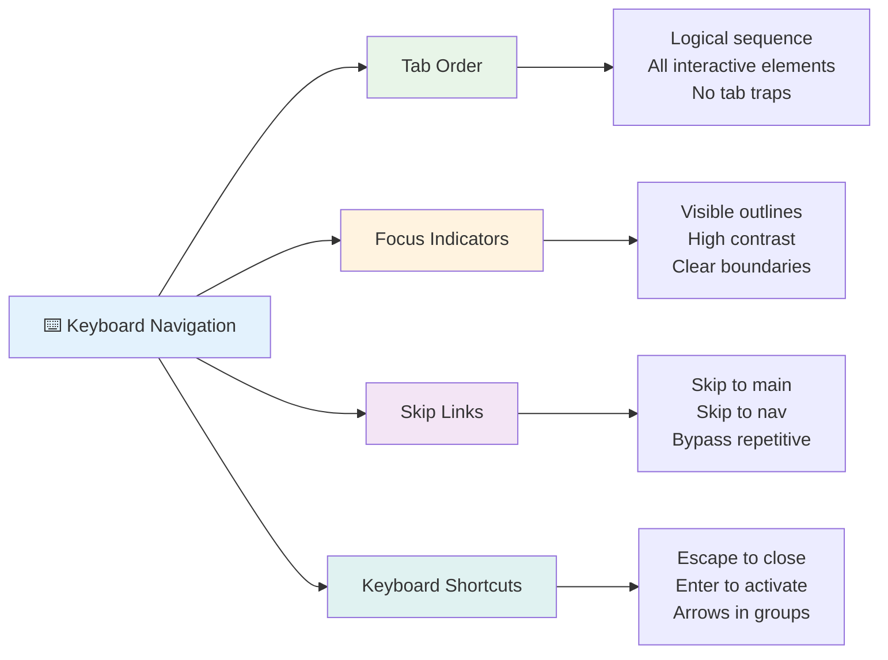

### תבניות חיוניות לניווט מקלדת

**אינטראקציות מקלדת סטנדרטיות:**
- **Tab**: מעבר קדימה בין אלמנטים אינטראקטיביים
- **Shift + Tab**: מעבר אחורה
- **Enter**: הפעלת כפתורים וקישורים
- **Space**: הפעלת כפתורים, סימון תיבות סימון
- **מקשי חצים**: ניווט בתוך קבוצות רכיבים (כפתורי רדיו, תפריטים)
- **Escape**: סגירת מודלים, תפריטים נפתחים או ביטול פעולות

### שיטות עבודה מומלצות לניהול פוקוס

**אינדיקטורים פוקוס גלויים:**
```css
/* Ensure focus is always visible */
button:focus-visible {
  outline: 2px solid #4A90A4;
  outline-offset: 2px;
}

/* Custom focus styles for different components */
.card:focus-within {
  box-shadow: 0 0 0 3px rgba(74, 144, 164, 0.5);
}
```

**קישורי דילוג לניווט יעיל:**
```html
<a href="#main-content" class="skip-link">Skip to main content</a>
<a href="#navigation" class="skip-link">Skip to navigation</a>

<nav id="navigation">
  <!-- navigation content -->
</nav>
<main id="main-content">
  <!-- main content -->
</main>
```

**סדר טאב נכון:**
```html
<!-- Use semantic HTML for natural tab order -->
<form>
  <label for="name">Name:</label>
  <input type="text" id="name" tabindex="0">
  
  <label for="email">Email:</label>
  <input type="email" id="email" tabindex="0">
  
  <button type="submit" tabindex="0">Submit</button>
</form>
```

### לכידת פוקוס במודלים

בעת פתיחת דיאלוג מודל, יש ללכוד את הפוקוס בתוך המודל:

```javascript
// Modern focus trap implementation
function trapFocus(element) {
  const focusableElements = element.querySelectorAll(
    'button, [href], input, select, textarea, [tabindex]:not([tabindex="-1"])'
  );
  
  const firstElement = focusableElements[0];
  const lastElement = focusableElements[focusableElements.length - 1];

  element.addEventListener('keydown', (e) => {
    if (e.key === 'Tab') {
      if (e.shiftKey && document.activeElement === firstElement) {
        e.preventDefault();
        lastElement.focus();
      } else if (!e.shiftKey && document.activeElement === lastElement) {
        e.preventDefault();
        firstElement.focus();
      }
    }
    
    if (e.key === 'Escape') {
      closeModal();
    }
  });
  
  // Focus first element when modal opens
  firstElement.focus();
}
```

✅ **בדקו ניווט מקלדת**: נסו לנווט באתר שלכם באמצעות מקש Tab בלבד. האם אתם מגיעים לכל האלמנטים האינטראקטיביים? האם סדר הפוקוס הגיוני? האם אינדיקטורי הפוקוס גלויים בבירור?

## נגישות טפסים

טפסים הם קריטיים לאינטראקציה עם משתמשים ודורשים תשומת לב מיוחדת לנגישות.

### שיוך תוויות ובקרות טופס

**כל בקר טופס צריך תווית:**
```html
<!-- Explicit labeling (preferred) -->
<label for="username">Username:</label>
<input type="text" id="username" name="username" required>

<!-- Implicit labeling -->
<label>
  Password:
  <input type="password" name="password" required>
</label>

<!-- Using aria-label when visual label isn't desired -->
<input type="search" aria-label="Search products" placeholder="Search...">
```

### טיפול בשגיאות ואימות

**הודעות שגיאה נגישות:**
```html
<label for="email">Email Address:</label>
<input type="email" id="email" name="email" 
       aria-describedby="email-error" 
       aria-invalid="true" required>
<div id="email-error" role="alert">
  Please enter a valid email address
</div>
```

**שיטות עבודה מומלצות לאימות טפסים:**
- השתמשו ב-`aria-invalid` כדי לציין שדות לא תקינים
- ספקו הודעות שגיאה ברורות ומדויקות
- השתמשו ב-`role="alert"` להכרזות שגיאה חשובות
- הציגו שגיאות גם מיד וגם בעת שליחת הטופס

### קבוצות ושדות

**קבצו בקרות טופס קשורות:**
```html
<fieldset>
  <legend>Shipping Address</legend>
  <label for="street">Street Address:</label>
  <input type="text" id="street" name="street">
  
  <label for="city">City:</label>
  <input type="text" id="city" name="city">
</fieldset>

<fieldset>
  <legend>Preferred Contact Method</legend>
  <input type="radio" id="contact-email" name="contact" value="email">
  <label for="contact-email">Email</label>
  
  <input type="radio" id="contact-phone" name="contact" value="phone">
  <label for="contact-phone">Phone</label>
</fieldset>
```

## מסע הנגישות שלכם: נקודות מפתח

מזל טוב! הרגע רכשתם את הידע הבסיסי ליצירת חוויות ווב באמת מכילות. זה די מרגש! נגישות ווב אינה רק עניין של עמידה בדרישות—זה על הכרה בדרכים המגוונות שבהן אנשים מתקשרים עם תוכן דיגיטלי ועיצוב עבור המורכבות המדהימה הזו.

עכשיו אתם חלק מקהילה הולכת וגדלה של מפתחים שמבינים שעיצוב טוב עובד עבור כולם. ברוכים הבאים למועדון!

**🎯 ערכת הכלים שלכם לנגישות כוללת כעת:**

| עקרון ליבה | יישום | השפעה |
|-------------|-------|--------|
| **בסיס HTML סמנטי** | השתמשו באלמנטים HTML מתאימים למטרתם | קוראי מסך יכולים לנווט ביעילות, מקלדות עובדות אוטומטית |
| **עיצוב חזותי מכיל** | ניגודיות מספקת, שימוש משמעותי בצבעים, אינדיקטורי פוקוס גלויים | ברור לכולם בכל תנאי תאורה |
| **תוכן תיאורי** | טקסט קישור משמעותי, טקסט חלופי, כותרות | משתמשים מבינים תוכן ללא הקשר חזותי |
| **נגישות מקלדת** | סדר טאב, קיצורי מקלדת, ניהול פוקוס | נגישות מוטורית ויעילות למשתמשים מנוסים |
| **שיפור ARIA** | שימוש אסטרטגי למילוי פערים סמנטיים | אפליקציות מורכבות עובדות עם טכנולוגיות מסייעות |
| **בדיקות מקיפות** | כלים אוטומטיים + אימות ידני + בדיקות משתמשים אמיתיים | איתור בעיות לפני שהן משפיעות על משתמשים |

**🚀 הצעדים הבאים שלכם:**

1. **שלבו נגישות בתהליך העבודה שלכם**: הפכו את הבדיקות לחלק טבעי מתהליך הפיתוח שלכם
2. **למדו ממשתמשים אמיתיים**: חפשו משוב מאנשים שמשתמשים בטכנולוגיות מסייעות
3. **הישארו מעודכנים**: טכניקות נגישות מתפתחות עם טכנולוגיות וסטנדרטים חדשים
4. **תמכו בהכלה**: שתפו את הידע שלכם והפכו את הנגישות לעדיפות צוותית

> 💡 **זכרו**: מגבלות נגישות לעיתים קרובות מובילות לפתרונות חדשניים ואלגנטיים שמועילים לכולם. רמפות מדרכה, כתוביות ושליטה קולית התחילו כולם כתכונות נגישות והפכו לשיפורים מיינסטרים.

**היתרון העסקי ברור כשמש**: אתרי אינטרנט נגישים מגיעים ליותר משתמשים, מדורגים טוב יותר במנועי חיפוש, יש להם עלויות תחזוקה נמוכות יותר, והם נמנעים מסיכונים משפטיים. אבל בכנות? הסיבה האמיתית לדאוג לנגישות היא הרבה יותר עמוקה. אתרים נגישים מגלמים את הערכים הטובים ביותר של האינטרנט—פתיחות, הכלה, והרעיונות שכולם ראויים לגישה שווה למידע.

עכשיו אתם מוכנים לבנות את האינטרנט המכיל של העתיד. כל אתר נגיש שתיצרו יהפוך את האינטרנט למקום יותר מזמין לכולם. זה די מדהים כשחושבים על זה!

## משאבים נוספים

המשיכו במסע הלמידה שלכם על נגישות עם המשאבים החיוניים הבאים:

**📚 סטנדרטים והנחיות רשמיות:**
- [WCAG 2.1 Guidelines](https://www.w3.org/WAI/WCAG21/quickref/) - הסטנדרט הרשמי לנגישות עם הפניה מהירה
- [מדריך שיטות העבודה של ARIA](https://w3c.github.io/aria-practices/) - תבניות מקיפות לווידג'טים אינטראקטיביים
- [הנחיות WebAIM](https://webaim.org/) - הדרכה נגישה, ידידותית למתחילים

**🛠️ כלים ומשאבי בדיקה:**
- [axe DevTools](https://www.deque.com/axe/devtools/) - בדיקות נגישות בתעשייה
- [A11y Project Checklist](https://www.a11yproject.com/checklist/) - אימות נגישות שלב אחר שלב
- [Accessibility Insights](https://accessibilityinsights.io/) - חבילת בדיקות מקיפה של מיקרוסופט
- [Color Oracle](https://colororacle.org/) - סימולטור עיוורון צבעים לבדיקת עיצוב

**🎓 למידה וקהילה:**
- [סקר קוראי מסך של WebAIM](https://webaim.org/projects/screenreadersurvey9/) - העדפות והתנהגויות משתמשים אמיתיים
- [רכיבים מכילים](https://inclusive-components.design/) - תבניות רכיבים נגישים מודרניים
- [A11y Coffee](https://a11y.coffee/) - טיפים ותובנות נגישות מהירות
- [יוזמת נגישות ווב (WAI)](https://www.w3.org/WAI/) - משאבי נגישות מקיפים של W3C

**🎥 למידה מעשית:**
- [מדריך למפתחים לנגישות](https://www.accessibility-developer-guide.com/) - הדרכה מעשית ליישום
- [Deque University](https://dequeuniversity.com/) - קורסי הכשרה מקצועיים לנגישות

## אתגר סוכן GitHub Copilot 🚀

השתמשו במצב סוכן כדי להשלים את האתגר הבא:

**תיאור:** צרו רכיב דיאלוג מודל נגיש שמדגים ניהול פוקוס נכון, תכונות ARIA ודפוסי ניווט מקלדת.

**הנחיה:** בנו רכיב דיאלוג מודל מלא עם HTML, CSS ו-JavaScript שכולל: לכידת פוקוס נכונה, מקש ESC לסגירה, לחיצה מחוץ לסגירה, תכונות ARIA לקוראי מסך, ואינדיקטורים פוקוס גלויים. המודל צריך להכיל טופס עם תוויות נכונות וטיפול בשגיאות. ודאו שהרכיב עומד בסטנדרטים WCAG 2.1 AA.


## 🚀 אתגר

קחו את ה-HTML הזה ושכתבו אותו כך שיהיה נגיש ככל האפשר, בהתחשב באסטרטגיות שלמדתם.

```html
<!DOCTYPE html>
<html lang="en">
  <head>
    <meta charset="UTF-8">
    <meta name="viewport" content="width=device-width, initial-scale=1.0">
    <title>Turtle Ipsum - The World's Premier Turtle Fan Club</title>
    <link href='../assets/style.css' rel='stylesheet' type='text/css'>
  </head>
  <body>
    <header class="site-header">
      <h1 class="site-title">Turtle Ipsum</h1>
      <p class="site-subtitle">The World's Premier Turtle Fan Club</p>
    </header>
    
    <nav class="main-nav" aria-label="Main navigation">
      <h2 class="nav-header">Resources</h2>
      <ul class="nav-list">
        <li><a href="https://www.youtube.com/watch?v=CMNry4PE93Y">"I like turtles" video</a></li>
        <li><a href="https://en.wikipedia.org/wiki/Turtle">Basic turtle information</a></li>
        <li><a href="https://en.wikipedia.org/wiki/Turtles_(chocolate)">Chocolate turtles candy</a></li>
      </ul>
    </nav>
    
    <main class="main-content">
      <article>
        <h1>Welcome to Turtle Ipsum</h1>
        <p class="intro">
          <a href="/about">Learn more about our turtle community</a> and discover fascinating facts about these amazing creatures.
        </p>
        <p class="article-text">
          Turtle ipsum dolor sit amet, consectetur adipiscing elit, sed do eiusmod tempor incididunt ut labore et dolore magna aliqua. Ut enim ad minim veniam, quis nostrud exercitation ullamco laboris nisi ut aliquip ex ea commodo consequat. Duis aute irure dolor in reprehenderit in voluptate velit esse cillum dolore eu fugiat nulla pariatur. Excepteur sint occaecat cupidatat non proident, sunt in culpa qui officia deserunt mollit anim id est laborum.
        </p>
      </article>
    </main>
    
    <footer class="footer">
      <section class="newsletter-signup">
        <h2>Stay Updated</h2>
        <button type="button" onclick="showNewsletterForm()">Sign up for turtle news</button>
      </section>
      
      <nav class="footer-nav" aria-label="Footer navigation">
        <h2>Site Pages</h2>
        <ul>
          <li><a href="../">Home</a></li>
          <li><a href="../semantic">Semantic HTML example</a></li>
        </ul>
      </nav>
      
      <p class="footer-copyright">&copy; 2024 Instrument. All rights reserved.</p>
    </footer>
  </body>
</html>
```

**שיפורים מרכזיים שבוצעו:**
- הוספת מבנה HTML סמנטי נכון
- תיקון היררכיית כותרות (כותרת h1 אחת, התקדמות לוגית)
- הוספת טקסט קישור משמעותי במקום "לחץ כאן"
- הכללת תוויות ARIA נכונות לניווט
- הוספת מאפיין lang ותגי meta נכונים
- שימוש באלמנט button עבור אלמנטים אינטראקטיביים
- ארגון תוכן תחתית עם ציוני דרך נכונים

## מבחן לאחר ההרצאה
[מבחן לאחר ההרצאה](https://ff-quizzes.netlify.app/web/en/)

## סקירה ולימוד עצמי

למדו על חוקי הנגישות במדינה שלכם. מה מכוסה ומה לא? דוגמה היא [אתר ממשלתי זה](https://accessibility.blog.gov.uk/).

## משימה
 
[נתחו אתר שאינו נגיש](assignment.md)

קרדיטים: [Turtle Ipsum](https://github.com/Instrument/semantic-html-sample) מאת Instrument

---

## 🚀 ציר הזמן לשליטה בנגישות שלכם

### ⚡ **מה תוכלו לעשות ב-5 הדקות הקרובות**
- [ ] התקינו את תוסף axe DevTools בדפדפן שלכם
- [ ] הריצו בדיקת נגישות Lighthouse באתר האהוב עליכם
- [ ] נסו לנווט בכל אתר באמצעות מקש Tab בלבד
- [ ] בדקו את קורא המסך המובנה בדפדפן שלכם (Narrator/VoiceOver)

### 🎯 **מה תוכלו להשיג בשעה הקרובה**
- [ ] השלימו את מבחן לאחר השיעור והרהרו בתובנות הנגישות
- [ ] תרגלו כתיבת טקסט חלופי משמעותי ל-10 תמונות שונות
- [ ]
- [ ] לתרגל ניווט באמצעות מקלדת ב-5 אתרים מורכבים שונים  
- [ ] לבנות טופס פשוט עם תוויות נכונות, טיפול בשגיאות ו-ARIA  
- [ ] להצטרף לקהילת נגישות (A11y Slack, פורום WebAIM)  
- [ ] לצפות במשתמשים אמיתיים עם מוגבלויות מנווטים באתרים (ביוטיוב יש דוגמאות מצוינות)  

### 🌟 **הטרנספורמציה שלך לחודש שלם**  
- [ ] לשלב בדיקות נגישות בתהליך הפיתוח שלך  
- [ ] לתרום לפרויקט קוד פתוח על ידי תיקון בעיות נגישות  
- [ ] לערוך בדיקות שימושיות עם מישהו שמשתמש בטכנולוגיה מסייעת  
- [ ] לבנות ספריית רכיבים נגישה לצוות שלך  
- [ ] לקדם את הנגישות במקום העבודה או בקהילה שלך  
- [ ] להדריך מישהו חדש במושגי נגישות  

### 🏆 **בדיקת סיום של אלוף הנגישות**

**לחגוג את מסע הנגישות שלך:**  
- מה הדבר הכי מפתיע שלמדת על איך אנשים משתמשים באינטרנט?  
- איזה עיקרון נגישות הכי מתחבר לסגנון הפיתוח שלך?  
- איך הלמידה על נגישות שינתה את נקודת המבט שלך על עיצוב?  
- מה השיפור הראשון בנגישות שתרצה לבצע בפרויקט אמיתי?  

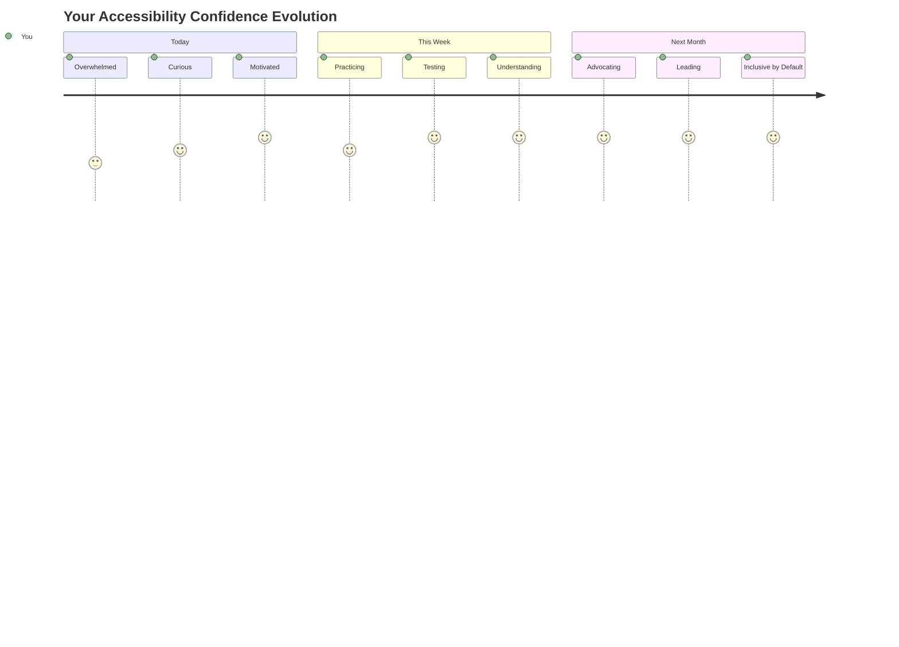
  
> 🌍 **עכשיו אתה אלוף נגישות!** אתה מבין שחוויות אינטרנט נהדרות עובדות עבור כולם, ללא קשר לאופן שבו הם ניגשים לאינטרנט. כל תכונה נגישה שאתה בונה הופכת את האינטרנט ליותר כוללני. האינטרנט זקוק למפתחים כמוך שרואים בנגישות לא מגבלה, אלא הזדמנות ליצור חוויות טובות יותר לכל המשתמשים. ברוך הבא לתנועה! 🎉  

---

**כתב ויתור**:  
מסמך זה תורגם באמצעות שירות תרגום AI [Co-op Translator](https://github.com/Azure/co-op-translator). למרות שאנו שואפים לדיוק, יש להיות מודעים לכך שתרגומים אוטומטיים עשויים להכיל שגיאות או אי דיוקים. המסמך המקורי בשפתו המקורית צריך להיחשב כמקור סמכותי. עבור מידע קריטי, מומלץ להשתמש בתרגום מקצועי אנושי. איננו אחראים לאי הבנות או לפרשנויות שגויות הנובעות משימוש בתרגום זה.