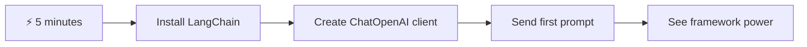
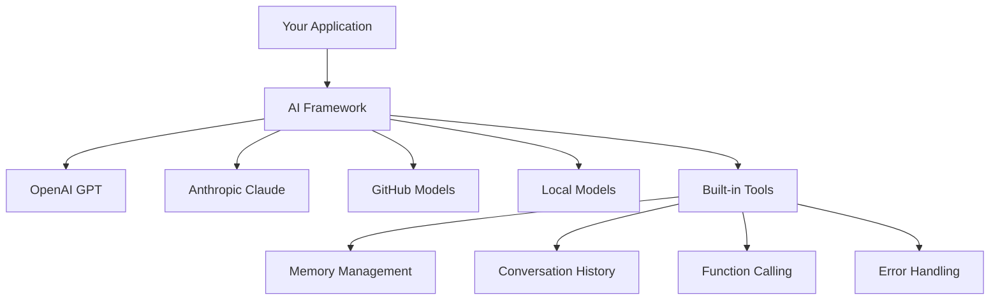
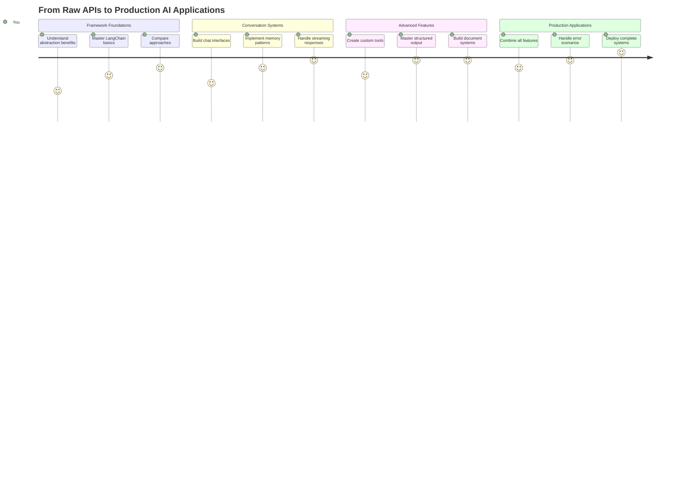
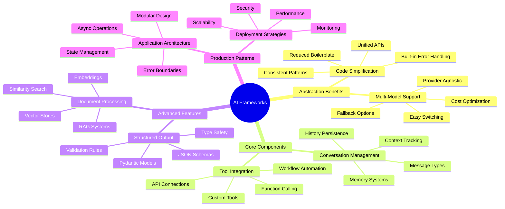
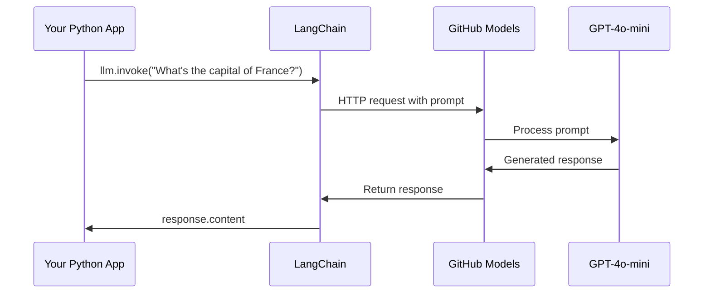
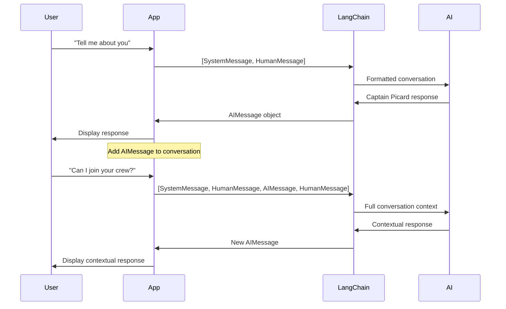
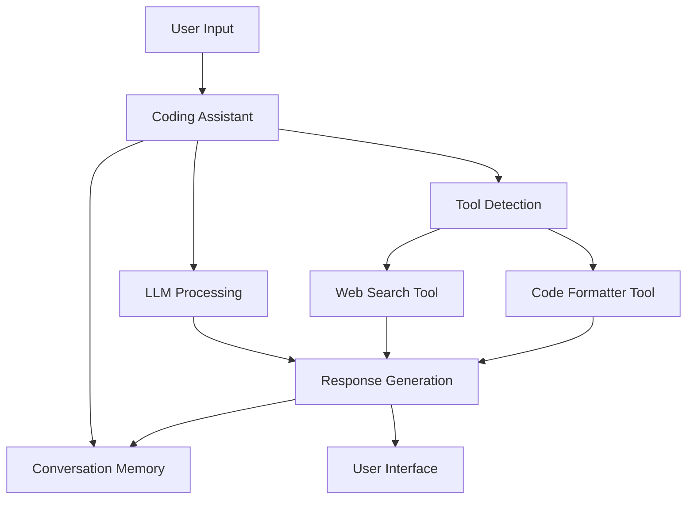
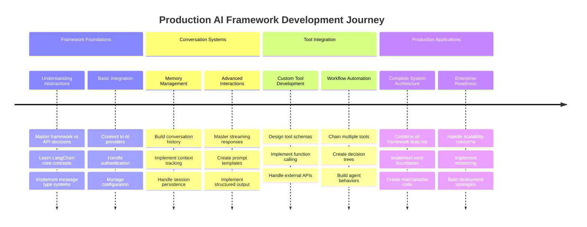

# מסגרת AI

אי פעם הרגשתם מוצפים כשניסיתם לבנות יישומי AI מאפס? אתם לא לבד! מסגרות AI הן כמו סכין שוויצרי לפיתוח AI - כלים עוצמתיים שיכולים לחסוך לכם זמן וכאבי ראש בעת בניית יישומים חכמים. תחשבו על מסגרת AI כספרייה מאורגנת היטב: היא מספקת רכיבים מוכנים מראש, ממשקי API סטנדרטיים ואבסטרקציות חכמות, כך שתוכלו להתמקד בפתרון בעיות במקום להיאבק בפרטי היישום.

בשיעור הזה, נחקור כיצד מסגרות כמו LangChain יכולות להפוך משימות אינטגרציה מורכבות של AI לקוד נקי וקריא. תגלו כיצד להתמודד עם אתגרים בעולם האמיתי כמו מעקב אחר שיחות, יישום קריאה לכלים, והתמודדות עם מודלים שונים של AI דרך ממשק אחיד אחד.

בסיום השיעור, תדעו מתי להשתמש במסגרות במקום קריאות API גולמיות, כיצד להשתמש באבסטרקציות שלהן בצורה יעילה, וכיצד לבנות יישומי AI שמוכנים לשימוש בעולם האמיתי. בואו נחקור מה מסגרות AI יכולות לעשות עבור הפרויקטים שלכם.

## ⚡ מה אפשר לעשות ב-5 דקות הקרובות

**מסלול התחלה מהירה למפתחים עסוקים**



- **דקה 1**: התקנת LangChain: `pip install langchain langchain-openai`
- **דקה 2**: הגדרת טוקן GitHub וייבוא לקוח ChatOpenAI
- **דקה 3**: יצירת שיחה פשוטה עם הודעות מערכת והודעות משתמש
- **דקה 4**: הוספת כלי בסיסי (כמו פונקציית חיבור) וצפייה בקריאה לכלי AI
- **דקה 5**: חוו את ההבדל בין קריאות API גולמיות לבין אבסטרקציות של מסגרות

**קוד בדיקה מהיר**:
```python
from langchain_openai import ChatOpenAI
from langchain_core.messages import SystemMessage, HumanMessage

llm = ChatOpenAI(
    api_key=os.environ["GITHUB_TOKEN"],
    base_url="https://models.github.ai/inference",
    model="openai/gpt-4o-mini"
)

response = llm.invoke([
    SystemMessage(content="You are a helpful coding assistant"),
    HumanMessage(content="Explain Python functions briefly")
])
print(response.content)
```

**למה זה חשוב**: תוך 5 דקות, תחוו כיצד מסגרות AI הופכות אינטגרציה מורכבת של AI לקריאות שיטה פשוטות. זהו הבסיס שמניע יישומי AI בייצור.

## למה לבחור במסגרת?

אז אתם מוכנים לבנות יישום AI - מדהים! אבל הנה העניין: יש לכם כמה דרכים שונות שבהן תוכלו ללכת, ולכל אחת יש יתרונות וחסרונות משלה. זה קצת כמו לבחור בין הליכה, רכיבה על אופניים או נסיעה ברכב כדי להגיע למקום מסוים - כולם יובילו אתכם לשם, אבל החוויה (והמאמץ) יהיו שונים לחלוטין.

בואו נפרק את שלושת הדרכים העיקריות שבהן תוכלו לשלב AI בפרויקטים שלכם:

| גישה | יתרונות | מתאים ל | שיקולים |
|------|----------|----------|----------|
| **בקשות HTTP ישירות** | שליטה מלאה, ללא תלות | שאילתות פשוטות, לימוד יסודות | קוד מפורט יותר, טיפול ידני בשגיאות |
| **אינטגרציית SDK** | פחות קוד בסיסי, אופטימיזציה למודל ספציפי | יישומים עם מודל יחיד | מוגבל לספקים ספציפיים |
| **מסגרות AI** | ממשק אחיד, אבסטרקציות מובנות | אפליקציות מרובות מודלים, תהליכים מורכבים | עקומת למידה, אפשרות לאבסטרקציה יתרה |

### יתרונות המסגרות בפועל



**למה מסגרות חשובות:**
- **מאחדות** ספקי AI שונים תחת ממשק אחד
- **מטפלות** בזיכרון שיחה באופן אוטומטי
- **מספקות** כלים מוכנים למשימות נפוצות כמו הטמעה וקריאה לפונקציות
- **מנהלות** טיפול בשגיאות ולוגיקת ניסיון חוזר
- **הופכות** תהליכים מורכבים לקריאות שיטה קריאות

> 💡 **טיפ מקצועי**: השתמשו במסגרות כשאתם עוברים בין מודלים שונים של AI או בונים תכונות מורכבות כמו סוכנים, זיכרון או קריאה לכלים. השתמשו ב-API ישיר כשאתם לומדים את היסודות או בונים יישומים פשוטים וממוקדים.

**שורה תחתונה**: כמו לבחור בין כלים מיוחדים של אומן לבין סדנה שלמה, זה עניין של התאמת הכלי למשימה. מסגרות מצטיינות באפליקציות מורכבות ועשירות בתכונות, בעוד ש-API ישיר עובד טוב עבור מקרים פשוטים וברורים.

## 🗺️ מסע הלמידה שלכם לשליטה במסגרות AI



**יעד המסע שלכם**: בסוף השיעור הזה, תשלוטו בפיתוח מסגרות AI ותוכלו לבנות יישומי AI מתקדמים ומוכנים לייצור שמתחרים בעוזרי AI מסחריים.

## מבוא

בשיעור הזה, נלמד:

- להשתמש במסגרת AI נפוצה.
- להתמודד עם בעיות נפוצות כמו שיחות צ'אט, שימוש בכלים, זיכרון והקשר.
- לנצל זאת לבניית יישומי AI.

## 🧠 אקוסיסטם פיתוח מסגרות AI



**עיקרון מרכזי**: מסגרות AI מפשטות את המורכבות תוך מתן אבסטרקציות עוצמתיות לניהול שיחות, אינטגרציה של כלים ועיבוד מסמכים, ומאפשרות למפתחים לבנות יישומי AI מתקדמים עם קוד נקי וניתן לתחזוקה.

## הפקודה הראשונה שלכם ל-AI

בואו נתחיל עם היסודות על ידי יצירת יישום AI ראשון ששולח שאלה ומקבל תשובה בחזרה. כמו ארכימדס שגילה את עקרון הדחיקה באמבטיה שלו, לפעמים התצפיות הפשוטות ביותר מובילות לתובנות החזקות ביותר - ומסגרות הופכות את התובנות הללו לנגישות.

### הגדרת LangChain עם מודלים של GitHub

אנחנו הולכים להשתמש ב-LangChain כדי להתחבר למודלים של GitHub, שזה די מגניב כי זה נותן לכם גישה חינמית למגוון מודלים של AI. החלק הכי טוב? אתם צריכים רק כמה פרמטרי תצורה פשוטים כדי להתחיל:

```python
from langchain_openai import ChatOpenAI
import os

llm = ChatOpenAI(
    api_key=os.environ["GITHUB_TOKEN"],
    base_url="https://models.github.ai/inference",
    model="openai/gpt-4o-mini",
)

# Send a simple prompt
response = llm.invoke("What's the capital of France?")
print(response.content)
```

**בואו נפרק מה קורה כאן:**
- **יוצר** לקוח LangChain באמצעות מחלקת `ChatOpenAI` - זהו השער שלכם ל-AI!
- **מגדיר** את החיבור למודלים של GitHub עם טוקן האימות שלכם
- **מציין** איזה מודל AI להשתמש בו (`gpt-4o-mini`) - תחשבו על זה כבחירת עוזר ה-AI שלכם
- **שולח** את השאלה שלכם באמצעות שיטת `invoke()` - כאן מתרחש הקסם
- **מחלץ** ומציג את התשובה - והנה, אתם משוחחים עם AI!

> 🔧 **הערת הגדרה**: אם אתם משתמשים ב-GitHub Codespaces, יש לכם מזל - ה-`GITHUB_TOKEN` כבר מוגדר עבורכם! עובדים מקומית? אין בעיה, תצטרכו רק ליצור טוקן גישה אישי עם ההרשאות הנכונות.

**תוצאה צפויה:**
```text
The capital of France is Paris.
```



## בניית AI שיחתי

הדוגמה הראשונה מדגימה את היסודות, אבל זו רק החלפת מידע אחת - אתם שואלים שאלה, מקבלים תשובה, וזהו. ביישומים אמיתיים, אתם רוצים שה-AI שלכם יזכור על מה דיברתם, כמו שווטסון והולמס בנו את שיחות החקירה שלהם לאורך זמן.

כאן LangChain הופכת להיות שימושית במיוחד. היא מספקת סוגי הודעות שונים שעוזרים לבנות שיחות ומאפשרים לכם לתת ל-AI שלכם אישיות. תבנו חוויות צ'אט ששומרות על הקשר והאופי.

### הבנת סוגי הודעות

תחשבו על סוגי ההודעות האלה כעל "כובעים" שונים שהמשתתפים לובשים בשיחה. LangChain משתמשת במחלקות הודעות שונות כדי לעקוב אחרי מי אומר מה:

| סוג הודעה | מטרה | דוגמה לשימוש |
|-----------|-------|--------------|
| `SystemMessage` | מגדיר אישיות והתנהגות של AI | "אתה עוזר קידוד מועיל" |
| `HumanMessage` | מייצג קלט משתמש | "הסבר איך פונקציות עובדות" |
| `AIMessage` | שומר תגובות AI | תגובות AI קודמות בשיחה |

### יצירת השיחה הראשונה שלכם

בואו ניצור שיחה שבה ה-AI שלנו מניח תפקיד מסוים. נגרום לו לגלם את קפטן פיקארד - דמות ידועה בחוכמתה הדיפלומטית ובמנהיגותה:

```python
messages = [
    SystemMessage(content="You are Captain Picard of the Starship Enterprise"),
    HumanMessage(content="Tell me about you"),
]
```

**פירוק הגדרת השיחה הזו:**
- **מבסס** את תפקיד ואישיות ה-AI דרך `SystemMessage`
- **מספק** את שאילתת המשתמש הראשונית באמצעות `HumanMessage`
- **יוצר** בסיס לשיחה מרובת פניות

הקוד המלא לדוגמה הזו נראה כך:

```python
from langchain_core.messages import HumanMessage, SystemMessage
from langchain_openai import ChatOpenAI
import os

llm = ChatOpenAI(
    api_key=os.environ["GITHUB_TOKEN"],
    base_url="https://models.github.ai/inference",
    model="openai/gpt-4o-mini",
)

messages = [
    SystemMessage(content="You are Captain Picard of the Starship Enterprise"),
    HumanMessage(content="Tell me about you"),
]


# works
response  = llm.invoke(messages)
print(response.content)
```

אתם אמורים לראות תוצאה דומה ל:

```text
I am Captain Jean-Luc Picard, the commanding officer of the USS Enterprise (NCC-1701-D), a starship in the United Federation of Planets. My primary mission is to explore new worlds, seek out new life and new civilizations, and boldly go where no one has gone before. 

I believe in the importance of diplomacy, reason, and the pursuit of knowledge. My crew is diverse and skilled, and we often face challenges that test our resolve, ethics, and ingenuity. Throughout my career, I have encountered numerous species, grappled with complex moral dilemmas, and have consistently sought peaceful solutions to conflicts.

I hold the ideals of the Federation close to my heart, believing in the importance of cooperation, understanding, and respect for all sentient beings. My experiences have shaped my leadership style, and I strive to be a thoughtful and just captain. How may I assist you further?
```

כדי לשמור על רציפות השיחה (במקום לאפס את ההקשר בכל פעם), אתם צריכים להמשיך להוסיף תגובות לרשימת ההודעות שלכם. כמו המסורות שבעל פה ששמרו סיפורים לאורך דורות, הגישה הזו בונה זיכרון מתמשך:

```python
from langchain_core.messages import HumanMessage, SystemMessage
from langchain_openai import ChatOpenAI
import os

llm = ChatOpenAI(
    api_key=os.environ["GITHUB_TOKEN"],
    base_url="https://models.github.ai/inference",
    model="openai/gpt-4o-mini",
)

messages = [
    SystemMessage(content="You are Captain Picard of the Starship Enterprise"),
    HumanMessage(content="Tell me about you"),
]


# works
response  = llm.invoke(messages)

print(response.content)

print("---- Next ----")

messages.append(response)
messages.append(HumanMessage(content="Now that I know about you, I'm Chris, can I be in your crew?"))

response  = llm.invoke(messages)

print(response.content)

```

די מגניב, נכון? מה שקורה כאן הוא שאנחנו קוראים ל-LLM פעמיים - פעם אחת רק עם שתי ההודעות הראשוניות שלנו, אבל אז שוב עם כל היסטוריית השיחה. זה כמו שה-AI באמת עוקב אחרי הצ'אט שלנו!

כשאתם מריצים את הקוד הזה, תקבלו תגובה שנייה שנשמעת משהו כמו:

```text
Welcome aboard, Chris! It's always a pleasure to meet those who share a passion for exploration and discovery. While I cannot formally offer you a position on the Enterprise right now, I encourage you to pursue your aspirations. We are always in need of talented individuals with diverse skills and backgrounds. 

If you are interested in space exploration, consider education and training in the sciences, engineering, or diplomacy. The values of curiosity, resilience, and teamwork are crucial in Starfleet. Should you ever find yourself on a starship, remember to uphold the principles of the Federation: peace, understanding, and respect for all beings. Your journey can lead you to remarkable adventures, whether in the stars or on the ground. Engage!
```



אני אקח את זה כ"ייתכן" ;)

## תגובות זורמות

שמתם לב איך ChatGPT נראה כאילו הוא "מקליד" את התגובות שלו בזמן אמת? זהו הזרמה בפעולה. כמו לצפות בקליגרף מיומן עובד - לראות את הדמויות מופיעות משיכה אחר משיכה במקום להתגלות מיד - הזרמה גורמת לאינטראקציה להרגיש טבעית ומספקת משוב מיידי.

### יישום הזרמה עם LangChain

```python
from langchain_openai import ChatOpenAI
import os

llm = ChatOpenAI(
    api_key=os.environ["GITHUB_TOKEN"],
    base_url="https://models.github.ai/inference",
    model="openai/gpt-4o-mini",
    streaming=True
)

# Stream the response
for chunk in llm.stream("Write a short story about a robot learning to code"):
    print(chunk.content, end="", flush=True)
```

**למה הזרמה מדהימה:**
- **מציגה** תוכן בזמן שהוא נוצר - לא עוד המתנה מביכה!
- **גורמת** למשתמשים להרגיש שמשהו באמת קורה
- **מרגישה** מהירה יותר, אפילו כשהיא לא באמת כזו
- **מאפשרת** למשתמשים להתחיל לקרוא בזמן שה-AI עדיין "חושב"

> 💡 **טיפ חוויית משתמש**: הזרמה באמת זורחת כשאתם מתמודדים עם תגובות ארוכות כמו הסברים על קוד, כתיבה יצירתית או מדריכים מפורטים. המשתמשים שלכם יאהבו לראות התקדמות במקום לבהות במסך ריק!

### 🎯 בדיקת פדגוגיה: יתרונות אבסטרקציה של מסגרות

**עצירה והרהור**: הרגע חוויתם את כוח האבסטרקציות של מסגרות AI. השוו את מה שלמדתם לקריאות API גולמיות משיעורים קודמים.

**הערכה עצמית מהירה**:
- האם אתם יכולים להסביר כיצד LangChain מפשטת ניהול שיחות בהשוואה למעקב ידני אחר הודעות?
- מה ההבדל בין שיטות `invoke()` ו-`stream()`, ומתי הייתם משתמשים בכל אחת?
- כיצד מערכת סוגי ההודעות של המסגרת משפרת את ארגון הקוד?

**חיבור לעולם האמיתי**: דפוסי האבסטרקציה שלמדתם (סוגי הודעות, ממשקי הזרמה, זיכרון שיחה) משמשים בכל יישום AI מרכזי - מממשק ChatGPT ועד עזרי קוד של GitHub Copilot. אתם שולטים באותם דפוסי ארכיטקטורה שמשתמשים בהם צוותי פיתוח AI מקצועיים.

**שאלת אתגר**: כיצד הייתם מעצבים אבסטרקציה של מסגרת לטיפול בספקי מודלים שונים של AI (OpenAI, Anthropic, Google) עם ממשק יחיד? שקלו את היתרונות והחסרונות.

## תבניות פקודות

תבניות פקודות עובדות כמו מבנים רטוריים ששימשו בנאום קלאסי - תחשבו איך קיקרו היה מתאים את דפוסי הנאום שלו לקהלים שונים תוך שמירה על אותו מסגרת משכנעת. הן מאפשרות לכם ליצור פקודות חוזרות שבהן תוכלו להחליף חלקי מידע שונים מבלי לכתוב הכל מחדש. ברגע שאתם מגדירים את התבנית, אתם פשוט ממלאים את המשתנים עם הערכים שאתם צריכים.

### יצירת פקודות חוזרות

```python
from langchain_core.prompts import ChatPromptTemplate

# Define a template for code explanations
template = ChatPromptTemplate.from_messages([
    ("system", "You are an expert programming instructor. Explain concepts clearly with examples."),
    ("human", "Explain {concept} in {language} with a practical example for {skill_level} developers")
])

# Use the template with different values
questions = [
    {"concept": "functions", "language": "JavaScript", "skill_level": "beginner"},
    {"concept": "classes", "language": "Python", "skill_level": "intermediate"},
    {"concept": "async/await", "language": "JavaScript", "skill_level": "advanced"}
]

for question in questions:
    prompt = template.format_messages(**question)
    response = llm.invoke(prompt)
    print(f"Topic: {question['concept']}\n{response.content}\n---\n")
```

**למה תאהבו להשתמש בתבניות:**
- **שומרות** על הפקודות שלכם עקביות בכל האפליקציה
- **לא עוד** שרשור מחרוזות מבולגן - רק משתנים נקיים ופשוטים
- **ה-AI שלכם** מתנהג בצורה צפויה כי המבנה נשאר זהה
- **עדכונים** הם קלים - תשנו את התבנית פעם אחת, וזה מתוקן בכל מקום

## פלט מובנה

אי פעם התעצבנתם כשניסיתם לנתח תגובות AI שחוזרות כטקסט לא מובנה? פלט מובנה הוא כמו ללמד את ה-AI שלכם לעקוב אחרי הגישה השיטתית של לינאוס לסיווג ביולוגי - מאורגן, צפוי וקל לעבודה. אתם יכולים לבקש JSON, מבני נתונים ספציפיים או כל פורמט שאתם צריכים.

### הגדרת סכמות פלט

```python
from langchain_core.prompts import ChatPromptTemplate
from langchain_core.output_parsers import JsonOutputParser
from pydantic import BaseModel, Field

class CodeReview(BaseModel):
    score: int = Field(description="Code quality score from 1-10")
    strengths: list[str] = Field(description="List of code strengths")
    improvements: list[str] = Field(description="List of suggested improvements")
    overall_feedback: str = Field(description="Summary feedback")

# Set up the parser
parser = JsonOutputParser(pydantic_object=CodeReview)

# Create prompt with format instructions
prompt = ChatPromptTemplate.from_messages([
    ("system", "You are a code reviewer. {format_instructions}"),
    ("human", "Review this code: {code}")
])

# Format the prompt with instructions
chain = prompt | llm | parser

# Get structured response
code_sample = """
def calculate_average(numbers):
    return sum(numbers) / len(numbers)
"""

result = chain.invoke({
    "code": code_sample,
    "format_instructions": parser.get_format_instructions()
})

print(f"Score: {result['score']}")
print(f"Strengths: {', '.join(result['strengths'])}")
```

**למה פלט מובנה משנה את המשחק:**
- **לא עוד** ניחושים איזה פורמט תקבלו בחזרה - זה עקבי כל פעם
- **מתחבר** ישירות למסדי הנתונים וה-API שלכם ללא עבודה נוספת
- **תופס** תגובות AI מוזרות לפני שהן שוברות את האפליקציה שלכם
- **גורם** לקוד שלכם להיות נקי יותר כי אתם יודעים בדיוק עם מה אתם עובדים

## קריאה לכלים

עכשיו אנחנו מגיעים לאחת התכונות החזקות ביותר: כלים. כך אתם נותנים ל-AI שלכם יכולות מעשיות מעבר לשיחה. כמו איך גילדות ימי הביניים פיתחו כלים מיוחדים למלאכות ספציפיות, אתם יכולים לצייד את ה-AI שלכם בכלים ממוקדים. אתם מתארים אילו כלים זמינים, וכאשר מישהו מבקש משהו שמתאים, ה-AI שלכם יכול לפעול.

### שימוש ב-Python

בואו נוסיף כמה כלים כך:

```python
from typing_extensions import Annotated, TypedDict

class add(TypedDict):
    """Add two integers."""

    # Annotations must have the type and can optionally include a default value and description (in that order).
    a: Annotated[int, ..., "First integer"]
    b: Annotated[int, ..., "Second integer"]

tools = [add]

functions = {
    "add": lambda a, b: a + b
}
```

אז מה קורה כאן? אנחנו יוצרים תבנית לכלי שנקרא `add`. על ידי ירושה מ-`TypedDict` ושימוש בסוגי `Annotated` עבור `a` ו-`b`, אנחנו נותנים ל-LLM תמונה ברורה של מה הכלי הזה עושה ומה הוא צריך. המילון `functions` הוא כמו ארגז הכלים שלנו - הוא אומר לקוד בדיוק מה לעשות כשה-AI מחליט להשתמש בכלי מסוים.

בואו נראה איך אנחנו קוראים ל-LLM עם הכלי הזה:

```python
llm = ChatOpenAI(
    api_key=os.environ["GITHUB_TOKEN"],
    base_url="https://models.github.ai/inference",
    model="openai/gpt-4o-mini",
)

llm_with_tools = llm.bind_tools(tools)
```

כאן אנחנו קוראים ל-`bind_tools` עם מערך `tools` שלנו ובכך ה-LLM `llm_with_tools` עכשיו יודע על הכלי הזה.

כדי להשתמש ב-LLM החדש הזה, אנחנו יכולים להקליד את הקוד הבא:

```python
query = "What is 3 + 12?"

res = llm_with_tools.invoke(query)
if(res.tool_calls):
    for tool in res.tool_calls:
        print("TOOL CALL: ", functions[tool["name"]](../../../10-ai-framework-project/**tool["args"]))
print("CONTENT: ",res.content)
```

עכשיו כשאנחנו קוראים ל-`invoke` על ה-LLM החדש הזה, שיש לו כלים, ייתכן שהמאפיין `tool_calls` יתמלא. אם כן, כל כלי מזוהה יש לו מאפיין `name` ו-`args` שמזהים איזה כלי יש לקרוא ובאילו ארגומנטים. הקוד המלא נראה כך:

```python
from langchain_core.messages import HumanMessage, SystemMessage
from langchain_openai import ChatOpenAI
import os
from typing_extensions import Annotated, TypedDict

class add(TypedDict):
    """Add two integers."""

    # Annotations must have the type and can optionally include a default value and description (in that order).
    a: Annotated[int, ..., "First integer"]
    b: Annotated[int, ..., "Second integer"]

tools = [add]

functions = {
    "add": lambda a, b: a + b
}

llm = ChatOpenAI(
    api_key=os.environ["GITHUB_TOKEN"],
    base_url="https://models.github.ai/inference",
    model="openai/gpt-4o-mini",
)

llm_with_tools = llm.bind_tools(tools)

query = "What is 3 + 12?"

res = llm_with_tools.invoke(query)
if(res.tool_calls):
    for tool in res.tool_calls:
        print("TOOL CALL: ", functions[tool["name"]](../../../10-ai-framework-project/**tool["args"]))
print("CONTENT: ",res.content)
```

כשמריצים את הקוד הזה, אתם אמורים לראות פלט דומה ל:

```text
TOOL CALL:  15
CONTENT: 
```

ה-AI בחן "מה זה 3 + 12" וזיהה זאת כמשימה עבור כלי ה-`add`. כמו איך ספרן מיומן יודע לאיזה מקור להתייעץ בהתבסס על סוג השאלה שנשאלה, הוא עשה את ההחלטה הזו משם הכלי, התיאור והמפרט של השדות. התוצאה של 15 מגיעה מהמילון `functions` שלנו שמבצע את הכלי:

```python
print("TOOL CALL: ", functions[tool["name"]](../../../10-ai-framework-project/**tool["args"]))
```

### כלי מעניין יותר שמבצע קריאה ל-API אינטרנטי
הוספת מספרים מדגימה את הרעיון, אך כלים אמיתיים בדרך כלל מבצעים פעולות מורכבות יותר, כמו קריאה ל-API של אתרים. בואו נרחיב את הדוגמה שלנו כך שה-AI יוכל להביא תוכן מהאינטרנט - בדומה לאופן שבו מפעילי טלגרף פעם חיברו מקומות רחוקים:

```python
class joke(TypedDict):
    """Tell a joke."""

    # Annotations must have the type and can optionally include a default value and description (in that order).
    category: Annotated[str, ..., "The joke category"]

def get_joke(category: str) -> str:
    response = requests.get(f"https://api.chucknorris.io/jokes/random?category={category}", headers={"Accept": "application/json"})
    if response.status_code == 200:
        return response.json().get("value", f"Here's a {category} joke!")
    return f"Here's a {category} joke!"

functions = {
    "add": lambda a, b: a + b,
    "joke": lambda category: get_joke(category)
}

query = "Tell me a joke about animals"

# the rest of the code is the same
```

כעת, אם תריצו את הקוד הזה, תקבלו תגובה שאומרת משהו כמו:

```text
TOOL CALL:  Chuck Norris once rode a nine foot grizzly bear through an automatic car wash, instead of taking a shower.
CONTENT:  
```

```mermaid
flowchart TD
    A[User Query: "Tell me a joke about animals"] --> B[LangChain Analysis]
    B --> C{Tool Available?}
    C -->|Yes| D[Select joke tool]
    C -->|No| E[Generate direct response]
    
    D --> F[Extract Parameters]
    F --> G[Call joke(category="animals")]
    G --> H[API Request to chucknorris.io]
    H --> I[Return joke content]
    I --> J[Display to user]
    
    E --> K[AI-generated response]
    K --> J
    
    subgraph "Tool Definition Layer"
        L[TypedDict Schema]
        M[Function Implementation]
        N[Parameter Validation]
    end
    
    D --> L
    F --> N
    G --> M
```

הנה הקוד במלואו:

```python
from langchain_openai import ChatOpenAI
import requests
import os
from typing_extensions import Annotated, TypedDict

class add(TypedDict):
    """Add two integers."""

    # Annotations must have the type and can optionally include a default value and description (in that order).
    a: Annotated[int, ..., "First integer"]
    b: Annotated[int, ..., "Second integer"]

class joke(TypedDict):
    """Tell a joke."""

    # Annotations must have the type and can optionally include a default value and description (in that order).
    category: Annotated[str, ..., "The joke category"]

tools = [add, joke]

def get_joke(category: str) -> str:
    response = requests.get(f"https://api.chucknorris.io/jokes/random?category={category}", headers={"Accept": "application/json"})
    if response.status_code == 200:
        return response.json().get("value", f"Here's a {category} joke!")
    return f"Here's a {category} joke!"

functions = {
    "add": lambda a, b: a + b,
    "joke": lambda category: get_joke(category)
}

llm = ChatOpenAI(
    api_key=os.environ["GITHUB_TOKEN"],
    base_url="https://models.github.ai/inference",
    model="openai/gpt-4o-mini",
)

llm_with_tools = llm.bind_tools(tools)

query = "Tell me a joke about animals"

res = llm_with_tools.invoke(query)
if(res.tool_calls):
    for tool in res.tool_calls:
        # print("TOOL CALL: ", tool)
        print("TOOL CALL: ", functions[tool["name"]](../../../10-ai-framework-project/**tool["args"]))
print("CONTENT: ",res.content)
```

## הטמעות ועיבוד מסמכים

הטמעות מייצגות אחת מהפתרונות האלגנטיים ביותר ב-AI מודרני. דמיינו שאתם יכולים לקחת כל טקסט ולהמיר אותו לקואורדינטות מספריות שמבטאות את משמעותו. זה בדיוק מה שהטמעות עושות - הן הופכות טקסט לנקודות במרחב רב-ממדי שבו רעיונות דומים מתרכזים יחד. זה כמו מערכת קואורדינטות לרעיונות, שמזכירה איך מנדלייב ארגן את הטבלה המחזורית לפי תכונות אטומיות.

### יצירה ושימוש בהטמעות

```python
from langchain_openai import OpenAIEmbeddings
from langchain_community.vectorstores import FAISS
from langchain_community.document_loaders import TextLoader
from langchain.text_splitter import CharacterTextSplitter

# Initialize embeddings
embeddings = OpenAIEmbeddings(
    api_key=os.environ["GITHUB_TOKEN"],
    base_url="https://models.github.ai/inference",
    model="text-embedding-3-small"
)

# Load and split documents
loader = TextLoader("documentation.txt")
documents = loader.load()

text_splitter = CharacterTextSplitter(chunk_size=1000, chunk_overlap=0)
texts = text_splitter.split_documents(documents)

# Create vector store
vectorstore = FAISS.from_documents(texts, embeddings)

# Perform similarity search
query = "How do I handle user authentication?"
similar_docs = vectorstore.similarity_search(query, k=3)

for doc in similar_docs:
    print(f"Relevant content: {doc.page_content[:200]}...")
```

### טועני מסמכים לפורמטים שונים

```python
from langchain_community.document_loaders import (
    PyPDFLoader,
    CSVLoader,
    JSONLoader,
    WebBaseLoader
)

# Load different document types
pdf_loader = PyPDFLoader("manual.pdf")
csv_loader = CSVLoader("data.csv")
json_loader = JSONLoader("config.json")
web_loader = WebBaseLoader("https://example.com/docs")

# Process all documents
all_documents = []
for loader in [pdf_loader, csv_loader, json_loader, web_loader]:
    docs = loader.load()
    all_documents.extend(docs)
```

**מה אפשר לעשות עם הטמעות:**
- **לבנות** חיפוש שמבין את הכוונה שלכם, לא רק התאמת מילות מפתח
- **ליצור** AI שיכול לענות על שאלות לגבי המסמכים שלכם
- **להכין** מערכות המלצה שמציעות תוכן באמת רלוונטי
- **לארגן** ולסווג את התוכן שלכם באופן אוטומטי

```mermaid
flowchart LR
    A[Documents] --> B[Text Splitter]
    B --> C[Create Embeddings]
    C --> D[Vector Store]
    
    E[User Query] --> F[Query Embedding]
    F --> G[Similarity Search]
    G --> D
    D --> H[Relevant Documents]
    H --> I[AI Response]
    
    subgraph "Vector Space"
        J[Document A: [0.1, 0.8, 0.3...]]
        K[Document B: [0.2, 0.7, 0.4...]]
        L[Query: [0.15, 0.75, 0.35...]]
    end
    
    C --> J
    C --> K
    F --> L
    G --> J
    G --> K
```

## בניית אפליקציית AI שלמה

כעת נשלב את כל מה שלמדתם לתוך אפליקציה מקיפה - עוזר קוד שיכול לענות על שאלות, להשתמש בכלים ולשמור על זיכרון שיחה. כמו שהדפוס שילב טכנולוגיות קיימות (אותיות נעות, דיו, נייר ולחץ) למשהו מהפכני, אנחנו נשלב את רכיבי ה-AI שלנו למשהו פרקטי ושימושי.

### דוגמה לאפליקציה שלמה

```python
from langchain_openai import ChatOpenAI, OpenAIEmbeddings
from langchain_core.prompts import ChatPromptTemplate
from langchain_core.messages import HumanMessage, SystemMessage, AIMessage
from langchain_community.vectorstores import FAISS
from typing_extensions import Annotated, TypedDict
import os
import requests

class CodingAssistant:
    def __init__(self):
        self.llm = ChatOpenAI(
            api_key=os.environ["GITHUB_TOKEN"],
            base_url="https://models.github.ai/inference",
            model="openai/gpt-4o-mini"
        )
        
        self.conversation_history = [
            SystemMessage(content="""You are an expert coding assistant. 
            Help users learn programming concepts, debug code, and write better software.
            Use tools when needed and maintain a helpful, encouraging tone.""")
        ]
        
        # Define tools
        self.setup_tools()
    
    def setup_tools(self):
        class web_search(TypedDict):
            """Search for programming documentation or examples."""
            query: Annotated[str, "Search query for programming help"]
        
        class code_formatter(TypedDict):
            """Format and validate code snippets."""
            code: Annotated[str, "Code to format"]
            language: Annotated[str, "Programming language"]
        
        self.tools = [web_search, code_formatter]
        self.llm_with_tools = self.llm.bind_tools(self.tools)
    
    def chat(self, user_input: str):
        # Add user message to conversation
        self.conversation_history.append(HumanMessage(content=user_input))
        
        # Get AI response
        response = self.llm_with_tools.invoke(self.conversation_history)
        
        # Handle tool calls if any
        if response.tool_calls:
            for tool_call in response.tool_calls:
                tool_result = self.execute_tool(tool_call)
                print(f"🔧 Tool used: {tool_call['name']}")
                print(f"📊 Result: {tool_result}")
        
        # Add AI response to conversation
        self.conversation_history.append(response)
        
        return response.content
    
    def execute_tool(self, tool_call):
        tool_name = tool_call['name']
        args = tool_call['args']
        
        if tool_name == 'web_search':
            return f"Found documentation for: {args['query']}"
        elif tool_name == 'code_formatter':
            return f"Formatted {args['language']} code: {args['code'][:50]}..."
        
        return "Tool execution completed"

# Usage example
assistant = CodingAssistant()

print("🤖 Coding Assistant Ready! Type 'quit' to exit.\n")

while True:
    user_input = input("You: ")
    if user_input.lower() == 'quit':
        break
    
    response = assistant.chat(user_input)
    print(f"🤖 Assistant: {response}\n")
```

**ארכיטקטורת האפליקציה:**



**תכונות מרכזיות שהטמענו:**
- **זוכר** את כל השיחה שלכם להמשכיות הקשר
- **מבצע פעולות** דרך קריאה לכלים, לא רק שיחה
- **עוקב** אחרי דפוסי אינטראקציה צפויים
- **מנהל** טיפול בשגיאות ותהליכים מורכבים באופן אוטומטי

### 🎯 בדיקה פדגוגית: ארכיטקטורת AI לייצור

**הבנת הארכיטקטורה**: בניתם אפליקציית AI שלמה שמשלבת ניהול שיחה, קריאה לכלים ותהליכים מובנים. זה מייצג פיתוח אפליקציות AI ברמת ייצור.

**מושגים מרכזיים שנלמדו**:
- **ארכיטקטורה מבוססת מחלקות**: מבנה אפליקציה מאורגן וניתן לתחזוקה
- **אינטגרציית כלים**: פונקציונליות מותאמת מעבר לשיחה
- **ניהול זיכרון**: הקשר שיחה מתמשך
- **טיפול בשגיאות**: התנהגות אפליקציה יציבה

**חיבור לתעשייה**: דפוסי הארכיטקטורה שהטמעתם (מחלקות שיחה, מערכות כלים, ניהול זיכרון) הם אותם דפוסים שמשתמשים בהם באפליקציות AI ארגוניות כמו העוזר של Slack, GitHub Copilot ו-Microsoft Copilot. אתם בונים עם חשיבה ארכיטקטונית ברמה מקצועית.

**שאלת השתקפות**: איך הייתם מרחיבים את האפליקציה הזו כדי לטפל במספר משתמשים, אחסון מתמשך או אינטגרציה עם מסדי נתונים חיצוניים? שקלו אתגרים של יכולת הרחבה וניהול מצב.

## משימה: בנו עוזר לימודים מבוסס AI משלכם

**מטרה**: צרו אפליקציית AI שעוזרת לסטודנטים ללמוד מושגים בתכנות על ידי מתן הסברים, דוגמאות קוד וחידונים אינטראקטיביים.

### דרישות

**תכונות ליבה (חובה):**
1. **ממשק שיחה**: הטמיעו מערכת צ'אט ששומרת על הקשר בין שאלות מרובות
2. **כלים חינוכיים**: צרו לפחות שני כלים שעוזרים בלמידה:
   - כלי להסבר קוד
   - מחולל חידונים על מושגים
3. **למידה מותאמת אישית**: השתמשו בהודעות מערכת כדי להתאים תגובות לרמות מיומנות שונות
4. **עיצוב תגובות**: הטמיעו פלט מובנה לשאלות חידון

### שלבי יישום

**שלב 1: הגדרת הסביבה**
```bash
pip install langchain langchain-openai
```

**שלב 2: פונקציונליות צ'אט בסיסית**
- צרו מחלקת `StudyAssistant`
- הטמיעו זיכרון שיחה
- הוסיפו תצורת אישיות לתמיכה חינוכית

**שלב 3: הוספת כלים חינוכיים**
- **מסביר קוד**: מפרק קוד לחלקים מובנים
- **מחולל חידונים**: יוצר שאלות על מושגים בתכנות
- **מעקב התקדמות**: עוקב אחרי נושאים שכוסו

**שלב 4: תכונות מתקדמות (אופציונלי)**
- הטמיעו תגובות זורמות לחוויית משתמש טובה יותר
- הוסיפו טעינת מסמכים לשילוב חומרי קורס
- צרו הטמעות לשליפה מבוססת דמיון של תוכן

### קריטריוני הערכה

| תכונה | מצוין (4) | טוב (3) | מספק (2) | דורש שיפור (1) |
|-------|-----------|---------|-----------|----------------|
| **זרימת שיחה** | תגובות טבעיות ומודעות להקשר | שמירת הקשר טובה | שיחה בסיסית | אין זיכרון בין חילופי דברים |
| **אינטגרציית כלים** | מספר כלים שימושיים שעובדים בצורה חלקה | 2+ כלים מיושמים כראוי | 1-2 כלים בסיסיים | כלים לא פונקציונליים |
| **איכות קוד** | נקי, מתועד היטב, טיפול בשגיאות | מבנה טוב, מעט תיעוד | פונקציונליות בסיסית עובדת | מבנה גרוע, אין טיפול בשגיאות |
| **ערך חינוכי** | באמת מועיל ללמידה, מותאם | תמיכה טובה בלמידה | הסברים בסיסיים | תועלת חינוכית מוגבלת |

### מבנה דוגמת קוד

```python
class StudyAssistant:
    def __init__(self, skill_level="beginner"):
        # Initialize LLM, tools, and conversation memory
        pass
    
    def explain_code(self, code, language):
        # Tool: Explain how code works
        pass
    
    def generate_quiz(self, topic, difficulty):
        # Tool: Create practice questions
        pass
    
    def chat(self, user_input):
        # Main conversation interface
        pass

# Example usage
assistant = StudyAssistant(skill_level="intermediate")
response = assistant.chat("Explain how Python functions work")
```

**אתגרי בונוס:**
- הוסיפו יכולות קלט/פלט קוליות
- הטמיעו ממשק אינטרנטי באמצעות Streamlit או Flask
- צרו בסיס ידע מחומרי קורס באמצעות הטמעות
- הוסיפו מעקב התקדמות ונתיבי למידה מותאמים אישית

## 📈 ציר הזמן לשליטה בפיתוח מסגרת AI



**🎓 אבן דרך לסיום**: שלטתם בהצלחה בפיתוח מסגרת AI באמצעות אותם כלים ודפוסים שמניעים אפליקציות AI מודרניות. מיומנויות אלו מייצגות את חוד החנית של פיתוח אפליקציות AI ומכינות אתכם לבניית מערכות חכמות ברמת ארגון.

**🔄 יכולות ברמה הבאה**:
- מוכנים לחקור ארכיטקטורות AI מתקדמות (סוכנים, מערכות רב-סוכנים)
- מוכנים לבנות מערכות RAG עם מסדי נתונים וקטוריים
- מצוידים ליצירת אפליקציות AI רב-מודאליות
- בסיס מוכן להרחבה ואופטימיזציה של אפליקציות AI

## סיכום

🎉 כעת שלטתם ביסודות פיתוח מסגרת AI ולמדתם כיצד לבנות אפליקציות AI מתוחכמות באמצעות LangChain. כמו אומנים מתקופת הרנסנס ששילבו חזון אמנותי עם מיומנות טכנית, אתם יכולים כעת לשלב יכולות AI עם יישום פרקטי. השאלה היא: מה תיצרו? 🚀

## אתגר סוכן GitHub Copilot 🚀

השתמשו במצב סוכן כדי להשלים את האתגר הבא:

**תיאור:** בנו עוזר סקירת קוד מתקדם מבוסס AI שמשלב תכונות רבות של LangChain כולל קריאה לכלים, פלט מובנה וזיכרון שיחה כדי לספק משוב מקיף על הגשות קוד.

**הנחיה:** צרו מחלקת CodeReviewAssistant שמיישמת:
1. כלי לניתוח מורכבות קוד והצעת שיפורים
2. כלי לבדיקת קוד מול שיטות עבודה מומלצות
3. פלט מובנה באמצעות מודלים Pydantic לפורמט סקירה עקבי
4. זיכרון שיחה למעקב אחר סשני סקירה
5. ממשק צ'אט ראשי שיכול לטפל בהגשות קוד ולספק משוב מפורט וניתן לפעולה

העוזר צריך להיות מסוגל לסקור קוד בשפות תכנות שונות, לשמור על הקשר בין הגשות קוד מרובות בסשן, ולספק גם ציוני סיכום וגם הצעות שיפור מפורטות.

למדו עוד על [מצב סוכן](https://code.visualstudio.com/blogs/2025/02/24/introducing-copilot-agent-mode) כאן.

---

**כתב ויתור**:  
מסמך זה תורגם באמצעות שירות תרגום AI [Co-op Translator](https://github.com/Azure/co-op-translator). למרות שאנו שואפים לדיוק, יש לקחת בחשבון שתרגומים אוטומטיים עשויים להכיל שגיאות או אי דיוקים. המסמך המקורי בשפתו המקורית צריך להיחשב כמקור סמכותי. עבור מידע קריטי, מומלץ להשתמש בתרגום מקצועי אנושי. איננו אחראים לאי הבנות או לפרשנויות שגויות הנובעות משימוש בתרגום זה.