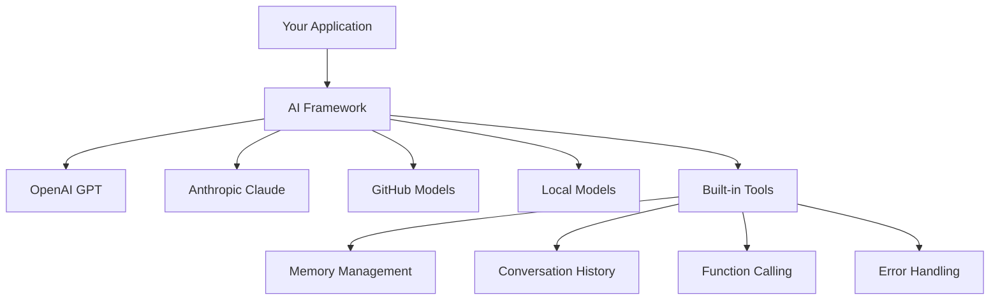
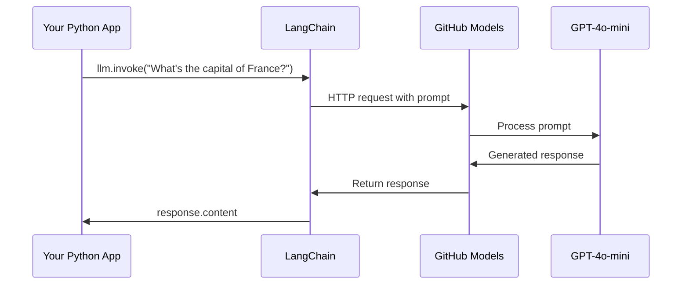
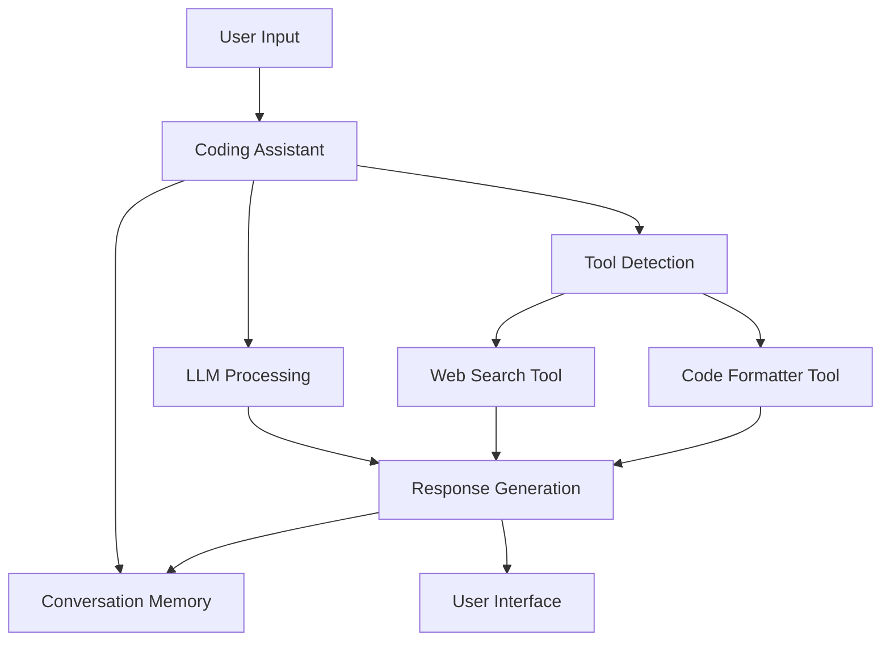
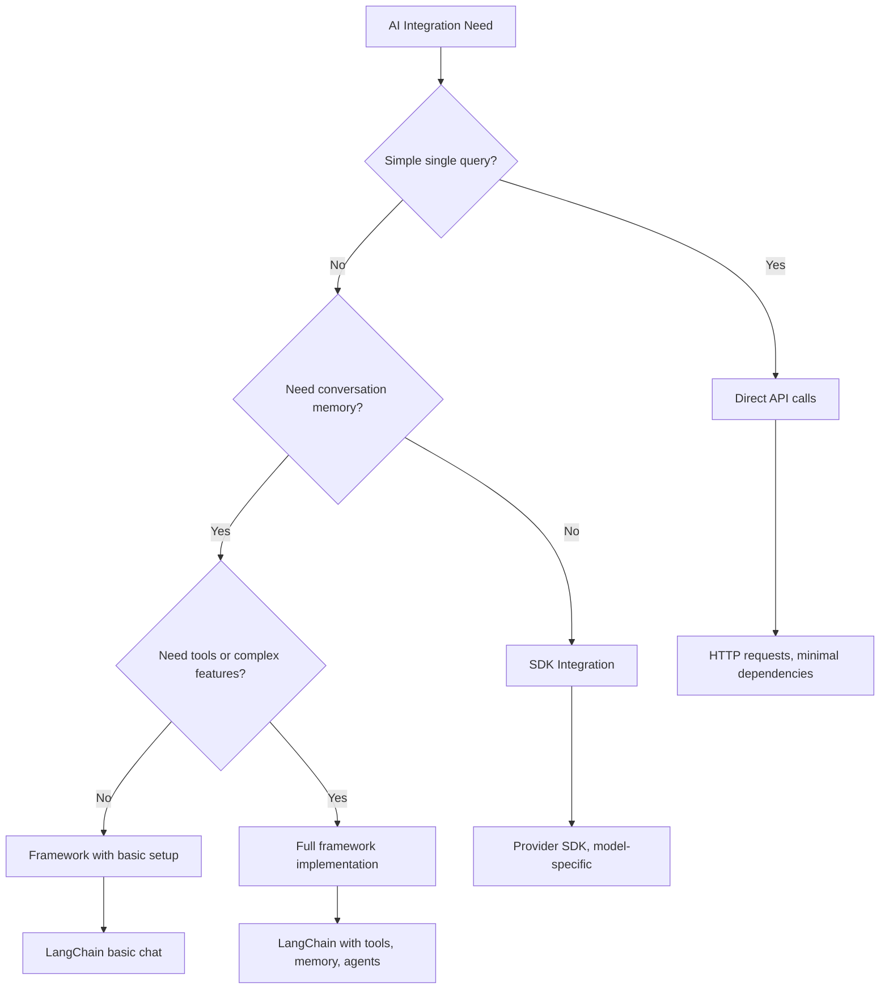

<!--
CO_OP_TRANSLATOR_METADATA:
{
  "original_hash": "e2c4ae5688e34b4b8b09d52aec56c79e",
  "translation_date": "2025-10-23T01:19:35+00:00",
  "source_file": "10-ai-framework-project/README.md",
  "language_code": "he"
}
-->
# מסגרת AI

אי פעם הרגשתם מוצפים כשניסיתם לבנות יישומי AI מאפס? אתם לא לבד! מסגרות AI הן כמו סכין שוויצרי לפיתוח AI - כלים עוצמתיים שיכולים לחסוך לכם זמן וכאבי ראש בעת בניית יישומים חכמים. חשבו על מסגרת AI כספרייה מאורגנת היטב: היא מספקת רכיבים מוכנים מראש, ממשקי API סטנדרטיים ואבסטרקציות חכמות, כך שתוכלו להתמקד בפתרון בעיות במקום להיאבק בפרטי היישום.

בשיעור הזה, נחקור כיצד מסגרות כמו LangChain יכולות להפוך משימות אינטגרציה מורכבות של AI לקוד נקי וקריא. תגלו כיצד להתמודד עם אתגרים בעולם האמיתי כמו מעקב אחר שיחות, יישום קריאה לכלים, והתמודדות עם מודלים שונים של AI דרך ממשק מאוחד אחד.

בסיום השיעור, תדעו מתי להשתמש במסגרות במקום קריאות API גולמיות, כיצד להשתמש באבסטרקציות שלהן בצורה יעילה, וכיצד לבנות יישומי AI שמוכנים לשימוש בעולם האמיתי. בואו נחקור מה מסגרות AI יכולות לעשות עבור הפרויקטים שלכם.

## למה לבחור במסגרת?

אז אתם מוכנים לבנות יישום AI - מדהים! אבל הנה העניין: יש לכם כמה דרכים שונות שבהן תוכלו ללכת, ולכל אחת יש יתרונות וחסרונות משלה. זה קצת כמו לבחור בין הליכה, רכיבה על אופניים או נהיגה כדי להגיע למקום מסוים - כולם יובילו אתכם לשם, אבל החוויה (והמאמץ) יהיו שונים לחלוטין.

בואו נפרק את שלושת הדרכים העיקריות שבהן תוכלו לשלב AI בפרויקטים שלכם:

| גישה | יתרונות | מתאים ל | שיקולים |
|------|----------|----------|----------|
| **בקשות HTTP ישירות** | שליטה מלאה, ללא תלות | שאילתות פשוטות, לימוד יסודות | קוד מפורט יותר, טיפול ידני בשגיאות |
| **אינטגרציית SDK** | פחות קוד בסיסי, אופטימיזציה למודל ספציפי | יישומים עם מודל יחיד | מוגבל לספקים ספציפיים |
| **מסגרות AI** | ממשק מאוחד, אבסטרקציות מובנות | אפליקציות מרובות מודלים, תהליכים מורכבים | עקומת למידה, פוטנציאל לאבסטרקציה יתרה |

### יתרונות המסגרת בפועל



**למה מסגרות חשובות:**
- **מאחדות** ספקי AI שונים תחת ממשק אחד
- **מטפלות** בזיכרון שיחה באופן אוטומטי
- **מספקות** כלים מוכנים למשימות נפוצות כמו הטבעות וקריאה לפונקציות
- **מנהלות** טיפול בשגיאות ולוגיקת ניסיונות חוזרים
- **הופכות** תהליכים מורכבים לקריאות שיטה קריאות

> 💡 **טיפ מקצועי**: השתמשו במסגרות כשאתם עוברים בין מודלים שונים של AI או בונים תכונות מורכבות כמו סוכנים, זיכרון או קריאה לכלים. הישארו עם APIs ישירים כשאתם לומדים את היסודות או בונים יישומים פשוטים וממוקדים.

**שורה תחתונה**: כמו לבחור בין כלים מיוחדים של אומן לבין סדנה שלמה, זה עניין של התאמת הכלי למשימה. מסגרות מצטיינות באפליקציות מורכבות ועשירות בתכונות, בעוד ש-APIs ישירים עובדים היטב עבור מקרים פשוטים וברורים.

## מבוא

בשיעור הזה, נלמד:

- להשתמש במסגרת AI נפוצה.
- להתמודד עם בעיות נפוצות כמו שיחות צ'אט, שימוש בכלים, זיכרון והקשר.
- לנצל זאת לבניית אפליקציות AI.

## הפקודה הראשונה שלכם ל-AI

בואו נתחיל עם היסודות על ידי יצירת אפליקציית AI ראשונה ששולחת שאלה ומקבלת תשובה בחזרה. כמו ארכימדס שגילה את עקרון הדחיקה באמבטיה שלו, לפעמים התצפיות הפשוטות ביותר מובילות לתובנות החזקות ביותר - ומסגרות הופכות את התובנות הללו לנגישות.

### הגדרת LangChain עם מודלים של GitHub

אנחנו הולכים להשתמש ב-LangChain כדי להתחבר למודלים של GitHub, שזה די מגניב כי זה נותן לכם גישה חינמית למגוון מודלים של AI. החלק הכי טוב? אתם צריכים רק כמה פרמטרי תצורה פשוטים כדי להתחיל:

```python
from langchain_openai import ChatOpenAI
import os

llm = ChatOpenAI(
    api_key=os.environ["GITHUB_TOKEN"],
    base_url="https://models.github.ai/inference",
    model="openai/gpt-4o-mini",
)

# Send a simple prompt
response = llm.invoke("What's the capital of France?")
print(response.content)
```

**בואו נפרק מה קורה כאן:**
- **יוצר** לקוח LangChain באמצעות מחלקת `ChatOpenAI` - זהו השער שלכם ל-AI!
- **מגדיר** את החיבור למודלים של GitHub עם אסימון האימות שלכם
- **מציין** איזה מודל AI להשתמש בו (`gpt-4o-mini`) - חשבו על זה כבחירת העוזר האישי שלכם
- **שולח** את השאלה שלכם באמצעות שיטת `invoke()` - כאן מתרחש הקסם
- **מחלץ** ומציג את התשובה - והנה, אתם משוחחים עם AI!

> 🔧 **הערת הגדרה**: אם אתם משתמשים ב-GitHub Codespaces, יש לכם מזל - ה-`GITHUB_TOKEN` כבר מוגדר עבורכם! עובדים מקומית? אין בעיה, תצטרכו רק ליצור אסימון גישה אישי עם ההרשאות הנכונות.

**תוצאה צפויה:**
```text
The capital of France is Paris.
```



## בניית AI שיחתי

הדוגמה הראשונה מדגימה את היסודות, אבל זו רק החלפת מידע אחת - אתם שואלים שאלה, מקבלים תשובה, וזהו. ביישומים אמיתיים, אתם רוצים שה-AI שלכם יזכור על מה דיברתם, כמו שווטסון והולמס בנו את השיחות החקירתיות שלהם לאורך זמן.

כאן LangChain הופכת להיות שימושית במיוחד. היא מספקת סוגי הודעות שונים שעוזרים לבנות שיחות ומאפשרים לכם לתת ל-AI שלכם אישיות. תבנו חוויות צ'אט ששומרות על הקשר והאופי.

### הבנת סוגי הודעות

חשבו על סוגי ההודעות האלה כעל "כובעים" שונים שהמשתתפים לובשים בשיחה. LangChain משתמשת במחלקות הודעות שונות כדי לעקוב אחר מי אומר מה:

| סוג הודעה | מטרה | דוגמה לשימוש |
|-----------|-------|--------------|
| `SystemMessage` | מגדיר את האישיות וההתנהגות של ה-AI | "אתה עוזר קידוד מועיל" |
| `HumanMessage` | מייצג את קלט המשתמש | "הסבר כיצד פונקציות עובדות" |
| `AIMessage` | שומר את תגובות ה-AI | תגובות AI קודמות בשיחה |

### יצירת השיחה הראשונה שלכם

בואו ניצור שיחה שבה ה-AI שלנו מניח תפקיד מסוים. נגרום לו לגלם את קפטן פיקארד - דמות הידועה בחוכמתה הדיפלומטית ובמנהיגותה:

```python
messages = [
    SystemMessage(content="You are Captain Picard of the Starship Enterprise"),
    HumanMessage(content="Tell me about you"),
]
```

**פירוק הגדרת השיחה הזו:**
- **מבסס** את תפקיד ואישיות ה-AI דרך `SystemMessage`
- **מספק** את השאלה הראשונית של המשתמש דרך `HumanMessage`
- **יוצר** בסיס לשיחה מרובת סיבובים

הקוד המלא לדוגמה הזו נראה כך:

```python
from langchain_core.messages import HumanMessage, SystemMessage
from langchain_openai import ChatOpenAI
import os

llm = ChatOpenAI(
    api_key=os.environ["GITHUB_TOKEN"],
    base_url="https://models.github.ai/inference",
    model="openai/gpt-4o-mini",
)

messages = [
    SystemMessage(content="You are Captain Picard of the Starship Enterprise"),
    HumanMessage(content="Tell me about you"),
]


# works
response  = llm.invoke(messages)
print(response.content)
```

אתם אמורים לראות תוצאה דומה ל:

```text
I am Captain Jean-Luc Picard, the commanding officer of the USS Enterprise (NCC-1701-D), a starship in the United Federation of Planets. My primary mission is to explore new worlds, seek out new life and new civilizations, and boldly go where no one has gone before. 

I believe in the importance of diplomacy, reason, and the pursuit of knowledge. My crew is diverse and skilled, and we often face challenges that test our resolve, ethics, and ingenuity. Throughout my career, I have encountered numerous species, grappled with complex moral dilemmas, and have consistently sought peaceful solutions to conflicts.

I hold the ideals of the Federation close to my heart, believing in the importance of cooperation, understanding, and respect for all sentient beings. My experiences have shaped my leadership style, and I strive to be a thoughtful and just captain. How may I assist you further?
```

כדי לשמור על רציפות השיחה (במקום לאפס את ההקשר בכל פעם), עליכם להמשיך להוסיף תגובות לרשימת ההודעות שלכם. כמו המסורות שבעל פה ששמרו סיפורים לאורך דורות, גישה זו בונה זיכרון מתמשך:

```python
from langchain_core.messages import HumanMessage, SystemMessage
from langchain_openai import ChatOpenAI
import os

llm = ChatOpenAI(
    api_key=os.environ["GITHUB_TOKEN"],
    base_url="https://models.github.ai/inference",
    model="openai/gpt-4o-mini",
)

messages = [
    SystemMessage(content="You are Captain Picard of the Starship Enterprise"),
    HumanMessage(content="Tell me about you"),
]


# works
response  = llm.invoke(messages)

print(response.content)

print("---- Next ----")

messages.append(response)
messages.append(HumanMessage(content="Now that I know about you, I'm Chris, can I be in your crew?"))

response  = llm.invoke(messages)

print(response.content)

```

די מגניב, נכון? מה שקורה כאן הוא שאנחנו קוראים ל-LLM פעמיים - פעם אחת רק עם שתי ההודעות הראשוניות שלנו, אבל אז שוב עם כל היסטוריית השיחה. זה כאילו ה-AI באמת עוקב אחרי השיחה שלנו!

כשאתם מריצים את הקוד הזה, תקבלו תגובה שנשמעת בערך כך:

```text
Welcome aboard, Chris! It's always a pleasure to meet those who share a passion for exploration and discovery. While I cannot formally offer you a position on the Enterprise right now, I encourage you to pursue your aspirations. We are always in need of talented individuals with diverse skills and backgrounds. 

If you are interested in space exploration, consider education and training in the sciences, engineering, or diplomacy. The values of curiosity, resilience, and teamwork are crucial in Starfleet. Should you ever find yourself on a starship, remember to uphold the principles of the Federation: peace, understanding, and respect for all beings. Your journey can lead you to remarkable adventures, whether in the stars or on the ground. Engage!
```

אקח את זה כ"כנראה" ;)

## תגובות זורמות

שמתם לב איך ChatGPT נראה כאילו הוא "מקליד" את התגובות שלו בזמן אמת? זהו הזרמת תגובות בפעולה. כמו לצפות בקליגרף מיומן עובד - לראות את הדמויות מופיעות משיכה אחר משיכה במקום להתממש מיד - הזרמה הופכת את האינטראקציה לטבעית יותר ומספקת משוב מיידי.

### יישום הזרמה עם LangChain

```python
from langchain_openai import ChatOpenAI
import os

llm = ChatOpenAI(
    api_key=os.environ["GITHUB_TOKEN"],
    base_url="https://models.github.ai/inference",
    model="openai/gpt-4o-mini",
    streaming=True
)

# Stream the response
for chunk in llm.stream("Write a short story about a robot learning to code"):
    print(chunk.content, end="", flush=True)
```

**למה הזרמה מדהימה:**
- **מציגה** תוכן בזמן שהוא נוצר - לא עוד המתנה מביכה!
- **גורמת** למשתמשים להרגיש שמשהו באמת קורה
- **מרגישה** מהירה יותר, גם כשזה לא באמת כך
- **מאפשרת** למשתמשים להתחיל לקרוא בזמן שה-AI עדיין "חושב"

> 💡 **טיפ לחוויית משתמש**: הזרמה באמת זורחת כשאתם מתמודדים עם תגובות ארוכות כמו הסברים על קוד, כתיבה יצירתית או מדריכים מפורטים. המשתמשים שלכם יאהבו לראות התקדמות במקום לבהות במסך ריק!

## תבניות פקודות

תבניות פקודות עובדות כמו מבנים רטוריים ששימשו בנאום קלאסי - חשבו על איך קיקרו היה מתאים את דפוסי הדיבור שלו לקהלים שונים תוך שמירה על אותו מסגרת שכנוע. הן מאפשרות לכם ליצור פקודות חוזרות שבהן תוכלו להחליף חלקים שונים של מידע מבלי לכתוב הכל מחדש. ברגע שאתם מגדירים את התבנית, אתם פשוט ממלאים את המשתנים עם הערכים שאתם צריכים.

### יצירת תבניות פקודות חוזרות

```python
from langchain_core.prompts import ChatPromptTemplate

# Define a template for code explanations
template = ChatPromptTemplate.from_messages([
    ("system", "You are an expert programming instructor. Explain concepts clearly with examples."),
    ("human", "Explain {concept} in {language} with a practical example for {skill_level} developers")
])

# Use the template with different values
questions = [
    {"concept": "functions", "language": "JavaScript", "skill_level": "beginner"},
    {"concept": "classes", "language": "Python", "skill_level": "intermediate"},
    {"concept": "async/await", "language": "JavaScript", "skill_level": "advanced"}
]

for question in questions:
    prompt = template.format_messages(**question)
    response = llm.invoke(prompt)
    print(f"Topic: {question['concept']}\n{response.content}\n---\n")
```

**למה תאהבו להשתמש בתבניות:**
- **שומרות** על הפקודות שלכם עקביות בכל האפליקציה
- **לא עוד** שרשור מחרוזות מבולגן - רק משתנים נקיים ופשוטים
- **ה-AI שלכם** מתנהג בצורה צפויה כי המבנה נשאר זהה
- **עדכונים** הם קלים - שנו את התבנית פעם אחת, וזה מתוקן בכל מקום

## פלט מובנה

אי פעם התעצבנתם כשניסיתם לנתח תגובות AI שחוזרות כטקסט לא מובנה? פלט מובנה הוא כמו ללמד את ה-AI לעקוב אחרי הגישה השיטתית של לינאוס לסיווג ביולוגי - מאורגן, צפוי וקל לעבודה. תוכלו לבקש JSON, מבני נתונים ספציפיים, או כל פורמט שאתם צריכים.

### הגדרת סכמות פלט

```python
from langchain_core.prompts import ChatPromptTemplate
from langchain_core.output_parsers import JsonOutputParser
from pydantic import BaseModel, Field

class CodeReview(BaseModel):
    score: int = Field(description="Code quality score from 1-10")
    strengths: list[str] = Field(description="List of code strengths")
    improvements: list[str] = Field(description="List of suggested improvements")
    overall_feedback: str = Field(description="Summary feedback")

# Set up the parser
parser = JsonOutputParser(pydantic_object=CodeReview)

# Create prompt with format instructions
prompt = ChatPromptTemplate.from_messages([
    ("system", "You are a code reviewer. {format_instructions}"),
    ("human", "Review this code: {code}")
])

# Format the prompt with instructions
chain = prompt | llm | parser

# Get structured response
code_sample = """
def calculate_average(numbers):
    return sum(numbers) / len(numbers)
"""

result = chain.invoke({
    "code": code_sample,
    "format_instructions": parser.get_format_instructions()
})

print(f"Score: {result['score']}")
print(f"Strengths: {', '.join(result['strengths'])}")
```

**למה פלט מובנה משנה את המשחק:**
- **לא עוד** ניחושים איזה פורמט תקבלו בחזרה - זה עקבי כל פעם
- **מתחבר** ישירות למסדי הנתונים וה-APIs שלכם בלי עבודה נוספת
- **תופס** תגובות AI מוזרות לפני שהן שוברות את האפליקציה שלכם
- **עושה** את הקוד שלכם נקי יותר כי אתם יודעים בדיוק עם מה אתם עובדים

## קריאה לכלים

עכשיו אנחנו מגיעים לאחת התכונות החזקות ביותר: כלים. כך אתם נותנים ל-AI שלכם יכולות מעשיות מעבר לשיחה. כמו איך גילדות ימי הביניים פיתחו כלים מיוחדים למלאכות ספציפיות, תוכלו לצייד את ה-AI שלכם בכלים ממוקדים. אתם מתארים אילו כלים זמינים, וכאשר מישהו מבקש משהו שמתאים, ה-AI שלכם יכול לפעול.

### שימוש ב-Python

בואו נוסיף כמה כלים כך:

```python
from typing_extensions import Annotated, TypedDict

class add(TypedDict):
    """Add two integers."""

    # Annotations must have the type and can optionally include a default value and description (in that order).
    a: Annotated[int, ..., "First integer"]
    b: Annotated[int, ..., "Second integer"]

tools = [add]

functions = {
    "add": lambda a, b: a + b
}
```

אז מה קורה כאן? אנחנו יוצרים תבנית לכלי שנקרא `add`. על ידי ירושה מ-`TypedDict` ושימוש בסוגי `Annotated` מתקדמים עבור `a` ו-`b`, אנחנו נותנים ל-LLM תמונה ברורה של מה הכלי הזה עושה ומה הוא צריך. מילון `functions` הוא כמו ארגז הכלים שלנו - הוא אומר לקוד בדיוק מה לעשות כשה-AI מחליט להשתמש בכלי מסוים.

בואו נראה איך אנחנו קוראים ל-LLM עם הכלי הזה:

```python
llm = ChatOpenAI(
    api_key=os.environ["GITHUB_TOKEN"],
    base_url="https://models.github.ai/inference",
    model="openai/gpt-4o-mini",
)

llm_with_tools = llm.bind_tools(tools)
```

כאן אנחנו קוראים ל-`bind_tools` עם מערך `tools` שלנו וכך ה-LLM `llm_with_tools` עכשיו מכיר את הכלי הזה.

כדי להשתמש ב-LLM החדש הזה, אנחנו יכולים להקליד את הקוד הבא:

```python
query = "What is 3 + 12?"

res = llm_with_tools.invoke(query)
if(res.tool_calls):
    for tool in res.tool_calls:
        print("TOOL CALL: ", functions[tool["name"]](../../../10-ai-framework-project/**tool["args"]))
print("CONTENT: ",res.content)
```

עכשיו כשאנחנו קוראים ל-`invoke` על ה-LLM החדש הזה, שיש לו כלים, ייתכן שהמאפיין `tool_calls` יתמלא. אם כן, כלים מזוהים כוללים מאפיין `name` ו-`args` שמזהים איזה כלי יש לקרוא ואילו פרמטרים להעביר. הקוד המלא נראה כך:

```python
from langchain_core.messages import HumanMessage, SystemMessage
from langchain_openai import ChatOpenAI
import os
from typing_extensions import Annotated, TypedDict

class add(TypedDict):
    """Add two integers."""

    # Annotations must have the type and can optionally include a default value and description (in that order).
    a: Annotated[int, ..., "First integer"]
    b: Annotated[int, ..., "Second integer"]

tools = [add]

functions = {
    "add": lambda a, b: a + b
}

llm = ChatOpenAI(
    api_key=os.environ["GITHUB_TOKEN"],
    base_url="https://models.github.ai/inference",
    model="openai/gpt-4o-mini",
)

llm_with_tools = llm.bind_tools(tools)

query = "What is 3 + 12?"

res = llm_with_tools.invoke(query)
if(res.tool_calls):
    for tool in res.tool_calls:
        print("TOOL CALL: ", functions[tool["name"]](../../../10-ai-framework-project/**tool["args"]))
print("CONTENT: ",res.content)
```

כשמריצים את הקוד הזה, אתם אמורים לראות פלט דומה ל:

```text
TOOL CALL:  15
CONTENT: 
```

ה-AI בחן את "מה זה 3 + 12" וזיהה זאת כמשימה עבור כלי ה-`add`. כמו איך ספרן מיומן יודע לאיזה מקור להתייעץ על סמך סוג השאלה שנשאלה, הוא עשה את ההחלטה הזו על סמך שם הכלי, תיאורו ומפרטי השדות. התוצאה של 15 מגיעה ממילון `functions` שלנו שמבצע את הכלי:

```python
print("TOOL CALL: ", functions[tool["name"]](../../../10-ai-framework-project/**tool["args"]))
```

### כלי מעניין יותר שמבצע קריאה ל-API אינטרנטי

הוספת מספרים מדגימה את הרעיון, אבל כלים אמיתיים בדרך כלל מבצעים פעולות מורכבות יותר, כמו קריאה ל-APIs אינטרנטיים. בואו נרחיב את הדוגמה שלנו כדי שה-AI יוכל להביא תוכן מהאינטרנט - בדומה לאיך שמפעילי טלגרף פעם חיברו מקומות רחוקים:

```python
class joke(TypedDict):
    """Tell a joke."""

    # Annotations must have the type and can optionally include a default value and description (in that order).
    category: Annotated[str, ..., "The joke category"]

def get_joke(category: str) -> str:
    response = requests.get(f"https://api.chucknorris.io/jokes/random?category={category}", headers={"Accept": "application/json"})
    if response.status_code == 200:
        return response.json().get("value", f"Here's a {category} joke!")
    return f"Here's a {category} joke!"

functions = {
    "add": lambda a, b: a + b,
    "joke": lambda category: get_joke(category)
}

query = "Tell me a joke about animals"

# the rest of the code is the same
```

עכשיו אם תריצו את הקוד הזה תקבלו תגובה שאומרת משהו כמו:

```text
TOOL CALL:  Chuck Norris once rode a nine foot grizzly bear through an automatic car wash, instead of taking a shower.
CONTENT:  
```

הנה הקוד במלואו:

```python
from langchain_openai import ChatOpenAI
import requests
import os
from typing_extensions import Annotated, TypedDict

class add(TypedDict):
    """Add two integers."""

    # Annotations must have the type and can optionally include a default value and description (in that order).
    a: Annotated[int, ..., "First integer"]
    b: Annotated[int, ..., "Second integer"]

class joke(TypedDict):
    """Tell a joke."""

    # Annotations must have the type and can optionally include a default value and description (in that order).
    category: Annotated[str, ..., "The joke category"]

tools = [add, joke]

def get_joke(category: str) -> str:
    response = requests.get(f"https://api.chucknorris.io/jokes/random?category={category}", headers={"Accept": "application/json"})
    if response.status_code == 200:
        return response.json().get("value", f"Here's a {category} joke!")
    return f"Here's a {category} joke!"

functions = {
    "add": lambda a, b: a + b,
    "joke": lambda category: get_joke(category)
}

llm = ChatOpenAI(
    api_key=os.environ["GITHUB_TOKEN"],
    base_url="https://models.github.ai/inference",
    model="openai/gpt-4o-mini",
)

llm_with_tools = llm.bind_tools(tools)

query = "Tell me a joke about animals"

res = llm_with_tools.invoke(query)
if(res.tool_calls):
    for tool in res.tool_calls:
        # print("TOOL CALL: ", tool)
        print("TOOL CALL: ", functions[tool["name"]](../../../10-ai-framework-project/**tool["args"]))
print("CONTENT: ",res.content)
```

## הטבעות ועיבוד מסמכים

הטבעות מייצגות אחד הפתרונות האלגנטיים ביותר ב-AI המודרני. דמיינו שאתם יכולים לקחת כל פיסת טקסט ולהמיר אותה לקואורדינטות מספריות שמבטאות את משמעותה. זה בדיוק מה שהטבעות עושות - הן ממירות טקסט לנקודות במרחב רב-ממדי שבו מושגים דומים מתרכזים יחד. זה כמו שיש מערכת קואורדינטות לרעיונות, בדומה לאיך שמנדלייב ארגן את הטבלה המחזורית לפי תכונות אטומיות.

### יצירת ושימוש בהטבעות

```python
from langchain_openai import OpenAIEmbeddings
from langchain_community.vectorstores import FAISS
from langchain_community.document_loaders import TextLoader
from langchain.text_splitter import CharacterTextSplitter

# Initialize embeddings
embeddings = OpenAIEmbeddings(
    api_key=os.environ["GITHUB_TOKEN"],
    base_url="https://models.github.ai/inference",
    model="text-embedding-3-small"
)

# Load and split documents
loader = TextLoader("documentation.txt")
documents = loader.load()

text_splitter = CharacterTextSplitter(chunk_size=1000, chunk_overlap=0)
texts = text_splitter.split_documents(documents)

# Create vector store
vectorstore = FAISS.from_documents(texts, embeddings)

# Perform similarity search
query = "How do I handle user authentication?"
similar_docs = vectorstore.similarity_search(query, k=3)

for doc in similar_docs:
    print(f"Relevant content: {doc.page_content[:200]}...")
```

### טועני מסמכים לפורמטים שונים

```python
from langchain_community.document_loaders import (
    PyPDFLoader,
    CSVLoader,
    JSONLoader,
    WebBaseLoader
)

# Load different document types
pdf_loader = PyPDFLoader("manual.pdf")
csv_loader = CSVLoader("data.csv")
json_loader = JSONLoader("config.json")
web_loader = WebBaseLoader("https://example.com/docs")

# Process all documents
all_documents = []
for loader in [pdf_loader, csv_loader, json_loader, web_loader]:
    docs = loader.load()
    all_documents.extend(docs)
```

**מה אפשר לעשות עם הטבעות:**
- **לבנות** חיפוש שמבין באמת מה אתם מתכוונים, לא רק התאמת מילות מפתח
- **ליצור** AI שיכול לענות על שאלות על המסמכים שלכם
- **לבנות** מערכות המלצה שמציעות תוכן רלוונטי באמת
- **לארגן** ולסווג את התוכן שלכם באופן אוטומטי

## בניית אפליקציית AI שלמה

עכשיו נשלב את כל מה שלמדתם לתוך אפליקציה מקיפה - עוזר קידוד שיכול לענות על שאלות, להשתמש בכלים ולשמור על זיכרון שיחה. כמו איך מכונת הדפוס שילבה טכנולוגיות קיימות (אותיות נעות, דיו, נייר ולחץ) למשהו מהפכני, נשלב את רכיבי ה-AI שלנו למשהו מעשי ושימושי.

### דוגמה לאפליקציה שלמה

```python
from langchain_openai import ChatOpenAI, OpenAIEmbeddings
from langchain_core.prompts import ChatPromptTemplate
from langchain_core.messages import HumanMessage, SystemMessage, AIMessage
from langchain_community.vectorstores import FAISS
from typing_extensions import Annotated, TypedDict
import os
import requests

class CodingAssistant:
    def __init__(self):
        self.llm = ChatOpenAI(
            api_key=os.environ["GITHUB_TOKEN"],
            base_url="https://models.github.ai/inference",
            model="openai/gpt-4o-mini"
        )
        
        self.conversation_history = [
            SystemMessage(content="""You are an expert coding assistant. 
            Help users learn programming concepts, debug code, and write better software.
            Use tools when needed and maintain a helpful, encouraging tone.""")
        ]
        
        # Define tools
        self.setup_tools()
    
    def setup_tools(self):
        class web_search(TypedDict):
            """Search for programming documentation or examples."""
            query: Annotated[str, "Search query for programming help"]
        
        class code_formatter(TypedDict):
            """Format and validate code snippets."""
            code: Annotated[str, "Code to format"]
            language: Annotated[str, "Programming language"]
        
        self.tools = [web_search, code_formatter]
        self.llm_with_tools = self.llm.bind_tools(self.tools)
    
    def chat(self, user_input: str):
        # Add user message to conversation
        self.conversation_history.append(HumanMessage(content=user_input))
        
        # Get AI response
        response = self.llm_with_tools.invoke(self.conversation_history)
        
        # Handle tool calls if any
        if response.tool_calls:
            for tool_call in response.tool_calls:
                tool_result = self.execute_tool(tool_call)
                print(f"🔧 Tool used: {tool_call['name']}")
                print(f"📊 Result: {tool_result}")
        
        # Add AI response to conversation
        self.conversation_history.append(response)
        
        return response.content
    
    def execute_tool(self, tool_call):
        tool_name = tool_call['name']
        args = tool_call['args']
        
        if tool_name == 'web_search':
            return f"Found documentation for: {args['query']}"
        elif tool_name == 'code_formatter':
            return f"Formatted {args['language']} code: {args['code'][:50]}..."
        
        return "Tool execution completed"

# Usage example
assistant = CodingAssistant()

print("🤖 Coding Assistant Ready! Type 'quit' to exit.\n")

while True:
    user_input = input("You: ")
    if user_input.lower() == 'quit':
        break
    
    response = assistant.chat(user_input)
    print(f"🤖 Assistant: {response}\n")
```

**ארכיטקטורת האפליקציה:**



**תכונות מפתח שהטמענו:**
- **זוכר** את כל השיחה שלכם לשמירה על הקשר
- **מבצע פעולות** דרך קריאה לכלים, לא רק שיחה
- **עוקב** אחרי דפוסי אינטראקציה צפויים
- **מנהל** טיפול בשגיאות ותהליכים מורכבים באופן אוטומטי

## משימה: בנו עוזר לימודים מבוסס AI משלכם

**מטרה**: צרו אפליקציית AI שעוזרת לסטודנטים ללמוד מושגים בתכנות על ידי מתן הסברים, דוגמאות קוד וחידונים אינטראקטיביים.

### דרישות

**תכונות ליבה (חובה):**
1. **ממשק שיחתי**: יישמו מערכת צ'אט ששומרת על הקשר בין שאלות מרובות
2. **כלים חינוכיים**: צרו לפחות שני כלים שעוזרים בלמידה:
   - כלי הסבר קוד
   - מחולל חידוני מושגים
3. **למידה מותאמת אישית**: השתמש בהודעות מערכת כדי להתאים תגובות לרמות מיומנות שונות  
4. **עיצוב תגובות**: יישם פלט מובנה עבור שאלות חידון  

### שלבי יישום  

**שלב 1: הגדר את הסביבה שלך**  
```bash
pip install langchain langchain-openai
```
  
**שלב 2: פונקציונליות בסיסית של צ'אט**  
- צור מחלקה בשם `StudyAssistant`  
- יישם זיכרון שיחה  
- הוסף תצורת אישיות לתמיכה חינוכית  

**שלב 3: הוסף כלים חינוכיים**  
- **מפרש קוד**: מפרק קוד לחלקים מובנים  
- **מחולל חידונים**: יוצר שאלות על מושגים בתכנות  
- **מעקב התקדמות**: עוקב אחר נושאים שכוסו  

**שלב 4: תכונות מתקדמות (אופציונלי)**  
- יישם תגובות זורמות לחוויית משתמש טובה יותר  
- הוסף טעינת מסמכים לשילוב חומרי קורס  
- צור embeddings לצורך אחזור תוכן מבוסס דמיון  

### קריטריונים להערכה  

| תכונה | מצוין (4) | טוב (3) | מספק (2) | דורש שיפור (1) |  
|-------|-----------|---------|-----------|----------------|  
| **זרימת שיחה** | תגובות טבעיות ומודעות להקשר | שמירה טובה על הקשר | שיחה בסיסית | אין זיכרון בין חילופי דברים |  
| **שילוב כלים** | מספר כלים שימושיים שעובדים בצורה חלקה | 2+ כלים מיושמים כראוי | 1-2 כלים בסיסיים | כלים לא מתפקדים |  
| **איכות קוד** | נקי, מתועד היטב, טיפול בשגיאות | מבנה טוב, מעט תיעוד | פונקציונליות בסיסית עובדת | מבנה גרוע, ללא טיפול בשגיאות |  
| **ערך חינוכי** | מועיל באמת ללמידה, מותאם | תמיכה טובה בלמידה | הסברים בסיסיים | תועלת חינוכית מוגבלת |  

### מבנה קוד לדוגמה  

```python
class StudyAssistant:
    def __init__(self, skill_level="beginner"):
        # Initialize LLM, tools, and conversation memory
        pass
    
    def explain_code(self, code, language):
        # Tool: Explain how code works
        pass
    
    def generate_quiz(self, topic, difficulty):
        # Tool: Create practice questions
        pass
    
    def chat(self, user_input):
        # Main conversation interface
        pass

# Example usage
assistant = StudyAssistant(skill_level="intermediate")
response = assistant.chat("Explain how Python functions work")
```
  
**אתגרים נוספים:**  
- הוסף יכולות קלט/פלט קוליות  
- יישם ממשק אינטרנטי באמצעות Streamlit או Flask  
- צור בסיס ידע מחומרי קורס באמצעות embeddings  
- הוסף מעקב התקדמות ונתיבי למידה מותאמים אישית  

## סיכום  

🎉 עכשיו שלטת ביסודות פיתוח מסגרות AI ולמדת כיצד לבנות יישומי AI מתקדמים באמצעות LangChain. כמו סיום חניכה מקיפה, רכשת ארגז כלים משמעותי של מיומנויות. בואו נסכם מה השגת.  

### מה שלמדת  

**מושגי מסגרת ליבה:**  
- **יתרונות מסגרות**: הבנת מתי לבחור מסגרות על פני קריאות API ישירות  
- **יסודות LangChain**: הגדרת וחיבור מודלי AI  
- **סוגי הודעות**: שימוש ב-`SystemMessage`, `HumanMessage` ו-`AIMessage` לשיחות מובנות  

**תכונות מתקדמות:**  
- **קריאת כלים**: יצירה ושילוב של כלים מותאמים אישית לשיפור יכולות AI  
- **זיכרון שיחה**: שמירה על הקשר לאורך מספר חילופי דברים  
- **תגובות זורמות**: יישום תגובות בזמן אמת  
- **תבניות הנחיה**: בניית הנחיות דינמיות לשימוש חוזר  
- **פלט מובנה**: הבטחת תגובות עקביות וניתנות לניתוח  
- **Embeddings**: יצירת חיפוש סמנטי ויכולות עיבוד מסמכים  

**יישומים מעשיים:**  
- **בניית אפליקציות שלמות**: שילוב תכונות רבות ליישומים מוכנים לייצור  
- **טיפול בשגיאות**: יישום ניהול שגיאות וולידציה חזקים  
- **שילוב כלים**: יצירת כלים מותאמים אישית שמרחיבים את יכולות ה-AI  

### נקודות מפתח  

> 🎯 **זכור**: מסגרות AI כמו LangChain הן בעצם החברים הכי טובים שלך שמסתירים את המורכבות ומלאים בתכונות. הן מושלמות כשאתה צריך זיכרון שיחה, קריאת כלים, או רוצה לעבוד עם מספר מודלי AI בלי לאבד את השפיות שלך.  

**מסגרת החלטות לשילוב AI:**  


  
### לאן ממשיכים מכאן?  

**התחל לבנות עכשיו:**  
- קח את המושגים האלה ובנה משהו שמלהיב אותך!  
- שחק עם מודלי AI שונים דרך LangChain - זה כמו מגרש משחקים של מודלי AI  
- צור כלים שמפתרים בעיות אמיתיות שאתה נתקל בהן בעבודה או בפרויקטים  

**מוכן לשלב הבא?**  
- **סוכני AI**: בנה מערכות AI שיכולות לתכנן ולבצע משימות מורכבות בעצמן  
- **RAG (יצירה מוגברת אחזור)**: שלב AI עם בסיסי הידע שלך ליישומים עוצמתיים במיוחד  
- **AI רב-מודאלי**: עבד עם טקסט, תמונות ואודיו יחד - האפשרויות אינסופיות!  
- **פריסה לייצור**: למד כיצד להרחיב את אפליקציות ה-AI שלך ולנטר אותן בעולם האמיתי  

**הצטרף לקהילה:**  
- קהילת LangChain היא נהדרת כדי להישאר מעודכן וללמוד שיטות עבודה מומלצות  
- GitHub Models נותן לך גישה ליכולות AI מתקדמות - מושלם לניסויים  
- המשך לתרגל עם מקרי שימוש שונים - כל פרויקט ילמד אותך משהו חדש  

עכשיו יש לך את הידע לבנות אפליקציות שיחה חכמות שיכולות לעזור לאנשים לפתור בעיות אמיתיות. כמו אומני הרנסנס ששילבו חזון אמנותי עם מיומנות טכנית, עכשיו אתה יכול לשלב יכולות AI עם יישום מעשי. השאלה היא: מה תיצור? 🚀  

## אתגר סוכן GitHub Copilot 🚀  

השתמש במצב סוכן כדי להשלים את האתגר הבא:  

**תיאור:** בנה עוזר סקירת קוד מתקדם מבוסס AI שמשלב תכונות רבות של LangChain כולל קריאת כלים, פלט מובנה וזיכרון שיחה כדי לספק משוב מקיף על הגשות קוד.  

**הנחיה:** צור מחלקה בשם CodeReviewAssistant שמיישמת:  
1. כלי לניתוח מורכבות קוד והצעת שיפורים  
2. כלי לבדיקת קוד מול שיטות עבודה מומלצות  
3. פלט מובנה באמצעות מודלים של Pydantic לפורמט סקירה עקבי  
4. זיכרון שיחה למעקב אחר סשנים של סקירה  
5. ממשק צ'אט ראשי שיכול לטפל בהגשות קוד ולספק משוב מפורט וניתן לפעולה  

העוזר צריך להיות מסוגל לסקור קוד בשפות תכנות שונות, לשמור על הקשר לאורך מספר הגשות קוד בסשן, ולספק גם ציוני סיכום וגם הצעות שיפור מפורטות.  

למד עוד על [מצב סוכן](https://code.visualstudio.com/blogs/2025/02/24/introducing-copilot-agent-mode) כאן.  

---

**כתב ויתור**:  
מסמך זה תורגם באמצעות שירות תרגום AI [Co-op Translator](https://github.com/Azure/co-op-translator). למרות שאנו שואפים לדיוק, יש לקחת בחשבון שתרגומים אוטומטיים עשויים להכיל שגיאות או אי דיוקים. המסמך המקורי בשפתו המקורית צריך להיחשב כמקור סמכותי. עבור מידע קריטי, מומלץ להשתמש בתרגום מקצועי אנושי. איננו אחראים לאי הבנות או לפרשנויות שגויות הנובעות משימוש בתרגום זה.