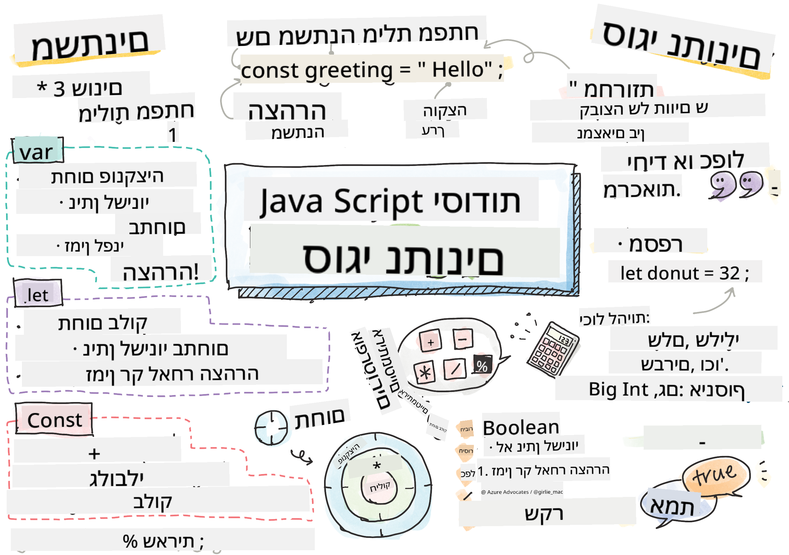

<!--
CO_OP_TRANSLATOR_METADATA:
{
  "original_hash": "fc6aef8ecfdd5b0ad2afa6e6ba52bfde",
  "translation_date": "2025-08-27T20:19:00+00:00",
  "source_file": "2-js-basics/1-data-types/README.md",
  "language_code": "he"
}
-->
# יסודות JavaScript: סוגי נתונים


> סקיצה מאת [Tomomi Imura](https://twitter.com/girlie_mac)

## שאלון לפני השיעור
[שאלון לפני השיעור](https://ff-quizzes.netlify.app/web/quiz/7)

השיעור הזה מכסה את יסודות JavaScript, השפה שמספקת אינטראקטיביות באינטרנט.

> ניתן ללמוד את השיעור הזה ב-[Microsoft Learn](https://docs.microsoft.com/learn/modules/web-development-101-variables/?WT.mc_id=academic-77807-sagibbon)!

[](https://youtube.com/watch?v=JNIXfGiDWM8 "Variables in JavaScript")

[](https://youtube.com/watch?v=AWfA95eLdq8 "Data Types in JavaScript")

> 🎥 לחצו על התמונות למעלה לצפייה בסרטונים על משתנים וסוגי נתונים

בואו נתחיל עם משתנים וסוגי הנתונים שמאכלסים אותם!

## משתנים

משתנים מאחסנים ערכים שניתן להשתמש בהם ולשנותם לאורך הקוד שלכם.

יצירה ו**הצהרה** על משתנה נעשית באמצעות התחביר הבא **[keyword] [name]**. זה מורכב משני חלקים:

- **מילת מפתח**. מילת המפתח יכולה להיות `let` או `var`.  

✅ מילת המפתח `let` הוצגה ב-ES6 ומעניקה למשתנה שלכם מה שנקרא _תחום בלוק_. מומלץ להשתמש ב-`let` במקום `var`. נעמיק בנושא תחומי בלוק בחלקים הבאים.
- **שם המשתנה**, זהו שם שאתם בוחרים בעצמכם.

### משימה - עבודה עם משתנים

1. **הצהירו על משתנה**. בואו נצהיר על משתנה באמצעות מילת המפתח `let`:

    ```javascript
    let myVariable;
    ```

   `myVariable` הוצהר עכשיו באמצעות מילת המפתח `let`. כרגע אין לו ערך.

1. **הקצו ערך**. אחסנו ערך במשתנה באמצעות אופרטור `=` ואחריו הערך הרצוי.

    ```javascript
    myVariable = 123;
    ```

   > הערה: השימוש ב-`=` בשיעור הזה מתייחס ל"אופרטור השמה", המשמש להקצות ערך למשתנה. הוא לא מציין שוויון.

   `myVariable` כעת *אותחל* עם הערך 123.

1. **שפרו את הקוד**. החליפו את הקוד שלכם בהצהרה הבאה.

    ```javascript
    let myVariable = 123;
    ```

    הקוד לעיל נקרא _אתחול מפורש_, כאשר משתנה מוצהר ומוקצה לו ערך באותו הזמן.

1. **שנו את ערך המשתנה**. שנו את ערך המשתנה בדרך הבאה:

   ```javascript
   myVariable = 321;
   ```

   לאחר שמשתנה הוצהר, ניתן לשנות את ערכו בכל נקודה בקוד שלכם באמצעות אופרטור `=` והערך החדש.

   ✅ נסו זאת! ניתן לכתוב JavaScript ישירות בדפדפן שלכם. פתחו חלון דפדפן ועברו לכלי המפתחים. בקונסולה תמצאו שורת פקודה; הקלידו `let myVariable = 123`, לחצו Enter, ואז הקלידו `myVariable`. מה קורה? שימו לב, תלמדו יותר על מושגים אלו בשיעורים הבאים.

## קבועים

הצהרה ואתחול של קבוע פועלים לפי אותם עקרונות כמו משתנה, למעט השימוש במילת המפתח `const`. קבועים בדרך כלל מוכרזים באותיות גדולות.

```javascript
const MY_VARIABLE = 123;
```

קבועים דומים למשתנים, עם שני יוצאים מן הכלל:

- **חייבים להיות בעלי ערך**. קבועים חייבים להיות מאותחלים, אחרת תתרחש שגיאה בעת הרצת הקוד.
- **לא ניתן לשנות את ההפניה**. ההפניה של קבוע לא יכולה להשתנות לאחר האתחול, אחרת תתרחש שגיאה בעת הרצת הקוד. בואו נבחן שני דוגמאות:
   - **ערך פשוט**. הדוגמה הבאה אינה מותרת:
   
      ```javascript
      const PI = 3;
      PI = 4; // not allowed
      ```
 
   - **הפניה לאובייקט מוגנת**. הדוגמה הבאה אינה מותרת:
   
      ```javascript
      const obj = { a: 3 };
      obj = { b: 5 } // not allowed
      ```

    - **ערך האובייקט אינו מוגן**. הדוגמה הבאה מותרת:
    
      ```javascript
      const obj = { a: 3 };
      obj.a = 5;  // allowed
      ```

      בדוגמה זו אתם משנים את ערך האובייקט אך לא את ההפניה עצמה, ולכן זה מותר.

   > הערה, `const` אומר שההפניה מוגנת מפני השמה מחדש. הערך עצמו אינו _בלתי ניתן לשינוי_ ויכול להשתנות, במיוחד אם מדובר במבנה מורכב כמו אובייקט.

## סוגי נתונים

משתנים יכולים לאחסן סוגים רבים ושונים של ערכים, כמו מספרים וטקסט. סוגי הערכים השונים הללו ידועים בשם **סוגי נתונים**. סוגי נתונים הם חלק חשוב בפיתוח תוכנה מכיוון שהם עוזרים למפתחים לקבל החלטות כיצד לכתוב את הקוד וכיצד התוכנה צריכה לפעול. בנוסף, לחלק מסוגי הנתונים יש תכונות ייחודיות שעוזרות לשנות או לחלץ מידע נוסף מתוך ערך.

✅ סוגי נתונים מכונים גם פרימיטיבים של JavaScript, מכיוון שהם סוגי הנתונים ברמה הנמוכה ביותר שמספקת השפה. ישנם 7 סוגי נתונים פרימיטיביים: string, number, bigint, boolean, undefined, null ו-symbol. הקדישו רגע לדמיין מה כל אחד מהפרימיטיבים הללו עשוי לייצג. מהו `zebra`? ומה לגבי `0`? `true`?

### מספרים

בסעיף הקודם, הערך של `myVariable` היה מסוג נתונים מספרי.

`let myVariable = 123;`

משתנים יכולים לאחסן את כל סוגי המספרים, כולל מספרים עשרוניים או שליליים. ניתן להשתמש במספרים גם עם אופרטורים אריתמטיים, שיכוסו ב-[הסעיף הבא](../../../../2-js-basics/1-data-types).

### אופרטורים אריתמטיים

ישנם מספר סוגי אופרטורים לשימוש בעת ביצוע פעולות אריתמטיות, וחלקם מפורטים כאן:

| סימן  | תיאור                                                                   | דוגמה                           |
| ------ | ------------------------------------------------------------------------ | -------------------------------- |
| `+`    | **חיבור**: מחשב את הסכום של שני מספרים                                  | `1 + 2 //התשובה הצפויה היא 3`   |
| `-`    | **חיסור**: מחשב את ההפרש בין שני מספרים                                 | `1 - 2 //התשובה הצפויה היא -1`  |
| `*`    | **כפל**: מחשב את המכפלה של שני מספרים                                  | `1 * 2 //התשובה הצפויה היא 2`   |
| `/`    | **חילוק**: מחשב את המנה של שני מספרים                                  | `1 / 2 //התשובה הצפויה היא 0.5` |
| `%`    | **שארית**: מחשב את השארית מחילוק של שני מספרים                         | `1 % 2 //התשובה הצפויה היא 1`   |

✅ נסו זאת! נסו לבצע פעולה אריתמטית בקונסולה של הדפדפן שלכם. האם התוצאות מפתיעות אתכם?

### מחרוזות

מחרוזות הן קבוצות של תווים שממוקמות בין גרשיים יחידים או כפולים.

- `'זו מחרוזת'`
- `"זו גם מחרוזת"`
- `let myString = 'זו ערך מחרוזת שמאוחסן במשתנה';`

זכרו להשתמש בגרשיים בעת כתיבת מחרוזת, אחרת JavaScript תניח שמדובר בשם משתנה.

### עיצוב מחרוזות

מחרוזות הן טקסטואליות, ולעיתים יידרשו עיצוב.

כדי **לשרשר** שתי מחרוזות או יותר, או לחבר אותן יחד, השתמשו באופרטור `+`.

```javascript
let myString1 = "Hello";
let myString2 = "World";

myString1 + myString2 + "!"; //HelloWorld!
myString1 + " " + myString2 + "!"; //Hello World!
myString1 + ", " + myString2 + "!"; //Hello, World!

```

✅ מדוע `1 + 1 = 2` ב-JavaScript, אבל `'1' + '1' = 11`? חשבו על זה. ומה לגבי `'1' + 1`?

**תבניות מחרוזת** הן דרך נוספת לעצב מחרוזות, אך במקום גרשיים משתמשים ב-backtick. כל דבר שאינו טקסט רגיל חייב להיות ממוקם בתוך תבניות `${ }`. זה כולל כל משתנה שעשוי להיות מחרוזת.

```javascript
let myString1 = "Hello";
let myString2 = "World";

`${myString1} ${myString2}!` //Hello World!
`${myString1}, ${myString2}!` //Hello, World!
```

ניתן להשיג את מטרות העיצוב שלכם עם כל אחת מהשיטות, אך תבניות מחרוזת יכבדו כל רווחים ושבירות שורה.

✅ מתי הייתם משתמשים בתבנית מחרוזת לעומת מחרוזת רגילה?

### בוליאנים

בוליאנים יכולים להיות רק שני ערכים: `true` או `false`. בוליאנים יכולים לעזור לקבל החלטות אילו שורות קוד צריכות לרוץ כאשר תנאים מסוימים מתקיימים. במקרים רבים, [אופרטורים](../../../../2-js-basics/1-data-types) מסייעים בקביעת הערך של בוליאן ולעיתים קרובות תבחינו ותכתבו משתנים שמאותחלים או שערכם מתעדכן באמצעות אופרטור.

- `let myTrueBool = true`
- `let myFalseBool = false`

✅ משתנה יכול להיחשב 'אמתי' אם הוא מוערך כ-bool `true`. באופן מעניין, ב-JavaScript, [כל הערכים הם אמתיים אלא אם כן מוגדרים כ-שקריים](https://developer.mozilla.org/docs/Glossary/Truthy).

---

## 🚀 אתגר

JavaScript ידועה בדרכים המפתיעות שלה לטפל בסוגי נתונים מדי פעם. בצעו מעט מחקר על ה'מלכודות' הללו. לדוגמה: רגישות לאותיות יכולה להפתיע! נסו זאת בקונסולה שלכם: `let age = 1; let Age = 2; age == Age` (מתקבל `false` -- מדוע?). אילו מלכודות נוספות תוכלו למצוא?

## שאלון לאחר השיעור
[שאלון לאחר השיעור](https://ff-quizzes.netlify.app/web/quiz/8)

## סקירה ולימוד עצמי

עיינו ב-[רשימת תרגילי JavaScript הזו](https://css-tricks.com/snippets/javascript/) ונסו אחד מהם. מה למדתם?

## משימה

[תרגול סוגי נתונים](assignment.md)

---

**כתב ויתור**:  
מסמך זה תורגם באמצעות שירות תרגום מבוסס בינה מלאכותית [Co-op Translator](https://github.com/Azure/co-op-translator). למרות שאנו שואפים לדיוק, יש לקחת בחשבון שתרגומים אוטומטיים עשויים להכיל שגיאות או אי דיוקים. המסמך המקורי בשפתו המקורית צריך להיחשב כמקור סמכותי. עבור מידע קריטי, מומלץ להשתמש בתרגום מקצועי על ידי אדם. איננו נושאים באחריות לאי הבנות או לפרשנויות שגויות הנובעות משימוש בתרגום זה.