# יסודות JavaScript: סוגי נתונים

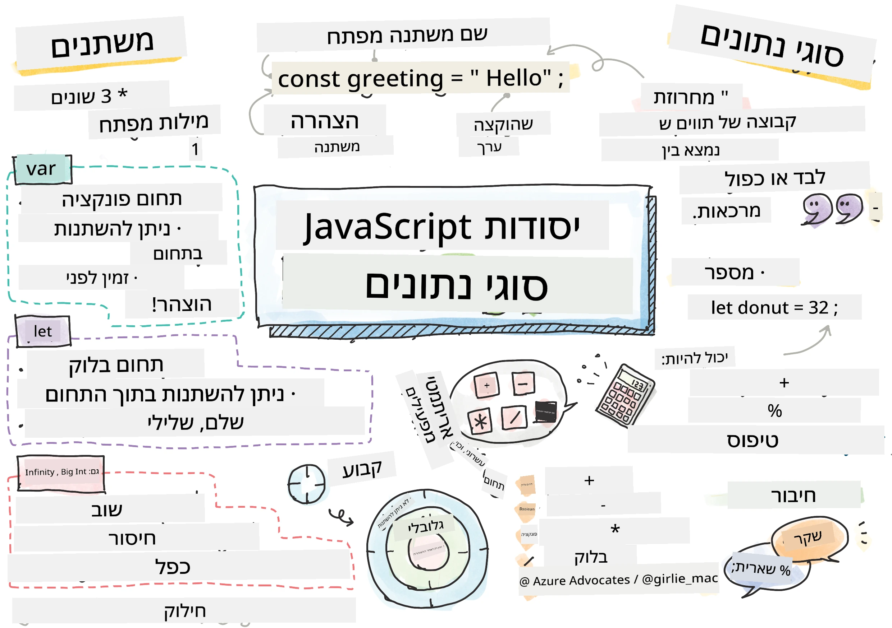
> סקיצה מאת [Tomomi Imura](https://twitter.com/girlie_mac)

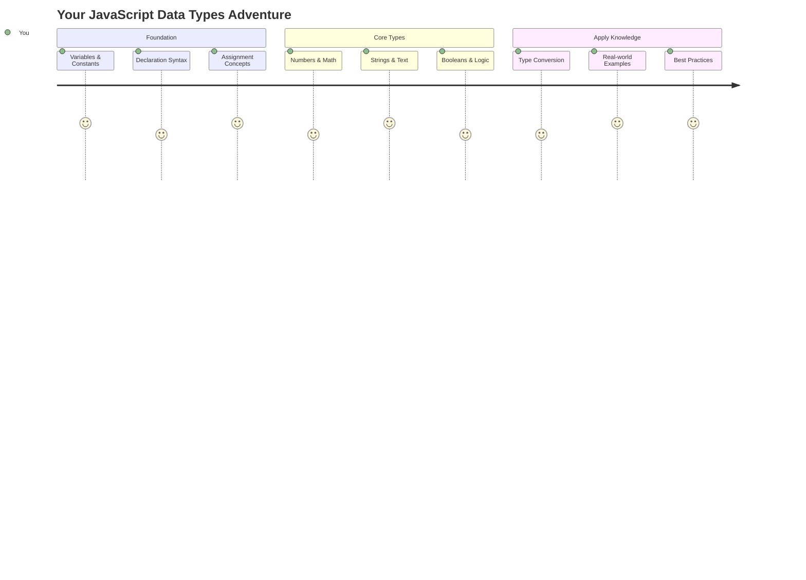

סוגי נתונים הם אחד המושגים הבסיסיים ביותר ב-JavaScript שתיתקלו בהם בכל תוכנית שתכתבו. חשבו על סוגי נתונים כמו מערכת תיוק שהשתמשו בה ספרנים עתיקים באלכסנדריה – היו להם מקומות ספציפיים למגילות המכילות שירה, מתמטיקה ורשומות היסטוריות. JavaScript מארגנת מידע בצורה דומה עם קטגוריות שונות לסוגי נתונים שונים.

בשיעור זה, נחקור את סוגי הנתונים המרכזיים שמאפשרים ל-JavaScript לעבוד. תלמדו כיצד להתמודד עם מספרים, טקסט, ערכים של אמת/שקר, ותבינו מדוע בחירת הסוג הנכון חיונית לתוכניות שלכם. מושגים אלו עשויים להיראות מופשטים בהתחלה, אך עם תרגול הם יהפכו לטבע שני.

הבנת סוגי נתונים תבהיר את כל השאר ב-JavaScript. בדיוק כמו שאדריכלים צריכים להבין את החומרים השונים לפני שהם בונים קתדרלה, יסודות אלו יתמכו בכל מה שתבנו בהמשך.

## שאלון לפני השיעור
[שאלון לפני השיעור](https://ff-quizzes.netlify.app/web/)

שיעור זה מכסה את יסודות JavaScript, השפה שמספקת אינטראקטיביות באינטרנט.

> ניתן לקחת את השיעור הזה ב-[Microsoft Learn](https://docs.microsoft.com/learn/modules/web-development-101-variables/?WT.mc_id=academic-77807-sagibbon)!

[](https://youtube.com/watch?v=JNIXfGiDWM8 "Variables in JavaScript")

[](https://youtube.com/watch?v=AWfA95eLdq8 "Data Types in JavaScript")

> 🎥 לחצו על התמונות למעלה לצפייה בסרטונים על משתנים וסוגי נתונים

בואו נתחיל עם משתנים וסוגי הנתונים שמאכלסים אותם!

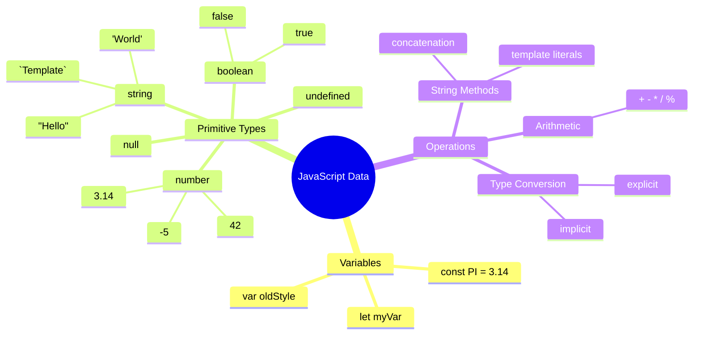

## משתנים

משתנים הם אבני הבניין הבסיסיות בתכנות. כמו הצנצנות המסומנות שהשתמשו בהן אלכימאים מימי הביניים לאחסון חומרים שונים, משתנים מאפשרים לכם לאחסן מידע ולתת לו שם תיאורי כך שתוכלו להתייחס אליו מאוחר יותר. צריכים לזכור את גיל של מישהו? אחסנו אותו במשתנה בשם `age`. רוצים לעקוב אחרי שם משתמש? שמרו אותו במשתנה בשם `userName`.

נתמקד בגישה המודרנית ליצירת משתנים ב-JavaScript. הטכניקות שתלמדו כאן מייצגות שנים של התפתחות השפה ופרקטיקות מומלצות שפותחו על ידי קהילת המתכנתים.

יצירה ו**הצהרה** על משתנה כוללת את התחביר הבא **[keyword] [name]**. זה מורכב משני חלקים:

- **מילת מפתח**. השתמשו ב-`let` עבור משתנים שיכולים להשתנות, או ב-`const` עבור ערכים שנשארים קבועים.
- **שם המשתנה**, זהו שם תיאורי שאתם בוחרים בעצמכם.

✅ מילת המפתח `let` הוצגה ב-ES6 ומעניקה למשתנה שלכם מה שנקרא _block scope_. מומלץ להשתמש ב-`let` או `const` במקום מילת המפתח הישנה `var`. נעמיק בנושא block scopes בחלקים הבאים.

### משימה - עבודה עם משתנים

1. **הצהירו על משתנה**. בואו נתחיל ביצירת המשתנה הראשון שלנו:

    ```javascript
    let myVariable;
    ```

   **מה זה משיג:**
   - זה אומר ל-JavaScript ליצור מקום אחסון בשם `myVariable`
   - JavaScript מקצה מקום בזיכרון עבור משתנה זה
   - למשתנה כרגע אין ערך (undefined)

2. **תנו לו ערך**. עכשיו נשים משהו במשתנה שלנו:

    ```javascript
    myVariable = 123;
    ```

   **איך עובד ההקצאה:**
   - האופרטור `=` מקצה את הערך 123 למשתנה שלנו
   - המשתנה עכשיו מכיל את הערך הזה במקום להיות undefined
   - תוכלו להתייחס לערך הזה בכל הקוד שלכם באמצעות `myVariable`

   > הערה: השימוש ב-`=` בשיעור זה אומר שאנחנו משתמשים ב"אופרטור הקצאה", המשמש להקצות ערך למשתנה. זה לא מציין שוויון.

3. **עשו זאת בצורה חכמה**. למעשה, בואו נשלב את שני השלבים:

    ```javascript
    let myVariable = 123;
    ```

    **גישה זו יעילה יותר:**
    - אתם מצהירים על המשתנה ומקצים ערך במשפט אחד
    - זו הפרקטיקה הסטנדרטית בקרב מתכנתים
    - זה מקצר את אורך הקוד תוך שמירה על בהירות

4. **שנו את דעתכם**. מה אם נרצה לאחסן מספר אחר?

   ```javascript
   myVariable = 321;
   ```

   **הבנת הקצאה מחדש:**
   - המשתנה עכשיו מכיל 321 במקום 123
   - הערך הקודם מוחלף – משתנים מאחסנים רק ערך אחד בכל פעם
   - תכונה זו של שינוי היא מאפיין מרכזי של משתנים שהוצהרו עם `let`

   ✅ נסו זאת! תוכלו לכתוב JavaScript ישירות בדפדפן שלכם. פתחו חלון דפדפן ועברו לכלי המפתחים. בקונסולה תמצאו שורת פקודה; הקלידו `let myVariable = 123`, לחצו על Enter, ואז הקלידו `myVariable`. מה קורה? שימו לב, תלמדו יותר על מושגים אלו בשיעורים הבאים.

### 🧠 **בדיקת שליטה במשתנים: להרגיש בנוח**

**בואו נראה איך אתם מרגישים לגבי משתנים:**
- האם תוכלו להסביר את ההבדל בין הצהרה על משתנה לבין הקצאת ערך למשתנה?
- מה קורה אם תנסו להשתמש במשתנה לפני שהצהרתם עליו?
- מתי תבחרו ב-`let` במקום ב-`const` עבור משתנה?

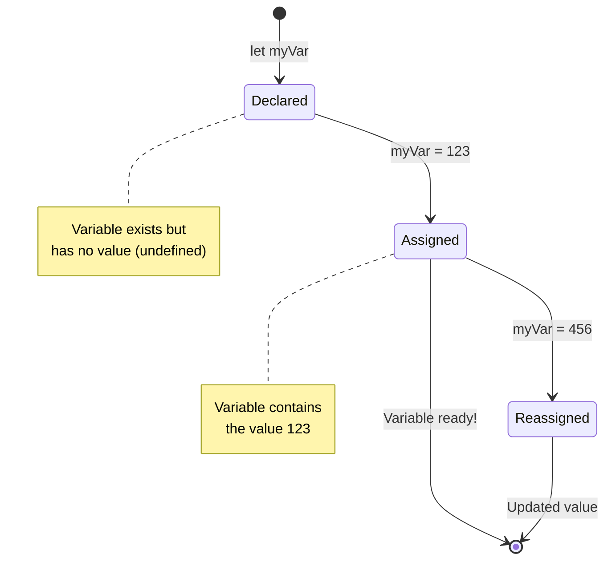

> **טיפ מהיר**: חשבו על משתנים כקופסאות אחסון מסומנות. אתם יוצרים את הקופסה (`let`), שמים בה משהו (`=`), ויכולים להחליף את התוכן מאוחר יותר אם צריך!

## קבועים

לפעמים אתם צריכים לאחסן מידע שלא אמור להשתנות במהלך ביצוע התוכנית. חשבו על קבועים כמו העקרונות המתמטיים שאוקלידס קבע ביוון העתיקה – ברגע שהוכחו ותועדו, הם נשארו קבועים לעיון עתידי.

קבועים עובדים באופן דומה למשתנים, אך עם הגבלה חשובה: ברגע שהקצתם להם ערך, לא ניתן לשנות אותו. תכונה זו של אי-שינוי עוזרת למנוע שינויים מקריים בערכים קריטיים בתוכנית שלכם.

הצהרה ואתחול של קבוע פועלים לפי אותם עקרונות כמו משתנה, עם יוצא דופן של מילת המפתח `const`. קבועים בדרך כלל מוכרזים באותיות גדולות.

```javascript
const MY_VARIABLE = 123;
```

**מה הקוד הזה עושה:**
- **יוצר** קבוע בשם `MY_VARIABLE` עם הערך 123
- **משתמש** בקונבנציה של שמות באותיות גדולות עבור קבועים
- **מונע** כל שינוי עתידי בערך זה

לקבועים יש שני כללים עיקריים:

- **חובה לתת להם ערך מיד** – לא ניתן להצהיר על קבועים ריקים!
- **לא ניתן לשנות את הערך שלהם** – JavaScript תזרוק שגיאה אם תנסו. בואו נראה למה הכוונה:

   **ערך פשוט** - הדבר הבא אינו מותר:
   
      ```javascript
      const PI = 3;
      PI = 4; // לא מותר
      ```

   **מה שצריך לזכור:**
   - **ניסיונות** להקצות מחדש לקבוע יגרמו לשגיאה
   - **מגן** על ערכים חשובים משינויים מקריים
   - **מבטיח** שהערך יישאר עקבי לאורך כל התוכנית
 
   **הפניה לאובייקט מוגנת** - הדבר הבא אינו מותר:
   
      ```javascript
      const obj = { a: 3 };
      obj = { b: 5 } // לא מותר
      ```

   **הבנת מושגים אלו:**
   - **מונע** החלפת האובייקט כולו באובייקט חדש
   - **מגן** על ההפניה לאובייקט המקורי
   - **שומר** על זהות האובייקט בזיכרון

    **ערך האובייקט אינו מוגן** - הדבר הבא מותר:
    
      ```javascript
      const obj = { a: 3 };
      obj.a = 5;  // מותר
      ```

      **פירוט מה קורה כאן:**
      - **משנה** את ערך המאפיין בתוך האובייקט
      - **שומר** על אותה הפניה לאובייקט
      - **מדגים** שתוכן האובייקט יכול להשתנות בזמן שההפניה נשארת קבועה

   > שימו לב, `const` אומר שההפניה מוגנת מהקצאה מחדש. הערך עצמו אינו _בלתי ניתן לשינוי_ ויכול להשתנות, במיוחד אם מדובר במבנה מורכב כמו אובייקט.

## סוגי נתונים

JavaScript מארגנת מידע לקטגוריות שונות הנקראות סוגי נתונים. מושג זה דומה לאופן שבו מלומדים עתיקים קטלגו ידע – אריסטו הבחין בין סוגי חשיבה שונים, מתוך הבנה שעקרונות לוגיים לא יכולים להיות מיושמים באופן אחיד על שירה, מתמטיקה ופילוסופיה טבעית.

סוגי נתונים חשובים כי פעולות שונות פועלות עם סוגי מידע שונים. בדיוק כמו שלא ניתן לבצע חישובים על שם של אדם או לסדר לפי סדר אלפביתי משוואה מתמטית, JavaScript דורשת את סוג הנתונים המתאים לכל פעולה. הבנת זה מונעת שגיאות והופכת את הקוד שלכם לאמין יותר.

משתנים יכולים לאחסן סוגים רבים ושונים של ערכים, כמו מספרים וטקסט. סוגי הערכים השונים הללו ידועים כ-**סוגי נתונים**. סוגי נתונים הם חלק חשוב בפיתוח תוכנה כי הם עוזרים למפתחים לקבל החלטות על איך הקוד צריך להיכתב ואיך התוכנה צריכה לפעול. יתר על כן, לחלק מסוגי הנתונים יש תכונות ייחודיות שעוזרות לשנות או לחלץ מידע נוסף מערך.

✅ סוגי נתונים נקראים גם פרימיטיבים של JavaScript, מכיוון שהם סוגי הנתונים ברמה הנמוכה ביותר שמספקת השפה. ישנם 7 סוגי נתונים פרימיטיביים: string, number, bigint, boolean, undefined, null ו-symbol. קחו רגע לדמיין מה כל אחד מהפרימיטיבים הללו עשוי לייצג. מה זה `zebra`? מה לגבי `0`? `true`?

### מספרים

מספרים הם סוג הנתונים הפשוט ביותר ב-JavaScript. בין אם אתם עובדים עם מספרים שלמים כמו 42, מספרים עשרוניים כמו 3.14, או מספרים שליליים כמו -5, JavaScript מטפלת בהם באופן אחיד.

זוכרים את המשתנה שלנו מקודם? ה-123 שאחסנו היה למעשה סוג נתונים של מספר:

```javascript
let myVariable = 123;
```

**מאפיינים מרכזיים:**
- JavaScript מזהה באופן אוטומטי ערכים מספריים
- ניתן לבצע פעולות מתמטיות עם משתנים אלו
- אין צורך בהצהרת סוג מפורשת

משתנים יכולים לאחסן את כל סוגי המספרים, כולל עשרוניים או מספרים שליליים. מספרים יכולים גם לשמש עם אופרטורים אריתמטיים, מכוסים ב-[החלק הבא](../../../../2-js-basics/1-data-types).

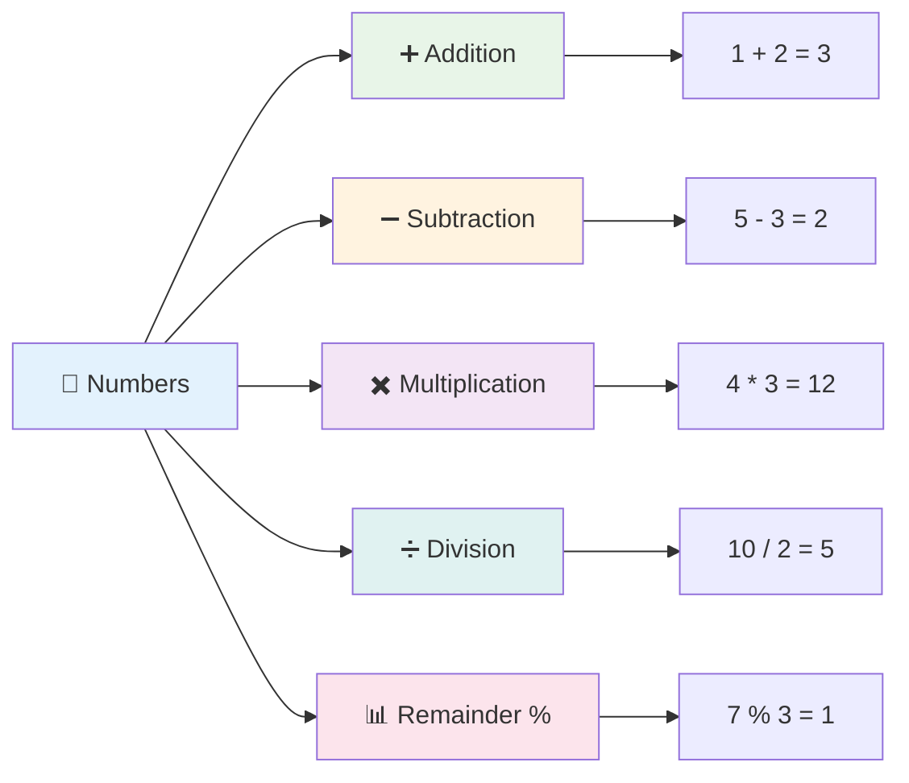

### אופרטורים אריתמטיים

אופרטורים אריתמטיים מאפשרים לכם לבצע חישובים מתמטיים ב-JavaScript. אופרטורים אלו פועלים כפי שהייתם מצפים מהמתמטיקה המסורתית: פלוס לחיבור, מינוס לחיסור, וכן הלאה.

ישנם מספר סוגי אופרטורים לשימוש בעת ביצוע פונקציות אריתמטיות, וחלקם מפורטים כאן:

| סימן | תיאור                                                                  | דוגמה                          |
| ------ | ------------------------------------------------------------------------ | -------------------------------- |
| `+`    | **חיבור**: מחשב את הסכום של שני מספרים                                  | `1 + 2 //התשובה הצפויה היא 3`   |
| `-`    | **חיסור**: מחשב את ההפרש של שני מספרים                                  | `1 - 2 //התשובה הצפויה היא -1`  |
| `*`    | **כפל**: מחשב את המכפלה של שני מספרים                                   | `1 * 2 //התשובה הצפויה היא 2`   |
| `/`    | **חילוק**: מחשב את המנה של שני מספרים                                   | `1 / 2 //התשובה הצפויה היא 0.5` |
| `%`    | **שארית**: מחשב את השארית מחילוק של שני מספרים                          | `1 % 2 //התשובה הצפויה היא 1`   |

✅ נסו זאת! נסו פעולה אריתמטית בקונסולה של הדפדפן שלכם. האם התוצאות מפתיעות אתכם?

### 🧮 **בדיקת מיומנויות מתמטיות: חישוב בביטחון**

**בדקו את הבנתכם באריתמטיקה:**
- מה ההבדל בין `/` (חילוק) ל-`%` (שארית)?
- האם תוכלו לנבא מה שווה `10 % 3`? (רמז: זה לא 3.33...)
- מדוע אופרטור השארית עשוי להיות שימושי בתכנות?

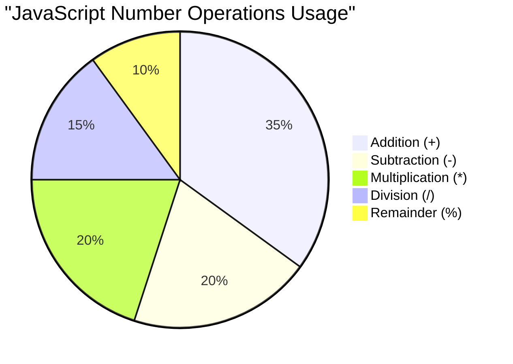

> **תובנה מעשית**: אופרטור השארית (%) שימושי מאוד לבדוק אם מספרים זוגיים/אי-זוגיים, ליצור דפוסים, או לעבור על מערכים!

### מחרוזות

ב-JavaScript, נתונים טקסטואליים מיוצגים כמחרוזות. המונח "מחרוזת" מגיע מהמושג של תווים המחוברים יחד ברצף, בדומה לאופן שבו סופרים במנזרים מימי הביניים חיברו אותיות ליצירת מילים ומשפטים בכתבי היד שלהם.

מחרוזות הן בסיסיות לפיתוח אתרים. כל פיסת טקסט שמוצגת באתר – שמות משתמשים, תוויות כפתורים, הודעות שגיאה, תוכן – מטופלת כנתוני מחרוזת. הבנת מחרוזות חיונית ליצירת ממשקי משתמש פונקציונליים.

מחרוזות הן קבוצות של תווים שנמצאות בין גרשיים יחידים או כפולים.

```javascript
'This is a string'
"This is also a string"
let myString = 'This is a string value stored in a variable';
```

**הבנת מושגים אלו:**
- **משתמש** בגרשיים יחידים `'` או כפולים `"` כדי להגדיר מחרוזות
- **מאחסן** נתוני טקסט שיכולים לכלול אותיות, מספרים וסמלים
- **מקצה** ערכי מחרוזת למשתנים לשימוש מאוחר יותר
- **דורש** גרשיים כדי להבדיל טקסט משמות משתנים

זכרו להשתמש בגרשיים כשכותבים מחרוזת, אחרת JavaScript תניח שזה שם משתנה.

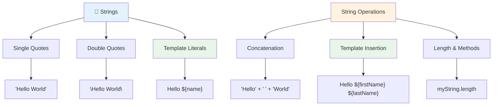

### עיצוב מחרוזות

מניפולציה של מחרוזות מאפשרת לכם לשלב אלמנטים טקסטואליים, לשלב משתנים וליצור תוכן דינמי שמגיב למצב התוכנית. טכניקה זו מאפשרת לכם לבנות טקסט בצורה תוכניתית.

לעיתים קרובות תצטרכו לחבר מספר מחרוזות יחד – תהליך זה נקרא שרשור.
כדי **לשרשר** שני מחרוזות או יותר, או לחבר אותן יחד, השתמשו באופרטור `+`.

```javascript
let myString1 = "Hello";
let myString2 = "World";

myString1 + myString2 + "!"; //HelloWorld!
myString1 + " " + myString2 + "!"; //Hello World!
myString1 + ", " + myString2 + "!"; //Hello, World!
```

**שלב אחר שלב, הנה מה שקורה:**
- **משלב** מספר מחרוזות באמצעות אופרטור `+`
- **מחבר** מחרוזות ישירות ללא רווחים בדוגמה הראשונה
- **מוסיף** רווחים `" "` בין המחרוזות לקריאות טובה יותר
- **מכניס** סימני פיסוק כמו פסיקים ליצירת עיצוב נכון

✅ למה `1 + 1 = 2` ב-JavaScript, אבל `'1' + '1' = 11`? תחשבו על זה. ומה לגבי `'1' + 1`?

**תבניות מחרוזת** הן דרך נוספת לעצב מחרוזות, אך במקום מרכאות, משתמשים ב-backtick. כל דבר שאינו טקסט רגיל חייב להיות בתוך תבניות `${ }`. זה כולל כל משתנה שעשוי להיות מחרוזת.

```javascript
let myString1 = "Hello";
let myString2 = "World";

`${myString1} ${myString2}!` //Hello World!
`${myString1}, ${myString2}!` //Hello, World!
```

**בואו נבין כל חלק:**
- **משתמשים** ב-backticks `` ` `` במקום מרכאות רגילות ליצירת תבניות מחרוזת
- **משתמשים** במשתנים ישירות באמצעות תחביר התבנית `${}`
- **שומרים** על רווחים ועיצוב בדיוק כפי שנכתב
- **מספקים** דרך נקייה יותר ליצירת מחרוזות מורכבות עם משתנים

ניתן להשיג את מטרות העיצוב שלכם עם כל אחת מהשיטות, אך תבניות מחרוזת ישמרו על רווחים ושבירות שורה.

✅ מתי תשתמשו בתבנית מחרוזת לעומת מחרוזת רגילה?

### 🔤 **בדיקת שליטה במחרוזות: ביטחון במניפולציות טקסט**

**העריכו את כישורי המחרוזת שלכם:**
- האם אתם יכולים להסביר למה `'1' + '1'` שווה ל-`'11'` ולא ל-`2`?
- איזו שיטה לעבודה עם מחרוזות נראית לכם קריאה יותר: שרשור או תבניות מחרוזת?
- מה קורה אם שוכחים לשים מרכאות סביב מחרוזת?

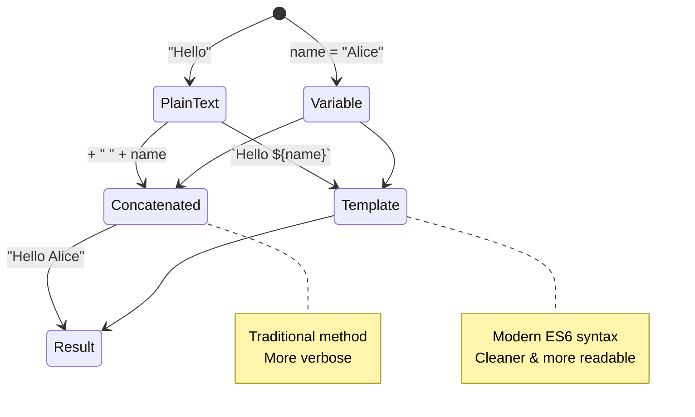

> **טיפ מקצועי**: תבניות מחרוזת בדרך כלל עדיפות לבניית מחרוזות מורכבות כי הן קריאות יותר ומטפלות יפה במחרוזות מרובות שורות!

### בוליאנים

בוליאנים מייצגים את הצורה הפשוטה ביותר של נתונים: הם יכולים להכיל רק אחד משני ערכים – `true` או `false`. מערכת לוגיקה בינארית זו נובעת מעבודתו של ג'ורג' בול, מתמטיקאי מהמאה ה-19 שפיתח את האלגברה הבוליאנית.

למרות פשטותם, בוליאנים הם חיוניים ללוגיקת תוכנה. הם מאפשרים לקוד שלכם לקבל החלטות על סמך תנאים – האם משתמש מחובר, אם כפתור נלחץ, או אם קריטריונים מסוימים מתקיימים.

בוליאנים יכולים להיות רק שני ערכים: `true` או `false`. בוליאנים יכולים לעזור להחליט אילו שורות קוד ירוצו כאשר תנאים מסוימים מתקיימים. במקרים רבים, [אופרטורים](../../../../2-js-basics/1-data-types) מסייעים בקביעת הערך של בוליאן ותבחינו לעיתים קרובות במשתנים שמאותחלים או שערכיהם מתעדכנים באמצעות אופרטור.

```javascript
let myTrueBool = true;
let myFalseBool = false;
```

**בדוגמה למעלה, עשינו:**
- **יצרנו** משתנה שמאחסן את הערך הבוליאני `true`
- **הדגמנו** איך לאחסן את הערך הבוליאני `false`
- **השתמשנו** במילות המפתח המדויקות `true` ו-`false` (ללא מרכאות)
- **הכנו** את המשתנים הללו לשימוש במשפטי תנאי

✅ משתנה יכול להיחשב 'truthy' אם הוא מוערך כבוליאן `true`. מעניין, ב-JavaScript, [כל הערכים הם truthy אלא אם כן הוגדרו כ-falsy](https://developer.mozilla.org/docs/Glossary/Truthy).

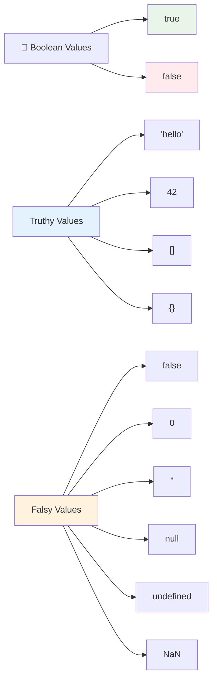

### 🎯 **בדיקת לוגיקה בוליאנית: כישורי קבלת החלטות**

**בדקו את הבנתכם בבוליאנים:**
- למה לדעתכם ב-JavaScript יש ערכים "truthy" ו-"falsy" מעבר ל-`true` ו-`false`?
- האם אתם יכולים לנחש איזה מהבאים הוא falsy: `0`, `"0"`, `[]`, `"false"`?
- איך בוליאנים יכולים להיות שימושיים בשליטה על זרימת התוכנית?

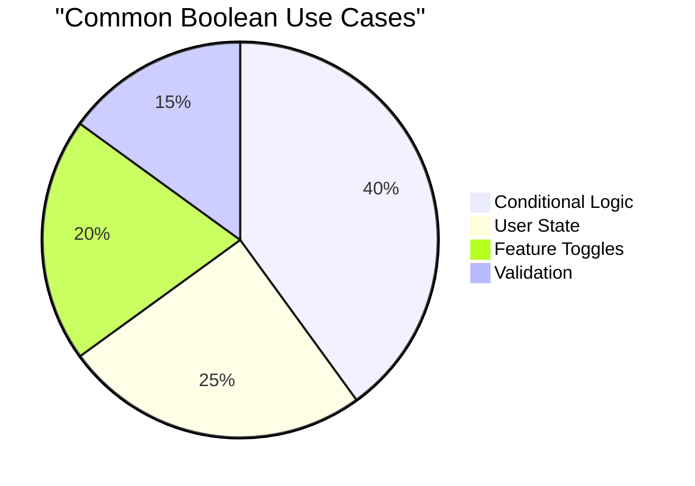

> **זכרו**: ב-JavaScript, רק 6 ערכים הם falsy: `false`, `0`, `""`, `null`, `undefined`, ו-`NaN`. כל השאר הם truthy!

---

## 📊 **סיכום ערכת הכלים של סוגי הנתונים שלכם**

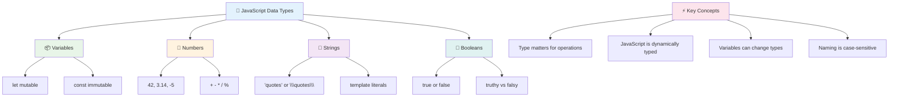

## אתגר סוכן GitHub Copilot 🚀

השתמשו במצב סוכן כדי להשלים את האתגר הבא:

**תיאור:** צרו מנהל מידע אישי שמדגים את כל סוגי הנתונים שלמדתם בשיעור זה תוך טיפול בתרחישי נתונים בעולם האמיתי.

**הנחיה:** בנו תוכנית JavaScript שיוצרת אובייקט פרופיל משתמש המכיל: שם של אדם (מחרוזת), גיל (מספר), סטטוס סטודנט (בוליאני), צבעים אהובים כמערך, ואובייקט כתובת עם מאפייני רחוב, עיר ומיקוד. כללו פונקציות להצגת מידע הפרופיל ולעדכון שדות בודדים. ודאו שאתם מדגימים שרשור מחרוזות, תבניות מחרוזת, פעולות אריתמטיות עם הגיל, ולוגיקה בוליאנית עבור סטטוס הסטודנט.

למדו עוד על [מצב סוכן](https://code.visualstudio.com/blogs/2025/02/24/introducing-copilot-agent-mode) כאן.

## 🚀 אתגר

ל-JavaScript יש כמה התנהגויות שיכולות להפתיע מפתחים. הנה דוגמה קלאסית לחקור: נסו להקליד זאת בקונסול של הדפדפן שלכם: `let age = 1; let Age = 2; age == Age` ושימו לב לתוצאה. זה מחזיר `false` – האם אתם יכולים להבין למה?

זהו אחד מהרבה התנהגויות של JavaScript שכדאי להבין. היכרות עם הניואנסים הללו תעזור לכם לכתוב קוד אמין יותר ולפתור בעיות בצורה יעילה יותר.

## חידון לאחר השיעור
[חידון לאחר השיעור](https://ff-quizzes.netlify.app)

## סקירה ולמידה עצמית

עיינו ב-[רשימת תרגילי JavaScript הזו](https://css-tricks.com/snippets/javascript/) ונסו אחד מהם. מה למדתם?

## משימה

[תרגול סוגי נתונים](assignment.md)

## 🚀 ציר הזמן לשליטה בסוגי נתונים ב-JavaScript

### ⚡ **מה תוכלו לעשות ב-5 הדקות הבאות**
- [ ] פתחו את קונסול הדפדפן וצרו 3 משתנים עם סוגי נתונים שונים
- [ ] נסו את האתגר: `let age = 1; let Age = 2; age == Age` וגלו למה זה false
- [ ] תרגלו שרשור מחרוזות עם השם שלכם והמספר האהוב עליכם
- [ ] בדקו מה קורה כשמוסיפים מספר למחרוזת

### 🎯 **מה תוכלו להשיג בשעה הקרובה**
- [ ] השלימו את החידון שלאחר השיעור וסקרו מושגים מבלבלים
- [ ] צרו מחשבון קטן שמוסיף, מחסר, מכפיל ומחלק שני מספרים
- [ ] בנו מעצב שמות פשוט באמצעות תבניות מחרוזת
- [ ] חקרו את ההבדלים בין אופרטורים `==` ו-`===`
- [ ] תרגלו המרה בין סוגי נתונים שונים

### 📅 **הבסיס שלכם ל-JavaScript בשבוע הקרוב**
- [ ] השלימו את המשימה בביטחון ויצירתיות
- [ ] צרו אובייקט פרופיל אישי תוך שימוש בכל סוגי הנתונים שנלמדו
- [ ] תרגלו עם [תרגילי JavaScript מ-CSS-Tricks](https://css-tricks.com/snippets/javascript/)
- [ ] בנו מאמת טפסים פשוט באמצעות לוגיקה בוליאנית
- [ ] נסו לעבוד עם מערכים ואובייקטים (הצצה לשיעורים הבאים)
- [ ] הצטרפו לקהילת JavaScript ושאלו שאלות על סוגי נתונים

### 🌟 **הטרנספורמציה שלכם בחודש הקרוב**
- [ ] שלבו את הידע על סוגי נתונים בפרויקטים תכנותיים גדולים יותר
- [ ] הבינו מתי ולמה להשתמש בכל סוג נתונים ביישומים אמיתיים
- [ ] עזרו למתחילים אחרים להבין את יסודות JavaScript
- [ ] בנו אפליקציה קטנה שמנהלת סוגי נתונים שונים של משתמשים
- [ ] חקרו מושגים מתקדמים כמו coercion ו-strict equality
- [ ] תרמו לפרויקטים בקוד פתוח ב-JavaScript עם שיפורי תיעוד

### 🧠 **בדיקת שליטה סופית בסוגי נתונים**

**חגגו את הבסיס שלכם ב-JavaScript:**
- איזה סוג נתונים הפתיע אתכם הכי הרבה מבחינת ההתנהגות שלו?
- עד כמה אתם מרגישים בנוח להסביר משתנים לעומת קבועים לחבר?
- מה הדבר הכי מעניין שגיליתם על מערכת סוגי הנתונים של JavaScript?
- איזו אפליקציה בעולם האמיתי אתם יכולים לדמיין לבנות עם היסודות הללו?

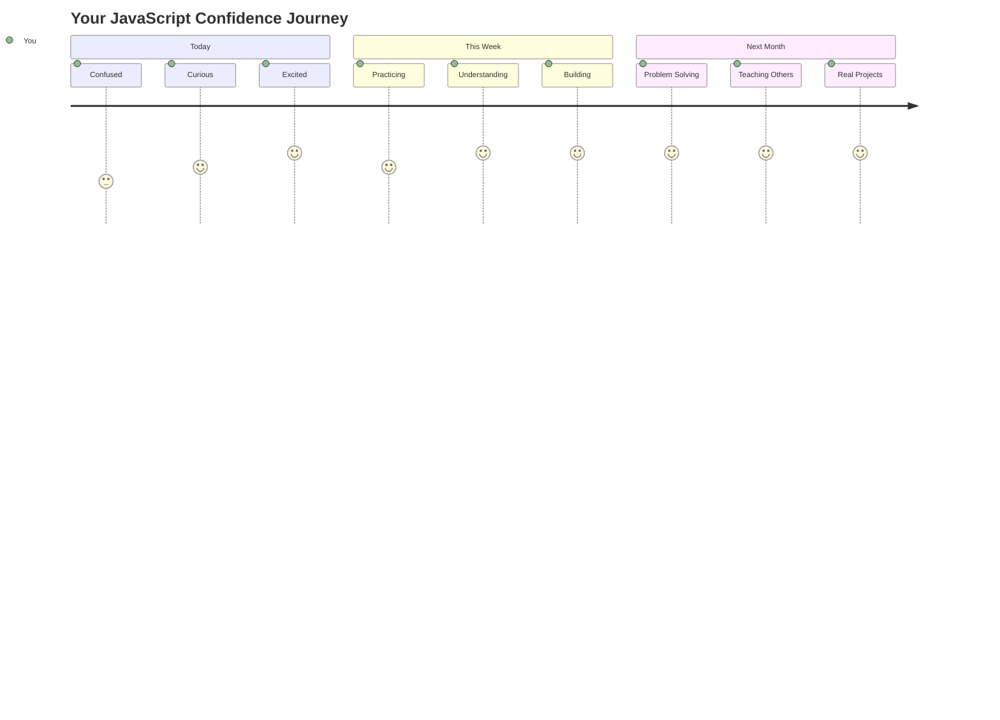

> 💡 **בנייתם את הבסיס!** הבנת סוגי נתונים היא כמו ללמוד את האלפבית לפני כתיבת סיפורים. כל תוכנית JavaScript שתכתבו אי פעם תשתמש במושגים בסיסיים אלו. עכשיו יש לכם את אבני הבניין ליצירת אתרים אינטראקטיביים, אפליקציות דינמיות, ולפתור בעיות בעולם האמיתי עם קוד. ברוכים הבאים לעולם המופלא של JavaScript! 🎉

---

**הצהרת אחריות**:  
מסמך זה תורגם באמצעות שירות תרגום AI [Co-op Translator](https://github.com/Azure/co-op-translator). למרות שאנו שואפים לדיוק, יש לקחת בחשבון שתרגומים אוטומטיים עשויים להכיל שגיאות או אי דיוקים. המסמך המקורי בשפתו המקורית צריך להיחשב כמקור סמכותי. עבור מידע קריטי, מומלץ להשתמש בתרגום מקצועי אנושי. איננו אחראים לאי הבנות או פירושים שגויים הנובעים משימוש בתרגום זה.