<!--
CO_OP_TRANSLATOR_METADATA:
{
  "original_hash": "71f7d7dafa1c7194d79ddac87f669ff9",
  "translation_date": "2025-11-04T02:11:01+00:00",
  "source_file": "2-js-basics/2-functions-methods/README.md",
  "language_code": "he"
}
-->
# יסודות JavaScript: שיטות ופונקציות


> סקיצה מאת [Tomomi Imura](https://twitter.com/girlie_mac)

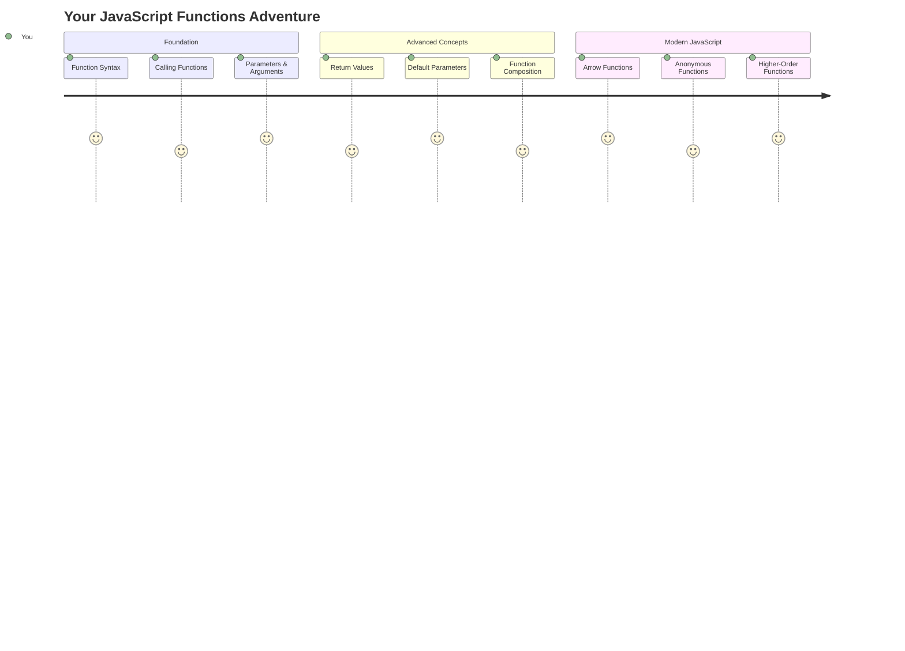

## שאלון לפני השיעור
[שאלון לפני השיעור](https://ff-quizzes.netlify.app)

כתיבת אותו קוד שוב ושוב היא אחת התסכולים הנפוצים ביותר בתכנות. פונקציות פותרות את הבעיה הזו בכך שהן מאפשרות לך לארוז קוד לבלוקים שניתן להשתמש בהם מחדש. חשבו על פונקציות כמו החלקים הסטנדרטיים שהפכו את פס הייצור של הנרי פורד למהפכני – ברגע שיצרתם רכיב אמין, תוכלו להשתמש בו בכל מקום שצריך בלי לבנות מחדש מאפס.

פונקציות מאפשרות לך לאגד חלקי קוד כך שתוכל להשתמש בהם שוב ושוב בתוכנית שלך. במקום להעתיק ולהדביק את אותה לוגיקה בכל מקום, תוכל ליצור פונקציה פעם אחת ולהפעיל אותה בכל פעם שתצטרך. גישה זו שומרת על הקוד שלך מאורגן ומקלה מאוד על עדכונים.

בשיעור זה תלמדו כיצד ליצור פונקציות משלכם, להעביר להן מידע ולקבל תוצאות שימושיות בחזרה. תגלו את ההבדל בין פונקציות לשיטות, תלמדו גישות תחביר מודרניות ותראו כיצד פונקציות יכולות לעבוד עם פונקציות אחרות. נבנה את הרעיונות הללו צעד אחר צעד.

[](https://youtube.com/watch?v=XgKsD6Zwvlc "Methods and Functions")

> 🎥 לחצו על התמונה למעלה לצפייה בסרטון על שיטות ופונקציות.

> ניתן לקחת את השיעור הזה ב-[Microsoft Learn](https://docs.microsoft.com/learn/modules/web-development-101-functions/?WT.mc_id=academic-77807-sagibbon)!

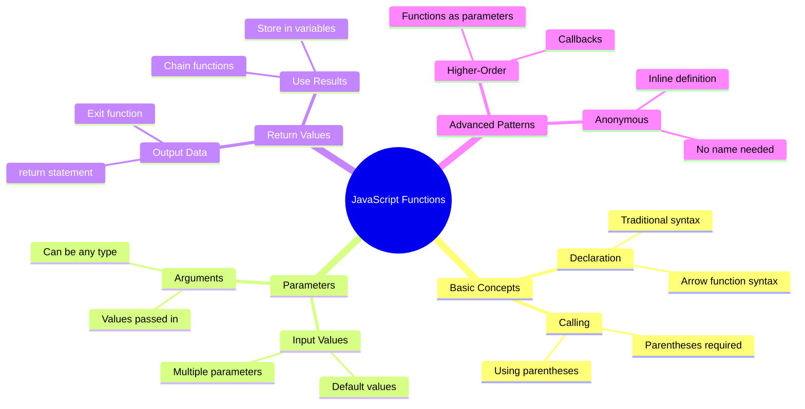

## פונקציות

פונקציה היא בלוק קוד עצמאי שמבצע משימה ספציפית. היא מכילה לוגיקה שניתן להפעיל בכל פעם שצריך.

במקום לכתוב את אותו קוד מספר פעמים בתוכנית שלך, תוכל לארוז אותו בפונקציה ולהפעיל אותה בכל פעם שתצטרך. גישה זו שומרת על הקוד שלך נקי ומקלה מאוד על עדכונים. חשבו על האתגר של תחזוקה אם הייתם צריכים לשנות לוגיקה שהייתה מפוזרת ב-20 מקומות שונים בקוד שלכם.

מתן שמות תיאוריים לפונקציות שלכם הוא חיוני. פונקציה עם שם טוב מעבירה את מטרתה בצורה ברורה – כשאתם רואים `cancelTimer()`, אתם מיד מבינים מה היא עושה, בדיוק כמו שכפתור עם תווית ברורה אומר לכם בדיוק מה יקרה כשתלחצו עליו.

## יצירה והפעלה של פונקציה

בואו נבחן כיצד ליצור פונקציה. התחביר עוקב אחר תבנית עקבית:

```javascript
function nameOfFunction() { // function definition
 // function definition/body
}
```

בואו נפרק את זה:
- מילת המפתח `function` אומרת ל-JavaScript "היי, אני יוצר פונקציה!"
- `nameOfFunction` הוא המקום שבו אתם נותנים לפונקציה שלכם שם תיאורי
- הסוגריים `()` הם המקום שבו תוכלו להוסיף פרמטרים (נגיע לזה בקרוב)
- הסוגריים המסולסלים `{}` מכילים את הקוד בפועל שרץ כשאתם מפעילים את הפונקציה

בואו ניצור פונקציה פשוטה לברכת שלום כדי לראות את זה בפעולה:

```javascript
function displayGreeting() {
  console.log('Hello, world!');
}
```

הפונקציה הזו מדפיסה "Hello, world!" לקונסולה. ברגע שהגדרתם אותה, תוכלו להשתמש בה כמה פעמים שתרצו.

כדי להפעיל (או "לקרוא") לפונקציה שלכם, כתבו את שמה ואחריו סוגריים. JavaScript מאפשרת לכם להגדיר את הפונקציה לפני או אחרי שאתם מפעילים אותה – מנוע ה-JavaScript יטפל בסדר ההפעלה.

```javascript
// calling our function
displayGreeting();
```

כשאתם מריצים את השורה הזו, היא מפעילה את כל הקוד בתוך הפונקציה `displayGreeting`, ומציגה "Hello, world!" בקונסולה של הדפדפן שלכם. תוכלו לקרוא לפונקציה הזו שוב ושוב.

### 🧠 **בדיקת יסודות הפונקציה: בניית הפונקציות הראשונות שלכם**

**בואו נראה איך אתם מרגישים לגבי פונקציות בסיסיות:**
- האם תוכלו להסביר מדוע אנו משתמשים בסוגריים מסולסלים `{}` בהגדרות פונקציה?
- מה קורה אם אתם כותבים `displayGreeting` בלי הסוגריים?
- מדוע ייתכן שתרצו לקרוא לאותה פונקציה מספר פעמים?

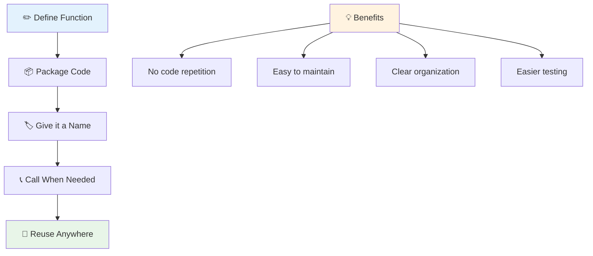

> **הערה:** השתמשתם ב-**שיטות** לאורך כל השיעורים האלה. `console.log()` היא שיטה – למעשה פונקציה ששייכת לאובייקט `console`. ההבדל העיקרי הוא ששיטות מחוברות לאובייקטים, בעוד שפונקציות עומדות בפני עצמן. מפתחים רבים משתמשים במונחים הללו לסירוגין בשיחות יומיומיות.

### שיטות עבודה מומלצות לפונקציות

הנה כמה טיפים שיעזרו לכם לכתוב פונקציות מעולות:

- תנו לפונקציות שלכם שמות ברורים ותיאוריים – העתיד שלכם יודה לכם!
- השתמשו ב-**camelCasing** לשמות מרובי מילים (כמו `calculateTotal` במקום `calculate_total`)
- שמרו על כל פונקציה ממוקדת בביצוע דבר אחד בצורה טובה

## העברת מידע לפונקציה

הפונקציה שלנו `displayGreeting` מוגבלת – היא יכולה להציג רק "Hello, world!" לכולם. פרמטרים מאפשרים לנו להפוך את הפונקציות לגמישות ושימושיות יותר.

**פרמטרים** פועלים כמו משתנים שמאפשרים לכם להכניס ערכים שונים בכל פעם שאתם משתמשים בפונקציה. כך, אותה פונקציה יכולה לעבוד עם מידע שונה בכל קריאה.

אתם מציינים פרמטרים בתוך הסוגריים כשאתם מגדירים את הפונקציה, ומפרידים בין פרמטרים מרובים באמצעות פסיקים:

```javascript
function name(param, param2, param3) {

}
```

כל פרמטר פועל כמו משתנה – כשמישהו קורא לפונקציה שלכם, הוא יספק ערכים אמיתיים שיתווספו למקומות הללו.

בואו נעדכן את פונקציית הברכה שלנו כדי לקבל את שמו של מישהו:

```javascript
function displayGreeting(name) {
  const message = `Hello, ${name}!`;
  console.log(message);
}
```

שימו לב איך אנחנו משתמשים בתווי חזרה (`` ` ``) וב-`${}` כדי להכניס את השם ישירות להודעה שלנו – זה נקרא תבנית טקסט, וזה דרך מאוד שימושית לבנות מחרוזות עם משתנים משולבים.

עכשיו כשאנחנו קוראים לפונקציה שלנו, אנחנו יכולים להעביר כל שם:

```javascript
displayGreeting('Christopher');
// displays "Hello, Christopher!" when run
```

JavaScript לוקחת את המחרוזת `'Christopher'`, מקצה אותה לפרמטר `name`, ויוצרת את ההודעה האישית "Hello, Christopher!"

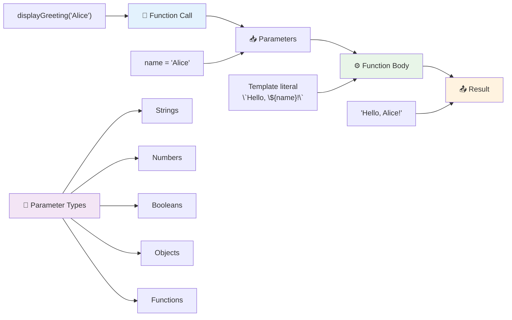

## ערכי ברירת מחדל

מה אם נרצה להפוך כמה פרמטרים לאופציונליים? כאן נכנסים לתמונה ערכי ברירת מחדל!

נניח שאנחנו רוצים שאנשים יוכלו להתאים אישית את מילת הברכה, אבל אם הם לא מציינים אחת, נשתמש ב-"Hello" כברירת מחדל. תוכלו להגדיר ערכי ברירת מחדל באמצעות סימן השווה, בדיוק כמו הגדרת משתנה:

```javascript
function displayGreeting(name, salutation='Hello') {
  console.log(`${salutation}, ${name}`);
}
```

כאן, `name` עדיין נדרש, אבל ל-`salutation` יש ערך גיבוי של `'Hello'` אם אף אחד לא מספק ברכה אחרת.

עכשיו אנחנו יכולים לקרוא לפונקציה הזו בשתי דרכים שונות:

```javascript
displayGreeting('Christopher');
// displays "Hello, Christopher"

displayGreeting('Christopher', 'Hi');
// displays "Hi, Christopher"
```

בקריאה הראשונה, JavaScript משתמשת ב-"Hello" כברירת מחדל מכיוון שלא ציינו ברכה. בקריאה השנייה, היא משתמשת ב-"Hi" המותאם שלנו במקום. גמישות זו הופכת פונקציות למתאימות לתרחישים שונים.

### 🎛️ **בדיקת שליטה בפרמטרים: הפיכת פונקציות לגמישות**

**בדקו את הבנתכם בפרמטרים:**
- מה ההבדל בין פרמטר לארגומנט?
- מדוע ערכי ברירת מחדל שימושיים בתכנות בעולם האמיתי?
- האם תוכלו לנבא מה קורה אם תעבירו יותר ארגומנטים מפרמטרים?

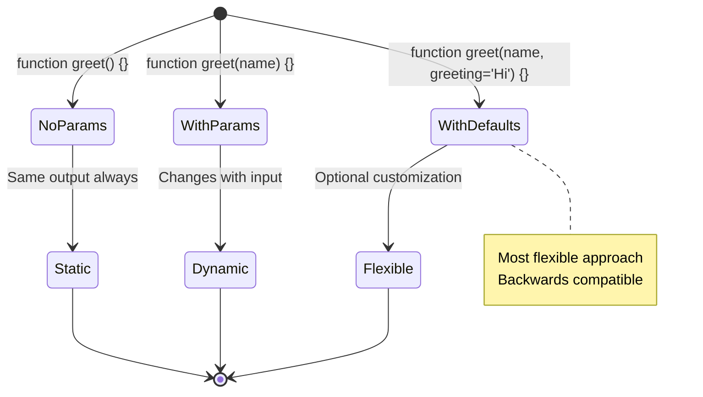

> **טיפ מקצועי**: פרמטרים עם ערכי ברירת מחדל הופכים את הפונקציות שלכם לידידותיות יותר למשתמש. משתמשים יכולים להתחיל במהירות עם ערכים סבירים, אך עדיין להתאים אישית כשצריך!

## ערכי החזרה

הפונקציות שלנו עד כה רק הדפיסו הודעות לקונסולה, אבל מה אם תרצו שפונקציה תחשב משהו ותיתן לכם את התוצאה בחזרה?

כאן נכנסים לתמונה **ערכי החזרה**. במקום רק להציג משהו, פונקציה יכולה להחזיר לכם ערך שתוכלו לשמור במשתנה או להשתמש בו בחלקים אחרים של הקוד שלכם.

כדי לשלוח ערך בחזרה, אתם משתמשים במילת המפתח `return` ואחריה כל מה שתרצו להחזיר:

```javascript
return myVariable;
```

הנה משהו חשוב: כשפונקציה מגיעה להצהרת `return`, היא מיד מפסיקה לרוץ ושולחת את הערך הזה בחזרה למי שקרא לה.

בואו נשנה את פונקציית הברכה שלנו כדי להחזיר את ההודעה במקום להדפיס אותה:

```javascript
function createGreetingMessage(name) {
  const message = `Hello, ${name}`;
  return message;
}
```

עכשיו במקום להדפיס את הברכה, הפונקציה הזו יוצרת את ההודעה ומחזירה אותה אלינו.

כדי להשתמש בערך המוחזר, אנחנו יכולים לשמור אותו במשתנה בדיוק כמו כל ערך אחר:

```javascript
const greetingMessage = createGreetingMessage('Christopher');
```

עכשיו `greetingMessage` מכיל "Hello, Christopher" ואנחנו יכולים להשתמש בו בכל מקום בקוד שלנו – להציג אותו בדף אינטרנט, לכלול אותו באימייל או להעביר אותו לפונקציה אחרת.

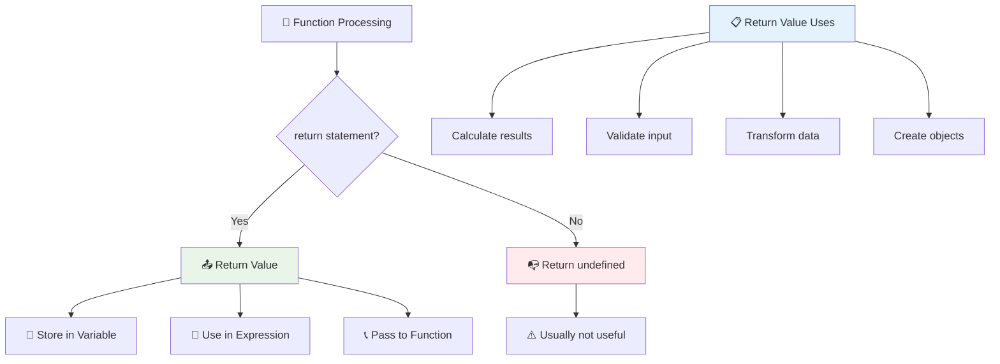

### 🔄 **בדיקת ערכי החזרה: קבלת תוצאות בחזרה**

**העריכו את הבנתכם בערכי החזרה:**
- מה קורה לקוד אחרי הצהרת `return` בפונקציה?
- מדוע החזרת ערכים לעיתים קרובות עדיפה על הדפסה לקונסולה?
- האם פונקציה יכולה להחזיר סוגים שונים של ערכים (מחרוזת, מספר, בוליאני)?

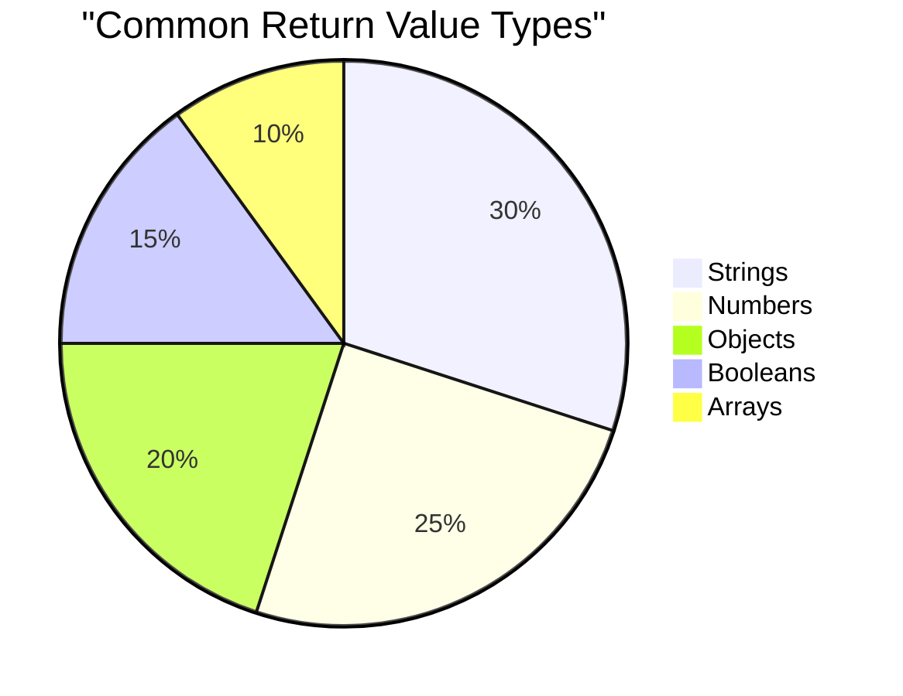

> **תובנה מרכזית**: פונקציות שמחזירות ערכים הן יותר גמישות כי הקורא מחליט מה לעשות עם התוצאה. זה הופך את הקוד שלכם ליותר מודולרי וניתן לשימוש חוזר!

## פונקציות כפרמטרים לפונקציות

פונקציות יכולות לעבור כפרמטרים לפונקציות אחרות. למרות שהרעיון הזה עשוי להיראות מורכב בהתחלה, זו תכונה חזקה שמאפשרת דפוסי תכנות גמישים.

דפוס זה נפוץ מאוד כשאתם רוצים לומר "כשמשהו קורה, עשו את הדבר הזה." לדוגמה, "כששעון העצר מסתיים, הריצו את הקוד הזה" או "כשמשתמש לוחץ על הכפתור, קראו לפונקציה הזו."

בואו נסתכל על `setTimeout`, שהיא פונקציה מובנית שמחכה זמן מסוים ואז מריצה קוד. אנחנו צריכים לומר לה איזה קוד להריץ – מקרה שימוש מושלם להעברת פונקציה!

נסו את הקוד הזה – אחרי 3 שניות, תראו הודעה:

```javascript
function displayDone() {
  console.log('3 seconds has elapsed');
}
// timer value is in milliseconds
setTimeout(displayDone, 3000);
```

שימו לב איך אנחנו מעבירים את `displayDone` (בלי סוגריים) ל-`setTimeout`. אנחנו לא קוראים לפונקציה בעצמנו – אנחנו מוסרים אותה ל-`setTimeout` ואומרים "קראו לזה בעוד 3 שניות."

### פונקציות אנונימיות

לפעמים אתם צריכים פונקציה רק למשהו אחד ולא רוצים לתת לה שם. חשבו על זה – אם אתם משתמשים בפונקציה רק פעם אחת, למה להעמיס על הקוד שלכם עם שם נוסף?

JavaScript מאפשרת לכם ליצור **פונקציות אנונימיות** – פונקציות בלי שמות שתוכלו להגדיר בדיוק במקום שבו אתם צריכים אותן.

הנה איך אנחנו יכולים לשכתב את דוגמת השעון שלנו באמצעות פונקציה אנונימית:

```javascript
setTimeout(function() {
  console.log('3 seconds has elapsed');
}, 3000);
```

זה משיג את אותה תוצאה, אבל הפונקציה מוגדרת ישירות בתוך קריאת `setTimeout`, מה שמבטל את הצורך בהצהרת פונקציה נפרדת.

### פונקציות חץ

JavaScript מודרנית מציעה דרך אפילו קצרה יותר לכתוב פונקציות שנקראת **פונקציות חץ**. הן משתמשות ב-`=>` (שנראה כמו חץ – הבנתם?) והן מאוד פופולריות בקרב מפתחים.

פונקציות חץ מאפשרות לכם לדלג על מילת המפתח `function` ולכתוב קוד יותר תמציתי.

הנה דוגמת השעון שלנו באמצעות פונקציית חץ:

```javascript
setTimeout(() => {
  console.log('3 seconds has elapsed');
}, 3000);
```

ה-`()` הוא המקום שבו פרמטרים היו נכנסים (ריק במקרה הזה), ואז מגיע החץ `=>`, ולבסוף גוף הפונקציה בסוגריים מסולסלים. זה מספק את אותה פונקציונליות עם תחביר יותר תמציתי.

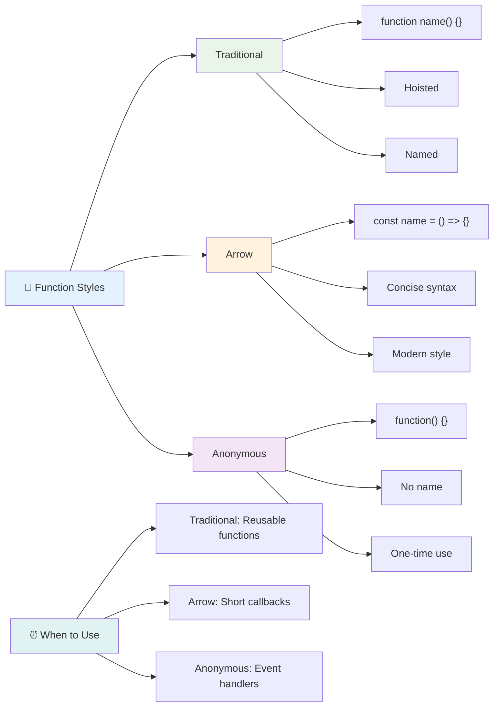

### מתי להשתמש בכל אסטרטגיה

מתי כדאי להשתמש בכל גישה? הנחיה מעשית: אם תשתמשו בפונקציה מספר פעמים, תנו לה שם והגדירו אותה בנפרד. אם היא מיועדת לשימוש ספציפי אחד, שקלו פונקציה אנונימית. גם פונקציות חץ וגם תחביר מסורתי הם בחירות תקפות, אם כי פונקציות חץ נפוצות בקוד JavaScript מודרני.

### 🎨 **בדיקת שליטה בסגנונות פונקציה: בחירת התחביר הנכון**

**בדקו את הבנתכם בתחביר:**
- מתי ייתכן שתעדיפו פונקציות חץ על פני תחביר פונקציה מסורתי?
- מה היתרון העיקרי של פונקציות אנונימיות?
- האם תוכלו לחשוב על מצב שבו פונקציה עם שם עדיפה על פני פונקציה אנונימית?

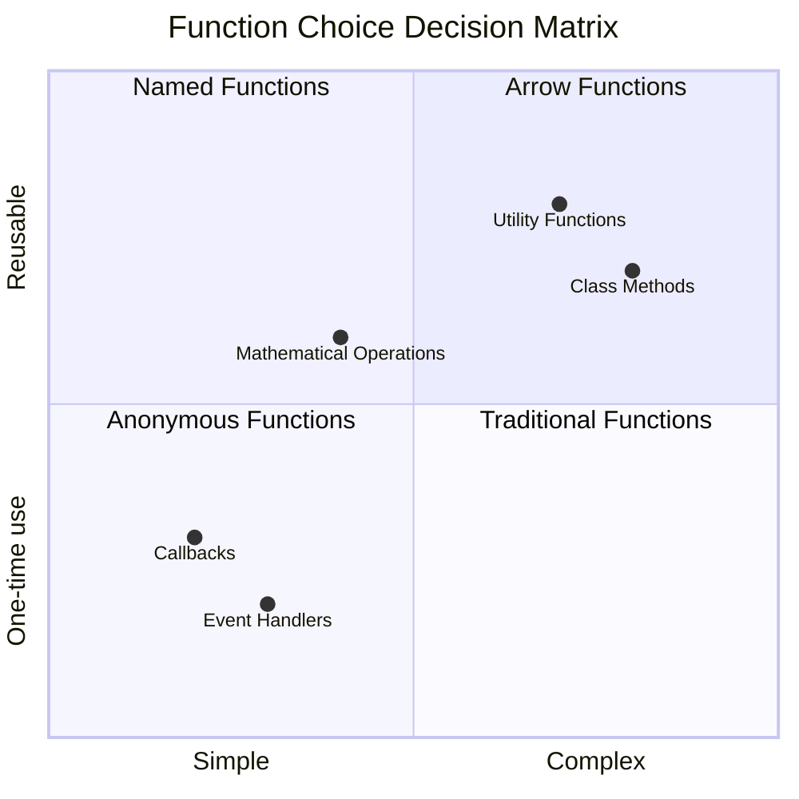

> **מגמה מודרנית**: פונקציות חץ הופכות לבחירה ברירת מחדל עבור מפתחים רבים בגלל התחביר התמציתי שלהן, אבל לפונקציות מסורתיות עדיין יש מקום!

---

## 🚀 אתגר

האם תוכלו להסביר במשפט אחד את ההבדל בין פונקציות לשיטות? נסו!

## אתגר סוכן GitHub Copilot 🚀

השתמשו במצב סוכן כדי להשלים את האתגר הבא:

**תיאור:** צרו ספריית כלי עזר של פונקציות מתמטיות שמדגימה מושגים שונים של פונקציות שנלמדו בשיעור זה, כולל פרמטרים, ערכי ברירת מחדל, ערכי החזרה ופונקציות חץ.

**הנחיה:** צרו קובץ JavaScript בשם `mathUtils.js` שמכיל את הפונקציות הבאות:
1. פונקציה `add` שמקבלת שני פרמטרים ומחזירה את הסכום שלהם
2. פונקציה `multiply` עם ערכי פרמטר ברירת מחדל (הפרמטר השני ברירת מחדל ל-1)
3. פונקציית חץ `square` שמקבלת מספר ומחזירה את הריבוע שלו
4. פונקציה `calculate` שמקבלת פונקציה אחרת כפרמטר ושני מספרים, ואז מיישמת את הפונקציה על המספרים
5. הדגימו קריאה לכל פונקציה עם מקרי בדיקה מתאימים

למדו עוד על [מצב סוכן](https://code.visualstudio.com/blogs/2025/02/24/introducing-copilot-agent-mode) כאן.

## שאלון אחרי השיעור
[שאלון אחרי השיעור](https://ff-quizzes.netlify.app)

## סקירה ולימוד עצמי

שווה [לקרוא עוד על פונקציות חץ](https://developer.mozilla.org/docs/Web/JavaScript/Reference/Functions/Arrow_functions), שכן הן משמשות יותר ויותר בקוד. תרגלו כתיבת פונקציה, ואז שכתבו אותה עם התחביר הזה.

## משימה

[Fun with Functions](assignment.md)

---

## 🧰 **סיכום ערכת הכלים של פונקציות JavaScript שלכם**

```mermaid
graph TD
    A["🎯 JavaScript Functions"] --> B["📋 Function Declaration"]
    A --> C["📥 Parameters"]
    A --> D["📤 Return Values"]
    A --> E["🎨 Modern Syntax"]
    
    B --> B1["function name() {}"]
    B --> B2["Descriptive naming"]
    B --> B3["Reusable code blocks"]
    
    C --> C1["Input data"]
    C --> C2["Default values"]
    C --> C3["Multiple parameters"]
    
    D --> D1["return statement"]
    D --> D2["Exit function"]
    D --> D3["Pass data back"]
    
    E --> E1["Arrow functions: () =>"]
    E --> E2["Anonymous functions"]
    E --> E3["Higher-order functions"]
    
    F["⚡ Key Benefits"] --> F1["Code reusability"]
    F --> F2["Better organization"]
    F --> F3["Easier testing"]
    F --> F4["Modular design"]
    
    style A fill:#e3f2fd
    style B fill:#e8f5e8
    style C fill:#fff3e0
    style D fill:#f3e5f5
    style E fill:#e0f2f1
    style F fill:#fce4ec
```

---

## 🚀 ציר הזמן לשליטה בפונקציות JavaScript שלכם

### ⚡ **מה תוכלו לעשות ב-5 הדקות הבאות**
- [ ] כתבו פונקציה פשוטה שמחזירה את המספר האהוב עליכם
- [ ] צרו פונקציה עם שני פרמטרים שמוסיפה אותם יחד
- [ ] נסה להמיר פונקציה מסורתית לסינטקס של פונקציית חץ  
- [ ] תרגל את האתגר: הסבר את ההבדל בין פונקציות לבין שיטות  

### 🎯 **מה ניתן להשיג בשעה זו**  
- [ ] השלם את המבחן שלאחר השיעור וסקור מושגים מבלבלים  
- [ ] בנה את ספריית כלי המתמטיקה מאתגר GitHub Copilot  
- [ ] צור פונקציה שמשתמשת בפונקציה אחרת כפרמטר  
- [ ] תרגל כתיבת פונקציות עם פרמטרים ברירת מחדל  
- [ ] נסה להשתמש בתבניות טקסט (template literals) בערכי החזרה של פונקציות  

### 📅 **שליטה בפונקציות לאורך השבוע**  
- [ ] השלם את המשימה "כיף עם פונקציות" עם יצירתיות  
- [ ] בצע רפקטור לקוד שחוזר על עצמו לפונקציות שניתן לעשות בהן שימוש חוזר  
- [ ] בנה מחשבון קטן באמצעות פונקציות בלבד (ללא משתנים גלובליים)  
- [ ] תרגל פונקציות חץ עם שיטות מערך כמו `map()` ו-`filter()`  
- [ ] צור אוסף של פונקציות עזר למשימות נפוצות  
- [ ] למד על פונקציות מסדר גבוה ועל מושגים בתכנות פונקציונלי  

### 🌟 **השינוי שלך לאורך החודש**  
- [ ] שלוט במושגים מתקדמים בפונקציות כמו סגירות וטווחים  
- [ ] בנה פרויקט שמשתמש רבות בהרכבת פונקציות  
- [ ] תרום לקוד פתוח על ידי שיפור תיעוד פונקציות  
- [ ] למד מישהו אחר על פונקציות וסגנונות סינטקס שונים  
- [ ] חקור פרדיגמות תכנות פונקציונלי ב-JavaScript  
- [ ] צור ספרייה אישית של פונקציות לשימוש חוזר בפרויקטים עתידיים  

### 🏆 **בדיקת אלוף הפונקציות הסופית**  

**חגוג את השליטה שלך בפונקציות:**  
- מהי הפונקציה הכי שימושית שיצרת עד כה?  
- איך לימוד על פונקציות שינה את הדרך שבה אתה חושב על ארגון קוד?  
- איזה סינטקס של פונקציות אתה מעדיף ולמה?  
- איזו בעיה בעולם האמיתי היית פותר על ידי כתיבת פונקציה?  

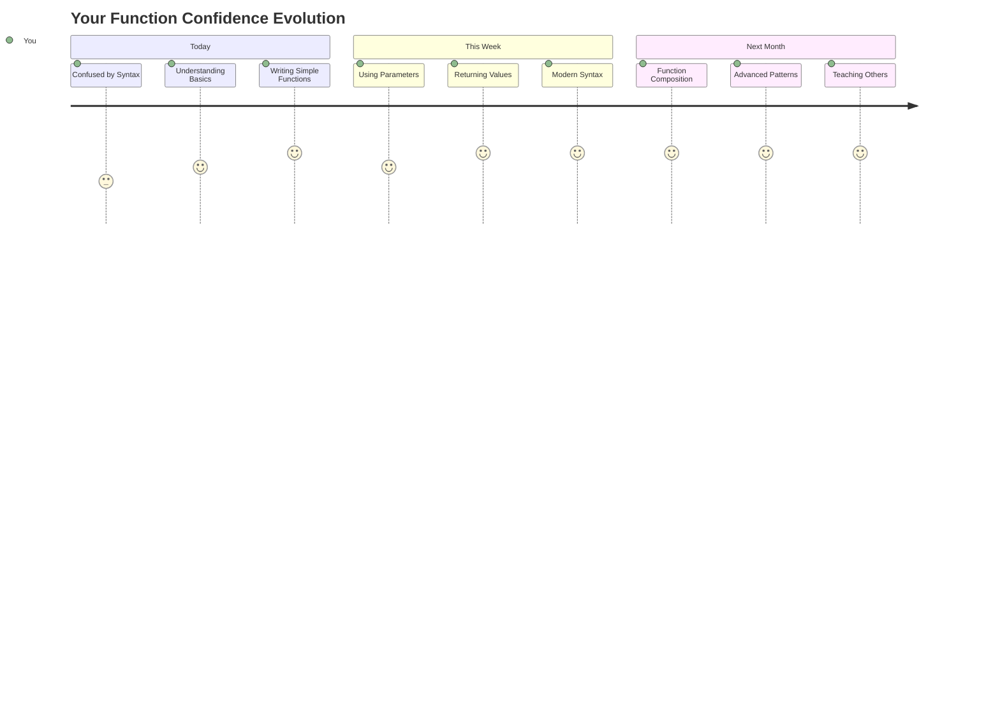
  
> 🎉 **שליטה באחד המושגים החזקים ביותר בתכנות!** פונקציות הן אבני הבניין של תוכניות גדולות יותר. כל אפליקציה שתבנה אי פעם תשתמש בפונקציות כדי לארגן, לעשות שימוש חוזר ולבנות את הקוד. עכשיו אתה מבין איך לארוז לוגיקה לרכיבים שניתן לעשות בהם שימוש חוזר, מה שהופך אותך למתכנת יעיל ואפקטיבי יותר. ברוך הבא לעולם התכנות המודולרי! 🚀  

---

**הצהרת אחריות**:  
מסמך זה תורגם באמצעות שירות תרגום AI [Co-op Translator](https://github.com/Azure/co-op-translator). למרות שאנו שואפים לדיוק, יש לקחת בחשבון שתרגומים אוטומטיים עשויים להכיל שגיאות או אי דיוקים. המסמך המקורי בשפתו המקורית צריך להיחשב כמקור סמכותי. עבור מידע קריטי, מומלץ להשתמש בתרגום מקצועי אנושי. איננו אחראים לאי הבנות או לפרשנויות שגויות הנובעות משימוש בתרגום זה.